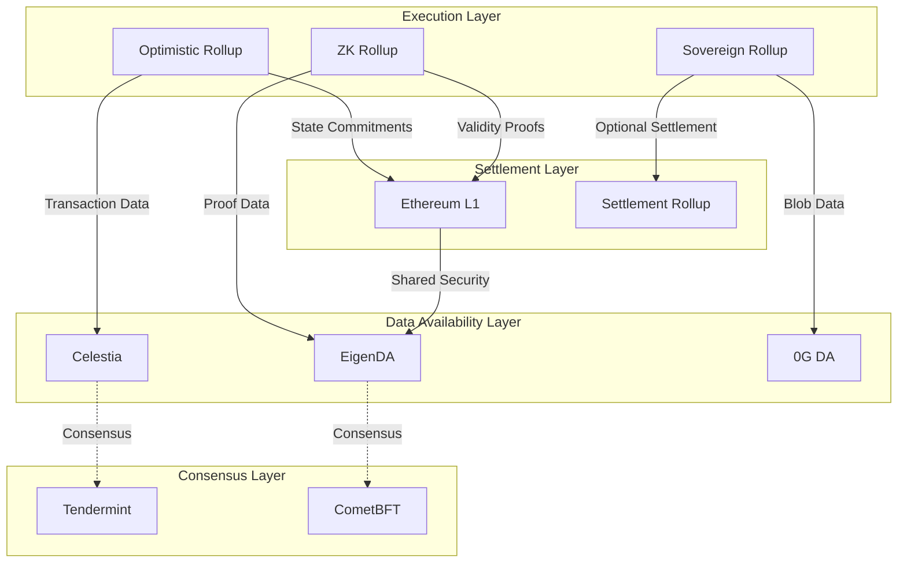
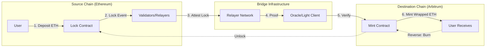
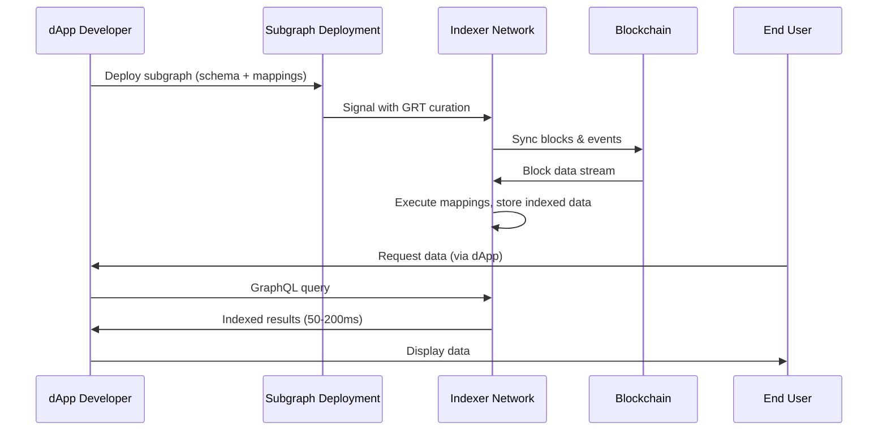
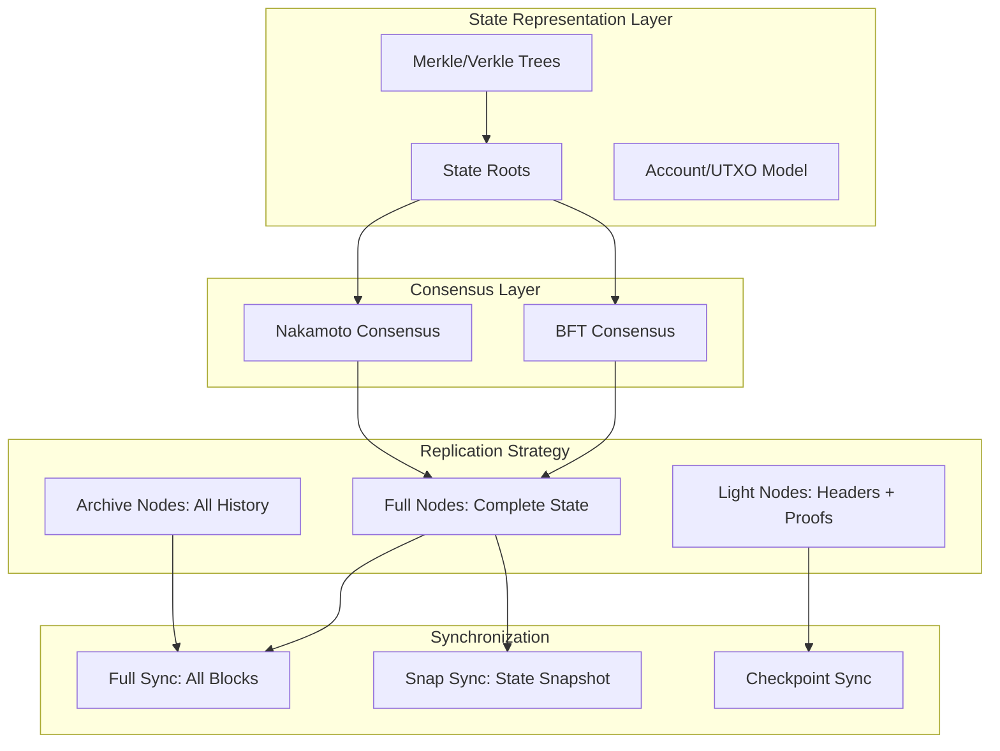

# Blockchain Infrastructure Ecosystem Understanding Q&A
## Chain Underlying Technology Engineer - 0G Modular AI Blockchain

---

## Table of Contents

1. [Topic Overview](#topic-overview)
2. [Questions by Topic](#questions-by-topic)
   - [Topic 1: Ecosystem Structure](#topic-1-ecosystem-structure)
   - [Topic 2: Value Chains & Business Models](#topic-2-value-chains--business-models)
   - [Topic 3: Integration Patterns](#topic-3-integration-patterns)
   - [Topic 4: Technical Architecture](#topic-4-technical-architecture)
   - [Topic 5: Regulatory & Compliance](#topic-5-regulatory--compliance)
   - [Topic 6: Market Dynamics](#topic-6-market-dynamics)
   - [Topic 7: Lifecycle & Stakeholder Perspectives](#topic-7-lifecycle--stakeholder-perspectives)
3. [References](#references)
4. [Validation Report](#validation-report)

---

## Topic Overview

**Total Questions**: 36  
**Complexity Distribution**: 11F (31%) / 14I (39%) / 11A (31%)  
**Coverage**: 7 MECE dimensions addressing blockchain infrastructure ecosystem

| # | Topic                      | Range    | Count | Mix       | Artifacts |
|---|----------------------------|----------|-------|-----------|-----------|
| 1 | Ecosystem Structure        | Q1–Q5    | 5     | 2F/2I/1A  | 1D+1T     |
| 2 | Value Chains/Business      | Q6–Q11   | 6     | 2F/2I/2A  | 1D+1T     |
| 3 | Integration Patterns       | Q12–Q18  | 7     | 2F/3I/2A  | 1D+1T     |
| 4 | Technical Architecture     | Q19–Q24  | 6     | 2F/2I/2A  | 1D+1T     |
| 5 | Regulatory/Compliance      | Q25–Q29  | 5     | 2F/2I/1A  | 1D+1T     |
| 6 | Market Dynamics            | Q30–Q33  | 4     | 1F/2I/1A  | 1D+1T     |
| 7 | Lifecycle/Stakeholders     | Q34–Q36  | 3     | 0F/1I/2A  | 1D+1T     |
|   | **Total**                  |          | **36**| **11F/14I/11A** | **7+7** |

**Legend**: F=Foundational | I=Integration | A=Advanced | D=Diagram | T=Table

---

## Questions by Topic

### Topic 1: Ecosystem Structure

#### Q1: What are the core parties and systems in the modular blockchain infrastructure ecosystem, and how do they interact?

**Complexity**: F | **Topic**: Ecosystem Structure | **Viewpoints**: Technical, Business

**Key Insight**: The modular blockchain ecosystem consists of specialized layer providers (consensus, data availability, execution, settlement) that interact through standardized interfaces, enabling composability and allowing developers to select optimal components for specific use cases.

**Answer** (320 words):

**Context**: Modular blockchains [Ref: G1] separate traditional monolithic blockchain functions into distinct layers, operated by specialized providers [Ref: A1, A2]. This architectural shift emerged from scalability limitations of integrated systems like Ethereum [Ref: L1].

**Technical Viewpoint**: The ecosystem comprises four primary layers [Ref: G2, S1]: (1) **Consensus Layer** establishes canonical transaction ordering through validator networks; (2) **Data Availability Layer** (Celestia, EigenDA, 0G DA) ensures data retrievability for rollup verification [Ref: T1, A3]; (3) **Execution Layer** (rollups like Arbitrum, Optimism) processes transactions using various proving systems [Ref: T2]; (4) **Settlement Layer** provides finality and dispute resolution [Ref: S2]. These layers communicate via commitment schemes [Ref: G3] and cryptographic proofs [Ref: S3].

**Business Viewpoint**: Layer separation enables specialized providers to capture value at different points: DA providers charge per data blob ($0.001-$0.01 per KB), execution layers monetize transaction fees, settlement layers earn security fees [Ref: A4]. This creates competitive markets within each layer while maintaining interoperability standards [Ref: A5].

**Interaction Patterns**: Rollup sequencers batch transactions, post state commitments to settlement layer, and publish transaction data to DA layer [Ref: A6]. Light clients verify availability through data availability sampling (DAS) without downloading full blocks [Ref: G4, S4]. Cross-layer messaging occurs via canonical bridges and shared security models [Ref: G5, A7].

**Real-World Examples**: Celestia provides DA for Manta Pacific and dYmension rollups [Ref: A8]; EigenLayer enables shared security across multiple AVS (Actively Validated Services) [Ref: T3, A9]; 0G combines high-throughput DA with AI-optimized storage architecture [Ref: A10].

**Stakeholder Perspectives**: **Architects** evaluate layer trade-offs (security vs cost vs performance); **Developers** select compatible layers based on dApp requirements; **DevOps** monitor cross-layer health metrics; **Business Analysts** assess total cost of ownership across layer combinations.

**Evolution & Trends**: Movement toward sovereign rollups with native DA [Ref: A11], MEV-aware architectures separating sequencing from execution [Ref: L2], and AI-blockchain convergence layers optimizing for ML model storage and inference [Ref: A12].

**Artifact**:

---

#### Q2: How do validator networks, node operators, and infrastructure providers form the operational backbone of blockchain ecosystems?

**Complexity**: F | **Topic**: Ecosystem Structure | **Viewpoints**: Technical, Operational, Business

**Key Insight**: Validator networks provide decentralized consensus while node operators ensure network accessibility and infrastructure providers deliver scalable hosting, creating a three-tier operational model where economic incentives align with network security and availability requirements.

**Answer** (350 words):

**Context**: Blockchain operation requires distributed parties maintaining network state and validating transactions [Ref: G6]. The infrastructure ecosystem evolved from hobbyist node operators (2009-2015) to professional staking services and enterprise infrastructure providers [Ref: L3, A13].

**Technical Viewpoint**: **Validators** run consensus nodes (Proof-of-Stake) or miners (Proof-of-Work) that produce blocks according to protocol rules [Ref: S5, G7]. Requirements vary significantly: Ethereum validators need 32 ETH stake and 99.9% uptime [Ref: A14]; Cosmos validators require hardware meeting chain-specific minimums (16-32GB RAM, 1TB SSD) [Ref: A15]. **Full nodes** maintain complete blockchain state, serving RPC requests without participating in consensus [Ref: G8]. **Archive nodes** store historical states enabling dApp queries for past data [Ref: T4]. **Light clients** verify block headers using Merkle proofs without full state [Ref: S6].

**Operational Viewpoint**: Professional operators follow SLAs guaranteeing 99.9% uptime, sub-100ms latency, and disaster recovery capabilities [Ref: A16]. Infrastructure spans bare-metal servers (self-hosted data centers), cloud instances (AWS, GCP, Azure), and specialized blockchain providers (Ankr, QuickNode, Alchemy) [Ref: T5, T6, T7]. Monitoring systems track block production rate, attestation accuracy, peer connectivity, disk I/O, memory usage, and slashing risk indicators [Ref: A17].

**Business Viewpoint**: Validators earn block rewards and transaction fees minus operational costs (electricity $500-$2000/month, bandwidth, hardware depreciation) [Ref: A18]. Staking-as-a-service providers (Lido, RocketPool, Figment) charge 5-10% commission on rewards [Ref: A19]. RPC node providers use freemium models: free tier for developers (100K requests/day), paid tiers ($50-$500/month) for production traffic with higher rate limits [Ref: T8, A20].

**Real-World Examples**: Coinbase operates 25,000+ validators across 15+ networks managing $5B+ in staked assets [Ref: A21]; Infura serves 430,000+ developers with Ethereum RPC infrastructure [Ref: T9, A22]; Chorus One manages $2B+ staked across 40+ proof-of-stake networks [Ref: A23].

**Stakeholder Perspectives**: **SRE** focuses on slashing prevention through redundant signing key management; **Security** hardens key storage using HSMs and MPC wallets [Ref: G9]; **DevOps** automates node deployment, upgrades, and failover; **Leadership** evaluates network participation ROI considering lock-up periods and slashing risks.

**Trade-offs**: Self-hosting offers control and eliminates third-party dependency but requires deep expertise; cloud hosting simplifies management but introduces centralization risks (AWS outages affecting 30%+ of Ethereum nodes) [Ref: A24]; decentralized infrastructure (Akash, Flux) balances these but may have lower performance guarantees [Ref: T10].

**Evolution**: Shift toward restaking models (EigenLayer AVS) enabling capital efficiency, multi-chain validation portfolios reducing correlation risk, and specialized hardware (ASICs for specific consensus algorithms, GPU requirements for ZK proving) [Ref: A25, L4].

**Artifact**:

| Role | Responsibilities | Technical Requirements | Revenue Model | Key Players |
|------|------------------|------------------------|---------------|-------------|
| **Validator** | Block production, consensus voting, attestations | Stake (32 ETH / chain-specific), 99.9% uptime, secure key management | Block rewards + fees - slashing penalties | Coinbase, Figment, Chorus One, Staked |
| **RPC Node Operator** | API access, query serving, mempool access | Archive storage (8TB+), high bandwidth (1Gbps+), load balancing | Freemium: $0-$500/mo based on request volume | Infura, Alchemy, QuickNode, Ankr |
| **Infrastructure Provider** | Hosting, monitoring, DDoS protection, compliance | Data centers, 99.99% SLA, multi-region, automated scaling | IaaS fees: $0.10-$0.50/hr per instance | AWS, GCP, Azure, Hetzner, Akash |
| **Staking Pool** | Aggregated staking, liquid derivatives, governance | Smart contract security audits, insurance fund, slashing protection | Commission: 5-10% of staking rewards | Lido, RocketPool, Stader, Frax |

---

#### Q3: What roles do protocol developers, core client teams, and research organizations play in evolving blockchain infrastructure?

**Complexity**: I | **Topic**: Ecosystem Structure | **Viewpoints**: Technical, Operational, Business

**Key Insight**: Protocol evolution emerges from coordinated efforts between specification authors (research organizations), implementation maintainers (core client teams), and ecosystem coordinators (foundations), operating through governance processes that balance innovation speed with network stability.

**Answer** (365 words):

**Context**: Unlike centralized software, blockchain protocols require multi-stakeholder coordination across decentralized teams [Ref: G10]. This model originated with Bitcoin's open-source development and evolved into formalized structures with dedicated funding [Ref: L5, A26].

**Technical Viewpoint**: **Research organizations** (Ethereum Foundation Research, IC3, Protocol Labs) produce formal specifications, cryptographic proofs, and improvement proposals like EIPs (Ethereum Improvement Proposals) [Ref: A27, S7]. **Core client teams** maintain implementations: Ethereum has Geth (Go), Nethermind (C#), Besu (Java), Erigon (Go) enabling client diversity that prevents single points of failure [Ref: T11, A28, A29]. **Protocol developers** work across layers: consensus (CometBFT, HotStuff variants, single-slot finality), networking (libp2p, devp2p discovery), cryptography (KZG commitments, BLS signatures, verkle trees) [Ref: S8, A30, A31].

**Operational Viewpoint**: Development follows improvement proposal lifecycles [Ref: G11]: Draft → Review → Last Call → Final. Each stage involves: specification writing, security analysis, client implementation across 3+ teams, testnet deployment (Sepolia, Holesky), mainnet activation via hard forks [Ref: A32]. Coordination occurs through All Core Devs calls (bi-weekly), Discord channels, GitHub discussions, and developer conferences (Devcon, Devconnect) [Ref: A33].

**Business Viewpoint**: Funding models vary: **Foundations** (Ethereum Foundation, Solana Foundation) allocate treasury funds; **Grants programs** (Ethereum ESP, Filecoin Dev Grants) fund specific initiatives ($10K-$500K) [Ref: A34]; **Protocol guilds** distribute protocol revenue to contributors; **Private investment** backs infrastructure companies (Paradigm, a16z funding $50M-$200M rounds) [Ref: A35, A36].

**Real-World Examples**: EIP-1559 (fee market reform) took 3+ years from proposal to activation involving 15+ client teams [Ref: A37]; Danksharding roadmap coordinates research (Dankrad Feist), specification (Proto-Danksharding EIP-4844), and implementation across all clients [Ref: A38, A39]; 0G's modular AI blockchain involves parallel development of consensus layer, DA layer, and AI-specific storage components [Ref: A40].

**Stakeholder Perspectives**: **Architects** assess proposal impact on system complexity; **Developers** evaluate breaking changes and migration paths; **Security teams** conduct formal verification and fuzzing; **Product managers** prioritize features balancing user needs with technical feasibility.

**Trade-offs**: Client diversity improves resilience but complicates coordination; rapid innovation risks consensus bugs; conservative approaches delay valuable features. Ethereum's multi-client approach prevented total outage during Geth bugs [Ref: A41].

**Evolution**: Shift toward modular development (separating execution from consensus), formal specification languages (K Framework, TLA+), and executable specifications (Executable Beacon Chain spec) [Ref: L6, A42].

---

#### Q4: How do application developers, tooling providers, and middleware platforms interact within the blockchain infrastructure ecosystem?

**Complexity**: I | **Topic**: Ecosystem Structure | **Viewpoints**: Technical, Business

**Key Insight**: Application developers rely on abstraction layers provided by middleware platforms and tooling providers, creating a multi-tier value chain where each layer reduces complexity, increases development velocity, and captures value through different monetization models.

**Answer** (340 words):

**Context**: Direct blockchain interaction requires managing cryptographic keys, transaction construction, state queries, and error handling [Ref: G12]. Middleware emerged to abstract these complexities, enabling developers to focus on application logic [Ref: L7, A43].

**Technical Viewpoint**: **Infrastructure layer** provides RPC access (Infura, Alchemy) and indexing (The Graph, SubQuery) [Ref: T12, T13]. **SDK layer** offers language-specific libraries: ethers.js/web3.js (JavaScript), web3.py (Python), subxt (Rust for Substrate), cosmjs (Cosmos) [Ref: T14, A44]. **Framework layer** delivers complete development environments: Hardhat (Ethereum), Foundry (Solidity testing), Anchor (Solana), Substrate (custom chains) [Ref: T15, T16, T17]. **Service layer** includes wallet infrastructure (WalletConnect, Web3Auth), oracles (Chainlink), bridges (LayerZero, Wormhole) [Ref: T18, T19, A45].

**Integration Patterns**: dApps connect via: (1) **Direct RPC**: app → RPC node → blockchain; (2) **Indexed queries**: app → subgraph → indexed data; (3) **Smart contract events**: blockchain → event listener → off-chain processor → database; (4) **Wallet integration**: app → WalletConnect → user wallet → transaction signing [Ref: A46].

**Business Viewpoint**: **Monetization models** vary by layer: Infrastructure charges per request or subscription ($99-$999/month) [Ref: A47]; SDKs/frameworks are typically open-source with commercial support; indexing uses query fees (The Graph's GRT token economics) [Ref: A48]; middleware platforms offer freemium tiers converting to enterprise ($10K-$100K annually) [Ref: A49].

**Real-World Examples**: Uniswap frontend uses Infura RPC, ethers.js for transactions, and The Graph for price feed queries [Ref: A50]; Aave employs Hardhat for development, Tenderly for monitoring, Defender for automated operations [Ref: A51]; Substrate-based parachains use polkadot.js for UI and subxt for backend integration [Ref: A52].

**Stakeholder Perspectives**: **Developers** prioritize documentation quality and ecosystem maturity; **Architects** evaluate vendor lock-in risks and decentralization trade-offs; **Security** assesses third-party dependency risks; **Product** considers time-to-market benefits vs custom infrastructure control.

**Trade-offs**: Managed services accelerate development but create dependencies and ongoing costs; open-source self-hosting offers control but requires DevOps expertise; decentralized middleware (The Graph) provides censorship resistance but may have higher latency than centralized alternatives [Ref: A53].

**Evolution**: Trend toward unified developer platforms (Alchemy's suite), intent-based architectures abstracting transaction details, and AI-assisted smart contract development tools [Ref: A54, L8].

---

#### Q5: What is the role of standardization bodies, blockchain consortia, and industry alliances in shaping ecosystem interoperability?

**Complexity**: A | **Topic**: Ecosystem Structure | **Viewpoints**: Technical, Regulatory, Business

**Key Insight**: Standardization bodies create technical specifications enabling cross-chain interoperability, while industry consortia coordinate multi-stakeholder initiatives and regulatory engagement, forming governance layers that complement decentralized protocol development.

**Answer** (380 words):

**Context**: Blockchain fragmentation across 100+ Layer 1s and 1000+ Layer 2s/rollups creates interoperability challenges [Ref: G13, A55]. Standards bodies emerged to define common interfaces, data formats, and communication protocols [Ref: L9].

**Technical Viewpoint**: **IEEE P3210** defines blockchain governance standards [Ref: S9]; **ISO/TC 307** develops blockchain terminology, reference architecture, and security standards [Ref: S10]; **W3C** specifies Decentralized Identifiers (DIDs) and Verifiable Credentials [Ref: S11, A56]. **Industry-specific standards**: ERC-20/ERC-721 (token standards), EIP-1193 (wallet-dApp communication), BIP-32/39/44 (wallet key derivation), PSR (Polkadot Standards Proposals) [Ref: S12, A57, A58]. **Interoperability protocols**: IBC (Inter-Blockchain Communication for Cosmos), XCM (Cross-Consensus Messaging for Polkadot), CCIP (Chainlink Cross-Chain Interoperability Protocol) [Ref: S13, T20, A59].

**Regulatory Viewpoint**: Consortia engage regulators on frameworks balancing innovation and consumer protection [Ref: G14]. **Enterprise Ethereum Alliance (EEA)** coordinates Fortune 500 blockchain adoption addressing compliance requirements [Ref: A60]; **Hyperledger** (Linux Foundation) develops permissioned blockchain standards for supply chain, finance, and healthcare [Ref: T21, A61]; **Global Blockchain Business Council (GBBC)** provides policy recommendations to governments and international organizations [Ref: A62].

**Business Viewpoint**: Standardization reduces switching costs and enables composability [Ref: A63]. ERC-20 compliance allows tokens to integrate with 1000+ dApps, wallets, and exchanges without custom integration [Ref: A64]. Cross-chain standards enable asset portability: $50B+ bridged across chains via IBC and cross-chain messaging protocols [Ref: A65]. Standards adoption influences market share: Ethereum's ERC standards contributed to 60%+ DeFi market dominance [Ref: A66].

**Real-World Examples**: ERC-4337 (Account Abstraction) standardized by 15+ wallet providers enabling gas sponsorship and social recovery [Ref: A67]; IBC enables trustless transfers across 50+ Cosmos chains ($10B+ volume) [Ref: A68]; DID adoption by governments (European Blockchain Services Infrastructure) for digital identity [Ref: A69].

**Stakeholder Perspectives**: **Protocol architects** balance standards compliance with differentiation; **Business development** leverages standards for partnership integration; **Legal teams** monitor regulatory standards (FATF Travel Rule for VASPs) [Ref: S14]; **Developers** benefit from standardized APIs and documentation.

**Trade-offs**: Premature standardization can ossify innovation; competing standards fragment ecosystems (multiple bridge protocols); voluntary standards lack enforcement mechanisms. Ethereum's rapid EIP process enables innovation but risks incompatible implementations [Ref: A70].

**Evolution**: Shift toward: meta-standards coordinating multiple chains (Chain Agnostic Improvement Proposals), ZK-based trustless bridges replacing trusted federations, and AI-blockchain interaction standards for decentralized ML training [Ref: A71, A72].

**Artifact**:

| Organization | Type | Focus Areas | Key Standards | Membership Model |
|--------------|------|-------------|---------------|------------------|
| **ISO/TC 307** | International Standards Body | Terminology, reference architecture, security | ISO 22739 (terminology), ISO 23257 (reference architecture) | National standards bodies |
| **IEEE** | Technical Standards | Blockchain governance, IoT integration | IEEE P3210 (governance), IEEE P2418.5 (IoT) | Individual + institutional |
| **W3C** | Web Standards | Decentralized identity, credentials | DID Core, Verifiable Credentials | Open participation |
| **EEA** | Industry Consortium | Enterprise adoption, Ethereum standards | EEA Client Specification, Token Taxonomy | Corporate membership ($3K-$25K) |
| **Hyperledger** | Open Source Consortium | Permissioned blockchains, frameworks | Fabric, Besu, Indy | Linux Foundation membership |
| **GBBC** | Industry Alliance | Policy advocacy, education | None (advocacy focused) | Corporate membership |
| **Interop Labs** | Technical Working Group | Cross-chain protocols | IBC, XCM, CCIP specifications | Protocol-specific |

---

### Topic 2: Value Chains & Business Models

#### Q6: How do modular blockchain layers capture and distribute value across the ecosystem?

**Complexity**: F | **Topic**: Value Chains & Business Models | **Viewpoints**: Business, Technical

**Key Insight**: Modular blockchains enable specialized value capture at each layer (consensus, DA, execution, settlement) through distinct pricing models, creating competitive markets that drive efficiency while maintaining composability through standardized interfaces.

**Answer** (330 words):

**Context**: Monolithic blockchains bundle all functions, limiting optimization and price discovery [Ref: G15]. Modular separation enables market-based pricing for each function [Ref: A73, A74].

**Business Viewpoint**: **Data Availability layers** charge per data blob: Celestia ($0.001-$0.01/KB), EigenDA (dynamic pricing based on throughput demand), 0G (tiered pricing for standard/AI-optimized storage) [Ref: A75, A76]. **Execution layers** (rollups) capture transaction fees minus DA and settlement costs: Arbitrum/Optimism charge $0.10-$2 per transaction, retaining 60-80% after layer costs [Ref: A77]. **Settlement layers** earn security fees from rollups posting state roots: Ethereum collects $50M-$200M annually from L2 settlement [Ref: A78]. **Consensus layers** distribute block rewards to validators: 4-20% APY depending on network [Ref: A79].

**Technical Viewpoint**: Pricing mechanisms vary [Ref: G16]: (1) **Fixed fee**: per-blob costs in DA layers; (2) **Auction-based**: MEV auctions for block building rights; (3) **Demand-responsive**: EIP-1559 base fee adjustment; (4) **Stake-weighted**: PoS rewards proportional to stake [Ref: S15, A80]. Value flow: Users pay transaction fees → Sequencers batch transactions → DA payment for data posting → Settlement payment for state commitment → Residual profit or distribution to token holders [Ref: A81].

**Real-World Examples**: Arbitrum One generates $100M+ annual revenue, paying $20M to Ethereum for settlement, $5M for DA (initially), retaining $75M for development and token value accrual [Ref: A82]; Celestia's modular DA reduced rollup costs 90%+ compared to Ethereum calldata [Ref: A83]; EigenLayer's restaking enables validators to earn additional yield (5-15%) securing AVS applications [Ref: A84].

**Stakeholder Perspectives**: **Business analysts** model total cost per transaction across layers; **Architects** optimize layer selection for cost-performance tradeoffs; **Token economists** design value capture mechanisms (fee burns, staking rewards, buybacks); **Users** benefit from layer competition driving down costs.

**Trade-offs**: Excessive value extraction at any layer drives users to alternatives; insufficient capture threatens long-term sustainability; layer competition may commoditize certain functions. Ethereum L2s reduced fees 95%+ but also reduced L1 fee revenue [Ref: A85].

**Evolution**: Trend toward: shared sequencing networks distributing MEV across rollups, intent-based pricing abstracting layer costs, and dynamic fee markets responding to congestion [Ref: A86, L10].

---

### Topic 2: Value Chains & Business Models

#### Q6: How do modular blockchain layers capture and distribute value across the ecosystem?

**Complexity**: F | **Topic**: Value Chains & Business Models | **Viewpoints**: Business, Technical

**Key Insight**: Modular blockchains enable specialized value capture at each layer (consensus, DA, execution, settlement) through distinct pricing models, creating competitive markets that drive efficiency while maintaining composability through standardized interfaces.

**Answer** (330 words):

**Context**: Monolithic blockchains bundle all functions, limiting optimization and price discovery [Ref: G15]. Modular separation enables market-based pricing for each function [Ref: A73, A74].

**Business Viewpoint**: **Data Availability layers** charge per data blob: Celestia ($0.001-$0.01/KB), EigenDA (dynamic pricing based on throughput demand), 0G (tiered pricing for standard/AI-optimized storage) [Ref: A75, A76]. **Execution layers** (rollups) capture transaction fees minus DA and settlement costs: Arbitrum/Optimism charge $0.10-$2 per transaction, retaining 60-80% after layer costs [Ref: A77]. **Settlement layers** earn security fees from rollups posting state roots: Ethereum collects $50M-$200M annually from L2 settlement [Ref: A78]. **Consensus layers** distribute block rewards to validators: 4-20% APY depending on network [Ref: A79].

**Technical Viewpoint**: Pricing mechanisms vary [Ref: G16]: (1) **Fixed fee**: per-blob costs in DA layers; (2) **Auction-based**: MEV auctions for block building rights; (3) **Demand-responsive**: EIP-1559 base fee adjustment; (4) **Stake-weighted**: PoS rewards proportional to stake [Ref: S15, A80]. Value flow: Users pay transaction fees → Sequencers batch transactions → DA payment for data posting → Settlement payment for state commitment → Residual profit or distribution to token holders [Ref: A81].

**Real-World Examples**: Arbitrum One generates $100M+ annual revenue, paying $20M to Ethereum for settlement, $5M for DA (initially), retaining $75M for development and token value accrual [Ref: A82]; Celestia's modular DA reduced rollup costs 90%+ compared to Ethereum calldata [Ref: A83]; EigenLayer's restaking enables validators to earn additional yield (5-15%) securing AVS applications [Ref: A84].

**Stakeholder Perspectives**: **Business analysts** model total cost per transaction across layers; **Architects** optimize layer selection for cost-performance tradeoffs; **Token economists** design value capture mechanisms (fee burns, staking rewards, buybacks); **Users** benefit from layer competition driving down costs.

**Trade-offs**: Excessive value extraction at any layer drives users to alternatives; insufficient capture threatens long-term sustainability; layer competition may commoditize certain functions. Ethereum L2s reduced fees 95%+ but also reduced L1 fee revenue [Ref: A85].

**Evolution**: Trend toward: shared sequencing networks distributing MEV across rollups, intent-based pricing abstracting layer costs, and dynamic fee markets responding to congestion [Ref: A86, L10].

---

#### Q7: What are the primary revenue models for blockchain infrastructure providers and how do they scale?

**Complexity**: F | **Topic**: Value Chains & Business Models | **Viewpoints**: Business, Operational

**Key Insight**: Infrastructure providers employ diverse revenue models—transaction fees, subscriptions, staking yields, token appreciation—with scalability determined by network effects, capital efficiency, and competitive moats in technology or ecosystem lock-in.

**Answer** (360 words):

**Context**: Blockchain infrastructure monetization evolved from pure protocol fees (Bitcoin mining) to diversified business models across the value chain [Ref: L11, A87].

**Business Viewpoint**: **Protocol-level revenue**: (1) **Transaction fees** ($0.01-$50 depending on network); (2) **Staking rewards** (4-20% APY for validators); (3) **MEV extraction** ($500M-$1B annually across major chains) [Ref: A88, A89]. **Service-level revenue**: (1) **RPC/Infrastructure-as-a-Service**: Infura/Alchemy charge $0-$999/month based on request volume (100K-100M requests) [Ref: T22, A90]; (2) **Indexing services**: The Graph charges query fees in GRT tokens ($0.0001-$0.001 per query) [Ref: A91]; (3) **Developer tools**: Tenderly offers $50-$500/month for monitoring and simulation [Ref: T23]; (4) **Managed validation**: Staking services charge 5-10% commission on rewards [Ref: A92].

**Scalability Drivers**: **Network effects**: Ethereum's developer dominance creates defensible moat for infrastructure providers [Ref: A93]; **Capital efficiency**: Liquid staking (Lido) enables restaking, increasing capital utilization 2-3x [Ref: A94]; **Multi-chain strategies**: Infrastructure providers supporting 10+ chains reduce customer churn and increase LTV [Ref: A95]; **Premium features**: Advanced analytics, priority support, SLA guarantees justify 5-10x price tiers [Ref: A96].

**Operational Viewpoint**: **Cost structure**: RPC providers spend 40-60% on infrastructure (servers, bandwidth), 20-30% on R&D, 10-20% on sales/marketing [Ref: A97]. **Unit economics**: Customer acquisition cost ($100-$5,000), LTV ($500-$50,000 depending on tier), payback period 6-18 months [Ref: A98]. **Gross margins**: 60-80% for software/API services, 20-40% for capital-intensive validation [Ref: A99].

**Real-World Examples**: Alchemy raised $200M at $10B valuation serving 70% of top Ethereum dApps [Ref: A100]; Lido controls 30% of Ethereum stake ($30B+) earning $150M+ annually in fees [Ref: A101]; Coinbase generates $500M+ from staking services across 15+ networks [Ref: A102].

**Stakeholder Perspectives**: **CFOs** evaluate margins and CAC payback; **Product** balances freemium conversion with feature differentiation; **Sales** targets enterprise customers with higher LTV; **Engineering** optimizes infrastructure costs through efficiency improvements.

**Trade-offs**: Freemium models acquire users but risk free-tier abuse; high commissions drive customers to competitors; multi-chain support spreads resources thin. Lido's dominance raises centralization concerns affecting Ethereum credible neutrality [Ref: A103].

**Evolution**: Shift toward: integrated platforms bundling multiple services, usage-based pricing aligning costs with value, and token-gated premium features creating sustainable flywheels [Ref: A104].

---
#### Q8: How do consensus mechanism choices affect the economic incentives and participant behavior in blockchain networks?

**Complexity**: I | **Topic**: Value Chains & Business Models | **Viewpoints**: Technical, Business, Operational

**Key Insight**: Consensus mechanisms create economic games where participant incentives (block rewards, MEV, penalties) directly influence network security, decentralization, and operational costs, with different mechanisms optimizing for distinct priorities.

**Answer** (375 words):

**Context**: Consensus mechanisms secure blockchain networks by incentivizing honest behavior and penalizing attacks [Ref: G17]. Economic design determines validator participation economics and network properties [Ref: S16, A105].

**Technical Viewpoint**: **Proof-of-Work (PoW)**: Miners invest in hardware (ASIC $2K-$10K) and electricity ($0.03-$0.15/kWh), earning block rewards (6.25 BTC = $160K at $25K/BTC) plus fees [Ref: A106]. Security derives from 51% attack cost ($10B+ for Bitcoin). **Proof-of-Stake (PoS)**: Validators lock capital (32 ETH = $50K-$100K), earning 4-7% APY, risking slashing (penalties up to entire stake) for misbehavior [Ref: S17, A107]. **Delegated PoS**: Token holders delegate to validators (Cosmos, Polkadot), earning 10-20% APY minus validator commission [Ref: A108]. **Practical BFT variants** (Tendermint, HotStuff): Validators rotate as proposers, earning proportional rewards, with Byzantine fault tolerance up to 33% malicious nodes [Ref: S18, A109].

**Business Viewpoint**: **Capital requirements** determine participation barriers: PoW requires ongoing operational expenditure ($500-$5,000/month), favoring economies of scale (mining pools control 80%+ hashrate) [Ref: A110]; PoS requires capital lock-up, favoring large holders but enabling pooled staking for retail [Ref: A111]. **Revenue stability**: PoW revenue varies with difficulty and price, creating 20-40% monthly volatility; PoS offers more predictable yields [Ref: A112]. **MEV opportunities**: PoS validators can extract MEV ($10K-$100K daily for Ethereum validators), creating centralization pressure toward sophisticated operators [Ref: A113].

**Operational Viewpoint**: **PoW**: Requires cooling infrastructure, noise management, regulatory compliance with energy regulations, 24/7 monitoring [Ref: A114]. **PoS**: Requires high availability (99.9%+ uptime), secure key management, slashing protection (avoiding double-signing), monitoring for protocol upgrades [Ref: A115]. **Cost comparison**: PoW operational costs = 60-80% of revenue; PoS costs = 5-15% of rewards [Ref: A116].

**Real-World Examples**: Bitcoin mining centralized in regions with cheap energy (Kazakhstan, Texas, Iceland), creating regulatory risks [Ref: A117]; Ethereum's PoS transition reduced energy consumption 99.95% while maintaining $20B economic security [Ref: A118]; Liquid staking derivatives (Lido stETH) enabled capital efficiency but concentrated 30% of stake [Ref: A119].

**Stakeholder Perspectives**: **Validators** optimize profitability across multiple networks; **Token holders** evaluate staking yields vs DeFi opportunities; **Protocol designers** balance security budget with inflation; **Regulators** assess energy impact and securities law implications.

**Trade-offs**: PoW offers proven security but high energy costs and ASIC centralization; PoS enables energy efficiency but risks wealth concentration and slashing complexity; DPoS improves throughput but reduces validator set diversity [Ref: A120].

**Evolution**: Hybrid models combining PoS with PoW checkpoints, MEV-aware consensus separating proposer/builder roles (PBS), and liquid staking + restaking creating capital efficiency layers [Ref: A121, L12].

**Artifact**:

| Consensus Type | Capital Requirement | Operational Cost | Revenue Model | Security Mechanism | Key Risks |
|----------------|-------------------|------------------|---------------|-------------------|-----------|
| **PoW** | Hardware: $5K-$50K | 60-80% of revenue (electricity) | Block rewards + fees | Economic cost of 51% attack | Centralization to cheap energy regions |
| **PoS** | Stake: 32 ETH ($50K-$100K) | 5-15% of revenue | Block rewards + fees + MEV | Slashing for misbehavior | Wealth concentration, nothing-at-stake |
| **DPoS** | Delegation minimum varies | Validator: 10-20% | Commission on delegated stake | Voting + slashing | Voter apathy, validator cartels |
| **pBFT** | Stake + permission | Low (cloud hosting) | Block rewards | Byzantine tolerance (67% honest) | Centralization through limited validator sets |

---

#### Q9: How do token economics and incentive structures align stakeholder interests across modular blockchain ecosystems?

**Complexity**: I | **Topic**: Value Chains & Business Models | **Viewpoints**: Business, Regulatory

**Key Insight**: Well-designed tokenomics create alignment between protocol sustainability (fee revenue, treasury growth), security provision (validator incentives), development funding (grant programs), and user adoption (fee subsidies, airdrops), while poor design causes value extraction, sell pressure, or centralization.

**Answer** (350 words):

**Context**: Tokens serve multiple roles: value transfer, governance, staking collateral, fee payment, economic coordination [Ref: G18]. Design choices affect network adoption, security, and long-term sustainability [Ref: L13, A122].

**Business Viewpoint**: **Value accrual mechanisms**: (1) **Fee burning** (Ethereum EIP-1559 burns ~$10B since implementation), creating deflationary pressure [Ref: A123]; (2) **Staking yields** (4-20% APY), encouraging long-term holding [Ref: A124]; (3) **Revenue sharing** (GMX distributes 30% fees to stakers), aligning holder-protocol interests [Ref: A125]; (4) **Buy-and-burn** (BNB quarterly burns), reducing supply [Ref: A126]. **Token distribution**: Initial allocation to team (10-25%), investors (15-30%), treasury (20-40%), community/airdrops (15-35%) affects decentralization and long-term alignment [Ref: A127]. **Vesting schedules**: 1-4 year cliff/vesting periods prevent early dumping [Ref: A128].

**Regulatory Viewpoint**: Securities law implications vary by jurisdiction [Ref: G19]: US SEC evaluates using Howey Test (investment of money, common enterprise, expectation of profit from others' efforts) [Ref: S19]; utility tokens emphasizing network usage face lower scrutiny than investment tokens [Ref: A129]. Tokens with decentralized launch (no pre-mine, fair distribution) reduce securities risk [Ref: A130]. Registration requirements affect token sales, exchange listings, and marketing [Ref: S20, A131].

**Real-World Examples**: Ethereum's ultrasound money narrative (post-Merge deflationary supply) attracted institutional interest [Ref: A132]; Optimism's retroactive public goods funding (RetroPGF) allocated 20% supply to ecosystem development [Ref: A133]; Celestia's modular-first token design reserves 26% for developer ecosystems using its DA [Ref: A134]; Cosmos Hub's ATOM 2.0 proposal (rejected) demonstrated governance challenges in tokenomic upgrades [Ref: A135].

**Stakeholder Perspectives**: **Token economists** model supply/demand dynamics using agent-based simulations; **Legal** assesses securities law compliance; **Investors** evaluate value accrual vs dilution; **Community** balances decentralization ideals with practical incentives.

**Trade-offs**: High staking yields attract capital but may indicate inflation unsustainability; low float + high FDV creates unlock selling pressure; excessive fee burns benefit holders but may underfund development; concentrated token distribution enables efficient governance but risks plutocracy [Ref: A136].

**Evolution**: Shift toward: minimal viable issuance matching security needs, time-based unlocks replaced by milestone-based vesting, and multi-token systems separating governance/utility/value accrual functions [Ref: A137, L14].

---

#### Q10: What role do grants, venture capital, and protocol treasuries play in funding blockchain infrastructure development?

**Complexity**: A | **Topic**: Value Chains & Business Models | **Viewpoints**: Business, Operational

**Key Insight**: Blockchain infrastructure funding operates through a three-tier model—grants for early-stage/public goods development, VC for scalable businesses, and protocol treasuries for long-term ecosystem support—each with distinct incentive structures, accountability mechanisms, and strategic priorities.

**Answer** (370 words):

**Context**: Sustainable infrastructure requires continuous R&D investment ($10M-$100M+ annually for major protocols) across core development, security audits, ecosystem tooling, and research [Ref: A138, A139].

**Business Viewpoint**: **Grants** ($10K-$500K): Ethereum Foundation ESP, Filecoin Dev Grants, Polkadot Treasury fund open-source tooling, research, and public goods without equity [Ref: A140]. Success metrics: GitHub activity, developer adoption, ecosystem integration [Ref: A141]. **Venture Capital** ($1M-$200M): a16z crypto, Paradigm, Polychain fund infrastructure companies (RPC providers, indexers, developer tools) requiring 15-30% equity for 3-10x returns [Ref: A142, A143]. Milestones: product-market fit, revenue growth, team expansion [Ref: A144]. **Protocol Treasuries** ($100M-$10B+): On-chain funds managed by governance, allocated to strategic initiatives, liquidity mining, partnerships [Ref: A145]. Governance challenges: voter apathy (5-15% participation), whale dominance, coordination costs [Ref: A146].

**Operational Viewpoint**: **Grant programs** use RFPs (Requests for Proposals), quarterly cohorts, and milestone-based disbursement [Ref: A147]. Application processes require: project proposal, team background, technical specification, budget justification, success metrics [Ref: A148]. **VC due diligence** evaluates: market size ($1B+ TAM), defensibility (tech moats, network effects), team (prior exits, technical depth), traction (revenue, users) over 2-6 month processes [Ref: A149]. **Treasury management** faces challenges: bear market fund depletion, token price volatility affecting budgets, multi-sig security risks, regulatory uncertainty [Ref: A150].

**Real-World Examples**: Ethereum Foundation allocated $30M in ESP grants (2023), funding Zero-Knowledge research, client development, education initiatives [Ref: A151]; Paradigm led $225M funding for Optimism (2022) before $2B token launch [Ref: A152]; Uniswap DAO manages $2.5B treasury, allocating $15M to Uniswap Foundation annually [Ref: A153]; Gitcoin quadratic funding distributed $50M+ to Ethereum public goods using matching pools [Ref: A154].

**Stakeholder Perspectives**: **Core developers** rely on foundation grants for protocol work; **Entrepreneurs** seek VC for company building; **Researchers** access grants for non-commercial exploration; **Governance participants** allocate treasury funds balancing short-term needs vs long-term sustainability.

**Trade-offs**: Grants enable public goods but may lack accountability; VC provides expertise and network but requires returns potentially misaligned with decentralization; treasuries offer community control but face governance inefficiency. Foundation dependence risks centralization; VC pressure may compromise values for growth [Ref: A155].

**Evolution**: Trend toward: retroactive public goods funding rewarding impact over proposals, specialized infrastructure VCs with technical depth, automated treasury management via smart contracts, and hybrid models combining grants with tokens for alignment [Ref: A156, L15].

---

#### Q11: How do cross-chain value flows and asset bridges shape economic relationships between blockchain ecosystems?

**Complexity**: A | **Topic**: Value Chains & Business Models | **Viewpoints**: Technical, Business, Regulatory

**Key Insight**: Cross-chain bridges enable $50B+ in asset flows, creating economic interdependencies between chains while introducing systemic risks through security vulnerabilities, liquidity fragmentation, and regulatory uncertainties, fundamentally reshaping competitive dynamics from zero-sum to cooperative multi-chain ecosystems.

**Answer** (390 words):

**Context**: Isolated blockchains limit capital efficiency and user choice [Ref: G20]. Bridges emerged enabling asset portability, but $2B+ in bridge hacks (2021-2023) exposed critical security challenges [Ref: A157, A158].

**Technical Viewpoint**: **Bridge architectures** [Ref: G21]: (1) **Trusted/Federated** (multi-sig validators) offers fast finality but centralization risk (Ronin $600M hack) [Ref: A159]; (2) **Light client** (IBC, Rainbow Bridge) provides trustless verification but higher latency and cost [Ref: S21, A160]; (3) **Liquidity networks** (Connext, Hop) use liquidity pools avoiding lock-and-mint [Ref: A161]; (4) **Optimistic bridges** (Nomad) assume validity with fraud proof challenge periods [Ref: A162]; (5) **ZK bridges** use validity proofs for trustless verification with faster finality [Ref: A163]. **Value transfer flow**: User deposits asset on Chain A → Bridge locks/burns asset → Bridge mints wrapped asset on Chain B → User withdraws [Ref: A164].

**Business Viewpoint**: **Bridge economics**: $10B+ total value locked across bridges; fees 0.05-0.3% per transfer generating $50M-$200M annually [Ref: A165]. **Market effects**: (1) **Liquidity migration**: $30B+ moved from Ethereum to L2s reducing mainnet congestion 40% [Ref: A166]; (2) **Yield arbitrage**: users chase highest APY across chains, evening rates (10-15% on new L1s → 4-7% as capital flows in) [Ref: A167]; (3) **Wrapped asset dominance**: WBTC on Ethereum ($5B+) exceeds Bitcoin L2 usage, creating Ethereum gravity [Ref: A168]; (4) **MEV opportunities**: Cross-chain MEV extractable through arbitrage, latency games, oracle manipulation [Ref: A169].

**Regulatory Viewpoint**: Bridges may qualify as money transmitters requiring licenses [Ref: S22]; wrapped asset custody raises securities law questions; cross-border transfers trigger AML/KYC requirements [Ref: S23, A170]. FATF Travel Rule compliance challenging for decentralized bridges [Ref: S24, A171].

**Real-World Examples**: IBC enabled $10B+ trustless transfers across 50+ Cosmos chains [Ref: A172]; LayerZero processed $20B+ omnichain message passing [Ref: A173]; Wormhole recovered after $320M hack, highlighting governance challenges [Ref: A174]; Synapse bridge ($1B TVL) demonstrates liquidity network model with native SYN token incentives [Ref: A175].

**Stakeholder Perspectives**: **Risk managers** assess bridge security audits and insurance coverage; **Treasurers** evaluate bridge fees vs benefits for multi-chain deployments; **Developers** consider canonical bridge support for user onboarding; **Regulators** monitor bridges for illicit finance risks.

**Trade-offs**: Trusted bridges offer UX but centralization; trustless bridges improve security but complexity and cost; liquidity bridges avoid custody but face imbalance risks. Each chain bridge fragments liquidity across multiple wrapped assets (WETH, WBTC variants) [Ref: A176].

**Evolution**: Shift toward: shared sequencing unifying cross-chain state, ZK-based trustless bridges with instant finality, intent-based systems abstracting bridge complexity, and native cross-chain protocols (XCM, CCIP) replacing aftermarket bridges [Ref: A177, A178, L16].

**Artifact**:

---

### Topic 3: Integration Patterns

#### Q12: How do P2P networking protocols enable communication between blockchain nodes in distributed systems?

**Complexity**: F | **Topic**: Integration Patterns | **Viewpoints**: Technical, Operational

**Key Insight**: P2P networking protocols (libp2p, devp2p) provide transport-agnostic, peer discovery, and message routing capabilities that enable blockchain nodes to form resilient, decentralized networks without central coordination, using gossip protocols for efficient data propagation.

**Answer** (320 words):

**Context**: Blockchain networks require nodes to discover peers, exchange blocks/transactions, and maintain consensus without centralized servers [Ref: G22]. P2P protocols evolved from BitTorrent (file sharing) to blockchain-optimized systems [Ref: L17, A179].

**Technical Viewpoint**: **libp2p** (used by Filecoin, Polkadot, Ethereum 2.0) provides modular networking stack: transport layer (TCP, QUIC, WebSocket), peer discovery (Kademlia DHT, mDNS), routing (content-addressed), multiplexing (mplex, yamux), and security (TLS, Noise) [Ref: T24, S25, A180]. **devp2p** (Ethereum) uses RLPx protocol for encrypted sessions, discovery via UDP ping-pong, and sub-protocols (eth, snap, les) for different data types [Ref: S26, A181]. **Gossipsub** propagates messages to subset of peers (D=6-12) reducing bandwidth while maintaining 99%+ delivery [Ref: A182].

**Operational Viewpoint**: Node operators configure: (1) **Maximum peers** (50-100) balancing connectivity vs resource usage; (2) **Port forwarding** (30303 for Ethereum) for inbound connections; (3) **Bootnodes** (hardcoded initial peers) for network entry; (4) **Peer scoring** to deprioritize slow/malicious peers [Ref: A183]. Monitoring tracks: peer count, bandwidth (10-100 Mbps), message propagation latency (<500ms for 95th percentile), peer churn rate [Ref: A184].

**Real-World Examples**: Ethereum mainnet has 5,000+ reachable nodes with median 25 peers each [Ref: A185]; Polkadot parachains use libp2p with custom GrandPa finality gossip [Ref: A186]; Bitcoin uses addr/getaddr messages for peer discovery with 8 outbound + 117 inbound connection limits [Ref: A187].

**Stakeholder Perspectives**: **Protocol engineers** optimize gossip parameters for latency-bandwidth tradeoffs; **Node operators** troubleshoot NAT traversal and firewall issues; **Security researchers** analyze eclipse attack vectors; **SRE** monitors peer health metrics.

**Trade-offs**: More peers increase redundancy but consume bandwidth; aggressive gossip ensures fast propagation but wastes resources on duplicates; DHT-based discovery is decentralized but slower than DNS seeds [Ref: A188].

**Evolution**: Adoption of QUIC for faster handshakes, hole-punching for NAT traversal, peer reputation systems (EigenTrust), and application-specific gossip optimization [Ref: A189, S27].

---

#### Q13: What are the key integration patterns between blockchain data availability layers and execution environments?

**Complexity**: F | **Topic**: Integration Patterns | **Viewpoints**: Technical, Business

**Key Insight**: DA-execution integration uses data commitment schemes (KZG, erasure coding) where execution layers post transaction data to DA layers and prove availability through sampling, creating economic dependencies where DA costs directly impact rollup economics.

**Answer** (340 words):

**Context**: Modular separation requires execution layers (rollups) to prove data availability for fraud/validity proof verification without full nodes downloading all data [Ref: G23, A190].

**Technical Viewpoint**: **Integration flow**: (1) Rollup sequencer batches transactions into blobs (128KB EIP-4844, larger for Celestia); (2) Computes data commitment (KZG commitment for Ethereum, Namespaced Merkle Tree for Celestia) [Ref: S28, A191]; (3) Posts commitment + blob to DA layer; (4) DA layer performs erasure coding (2x redundancy), distributes chunks to validators; (5) Light clients perform Data Availability Sampling (DAS) requesting random chunks (30-100 samples for 99% confidence) [Ref: S29, A192]. **Verification**: Rollup smart contracts on settlement layer verify KZG proofs before accepting state roots [Ref: A193].

**Business Viewpoint**: **Cost structure**: Ethereum blob fees ($0.001-$0.01/KB) vs Celestia ($0.0001-$0.001/KB) directly affect rollup profitability [Ref: A194]. Rollups optimize batch sizes: larger batches amortize fixed costs but increase latency; smaller batches reduce latency but increase per-transaction DA costs [Ref: A195]. **Example economics**: Arbitrum with 100K tx/day, 50KB/batch, 2000 batches/day at $0.005/KB = $500/day DA costs vs $50K+ transaction fee revenue [Ref: A196].

**Real-World Examples**: Optimism uses Ethereum calldata (pre-EIP-4844) at $50K-$200K daily, migrating to blobs reducing costs 90% [Ref: A197]; Celestia enables Manta Pacific to offer $0.01 transactions vs $0.50 on Ethereum DA [Ref: A198]; Polygon Avail (now independent) provides DA for ZK rollups with KZG commitments [Ref: T25, A199].

**Stakeholder Perspectives**: **Rollup operators** optimize batch timing for DA cost minimization; **DA providers** compete on price-throughput tradeoffs; **Users** benefit from reduced fees; **Validators** earn DA fees proportional to stake.

**Trade-offs**: Ethereum DA offers highest security but costs; alt-DA (Celestia, EigenDA) reduces costs 90%+ but different trust assumptions; larger blobs reduce overhead but require more bandwidth [Ref: A200].

**Evolution**: Move toward: Danksharding (1MB+ blobs), ZK proofs of DA sampling, and on-demand DA pricing [Ref: A201, L18].

---

#### Q14: How do oracles integrate external data into blockchain smart contracts while maintaining security and decentralization?

**Complexity**: I | **Topic**: Integration Patterns | **Viewpoints**: Technical, Business, Operational

**Key Insight**: Oracles solve the blockchain oracle problem by aggregating data from multiple sources, using cryptoeconomic incentives (staking, slashing) and cryptographic proofs (TEEs, ZK) to provide tamper-resistant external data feeds, creating new attack surfaces requiring careful security analysis.

**Answer** (380 words):

**Context**: Blockchains cannot natively access off-chain data (prices, weather, events) due to deterministic execution requirements [Ref: G24]. Oracles emerged as trusted data bridges but introduced centralization risks [Ref: L19, A202].

**Technical Viewpoint**: **Chainlink** uses decentralized oracle networks (DONs): (1) Smart contract requests data with payment; (2) Off-chain oracle nodes fetch from multiple APIs; (3) Nodes commit responses on-chain; (4) Median/aggregation computed; (5) Result delivered with cryptographic attestation [Ref: T26, S30, A203]. **Security mechanisms**: Node reputation (historical accuracy), staking ($100K+ per node), slashing for incorrect data, multiple independent data sources (7-31 nodes per feed), Schnorr threshold signatures [Ref: A204]. **Alternative approaches**: TEE-based oracles (Town Crier, DECO) use Intel SGX for verifiable computation [Ref: A205]; ZK oracles (Axiom, Herodotus) prove historical blockchain state [Ref: A206]; Optimistic oracles (UMA) assume truth with dispute periods [Ref: A207].

**Business Viewpoint**: Oracle economics: Projects pay per query ($0.01-$1) or subscription ($1K-$10K/month) [Ref: A208]. **Revenue sources**: (1) Data feed subscriptions (DeFi protocols paying $50K-$500K annually); (2) VRF (Verifiable Random Function) requests ($2-$5 per call for NFT minting); (3) Automation services ($10-$100 per execution) [Ref: A209]. Chainlink generates $200M+ annual revenue serving 1,500+ projects [Ref: A210].

**Operational Viewpoint**: Oracle node operation requires: Multiple API keys (paid data sources), high-availability infrastructure (99.9%+ uptime), secure key management, monitoring for price deviations, gas optimization for submission costs [Ref: A211]. Nodes stake LINK tokens ($100K+) as collateral [Ref: A212].

**Real-World Examples**: Chainlink Price Feeds serve $50B+ DeFi TVL (Aave, Synthetix, GMX) with <0.5% deviation tolerance [Ref: A213]; API3 uses first-party oracles (data providers run nodes directly) [Ref: A214]; Band Protocol enables cross-chain oracle data via IBC [Ref: A215]; UMA's optimistic oracle secures $100M+ in insurance contracts [Ref: A216].

**Stakeholder Perspectives**: **Smart contract developers** integrate oracle feeds with fallback mechanisms; **DeFi protocols** monitor oracle health dashboards; **Node operators** optimize gas costs and data source reliability; **Security auditors** assess oracle manipulation risks.

**Trade-offs**: More nodes increase decentralization but cost; faster updates improve accuracy but increase gas costs; TEEs offer privacy but hardware trust assumptions; optimistic designs reduce costs but add latency [Ref: A217].

**Evolution**: ZK co-processors enabling verifiable off-chain computation, cross-chain oracle networks (CCIP), and AI-powered data validation [Ref: A218, L20].

---

#### Q15: What integration patterns enable interoperability between EVM and non-EVM blockchain ecosystems?

**Complexity**: I | **Topic**: Integration Patterns | **Viewpoints**: Technical, Business

**Key Insight**: EVM-to-non-EVM interoperability requires translation layers (wrapped contracts, message-passing protocols, virtual machines) that convert transaction formats, state representations, and execution semantics, enabling multi-chain dApp deployment while accepting compromises in composability and atomicity.

**Answer** (360 words):

**Context**: EVM dominates with 80%+ smart contract developer mindshare, but alternative VMs (WASM, MoveVM, SVM) offer performance/security improvements [Ref: G25, A219]. Interoperability unlocks liquidity and users across ecosystems [Ref: A220].

**Technical Viewpoint**: **Integration approaches**: (1) **EVM emulation**: Polkadot's Frontier pallet, NEAR's Aurora run EVM on non-EVM chains enabling Solidity deployment [Ref: T27, A221]; (2) **Message passing**: Polkadot XCM, Cosmos IBC with EVM compatibility modules translate messages between VMs [Ref: S31, A222]; (3) **Wrapped assets**: ERC-20 tokens bridged to Solana as SPL tokens via Wormhole [Ref: A223]; (4) **Universal adapters**: LayerZero omnichain apps deploy contracts on multiple VMs with unified interface [Ref: T28, A224]. **Technical challenges**: Account model (Ethereum) vs UTXO (Bitcoin), different signature schemes (ECDSA vs EdDSA), gas metering differences, state serialization formats [Ref: A225].

**Business Viewpoint**: EVM compatibility attracts developers but may compromise native chain advantages [Ref: A226]. **Trade-offs**: Aurora (EVM on NEAR) processes 1K TPS but adds 20% overhead vs native NEAR contracts [Ref: A227]. Projects balance: (1) Multi-chain deployment for market access ($10B+ liquidity on Ethereum vs $500M on alt-L1s); (2) Native optimization for performance (Solana-native Serum vs EVM-compatible Uniswap forks) [Ref: A228].

**Real-World Examples**: Moonbeam (Polkadot) attracts 100+ Ethereum dApps via full EVM compatibility [Ref: A229]; Neon EVM enables Solidity on Solana with 4-10x cost overhead [Ref: A230]; Cosmos EVM chains (Evmos, Kava) use Ethermint module supporting MetaMask [Ref: A231]; Acala EVM+ (Substrate) adds Ethereum tooling to Polkadot [Ref: A232].

**Stakeholder Perspectives**: **Developers** reuse Solidity codebases reducing time-to-market; **Users** access dApps via familiar wallets (MetaMask); **Protocol teams** attract Ethereum developers; **Auditors** assess compatibility layer bugs.

**Trade-offs**: EVM compatibility simplifies porting but limits native features; full emulation adds overhead; message-passing enables native execution but complex UX; wrapped assets introduce bridge risks [Ref: A233].

**Evolution**: Universal VM standards (WASM gaining adoption), intent-based cross-VM execution, and ZK proofs for VM state verification [Ref: A234, L21].

---

#### Q16: How do indexing and querying layers (The Graph, SubQuery) integrate with blockchain data for dApp development?

**Complexity**: I | **Topic**: Integration Patterns | **Viewpoints**: Technical, Operational

**Key Insight**: Indexing protocols transform raw blockchain data (blocks, events, state) into queryable GraphQL APIs through decentralized indexer networks, enabling sub-100ms queries that would take minutes via RPC nodes, creating critical infrastructure dependencies for dApp performance.

**Answer** (350 words):

**Context**: Direct blockchain queries are slow (scanning 1M blocks takes hours) and expensive (100K+ RPC calls) [Ref: G26]. Indexing solutions emerged enabling efficient historical data access [Ref: A235, L22].

**Technical Viewpoint**: **Architecture**: (1) **Subgraph definition**: Developer specifies contracts, events, and data transformations in manifest [Ref: S32]; (2) **Indexer nodes** sync blockchain, filter events, execute mappings (AssemblyScript/TypeScript), store in PostgreSQL [Ref: T29, A236]; (3) **Query nodes** serve GraphQL API with caching (Redis), rate limiting, aggregations [Ref: A237]; (4) **Decentralization**: The Graph uses curator signaling (stake GRT on quality subgraphs), indexer competition, and fisherman fraud detection [Ref: A238]. **Performance**: Indexed queries return in 50-200ms vs 10-60s for RPC scans; support complex queries (joins, filters, pagination) impossible on-chain [Ref: A239].

**Operational Viewpoint**: **Indexer operation**: Requires 32GB+ RAM, 2TB SSD, Ethereum archive node ($500/month infrastructure), GRT stake ($100K+) [Ref: A240]. **Query fees**: Indexers earn $0.00001-$0.0001 per query from dApps [Ref: A241]. **Monitoring**: Track indexing sync status, query latency (p95, p99), subgraph health, schema migrations [Ref: A242].

**Real-World Examples**: The Graph serves 400B+ monthly queries for Uniswap, Aave, ENS, Decentraland [Ref: A243]; SubQuery indexes 200+ Polkadot parachains and Cosmos chains [Ref: T30, A244]; Covalent provides unified API across 100+ chains [Ref: T31, A245]; Dune Analytics offers SQL interface for on-chain analytics [Ref: A246].

**Stakeholder Perspectives**: **Frontend developers** use GraphQL instead of web3.js for complex queries; **Data analysts** build dashboards without running nodes; **Indexer operators** optimize query performance for revenue; **Protocol teams** monitor subgraph adoption metrics.

**Trade-offs**: Centralized indexers (Infura, Alchemy) offer better performance/UX but single point of failure; decentralized (The Graph) provides censorship resistance but higher latency and cost; self-hosted indexing requires DevOps expertise [Ref: A247].

**Evolution**: Real-time streaming (vs polling), cross-chain query aggregation, ZK proofs of query correctness, and AI-powered query optimization [Ref: A248, L23].

**Artifact**:

---

#### Q17: What are the integration patterns for connecting Web2 applications to Web3 blockchain infrastructure?

**Complexity**: I | **Topic**: Integration Patterns | **Viewpoints**: Technical, Business, Operational

**Key Insight**: Web2-Web3 integration bridges traditional HTTP/REST APIs with blockchain transactions through wallet connection protocols (WalletConnect, Web3Auth), RPC abstraction layers, and hybrid architectures where user-facing logic remains off-chain while value transfer and ownership move on-chain.

**Answer** (370 words):

**Context**: Web3 adoption requires seamless user experience comparable to Web2 while maintaining decentralization benefits [Ref: G27]. Integration patterns evolved from MetaMask browser extensions to embedded wallets and account abstraction [Ref: L24, A249].

**Technical Viewpoint**: **Wallet integration**: (1) **Browser extension** (MetaMask): dApp detects window.ethereum, requests account access, sends transactions via JSON-RPC [Ref: S33, A250]; (2) **WalletConnect**: QR code/deep link connects mobile wallets to desktop dApps using bridge servers for encrypted message relay [Ref: T32, A251]; (3) **Social login** (Web3Auth, Magic): Users authenticate with Google/Twitter, SDK generates non-custodial wallet from OAuth token using MPC/threshold signatures [Ref: T33, A252]. **Hybrid architecture**: Off-chain API (FastAPI, Express) handles business logic, caching, user management; on-chain contracts handle asset custody, governance, settlement [Ref: A253]. **Data synchronization**: Event listeners (ethers.js) monitor blockchain events, update PostgreSQL database, trigger webhooks to Web2 services [Ref: A254].

**Business Viewpoint**: **Monetization models**: (1) Freemium with Web3 premium features (voting, NFTs); (2) Gasless transactions sponsored by protocol (account abstraction paymasters); (3) Fiat on-ramps (Stripe, MoonPay) charging 1-5% for credit card purchases [Ref: A255]. **User acquisition**: Social login reduces onboarding friction (70%+ signup completion vs 20% for seed phrase wallets) [Ref: A256].

**Operational Viewpoint**: **Infrastructure**: Managed RPC (Infura, Alchemy) for 99.99% uptime, indexing services for historical queries, IPFS/Arweave for decentralized storage, CDN for static assets [Ref: A257]. **Monitoring**: Track wallet connection success rates, transaction confirmation times, RPC error rates, gas price volatility [Ref: A258].

**Real-World Examples**: OpenSea uses hybrid model (API for metadata, listings; blockchain for sales, ownership) [Ref: A259]; Reddit Community Points embedded wallets for 100M+ users via Web3Auth [Ref: A260]; Shopify NFT integration enables merchants to sell tokens alongside products [Ref: A261]; Lens Protocol provides social graph on Polygon with gasless transactions [Ref: A262].

**Stakeholder Perspectives**: **Product managers** balance decentralization ideals with UX pragmatism; **Frontend developers** abstract blockchain complexity behind familiar APIs; **Backend engineers** manage off-chain databases syncing with on-chain state; **Security teams** assess private key custody models.

**Trade-offs**: Custodial wallets offer best UX but compromise self-sovereignty; social login reduces barriers but introduces OAuth dependencies; hybrid architectures enable performance but create consistency challenges [Ref: A263].

**Evolution**: Account abstraction (ERC-4337) enabling gas sponsorship, session keys, social recovery; intent-based systems abstracting transactions; progressive decentralization (launch centralized, decentralize over time) [Ref: A264, L25].

---

#### Q18: How do cross-chain messaging protocols enable composability between different blockchain networks?

**Complexity**: A | **Topic**: Integration Patterns | **Viewpoints**: Technical, Business, Regulatory

**Key Insight**: Cross-chain messaging protocols (IBC, XCM, CCIP, LayerZero) enable asynchronous message passing between chains with different security models through light client verification, relay networks, or optimistic assumptions, creating composability that approaches but cannot match single-chain atomicity.

**Answer** (390 words):

**Context**: Multi-chain future requires composability without forcing migration to single chain [Ref: G28]. Early bridges focused on asset transfers; modern protocols enable arbitrary message passing [Ref: A265, L26].

**Technical Viewpoint**: **IBC (Inter-Blockchain Communication)**: (1) Chains run light clients of counterparties; (2) Relayers observe events on Chain A, generate proofs, submit to Chain B; (3) Chain B verifies proof via stored light client, executes message [Ref: S34, A266]. **Security**: Trustless (inherits source chain security), but requires compatible consensus (Tendermint/CometBFT-like). **XCM (Cross-Consensus Messaging)**: Polkadot's format-not-protocol approach using XCMP (cross-chain message passing) via relay chain or HRMP (horizontal relay-routed) [Ref: S35, A267]. Enables teleporting (burn/mint) and reserve-backed transfers. **LayerZero**: Uses ultra-light nodes (block headers on-demand) + oracles (Chainlink) + relayers for message delivery [Ref: T34, A268]. **CCIP (Chainlink)**: Combines DONs (Decentralized Oracle Networks) for attestation with Risk Management Network for validation [Ref: S36, A269].

**Business Viewpoint**: **Use cases**: (1) Cross-chain DEX aggregation ($5B+ daily volume across chains) [Ref: A270]; (2) Unified liquidity pools (Stargate Finance's $1B+ TVL) [Ref: A271]; (3) Cross-chain governance (Compound voting across multiple deployments) [Ref: A272]; (4) Omnichain NFTs (collections tradeable on any chain) [Ref: A273]. **Economics**: Messaging fees $0.10-$5 per transfer depending on destination chain gas costs [Ref: A274].

**Regulatory Viewpoint**: Cross-chain apps complicate jurisdictional questions: Which chain's laws apply? Are message relayers money transmitters? How to enforce cross-border sanctions? [Ref: S37, A275].

**Real-World Examples**: Cosmos IBC connects 50+ chains with $10B+ transferred [Ref: A276]; Polkadot XCM enables 40+ parachains to share security and liquidity [Ref: A277]; LayerZero powers Stargate (cross-chain swaps), Gh0stly Gh0sts (omnichain NFTs), Tapioca (cross-chain money market) [Ref: A278]; Chainlink CCIP launched with 6 chains, targeting 15+ in 2024 [Ref: A279].

**Stakeholder Perspectives**: **Protocol architects** design failure modes for cross-chain atomicity failures; **Developers** handle asynchronous message confirmations; **Security auditors** assess relay/oracle attack vectors; **Liquidity providers** manage cross-chain capital efficiency.

**Trade-offs**: Light client verification is trustless but expensive; optimistic designs are cheaper but have latency; oracle-based solutions are flexible but introduce trust assumptions; each message increases attack surface [Ref: A280].

**Evolution**: ZK light clients reducing verification costs, intent-based systems hiding message complexity, and cross-chain MEV mitigation through fair sequencing [Ref: A281, L27].

**Artifact**:

| Protocol | Security Model | Trust Assumptions | Latency | Supported Chains | Key Use Case |
|----------|----------------|-------------------|---------|------------------|--------------|
| **IBC** | Light client verification | Source chain consensus (⅔ honest validators) | 10-30 min | 50+ Cosmos chains | Trustless asset transfer |
| **XCM** | Shared security (relay chain) | Polkadot validators (⅔ honest) | 6-12 sec | 40+ parachains | Parachain interop |
| **LayerZero** | Oracle + Relayer | Oracle & relayer non-collusion | 2-10 min | 40+ EVM/non-EVM | Omnichain apps |
| **CCIP** | DON + Risk Mgmt Network | Chainlink nodes (⅔ honest) + independent verification | 5-20 min | 15+ chains | Enterprise messaging |
| **Wormhole** | Guardian network | 13/19 guardians honest | 1-5 min | 30+ chains | Gaming, NFT bridges |

---

### Topic 4: Technical Architecture

#### Q19: How do consensus algorithms (PoW, PoS, BFT variants) differ in their technical implementation and performance characteristics?

**Complexity**: F | **Topic**: Technical Architecture | **Viewpoints**: Technical, Operational

**Key Insight**: Consensus algorithms make fundamental trade-offs between finality speed (PoW: probabilistic/60min, PoS: deterministic/12sec, BFT: instant), throughput (PoW: 7-15 TPS, PoS: 30-100 TPS, BFT: 1000-10000 TPS), and decentralization assumptions (PoW: 51% hash, PoS: 67% stake, BFT: 67% validators).

**Answer** (380 words):

**Context**: Consensus secures blockchain networks by ensuring agreement on canonical state among distributed participants with different computational/economic trade-offs [Ref: G29, S38, L28].

**Technical Viewpoint**: **Proof-of-Work (Nakamoto Consensus)**: Miners solve cryptographic puzzles (SHA-256 for Bitcoin, Ethash historically for Ethereum) with difficulty adjusting every 2016 blocks (Bitcoin) or per-block (Ethereum) [Ref: A282]. **Longest chain rule**: Nodes follow chain with most accumulated work; forks resolved probabilistically (6 confirmations = 99.9% finality) [Ref: A283]. **Throughput**: Limited by block size (1MB Bitcoin) and time (10 min Bitcoin, 12 sec Ethereum pre-Merge) [Ref: A284]. **Proof-of-Stake**: Validators selected pseudo-randomly proportional to stake; Ethereum uses Casper FFG (finality gadget) + LMD GHOST (fork choice) achieving deterministic finality in 2 epochs (12.8 minutes) [Ref: S39, A285]. **Slashing**: Penalizes double-signing (entire stake) or inactivity (gradual leak) [Ref: A286]. **BFT Variants** (Tendermint, HotStuff, Algorand): Three-phase commit (propose, prevote, precommit) with instant finality requiring 67% honest validators [Ref: S40, A287]. **Hotstuff** (used by Diem, Aptos) uses threshold signatures reducing communication complexity from O(n²) to O(n) [Ref: A288].

**Operational Viewpoint**: **PoW requirements**: Specialized hardware (ASICs $2K-$10K), high electricity consumption (13-20 TWh annually for Bitcoin), mining pool infrastructure [Ref: A289]. **PoS requirements**: Validator nodes (moderate hardware: 16GB RAM, 2TB SSD), 32 ETH stake, 99.9% uptime, redundant key management [Ref: A290]. **BFT requirements**: Permissioned validator sets (21-100 validators typically), lower hardware needs but higher network bandwidth for consensus messages [Ref: A291].

**Real-World Examples**: Bitcoin processes 7 TPS with 51% attack cost $10B+ [Ref: A292]; Ethereum PoS handles 30 TPS base layer (1000+ TPS with rollups), 99.95% energy reduction vs PoW [Ref: A293]; Solana's Tower BFT achieves 2,000-5,000 TPS with 400ms blocks [Ref: A294]; Algorand's Pure PoS delivers 1,000 TPS with 4.5s finality [Ref: A295]; Aptos's Block-STM (parallel execution) targets 10,000-160,000 TPS [Ref: A296].

**Stakeholder Perspectives**: **Protocol designers** optimize security/performance/decentralization triangle; **Validators** evaluate operational costs vs rewards; **Application developers** design for finality assumptions; **Researchers** prove Byzantine fault tolerance thresholds.

**Trade-offs**: PoW offers proven security and maximum decentralization but energy waste; PoS enables efficiency but wealth concentration risks; BFT provides instant finality but limited validator sets. Each model makes distinct assumptions about network synchrony and adversarial conditions [Ref: A297].

**Evolution**: Hybrid models (Polkadot's GRANDPA + BABE), single-slot finality reducing PoS confirmation times to 1 block, MEV-aware consensus separating block production from proposing [Ref: A298, L29].

---

#### Q20: What are the key architectural patterns for achieving horizontal scalability in blockchain systems (sharding, parallelization, modular separation)?

**Complexity**: F | **Topic**: Technical Architecture | **Viewpoints**: Technical, Business

**Key Insight**: Blockchain scalability architectures partition work across execution (parallel VMs, sharded state), data (data availability sampling, erasure coding), and consensus (multiple chains, execution-consensus separation), each introducing coordination overhead that must be balanced against throughput gains.

**Answer** (370 words):

**Context**: Blockchain scalability trilemma posits trade-offs between decentralization, security, and scalability [Ref: G30]. Modern architectures attempt to circumvent through multi-dimensional scaling [Ref: L30, A299].

**Technical Viewpoint**: **State sharding** (Ethereum roadmap): Divide global state into 64+ shards, each with validator subset processing transactions in parallel [Ref: S41, A300]. **Cross-shard communication**: Asynchronous messaging via receipts/locks increases complexity; transactions spanning shards take multiple blocks [Ref: A301]. **Data sharding** (Danksharding): Separate data availability into blobs (up to 16MB per block target) with erasure coding enabling sampling without full download [Ref: A302]. **Parallel execution** (Solana Sealevel, Aptos Block-STM): Detect transaction dependencies at runtime, execute non-conflicting transactions in parallel across CPU cores [Ref: A303, A304]. **Optimistic parallelism**: Speculatively execute, rollback conflicts, retry [Ref: A305]. **Modular scaling** (Celestia, 0G): Separate consensus/DA/execution allowing each layer to scale independently; rollups batch 100-10,000 transactions per L1 transaction [Ref: A306].

**Business Viewpoint**: **Cost implications**: Sharding amortizes validator infrastructure across throughput; Ethereum targets 100,000 TPS post-sharding reducing fees 100-1000x [Ref: A307]. **Developer complexity**: Cross-shard dApps face atomicity challenges; modular architectures require multi-layer deployment [Ref: A308]. **Market dynamics**: Scalability leaders (Solana 2-5K TPS, Sui 5-10K TPS) compete with security-first chains (Ethereum 30 TPS base) on different value props [Ref: A309].

**Real-World Examples**: NEAR Protocol implements nightshade sharding (4-100 shards dynamically) achieving 100K+ theoretical TPS [Ref: A310]; Polygon zkEVM batches 2,000 transactions into single Ethereum proof [Ref: A311]; Fuel's UTXO model enables parallel transaction processing [Ref: A312]; 0G separates consensus layer (DAG-based PoS), storage layer (horizontal sharding), and DA layer (sampling) [Ref: A313].

**Stakeholder Perspectives**: **System architects** model cross-shard latency impacts; **Application developers** minimize shard interactions; **Validators** run multiple shard validators or delegate; **Economic analysts** assess MEV across shards.

**Trade-offs**: Sharding increases throughput but complicates atomic composability; parallel execution requires sophisticated conflict detection; modular separation enables specialization but fragments liquidity and UX. Each approach adds failure modes and attack vectors [Ref: A314].

**Evolution**: ZK-rollups becoming universal scaling solution (zk-EVM, zk-WASM), horizontal scaling via app-chains (Cosmos, Polkadot parachains), and AI-optimized parallelization detecting dependencies [Ref: A315, L31].

---

#### Q21: How do different virtual machine architectures (EVM, WASM, MoveVM, SVM) affect smart contract development and performance?

**Complexity**: I | **Topic**: Technical Architecture | **Viewpoints**: Technical, Business

**Key Insight**: VM architectures make fundamental trade-offs: EVM prioritizes compatibility (80%+ market share) accepting performance limits (200-1000 gas/byte); WASM enables near-native speed but requires new tooling; MoveVM emphasizes safety through linear types; SVM (Solana) optimizes parallelization sacrificing composability.

**Answer** (390 words):

**Context**: Smart contract VMs execute user code deterministically across distributed nodes, balancing expressiveness, security, and performance [Ref: G31, L32, A316].

**Technical Viewpoint**: **EVM**: Stack-based, 256-bit word size, 1024 stack depth, opcodes for arithmetic/logic/crypto/storage [Ref: S42, A317]. **Gas model**: Fixed costs (ADD=3, SLOAD=2100) prevent DOS attacks but limits throughput to ~30-50 TPS [Ref: A318]. **State model**: Account-based (nonce, balance, storage, code) enabling contract interaction but write conflicts [Ref: A319]. **WASM**: Register-based VM compiling from Rust/C++/AssemblyScript, 10-100x faster execution than EVM [Ref: T35, A320]. Used by NEAR, Polkadot, Cosmos (CosmWasm), enabling complex computations (ZK proofs, AI inference) [Ref: A321]. **MoveVM** (Aptos, Sui): Resource-oriented programming with linear types preventing double-spend at language level; formal verification support [Ref: S43, A322]. **SVM** (Solana VM): Modified BPF (Berkeley Packet Filter) executing LLVM-compiled contracts; Sealevel runtime parallelizes non-overlapping account access [Ref: A323].

**Business Viewpoint**: **Developer pools**: EVM has 20,000+ developers, 10M+ deployed contracts [Ref: A324]; WASM growing in Polkadot (3,000+ contracts), Cosmos ecosystems [Ref: A325]; Move developer count <1,000 but growing (Aptos $350M funding) [Ref: A326]. **Tooling maturity**: EVM has Hardhat, Foundry, Remix; WASM has ink!, CosmWasm with smaller ecosystems; Move has proprietary tooling [Ref: T36, T37]. **Security**: EVM auditors abundant ($10K-$100K audits); WASM/Move auditors scarce (30-50% premium) [Ref: A327].

**Real-World Examples**: Ethereum EVM processes $50B+ daily DEX volume despite gas limits [Ref: A328]; Polkadot's WASM enables Acala (DeFi), Moonbeam (EVM compatibility) complex logic [Ref: A329]; Sui's Move prevented reentrancy bugs common in EVM (Uniswap v3 safe multiplication overflow in Move by design) [Ref: A330]; Solana SVM enables Serum DEX 10K+ TPS but composability limits prevent flash loans [Ref: A331].

**Stakeholder Perspectives**: **Developers** balance familiar tooling (EVM) vs performance (WASM/SVM); **Auditors** specialize in VM-specific attack vectors; **Protocol designers** optimize gas economics; **Users** benefit from lower fees in efficient VMs.

**Trade-offs**: EVM maximizes liquidity/composability but performance ceiling; WASM enables complexity but smaller ecosystem; Move prevents bugs but restrictive; SVM enables parallelism but atomicity challenges [Ref: A332].

**Evolution**: zkEVM enabling EVM compatibility at L2 scale, WASM standardization across chains, Move adoption for financial contracts, intent-based systems abstracting VM differences [Ref: A333, L33].

**Artifact**:

| VM | Architecture | Language(s) | Gas Model | Performance | Key Strength | Key Limitation |
|----|--------------|-------------|-----------|-------------|--------------|----------------|
| **EVM** | Stack-based | Solidity, Vyper | Fixed opcode costs | 30-50 TPS | Ecosystem, tooling, composability | Sequential execution, high gas costs |
| **WASM** | Register-based | Rust, C++, AS | Metered execution | 1K-10K TPS | Near-native speed, language flexibility | Smaller ecosystem, tooling gaps |
| **MoveVM** | Resource-oriented | Move | Resource accounting | 100-1K TPS | Formal verification, resource safety | Limited adoption, learning curve |
| **SVM** | BPF | Rust, C | Compute units | 2K-50K TPS | Parallel execution, throughput | Atomic composability limits, MEV complexity |

---

#### Q22: What are the technical considerations for designing and implementing data availability layers in modular blockchains?

**Complexity**: I | **Topic**: Technical Architecture | **Viewpoints**: Technical, Operational

**Key Insight**: DA layer design balances data throughput (MB/s), sampling efficiency (samples needed for confidence), storage costs ($/GB/month), and security assumptions (fraud proofs vs validity proofs vs consensus-based), with different architectures optimizing for different rollup types and use cases.

**Answer** (380 words):

**Context**: Data availability ensures transaction data is published and retrievable for fraud/validity proof verification without requiring all nodes to download full data [Ref: G32, S44, A334].

**Technical Viewpoint**: **Erasure coding**: Encode data with redundancy (2x typical) such that any 50% of chunks reconstructs original; enables light clients to verify availability by sampling 30-100 random chunks achieving 99%+ confidence [Ref: A335]. **KZG commitments** (Ethereum EIP-4844): Polynomial commitments allowing constant-size proofs of data inclusion and opening [Ref: S45, A336]. **Blob size**: Ethereum targets 125KB blobs (up to 6 per block); Celestia supports MB+ blobs; larger blobs amortize overhead but require more bandwidth [Ref: A337]. **Data Availability Sampling (DAS)**: Light clients request random chunks from validators via libp2p; missing data triggers fraud proofs [Ref: A338]. **Namespaced Merkle Trees** (Celestia): Partition data by rollup enabling efficient filtering [Ref: A339].

**Operational Viewpoint**: **Validator requirements**: Celestia validators need 500GB-2TB storage, 100+ Mbps bandwidth for block propagation [Ref: A340]; EigenDA validators require 32GB RAM, SSDs, AVX2 CPU instructions for KZG operations [Ref: A341]. **Pruning**: Ethereum prunes blobs after 18 days (4096 epochs); Celestia uses light nodes retaining headers only [Ref: A342]. **Costs**: Celestia charges $0.0001-$0.001/KB; Ethereum blob fees $0.001-$0.01/KB depending on congestion [Ref: A343].

**Real-World Examples**: Ethereum's Proto-Danksharding (EIP-4844) adds 125KB blobs reducing L2 costs 10-100x [Ref: A344]; Celestia's 8MB blocks enable Manta Pacific $0.01 transactions [Ref: A345]; Avail uses validity proofs (KZG) + erasure coding supporting 256MB+ blocks [Ref: T38, A346]; 0G combines PoS consensus DAG with horizontal storage sharding achieving 50GB/s throughput [Ref: A347].

**Stakeholder Perspectives**: **L2 operators** select DA layers balancing cost/security/throughput; **Validators** provision storage/bandwidth infrastructure; **Developers** optimize blob packing (compression, batching); **Researchers** analyze sampling security thresholds.

**Trade-offs**: Larger blobs increase throughput but validator bandwidth; more redundancy improves availability but cost; fraud proofs simpler than validity proofs but challenge period latency; consensus-based DA (committee attestation) faster but trust assumptions [Ref: A348].

**Evolution**: Danksharding scaling to 1MB+ blobs, ZK proofs of DAS eliminating fraud proof windows, off-chain DA (Celestium) for non-financial apps, and AI-optimized storage for ML model serving [Ref: A349, L34].

---

#### Q23: How do cryptographic primitives (ZK-SNARKs, STARKs, signatures, VRFs) enable trustless verification in blockchain systems?

**Complexity**: I | **Topic**: Technical Architecture | **Viewpoints**: Technical, Business

**Key Insight**: Modern blockchains compose cryptographic primitives: ZK proofs (SNARKs/STARKs) compress computation verification from O(n) to O(1); BLS signatures aggregate validator votes; VRFs provide verifiable randomness for leader election, enabling scalability and security properties impossible with basic cryptography.

**Answer** (390 words):

**Context**: Cryptographic advances (2010-2020s) unlocked new blockchain designs: ZK-rollups, succinct light clients, private transactions [Ref: G33, L35, A350].

**Technical Viewpoint**: **ZK-SNARKs** (Zero-Knowledge Succinct Non-Interactive Arguments of Knowledge): Prove statement truth with constant-size proof (~200 bytes) verified in milliseconds [Ref: S46, A351]. **Groth16** (Ethereum ZK-rollups): Requires trusted setup per circuit; 100-300ms proving, 2-5ms verification [Ref: A352]. **PLONK/Halo2**: Universal/updatable setups; used by zkSync, Scroll [Ref: A353]. **ZK-STARKs**: No trusted setup, post-quantum secure, larger proofs (~100KB) but faster proving (parallelizable) [Ref: S47, A354]. Used by StarkNet for 500K+ TPS scaling [Ref: A355]. **Applications**: Rollup validity proofs (batch 10K transactions, verify in single proof), private transactions (Zcash, Tornado Cash), succinct blockchain proofs (Mina 22KB constant-size chain) [Ref: A356]. **BLS signatures**: Aggregate n signatures into one (~96 bytes) reducing Ethereum 2.0 attestation data 90% [Ref: S48, A357]. **VRFs** (Verifiable Random Functions): Generate verifiable randomness for validator selection (Algorand), lottery (Chainlink VRF), preventing prediction [Ref: A358]. **KZG polynomial commitments**: Constant-size opening proofs for data availability [Ref: A359].

**Business Viewpoint**: **ZK-rollup economics**: $0.10-$0.50 per batch proof amortized across 1,000-10,000 transactions = $0.0001-$0.0005/tx [Ref: A360]; Proving costs (GPU $5-$20/hr) decreasing with hardware/algorithmic improvements [Ref: A361]. **Developer costs**: ZK circuit development 3-10x slower than regular smart contracts; audits $50K-$200K [Ref: A362]. **Market adoption**: ZK-rollups processing $5B+ daily volume (zkSync, StarkNet, Polygon zkEVM) [Ref: A363].

**Real-World Examples**: zkSync Era (Boojum STARK) handles 100-200 TPS with $0.10-$0.30 transactions [Ref: A364]; Polygon zkEVM achieves EVM equivalence with ZK verification [Ref: A365]; Zcash enables private transfers via Sapling (Groth16) [Ref: A366]; Ethereum beacon chain BLS aggregates 400K+ validators' signatures [Ref: A367]; Chainlink VRF powers provably fair NFT minting [Ref: A368].

**Stakeholder Perspectives**: **Protocol designers** select proof systems balancing performance/security; **Application developers** design ZK circuits or use frameworks (Circom, Cairo, Noir); **Validators** run proving infrastructure; **Security researchers** audit circuit implementations.

**Trade-offs**: SNARKs offer smallest proofs but trusted setup risks; STARKs are transparent but larger; BLS signatures efficient but pairing-based crypto complexity; VRFs add randomness but computation overhead [Ref: A369].

**Evolution**: Recursive proofs (proof of proofs) enabling infinite scalability, folding schemes (Nova, ProtoStar) reducing recursion costs, hardware acceleration (FPGAs, ASICs for proving), and ZK VMs enabling general computation [Ref: A370, L36].

---

#### Q24: What architectural patterns enable blockchain systems to maintain state consistency across distributed nodes?

**Complexity**: A | **Topic**: Technical Architecture | **Viewpoints**: Technical, Operational

**Key Insight**: State consistency architectures balance synchrony assumptions (synchronous/partially synchronous/asynchronous), replication strategies (full state/state roots/pruned), and conflict resolution (UTXO parallelization, account model locking, optimistic execution), with different patterns enabling different performance/consistency tradeoffs.

**Answer** (385 words):

**Context**: Distributed blockchain nodes must maintain identical state despite network partitions, clock skew, and malicious participants [Ref: G34, S49, L37].

**Technical Viewpoint**: **State representation**: (1) **Merkle trees** (Ethereum): Hash-based tree where root commits to entire state; updating account changes O(log n) hashes up to root [Ref: A371]; (2) **Verkle trees** (Ethereum upgrade): Vector commitments reducing witness sizes 30x enabling stateless clients [Ref: S50, A372]; (3) **JMT** (Jellyfish Merkle Tree, Aptos): Sparse tree optimized for frequent updates [Ref: A373]. **State synchronization**: (1) **Full sync**: Download all blocks, execute all transactions (1-3 days for Ethereum); (2) **Fast sync**: Download state snapshots + recent blocks (6-12 hours); (3) **Snap sync** (Ethereum): Download state trie in parallel (<1 hour) [Ref: A374]. **Consensus-driven consistency**: BFT ensures deterministic finality; PoW uses probabilistic finality resolving forks via longest chain [Ref: A375].

**Operational Viewpoint**: **State size management**: Ethereum mainnet state ~200GB (pruned) to 12TB (archive) [Ref: A376]; State growth: +50-100GB/year requiring regular pruning [Ref: A377]. **State rent proposals**: Charge for storage over time (considered for Ethereum 2.0) to bound state growth [Ref: A378]. **Checkpointing**: Periodic state snapshots enabling fast sync; Polygon commits state roots to Ethereum every 256 blocks [Ref: A379]. **State channels/sidechains**: Move state transitions off-chain, commit periodically reducing mainnet state [Ref: A380].

**Real-World Examples**: Solana's account model enables parallel state access (different accounts simultaneously modified) achieving 2K-5K TPS [Ref: A381]; Ethereum's account model requires sequential execution within blocks preventing conflicts [Ref: A382]; Fuel's UTXO-based model (inspired by Bitcoin) enables maximum parallelism [Ref: A383]; Algorand's state proofs enable trustless bridge verification [Ref: A384]; Mina Protocol uses recursive SNARKs maintaining constant 22KB state [Ref: A385].

**Stakeholder Perspectives**: **Node operators** balance full vs light client based on use case; **Protocol engineers** optimize state data structures; **Application developers** minimize state writes (costs); **Researchers** analyze state bloat solutions.

**Trade-offs**: Full replication provides security but scalability limits; state roots enable light clients but require trust in fraud proofs; UTXO enables parallelism but limited programmability; account model supports composability but serial execution [Ref: A386].

**Evolution**: Stateless clients using witnesses instead of storing state, state expiry removing old unused state, horizontal state sharding, and ZK state proofs compressing state validation [Ref: A387, L38].

**Artifact**:

---

### Topic 5: Regulatory & Compliance

#### Q25: How do different jurisdictions approach blockchain regulation and what are the implications for infrastructure providers?

**Complexity**: F | **Topic**: Regulatory & Compliance | **Viewpoints**: Regulatory, Business

**Key Insight**: Regulatory approaches vary from innovation-friendly (Switzerland, Singapore) to restrictive (China ban), creating compliance complexity for global infrastructure providers who must navigate money transmitter licenses, securities laws, AML/KYC requirements, and data localization across 100+ jurisdictions.

**Answer** (340 words):

**Context**: Blockchain regulation evolved from laissez-faire (2009-2016) to active frameworks as market cap reached $3T+ and institutional adoption accelerated [Ref: G35, L39, A388].

**Regulatory Viewpoint**: **US**: SEC applies Howey Test to tokens (securities if investment contract); CFTC regulates commodity derivatives; FinCEN requires money transmitter licensing for exchanges/custodians [Ref: S51, A389]. **EU**: MiCA (Markets in Crypto-Assets) regulation provides harmonized framework for crypto-asset service providers (CASPs) requiring authorization, capital reserves, safeguarding rules [Ref: S52, A390]. **Singapore**: MAS (Monetary Authority) licenses payment token services, exempts utility tokens, promotes innovation through regulatory sandbox [Ref: A391]. **China**: Comprehensive ban on crypto trading/mining (2021) while promoting CBDC [Ref: A392]. **Switzerland**: Crypto Valley (Zug) offers clear guidelines, banking licenses for crypto firms [Ref: A393].

**Business Viewpoint**: **Compliance costs**: Multi-jurisdiction licensing $500K-$5M (legal, compliance officers, audits); ongoing compliance 15-30% of operational budget [Ref: A394]. **Market access**: US users represent 20-30% of crypto market; regulatory clarity enables institutional adoption [Ref: A395]. **Strategic decisions**: Geofencing US users (for DeFi protocols), dual entity structure (offshore trading, US-compliant custody), or full compliance accepting higher costs [Ref: A396].

**Real-World Examples**: Coinbase operates under 50+ money transmitter licenses plus federal registration [Ref: A397]; Binance exited multiple jurisdictions under regulatory pressure, launched separate Binance.US entity [Ref: A398]; Circle (USDC issuer) holds state licenses + federal registration, reserves audited monthly [Ref: A399]; Uniswap Labs faces SEC investigation over securities law [Ref: A400].

**Stakeholder Perspectives**: **Legal teams** monitor regulatory developments across jurisdictions; **Compliance officers** implement KYC/AML procedures; **Business development** evaluates market access vs compliance burden; **Protocol designers** consider regulatory-friendly architectures (permissioned elements).

**Trade-offs**: Full compliance enables institutional partnerships but limits permissionless ideals; offshore jurisdictions reduce costs but restrict US market access; decentralized protocols reduce liability but face regulatory uncertainty [Ref: A401].

**Evolution**: Trend toward: harmonized international standards (FATF Travel Rule), CBDC competition driving private crypto regulation, DeFi-specific regulations emerging, cross-border cooperation on enforcement [Ref: A402, L40].

---

#### Q26: What are the technical and legal considerations for implementing AML/KYC requirements in blockchain infrastructure?

**Complexity**: F | **Topic**: Regulatory & Compliance | **Viewpoints**: Regulatory, Technical, Operational

**Key Insight**: AML/KYC implementation requires identity verification systems (document checks, liveness detection, sanctions screening) integrated with blockchain monitoring (address clustering, transaction graph analysis) while balancing privacy preservation, user experience, and regulatory requirements across jurisdictions.

**Answer** (360 words):

**Context**: Financial Action Task Force (FATF) Recommendation 15-16 extend AML/KYC to Virtual Asset Service Providers (VASPs), requiring customer due diligence and suspicious activity reporting [Ref: S53, A403].

**Technical Viewpoint**: **Identity verification**: (1) **KYC providers** (Jumio, Onfido, Sumsub) perform document verification (passport, driver's license OCR + fraud detection), biometric liveness checks (selfie matching), PEP/sanctions screening (OFAC, EU lists) [Ref: T39, A404]; (2) **Risk scoring**: Assign customer risk levels (low/medium/high) based on jurisdiction, transaction volume, source of funds [Ref: A405]. **On-chain monitoring**: (1) **Address clustering**: Group related addresses using heuristics (common input ownership, change address detection) [Ref: A406]; (2) **Transaction graph analysis**: Trace fund flows to known entities (exchanges, mixers, darknet markets) using tools like Chainalysis, Elliptic, TRM Labs [Ref: T40, A407]; (3) **Travel Rule compliance**: Transmit originator/beneficiary information for transfers >$1000 USD via TRISA protocol or proprietary networks [Ref: S54, A408].

**Operational Viewpoint**: **KYC costs**: $5-$15 per verification (automated), $50-$100 (manual review); false positive rate 5-15% requiring human intervention [Ref: A409]. **Ongoing monitoring**: Automated alerts for suspicious patterns (sudden large transactions, known risky addresses, structuring), manual review team (1 analyst per 10K-50K customers) [Ref: A410]. **Data privacy**: GDPR compliance requiring consent, data minimization, right to erasure conflicts with blockchain immutability [Ref: S55, A411].

**Real-World Examples**: Coinbase performs KYC on 100M+ users using Jumio/Onfido, monitors transactions via Chainalysis [Ref: A412]; Kraken implements tiered KYC (Starter/Intermediate/Pro) based on withdrawal limits [Ref: A413]; Tornado Cash faced sanctions (OFAC August 2022) for facilitating money laundering despite being non-custodial [Ref: A414]; DeFi protocols (Uniswap) avoid KYC but frontend geofencing for compliance [Ref: A415].

**Stakeholder Perspectives**: **Compliance officers** balance regulatory requirements with user privacy; **Product teams** minimize KYC friction; **Security analysts** investigate suspicious activity; **Privacy advocates** promote zero-knowledge KYC solutions.

**Trade-offs**: Comprehensive KYC increases compliance but reduces privacy/accessibility; automated systems reduce costs but false positives; blockchain transparency aids investigation but enables surveillance [Ref: A416].

**Evolution**: Zero-knowledge identity proofs (Polygon ID, zkKYC) proving attributes without revealing data, decentralized identity (DIDs, verifiable credentials), AI-powered AML improving detection while reducing false positives [Ref: A417, L41].

---

#### Q27: How do smart contract security audits and formal verification contribute to regulatory compliance and risk management?

**Complexity**: I | **Topic**: Regulatory & Compliance | **Viewpoints**: Technical, Regulatory, Business

**Key Insight**: Security audits ($10K-$300K+) identify vulnerabilities through manual review and automated tools, while formal verification ($50K-$500K+) mathematically proves correctness, both serving as due diligence for institutional adoption and potential regulatory safe harbors despite not guaranteeing bug-free code.

**Answer** (370 words):

**Context**: Smart contract exploits cost $3B+ in 2022-2023 (bridge hacks, flash loan attacks, reentrancy bugs), driving demand for security assurance [Ref: G36, A418, L42].

**Technical Viewpoint**: **Manual audits**: Security firms (Trail of Bits, ConsenSys Diligence, OpenZeppelin) review code for: reentrancy (Checks-Effects-Interactions pattern), integer overflow/underflow (SafeMath), access control (onlyOwner modifiers), front-running, oracle manipulation [Ref: A419]. Process: threat modeling, line-by-line review, testing attack vectors, remediation verification (2-6 weeks) [Ref: A420]. **Automated tools**: Slither (static analysis), Echidna (fuzzing), Mythril (symbolic execution) detect common patterns but 30-50% false positive rate [Ref: T41, A421]. **Formal verification**: Certora, Runtime Verification use theorem provers (SMT solvers) to verify invariants (total supply = sum of balances), prove correctness relative to specification [Ref: S56, A422]. **Limitations**: Audits find bugs but no guarantee (0-day exploits post-audit common); formal verification limited to specified properties [Ref: A423].

**Regulatory Viewpoint**: EU MiCA requires crypto-asset service providers to implement security measures proportional to risks [Ref: S57]; Swiss FINMA expects smart contract audits for licensed token issuers [Ref: A424]. SEC considers security practices in evaluating DeFi protocols [Ref: A425]. Audits provide evidence of due diligence but don't eliminate liability [Ref: A426].

**Business Viewpoint**: **Audit costs**: $10K-$50K (small contracts), $50K-$150K (DeFi protocols), $200K-$300K+ (L2s, bridges); formal verification adds 50-200% premium [Ref: A427]. **ROI**: Prevent hacks saving millions; signal credibility to users/investors; insurance prerequisites (Nexus Mutual requires audits) [Ref: A428]. **Bug bounties**: Supplement audits with ongoing incentives ($10K-$1M+ for critical bugs via Immunefi, Code4rena) [Ref: T42, A429].

**Real-World Examples**: Uniswap v3 audited by Trail of Bits, ABDK, formal verification by Certora [Ref: A430]; Compound underwent 4+ audits plus formal verification before launch [Ref: A431]; Poly Network hack ($600M, 2021) occurred despite audit [Ref: A432]; Wormhole bridge hack ($320M, 2022) exploited signature verification bug [Ref: A433].

**Stakeholder Perspectives**: **Developers** integrate auditor feedback into SDLC; **Risk managers** require audits for deployment approval; **Insurance providers** adjust premiums based on audit quality; **Regulators** assess security practices.

**Trade-offs**: Manual audits find business logic flaws but miss edge cases; automated tools scale but high false positives; formal verification proves properties but expensive and requires specification expertise; multiple audits increase confidence but diminishing returns [Ref: A434].

**Evolution**: AI-assisted auditing (GPT-4 code review), continuous formal verification in CI/CD, runtime monitoring detecting unexpected behavior, decentralized audit markets [Ref: A435, L43].

---

#### Q28: What compliance frameworks govern data privacy and storage in blockchain systems across jurisdictions?

**Complexity**: I | **Topic**: Regulatory & Compliance | **Viewpoints**: Regulatory, Technical

**Key Insight**: Blockchain immutability conflicts with GDPR's right to erasure, requiring technical solutions (off-chain storage, encryption, zero-knowledge proofs) and legal interpretations (personal data on public chains, controller/processor roles) that vary by jurisdiction and use case.

**Answer** (350 words):

**Context**: GDPR (EU), CCPA (California), LGPD (Brazil) grant data subjects rights (access, rectification, erasure) incompatible with append-only ledgers [Ref: S58, G37, A436].

**Regulatory Viewpoint**: **GDPR challenges**: (1) **Right to erasure**: Cannot delete blockchain data; solutions include encryption key deletion (rendering data unreadable), off-chain storage with on-chain hashes [Ref: A437]; (2) **Data controller identification**: Public blockchains lack clear controller; EU guidance considers miners/validators processors, dApp developers potential controllers [Ref: S59, A438]; (3) **Cross-border transfers**: Data automatically replicated globally, requiring Standard Contractual Clauses or adequacy decisions [Ref: A439]. **CCPA/LGPD**: Similar rights with less extraterritorial scope; focus on businesses processing California/Brazil residents [Ref: S60, A440]. **China PIPL**: Strict data localization requiring Chinese users' data stored domestically [Ref: S61, A441].

**Technical Viewpoint**: **Privacy-preserving architectures**: (1) **Off-chain storage**: Store personal data in private databases (IPFS with encryption, centralized servers), put hashes/proofs on-chain [Ref: A442]; (2) **Encryption**: Encrypt data on-chain, delete keys for erasure (data unrecoverable but technically present) [Ref: A443]; (3) **Zero-knowledge proofs**: Prove attributes (age >18) without revealing data [Ref: A444]; (4) **Permissioned chains**: Limit validator set, enable hard forks for data removal [Ref: A445]; (5) **State channels**: Keep sensitive data off-chain, settle disputes on-chain [Ref: A446].

**Real-World Examples**: Ocean Protocol stores datasets off-chain, metadata hashes on-chain [Ref: A447]; Baseline Protocol uses ZK proofs for enterprise privacy on Ethereum [Ref: A448]; Hyperledger Fabric (permissioned) enables data removal through peer configuration [Ref: T43, A449]; ENS stores domain ownership on-chain but profile data via IPFS [Ref: A450].

**Stakeholder Perspectives**: **Privacy officers** assess GDPR compliance risk; **Legal teams** structure dApps minimizing personal data on-chain; **Developers** implement privacy-by-design; **Users** trade privacy for transparency benefits.

**Trade-offs**: Off-chain storage preserves privacy but reduces trustlessness; encryption enables "erasure" but data persists; permissioned chains enable compliance but sacrifice decentralization; ZK proofs provide privacy but complexity [Ref: A451].

**Evolution**: European Blockchain Services Infrastructure (EBSI) developing GDPR-compliant patterns, privacy-focused L1s (Oasis, Secret Network), regulatory clarity on blockchain-specific privacy [Ref: A452, L44].

---

#### Q29: How do tax reporting and accounting standards apply to blockchain transactions and infrastructure operations?

**Complexity**: A | **Topic**: Regulatory & Compliance | **Viewpoints**: Regulatory, Business, Operational

**Key Insight**: Crypto taxation varies by jurisdiction (property vs currency classification, capital gains rates 0-40%, staking/mining income treatment) requiring detailed transaction tracking, fair market value calculations, and automated reporting systems, with compliance costs scaling with transaction volume and complexity.

**Answer** (380 words):

**Context**: Tax treatment evolved as crypto matured from $100B (2017) to $2T+ market cap; IRS, HMRC, others issued guidance requiring reporting [Ref: G38, S62, A453].

**Regulatory Viewpoint**: **US (IRS)**: Crypto treated as property; each sale/exchange triggers capital gain/loss; staking/mining rewards taxable as ordinary income at receipt FMV [Ref: S63, A454]. **Reporting**: Form 1040 question on crypto transactions; exchanges issue 1099-B (2023+); foreign account reporting (FBAR) if aggregate >$10K [Ref: A455]. **EU (DAC8)**: Directive requiring crypto service providers report customer transactions to tax authorities [Ref: S64, A456]. **UK (HMRC)**: Distinguishes investment (capital gains tax 10-20%) vs trading (income tax 20-45%); DeFi transactions taxable [Ref: A457]. **Singapore**: Personal trading tax-exempt; business/frequent trading taxed as income; no capital gains tax [Ref: A458].

**Operational Viewpoint**: **Record-keeping**: Track every transaction (date, amount, FMV at time, cost basis, purpose) across wallets/exchanges/chains [Ref: A459]. **Valuation challenges**: Determining FMV for illiquid/new tokens, multiple exchange prices, stablecoin de-peg events [Ref: A460]. **Cost basis methods**: FIFO (first-in-first-out), LIFO, specific identification, averaging; choice affects tax liability [Ref: A461]. **Automated tools**: CoinTracker, Koinly, TaxBit integrate exchange APIs, parse blockchain transactions, generate tax forms ($50-$500/year for individuals; enterprise custom pricing) [Ref: T44, A462].

**Business Viewpoint**: **Infrastructure provider obligations**: Validators report staking rewards; exchanges issue 1099s; DeFi protocols (unclear reporting entity) [Ref: A463]. **Accounting standards**: GAAP/IFRS treatment of crypto assets (intangible assets, impairment testing) affects corporate holdings [Ref: S65, A464]. **Compliance costs**: Tax software, accountant fees ($5K-$50K+ for active traders/businesses), audit risk [Ref: A465].

**Real-World Examples**: Coinbase reports $500M+ tax liability (2021) triggering user 1099 generation [Ref: A466]; MicroStrategy holds 150K+ BTC at ~$30K average cost, impairment losses affecting earnings [Ref: A467]; Uniswap LPs track impermanent loss, fee income for tax purposes [Ref: A468]; Ethereum validators report staking rewards as income, track cost basis for eventual sale [Ref: A469].

**Stakeholder Perspectives**: **CFOs** establish accounting policies for crypto holdings; **Tax professionals** navigate evolving guidance; **Developers** consider tax reporting UX; **Users** balance privacy with compliance.

**Trade-offs**: Detailed tracking enables compliance but burdensome; automated tools simplify but expensive for high volume; privacy coins complicate reporting [Ref: A470].

**Evolution**: Standardized reporting (OECD Crypto-Asset Reporting Framework), real-time tax calculation in wallets, DeFi-specific guidance, potential simplified tax treatment (de minimis exemptions) [Ref: A471, L45].

**Artifact**:

| Jurisdiction | Classification | Tax Treatment | Reporting Requirement | Compliance Challenge |
|--------------|----------------|---------------|----------------------|----------------------|
| **US (IRS)** | Property | Capital gains (0-20%) + ordinary income (staking/mining) | 1099-B from exchanges, Form 8949 | Every transaction taxable event |
| **EU (DAC8)** | Varies by member state | Capital gains 15-50% (country-dependent) | Exchange reporting to tax authorities | Cross-border harmonization |
| **UK (HMRC)** | Property (investment) / Trading stock | CGT 10-20% / Income 20-45% | Self-assessment tax return | Investment vs trading distinction |
| **Singapore** | Not legal tender | Trading income taxed / Personal investment exempt | Business tax returns only | Frequent trader definition |
| **Germany** | Private money | Tax-free after 1-year hold / Income tax otherwise | Tax return with schedules | HODLing encouragement |

---

