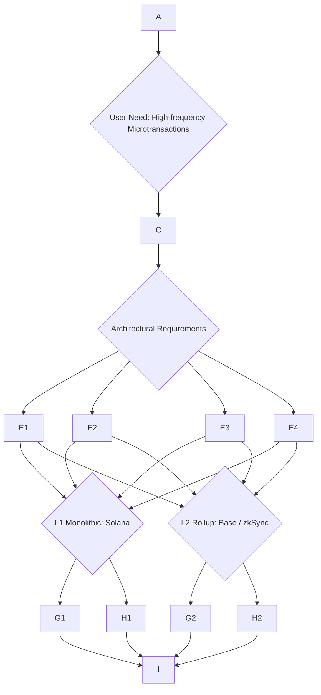
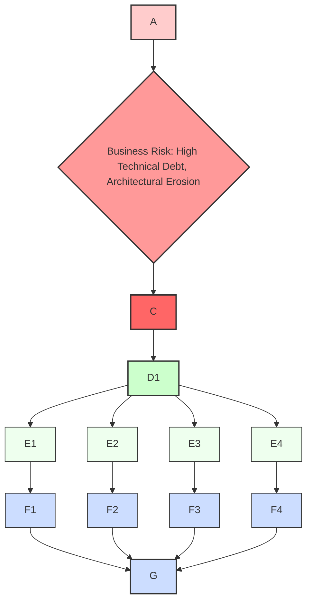

## Interview Q&A - Business Understanding for Software Architecture

### Scope and Structure

The following interview Q&A bank is designed for senior/architect/expert level technical leaders in blockchain development, focusing on their comprehensive business understanding as it benefits software architecture decisions. It comprises 30 Q&A pairs, with each answer ranging from 150–300 words to cover business-technical alignment, strategic trade-offs, value mapping, and organizational constraints. The difficulty distribution is balanced at 20% Foundational (6 questions), 40% Intermediate (12 questions), and 40% Advanced (12 questions). Each topic cluster is supported by at least one diagram and one table to visually articulate complex concepts and their interdependencies.

## Topic Areas: Questions 1-30

| Topic | Question Range | Count | Difficulty Mix |
|-------|---------------|-------|----------------|
| Strategic Modeling (Business Model, Domain) | Q1-Q5 | 5 | 1F, 2I, 2A |
| Value & Risk Analysis | Q6-Q10 | 5 | 1F, 2I, 2A |
| Documentation & Visualization | Q11-Q15 | 5 | 1F, 2I, 2A |
| Organizational Dynamics | Q16-Q20 | 5 | 1F, 2I, 2A |
| Architectural Translation | Q21-Q25 | 5 | 1F, 2I, 2A |
| Evolution & Adaptation | Q26-Q30 | 5 | 1F, 2I, 2A |
| **Total** | | **30** | **6F, 12I, 12A** |
**Legend**: F = Foundational, I = Intermediate, A = Advanced

---

## Topic 1: Strategic Modeling (Business Model, Domain)

### Q1: How would you articulate the core business model of a public blockchain like Ethereum or Solana to a non-technical investor, and how does its architecture directly enable its value proposition?
**Difficulty**: Foundational
**Type**: Strategic Modeling
**Key Insight**: Tests the ability to simplify complex blockchain economics and architecture into a clear business narrative, demonstrating an understanding of core value propositions and their technical underpinnings.
**Answer**:
A public blockchain like Ethereum or Solana operates fundamentally as a decentralized, global computing platform, offering a shared, immutable ledger and execution environment. For a non-technical investor, the core business model can be explained by highlighting its value propositions: trust, transparency, and programmable money. Ethereum, for instance, focuses on providing a secure and decentralized base layer for smart contracts and decentralized applications (dApps). Its modular architecture, relying on Layer 2 (L2) solutions for scalability, ensures that the base layer prioritizes security and decentralization, which are critical for high-value DeFi protocols and institutional applications. This design allows L2s like Base and zkSync to handle high transaction volumes and lower fees, while still inheriting Ethereum's robust security model, appealing to a broad range of users and businesses. Solana, on the other hand, embraces a monolithic architecture, integrating innovative technologies directly into its core protocol to achieve rapid transactions and low costs. Its Proof of History (PoH) consensus mechanism allows for extremely fast block times and high theoretical throughput, making it ideal for high-frequency applications, gaming, and microtransactions where speed and low fees are paramount. Both models generate revenue primarily through transaction fees (gas), which also serve to secure the network and incentivize validators or miners.
**Supporting Artifact**:
```
Table 1.1: Blockchain Core Capabilities and Business Value Alignment

| Business Objective       | Core Architectural Capability | Example (Ethereum/Solana)       | Business Value Proposition             |
|--------------------------|-------------------------------|---------------------------------|------------------------------------------|
| **Decentralized Trust**  | Consensus Mechanism (PoS/PoH) | Ethereum (PoS), Solana (PoS+PoH)| Immutable ledger, censorship resistance  |
| **Scalability & Speed**  | L2 Rollups / Monolithic Design | Ethereum L2s, Solana L1         | High transaction throughput, low latency |
| **Programmable Logic**   | Smart Contract Execution      | EVM, Solana Sealealevel         | Automation, dApp functionality           |
| **Cost Efficiency**      | Gas Fee Mechanism, L2s        | EIP-1559, ZK Rollups, Solana fees | Reduced transaction costs for users     |
| **Interoperability**     | Bridges, Cross-Chain Protocols| Ethereum bridges, Wormhole      | Asset and data transfer between chains   |
| **Developer Ecosystem**  | SDKs, Tooling, EVM-compatibility| Solidity/Rust dev tools         | Innovation, rapid dApp development       |
```

### Q2: Our company is considering launching a new decentralized application (dApp) that requires high transaction throughput and extremely low fees for microtransactions, targeting a global retail user base. How would you model the optimal blockchain environment (Layer 1 vs. Layer 2, specific chain choice) from a business value perspective?
**Difficulty**: Intermediate
**Type**: Strategic Modeling
**Key Insight**: Evaluates the ability to map specific business requirements (high throughput, low fees, global retail) to architectural choices (L1 vs. L2) and justify chain selection based on value proposition and user experience.
**Answer**:
For a dApp requiring high transaction throughput and extremely low fees for a global retail user base, the optimal blockchain environment necessitates a trade-off analysis between Layer 1 (L1) and Layer 2 (L2) solutions, focusing on user experience and cost efficiency. An L1 like Solana is particularly well-suited for such applications due to its monolithic design and Proof of History (PoH) consensus mechanism, which enable sustained high transaction speeds (thousands of TPS) and negligible fees (often less than a penny per transaction). This architecture makes Solana an excellent choice for microtransactions, gaming, and real-time dApps, where user-facing costs and responsiveness are critical business drivers. Alternatively, Ethereum-based L2s like Base or zkSync offer compelling advantages. Base, leveraging Coinbase's extensive user base and the Optimism OP Stack, has demonstrated immense transaction capacity (millions per day) and low fees, making it attractive for mainstream adoption and social applications. zkSync, a ZK-rollup, promises near-instant finality and robust security comparable to Ethereum L1, with rapidly decreasing transaction costs due to technical advancements like the Boojum prover and Ethereum's Dencun upgrade. The business value here lies in capturing a large retail market by removing the friction of high fees and slow confirmations, which directly impacts user acquisition, retention, and overall dApp utility. The choice would hinge on specific dApp requirements regarding *absolute* decentralization versus *practical* scalability, and the importance of Ethereum's security heritage versus Solana's raw performance sovereignty.
**Supporting Artifact**:

**Diagram 1.1: Blockchain Environment Decision Model for High-Frequency dApps**

### Q3: A product owner proposes a new feature for our blockchain platform that, while innovative, creates significant technical debt by requiring a complex, bespoke integration with a niche external service. From a domain-driven design (DDD) perspective, how do you evaluate this proposal and advise the product owner on its strategic implications?
**Difficulty**: Intermediate
**Type**: Strategic Modeling
**Key Insight**: Assesses the ability to apply DDD principles and technical debt considerations to a business feature proposal, guiding strategic product decisions beyond immediate functional requirements.
**Answer**:
From a Domain-Driven Design (DDD) perspective, evaluating a new feature involving complex bespoke integration requires analyzing its impact on the *Ubiquitous Language*, *Bounded Contexts*, and the *Core Domain*. The product owner's proposal might introduce a foreign concept that pollutes our Ubiquitous Language, leading to misunderstandings between domain experts and technical teams. If this niche external service's model clashes significantly with our existing domain model, it could compromise the integrity of our Bounded Contexts. The "significant technical debt" indicates that this integration is likely *Context Mapping* as an *Anti-Corruption Layer* or *Conformist*, implying a need to protect our Core Domain from external complexities rather than allowing them to seep in.

Strategically, the key question is whether this innovative feature directly contributes to the *Core Domain*, where the most business value is generated. If it's a supporting or generic subdomain, investing heavily in bespoke integration, incurring technical debt, might be economically unsound, as it diverts resources from developing critical differentiators. I would advise the product owner to consider the long-term maintenance costs and the potential for reduced agility in future development. We would explore if the feature truly resides in our *Core Domain* or if it's a *Supporting Subdomain* that could be handled with more standardized or commoditized solutions, perhaps by adapting our approach to the external service rather than bending our core systems. This discussion would aim to find a balance where the innovation's business value outweighs the architectural complexity and ongoing operational costs, ensuring the technical debt is *intentional* and *managed*, rather than accidental and crippling.
**Supporting Artifact**:
```
Table 1.2: Feature Evaluation Matrix (DDD & Technical Debt Perspective)

| Aspect                     | Description                                            | Impact on Proposed Feature                                 | Strategic Implication                                       |
|----------------------------|--------------------------------------------------------|------------------------------------------------------------|-------------------------------------------------------------|
| **Core Domain Alignment**  | Does feature enhance primary business differentiator?  | Innovative, but relies on a niche external service.         | High ROI if truly core; otherwise, resource misallocation. |
| **Ubiquitous Language**    | Consistency in terms/concepts across teams/code.       | External service's terminology may introduce confusion.     | Potential for communication breakdowns, increased errors.   |
| **Bounded Context Integrity**| Explicit boundaries for domain models.                 | Bespoke integration risks blurring context boundaries.      | Architectural erosion, difficulty in future refactoring.    |
| **Technical Debt Incurred**| Cost of choosing quick/limited solutions.              | Complex, custom integration = high technical debt.          | Reduced agility, increased maintenance cost, slower velocity. |
| **Architectural Agility**  | Ease of adapting/changing the system.                  | Niche integration makes future changes harder, costly.      | Hinders response to market shifts, competitive pressure.    |
| **Value vs. Cost**         | Business value derived vs. total cost of ownership.    | Innovation value vs. high TCO from bespoke solution.        | Need to quantify long-term value against architectural burden. |
```

### Q4: Our business goal is to increase adoption of our blockchain platform by simplifying the user experience, particularly for new crypto users who may be intimidated by seed phrases and gas fees. How would this business driver influence your core protocol design or Layer 2 strategy, drawing on recent trends like account abstraction or L2 gas fee reduction?
**Difficulty**: Advanced
**Type**: Strategic Modeling
**Key Insight**: Assesses the architect's ability to translate a high-level business objective (user adoption via UX simplification) into concrete protocol or L2 design strategies, leveraging current blockchain trends.
**Answer**:
Increasing blockchain platform adoption by simplifying the user experience, especially regarding seed phrases and gas fees, is a paramount business driver directly influencing core protocol or Layer 2 (L2) strategy. For new crypto users, friction points like managing complex seed phrases and navigating variable gas fees are significant barriers to entry. Architecturally, this necessitates a strong focus on *account abstraction* and *optimized gas fee models*.

A core protocol design could integrate account abstraction directly, allowing for more flexible wallet designs that eliminate seed phrases in favor of familiar authentication methods like multi-factor authentication or social logins. This moves transaction signing logic into smart contracts, enabling innovative features like paying fees in any token or sponsoring gas fees for users, which is a key business enabler for mass adoption. On the L2 front, solutions like Base, incubated by Coinbase, exemplify this by offering smart contract wallets that streamline the user experience, making it more akin to traditional fintech apps. The Dencun upgrade for Ethereum significantly reduced L2 data costs, leading to extremely low average transaction fees on chains like zkSync (around $0.03 in late 2024), effectively nullifying the "gas fee" barrier for many users. My strategy would prioritize L2 solutions that inherit Ethereum's security while offering gasless transactions or fee abstraction through sponsored transactions (e.g., via EIP-4337 or similar L2-native mechanisms). This allows the business to onboard a broader user base by offering a seamless experience, leading to higher engagement and growth.
**Supporting Artifact**:
```
Diagram 1.2: Blockchain User Experience (UX) Simplification for Adoption

┌─────────────────────────────────────────────────────────┐
│ Business Goal: Increase Blockchain User Adoption        │
├─────────────────────────────────────────────────────────┤
│ Drivers: Address user intimidation from seed phrases,   │
│          complex gas fees, and difficult onboarding.    │
└─────────────────────────────────────────────────────────┘
                              ↓
┌─────────────────────────────────────────────────────────┐
│ Strategic Objectives for UX Improvement                 │
├─────────────────────────────────────────────────────────┤
│ - **Simplify Wallet Management**: Remove seed phrase burden     │
│ - **Reduce Transaction Friction**: Mitigate gas fee impact      │
│ - **Streamline Onboarding**: Easy access to dApps             │
└─────────────────────────────────────────────────────────┘
                              ↓
┌─────────────────────────────────────────────────────────┐
│ Architectural Strategies & Decisions                    │
├───────────────────┬─────────────────────────────────────┤
│ **Account Abstraction**                                 │
│ - Smart Contract Wallets (EIP-4337)                     │
│ - Social Logins / MFA                                   │
│ - Fee Sponsorship                                       │
├───────────────────┼─────────────────────────────────────┤
│ **Optimized Gas Fee Models**                            │
│ - Layer 2 Solutions (Rollups: Optimistic, ZK)           │
│ - Data Compression & Proto-Danksharding (EIP-4844)      │
│ - Transaction Batching                                  │
│ - Fee Market Adjustments (e.g., EIP-1559 modifications) │
├───────────────────┼─────────────────────────────────────┤
│ **Interoperability & On-Ramps**                         │
│ - Fiat-to-Crypto Gateways (e.g., Coinbase integration)  │
│ - Cross-Chain Bridging (e.g., native L2 bridges)        │
└───────────────────┴─────────────────────────────────────┘
                              ↓
┌─────────────────────────────────────────────────────────┐
│ Business Outcomes: Higher Conversion, Retention, Network Effects │
└─────────────────────────────────────────────────────────┘
```

### Q5: Our venture capital-backed startup is developing a novel DeFi protocol and needs to decide between building on an existing Layer 1 (L1) like Solana or launching as a dedicated Layer 2 (L2) on Ethereum. From a strategic modeling perspective, what are the key business and technical factors you would weigh, considering ecosystem maturity, security, and developer mindshare in 2025?
**Difficulty**: Advanced
**Type**: Strategic Modeling
**Key Insight**: Evaluates the ability to conduct a comprehensive strategic analysis for blockchain platform choice, balancing business goals (novel DeFi, VC-backed) with architectural trade-offs (L1 vs. L2) and ecosystem dynamics in a rapidly evolving market.
**Answer**:
For a VC-backed startup developing a novel DeFi protocol, the strategic choice between Solana (L1) and an Ethereum L2 involves weighing critical business and technical factors in 2025, specifically considering ecosystem maturity, security, and developer mindshare.
From a business perspective, Solana offers inherent advantages for novel DeFi due to its high-throughput, low-fee architecture, which is attractive for applications demanding real-time responsiveness and micro-transactions. Its ability to handle massive DEX trading volumes (e.g., $3.8 billion in 24 hours in early 2025, surpassing Ethereum and Base combined) indicates a strong, active retail-driven market, ripe for speculative DeFi activity. However, Solana's past network outages and higher hardware requirements for validators introduce some centralization concerns, which can impact institutional trust and perceived security, a critical business risk for DeFi.

Conversely, choosing an Ethereum L2 (e.g., an Optimistic or ZK-rollup like Base or zkSync) offers a direct inheritance of Ethereum's battle-tested security and decentralization, which is paramount for high-value DeFi protocols and institutional adoption. While Ethereum's L1 faces scalability constraints, its L2s significantly enhance throughput and reduce fees, making them viable for consumer-facing DeFi. Base leverages Coinbase's user base for rapid adoption, offering mainstream-friendly onboarding and becoming a hub for "SocialFi". zkSync, with its ZK-rollup technology, provides near-instant finality and mathematical security guarantees, attracting real-world asset (RWA) tokenization and institutional interest. Developer mindshare heavily favors Ethereum due to its mature ecosystem, vast tooling, and large community, although Solana has seen a significant influx of new developers recently. The strategic decision hinges on whether the DeFi protocol prioritizes raw speed and lower absolute fees (Solana) or stronger security, broader ecosystem composability, and institutional trust derived from Ethereum (L2). VC backing might lean towards Ethereum L2s for perceived security and a clearer regulatory path, especially with recent positive U.S. regulatory shifts and ETF approvals.

**Supporting Artifact**:
```
Table 1.3: Strategic Blockchain Platform Comparison (L1 vs. L2 for Novel DeFi in 2025)

| Feature / Business Driver | Solana (L1 Monolithic)                               | Ethereum L2 (e.g., Base, zkSync)                               | Strategic Implication for DeFi Startup (2025) |
|---------------------------|------------------------------------------------------|----------------------------------------------------------------|----------------------------------------------|
| **Scalability (TPS)**     | High (3,700-65,000 TPS theoretical)       | High (Base: 80-90 TPS average, ZK-Rollups: high potential) | Both meet high-throughput needs, L2s scale with ETH. |
| **Transaction Fees**      | Very Low (Avg. $0.00025)                  | Low (Base: similar to ETH L2s; zkSync: ~$0.03) | Both cost-effective for retail microtransactions. |
| **Security Foundation**   | Self-secured PoS+PoH, 1900+ validators| Inherits Ethereum L1 security (PoS), battle-tested | L2s offer stronger perceived security for high-value DeFi. |
| **Decentralization**      | Decent, but higher hardware reqs for validators| Stronger (ETH L1) but L2 sequencers can be centralized initially | L2s align better with long-term decentralization ethos. |
| **Ecosystem Maturity**    | Rebounding, strong retail DeFi/NFTs, some institutional | Largest dev ecosystem, growing DeFi/SocialFi/RWA, institutional interest | ETH L2s offer broader institutional appeal & composability. |
| **Developer Mindshare**   | Rapidly growing, Rust/TypeScript focus| Largest and most mature (Solidity, Vyper) | ETH L2s benefit from larger existing dev talent pool. |
| **Interoperability**      | Bridges (Wormhole), standalone ecosystem | Native bridging to Ethereum L1, growing L2-to-L2 solutions | L2s offer more seamless integration within the ETH ecosystem. |
| **Regulatory Standing**   | Labeled a 'security' by US regulators      | Improved clarity with US ETF approvals, GENIUS Act | ETH L2s potentially lower regulatory risk for US-focused projects. |
```

---

## Topic 2: Value & Risk Analysis

### Q6: Our company is expanding into Real-World Asset (RWA) tokenization. How do you identify and mitigate the primary business, operational, and regulatory risks from an architectural standpoint, and what value does this bring to the business?
**Difficulty**: Intermediate
**Type**: Value & Risk Analysis
**Key Insight**: Evaluates the ability to analyze and mitigate multi-faceted risks inherent in RWA tokenization through architectural design, while clearly articulating the business value of such an endeavor.
**Answer**:
Expanding into Real-World Asset (RWA) tokenization offers significant business value, including increased liquidity for illiquid assets, broader investor access, reduced transaction costs, and enhanced transparency. From an architectural standpoint, this necessitates careful identification and mitigation of business, operational, and regulatory risks.
**Business Risks** include market acceptance, potential for de-peg, and reputational damage from security incidents. Mitigation involves building a robust oracle system for reliable price feeds and asset valuation, alongside transparent tokenomics and redemption mechanisms. Architecturally, integrating multiple decentralized oracle networks (e.g., Chainlink) and maintaining a clear separation of concerns between the RWA token contract and its underlying asset management logic is crucial.
**Operational Risks** encompass smart contract vulnerabilities, platform uptime, and data integrity of off-chain asset registries. To mitigate, rigorous smart contract auditing, formal verification, and continuous monitoring are essential. The architecture must implement high-availability and disaster recovery (HA/DR) strategies for the blockchain infrastructure, especially for sequencers or validators if running an L2, to ensure uninterrupted service. Data integrity requires robust off-chain data sources with strong attestation and verifiable credentials linked on-chain.
**Regulatory Risks** are paramount, covering KYC/AML compliance, securities laws, and jurisdictional variations. Architecturally, this translates to permissioned token standards (e.g., ERC-1404 or custom implementations) for investor whitelisting, on-chain identity verification modules, and geo-fencing capabilities within smart contracts. Using L2s like zkSync, which has attracted institutions like Deutsche Bank for digital asset platforms, can provide a more compliant and enterprise-friendly scaling solution due to its strong security guarantees and focus on interoperability. The value proposition of a well-architected RWA tokenization platform is directly linked to its trustworthiness, which is built on addressing these risks through resilient and compliant design.
**Supporting Artifact**:
```
Table 2.1: RWA Tokenization Risk Assessment Matrix & Architectural Mitigations

| Risk Category | Specific Risk (Business Context)             | Severity (H/M/L) | Likelihood (H/M/L) | Primary Architectural Mitigation Strategy                          | Business Value Enhanced           |
|---------------|----------------------------------------------|------------------|--------------------|--------------------------------------------------------------------|-----------------------------------|
| **Business**  | De-peg of token from underlying asset        | High             | Medium             | Robust oracle integration (multi-source), transparent redemption logic| Market trust, asset stability     |
| **Business**  | Limited market acceptance / liquidity        | High             | Medium             | Permissionless access for qualified participants, strong ecosystem integrations | Broader investor access, liquidity |
| **Operational** | Smart contract vulnerabilities               | High             | Medium             | Formal verification, rigorous third-party audits, bug bounty programs | Security, reputation, trust       |
| **Operational** | Blockchain network downtime / congestion     | Medium           | Low                | High-availability L2 architecture, robust validator infrastructure| Service continuity, user experience |
| **Operational** | Off-chain asset data integrity compromise    | High             | Medium             | Verifiable Credentials, tamper-proof audit trails, secure data storage | Data integrity, legal compliance  |
| **Regulatory** | KYC/AML non-compliance                       | High             | Medium             | On-chain identity modules, permissioned token standards (e.g., ERC-1404) | Legal compliance, institutional adoption |
| **Regulatory** | Securities law violations (e.g., unregistered securities) | High             | Low                | Legal counsel integration, clear token utility, jurisdictional geo-fencing | Regulatory certainty, market access |
```

### Q7: A major business partner has expressed concerns about the "7-day challenge period" associated with our optimistic rollup solution, citing potential delays in financial settlement for high-value transactions. From a risk analysis perspective, how do you address this concern architecturally while maintaining the business's need for security and scalability?
**Difficulty**: Advanced
**Type**: Value & Risk Analysis
**Key Insight**: Tests the ability to analyze a specific L2 risk (optimistic rollup challenge period) from a business partner's perspective, proposing architectural mitigations that balance security, scalability, and business-critical settlement finality.
**Answer**:
A major business partner's concern about the 7-day challenge period in an optimistic rollup, particularly for high-value financial settlements, highlights a critical business risk related to transaction finality and capital efficiency. From a risk analysis perspective, this delay creates liquidity lock-up and introduces counterparty risk, impacting the perceived value and operational efficiency for the partner. Architecturally, we must address this by exploring solutions that provide faster finality without compromising the rollup's inherited security from Ethereum or its scalability benefits.

One primary architectural mitigation involves **liquidity providers and fast withdrawals**. Specialized liquidity providers (LPs) can offer immediate withdrawals on the L2 by taking on the risk of waiting out the 7-day challenge period on behalf of users, in exchange for a fee. Our architecture would need to integrate with these LP protocols or even consider building an in-house liquidity pool, carefully managing the capital requirements and risk exposure for the business.
Another approach is to **transition or integrate with Zero-Knowledge (ZK) Rollups for high-value transactions**. ZK-rollups, like zkSync, use cryptographic validity proofs to mathematically guarantee transaction correctness before posting to Ethereum, offering near-instant finality without a challenge period. For the business, this offers a superior security model and eliminates the settlement delay concern. Architecturally, this could involve a hybrid L2 strategy: using the optimistic rollup for general, lower-value transactions where the 7-day period is acceptable, and directing high-value financial settlements to a ZK-rollup, possibly through an interoperable "hyperchain" framework. This segmentation would require robust cross-L2 communication and bridging mechanisms, ensuring seamless asset transfer between the two environments. The business value lies in enhancing partner trust, enabling faster capital movement, and capturing a broader market segment that demands immediate settlement, while maintaining overall scalability and security.
**Supporting Artifact**:
```mermaid
graph TD
    A --> B{Risk: Liquidity Lock-up & Settlement Delay for High-Value Transactions}
    B --> C

    C --> D1{Architectural Mitigation: Fast Withdrawals (Liquidity Providers)}
    D1 --> E1
    E1 --> F1

    C --> D2{Architectural Mitigation: Hybrid L2 Strategy (ZK-Rollup for High Value)}
    D2 --> E2
    E2 --> E3
    E3 --> E4
    E4 --> F2

    style A fill:#FFCCCC,stroke:#333,stroke-width:2px
    style B fill:#FF9999,stroke:#333,stroke-width:2px
    style C fill:#FF6666,stroke:#333,stroke-width:2px
    style D1 fill:#CCFFCC,stroke:#333,stroke-width:2px
    style D2 fill:#CCFFCC,stroke:#333,stroke-width:2px
    style E1 fill:#EEFFEE,stroke:#333,stroke-width:1px
    style E2 fill:#EEFFEE,stroke:#333,stroke-width:1px
    style E3 fill:#EEFFEE,stroke:#333,stroke-width:1px
    style E4 fill:#EEFFEE,stroke:#333,stroke-width:1px
    style F1 fill:#CCDDFF,stroke:#333,stroke-width:2px
    style F2 fill:#CCDDFF,stroke:#333,stroke-width:2px
```
**Diagram 2.1: Addressing Optimistic Rollup Finality Concerns**

### Q8: Our internal audit team has identified a potential compliance risk regarding the geographic distribution of our blockchain's validator nodes, which could impact our ability to serve users in highly regulated jurisdictions. How would you analyze this operational constraint and propose architectural adjustments that balance decentralization with regulatory requirements?
**Difficulty**: Advanced
**Type**: Value & Risk Analysis
**Key Insight**: Tests the ability to navigate the complex trade-off between core blockchain principles (decentralization) and business imperatives (regulatory compliance, market access) through architectural solutions and risk mitigation.
**Answer**:
The compliance risk associated with the geographic distribution of validator nodes impacting regulated jurisdictions presents a direct conflict between the blockchain's decentralization ethos and critical business-regulatory requirements. From an operational perspective, a concentrated or non-compliant validator set could lead to legal penalties, loss of market access in key regions, and reputational damage, severely hindering business growth. Architecturally, the challenge is to achieve a sufficient level of decentralization to maintain censorship resistance and network integrity, while also enabling mechanisms for compliant operation where necessary.

One approach involves **implementing a multi-client strategy and incentivizing diverse geographic distribution**. For instance, Solana has introduced Firedancer, a second independent validator client, which enhances network resilience and decentralization by reducing reliance on a single software implementation. We could further incentivize validators in specific, compliant jurisdictions through adjusted staking rewards or grants, thereby creating "zones of compliance" without compromising the overall global distribution. This involves economic modeling of staking incentives to ensure sufficient participation in target regions.

Alternatively, for highly sensitive operations or specific jurisdictions, a **hybrid approach using permissioned sidechains or dedicated enterprise L2s** could be considered. These allow for greater control over validator sets (e.g., KYC'd entities, specific geographic locations) to meet stringent regulatory requirements, while still settling on a more decentralized mainnet or interconnected via cross-chain protocols. This architectural adjustment means designing clear system boundaries where high-value, regulated transactions are routed through a permissioned component, while less sensitive operations utilize the broader, more decentralized network. The business value of this lies in unlocking new markets, attracting institutional partners (like Franklin Templeton using Base or Deutsche Bank using zkSync for RWA) who prioritize compliance, and mitigating legal risks, transforming a constraint into a strategic differentiator. This requires transparent documentation of the trade-offs and decision rationale via Architecture Decision Records (ADRs).
**Supporting Artifact**:
```
Table 2.2: Decentralization vs. Regulation: Architectural Adjustments & Trade-offs

| Business Goal / Constraint      | Architectural Adjustment                                     | Benefit                                         | Trade-off / Risk                                          |
|---------------------------------|--------------------------------------------------------------|-------------------------------------------------|-----------------------------------------------------------|
| **Regulatory Compliance (e.g., KYC/AML, Data Sovereignty)** | Implement Permissioned L2/Sidechain for regulated assets/operations | Access to new regulated markets, institutional adoption | Increased centralization for specific use cases           |
|                                 | On-chain Identity (DID) & Verifiable Credentials             | Streamlined compliance, enhanced privacy controls | Complexity of identity management, adoption challenges      |
|                                 | Geographically distributed validator incentives              | Diverse validator set in compliant regions        | Cost of incentives, potential for uneven distribution     |
| **Maintain Decentralization & Censorship Resistance** | Multi-client validator strategy (e.g., Firedancer on Solana) | Reduced single point of failure, increased resilience   | Complexity of client development/maintenance, slower adoption |
|                                 | Increase validator count & reduce hardware barrier           | Greater participation, enhanced network security  | Potential for reduced individual validator performance    |
| **Operational Efficiency & Scalability** | Utilize ZK-Rollups for high-value/regulated transactions| Faster finality, strong cryptographic security    | Higher computational cost for proof generation initially|
|                                 | Modular architecture design                        | Flexibility for independent component upgrades  | Increased integration complexity, potential for fragmentation |
```

### Q9: Our product team wants to integrate AI models directly into smart contracts for dynamic pricing within our DeFi lending protocol. From a value and risk perspective, what are the architectural implications, particularly considering the unpredictability and "black box" nature of AI, and how do you ensure business reliability?
**Difficulty**: Advanced
**Type**: Value & Risk Analysis
**Key Insight**: Tests the ability to analyze the architectural implications of integrating cutting-edge, yet inherently unpredictable, AI technologies into a high-stakes DeFi environment, focusing on risk mitigation and maintaining business reliability.
**Answer**:
Integrating AI models directly into smart contracts for dynamic pricing in a DeFi lending protocol introduces significant value through optimized capital efficiency and adaptive risk management, but also presents substantial architectural challenges and risks due to AI's unpredictability and "black box" nature.
From a **value perspective**, AI-driven dynamic pricing can theoretically lead to more efficient lending rates, better liquidation thresholds, and improved capital utilization, driving competitive advantage and increased revenue streams.
However, the **risks are profound**. The "black box" nature of AI makes its decisions opaque, posing auditing and explainability challenges crucial for financial transparency and regulatory compliance. Unpredictability can lead to unexpected market reactions, manipulation vectors, and potential catastrophic losses if the AI model misinterprets market conditions or is exploited. Operational reliability is jeopardized by the latency and computational cost of running complex AI inferences on-chain, which can impact transaction finality and gas fees.

Architecturally, ensuring business reliability requires several critical design patterns:
1.  **Off-Chain AI, On-Chain Verification**: The most robust approach is to keep complex AI model inference *off-chain* using decentralized computing networks (e.g., specific DePIN solutions) or secure oracle networks (e.g., Chainlink AI/ML integration). Only the *output* or *proof* of the AI model's decision would be submitted to the smart contract. This mitigates on-chain computation costs and latency.
2.  **Verifiable Machine Learning (vML)**: Explore emerging cryptographic techniques like Zero-Knowledge Machine Learning (ZKML) or homomorphic encryption to allow off-chain AI computations to be *verifiably correct* on-chain without revealing the underlying data or model specifics. This addresses the "black box" problem by providing mathematical assurance of computation integrity.
3.  **Circuit Breakers and Governance Overrides**: Implement emergency mechanisms within the smart contract to pause or override AI-driven pricing decisions if anomalies are detected or extreme market conditions arise. This requires decentralized governance (DAO) or a multi-signature safeguard for critical business continuity.
4.  **Redundant AI Models & Oracle Networks**: Deploy multiple independent AI models and aggregate their outputs through a decentralized oracle network. This minimizes reliance on a single model or data source, enhancing fault tolerance and resistance to manipulation.
5.  **Rigorous Simulation & Backtesting**: Before deployment, extensive off-chain simulation with historical and adversarial data is non-negotiable to understand the AI's behavior under various market conditions. This feeds into risk assessment tables.

This multi-layered architectural strategy transforms a high-risk innovation into a controlled, reliable business asset, balancing cutting-edge capabilities with the inherent need for trust and stability in DeFi.
**Supporting Artifact**:
```
Diagram 2.2: AI-Driven DeFi Lending Protocol - Value & Risk Analysis

┌───────────────────────────────────────────────────────────┐
│ Business Goal: Dynamic Pricing in DeFi Lending Protocol   │
├───────────────────────────────────────────────────────────┤
│ Value: Optimized capital efficiency, adaptive risk management, competitive advantage │
└───────────────────────────────────────────────────────────┘
                                   ↓
┌───────────────────────────────────────────────────────────┐
│ Core Challenge: Integrating "Black Box" AI into Trustless Smart Contracts │
└───────────────────────────────────────────────────────────┘
                                   ↓
┌───────────────────────────────────────────────────────────┐
│ Risk Assessment (Operational & Business Reliability)      │
├───────────────────────────────────────────────────────────┤
│ - **AI Unpredictability**: Volatility, market misinterpretation, exploit vectors │
│ - **Transparency**: Black box nature, auditing challenges, regulatory hurdles │
│ - **Latency/Cost**: On-chain computation overhead, gas fee spikes │
│ - **Security**: Smart contract vulnerabilities exacerbated by AI complexity │
└───────────────────────────────────────────────────────────┘
                                   ↓
┌───────────────────────────────────────────────────────────┐
│ Architectural Mitigations & Business Reliability Enablers │
├───────────────────────────────────────────────────────────┤
│ **1. Off-Chain AI Computation with On-Chain Proof/Output**    │
│    - Decentralized computing networks or secure oracles for inference │
│    - Only validated AI output submitted to smart contract     │
│ **2. Verifiable Machine Learning (vML) / ZKML**               │
│    - Cryptographic proofs for off-chain computation integrity │
│    - Enhances transparency & auditability                     │
│ **3. Circuit Breakers & Decentralized Governance**            │
│    - Emergency pause/override functions in smart contracts    │
│    - Multi-sig or DAO for critical decision-making          │
│ **4. Redundant AI Models & Decentralized Oracle Networks**    │
│    - Aggregate outputs from multiple independent models/oracles │
│    - Reduces single point of failure and manipulation risk    │
│ **5. Off-chain Simulation & Backtesting Platform**            │
│    - Extensive testing under various market scenarios         │
│    - Continuous monitoring and model retraining               │
└───────────────────────────────────────────────────────────┘
```

### Q10: Our marketing team wants to launch a viral memecoin on our Layer 2 network to attract new retail users and boost transaction volume, similar to trends seen on Solana and Base in 2024. From a value and risk perspective, how do you advise on the architectural and business implications of such an initiative, and how would you prioritize technical readiness?
**Difficulty**: Intermediate
**Type**: Value & Risk Analysis
**Key Insight**: Tests the ability to critically assess a high-risk, high-reward business initiative (memecoin launch) from an architectural standpoint, balancing potential business value (user acquisition, volume) against technical and reputational risks, and prioritizing readiness.
**Answer**:
Launching a viral memecoin on our Layer 2 (L2) network, inspired by Solana and Base trends in 2024, presents a dual-edged sword from a value and risk perspective.
**Business Value**: The primary value is rapid user acquisition and a significant surge in transaction volume, driving network effects and potential revenue from gas fees. It can create buzz, attracting new retail users who might then explore other dApps on our platform. Base's "Onchain Summer" successfully leveraged viral events to onboard millions of unique wallets.
**Risks**:
1.  **Reputational Risk**: Memecoins are highly speculative and volatile, often associated with pump-and-dump schemes, which could damage the platform's credibility, especially if targeting institutional partners or long-term builders.
2.  **Network Congestion/Stability**: A sudden viral surge in activity could overwhelm the L2's sequencer, data availability layer, or underlying infrastructure, leading to transaction delays, failures, or even temporary halts. Solana experienced growth pains with network outages in 2021-2022 due to overload.
3.  **Security Exploits**: Rapid deployment of speculative tokens increases the attack surface for smart contract exploits or phishing scams targeting new users.
4.  **Sustainability**: Memecoin activity is often transient, driven by hype rather than fundamental utility, raising questions about long-term user retention.

**Architectural and Technical Readiness Priorities**:
1.  **Robust L2 Sequencer and Data Availability**: Ensure our sequencer is highly available, fault-tolerant, and can handle extreme load spikes. Data availability mechanisms must be optimized to prevent bottlenecks when posting transaction batches to L1. For ZK-rollups, the prover infrastructure needs to be scalable to generate proofs rapidly under heavy load.
2.  **Dynamic Fee Market (if applicable)**: If our L2 has a flexible fee market, ensure it can adapt to demand spikes to prevent total network breakdown while remaining affordable.
3.  **Monitoring and Alerting**: Implement comprehensive real-time monitoring of network health, transaction queues, and gas usage to quickly detect and respond to congestion or attacks.
4.  **Smart Contract Security Audit**: Mandate immediate, thorough audits for any memecoin contracts to mitigate basic vulnerabilities, even if they are community-driven.
5.  **User Education and Risk Disclosures**: Architecturally, the platform should support clear front-end messaging warning users about the risks of highly speculative assets.

My advice would be to proceed with extreme caution, prioritizing technical readiness and risk mitigation over immediate viral growth. While the marketing team's goal of user acquisition is valid, sacrificing platform stability or reputation for short-term gains could be detrimental to the long-term business strategy of building a credible blockchain ecosystem.

**Supporting Artifact**:
```
Table 2.3: Memecoin Launch - Risk vs. Readiness Assessment

| Aspect                        | Business Value (Potential Gain)                           | Business Risk (Potential Loss)                            | Technical Readiness Priority                                  |
|-------------------------------|-----------------------------------------------------------|-----------------------------------------------------------|---------------------------------------------------------------|
| **User Acquisition**          | Rapid influx of new retail users, network growth | Negative brand association, user churn after hype cycle | Scalable onboarding flows, robust wallet infrastructure       |
| **Transaction Volume/Fees**   | Significant surge in network activity, revenue from gas fees | Network congestion, transaction failures, user frustration | High-performance sequencer/prover, optimized data availability |
| **Ecosystem Development**     | Potential for broader dApp exploration by new users       | Focus diverted from core utility dApps, 'casino' perception | Developer tools for easy dApp discovery, clear dApp categories |
| **Reputation/Trust**          | N/A (Net negative if not managed well)                    | Damage to platform credibility, investor confidence| Transparent communication, strong security posture, regulatory signaling |
| **Security Posture**          | N/A                                                       | Smart contract exploits, phishing scams, market manipulation | Mandatory audits for deployed tokens, real-time threat monitoring |
| **Sustainability**            | N/A                                                       | Short-lived activity, difficulty retaining users   | Diversified ecosystem strategy, focus on long-term utility    |
```

---

## Topic 3: Documentation & Visualization

### Q11: You are inheriting an existing blockchain project with limited and outdated architectural documentation. How would you approach creating "living documentation" to quickly onboard new senior developers and align business stakeholders with the system's current state and strategic direction?
**Difficulty**: Intermediate
**Type**: Documentation & Visualization
**Key Insight**: Tests practical knowledge of creating effective, up-to-date documentation in a complex technical environment, addressing onboarding and stakeholder alignment needs from a business perspective.
**Answer**:
Inheriting a blockchain project with limited and outdated architectural documentation poses significant business risks, including slow onboarding of new talent, misalignment between technical teams and business stakeholders, and potential for costly architectural drift. My approach to creating "living documentation" would prioritize rapid knowledge transfer and continuous synchronization with the system's evolving state and strategic direction.

Firstly, I would initiate a **discovery phase** focused on understanding the core business domain and existing system boundaries. This involves conducting workshops with long-standing developers, product owners, and domain experts to capture explicit and implicit knowledge, identifying key *Bounded Contexts* and their *Ubiquitous Language*. Tools like Miro (T1) or LucidChart (T5) would be instrumental for collaborative brainstorming and sketching initial diagrams, such as high-level system context diagrams and container diagrams (C4 Model) to quickly visualize the software architecture and component responsibilities.

Next, I would establish a **documentation-as-code pipeline**. This involves storing documentation artifacts (e.g., Markdown files for Architecture Decision Records (ADRs), PlantUML for diagrams) in the same version control system as the code. This ensures that documentation updates are part of the regular development workflow and undergo peer review, directly linking documentation evolution with code changes. Confluence (T4) or similar platforms could then be used to aggregate these artifacts, creating a central, searchable knowledge base for developers and stakeholders.

To align business stakeholders, I would leverage **Wardley Maps** (G10). These maps visually depict the value chain, component evolution, and competitive landscape, allowing for strategic discussions that are grounded in the current technical reality but accessible to non-technical audiences. Regular mapping sessions help stakeholders understand where to invest (innovate in Genesis/Custom-Built) and where to optimize (Commodity), directly tracing architectural decisions to business value. The combination of technical diagrams (C4) and strategic maps (Wardley Maps) provides a multi-layered view, fostering a shared understanding that is critical for fast onboarding and maintaining strategic alignment across the organization.
**Supporting Artifact**:
```
Table 3.1: Living Documentation Strategy & Tools

| Documentation Type           | Purpose                                              | Tool / Format         | Link to Business Value / Architectural Decision     |
|------------------------------|------------------------------------------------------|-----------------------|-----------------------------------------------------|
| **System Context Diagram**   | High-level overview of system, users, and external systems | C4 Model (T3) / Draw.io | Shared understanding of system boundaries, stakeholder mapping |
| **Container Diagram**        | How responsibilities are distributed across deployable units | C4 Model (T3) / PlantUML | Technical team onboarding, inter-service communication patterns |
| **Architecture Decision Records (ADRs)** | Capture key architectural decisions, context, consequences | Markdown (G12) / Git  | Transparent decision-making, historical context, risk mitigation |
| **Domain Models & Bounded Contexts** | Define core business concepts and their boundaries   | Wiki / Confluence (T4)| Aligning ubiquitous language, microservice decomposition |
| **Wardley Maps**             | Visualize value chain, evolution, strategic positioning | Miro (T1) / Online tools (T5) | Strategic planning, investment prioritization, competitive analysis |
| **API Documentation**        | Describe interfaces for internal & external integration | OpenAPI / Swagger     | Facilitating interoperability, partner integrations |
| **Runbooks & Operational Guides** | Procedures for deployment, monitoring, incident response | Wiki / Confluence (T4)| Operational efficiency, service reliability, disaster recovery |
```

### Q12: A new product manager proposes an aggressive roadmap that bypasses standard architectural review processes to accelerate time-to-market. From a documentation and visualization perspective, how would you articulate the long-term business risks of such an approach, and what lightweight documentation practices would you advocate for to maintain architectural integrity while still enabling speed?
**Difficulty**: Intermediate
**Type**: Documentation & Visualization
**Key Insight**: Tests the ability to articulate the business risks of neglecting architectural discipline and to propose agile, lightweight documentation strategies that balance speed with long-term architectural health.
**Answer**:
Bypassing standard architectural review processes for an aggressive roadmap, while seemingly accelerating time-to-market, introduces significant long-term business risks that include increased *technical debt*, potential for *architectural erosion*, higher *operational costs*, and reduced *agility*. Without proper documentation and review, key architectural decisions become implicit, leading to system inconsistencies, security vulnerabilities, and difficulties in future maintenance or scaling. This lack of clarity can also cause misalignments between development teams and product goals, ultimately slowing down future feature delivery and impacting product quality.

To mitigate these risks while still enabling speed, I would advocate for **lightweight documentation practices** focused on critical information and continuous integration. Firstly, **Architecture Decision Records (ADRs)** are crucial. An ADR captures the context, decision, and consequences of a significant architectural choice in a concise, immutable format (e.g., Markdown files in the codebase). This provides transparency, historical context, and facilitates asynchronous review without requiring lengthy formal meetings. ADRs can be quickly written and linked to specific code changes, acting as "living documentation" that evolves with the system.

Secondly, **strategic use of C4 diagrams** can quickly visualize the current state and proposed changes at appropriate abstraction levels (Container or Component level) without excessive detail. These diagrams are notation-independent and can be generated from code (e.g., using Structurizr or PlantUML), making them easier to maintain and keeping them synchronized with the codebase. A **Context Map** from Domain-Driven Design (DDD) can also quickly illustrate the relationships between *Bounded Contexts*, highlighting integration points and potential impact areas. By focusing on these essential, code-proximate documentation artifacts, we can maintain architectural integrity, communicate critical design decisions effectively, and prevent the accumulation of unmanaged technical debt, ensuring long-term business sustainability alongside rapid innovation.
**Supporting Artifact**:

**Diagram 3.1: Lightweight Documentation for Architectural Integrity**

### Q13: Our marketing department struggles to grasp the technical nuances of our Layer 2 scaling solution, making it difficult to effectively communicate our competitive advantages to potential users. How would you use architectural visualization tools to bridge this communication gap and demonstrate the business value of our scaling approach?
**Difficulty**: Foundational
**Type**: Documentation & Visualization
**Key Insight**: Tests the ability to leverage architectural visualization for external communication, translating technical features into comprehensible business value for non-technical stakeholders like marketing.
**Answer**:
The challenge of marketing struggling to communicate the technical nuances of our Layer 2 (L2) scaling solution highlights a critical business-communication gap, directly impacting our ability to articulate competitive advantages and drive user adoption. As a senior architect, I would leverage architectural visualization tools to bridge this gap, focusing on translating technical features into clear, concise business value propositions.

Firstly, I would use **C4 Model Context and Container diagrams** (T3) as a starting point, but simplify them significantly for a marketing audience. The "System Context" diagram can show our L2 as a single system interacting with users, Ethereum L1, and other external services, illustrating our position within the broader blockchain ecosystem. A simplified "Container Diagram" could then depict the L2's key components, such as the sequencer, prover (for ZK-rollups), and bridge, highlighting how they work together to achieve scalability and low fees. Cru

Sources: 
[1] Container diagram, https://c4model.com/diagrams/container
[2] C4 model: Home, https://c4model.com/
[3] Conway's Law Explained - Splunk, https://www.splunk.com/en_us/blog/learn/conways-law.html
[4] A Strategy and Wardley Mapping Primer - Dave's Research Co., https://www.davesresearch.com/wardley-mapping/
[5] Strategic Thinking with Wardley Maps: A Visual Guide to Business ..., https://medium.com/ai-created-strategy-reports/strategic-thinking-with-wardley-maps-a-visual-guide-to-business-evolution-and-market-dynamics-for-186d46ae5422
[6] Wardley Maps, https://www.wardleymaps.com/
[7] Software Development Must-Reads: Domain-Driven Design by Eric ..., https://medium.com/@mostsignificant/software-development-must-reads-domain-driven-design-by-eric-evans-9d41b3118085
[8] Implementing Domain-Driven Design 0321834577, 9780321834577, https://dokumen.pub/implementing-domain-driven-design-0321834577-9780321834577.html
[9] Wardley Mapping Book Passages - Key Insights, https://www.wardleymaps.com/learn/book-passages
[10] Business Model Generation: A Handbook for Visionaries, Game ..., https://www.barnesandnoble.com/w/business-model-generation-alex-osterwalder/1143463322
[11] Domain-Driven Design: Tackling Complexity in the Heart of Software, https://www.goodreads.com/book/show/179133.Domain_Driven_Design
[12] Conway's law - Wikipedia, https://en.wikipedia.org/wiki/Conway%27s_law
[13] Solana vs Base vs zkSync: The Ultimate L1 vs L2 Showdown for the ..., https://yellow.com/en-US/research/solana-vs-base-vs-zksync-the-ultimate-l1-vs-l2-showdown-for-the-2025-bull-run
[14] Unraveling Gas Fees: A Comprehensive Guide to Transaction Costs ..., https://medium.com/@ankitacode11/unraveling-gas-fees-a-comprehensive-guide-to-transaction-costs-across-blockchains-72509f649811
[15] Conway's Law at Government Scale - Niskanen Center, https://www.niskanencenter.org/conways-law-at-government-scale/
[16] Conway's Law - Martin Fowler, https://martinfowler.com/bliki/ConwaysLaw.html
[17] Mapping 101: A Beginner's Guide - Wardley Maps, https://www.wardleymaps.com/guides/wardley-mapping-101
[18] Solana vs. Ethereum: Performance, Architecture, and Potential, https://www.ledger.com/academy/topics/crypto/solana-vs-ethereum-performance-guide
[19] State of Crypto 2025: The year crypto went mainstream, https://a16zcrypto.com/posts/article/state-of-crypto-report-2025/
[20] 以太坊价格预测ETH 2025-2030年价格预测 - ICO Bench, https://icobench.com/zh/cryptocurrency/ethereum-price-prediction/
[21] 解讀以太坊Gas費計算原理：如何降低交易成本？ | 動區動趨, https://www.blocktempo.com/understanding-ethereum-gas-fee-calculation-how-to-reduce-transaction-costs/
[22] Queues and topics, https://c4model.com/abstractions/queues-and-topics
[23] Mapping Tools - Wardley Maps, https://www.wardleymaps.com/tools
[24] 2025年以太坊，这一轮大牛市最强的叙事逻辑：美股、美债上链, https://www.binance.com/zh-CN/square/post/20740710211081
[25] 以太坊首次全季负收益：2025年开局为何如此惨淡？ - Binance, https://www.binance.com/zh-CN/square/post/22006038454498
[26] 以太坊微策略叙事转换：链上经济的储备资产？ - 新浪财经, https://finance.sina.cn/blockchain/2025-07-29/detail-infiavhe9497821.d.html
[27] Conway's Law v. Software Architecture - Allan Kelly, https://www.allankelly.net/archives/638/conway-law-v-software-architecture/
[28] [PDF] Business Model Generation: A Handbook for Visionaries, Game ..., https://mymyeo.com/wp-content/uploads/2022/12/Business-model-generation-_-a-handbook-for-visionaries-game-changers-and-challengers-PDFDrive-1.pdf
[29] The Rise of Layer 1 vs Layer 2 Blockchains: Which Should You ..., https://techaroha.com/layer-1-vs-layer-2-blockchains-key-differences-in-2025/
[30] [PDF] HOW DO COMMITTEES INVENT? - Mel Conway's, https://www.melconway.com/Home/pdf/committees.pdf
[31] Atlassian Price Increase 2025: What to Expect, https://atlassian.empyra.com/blog/atlassian-price-increase-2025-what-to-expect
[32] Understanding the Data Landscape and Strategic Play Through ..., https://www.ergestx.com/data-landscape-wardley-mapping/
[33] October 2025 Atlassian Cloud Price Changes - Valiantys, https://www.valiantys.com/en/resources/october-2025-atlassian-cloud-price-changes
[34] Confluence Pricing: Free and Paid Plans | Atlassian, https://www.atlassian.com/software/confluence/pricing
[35] Implementing Domain-Driven Design: | Guide books, https://dl.acm.org/doi/10.5555/2462636
[36] Implementing Domain-Driven Design: Vernon, Vaughn - Amazon.com, https://www.amazon.com/Implementing-Domain-Driven-Design-Vaughn-Vernon/dp/0321834577
[37] Melvin E. Conway, How Do Committees Invent? - Squidtree, https://www.squidtree.com/references/C13
[38] What is Ethereum EIP-1559: Gas Fees, Supply Impact & Real Results, https://www.okx.com/en-ae/learn/what-is-ethereum-eip-1559
[39] State of Ethereum Q2 2025 - Messari, https://messari.io/report/state-of-ethereum-q2-2025
[40] Ethereum Scalability Roadmap: Merge, Surge & Key Upgrades ..., https://www.okx.com/en-us/learn/ethereum-scalability-roadmap
[41] What is EIP-1559 and what is the impact of the update? - Finst, https://finst.com/en/learn/articles/what-is-eip-1559
[42] 交易, https://ethereum.org/zh/developers/docs/transactions/
[43] Top ZK Rollup Projects in 2024 - Token Metrics Moon Awards, https://www.tokenmetrics.com/blog/top-zk-rollup?0fad35da_page=24&74e29fd5_page=7
[44] Implementing Domain-Driven Design by Vaughn Vernon, https://www.dddcommunity.org/book/implementing-domain-driven-design-by-vaughn-vernon/
[45] Conway's Law & Data Modeling - by Joe Reis, https://practicaldatamodeling.substack.com/p/conways-law-and-data-modeling
[46] Implementing Domain-Driven Design - Google Books, https://books.google.com/books/about/Implementing_Domain_Driven_Design.html?id=X7DpD5g3VP8C
[47] Ethereum at a Crossroads | Institutional Outlook - XBTO, https://www.xbto.com/resources/ethereum-at-a-crossroads-institutional-adoption-vs-market-underperformance
