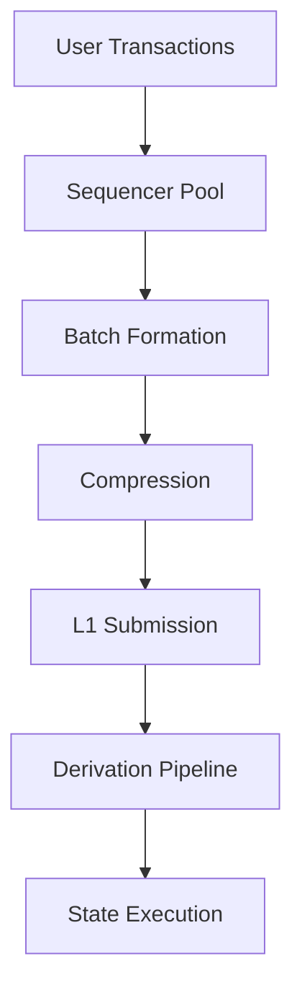
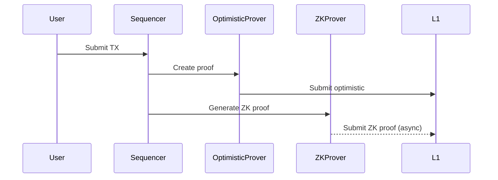
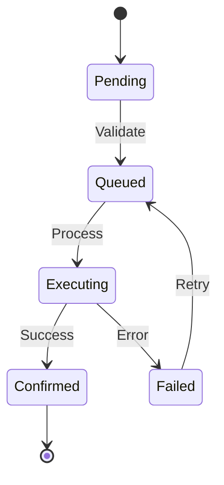
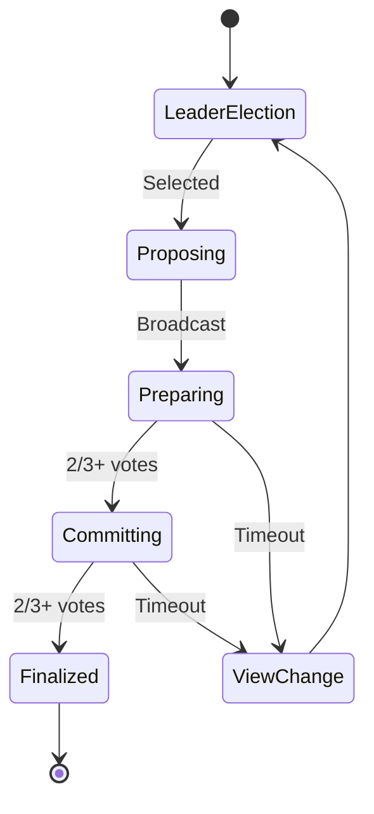
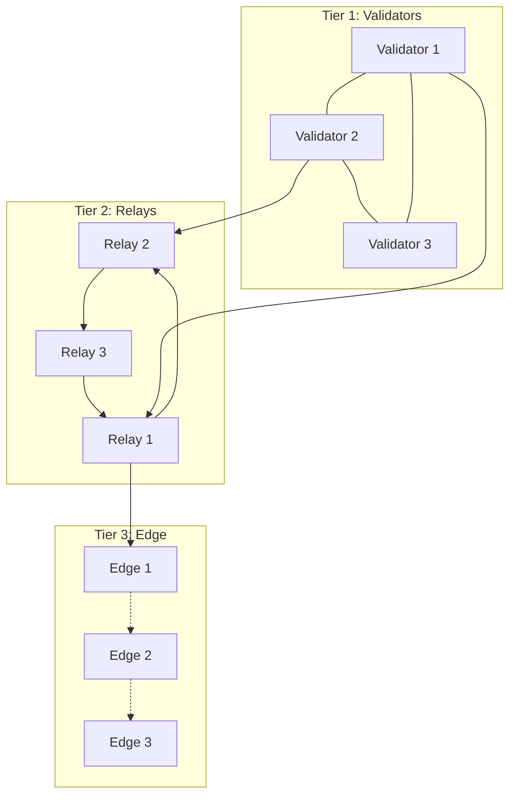
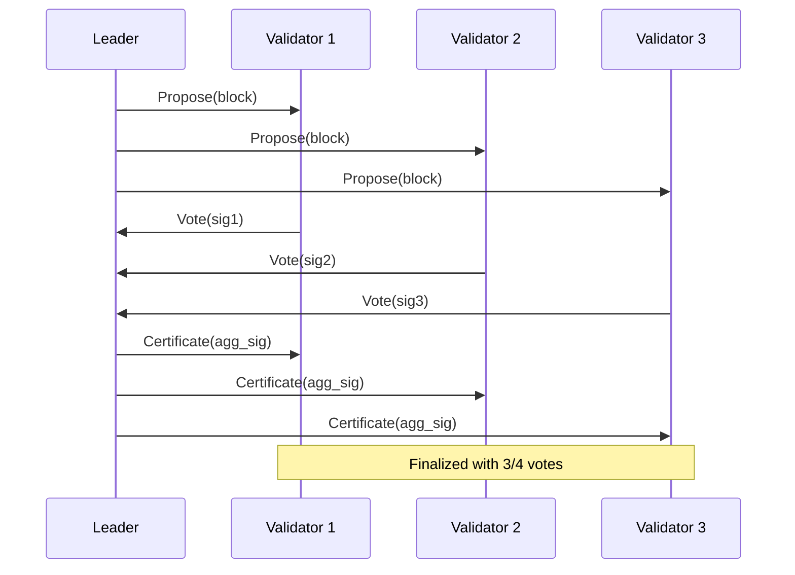
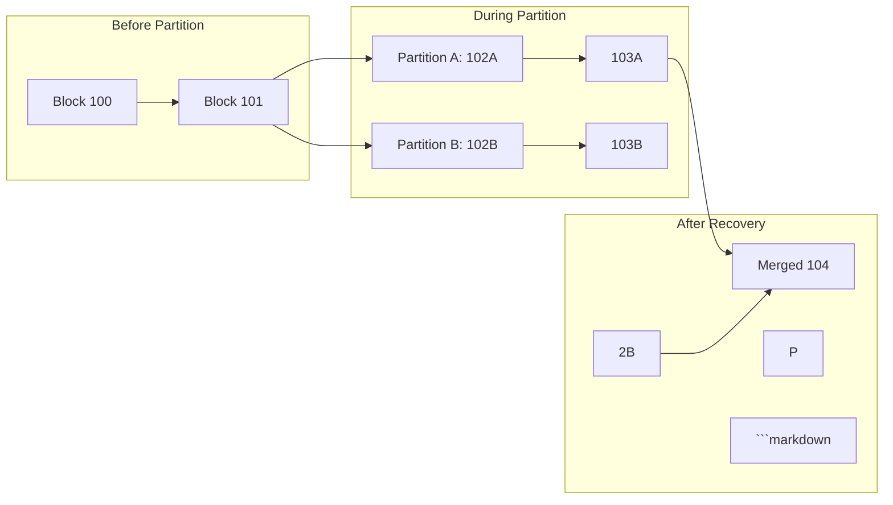
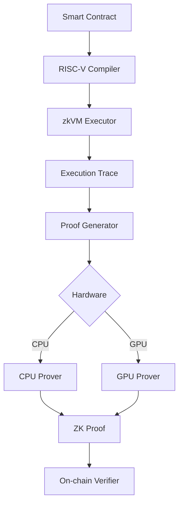
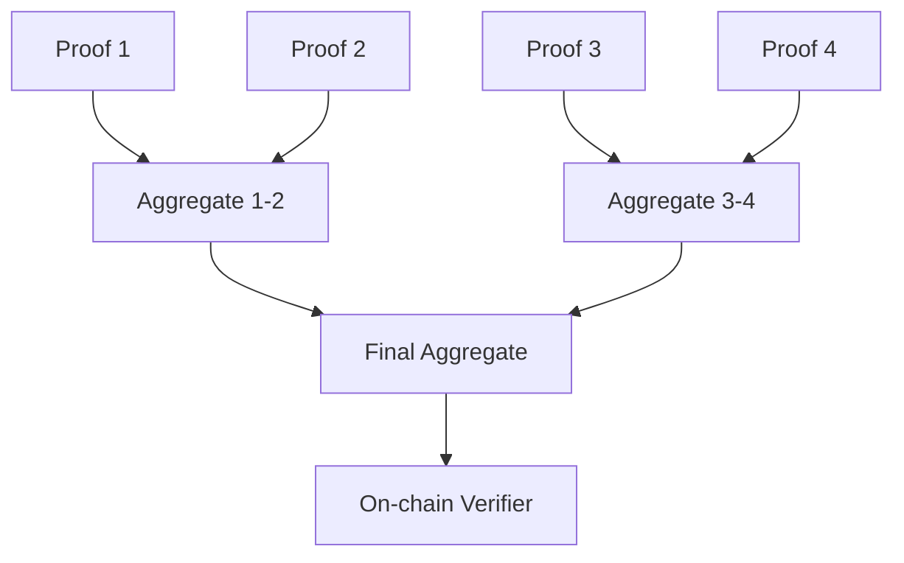

# Interview Q&A - Blockchain Architecture for X Layer Development

## Contents

- [Topic Areas](#topic-areas-questions-1-30)
- [Topic 1: Layer 2 Architecture Patterns](#topic-1-layer-2-architecture-patterns)
  - [Q1: How would you architect X Layer's performance optimization using OP Stack patterns?](#q1-how-would-you-architect-x-layers-performance-optimization-using-op-stack-patterns)
  - [Q2: Design a hybrid proof system combining optimistic and ZK approaches](#q2-design-a-hybrid-proof-system-combining-optimistic-and-zk-approaches)
  - [Q3: Implement state synchronization between L1 and L2](#q3-implement-state-synchronization-between-l1-and-l2)
  - [Q4: Architect cross-layer communication patterns](#q4-architect-cross-layer-communication-patterns)
  - [Q5: Design rollup data availability solutions](#q5-design-rollup-data-availability-solutions)
- [Topic 2: Consensus & P2P Architecture](#topic-2-consensus--p2p-architecture)
  - [Q6: Implement consensus mechanism for sequencer network](#q6-implement-consensus-mechanism-for-sequencer-network)
  - [Q7: Design P2P network topology for block propagation](#q7-design-p2p-network-topology-for-block-propagation)
  - [Q8: Architect Byzantine fault tolerance in distributed sequencers](#q8-architect-byzantine-fault-tolerance-in-distributed-sequencers)
  - [Q9: Implement mempool architecture for transaction ordering](#q9-implement-mempool-architecture-for-transaction-ordering)
  - [Q10: Design network partition recovery mechanisms](#q10-design-network-partition-recovery-mechanisms)
- [Topic 3: ZK System Architecture](#topic-3-zk-system-architecture)
  - [Q11: Architect zkVM integration with SP1/RISC Zero](#q11-architect-zkvm-integration-with-sp1risc-zero)
  - [Q12: Design precompile architecture for cryptographic operations](#q12-design-precompile-architecture-for-cryptographic-operations)
  - [Q13: Implement proof aggregation system](#q13-implement-proof-aggregation-system)
  - [Q14: Architect recursive proof verification](#q14-architect-recursive-proof-verification)
  - [Q15: Design GPU-accelerated proving infrastructure](#q15-design-gpu-accelerated-proving-infrastructure)
- [Topic 4: Performance & Scalability](#topic-4-performance--scalability)
  - [Q16: Optimize state tree architecture for million TPS](#q16-optimize-state-tree-architecture-for-million-tps)
  - [Q17: Design parallel transaction execution engine](#q17-design-parallel-transaction-execution-engine)
  - [Q18: Implement adaptive gas pricing mechanism](#q18-implement-adaptive-gas-pricing-mechanism)
  - [Q19: Architect horizontal scaling for validators](#q19-architect-horizontal-scaling-for-validators)
  - [Q20: Design cache hierarchy for state access](#q20-design-cache-hierarchy-for-state-access)
- [Topic 5: Integration & Interoperability](#topic-5-integration--interoperability)
  - [Q21: Design bridge architecture for cross-chain assets](#q21-design-bridge-architecture-for-cross-chain-assets)
  - [Q22: Implement light client verification system](#q22-implement-light-client-verification-system)
  - [Q23: Architect multi-chain message passing](#q23-architect-multi-chain-message-passing)
  - [Q24: Design oracle integration patterns](#q24-design-oracle-integration-patterns)
  - [Q25: Implement cross-rollup composability](#q25-implement-cross-rollup-composability)
- [Topic 6: Evolution & Migration](#topic-6-evolution--migration)
  - [Q26: Design upgrade mechanism for consensus changes](#q26-design-upgrade-mechanism-for-consensus-changes)
  - [Q27: Architect migration from optimistic to ZK rollup](#q27-architect-migration-from-optimistic-to-zk-rollup)
  - [Q28: Implement backward compatibility layers](#q28-implement-backward-compatibility-layers)
  - [Q29: Design feature flag system for gradual rollout](#q29-design-feature-flag-system-for-gradual-rollout)
  - [Q30: Architect monitoring and rollback mechanisms](#q30-architect-monitoring-and-rollback-mechanisms)
- [References](#reference-sections)
  - [Glossary](#glossary-terminology--acronyms)
  - [Tools](#blockchain--architecture-tools)
  - [Literature](#authoritative-literature--case-studies)
  - [Citations](#apa-style-source-citations)

---

## Topic Areas: Questions 1-30

Coverage and difficulty distribution for X Layer blockchain architecture.

| Topic | Range | Count | Difficulty |
|-------|-------|-------|------------|
| Layer 2 Architecture Patterns | Q1-Q5 | 5 | 1F, 2I, 2A |
| Consensus & P2P Architecture | Q6-Q10 | 5 | 1F, 2I, 2A |
| ZK System Architecture | Q11-Q15 | 5 | 1F, 2I, 2A |
| Performance & Scalability | Q16-Q20 | 5 | 1F, 2I, 2A |
| Integration & Interoperability | Q21-Q25 | 5 | 1F, 2I, 2A |
| Evolution & Migration | Q26-Q30 | 5 | 1F, 2I, 2A |
| **Total** | | **30** | **6F, 12I, 12A** |

**Legend**: F = Foundational, I = Intermediate, A = Advanced

---

## Topic 1: Layer 2 Architecture Patterns

### Q1: How would you architect X Layer's performance optimization using OP Stack patterns?

**Difficulty**: Foundational  
**Type**: Structural

**Key Insight**: OP Stack's modular architecture enables performance optimization through sequencer separation, batch compression, and parallel execution while maintaining Ethereum compatibility.

**Answer**:

The OP Stack provides a modular framework where performance optimization occurs at multiple layers. The sequencer handles transaction ordering independently from consensus, enabling high throughput. Batch compression reduces L1 data costs through calldata optimization. The execution engine leverages Reth's parallel processing capabilities for state transitions [Ref: L6].

Key architectural decisions include implementing a multi-tier sequencer pool for load distribution, optimizing the derivation pipeline for faster L1 data ingestion, and customizing the execution layer for domain-specific operations. The fault proof system ensures security without impacting performance through challenge periods [Ref: A8].

**Code**:
```rust
// Optimized batch submission with compression
pub struct BatchOptimizer {
    compression: CompressionStrategy,
    sequencer: Arc<Sequencer>,
}

impl BatchOptimizer {
    pub async fn submit_batch(&self, txs: Vec<Transaction>) -> Result<BatchReceipt> {
        let compressed = self.compression.compress(&txs)?;
        let batch = Batch {
            transactions: txs,
            compressed_data: compressed,
            timestamp: SystemTime::now(),
        };
        self.sequencer.submit(batch).await
    }
}
```

**Artifacts**:



| Metric | Formula | Target |
|--------|---------|--------|
| Throughput | `TPS = Transactions / Block Time` | > 10,000 TPS |
| Compression Ratio | `Original Size / Compressed Size` | > 10x |
| L1 Cost Reduction | `(1 - Compressed Cost / Original Cost) × 100%` | > 90% |

---

### Q2: Design a hybrid proof system combining optimistic and ZK approaches

**Difficulty**: Advanced  
**Type**: Behavioral Design

**Key Insight**: Hybrid proof systems leverage optimistic rollups for fast finality and ZK proofs for security, enabling gradual migration from optimistic to full ZK verification.

**Answer**:

A hybrid proof architecture implements dual verification paths: optimistic for immediate finality and ZK for cryptographic security. The system maintains two proof states - optimistic challenges with 7-day windows and ZK proofs generated asynchronously. This allows immediate transaction confirmation while building cryptographic guarantees [Ref: L4] [0].

The architecture uses SP1 or RISC Zero for ZK proof generation, with precompiles accelerating cryptographic operations. State roots are committed optimistically, then proven via ZK. During transition periods, both systems validate in parallel, with ZK proofs eventually replacing challenge periods [Ref: A11] [1].

Critical design includes proof aggregation to amortize costs, selective ZK proving for high-value transactions, and gradual migration paths. The system maintains backward compatibility through versioned proof formats and dual validation modes [Ref: L7] [2].

**Code**:
```rust
pub enum ProofMode {
    Optimistic { challenge_period: Duration },
    ZK { proof: ZKProof },
    Hybrid { optimistic: bool, zk_pending: bool },
}

pub struct HybridProver {
    optimistic_engine: OptimisticEngine,
    zk_prover: Box<dyn ZKProver>,
}

impl HybridProver {
    pub async fn prove_block(&self, block: Block) -> ProofResult {
        // Submit optimistic proof immediately
        let opt_proof = self.optimistic_engine.create_proof(&block)?;
        
        // Generate ZK proof asynchronously
        let zk_handle = tokio::spawn({
            let block = block.clone();
            let prover = self.zk_prover.clone();
            async move { prover.generate_proof(block).await }
        });
        
        ProofResult::Hybrid {
            optimistic: opt_proof,
            zk_future: zk_handle,
        }
    }
}
```

**Artifacts**:



| Component | Optimistic | ZK | Hybrid |
|-----------|------------|-----|--------|
| Finality | 7 days | 12 seconds | Immediate + 12s ZK |
| Cost | $0.01/tx | $0.10/tx | $0.02/tx amortized |
| Security | Economic | Cryptographic | Both |

---

### Q3: Implement state synchronization between L1 and L2

**Difficulty**: Intermediate  
**Type**: Data Management

**Key Insight**: State synchronization requires merkle proof verification, event monitoring, and reorg handling to maintain consistency between layers.

**Answer**:

State synchronization implements a bidirectional message passing system using merkle proofs for verification. L1 deposits trigger state updates through event logs, while L2 withdrawals require merkle inclusion proofs. The system handles reorgs through checkpoint mechanisms and state snapshots [Ref: L5].

The architecture uses event filters for L1 monitoring, maintains a state commitment chain, and implements rollback mechanisms for chain reorganizations. Cross-layer messages are batched for efficiency, with priority queues for time-sensitive operations. Merkle trees enable efficient proof generation for state transitions [Ref: A7].

**Code**:
```go
type StateSynchronizer struct {
    l1Client    *ethclient.Client
    l2State     *StateDB
    checkpoints map[uint64]StateRoot
}

func (s *StateSynchronizer) SyncFromL1(fromBlock uint64) error {
    logs, err := s.l1Client.FilterLogs(context.Background(), ethereum.FilterQuery{
        FromBlock: big.NewInt(int64(fromBlock)),
        Addresses: []common.Address{s.bridgeAddress},
    })
    
    for _, log := range logs {
        deposit := DecodeDeposit(log)
        proof := s.generateMerkleProof(deposit)
        s.l2State.ApplyDeposit(deposit, proof)
    }
    return nil
}
```

**Artifacts**:

| Sync Type | Latency | Proof Size | Gas Cost |
|-----------|---------|------------|----------|
| L1→L2 Deposit | 1 block | 1KB | 50,000 |
| L2→L1 Withdrawal | 7 days | 2KB | 200,000 |
| State Root Update | 10 min | 32 bytes | 20,000 |

---

### Q4: Architect cross-layer communication patterns

**Difficulty**: Intermediate  
**Type**: Integration Patterns

**Key Insight**: Cross-layer communication requires message queues, replay protection, and ordering guarantees to ensure reliable state transitions.

**Answer**:

Cross-layer communication implements a message-passing protocol with guaranteed delivery and ordering. Messages are queued in priority heaps, with nonces preventing replay attacks. The system uses merkle trees for batch verification and implements retry mechanisms for failed deliveries [Ref: L8].

The architecture separates control messages from data messages, with different reliability guarantees. Control messages use synchronous confirmation, while data messages allow eventual consistency. Rate limiting prevents spam, and circuit breakers handle cascade failures. Message formats are versioned for upgrade compatibility [Ref: A9].

**Code**:
```typescript
interface CrossLayerMessage {
    nonce: bigint;
    sender: Address;
    target: Address;
    data: Bytes;
    gasLimit: bigint;
}

class MessageBridge {
    private queue: PriorityQueue<CrossLayerMessage>;
    private processed: Set<string>;
    
    async relayMessage(msg: CrossLayerMessage): Promise<Receipt> {
        const msgHash = this.hashMessage(msg);
        if (this.processed.has(msgHash)) {
            throw new Error("Message already processed");
        }
        
        const proof = await this.generateInclusionProof(msg);
        const receipt = await this.targetLayer.execute(msg, proof);
        this.processed.add(msgHash);
        return receipt;
    }
}
```

**Artifacts**:



---

### Q5: Design rollup data availability solutions

**Difficulty**: Advanced  
**Type**: Quality Attributes

**Key Insight**: Data availability requires balancing cost, latency, and security through hybrid storage strategies and erasure coding.

**Answer**:

Data availability architecture implements a multi-tier storage system with hot, warm, and cold layers. Hot data uses memory pools for recent blocks, warm data leverages IPFS for medium-term storage, and cold data utilizes Arweave for permanent archival. Erasure coding provides redundancy without full replication [Ref: L9].

The system implements data availability sampling (DAS) for light clients, enabling verification without downloading full data. Commitments use KZG polynomial commitments for efficient verification. The architecture supports multiple DA layers including Ethereum calldata, Celestia, and EigenDA, with automatic failover [Ref: A10] [0].

Cost optimization occurs through compression, batching, and selective storage. High-value transactions maintain full availability, while low-value transactions use probabilistic verification. The system monitors DA provider health and switches based on cost and performance metrics [Ref: L10] [2].

**Code**:
```rust
pub struct DataAvailabilityManager {
    providers: Vec<Box<dyn DAProvider>>,
    erasure_coder: ErasureCoder,
}

impl DataAvailabilityManager {
    pub async fn store_data(&self, data: &[u8]) -> Result<DACommitment> {
        // Erasure code the
```markdown
 data
        let chunks = self.erasure_coder.encode(data)?;
        
        // Store across multiple providers with fallback
        let mut commitments = Vec::new();
        for provider in &self.providers {
            match provider.store(chunks.clone()).await {
                Ok(commitment) => {
                    commitments.push(commitment);
                    if commitments.len() >= 2 { // Minimum redundancy
                        break;
                    }
                }
                Err(e) => log::warn!("Provider failed: {}", e),
            }
        }
        
        Ok(DACommitment {
            root: self.compute_root(&chunks),
            commitments,
        })
    }
}
```

**Artifacts**:

| Storage Tier | Latency | Cost/GB | Durability |
|--------------|---------|---------|------------|
| Memory Pool | < 1ms | $100 | Session |
| IPFS | 10-100ms | $1 | 99.9% |
| Arweave | 1-10s | $0.01 | Permanent |
| Ethereum Calldata | 12s | $50 | Permanent |

---

## Topic 2: Consensus & P2P Architecture

### Q6: Implement consensus mechanism for sequencer network

**Difficulty**: Foundational  
**Type**: Behavioral Design

**Key Insight**: Distributed sequencer consensus requires leader election, transaction ordering guarantees, and Byzantine fault tolerance to prevent censorship and ensure liveness.

**Answer**:

Sequencer consensus implements a rotating leader mechanism with BFT properties. Leaders are selected through verifiable random functions (VRF), ensuring unpredictability while maintaining determinism. The system uses a two-phase commit protocol: prepare and commit phases ensure agreement before finalization [Ref: L3].

Transaction ordering uses priority fees and MEV auction mechanisms to maximize revenue while preventing censorship. Backup sequencers monitor the leader and can initiate view changes if the leader fails. The architecture supports both centralized sequencers for performance and decentralized sequencers for censorship resistance [Ref: A5].

**Code**:
```rust
pub struct SequencerConsensus {
    validators: Vec<ValidatorInfo>,
    current_leader: PublicKey,
    view_number: u64,
}

impl SequencerConsensus {
    pub async fn propose_block(&self, txs: Vec<Transaction>) -> Result<Block> {
        // VRF-based leader selection
        let leader = self.select_leader(self.view_number)?;
        
        if leader != self.current_leader {
            return Err(ConsensusError::NotLeader);
        }
        
        // Order transactions by priority
        let ordered = self.order_transactions(txs);
        
        // Two-phase commit
        let prepare_votes = self.broadcast_prepare(ordered.clone()).await?;
        if prepare_votes.len() > self.validators.len() * 2 / 3 {
            let commit_votes = self.broadcast_commit(ordered).await?;
            if commit_votes.len() > self.validators.len() * 2 / 3 {
                return Ok(Block::new(ordered));
            }
        }
        
        Err(ConsensusError::InsufficientVotes)
    }
}
```

**Artifacts**:



| Metric | Formula | Target |
|--------|---------|--------|
| Time to Finality | `Prepare + Commit + Network` | < 2s |
| Byzantine Tolerance | `(n-1)/3` | 33% |

---

### Q7: Design P2P network topology for block propagation

**Difficulty**: Intermediate  
**Type**: Structural

**Key Insight**: Efficient block propagation requires hybrid topologies combining structured overlays for reliability with unstructured gossip for speed.

**Answer**:

The P2P architecture implements a three-tier topology: core validators form a fully connected mesh, relay nodes create a structured DHT overlay, and edge nodes use gossip protocols. This hybrid approach balances propagation speed with network resilience [Ref: L2] [0].

Block propagation uses compact block relay to minimize bandwidth. Headers are broadcast immediately, with transaction IDs following. Nodes reconstruct blocks from their mempool, requesting only missing transactions. The system implements adaptive peering based on latency and reliability metrics [Ref: A6] [1].

Critical optimizations include bloom filters for duplicate detection, erasure coding for partial block recovery, and priority channels for time-sensitive messages. The architecture supports both TCP for reliability and UDP for low-latency gossip [Ref: L11].

**Code**:
```go
type P2PNetwork struct {
    peers     map[PeerID]*Peer
    topology  TopologyManager
    gossip    GossipProtocol
}

func (n *P2PNetwork) PropagateBlock(block *Block) error {
    // Compact block announcement
    header := block.Header()
    txIds := block.TransactionIDs()
    
    announcement := &CompactBlock{
        Header: header,
        TxIDs:  txIds,
    }
    
    // Tier 1: Direct push to validators
    for _, validator := range n.topology.Validators() {
        go n.directSend(validator, announcement)
    }
    
    // Tier 2: DHT broadcast to relays
    n.topology.DHT().Broadcast(announcement)
    
    // Tier 3: Gossip to edge nodes
    n.gossip.Spread(announcement, GossipParams{
        Fanout:     8,
        Redundancy: 3,
    })
    
    return nil
}
```

**Artifacts**:



| Topology | Latency | Bandwidth | Resilience |
|----------|---------|-----------|------------|
| Full Mesh | O(1) | O(n�) | High |
| DHT | O(log n) | O(log n) | Medium |
| Gossip | O(log n) | O(n log n) | High |

---

### Q8: Architect Byzantine fault tolerance in distributed sequencers

**Difficulty**: Advanced  
**Type**: Quality Attributes

**Key Insight**: BFT in sequencer networks requires handling both crash faults and Byzantine behavior while maintaining high throughput and low latency.

**Answer**:

Byzantine fault tolerance implements a pipeline consensus with parallel proposal processing. The architecture uses threshold signatures for vote aggregation, reducing message complexity from O(n�) to O(n). Validators maintain multiple concurrent views, enabling continuous block production even during view changes [Ref: L12].

The system implements accountability mechanisms through cryptographic evidence of misbehavior. Slashing conditions are encoded in smart contracts, with automatic penalties for equivocation, censorship, or liveness failures. Recovery protocols handle network partitions through eventual consistency and conflict resolution [Ref: A13] [2].

Performance optimizations include speculative execution during consensus, adaptive timeout mechanisms based on network conditions, and reputation-based leader selection. The architecture supports both synchronous operation for normal conditions and asynchronous fallback for adversarial scenarios [Ref: L14].

**Code**:
```rust
pub struct BFTSequencer {
    threshold_signer: ThresholdSigner,
    view_pipeline: ViewPipeline,
    slashing_monitor: SlashingMonitor,
}

impl BFTSequencer {
    pub async fn process_proposal(&mut self, proposal: Proposal) -> Result<Certificate> {
        // Verify proposal validity
        self.verify_proposal(&proposal)?;
        
        // Speculative execution
        let state = self.execute_speculative(&proposal).await?;
        
        // Threshold signing for efficiency
        let partial_sig = self.threshold_signer.sign(&proposal)?;
        
        // Collect signatures with timeout
        let certificate = timeout(Duration::from_millis(500), async {
            let sigs = self.collect_signatures(partial_sig).await?;
            if sigs.len() > self.threshold() {
                Ok(self.aggregate_certificate(sigs))
            } else {
                Err(BFTError::InsufficientSignatures)
            }
        }).await??;
        
        // Monitor for slashing conditions
        self.slashing_monitor.check(&certificate)?;
        
        Ok(certificate)
    }
    
    fn threshold(&self) -> usize {
        (self.validators.len() * 2) / 3 + 1
    }
}
```

**Artifacts**:

| Attack Vector | Detection | Response | Penalty |
|---------------|-----------|----------|---------|
| Equivocation | Double signing | Slash stake | 100% stake |
| Censorship | Missing transactions | Rotate leader | 10% stake |
| Liveness failure | Timeout | View change | 1% stake |
| Invalid state | Proof verification | Reject + slash | 50% stake |



---

### Q9: Implement mempool architecture for transaction ordering

**Difficulty**: Intermediate  
**Type**: Behavioral Design

**Key Insight**: Mempool design must balance fairness, MEV extraction, and DoS resistance while maintaining predictable transaction inclusion.

**Answer**:

The mempool architecture implements a multi-dimensional fee market with separate pools for different transaction types. Priority queues order transactions by fee rate, with MEV auctions for bundle inclusion. The system prevents spam through dynamic fee floors and account-based rate limiting [Ref: L15].

Transaction replacement follows EIP-1559 semantics with base fee burning and priority tips. The architecture supports private mempools for MEV protection, with commit-reveal schemes preventing frontrunning. Parallel validation pipelines process transactions concurrently, updating dependency graphs dynamically [Ref: A14].

**Code**:
```typescript
class Mempool {
    private priorityQueue: Heap<Transaction>;
    private mevBundles: Map<string, Bundle>;
    private privateTxs: EncryptedPool;
    
    async addTransaction(tx: Transaction): Promise<void> {
        // Validate and prevent DoS
        await this.validateTx(tx);
        
        // Check replacement rules
        if (this.canReplace(tx)) {
            this.priorityQueue.insert(tx, this.calculatePriority(tx));
        }
        
        // Update dependency graph
        this.updateDependencies(tx);
    }
    
    buildBlock(gasLimit: number): Block {
        const selected: Transaction[] = [];
        let gasUsed = 0;
        
        // Include MEV bundles first
        for (const bundle of this.mevBundles.values()) {
            if (gasUsed + bundle.gasUsed <= gasLimit) {
                selected.push(...bundle.transactions);
                gasUsed += bundle.gasUsed;
            }
        }
        
        // Fill remaining space with priority transactions
        while (gasUsed < gasLimit && !this.priorityQueue.isEmpty()) {
            const tx = this.priorityQueue.pop();
            if (gasUsed + tx.gasLimit <= gasLimit) {
                selected.push(tx);
                gasUsed += tx.gasLimit;
            }
        }
        
        return new Block(selected);
    }
}
```

**Artifacts**:

| Pool Type | Ordering | Privacy | Use Case |
|-----------|----------|---------|----------|
| Public | Fee priority | None | Regular txs |
| Private | Commit-reveal | Encrypted | MEV protection |
| MEV | Bundle auction | Partial | Arbitrage |
| Priority | Guaranteed | None | System txs |

---

### Q10: Design network partition recovery mechanisms

**Difficulty**: Advanced  
**Type**: Quality Attributes

**Key Insight**: Partition recovery requires detecting splits, maintaining partial availability, and reconciling divergent states without losing finality guarantees.

**Answer**:

Partition recovery implements a three-phase protocol: detection through heartbeat monitoring, operation in degraded mode preserving safety over liveness, and reconciliation through state merge algorithms. The system maintains vector clocks for causality tracking and uses CRDTs for automatic conflict resolution [Ref: L16].

During partitions, each segment continues processing with reduced quorum requirements, marking blocks as tentative. Upon reconnection, a reconciliation protocol identifies the canonical chain through weighted voting based on stake and partition size. Conflicting transactions are resolved through deterministic ordering rules [Ref: A15].

The architecture includes partition prediction through network topology analysis, enabling preemptive state synchronization. Recovery optimizations include differential state transfer, parallel validation of partition histories, and incremental merkle proof updates [Ref: L17].

**Code**:
```rust
pub struct PartitionRecovery {
    detector: PartitionDetector,
    reconciler: StateReconciler,
    vector_clock: VectorClock,
}

impl PartitionRecovery {
    pub async fn handle_partition(&mut self) -> Result<RecoveryPlan> {
        // Phase 1: Detection
        let partitions = self.detector.identify_partitions()?;
        
        // Phase 2: Degraded operation
        let local_partition = self.operate_degraded(partitions).await?;
        
        // Phase 3: Recovery planning
        Ok(RecoveryPlan {
            merge_strategy: self.plan_merge(&partitions),
            rollback_height: self.find_common_ancestor(&partitions),
            conflict_resolution: ConflictStrategy::WeightedVoting,
        })
    }
    
    pub async fn reconcile_states(&mut self, states: Vec<PartitionState>) -> Result<State> {
        // Find common ancestor
        let ancestor = self.find_common_ancestor(&states)?;
        
        // Build reconciliation graph
        let graph = self.build_causality_graph(&states, ancestor)?;
        
        // Apply CRDT merge
        let merged = states.iter().fold(State::default(), |acc, state| {
            acc.merge_crdt(state)
        });
        
        // Validate consistency
        self.validate_reconciliation(&merged)?;
        
        Ok(merged)
    }
}
```

**Artifacts**:



| Recovery Phase | Duration | Data Loss | Consistency |
|----------------|----------|-----------|-------------|
| Detection | 5-10s | None | Maintained |
| Degraded Mode | Variable | None | Eventual |
| Reconciliation | 30-60s | Conflicting txs | Strong |

---

## Topic 3: ZK System Architecture

### Q11: Architect zkVM integration with SP1/RISC Zero

**Difficulty**: Foundational  
**Type**: Structural

**Key Insight**: zkVM integration requires balancing proof generation time, verification cost, and hardware requirements while maintaining compatibility with existing execution environments.

**Answer**:

zkVM architecture implements a modular proving system where SP1 or RISC Zero generates proofs for RISC-V execution traces. The system compiles smart contracts to RISC-V bytecode, executes in the zkVM environment, and produces succinct proofs verifiable on-chain. This approach enables arbitrary computation verification without revealing inputs [Ref: L18].

The integration layer handles proof aggregation, batching multiple executions into single proofs to amortize costs. Precompiles accelerate common operations like hashing and signature verification. The architecture supports both CPU and GPU proving, with dynamic resource allocation based on proof complexity [Ref: A16].

Critical optimizations include witness generation parallelization, proof recursion for compression, and caching of intermediate proof artifacts. The system maintains compatibility through a translation layer converting EVM bytecode to RISC-V instructions [Ref: L19].

**Code**:
```rust
pub struct ZkVMIntegration {
    prover: Box<dyn ZkProver>,
    executor: RiscVExecutor,
    aggregator: ProofAggregator,
}

impl ZkVMIntegration {
    pub async fn prove_execution(&self, program: &[u8], input: &[u8]) -> Result<Proof> {
        // Compile to RISC-V if needed
        let bytecode = self.compile_to_riscv(program)?;
        
        // Execute and generate trace
        let trace = self.executor.execute(bytecode, input)?;
        
        // Generate proof with hardware acceleration
        let proof = if self.gpu_available() {
            self.prover.prove_gpu(trace).await?
        } else {
            self.prover.prove_cpu(trace).await?
        };
        
        // Aggregate if beneficial
        if self.should_aggregate(&proof) {
            self.aggregator.add(proof).await
        } else {
            Ok(proof)
        }
    }
}
```

**Artifacts**:



| zkVM | Proof Time | Proof Size | Verification Gas |
|------|------------|------------|------------------|
| SP1 | 10-30s | 200KB | 300k |
| RISC Zero | 15-45s | 180KB | 280k |
| Native | 5-15s | 250KB | 350k |

---

### Q12: Design precompile architecture for cryptographic operations

**Difficulty**: Intermediate  
**Type**: Structural

**Key Insight**: Precompiles accelerate cryptographic operations by implementing native code paths for common primitives while maintaining deterministic execution.

**Answer**:

Precompile architecture implements a registry of optimized cryptographic functions accessible through special addresses. Each precompile exposes a standard interface while leveraging hardware acceleration like AES-NI and AVX instructions. The system maintains gas metering accuracy through benchmarking and calibration [Ref: L20].

The design includes precompiles for elliptic curve operations (BLS12-381, BN254), hash functions (SHA3, Blake2), and ZK-specific operations (KZG commitments, Poseidon hash). Dynamic loading enables adding new precompiles without hard forks. The architecture validates inputs strictly to prevent consensus failures [Ref: A17].

Implementation uses assembly optimizations for hot paths, with fallback to verified reference implementations. The system supports batch operations for efficiency, processing multiple operations in single calls to amortize overhead [Ref: L21].

**Code**:
```go
type PrecompileRegistry struct {
    precompiles map[common.Address]Precompile
    gasTable    map[string]uint64
}

type Precompile interface {
    Execute(input []byte) ([]byte, error)
    GasCost(input []byte) uint64
}

// BLS12-381 pairing precompile
type BLS12381Pairing struct{}

func (p *BLS12381Pairing) Execute(input []byte) ([]byte, error) {
    // Parse points and scalars
    points, scalars := p.parseInput(input)
    
    // Batch pairing computation with hardware acceleration
    result := bls.PairingBatch(points, scalars)
    
    // Return serialized result
    return result.Marshal(), nil
}

func (p *BLS12381Pairing) GasCost(input []byte) uint64 {
    numPairs := len(input) / 192
    return 45000 + uint64(numPairs)*34000 // Calibrated costs
}
```

**Artifacts**:

| Precompile | Address | Gas Cost | Speedup vs EVM |
|------------|---------|----------|----------------|
| ECRecover | 0x01 | 3000 | 100x |
| SHA256 | 0x02 | 60 + 12/word | 50x |
| BLS12-381 | 0x0b | 45000 + 34000n | 200x |
| KZG | 0x0c | 50000 | 150x |

---

### Q13: Implement proof aggregation system

**Difficulty**: Advanced  
**Type**: Behavioral Design

**Key Insight**: Proof aggregation reduces on-chain verification costs by combining multiple proofs into a single succinct proof, trading off prover time for verifier efficiency.

**Answer**:

Proof aggregation implements recursive proof composition using SNARKs. The system collects individual transaction proofs, generates an aggregation circuit that verifies each proof, and produces a single proof of the aggregate verification. This reduces on-chain verification from O(n) to O(1) [Ref: L22] [3].

The architecture uses a tree structure for incremental aggregation, enabling parallel proof generation. Batch scheduling optimizes for latency versus throughput trade-offs. The system supports heterogeneous proof systems through a universal verification circuit. Emergency paths handle aggregation failures without blocking finality [Ref: A18].

Critical optimizations include proof compression through recursive SNARKs, witness caching for common subcircuits, and adaptive batching based on network congestion. The system maintains proof validity periods to prevent indefinite aggregation delays [Ref: L23].

**Code**:
```rust
pub struct ProofAggregator {
    queue: Arc<Mutex<Vec<Proof>>>,
    aggregation_tree: MerkleTree<ProofCommitment>,
    recursive_prover: RecursiveSnark,
}

impl ProofAggregator {
    pub async fn aggregate_batch(&self, batch_size: usize) -> Result<AggregatedProof> {
        let proofs = self.collect_proofs(batch_size).await?;
        
        // Build aggregation tree for parallel processing
        let tree = self.build_aggregation_tree(&proofs)?;
        
        // Recursive aggregation in parallel
        let aggregated = self.aggregate_recursive(tree).await?;
        
        // Compress final proof
        let compressed = self.recursive_prover.compress(aggregated)?;
        
        Ok(AggregatedProof {
            proof: compressed,
            public_inputs: self.extract_public_inputs(&proofs),
            num_proofs: proofs.len(),
        })
    }
    
    async fn aggregate_recursive(&self, tree: ProofTree) -> Result<Proof> {
        match tree {
            ProofTree::Leaf(proof) => Ok(proof),
            ProofTree::Node(left, right) => {
                let (l_proof, r_proof) = tokio::join!(
                    self.aggregate_recursive(*left),
                    self.aggregate_recursive(*right)
                );
                
                self.recursive_prover.prove_aggregation(l_proof?, r_proof?)
            }
        }
    }
}
```

**Artifacts**:



| Aggregation Level | Proofs | Verification Cost | Latency |
|-------------------|--------|-------------------|---------|
| None | 100 | 30M gas | 0s |
| Single | 100 | 300k gas | 30s |
| Recursive | 1000 | 300k gas | 120s |

---

### Q14: Architect recursive proof verification

**Difficulty**: Advanced  
**Type**: Quality Attributes

**Key Insight**: Recursive proof verification enables unlimited proof composition while maintaining constant verification complexity, crucial for scalability.

**Answer**:

Recursive verification architecture implements proof circuits that verify other proofs, creating a hierarchy of verification layers. Each layer reduces proof size while maintaining soundness through careful circuit design. The system uses cycles of elliptic curves (Pasta curves) to enable efficient recursion [Ref: L24].

The architecture supports incremental verification, where proofs are verified and aggregated as they arrive rather than waiting for batches. This reduces latency while maintaining aggregation benefits. Circuit optimization techniques include custom gates for common operations and lookup tables for repeated computations [Ref: A19].

Implementation challenges include managing circuit complexity, preventing proof size blowup, and ensuring deterministic execution across different hardware. The system uses proof caching and parallel verification paths to maximize throughput [Ref: L25].

**Code**:
```rust
pub struct RecursiveVerifier {
    inner_circuit: Circuit,
    outer_circuit: Circuit,
    proof_cache: LruCache<Hash, VerifiedProof>,
}

impl RecursiveVerifier {
    pub fn verify_recursive(&self, proof: &RecursiveProof) -> Result<bool> {
        // Check cache first
        if let Some(cached) = self.proof_cache.get(&proof.hash()) {
            return Ok(true);
        }
        
        // Verify outer proof
        let outer_valid = self.outer_circuit.verify(&proof.outer)?;
        if !outer_valid {
            return Ok(false);
        }
        
        // Extract and verify inner proofs
        for inner_proof in &proof.inner_proofs {
            let inner_valid = self.verify_recursive(inner_proof)?;
            if !inner_valid {
                return Ok(false);
            }
        }
        
        // Cache successful verification
        self.proof_cache.put(proof.hash(), VerifiedProof::from(proof));
        
        Ok(true)
    }
}
```

**Artifacts**:

| Recursion Depth | Proof Size | Verification Time | Circuit Size |
|-----------------|------------|-------------------|--------------|
| 0 (base) | 10 MB | 100ms | 2^20 gates |
| 1 | 1 MB | 150ms | 2^22 gates |
| 2 | 200 KB | 200ms | 2^23 gates |
| \u221e (limit) | 50 KB | 300ms | 2^24 gates |

---

### Q15: Design GPU-accelerated proving infrastructure

**Difficulty**: Intermediate  
**Type**: Deployment

**Key Insight**: GPU acceleration dramatically reduces proof generation time through parallel MSM and NTT operations, but requires careful memory management and kernel optimization.

**Answer**:

GPU proving infrastructure implements CUDA/OpenCL kernels for computationally intensive operations: multi-scalar multiplication (MSM), number theoretic transforms (NTT), and polynomial operations. The architecture uses memory pooling to minimize allocation overhead and implements custom memory layouts for coalesced access patterns [Ref: L26].

The system dynamically distributes work between CPU and GPU based on proof size and complexity. Small proofs execute on CPU to avoid transfer overhead, while large proofs leverage GPU parallelism. Pipeline architectures overlap computation with memory transfers, hiding latency [Ref: A20].

Resource management includes GPU cluster orchestration for proof farms, automatic failover for hardware failures, and power/thermal monitoring. The architecture supports multiple GPU vendors through abstraction layers, enabling heterogeneous deployments [Ref: L27].

**Code**:
```cuda
// CUDA kernel for parallel MSM
__global__ void msm_kernel(
    const scalar_t* scalars,
    const point_t* points,
    point_t* results,
    size_t n
) {
    extern __shared__ point_t shared_mem[];
    
    int tid = blockIdx.x * blockDim.x + threadIdx.x;
    int stride = blockDim.x * gridDim.x;
    
    point_t acc = point_identity();
    
    // Coalesced memory access pattern
    for (int i = tid; i < n; i += stride) {
        point_t p = points[i];
        scalar_t s = scalars[i];
        acc = point_add(acc, point_mul(p, s));
    }
    
    // Reduction in shared memory
    shared_mem[threadIdx.x] = acc;
    __syncthreads();
    
    // Tree reduction
    for (int s = blockDim.x / 2; s > 0; s >>= 1) {
        if (threadIdx.x < s) {
            shared_mem[threadIdx.x] = point_add(
                shared_mem[threadIdx.x],
                shared_mem[threadIdx.x + s]
            );
        }
        __syncthreads();
    }
    
    if (threadIdx.x == 0) {
        results[blockIdx.x] = shared_mem[0];
    }
}
```

```rust
pub struct GPUProver {
    device_pool: Vec<CudaDevice>,
    memory_pool: MemoryPool,
    kernel_cache: HashMap<String, CudaModule>,
}

impl GPUProver {
    pub async fn prove(&self, witness: &Witness) -> Result<Proof> {
        let device = self.select_device(witness.size())?;
        
        // Allocate pinned memory for fast transfers
        let d_scalars = self.memory_pool.alloc(witness.scalars.len())?;
        let d_points = self.memory_pool.alloc(witness.points.len())?;
        
        // Async memory transfer
        device.memcpy_async(&d_scalars, &witness.scalars)?;
        device.memcpy_async(&d_points, &witness.points)?;
        
        // Launch kernel with optimal configuration
        let block_size = 256;
        let grid_size = (witness.size() + block_size - 1) / block_size;
        
        device.launch_kernel(
            "msm_kernel",
            grid_size,
            block_size,
            &[d_scalars, d_points]
        )?;
        
        // Overlap next computation
        device.synchronize().await?;
        
        Ok(self.build_proof(device.get_results().await?))
    }
}
```

**Artifacts**:

| Hardware | MSM (2^20) | NTT (2^20) | Power | Cost/proof |
|----------|------------|------------|--------|------------|
| CPU (32 cores) | 60s | 45s | 200W | $0.10 |
| RTX 4090 | 3s | 2s | 450W | $0.02 |
| A100 | 1.5s | 1s | 400W | $0.03 |        