### The Evolving Landscape of Blockchain Architecture: A Deep Dive for Advanced Development

#### Introduction to Blockchain Architectural Paradigms

Blockchain technology has emerged as a transformative force, revolutionizing modern society through its inherent properties of:

- **Transparency**
- **Decentralization** 
- **Security**

Initially gaining prominence with cryptocurrencies like Bitcoin, blockchain is poised to reshape interactions and business operations in the near future.

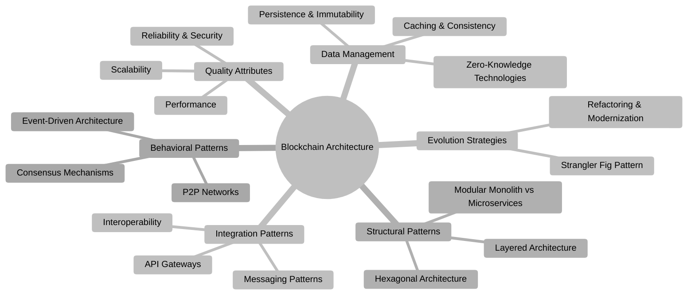
```mermaid
%%{init: {
  'theme': 'base',
  'themeVariables': {
    'primaryColor': '#ffffff',
    'primaryTextColor': '#000000',
    'primaryBorderColor': '#333333',
    'lineColor': '#666666',
    'secondaryColor': '#f0f0f0',
    'tertiaryColor': '#e8e8e8',
    'background': '#ffffff',
    'mainBkg': '#ffffff',
    'secondaryBkg': '#f5f5f5'
  }
}}%%
mindmap
  root((Blockchain Architecture))
    Structural Patterns
      Layered Architecture
      Hexagonal Architecture
      Modular Monolith vs Microservices
    Behavioral Patterns
      Consensus Mechanisms
      P2P Networks
      Event-Driven Architecture
    Quality Attributes
      Performance
      Scalability
      Reliability & Security
    Data Management
      Persistence & Immutability
      Caching & Consistency
      Zero-Knowledge Technologies
    Integration Patterns
      API Gateways
      Messaging Patterns
      Interoperability
    Evolution Strategies
      Strangler Fig Pattern
      Refactoring & Modernization
```

The architectural design of blockchain systems is paramount for addressing critical considerations such as performance, quality attributes, and overall system sustainability. This report delves into the intricate architectural patterns and design principles essential for developing advanced blockchain solutions.

**Key Focus Areas:**
- Rust programming
- OP Stack
- RETH
- Consensus mechanisms
- P2P networks
- Cryptography
- Zero-Knowledge Virtual Machines (ZKVMs) like SP1 and Risc0

### Structural Patterns in Blockchain Architecture

Effective structural patterns are foundational to designing a blockchain system that can evolve and scale. These patterns dictate how components are organized, interact, and manage dependencies.

#### Layered Architecture and Modularity

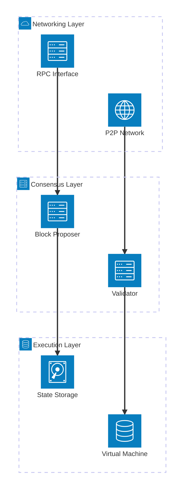
```mermaid
architecture-beta
    group networking(cloud)[Networking Layer]
    group consensus(server)[Consensus Layer]
    group execution(database)[Execution Layer]
    
    service p2p(internet)[P2P Network] in networking
    service rpc(server)[RPC Interface] in networking
    
    service validator(server)[Validator] in consensus
    service proposer(server)[Block Proposer] in consensus
    
    service vm(database)[Virtual Machine] in execution
    service state(disk)[State Storage] in execution
    
    p2p:B --> T:validator
    rpc:B --> T:proposer
    validator:B --> T:vm
    proposer:B --> T:state
```

The layered architecture is a traditional yet powerful pattern for separating concerns within a software system, which is particularly relevant in blockchain development. This pattern helps define distinct responsibilities, enhancing modularity and maintainability.

**Benefits:**
- Clear separation of concerns
- Enhanced maintainability
- Reduced coupling between layers

**Challenges:**
- Increased complexity as systems grow
- Difficulty in maintenance for monolithic architectures

#### Hexagonal Architecture for Core Logic Isolation

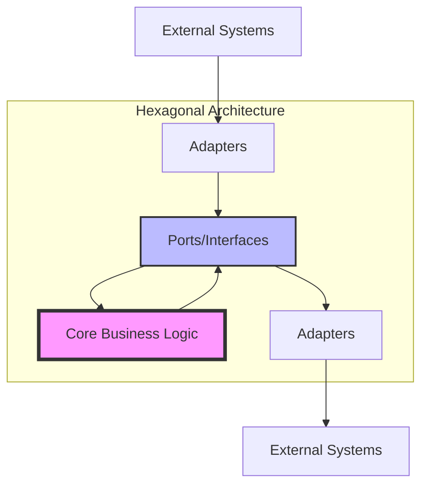
```mermaid
flowchart TD
    A[External Systems] --> B[Adapters]
    B --> C[Ports/Interfaces]
    C --> D[Core Business Logic]
    D --> C
    C --> E[Adapters]
    E --> F[External Systems]
    
    subgraph "Hexagonal Architecture"
        B
        C
        D
        E
    end
    
    style D fill:#f9f,stroke:#333,stroke-width:4px
    style C fill:#bbf,stroke:#333,stroke-width:2px
```

The Hexagonal Architecture, also known as Ports & Adapters, offers a robust approach to isolating the core business logic of a blockchain application from external concerns.

**Key Components:**
- **Ports**: Interfaces defining interactions
- **Adapters**: Implementations for specific technologies
- **Core Domain**: Technology-agnostic business logic

For Rust-based blockchain nodes, this translates into leveraging Rust's trait system for defining ports and implementing them with concrete adapter structs.

#### Modular Monolith vs. Microservices Comparison

| Aspect | Modular Monolith | Microservices |
|--------|------------------|---------------|
| **Operational Overhead** | Lower | Higher |
| **Team Size** | Smaller teams | Larger teams |
| **Scalability** | Moderate | High |
| **Deployment** | Single deployment | Independent deployments |
| **Fault Tolerance** | Limited | High |
| **Initial Complexity** | Lower | Higher |

### Behavioral Design Patterns for Blockchain Systems

Behavioral patterns define how components interact to achieve the system's overall functionality, which is critical for the dynamic and distributed nature of blockchain.

#### Consensus Mechanisms

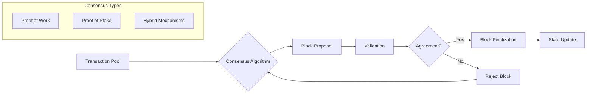
```mermaid
flowchart LR
    A[Transaction Pool] --> B{Consensus Algorithm}
    B --> C[Block Proposal]
    C --> D[Validation]
    D --> E{Agreement?}
    E -->|Yes| F[Block Finalization]
    E -->|No| G[Reject Block]
    F --> H[State Update]
    G --> B
    
    subgraph "Consensus Types"
        I[Proof of Work]
        J[Proof of Stake]
        K[Hybrid Mechanisms]
    end
```

Consensus algorithms are the bedrock of blockchain technology, enabling distributed nodes to collectively agree on the state of the ledger without a central authority.

**Key Properties:**
- **System Correctness**: Ensures valid state transitions
- **Liveness**: Guarantees progress in the system
- **Consistency**: Maintains uniform view across nodes

#### Peer-to-Peer (P2P) Networks

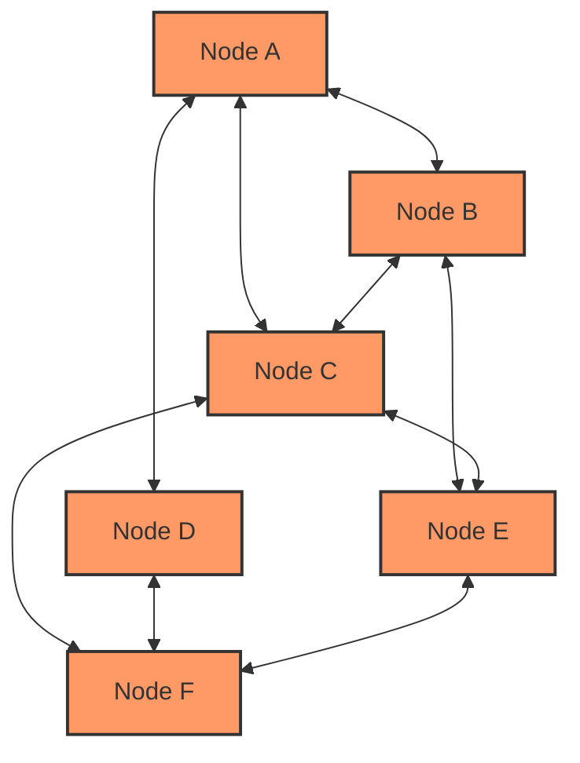
```mermaid
graph TD
    A[Node A] <--> B[Node B]
    A <--> C[Node C]
    A <--> D[Node D]
    B <--> C
    B <--> E[Node E]
    C <--> E
    C <--> F[Node F]
    D <--> F
    E <--> F
    
    style A fill:#f96,stroke:#333,stroke-width:2px
    style B fill:#f96,stroke:#333,stroke-width:2px
    style C fill:#f96,stroke:#333,stroke-width:2px
    style D fill:#f96,stroke:#333,stroke-width:2px
    style E fill:#f96,stroke:#333,stroke-width:2px
    style F fill:#f96,stroke:#333,stroke-width:2px
```

Blockchain fundamentally relies on a P2P network architecture for decentralized data sharing among untrusted participants.

**Characteristics:**
- Direct node-to-node communication
- No central server dependency
- Enhanced censorship resistance
- Improved system robustness

#### Event-Driven Architecture (EDA)

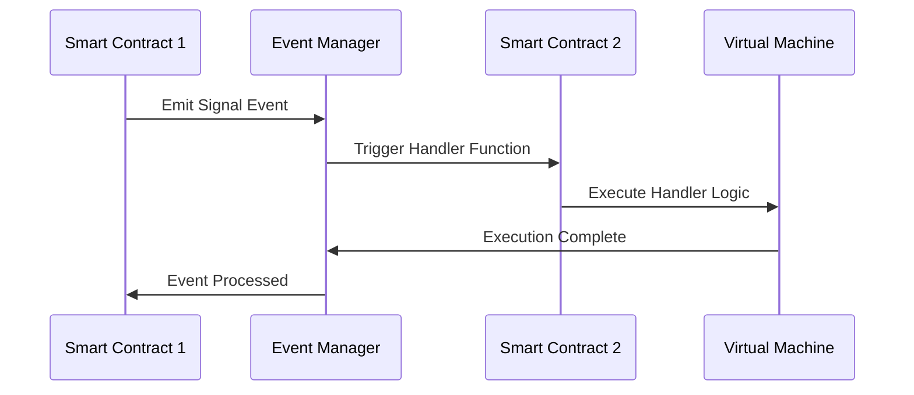
```mermaid
sequenceDiagram
    participant SC1 as Smart Contract 1
    participant EM as Event Manager
    participant SC2 as Smart Contract 2
    participant VM as Virtual Machine
    
    SC1->>EM: Emit Signal Event
    EM->>SC2: Trigger Handler Function
    SC2->>VM: Execute Handler Logic
    VM->>EM: Execution Complete
    EM->>SC1: Event Processed
```

Event-Driven Architecture offers a powerful paradigm for building responsive and scalable distributed systems by decoupling components and enabling asynchronous communication through events.

**Benefits:**
- Loose coupling between components
- Improved scalability
- Enhanced responsiveness
- Reduced dependencies on off-chain mechanisms

### Quality Attributes in Blockchain Systems

Quality attributes are non-functional requirements that define the system's desired characteristics, profoundly influencing architectural decisions.

#### Performance Metrics

| Metric | Definition | Measurement |
|--------|------------|-------------|
| **Throughput** | Transactions processed per unit time | TPS (Transactions Per Second) |
| **Latency** | Time delay for transaction confirmation | Milliseconds/Seconds |
| **Cache Hit Ratio** | Efficiency of caching system | $\frac{\text{Hits}}{\text{Total Requests}} \times 100\%$ |

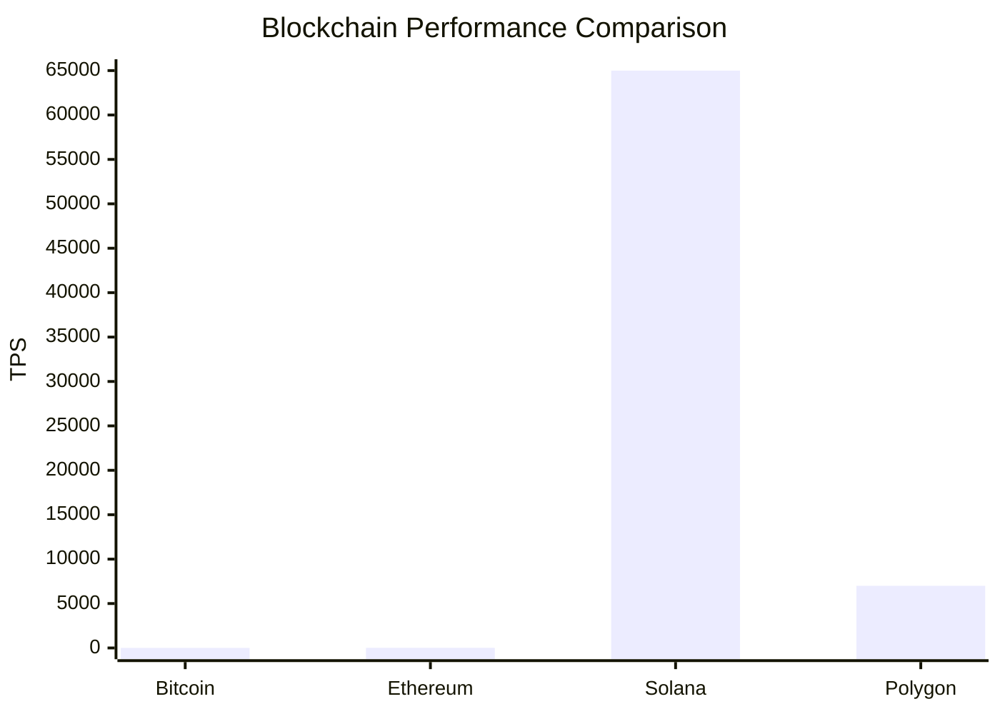
```mermaid
xychart-beta
    title "Blockchain Performance Comparison"
    x-axis ["Bitcoin", "Ethereum", "Solana", "Polygon"]
    y-axis "TPS" 0 --> 65000
    bar [7, 15, 65000, 7000]
```

#### Scalability Solutions

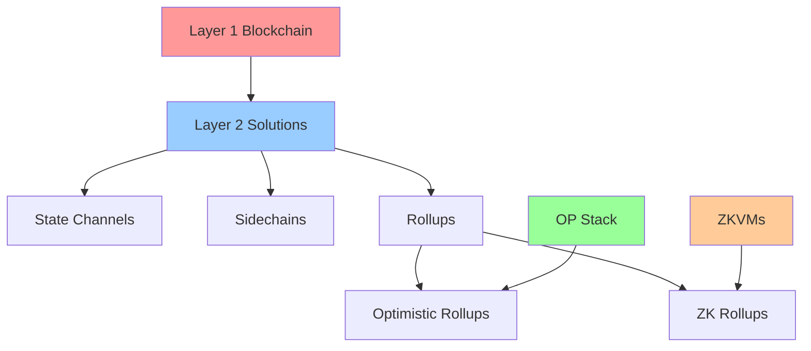
```mermaid
flowchart TD
    A[Layer 1 Blockchain] --> B[Layer 2 Solutions]
    B --> C[State Channels]
    B --> D[Sidechains]
    B --> E[Rollups]
    E --> F[Optimistic Rollups]
    E --> G[ZK Rollups]
    
    H[OP Stack] --> F
    I[ZKVMs] --> G
    
    style A fill:#ff9999
    style B fill:#99ccff
    style H fill:#99ff99
    style I fill:#ffcc99
```

#### Quality Attribute Trade-offs

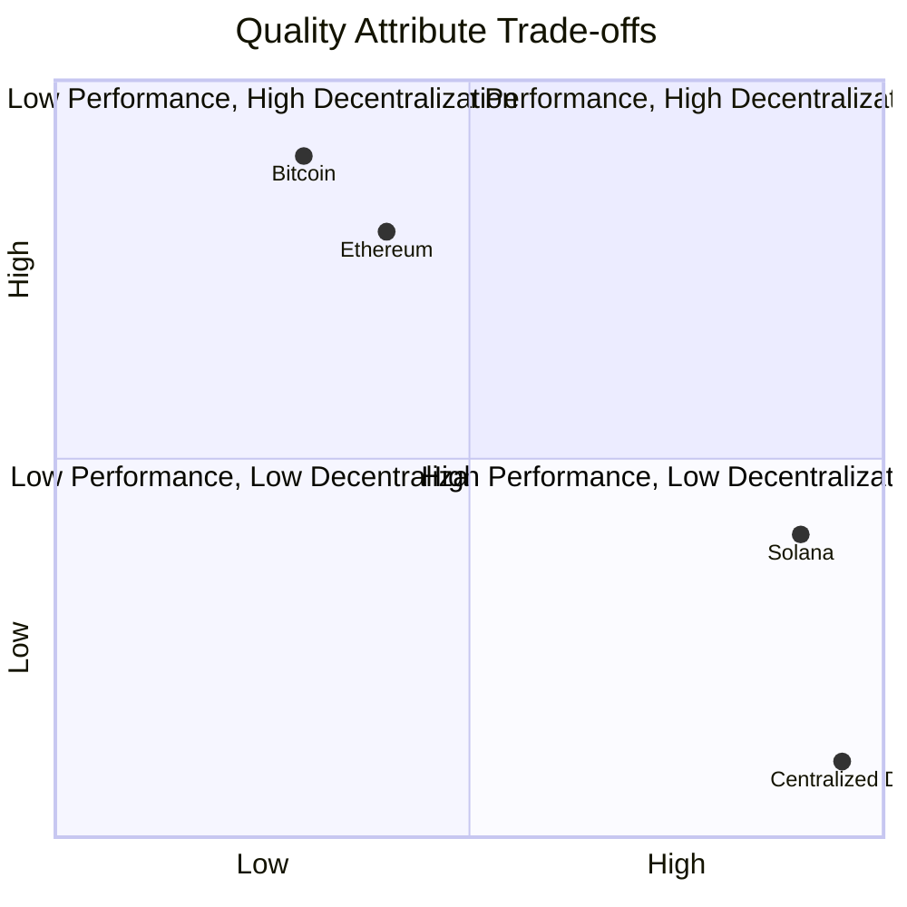
```mermaid
quadrantChart
    title Quality Attribute Trade-offs
    x-axis Low --> High
    y-axis Low --> High
    quadrant-1 High Performance, High Decentralization
    quadrant-2 Low Performance, High Decentralization
    quadrant-3 Low Performance, Low Decentralization
    quadrant-4 High Performance, Low Decentralization
    
    Bitcoin: [0.3, 0.9]
    Ethereum: [0.4, 0.8]
    Solana: [0.9, 0.4]
    Centralized DB: [0.95, 0.1]
```

### Data Management Patterns

Effective data management is crucial for blockchain systems, encompassing how data is stored, accessed, and secured.

#### Persistence and Immutability

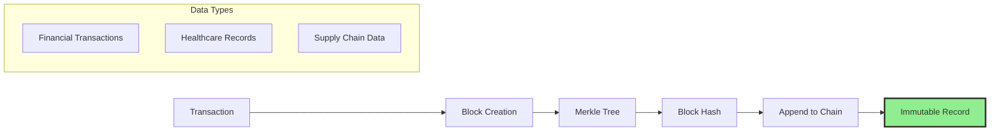
```mermaid
flowchart LR
    A[Transaction] --> B[Block Creation]
    B --> C[Merkle Tree]
    C --> D[Block Hash]
    D --> E[Append to Chain]
    E --> F[Immutable Record]
    
    subgraph "Data Types"
        G[Financial Transactions]
        H[Healthcare Records]
        I[Supply Chain Data]
    end
    
    style F fill:#90EE90,stroke:#333,stroke-width:3px
```

#### Caching and Consistency Patterns

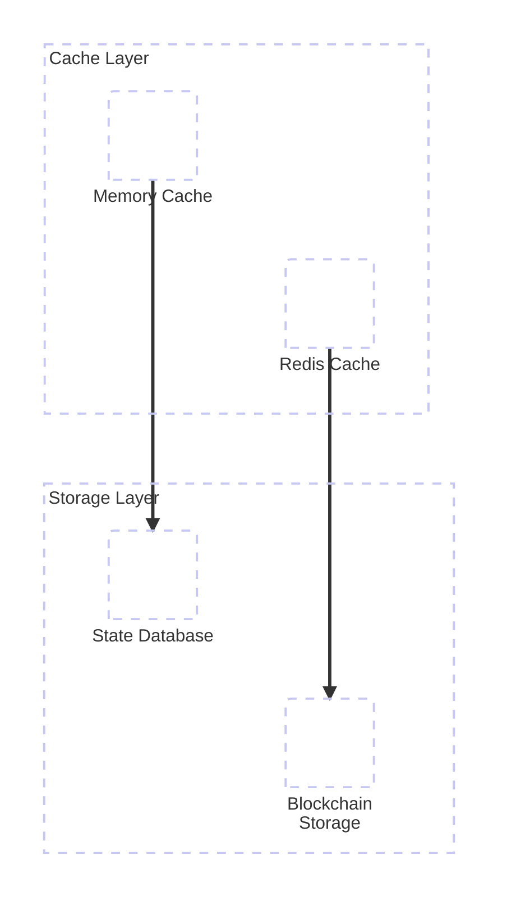
```mermaid
architecture-beta
    group cache[Cache Layer]
    group storage[Storage Layer]
    
    service redis[Redis Cache] in cache
    service memory[Memory Cache] in cache
    
    service blockchain[Blockchain Storage] in storage
    service statedb[State Database] in storage
    
    redis:B --> T:blockchain
    memory:B --> T:statedb
```

**CQRS Pattern Benefits:**
- Separation of read and write models
- Optimized query performance
- Reduced burden on transactional database
- Improved scalability for read operations

#### Zero-Knowledge Technologies

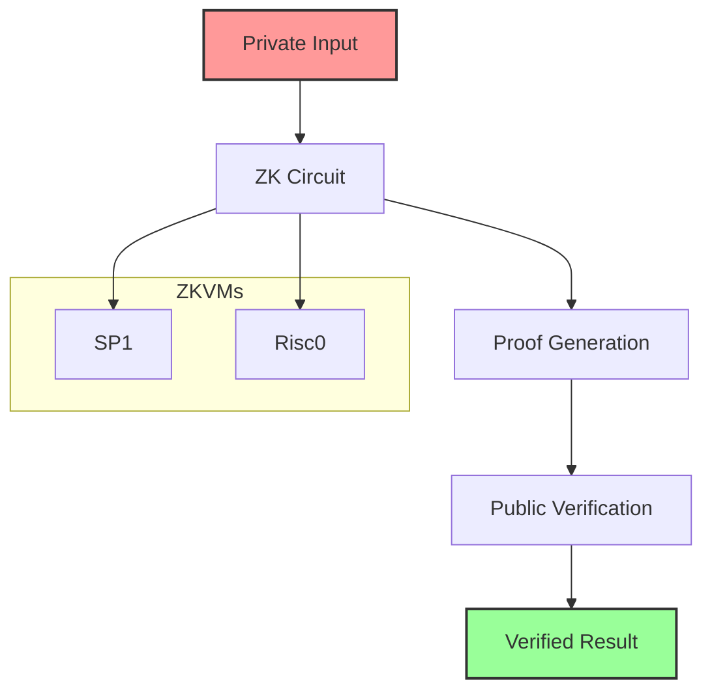
```mermaid
flowchart TD
    A[Private Input] --> B[ZK Circuit]
    B --> C[Proof Generation]
    C --> D[Public Verification]
    D --> E[Verified Result]
    
    subgraph "ZKVMs"
        F[SP1]
        G[Risc0]
    end
    
    B --> F
    B --> G
    
    style A fill:#ff9999,stroke:#333,stroke-width:2px
    style E fill:#99ff99,stroke:#333,stroke-width:2px
```

### Integration Patterns

Blockchain systems rarely exist in isolation; they integrate with other systems and often need to interoperate with other blockchains.

#### API Gateway Pattern

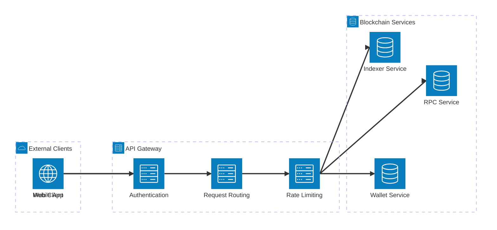
```mermaid
architecture-beta
    group external(cloud)[External Clients]
    group gateway(server)[API Gateway]
    group services(database)[Blockchain Services]
    
    service web(internet)[Web Client] in external
    service mobile(internet)[Mobile App] in external
    
    service auth(server)[Authentication] in gateway
    service routing(server)[Request Routing] in gateway
    service ratelimit(server)[Rate Limiting] in gateway
    
    service rpc(database)[RPC Service] in services
    service indexer(database)[Indexer Service] in services
    service wallet(database)[Wallet Service] in services
    
    web:R --> L:auth
    mobile:R --> L:auth
    auth:R --> L:routing
    routing:R --> L:ratelimit
    ratelimit:R --> L:rpc
    ratelimit:R --> L:indexer
    ratelimit:R --> L:wallet
```

#### Blockchain Interoperability Architecture

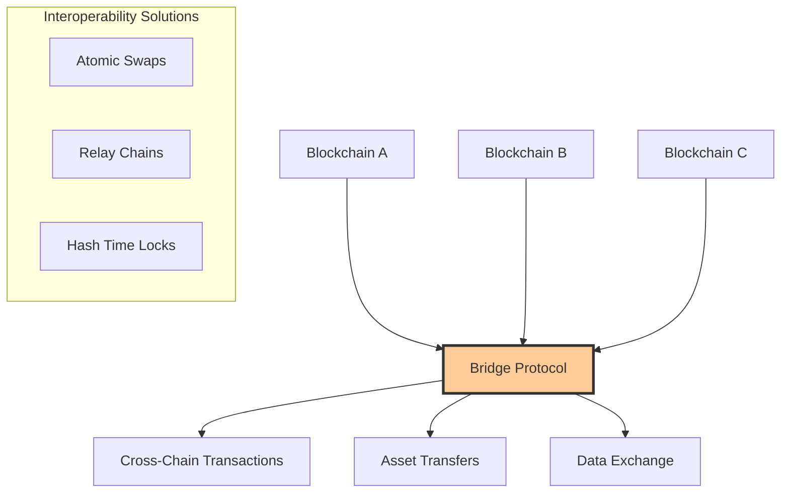
```mermaid
flowchart TD
    A[Blockchain A] --> B[Bridge Protocol]
    C[Blockchain B] --> B
    D[Blockchain C] --> B
    
    B --> E[Cross-Chain Transactions]
    B --> F[Asset Transfers]
    B --> G[Data Exchange]
    
    subgraph "Interoperability Solutions"
        H[Atomic Swaps]
        I[Relay Chains]
        J[Hash Time Locks]
    end
    
    style B fill:#ffcc99,stroke:#333,stroke-width:3px
```

#### OP Stack and RETH Integration

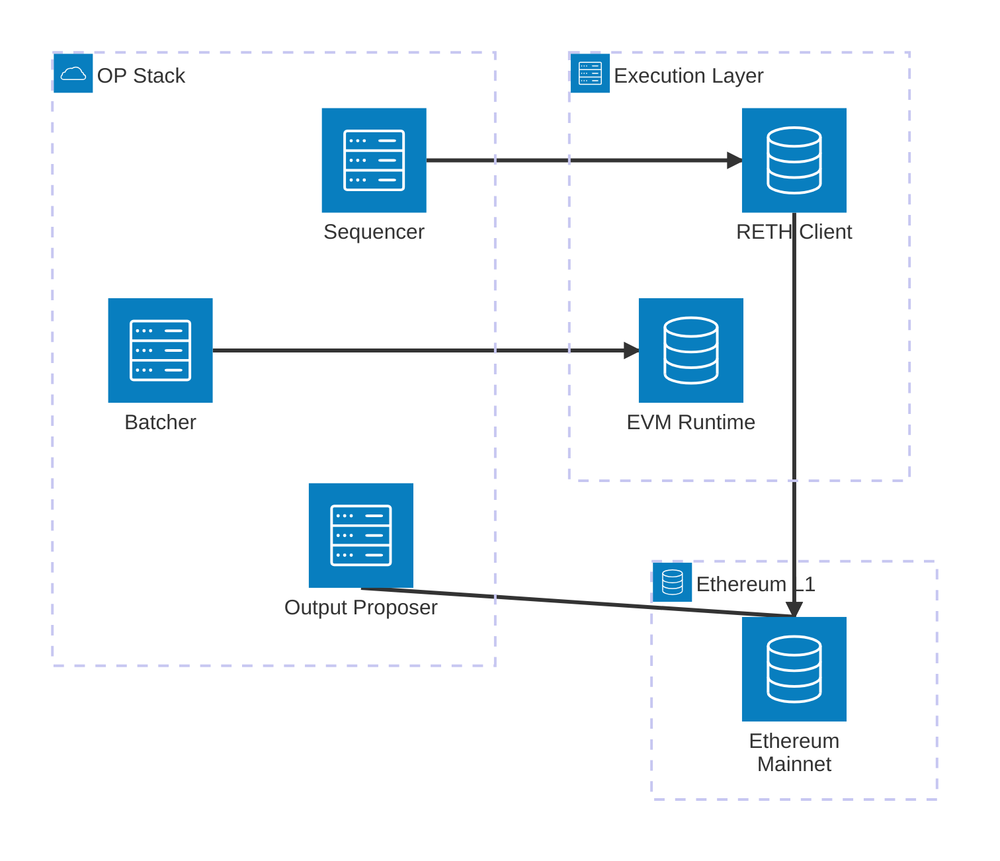
```mermaid
architecture-beta
    group opstack(cloud)[OP Stack]
    group execution(server)[Execution Layer]
    group ethereum(database)[Ethereum L1]
    
    service sequencer(server)[Sequencer] in opstack
    service batcher(server)[Batcher] in opstack
    service proposer(server)[Output Proposer] in opstack
    
    service reth(database)[RETH Client] in execution
    service evm(database)[EVM Runtime] in execution
    
    service l1(database)[Ethereum Mainnet] in ethereum
    
    sequencer:R --> L:reth
    batcher:R --> L:evm
    proposer:B --> T:l1
    reth:B --> T:l1
```

### Evolution and Migration Strategies

Blockchain systems, like any complex software, must evolve to meet changing requirements and leverage new technologies.

#### Strangler Fig Pattern

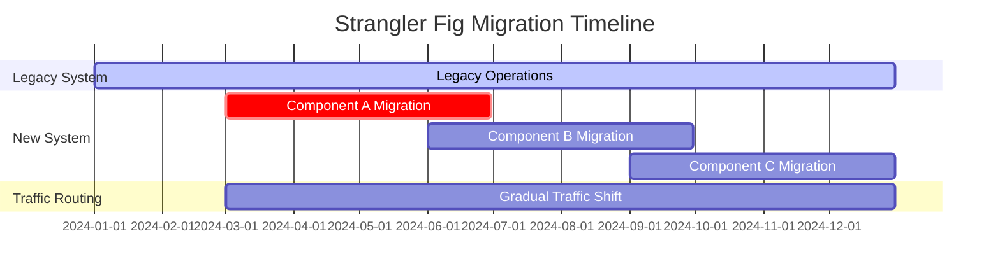
```mermaid
gantt
    title Strangler Fig Migration Timeline
    dateFormat  YYYY-MM-DD
    section Legacy System
    Legacy Operations    :active, legacy, 2024-01-01, 2024-12-31
    section New System
    Component A Migration :crit, compA, 2024-03-01, 2024-06-30
    Component B Migration :compB, 2024-06-01, 2024-09-30
    Component C Migration :compC, 2024-09-01, 2024-12-31
    section Traffic Routing
    Gradual Traffic Shift :routing, 2024-03-01, 2024-12-31
```

#### Migration Risk Assessment

**Migration Risk Formula:**
$$\text{Migration Risk} = \frac{\text{Changed LOC}}{\text{Total LOC}} \times \text{Complexity Factor}$$

| Risk Level | Risk Score | Action Required |
|------------|------------|-----------------|
| Low | 0.0 - 0.3 | Standard monitoring |
| Medium | 0.3 - 0.7 | Enhanced testing |
| High | 0.7 - 1.0 | Phased approach required |

### Organizational Patterns for Architectural Success

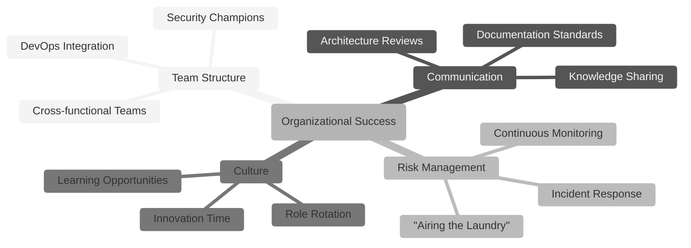
```mermaid
%%{init: {'theme': 'neutral'}}%%
mindmap
  root(Organizational Success)
    Team Structure
      Cross-functional Teams
      DevOps Integration
      Security Champions
    Communication
      Architecture Reviews
      Documentation Standards
      Knowledge Sharing
    Risk Management
      "Airing the Laundry"
      Continuous Monitoring
      Incident Response
    Culture
      Innovation Time
      Role Rotation
      Learning Opportunities
```

### Conclusion: The Future of Blockchain Architecture

The landscape of blockchain architecture is in constant evolution, driven by the need for greater scalability, security, and efficiency.

**Key Emerging Trends:**
- Integration with AI and machine learning
- Enhanced privacy through ZK technologies
- Improved interoperability solutions
- Sustainable consensus mechanisms

**Critical Success Factors:**
- Strategic application of architectural patterns
- Deep understanding of core technologies (Rust, OP Stack, RETH)
- Mastery of consensus mechanisms and ZKVMs
- Focus on quality attributes and trade-offs

### Conclusion: The Future of Blockchain Architecture (Continued)

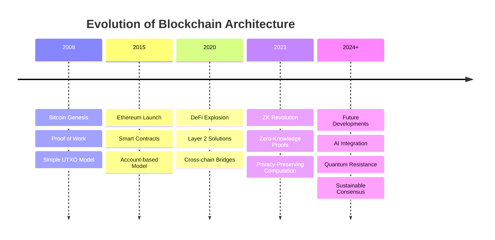
```mermaid
timeline
    title Evolution of Blockchain Architecture
    
    2008 : Bitcoin Genesis
         : Proof of Work
         : Simple UTXO Model
    
    2015 : Ethereum Launch
         : Smart Contracts
         : Account-based Model
    
    2020 : DeFi Explosion
         : Layer 2 Solutions
         : Cross-chain Bridges
    
    2023 : ZK Revolution
         : Zero-Knowledge Proofs
         : Privacy-Preserving Computation
    
    2024+ : Future Developments
          : AI Integration
          : Quantum Resistance
          : Sustainable Consensus
```

**Integration with Emerging Technologies:**

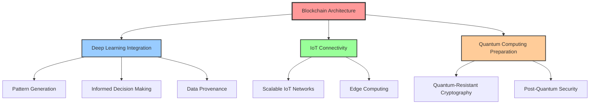
```mermaid
flowchart TD
    A[Blockchain Architecture] --> B[Deep Learning Integration]
    A --> C[IoT Connectivity]
    A --> D[Quantum Computing Preparation]
    
    B --> E[Pattern Generation]
    B --> F[Informed Decision Making]
    B --> G[Data Provenance]
    
    C --> H[Scalable IoT Networks]
    C --> I[Edge Computing]
    
    D --> J[Quantum-Resistant Cryptography]
    D --> K[Post-Quantum Security]
    
    style A fill:#ff9999,stroke:#333,stroke-width:3px
    style B fill:#99ccff,stroke:#333,stroke-width:2px
    style C fill:#99ff99,stroke:#333,stroke-width:2px
    style D fill:#ffcc99,stroke:#333,stroke-width:2px
```

**Ongoing Challenges and Solutions:**

| Challenge | Current Solutions | Future Directions |
|-----------|------------------|-------------------|
| **Scalability** | Layer 2 solutions, Sharding | Multi-layer consensus, Infinite scalability architectures |
| **Interoperability** | Cross-chain bridges, Relay chains | Universal interoperability protocols |
| **Privacy** | Zero-Knowledge proofs, Mixers | Advanced ZKVMs, Homomorphic encryption |
| **Energy Efficiency** | Proof of Stake, Hybrid mechanisms | Green consensus algorithms |
| **Operational Transparency** | Monitoring tools, Analytics | AI-driven insights, Predictive analytics |

**Strategic Technology Stack for Advanced Development:**

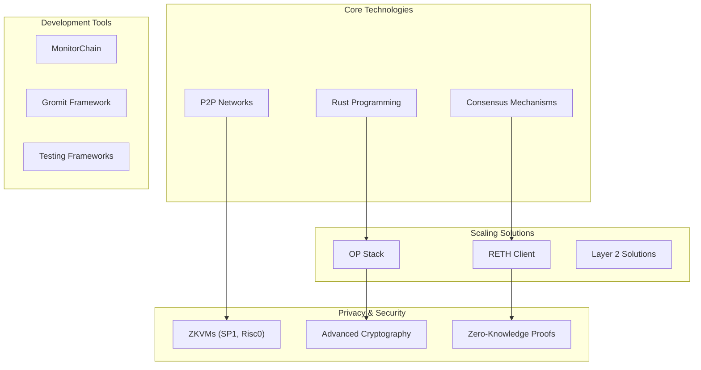
```mermaid
flowchart TD
    subgraph core["Core Technologies"]
        rust["Rust Programming"]
        consensus["Consensus Mechanisms"]
        p2p["P2P Networks"]
    end
    
    subgraph scaling["Scaling Solutions"]
        opstack["OP Stack"]
        reth["RETH Client"]
        l2["Layer 2 Solutions"]
    end
    
    subgraph privacy["Privacy & Security"]
        zkvm["ZKVMs (SP1, Risc0)"]
        crypto["Advanced Cryptography"]
        zk["Zero-Knowledge Proofs"]
    end
    
    subgraph tooling["Development Tools"]
        monitoring["MonitorChain"]
        benchmarking["Gromit Framework"]
        testing["Testing Frameworks"]
    end
    
    rust --> opstack
    consensus --> reth
    p2p --> zkvm
    opstack --> crypto
    reth --> zk
```

**Key Architectural Principles for Future Success:**

1. **Modularity First**: Design systems with clear separation of concerns and interchangeable components
2. **Performance by Design**: Consider throughput and latency requirements from the architectural planning phase
3. **Security as Foundation**: Implement cryptographic security and privacy protection at every layer
4. **Scalability Planning**: Design for growth with Layer 2 solutions and efficient consensus mechanisms
5. **Interoperability Ready**: Build with cross-chain communication and data exchange capabilities

**The Path Forward:**

The strategic application of structural, behavioral, quality, data management, integration, and evolution patterns, combined with a deep understanding of core blockchain technologies like Rust, OP Stack, RETH, consensus mechanisms, and ZKVMs, will be instrumental in shaping the next generation of decentralized applications and infrastructures.

```mermaid
flowchart LR
    A[Current State] --> B[Architectural Patterns]
    B --> C[Technology Mastery]
    C --> D[Quality Attributes]
    D --> E[Future Blockchain Systems]
    
    subgraph "Success Factors"
        F[Technical Excellence]
        G[Organizational Alignment]
        H[Continuous Evolution]
    end
    
    B --> F
    C --> G
    D --> H
    
    style E fill:#90EE90,stroke:#333,stroke-width:4px
```

As the technology matures, addressing challenges like scalability, interoperability, and privacy leakage remains paramount. The future of blockchain architecture lies in the thoughtful integration of these patterns and technologies, creating robust, scalable, and maintainable systems that can adapt to the evolving needs of decentralized applications and the broader digital economy.

Sources: 
[1] Blockchain technology: principles and applications, https://www.elgaronline.com/abstract/edcoll/9781784717759/9781784717759.00019.xml
[2] A Survey on Blockchain Technology: Evolution, Architecture and Security, https://ieeexplore.ieee.org/document/9402747/
[3] Blockchain for deep learning: review and open challenges, https://link.springer.com/article/10.1007/s10586-022-03582-7
[4] An Overview of Blockchain Technology: Architecture and Consensus Protocols, https://www.semanticscholar.org/paper/e384a4ccfb91a98dff65945312da6a3e8ad79dc5
[5] A Survey Paper on Software Architecture Visualization, https://www.semanticscholar.org/paper/064a53675b617aa7d7fccd9248c1eb17fc16b43f
[6] Organizational Patterns For Software Architecture Draft for Comment, https://www.semanticscholar.org/paper/0d2200eafe29ef6620b1a6b21664e3ad5817870a
[7] Software Design Patterns and Architecture Patterns –A Study Explored, https://www.semanticscholar.org/paper/7886c7a3978bc1d6309ce4cd65ff483d679c3395
[8] EDSOA: An Event-Driven Service-Oriented Architecture Model For Enterprise Applications, https://www.semanticscholar.org/paper/57fa965d191cdda0b935b8ef7a49f30254e8cb88
[9] Embracing Event-Driven Architectures, https://www.semanticscholar.org/paper/42a3993173e2569b3d8776c585076c42d56f4273
[10] Thinkey: A Scalable Blockchain Architecture, https://www.semanticscholar.org/paper/f9b556cf50cd0ac4e1daa2e169fa7b2fce92e0e2
[11] Advanced block-chain architecture for e-health systems, https://www.semanticscholar.org/paper/d896ac61146ea18ca42c4adf87122009a06d4ef4
[12] Chain or DAG? Underlying data structures, architectures, topologies and consensus in distributed ledger technology: A review, taxonomy and research issues, https://www.semanticscholar.org/paper/bf98aaa197f04dda34b5611a374fadf41cb16d0a
[13] A Review of BlockChain, https://www.semanticscholar.org/paper/9728f3485999d92eb05d3af91f6cc4dc11233ca6
[14] Chapter Nine - Architecture of blockchain, https://www.semanticscholar.org/paper/4ac6599871508083878f2dbde40b865678a5afb9
[15] Log out: A Glossary of Technological Resistance and Decentralization, https://research.hva.nl/en/publications/log-out-a-glossary-of-technological-resistance-and-decentralizati
[16] Survey of prominent blockchain development platforms, https://www.semanticscholar.org/paper/0c9679504e95cfc1d9b7f579fc7cfa12477811cb
[17] Traceability in permissioned blockchain, https://ieeexplore.ieee.org/abstract/document/8970301/
[18] Factors Affecting Development of Blockchain, https://www.semanticscholar.org/paper/e2a3bc4aca317297f9b66c75e3b9344c978c3fa2
[19] Design of Anomaly Detection and Visualization Tool for IoT Blockchain, https://ieeexplore.ieee.org/document/8947874/
[20] MonitorChain: An Extensible Tool for Real-Time Monitoring of Blockchain-Based Software Applications, https://ieeexplore.ieee.org/document/10706853/
[21] Supply Chain Risk Management via Enhanced Observability, https://bryanhousepub.com/index.php/jgebf/article/view/1052
[22] Microservices Architecture: A Comparative Analysis of Domain-Driven Design and Service-Oriented Architecture, https://www.semanticscholar.org/paper/ff331d6850979d1d98372c224e1ced8ac73db04a
[23] A Complete Survey on Software Architectural Styles and Patterns, https://www.semanticscholar.org/paper/7327c35151a84d96967fa3daef2b991a6a27b6b3
[24] Domain-Driven Design (DDD)- Bridging the Gap between Business Requirements and Object-Oriented Modeling, https://www.semanticscholar.org/paper/12ef8f615c3a5f1ec3776ef92c4ec55abd68013a
[25] Domain-Driven Design, https://www.semanticscholar.org/paper/88fd5be19f9d26e83454125a3148b2021da431e3
[26] Summary of "Patterns Principles And Practices Of Domain Driven Design" by Scott Millett, https://www.semanticscholar.org/paper/c2303ba52f42ab99cfbf447d6ec45d30abc1e0b3
[27] Challenges of Domain-Driven Microservice Design: A Model-Driven Perspective, https://www.semanticscholar.org/paper/178b687fc37f85b846fc1346f686166eac8e4c6f
[28] Application model based on domain-driven design, https://www.semanticscholar.org/paper/c6d65cdf460c3c9c87ef90c3fa57529135508621
[29] Usage of design patterns as a kind of components of software architecture, https://dl.acm.org/doi/10.1145/2855667.2855679
[30] Blockchain and IOT integrated Smart City Architecture, https://doi.org/10.17762/TURCOMAT.V12I9.2794
[31] An Overview and Current Status of Blockchains Performance, https://www.semanticscholar.org/paper/71bdadc9a3bdb09c6e3936f9604600bf35748b47
[32] A Fog Computing Architecture to Share Sensor Data by Means of Blockchain Functionality, https://ieeexplore.ieee.org/document/8821967/
[33] Introduction of Metrics for Blockchain, https://www.semanticscholar.org/paper/1ebb678ebef1ad3f45258f386652f370cc69823d
[34] Blockchain for Credibility in Educational Development: Key Technology, Application Potential, and Performance Evaluation, https://www.hindawi.com/journals/scn/2023/5614241/
[35] Adaptation of Blockchain Architecture to the Internet of Things and Performance Analysis, http://services.igi-global.com/resolvedoi/resolve.aspx?doi=10.4018/978-1-7998-6694-7.ch004
[36] Software Architecture Patterns, https://www.semanticscholar.org/paper/97201913f8a401e608f96f33d1ab3979a6d21943
[37] Methods for evaluating software architecture: A survey, https://www.researchgate.net/profile/Tc-Graham/publication/254077114_Methods_for_Evaluating_Software_Architecture_A_Survey/links/545a3f7f0cf26d5090ad87bb/Methods-for-Evaluating-Software-Architecture-A-Survey.pdf
[38] A hierarchical compiled code event-driven logic simulator, https://ieeexplore.ieee.org/document/137501/
[39] SigVM: Enabling Event-Driven Execution for Autonomous Smart Contracts, https://www.semanticscholar.org/paper/0ff46d93d3a5538b04a0ace8d57711774e043329
[40] Mark Richards Software Architecture Patterns Understanding Common Architecture Patterns and When to Use Them, https://www.semanticscholar.org/paper/13e04919b354cc8c6ce1d7c7819c19da99d4b9e2
[41] Java Design Patterns: A Hands-On Experience with Real-World Examples, https://www.semanticscholar.org/paper/73bef222feaa66dcb4a2223211b02e769e23280f
[42] Applications of blockchain technology in different domains, https://www.semanticscholar.org/paper/4b74561f910837d9a39bafdc0c3ec6da16db5246
[43] A Comprehensive Survey on Blockchain Technology: Consensus Algorithms, Data Storage Mechanisms, and Architectures, https://www.semanticscholar.org/paper/2efd9623b10ca2b28bbfc47bc8e139ffc761e343
[44] Application of Architecture Implementation Patterns by Incremental Code Generation, https://dl.acm.org/doi/10.1145/3022636.3022647
[45] A Survey on Blockchain: Architecture, Applications, Challenges, and Future Trends, https://ieeexplore.ieee.org/document/9291547/
[46] Research On Optimization Model of High Availability and Flexibility of Blockchain System Based on Microservice Architecture, https://www.sciencedirect.com/science/article/pii/S1877050925012931
[47] Lightweight blockchain network architecture for IoT devices, https://ieeexplore.ieee.org/document/9523686/
[48] Edge-based blockchain architecture for event-driven IoT using hierarchical identity based encryption, https://www.sciencedirect.com/science/article/pii/S0306457321000376
[49] BGRA: A Reference Architecture for Blockchain Governance, https://arxiv.org/abs/2211.04811
[50] Microservices for the Enterprise, https://link.springer.com/chapter/10.1007/979-8-8688-0555-4_1
[51] Using CQRS Pattern for Improving Performances in Medical Information Systems, https://www.semanticscholar.org/paper/275c3df692ad66fab0df055ec15f182580f9ee35
[52] Event-Driven Architecture: Building Responsive and Scalable Systems for Modern Industries, https://www.semanticscholar.org/paper/c2094877236661dfbd30bb61cc4ca35f332fd7ee
[53] A survey of IoT applications in blockchain systems: Architecture, consensus, and traffic modeling, https://dl.acm.org/doi/abs/10.1145/3372136
[54] Block Verification Mechanism Based on Zero-Knowledge Proof in Blockchain, https://www.semanticscholar.org/paper/ff9fa9327822d4b08f42d045bd20350f7d6dd08c
[55] A Reference Implementation of Blockchain Interoperability Architecture Framework, https://ieeexplore.ieee.org/document/10471955/
[56] Expounding the Blockchain Architecture, https://www.taylorfrancis.com/books/9781003094210/chapters/10.1201/9781003094210-1
[57] A survey on consensus algorithms in blockchain-based applications: Architecture, taxonomy, and operational issues, https://ieeexplore.ieee.org/abstract/document/10101789/
[58] An Architectural Pattern Recommendation Method Based on a Quality-Attributes Trade-off Analysis, https://www.semanticscholar.org/paper/3ed0f5d5f8c9ea803632c9e121f4628d05826d00
[59] Leveraging Architecture Patterns to Satisfy Quality Attributes, https://link.springer.com/chapter/10.1007/978-3-540-75132-8_21
[60] The Trade-Offs from Pattern Bargaining, https://papers.ssrn.com/sol3/papers.cfm?abstract_id=1003169
[61] Experience-Based Architecture Tradeoff Method, https://www.semanticscholar.org/paper/fa2dee95dafc8961545c0fccf1b8c994f320477f
[62] Quality Attribute Trade-Offs in Industrial Software Systems, https://ieeexplore.ieee.org/document/7958498/
[63] System Architectural Trade-Offs, https://www.semanticscholar.org/paper/203c666ce940977cc74945bbc3f89feabf3453f1
[64] Investigating quality trade-offs in open source Critical Embedded Systems, https://dl.acm.org/doi/10.1145/2737182.2737190
[65] An approach to building quality into software architecture, https://doi.org/10.1145/781928
[66] Science of Computer Programming, https://www.semanticscholar.org/paper/e4459badcafca929b74b31bb673de16982aa84a0
[67] A survey on software architecture analysis methods, https://ieeexplore.ieee.org/abstract/document/1019479/
[68] Application Loss Pattern Metrics, https://www.semanticscholar.org/paper/2330af202948cf914760206590f3842e0261b16b
[69] Complexity Metrics for Software Architectures, https://www.semanticscholar.org/paper/77fb31d2c96a8b2129be9edaaa94fc2f7d64755b
[70] A Scalable Architecture for On-Chip Compression: Options and Trade-Offs, https://www.semanticscholar.org/paper/9ad0ef010c1b26c3f70025b09c5395f76c8ddd04
[71] Gromit: Benchmarking the Performance and Scalability of Blockchain Systems, https://ieeexplore.ieee.org/document/9899852/
[72] A survey on pluriclosed and CYT metrics, https://www.semanticscholar.org/paper/f849820abfcb4ebeb54435b6f435dcc0733e6707
[73] Uml-based object-oriented metrics for architecture complexity analysis, https://www.semanticscholar.org/paper/0d513ee270a89fb987e8e42635840b395b5a50e6
[74] Metrics and analysis of software architecture evolution with discontinuity, https://www.semanticscholar.org/paper/d4c57cbeb0a97a13ad2bc0a8dc0cc1601e1142a7
[75] Architecture of the License Software Manager using Blockchain technology, https://www.semanticscholar.org/paper/6826e5d86ce605175dbf82a3ebcc4727f54d93a4
[76] Metrics for Quality Assessment in Blockchain-based Systems: A Systematic Mapping Study, https://www.semanticscholar.org/paper/5ca58819da18d741cc08b0bb3b1a92859fbe1a16
[77] Exploring Blockchain Data Analysis and Its Communications Architecture: Achievements, Challenges, and Future Directions: A Review Article., https://pdfs.semanticscholar.org/bb38/b231c7f38f4c32ff528e10d2856e9c8cc853.pdf
[78] A systematic review of software architecture evolution research, https://www.sciencedirect.com/science/article/pii/S0950584911001376
[79] ON THE MIGRATION OF DOMAIN DRIVEN DESIGN TO CQRS WITH EVENT SOURCING SOFTWARE ARCHITECTURE, https://www.semanticscholar.org/paper/f51969cf13663c5734b90af6869a756333ea8c6b
[80] Using CQRS and Event Sourcing in the Architecture of Complex Software Solutions, https://www.semanticscholar.org/paper/112c823342edfa82fcc61fa7c269f226f5a9c74f
[81] Building Solutions With The Microsoft Net Compact Framework Architecture And Best Practices For Mobile Development, https://www.semanticscholar.org/paper/db9f636e541f32c26cbad24e2a4357b94fc88ad4
[82] Blockchain Architecture, https://link.springer.com/chapter/10.1007/978-981-13-8775-3_8
[83] A Pattern-Oriented Reference Architecture for Governance-Driven Blockchain Systems, https://ieeexplore.ieee.org/document/10092670/
[84] Blockchain in Software Architecture, https://link.springer.com/chapter/10.1007/978-3-030-03035-3_5
[85] Blockchain software patterns for the design of decentralized applications: A systematic literature review, https://www.semanticscholar.org/paper/f8b8a831d833b631c37f85bf8af3c289d8dd6ade
[86] A Survey on Software Applications based on Blockchain Technology, https://www.semanticscholar.org/paper/cd3d6d4b2838cdc3471fc314f249587261d046c6
[87] Deployment of blockchain technology in software defined networks: A survey, https://ieeexplore.ieee.org/abstract/document/8952698/
[88] Design of WirelessHART Protocol Stack Based on Qp Architecture, https://iopscience.iop.org/article/10.1088/1757-899X/466/1/012077
