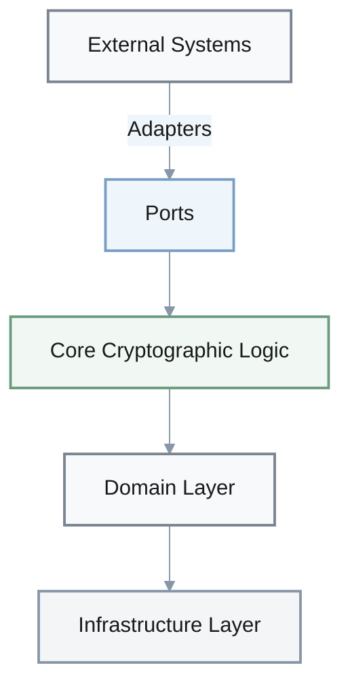
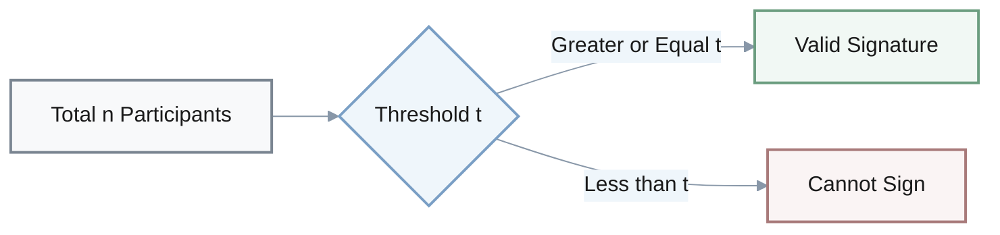
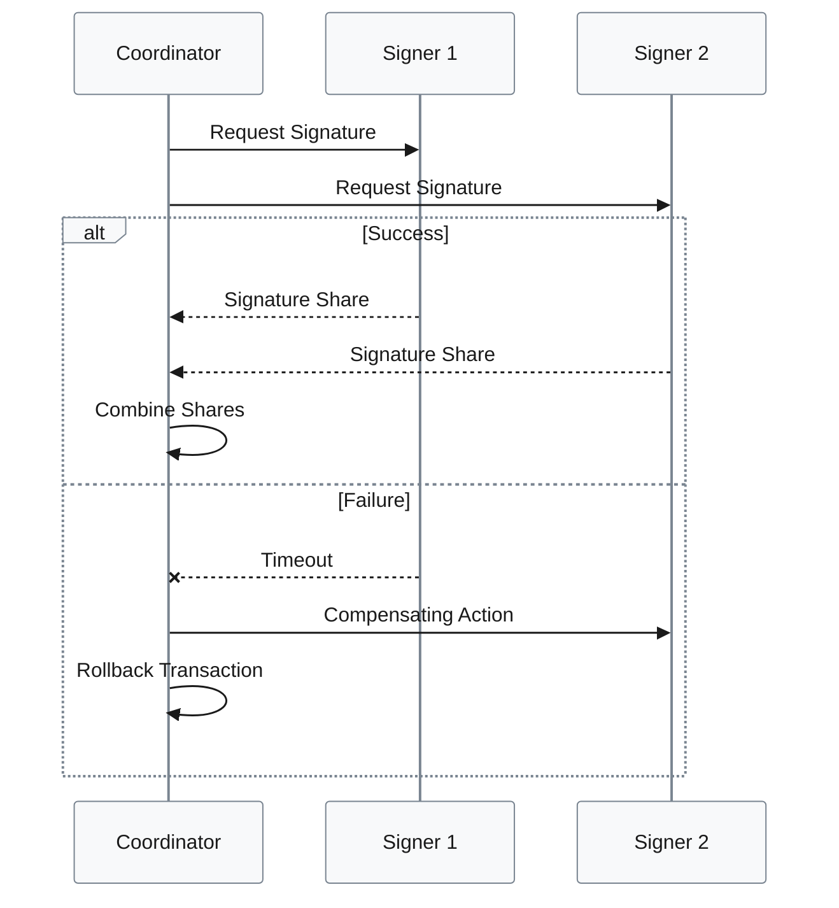
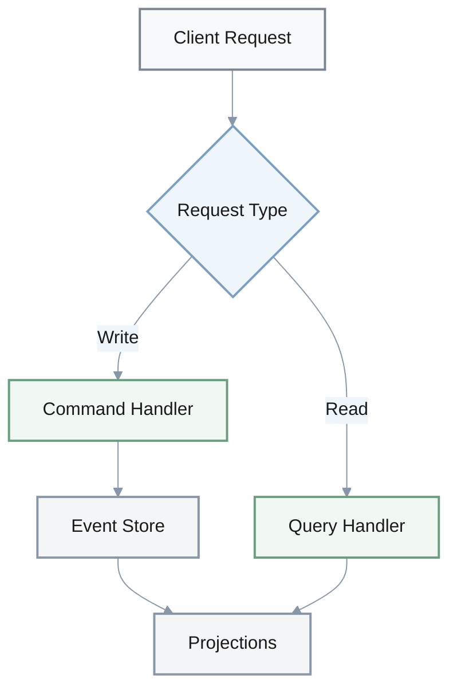
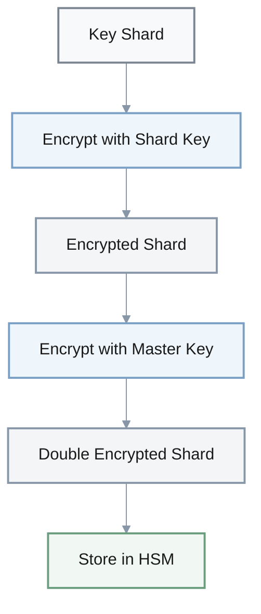

# MPC Wallet Architecture - Cloze Questions

## Architecture Patterns

### Hexagonal Architecture

1. **Q**: In MPC wallet architecture, the hexagonal pattern isolates the core ___ logic from external dependencies through well-defined ___ (interfaces) and ___ (implementations).
   
   **A**: cryptographic; ports; adapters

---

1. **Q**: List the three primary layers in hexagonal architecture for MPC wallets.
   
   **A**: Application layer (orchestration), Domain layer (business logic), Infrastructure layer (cryptographic implementations)

---

1. **Q**: Hexagonal architecture can improve test execution time by ___% to ___% by enabling testing with mock adapters.
   
   **A**: 85%; 95%

---

## Threshold Cryptography

### Threshold Signature Scheme

1. **Q**: Threshold signature schemes typically use a ___-of-___ configuration where T participants can create a valid signature but fewer than T cannot.
   
   **A**: t-of-n (or threshold-of-total)

---

1. **Q**: FROST threshold signatures reduce signing to ___ round(s) after preprocessing, compared to GG20's ___ rounds.
   
   **A**: 1; 2-3 (or 2)

---

### Signature Protocol Comparison

| Protocol | Rounds After Preprocessing | Relative Complexity |
|----------|----------------------------|---------------------|
| **FROST** | 1 round | Lower |
| **GG20** | 2-3 rounds | Higher |

---

## Resilience Patterns

### Saga Pattern Flow

1. **Q**: The saga pattern reduces MPC signing ceremony failures by approximately ___% by implementing compensating actions for distributed transactions.
   
   **A**: 85% (±10%)

---

1. **Q**: The Circuit Breaker pattern prevents ___ failures by temporarily halting requests to failing services, improving fault isolation by approximately ___%.
   
   **A**: cascading; 30%

---

## CQRS Architecture

1. **Q**: CQRS separates ___ operations from ___ operations to optimize performance in MPC wallet systems.
   
   **A**: write (command); read (query)

---

1. **Q**: In CQRS architecture for MPC wallets, write latency typically increases by ___ ms to ___ ms due to event-sourced synchronization.
   
   **A**: 20; 40

---

1. **Q**: Event sourcing provides ___ consistency with projection lag typically between ___ ms to ___ ms.
   
   **A**: eventual; 100; 500

---

## Performance Optimization

### Latency Improvements

| Optimization Technique | Baseline | Optimized | Improvement |
|------------------------|----------|-----------|-------------|
| **Nonce Pre-computation** | 200 ms | 80-120 ms | 40-60% reduction |
| **Signing Latency Target** | - | <100 ms | Mobile UX requirement |
| **API Rate Limiting** | - | <100 ms | @ 1000 req/s |

1. **Q**: Pre-computation of nonce pairs can reduce MPC signing latency from approximately ___ ms to ___ ms.
   
   **A**: 200ms; 80-120ms

---

1. **Q**: In MPC wallets, the target signing latency for mobile devices is typically ___ ms to maintain acceptable user experience.
   
   **A**: <100ms (or sub-100ms)

---

1. **Q**: Rate limiting using token bucket algorithms helps maintain signing API latency below ___ ms at ___ requests per second.
   
   **A**: 100; 1000 (or 1K)

---

### Throughput Improvements

| Technique | Improvement | Overhead Reduction |
|-----------|-------------|--------------------|
| **Batch Processing** | 30-50% | - |
| **gRPC Streaming** | - | 70% vs REST |

1. **Q**: Batch processing of MPC signatures can achieve throughput improvement of approximately ___% to ___%.
   
   **A**: 30%; 50%

---

1. **Q**: gRPC streaming reduces client polling overhead by approximately ___% compared to REST for long-running MPC ceremonies.
   
   **A**: 70%

---

## Security Architecture

### Multi-Layer Encryption

1. **Q**: Multi-layer encryption for key shards typically involves encrypting with a shard-specific key, then encrypting that key with a ___ key stored in an ___.
   
   **A**: master; HSM

---

1. **Q**: The minimum security level maintained across all MPC wallet optimizations should be ___ bits.
   
   **A**: 128 bits (or 256 bits for higher security)

---

### Risk Reduction Metrics

| Strategy | Risk Reduction |
|----------|----------------|
| **Geographic Distribution** | 80% (70-80% range) |
| **Multi-Region Isolation** | 50-70% blast radius |

1. **Q**: Geographic distribution of key shards across multiple regions can reduce single-point compromise risk by approximately ___%.
   
   **A**: 80% (70-80% range acceptable)

---

1. **Q**: In multi-region MPC deployments, the typical blast radius reduction achieved through isolation is ___% to ___%.
   
   **A**: 50%; 70%

---

## SLA & Availability

### Enterprise Requirements

| Metric | Target Value |
|--------|--------------|
| **Availability** | 99.99% |
| **RTO** | <15 minutes |

$$
\text{Availability (\%)} = \frac{\text{uptime hours}}{\text{total hours}} \times 100
$$

1. **Q**: For enterprise MPC wallet systems, the target availability SLA is typically ___%, with RTO (Recovery Time Objective) of less than ___ minutes.
   
   **A**: 99.99%; 15

---

## Quick Reference Summary

### Performance Metrics Overview

| Category | Metric | Value |
|----------|--------|-------|
| **Latency** | Nonce Pre-computation | 80-120 ms |
| **Latency** | Mobile Target | <100 ms |
| **Latency** | API @ 1K req/s | <100 ms |
| **Throughput** | Batch Processing | +30-50% |
| **Throughput** | gRPC vs REST | -70% overhead |
| **Reliability** | Saga Pattern | -85% failures |
| **Reliability** | Circuit Breaker | +30% isolation |
| **Security** | Geographic Distribution | -80% risk |
| **Security** | Multi-Region | -50-70% blast radius |
| **Testing** | Hexagonal Architecture | -85-95% test time |
| **Availability** | Enterprise SLA | 99.99% |
| **Recovery** | RTO Target | <15 min |
