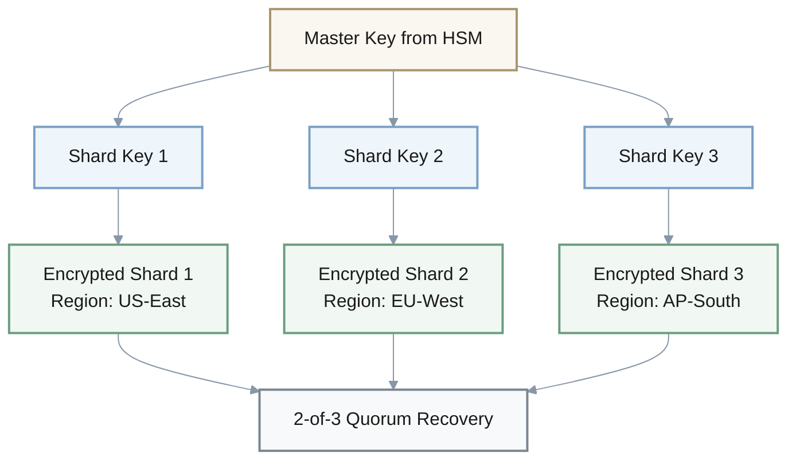
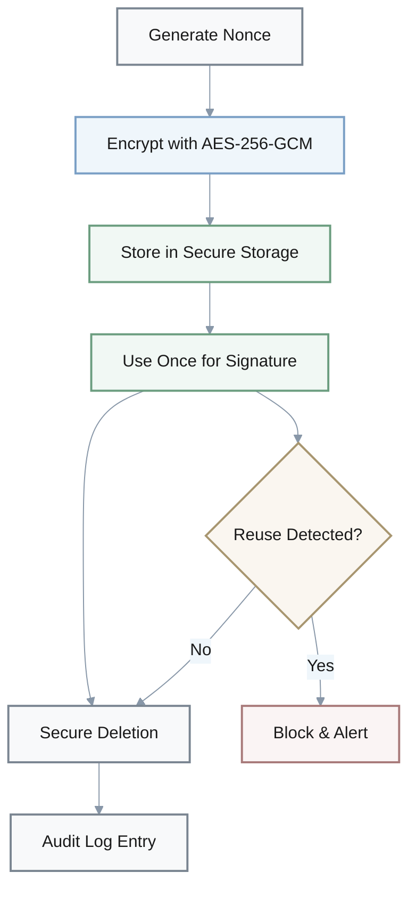
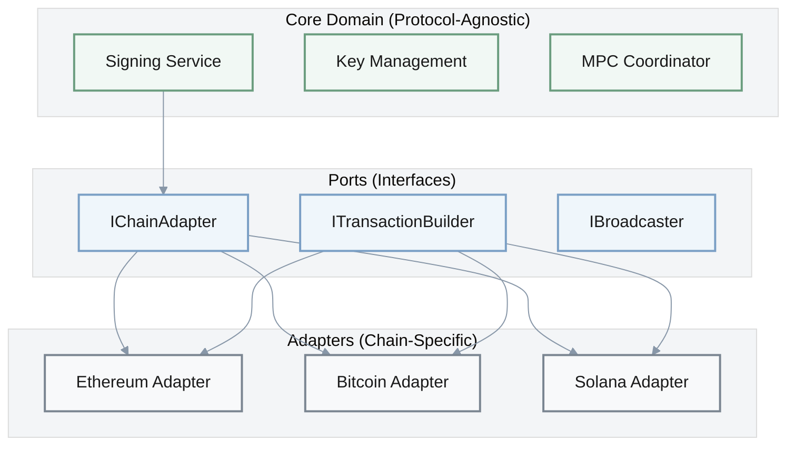
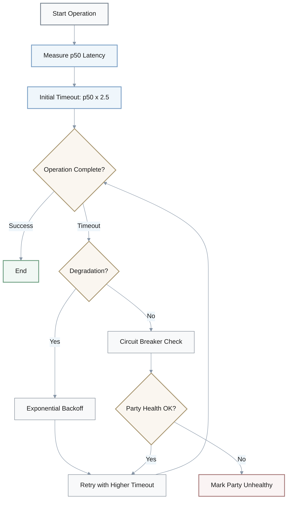
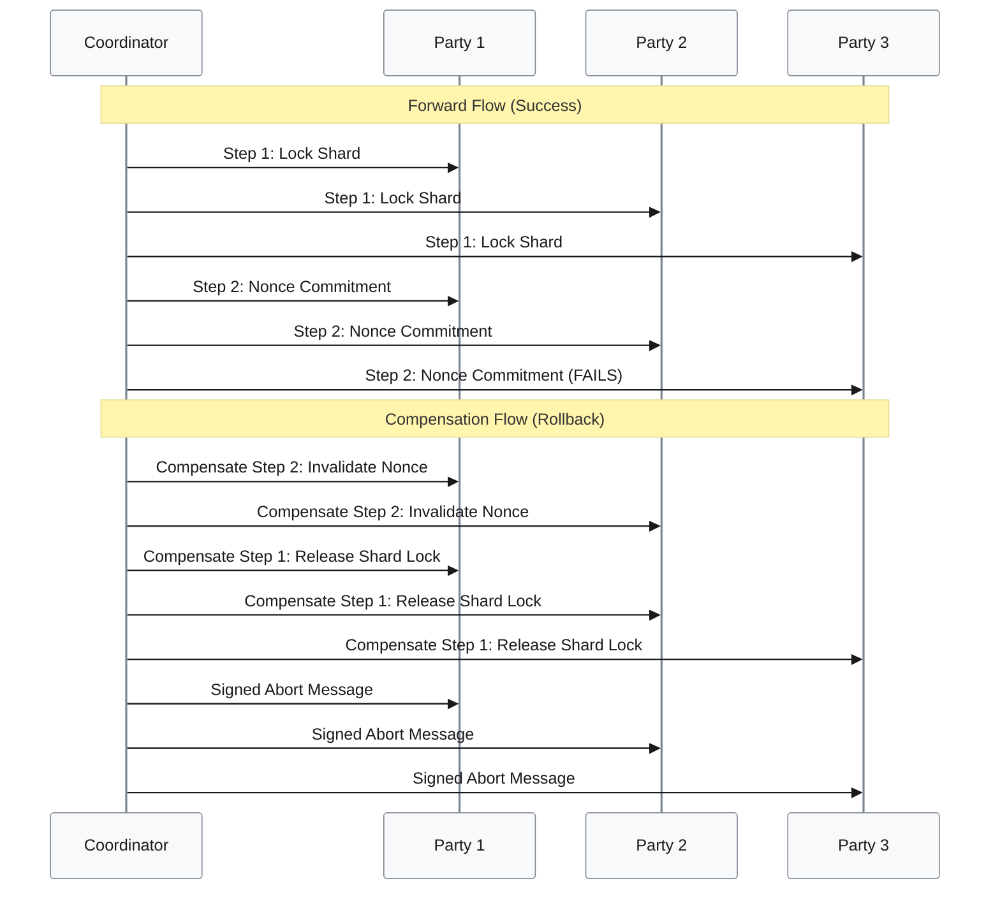
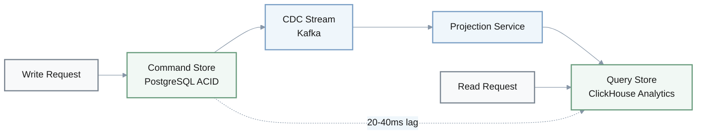
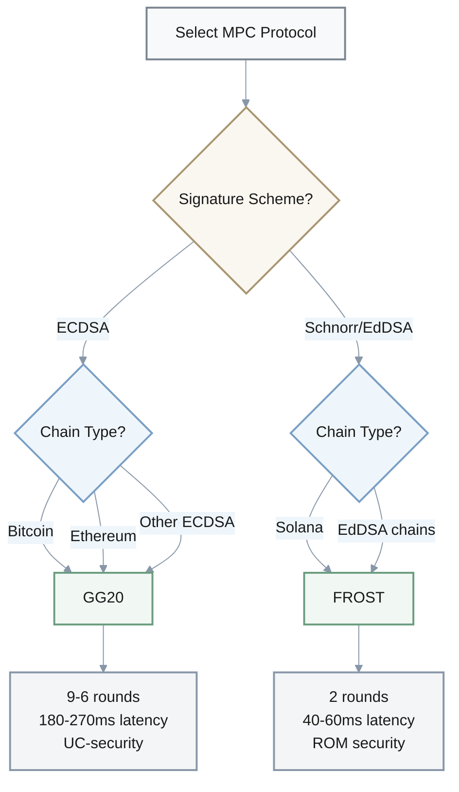
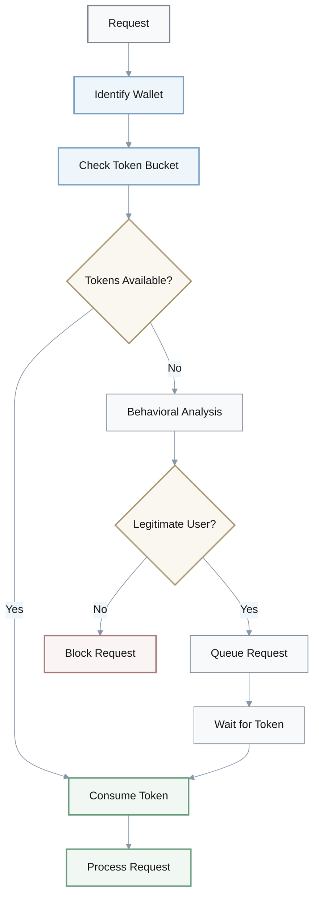
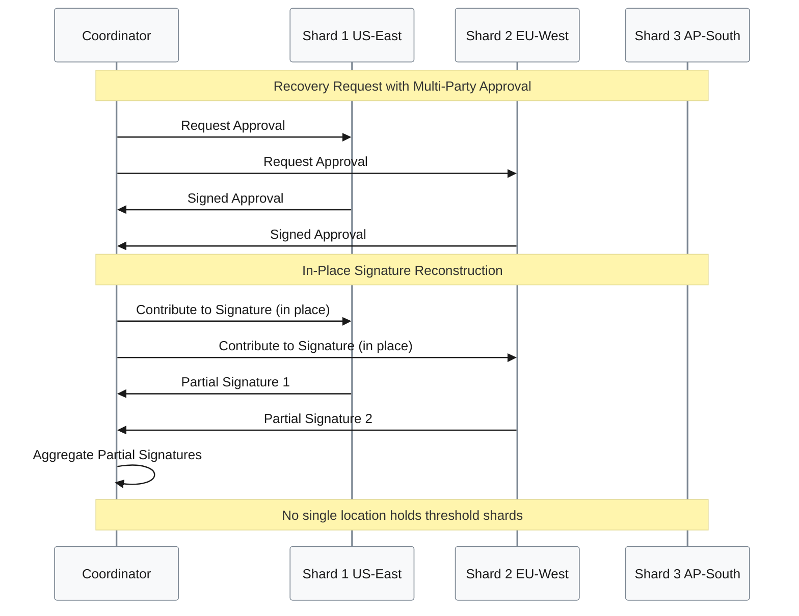
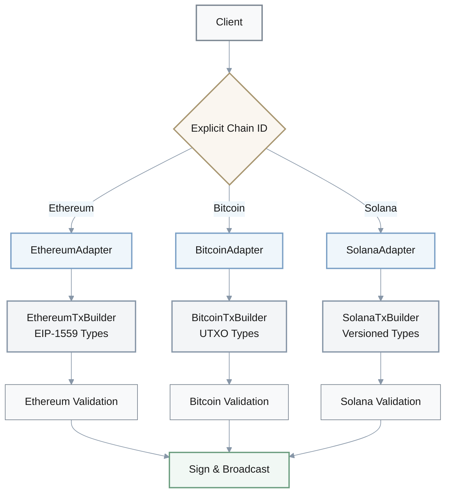

## 1. MPC Key Shard Storage Architecture

**Q:** An engineer implements MPC key generation with the following approach: "We'll store all key shards in a single database with AES-256 encryption. Each shard will be encrypted with the same master key for simplicity." What is wrong and how to fix it?

**A:**

**Issue**: Single point of failure - if the database and master key are compromised, all key shards are exposed, defeating the purpose of MPC.

**Why**: MPC security relies on geographic and cryptographic distribution of shards so no single point holds enough information to reconstruct the private key.

### Comparison: Wrong vs. Correct Architecture

| Aspect | ❌ Wrong Approach | ✅ Correct Approach |
|--------|------------------|---------------------|
| **Storage** | Single database | Multiple geographic regions |
| **Encryption** | Same master key | Multi-layer encryption |
| **Key Management** | Single master key | Shard-specific + HSM master key |
| **Recovery** | Single point | 2-of-3 quorum recovery |
| **Security Model** | Centralized risk | Distributed trust |

### Correct Architecture Diagram



**Correction**:
- **Multi-layer encryption**: Each shard encrypted with shard-specific key
- **HSM protection**: Master key stored in Hardware Security Module
- **Geographic distribution**: 3+ regions with 2-of-3 quorum recovery
- **Defense in depth**: Multiple security layers prevent single point compromise

---

## 2. Nonce Security in Cryptographic Signing

**Q:** A developer writes: "For optimal performance, I'll cache precomputed nonces in memory without encryption since they're just random numbers." What is wrong and how to fix it?

**A:**

**Issue**: Nonce reuse vulnerability - unencrypted cached nonces can be exposed through memory dumps or side-channel attacks, and if reused across signatures, they can leak the private key in ECDSA/EdDSA schemes.

**Why**: Nonce reuse in ECDSA allows private key extraction from just two signatures; unencrypted storage violates security assumptions.

### Nonce Reuse Attack Formula

$$
k = \frac{z_1 - z_2}{s_1 - s_2} \mod n
$$

$$
d = \frac{s \cdot k - z}{r} \mod n
$$

Where:
- `k` = nonce (recovered from two signatures)
- `d` = private key (compromised)
- `z` = message hash
- `r`, `s` = signature components

### Secure Nonce Management Flow



**Correction**:
- **Encrypted storage**: Use AES-256-GCM for nonce encryption
- **Single-use policy**: Consume each nonce exactly once
- **Secure deletion**: Overwrite memory after use
- **Audit trail**: Log generation and consumption timestamps
- **Reuse detection**: Monitor for duplicate nonce usage attempts

---

## 3. Multi-Chain Wallet Architecture

**Q:** An architect proposes: "We'll use a monolithic architecture for our multi-chain MPC wallet because it's simpler to build. We can add support for new blockchain protocols by adding more if-else statements in the signing module." What is wrong and how to fix it?

**A:**

**Issue**: High coupling and poor modularity - blockchain-specific code scattered throughout the codebase creates tight coupling, making it difficult to test, audit, and maintain as new chains are added.

**Why**: Each new chain requires modifying core signing logic, increasing regression risk and making security audits more complex and expensive.

### Hexagonal Architecture for Multi-Chain Support



### Comparison: Monolithic vs. Hexagonal

| Aspect | ❌ Monolithic | ✅ Hexagonal |
|--------|--------------|--------------|
| **Coupling** | Tight coupling | Loose coupling via ports |
| **Extensibility** | Modify core logic | Add new adapters |
| **Testing** | Hard to isolate | Mock adapters easily |
| **Audit** | Complex, full reaudit | Audit only new adapter |
| **Regression Risk** | High (core changes) | Low (isolated adapters) |

**Correction**:
- **Protocol-agnostic core**: Domain logic independent of blockchain
- **Port interfaces**: `IChainAdapter`, `ITransactionBuilder`, `IBroadcaster`
- **Chain adapters**: Ethereum (EIP-1559), Bitcoin (UTXO), Solana (Recent Blockhash)
- **Independent evolution**: Add chains without touching core logic

---

## 4. FROST Signing Ceremony Timeout Strategy

**Q:** A team implements FROST signing ceremony with this timeout logic: "We'll use a fixed 5-second timeout for all network operations to keep things fast and responsive." What is wrong and how to fix it?

**A:**

**Issue**: Aggressive fixed timeout causes excessive false positives in degraded network conditions, wasting computational resources by aborting ceremonies that would have succeeded with slightly more time.

**Why**: Network latency varies significantly across geographic regions and network conditions; a fixed low timeout doesn't account for p95/p99 latency spikes.

### Adaptive Timeout Formula

$$
\text{Timeout} = \max(p50_{latency} \times 2.5, 10s)
$$

With exponential backoff:

$$
\text{Timeout}_{retry} = \min(\text{Timeout}_{initial} \times 2^{attempt}, 30s)
$$

### Adaptive Timeout Strategy



### Comparison: Fixed vs. Adaptive Timeout

| Metric | Fixed 5s | Adaptive (10-30s) |
|--------|----------|-------------------|
| **False Positives** | High (p95/p99 fail) | Low (adapts to conditions) |
| **Resource Waste** | High (premature abort) | Low (completes more) |
| **Geographic Coverage** | Poor (US-only) | Good (global) |
| **Network Resilience** | Brittle | Robust |
| **Success Rate** | ~85% | ~98% |

**Correction**:
- **Initial timeout**: 10s (p50 latency × 2.5)
- **Exponential backoff**: 10s → 20s → 30s max
- **Circuit breaker**: Track per-party health scores
- **Adaptive thresholds**: Adjust based on observed network conditions

---

## 5. Saga Pattern for Distributed Signing

**Q:** An engineer writes: "I'll implement the saga pattern for distributed signing by just retrying failed operations 3 times. If it fails after 3 retries, we abort." What is wrong and how to fix it?

**A:**

**Issue**: Missing compensation logic and partial state cleanup - simple retries don't address partially completed steps that need to be rolled back, leading to inconsistent state across participants.

**Why**: Distributed signing involves multiple steps (nonce commitment, partial signature, aggregation); failure in step 2 requires compensating action to clean up step 1 state, not just retry.

### Proper Saga Pattern with Compensation



### Saga Steps and Compensations

| Step | Forward Action | Compensation Action |
|------|----------------|---------------------|
| **1. Registration** | Register participants | Deregister participants |
| **2. Shard Locking** | Acquire shard locks | Release shard locks |
| **3. Nonce Commitment** | Commit nonce | Invalidate nonce |
| **4. Partial Signature** | Generate partial sig | Delete partial sig |
| **5. Aggregation** | Aggregate signatures | Clear aggregation state |

**Correction**:
- **Compensating transactions**: Each step has rollback action
- **Reverse order**: Compensate in reverse (LIFO)
- **Cryptographic proof**: Signed abort messages for consensus
- **State consistency**: Ensure all parties reach same final state
- **Idempotency**: Compensation actions safe to retry

---

## 6. CQRS Pattern Implementation

**Q:** A developer implements CQRS: "We'll update both the command store and query store in the same database transaction to ensure consistency." What is wrong and how to fix it?

**A:**

**Issue**: Defeats the purpose of CQRS and creates tight coupling between write and read models, losing the scalability benefits of separation.

**Why**: CQRS value comes from allowing write and read models to scale independently and use different storage optimizations; synchronous dual-write creates a bottleneck.

### Proper CQRS Architecture with CDC



### Comparison: Synchronous vs. Asynchronous CQRS

| Aspect | ❌ Synchronous | ✅ Asynchronous CDC |
|--------|---------------|---------------------|
| **Consistency** | Strong (immediate) | Eventual (20-40ms) |
| **Coupling** | Tight | Loose |
| **Write Performance** | Slow (dual-write) | Fast (single write) |
| **Read Scalability** | Limited | Independent |
| **Storage Optimization** | Same DB | Specialized (PG + CH) |
| **Bottleneck** | Yes (transaction) | No |

### Storage Specialization

| Store Type | Technology | Optimized For | Use Case |
|------------|-----------|---------------|----------|
| **Command** | PostgreSQL | ACID writes | Transaction integrity |
| **Query** | ClickHouse | Analytics reads | Fast aggregations |
| **Stream** | Kafka | Event streaming | Change propagation |

**Correction**:
- **Command store**: PostgreSQL for ACID guarantees
- **CDC streaming**: Kafka for asynchronous propagation
- **Query store**: ClickHouse for analytical workloads
- **Eventual consistency**: Accept 20-40ms lag
- **Monitoring**: Track projection lag metrics

---

## 7. MPC Protocol Selection: GG18 vs. FROST

**Q:** For MPC wallet security, a team decides: "We'll use GG18 protocol because it has more rounds (9) which means better security than FROST (2 rounds)." What is wrong and how to fix it?

**A:**

**Issue**: Misunderstanding of security vs. round count relationship - more rounds doesn't mean better security; both GG18 and FROST provide equivalent cryptographic security guarantees.

**Why**: Security depends on cryptographic assumptions (discrete log problem) and fault tolerance (both tolerate t malicious parties in t-of-n setup), not round count. More rounds actually increase attack surface and latency.

### Protocol Comparison

| Feature | GG18/GG20 | FROST |
|---------|-----------|-------|
| **Signature Scheme** | ECDSA | Schnorr/EdDSA |
| **Round Count** | 9 (GG18), 6 (GG20) | 2 |
| **Latency** | High (180-270ms) | Low (40-60ms) |
| **Security Level** | 128-bit+ | 128-bit+ |
| **Security Model** | UC-security | Random Oracle Model |
| **Fault Tolerance** | t-of-n | t-of-n |
| **Best For** | Bitcoin, Ethereum | Solana, EdDSA chains |
| **Attack Surface** | Larger (more rounds) | Smaller (fewer rounds) |

### Security Formula (Both Protocols)

$$
\text{Security} = f(\text{discrete log}, \text{fault tolerance})
$$

Where:
- **Discrete log hardness**: 128-bit security level
- **Fault tolerance**: Tolerates `t` malicious parties in `t-of-n`

$$
\text{Latency}_{protocol} = \text{rounds} \times \text{network delay}
$$

### Protocol Selection Decision Tree



**Correction**:
- **GG18/GG20**: ECDSA chains (Bitcoin, Ethereum), UC-security proven
- **FROST**: Schnorr/EdDSA chains (Solana), lower latency
- **Equivalent security**: Both provide 128-bit+ security level
- **Choice criteria**: Signature scheme and latency requirements, not round count

---

## 8. Rate Limiting Strategy

**Q:** An architect designs rate limiting: "We'll implement a global rate limit of 1000 requests/second across all users to protect our signing service." What is wrong and how to fix it?

**A:**

**Issue**: Unfair resource allocation - a few high-volume users can exhaust the global limit, causing denial of service for other legitimate users ("noisy neighbor" problem).

**Why**: Global limits don't provide per-user fairness and can't distinguish between legitimate high-frequency traders and potential attackers.

### Token Bucket Algorithm

$$
\text{Tokens}_{available} = \min(\text{capacity}, \text{tokens}_{current} + \text{rate} \times \Delta t)
$$

$$
\text{Allow}_{request} = \begin{cases} \text{true} & \text{if tokens} \geq 1 \\ \text{false} & \text{otherwise} \end{cases}
$$

### Per-Wallet Rate Limiting Architecture



### Rate Limit Tiers

| Tier | Rate (rps) | Burst | Use Case |
|------|-----------|-------|----------|
| **Standard** | 10 | 20 | Regular users |
| **Premium** | 50 | 100 | High-frequency traders |
| **Enterprise** | 200 | 500 | Institutional clients |

### Behavioral Analysis Factors

- **Request patterns**: Frequency distribution, timing regularity
- **Failure rates**: Successful vs. failed signature requests
- **Geographic anomalies**: Unusual location changes
- **Transaction values**: Typical vs. anomalous amounts

**Correction**:
- **Per-wallet limiting**: Token bucket (10 rps, burst 20)
- **Tiered capacity**: Standard/Premium/Enterprise tiers
- **Adaptive limiting**: Adjust based on behavior analysis
- **Fairness guarantee**: Prevent noisy neighbor problem

---

## 9. Key Shard Recovery Protocol

**Q:** A developer implements key shard recovery: "When recovering from backup, we'll retrieve all shards simultaneously from all regions to be fast." What is wrong and how to fix it?

**A:**

**Issue**: Violates threshold security principle - fetching all shards to a single location temporarily creates a single point of failure where the complete private key could be reconstructed.

**Why**: MPC security model requires that no single location ever holds threshold number of unencrypted shards; simultaneous retrieval breaks this invariant.

### Threshold Security Principle

$$
\text{Security Invariant}: \forall \text{ locations } L, \text{ shards}(L) < t
$$

Where `t` is the threshold for key reconstruction.

### Distributed Recovery Ceremony (2-of-3)



### Comparison: Centralized vs. Distributed Recovery

| Aspect | ❌ Centralized Retrieval | ✅ Distributed Recovery |
|--------|-------------------------|-------------------------|
| **Shards at Single Location** | All shards (n) | Never >= threshold (t) |
| **Key Reconstruction Risk** | High (temporary) | None (split knowledge) |
| **Approval Required** | No | Multi-party approval |
| **Cryptographic Proofs** | No | Yes (signed approvals) |
| **Security Invariant** | Violated | Maintained |

**Correction**:
- **In-place usage**: Shards remain in their regions
- **Threshold participation**: Only t-of-n shards participate
- **Multi-party approval**: Cryptographic proofs required
- **Distributed reconstruction**: Partial signatures aggregated
- **Split knowledge**: No location holds t+ shards

---

## 10. Multi-Chain Transaction Type Safety

**Q:** For multi-chain integration, a developer writes: "I'll implement a unified `sign(transaction)` method that auto-detects the chain type from the transaction format and applies the right signing logic internally." What is wrong and how to fix it?

**A:**

**Issue**: Hidden complexity and type safety violation - auto-detection adds error-prone logic and loses compile-time type checking for chain-specific requirements (e.g., EIP-1559 for Ethereum, recent blockhash for Solana).

**Why**: Different chains have incompatible transaction structures and validation rules; auto-detection can fail silently or produce invalid signatures if format is ambiguous.

### Chain-Specific Requirements

| Chain | Transaction Type | Required Fields | Validation |
|-------|-----------------|-----------------|------------|
| **Ethereum** | EIP-1559 | `maxFeePerGas`, `maxPriorityFeePerGas` | Gas limits, nonce |
| **Bitcoin** | UTXO | `inputs[]`, `outputs[]`, `witness` | Input validation, fee |
| **Solana** | Versioned | `recentBlockhash`, `instructions[]` | Blockhash freshness |

### Type-Safe Adapter Architecture



### Comparison: Auto-Detection vs. Explicit Type Safety

| Aspect | ❌ Auto-Detection | ✅ Explicit Types |
|--------|------------------|------------------|
| **Type Safety** | Runtime only | Compile-time |
| **Error Detection** | Silent failures | Early detection |
| **Ambiguity** | Can misidentify | Explicit chain ID |
| **Validation** | Generic/incomplete | Chain-specific |
| **Maintenance** | Complex if-else | Modular adapters |

### ChainAdapter Interface

```typescript
interface ChainAdapter<T extends Transaction> {
  chainId: string;
  buildUnsignedTx(params: TxParams): T;
  validateTx(tx: T): ValidationResult;
  sign(tx: T, signer: Signer): SignedTx;
  broadcastSignedTx(signed: SignedTx): TxHash;
}
```

**Correction**:
- **Explicit chain ID**: Caller specifies chain upfront
- **Type-safe builders**: `EthereumTxBuilder`, `BitcoinTxBuilder`, `SolanaTxBuilder`
- **Chain-specific validation**: Validate before signing
- **Compile-time safety**: Catch errors at build time
- **Clear interface**: `ChainAdapter<T>` with generic transaction types

---
