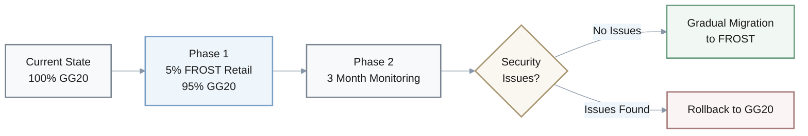
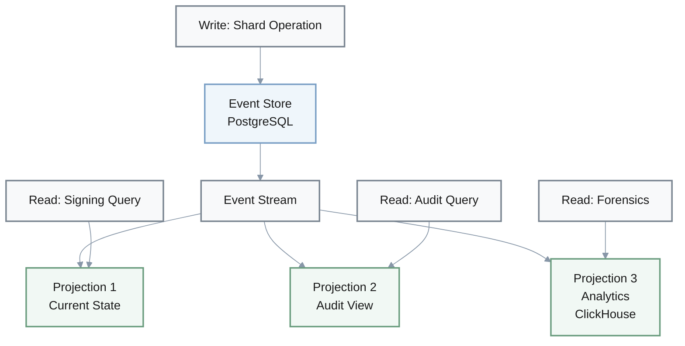
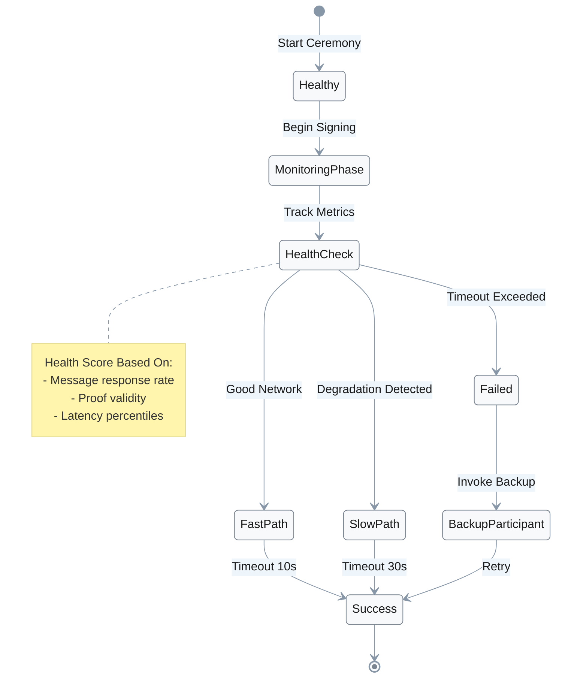
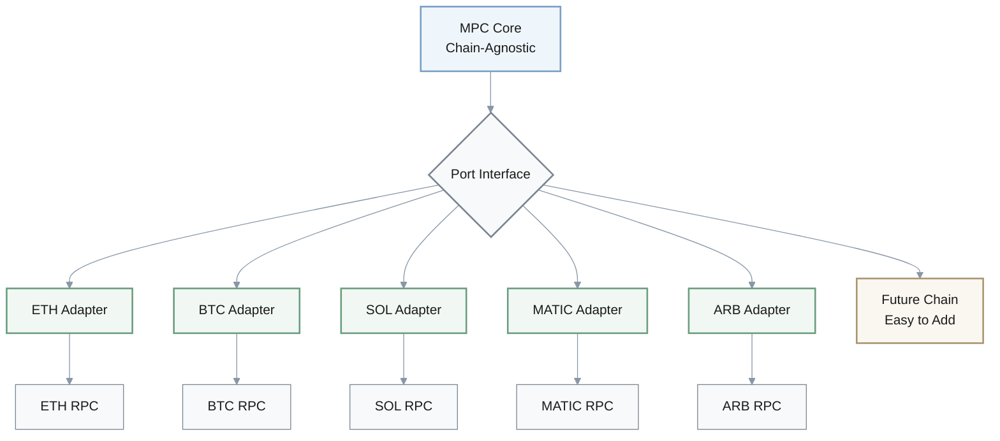
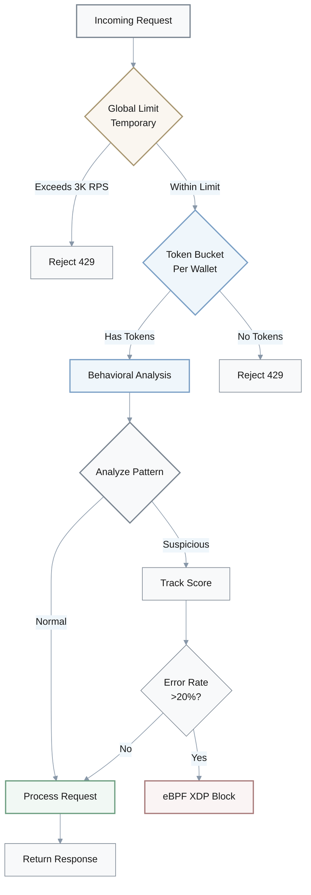
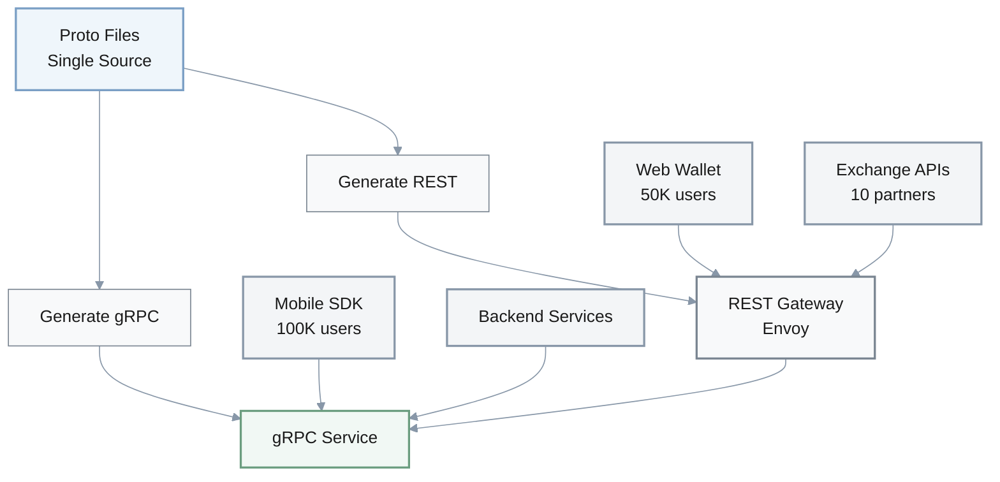
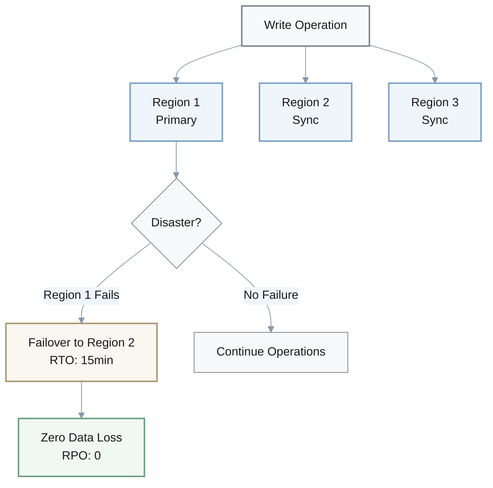
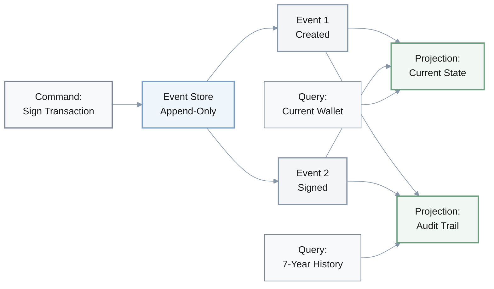
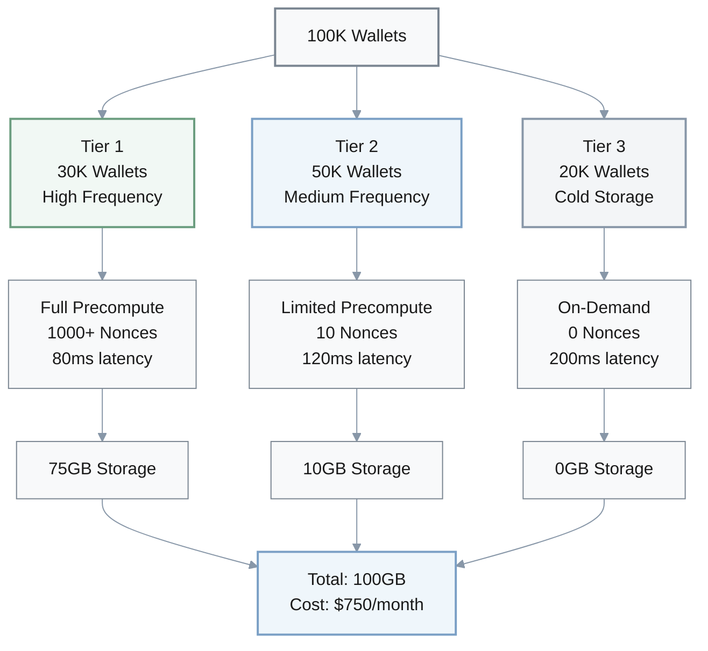
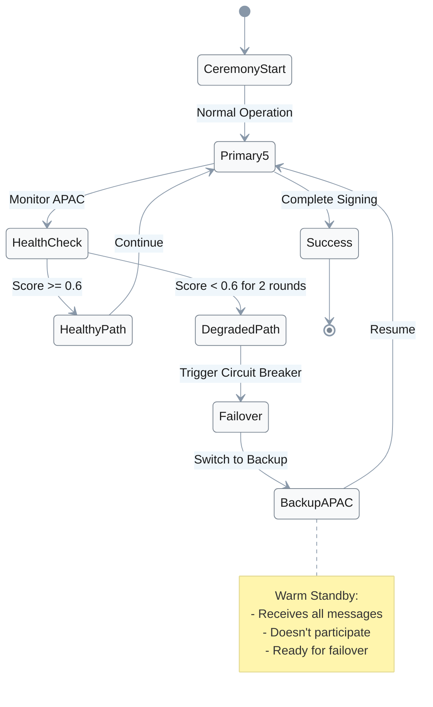

## 1. Protocol Migration: GG20 vs FROST

**Q**: Your MPC wallet currently uses GG20 for threshold ECDSA signing with average latency of 300ms (p95). Mobile users are complaining about slow transaction signing. You're considering switching to FROST to reduce latency to ~120ms, but your security team is concerned about changing from a well-audited protocol. What would you do and why?

### Protocol Comparison

| Metric | GG20 (Current) | FROST (Target) | Improvement |
|--------|----------------|----------------|-------------|
| **Latency (p95)** | 300ms | ~120ms | 60% reduction |
| **Security Level** | 128-bit | 128-bit | Equivalent |
| **Fault Tolerance** | 2 malicious nodes | 2 malicious nodes | Equivalent |
| **Audit Status** | Well-audited | Less mature | Risk factor |
| **Mobile UX** | Poor | Good | Significant |

### Decision

**Implement a hybrid approach with gradual migration**

### Rationale

1. **Hexagonal Architecture Deployment**: Deploy FROST adapter alongside existing GG20 using hexagonal architecture, allowing both protocols to coexist
2. **Risk-Managed Rollout**: Start with 5% of retail wallets on FROST (low-value transactions) while keeping institutional custody on GG20
3. **Parallel Monitoring**: Run both protocols in parallel for 3 months monitoring security incidents and latency improvements
4. **Equivalent Security**: Both protocols provide equivalent security (2 malicious node tolerance, 128-bit security) but FROST achieves 60% latency reduction critical for mobile UX
5. **Conditional Migration**: If no security issues after 3 months and user satisfaction improves, gradually migrate remaining wallets

### Trade-offs

**Cost**: Temporary operational complexity of dual protocols (+15% maintenance overhead)

**Benefit**: Improved user retention from better UX (reduced latency directly impacts mobile wallet adoption)

---

## 2. Key Shard Storage Architecture

**Q**: You're designing key shard storage for a multi-region MPC wallet deployment. Option A: Store shards in 3 regions with 2-of-3 recovery using DynamoDB Global Tables (simple, managed, $800/month). Option B: Implement custom CQRS with event sourcing using PostgreSQL + ClickHouse ($400/month but requires 2 engineers to maintain). Your system handles 50K wallets with compliance requirements for audit trails. What would you do and why?

### Option Comparison

| Factor | Option A: DynamoDB | Option B: CQRS + Event Sourcing |
|--------|-------------------|--------------------------------|
| **Monthly Cost** | $800 | $400 + engineering |
| **Setup Time** | Days | 3 months |
| **Engineering** | Minimal | 2 engineers |
| **Audit Trail** | External solution needed | Built-in immutable log |
| **Compliance** | Requires additions | SOC2/ISO 27001 ready |
| **Temporal Queries** | Limited | Full history queryable |
| **Scalability** | Auto-scaling | Manual tuning needed |
| **Read Performance** | Good | Excellent (CQRS) |

### Decision

**Choose CQRS with event sourcing (Option B) despite higher operational complexity**

### Rationale

1. **Compliance Non-Negotiable**: Compliance requirements for audit trails are non-negotiable - event sourcing provides immutable, complete history of all shard operations required for SOC2/ISO 27001
2. **DynamoDB Limitations**: DynamoDB Global Tables provide distribution but lack built-in audit trail and temporal query capabilities needed for forensic analysis
3. **Read Scalability**: CQRS enables read scalability for audit queries without impacting write-path performance of signing operations
4. **Cost Justification**: Initial engineering cost (2 engineers × 3 months = ~$50K) is justified by avoiding compliance violations and supporting future growth beyond 50K wallets
5. **Acceptable Latency**: Projection lag of 20-40ms is acceptable for audit queries (not real-time requirement)

### Cost Analysis

$$
\text{Total Cost (Year 1)} = \text{Infrastructure} + \text{Engineering}
$$

$$
\text{Option A} = 800 \times 12 + \text{Audit Solution} = \$9,600 + \text{Unknown}
$$

$$
\text{Option B} = 400 \times 12 + 50,000 = \$54,800
$$

### Trade-offs

**Cost**: Higher upfront development cost and operational complexity

**Benefit**: Regulatory compliance, auditability, and long-term scalability benefits

---

## 3. Distributed Signing Ceremony Reliability

**Q**: Your distributed signing ceremony fails 15% of the time due to participant timeouts in cross-region deployments (US-EU-ASIA). You can: (A) Increase timeout from 10s to 30s (reduces failures but increases user wait time), (B) Implement circuit breaker with adaptive timeouts and per-party health scoring (complex but intelligent), or (C) Reduce participant count from 5 to 3 (faster but lower fault tolerance). What would you do and why?

### Options Analysis

| Option | Timeout | Failure Rate | Fault Tolerance | User Experience | Complexity |
|--------|---------|--------------|-----------------|-----------------|------------|
| **A: Static 30s** | 30s fixed | Low | 2 nodes | Poor (3× latency) | Low |
| **B: Adaptive + Circuit Breaker** | 10-30s dynamic | Very Low | 2 nodes | Good | High |
| **C: 3 Participants** | 10s | Low | 1 node | Excellent | Low |
| **Current** | 10s | 15% | 2 nodes | Good | N/A |

### Decision

**Implement circuit breaker with adaptive timeouts (Option B)**

### Rationale

1. **Static Timeout Problem**: Static 30s timeout (Option A) reduces failures but creates poor UX with 3× latency increase, unacceptable for mobile wallets
2. **Security Cannot Be Compromised**: Reducing to 3 participants (Option C) decreases fault tolerance from 2 malicious nodes to 1, unacceptable security degradation for custody systems
3. **Adaptive Intelligence**: Adaptive circuit breaker starts at 10s (p50 latency × 2.5), only extends to 30s when network degradation detected, providing best of both worlds
4. **Health-Based Detection**: Per-party health scoring (based on message response rate, proof validity, latency) enables early detection of problematic participants, allowing ceremony to proceed with backup participants
5. **Expected Outcome**: Reduce failures from 15% to 3-4% while maintaining p95 latency <250ms

### Health Scoring Formula

$$
\text{Health Score} = 0.4 \times \text{Response Rate} + 0.3 \times \text{Proof Validity} + 0.3 \times (1 - \text{Normalized Latency})
$$

### Performance Improvement

| Metric | Before | After | Improvement |
|--------|--------|-------|-------------|
| **Failure Rate** | 15% | 3-4% | 75-80% reduction |
| **P95 Latency** | Variable | <250ms | Maintained |
| **User Experience** | Poor | Good | Significant |

### Trade-offs

**Cost**: Implementation complexity (~2 weeks development)

**Benefit**: 75-80% failure reduction and maintained low latency for good network conditions

---

## 4. Multi-Chain Integration Architecture

**Q**: You're integrating your MPC wallet with 5 blockchain networks (Ethereum, Bitcoin, Solana, Polygon, Arbitrum). You can: (A) Build a monolithic service with chain-specific if-else logic (fast to build, 3 weeks), (B) Use hexagonal architecture with chain adapters (6 weeks but modular), or (C) Build separate microservices per chain (maximum isolation but 12 weeks and high ops cost). Your team is 3 engineers, expecting to add 3 more chains next quarter. What would you do and why?

### Architecture Comparison

| Factor | Monolithic (A) | Hexagonal (B) | Microservices (C) |
|--------|----------------|---------------|-------------------|
| **Initial Time** | 3 weeks | 6 weeks | 12 weeks |
| **New Chain Time** | 4 weeks | <1 week | 2 weeks |
| **Team Size** | 3 engineers | 3 engineers | 5+ engineers |
| **Operational Cost** | Low | Medium | High |
| **Latency Overhead** | 0ms | 0ms | 50ms+ |
| **Test Execution** | Minutes | Seconds | Minutes |
| **Technical Debt** | High | Low | Low |
| **Audit Surface** | Complex | Modular | Isolated |

### Decision

**Use hexagonal architecture with chain adapters (Option B)**

### Rationale

1. **Technical Debt Avoidance**: Monolithic approach (Option A) creates 3 weeks of technical debt that becomes exponentially harder to refactor as more chains are added - each new chain requires touching core signing logic, increasing regression risk
2. **Right-Sized Architecture**: Microservices per chain (Option C) over-engineers for current scale; 5 chains don't justify operational overhead of 5+ services (deployment, monitoring, inter-service communication adds 50ms+ latency)
3. **Clean Abstraction**: Hexagonal architecture provides the right abstraction - core MPC logic is chain-agnostic, chain-specific details (transaction encoding, RPC calls) isolated in adapters
4. **Scalability**: With 3 more chains coming next quarter, adapter pattern reduces integration time from 4 weeks (monolith) to <1 week (new adapter implementation)
5. **Testing Benefits**: Mock adapters enable fast unit tests, reducing test execution from minutes to seconds

### Integration Time Projection

$$
\text{Total Dev Time (8 chains)} = \text{Initial} + (\text{New Chains} \times \text{Per Chain Time})
$$

**Monolithic Approach:**
$$
3 + (3 \times 4) = 15 \text{ weeks}
$$

**Hexagonal Approach:**
$$
6 + (3 \times 1) = 9 \text{ weeks}
$$

### Trade-offs

**Cost**: 2× initial development time (6 weeks vs 3 weeks)

**Benefit**: 70-80% faster future chain additions and maintainable security audit surface

---

## 5. Rate Limiting and Bot Protection

**Q**: Your MPC signing API is receiving 5K requests/second with 20% coming from suspected bot attacks. Current system has no rate limiting and p99 latency is degrading to 800ms (target: <150ms). You can: (A) Add global rate limit 3K rps (simple, 1 day), (B) Implement per-wallet token bucket with behavioral analysis (complex, 2 weeks), or (C) Add captcha/proof-of-work for all requests (stops bots but adds friction). What would you do and why?

### Options Analysis

| Option | Implementation | Bot Protection | Legitimate Users | P99 Latency | Complexity |
|--------|----------------|----------------|------------------|-------------|------------|
| **A: Global 3K RPS** | 1 day | Medium | Blocked unfairly | <200ms | Low |
| **B: Token Bucket + Behavioral** | 2 weeks | High | Protected | <150ms | High |
| **C: Captcha/PoW** | 3 days | Very High | Broken APIs | <150ms | Medium |
| **Current** | N/A | None | Good | 800ms | N/A |

### Decision

**Implement per-wallet token bucket with behavioral analysis (Option B) with temporary global rate limit during development**

### Rationale

1. **Emergency Measure**: Deploy global 3K rps limit immediately as emergency measure to restore p99 latency to <200ms, buying time for proper solution
2. **Avoid Noisy Neighbor**: Global limit (Option A) as permanent solution causes "noisy neighbor" problem - legitimate high-frequency traders blocked by bot traffic
3. **Preserve API Integration**: Captcha (Option C) breaks API integration for automated trading bots (legitimate use case) and adds unacceptable UX friction for mobile wallets
4. **Fair Resource Allocation**: Per-wallet token bucket (10 rps base, 20 burst) provides fairness while behavioral analysis (IP geolocation, request pattern entropy, error rates) identifies attackers
5. **Fast Blocking**: Attackers showing >20% error rate trigger IP-level blocking via eBPF XDP for <10ms penalty
6. **Expected Outcome**: Reduce malicious traffic by 95%, restore p99 latency to <150ms, maintain legitimate user access

### Token Bucket Configuration

- **Base Rate**: 10 requests/second per wallet
- **Burst Capacity**: 20 requests
- **Refill Rate**: 10 tokens/second

### Behavioral Indicators

| Indicator | Weight | Threshold |
|-----------|--------|-----------|
| **Error Rate** | 40% | >20% suspicious |
| **Request Pattern Entropy** | 30% | <2.0 bits suspicious |
| **Geographic Anomaly** | 15% | Country hop <1h |
| **Time Pattern** | 15% | 24/7 uniform |

### Performance Impact

| Metric | Current | Phase 1 (Global) | Phase 2 (Final) |
|--------|---------|------------------|-----------------|
| **Total RPS** | 5000 | 3000 | 4000 |
| **Bot Traffic** | 20% (1000 rps) | 0% | 1% (40 rps) |
| **P99 Latency** | 800ms | <200ms | <150ms |

### Trade-offs

**Cost**: 2 weeks development + $300/month Redis cluster cost

**Benefit**: Eliminating 95% of bot attacks and enabling legitimate high-frequency use cases

---

## 6. API Protocol Selection

**Q**: Your MPC wallet needs to support both mobile SDK and backend service integration. You can: (A) Expose REST API only (universal, simple docs, easy debugging), (B) gRPC only (efficient binary protocol, streaming, but harder browser support), or (C) Hybrid REST gateway with internal gRPC (best of both but operational complexity). Clients include mobile apps (100K users), exchange integrations (10 partners), and web wallet (50K users). What would you do and why?

### Client Requirements

| Client Type | Count | Performance Needs | Protocol Preference |
|-------------|-------|-------------------|---------------------|
| **Mobile Apps** | 100K users | High (battery, bandwidth) | gRPC |
| **Exchange APIs** | 10 partners | Standard HTTP | REST |
| **Web Wallet** | 50K users | Moderate | REST (browser) |
| **Backend Services** | Internal | Very High | gRPC |

### Protocol Comparison

| Feature | REST Only (A) | gRPC Only (B) | Hybrid (C) |
|---------|---------------|---------------|------------|
| **Mobile Performance** | Moderate | Excellent | Excellent |
| **Browser Support** | Excellent | Poor | Excellent |
| **Payload Size** | Baseline | 30-40% smaller | Best of both |
| **Streaming** | No | Yes | Yes (gRPC) |
| **Documentation** | Easy (OpenAPI) | Medium | Both |
| **Latency Overhead** | 0ms | 0ms | +2-5ms (REST) |

### Decision

**Hybrid approach - public REST gateway with internal gRPC (Option C)**

### Rationale

1. **Mobile Efficiency**: Mobile and backend SDKs use gRPC directly for efficiency - binary protobuf reduces payload size by 30-40%, streaming enables real-time signing progress, strong typing from `.proto` definitions
2. **Universal Compatibility**: Web browsers and external partners use REST endpoint translated by envoy/grpc-gateway - adds 2-5ms translation overhead but enables cache-friendly HTTP, simple curl debugging, OpenAPI documentation
3. **No API Drift**: Single source of truth (`.proto` files) generates both gRPC services and REST endpoints, reducing API drift
4. **Advanced Features**: Internal services benefit from gRPC features - deadlines, backpressure, bidi streaming for MPC ceremony coordination
5. **Measured Improvement**: 20-40% latency reduction for gRPC clients, 2-4× throughput for small messages, while maintaining REST compatibility for 10 exchange partners requiring standard HTTP

### Performance Metrics

| Metric | REST Only | gRPC Only | Hybrid |
|--------|-----------|-----------|--------|
| **Mobile Payload** | 10KB | 6KB | 6KB |
| **Mobile Latency** | 100ms | 60ms | 60ms |
| **Exchange Access** | ✅ Easy | ❌ Complex | ✅ Easy |
| **Streaming** | ❌ No | ✅ Yes | ✅ Yes (gRPC) |

### Trade-offs

**Cost**: One additional infrastructure hop for REST clients (+2-5ms) and gateway maintenance complexity

**Benefit**: Enabling high-performance native integrations for mobile/backend while preserving universal REST access

---

## 7. Disaster Recovery Strategy

**Q**: For disaster recovery, you need to decide on RPO (Recovery Point Objective) and RTO (Recovery Time Objective) for your MPC wallet storing $50M in custody. Option A: RPO=5min, RTO=30min using continuous replication ($2K/month). Option B: RPO=0, RTO=15min using synchronous multi-region writes ($5K/month). Option C: RPO=1hour, RTO=4hour using daily backups ($500/month). What would you do and why?

### Recovery Options Comparison

| Option | RPO | RTO | Monthly Cost | Data Loss Risk | Downtime Risk | Compliance |
|--------|-----|-----|--------------|----------------|---------------|------------|
| **A: Continuous Replication** | 5 min | 30 min | $2,000 | $100K-500K potential | $50K-100K | Marginal |
| **B: Synchronous Multi-Region** | 0 | 15 min | $5,000 | $0 | $25K-50K | ✅ SOC2 |
| **C: Daily Backups** | 1 hour | 4 hour | $500 | $1M+ potential | $400K+ | ❌ Fails audit |

### Decision

**Option B (RPO=0, RTO=15min) despite 2.5× cost increase**

### Rationale

1. **Data Loss Prevention**: For $50M AUM custody, even 5 minutes of data loss (Option A) could mean dozens of unrecoverable signing operations worth $100K-500K if disaster strikes during high-volume trading
2. **Institutional Requirements**: RPO=0 is critical for institutional custody where clients expect zero transaction loss - any data loss creates liability and reputation damage far exceeding $3K/month cost difference
3. **Minimized Downtime**: RTO=15min (vs 30min) halves downtime cost - at $50M AUM, even 15 minutes of service unavailability could cost $50K-100K in missed trading opportunities and client trust
4. **Geographic Distribution**: Synchronous multi-region writes ensure geographic distribution of key shards with strong consistency, supporting 99.99% availability SLA
5. **Option C Unacceptable**: 1 hour data loss and 4 hour downtime violates basic custody standards and would fail institutional client audits

### Financial Risk Analysis

**Potential Loss from Data Loss:**
$$
\text{Risk (Option A)} = \text{Disaster Probability} \times 5 \text{ minutes} \times \text{Avg Transaction Value}
$$

**Annual Cost Comparison:**
$$
\text{Delta Cost} = (5,000 - 2,000) \times 12 = \$36,000/\text{year}
$$

**Break-even**: Single prevented loss of >$36K justifies Option B

### SLA Comparison

| Metric | Option A | Option B | Option C |
|--------|----------|----------|----------|
| **Availability** | 99.9% | 99.99% | 99% |
| **Annual Downtime** | 8.76 hours | 52.6 minutes | 87.6 hours |
| **Compliance** | Marginal | ✅ Full | ❌ Inadequate |

### Trade-offs

**Cost**: $60K/year additional infrastructure cost

**Benefit**: Eliminating data loss risk, meeting institutional SLAs, and supporting compliance requirements (SOC2 typically requires RPO<5min for critical financial data)

---

## 8. Architecture Pattern for Compliance

**Q**: Your team is implementing a new MPC wallet and must choose between CQRS+Event Sourcing (higher complexity, auditability) vs. traditional CRUD with read replicas (simpler, faster to build). You have 3 months to launch, 4 engineers, and compliance requirements for maintaining 7-year audit trail of all signing operations. What would you do and why?

### Architecture Comparison

| Factor | CRUD + Read Replicas | CQRS + Event Sourcing |
|--------|---------------------|----------------------|
| **Complexity** | Low | High |
| **Development Time** | 2 months | 3 months |
| **Audit Trail** | External solution needed | Built-in immutable log |
| **Data Modification** | Possible (risk) | Append-only (safe) |
| **Temporal Queries** | Complex | Native support |
| **Compliance** | Requires additions | SOC2/ISO 27001 ready |
| **Write Latency** | 5ms | 3ms |
| **Read Latency** | 2ms | 20-40ms (projections) |
| **Future Migration** | Costly rewrite | Already compliant |

### Decision

**CQRS + Event Sourcing despite initial complexity**

### Rationale

1. **Compliance Non-Negotiable**: Audit trail is non-negotiable for compliance (SOC2, ISO 27001) - event sourcing provides immutable append-only log that auditors can verify, while CRUD databases can have data modified/deleted
2. **Native Temporal Queries**: 7-year retention - event store naturally supports temporal queries ("show all signatures between 2023-2024") without complex backup management
3. **Avoid Technical Debt**: Building CRUD initially means complete rewrite later for compliance - migration from CRUD to event sourcing while maintaining consistency is harder than building event-sourced from start
4. **Realistic Timeline**: With 4 engineers and 3 months, allocate 2 engineers to event store infrastructure (using EventStoreDB or PostgreSQL + Debezium), 2 engineers to business logic
5. **Performance Acceptable**: Event append has 3ms latency, projections have 20-40ms lag (acceptable for audit queries)

### Implementation Timeline

| Month | Team A (2 engineers) | Team B (2 engineers) |
|-------|---------------------|---------------------|
| **Month 1** | Event store infrastructure | Core domain logic |
| **Month 2** | Projection engine | Business workflows |
| **Month 3** | Integration & testing | API & UI integration |

### Performance Metrics

| Operation | CRUD | Event Sourcing |
|-----------|------|----------------|
| **Write (Sign)** | 5ms | 3ms |
| **Read (Current State)** | 2ms | 2ms (projection) |
| **Read (Audit)** | 100ms+ | 40ms (projection) |
| **Temporal Query** | Complex | Native |

### Trade-offs

**Cost**: 30% longer initial development

**Benefit**: Avoiding costly rewrite for compliance, built-in auditability, and ability to replay events for debugging production issues

---

## 9. Nonce Precomputation Strategy

**Q**: You discover that precomputing nonces for faster signing could reduce latency by 60% (200ms → 80ms) but requires storing 2-3MB of encrypted nonces per wallet. With 100K wallets, this means 200-300GB additional storage ($1.5K/month). Security team is concerned about nonce storage risks. What would you do and why?

### Full Precomputation Analysis

| Metric | Without Precomputation | Full Precomputation |
|--------|----------------------|---------------------|
| **Latency** | 200ms | 80ms (60% reduction) |
| **Storage per Wallet** | 0 | 2-3MB |
| **Total Storage (100K)** | 0 | 200-300GB |
| **Monthly Cost** | $0 | $1,500 |
| **Security Risk** | Low | Medium (nonce storage) |

### Decision

**Implement selective precomputation with risk-based tiers**

### Tiered Approach

| Tier | User Type | % of Wallets | Nonces Precomputed | Storage/Wallet | Total Storage | Use Case |
|------|-----------|--------------|-------------------|----------------|---------------|----------|
| **Tier 1** | High-frequency retail | 30% | Full (1000+) | 2.5MB | 75GB | Daily traders |
| **Tier 2** | Medium-frequency | 50% | Limited (10) | 200KB | 10GB | Regular users |
| **Tier 3** | Cold wallets | 20% | None (on-demand) | 0 | 0 | Infrequent |
| **Total** | - | 100% | - | - | **~100GB** | - |

### Rationale

1. **Tier 1 - High Impact**: High-frequency retail (30% of wallets) - enable full precomputation as these users make multiple transactions daily; 60% latency reduction significantly improves UX and reduces mobile battery drain
2. **Tier 2 - Balanced**: Medium-frequency (50% of wallets) - precompute 10 nonces (200KB per wallet) balancing performance improvement with storage cost, sufficient for daily transaction bursts
3. **Tier 3 - Cost Optimized**: Cold wallets (20% of wallets) - on-demand signing only as infrequent use doesn't justify storage cost
4. **Security Mitigation**: Encrypt nonces with AES-256-GCM using per-wallet keys, store in HSM-backed key storage, implement automatic expiry (24-hour TTL), audit trail of nonce generation/consumption
5. **Cost Optimization**: Tiered approach reduces storage to ~100GB ($750/month) while delivering latency improvements for 80% of active users

### Security Measures

- **Encryption**: AES-256-GCM per-wallet keys
- **Storage**: HSM-backed key storage
- **Expiry**: 24-hour TTL (auto-rotation)
- **Audit**: Complete nonce generation/consumption trail
- **Access Control**: Strict key derivation hierarchy

### Cost Savings

$$
\text{Savings} = \text{Full Precompute Cost} - \text{Tiered Cost}
$$

$$
\text{Savings} = \$1,500 - \$750 = \$750/\text{month} = \$9,000/\text{year}
$$

### Performance by Tier

| Tier | Users Impacted | Latency | Improvement |
|------|----------------|---------|-------------|
| **Tier 1** | 30K (30%) | 80ms | 60% |
| **Tier 2** | 50K (50%) | 120ms | 40% |
| **Tier 3** | 20K (20%) | 200ms | 0% |
| **Weighted Avg** | 100K | **123ms** | **38% overall** |

### Trade-offs

**Cost**: $750/month storage cost and increased complexity

**Benefit**: Significantly improved mobile UX for majority of users (80% get latency improvements), while maintaining security through encryption and strict nonce management

---

## 10. Geographic Participant Reliability

**Q**: You're experiencing 5% failure rate in 5-party MPC signing ceremonies due to one chronically slow participant (geographic latency from APAC region). You can: (A) Remove APAC participant and go to 4-party (reduces latency but lowers fault tolerance), (B) Implement backup participants and failover logic (complex), or (C) Optimize network with dedicated VPN/VPC peering (costly). All participants are co-equal business partners. What would you do and why?

### Options Analysis

| Option | Failure Rate | Fault Tolerance | Geographic Coverage | Latency | Monthly Cost | Business Impact |
|--------|-------------|-----------------|---------------------|---------|--------------|-----------------|
| **A: Remove APAC (4-party)** | 1% | 1 malicious node | US, EU only | Fast | $0 | ❌ Lost partner |
| **B: Backup + Failover** | <1% | 2 malicious nodes | US, EU, APAC | Good | +$1,200 | ✅ All partners |
| **C: Dedicated VPN** | 3% | 2 malicious nodes | US, EU, APAC | Improved | +$2,500 | ✅ All partners |
| **Current (5-party)** | 5% | 2 malicious nodes | US, EU, APAC | Variable | $0 | ✅ All partners |

### Decision

**Implement backup participants with smart failover (Option B)**

### Rationale

1. **Business Requirement Non-Negotiable**: Cannot remove APAC participant (Option A) - business requirement for geographic distribution and co-equal partners means all regions must participate; reducing to 4 parties also lowers Byzantine fault tolerance
2. **VPN Limited Benefits**: Dedicated VPN (Option C) helps but doesn't solve fundamental geographic latency (APAC-US: 150-200ms minimum) and costs $2K-3K/month ongoing
3. **Smart Failover Design**: Primary ceremony uses fastest 5 participants; if APAC node's health score drops below 0.6 for 2 consecutive rounds, circuit breaker triggers failover to designated backup in same region
4. **Warm Standby**: Backup nodes maintain "warm standby" - receive all broadcast messages but don't actively participate unless primary fails, adding minimal overhead
5. **Expected Outcome**: Reduce failure rate from 5% to <1% by having fallback option while maintaining geographic distribution and fault tolerance

### Backup Participant Design

| Component | Primary Nodes | Backup Nodes |
|-----------|---------------|--------------|
| **Count** | 5 (US × 2, EU × 2, APAC × 1) | 1 (APAC backup) |
| **Participation** | Active in all ceremonies | Passive (warm standby) |
| **Message Reception** | All messages | All messages |
| **Failover Trigger** | N/A | Health score < 0.6 for 2 rounds |
| **Recovery Time** | N/A | <10s |

### Health Scoring

$$
\text{Health Score} = \frac{\text{Successful Responses}}{\text{Total Requests}} \times (1 - \frac{\text{Latency Penalty}}{100})
$$

**Failover Trigger:**
- Health score < 0.6 for 2 consecutive signing rounds
- Automatic switchover to backup APAC node
- Alert sent to operations team

### Performance Impact

| Metric | Current | With Backup |
|--------|---------|-------------|
| **Failure Rate** | 5% | <1% (80% reduction) |
| **Geographic Coverage** | 3 regions | 3 regions (maintained) |
| **Fault Tolerance** | 2 nodes | 2 nodes (maintained) |
| **Infrastructure Cost** | $6K/month | $7.2K/month (+20%) |

### Infrastructure Topology

- **US Region**: 2 primary nodes
- **EU Region**: 2 primary nodes  
- **APAC Region**: 1 primary + 1 backup node

### Trade-offs

**Cost**: Implementation complexity (~3 weeks) and 20% increased infrastructure cost (backup nodes)

**Benefit**: 80% failure reduction and maintaining business requirements for multi-region participation
