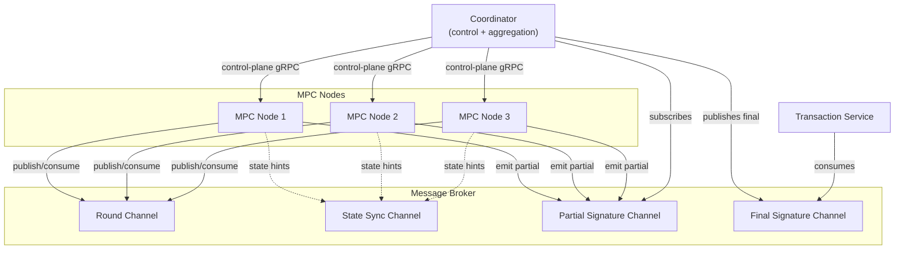

# MPC Wallet Architecture - Phase 1

## Overview
This document outlines the Phase 1 architecture for the MPC Wallet system, focusing on the optimal communication patterns and node independence.

## Core Components

### 1. Coordinator
- **Role**: Control-plane orchestrator and signature collector
- **Responsibilities**:
  - Define MPC clusters and select task participants
  - Manage node membership and monitor liveness
  - Issue round assignments and control commands over direct links
  - Subscribe to partial-signature channels, verify shares, and aggregate the final signature
  - Publish completed signatures to downstream services

### 2. MPC Nodes
- **Role**: Independent cryptographic workers
- **Responsibilities**:
  - Hold sealed key shares and execute MPC rounds via the broker
  - Derive per-request nonces and emit partial signatures
  - Maintain only minimal ephemeral state required for each session
  - Avoid on-chain awareness; no transaction submission logic

### 3. Transaction Service
- **Role**: Blockchain interaction boundary
- **Responsibilities**:
  - Consume completed signatures from the message broker
  - Construct and submit transactions, manage nonces, and track confirmations
  - Handle retries, rebroadcasts, and audit logging outside MPC rounds

### 4. Message Broker
- **Role**: Shared transport for MPC data planes
- **Responsibilities**:
  - Provide isolated channels for round messages, state sync, partial signatures, and final signatures
  - Enforce ACLs/QoS per channel for durability and replay protection
  - Decouple producers and consumers across all MPC-related services

## Communication Architecture

### 1. Coordinator-MPC Node Communication
**Pattern**: Direct Connection
**Implementation**:
```yaml
coordinator:
  connection_type: "direct"
  protocol: "gRPC"
  features:
    - low_latency
    - direct_control
    - simple_implementation
```

**Benefits**:
- Minimal latency for coordination
- Direct control over nodes
- Simple one-shot command handling
- Reliable task assignment

### 2. MPC Round-Based Communication
**Pattern**: Message Broker
**Implementation**:
```yaml
round_communication:
  channel: "mpc_rounds"
  features:
    - decoupled_nodes
    - reliable_delivery
    - round_management
    - message_persistence
```

### 3. State Synchronization
**Pattern**: Message Broker
**Implementation**:
```yaml
state_sync:
  channel: "state_updates"
  features:
    - state_propagation
    - conflict_resolution
    - persistence
    - recovery_support
```

## Node Independence

### Architecture



### Benefits

#### Failure Isolation
- One node failure does not block other signers or downstream submission
- Coordinator aggregation can be replicated for high availability without exposing key material

#### Operational Clarity
- Coordinator limits scope to control-plane orchestration and signature aggregation
- MPC nodes focus on share custody, nonce derivation, and protocol rounds
- Transaction service owns blockchain interaction, retries, and auditing

#### Scalability
- Broker topics allow independent scaling of MPC nodes, coordinator replicas, and transaction workers
- Control and data planes remain decoupled, simplifying autoscaling policies

#### Maintainability
- Clear separation of responsibilities eases upgrades and incident isolation
- Channel-level ACLs/QoS deliver predictable behavior across services

## Message Broker Channels

### Channel Organization
```yaml
message_broker:
  channels:
    mpc_rounds:
      type: "round_communication"
      retention: "session"
      
    state_sync:
      type: "state_updates"
      retention: "persistent"
      
    partial_signatures:
      type: "signature_aggregation"
      retention: "short_term"
      
    signatures_final:
      type: "transaction_handoff"
      retention: "persistent"
      
    heartbeats:
      type: "liveness_check"
      retention: "short_term"
      
    events:
      type: "system_events"
      retention: "persistent"
```

## Implementation Guidelines

### 1. Node Implementation
```go
type MPCNode struct {
    // Direct connection to coordinator
    coordinatorConn *grpc.ClientConn
    
    // Broker connection for rounds and state sync
    brokerConn *MessageBroker
    
    // Local components
    state      *LocalState
    compute    *LocalCompute
    syncManager *StateSyncManager
}
```

### 2. State Synchronization
```go
type StateSyncManager struct {
    broker *MessageBroker
    localState *LocalState
    nodeID string
}

func (ssm *StateSyncManager) publishStateUpdate() error {
    stateMsg := StateMessage{
        NodeID: ssm.nodeID,
        Timestamp: time.Now(),
        State: ssm.localState.Serialize(),
    }
    return ssm.broker.Publish("state.updates", stateMsg)
}
```

## Benefits Summary

### 1. Performance
- Low latency coordination
- Efficient round communication
- Optimized local computation

### 2. Reliability
- Independent node operation
- Built-in message guarantees
- Isolated failure domains

### 3. Maintainability
- Clear communication patterns
- Easy monitoring
- Simple debugging

### 4. Scalability
- Easy to add nodes
- Independent scaling
- Flexible configuration

## Next Steps
- Implement direct gRPC connections between Coordinator and MPC nodes
- Set up Message Broker with defined channels
- Implement state synchronization mechanism
- Add monitoring and logging
- Test failure scenarios and recovery

## Considerations

### Network Topology
- Consider geographic distribution
- Plan for network partitions
- Optimize for latency

### Security
- Implement TLS for all connections
- Add authentication mechanisms
- Secure message content

### Monitoring
- Track message delivery
- Monitor node health
- Log state changes

This update reflects our discussion about:
1. Using direct connections for Coordinator-MPC node communication
2. Using Message Broker for both round-based communication and state synchronization
3. Maintaining node independence
4. Implementing proper channel organization
5. Adding detailed implementation guidelines

The architecture now clearly defines the communication patterns and their purposes, while maintaining the independence of individual MPC nodes.
