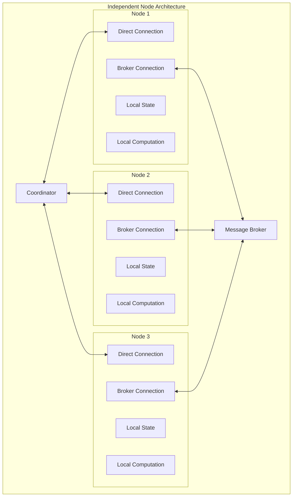

# MPC Wallet Architecture - Phase 1

## Overview
This document outlines the Phase 1 architecture for the MPC Wallet system, focusing on the optimal communication patterns and node independence.

## Core Components

### 1. Coordinator
- **Role**: Central coordination of MPC activities
- **Responsibilities**:
  - Define MPC cluster participants
  - Manage node membership
  - Assign tasks to MPC nodes
  - Monitor node health

### 2. MPC Nodes
- **Role**: Independent computation nodes
- **Responsibilities**:
  - Participate in MPC rounds
  - Maintain local state
  - Handle state synchronization
  - Execute cryptographic operations

## Communication Architecture

### 1. Coordinator-MPC Node Communication
**Pattern**: Direct Connection
**Implementation**:
```yaml
coordinator:
  connection_type: "direct"
  protocol: "gRPC"
  features:
    - low_latency
    - direct_control
    - simple_implementation
```

**Benefits**:
- Minimal latency for coordination
- Direct control over nodes
- Simple one-shot command handling
- Reliable task assignment

### 2. MPC Round-Based Communication
**Pattern**: Message Broker
**Implementation**:
```yaml
round_communication:
  channel: "mpc_rounds"
  features:
    - decoupled_nodes
    - reliable_delivery
    - round_management
    - message_persistence
```

### 3. State Synchronization
**Pattern**: Message Broker
**Implementation**:
```yaml
state_sync:
  channel: "state_updates"
  features:
    - state_propagation
    - conflict_resolution
    - persistence
    - recovery_support
```

## Node Independence

### Architecture



### Benefits

#### Failure Isolation
- One node failure doesn't affect others
- Independent recovery processes

#### Scalability
- Easy to add/remove nodes
- Independent scaling

#### Maintenance
- Independent updates
- Isolated debugging

## Message Broker Channels

### Channel Organization
```yaml
message_broker:
  channels:
    mpc_rounds:
      type: "round_communication"
      retention: "session"
      
    state_sync:
      type: "state_updates"
      retention: "persistent"
      
    heartbeats:
      type: "liveness_check"
      retention: "short_term"
      
    events:
      type: "system_events"
      retention: "persistent"
```

## Implementation Guidelines

### 1. Node Implementation
```go
type MPCNode struct {
    // Direct connection to coordinator
    coordinatorConn *grpc.ClientConn
    
    // Broker connection for rounds and state sync
    brokerConn *MessageBroker
    
    // Local components
    state      *LocalState
    compute    *LocalCompute
    syncManager *StateSyncManager
}
```

### 2. State Synchronization
```go
type StateSyncManager struct {
    broker *MessageBroker
    localState *LocalState
    nodeID string
}

func (ssm *StateSyncManager) publishStateUpdate() error {
    stateMsg := StateMessage{
        NodeID: ssm.nodeID,
        Timestamp: time.Now(),
        State: ssm.localState.Serialize(),
    }
    return ssm.broker.Publish("state.updates", stateMsg)
}
```

## Benefits Summary

### 1. Performance
- Low latency coordination
- Efficient round communication
- Optimized local computation

### 2. Reliability
- Independent node operation
- Built-in message guarantees
- Isolated failure domains

### 3. Maintainability
- Clear communication patterns
- Easy monitoring
- Simple debugging

### 4. Scalability
- Easy to add nodes
- Independent scaling
- Flexible configuration

## Next Steps
- Implement direct gRPC connections between Coordinator and MPC nodes
- Set up Message Broker with defined channels
- Implement state synchronization mechanism
- Add monitoring and logging
- Test failure scenarios and recovery

## Considerations

### Network Topology
- Consider geographic distribution
- Plan for network partitions
- Optimize for latency

### Security
- Implement TLS for all connections
- Add authentication mechanisms
- Secure message content

### Monitoring
- Track message delivery
- Monitor node health
- Log state changes

This update reflects our discussion about:
1. Using direct connections for Coordinator-MPC node communication
2. Using Message Broker for both round-based communication and state synchronization
3. Maintaining node independence
4. Implementing proper channel organization
5. Adding detailed implementation guidelines

The architecture now clearly defines the communication patterns and their purposes, while maintaining the independence of individual MPC nodes.
