# Comprehensive Analysis of Threshold Signature Protocols and Their Blockchain Implementations

## Executive Summary

Threshold signature protocols have evolved significantly to meet the security and performance demands of modern blockchain systems. This document serves as a comprehensive reference for building MPC services, with direct links to implementations, security advisories, and related resources.

### Key Resources
- [IETF FROST RFC](https://datatracker.ietf.org/doc/draft-irtf-cfrg-frost/): Standard for FROST threshold signatures
- [BLS Signatures](https://datatracker.ietf.org/doc/draft-irtf-cfrg-bls-signature/): IETF standard for BLS signatures
- [MPC Alliance](https://www.mpcalliance.org/): Industry standards and best practices
- [Awesome MPC](https://github.com/rdragos/awesome-mpc): Curated list of MPC resources
- [Coinbase Kryptology](https://github.com/coinbase/kryptology): Advanced cryptography library with Threshold ECDSA and DKG in Go
- [SKALE libBLS](https://github.com/skalenetwork/libBLS): BLS signatures and threshold encryption library in C++
- [Celo Threshold BLS](https://github.com/celo-org/celo-threshold-bls-rs): Threshold BLS signatures and DKG in Rust
- [NuCypher NuBLS](https://github.com/nucypher/NuBLS): Rust implementation of BLS-based threshold protocols
- [Unbound Tech MPC](https://github.com/unbound-tech/blockchain-crypto-mpc): 2-party ECDSA and EdDSA in C++
- [Cardinals Threshold ECDSA](https://gitlab.com/cardinals1/threshold-ecdsa): Threshold ECDSA implementation
- [Aleph Zero Consensus](https://github.com/aleph-zero-foundation/consensus-go): Threshold BLS for randomness in consensus
- [Polychain Threshold Ed25519](https://gitlab.com/polychainlabs/threshold-ed25519): Threshold Ed25519 in Go
- [THORChain TSS](https://gitlab.com/thorchain/tss): TSS repositories for various protocols
- [Frost-Dalek](https://github.com/isislovecruft/frost-dalek): Rust implementation of FROST for Schnorr signatures
- [PoA Threshold Crypto](https://github.com/poanetwork/threshold_crypto): Rust pairing-based threshold cryptosystem
- [Axelar ToFN](https://github.com/axelarnetwork/tofn): Rust implementation of GG20 for threshold ECDSA
- [Open TSS](https://github.com/LatticeX-Foundation/opentss): Rust multi-party threshold signature scheme
- [MPECDSA](https://gitlab.com/neucrypt/mpecdsa): Rust implementations for 2-of-n and t-of-n ECDSA

### Quick Reference: Protocol Families and Blockchains

| Protocol Family | Implementations | Key Blockchains | Primary Use Cases | Status |
| --- | --- | --- | --- | --- |
| **ECDSA** | [GG18](https://github.com/ZenGo-X/multi-party-ecdsa), [GG20](https://github.com/bnb-chain/tss-lib), [MPC-CMP](https://github.com/hugohn/mpc-cmp), [CGGMP](https://github.com/webb-tools/cggmp-threshold-ecdsa), [DKLS23](https://github.com/silence-laboratories/dkls23), [CCLST](https://github.com/getamis/alice) | Bitcoin, Ethereum L1, Avalanche, Cosmos, Polkadot, Filecoin, Hedera, XRP, Stacks, Dogecoin | Custody, multi-sig wallets, cross-chain | ✅ Production |
| **EdDSA** | [FROST-Ed25519](https://github.com/taurushq-io/frost-ed25519) | Solana, Cardano, Near, Tezos, Aptos, Sui, Monero | High-throughput DeFi, validators, privacy | ✅ Production |
| **BLS** | [BLS Aggregation](https://github.com/herumi/bls), [Threshold BLS](https://github.com/ZenGo-X/multi-party-bls) | Ethereum 2.0, Filecoin, Dfinity, Polkadot, Chia, Algorand, Harmony | PoS consensus, validator committees | ✅ Production |
| **Schnorr** | [MuSig2](https://github.com/conduition/musig2), [FROST-Schnorr](https://github.com/ZcashFoundation/frost), [Frost-Dalek](https://github.com/isislovecruft/frost-dalek) | Bitcoin Taproot, Lightning Network | Privacy-enhanced multisig, channels | ✅ Production |
| **RSA** | Shoup, Damgård-Dupont | Legacy PKI systems | Traditional infrastructure | ⚠️ Legacy |
| **Post-Quantum** | Dilithium, FALCON, SPHINCS+ | Experimental/Research | Future quantum resistance | 🔬 Emerging |

### Protocol Hierarchy and Relationships

```mermaid
flowchart TD
    subgraph Protocols["Threshold Signature Protocol Families"]
        ECDSA["Threshold ECDSA"]
        EdDSA["Threshold EdDSA"]
        BLS["Threshold BLS"]
        Schnorr["Threshold Schnorr"]
    end
    
    subgraph ECDSA_Impl["ECDSA Implementations"]
        GG18["GG18
        • 9 rounds
        • Paillier-based
        • Basic security
        • [GitHub](https://github.com/ZenGo-X/multi-party-ecdsa)"]
        GG20["GG20
        • 7 rounds
        • Paillier-based
        • Identifiable abort
        • [GitHub](https://github.com/bnb-chain/tss-lib)"]
        MPC_CMP["MPC-CMP
        • 1-round signing
        • Enhanced Paillier
        • Key refresh
        • [GitHub](https://github.com/hugohn/mpc-cmp)"]
        CGGMP["CGGMP
        • 3 rounds keygen
        • UC-secure
        • Advanced ZK proofs
        • [GitHub](https://github.com/webb-tools/cggmp-threshold-ecdsa)"]
        DKLS["DKLS23
        • 3 rounds
        • 2-party optimized
        • Malicious secure
        • [GitHub](https://github.com/silence-laboratories/dkls23)"]
        CCLST["CCLST
        • 3/2 rounds
        • Class group-based
        • 4-9x bandwidth saving
        • [GitHub](https://github.com/getamis/alice)"]
    end
    
    subgraph EdDSA_Impl["EdDSA Implementation"]
        FROST_Ed["FROST-Ed25519
        • Single-round
        • DKG-based
        • High performance"]
    end
    
    subgraph BLS_Impl["BLS Implementations"]
        BLS_Agg["BLS Aggregation
        • Signature aggregation
        • Pairing-based
        • Scalable verification"]
        Threshold_BLS["Threshold BLS
        • DKG-based
        • Distributed randomness
        • Committee signing"]
    end
    
    subgraph Schnorr_Impl["Schnorr Implementations"]
        MuSig2["MuSig2
        • 2-round
        • Key aggregation
        • Taproot compatible"]
        FROST_Schnorr["FROST-Schnorr
        • Threshold capable
        • DKG-based
        • Flexible setup"]
        Frost_Dalek["Frost-Dalek
        • Single-round
        • Ristretto group
        • t-of-n"]
    end
    
    subgraph Blockchain_ECDSA["ECDSA Blockchains"]
        BTC["Bitcoin
        • ECDSA secp256k1
        • High security"]
        ETH1["Ethereum L1
        • ECDSA secp256k1
        • Smart contracts"]
        Multi_ECDSA["Multi-chain
        • Avalanche, Cosmos
        • Polkadot, Filecoin
        • Hedera, Stacks, Dogecoin"]
    end
    
    subgraph Blockchain_EdDSA["EdDSA Blockchains"]
        SOL["Solana
        • Ed25519
        • High throughput"]
        Cardano_Ed["Cardano
        • Ed25519
        • PoS consensus"]
    end
    
    subgraph Blockchain_BLS["BLS Blockchains"]
        ETH2["Ethereum 2.0
        • BLS12-381
        • Beacon chain"]
        BLS_Chains["BLS Ecosystem
        • Filecoin, Dfinity
        • Polkadot, Chia
        • ZetaChain"]
    end
    
    subgraph Blockchain_Schnorr["Schnorr Blockchains"]
        BTC_Taproot["Bitcoin Taproot
        • Schnorr signatures
        • MuSig2 support"]
        Lightning["Lightning Network
        • Channel management
        • Privacy enhanced"]
    end
    
    ECDSA --> GG18 & GG20 & MPC_CMP & CGGMP & DKLS & CCLST
    EdDSA --> FROST_Ed
    BLS --> BLS_Agg & Threshold_BLS
    Schnorr --> MuSig2 & FROST_Schnorr & Frost_Dalek
    
    GG18 & GG20 & MPC_CMP & CGGMP & DKLS & CCLST --> BTC & ETH1 & Multi_ECDSA
    FROST_Ed --> SOL & Cardano_Ed
    BLS_Agg & Threshold_BLS --> ETH2 & BLS_Chains
    MuSig2 & FROST_Schnorr & Frost_Dalek --> BTC_Taproot & Lightning

    classDef protocol fill:#e1f5fe,stroke:#0288d1,stroke-width:2px,color:#000000
    classDef impl fill:#f3e5f5,stroke:#7b1fa2,stroke-width:2px,color:#000000
    classDef blockchain fill:#e8f5e9,stroke:#2e7d32,stroke-width:2px,color:#000000
    
    class ECDSA,EdDSA,BLS,Schnorr protocol
    class GG18,GG20,MPC_CMP,CGGMP,DKLS,CCLST,FROST_Ed,BLS_Agg,Threshold_BLS,MuSig2,FROST_Schnorr,Frost_Dalek impl
    class BTC,ETH1,ETH2,SOL,Multi_ECDSA,Cardano_Ed,BLS_Chains,BTC_Taproot,Lightning blockchain
```

### Implementation Comparison

#### ECDSA Family

| Implementation | Rounds (Keygen/Sign) | Encryption Basis | Key Features | Security Model | Blockchain Compatibility |
| --- | --- | --- | --- | --- | --- |
| [GG18](https://github.com/ZenGo-X/multi-party-ecdsa) | 9/9 | Paillier | Basic threshold, t≤n | Semi-honest | Bitcoin, Ethereum, Multi-chain |
| [GG20](https://github.com/bnb-chain/tss-lib) | 7/7 | Paillier | Identifiable abort, non-interactive online | Malicious | Bitcoin, Ethereum, Multi-chain |
| [MPC-CMP](https://github.com/hugohn/mpc-cmp) | 3/1 | Enhanced Paillier | Key refresh, adaptive security | UC-secure | Bitcoin, Ethereum, Multi-chain |
| [CGGMP](https://github.com/webb-tools/cggmp-threshold-ecdsa) | 3/3 | Paillier + DH | UC-secure, advanced ZK proofs, key refresh | UC-secure | Bitcoin, Ethereum, Multi-chain |
| [DKLS23](https://github.com/silence-laboratories/dkls23) | 3/3 | Paillier-based | 2-party optimized, reduced rounds | Malicious | Bitcoin, Ethereum, Multi-chain |
| [CCLST](https://github.com/getamis/alice) | 3/2 | Class group | 4-9x bandwidth reduction, non-interactive | Malicious | Bitcoin, Ethereum, Multi-chain |
| [Gennaro-Goldfeder ECDSA Paper](https://eprint.iacr.org/2019/114.pdf) | N/A | N/A | Fast multiparty threshold ECDSA | UC-secure | Multi-chain |
| [Tillem-Burundukov Survey](https://new.ingwb.com/binaries/content/assets/insights/themes/distributed-ledger-technology/ing-releases-multiparty-threshold-signing-library-to-improve-customer-security/threshold-signatures-using-secure-multiparty-computation.pdf) | N/A | N/A | Comprehensive survey of ECDSA threshold schemes | Various | Multi-chain |
| [Aumasson-Hamelink-Shlomovits Survey](https://eprint.iacr.org/2020/1390.pdf) | N/A | N/A | Survey of ECDSA threshold signatures | Malicious | Multi-chain |

#### EdDSA Family

| Implementation | Rounds | Key Generation | Key Features | Blockchain Compatibility |
| --- | --- | --- | --- | --- |
| [FROST-Ed25519](https://github.com/taurushq-io/frost-ed25519) | Single-round | DKG-based | Flexible threshold, preprocessing | Solana, Cardano |

#### BLS Family

| Implementation | Key Feature | Aggregation | Use Case | Blockchain Compatibility |
| --- | --- | --- | --- | --- |
| [BLS Aggregation](https://github.com/herumi/bls) | Signature aggregation | Yes | Scalable consensus | Ethereum 2.0, Filecoin, Dfinity |
| [Threshold BLS](https://github.com/ZenGo-X/multi-party-bls) | Committee signing | Yes | Distributed randomness | Polkadot, Chia, ZetaChain |

#### Schnorr Family

| Implementation | Rounds | Key Aggregation | Threshold Support | Blockchain Compatibility |
| --- | --- | --- | --- | --- |
| [MuSig2](https://github.com/conduition/musig2) | 2 rounds | Yes | n-of-n | Bitcoin Taproot, Lightning |
| [FROST-Schnorr](https://github.com/ZcashFoundation/frost) | Single-round | No | t-of-n | Bitcoin Taproot, General use |
| [Frost-Dalek](https://github.com/isislovecruft/frost-dalek) | Single-round | No | t-of-n | Multi-chain |

### Protocol Evolution and Characteristics

#### ECDSA Family Evolution

The ECDSA protocol family has shown significant advancement in implementation efficiency and security:

1. **GG18**:
  - Pioneering implementation requiring 9 rounds for signing 10:5
  - Established foundation for threshold ECDSA
  - Widely adopted in early blockchain implementations

2. **GG20**:
  - Improved efficiency to 7 rounds
  - Added identifiable aborts for enhanced security 10:5
  - Maintained compatibility with existing blockchain infrastructure

3. **MPC-CMP**:
  - Latest evolution achieving single-round signing
  - Includes modern security features and key refresh mechanisms
  - Optimized for high-security blockchain applications
  - Non-interactive signing capability with adaptive security (t = n-1)

4. **CGGMP (2021)**:
  - Collaborative work between GG20 and CMP authors
  - 3-round key generation with Schnorr zero-knowledge proofs
  - UC-secure framework with enhanced zero-knowledge range proofs
  - Key refresh using DH-style encryption (more efficient than Paillier)
  - Addresses vulnerabilities found in GG18/GG20 (6ix1een attack, Death by 1M cuts)
  - Requires proof that Paillier modulus is a Paillier Blum modulus
  - Advanced security: protects against small prime factor attacks

5. **DKLS23**:
  - Optimized 2-party threshold ECDSA protocol by Coinbase
  - Reduced from 6 rounds (earlier versions) to 3 rounds
  - Maliciously secure against adaptive adversaries
  - Designed for practical deployment in custody solutions
  - Maintains security while improving communication efficiency
  - Particularly suitable for 2-of-2 wallet architectures

6. **CCLST (Class Group-Based)**:
  - Revolutionary class group-based encryption approach
  - Achieves 4-9x bandwidth reduction compared to Paillier-based protocols
  - Uses ideal class groups of imaginary quadratic fields
  - DDH group with easy DL subgroup enables linearly homomorphic encryption
  - Non-interactive, maliciously secure, full-threshold protocol
  - Features: identifiable aborts, adaptive security (t = n-1), proactive security
  - Eliminates need for zero-knowledge range proofs in MtA protocol
  - 2-round signing protocol (follows GG20 structure with class group encryption)

#### EdDSA (FROST) Implementation

FROST (Flexible Round-Optimized Schnorr Threshold Signatures) represents a modern approach to threshold signatures:

- **Single-round signing** with preprocessing phase
- **Flexible threshold support** (t-of-n) via Distributed Key Generation (DKG)
- **Two key generation options**:
  - Trusted dealer (simple but requires trust)
  - Interactive DKG session (trustless but requires secure channels)
- **High performance** optimized for throughput-intensive blockchains
- **Privacy benefits**: threshold constellation remains hidden on-chain
- **Schnorr-based construction** enabling efficient verification
- Specifically designed for high-performance blockchain applications

#### BLS (Boneh-Lynn-Shacham) Family

BLS signatures revolutionized blockchain scalability through signature aggregation:

1. **BLS Aggregation**:
  - **Signature aggregation**: Multiple signatures combine into single signature
  - **Pairing-based cryptography**: Uses BLS12-381 elliptic curve
  - **Scalable verification**: Verify aggregated signature in single operation
  - **Ethereum 2.0 breakthrough**: Enabled scaling to 500,000+ validators
  - **Reduced network overhead**: Dramatically fewer messages to gossip
  - **Committee consensus**: Efficient for large validator sets

2. **Threshold BLS**:
  - **Distributed Key Generation (DKG)**: Trustless key generation
  - **Distributed randomness**: Used in Filecoin, drand beacon
  - **Verifiable Random Functions (VRF)**: Block proposer selection
  - **Threshold signing**: t-of-n signature generation
  - **Accountability**: Individual validator signatures remain verifiable

**Key Characteristics**:
- Slower than ECDSA but aggregation compensates at scale
- Deterministic signatures (no nonce required)
- Unique signature property enables advanced protocols
- Cross-blockchain standardization (Ethereum 2.0, Filecoin, Dfinity, Chia, Algorand)

#### Schnorr Signature Family

Schnorr signatures enable efficient multisignature schemes for Bitcoin and beyond:

1. **MuSig2**:
  - **2-round protocol**: Efficient interactive signing
  - **Key aggregation**: Multiple public keys combine into single key
  - **n-of-n multisig**: All parties must participate
  - **Taproot compatibility**: Native Bitcoin Taproot support
  - **Privacy enhancement**: Multisig appears as single-sig on-chain
  - **Fee reduction**: Smaller transaction size vs traditional multisig
  - **Lightning Network**: Efficient channel management

2. **FROST-Schnorr**:
  - **Threshold capability**: Flexible t-of-n signing
  - **DKG-based setup**: Distributed key generation
  - **Single-round signing**: With preprocessing phase
  - **Versatile configurations**: Support various threshold setups (e.g., 2-of-4)
  - **Taproot compatible**: Works with Bitcoin Taproot
  - **Privacy preserving**: Threshold constellation hidden on-chain

3. **Frost-Dalek**:
  - **Single-round signing**: With preprocessing phase
  - **Ristretto group**: Efficient Schnorr signatures
  - **t-of-n threshold**: Flexible threshold support
  - **Multi-chain**: Compatible with multiple blockchain platforms

**Key Characteristics**:
- Linear signature aggregation (simpler than BLS pairing)
- Provably secure under discrete logarithm assumption
- Efficient verification (Schnorr signature verification is fast)
- Enables scriptless scripts and advanced Bitcoin protocols

### Blockchain-Specific Implementations

#### ECDSA-Based Blockchains

**Bitcoin (secp256k1)**:
- **Protocol support**: GG18, GG20, MPC-CMP, CGGMP, DKLS, CCLST
- **Use cases**: Multi-party custody, institutional wallets, cold storage
- **Security priority**: High - requires robust threshold implementations
- **Taproot enhancement**: Can also use Schnorr signatures (MuSig2, FROST-Schnorr)

**Ethereum Layer 1 (secp256k1)**:
- **Protocol support**: All ECDSA threshold protocols
- **Smart contract integration**: Threshold wallets via contracts
- **DeFi applications**: Multi-sig treasury management
- **Account abstraction**: Enhanced with threshold signatures

**Multi-Chain ECDSA Ecosystem**:
- **Avalanche**: C-Chain uses ECDSA, supports threshold wallets
- **Cardano**: Native Ed25519, ECDSA/Schnorr added for cross-chain interoperability (2023)
- **Cosmos**: IBC protocol with threshold signature support
- **Polkadot**: Relay chain and parachains support ECDSA
- **Filecoin**: ECDSA for account signatures (also uses BLS for consensus)
- **Hedera**: ECDSA transaction signatures
- **XRP Ledger**: ECDSA secp256k1 support

#### EdDSA-Based Blockchains

**Solana (Ed25519)**:
- **Protocol support**: FROST-Ed25519
- **Performance focus**: High-throughput transaction processing
- **Validator infrastructure**: Efficient signature verification
- **DeFi ecosystem**: Fast multi-sig operations

**Cardano (Ed25519)**:
- **Stake pool operations**: Threshold signatures for pool management
- **Native multi-sig**: Built-in support for threshold schemes
- **Plutus smart contracts**: Integration with threshold wallets

#### BLS-Based Blockchains

**Ethereum 2.0 Beacon Chain (BLS12-381)**:
- **Validator signatures**: BLS signature aggregation
- **Scalability**: Supports 500,000+ validators
- **Committee attestations**: Aggregated signatures reduce bandwidth
- **Consensus efficiency**: Single aggregated signature per slot

**Filecoin (BLS12-381)**:
- **Consensus mechanism**: Threshold BLS for leader election
- **Verifiable Random Function**: Distributed randomness via threshold BLS
- **Storage proofs**: BLS signatures for proof verification

**Dfinity Internet Computer (BLS12-381)**:
- **Threshold relay**: Distributed randomness beacon
- **Chain key cryptography**: Advanced threshold BLS protocols
- **Subnet consensus**: BLS aggregation for scalability

**Polkadot & Parachains (BLS12-381)**:
- **Validator sets**: BLS signature aggregation
- **Cross-chain messaging**: Threshold signatures for bridges
- **Nominated Proof of Stake**: Efficient validator signature aggregation

**Other BLS Adopters**:
- **Chia**: BLS signatures for consensus
- **ZetaChain**: Threshold BLS for cross-chain asset control
- **Algorand**: BLS for committee consensus
- **Harmony**: BLS signature aggregation

#### Schnorr-Based Blockchains

**Bitcoin Taproot (Schnorr)**:
- **MuSig2**: n-of-n multisignature support
- **FROST-Schnorr**: Flexible threshold signatures
- **Frost-Dalek**: Single-round threshold Schnorr signatures
- **Privacy benefits**: Multisig indistinguishable from single-sig
- **Script path**: Complex spending conditions with Taproot

**Lightning Network**:
- **Channel management**: MuSig2 for efficient 2-of-2 channels
- **Scriptless scripts**: Advanced protocols using Schnorr
- **Privacy**: Enhanced transaction privacy

#### Additional Blockchain Coverage

**Near Protocol (Ed25519)**:
- **Protocol support**: Threshold EdDSA possible
- **Account model**: Supports multi-sig accounts
- **Validator infrastructure**: Can benefit from threshold signatures

**Tezos (Ed25519/secp256k1/P-256)**:
- **Protocol support**: Supports Ed25519, secp256k1, and P-256 signature schemes
- **Threshold implementations**: EdDSA and ECDSA threshold signatures
- **Smart contracts**: Multi-sig contract support
- **Baking operations**: Threshold signatures for baker keys
- **Flexibility**: Multiple signature schemes for broader compatibility

**Aptos (Ed25519)**:
- **Move blockchain**: Ed25519 native support
- **Multi-sig accounts**: Built-in threshold capabilities
- **High-performance**: FROST-compatible

**Sui (Ed25519)**:
- **Move-based**: Similar to Aptos, Ed25519 support
- **Threshold wallets**: Native multi-sig support
- **Object-centric model**: Benefits from threshold security

**Monero (Ed25519 + Ring Signatures)**:
- **Privacy focus**: Ring signatures for anonymity
- **Multisig**: Threshold EdDSA for multi-sig wallets
- **Stealth addresses**: Combined with threshold techniques

**Stacks (secp256k1)**:
- **Bitcoin layer**: ECDSA threshold signatures
- **Proof of Transfer**: Benefits from threshold security
- **Smart contracts**: Multi-sig support

**Dogecoin (secp256k1)**:
- **Bitcoin-derived**: ECDSA threshold signatures
- **Protocol support**: GG18, GG20, MPC-CMP compatible
- **Community adoption**: Growing multi-sig usage

### Additional Threshold Signature Families

#### Threshold RSA Signatures

**Status**: Legacy, limited blockchain adoption

**Overview**:
- **Integer factorization-based**: RSA signature thresholding
- **Historical significance**: Early threshold signature research
- **Limited blockchain use**: Rarely used in modern blockchain systems
- **Performance**: Slower than elliptic curve approaches
- **Why Not Common in Blockchains**:
  - Larger key and signature sizes vs EC approaches
  - Slower verification compared to ECDSA/EdDSA
  - Most blockchains standardized on EC cryptography
  - Legacy system compatibility is primary use case

**Notable Protocols**:
- Shoup (2000): Practical threshold RSA
- Damgård & Dupont (2005): Generalized threshold RSA
- Used primarily in: Traditional PKI, legacy financial systems

#### Post-Quantum Threshold Signatures

**Status**: Emerging, NIST standardization in progress

**NIST-Standardized Post-Quantum Signatures**:

1. **CRYSTALS-Dilithium** (Lattice-based):
  - **Status**: NIST standardized (2022)
  - **Threshold research**: Active development
  - **Blockchain adoption**: Experimental, not production
  - **Challenge**: Larger signatures, complex MPC thresholding

2. **FALCON** (Lattice-based):
  - **Status**: NIST standardized (2022)
  - **Compact signatures**: Smaller than Dilithium
  - **Threshold complexity**: Challenging to threshold efficiently
  - **Research**: Ongoing threshold adaptations

3. **SPHINCS+** (Hash-based):
  - **Status**: NIST standardized (2022)
  - **Stateless**: No key state management
  - **Threshold approach**: Generic MPC-based thresholding
  - **Large signatures**: Limits blockchain practicality

**Blockchain Relevance**:
- **Timeline**: 5-10 years for production deployment
- **Preparation**: Some projects exploring PQ-readiness
- **Hybrid approaches**: Combining classical + PQ signatures
- **Storage challenges**: Larger key/signature sizes

**Active Research Areas**:
- Efficient threshold protocols for lattice-based signatures
- Reducing signature sizes for blockchain feasibility
- Hybrid classical-PQ threshold schemes
- Quantum-resistant DKG protocols

#### Exotic Signature Schemes

**Ring Signatures**:
- **Use case**: Privacy-preserving signatures (Monero, transaction privacy)
- **Threshold variant**: Threshold ring signatures under research
- **Blockchain**: Monero (production), privacy coins
- **Limitation**: Larger signature sizes, privacy-performance tradeoff

**Group Signatures**:
- **Use case**: Anonymous group member signing
- **Applications**: Enterprise blockchain, permissioned networks
- **Threshold variant**: Threshold group signatures possible
- **Adoption**: Limited, specialized use cases

**Multi-Signatures** (distinct from threshold):
- **MuSig/MuSig2**: Aggregated n-of-n signatures (covered above)
- **Difference from threshold**: All parties must participate (not t-of-n)
- **Blockchain**: Bitcoin Taproot (MuSig2), other Schnorr-based chains

### Scope and Focus

**This Document Covers**:
- ✅ Production-ready threshold signature protocols
- ✅ Widely deployed blockchain implementations
- ✅ Protocols with significant industry adoption
- ✅ Mature security analysis and implementations

**Excluded or Briefly Mentioned**:
- ⚠️ Legacy systems (Threshold RSA): Limited blockchain relevance
- ⚠️ Post-quantum: Emerging, not yet production-ready for blockchains
- ⚠️ Exotic schemes: Specialized use cases with limited adoption
- ⚠️ Research-only protocols: Lacking production implementations

### Implementation Recommendations

#### By Security Requirements

1. **Maximum Security (Institutional/Custody)**:
  - **CGGMP or MPC-CMP**: UC-secure, key refresh, adaptive security
  - **CCLST**: 4-9x bandwidth efficiency, class group-based security
  - **Use cases**: Institutional custody, large treasury management
  - **Blockchains**: Bitcoin, Ethereum, multi-chain wallets

2. **2-Party Wallets**:
  - **DKLS23**: Optimized 2-party protocol, 3 rounds
  - **Use cases**: User-custodian split, mobile wallets
  - **Blockchains**: All ECDSA-based chains

3. **Legacy Compatibility**:
  - **GG18/GG20**: Proven track record, wide implementation support
  - **Use cases**: Existing infrastructure, gradual migration
  - **Note**: Vulnerable to specific attacks; upgrade recommended

#### By Performance Requirements

1. **High Throughput**:
  - **FROST-Ed25519**: Single-round signing for Solana, Cardano
  - **BLS Aggregation**: Ethereum 2.0, large validator sets
  - **MuSig2**: Bitcoin Taproot, Lightning Network

2. **Bandwidth Constrained**:
  - **CCLST**: 4-9x bandwidth reduction vs Paillier protocols
  - **BLS Aggregation**: Massive signature aggregation

3. **Low Latency**:
  - **MPC-CMP**: Single-round signing
  - **FROST**: Preprocessing enables fast signing

#### By Blockchain Platform

1. **Bitcoin**:
  - **Pre-Taproot**: CGGMP, MPC-CMP, DKLS23
  - **Taproot**: MuSig2 (n-of-n), FROST-Schnorr (t-of-n)
  - **Lightning**: MuSig2 for channel management

2. **Ethereum**:
  - **Layer 1**: CGGMP, MPC-CMP for ECDSA
  - **Layer 2**: Consider gas optimization
  - **Beacon Chain**: BLS aggregation (validators)

3. **Solana/High-Performance Chains**:
  - **FROST-Ed25519**: Optimized for throughput
  - **DKG setup**: Plan for key generation ceremony

4. **Multi-Chain/Cross-Chain**:
  - **ECDSA protocols**: Maximum compatibility (CGGMP, MPC-CMP)
  - **Consider**: Avalanche, Cosmos, Polkadot, Filecoin

5. **PoS Consensus Chains**:
  - **BLS-based**: Ethereum 2.0, Dfinity, Polkadot, Filecoin
  - **Threshold BLS**: Validator committee signing

#### By Use Case

1. **Custody Solutions**:
  - **Institutional**: CGGMP, MPC-CMP (UC-secure, key refresh)
  - **Retail**: DKLS23 (user-custodian split)
  - **Cold storage**: Any ECDSA protocol with offline signing

2. **DeFi Treasury Management**:
  - **Ethereum**: CGGMP with smart contract integration
  - **Multi-sig DAOs**: Protocol with identifiable abort
  - **Cross-chain**: ECDSA protocols for broad compatibility

3. **Validator Infrastructure**:
  - **Ethereum 2.0**: BLS aggregation (native)
  - **Other PoS**: Threshold BLS or ECDSA depending on chain

4. **Privacy-Focused Applications**:
  - **Bitcoin Taproot**: MuSig2, FROST-Schnorr (indistinguishable from single-sig)
  - **Lightning**: MuSig2 for private channels

5. **Cross-Chain Bridges**:
  - **ECDSA protocols**: Broad blockchain compatibility
  - **Threshold BLS**: For BLS-native chains

### Security Considerations

#### Protocol-Specific Vulnerabilities

1. **GG18/GG20 Known Attacks**:
  - **6ix1een Attack**: Exploits Paillier modulus with small prime factors
    - Recovers full private key using only 16 signatures
    - Uses Chinese Remainder Theorem
  - **Death by 1M Cuts**: Targets old versions with weak beta parameter
    - Requires more signatures than 6ix1een but still practical
  - **MtA Vulnerability**: Encrypted values lack range proofs
    - Does not expose full key but serious security concern
  - **Mitigation**: Upgrade to CGGMP, MPC-CMP, or CCLST

2. **Paillier Modulus Requirements**:
  - **Must be Paillier Blum modulus**: Product of exactly two large primes
  - **Square-free property**: Insufficient alone for security
  - **Small prime factor check**: Critical to prevent key extraction
  - **Modern protocols**: CGGMP, CCLST include proper ZK proofs

3. **DKG Security (FROST, Threshold BLS)**:
  - **Pedersen DKG vulnerability**: Single malicious participant can DoS
  - **Secure communication channels**: Required for interactive DKG
  - **Trusted dealer alternative**: Simpler but introduces trust assumption
  - **Mitigation**: Use robust DKG protocols with abort detection

#### Security Model Comparison

1. **UC-Security (Universally Composable)**:
  - **Protocols**: CGGMP, MPC-CMP
  - **Guarantees**: Security preserved under composition
  - **Assumptions**: Strong RSA, Paillier semantic security, enhanced ECDSA unforgeability
  - **Best for**: High-security institutional applications

2. **Malicious Security**:
  - **Protocols**: GG20, CGGMP, DKLS23, CCLST
  - **Guarantees**: Security against actively malicious adversaries
  - **Features**: Identifiable abort, ZK proofs
  - **Best for**: Multi-party scenarios with potential adversaries

3. **Semi-Honest Security**:
  - **Protocols**: GG18 (original)
  - **Guarantees**: Security only if parties follow protocol
  - **Limitation**: No protection against active attacks
  - **Status**: Largely superseded by malicious-secure protocols

#### Implementation Security Best Practices

1. **Key Generation**:
  - **Distributed Key Generation (DKG)**: Prefer over trusted dealer
  - **Entropy sources**: Use high-quality randomness
  - **Parameter validation**: Verify all cryptographic parameters
  - **Backup strategy**: Secure key share backup and recovery

2. **Signing Operations**:
  - **Nonce generation**: Critical for ECDSA (reuse = key exposure)
  - **Preprocessing**: Secure storage of preprocessing material
  - **Communication security**: Encrypted channels between parties
  - **Timeout handling**: Proper abort and retry mechanisms

3. **Key Refresh**:
  - **Regular refresh**: Proactive security (CGGMP, MPC-CMP, CCLST)
  - **No downtime**: Refresh without interrupting operations
  - **Forward security**: Compromised old shares don't affect new keys
  - **Frequency**: Balance security vs operational overhead

4. **Audit and Monitoring**:
  - **Security audits**: Regular third-party audits of implementation
  - **Formal verification**: Where possible (critical components)
  - **Runtime monitoring**: Detect anomalous signing patterns
  - **Incident response**: Plan for key compromise scenarios

5. **Implementation Pitfalls**:
  - **Side-channel attacks**: Timing, power analysis, cache attacks
  - **Memory safety**: Use memory-safe languages (Rust) where possible
  - **Dependency management**: Audit cryptographic libraries
  - **Constant-time operations**: Critical for ECDSA implementations

#### Attack Surface Analysis

1. **Network Layer**:
  - **MitM attacks**: Use authenticated channels
  - **DoS attacks**: Rate limiting, robust timeout handling
  - **Message replay**: Include nonces and timestamps

2. **Cryptographic Layer**:
  - **Weak randomness**: Use CSPRNG with proper seeding
  - **Parameter manipulation**: Validate all received parameters
  - **ZK proof verification**: Never skip verification steps

3. **Application Layer**:
  - **Key share storage**: Hardware security modules (HSM) recommended
  - **Access control**: Strict authentication for signing operations
  - **Transaction validation**: Verify transaction details before signing

#### Blockchain-Specific Security

1. **Bitcoin/ECDSA Chains**:
  - **Nonce reuse**: Catastrophic - immediate key exposure
  - **Malleability**: Consider transaction malleability implications
  - **Fee management**: Prevent fee manipulation in threshold wallets

2. **Ethereum**:
  - **Smart contract integration**: Audit contract + threshold protocol interaction
  - **Gas optimization**: Balance security vs gas costs
  - **EIP-1559**: Consider dynamic fee implications

3. **BLS Chains (Ethereum 2.0)**:
  - **Slashing conditions**: Ensure threshold prevents slashable offenses
  - **Aggregation verification**: Verify aggregated signatures correctly
  - **Validator key management**: Secure threshold key shares

4. **Schnorr/Taproot**:
  - **Key aggregation**: Verify all participants contribute to aggregate key
  - **Rogue key attacks**: Use proper key aggregation (MuSig2 addresses this)
  - **Script path security**: Secure Taproot script path configurations

## Conclusion

This comprehensive analysis covers the complete landscape of threshold signature protocols across four major families (ECDSA, EdDSA, BLS, and Schnorr) and their implementations across the entire blockchain ecosystem. The extensive resource collection at the end provides direct links to GitHub repositories, research papers, and documentation for building comprehensive MPC services. Key takeaways:

### Protocol Coverage

**ECDSA Family** (8+ protocols):
- **GG18, GG20**: Pioneering protocols with known vulnerabilities
- **MPC-CMP, CGGMP**: Modern UC-secure protocols with key refresh
- **DKLS23**: Optimized 2-party protocol
- **CCLST**: Revolutionary class group-based approach with 4-9x bandwidth improvement
- **Binance TSS, Keep ECDSA**: Production implementations used by major platforms

**EdDSA Family** (4+ protocols):
- **FROST-Ed25519**: High-performance threshold signatures for Solana, Cardano
- **Multi-Party EdDSA**: General purpose threshold EdDSA implementations

**BLS Family** (6+ protocols):
- **BLS Aggregation**: Enables massive scalability (Ethereum 2.0, 500,000+ validators)
- **Threshold BLS**: Distributed randomness and committee signing
- **LibBLS, Celo Threshold BLS**: Production-ready implementations

**Schnorr Family** (6+ protocols):
- **MuSig2**: Efficient n-of-n multisig for Bitcoin Taproot
- **FROST-Schnorr**: Flexible t-of-n threshold signatures
- **Frost-Dalek**: Single-round threshold Schnorr signatures
- **ICE-FROST, secp256k1-frost**: Modular and Bitcoin-compatible implementations

### Blockchain Coverage

**ECDSA-based**: Bitcoin, Ethereum L1, Avalanche, Cosmos, Polkadot, Filecoin, Hedera, XRP, Stacks, Dogecoin

**EdDSA-based**: Solana, Cardano (native Ed25519; ECDSA/Schnorr for cross-chain), Near Protocol, Tezos, Aptos, Sui, Monero (with ring signatures)

**BLS-based**: Ethereum 2.0, Filecoin, Dfinity, Polkadot, Chia, ZetaChain, Algorand, Harmony

**Schnorr-based**: Bitcoin Taproot, Lightning Network

**Additional Coverage**:
- **Threshold RSA**: Legacy systems, traditional PKI
- **Post-Quantum**: CRYSTALS-Dilithium, FALCON, SPHINCS+ (emerging)
- **Exotic schemes**: Ring signatures (Monero), Group signatures (enterprise)

### Selection Criteria

The choice of threshold signature protocol depends on:

1. **Security requirements**: UC-secure (CGGMP, MPC-CMP) vs malicious-secure vs semi-honest
2. **Performance needs**: Round complexity, bandwidth, latency
3. **Blockchain compatibility**: Signature scheme (ECDSA, EdDSA, BLS, Schnorr)
4. **Use case**: Custody, DeFi, validators, privacy, cross-chain
5. **Operational constraints**: Key refresh, 2-party vs multi-party, legacy compatibility

### Future Outlook

Threshold signature technology continues to evolve, with active research in these areas:
- [Post-Quantum Threshold Signatures](https://csrc.nist.gov/Projects/post-quantum-cryptography)
- [Secure Multi-Party Computation Frameworks](https://www.mpcalliance.org/working-groups/)
- [Formal Verification of MPC Protocols](https://eprint.iacr.org/2020/300)
- [Cross-chain Interoperability Standards](https://interoperability.chain.link/)
- **Security improvements**: Addressing vulnerabilities (6ix1een, Death by 1M cuts)
- **Efficiency gains**: Reduced rounds (DKLS23: 6→3 rounds), bandwidth (CCLST: 4-9x)
- **Standardization**: Cross-blockchain BLS12-381 adoption
- **New applications**: Cross-chain bridges, Layer 2 scaling, privacy protocols

This analysis provides readers with complete visibility into threshold signature protocols, ensuring no critical protocols, implementations, or blockchain applications are overlooked. Organizations can use this framework to select appropriate protocols based on their specific security, performance, and compatibility requirements.

---

## Reference Sections

### Glossary, Terminology & Acronyms

**G1: TSS (Threshold Signature Scheme)**: Cryptographic protocol enabling distributed signature generation where t-of-n parties must cooperate to produce a valid signature, without reconstructing the private key [EN]

**G2: MPC (Multi-Party Computation)**: Cryptographic technique allowing multiple parties to jointly compute a function over their inputs while keeping those inputs private [EN]

**G3: DKG (Distributed Key Generation)**: Protocol for generating cryptographic keys in a distributed manner without any single party knowing the complete private key. See [Pedersen's DKG paper](https://link.springer.com/chapter/10.1007/3-540-46766-1_9) and [Feldman's VSS](https://www.cs.umd.edu/~gasarch/TOPICS/secretsharing/feldmanVSS.pdf) for foundational work. [EN]

**G4: UC-Security (Universally Composable Security)**: Strong security framework ensuring protocols remain secure when composed with other protocols in arbitrary environments [EN]

**G5: ECDSA (Elliptic Curve Digital Signature Algorithm)**: Digital signature algorithm using elliptic curve cryptography, widely used in Bitcoin and Ethereum [EN]

**G6: EdDSA (Edwards-curve Digital Signature Algorithm)**: Digital signature scheme using twisted Edwards curves, known for performance and security (e.g., Ed25519) [EN]

**G7: BLS (Boneh-Lynn-Shacham)**: Signature scheme based on pairing-based cryptography, enabling efficient signature aggregation [EN]

**G8: Schnorr Signature**: Digital signature scheme with linear signature aggregation properties, adopted in Bitcoin Taproot [EN]

**G9: Paillier Encryption**: Homomorphic encryption scheme allowing addition operations on encrypted data, used in GG18/GG20/CGGMP protocols [EN]

**G10: ZK Proof (Zero-Knowledge Proof)**: Cryptographic method proving statement truth without revealing underlying information [EN]

**G11: MtA (Multiplication-to-Addition)**: Protocol converting multiplicative shares to additive shares, critical component in threshold ECDSA [EN]

**G12: Identifiable Abort**: Security feature allowing identification of malicious parties causing protocol failure [EN]

**G13: Key Refresh**: Process of updating key shares without changing the public key, providing proactive security [EN]

**G14: Taproot**: Bitcoin upgrade enabling Schnorr signatures and improved privacy/efficiency [EN]

**G15: Pairing-based Cryptography**: Cryptographic techniques using bilinear pairings on elliptic curves, foundation for BLS signatures. See [Pairing-Based Cryptography at High Security Levels](https://eprint.iacr.org/2005/076.pdf) for in-depth analysis. [EN]

**G16: secp256k1**: Elliptic curve used by Bitcoin and Ethereum for ECDSA signatures [EN]

**G17: BLS12-381**: Pairing-friendly elliptic curve used for BLS signatures in Ethereum 2.0 and other blockchains [EN]

**G18: Class Group**: Algebraic structure used in CCLST protocol for more efficient homomorphic encryption [EN]

**G19: VRF (Verifiable Random Function)**: Cryptographic function producing verifiable random output, used in consensus mechanisms [EN]

**G20: HSM (Hardware Security Module)**: Physical device providing secure key storage and cryptographic operations [EN]

**G21: RSA (Rivest-Shamir-Adleman)**: Public-key cryptosystem based on integer factorization, historically significant but less common in modern blockchains [EN]

**G22: Post-Quantum Cryptography**: Cryptographic algorithms resistant to attacks by quantum computers, including lattice-based and hash-based schemes [EN]

**G23: CRYSTALS-Dilithium**: NIST-standardized post-quantum digital signature scheme based on lattice cryptography [EN]

**G24: Ring Signature**: Cryptographic signature scheme providing signer anonymity within a group, used in privacy-focused blockchains like Monero [EN]

**G25: Lattice-based Cryptography**: Post-quantum cryptographic approach based on hard lattice problems like Learning With Errors (LWE) [EN]

**G26: Move Language**: Smart contract programming language used by Aptos and Sui blockchains [EN]

**G27: Proof of Transfer (PoX)**: Consensus mechanism used by Stacks, anchoring to Bitcoin blockchain [EN]

### Codebase & Library References

**C1: ZenGo-X/multi-party-ecdsa** (Rust)
- **Stack/Modules**: Threshold ECDSA implementations (GG18, GG20)
- **Maturity**: MIT License, actively maintained, production-ready
- **Benchmarks**: Widely adopted in custody solutions, multiple security audits
- **Repository**: https://github.com/ZenGo-X/multi-party-ecdsa
- **Documentation**: Comprehensive API docs and examples

**C2: bnb-chain/tss-lib** (Go)
- **Stack/Modules**: Threshold ECDSA (GG18, GG20) and EdDSA implementations
- **Maturity**: Apache 2.0 License, production-grade, used by Binance
- **Benchmarks**: Battle-tested in high-volume exchange environment
- **Repository**: https://github.com/bnb-chain/tss-lib
- **Security**: Multiple audits, active vulnerability disclosure program

**C3: coinbase/kryptology** (Go)
- **Stack/Modules**: Threshold ECDSA, DKG, DKLS protocol
- **Maturity**: Apache 2.0 License, enterprise-grade
- **Benchmarks**: Optimized for custody applications, formal security analysis
- **Repository**: https://github.com/coinbase/kryptology
- **Documentation**: https://pkg.go.dev/github.com/coinbase/kryptology

**C4: ZenGo-X/frost-dalek** (Rust)
- **Stack/Modules**: FROST threshold signatures using Ristretto group
- **Maturity**: MIT License, research-grade implementation
- **Repository**: https://github.com/isislovecruft/frost-dalek
- **Integration**: Compatible with Ed25519 signature verification

**C5: taurusgroup/multi-party-sig** (Go)
- **Stack/Modules**: ECDSA (CMP protocol), Schnorr/Taproot (FROST), DKLS
- **Maturity**: Apache 2.0 License, production-ready
- **Benchmarks**: Comprehensive test suite, performance optimized
- **Repository**: https://github.com/taurusgroup/multi-party-sig

**C6: getamis/alice** (Go)
- **Stack/Modules**: GG18, CCLST, CGGMP, Hierarchical TSS
- **Maturity**: LGPL-3.0 License, actively maintained
- **Repository**: https://github.com/getamis/alice
- **Features**: Supports class group-based protocols

**C7: ethereum/consensus-specs** (Python)
- **Stack/Modules**: Ethereum 2.0 BLS signature specifications
- **Maturity**: CC0-1.0 License, production (mainnet)
- **Repository**: https://github.com/ethereum/consensus-specs
- **Standards**: BLS12-381 implementation reference

**C8: axelarnetwork/tofn** (Rust)
- **Stack/Modules**: GG20 threshold ECDSA implementation
- **Maturity**: Apache 2.0 License, production-ready
- **Benchmarks**: Hardware-friendly, optimized for validators
- **Repository**: https://github.com/axelarnetwork/tofn

**C9: ZenGo-X/multi-party-bls** (Rust)
- **Stack/Modules**: Threshold BLS signatures over BLS12-381
- **Maturity**: GPL-3.0 License, research-to-production transition
- **Benchmarks**: Supports dishonest majority, extensive test vectors
- **Repository**: https://github.com/ZenGo-X/multi-party-bls

**C10: herumi/bls** (C++/Go bindings)
- **Stack/Modules**: BLS aggregation, threshold key shares
- **Maturity**: BSD-3-Clause License, widely adopted in PoS chains
- **Benchmarks**: Optimized pairings, fast multi-signature verification
- **Repository**: https://github.com/herumi/bls

**C11: ZcashFoundation/frost** (Rust)
- **Stack/Modules**: FROST threshold Schnorr suites (Ed25519, secp256k1)
- **Maturity**: MIT/Apache 2.0 dual license, production-grade
- **Benchmarks**: RFC 9591 reference with comprehensive interoperability tests
- **Repository**: https://github.com/ZcashFoundation/frost
- **Related**: [FROST Security Analysis](https://eprint.iacr.org/2020/852), [IETF Draft](https://datatracker.ietf.org/doc/draft-irtf-cfrg-frost/)

**C12: conduition/musig2** (Rust)
- **Stack/Modules**: MuSig2 multisignature protocol (BIP-0327 compliant)
- **Maturity**: MIT License, actively maintained
- **Benchmarks**: Deterministic round reduction, Taproot-compatible outputs
- **Repository**: https://github.com/conduition/musig2

### Authoritative Literature & Reports

**L1: Gennaro & Goldfeder (2018) - Fast Multiparty Threshold ECDSA with Fast Trustless Setup** (2018) [EN]
- **Core Findings**: First practical t-of-n threshold ECDSA without trusted dealer (GG18)
- **Methodology**: 9-round protocol using Paillier encryption and zero-knowledge proofs
- **Impact**: 500+ citations, foundation for modern threshold ECDSA implementations
- **Limitations**: High round complexity, later vulnerabilities discovered

**L2: Gennaro & Goldfeder (2020) - One Round Threshold ECDSA with Identifiable Abort** (2020) [EN]
- **Core Findings**: Improved GG18 to 7 rounds with identifiable abort capability (GG20)
- **Methodology**: Non-interactive online signing, offline preprocessing
- **Impact**: Widely adopted in production systems, 300+ citations
- **Improvements**: Addresses some GG18 limitations, enables faster signing

**L3: Canetti et al. (2021) - UC Non-Interactive, Proactive, Threshold ECDSA** (2021) [EN]
- **Core Findings**: UC-secure threshold ECDSA with key refresh (MPC-CMP)
- **Methodology**: Single-round signing, enhanced Paillier encryption
- **Impact**: Industry standard for high-security custody solutions
- **Security Model**: Universally Composable security framework

**L4: Canetti et al. (2021) - UC Non-Interactive, Proactive, Threshold ECDSA with Identifiable Aborts** (2021) [EN]
- **Core Findings**: Enhanced CGGMP protocol combining GG20 and CMP features
- **Methodology**: 3-round key generation, advanced zero-knowledge proofs
- **Impact**: Addresses known vulnerabilities in GG18/GG20
- **Security**: Protects against 6ix1een and Death by 1M cuts attacks

**L5: Komlo & Goldberg (2020) - FROST: Flexible Round-Optimized Schnorr Threshold Signatures** (2020) [EN]
- **Core Findings**: Single-round threshold Schnorr signatures with preprocessing
- **Methodology**: DKG-based key generation, flexible t-of-n threshold
- **Impact**: Adopted for high-performance blockchains (Solana, Cardano)
- **Applications**: Bitcoin Taproot, general-purpose threshold signatures

**L6: Castagnos et al. (2020) - Bandwidth-efficient threshold EC-DSA** (2020) [EN]
- **Core Findings**: Class group-based threshold ECDSA with 4-9x bandwidth reduction (CCLST)
- **Methodology**: Ideal class groups replace Paillier encryption
- **Impact**: Significant efficiency improvement for bandwidth-constrained environments
- **Security**: Non-interactive, maliciously secure, proactive security

**L7: Doerner et al. (2023) - Threshold ECDSA in Three Rounds** (2023) [EN]
- **Core Findings**: Optimized 2-party and multi-party ECDSA (DKLS23)
- **Methodology**: Reduced from 6 to 3 rounds while maintaining security
- **Impact**: Practical deployment in Coinbase custody systems
- **Performance**: Significant latency reduction for signing operations

**L8: Nick et al. (2021) - MuSig2: Simple Two-Round Schnorr Multisignatures** (2021) [EN]
- **Core Findings**: Efficient 2-round Schnorr multisignature protocol
- **Methodology**: Key aggregation without trusted setup
- **Impact**: Enables efficient multisig for Bitcoin Taproot
- **Security**: Provably secure against rogue key attacks

**L9: Manevich & Yakoubov (2023) - Practical Key-Extraction Attacks in Leading MPC Wallets** (2023) [EN]
- **Core Findings**: Discovered 6ix1een and Death by 1M cuts attacks on GG18/GG20
- **Methodology**: Exploits Paillier modulus with small prime factors
- **Impact**: Critical security findings, prompted protocol upgrades
- **Mitigation**: Modern protocols (CGGMP, CCLST) include proper protections

**L10: Boneh et al. (2018) - Compact Multi-Signatures for Smaller Blockchains** (2018) [EN]
- **Core Findings**: BLS signature aggregation for blockchain scalability
- **Methodology**: Pairing-based cryptography on BLS12-381 curve
- **Impact**: Enabled Ethereum 2.0 to scale to 500,000+ validators
- **Applications**: Filecoin, Dfinity, Polkadot consensus mechanisms

**L11: Shoup (2000) - Practical Threshold Signatures** (2000) [EN]
- **Core Findings**: First practical threshold RSA signature scheme
- **Methodology**: RSA-based threshold signatures with robust security
- **Impact**: Foundation for threshold cryptography research
- **Relevance**: Historical significance; limited modern blockchain use

**L12: Comprehensive Survey - Threshold Digital Signatures (2024)** (2024) [EN]
- **Core Findings**: Survey of NIST standards, post-quantum, exotic techniques
- **Methodology**: Comprehensive review of threshold signature literature
- **Coverage**: ECDSA, EdDSA, BLS, Schnorr, RSA, post-quantum schemes
- **Applications**: Real-world applications including blockchain

**L13: NIST Post-Quantum Cryptography Standardization** (2022) [EN]
- **Core Findings**: Standardization of CRYSTALS-Dilithium, FALCON, SPHINCS+
- **Methodology**: Multi-round evaluation of post-quantum algorithms
- **Impact**: Future-proofing cryptography for quantum era
- **Threshold Research**: Active development of threshold variants

**L14: ZenGo - Threshold Signatures for Tezos** (2020) [EN]
- **Core Findings**: First TSS implementation for Tezos blockchain
- **Methodology**: Adapting threshold ECDSA for Tezos EdDSA
- **Impact**: Open-source SDK for Tezos threshold signatures
- **Application**: Enabling keyless wallets for Tezos

### APA Style Source Citations

**ECDSA Threshold Protocols:**

Gennaro, R., & Goldfeder, S. (2018). Fast multiparty threshold ECDSA with fast trustless setup. *Proceedings of the 2018 ACM SIGSAC Conference on Computer and Communications Security*, 1179-1194. https://doi.org/10.1145/3243734.3243859 [EN]

Gennaro, R., & Goldfeder, S. (2020). One round threshold ECDSA with identifiable abort. *IACR Cryptology ePrint Archive*, 2020/540. https://eprint.iacr.org/2020/540 [EN]

Canetti, R., Gennaro, R., Goldfeder, S., Makriyannis, N., & Peled, U. (2020). UC non-interactive, proactive, threshold ECDSA with identifiable aborts. *Proceedings of the 2020 ACM SIGSAC Conference on Computer and Communications Security*, 1769-1787. https://doi.org/10.1145/3372297.3423367 [EN]

Canetti, R., Gennaro, R., Goldfeder, S., Makriyannis, N., & Peled, U. (2021). UC non-interactive, proactive, threshold ECDSA with identifiable aborts. *Journal of Cryptology*, 34(2), 1-58. https://eprint.iacr.org/2021/060 [EN]

Doerner, J., Kondi, Y., Lee, E., & Shelat, A. (2023). Threshold ECDSA in three rounds. *Proceedings of the 2023 IEEE Symposium on Security and Privacy*, 1034-1051. https://eprint.iacr.org/2023/765 [EN]

Castagnos, G., Catalano, D., Laguillaumie, F., Savasta, F., & Tucker, I. (2020). Bandwidth-efficient threshold EC-DSA. *Public-Key Cryptography – PKC 2020*, 266-296. https://doi.org/10.1007/978-3-030-45388-6_10 [EN]

**Schnorr & FROST:**

Komlo, C., & Goldberg, I. (2020). FROST: Flexible round-optimized Schnorr threshold signatures. *Selected Areas in Cryptography – SAC 2020*, 34-65. https://eprint.iacr.org/2020/852 [EN]

Nick, J., Ruffing, T., & Seurin, Y. (2021). MuSig2: Simple two-round Schnorr multi-signatures. *Advances in Cryptology – CRYPTO 2021*, 189-221. https://eprint.iacr.org/2020/1261 [EN]

**BLS Signatures:**

Boneh, D., Drijvers, M., & Neven, G. (2018). Compact multi-signatures for smaller blockchains. *Advances in Cryptology – ASIACRYPT 2018*, 435-464. https://doi.org/10.1007/978-3-030-03329-3_15 [EN]

Boneh, D., Lynn, B., & Shacham, H. (2004). Short signatures from the Weil pairing. *Journal of Cryptology*, 17(4), 297-319. https://doi.org/10.1007/s00145-004-0314-9 [EN]

**Security Analysis:**

Manevich, Y., & Yakoubov, S. (2023). Practical key-extraction attacks in leading MPC wallets. *IACR Cryptology ePrint Archive*, 2023/1234. https://eprint.iacr.org/2023/1234 [EN]

Poupard, G., & Stern, J. (2000). Security analysis of a practical "on the fly" authentication and signature generation. *Advances in Cryptology – EUROCRYPT 2000*, 422-436. https://doi.org/10.1007/3-540-45539-6_30 [EN]

**Blockchain Implementations:**

Buterin, V., & Griffith, V. (2017). Casper the friendly finality gadget. *arXiv preprint arXiv:1710.09437*. https://arxiv.org/abs/1710.09437 [EN]

Drake, J. (2018). Pragmatic signature aggregation with BLS. *Ethereum Research Forum*. https://ethresear.ch/t/pragmatic-signature-aggregation-with-bls/2105 [EN]

Nakamoto, S. (2008). Bitcoin: A peer-to-peer electronic cash system. https://bitcoin.org/bitcoin.pdf [EN]

**Standards & Specifications:**

Bowe, S., & Gabizon, A. (2018). BLS12-381: New zk-SNARK elliptic curve construction. *IETF Draft*. https://datatracker.ietf.org/doc/html/draft-irtf-cfrg-bls-signature-04 [EN]

Bitcoin Improvement Proposal 340. (2020). Schnorr signatures for secp256k1. https://github.com/bitcoin/bips/blob/master/bip-0340.mediawiki [EN]

**Implementation References:**

Binance Chain. (2023). TSS library: Threshold signature scheme for ECDSA and EdDSA. *GitHub Repository*. https://github.com/bnb-chain/tss-lib [EN]

Coinbase. (2023). Kryptology: Advanced cryptography library. *GitHub Repository*. https://github.com/coinbase/kryptology [EN]

ZenGo. (2023). Multi-party ECDSA: Rust implementation of threshold ECDSA. *GitHub Repository*. https://github.com/ZenGo-X/multi-party-ecdsa [EN]

**Threshold RSA:**

Shoup, V. (2000). Practical threshold signatures. *Advances in Cryptology – EUROCRYPT 2000*, 207-220. https://doi.org/10.1007/3-540-45539-6_15 [EN]

Damgård, I., & Dupont, K. (2005). Efficient threshold RSA signatures with general moduli and no extra assumptions. *Public Key Cryptography – PKC 2005*, 346-361. https://doi.org/10.1007/978-3-540-30580-4_24 [EN]

**Post-Quantum Cryptography:**

Ducas, L., Kiltz, E., Lepoint, T., Lyubashevsky, V., Schwabe, P., Seiler, G., & Stehlé, D. (2018). CRYSTALS-Dilithium: A lattice-based digital signature scheme. *IACR Transactions on Cryptographic Hardware and Embedded Systems*, 2018(1), 238-268. https://doi.org/10.13154/tches.v2018.i1.238-268 [EN]

Fouque, P. A., Hoffstein, J., Kirchner, P., Lyubashevsky, V., Pornin, T., Prest, T., ... & Whyte, W. (2019). FALCON: Fast-Fourier lattice-based compact signatures over NTRU. *Submission to the NIST Post-Quantum Cryptography Standardization Project*. https://falcon-sign.info/ [EN]

Aumasson, J. P., Bernstein, D. J., Beullens, W., Dobraunig, C., Eichlseder, M., Fluhrer, S., ... & Hülsing, A. (2019). SPHINCS+: Submission to the NIST Post-Quantum Cryptography Project. https://sphincs.org/ [EN]

NIST. (2022). *Post-quantum cryptography: Selected algorithms 2022*. National Institute of Standards and Technology. https://csrc.nist.gov/Projects/post-quantum-cryptography/selected-algorithms-2022 [EN]

**Comprehensive Surveys:**

Singh, A. K., Shrivastava, D., & Kumar, M. (2024). A comprehensive survey of threshold digital signatures: NIST standards, post-quantum cryptography, exotic techniques, and real-world applications. *ACM Transactions on Privacy and Security*, 27(1), 1-35. https://doi.org/10.1145/3772274 [EN]

**Additional Blockchain Projects:**

ZenGo. (2020). Adding threshold signature scheme (TSS) to Tezos. *ZenGo Blog*. https://zengo.com/adding-threshold-signature-scheme-tss-to-tezos/ [EN]

Near Protocol. (2023). *NEAR Protocol documentation*. https://docs.near.org/ [EN]

Aptos Labs. (2023). *Aptos blockchain documentation*. https://aptos.dev/ [EN]

Mysten Labs. (2023). *Sui blockchain documentation*. https://docs.sui.io/ [EN]

Stacks. (2023). *Stacks blockchain: Bitcoin L2*. https://www.stacks.co/ [EN]

**Privacy & Exotic Schemes:**

van Saberhagen, N. (2013). CryptoNote v2.0. https://cryptonote.org/whitepaper.pdf [EN]

Noether, S., & Mackenzie, A. (2016). Ring confidential transactions. *Ledger*, 1, 1-18. https://doi.org/10.5195/ledger.2016.34 [EN]

### Resources for Threshold Signature Protocols in MPC Services

#### Core Protocol Implementations

**ECDSA Family**
- **GG18/GG20**: [ZenGo-X/multi-party-ecdsa](https://github.com/ZenGo-X/multi-party-ecdsa) - Comprehensive implementation of GG18 and GG20 protocols in Go
- **CGGMP**: [webb-tools/cggmp-threshold-ecdsa](https://github.com/webb-tools/cggmp-threshold-ecdsa) - UC-secure threshold ECDSA with advanced ZK proofs
- **DKLS23**: [silence-laboratories/dkls23](https://github.com/silence-laboratories/dkls23) - 2-party optimized ECDSA with malicious security
- **CCLST**: [getamis/alice](https://github.com/getamis/alice) - Bandwidth-efficient threshold ECDSA using class groups
- **ING Bank TSS**: [ing-bank/threshold-signatures](https://github.com/ing-bank/threshold-signatures) - Production-grade ECDSA implementation with formal security audit

**EdDSA Family**
- **FROST-Ed25519**: [taurushq-io/frost-ed25519](https://github.com/taurushq-io/frost-ed25519) - FROST implementation for Ed25519 signatures
- **Multi-Party EdDSA**: [KZen-networks/multi-party-eddsa](https://github.com/KZen-networks/multi-party-eddsa) - General purpose threshold EdDSA

**BLS Family**
- **BLS Aggregation**: [herumi/bls](https://github.com/herumi/bls) - High-performance BLS signature library
- **Threshold BLS**: [ZenGo-X/multi-party-bls](https://github.com/ZenGo-X/multi-party-bls) - Threshold BLS signatures with DKG
- **LibBLS (SKALE)**: [skalenetwork/libBLS](https://github.com/skalenetwork/libBLS) - Production-grade BLS and threshold encryption

**Schnorr Family**
- **MuSig2**: [conduition/musig2](https://github.com/conduition/musig2) - 2-round Schnorr multi-signatures
- **FROST-Schnorr**: [ZcashFoundation/frost](https://github.com/ZcashFoundation/frost) - FROST implementation for Schnorr signatures
- **Frost-Dalek**: [isislovecruft/frost-dalek](https://github.com/isislovecruft/frost-dalek) - Pure-Rust FROST implementation

#### General-Purpose Libraries
- **Coinbase Kryptology**: [coinbase/kryptology](https://github.com/coinbase/kryptology) - Advanced cryptography library with Threshold ECDSA and DKG in Go
- **IBM TSS**: [IBM/TSS](https://github.com/IBM/TSS) - Simple and secure threshold signature schemes
- **TSSKit**: [Turing-Space/TSSKit](https://github.com/Turing-Space/TSSKit) - Toolkit for threshold signature schemes

#### Research and Standards
- **IETF FROST RFC**: [draft-irtf-cfrg-frost](https://datatracker.ietf.org/doc/draft-irtf-cfrg-frost/) - Standard for FROST threshold signatures
- **BLS Signatures RFC**: [draft-irtf-cfrg-bls-signature](https://datatracker.ietf.org/doc/draft-irtf-cfrg-bls-signature/) - IETF standard for BLS signatures
- **MPC Alliance**: [mpcalliance.org](https://www.mpcalliance.org/) - Industry standards and best practices
- **Awesome MPC**: [rdragos/awesome-mpc](https://github.com/rdragos/awesome-mpc) - Curated list of MPC resources

#### Security Audits and Analysis
- **ING TSS Security Audit**: [Report](https://github.com/ing-bank/threshold-signatures/blob/master/docs/report_ing_tss_1.0.pdf) - Security assessment by Kudelski Security
- **Threshold Cryptography Literature**: [sanjibbaral435/Threshold-Cryptography-Literature](https://github.com/sanjibbaral435/Threshold-Cryptography-Literature) - Collection of research papers

#### Blockchain-Specific Implementations
- **Ethereum 2.0**: Native BLS threshold signatures for validator duties
- **Polkadot/Substrate**: [polkadot/threshold-bolt](https://github.com/w3f/threshold-bolt) - Threshold signature framework
- **Cosmos**: [cosmos/ics23](https://github.com/cosmos/ics23) - Includes threshold signature support
- **THORChain TSS**: [thorchain/tss](https://gitlab.com/thorchain/tss) - TSS for cross-chain operations
- **Axelar ToFN**: [axelarnetwork/tofn](https://github.com/axelarnetwork/tofn) - Rust implementation of GG20 for cross-chain

Below is a curated list of high-quality GitHub repositories and essential references for threshold signature protocols, organized by signature scheme type. These resources are selected for their relevance to building comprehensive MPC services and to avoid redundancy with existing content.

### ECDSA Family
- **GG18/GG20**: [ZenGo-X/multi-party-ecdsa](https://github.com/ZenGo-X/multi-party-ecdsa) - Multi-party ECDSA implementation.
- **CGGMP**: [webb-tools/cggmp-threshold-ecdsa](https://github.com/webb-tools/cggmp-threshold-ecdsa) - Threshold ECDSA with CGGMP protocol.
- **DKLS23**: [silence-laboratories/dkls23](https://github.com/silence-laboratories/dkls23) - Silent Shard's threshold ECDSA signatures.
- **CCLST**: [getamis/alice](https://github.com/getamis/alice) - Hierarchical Threshold Signature Scheme.
- **Keep ECDSA**: [keep-network/keep-ecdsa](https://github.com/keep-network/keep-ecdsa) - Smart contracts and client for Keep ECDSA.
- **Two-Party ECDSA JS**: [Safeheron/two-party-ecdsa-js](https://github.com/Safeheron/two-party-ecdsa-js) - TypeScript implementation of 2/2 threshold ECDSA.
- **TinySig**: [NillionNetwork/tinysig](https://github.com/NillionNetwork/tinysig) - Pure-Python implementation of threshold ECDSA via MPC.
- **Binance TSS**: [bnb-chain/tss-lib](https://github.com/bnb-chain/tss-lib) - Production-grade threshold signature scheme for ECDSA and EdDSA used by Binance.

### EdDSA Family
- **FROST-Ed25519**: [taurushq-io/frost-ed25519](https://github.com/taurushq-io/frost-ed25519) - FROST implementation for Ed25519.
- **Multi-Party EdDSA**: [KZen-networks/multi-party-eddsa](https://github.com/KZen-networks/multi-party-eddsa) - Multi-party EdDSA signatures.
- **Polychain Threshold Ed25519**: [polychainlabs/threshold-ed25519](https://gitlab.com/polychainlabs/threshold-ed25519) - Threshold Ed25519 implementation in Go for high-performance blockchains.

### BLS Family
- **BLS Aggregation**: [herumi/bls](https://github.com/herumi/bls) - BLS signature aggregation library.
- **Threshold BLS**: [ZenGo-X/multi-party-bls](https://github.com/ZenGo-X/multi-party-bls) - Multi-party BLS threshold signatures.
- **LibBLS (SKALE)**: [skalenetwork/libBLS](https://github.com/skalenetwork/libBLS) - BLS signatures for SKALE network with threshold capabilities.
- **BLS Signatures (Chia Network)**: [Chia-Network/bls-signatures](https://github.com/Chia-Network/bls-signatures) - BLS signatures implementation.
- **Celo Threshold BLS**: [celo-org/celo-threshold-bls-rs](https://github.com/celo-org/celo-threshold-bls-rs) - Threshold BLS signatures and DKG implementation in Rust for Celo blockchain.
- **NuCypher NuBLS**: [nucypher/NuBLS](https://github.com/nucypher/NuBLS) - Rust implementation of BLS-based threshold protocols including threshold encryption.

### Schnorr Family
- **MuSig2**: [conduition/musig2](https://github.com/conduition/musig2) - MuSig2 Schnorr signature scheme.
- **FROST-Schnorr**: [ZcashFoundation/frost](https://github.com/ZcashFoundation/frost) - Rust implementation of FROST by Zcash Foundation.
- **Multi-Party Schnorr**: [KZen-networks/multi-party-schnorr](https://github.com/KZen-networks/multi-party-schnorr) - Multi-party Schnorr signatures.
- **ICE-FROST**: [topos-protocol/ice-frost](https://github.com/topos-protocol/ice-frost) - Modular Rust implementation of ICE-FROST.
- **secp256k1-frost**: [bancaditalia/secp256k1-frost](https://github.com/bancaditalia/secp256k1-frost) - Implementation of FROST extending the secp256k1 library for Bitcoin compatibility.

### General Threshold Signature Libraries
- **TSSKit**: [Turing-Space/TSSKit-Threshold-Signature-Scheme-Toolkit](https://github.com/Turing-Space/TSSKit-Threshold-Signature-Scheme-Toolkit) - Toolkit for selecting appropriate threshold signature schemes.
- **IBM TSS**: [IBM/TSS](https://github.com/IBM/TSS) - Simplified threshold signature schemes.
- **Coinbase Kryptology**: [coinbase/kryptology](https://github.com/coinbase/kryptology) - Advanced cryptography library with Threshold ECDSA and DKG in Go.
- **Safeheron Multi-Party Sig C++**: [Safeheron/multi-party-sig-cpp](https://github.com/Safeheron/multi-party-sig-cpp) - C++ implementation of GG18, CCLST, and CGGMP protocols for production environments.

### Research Papers and Literature
- **Threshold Cryptography Literature**: [sanjibbaral435/Threshold-Cryptography-Literature](https://github.com/sanjibbaral435/Threshold-Cryptography-Literature) - Comprehensive collection of research papers on threshold cryptography, covering RSA, ECDSA, DSS, and more recent advancements.
- **Comprehensive Survey of Threshold Signatures**: [eprint.iacr.org/2023/1554](https://eprint.iacr.org/2023/1554) - Systematic survey of threshold digital signatures including NIST standards and post-quantum cryptography.

### Advanced Implementations and Frameworks
- **MPC-CMP**: [hugohn/mpc-cmp](https://github.com/hugohn/mpc-cmp) - Implementation of UC Non-Interactive, Proactive, Threshold ECDSA with Identifiable Aborts (GG21). Features single-round signing and enhanced security.
- **Multi-Party Sig**: [taurushq-io/multi-party-sig](https://github.com/taurushq-io/multi-party-sig) - Comprehensive multi-party signature library supporting multiple threshold schemes with parallel processing optimization.
- **Safeheron Multi-Party Sig C++**: [Safeheron/multi-party-sig-cpp](https://github.com/Safeheron/multi-party-sig-cpp) - C++ implementation of GG18, CCLST, and CGGMP protocols for production environments.
- **Silent Shard DKLS23 Low-Level**: [silence-laboratories/silent-shard-dkls23-ll](https://github.com/silence-laboratories/silent-shard-dkls23-ll) - Multi-Party Computation implementation of DKLS23 with dynamic quorum management.
- **Axelar ToFN**: [axelarnetwork/tofn](https://github.com/axelarnetwork/tofn) - Rust implementation of GG20 threshold ECDSA protocol for cross-chain applications.

### Distributed Key Generation (DKG) Libraries
- **Frost-Dalek**: [isislovecruft/frost-dalek](https://github.com/isislovecruft/frost-dalek) - Rust implementation of FROST using the Dalek cryptography libraries for Ristretto group operations.
- **Axelar ToFN**: [axelarnetwork/tofn](https://github.com/axelarnetwork/tofn) - Rust implementation of GG20 threshold ECDSA protocol for cross-chain applications.
- **Open TSS**: [LatticeX-Foundation/opentss](https://github.com/LatticeX-Foundation/opentss) - Rust multi-party threshold signature scheme library supporting various protocols.
- **MPECDSA**: [neucrypt/mpecdsa](https://gitlab.com/neucrypt/mpecdsa) - Rust implementations for 2-of-n and t-of-n ECDSA threshold signatures.
- **FROST Python Bindings**: [devos50/frost-python](https://github.com/devos50/frost-python) - Python bindings to the FROST Rust library for easier integration.

### Blockchain-Specific Threshold Implementations
- **Celo Threshold BLS**: [celo-org/celo-threshold-bls-rs](https://github.com/celo-org/celo-threshold-bls-rs) - Threshold BLS signatures and DKG implementation in Rust for Celo blockchain.
- **NuCypher NuBLS**: [nucypher/NuBLS](https://github.com/nucypher/NuBLS) - Rust implementation of BLS-based threshold protocols including threshold encryption.
- **Unbound Tech MPC**: [unbound-tech/blockchain-crypto-mpc](https://github.com/unbound-tech/blockchain-crypto-mpc) - 2-party ECDSA and EdDSA implementations in C++ for blockchain applications.
- **Cardinals Threshold ECDSA**: [cardinals1/threshold-ecdsa](https://gitlab.com/cardinals1/threshold-ecdsa) - Threshold ECDSA implementation with focus on security and performance.
- **THORChain TSS**: [thorchain/tss](https://gitlab.com/thorchain/tss) - TSS repositories for various protocols used in THORChain cross-chain operations.
- **Polychain Threshold Ed25519**: [polychainlabs/threshold-ed25519](https://gitlab.com/polychainlabs/threshold-ed25519) - Threshold Ed25519 implementation in Go for high-performance blockchains.
- **Ethereum Consensus Specs**: [ethereum/consensus-specs](https://github.com/ethereum/consensus-specs) - Official BLS signature specifications for Ethereum 2.0.

### Post-Quantum Threshold Signatures (Emerging)
- **Plover**: [tprest.github.io/pdf/pub/plover.pdf](https://tprest.github.io/pdf/pub/plover.pdf) - Masking-friendly hash-and-sign lattice signatures for post-quantum threshold schemes.
- **Threshold Computation in the Head**: [eprint.iacr.org/2023/1573](https://eprint.iacr.org/2023/1573) - Improved framework for post-quantum signatures using MPC-in-the-Head paradigm.
- **Partially Non-Interactive Lattice Threshold**: [eprint.iacr.org/2024/467.pdf](https://eprint.iacr.org/2024/467.pdf) - Two-round lattice-based threshold signatures research.
- **Ringtail**: [eprint.iacr.org/2024/1113](https://eprint.iacr.org/2024/1113) - Practical two-round threshold signatures from Learning with Errors (LWE).

### Recent Academic Papers (2023-2024)
- **Dynamic-FROST**: [eprint.iacr.org/2024/896.pdf](https://eprint.iacr.org/2024/896.pdf) - Schnorr threshold signatures with flexible committee management.
- **Threshold ECDSA in Three Rounds**: [eprint.iacr.org/2023/765](https://eprint.iacr.org/2023/765) - Optimized three-round threshold ECDSA protocol (IEEE S&P 2024).
- **Password-Protected Threshold Signatures**: [eprint.iacr.org/2024/1469](https://eprint.iacr.org/2024/1469) - Threshold signatures with password protection for custody applications.
- **Partially Non-Interactive Two-Round Lattice-Based Threshold Signatures**: [eprint.iacr.org/2024/467.pdf](https://eprint.iacr.org/2024/467.pdf) - Efficient two-round threshold signatures with reduced communication.

### Comprehensive Resource Collections
- **ZenGo Awesome TSS**: [ZenGo-X/awesome-tss](https://github.com/ZenGo-X/awesome-tss) - Curated list of distributed key generation and threshold signature implementations.
- **Threshold Signature Scheme Resources**: [danielmbirochi/Threshold-Signature-Scheme-Resources](https://github.com/danielmbirochi/Threshold-Signature-Scheme-Resources) - Comprehensive collection of threshold signature implementations and resources.
- **Threshold Cryptography Topics**: [GitHub Topics/threshold-cryptography](https://github.com/topics/threshold-cryptography) - Community-curated threshold cryptography implementations and discussions.
- **Awesome MPC**: [rdragos/awesome-mpc](https://github.com/rdragos/awesome-mpc) - Curated list of MPC resources including threshold signatures.

### Security Audits and Industry Reports
- **Silent Shard Security Audit**: [silence-laboratories/dkls23/blob/main/docs/ToB-SilenceLaboratories_2024.04.10.pdf](https://github.com/silence-laboratories/dkls23/blob/main/docs/ToB-SilenceLaboratories_2024.04.10.pdf) - Trail of Bits security audit of DKLS23 implementation.
- **Alpha-Ray Key Extraction Attacks**: Research on key extraction attacks on threshold ECDSA implementations and mitigations.

### Standards and Specifications
- **IETF FROST Draft**: [draft-irtf-cfrg-frost-15](https://www.ietf.org/archive/id/draft-irtf-cfrg-frost-15.html) - IETF specification for FROST threshold signatures with multiple ciphersuites.
- **IETF BLS Signatures Draft**: [draft-irtf-cfrg-bls-signature](https://datatracker.ietf.org/doc/draft-irtf-cfrg-bls-signature/) - IETF standardization draft for BLS signature schemes.

This comprehensive collection of resources provides a solid foundation for developing MPC services that cover all major types of threshold signature protocols. The resources span production-ready implementations, academic research, emerging post-quantum solutions, and industry standards, ensuring developers have access to robust and secure implementations for any blockchain ecosystem. Organizations building comprehensive MPC services can leverage these high-quality implementations to support ECDSA, EdDSA, BLS, and Schnorr threshold signatures across all major blockchain platforms.