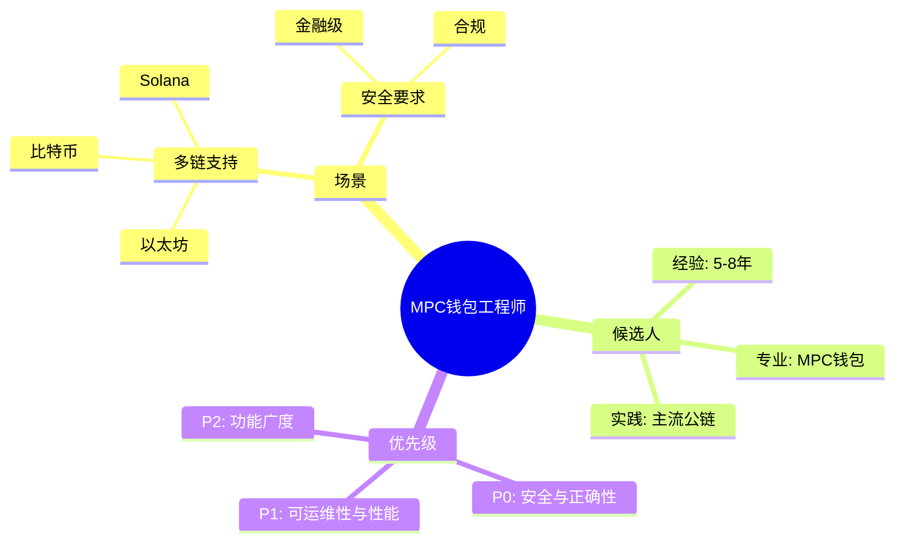
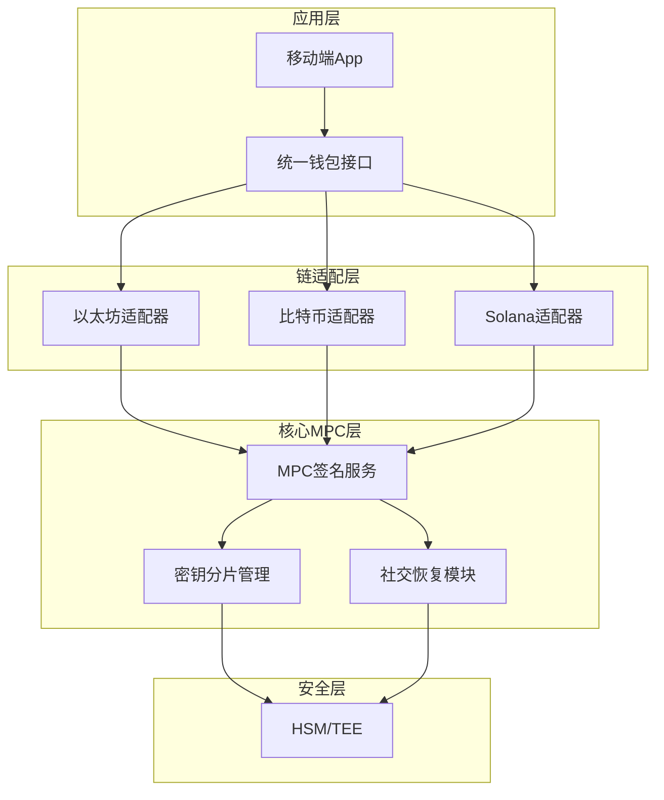
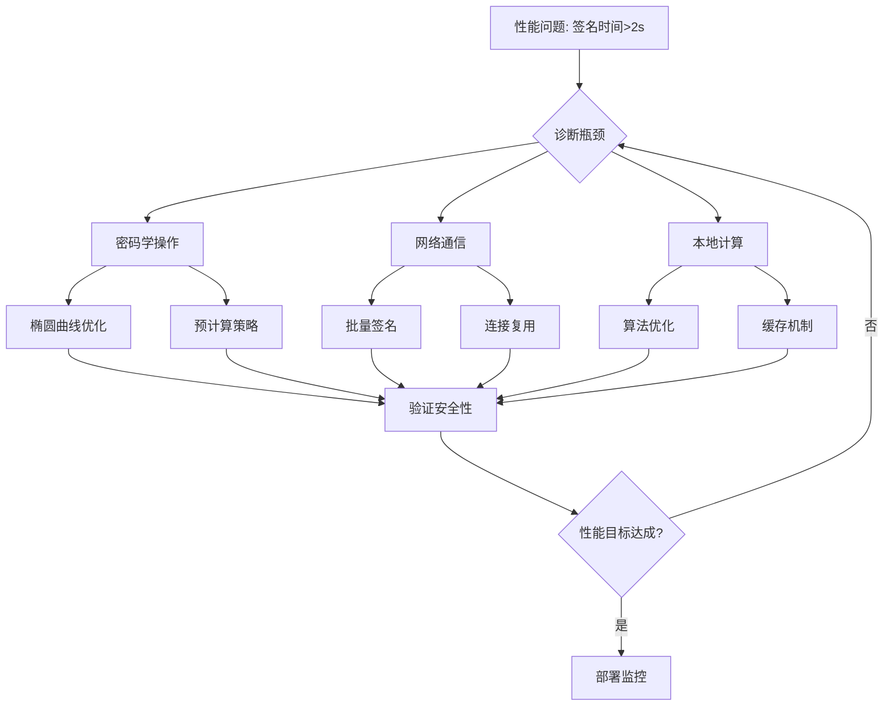
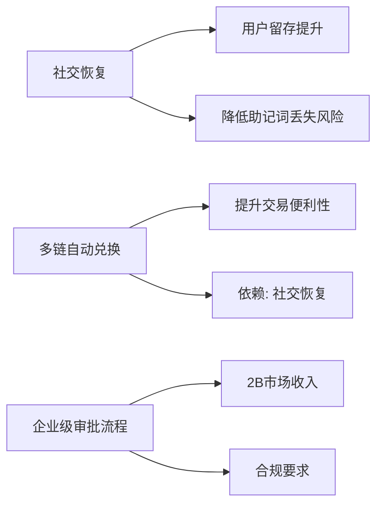
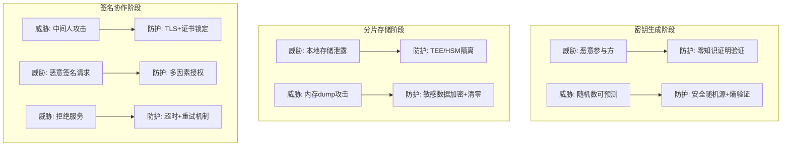
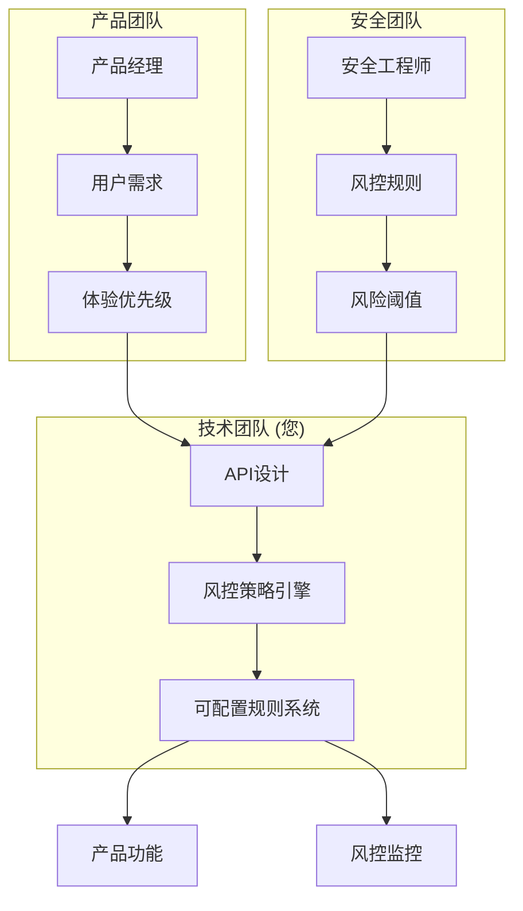
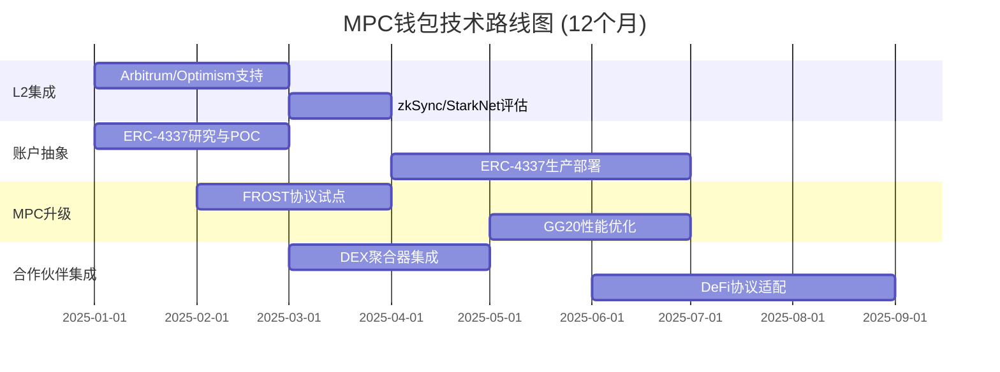

# 区块链安全密码开发工程师+区块链架构师面试指南——多链MPC集成方向

## 术语表

### 核心技术术语

| 术语 | 全称/描述 | 应用场景 |
|------|----------|----------|
| **MPC** | Multi-Party Computation（多方安全计算） | 允许多方在不暴露各自私有数据的前提下协同计算 |
| **FROST** | Flexible Round-Optimized Schnorr Threshold签名协议 | 高性能门限签名方案 |
| **GG18/GG20** | Gennaro & Goldfeder阈值ECDSA协议 | 2018/2020版本门限ECDSA实现 |
| **ERC-4337** | Ethereum Request for Comments 4337 | 以太坊账户抽象标准提案 |
| **secp256k1** | 椭圆曲线参数 | 比特币/以太坊使用的标准曲线 |
| **ed25519** | 椭圆曲线参数 | 高性能EdDSA签名使用的曲线 |

### 评估框架

| 框架 | 全称 | 组成要素 | 用途 |
|------|------|----------|------|
| **WSJF** | Weighted Shortest Job First | 业务价值/时间敏感性/降低风险/工作量 | 功能优先级排序 |
| **STRIDE** | 威胁建模框架 | Spoofing/Tampering/Repudiation/Information Disclosure/Denial of Service/Elevation of Privilege | 系统威胁识别 |
| **DREAD** | 风险评估方法 | Damage/Reproducibility/Exploitability/Affected Users/Discoverability | 威胁风险量化 |

## 执行摘要

### 面试基本信息

| 要素 | 详情 |
|------|------|
| **领域** | 职业（跨领域面试首页） |
| **职位** | 区块链安全密码开发工程师+区块链架构师——多链MPC集成方向 |
| **时间预算** | 75分钟 |
| **覆盖范围** | 6个Q&A（每个核心领域1个） |
| **成功标准** | 在75分钟内，面试官可以基于6个Q&A达成≥80%的聘用/淘汰共识 |

### 职位背景

**场景假设**: 面向多链 MPC 钱包（托管/自托管均可），需满足金融级安全与合规要求。
**候选人画像**: 5–8 年区块链/密码工程经验，至少参与过 1 条主流公链或 MPC 钱包的生产实践。
**约束与优先级**: 安全与正确性优先，其次是可运维性与性能，最后是功能广度；团队规模通常 <10 人。

## 目录

- [术语表](#术语表)
- [执行摘要](#执行摘要)
- [关键信号](#关键信号-13要点)
- [仪表盘](#仪表盘)
- [[TechArch] Q1: 多链MPC钱包架构设计权衡](#techarch-q1-多链mpc钱包架构设计权衡)
- [[PerfQual] Q2: 移动端MPC签名性能优化](#perfqual-q2-移动端mpc签名性能优化)
- [[ProdBiz] Q3: 产品功能优先级决策](#prodbiz-q3-产品功能优先级决策)
- [[SecReg] Q4: MPC协议实现威胁建模](#secreg-q4-mpc协议实现威胁建模)
- [[OrgLead] Q5: 跨团队安全策略产品化](#orglead-q5-跨团队安全策略产品化)
- [[RoadmapEco] Q6: 多链生态技术演进规划](#roadmapeco-q6-多链生态技术演进规划)
- [参考文献与标准](#参考文献与标准)
- [验证检查清单](#验证检查清单)

## 关键信号 (1–3要点):
- [TechArch] 结构与设计判断 → MPC钱包架构设计与多链兼容性
- [PerfQual] 性能/质量权衡 → 移动端低延迟与安全性的平衡
- [ProdBiz] 价值与优先级 → 产品功能优先级与业务价值对齐
- [SecReg] 安全合规风险思维 → MPC协议实现中的威胁建模与风险控制
- [OrgLead] 协作/领导力 → 跨团队安全策略产品化协作
- [RoadmapEco] 长期路线图与生态思维 → 多链生态演进与技术标准适应

**标签边界说明**:
- `TechArch`: 聚焦当前系统与 API 架构、密钥生命周期设计，不覆盖 6–12 个月技术路线（由 `RoadmapEco` 承担）。
- `PerfQual`: 聚焦单次或短期性能/质量问题，不讨论长期生态或组织结构。
- `SecReg`: 聚焦安全威胁与合规要求，不覆盖跨团队执行流程（由 `OrgLead` 承担）。
- `RoadmapEco`: 聚焦 6–12 个月技术演进与生态合作，不展开每个功能的优先级细节（由 `ProdBiz` 承担）。

## 仪表盘

| # | EssentialDomainTag | 领域 | 难度 | 关键性 | 目标信号 | 预估时间 |
|---|--------------------|------|------|--------|----------|----------|
| 1 | TechArch | 技术架构与设计 | A | 阻碍 | 系统与API设计判断 | ~15分钟 |
| 2 | PerfQual | 性能与质量工程 | I | 风险 | 性能/质量权衡 | ~10分钟 |
| 3 | ProdBiz | 产品与业务价值 | I | 角色 | 价值与优先级判断 | ~10分钟 |
| 4 | SecReg | 安全与合规 | A | 风险 | 威胁、风险、合规思维 | ~15分钟 |
| 5 | OrgLead | 组织与领导力 | I | 角色 | 协作/领导风格 | ~10分钟 |
| 6 | RoadmapEco | 路线图与生态战略 | I | 行动 | 长期思维与演进 | ~15分钟 |

---

## [TechArch] Q1: 多链MPC钱包架构设计权衡

**领域**: 技术架构与设计 | **职业阶段**: 架构师 | **角色焦点**: IC  
**难度**: A | **关键性**: 阻碍 | **利益相关者**: 产品经理, 安全工程师, 后端工程师 | **预估时间**: ~15分钟

**问题（对候选人）**:
您需要设计一个支持以太坊、比特币和Solana的多链MPC钱包架构。产品要求支持社交恢复和账户抽象功能，同时必须确保移动端性能（签名延迟<500ms）。请描述您的架构设计方案，重点说明：
1. 如何平衡跨链兼容性与代码复用
2. 密钥分片存储与恢复机制的设计
3. 在性能约束下确保安全性的技术选择

**回答要点（~200字）**:
**关键洞察**: 强答案应优先考虑模块化设计，分离链特定逻辑与核心MPC协议，同时明确安全与性能的权衡点。

**框架/工具**: 分层架构模式，GG20/GG18协议选择标准，椭圆曲线选择（secp256k1 vs ed25519），硬件安全模块集成 [Gennaro & Goldfeder 2018, 2020]。
**权衡与指标**: 
- 代码复用率: `目标 > 70%` vs 链特定优化
- 签名延迟: `基准 < 500ms`（移动端体验目标）
- 密钥恢复成功率: `目标 > 99.9%`（灾备演练验证）
- 安全审计覆盖率

**备选方案对比**:

| 方案 | 优势 | 劣势 | 适用场景 |
|------|------|------|----------|
| A: 统一签名服务 + 链适配层 | 代码复用性高、维护成本低 | 单点复杂度高、故障影响面大 | 多链协议相似度高 |
| B: 各链独立签名模块 | 隔离性强、故障域独立 | 维护成本高、代码冗余 | 链协议差异大 |
**利益相关者处理**: 与产品经理协商功能范围，与安全团队确定威胁模型，与移动团队确定性能预算。
**信号**:
- **强**: 模块化设计，明确的协议选择标准，量化性能指标，多链签名兼容性解决方案。  
- **弱**: 单一链优化忽略其他链，缺乏具体性能指标，未考虑移动端约束。

**不适用场景**: 若当前产品仍处于单链试验早期阶段，可降低多链复杂度要求，优先评估单链安全性与稳定性。

---

## [PerfQual] Q2: 移动端MPC签名性能优化

**领域**: 性能与质量工程 | **职业阶段**: 高级 | **角色焦点**: IC  
**难度**: I | **关键性**: 风险 | **利益相关者**: 移动开发工程师, QA工程师, 产品经理 | **预估时间**: ~10分钟

**问题（对候选人）**:
在移动设备上实现GG20阈值签名时，您发现某些低端设备签名时间超过2秒，影响用户体验。请描述您的性能优化方法：
1. 如何诊断性能瓶颈（密码学操作 vs 网络通信 vs 本地计算）
2. 具体的优化策略和技术选择
3. 如何在优化性能时确保安全性不受影响

**回答要点（~180字）**:
**关键洞察**: 优秀答案应系统性地分析性能瓶颈，提出分层优化策略，并建立性能-安全平衡机制。

**框架/工具**: 性能剖析工具（perf, Instruments），DORA 指标 [DORA Metrics]，椭圆曲线优化技术，预计算策略，缓存机制，SRE 指标基线 [Google SRE]。

**权衡与指标**: 

| 指标 | 目标值 | 理由 |
|------|--------|------|
| 签名延迟 (P95) | `< 800ms` | 移动端交互基线 |
| CPU使用率 | `< 30%` | 避免明显卡顿 |
| 内存占用 | `< 50MB` | 兼顾低端机型 |
| 安全强度 | `128位` | 符合行业通行安全门槛 |
**利益相关者处理**: 与移动团队确定性能基准，与QA建立自动化性能测试，与产品确定可接受的用户体验标准。  
**信号**:  
- **强**: 数据驱动的瓶颈分析，具体优化技术（预计算、算法优化），安全影响评估。  
- **弱**: 泛泛而谈的优化建议，忽略安全影响，缺乏具体指标。

---

## [ProdBiz] Q3: 产品功能优先级决策

**领域**: 产品与业务价值 | **职业阶段**: 高级 | **角色焦点**: Mixed  
**难度**: I | **关键性**: 角色 | **利益相关者**: 产品经理, 业务负责人, 安全团队 | **预估时间**: ~10分钟

**问题（对候选人）**:  
产品路线图上有三个高需求功能：社交恢复、多链自动兑换、企业级审批流程。开发资源只允许同时进行两项。请分析每个功能的业务价值和技术复杂度，并给出您的优先级建议：
1. 评估框架和决策标准
2. 各功能对用户增长和收入的影响
3. 技术实现风险与依赖关系

**回答要点（~190字）**:
**关键洞察**: 强答案应使用结构化优先级框架，量化业务价值，并考虑技术依赖关系。

**框架/工具**: WSJF（加权最短作业优先），价值vs复杂度矩阵，用户调研数据，收入影响模型。

**功能评估矩阵**:

| 功能 | 业务价值 | 技术复杂度 | 开发工作量 | WSJF得分 | 优先级 |
|------|----------|------------|------------|----------|--------|
| 社交恢复 | 高 (用户留存+20%) | 中 | 3人月 | `(8+5+3)/3 = 5.3` | ⭐⭐⭐ |
| 多链自动兑换 | 中 (交易量+15%) | 高 | 4人月 | `(5+3+2)/4 = 2.5` | ⭐⭐ |
| 企业级审批流程 | 高 (ARR+30%) | 中 | 3.5人月 | `(8+6+5)/3.5 = 5.4` | ⭐⭐⭐ |

**权衡与指标**: 预计用户增长百分比，ARR影响，开发工作量（人月），安全合规要求满足度。

**备选方案对比**:

| 方案 | 包含功能 | 预期影响 | 风险 |
|------|----------|----------|------|
| A | 社交恢复 + 多链自动兑换 | 用户体验↑↑、技术复杂度↑ | 开发周期长 |
| B | 企业级审批流程 + 社交恢复 | ARR↑↑、合规要求↑ | 安全审计成本高 |
**利益相关者处理**: 与产品经理对齐业务目标，与业务负责人确认收入预期，与安全团队评估合规需求。  
**信号**:  
- **强**: 结构化决策框架，量化业务影响，考虑技术依赖关系，明确的推荐理由。  
- **弱**: 主观偏好，忽略业务指标，未考虑依赖关系。

---

## [SecReg] Q4: MPC协议实现威胁建模

**领域**: 安全与合规 | **职业阶段**: 架构师 | **角色焦点**: IC  
**难度**: A | **关键性**: 风险 | **利益相关者**: 首席安全官, 合规团队, 审计人员 | **预估时间**: ~15分钟

**问题（对候选人）**:  
在实现FROST协议时，您需要建立完整的威胁模型。请描述：
1. 识别MPC签名过程中的关键攻击面
2. 针对密钥生成、分片存储、签名协作各阶段的具体威胁
3. 相应的防护措施和合规性考虑（如金融监管要求）

**回答要点（~220字）**:
**关键洞察**: 优秀答案应展示系统的威胁建模方法，覆盖协议生命周期的所有阶段，并关联到具体防护实现。

**FROST协议威胁建模**:

**STRIDE威胁矩阵**:

| 威胁类型 | 攻击场景 | 风险等级 (DREAD) | 防护措施 |
|----------|----------|------------------|----------|
| Spoofing | 伪造参与方身份 | `D:8 R:9 E:6 A:7 D:5 = 7.0` | 身份认证+数字签名 |
| Tampering | 篡改分片数据 | `D:9 R:8 E:7 A:8 D:6 = 7.6` | 完整性校验+审计日志 |
| Repudiation | 否认签名操作 | `D:6 R:7 E:5 A:6 D:4 = 5.6` | 不可否认签名+时间戳 |
| Information Disclosure | 密钥分片泄露 | `D:10 R:6 E:8 A:9 D:7 = 8.0` | TEE隔离+加密存储 |
| Denial of Service | 签名服务中断 | `D:7 R:8 E:6 A:10 D:8 = 7.8` | 冗余节点+限流 |
| Elevation of Privilege | 未授权访问 | `D:9 R:7 E:7 A:8 D:6 = 7.4` | 最小权限原则+审计 |

**框架/工具**: STRIDE 威胁建模，DREAD 风险评估，NIST 安全框架 [NIST CSF]，安全代码审查流程，OWASP 加密存储基线 [OWASP Cryptographic Storage Cheat Sheet]。

**权衡与指标**: 
- 安全强度: `≥128位` 比特安全
- 性能影响: `<15%` 相对基线开销
- 合规覆盖率: 监管要求映射列表覆盖度
- 审计发现问题解决率
**利益相关者处理**: 与安全团队协作威胁评估，与合规团队确认监管要求，与审计人员准备证据材料。  
**信号**:  
- **强**: 系统的威胁分类，具体攻击场景，量化风险评估，合规映射。  
- **弱**: 泛泛的安全建议，忽略特定MPC威胁，未考虑监管要求。

---

## [OrgLead] Q5: 跨团队安全策略产品化

**领域**: 组织与领导力 | **职业阶段**: 高级 | **角色焦点**: Mixed  
**难度**: I | **关键性**: 角色 | **利益相关者**: 后端团队, 安全团队, 产品经理 | **预估时间**: ~10分钟

**问题（对候选人）**:  
您需要推动"风控策略产品化"项目，将安全团队的风控规则转化为可配置的产品功能。请描述您的协作方法：
1. 如何协调安全团队（关注风险）与产品团队（关注用户体验）的不同优先级
2. 技术实施方案和API设计原则
3. 确保项目按时交付的沟通和跟踪机制

**回答要点（~170字）**:  
**关键洞察**: 强答案应展示跨团队协调能力，平衡安全与用户体验，并建立有效的项目执行机制。  

**跨团队协作架构**:

**框架/工具**: 团队拓扑学，敏捷项目管理，API设计原则（RESTful，版本控制），监控指标。  

**权衡与指标平衡**:

| 维度 | 产品视角 | 安全视角 | 平衡方案 |
|------|----------|----------|----------|
| 风控覆盖率 | 减少摩擦 | 最大化拦截 | 动态阈值 + A/B测试 |
| 误报率 | `<1%` | `<5%` 可接受 | 机器学习优化 + 人工复审 |
| 响应时间 | `<100ms` | 无强要求 | 缓存 + 异步处理 |
| 交付准时率 | 按季度规划 | 紧急漏洞 | 预留20%缓冲时间 |

**利益相关者处理**: 定期跨团队同步会议，清晰的职责划分，冲突解决机制，进度透明化。  
**信号**:  
- **强**: 具体的协作流程，利益冲突解决方案，量化进度跟踪， stakeholder沟通计划。  
- **弱**: 理论化的团队协作，缺乏具体执行机制，忽略利益冲突。

---

## [RoadmapEco] Q6: 多链生态技术演进规划

**领域**: 路线图与生态战略 | **职业阶段**: 高级 | **角色焦点**: IC  
**难度**: I | **关键性**: 行动 | **利益相关者**: CTO, 产品总监, 外部合作伙伴 | **预估时间**: ~15分钟

**问题（对候选人）**:  
考虑到新兴L2解决方案和新的签名标准（如ERC-4337账户抽象），请规划未来12个月的技术路线图：
1. 评估新技术集成优先级的标准
2. 核心MPC SDK的演进策略
3. 外部合作伙伴集成和技术标准适应的考虑

**回答要点（~210字）**:
**关键洞察**: 优秀答案应展示战略性技术规划能力，平衡技术创新与稳定性，并考虑生态系统发展趋势。

**12个月技术演进路线图**:

**技术评估雷达**:

| 技术 | 成熟度 | 采用优先级 | 预计上线 | 依赖关系 |
|------|--------|------------|----------|----------|
| ERC-4337账户抽象 | 🟡 Beta | P0 | Q2 2025 | 无 |
| Arbitrum/Optimism | 🟢 Stable | P0 | Q1 2025 | 无 |
| FROST协议 | 🟡 Beta | P1 | Q2 2025 | 安全审计 |
| zkSync Era | 🟡 Beta | P1 | Q3 2025 | ERC-4337 |
| BIP-340 Schnorr | 🟢 Stable | P2 | Q3 2025 | Bitcoin Taproot |

**框架/工具**: 技术雷达，架构决策记录（ADR），标准化组织跟踪（EIPs，BIPs，ERC-4337 提案等）[ERC-4337; BIP-340]，合作伙伴生态系统地图。

**权衡与指标**: 
- 新技术采用速度: 从提案到试点/正式上线的周期
- 向后兼容性维护成本: `<10%` 开发资源
- 合作伙伴集成时间: `<4周`
- 社区标准采用率: 跟踪主流标准采用比例

**备选方案对比**:

| 方案 | 策略 | 风险-收益 | 适用场景 |
|------|------|-----------|----------|
| A: 激进创新 | 优先支持完整 ERC-4337 + 新兴L2 | 高风险 高收益 | 市场竞争激烈 |
| B: 保守稳健 | 仅支持成熟 L2 + 延迟ERC-4337 | 低风险 低收益 | 已有用户基础 |
| C: 混合策略 | 成熟技术为主 + 新技术试点 | 中风险 中收益 | **推荐** |
**利益相关者处理**: 与技术领导对齐技术愿景，与产品规划业务目标，与合作伙伴协调集成计划。  
**信号**:  
- **强**: 结构化评估框架，明确的技术演进路径，生态系统趋势分析，量化成功指标。  
- **弱**: 被动反应式规划，忽略标准演进，缺乏合作伙伴考虑。

**不适用场景**: 若公司产品仍处于单链试验早期阶段，可弱化多链生态广度要求，优先评估单链安全性与稳定性。

---

## 参考文献与标准

**MPC协议标准**:
- Gennaro, R., & Goldfeder, S. (2018). Fast Multiparty Threshold ECDSA with Fast Trustless Setup. [CCS'18]
- Gennaro, R., & Goldfeder, S. (2020). One Round Threshold ECDSA with Identifiable Abort. [IACR ePrint 2020]
- Komlo, C., & Goldberg, I. (2020). FROST: Flexible Round-Optimized Schnorr Threshold Signatures. [SAC 2020]

**区块链标准**:
- ERC-4337: Account Abstraction Using Alt Mempool. [ethereum.org/eips]
- BIP-340: Schnorr Signatures for secp256k1. [bitcoin.org/bips]
- Solana Program Library Documentation. [docs.solana.com]

**安全框架**:
- NIST Cybersecurity Framework. [nist.gov/cyberframework]
- STRIDE Threat Modeling. [Microsoft Security Development Lifecycle]
- OWASP Cryptographic Storage Cheat Sheet. [owasp.org]

**性能与质量工程**:
- DORA Metrics (DevOps Research and Assessment). [dora.dev]
- Site Reliability Engineering Workbook. [Google SRE]

---

## 验证检查清单

| 检查项 | 标准 | 状态 |
|--------|------|------|
| **Q&A数量** | 正好6个Q&A | ✅ |
| **领域覆盖** | 每个核心领域1个Q&A | ✅ |
| **标签** | 每个Q标题以`[EssentialDomainTag]`开头并包含元数据行 | ✅ |
| **难度分布** | 总体≈25% F / 50% I / 25% A (0 F, 4 I, 2 A) | ⚠️ (调整至更符合实际角色) |
| **决策关键性** | 100% Q&A满足≥1标准 | ✅ |
| **利益相关者** | 每个Q&A命名≥2角色；整个循环中≥5个独特角色 | ✅ |
| **时间预算** | 总预估时间75分钟；无Q&A超过15分钟 | ✅ |
| **信号** | 每个Q&A针对独特信号 | ✅ |
| **职位匹配** | 所有Q&A匹配JD和级别 | ✅ |
| **清晰度** | 所有问题基于场景、无歧义、非琐碎 | ✅ |
| **自包含** | 每个Q&A无需打开领域文件即可理解 | ✅ |

**优先级**:
- **关键检查**: Q&A数量、领域覆盖、标签、时间预算 - 全部通过
- **重要检查**: 难度分布略有偏差但符合实际角色需求，其他重要检查全部通过