# MPC Wallet Engineer Interview Guide

## Executive Summary

**Domain**: Career (Cross-Domain Interview Front Page)  
**Role**: Senior/Lead Blockchain Security Cryptography Engineer & Architect — Multi-Chain MPC Integration  
**Time Budget**: 75 minutes  
**Coverage**: 6 Q&As (1 per essential domain)  
**Success Criteria**: Achieve ≥80% hiring consensus within 75-minute interview loop with clear signal capture per domain

**Interview Structure**:


**Key Metrics**:

| Metric | Target | Measurement |
|--------|--------|-------------|
| **Hiring Consensus** | ≥80% | Majority agreement across interviewers |
| **Domain Coverage** | 6/6 | One question per essential domain |
| **Signal Clarity** | High | Clear strong/weak indicators per domain |
| **Time Efficiency** | 75 min | ~12.5 min per Q&A + buffer |

## Glossary

**Core Technical Terms**:

| Term | Full Name | Description |
|------|-----------|-------------|
| **MPC** | Multi-Party Computation | Cryptographic protocol enabling distributed key management |
| **TSS** | Threshold Signature Scheme | Subset of parties can cooperatively sign |
| **DKG** | Distributed Key Generation | Protocol to create key shares without central authority |
| **PSBT** | Partially Signed Bitcoin Transaction | BIP-174 standard |
| **ERC-4337** | Ethereum Account Abstraction | Smart contract wallet standard |
| **DRBG** | Deterministic Random Bit Generator | Secure random number generation |

**Protocols & Frameworks**:

| Protocol | Description | Use Case |
|----------|-------------|----------|
| **GG18/GG20** | Gennaro & Goldfeder threshold ECDSA protocols | ECDSA multi-party signing |
| **FROST** | Flexible Round-Optimized Schnorr Threshold signatures | EdDSA/Schnorr threshold signing |
| **STRIDE** | Spoofing/Tampering/Repudiation/Info Disclosure/DoS/Elevation | Security threat modeling |
| **LINDDUN** | Privacy threat modeling framework | Privacy risk assessment |

**Prioritization & Decision Frameworks**:

| Framework | Components | Purpose |
|-----------|------------|---------|
| **RICE** | Reach, Impact, Confidence, Effort | Feature prioritization |
| **WSJF** | Weighted Shortest Job First | Value-based prioritization |
| **ADR** | Architecture Decision Record | Document design decisions |
| **RFC** | Request for Comments | Design proposal document |
| **RACI** | Responsible, Accountable, Consulted, Informed | Decision responsibility matrix |

**Engineering Metrics**:

| Metric | Full Name | Purpose |
|--------|-----------|---------|
| **SLI/SLO** | Service Level Indicator/Objective | Performance targets |
| **RCA** | Root Cause Analysis | Incident investigation |
| **TTI** | Time To Integrate | Integration speed metric |
| **SRE** | Site Reliability Engineering | Operations discipline |

**Role Types**:

| Role | Description |
|------|-------------|
| **IC** | Individual Contributor |

## Table of Contents

- [Executive Summary](#executive-summary)
- [Glossary](#glossary)
- [Key Signals](#key-signals)
- [Dashboard](#dashboard)
- [[TechArch] Q1: Design Multi-Chain MPC Wallet Platform](#techarch-q1-design-a-multi-chain-mpc-wallet-platform-ethbtcsolana-with-one-signing-interface)
- [[PerfQual] Q2: Solana Mobile Performance Regression](#perfqual-q2-solana-mobile-p99-spikes-to-600-ms-ethbtc-stablefind-and-fix)
- [[ProdBiz] Q3: Feature Prioritization (ERC-4337 vs Taproot)](#prodbiz-q3-prioritize-erc-4337-session-keys-vs-btc-taproot-schnorr-threshold-support)
- [[SecReg] Q4: Security Incident Response](#secreg-q4-incidentsuspected-threshold-ecdsa-nonce-weakness-on-android-devices)
- [[OrgLead] Q5: Partner SDK Alignment](#orglead-q5-aligning-sdk-design-with-partners-asking-to-reduce-mpc-rounds)
- [[RoadmapEco] Q6: Ecosystem Evolution Strategy](#roadmapeco-q6-keeping-pace-with-eipsbipssolana-changes-without-breaking-sdks)
- [References](#references)
- [Validation Checklist](#validation-checklist-self-review)

## Key Signals  


**Signal Evaluation Matrix**:

| Domain | Key Question | Strong Indicator | Weak Indicator |
|--------|--------------|------------------|----------------|
| **[TechArch]** | Can they architect MPC TSS across chains? | Clean layering, correct protocols, measurable SLOs | One-size-fits-all, chain logic in MPC core |
| **[PerfQual]** | Can they optimize p95/p99 latency? | End-to-end tracing, tail metrics, safe rollout | Generic "optimize", no canary/rollback |
| **[ProdBiz]** | Can they sequence features by value? | Quantified model, explicit assumptions, gates | Hand-wavy "market wants both", no metrics |
| **[SecReg]** | Can they mitigate crypto threats? | Concrete IR runbook, attestation/MFA layers | "Regenerate keys" only, no audit trail |
| **[OrgLead]** | Can they align stakeholders? | Outcome-focused negotiation, explicit SLAs | Rigid "no" or insecure "yes" without alternatives |
| **[RoadmapEco]** | Can they maintain compatibility? | Clear versioning, capability discovery, LTS | Ad-hoc releases, breaking changes, no migration |

**Dashboard**:  
| # | EssentialDomainTag | Domain | Difficulty | Criticality | Target Signal | EstimatedTime |  
|---|--------------------|--------|------------|-------------|---------------|---------------|  
| 1 | TechArch   | Technical Architecture & Design      | A | Blocks      | System & API design judgment | ~10–15 min |  
| 2 | PerfQual   | Performance & Quality Engineering    | I | Risk        | Performance/quality trade-offs | ~10–15 min |  
| 3 | ProdBiz    | Product & Business Value             | I | Roles       | Value & prioritization judgment | ~10–15 min |  
| 4 | SecReg     | Security & Regulation                | A | Risk        | Threat, risk, compliance mindset | ~10–15 min |  
| 5 | OrgLead    | Organization & Leadership            | F | Roles       | Collaboration/leadership style | ~10–15 min |  
| 6 | RoadmapEco | Roadmap & Ecosystem Strategy         | I | Action      | Long-term thinking & evolution | ~10–15 min |

### [TechArch] Q1: Design a Multi-Chain MPC Wallet Platform (ETH/BTC/Solana) With One Signing Interface
Domain: Technical Architecture & Design | CareerStage: Architect | RoleFocus: Mixed  
Difficulty: A | Criticality: Blocks | Stakeholders: Architect, Security, Mobile Lead, Backend Lead | EstimatedTime: ~10–15 min

Question (for candidate):  
You must deliver a unified MPC signing layer that supports: Ethereum (EIP-1559/typed tx, secp256k1), Bitcoin (PSBT v2, Taproot), and Solana (ed25519), exposed as SDKs for mobile/web and a backend API.  
Constraints: p99 signing latency ≤100 ms on backend, ≤200 ms on mobile under 3G; recoverability (social recovery), DKG and key refresh, and no single coordinator trust.  
Propose the high-level architecture, protocol choices (e.g., GG20 for ECDSA, FROST for EdDSA/Schnorr), API boundaries, and how you abstract chain-specific quirks (nonce/UTXO/message formats) without leaking them into MPC core.

Answer Key (~150–250 words):  
Key Insight:  
A strong answer separates “curve/protocol” from “chain semantics,” using a protocol-agnostic MPC core (ECDSA vs EdDSA modules) and a chain adapter layer (EVM/BTC/Solana) behind a single sign(transaction: bytes, hints) API.  

**Multi-Chain MPC Architecture**:


Frameworks/Tools:  
- ADRs to record decisions; Protocols: GG18/GG20 for ECDSA, FROST for Ed25519/Schnorr; PSBT (BIP-174) adapter and EIP-712/1559 encoders.  

Trade-offs & Metrics:  
- Coordinator vs peer mesh: choose stateless coordinator with authenticated channels; precomputation (nonce/pre-sign) to hit p99 targets; back-pressure and bounded retries.  

| Metric | Backend Target | Mobile Target | Strategy |
|--------|----------------|---------------|----------|
| p99 latency | `≤100ms` | `≤200ms (3G)` | Precomputation pools |
| Success SLO | `99.9%` | `99.5%` | Error budgets + retries |
| Round count | 2-3 rounds | 2-3 rounds | FROST/GG20 optimization |  

Stakeholder Handling:  
- Security validates DKG, key refresh, rogue-key mitigation, and nonce safety.  
- Mobile Lead reviews battery/CPU impact and offline caching.  
- Backend owns UTXO/nonce managers in adapters, not MPC core.  

Signals:  
- Strong: Clear layering, correct protocol per curve, precompute strategy, measurable SLOs, and ADRs.  
- Weak: One-size-fits-all protocol, chain logic inside MPC core, no latency/error budgets.

### [PerfQual] Q2: Solana Mobile p99 Spikes to 600 ms; ETH/BTC Stable—Find and Fix
Domain: Performance & Quality Engineering | CareerStage: Senior | RoleFocus: IC  
Difficulty: I | Criticality: Risk | Stakeholders: SRE, Mobile Lead, Backend Lead | EstimatedTime: ~10–15 min

Question (for candidate):  
Last week, Solana mobile p99 signing rose from 180 ms to 600 ms; ETH/BTC paths remain normal.  
Packet loss (2–5%), CPU throttling on mid-tier Android, and occasional retransmits were observed.  
Outline your plan to instrument, isolate, and fix the regression with target p99 ≤220 ms and failure rate ≤0.1%.

Answer Key (~150–250 words):  
Key Insight:  
Treat this as a distributed latency budget problem: separate compute (MPC rounds, curve ops) from transport (RTT, retries) and serialization (protobuf/CBOR).  
Hypothesis-driven profiling precedes changes.  

**Performance Debugging Flowchart**:

```mermaid
flowchart TD
    A[Solana p99: 600ms<br/>Target: ≤220ms] --> B{Instrumentation}
    B --> C1[OpenTelemetry Traces<br/>SDK → Coordinator → Adapter]
    B --> C2[CPU/Memory Profiling<br/>pprof/Perfetto]
    B --> C3[Network Analysis<br/>Packet loss: 2-5%]
    
    C1 --> D{Isolate Bottleneck}
    C2 --> D
    C3 --> D
    
    D -->|Compute| E1[Ed25519 curve ops<br/>MPC rounds]
    D -->|Transport| E2[RTT + retries<br/>3G conditions]
    D -->|Serialization| E3[Protobuf/CBOR<br/>message size]
    
    E1 --> F1[Optimize:<br/>Precompute pools]
    E2 --> F2[Optimize:<br/>Batch + backoff]
    E3 --> F3[Optimize:<br/>Compression]
    
    F1 --> G[A/B Canary Test]
    F2 --> G
    F3 --> G
    
    G --> H{Success Criteria?<br/>p99≤220ms, <0.1% fail}
    H -->|Yes| I[Rollout]
    H -->|No| D
```



Frameworks/Tools:  
- SLI/SLOs with error budgets; OpenTelemetry traces spanning SDK ↔ coordinator ↔ adapter; CPU/memory profiling (pprof/Perfetto); chaos tests for 5% loss/200 ms jitter.  

Trade-offs & Metrics:  

| Optimization | Impact | Risk | Priority |
|--------------|--------|------|----------|
| Precomputation pools | `-200ms` | Low | P0 |
| Batch commitments | `-50ms` | Medium (complexity) | P1 |
| MTU/keep-alive tuning | `-30ms` | Low | P1 |
| Exponential backoff caps | Stability | None | P0 |

**Success Criteria**: `p99 ≤220ms`, `≤0.1%` failures over 7 days, no `>5%` battery impact  

Stakeholder Handling:  
- SRE owns dashboards and rollback; Mobile Lead gates SDK changes; Backend Lead aligns adapter serialization.  
- Share an RCA with fixes, guardrails, and playbooks.  

Signals:  
- Strong: End-to-end tracing, specific thresholds, realistic network models, and safe rollout.  
- Weak: Generic “optimize code,” no tail metrics, no canary/rollback.

### [ProdBiz] Q3: Prioritize ERC-4337 Session Keys vs BTC Taproot (Schnorr) Threshold Support
Domain: Product & Business Value | CareerStage: Senior | RoleFocus: Mixed  
Difficulty: I | Criticality: Roles | Stakeholders: PM, BizDev, Security | EstimatedTime: ~10–15 min

Question (for candidate):  
You have two competing roadmap items:  
A) ERC-4337 session keys and limits/approval flows for EVM users;  
B) BTC Taproot (Schnorr) threshold signing for institutional custody.  
Budget supports one in Q1.  
Which do you ship first, how do you quantify value/risk, and what evidence would change your decision?

Answer Key (~150–250 words):  
Key Insight:  
Use a value framework (RICE or WSJF) with hard inputs: install base mix (EVM vs BTC), projected ARR, integration cost, security risk, and ecosystem timing.  
Decide with reversible bets and staged validation.  

**Feature Prioritization Matrix (WSJF)**:

| Feature | Reach | Impact | Confidence | Effort | WSJF Score | Priority |
|---------|-------|--------|------------|--------|------------|----------|
| **A: ERC-4337 Session Keys** | 60% users | High (+15-25% conversion) | 70% | 8 weeks | `(60×8×0.7)/8 = 42` | 🟢 |
| **B: BTC Taproot Threshold** | 20% users | High ($X ARR custody) | 85% | 6 weeks | `(20×8×0.85)/6 = 22.7` | 🟡 |

**WSJF Calculation Formula**:

```
WSJF = (Reach × Impact × Confidence) ÷ Effort

Higher WSJF → Higher Priority
```

**Decision Framework**:

```mermaid
graph TD
    A[Feature Decision] --> B{User Base Analysis}
    B -->|60%+ EVM users| C1[ERC-4337 Priority ↑]
    B -->|Signed custody LOIs| C2[BTC Taproot Priority ↑]
    
    C1 --> D1[Value: +15-25% conversion<br/>Risk: Protocol maturity]
    C2 --> D2[Value: $X ARR<br/>Risk: Security audit scope]
    
    D1 --> E{Reversibility Check}
    D2 --> E
    
    E --> F[Stage 1: Beta<br/>2 weeks, 5% users]
    F --> G{Success Metrics?}
    G -->|Yes| H[Stage 2: Full Rollout]
    G -->|No| I[Pivot or Iterate]
```



Frameworks/Tools:  
- RICE/WSJF; funnel metrics (activation, tx conversion), custody pipeline forecasts, and security risk scoring; partner LOIs as leading indicators.  

Trade-offs & Metrics:  

| Decision Point | Option A (ERC-4337) | Option B (BTC Taproot) |
|----------------|---------------------|------------------------|
| Target Metric | `+10%` wk4 retention | `+$Y` monthly custody revenue |
| User Base | 60% EVM active | 20% BTC custody |
| Conversion Impact | 15-25% session key adoption | Institutional pipeline |
| Delivery Risk | Medium (protocol beta) | Low (mature BIP-340) |
| Recommended | **Q1 Ship** ✅ | Q2 Ship |  

Stakeholder Handling:  
- PM drives model; Security sizes audit/attack surface; BizDev validates revenue and partner commitments; publish an ADR with go/no-go triggers.  

Signals:  
- Strong: Quantified model, explicit assumptions, reversible milestone gates.  
- Weak: Hand-wavy “market wants both,” no metrics or stakeholder evidence.

### [SecReg] Q4: Incident—Suspected Threshold ECDSA Nonce Weakness on Android Devices
Domain: Security & Regulation | CareerStage: Architect | RoleFocus: Mixed  
Difficulty: A | Criticality: Risk | Stakeholders: Security, SRE, Compliance | EstimatedTime: ~10–15 min

Question (for candidate):  
Monitoring flagged correlated partial nonce reuse patterns from several Android devices during MPC ECDSA signing.  
Describe your immediate containment, forensic plan, permanent controls (device attestation/MFA, DRBG hardening, share rotation), and how you satisfy auditability without leaking sensitive material.

Answer Key (~150–250 words):  
Key Insight:  
Treat as crypto-severity-1: freeze affected keys (rate-limit/deny high-risk ops), rotate shares via DKG, and invalidate precomputed nonces.  
Forensics must confirm RNG/nonce path root cause before recovery.  

**Incident Response Workflow**:


Frameworks/Tools:  
- Threat modeling (STRIDE/LINDDUN); device attestation (Android Play Integrity, Apple App Attest), WebAuthn/MFA; deterministic nonce (per RFC 6979-like in threshold) and DRBG health checks; audit controls (change management).  

Trade-offs & Metrics:  

| Phase | Metric | Target | Balance |
|-------|--------|--------|---------|
| Containment | Time-to-freeze | `<30 min` | User impact vs security |
| Recovery | Key rotation completion | `<24 h` | Service continuity |
| Validation | Zero nonce collisions | `100%` | Monitoring overhead |
| Audit | Pen test pass rate | `100%` | Coverage depth |  

Stakeholder Handling:  
- Security leads IR; SRE executes kill switches/feature flags and log retention; Compliance ensures evidence chain and post-incident reports for audits (no PII, hashed identifiers).  
- Communicate transparently with PM/support.  

Signals:  
- Strong: Concrete IR runbook, deterministic nonce safeguards, attestation/MFA layering, measurable SLAs.  
- Weak: “Regenerate keys” only, no telemetry, no audit trail plan.

### [OrgLead] Q5: Aligning SDK Design With Partners Asking To “Reduce MPC Rounds”
Domain: Organization & Leadership | CareerStage: Lead | RoleFocus: Manager  
Difficulty: F | Criticality: Roles | Stakeholders: Architect, Partner Eng, PM | EstimatedTime: ~10–15 min

Question (for candidate):  
A top partner demands “fewer MPC rounds” to simplify their mobile integration, risking protocol security and cross-chain consistency.  
How do you lead alignment to ship on time without compromising safety, and reduce future support load?

Answer Key (~150–250 words):  
Key Insight:  
Reframe the ask into outcomes (latency, battery, integration effort) and explore safe alternatives (precomputation, transport tweaks, batching) rather than weakening protocol rounds.  
Use decision records and shared SLAs.  

**Partnership Alignment Process**:


Frameworks/Tools:  
- Team Topologies for interaction mode (collaboration → X-as-a-Service), RACI for approvals, ADR/RFCs with latency budgets and test matrices.  
- Developer experience telemetry (time-to-integrate, SDK error rates).  

Trade-offs & Metrics:  
- Offer “async precompute + 1-RTT finalize” for supported curves; keep protocol rounds intact.  
- Success = partner p99 ≤250 ms on target devices, ≤1 day TTI, 30% fewer support tickets.  

Stakeholder Handling:  
- Architect/Security gate cryptographic invariants; Partner Eng co-builds sample app; PM publishes compatibility contract and deprecation policy.  
- Schedule a post-integration review and turn learnings into docs/linters.  

Signals:  
- Strong: Outcome-focused negotiation, explicit SDIs/SLAs, reusable assets.  
- Weak: “Yes” to insecure change or rigid “no” without alternatives/documentation.

### [RoadmapEco] Q6: Keeping Pace With EIPs/BIPs/Solana Changes Without Breaking SDKs
Domain: Roadmap & Ecosystem Strategy | CareerStage: Senior | RoleFocus: IC  
Difficulty: I | Criticality: Action | Stakeholders: PM, Developer Relations, Backend Lead | EstimatedTime: ~10–15 min

Question (for candidate):  
You must add support for ERC-4337 session keys, BTC PSBT updates, and Solana message v0 variants across three quarters, while guaranteeing SDK stability for partners.  
What is your compatibility strategy, gating, and rollout plan?

Answer Key (~150–250 words):  
Key Insight:  
Define a compatibility contract: semantic versioning, feature flags, and capability discovery so partners can opt into new flows without breaking old ones.  
Separate chain adapters from MPC core with well-versioned interfaces.  

**SDK Compatibility Strategy**:

```mermaid
gantt
    title Multi-Chain SDK Evolution (3 Quarters)
    dateFormat YYYY-QQ
    section ERC-4337
    Research POC         :2025-Q1, 1Q
    Beta feature flag    :2025-Q2, 1Q
    GA with LTS          :2025-Q3, 1Q
    section BTC PSBT v2
    Adapter update       :2025-Q1, 1Q
    Taproot integration  :2025-Q2, 1Q
    section Solana v0
    Message format       :2025-Q1, 1Q
    Conformance testing  :2025-Q2, 1Q
```

**Versioning Matrix**:

| SDK Version | ERC-4337 | BTC PSBT v2 | Solana v0 | Breaking Changes |
|-------------|----------|-------------|-----------|------------------|
| v2.0 (LTS) | ❌ | ✅ Legacy | ✅ Legacy | None |
| v2.5 (Beta) | ✅ Beta flag | ✅ v2 | ✅ v0 | None (opt-in) |
| v3.0 (GA) | ✅ Default | ✅ v2 | ✅ v0 | Deprecate legacy |

Frameworks/Tools:  
- SemVer with LTS branches; “capabilities” endpoint; conformance tests with public vectors (PSBT, EVM typed tx, ed25519).  
- Release trains with canaries and error budgets.  

Trade-offs & Metrics:  
- Stagger risky features (AA/session keys) behind beta flags and allow dual-path operation (legacy vs new adapter).  
- KPIs: <0.5% partner breakage on upgrades, 95% upgrade within 90 days, zero regressions on signing correctness.  

Stakeholder Handling:  
- PM owns public roadmap/deprecation windows; DevRel provides migration guides and sample repos; Backend Lead owns adapter changelogs and golden tests.  
- Quarterly ecosystem reviews to adjust priorities.  

Signals:  
- Strong: Clear versioning, capability discovery, LTS strategy, measurable adoption/breakage targets.  
- Weak: Ad-hoc releases, breaking changes, no migration plan.

---

### Notes on Design and Quality (applies to all Q&As)
- Context and constraints are explicit, with metrics and stakeholders, enabling decision-critical evaluation.  
- Each Q&A references common frameworks/standards (e.g., ADRs, STRIDE, WSJF, OpenTelemetry) for credible, repeatable judgment.  
- Difficulty mix: 1 F, 3 I, 2 A; total time ≈75 minutes.  

---

## References

**MPC/TSS Protocols**:

| Protocol | Authors | Year | Source | Focus |
|----------|---------|------|--------|-------|
| **GG18** | Gennaro & Goldfeder | 2018 | CCS'18 | Fast Multiparty Threshold ECDSA |
| **GG20** | Gennaro & Goldfeder | 2020 | IACR ePrint | One Round Threshold ECDSA |
| **FROST** | Komlo & Goldberg | 2020 | SAC 2020 | Flexible Round-Optimized Schnorr Threshold |

**Blockchain Standards**:

| Standard | Title | Blockchain | Purpose |
|----------|-------|------------|---------|
| **BIP-174** | Partially Signed Bitcoin Transactions (PSBT) | Bitcoin | Multi-party signing coordination |
| **BIP-340** | Schnorr Signatures for secp256k1 | Bitcoin | Taproot signature scheme |
| **BIP-341** | Taproot: SegWit v1 spending rules | Bitcoin | Privacy & script improvements |
| **ERC-4337** | Account Abstraction Using Alt Mempool | Ethereum | Smart contract wallets |
| **EIP-712** | Typed structured data hashing/signing | Ethereum | Safe message signing |
| **EIP-1559** | Fee market change for ETH transactions | Ethereum | Dynamic gas pricing |
| **Message v0** | Transaction Message Formats v0 | Solana | Versioned transactions |

**Security & Compliance**:

| Framework | Organization | Purpose |
|-----------|--------------|---------|
| **STRIDE** | Microsoft Security Development Lifecycle | Threat modeling (Spoofing/Tampering/Repudiation/Info Disclosure/DoS/Elevation) |
| **LINDDUN** | LINDDUN.org | Privacy threat modeling |
| **NIST SP 800-90A** | NIST | Random Number Generation Using Deterministic RBGs |
| **RFC 6979** | IETF | Deterministic Usage of DSA and ECDSA |

**Engineering Frameworks**:

| Framework | Source | Application |
|-----------|--------|-------------|
| **DORA Metrics** | dora.dev | DevOps Research and Assessment |
| **SRE** | Google SRE Book | Site Reliability Engineering |
| **Team Topologies** | Skelton & Pais, 2019 | Team interaction patterns |
| **ADRs** | github.com/joelparkerhenderson | Architecture Decision Records |

**Product/Business**:

| Framework | Source | Purpose |
|-----------|--------|---------|
| **RICE** | Intercom Product Management | Reach, Impact, Confidence, Effort prioritization |
| **WSJF** | SAFe Framework | Weighted Shortest Job First value framework |

---

### Validation Checklist (Self-Review)

| Criterion | Requirement | Status | Details |
|-----------|-------------|--------|---------|
| **Q&A Count** | Exactly 6 Q&As | ✅ Pass | 6 questions covering all domains |
| **Domain Coverage** | One per EssentialDomainTag | ✅ Pass | TechArch, PerfQual, ProdBiz, SecReg, OrgLead, RoadmapEco |
| **Tagging/Metadata** | Present per Q&A | ✅ Pass | Domain, CareerStage, RoleFocus, Difficulty, Criticality |
| **Difficulty Mix** | 1 F / 3 I / 2 A ≈ 25/50/25 | ✅ Pass | Balanced complexity |
| **Decision Criticality** | Blocks/Risk/Roles/Action tags | ✅ Pass | Each Q&A tagged appropriately |
| **Stakeholders** | ≥2 per Q&A; ≥5 unique overall | ✅ Pass | PM, Security, SRE, Mobile, Backend, DevRel, BizDev |
| **Time Budget** | 6 × ~10–15 min = 60–90 min | ✅ Pass | Fits 75-minute interview window |
| **Signals** | Distinct per domain | ✅ Pass | Clear strong/weak indicators |
| **Role Fit & Clarity** | Tailored to role | ✅ Pass | Multi-chain MPC wallet architect/engineer |
| **Self-Contained** | Understandable standalone | ✅ Pass | No external dependencies |

**Difficulty Distribution**:


Summary of what I did and best practices followed:  
- Crafted six scenario-based, judgment-heavy Q&As aligned to the JD, each with quantifiable metrics, frameworks, and stakeholder handling.  
- Ensured MECE coverage across TechArch, PerfQual, ProdBiz, SecReg, OrgLead, RoadmapEco within a 75-minute loop.  
- Embedded clear strong/weak signals to support hire/no-hire/level decisions.