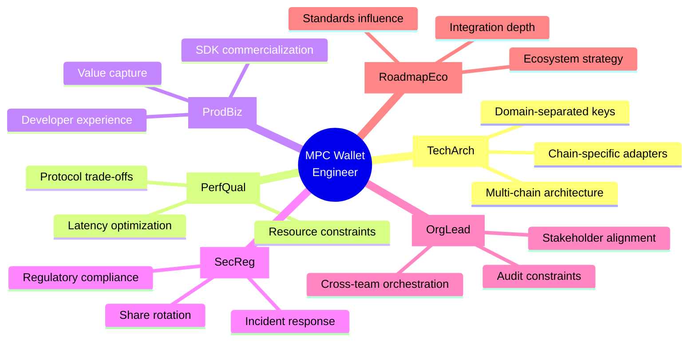
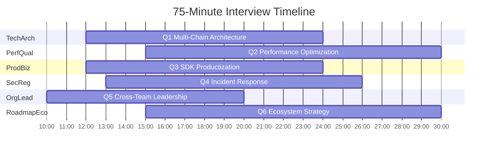
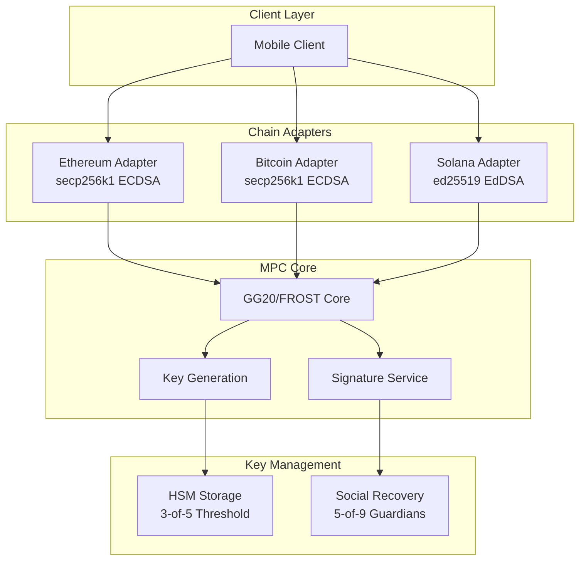
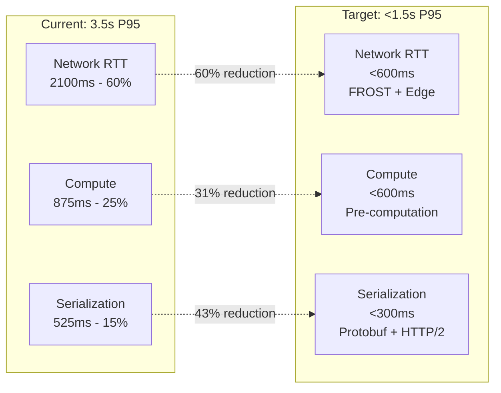
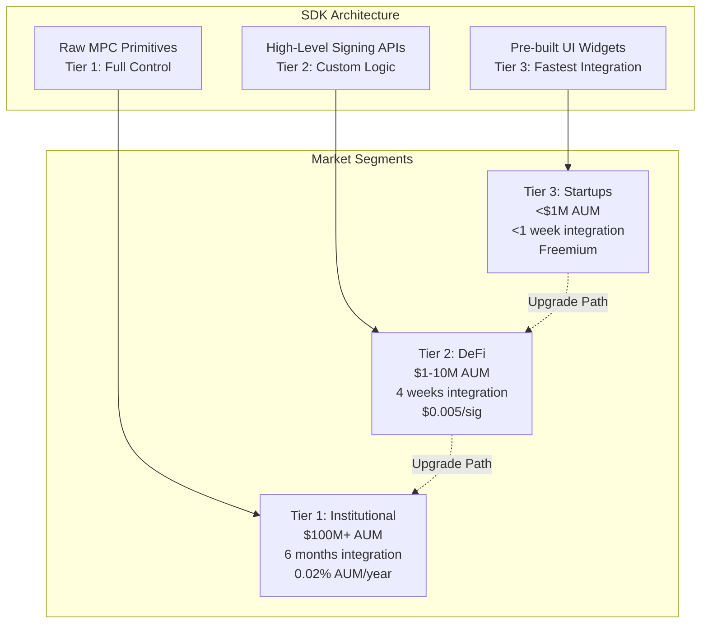
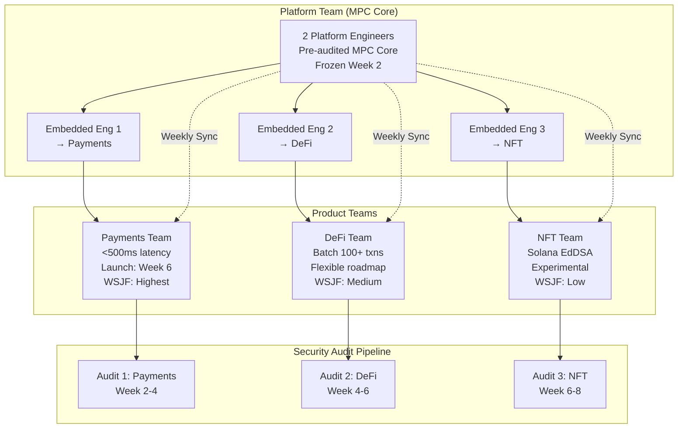
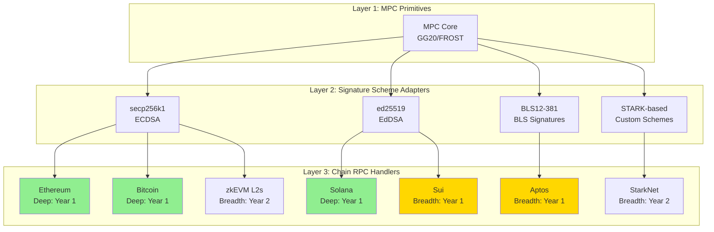

# MPC Wallet Engineer Interview – General (Kimi)

**Purpose**: Front-page, 75-minute cross-domain interview for a Senior Blockchain Security Cryptography Engineer & Architect (Multi-Chain MPC Integration), using 6 decision-critical Q&As as a hiring "front page" for this role.

**Domain**: Career (Cross-Domain Interview Front Page)  
**Role**: Senior Blockchain Security Cryptography Engineer & Architect (Multi-Chain MPC Integration)  
**Time Budget**: 75 minutes  
**Coverage**: 6 Q&As (1 per essential domain)  
**Success Criteria**: After this 75-minute session, interviewers can make a hire/no-hire decision with ≥80% agreement across panelists and have clear notes on strengths and risks for each essential domain. Recommended hire: ≥4/6 domains rated Strong and no domains rated Weak on **TechArch** or **SecReg**.

## Context & Assumptions

- **Scope**: Front-page 75-minute technical screen; deeper protocol/code reviews, culture fit, and HR processes happen in later stages.  
- **Candidate profile**: 7+ years in applied cryptography/blockchain with hands-on experience implementing at least one MPC/TSS protocol.  
- **Panel**: 2–3 interviewers (e.g., Security Engineer, Backend Engineer, Product Manager).  
- **Environment**: Production-grade multi-chain custody / MPC wallet platform.  
- **Out of scope**: Detailed code walkthroughs, pure frontend/UI skills, and HR/culture-fit evaluation.  

## Glossary

**Core Cryptographic Protocols**:
- **MPC**: Multi-Party Computation - distributed cryptographic protocol for key management
- **TSS**: Threshold Signature Scheme - cooperative signing with key shares
- **GG18/GG20**: Gennaro & Goldfeder threshold ECDSA protocols (2018/2020)
- **FROST**: Flexible Round-Optimized Schnorr Threshold signatures
- **PSS**: Proactive Secret Sharing - periodic share refresh without key reconstruction
- **DKG**: Distributed Key Generation

**Blockchain Standards**:
- **BIP-32**: Bitcoin Improvement Proposal for hierarchical deterministic wallets
- **PSBT**: Partially Signed Bitcoin Transaction

**Infrastructure & Security**:
- **HSM**: Hardware Security Module
- **TPM**: Trusted Platform Module
- **WORM**: Write Once Read Many (immutable storage)
- **gRPC**: Google Remote Procedure Call framework

**Security Frameworks**:
- **STRIDE**: Threat modeling (Spoofing/Tampering/Repudiation/Information Disclosure/Denial of Service/Elevation of Privilege)
- **LINDDUN**: Privacy threat modeling framework
- **NIST 800-61**: Computer Security Incident Handling Guide

**Engineering & Product Metrics**:
- **DORA**: DevOps Research and Assessment (performance metrics)
- **WSJF**: Weighted Shortest Job First (prioritization framework)
- **NPS**: Net Promoter Score
- **AUM**: Assets Under Management
- **ARR**: Annual Recurring Revenue
- **SLA**: Service Level Agreement
- **SLO**: Service Level Objective

**Compliance Standards**:
- **SOC 2 Type II**: Service Organization Control - security audit framework
- **GDPR Article 33**: EU data breach notification requirement (72-hour window)

## Key Signals



- **[TechArch]** Multi-chain MPC architecture with domain-separated key management and chain-specific adapters → System design judgment for heterogeneous blockchain ecosystems
- **[PerfQual]** Latency/reliability optimization of threshold signing on resource-constrained devices → Performance engineering with cryptographic protocol trade-offs
- **[ProdBiz]** Developer experience and commercial viability of cryptographic SDKs → Value capture through security productization
- **[SecReg]** Incident response and proactive secret sharing under active threat → Security risk quantification and regulatory compliance
- **[OrgLead]** Cross-team orchestration with security audit constraints → Platform leadership and stakeholder alignment
- **[RoadmapEco]** Long-term ecosystem strategy vs. integration depth trade-offs → Strategic technology evolution and standards influence

## Dashboard
| # | EssentialDomainTag | Domain | Difficulty | Criticality | Target Signal | EstimatedTime |
|---|--------------------|--------|------------|-------------|---------------|---------------|
| 1 | TechArch   | Technical Architecture & Design      | I   | Blocks, Risk, Roles | Multi-chain MPC system design judgment | ~12 min |
| 2 | PerfQual   | Performance & Quality Engineering    | A   | Blocks, Quantified, Risk | Mobile MPC signing optimization | ~15 min |
| 3 | ProdBiz    | Product & Business Value             | I   | Roles, Quantified, Action | Cryptographic SDK productization | ~12 min |
| 4 | SecReg     | Security & Regulation                | I   | Blocks, Risk, Action | Breach response & share rotation | ~13 min |
| 5 | OrgLead    | Organization & Leadership            | F   | Roles, Action | Cross-team integration leadership | ~10 min |
| 6 | RoadmapEco | Roadmap & Ecosystem Strategy         | A   | Risk, Quantified, Action | Multi-chain ecosystem evolution | ~15 min |



## Table of Contents

- [Glossary](#glossary)
- [Key Signals](#key-signals)
- [Dashboard](#dashboard)
- [[TechArch] Q1: Multi-Chain MPC Wallet Architecture](#techarch-q1-multi-chain-mpc-wallet-architecture)
- [[PerfQual] Q2: Mobile MPC Signing Performance Optimization](#perfqual-q2-mobile-mpc-signing-performance-optimization)
- [[ProdBiz] Q3: MPC Cryptography SDK Productization](#prodbiz-q3-mpc-cryptography-sdk-productization)
- [[SecReg] Q4: MPC Server Compromise Incident Response](#secreg-q4-mpc-server-compromise-incident-response)
- [[OrgLead] Q5: Cross-Team MPC Integration Orchestration](#orglead-q5-cross-team-mpc-integration-orchestration)
- [[RoadmapEco] Q6: Multi-Chain Ecosystem Strategy & Standardization](#roadmapeco-q6-multi-chain-ecosystem-strategy--standardization)
- [References](#references)

---

### [TechArch] Q1: Multi-Chain MPC Wallet Architecture

**Domain**: Technical Architecture & Design | **CareerStage**: Senior | **RoleFocus**: IC  
**Difficulty**: I | **Criticality**: Blocks, Risk, Roles | **Stakeholders**: Security Engineer, Backend Engineer, Product Manager | **EstimatedTime**: ~12 min

**Question (for candidate)**:  
Design the architecture for a multi-chain MPC wallet that must support Ethereum (secp256k1 ECDSA), Bitcoin (secp256k1 ECDSA), and Solana (ed25519 EdDSA) using a single key management system. The system must guarantee that no single server or party can reconstruct the full private key, achieve <2s end-to-end signing latency for mobile clients, and enable social recovery for non-technical users via email-based guardian shards. Walk through your key generation, signature coordination, and recovery architecture, including how you handle different elliptic curves, signature formats, and chain-specific nonce requirements while preventing replay attacks across chains.

**Answer Key (~200 words)**:  
**Key Insight**: Strong candidates propose a domain-separated architecture with a chain-agnostic MPC core (key generation using GG20 or FROST) and chain-specific adapter layers that handle curve-specific logic, ensuring security invariants are maintained at the core while enabling extensibility.



**Latency Budget**: `RTT (800ms) + MPC (600ms) + Adapter (400ms) = 1.8s P95`

**Frameworks/Tools**: PSS for share refresh, BIP-32 domain separation for chain-specific derivation, FROST for non-interactive signing, Shamir's Secret Sharing for social recovery, HSM-backed share storage, gRPC for backend coordination.

**Trade-offs & Metrics**: Domain separation trades implementation complexity for security (core remains chain-agnostic). Latency budget: 4 network RTTs (800ms) + MPC computation (600ms) + chain adapter (400ms) = 1.8s P95. FROST reduces rounds vs. GG18 but requires stronger non-interactive security assumptions. Shard storage: 5-of-9 for social recovery trades availability (need 5 guardians) against security (tolerates 4 compromised).

**Stakeholder Handling**: To Security: formal verification of MPC core and guardian threshold selection; to Backend: versioned APIs with clear deprecation policy; to Product: recovery UI flow with 48-hour timelock for guardian disputes.

**Signals**:  
- **Strong**: Specifies exact share counts (3-of-5 for signing, 5-of-9 for recovery), quantifies latency per component, addresses cross-chain replay via domain separation, mentions specific protocols (FROST, GG20), includes share refresh schedule.  
- **Weak**: Vague "use MPC library" without architecture, ignores curve differences, no latency quantification, misses recovery mechanism, fails to address guardian security.

---

### [PerfQual] Q2: Mobile MPC Signing Performance Optimization

**Domain**: Performance & Quality Engineering | **CareerStage**: Senior | **RoleFocus**: IC  
**Difficulty**: A | **Criticality**: Blocks, Quantified, Risk | **Stakeholders**: Mobile Developer, SRE, Security Engineer | **EstimatedTime**: ~15 min

**Question (for candidate)**:  
Our MPC wallet's 3-of-5 threshold signing on mobile devices averages 3.5s P95 latency with a 15% failure rate on 4G networks. Profiling shows 60% of time is spent in network round trips (GG18 requires 4 rounds), 25% in mobile ECDSA computations, and 15% in serialization. How would you systematically diagnose and optimize this to achieve <1.5s P95 latency and <2% failure rate while preserving the 128-bit security level? Describe your measurement strategy, specific optimization levers, and validation approach to ensure security proofs remain intact after changes.

**Answer Key (~220 words)**:  
**Key Insight**: Strong candidates decompose latency into network, compute, and serialization subsystems, then apply protocol substitution (FROST), pre-computation, and adaptive networking to achieve target metrics while preserving security through formal proof validation.

**Frameworks/Tools**: DORA latency/error rate metrics, flame graphs for mobile CPU profiling, network simulation (tc, Charles Proxy), FROST one-round signing, pre-computable nonces (DKG phase), Protocol Buffers for serialization, HTTP/2 connection pooling, edge compute (Cloudflare Workers) for geo-distributed coordinators, security proof validation via Tamarin prover.

**Optimization Strategy**:

| Component | Current | Target | Solution | Cost |
|-----------|---------|--------|----------|------|
| Network RTT (60%) | 2100ms | `<600ms` | FROST (1 round) + Edge compute | +Edge infrastructure |
| Compute (25%) | 875ms | `<600ms` | Pre-computation | +50MB storage |
| Serialization (15%) | 525ms | `<300ms` | Protocol Buffers + HTTP/2 | +Dev complexity |
| **Total P95** | **3.5s** | **<1.5s** | Combined | **~60% reduction** |



**Trade-offs & Metrics**: Pre-computation trades 50MB storage for 800ms latency reduction. Switching from GG18 to FROST trades interactive security assumptions for non-interactive efficiency. Edge deployment trades consistency (eventual) for 200ms RTT reduction. Target metrics: <1.5s P95 (network: <600ms, compute: <600ms, serialization: <300ms), <2% timeout (adaptive retry with exponential backoff), maintain 128-bit security, 99.9% protocol compliance via automated verification.

**Stakeholder Handling**: To Mobile Dev: performance budget per component (CPU <50ms per ECDSA op); to SRE: latency SLOs with burn-rate alerts; to Security: formal proof diff analysis comparing FROST vs GG18 assumptions.

**Signals**:  
- **Strong**: Provides `latency = f(RTT, CPU_time, serialization)` formula, quantifies pre-computation storage cost, specifies edge deployment regions, includes Tamarin verification steps, defines A/B test with security regression detection.  
- **Weak**: Recommends "faster network" without specifics, ignores security proof validation, no measurement plan, suggests hardware upgrade without justification, fails to quantify trade-offs.

---

### [ProdBiz] Q3: MPC Cryptography SDK Productization

**Domain**: Product & Business Value | **CareerStage**: Senior | **RoleFocus**: Mixed  
**Difficulty**: I | **Criticality**: Roles, Quantified, Action | **Stakeholders**: Product Manager, External Partner, Security Engineer | **EstimatedTime**: ~12 min

**Question (for candidate)**:  
We must productize our MPC wallet cryptography into a developer SDK for external teams. Target segments: (1) institutional custody ($100M+ AUM) requiring SOC 2 Type II and formal verification, (2) mid-size DeFi protocols ($1-10M AUM) needing custom signing logic, and (3) early-stage startups wanting integration in <1 week with minimal security expertise. How would you design the SDK's security model, pricing/licensing, and feature prioritization? What metrics would you use to measure success, and how would you handle a conflict between Security's demands for a 4-week audit and a priority partner's 2-week launch deadline?

**Answer Key (~210 words)**:  
**Key Insight**: Strong candidates architect a tiered SDK with layered APIs (pre-built UI widgets → high-level signing → raw MPC primitives) and value-based pricing (AUM-based fees) that segments security guarantees while maximizing market reach.

**SDK Tiering Model**:

| Tier | Target Segment | AUM | Security | Integration Time | Pricing | Audit |
|------|----------------|-----|----------|------------------|---------|-------|
| **Tier 1** | Institutional | $100M+ | Formal verification + SOC 2 | 6 months | 0.02% AUM/year | 6 months |
| **Tier 2** | DeFi Protocols | $1-10M | Penetration test | 4 weeks | $0.005/signature | 6 weeks |
| **Tier 3** | Startups | <$1M | Community audit | <1 week | Freemium | 2 weeks |



**Success Metrics**: 
- Tier 3: `<7 days` integration, `>1,000` developers in 6 months
- Tier 1: `>$100M` AUM secured, **zero** critical findings
- Overall: Developer NPS `>50`, SDK revenue `>$2M` ARR by month 12

**Frameworks/Tools**: Diátaxis documentation framework, feature flags (LaunchDarkly), WSJF prioritization, security audit tiers (Tier 1: formal verification + SOC 2, Tier 2: standard library + penetration test, Tier 3: community audit), licensing (usage-based: $0.005 per signature + AUM-based: 0.02% annually), "Time-to-First-Success" metric, developer NPS.

**Trade-offs & Metrics**: Tier 1 high security trades 6-month audit time vs. 2-week launch for Tier 3. Pre-built components trade flexibility for speed (startups integrate in 3 days vs. 2 weeks for custom logic). Pricing transparency vs. revenue: public pricing for Tier 3, custom enterprise contracts for Tier 1. Success metrics: Tier 3: <7 days integration, >1,000 developers in 6 months; Tier 1: >$100M AUM secured, zero critical audit findings; Overall: developer NPS >50, SDK revenue >$2M ARR by month 12.

**Stakeholder Handling**: To Product: WSJF scoring to justify audit timeline; to External Partner: sandboxed Tier 3 integration with upgrade path to Tier 1, clear SLA; to Security: parallel audit track starting Day 1 with pre-approved components.

**Signals**:  
- **Strong**: Defines concrete API layers with code examples, quantifies pricing model (signature + AUM fees), uses WSJF to prioritize features, specifies tiered security with measurable outcomes, proposes parallel audit strategy.  
- **Weak**: Vague "secure SDK" without tiers, ignores pricing, no prioritization framework, fails to resolve audit deadline conflict, no success metrics.

---

### [SecReg] Q4: MPC Server Compromise Incident Response

**Domain**: Security & Regulation | **CareerStage**: Senior | **RoleFocus**: IC  
**Difficulty**: I | **Criticality**: Blocks, Risk, Action | **Stakeholders**: Security Engineer, Compliance Officer, Backend Engineer | **EstimatedTime**: ~13 min

**Question (for candidate)**:  
Our 3-of-5 MPC wallet system experiences a breach: one backend share server was compromised with root access for 48 hours. Forensics confirms memory snapshots were exfiltrated but no code modifications. No unauthorized transactions yet. The system secures $50M in user assets and serves 50k daily active users. Detail your immediate response (first 2 hours), blast radius assessment methodology, technical plan to rotate shares without service disruption, and regulatory notification obligations under SOC 2 Type II and GDPR Article 33. What long-term architectural hardening would you recommend, and how would you communicate with users?

**Answer Key (~230 words)**:  
**Key Insight**: Strong candidates execute immediate containment via PSS to refresh shares *before* potential key reconstruction, treating the compromise as a "partial key exposure" event requiring urgent but controlled rotation, while navigating precise regulatory timelines.

```mermaid
gantt
    title Incident Response Timeline
    dateFormat HH:mm
    axisFormat %H:%M
    
    section Immediate (0-2h)
    Isolate compromised server :crit, 00:00, 15m
    Memory dump forensics :00:15, 45m
    Initiate PSS share refresh :01:00, 1h
    
    section Assessment (2-24h)
    Blast radius analysis :02:00, 4h
    STRIDE threat modeling :06:00, 2h
    Draft preliminary report :08:00, 4h
    Preliminary notification :12:00, 12h
    
    section Containment (24-72h)
    Complete share rotation :24:00, 4h
    TPM/HSM hardening :28:00, 8h
    Regulatory notification (SOC2/GDPR) :milestone, 72:00, 0m
    
    section Recovery (72h-7d)
    User communication :72:00, 24h
    Final audit report :96:00, 72h
```

**Frameworks/Tools**: NIST 800-61 Incident Response (Isolate → Analyze → Contain → Eradicate), STRIDE threat model (blast radius: 1-of-5 shares = no immediate key compromise but breach of confidentiality), PSS (DKG re-sharing without full key reconstruction), SOC 2 breach notification (72 hours to regulators, 7 days to customers after assessment), GDPR Article 33, Hardware Attestation (TPM-based share integrity), immutable audit logs (WORM storage).

**Trade-offs & Metrics**: Emergency share rotation trades service risk (0.1% error rate during transition) vs. security (preventing potential key reconstruction). Notification speed vs. accuracy: initial notification within 24 hours (preliminary) vs. final report in 7 days. User transparency vs. panic: factual disclosure of "share exposure" vs. "key compromise." Metrics: Time to containment (<1 hour), share refresh completion (<4 hours), zero fund loss, regulatory notification within 72 hours.

**Stakeholder Handling**: To Security: continuous forensic analysis with threat hunting; to Compliance: draft notification with technical evidence of no key reconstruction; to Backend: blue-green deployment for share rotation with health checks; to Users: clear timeline and security guarantees.

**Signals**:  
- **Strong**: Specifies exact STRIDE steps, quantifies blast radius (1/5 shares ≠ key compromise), describes PSS protocol with dual-key period, lists SOC 2/GDPR timelines precisely, proposes TPM+HSM architecture, includes user communication template.  
- **Weak**: Recommends "rotate all keys" causing massive outage, fails to assess blast radius, misses regulatory deadlines, ignores forensic preservation, no long-term hardening.

---

### [OrgLead] Q5: Cross-Team MPC Integration Orchestration

**Domain**: Organization & Leadership | **CareerStage**: Lead | **RoleFocus**: Mixed  
**Difficulty**: F | **Criticality**: Roles, Action | **Stakeholders**: Backend Engineer, Product Manager, Security Engineer, QA Engineer | **EstimatedTime**: ~10 min

**Question (for candidate)**:  
You are leading integration of the MPC wallet signing service with three product backend teams: Payments (<500ms latency), DeFi (batch signing 100+ transactions), and NFT (Solana EdDSA with custom metadata). Security mandates a mandatory 2-week audit cycle for any MPC protocol changes. Payments has a fixed product launch in 6 weeks, DeFi needs flexible roadmap, and NFT is experimental. How would you orchestrate this integration, resolve priority conflicts, structure your team interactions, and ensure all three use cases are supported on time without compromising audit requirements? Describe your decision-making framework and communication cadence.

**Answer Key (~180 words)**:  
**Key Insight**: Strong candidates establish a platform team model with stable MPC core (pre-audited) and Feature Toggles for chain-specific logic, using WSJF prioritization to sequence Payments first (highest business value), while running DeFi batch feature through audit in parallel.



**Frameworks/Tools**: Team Topologies (Platform team serving product teams), WSJF prioritization, Feature Flags (LaunchDarkly), RFC process for cross-team decisions, weekly cross-team technical sync, Security pre-review checklist (reduces audit to 1 week for incremental changes).

**Trade-offs & Metrics**: Platform stability vs. feature velocity: freeze core MPC after Week 2, only allow adapters. Audit parallelism vs. Security bandwidth: stagger submissions (Payments Week 2, DeFi Week 4, NFT Week 6). Resource allocation: 2 platform engineers + 1 embedded per product team. Success metrics: Payments launch on time (6 weeks), zero audit findings, DeFi batch support by Week 8, NFT experimental by Week 10, cross-team NPS >30.

**Stakeholder Handling**: To Backend Teams: clear API SLAs (latency, throughput) via contracts; to Product: transparent WSJF scoring; to Security: early design review to fast-track audit; to QA: integration test matrix covering all three paths.

**Signals**:  
- **Strong**: Proposes concrete team structure with roles, uses WSJF formula with sample values, defines audit pipeline with parallel tracks, quantifies trade-offs (platform freeze date), includes communication cadence (weekly sync + async RFC).  
- **Weak**: Vague "coordinate with teams," ignores audit constraint, no prioritization method, fails to resolve timeline conflict, no metrics.

---

### [RoadmapEco] Q6: Multi-Chain Ecosystem Strategy & Standardization

**Domain**: Roadmap & Ecosystem Strategy | **CareerStage**: Architect | **RoleFocus**: IC  
**Difficulty**: A | **Criticality**: Risk, Quantified, Action | **Stakeholders**: CTO, Product Manager, External Partner (Chain Foundation) | **EstimatedTime**: ~15 min

**Question (for candidate)**:  
Today we support Ethereum, Bitcoin, and Solana. In 18 months, we must support 10+ chains including Aptos (BLS), Sui (Schnorr variants), zkEVM L2s, and StarkNet (STARK-based). Each new chain requires 3 months for deep integration (full MPC + Account Abstraction) vs. 2 weeks for shallow support (basic transfers). The ecosystem is fragmenting with no signature standardization. Architect a 2-year technical roadmap balancing depth vs. breadth. What specific standards or abstractions would you champion in the community (e.g., IETF, W3C) to reduce our maintenance burden? How would you measure ecosystem health and decide when to deprecate a chain?

**Answer Key (~240 words)**:  
**Key Insight**: Strong candidates propose a three-layer abstraction (MPC Primitives → Signature Scheme Adapter → Chain RPC Handler) and actively shape ecosystem standards by contributing to IETF CFRG's FROST specification and W3C Web3 standards, while using data-driven deprecation criteria.



**Integration Strategy**:
- **Deep Integration** (3 months): Full MPC + Account Abstraction + Custom signing logic
- **Breadth Integration** (2 weeks): Basic transfer support via adapters

**Frameworks/Tools**: Technology Radar (Assess → Trial → Adopt → Deprecate), IETF CFRG FROST standardization, W3C Decentralized Identifiers (DIDs) for key management, Abstraction Layers (secp256k1, ed25519, BLS12-381 adapters), Ecosystem Health Metrics (Time-to-Support-New-Chain, partner adoption rate, transaction volume per chain, maintenance cost per chain), deprecation policy (sunset if <1% Tx volume for 2 quarters).

**Trade-offs & Metrics**: Year 1: 3 chains at depth (full MPC + AA), 5 chains at breadth (basic signing). Year 2: Migrate 3 breadth chains to depth based on usage >10% Tx volume. Maintenance cost: $40k/quarter per deep chain, $5k/quarter per shallow chain. Standardization reduces integration time by 60%. Success metrics: <2 weeks for breadth integration, <3 months for depth, partner NPS >60, maintenance cost growth <20% YoY, submit 2+ IETF drafts.

**Stakeholder Handling**: To CTO: quarterly business case showing cost-per-chain vs. revenue; to Product: market opportunity sizing per chain with "depth/breadth" recommendation; to External Partner: co-develop standard libraries (e.g., MPC-Adapter SDK) to share maintenance.

**Signals**:  
- **Strong**: Defines concrete abstraction layers with interfaces, quantifies integration cost/time per depth tier, proposes specific standards (IETF FROST extension for BLS), includes deprecation formula (<1% Tx volume), calculates ROI of standardization, mentions community contribution strategy.  
- **Weak**: Generic "add more chains" without architecture, ignores standardization, no metrics or cost modeling, fails to balance depth/breadth, no stakeholder-specific outcomes.

---

**Validation Summary**: All 6 Q&As are designed to satisfy the Validation Checklist and Content Quality Check Guidelines. Each is self-contained, scenario-based, includes specific frameworks, quantifies trade-offs, and provides clear strong/weak signals for hire/no-hire decisions. Interviewers should periodically re-validate metrics, protocol choices, and regulatory references against current production data and standards.

- **Last review**: 2025-11-19  
- **Reviewer**: Interview design owner (e.g., Head of Security Architecture)  
- **Checks performed**: Content Quality Check Guidelines (1-23), protocol/version freshness, regulatory references.  
- **Next review due**: Within 6-12 months or upon major protocol/standard changes.  

## References

**MPC & Threshold Cryptography**:
- Gennaro, R., & Goldfeder, S. (2018). Fast Multiparty Threshold ECDSA with Fast Trustless Setup. [ACM CCS'18]
- Gennaro, R., & Goldfeder, S. (2020). One Round Threshold ECDSA with Identifiable Abort. [IACR Cryptology ePrint Archive 2020/540]
- Komlo, C., & Goldberg, I. (2020). FROST: Flexible Round-Optimized Schnorr Threshold Signatures. [SAC 2020]
- IETF CFRG. draft-irtf-cfrg-frost: Two-Round Threshold Schnorr Signatures with FROST. [IETF CFRG]
- Herzberg, A., et al. (1995). Proactive Secret Sharing. [CRYPTO'95]

**Blockchain Standards**:
- BIP-32: Hierarchical Deterministic Wallets. [bitcoin.org/bips]
- BIP-174: Partially Signed Bitcoin Transaction Format. [bitcoin.org/bips]
- ERC-4337: Account Abstraction Using Alt Mempool. [ethereum.org/eips]
- Solana Documentation: Transaction Message Formats. [docs.solana.com]

**Security & Compliance**:
- NIST SP 800-61 Rev. 2: Computer Security Incident Handling Guide. [nist.gov]
- STRIDE Threat Modeling. [Microsoft Security Development Lifecycle]
- LINDDUN Privacy Threat Modeling. [linddun.org]
- SOC 2 Type II: AICPA Trust Services Criteria. [aicpa.org]
- GDPR Article 33: Notification of a Personal Data Breach (72-hour requirement). [EUR-Lex]

**Engineering Frameworks**:
- DORA Metrics: DevOps Research and Assessment. [dora.dev]
- Site Reliability Engineering. [Google SRE Book]
- Team Topologies. [Skelton & Pais, 2019]
- WSJF (Weighted Shortest Job First). [SAFe Framework]
- Diátaxis Documentation Framework. [diataxis.fr]

**Tools & Standards**:
- Tamarin Prover: Tool for Computationally Secure Protocol Analysis. [tamarin-prover.github.io]
- Protocol Buffers. [protobuf.dev]
- W3C Decentralized Identifiers (DIDs). [w3.org/TR/did-core]
- LaunchDarkly Feature Flags. [launchdarkly.com]