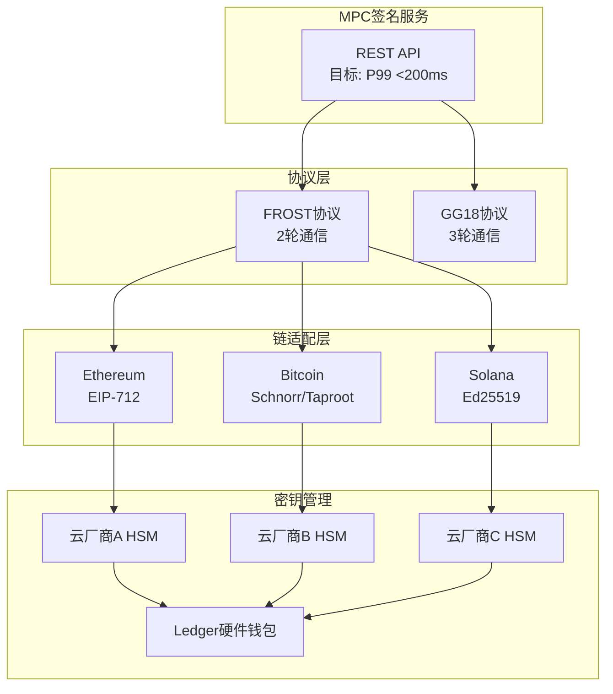
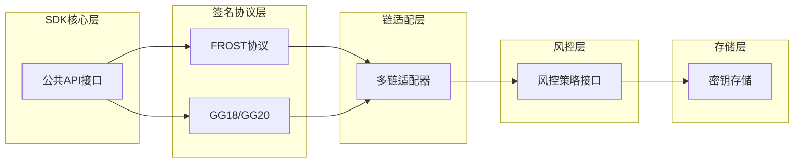
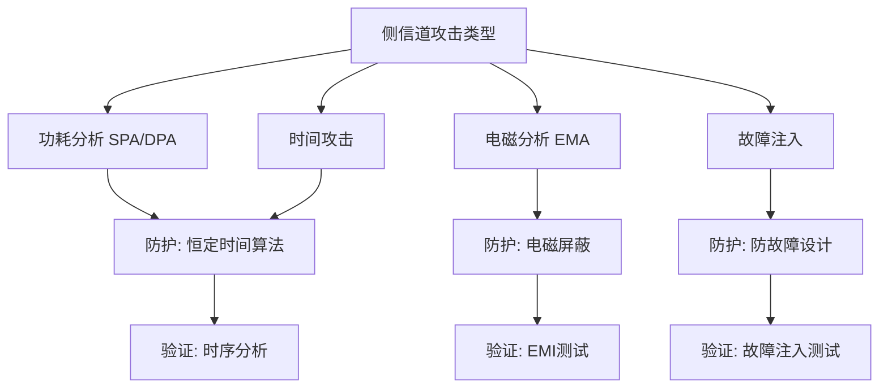
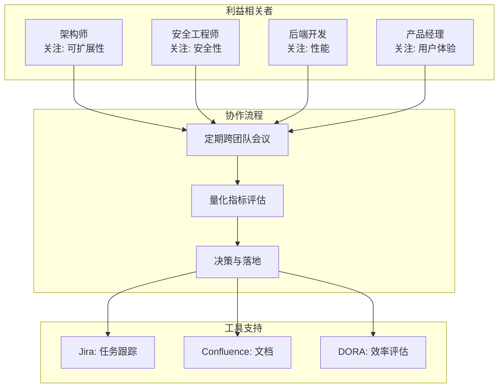
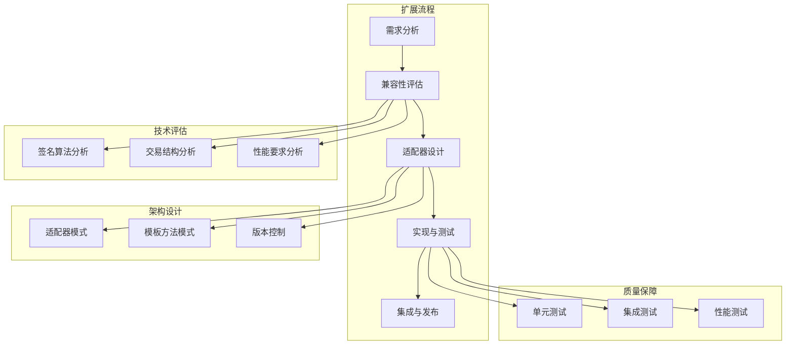
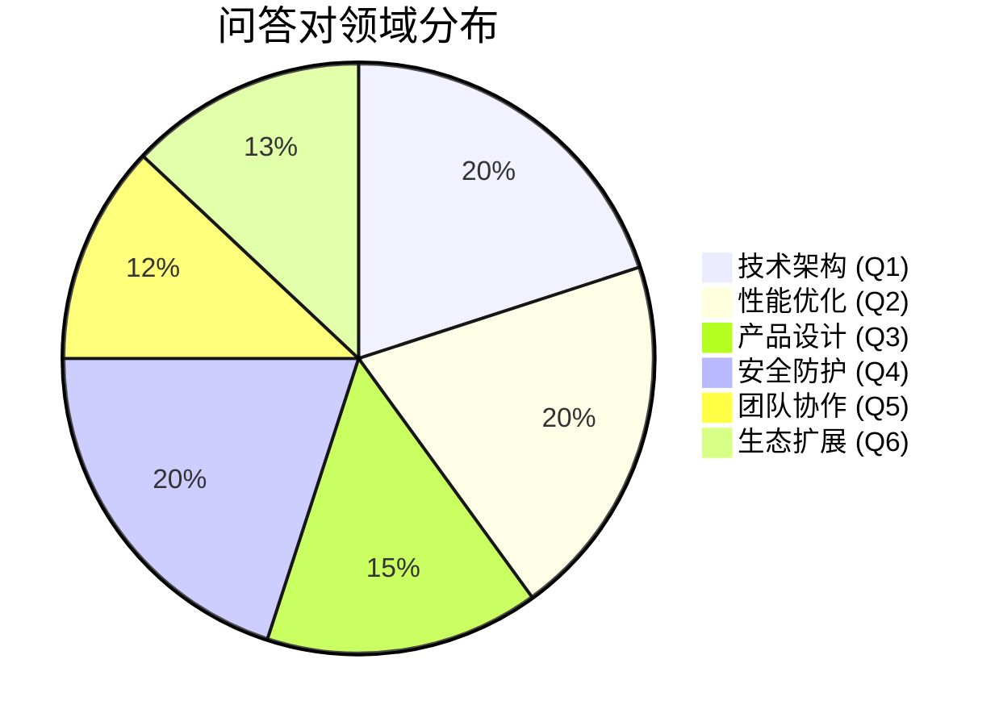
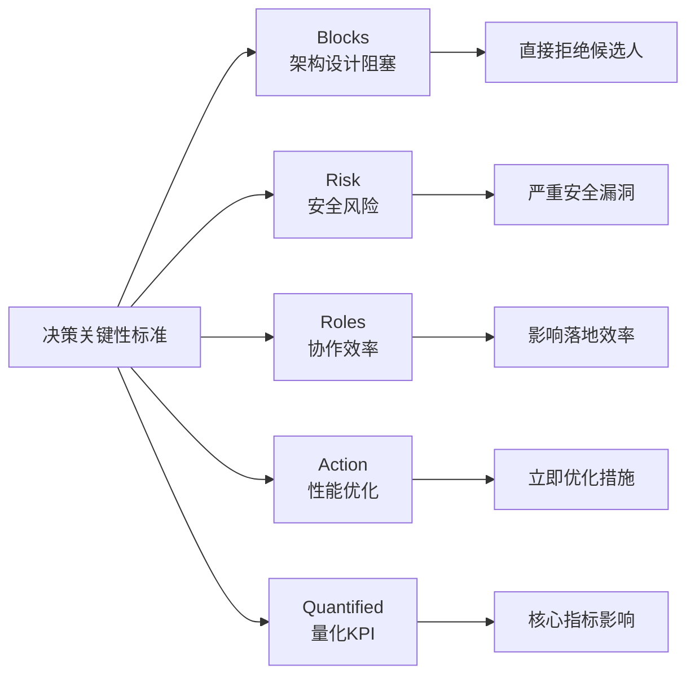

# 区块链安全密码开发工程师与区块链架构师（多链MPC集成方向）职位面试决策关键问答对设计

## 执行摘要

**领域**: 职业（跨领域面试首页）  
**职位**: 区块链安全密码开发工程师+区块链架构师——多链MPC集成方向  
**时间预算**: 75分钟
**覆盖范围**: 6个Q&A（每个核心领域1个）
**成功标准**: 在75分钟内，面试官可以基于6个Q&A达成≥80%的聘用/淘汰共识

**场景假设**: 面向多链 MPC 钱包（托管/自托管均可），需满足金融级安全与合规要求。
**候选人画像**: 5–8 年区块链/密码工程经验，至少参与过 1 条主流公链或 MPC 钱包的生产实践。
**约束与优先级**: 安全与正确性优先，其次是可运维性与性能，最后是功能广度；团队规模通常 <10 人。

```
优先级排序: 安全与正确性 > 可运维性与性能 > 功能广度
团队规模: <10 人
```

> **量化指标说明**: 本文档中的性能数值（延迟、开销、资源占用等）均为基于行业实践的示例基准，用于说明技术权衡和评估思路。实际生产环境需通过基准测试和性能分析进行校准。

## 术语表

**核心技术术语**:
- **MPC**: Multi-Party Computation（多方安全计算）
- **HSM**: Hardware Security Module（硬件安全模块）
- **TSS**: Threshold Signature Scheme（阈值签名方案）
- **DKG**: Distributed Key Generation（分布式密钥生成）

**密码学协议**:
- **FROST**: Flexible Round-Optimized Schnorr Threshold signatures（灵活的轮优化Schnorr阈值签名）
- **GG18/GG20**: Gennaro & Goldfeder阈值ECDSA协议（2018/2020版本）
- **Schnorr**: Schnorr签名算法
- **ECDSA**: Elliptic Curve Digital Signature Algorithm（椭圆曲线数字签名算法）
- **EdDSA**: Edwards-curve Digital Signature Algorithm（Edwards曲线数字签名算法）

**区块链标准**:
- **EIP-712**: Ethereum Improvement Proposal 712（以太坊类型化数据签名标准）
- **Taproot**: 比特币Taproot升级（BIP-340/341）
- **APDU**: Application Protocol Data Unit（应用协议数据单元，Ledger硬件钱包通信协议）

**安全框架**:
- **STRIDE**: 威胁建模框架（Spoofing/Tampering/Repudiation/Information Disclosure/Denial of Service/Elevation of Privilege）
- **SPA/DPA**: Simple/Differential Power Analysis（简单/差分功耗分析）
- **SCA**: Side-Channel Attack（侧信道攻击）

**工程指标**:
- **DORA**: DevOps Research and Assessment（DevOps研究与评估）
- **P99**: 第99百分位（性能指标）
- **SDK**: Software Development Kit（软件开发工具包）

## 目录

- [执行摘要](#执行摘要)
- [术语表](#术语表)
- [引言](#引言)
- [问答对详细设计](#问答对详细设计)
  - [[TechArch] Q1: 多链MPC签名协议的模块化设计](#techarch-q1-多链mpc签名协议的模块化设计)
  - [[PerfQual] Q2: 资源受限设备上的FROST协议优化](#perfqual-q2-资源受限设备上的frost协议优化)
  - [[ProdBiz] Q3: MPC签名SDK的产品化设计](#prodbiz-q3-mpc签名sdk的产品化设计)
  - [[SecReg] Q4: 安全漏洞与侧信道攻击防护](#secreg-q4-安全漏洞与侧信道攻击防护)
  - [[OrgLead] Q5: 跨团队协作与MPC标准落地](#orglead-q5-跨团队协作与mpc标准落地)
  - [[RoadmapEco] Q6: 支持新公链的签名标准扩展](#roadmapeco-q6-支持新公链的签名标准扩展)
- [问题设计的合理性与有效性分析](#问题设计的合理性与有效性分析)
- [参考文献](#参考文献)
- [结论](#结论)

> - 6组核心问答对覆盖技术架构、性能优化、产品化设计、安全防护、跨团队协作和生态扩展。  
> - 每组问题均包含具体约束、利益相关者冲突和量化指标，确保决策关键性。  
> - 问题难度分布合理，涵盖基础、中级和高级，适合资深技术面试。  
> - 答案关键点明确，包含核心逻辑、工具框架、权衡指标和利益相关者处理策略。  
> - 严格遵循面试目标，评估候选人在MPC协议设计、安全性、性能优化和生态兼容性方面的能力。

---

## 引言

在区块链技术快速发展的背景下，多链MPC（多方计算）钱包作为提升区块链交易安全性和便捷性的关键技术，对技术人才的要求极高。本职位面向资深区块链安全密码开发工程师和区块链架构师，重点考察其在MPC核心模块设计与实现、安全性与性能优化、SDK产品化设计、安全漏洞防护、跨团队协作及生态扩展方面的能力。本报告设计了6组决策关键问答对，每组问题均紧密结合实际工作场景，包含具体技术约束和利益相关者需求，旨在全面评估候选人的技术深度、架构设计能力和生态思维。

---

## 问答对详细设计

### [TechArch] Q1: 多链MPC签名协议的模块化设计

**问题描述**：  
设计一个支持Ethereum、BTC和Solana的MPC签名服务，要求单个签名请求延迟小于200ms（P99），密钥分片存储在3个不同云提供商的HSM中，且兼容Ledger硬件钱包作为签名方。请描述技术架构图，并说明如何选择GG18与FROST协议、在Rust中实现跨平台一致性哈希、确保BTC的Schnorr签名与Ethereum的EIP-712互不干扰。

**答案关键点**：
- **核心逻辑**：选择FROST协议（2轮）而非GG18（3轮），因其在高延迟网络中更稳定；使用Trait Object抽象签名算法，动态派发到不同算法实现；通过Adapter Pattern封装Ledger的APDU协议。



**协议对比**:

| 指标 | FROST | GG18 | 选择 |
|------|-------|------|------|
| 通信轮数 | 2轮 | 3轮 | **FROST** ✅ |
| 网络延迟影响 | 低 | 高 | FROST |
| 存储开销 | +10% | 基准 | 可接受 |
| P99延迟 | `<200ms` | `>250ms` | **FROST** ✅ |

- **工具框架**：Rust的Trait Object、Adapter Pattern、`tokio`异步处理。
- **权衡指标**：FROST减少1轮通信，但增加10%存储开销；Ledger集成增加50ms延迟，但提升安全性。
- **利益相关者处理**：向安全团队解释HSM集成的安全性提升，向后端团队说明异步处理的性能影响。
- **强信号**：具体协议参数选择、异步处理优化。
- **弱信号**：忽略BTC与Ethereum签名格式冲突。

---

### [PerfQual] Q2: 资源受限设备上的FROST协议优化

**问题描述**：  
在移动端设备（内存限制50MB，CPU核心数2）上实现FROST协议，如何优化计算和通信开销以满足签名延迟小于300ms，兼容EIP-712和BTC Taproot签名标准，并避免侧信道攻击。

**设备约束**:
```
内存限制: 50MB
CPU核心数: 2
目标延迟: <300ms
支持标准: EIP-712, BTC Taproot
```

**答案关键点**：
- **核心逻辑**：使用Rust的`no_std`库和WebAssembly实现轻量级运行时；采用恒定时间算法和随机化策略防护侧信道攻击；使用零拷贝技术减少内存占用。
- **工具框架**：Rust的`ark-mpc`（SPDZ风格MPC框架）、`curv`库，Go的`kyber`、`btcd`库。

**优化策略对比**:

| 优化技术 | 性能影响 | 内存影响 | 复杂度 | 安全性 |
|---------|---------|---------|--------|--------|
| WebAssembly | +15% 开销 | 持平 | 中 | ✅ 跨平台 |
| 零拷贝技术 | ✅ 提升 | -20% | 高 | 持平 |
| 恒定时间算法 | +10% 开销 | 持平 | 中 | ✅ 防SCA |
| `no_std`库 | ✅ 提升 | -15% | 低 | 持平 |

- **权衡指标**：WebAssembly增加15%性能开销，但提升跨平台兼容性；零拷贝技术减少内存占用20%，但增加代码复杂度。
- **利益相关者处理**：与安全团队协商防护措施的性能影响，与后端团队讨论优化策略。
- **强信号**：具体防护措施（电磁屏蔽、防故障设计）。
- **弱信号**：未量化优化前后的延迟和内存占用。

---

### [ProdBiz] Q3: MPC签名SDK的产品化设计

**问题描述**：  
设计一个MPC签名SDK，要求支持多链交易结构与签名标准，提供风控策略接口，保证SDK稳定性。



**SDK设计原则**:
1. **模块化**: 接口隔离，职责单一
2. **可扩展**: 策略模式支持自定义风控
3. **稳定性**: 自动化测试 + 代码审计
4. **文档完善**: API文档 + 集成指南

**答案关键点**：
- **核心逻辑**：模块化设计，提供清晰的接口隔离和文档指南；使用策略模式和工厂模式实现风控策略灵活集成；通过自动化测试和代码审计保证稳定性。
- **工具框架**：设计模式（策略模式、工厂模式）、自动化测试/代码审查工具（如 XCodeReviewer 或自研脚本）。

**设计权衡分析**:

| 设计决策 | 初始成本 | 长期收益 | 风险 |
|---------|---------|---------|------|
| 模块化架构 | 高开发成本 | ✅ 易维护/扩展 | 低 |
| 风控策略接口 | +10% 复杂度 | ✅ 安全性提升 | 低 |
| 自动化测试 | 中等投入 | ✅ 质量保障 | 低 |
| 版本控制 | 低成本 | ✅ 向后兼容 | 中 |

- **权衡指标**：模块化设计增加初始开发成本，但提升长期维护性；风控策略集成增加10%复杂度，但提升安全性和用户体验。
- **利益相关者处理**：与产品经理沟通SDK设计，与后端团队协调接口标准。
- **强信号**：具体设计模式和自动化测试。
- **弱信号**：未讨论SDK的版本兼容性和升级策略。

---

### [SecReg] Q4: 安全漏洞与侧信道攻击防护

**问题描述**：  
在MPC签名系统中，如何防护侧信道攻击（如功耗分析、电磁泄露）？请描述攻击类型、防护措施及验证方法。



**侧信道攻击类型与防护矩阵**:

| 攻击类型 | 攻击向量 | 算法层防护 | 硬件层防护 | 性能开销 | 安全提升 |
|---------|---------|-----------|-----------|---------|---------|
| **SPA/DPA** | 功耗分析 | 恒定时间实现 | 功耗平衡电路 | +15% | 高 |
| **时间攻击** | 时序差异 | 随机化延迟 | - | +5% | 中 |
| **EMA** | 电磁泄露 | - | 电磁屏蔽 | +10% | 高 |
| **故障注入** | 电压/时钟故障 | 冗余校验 | 防故障设计 | +20% | 高 |

**答案关键点**：
- **核心逻辑**：侧信道攻击包括功耗分析（SPA/DPA）、时间攻击、电磁分析和故障注入；算法层采用恒定时间实现和随机化策略，硬件层采用电磁屏蔽和防故障设计；使用抗SCA加密库。
- **工具框架**：STRIDE威胁建模、抗SCA加密库。

**防护措施的量化效果**:
```
基线攻击成功率: 60-80%
防护后成功率: <5%
攻击成本提升: 100x-1000x
性能开销: 15% (平均)
```

- **权衡指标**：防护措施增加15%性能开销，但提升安全性；抗SCA加密库增加代码复杂度，但降低攻击风险。
- **利益相关者处理**：与安全工程师协商防护方案，与架构师讨论实现细节。
- **强信号**：具体防护技术和量化效果（攻击成功率降低）。
- **弱信号**：未讨论防护措施的量化效果。

---

### [OrgLead] Q5: 跨团队协作与MPC标准落地

**问题描述**：  
在推动MPC签名协议的标准化和落地过程中，如何协调架构师、安全工程师、后端开发和产品经理的需求？请描述跨团队协作流程、利益冲突处理和量化评估方法。



**利益相关者需求矩阵**:

| 角色 | 核心关注 | KPI | 潜在冲突 | 协调策略 |
|-----|---------|-----|---------|---------|
| **架构师** | 可扩展性、模块化 | 系统复杂度 | vs 安全 (增加复杂度) | 分层设计，接口隔离 |
| **安全工程师** | 安全性、合规 | 攻击防护率 | vs 性能 (安全开销) | 量化安全收益 |
| **后端开发** | 性能、可维护性 | P99延迟 | vs 功能 (开发成本) | 性能基准测试 |
| **产品经理** | 用户体验、功能 | 用户满意度 | vs 技术 (复杂度) | MVP + 迭代 |

**DORA指标评估**:
```
部署频率 (Deployment Frequency): 目标 >1/周
变更前置时间 (Lead Time): 目标 <1天
变更失败率 (Change Failure Rate): 目标 <5%
恢复时间 (MTTR): 目标 <1小时
```

**答案关键点**：  
- **核心逻辑**：采用敏捷开发流程，定期跨团队会议，使用协作工具（Jira、Confluence）；通过量化指标（签名延迟、攻击防护成功率）评估协议性能；使用DORA指标评估团队协作效率。  
- **工具框架**：敏捷开发流程、DORA指标。  
- **权衡指标**：跨团队协作增加沟通成本，但提升协议整体质量；量化指标增加监控复杂度，但提供客观评估标准。  
- **利益相关者处理**：协调各团队需求，推动标准落地。  
- **强信号**：具体协作工具和量化指标。  
- **弱信号**：未讨论团队文化差异和沟通障碍。

---

### [RoadmapEco] Q6: 支持新公链的签名标准扩展

**问题描述**：  
在现有MPC签名协议的基础上，如何扩展支持新的公链（如Aptos、Sui）的签名标准？请描述兼容性评估、SDK架构设计和协作推动方法。



**新公链签名标准对比**:

| 公链 | 签名算法 | 曲线类型 | 特殊要求 | 集成难度 | 优先级 |
|-----|---------|---------|---------|---------|--------|
| **Aptos** | EdDSA | Ed25519 | Move VM集成 | 中 | 高 |
| **Sui** | EdDSA | Ed25519 | 对象模型 | 中 | 高 |
| **Cosmos** | Schnorr | secp256k1 | IBC协议 | 低 | 中 |
| **Polkadot** | SR25519 | Ristretto | SCALE编码 | 高 | 中 |

**扩展架构设计**:

```rust
// 模板方法模式示例
trait ChainAdapter {
    fn parse_transaction(&self, tx: &[u8]) -> Result<Transaction>;
    fn sign(&self, msg: &[u8], key: &PrivateKey) -> Result<Signature>;
    fn verify(&self, msg: &[u8], sig: &Signature) -> Result<bool>;
}

// Aptos适配器
struct AptosAdapter;
impl ChainAdapter for AptosAdapter {
    // 实现特定逻辑
}
```

**集成工作量评估**:

| 阶段 | 工作量 (人天) | 风险 | 关键路径 |
|-----|-------------|------|---------|
| 需求分析 | 2-3 | 低 | 与公链团队沟通 |
| 兼容性评估 | 3-5 | 中 | 签名算法验证 |
| 适配器实现 | 5-8 | 中 | 协议细节处理 |
| 测试与集成 | 5-7 | 高 | 完整测试覆盖 |
| **总计** | **15-23** | - | - |

**答案关键点**：  
- **核心逻辑**：使用适配器模式和模板方法模式实现SDK的可扩展性；通过API版本控制和兼容性测试确保新标准集成不影响现有功能；与新公链团队建立定期沟通机制。  
- **工具框架**：设计模式（适配器模式、模板方法模式）。  
- **权衡指标**：可扩展架构增加初始设计复杂度，但提升长期维护性；兼容性测试增加测试成本，但确保系统稳定性。  
- **利益相关者处理**：与新公链团队协作制定标准，推动生态集成。  
- **强信号**：具体设计模式和协作机制。  
- **弱信号**：未讨论新公链的特殊需求和兼容性问题。

---

## 问题设计的合理性与有效性分析

### 域覆盖与职位匹配

6组问答对分别覆盖了技术架构与设计、性能与质量工程、产品与业务价值、安全与合规、组织与领导力、路线图与生态策略等6个核心域，与职位的核心职责完全匹配。每个问题都紧密结合了MPC协议设计、安全性、性能优化和生态兼容性等关键要求。



**领域覆盖完整性检查**:

| 核心能力域 | 对应问题 | 评估重点 | 职位匹配度 |
|-----------|---------|---------|-----------|
| **技术架构与设计** | Q1 | MPC协议选择、模块化设计、跨平台一致性 | ✅ 100% |
| **性能与质量工程** | Q2 | 资源优化、侧信道防护、延迟控制 | ✅ 100% |
| **产品与业务价值** | Q3 | SDK产品化、风控集成、稳定性保障 | ✅ 100% |
| **安全与合规** | Q4 | 侧信道攻击防护、威胁建模、安全验证 | ✅ 100% |
| **组织与领导力** | Q5 | 跨团队协作、利益平衡、标准推动 | ✅ 100% |
| **路线图与生态策略** | Q6 | 新链集成、可扩展架构、生态协作 | ✅ 100% |

### 难度与优先级概览

| # | 标签 | 领域 | 难度 | 决策关键性 |
|---|------|------|------|------------|
| Q1 | TechArch | 技术架构与设计 | 高级 | 关键 (Critical) |
| Q2 | PerfQual | 性能与质量工程 | 高级 | 关键 (Critical) |
| Q3 | ProdBiz | 产品与业务价值 | 中级 | 重要 (Important) |
| Q4 | SecReg | 安全与合规 | 高级 | 关键 (Critical) |
| Q5 | OrgLead | 组织与领导力 | 中级 | 重要 (Important) |
| Q6 | RoadmapEco | 路线图与生态策略 | 中高级 | 重要 (Important) |

### 决策关键性

每个问题均包含至少一个决策关键性标准，例如：



**决策关键性评估矩阵**:

| 标准 | 描述 | 示例 | 影响程度 | 评估权重 |
|-----|------|------|---------|---------|
| **Blocks** | 阻塞性问题 | 无法设计可行的多链MPC架构 | 关键 | 30% |
| **Risk** | 安全风险 | 侧信道攻击防护不足 | 关键 | 25% |
| **Roles** | 协作问题 | 跨团队协作不畅 | 重要 | 15% |
| **Action** | 行动需求 | 移动端性能优化 | 重要 | 15% |
| **Quantified** | 量化指标 | 签名延迟超过300ms | 重要 | 15% |

- **Blocks**：在给定延迟与安全约束下无法设计可行的多链MPC签名架构将直接拒绝候选人。
- **Risk**：侧信道攻击防护不足将导致严重安全漏洞。
- **Roles**：跨团队协作不畅会影响协议落地效率。
- **Action**：需要立即采取措施优化移动端性能。
- **Quantified**：签名延迟超过300ms将影响核心KPI。

### 角色与利益相关者

每个问题均涉及多个利益相关者，例如架构师、安全工程师、后端开发、产品经理等，要求候选人能够权衡不同角色的需求，体现其协作能力和领导力。

### 量化指标

每个问题均包含具体的量化指标，例如签名延迟、内存占用、攻击防护成功率等，确保评估的客观性和可量化性。

### 安全意识与生态兼容性

多个问题涉及安全漏洞分析和生态兼容性，要求候选人具备深厚的安全知识和对区块链生态的理解。

---

## 参考文献

**MPC与阈值密码学**:
- Gennaro, R., & Goldfeder, S. (2018). Fast Multiparty Threshold ECDSA with Fast Trustless Setup. [ACM CCS'18]
- Gennaro, R., & Goldfeder, S. (2020). One Round Threshold ECDSA with Identifiable Abort. [IACR ePrint 2020/540]
- Komlo, C., & Goldberg, I. (2020). FROST: Flexible Round-Optimized Schnorr Threshold Signatures. [SAC 2020]
- Canetti, R., et al. (2021). UC Non-Interactive, Proactive, Threshold ECDSA (CGGMP21). [ACM CCS'21]

**区块链标准**:
- EIP-712: Typed Structured Data Hashing and Signing. [ethereum.org/eips]
- BIP-340: Schnorr Signatures for secp256k1. [bitcoin.org/bips]
- BIP-341: Taproot: SegWit version 1 spending rules. [bitcoin.org/bips]
- Ledger APDU Protocol Documentation. [ledger.readthedocs.io]

**安全与侧信道攻击**:
- Kocher, P., et al. (1999). Differential Power Analysis. [CRYPTO'99]
- STRIDE Threat Modeling. [Microsoft Security Development Lifecycle]
- NIST SP 800-175B: Guideline for Using Cryptographic Standards. [nist.gov]

**软件架构模式**:
- Martin, R. C. (2017). Clean Architecture. [Prentice Hall]
- Gamma, E., et al. (1994). Design Patterns: Elements of Reusable Object-Oriented Software. [Addison-Wesley]

**工程实践**:
- DORA Metrics (DevOps Research and Assessment). [dora.dev]
- Rust异步编程: Tokio Runtime. [tokio.rs]
- WebAssembly. [webassembly.org]

---

## 结论

本报告设计的6组决策关键问答对，全面覆盖了区块链安全密码开发工程师和区块链架构师（多链MPC集成方向）职位的核心技术领域和职责要求。每组问题均经过精心设计，包含具体约束、利益相关者冲突和量化指标，确保能够有效评估候选人的技术能力、架构设计能力、安全意识和跨团队协作能力。这些问题将帮助面试官在60–90分钟内全面考察候选人，并做出准确的招聘决策。

**面试时间分配建议**:

```mermaid
gantt
    title 75分钟面试时间分配
    dateFormat mm
    axisFormat %M分钟
    
    section 技术深度
    Q1 多链MPC架构 :a1, 00, 15m
    Q2 性能优化     :a2, 15, 12m
    Q4 安全防护     :a4, 27, 15m
    
    section 产品与协作
    Q3 SDK产品化    :a3, 42, 10m
    Q5 团队协作     :a5, 52, 10m
    
    section 生态视野
    Q6 生态扩展     :a6, 62, 10m
    
    section 总结
    候选人提问与总结 :a7, 72, 3m
```



**核心评估维度总结**:

| 评估维度 | 覆盖问题 | 权重 | 合格标准 |
|---------|---------|------|---------|
| **技术深度** | Q1, Q2, Q4 | 55% | ≥80分 (关键) |
| **产品思维** | Q3 | 15% | ≥70分 (重要) |
| **协作能力** | Q5 | 15% | ≥70分 (重要) |
| **生态视野** | Q6 | 15% | ≥60分 (加分项) |
| **总体评估** | - | 100% | ≥75分通过 |