# MPC Wallet Engineer Interview Guide (Qwen3Max)

## Executive Summary

**Domain**: Career (Cross-Domain Interview Front Page)
**Role**: Senior Blockchain Security Cryptography Developer & Architect (Multi-chain MPC Integration)
**Time Budget**: 75 minutes
**Coverage**: 6 Q&As (1 per essential domain)
**Success Criteria**: Achieve ≥80% hiring consensus with clear strengths/risks identified per domain
**Intended Use**: Front-page guide for onsite or late-stage interviews of senior/lead MPC wallet engineers.
**Assumptions**: High-security MPC custody or infrastructure provider; candidate already strong in blockchain and cryptography fundamentals.
**Out of Scope**: Live coding, low-level implementation details, and generic behavioral questions (covered in other rounds).
**Difficulty Legend**: F = Foundational, I = Intermediate, A = Advanced.

**⚠️ IMPORTANT DISCLAIMER**: Unless explicitly tied to an external source, numeric thresholds in this document (latency targets, probabilities, incident rates, cost estimates, etc.) are interview design targets for evaluation purposes, not measured production benchmarks. These values serve as reference points for assessing candidate judgment and should be calibrated to your organization's actual SLAs and operational requirements before use.

**Interview Flow Overview**:

**Legend**: 🔴 Advanced | 🟡 Intermediate | 🟢 Foundational

## Glossary

**Core Cryptographic Terms**:
- **MPC**: Multi-Party Computation - distributed cryptographic protocol
- **TSS**: Threshold Signature Scheme
- **ECDSA**: Elliptic Curve Digital Signature Algorithm
- **Ed25519**: Edwards-curve Digital Signature Algorithm (used by Solana)
- **Schnorr**: Schnorr signature algorithm

**MPC Protocols**:
- **GG20**: Gennaro & Goldfeder threshold ECDSA protocol (2020)
- **FROST**: Flexible Round-Optimized Schnorr Threshold signatures

**Infrastructure**:
- **HSM**: Hardware Security Module
- **TEE**: Trusted Execution Environment
- **API**: Application Programming Interface
- **SDK**: Software Development Kit

**Security & Compliance**:
- **STRIDE**: Threat modeling framework (Spoofing/Tampering/Repudiation/Information Disclosure/Denial of Service/Elevation of Privilege)
- **NIST SP 800-53**: National Institute of Standards and Technology security controls
- **SOC 2 Type II**: Service Organization Control - security audit framework
- **ProVerif/Tamarin**: Formal verification tools for cryptographic protocols

**Business & Engineering**:
- **WSJF**: Weighted Shortest Job First (prioritization framework)
- **RICE**: Reach, Impact, Confidence, Effort (scoring framework)
- **OKR**: Objectives and Key Results
- **DORA**: DevOps Research and Assessment
- **ARR**: Annual Recurring Revenue
- **TVL**: Total Value Locked (blockchain metric)

**Design Patterns**:
- **Adapter Pattern**: Software design pattern for interface compatibility
- **API-First Design**: Design methodology starting with API contracts
- **Consumer-Driven Contracts**: Testing approach where consumers define expected API behavior
- **Team Topologies**: Framework for organizing software delivery teams

## Table of Contents

- [Executive Summary](#executive-summary)
- [Glossary](#glossary)
- [Key Signals](#key-signals)
- [Dashboard](#dashboard)
- [[TechArch] Q1: Cross-Chain MPC Wallet Architecture Design](#techarch-q1-cross-chain-mpc-wallet-architecture-design)
- [[PerfQual] Q2: MPC Signing Performance Optimization](#perfqual-q2-mpc-signing-performance-optimization)
- [[ProdBiz] Q3: MPC Wallet Feature Prioritization](#prodbiz-q3-mpc-wallet-feature-prioritization)
- [[SecReg] Q4: MPC Key Management Risk Assessment](#secreg-q4-mpc-key-management-risk-assessment)
- [[OrgLead] Q5: Cross-Team Cryptography Integration](#orglead-q5-cross-team-cryptography-integration)
- [[RoadmapEco] Q6: Multi-Chain MPC Ecosystem Strategy](#roadmapeco-q6-multi-chain-mpc-ecosystem-strategy)
- [References](#references)
- [Validation Checklist](#validation-checklist)

## Key Signals
- [TechArch] MPC protocol selection & system design judgment for cross-chain wallets
- [PerfQual] Performance-security trade-offs in threshold signature implementations
- [ProdBiz] User experience vs security trade-offs in MPC wallet product decisions
- [SecReg] Risk assessment & mitigation strategies for cryptographic key management
- [OrgLead] Technical leadership in cross-functional security-cryptography collaboration
- [RoadmapEco] Strategic planning for multi-chain MPC ecosystem evolution


## Dashboard
| # | EssentialDomainTag | Domain | Difficulty | Criticality | Target Signal | EstimatedTime |
|---|--------------------|--------|------------|-------------|---------------|---------------|
| 1 | TechArch   | Technical Architecture & Design      | A | Blocks      | MPC protocol architecture judgment | ~12 min |
| 2 | PerfQual   | Performance & Quality Engineering    | I | Risk        | Latency-security trade-off optimization | ~11 min |
| 3 | ProdBiz    | Product & Business Value             | I | Quantified  | Value-driven feature prioritization | ~10 min |
| 4 | SecReg     | Security & Regulation                | A | Risk        | Cryptographic risk assessment framework | ~13 min |
| 5 | OrgLead    | Organization & Leadership            | F | Roles       | Cross-team technical alignment | ~9 min |
| 6 | RoadmapEco | Roadmap & Ecosystem Strategy         | I | Action      | Multi-chain ecosystem integration strategy | ~10 min |

---

### [TechArch] Q1: Cross-Chain MPC Wallet Architecture Design

**Domain**: Technical Architecture & Design | **CareerStage**: Architect | **RoleFocus**: Mixed  
**Difficulty**: A | **Criticality**: Blocks | **Stakeholders**: Cryptography Engineer, Security Architect, Product Manager | **EstimatedTime**: ~12 min

**Question (for candidate)**:  
You're designing an MPC wallet that must support Ethereum, Solana, and Bitcoin with the same core infrastructure. The product team wants a unified UX, but each chain has different transaction structures and signature requirements. Security requires HSM integration for key storage, while mobile teams need sub-second latency for transaction signing. How would you architect the system to balance these constraints, and what MPC protocol (GG20 vs FROST vs custom) would you choose for each chain? Explain your protocol selection rationale and how you'd handle the architectural trade-offs between flexibility and performance.

**Answer Key (~150–250 words)**:  
**Key Insight**: Strong architects prioritize protocol-chain alignment over uniformity, using adapter patterns for chain-specific implementations while maintaining core MPC logic. Protocol choice depends on signature scheme compatibility: GG20 for ECDSA chains (Bitcoin/Ethereum), FROST for Schnorr (Bitcoin improvement), and custom solutions for Solana's Ed25519. The architecture should separate concerns into: 1) Chain-agnostic MPC core, 2) Chain-specific adapters, 3) HSM integration layer, and 4) API gateway for mobile/web.

**Architecture**:


**Performance Targets**:
- Mobile signing: `<800ms`
- Web signing: `<1.2s`
- Security: Key compromise `<0.001%`, tx failure `<0.1%`

**Frameworks/Tools**: Chain abstraction patterns, adapter design pattern, MPC protocol capability matrix (signature schemes, round complexity, fault tolerance).

**Example Protocol-Chain Mapping**:

| Chain    | Signature Scheme | Example MPC Protocol           |
|----------|------------------|--------------------------------|
| Bitcoin  | ECDSA            | GG20                           |
| Ethereum | ECDSA            | GG20                           |
| Solana   | Ed25519          | Custom Ed25519-capable MPC     |

**Trade-offs & Metrics**: Protocol selection trades off development complexity vs performance: GG20 offers mature implementations but higher latency (300-500ms), FROST provides better parallelism but limited Bitcoin support. Latency targets: mobile signing <800ms, web <1.2s. Security metrics: key compromise probability <0.001%, transaction failure rate <0.1%. Avoid forcing a single protocol across all chains when that would materially degrade security guarantees or developer velocity; treat strict uniformity as a last resort and document associated risks explicitly.

**Stakeholder Handling**: Present architecture options to PMs with clear UX impact timelines, to security team with threat models, and to mobile teams with latency benchmarks.

**Signals**:  
- **Strong**: Specific protocol-chain mappings, measured latency targets, explicit security-performance trade-offs.  
- **Weak**: One-size-fits-all protocol choice, vague latency goals, ignores chain-specific signature requirements.

---

### [PerfQual] Q2: MPC Signing Performance Optimization

**Domain**: Performance & Quality Engineering | **CareerStage**: Senior | **RoleFocus**: IC  
**Difficulty**: I | **Criticality**: Risk | **Stakeholders**: Mobile Developer, SRE, Security Engineer | **EstimatedTime**: ~11 min

**Question (for candidate)**:  
Your team's MPC wallet implementation has acceptable performance on backend servers (200ms signing time) but struggles on mobile devices (2.5s for the same operation). The security team refuses to reduce cryptographic strength, and the mobile team needs signing under 800ms for user retention. Users report abandonment when transactions take >1s. How would you approach performance optimization while maintaining security guarantees? What specific bottlenecks would you measure first, and what trade-offs would you accept?

**Answer Key (~150–250 words)**:  
**Key Insight**: Strong engineers identify compute-bound vs communication-bound bottlenecks and apply targeted optimizations without compromising cryptographic security. The primary mobile bottlenecks are: 1) Elliptic curve operations on resource-constrained devices, 2) Network latency for multi-party coordination, 3) Serialization/deserialization overhead.

**Performance Bottleneck Analysis**:


**Current vs Target Metrics**:
| Metric | Current (Mobile) | Current (Backend) | Target (Mobile) | Improvement Required |
|--------|------------------|-------------------|-----------------|---------------------|
| Signing Time | 2.5s | 200ms | <800ms | 68% reduction |
| Battery Impact | ~8% per tx | N/A | <5% per tx | 37.5% reduction |
| Error Rate | ~0.8% | ~0.2% | <0.5% | 37.5% reduction |

**Frameworks/Tools**: Profiling tools (perf, flamegraph), DORA deployment metrics, MPC round complexity analysis, mobile-specific optimization frameworks (Rust's async runtime, WebAssembly compilation).

**Trade-offs & Metrics**: Acceptable trade-offs: pre-computation of curve points (increased memory usage), optimistic signing (temporary security reduction with rollback capability), and session caching (reduced security freshness). Target metrics: P95 mobile latency <750ms, battery impact <5% per transaction, error rate <0.5%. Risk metrics: security degradation factor <1.05x, recovery time <30s for failed optimizations.

**Stakeholder Handling**: Present optimization roadmap to mobile team with clear performance targets, to security team with quantified risk acceptance boundaries, and to SREs with monitoring requirements for production rollouts.

**Signals**:  
- **Strong**: Specific bottleneck identification, quantified trade-offs, measurable performance targets with error margins.  
- **Weak**: General optimization suggestions, ignores security constraints, lacks concrete latency targets or risk quantification.

---

### [ProdBiz] Q3: MPC Wallet Feature Prioritization

**Domain**: Product & Business Value | **CareerStage**: Senior | **RoleFocus**: Mixed  
**Difficulty**: I | **Criticality**: Quantified | **Stakeholders**: Product Manager, Security Lead, Growth Team | **EstimatedTime**: ~10 min

**Question (for candidate)**:  
Your startup has limited engineering bandwidth to build either social recovery for MPC wallets or multi-chain approval workflows in the next quarter. Social recovery could increase user adoption by 40% but introduces security risks; multi-chain approvals could capture enterprise customers worth $2M ARR but delays consumer growth. How would you evaluate and prioritize these features? What metrics would you track to measure success, and what security mitigations would you require for the chosen path?

**Answer Key (~150–250 words)**:  
**Key Insight**: Strong candidates use value-risk frameworks to quantify trade-offs and align security requirements with business objectives. Prioritization should consider: 1) User acquisition cost vs lifetime value, 2) Security risk quantification, 3) Engineering complexity vs revenue impact.

**Feature Comparison Matrix**:
| Dimension | Social Recovery | Multi-Chain Approvals | Winner |
|-----------|----------------|----------------------|--------|
| **User Growth** | +40% adoption | Minimal consumer impact | Social Recovery |
| **Revenue Impact** | Delayed monetization | $2M ARR immediately | Multi-Chain |
| **Security Risk** | +15% support tickets | Lower risk | Multi-Chain |
| **Engineering Cost** | $150k mitigation | 6-month delay | Social Recovery |
| **Time to Market** | ~3 months | ~4 months | Social Recovery |
| **Strategic Fit** | Consumer-first | Enterprise-first | Depends on strategy |

**RICE Scoring Example**:
```
Social Recovery:
  Reach = 10,000 users × 40% = 4,000 users
  Impact = High (3.0)
  Confidence = Medium (70%)
  Effort = 3 person-months
  RICE Score = (4,000 × 3.0 × 0.7) / 3 = 2,800

Multi-Chain Approvals:
  Reach = 50 enterprise customers
  Impact = Massive (4.0)
  Confidence = High (90%)
  Effort = 6 person-months
  RICE Score = (50 × 4.0 × 0.9) / 6 = 30
```

**Decision Framework**:

```mermaid
graph TD
    A[Feature Prioritization] --> B{Strategic Direction?}
    B -->|Consumer-First| C[Social Recovery]
    B -->|Enterprise-First| D[Multi-Chain Approvals]
    
    C --> E{Security Mitigation<br/>$150k Available?}
    E -->|Yes| F[✓ Proceed with<br/>Social Recovery]
    E -->|No| G[✗ Delay until funded]
    
    D --> H{Enterprise Demand<br/>Validated?}
    H -->|Yes $2M ARR| I[✓ Proceed with<br/>Multi-Chain]
    H -->|Speculative| J[✗ Validate first]
```


**Frameworks/Tools**: WSJF (Weighted Shortest Job First), RICE scoring (Reach, Impact, Confidence, Effort), threat modeling for feature-specific risks, OKR alignment frameworks.

**Trade-offs & Metrics**: Social recovery: +40% user growth but +15% support tickets, security mitigation cost: $150k engineering effort. Multi-chain approvals: $2M ARR but 6-month delay to consumer features. Success metrics: for social recovery - user activation rate >65%, security incident rate <0.1%; for approvals - enterprise conversion rate >8%, implementation time <4 months. Do not prioritize either option without committing to the corresponding mitigation: for social recovery, dedicated security and support investment; for approvals, validated enterprise demand and sufficient delivery capacity.

**Stakeholder Handling**: Present quantified scenarios to PM with growth projections, to security lead with risk mitigation plans, and to growth team with implementation timelines and resource requirements.

**Signals**:  
- **Strong**: Quantified business impact, specific security mitigations, clear success metrics with baselines.  
- **Weak**: Opinion-based prioritization, vague security requirements, lacks measurable success criteria or trade-off analysis.

---

### [SecReg] Q4: MPC Key Management Risk Assessment

**Domain**: Security & Regulation | **CareerStage**: Architect | **RoleFocus**: IC  
**Difficulty**: A | **Criticality**: Risk | **Stakeholders**: CISO, Compliance Officer, Cryptography Engineer | **EstimatedTime**: ~13 min

**Question (for candidate)**:  
Your MPC wallet will store $500M in user assets across 3 geographical regions with different regulatory requirements (US, EU, Asia). The system uses threshold signatures with 3-of-5 nodes, but regulators are concerned about key compromise and node collusion. How would you design the security architecture to address regulatory concerns while maintaining operational efficiency? What specific controls would you implement for each risk scenario, and how would you demonstrate compliance to auditors?

**Answer Key (~150–250 words)**:  
**Key Insight**: Strong security architects implement defense-in-depth with regulatory-aligned controls, using formal verification and geographic isolation to mitigate collusion risks. The architecture must address: 1) Node compromise, 2) Insider collusion, 3) Regulatory jurisdiction conflicts, 4) Audit trail completeness.

**3-of-5 Node Geographic Distribution Architecture**:


**Risk Mitigation Controls**:
| Risk Scenario | Threat Level | Mitigation Control | Cost | Effectiveness |
|---------------|--------------|-------------------|------|---------------|
| **Node Compromise** | Critical | HSM per region + TEE | $150k/region | 99.99% |
| **Insider Collusion** | High | Geographic separation | $200k infra | 99.9% |
| **Regulatory Conflict** | Medium | Jurisdiction-aware routing | $50k dev | 95% |
| **Audit Trail Gap** | High | Immutable logging + replication | $80k/year | 99.99% |
| **Network Partition** | Medium | Multi-path routing | $30k/year | 98% |

**STRIDE Threat Analysis**:
- **S**poofing: Multi-factor authentication + HSM attestation
- **T**ampering: Immutable audit logs + cryptographic signatures
- **R**epudiation: Complete audit trail with timestamps
- **I**nformation Disclosure: End-to-end encryption + access controls
- **D**enial of Service: Geographic redundancy + rate limiting
- **E**levation of Privilege: Principle of least privilege + threshold requirements

**Frameworks/Tools**: STRIDE threat modeling, NIST SP 800-53 controls, SOC 2 Type II requirements, formal verification tools (ProVerif, Tamarin), geographic key isolation patterns.

**Trade-offs & Metrics**: Risk mitigation costs: geographic node separation (+$200k infrastructure cost), hardware security modules (+$150k per region), formal verification (+3 months dev time). Key metrics: key compromise probability <0.0001% annually, audit trail completeness >99.99%, regulatory compliance score >95%. Acceptable trade-offs: increased latency (15%) for geographic separation, higher operational cost for HSMs.

**Stakeholder Handling**: Present threat models to CISO with mitigation timelines, compliance frameworks to legal team with jurisdiction-specific requirements, and operational impacts to engineering leads with cost-benefit analysis.

**Signals**:  
- **Strong**: Specific regulatory frameworks referenced, quantified risk probabilities, concrete audit demonstration methods.  
- **Weak**: Generic security controls, ignores jurisdictional differences, lacks measurable risk metrics or compliance verification methods.

---

### [OrgLead] Q5: Cross-Team Cryptography Integration

**Domain**: Organization & Leadership | **CareerStage**: Senior | **RoleFocus**: Mixed  
**Difficulty**: F | **Criticality**: Roles | **Stakeholders**: Backend Engineer, Product Designer, QA Lead | **EstimatedTime**: ~9 min

**Question (for candidate)**:  
You need to integrate your MPC wallet SDK into three different product teams' codebases, but each team has different technical stacks (React Native, Flutter, Web), security requirements, and release cycles. The backend team is concerned about API versioning, the mobile team wants offline signing capabilities, and QA is worried about test coverage for cryptographic edge cases. How would you coordinate this integration to ensure success across all teams while maintaining cryptographic security standards?

**Answer Key (~150–250 words)**:  
**Key Insight**: Strong leaders establish clear interface contracts and shared ownership models while adapting to team-specific constraints. Success requires: 1) Standardized API contracts with versioning strategy, 2) Team-specific integration patterns, 3) Shared testing frameworks, 4) Clear escalation paths for security issues.

**Cross-Team Integration Architecture**:


**Team-Specific Integration Requirements**:
| Team | Tech Stack | Security Requirements | Release Cycle | Offline Support | Integration Time Target |
|------|------------|----------------------|---------------|-----------------|------------------------|
| **React Native** | JavaScript/TypeScript | Standard MPC + Biometric | 2-week sprints | Required | <4 weeks |
| **Flutter** | Dart | Standard MPC + Platform KEK | 3-week sprints | Required | <4 weeks |
| **Web** | TypeScript | Standard MPC + WebAuthn | Continuous | Optional (Service Worker) | <3 weeks |
| **Backend** | Go/Rust | HSM Integration | Continuous | N/A | <2 weeks |

**Coordination Mechanisms**:


**Frameworks/Tools**: API-first design principles, consumer-driven contracts, Team Topologies interaction modes, shared documentation portals (Swagger, MkDocs), cross-team guild structure for cryptography standards.

**Trade-offs & Metrics**: Acceptable compromises: different offline signing implementations per platform (consistent security model, different UX flows), staggered release schedules with feature flags. Success metrics: integration time per team <4 weeks, security incident rate <0.1%, test coverage >95% for cryptographic functions.

**Stakeholder Handling**: Conduct architecture review sessions with each team's tech leads, establish shared Slack channels for real-time issue resolution, create joint security review checkpoints before major releases, and maintain a shared runbook for cryptographic incident response.

**Signals**:  
- **Strong**: Specific coordination mechanisms, platform-specific adaptation strategies, measurable integration success criteria.  
- **Weak**: One-size-fits-all integration approach, ignores team autonomy constraints, lacks concrete coordination timeline or escalation procedures.

---

### [RoadmapEco] Q6: Multi-Chain MPC Ecosystem Strategy

**Domain**: Roadmap & Ecosystem Strategy | **CareerStage**: Lead | **RoleFocus**: Mixed  
**Difficulty**: I | **Criticality**: Action | **Stakeholders**: CTO, Business Development, Research Lead | **EstimatedTime**: ~10 min

**Question (for candidate)**:  
Your company wants to become the default MPC wallet infrastructure provider for Web3. In the next 18 months, you need to support emerging chains (Monad, Sei), account abstraction standards, and institutional custody requirements. However, engineering resources are limited, and some chains have conflicting signature requirements. How would you create a technical roadmap that balances ecosystem coverage with engineering sustainability? What criteria would you use to prioritize chain support, and how would you handle technical debt from early protocol decisions?

**Answer Key (~150–250 words)**:  
**Key Insight**: Strong strategists use ecosystem maturity frameworks and technical debt accounting to make sustainable roadmap decisions. Prioritization should consider: 1) Market adoption velocity, 2) Technical compatibility with existing architecture, 3) Revenue potential, 4) Community momentum.

**Chain Prioritization Framework**:


**Ecosystem Maturity Assessment**:
| Chain | TVL | Active Devs | Technical Fit | Enterprise Demand | Priority | Time to Market |
|-------|-----|-------------|---------------|-------------------|----------|----------------|
| **Monad** | $150M | 120 | High (EVM-compatible) | Medium | P1 | 3-4 weeks |
| **Sei** | $80M | 90 | Medium (CosmWasm) | Low | P3 | 6-8 weeks |
| **Base** | $500M | 300 | High (EVM) | High | P0 | 2-3 weeks |
| **Aptos** | $200M | 150 | Low (Move VM) | Medium | P2 | 8-10 weeks |

**Technical Debt Management**:


**Debt Ratio Formula**:
```
Technical Debt Ratio = Debt Points / (Feature Points + Debt Points)

Target: < 0.3 (30% of total work)
Current: 0.25 (Healthy)
Alert Threshold: > 0.4 (40%)
```

**18-Month Roadmap Visual**:


**Frameworks/Tools**: Gartner Hype Cycle analysis, technical debt quantification frameworks, ecosystem mapping tools (Token Terminal, DappRadar), modularity assessment scores (coupling/cohesion metrics).

**Trade-offs & Metrics**: Support criteria: minimum TVL >$100M, developer activity >100 active contributors, enterprise demand signals. Technical debt budget: maximum 20% of engineering capacity for refactoring. Success metrics: time-to-market for new chains <6 weeks, community adoption rate >15% of target ecosystem, technical debt ratio <0.3 (debt points/feature points).

**Stakeholder Handling**: Present quarterly roadmap reviews to CTO with technical sustainability metrics, to business development with partnership opportunities per chain, and to research team with emerging protocol analysis and skill development requirements.

**Signals**:  
- **Strong**: Specific prioritization criteria with thresholds, quantified technical debt management, measurable ecosystem adoption targets.  
- **Weak**: Feature-by-feature roadmap without strategic framework, ignores technical sustainability, lacks concrete success metrics or resource allocation strategy.

---

## References

**MPC & Threshold Cryptography**:
- Gennaro, R., & Goldfeder, S. (2020). One Round Threshold ECDSA with Identifiable Abort. [https://eprint.iacr.org/2020/540](https://eprint.iacr.org/2020/540)
- Komlo, C., & Goldberg, I. (2020). FROST: Flexible Round-Optimized Schnorr Threshold Signatures. [https://eprint.iacr.org/2020/852](https://eprint.iacr.org/2020/852)

**Security & Compliance**:
- NIST SP 800-53: Security and Privacy Controls for Information Systems. [https://csrc.nist.gov/publications/detail/sp/800-53/rev-5/final](https://csrc.nist.gov/publications/detail/sp/800-53/rev-5/final)
- SOC 2 Type II: AICPA Trust Services Criteria. [https://www.aicpa.org/interestareas/frc/assuranceadvisoryservices/aicpasoc2report](https://www.aicpa.org/interestareas/frc/assuranceadvisoryservices/aicpasoc2report)
- STRIDE Threat Modeling: Microsoft Security Development Lifecycle. [https://learn.microsoft.com/en-us/azure/security/develop/threat-modeling-tool-threats](https://learn.microsoft.com/en-us/azure/security/develop/threat-modeling-tool-threats)
- ProVerif: Cryptographic Protocol Verifier. [https://proverif.inria.fr/](https://proverif.inria.fr/)
- Tamarin Prover: Security Protocol Analysis. [https://tamarin-prover.github.io/](https://tamarin-prover.github.io/)

**Engineering Frameworks**:
- DORA Metrics: DevOps Research and Assessment. [https://dora.dev/](https://dora.dev/)
- WSJF (Weighted Shortest Job First): SAFe Framework. [https://scaledagileframework.com/wsjf/](https://scaledagileframework.com/wsjf/)
- RICE Prioritization Framework: Intercom Product Management. [https://www.intercom.com/blog/rice-simple-prioritization-for-product-managers/](https://www.intercom.com/blog/rice-simple-prioritization-for-product-managers/)
- Team Topologies. Skelton, M., & Pais, M. (2019). IT Revolution Press. [https://teamtopologies.com/](https://teamtopologies.com/)

**Blockchain Ecosystems**:
- Token Terminal: Crypto metrics and analytics. [https://tokenterminal.com/](https://tokenterminal.com/)
- DappRadar: Decentralized application analytics. [https://dappradar.com/](https://dappradar.com/)

**Design Patterns**:
- Gamma, E., Helm, R., Johnson, R., & Vlissides, J. (1994). Design Patterns: Elements of Reusable Object-Oriented Software. Addison-Wesley Professional.
- API-First Design Principles: OpenAPI Specification. [https://swagger.io/specification/](https://swagger.io/specification/)
- Consumer-Driven Contracts: Pact Testing Framework. [https://pact.io/](https://pact.io/)

## Validation Checklist

**Purpose**: This checklist helps document maintainers and hiring managers verify the interview guide remains current, accurate, and aligned with organizational requirements. Review quarterly or before interview cycles.

**For Document Maintainers**:
- [ ] Chains/protocol mapping is current (Ethereum, Bitcoin, Solana, and MPC libraries still relevant).
- [ ] Latency, risk, and incident thresholds are aligned with current product SLAs and risk appetite.
- [ ] Stakeholder roles and domains still match your hiring loop structure.
- [ ] References and external links are still valid and up to date.

**For Hiring Managers**:
- [ ] Interviewers are calibrated on strong/weak signals and how to synthesize them into hire/no-hire decisions.
- [ ] Success criteria (≥80% hiring consensus) match your organization's hiring bar and decision-making process.