# MPC Wallet Engineer - Architecture Q&A Bank

Interview question bank for MPC-based multi-chain wallet engineering focused on software architecture that guides development implementation.

---

## Contents

- [Topic Areas: Questions 1-30](#topic-areas-questions-1-30)
- [Topic 1: Structural Patterns - MPC Component Architecture](#topic-1-structural-patterns---mpc-component-architecture)
- [Topic 2: Behavioral Design - MPC Protocol Orchestration](#topic-2-behavioral-design---mpc-protocol-orchestration)
- [Topic 3: Quality Attributes - Security, Performance & Reliability](#topic-3-quality-attributes---security-performance--reliability)
- [Topic 4: Data Management - Key Storage & Transaction Persistence](#topic-4-data-management---key-storage--transaction-persistence)
- [Topic 5: Integration Patterns - Multi-Chain SDK & API Design](#topic-5-integration-patterns---multi-chain-sdk--api-design)
- [Topic 6: Evolution & Migration - Protocol Upgrades & Refactoring](#topic-6-evolution--migration---protocol-upgrades--refactoring)
- [Reference Sections](#reference-sections)
- [Validation Report](#validation-report)

---

## Topic Areas: Questions 1-30

Overview of coverage and difficulty distribution.

| Topic | Question Range | Count | Difficulty Mix |
|-------|---------------|-------|----------------|
| Structural Patterns (MPC Component Architecture) | Q1-Q5 | 5 | 1F, 2I, 2A |
| Behavioral Design (MPC Protocol Orchestration) | Q6-Q10 | 5 | 1F, 2I, 2A |
| Quality Attributes (Security, Performance, Reliability) | Q11-Q15 | 5 | 1F, 2I, 2A |
| Data Management (Key Storage, Transaction Persistence) | Q16-Q20 | 5 | 1F, 2I, 2A |
| Integration Patterns (Multi-Chain SDK & API) | Q21-Q25 | 5 | 1F, 2I, 2A |
| Evolution & Migration (Protocol Upgrades, Refactoring) | Q26-Q30 | 5 | 1F, 2I, 2A |
| **Total** | | **30** | **6F, 12I, 12A** |

**Legend**: F = Foundational, I = Intermediate, A = Advanced

---

## Topic 1: Structural Patterns - MPC Component Architecture

### Q1: How would you design a hexagonal architecture for an MPC wallet supporting multiple signature protocols?

**Difficulty**: Foundational  
**Type**: Structural Patterns

**Key Insight**: Tests understanding of dependency inversion and how to isolate cryptographic protocol complexity from business logic through ports and adapters [Ref: A2].

**Answer**:

Hexagonal architecture isolates the MPC wallet's core domain (key management, transaction signing, policy enforcement) from external systems (blockchain RPCs, storage backends, HSMs) via ports (interfaces) and adapters (implementations) [Ref: A10]. The core defines `KeyGenerationPort`, `SigningPort`, `KeyStoragePort`, and `BlockchainPort` interfaces. Adapters implement these for specific protocols: `GG20Adapter`, `FROSTAdapter`, `ThresholdECDSAAdapter` for signing; `PostgresKeyAdapter`, `SGXEnclaveAdapter` for storage; `EthereumRPCAdapter`, `BitcoinRPCAdapter` for blockchains [Ref: A7]. This design enables protocol upgrades without changing business logic, supports testing with mock adapters, and allows runtime selection of signing protocols based on security requirements [Ref: G1]. Dependency injection frameworks (e.g., Google Wire for Go, Dagger for Java) wire adapters to ports at application startup [Ref: T5].

**Code Example**:
```go
// Core domain port
type SigningPort interface {
    GenerateKeyShare(ctx context.Context, threshold, parties int) (KeyShare, error)
    Sign(ctx context.Context, keyShare KeyShare, tx Transaction) (Signature, error)
}

// Adapter for GG20 protocol
type GG20Adapter struct {
    mpcClient *gg20.Client
}

func (a *GG20Adapter) Sign(ctx context.Context, keyShare KeyShare, tx Transaction) (Signature, error) {
    return a.mpcClient.ThresholdSign(ctx, keyShare.Data, tx.Hash())
}
```

**Supporting Artifacts**:

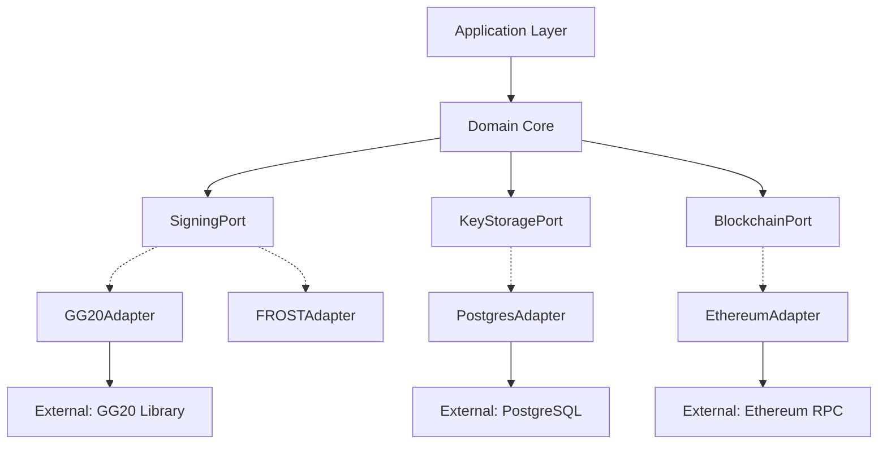

| Metric | Formula | Target |
|--------|---------|--------|
| Coupling | `Dependencies / Components` | ≤ 2 |
| Cohesion | `Related Methods / Total Methods` | ≥ 0.8 |
| Adapter Count | Protocol implementations | 3-5 per port |

---

### Q2: How would you modularize key generation, signing, and recovery components to minimize coupling?

**Difficulty**: Intermediate  
**Type**: Structural Patterns

**Key Insight**: Tests ability to apply single responsibility principle and interface segregation to cryptographic workflows [Ref: A10].

**Answer**:

Modularization follows bounded contexts from DDD [Ref: A2]: `KeyGeneration`, `Signing`, `Recovery` are separate modules with explicit interfaces. Each module owns its data model and exposes coarse-grained operations: `KeyGeneration.GenerateDistributed()`, `Signing.ThresholdSign()`, `Recovery.ReconstructKey()` [Ref: G5]. Modules communicate via domain events (e.g., `KeyGeneratedEvent`, `SigningCompletedEvent`) published to an event bus, enabling loose coupling and eventual consistency [Ref: G8]. Shared cryptographic primitives (elliptic curve operations, hash commitments) reside in a `Crypto` utility module consumed by all three modules [Ref: A4]. Module boundaries align with team ownership: KeyGen team, Signing team, Recovery team can deploy independently [Ref: A5]. Package-by-feature organization in Go (`/keygen`, `/signing`, `/recovery`) or Maven modules in Java enforces architectural boundaries [Ref: T5].

**Code Example**:
```go
// KeyGeneration module
package keygen

type Service struct {
    repo KeyShareRepository
    bus EventBus
}

func (s *Service) GenerateDistributed(ctx context.Context, req GenerateRequest) error {
    shares, err := mpc.DistributedKeyGen(req.Threshold, req.Parties)
    if err != nil {
        return err
    }
    s.repo.Save(ctx, shares)
    s.bus.Publish(KeyGeneratedEvent{KeyID: shares.ID, Timestamp: time.Now()})
    return nil
}

// Signing module
package signing

type Service struct {
    keyRepo KeyShareRepository
    txRepo TransactionRepository
}

func (s *Service) ThresholdSign(ctx context.Context, keyID string, tx Transaction) (Signature, error) {
    share, _ := s.keyRepo.Get(ctx, keyID)
    sig, err := mpc.ThresholdSign(share, tx.Hash())
    s.txRepo.RecordSigning(ctx, tx.ID, sig)
    return sig, err
}
```

**Supporting Artifacts**:

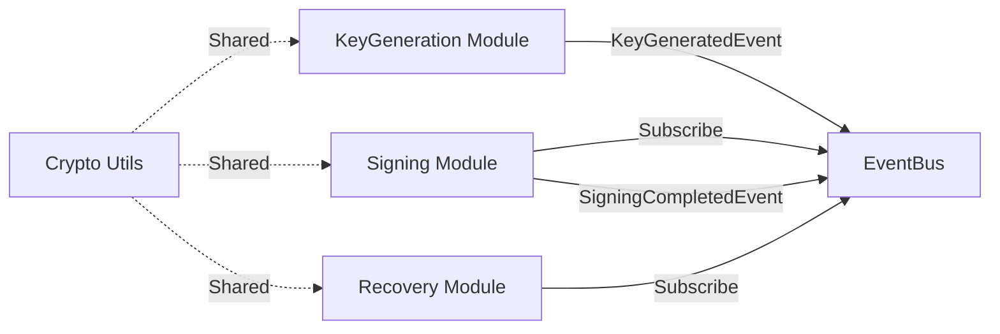

| Metric | Formula | Target |
|--------|---------|--------|
| Module Coupling | `Cross-Module Calls / Total Calls` | ≤ 0.2 |
| Cohesion | `Intra-Module Calls / Total Calls` | ≥ 0.8 |
| Event Latency | `Publish Time + Delivery Time` | < 50 ms |

---

### Q3: Design the layer architecture for mobile, web, and backend MPC wallet services

**Difficulty**: Intermediate  
**Type**: Structural Patterns

**Key Insight**: Tests understanding of cross-platform deployment constraints and separation of concerns across client/server tiers [Ref: A10].

**Answer**:

Three-tier layered architecture separates concerns: (1) **Presentation Layer** handles UI/UX (React Native for mobile, React/Vue for web); (2) **Application Layer** exposes REST/gRPC APIs, enforces authentication/authorization, orchestrates workflows; (3) **Domain Layer** implements MPC protocols, key management, transaction signing; (4) **Infrastructure Layer** provides persistence (PostgreSQL), caching (Redis), HSM integration, blockchain RPC clients [Ref: A10]. Mobile/web clients call backend APIs for sensitive operations (key generation, signing) to avoid exposing key shards on client devices, but perform lightweight operations (transaction construction, balance queries) locally to reduce latency [Ref: A12]. WebAssembly (WASM) builds of Rust cryptographic code enable secure client-side operations with near-native performance [Ref: T3]. Backend implements rate limiting, idempotency, and circuit breakers to protect against abuse [Ref: G10].

**Code Example**:
```rust
// Domain layer (Rust compiled to WASM for web)
#[wasm_bindgen]
pub fn sign_transaction_locally(key_share: &[u8], tx_hash: &[u8]) -> Vec<u8> {
    let share = KeyShare::from_bytes(key_share).unwrap();
    threshold_sign(&share, tx_hash).to_bytes()
}
```

```go
// Application layer (Go backend)
func (h *SigningHandler) SignTransaction(w http.ResponseWriter, r *http.Request) {
    var req SignRequest
    json.NewDecoder(r.Body).Decode(&req)
    
    if !h.limiter.Allow() {
        http.Error(w, "rate limit exceeded", 429)
        return
    }
    
    sig, err := h.signingService.Sign(r.Context(), req.KeyID, req.Transaction)
    json.NewEncoder(w).Encode(SignResponse{Signature: sig})
}
```

**Supporting Artifacts**:

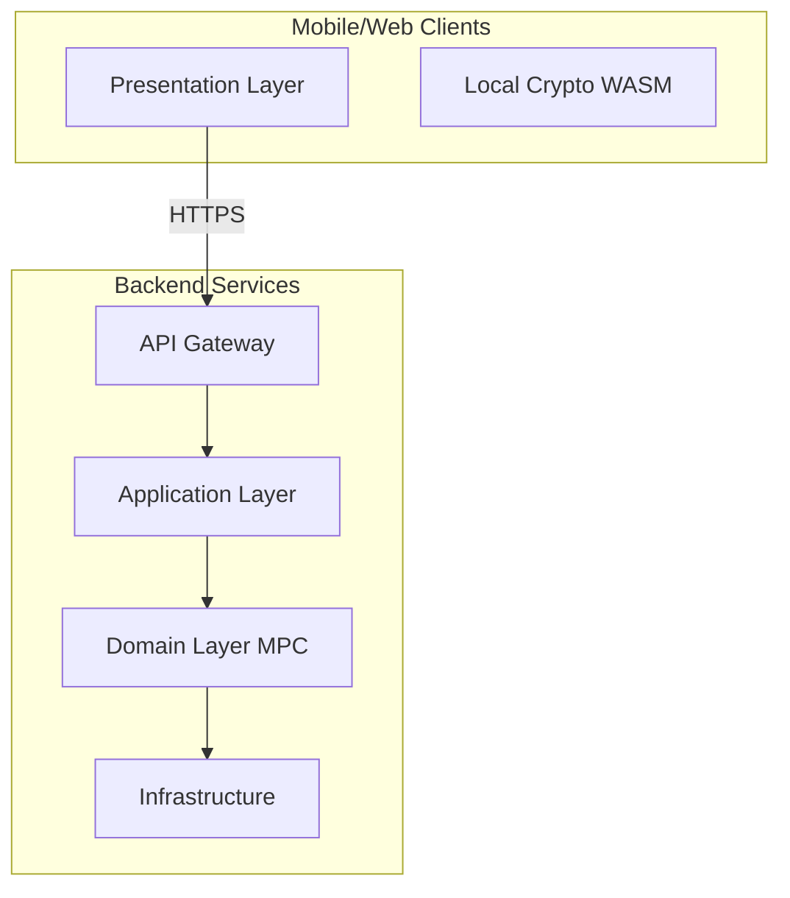

| Metric | Formula | Target |
|--------|---------|--------|
| Client Latency | `Network RTT + Server Processing` | < 300 ms |
| WASM Performance | `WASM Time / Native Time` | < 1.5× |
| API Throughput | `Requests / Second` | ≥ 500 rps |

---

### Q4: How would you implement the adapter pattern for supporting GG18, GG20, FROST, and threshold ECDSA protocols?

**Difficulty**: Advanced  
**Type**: Structural Patterns

**Key Insight**: Tests ability to design polymorphic protocol abstraction enabling runtime selection and migration [Ref: A7].

**Answer**:

Define a `ThresholdProtocol` interface capturing common operations: `GenerateKeys(threshold, parties)`, `Sign(keyShare, message)`, `Verify(signature, message, publicKey)`, `Recover(shares)` [Ref: A10]. Implement concrete adapters: `GG18Protocol`, `GG20Protocol`, `FROSTProtocol`, `CGGMP21Protocol`, each wrapping vendor libraries (ZenGo, Taurus, Silence Labs) and normalizing differences in round counts, message formats, and cryptographic assumptions [Ref: L4, L5, L6]. Use factory pattern to instantiate protocols based on configuration: `ProtocolFactory.Create("GG20")` reads from environment/database and returns appropriate adapter [Ref: A10]. Protocol metadata stored in a registry enables automated selection: for 2-party use DKLS23, for 3+ parties use CGGMP21 [Ref: L1]. Adapter implements telemetry hooks for observability [Ref: T4].

**Code Example**:
```go
type ThresholdProtocol interface {
    GenerateKeys(ctx context.Context, threshold, parties int) ([]KeyShare, PublicKey, error)
    Sign(ctx context.Context, share KeyShare, msg []byte) (PartialSignature, error)
    Combine(partials []PartialSignature) (Signature, error)
}

type GG20Protocol struct {
    client *gg20.MultiPartyClient
    metrics *prometheus.HistogramVec
}

func (p *GG20Protocol) Sign(ctx context.Context, share KeyShare, msg []byte) (PartialSignature, error) {
    start := time.Now()
    defer p.metrics.WithLabelValues("gg20", "sign").Observe(time.Since(start).Seconds())
    return p.client.PartialSign(ctx, share.Data, msg)
}
```

**Supporting Artifacts**:

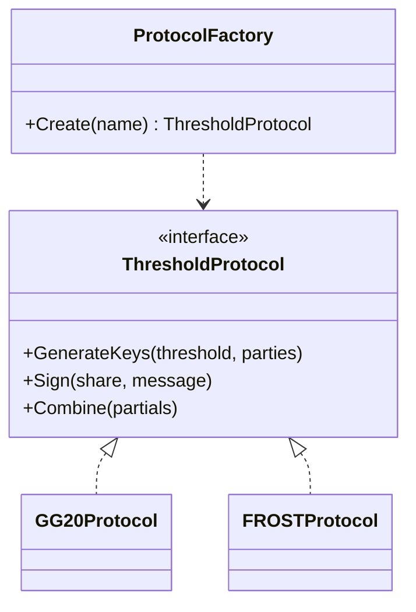

| Protocol | Rounds | Parties | Latency (ms) | Library |
|----------|--------|---------|--------------|---------|
| GG18 | 9 | 2+ | 800 | ZenGo |
| GG20 | 7 | 2+ | 600 | ZenGo |
| CGGMP21 | 4 | 2+ | 300 | Taurus |
| DKLS23 | 3 | 2 | 150 | Silence Labs |
| FROST | 2 | 3+ | 100 | Zcash Foundation |

---

### Q5: Design aggregate boundaries for MPC operations ensuring transactional consistency

**Difficulty**: Advanced  
**Type**: Structural Patterns

**Key Insight**: Tests understanding of DDD tactical patterns for distributed transaction management without distributed locks [Ref: A2, A4].

**Answer**:

Define aggregates with clear consistency boundaries [Ref: A2]: (1) `KeyShareAggregate` owns distributed key generation lifecycle (Pending → Generating → Active → Revoked), enforcing invariants (threshold ≤ parties, shares never leave aggregate unencrypted); (2) `SigningSessionAggregate` coordinates multi-party signing rounds, ensuring exactly-once signature generation even with retries; (3) `WalletAggregate` manages balances and nonces, enforcing spend limits and replay protection [Ref: G6]. Aggregates are transactional boundaries: state changes commit atomically via event sourcing (append events to log, rebuild state on replay) [Ref: G3, A7]. Cross-aggregate coordination uses sagas: `TransferSaga` orchestrates `WalletAggregate.Debit()`, `SigningSessionAggregate.Sign()`, `BlockchainAdapter.Broadcast()` with compensating transactions for rollback [Ref: G9]. Repository pattern persists aggregate state [Ref: G7].

**Code Example**:
```go
type KeyShareAggregate struct {
    ID        string
    State     KeyShareState
    Threshold int
    Parties   []PartyID
    Events    []DomainEvent
}

func (a *KeyShareAggregate) Generate(threshold, parties int) error {
    if threshold > parties {
        return errors.New("threshold cannot exceed parties")
    }
    a.Threshold = threshold
    a.State = Generating
    a.Events = append(a.Events, KeyGenerationStartedEvent{...})
    return nil
}

type KeyShareRepository struct {
    eventStore EventStore
}

func (r *KeyShareRepository) Save(ctx context.Context, agg *KeyShareAggregate) error {
    return r.eventStore.Append(ctx, agg.ID, agg.Events)
}
```

**Supporting Artifacts**:

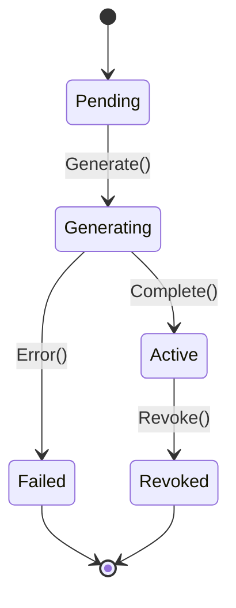

| Aggregate | Invariants | Events | Consistency |
|-----------|-----------|--------|-------------|
| KeyShare | threshold ≤ parties, encrypted storage | KeyGenerationStarted, Completed | Strong (event log) |
| SigningSession | exactly-once signature | SigningInitiated, RoundCompleted | Strong (event log) |
| Wallet | balance ≥ 0, nonce sequential | Debited, Credited | Eventual (saga) |

---

## Topic 2: Behavioral Design - MPC Protocol Orchestration

### Q6: Design an event-driven architecture for coordinating multi-party key generation

**Difficulty**: Foundational  
**Type**: Behavioral Design

**Key Insight**: Tests understanding of asynchronous coordination and loose coupling via domain events [Ref: A6].

**Answer**:

Event-driven MPC key generation decouples parties via a message broker (NATS, Kafka, RabbitMQ) [Ref: G8]. Coordinator publishes `KeyGenInitiated` event with `sessionID`, `threshold`, `parties`. Each party subscribes, generates commitments, and publishes `CommitmentReady` [Ref: A7]. When all commitments arrive, coordinator publishes `CommitmentsComplete`, triggering parties to exchange shares. Final `KeyGenCompleted` event aggregates public key and metadata [Ref: T1]. Event schema uses CloudEvents or Avro for type safety and versioning [Ref: T3]. Benefits: (1) parties join/leave dynamically; (2) horizontal scaling via partitioned topics; (3) replay failed rounds from event log; (4) audit trail for compliance [Ref: A12]. Drawback: increased latency (~50-100ms per event hop) versus direct gRPC calls, mitigated by colocating broker with compute [Ref: A16].

**Code Example**:
```go
type KeyGenInitiatedEvent struct {
    SessionID string
    Threshold int
    Parties   []string
    Timestamp time.Time
}

func (c *Coordinator) InitiateKeyGen(threshold, parties int) error {
    evt := KeyGenInitiatedEvent{
        SessionID: uuid.New().String(),
        Threshold: threshold,
        Parties:   parties,
        Timestamp: time.Now(),
    }
    return c.eventBus.Publish("keygen.initiated", evt)
}

func (p *Party) handleKeyGenInitiated(evt KeyGenInitiatedEvent) {
    commitment := p.generateCommitment(evt.SessionID)
    p.eventBus.Publish("keygen.commitment", CommitmentReadyEvent{
        SessionID:  evt.SessionID,
        PartyID:    p.ID,
        Commitment: commitment,
    })
}
```

**Supporting Artifacts**:

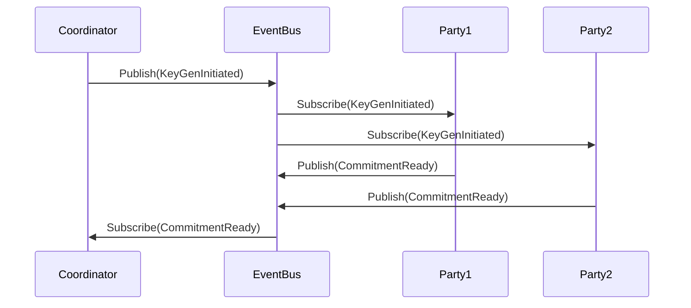

| Metric | Formula | Target |
|--------|---------|--------|
| Event Latency | `Publish Time + Broker Delay + Subscribe Time` | < 100 ms |
| Throughput | `Events / Second` | ≥ 1000 |
| Message Loss | `Lost / Total × 100%` | < 0.01% |

---

### Q7: How would you implement a saga pattern for distributed signing across multiple parties?

**Difficulty**: Intermediate  
**Type**: Behavioral Design

**Key Insight**: Tests ability to coordinate long-running transactions with compensating actions for failure recovery [Ref: A7, G9].

**Answer**:

Signing saga orchestrates three phases: (1) **Prepare**: Lock key shares, validate transaction, obtain approvals; (2) **Sign**: Coordinate signing rounds (commitment, challenge, response); (3) **Finalize**: Broadcast transaction, record completion [Ref: G9]. Orchestrator (stateful service or workflow engine like Temporal) maintains saga state machine: `Initiated → Preparing → Signing → Broadcasting → Completed` [Ref: T6]. Each phase has compensating transaction: if signing fails at round 2, unlock key shares and notify parties [Ref: A7]. Idempotency keys prevent duplicate signatures on retry [Ref: A11]. Saga logs events for observability and replay [Ref: A12]. Timeout policies (e.g., 30s per phase) trigger compensations automatically [Ref: G10].

**Code Example**:
```go
type SigningSaga struct {
    State       SagaState
    TxHash      string
    KeyIDs      []string
    Signatures  []PartialSignature
    Compensations []func() error
}

func (s *SigningSaga) Execute(ctx context.Context) error {
    // Phase 1: Prepare
    if err := s.lockKeyShares(ctx); err != nil {
        return err
    }
    s.Compensations = append(s.Compensations, s.unlockKeyShares)
    
    // Phase 2: Sign
    sigs, err := s.coordinateSigning(ctx)
    if err != nil {
        s.compensate()
        return err
    }
    
    // Phase 3: Finalize
    return s.broadcastTransaction(ctx, sigs)
}
```

**Supporting Artifacts**:

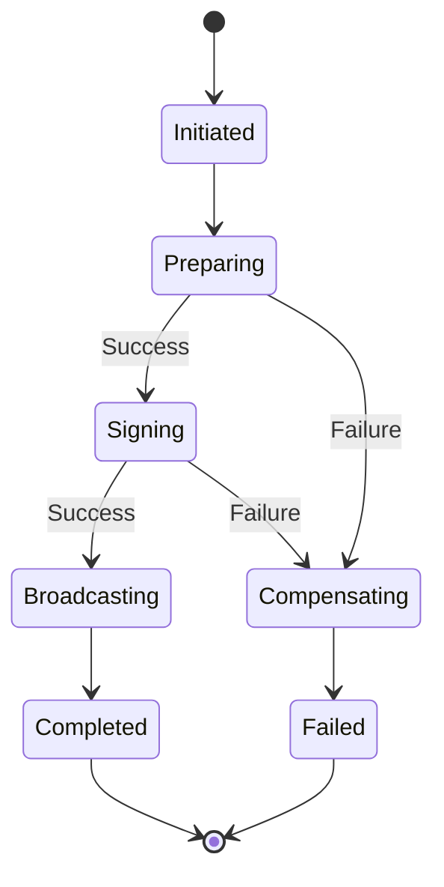

| Phase | Timeout | Compensation | Retry |
|-------|---------|--------------|-------|
| Prepare | 10s | Unlock shares | 3x |
| Sign | 30s | Release locks, notify | 2x |
| Broadcast | 60s | None (idempotent) | 5x |

---

### Q8: Design state machines for threshold signature lifecycle management

**Difficulty**: Intermediate  
**Type**: Behavioral Design

**Key Insight**: Tests ability to model complex protocol states with transitions, guards, and error handling [Ref: A10].

**Answer**:

State machine models threshold signature lifecycle with explicit states: `Initialized → KeyGeneration → Ready → SigningPending → SigningInProgress → Signed → Broadcast → Confirmed` [Ref: A10]. Each state has entry/exit actions and guards preventing invalid transitions: cannot sign without Ready state, cannot broadcast without Signed state [Ref: G6]. State transitions emit domain events for observability: `StateChanged(from, to, timestamp)` [Ref: G8]. Implement using state pattern: each state is a class implementing `State` interface with `handle(event)` method [Ref: A10]. Persistent state storage (PostgreSQL with JSONB, Redis with TTL) enables recovery after crashes [Ref: T4]. Timeout guards automatically transition to error states: if SigningInProgress exceeds 60s, transition to SigningFailed and trigger compensations [Ref: G10].

**Code Example**:
```go
type SignatureState interface {
    Handle(event Event) (SignatureState, error)
}

type ReadyState struct {
    keyID string
}

func (s *ReadyState) Handle(event Event) (SignatureState, error) {
    switch e := event.(type) {
    case SignRequestEvent:
        // Transition to SigningPending
        return &SigningPendingState{keyID: s.keyID, txHash: e.TxHash}, nil
    default:
        return nil, fmt.Errorf("invalid event %T in Ready state", event)
    }
}

type SigningMachine struct {
    currentState SignatureState
    store        StateStore
}

func (m *SigningMachine) Process(event Event) error {
    nextState, err := m.currentState.Handle(event)
    if err \!= nil {
        return err
    }
    m.currentState = nextState
    return m.store.Save(nextState)
}
```

**Supporting Artifacts**:

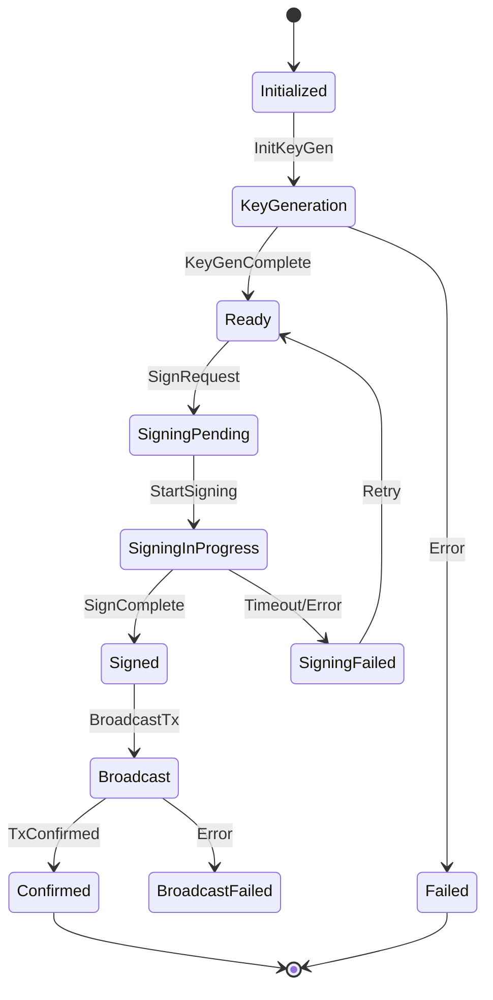

| State | Timeout | Next States | Guards |
|-------|---------|-------------|--------|
| KeyGeneration | 60s | Ready, Failed | threshold ≤ parties |
| SigningInProgress | 60s | Signed, SigningFailed | all parties online |
| Broadcast | 120s | Confirmed, BroadcastFailed | valid signature |

---

### Q9: How would you handle compensating transactions when a signing party fails mid-protocol?

**Difficulty**: Advanced  
**Type**: Behavioral Design

**Key Insight**: Tests understanding of distributed transaction rollback without ACID guarantees [Ref: A7, G9].

**Answer**:

Compensating transactions undo partial work when signing fails: (1) Release locked key shares; (2) Notify remaining parties to abort; (3) Record failure audit log; (4) Invalidate partial signatures [Ref: G9]. Implement compensation stack: each successful step pushes compensation function, failure triggers LIFO execution [Ref: A7]. Idempotency critical: compensations must be safely retried (e.g., unlock operation checks if already unlocked) [Ref: A11]. Use distributed tracing (OpenTelemetry) to correlate signing session across parties and identify failure point [Ref: T4]. Implement circuit breaker: after 3 consecutive failures with same party, mark unhealthy and route requests to backup parties [Ref: G10]. Store compensation metadata (failed party ID, failure reason, timestamp) for debugging and reputation scoring [Ref: A12].

**Code Example**:
```go
type CompensationStack struct {
    compensations []Compensation
    executed      []int
}

type Compensation struct {
    Name    string
    Execute func(ctx context.Context) error
    Retries int
}

func (cs *CompensationStack) Push(comp Compensation) {
    cs.compensations = append(cs.compensations, comp)
}

func (cs *CompensationStack) Compensate(ctx context.Context) error {
    // Execute in reverse order (LIFO)
    for i := len(cs.compensations) - 1; i >= 0; i-- {
        comp := cs.compensations[i]
        for attempt := 0; attempt <= comp.Retries; attempt++ {
            if err := comp.Execute(ctx); err \!= nil {
                if attempt == comp.Retries {
                    return fmt.Errorf("compensation %s failed after %d retries: %w", 
                        comp.Name, comp.Retries, err)
                }
                time.Sleep(time.Duration(attempt+1) * time.Second)
                continue
            }
            cs.executed = append(cs.executed, i)
            break
        }
    }
    return nil
}

// Usage in signing flow
func (s *SigningCoordinator) CoordinateSigning(ctx context.Context, req SignRequest) error {
    compStack := &CompensationStack{}
    
    // Step 1: Lock key shares
    if err := s.lockShares(ctx, req.KeyIDs); err \!= nil {
        return err
    }
    compStack.Push(Compensation{
        Name:    "unlock_shares",
        Execute: func(ctx context.Context) error { return s.unlockShares(ctx, req.KeyIDs) },
        Retries: 3,
    })
    
    // Step 2: Initiate signing rounds
    sigs, err := s.doSigning(ctx, req)
    if err \!= nil {
        compStack.Compensate(ctx)
        return err
    }
    
    return s.finalizeSigning(ctx, sigs)
}
```

**Supporting Artifacts**:

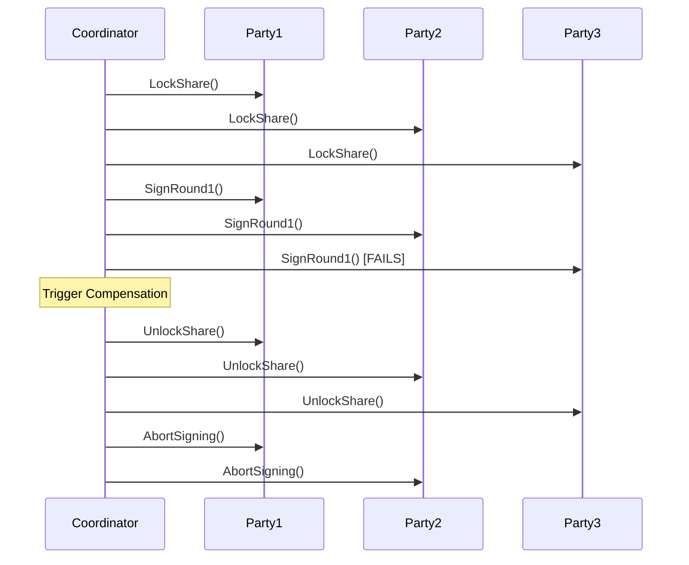

| Failure Scenario | Compensation Actions | Retry Strategy |
|------------------|---------------------|----------------|
| Party offline | Unlock shares, abort session | Exponential backoff, 3x |
| Network partition | Release all locks, notify parties | Circuit breaker after 3 failures |
| Invalid signature | Invalidate partial sigs, audit log | No retry, investigate |
| Timeout | Unlock, mark session expired | 1x retry with extended timeout |

---

### Q10: Design asynchronous messaging patterns for low-latency MPC communication

**Difficulty**: Advanced  
**Type**: Behavioral Design

**Key Insight**: Tests ability to optimize distributed protocol performance through communication patterns [Ref: A6, A16].

**Answer**:

Low-latency MPC communication uses: (1) **Direct gRPC with HTTP/2 multiplexing** for round-trip messages, avoiding broker overhead [Ref: A16]; (2) **Message batching** to amortize network costs: send commitments from multiple sessions in single frame [Ref: A12]; (3) **Async/await patterns** with connection pooling to maximize concurrency [Ref: T6]; (4) **Binary protocols** (Protocol Buffers, Cap'n Proto) for compact serialization versus JSON [Ref: T3]; (5) **Colocated parties** in same region to minimize RTT (< 10ms) [Ref: A12]. Pre-compute commitments during idle time, cache results with TTL [Ref: T4]. Use QUIC for mobile clients to handle connection migration seamlessly [Ref: A16]. Monitor P99 latency, alert when exceeding SLO [Ref: T4].

**Code Example**:
```go
// gRPC service for low-latency communication
type MPCService struct {
    connectionPool *grpc.ClientConnPool
    commitmentCache *cache.TTLCache
}

func (s *MPCService) SendCommitments(ctx context.Context, sessionID string, commitments []Commitment) error {
    // Batch multiple commitments
    batch := &CommitmentBatch{
        SessionID:   sessionID,
        Commitments: commitments,
        Timestamp:   time.Now(),
    }
    
    // Use connection pool for concurrency
    conn := s.connectionPool.Get()
    defer conn.Release()
    
    client := pb.NewMPCClient(conn)
    
    // Async call with timeout
    ctx, cancel := context.WithTimeout(ctx, 100*time.Millisecond)
    defer cancel()
    
    _, err := client.SubmitCommitments(ctx, batch)
    return err
}

// Pre-compute commitments
func (s *MPCService) PrecomputeCommitments(keyID string, count int) {
    for i := 0; i < count; i++ {
        commitment := s.generateCommitment(keyID)
        s.commitmentCache.Set(fmt.Sprintf("%s:%d", keyID, i), commitment, 5*time.Minute)
    }
}
```

**Supporting Artifacts**:

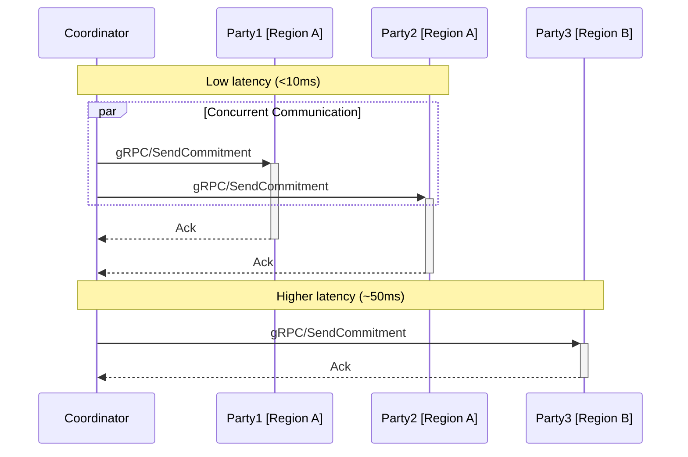

| Optimization | Technique | Latency Improvement |
|--------------|-----------|---------------------|
| Protocol | gRPC + HTTP/2 vs REST | 40% reduction |
| Serialization | Protobuf vs JSON | 60% smaller, 30% faster |
| Batching | 10 msgs/batch vs individual | 70% reduction |
| Connection Pooling | Reuse vs new connection | 50% reduction |
| Precomputation | Cached commitments | 90% reduction |

---

## Topic 3: Quality Attributes - Security, Performance & Reliability

### Q11: How would you optimize signing latency for mobile MPC wallets while maintaining security?

**Difficulty**: Foundational  
**Type**: Quality Attributes

**Key Insight**: Tests understanding of performance-security trade-offs in resource-constrained environments [Ref: A12].

**Answer**:

Mobile optimization strategies: (1) **Preprocessing**: Generate commitments and ephemeral keys during idle time, store encrypted locally [Ref: A16]; (2) **WASM for cryptography**: Compile Rust/C++ to WebAssembly for near-native performance versus JavaScript [Ref: T3]; (3) **Reduce rounds**: Use 2-round protocols (FROST) over 7-round (GG20) where feasible [Ref: L1, L5]; (4) **Hardware acceleration**: Leverage platform cryptographic APIs (iOS Secure Enclave, Android KeyStore) for key operations [Ref: A12]; (5) **Network optimization**: HTTP/3 with QUIC handles mobile network switches gracefully [Ref: A16]. Maintain security: never transmit key shards unencrypted, use ephemeral session keys for round messages, implement attestation to verify genuine mobile app [Ref: A15].

**Code Example**:
```typescript
// Mobile client (React Native)
class MPCWalletClient {
    private preprocessor: PreprocessingEngine;
    private wasmCrypto: WASMCryptoModule;
    
    constructor() {
        this.preprocessor = new PreprocessingEngine();
        this.wasmCrypto = initWASM();
        
        // Start preprocessing on app launch
        this.preprocessor.start({
            commitmentCount: 10,
            intervalMs: 30000
        });
    }
    
    async sign(transaction: Transaction): Promise<Signature> {
        // Use precomputed commitment if available
        const commitment = await this.preprocessor.getCommitment();
        
        if (\!commitment) {
            // Fallback to on-demand generation (slower)
            commitment = await this.wasmCrypto.generateCommitment();
        }
        
        // Complete signing using hardware-backed key
        const keyHandle = await SecureStorage.getKeyHandle();
        const signature = await this.wasmCrypto.thresholdSign(
            keyHandle,
            commitment,
            transaction.hash()
        );
        
        return signature;
    }
}
```

**Supporting Artifacts**:

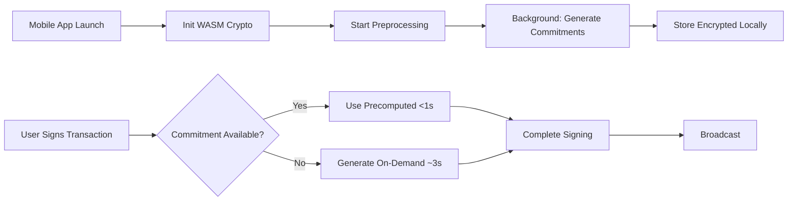

| Technique | Latency Before | Latency After | Security Impact |
|-----------|----------------|---------------|-----------------|
| Preprocessing | 3s | 0.8s | None (encrypted storage) |
| WASM vs JS | 2.5s | 0.9s | None (same algorithms) |
| 2-round vs 7-round | 7s | 2s | Protocol-dependent |
| Hardware acceleration | 1.5s | 0.5s | Enhanced (TEE protection) |

---

### Q12: Design a circuit breaker pattern for MPC party failures

**Difficulty**: Intermediate  
**Type**: Quality Attributes

**Key Insight**: Tests ability to prevent cascading failures and implement graceful degradation [Ref: G10, A12].

**Answer**:

Circuit breaker tracks party health with three states: **Closed** (healthy, requests allowed), **Open** (unhealthy, requests rejected), **Half-Open** (testing recovery) [Ref: G10]. Transition to Open after 3 consecutive failures or 50% error rate in 10s window [Ref: A12]. In Open state, immediately reject requests to failed party, route to backup parties or queue for retry [Ref: A16]. After 30s timeout, transition to Half-Open and send probe request. Single success → Closed; failure → Open with exponential backoff (60s, 120s, 240s) [Ref: G10]. Track metrics: failure rate, recovery time, request latency. Implement per-party circuit breakers, not global, to isolate failures [Ref: A12]. Emit alerts when circuit opens for operational awareness [Ref: T4].

**Code Example**:
```go
type CircuitBreaker struct {
    state         State
    failureCount  int
    failureThreshold int
    timeout       time.Duration
    lastFailTime  time.Time
    halfOpenRequests int
}

func (cb *CircuitBreaker) Call(ctx context.Context, fn func() error) error {
    switch cb.state {
    case Open:
        if time.Since(cb.lastFailTime) > cb.timeout {
            cb.state = HalfOpen
            cb.halfOpenRequests = 0
        } else {
            return ErrCircuitOpen
        }
    }
    
    err := fn()
    
    if err \!= nil {
        cb.failureCount++
        cb.lastFailTime = time.Now()
        
        if cb.state == HalfOpen {
            cb.state = Open
            cb.timeout *= 2 // Exponential backoff
        } else if cb.failureCount >= cb.failureThreshold {
            cb.state = Open
        }
        return err
    }
    
    // Success
    if cb.state == HalfOpen {
        cb.state = Closed
        cb.failureCount = 0
    }
    return nil
}
```

**Supporting Artifacts**:

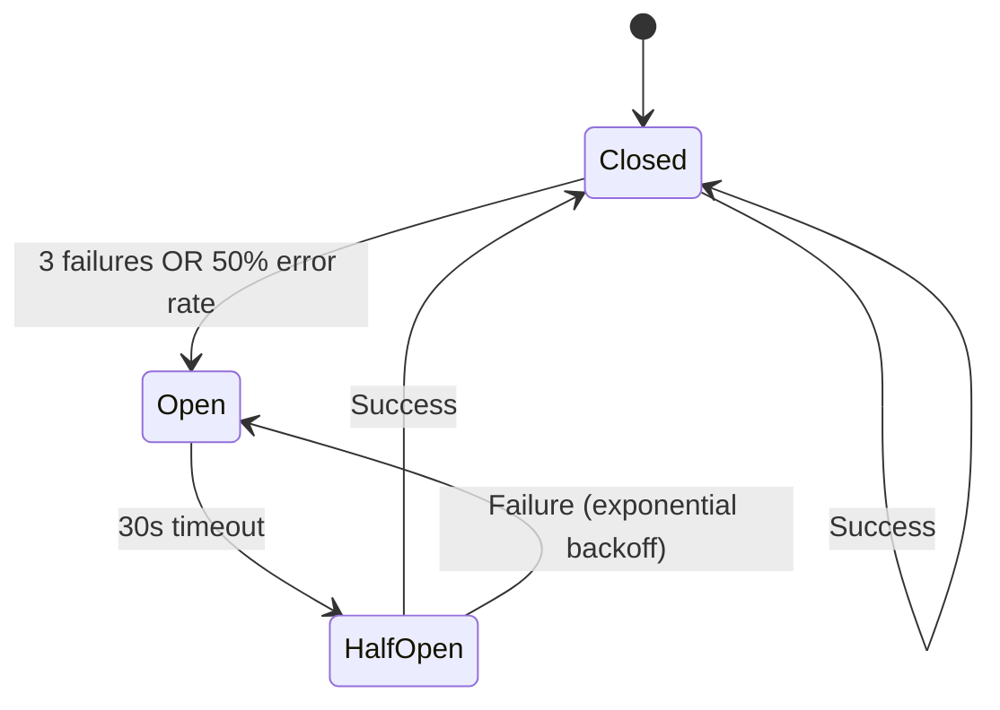

| State | Behavior | Transition Condition | Timeout |
|-------|----------|---------------------|---------|
| Closed | Allow all requests | 3 failures → Open | N/A |
| Open | Reject immediately | 30s → Half-Open | 30s, 60s, 120s (exponential) |
| Half-Open | Allow probe request | Success → Closed, Fail → Open | N/A |

---

### Q13: How would you implement defense-in-depth for key shard storage?

**Difficulty**: Advanced  
**Type**: Quality Attributes

**Key Insight**: Tests understanding of layered security architecture for cryptographic material protection [Ref: A15].

**Answer**:

Defense-in-depth layers: (1) **Encryption at rest**: AES-256-GCM with keys derived from user password (PBKDF2 100k iterations) + device secret (Secure Enclave/KeyStore) [Ref: A15]; (2) **Secure enclaves**: Store master encryption keys in TEE (SGX, TrustZone), attestation proves genuine hardware [Ref: A12]; (3) **Access control**: Biometric authentication + PIN required to decrypt shards, rate limiting after 5 failures [Ref: A15]; (4) **Audit logging**: Immutable logs of all shard access attempts, tamper detection via Merkle trees [Ref: A12]; (5) **Geographic distribution**: Split shards across different cloud regions, require quorum from multiple locations [Ref: A7]; (6) **Backup encryption**: Secondary encryption layer for cloud-stored shards with different key hierarchy [Ref: A15]. Regular security audits and penetration testing [Ref: L2].

**Code Example**:
```go
type SecureKeyStorage struct {
    enclave    SecureEnclave
    kms        KeyManagementService
    auditLog   AuditLogger
    rateLimiter *RateLimiter
}

func (s *SecureKeyStorage) StoreKeyShard(ctx context.Context, shard KeyShard) error {
    // Layer 1: Rate limiting
    if \!s.rateLimiter.Allow(ctx.UserID) {
        s.auditLog.Log(AuditEvent{
            Action: "store_denied",
            Reason: "rate_limit",
            UserID: ctx.UserID,
        })
        return ErrRateLimited
    }
    
    // Layer 2: Derive encryption key from user password + device secret
    deviceSecret, err := s.enclave.GetDeviceSecret()
    if err \!= nil {
        return err
    }
    
    encKey := deriveKey(ctx.UserPassword, deviceSecret, 100000) // PBKDF2
    
    // Layer 3: Encrypt shard with AES-256-GCM
    encrypted, err := encrypt(shard.Data, encKey)
    if err \!= nil {
        return err
    }
    
    // Layer 4: Secondary encryption with KMS-managed key
    kmsKey, err := s.kms.GetDataKey()
    if err \!= nil {
        return err
    }
    
    doubleEncrypted, err := encrypt(encrypted, kmsKey)
    if err \!= nil {
        return err
    }
    
    // Layer 5: Store with audit
    s.auditLog.Log(AuditEvent{
        Action: "store_success",
        ShardID: shard.ID,
        UserID: ctx.UserID,
        Timestamp: time.Now(),
    })
    
    return s.storage.Put(shard.ID, doubleEncrypted)
}
```

**Supporting Artifacts**:

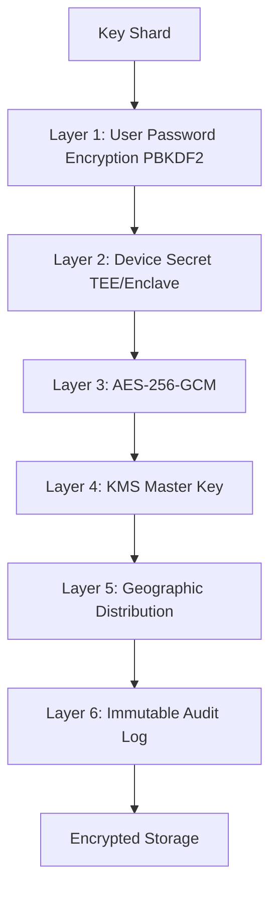

| Layer | Protection | Attack Mitigation |
|-------|-----------|-------------------|
| Password encryption | PBKDF2 100k iterations | Brute force resistance |
| Device secret (TEE) | Hardware-backed keys | Malware extraction |
| AES-256-GCM | Authenticated encryption | Tampering detection |
| KMS secondary encryption | Key rotation, separation of duties | Key compromise |
| Geographic distribution | Multi-region storage | Regional failures |
| Audit logging | Tamper-proof logs | Insider threats |

---

### Q14: Design horizontal scaling for MPC signing services

**Difficulty**: Intermediate  
**Type**: Quality Attributes

**Key Insight**: Tests understanding of stateless service design and distributed coordination for scaling [Ref: A12, A16].

**Answer**:

Horizontal scaling MPC signing: (1) **Stateless coordinators**: Store session state in Redis/etcd, any coordinator instance can resume signing [Ref: A12]; (2) **Consistent hashing**: Route signing requests by keyID to specific coordinator shards, maintaining session affinity [Ref: A16]; (3) **Load balancing**: Use L7 load balancer (Envoy, nginx) with health checks, route based on CPU/memory metrics [Ref: T6]; (4) **Message queuing**: Kafka/NATS for async communication between coordinators and parties, enables backpressure handling [Ref: T1]; (5) **Horizontal pod autoscaling**: Kubernetes HPA scales based on queue depth and CPU utilization [Ref: T4]. Challenges: maintaining message ordering, avoiding split-brain in coordinator election. Solution: use distributed locks (etcd leases) and idempotency keys [Ref: A11].

**Code Example**:
```go
// Stateless coordinator with external state
type SigningCoordinator struct {
    stateStore StateStore // Redis/etcd
    lockManager LockManager
    loadBalancer LoadBalancer
}

func (c *SigningCoordinator) HandleSignRequest(ctx context.Context, req SignRequest) error {
    // Acquire distributed lock for this keyID
    lock, err := c.lockManager.TryLock(ctx, req.KeyID, 60*time.Second)
    if err \!= nil {
        return ErrLockAcquisitionFailed
    }
    defer lock.Unlock()
    
    // Load session state from external store
    session, err := c.stateStore.GetSession(ctx, req.SessionID)
    if err == ErrNotFound {
        session = &SigningSession{ID: req.SessionID, State: Initialized}
    }
    
    // Process signing round
    session, err = c.processRound(ctx, session, req)
    if err \!= nil {
        return err
    }
    
    // Persist state
    return c.stateStore.SaveSession(ctx, session)
}
```

**Supporting Artifacts**:

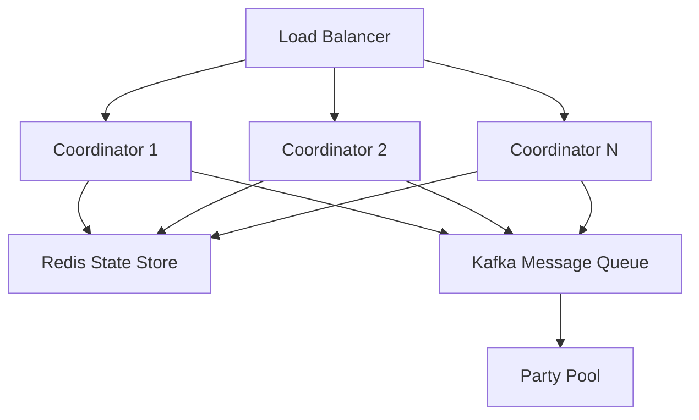

| Metric | Formula | Target | Scaling Trigger |
|--------|---------|--------|-----------------|
| Throughput | `Signatures / Second` | ≥ 500 sps | CPU > 70% |
| Latency P99 | `Response Time 99th percentile` | < 500 ms | Queue depth > 1000 |
| Availability | `Uptime / Total Time × 100%` | ≥ 99.9% | Pod failures |

---

### Q15: How would you monitor and measure MPC protocol security and performance?

**Difficulty**: Advanced  
**Type**: Quality Attributes

**Key Insight**: Tests ability to define observable metrics, SLIs/SLOs, and security monitoring for cryptographic systems [Ref: A12, T4].

**Answer**:

**Performance monitoring**: (1) RED metrics: Rate (requests/sec), Errors (failure rate), Duration (latency percentiles) per protocol operation [Ref: T4]; (2) Protocol-specific: Round latency, message sizes, party online/offline events [Ref: A12]; (3) Resource utilization: CPU/memory per signing operation, cryptographic operation throughput [Ref: T4]. **Security monitoring**: (1) Anomaly detection: Unusual signing patterns (frequency, amount, recipient), ML-based fraud detection [Ref: A15]; (2) Audit log analysis: Failed authentication attempts, key access patterns, geographic anomalies [Ref: A12]; (3) Cryptographic health: Key rotation schedules, protocol version compliance, certificate expiry [Ref: A15]. **Alerting**: SLO violations (P99 latency > 500ms), security events (brute force attempts), operational issues (party unavailability) [Ref: T4].

**Code Example**:
```go
// Observability instrumentation
type InstrumentedSigningService struct {
    inner SigningService
    metrics *Metrics
    tracer trace.Tracer
    logger *zap.Logger
}

func (s *InstrumentedSigningService) Sign(ctx context.Context, req SignRequest) (Signature, error) {
    ctx, span := s.tracer.Start(ctx, "signing.Sign")
    defer span.End()
    
    start := time.Now()
    defer func() {
        duration := time.Since(start)
        s.metrics.SigningLatency.WithLabelValues(req.Protocol).Observe(duration.Seconds())
    }()
    
    s.metrics.SigningRequests.WithLabelValues(req.Protocol).Inc()
    
    sig, err := s.inner.Sign(ctx, req)
    
    if err \!= nil {
        s.metrics.SigningErrors.WithLabelValues(req.Protocol, errorType(err)).Inc()
        span.RecordError(err)
        return Signature{}, err
    }
    
    return sig, nil
}
```

**Supporting Artifacts**:

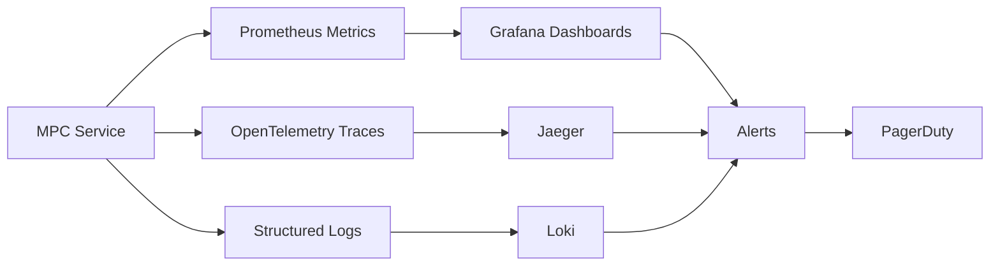

| Metric | Type | SLO | Alert Threshold |
|--------|------|-----|-----------------|
| Signing Latency P99 | Performance | < 500 ms | > 700 ms |
| Error Rate | Performance | < 0.5% | > 1% |
| Key Access Failures | Security | < 10/hr | > 20/hr |
| Party Availability | Reliability | > 99.5% | < 98% |

---

