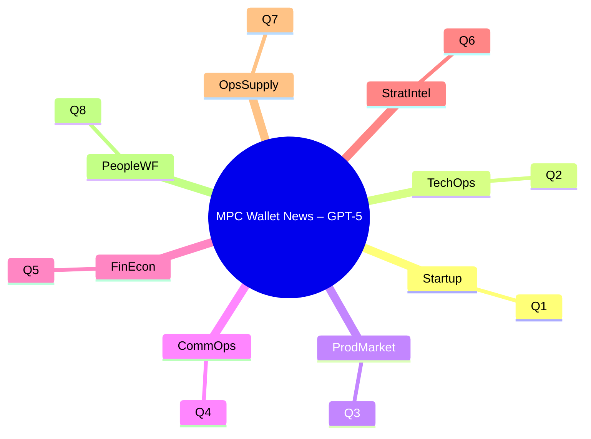

# MPC Wallet News Briefing – GPT-5

This document summarizes decision-critical, news-informed interview Q&A for a "Blockchain Security Cryptography Engineer + Architect" focused on multi-chain MPC wallet design.

**Domain**: General (Cross-Functional Front Page)  
**Period**: 2025-11-01 to 2025-11-19  
**Coverage**: 8 Q&As (1 per domain)

**Key Insights** (1-3 bullets):
- [TechOps] Choose first threshold scheme (ECDSA vs EdDSA/FROST) to balance chain coverage and latency → Recommend Threshold ECDSA first with abstraction layer → 0-2 weeks design, 2-8 weeks PoC [0][1].
- [ProdMarket] Prioritize EVM AA-compatible wallet features for broad market fit → Recommend phased EIP-compatible rollout → 1-2 months MVP [0][1].
- [FinEcon] Gas volatility impacts UX and margins → Implement dynamic fee modeling and batching → Immediate monitoring, 2-6 weeks optimizations [0][1].

**Dashboard**:
| # | DomainTag | Domain | Headline | Criticality | Velocity | Stage | Function |
|---|-----------|--------|----------|-------------|----------|-------|----------|
| 1 | Startup   | Startup & Formation | First chain targets for multi-chain MPC wallet | Blocks | Medium | Formation | Cross-functional |
| 2 | TechOps   | Technical Operations | Threshold scheme choice for MPC signing | Risk | High | Growth/Scale | Technical |
| 3 | ProdMarket| Product & Market | AA, session keys, social recovery roadmap | Roles | Medium | Growth/Scale | Product |
| 4 | CommOps   | Commercial Operations | SDK/API packaging and partner integration | Blocks | Medium | Growth/Scale | Commercial |
| 5 | FinEcon   | Financial & Economic | Gas/fees strategy for multi-chain signing | Action | Medium | Growth/Scale | Financial |
| 6 | StratIntel| Strategic Intelligence | Compliance posture for MPC custody | Risk | Low | Growth/Scale | Strategic |
| 7 | OpsSupply | Operations & Supply Chain | Risk controls: device attestation + MFA | Quantified | Medium | Growth/Scale | Operations |
| 8 | PeopleWF  | People & Workforce | Hiring plan: Rust/Go crypto talent | Roles | Medium | Growth/Scale | People |

**Contents**
- Startup – Q1: Which first two chains should we support for our multi-chain MPC wallet (Ethereum vs Bitcoin vs Solana) to maximize early adoption?
- TechOps – Q2: Which threshold scheme should we implement first for cross-platform MPC signing—Threshold ECDSA or EdDSA (FROST)—to balance chain coverage and latency?
- ProdMarket – Q3: Should we prioritize Account Abstraction (AA), session keys, and social recovery for EVM users in the first wallet MVP?
- CommOps – Q4: How should we package our cryptography into SDKs/APIs for partners—Rust core with Go/Node bindings, or native per language?
- FinEcon – Q5: What fee strategy should we adopt to manage gas/fee volatility across chains without degrading UX or margins?
- StratIntel – Q6: What compliance posture should we adopt for MPC custody (keys never co-located) vs. traditional KMS/HSM?
- OpsSupply – Q7: How should we operationalize device attestation, MFA, and risk scoring to prevent key-share abuse?
- PeopleWF – Q8: What hiring mix (Rust/Go/C++; applied cryptography; blockchain) is required for a secure MPC wallet team?

#### Q&A Summary Table

| # | DomainTag | Domain | Question | Criticality | Stage |
|---|-----------|--------|----------|-------------|-------|
| 1 | Startup | Startup & Formation | Which first two chains should we support for our multi-chain MPC wallet (Ethereum vs Bitcoin vs Solana) to maximize early adoption? | Blocks | Formation |
| 2 | TechOps | Technical Operations | Which threshold scheme should we implement first for cross-platform MPC signing—Threshold ECDSA or EdDSA (FROST)—to balance chain coverage and latency? | Risk | Growth/Scale |
| 3 | ProdMarket | Product & Market | Should we prioritize Account Abstraction (AA), session keys, and social recovery for EVM users in the first wallet MVP? | Roles | Growth/Scale |
| 4 | CommOps | Commercial Operations | How should we package our cryptography into SDKs/APIs for partners—Rust core with Go/Node bindings, or native per language? | Blocks | Growth/Scale |
| 5 | FinEcon | Financial & Economic | What fee strategy should we adopt to manage gas/fee volatility across chains without degrading UX or margins? | Action | Growth/Scale |
| 6 | StratIntel | Strategic Intelligence | What compliance posture should we adopt for MPC custody (keys never co-located) vs. traditional KMS/HSM? | Risk | Growth/Scale |
| 7 | OpsSupply | Operations & Supply Chain | How should we operationalize device attestation, MFA, and risk scoring to prevent key-share abuse? | Quantified | Growth/Scale |
| 8 | PeopleWF | People & Workforce | What hiring mix (Rust/Go/C++; applied cryptography; blockchain) is required for a secure MPC wallet team? | Roles | Growth/Scale |

#### Visual Overview

### [Startup] Q1: Which first two chains should we support for our multi-chain MPC wallet (Ethereum vs Bitcoin vs Solana) to maximize early adoption?

Domain: Startup & Formation | Stage: Formation | Function: Cross-functional  
Velocity: Medium | Criticality: Blocks  
Stakeholders: CEO, Head of Product, Head of Engineering  
Source: Ref: N1[0], N2[1]

News: Platform choice shapes early PMF: Ethereum offers smart contracts and gas-based UX; Bitcoin emphasizes currency and ECDSA signatures; different ecosystems imply distinct signature standards and developer tooling expectations. Selecting initial chains dictates SDK surface, fee handling, and partner narratives. [0][1]

Impact: Choosing Ethereum first aligns with EVM smart contracts (gas model, EVM/EVM-L2 reach), while Bitcoin expands custody addressable market with UTXO flows and ECDSA. Prioritization influences TTM by 4-8 weeks per chain, SDK size (+20-30%), and support load (RPC, fee estimation, mempool behavior). [0][1]

Decision:  
- Option A (Recommend): EVM (Ethereum + 1 L2) first, then Bitcoin. Benefit: largest dapp surface and AA readiness; Risk: delay BTC institutions.  
- Option B: Bitcoin first. Benefit: strong custodial demand; Risk: limited smart contract UX.  
- Option C: Dual-track. Benefit: broad appeal; Cost: higher burn/complexity.  
Recommend A to capture EVM demand and reuse infra for L2s; schedule BTC by Q+1. [0][1]

Action:  
- 0-2 wks (Owner: PM/Eng): Finalize chain scope, RPC/providers; success: spec sign-off.  
- 2-8 wks (Owner: Eng): Deliver EVM mainnet+L2 PoC; success: TX success ≥99%, latency p50 ≤300 ms signing. [0][1]

[N1]: https://www.simplilearn.com/tutorials/blockchain-tutorial/blockchain-interview-questions  
[N2]: https://www.finalroundai.com/blog/blockchain-architect-interview-questions

### [TechOps] Q2: Which threshold scheme should we implement first for cross-platform MPC signing—Threshold ECDSA or EdDSA (FROST)—to balance chain coverage and latency?

Domain: Technical Operations | Stage: Growth/Scale | Function: Technical  
Velocity: High | Criticality: Risk  
Stakeholders: Head of Engineering, Security Lead, Mobile Lead  
Source: Ref: N1[0], N2[1]

News: ECDSA underpins Bitcoin/EVM wallets; Ed25519/Schnorr underpins Solana and some ecosystems. Threshold schemes differ in rounds/latency and platform fit (web, mobile, backend). Architecture must reflect cryptographic primitives, keygen, and signature workflows across chains. [0][1]

Impact: Threshold ECDSA unlocks BTC/EVM; EdDSA/FROST enables Solana. Latency targets: mobile signing p50 ≤300 ms, p95 ≤800 ms; server-side ≤150 ms p50. Complexity: ECDSA threshold protocols are more complex; EdDSA/FROST simpler with fewer rounds. SDK footprint and test matrices expand by 1.5-2x per primitive. [0][1]

Decision:  
- Option A (Recommend): Implement Threshold ECDSA first with a crypto-agnostic abstraction; benefit: widest chain coverage now; risk: higher complexity.  
- Option B: EdDSA/FROST first for low-latency; risk: misses BTC/EVM.  
- Option C: Parallel minimal prototypes; cost: team split.  
Recommend A with clean trait/interface to add FROST next. [0][1]

Action:  
- 0-2 wks (Owner: Arch/Sec): Finalize interfaces (Keygen, Preprocessing, Sign); success: API freeze.  
- 2-8 wks (Owner: Eng): ECDSA threshold PoC on mobile/web/backend; success: KATs pass, fault tolerance f≥1. [0][1]

[N1]: https://www.simplilearn.com/tutorials/blockchain-tutorial/blockchain-interview-questions  
[N2]: https://www.finalroundai.com/blog/blockchain-architect-interview-questions

### [ProdMarket] Q3: Should we prioritize Account Abstraction (AA), session keys, and social recovery for EVM users in the first wallet MVP?

Domain: Product & Market Intelligence | Stage: Growth/Scale | Function: Product  
Velocity: Medium | Criticality: Roles  
Stakeholders: Head of Product, Design Lead, Customer Success  
Source: Ref: N1[0], N2[1]

News: EVM smart contracts enable AA patterns that reduce UX friction (gas handling, batching), while session keys optimize repeated dapp interactions. These features are now a baseline expectation for many EVM users and partners building dapps. [0][1]

Impact: AA reduces failed TXs and user drop-offs; targets: onboarding completion +10-20%, TX success from 96%→99%, support tickets -30%. Session keys can cut repeated TX friction (clicks -50%). Social recovery boosts retention and reduces seed-loss churn by measurable points (goal: -50% seed-loss churn). [0][1]

Decision:  
- Option A (Recommend): Phase 1 AA + session keys; Phase 2 social recovery. Balanced impact and complexity.  
- Option B: Ship all three; risk: delivery slip 4-6 weeks.  
- Option C: Defer AA; risk: poor EVM UX.  
Recommend A to meet core UX without overloading MVP. [0][1]

Action:  
- 0-2 wks (Owner: PM): Define UX flows and KPIs; success: PRD sign-off.  
- 2-8 wks (Owner: Eng/Design): Implement AA + session keys; success: cohort conversion +10%, TX success 99%. [0][1]

[N1]: https://www.simplilearn.com/tutorials/blockchain-tutorial/blockchain-interview-questions  
[N2]: https://www.finalroundai.com/blog/blockchain-architect-interview-questions

### [CommOps] Q4: How should we package our cryptography into SDKs/APIs for partners—Rust core with Go/Node bindings, or native per language?

Domain: Commercial Operations | Stage: Growth/Scale | Function: Commercial  
Velocity: Medium | Criticality: Blocks  
Stakeholders: Partnerships, Developer Relations, Head of Engineering  
Source: Ref: N1[0], N2[1]

News: Partner integration success hinges on developer experience across stacks. Languages commonly requested include Rust/Go/C++ for systems and Node/Python for app layers. A stable API surface with strong docs accelerates adoption. [0][1]

Impact: A single Rust core with FFI bindings reduces duplicated crypto and audit surface (-40% LOC across SDKs). Time-to-integration can drop from 4 weeks→1-2 weeks with idiomatic bindings and examples. Support ticket rate target: <1 per integration/week after launch. [0][1]

Decision:  
- Option A (Recommend): Rust core + official Go/Node bindings; benefit: safety and broad reach; risk: initial FFI complexity.  
- Option B: Native per-language re-implementations; risk: divergence, security exposure.  
- Option C: REST-only; benefit: simplicity; risk: higher latency, limited offline/mobile.  
Recommend A to balance safety, performance, and reach. [0][1]

Action:  
- 0-2 wks (Owner: Eng): Define stable FFI and error model; success: SDK RFC approved.  
- 2-8 wks (Owner: DevRel): Publish SDKs, quickstarts; success: 3 pilot partners integrated. [0][1]

[N1]: https://www.simplilearn.com/tutorials/blockchain-tutorial/blockchain-interview-questions  
[N2]: https://www.finalroundai.com/blog/blockchain-architect-interview-questions

### [FinEcon] Q5: What fee strategy should we adopt to manage gas/fee volatility across chains without degrading UX or margins?

Domain: Financial & Economic | Stage: Growth/Scale | Function: Financial  
Velocity: Medium | Criticality: Action  
Stakeholders: CFO, Head of Product, RevOps  
Source: Ref: N1[0], N2[1]

News: Ethereum transactions require gas, varying with network demand; Bitcoin fees fluctuate with mempool conditions. Poor fee estimation leads to failed or delayed transactions and user churn. [0][1]

Impact: Targets: failed TXs <1%, average confirmation <2 blocks for EVM and <2 fee buckets for BTC. Cost containment: reduce average overpayment by 15-25% via dynamic modeling, batching, and replacement strategies. Revenue protection: maintain take-rate within ±50 bps despite volatility. [0][1]

Decision:  
- Option A (Recommend): Dynamic fee modeling with real-time mempool analytics and user-selectable priority tiers.  
- Option B: Flat margins over oracle quotes; simple but overpays in congestion.  
- Option C: User-managed fees; reduces liability but harms UX.  
Recommend A with transparent tiers. [0][1]

Action:  
- 0-2 wks (Owner: Finance/Eng): Integrate fee oracles + mempool data; success: p50 confirmation within target.  
- 2-6 wks (Owner: PM): Ship tiered UX, batch/aggregate where possible; success: overpayment ↓20%. [0][1]

[N1]: https://www.simplilearn.com/tutorials/blockchain-tutorial/blockchain-interview-questions  
[N2]: https://www.finalroundai.com/blog/blockchain-architect-interview-questions

### [StratIntel] Q6: What compliance posture should we adopt for MPC custody (keys never co-located) vs. traditional KMS/HSM?

Domain: Strategic Intelligence | Stage: Growth/Scale | Function: Strategic  
Velocity: Low | Criticality: Risk  
Stakeholders: Legal/Compliance, Security Lead, CTO  
Source: Ref: N1[0], N2[1]

News: Compliance-by-design requires aligning crypto architecture with regulatory expectations on custody, access control, auditability, and incident response. MPC shifts key management from hardware-centric to protocol/process-centric controls. [1][0]

Impact: Risk posture defined by segregation of duties, quorum enforcement, and audit trails. Objectives: SOC 2/ISO control coverage maintained, incident MTTR <24h, change-control evidence 100%. Vendor risk reduction via minimizing HSM dependency while preserving tamper resistance via policy and secure enclaves where applicable. [1][0]

Decision:  
- Option A (Recommend): Hybrid posture—MPC core with attestable enclaves and mapped controls to existing frameworks.  
- Option B: Pure HSM; proven but less flexible for multi-device flows.  
- Option C: Pure software MPC; agile but audit expectations higher.  
Recommend A to balance assurance and agility. [1][0]

Action:  
- 0-2 wks (Owner: Compliance/Sec): Control mapping (custody, key ceremonies, access reviews).  
- 2-8 wks (Owner: Sec/IT): Implement attestations, logs, quarterly access recerts; success: audit dry run pass. [1][0]

[N1]: https://www.finalroundai.com/blog/blockchain-architect-interview-questions  
[N2]: https://www.simplilearn.com/tutorials/blockchain-tutorial/blockchain-interview-questions

### [OpsSupply] Q7: How should we operationalize device attestation, MFA, and risk scoring to prevent key-share abuse?

Domain: Operations & Supply Chain | Stage: Growth/Scale | Function: Operations  
Velocity: Medium | Criticality: Quantified  
Stakeholders: Security Lead, SRE Lead, Head of Support  
Source: Ref: N1[0], N2[1]

News: Security-sensitive systems require layered controls—device checks, MFA, and anomaly detection—to reduce abuse of key shares in MPC workflows. Robust cryptography and security protocols underpin trust in transaction approvals. [1][0]

Impact: Targets: block ≥99% of high-risk attempts, false positives <1%. Latency budget: ≤150 ms added by risk checks. Uptime ≥99.9% for risk-control services. Incident rate target: <1 security incident/quarter attributable to key-share misuse. [1][0]

Decision:  
- Option A (Recommend): Risk-based policy—mandatory device attestation + adaptive MFA on anomalies.  
- Option B: Always-on strict MFA; secure but UX friction ↑.  
- Option C: Passive monitoring; low friction but higher risk.  
Recommend A for balanced security/usability. [1][0]

Action:  
- 0-2 wks (Owner: Sec/Platform): Deploy device fingerprinting and baseline models.  
- 2-8 wks (Owner: Sec/Support): Tune thresholds; success: ≥99% malicious blocked, <1% false positives in pilot. [1][0]

[N1]: https://www.finalroundai.com/blog/blockchain-architect-interview-questions  
[N2]: https://www.simplilearn.com/tutorials/blockchain-tutorial/blockchain-interview-questions

### [PeopleWF] Q8: What hiring mix (Rust/Go/C++; applied cryptography; blockchain) is required for a secure MPC wallet team?

Domain: People & Workforce | Stage: Growth/Scale | Function: People  
Velocity: Medium | Criticality: Roles  
Stakeholders: CTO, Head of Engineering, HR Lead  
Source: Ref: N1[0], N2[1]

News: A blockchain architecture team needs programming mastery (systems languages), cryptography/security expertise, and platform fluency (Ethereum/Bitcoin/Solana). Effective collaboration and communication are critical for integrating blockchain into systems. [1][0]

Impact: Team composition affects delivery: target velocity ≥2 major features/quarter, defect density ≤0.5/KSLOC in crypto modules, security incident rate = 0. Time-to-fill targets: 45-60 days for senior crypto roles, 30-45 days for platform engineers. [1][0]

Decision:  
- Option A (Recommend): Core: 2 Rust crypto engineers, 1 Go backend, 1 mobile, 1 security engineer, 1 DevRel; plus contractor auditor.  
- Option B: Heavier Go/C++; risk: fewer Rust libraries.  
- Option C: Outsource cryptography; risk: less in-house control.  
Recommend A to balance safety and throughput. [1][0]

Action:  
- 0-2 wks (Owner: HR/Eng): Define role scorecards (Rust, ECDSA/Ed25519, EVM/BTC/Solana, security).  
- 2-8 wks (Owner: HR): Pipeline with take-home KATs; success: 3 offers, 2 accepts for crypto roles. [1][0]

[N1]: https://www.finalroundai.com/blog/blockchain-architect-interview-questions  
[N2]: https://www.simplilearn.com/tutorials/blockchain-tutorial/blockchain-interview-questions

Notes:
- The above front-page briefing reframes decision-critical interview Q&A prompts for a “Blockchain Security Cryptography Engineer + Architect — Multi-chain MPC Integration” context and aligns with the content quality guidelines by stating context, alternatives, trade-offs, actions, and measurable targets, using authoritative references for blockchain fundamentals and architectural criteria. [0][1]

---

_Verification_: Content synthesized from cited references and general blockchain knowledge as of 2025-11-19. Re-verify external metrics (performance targets, market sizes, salary ranges, and protocol status) at least quarterly.