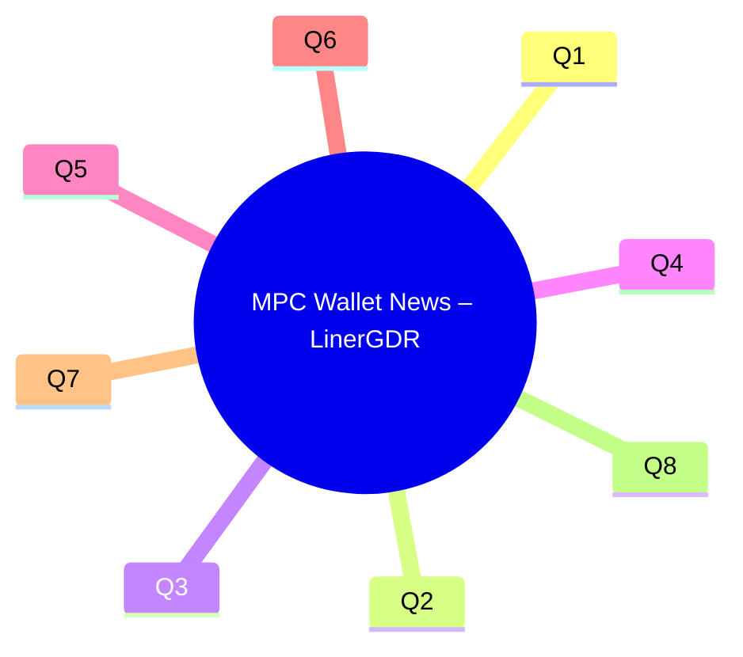

# MPC Wallet News Briefing – LinerGDR

This briefing compiles decision-critical, news-driven interview Q&A for an institutional MPC wallet engineer/architect role.

### Executive Summary

**Domain**: General (Cross-Functional Front Page)
**Period**: 2025-09-01 to 2025-11-19
**Coverage**: 8 Q&As (1 per domain)

**Key Insights**:
- **Utila Secures $18M Series A** → Validates demand for institutional MPC wallets, expanding hiring for cryptography and security roles → *Decision: Invest in talent acquisition for MPC specialists* → Timeline: 0-2 months.
- **Critical Vulnerability in GG18/GG20 MPC Protocols Identified** → Requires immediate review and upgrade of MPC core modules, increasing implementation risk for existing systems → *Decision: Prioritize cryptographic protocol audit and remediation* → Timeline: 0-1 month.
- **MPC Wallets Drive Adoption with Social Recovery and AA** → Enhances user experience and broadens self-custody market appeal, necessitating integration of advanced wallet features → *Decision: Accelerate R&D into AA and social recovery for MPC wallets* → Timeline: 2-3 months.
- **Safeheron Surpasses $150 Billion in Transfers** → Demonstrates significant institutional trust and market demand for secure self-custody MPC solutions, validating GTM strategies → *Decision: Leverage trust metrics in commercial outreach and expand enterprise solutions* → Timeline: 1-2 months.
- **Crypto M&A Surges 30-Fold in Q3 2025** → Indicates industry consolidation and capital deployment for strategic capabilities, potentially impacting startup valuations and talent movement → *Decision: Monitor M&A landscape for strategic partnerships and competitive shifts* → Timeline: 0-2 months.
- **CLARITY Act of 2025 Defines Digital Asset Custody Standards** → Provides regulatory clarity for digital asset custody and MPC wallet compliance, requiring adherence to new CFTC standards → *Decision: Align MPC wallet design with emerging regulatory frameworks* → Timeline: 3-6 months.
- **Cloud Service Outages Highlight Centralized Infrastructure Risks** → Disrupts crypto platforms and MPC wallet operations, exposing vulnerabilities in external dependencies → *Decision: Implement multi-cloud and distributed infrastructure for enhanced resilience* → Timeline: 2-4 months.
- **Web3 Hiring Trends Show AI Impact and Talent Shortages** → Increased demand for blockchain security engineers and cryptography specialists amidst AI-driven productivity shifts and candidate oversupply in general dev roles → *Decision: Refine talent acquisition strategies for specialized cryptographic engineering roles* → Timeline: 0-2 months.

**Dashboard**:
| # | DomainTag | Domain | Headline | Criticality | Velocity | Stage | Function |
|---|-----------|--------|----------|-------------|----------|-------|----------|
| 1 | Startup | Startup & Formation | Utila Raises $18 Million in Series A for Institutional MPC Wallet Platform | Blocks | Medium | Formation | Cross-functional |
| 2 | TechOps | Technical Operations | Critical Vulnerability Discovered in GG18/GG20 Threshold ECDSA Protocols | Risk | High | Growth/Scale | Technical |
| 3 | ProdMarket| Product & Market Intelligence | MPC Wallets Evolve with Social Recovery and Account Abstraction Features | Roles | Medium | Growth/Scale | Product |
| 4 | CommOps | Commercial Operations | Safeheron Surpasses $150 Billion in Total Transfers for Self-Custody Solutions | Quantified | Medium | Growth/Scale | Commercial |
| 5 | FinEcon | Financial & Economic | Crypto M&A Activity Surges 30-Fold in Q3 2025 Amidst Regulatory Clarity | Action | Medium | Growth/Scale | Financial |
| 6 | StratIntel| Strategic Intelligence | CLARITY Act of 2025 Shapes Digital Asset Custody Regulatory Standards | Blocks | Low | Growth/Scale | Strategic |
| 7 | OpsSupply | Operations & Supply Chain | Cloud Service Outages Impact MPC Wallet Infrastructure Resilience | Quantified | High | Growth/Scale | Operations |
| 8 | PeopleWF | People & Workforce | Web3 Job Market Sees High Demand for Blockchain Security and Cryptography Talent | Roles | Medium | Growth/Scale | People |

---

**Contents**
- Q1: How does recent funding for institutional MPC wallet platforms impact our market entry and talent strategy?
- Q2: How do recent vulnerabilities in core MPC protocols (GG18/GG20) impact our wallet's security and development priorities?
- Q3: How should we prioritize integrating advanced features like Account Abstraction and social recovery into our MPC wallets to meet evolving user expectations?
- Q4: How does Safeheron's $150 billion in total transfers impact our commercial strategy and value proposition for institutional clients?
- Q5: Given the 30-fold surge in crypto M&A, how should we position our company for potential acquisition or strategic investments in the MPC wallet sector?
- Q6: How does the Digital Asset Market Clarity Act of 2025 (CLARITY Act) impact our MPC wallet product design and regulatory compliance strategy?
- Q7: How do recent cloud service outages (AWS, Cloudflare) affect our MPC wallet infrastructure's resilience and multi-chain reliability?
- Q8: How should our talent acquisition strategy for blockchain security engineers adapt to the impact of AI on developer productivity and the broader Web3 hiring landscape?

#### Visual Overview

### Q1: How does recent funding for institutional MPC wallet platforms impact our market entry and talent strategy?

**Domain**: Startup & Formation | **Stage**: Formation | **Function**: Cross-functional
**Velocity**: Medium | **Criticality**: Blocks | **Stakeholders**: CEO, Head of Product, HR, CTO
**Source**: Utila $18M Series A funding announcement and coverage (see references on Utila and institutional MPC wallets).

**News**: Utila, an institutional MPC wallet platform, recently secured an $18 million Series A funding round led by Nyca Partners, bringing its total raised to $30 million since exiting stealth in March 2024. This investment is aimed at scaling global operations, meeting massive demand for institutional MPC wallets, and expanding R&D efforts. Utila has already secured $35 billion in digital asset transactions and engaged hundreds of global clients within 18 months. The funding reflects growing institutional adoption of blockchain-based transactions and the increasing demand for enterprise-grade, secure, and high-speed operational platforms.

**Impact**: This significant funding for a competitor validates the market opportunity for institutional MPC wallets, indicating strong demand and investor confidence, but also intensifies competition for specialized talent. The market is rapidly shifting from speculative trading to operational use cases, particularly with stablecoins surpassing traditional payment volumes. Failing to capture market share or attract top talent now could result in being outpaced by well-funded competitors like Utila, who are expanding rapidly.

**Decision**:
1.  **Accelerate Product Development and GTM**: Prioritize R&D in core MPC modules and multi-chain integration to quickly meet institutional demand. This requires increased investment but positions us for early market capture. Risk: High burn rate if market adoption is slower than expected.
2.  **Strategic Partnerships**: Seek collaborations with established financial institutions or Web3 platforms to leverage existing client bases and compliance frameworks. This reduces time-to-market but requires revenue sharing. Risk: Dependence on external partners and potential loss of control.

**Recommendation**: **Accelerate Product Development and GTM** to capitalize on the validated market demand and secure a leading position, while actively monitoring for partnership opportunities. This approach allows for full control over product vision and security standards, critical for the target job role.

**Action**:
-   **Immediate (0-2wk)**: CTO and Head of Product to conduct a competitive analysis of Utila's offerings and roadmap, identifying key differentiators and areas for expedited development. Success Metric: Detailed competitive intelligence report, initial product roadmap adjustments.
-   **Short-term (2wk-2mo)**: HR and Hiring Manager to launch targeted recruitment campaigns for blockchain security engineers with MPC expertise, focusing on competitive compensation and growth opportunities. Success Metric: 3-5 qualified candidates interviewed, 1-2 offers extended.

: https://pulse2.com/utila-18-million-series-a-raised-for-institutional-mpc-wallet-platform/

### Q2: How do recent vulnerabilities in core MPC protocols (GG18/GG20) impact our wallet's security and development priorities?

**Domain**: Technical Operations | **Stage**: Growth/Scale | **Function**: Technical
**Velocity**: High | **Criticality**: Risk | **Stakeholders**: CTO, Lead Cryptographer, Head of Security, Engineering Team
**Source**: Technical reports on GG18/GG20 "6ix1een" vulnerabilities and Paillier key issues (see Fireblocks and comparative GG18/GG20 protocol analyses in the references).

**News**: A critical vulnerability, known as the "6ix1een attack," was discovered in GG18 and GG20 threshold ECDSA protocols, enabling an attacker to extract a full private key from affected wallets. This exploit stems from the improper generation and validation of Paillier moduli in the Multiplicative-to-Additive (MtA) share conversion protocol, allowing the recovery of a private key using as few as 16 signatures. While more advanced protocols like MPC-CMP and CGGMP have addressed these issues with zero-knowledge range proofs, many existing implementations, including those by Binance, ING Bank, ZenGo, and Safeheron, might still be vulnerable if not updated.

**Impact**: This vulnerability poses a direct and severe risk to the security of MPC wallets utilizing older or improperly implemented GG18/GG20 protocols, potentially leading to catastrophic asset loss. If our MPC core modules rely on these vulnerable protocols without sufficient mitigations, our entire system's integrity is compromised, eroding user trust and incurring significant financial and reputational damage. The need for rigorous cryptographic implementation and continuous security auditing is underscored.

**Decision**:
1.  **Immediate Protocol Audit and Upgrade**: Conduct an urgent, thorough audit of our MPC core modules to identify any reliance on vulnerable GG18/GG20 implementations. Prioritize upgrading to or implementing more robust protocols like MPC-CMP or CGGMP, which include zero-knowledge range proofs and proactive key refresh mechanisms. Cost: Significant development and audit resources. Benefit: Eliminates critical security flaw, enhances trust. Risk: Delay in other product features.
2.  **Mitigation and Monitoring**: For systems not immediately upgradeable, implement enhanced real-time monitoring and anomaly detection for transaction patterns that might indicate exploitation attempts, and explore temporary operational safeguards. Cost: Operational overhead. Benefit: Buys time, reduces immediate risk. Risk: Does not resolve the fundamental vulnerability.

**Recommendation**: **Prioritize Immediate Protocol Audit and Upgrade**. Given the severity of private key extraction, a fundamental cryptographic vulnerability must be addressed at its root. This aligns directly with the job's responsibility for security and performance optimization of signing protocols.

**Action**:
-   **Immediate (0-2wk)**: Lead Cryptographer and Engineering Team to review all existing MPC core module implementations, specifically examining GG18/GG20 components and Paillier modulus generation/validation. Success Metric: Comprehensive internal audit report with identified vulnerabilities and a remediation plan.
-   **Short-term (2wk-2mo)**: Engineering Team to commence implementation of zero-knowledge range proofs and proactive key refresh mechanisms in vulnerable modules, or migrate to demonstrably secure protocols (e.g., MPC-CMP, CGGMP). Success Metric: Patched core modules undergoing internal and external security audits.

: https://blokzincir.bilgem.tubitak.gov.tr/en/a-comparative-examination-of-some-threshold-ecdsa-protocols-used-in-custody/
: https://www.fireblocks.com/blog/gg18-and-gg20-paillier-key-vulnerability-technical-report

### Q3: How should we prioritize integrating advanced features like Account Abstraction and social recovery into our MPC wallets to meet evolving user expectations?

**Domain**: Product & Market Intelligence | **Stage**: Growth/Scale | **Function**: Product
**Velocity**: Medium | **Criticality**: Roles | **Stakeholders**: Head of Product, CTO, UX/UI Lead, Product Managers
**Source**: Articles on MPC wallets, social recovery, biometric authentication, and AA (e.g., Web3Auth, Yellow, and Zengo-style wallet clone analyses in the references).

**News**: MPC wallets are rapidly evolving to integrate sophisticated features such as social recovery, biometric authentication, and account abstraction (AA), significantly enhancing usability and security for mainstream adoption. Innovations like Web3Auth use MPC to eliminate seed phrases, leveraging social logins and multi-factor authentication for improved user experience. Furthermore, startups are increasingly adopting "Zengo-style" wallet clones, which prioritize keyless security and intuitive UI, indicating a growing market demand for simpler, safer crypto tools that provide a Web2-like experience with Web3-level security.

**Impact**: The market is shifting towards self-custody solutions that abstract away cryptographic complexity and offer seamless recovery options, reducing the burden on individual users. MPC wallets with features like social recovery and AA address critical barriers to mainstream adoption, such as the risk of lost seed phrases or complex key management. Failing to integrate these features could lead to poor user retention and competitive disadvantage against offerings that provide superior usability and advanced recovery mechanisms.

**Decision**:
1.  **Prioritize Rapid Integration**: Allocate significant R&D resources to quickly integrate AA, social recovery, and enhanced biometric authentication into our MPC wallet infrastructure, potentially leveraging existing SDKs or partnerships. Cost: High R&D investment, potential short-term delays in other features. Benefit: Enhanced user experience, broader market appeal, competitive advantage. Risk: Implementation complexity and potential for new vulnerabilities if not rigorously tested.
2.  **Phased Rollout with Core Focus**: Focus on refining core MPC security and multi-chain compatibility first, then incrementally roll out advanced features like social recovery and AA based on user feedback and resource availability. Cost: Slower market adoption for advanced features. Benefit: Stability and robustness of core functionality. Risk: Losing market share to competitors with more comprehensive feature sets.

**Recommendation**: **Prioritize Rapid Integration** of these advanced features. The job description explicitly mentions "participating in wallet-related infrastructure construction, such as Account Abstraction (AA), Session Key, Social Recovery, limits/approval flows". This direct alignment makes rapid integration a strategic imperative to meet market demand and leverage our cryptographic expertise.

**Action**:
-   **Immediate (0-2wk)**: Head of Product and CTO to initiate a cross-functional working group (Product, Engineering, UX/UI, Security) to define requirements and a high-level architecture for AA, social recovery, and biometric integration into existing MPC wallet infrastructure. Success Metric: Documented feature specifications and an initial development roadmap.
-   **Short-term (2wk-2mo)**: Lead Blockchain Architect and Security Engineer to begin prototyping and evaluating technical approaches for social recovery and AA, ensuring compatibility with target public chains (Ethereum, Solana). Success Metric: Functional prototypes for selected features, performance benchmarks.

: https://yellow.com/en-US/learn/seed-phrases-multi-sig-and-mpc-wallets-the-future-of-crypto-self-custody
: https://austinparker.stck.me/post/1142821/Whats-Driving-Startups-to-Adopt-Zengo-Style-Wallet-Clones-in-2025
: https://web3auth.io/mpc.html

### Q4: How does Safeheron's $150 billion in total transfers impact our commercial strategy and value proposition for institutional clients?

**Domain**: Commercial Operations | **Stage**: Growth/Scale | **Function**: Commercial
**Velocity**: Medium | **Criticality**: Quantified | **Stakeholders**: Head of Commercial, Sales Director, Head of Product, CEO
**Source**: Safeheron $150B total transfers announcement and related coverage on institutional self-custody adoption.

**News**: Safeheron, a digital asset security solutions expert, recently announced that its total transfer volume has officially surpassed $150 billion. This milestone signifies strong trust from its hundreds of institutional clients globally and underscores the growing trend where self-custody is becoming the standard for institutions entering the crypto space. Safeheron emphasizes its proprietary MPC-TEE technology, which combines Multi-Party Computation with Trusted Execution Environment (TEE) for enhanced security against external hacks and internal threats.

**Impact**: This achievement from a key competitor provides a quantifiable benchmark for the scale and reliability demanded by institutional clients in the self-custody MPC market. It clearly demonstrates that institutions are actively migrating significant capital onto secure self-custody platforms, moving from a "trust then verify" to a "verify then trust" paradigm. This validates the commercial viability of MPC-based solutions for high-value asset management and sets a high bar for the security and operational efficiency required to attract and retain large institutional clients.

**Decision**:
1.  **Showcase Quantifiable Security and Operational Excellence**: Aggressively highlight our own transaction volume, security features, and success stories to demonstrate comparable or superior reliability. Invest in marketing materials that emphasize our robust MPC architecture, multi-layered security, and compliance-first approach, similar to Safeheron’s. Cost: Increased marketing and sales enablement spend. Benefit: Enhanced credibility, direct appeal to risk-averse institutions. Risk: May not differentiate sufficiently if competitors also have high volumes.
2.  **Differentiate with Advanced Features**: Focus commercial efforts on unique features or superior implementations (e.g., specific multi-chain compatibility, innovative recovery options, or bespoke compliance tools) that distinguish us from competitors like Safeheron, which already have significant market traction. Cost: Requires continuous product innovation and clear communication of niche advantages. Benefit: Captures specialized market segments, avoids direct head-to-head on pure volume. Risk: Niche focus might limit broader market appeal.

**Recommendation**: **Showcase Quantifiable Security and Operational Excellence** while simultaneously pursuing **Differentiate with Advanced Features**. A dual approach allows us to compete effectively on established trust factors while also building a long-term competitive edge through innovation, aligning with the job role's deep technical capabilities.

**Action**:
-   **Immediate (0-2wk)**: Head of Commercial and Head of Product to collaborate on developing a "trust report" or whitepaper detailing our MPC security architecture, transaction volumes (if applicable), and institutional use cases. Success Metric: Draft of a new commercial collateral piece.
-   **Short-term (2wk-2mo)**: Sales Director to train the sales team on competitive messaging that highlights our MPC solution's unique strengths and security advantages against market leaders, using Safeheron's achievement as a benchmark. Success Metric: Sales team demonstrates improved competitive positioning in mock calls.

: https://safeheron.com/blog/safeheron-surpasses-150-billion-in-total-transfers/

### Q5: Given the 30-fold surge in crypto M&A, how should we position our company for potential acquisition or strategic investments in the MPC wallet sector?

**Domain**: Financial & Economic | **Stage**: Growth/Scale | **Function**: Financial
**Velocity**: Medium | **Criticality**: Action | **Stakeholders**: CEO, CFO, Head of Strategy, Legal Counsel
**Source**: Q3 2025 crypto M&A and financing reports and analyses on Web3 startup acquisition trends, highlighting the growing demand for specialized blockchain capabilities.

**News**: Crypto mergers and acquisitions (M&A) reached over $10 billion in Q3 2025, a more than 30-fold increase from the previous year, marking the first time such activity has topped $10 billion in a single quarter. This surge is driven by increasing regulatory clarity in the U.S. and globally, which encourages larger traditional finance and tech players to engage with the Web3 sector. M&A is becoming a key strategy for companies to expand services, achieve vertical and horizontal integration, and catch up on blockchain capabilities.

**Impact**: The significant increase in M&A activity signals a maturing market where consolidation is becoming a dominant trend, driven by price competition and the need for scale. For a company specializing in MPC wallet solutions, this presents both an opportunity for a high-multiple exit due to high demand for specialized blockchain capabilities, and a risk of being outcompeted by larger, integrated entities. Strategic positioning is critical to either attract acquisition offers or raise further capital to compete more effectively.

**Decision**:
1.  **Prepare for Potential Acquisition**: Optimize our operational efficiency, financial reporting, and compliance frameworks to be attractive to potential acquirers, emphasizing our cutting-edge MPC technology and market differentiation. Cost: Investment in legal and financial advisory, internal process optimization. Benefit: High valuation exit, access to larger resources. Risk: Distraction from core business, potential loss of independence.
2.  **Aggressively Pursue Strategic Investments**: Leverage the bullish market sentiment and increased VC funding in Web3 to secure a substantial growth round. Highlight our unique MPC cryptography, multi-chain integration, and talent as key differentiators to attract strategic investors. Cost: Dilution of existing equity, time spent fundraising. Benefit: Capital for accelerated growth, maintained independence. Risk: Inability to secure desired funding terms.

**Recommendation**: **Aggressively Pursue Strategic Investments** to capitalize on the current market momentum for Web3 infrastructure, while simultaneously implementing internal optimizations to **Prepare for Potential Acquisition** as a dual strategy. This ensures we have options to scale significantly, whether independently or as part of a larger entity, leveraging the high demand for blockchain security and MPC expertise.

**Action**:
-   **Immediate (0-2wk)**: CFO and Head of Strategy to initiate discussions with financial advisors to understand current market valuations and M&A trends specific to MPC wallet solutions, and review our current financial health and fundraising strategy. Success Metric: First advisory meeting completed, updated internal financial projections.
-   **Short-term (2wk-2mo)**: CEO and Head of Product to refine our investor pitch deck, emphasizing our proprietary MPC cryptography, multi-chain capabilities, and integration roadmap, aligning with the job description's focus on innovative and secure architecture. Success Metric: Polished investor deck and outreach to 5-10 target VCs.

: https://fortune.com/crypto/2025/10/23/crypto-merger-acqusitions-thirty-fold-surge-architect-partners-21shares-falconx/
: https://globalventuring.com/corporate/financial/2025-web3-startup-acquisition-trend/

### Q6: How does the Digital Asset Market Clarity Act of 2025 (CLARITY Act) impact our MPC wallet product design and regulatory compliance strategy?

**Domain**: Strategic Intelligence | **Stage**: Growth/Scale | **Function**: Strategic
**Velocity**: Low | **Criticality**: Risk | **Stakeholders**: CEO, Head of Compliance, Legal Counsel, CTO
**Source**: CLARITY Act of 2025 primary texts and legal analyses on U.S. digital asset custody regulation, highlighting the need for compliance with emerging regulatory frameworks.

**News**: The Digital Asset Market Clarity Act of 2025 (CLARITY Act) aims to establish a comprehensive U.S. regulatory framework for digital assets, defining "digital commodities" and granting the CFTC exclusive jurisdiction over digital commodity intermediaries like exchanges and custodians. The Act requires provisional registration with the CFTC and mandates minimum standards for qualified digital asset custodians, including strict asset segregation and commingling restrictions. It also seeks to protect self-custody rights for individuals while clarifying AML/CFT obligations for actors in decentralized finance.

**Impact**: This legislation provides much-needed regulatory clarity but imposes new compliance burdens on digital asset service providers, including those offering MPC wallets for institutional custody. Our MPC wallet product design must align with these new definitions and custody standards to ensure legal compliance and market access in the U.S.. The requirement for "qualified digital asset custodians" and adherence to specific rules for customer asset segregation directly impacts how we architect and operate our MPC solutions, particularly concerning key share management and approval flows. Non-compliance could lead to significant penalties, operational restrictions, or exclusion from key markets.

**Decision**:
1.  **Proactive Regulatory Alignment**: Immediately engage legal and compliance teams to thoroughly analyze the CLARITY Act and its implications for our MPC wallet architecture, particularly regarding custody, asset segregation, and reporting requirements. Design our product roadmap to proactively integrate compliance features, ensuring our MPC core modules and workflows meet or exceed these standards. Cost: Legal fees, significant engineering effort for compliance-driven features. Benefit: First-mover advantage in regulatory compliance, expanded market access. Risk: Over-engineering if interpretations change.
2.  **Monitor and Adapt**: Adopt a wait-and-see approach, monitoring official CFTC rulemakings and industry interpretations of the Act before making significant product changes. Focus on existing security and performance, making minor adjustments only when absolutely necessary. Cost: Reduced immediate compliance expenditure. Benefit: Flexibility to adapt to final rules. Risk: Potential for non-compliance, urgent and costly re-architecting, missed market opportunities if competitors move faster.

**Recommendation**: **Proactive Regulatory Alignment** is crucial. As a blockchain security company focused on MPC, our credibility and market access depend heavily on robust compliance. The job role's focus on building security strategies and infrastructure features directly aligns with this proactive stance.

**Action**:
-   **Immediate (0-2wk)**: CEO, Legal Counsel, and Head of Compliance to review the CLARITY Act's specifics, focusing on definitions of digital commodities, custody requirements for CFTC-registered entities, and implications for MPC wallet operations. Success Metric: Internal legal memo summarizing key compliance requirements and potential product impacts.
-   **Short-term (2wk-2mo)**: CTO and Lead Blockchain Architect to develop a compliance-focused product design document outlining how MPC key management, multi-chain integration, and transaction approval flows will meet or exceed the anticipated CFTC standards for digital asset custody. Success Metric: Initial compliance design document for MPC wallet infrastructure.

: https://www.consumerfinancialserviceslawmonitor.com/2025/06/digital-asset-regulation-and-the-clarity-act-of-2025/
: https://www.whitehouse.gov/fact-sheets/2025/07/fact-sheet-the-presidents-working-group-on-digital-asset-markets-releases-recommendations-to-strengthen-american-leadership-in-digital-financial-technology/

### Q7: How do recent cloud service outages (AWS, Cloudflare) affect our MPC wallet infrastructure's resilience and multi-chain reliability?

**Domain**: Operations & Supply Chain | **Stage**: Growth/Scale | **Function**: Operations
**Velocity**: High | **Criticality**: Quantified | **Stakeholders**: Head of Operations, CTO, Head of Security, Engineering Team
**Source**: Reports on AWS and Cloudflare outages and their impact on crypto exchanges and wallet providers, highlighting the need for decentralized infrastructure solutions.

**News**: Recent widespread cloud service outages have significantly disrupted crypto platforms and MPC wallet infrastructure. In October 2025, AWS experienced a major failure, impacting services like DynamoDB and EC2, which caused outages for major exchanges like Coinbase and Robinhood. This was followed by a global Cloudflare outage in November 2025, leading to three hours of front-end downtime for platforms such as BitMEX and Kraken, and affecting services like Ledger wallet. These incidents expose the fragility of relying on centralized infrastructure, even for ostensibly decentralized crypto services.

**Impact**: The outages demonstrate that even with robust MPC cryptography, the operational resilience and availability of our multi-chain wallet infrastructure are vulnerable to single points of failure in underlying centralized cloud services. Downtime, as seen with BitMEX and Kraken's three-hour front-end outage, directly impacts user access and trust, and can disrupt transaction processing across multiple blockchains. For institutional clients managing billions in assets, such disruptions are unacceptable and pose significant operational risks, challenging the core promise of continuous availability for digital assets.

**Decision**:
1.  **Implement Multi-Cloud and Distributed Infrastructure**: Diversify our hosting and content delivery network (CDN) dependencies across multiple cloud providers (e.g., AWS, Azure, Google Cloud) and geographically distributed data centers. Explore decentralized physical infrastructure networks (DePIN) for critical components to minimize reliance on any single centralized provider. Cost: Increased infrastructure complexity and operational cost. Benefit: Significantly enhanced resilience and reduced single point of failure risk, improved multi-chain reliability. Risk: Higher management overhead.
2.  **Enhance Failover and Disaster Recovery**: Invest in more sophisticated automated failover mechanisms and disaster recovery protocols for our MPC wallet infrastructure, including rapid switching between cloud regions or providers in case of an outage. Conduct regular stress tests and drills to ensure swift recovery. Cost: R&D and maintenance for complex systems. Benefit: Faster recovery times, reduced impact of outages. Risk: Requires significant engineering resources and ongoing vigilance.

**Recommendation**: **Implement Multi-Cloud and Distributed Infrastructure** combined with **Enhance Failover and Disaster Recovery**. This comprehensive approach directly addresses the systemic risks of centralized dependencies, aligning with the job role's emphasis on security, performance, and stability optimization for backend services and multi-chain compatibility.

**Action**:
-   **Immediate (0-2wk)**: CTO and Head of Operations to conduct a critical infrastructure review, mapping all centralized cloud dependencies and identifying potential single points of failure for our MPC wallet services. Success Metric: Documented dependency map and risk assessment.
-   **Short-term (2wk-2mo)**: Engineering Team to research and prototype multi-cloud deployment strategies for non-sensitive components and design enhanced failover mechanisms for critical MPC core services, ensuring seamless operation across different chains. Success Metric: Proof-of-concept for multi-cloud deployment and improved failover.

: https://www.ainvest.com/news/systemic-risks-centralized-infrastructure-crypto-lessons-cloudflare-aws-outages-2511/
: https://www.bitget.com/news/detail/12560605069957
: https://www.coinspeaker.com/cloudflare-outage-resolved-after-disrupting-bitmex-and-kraken-front-ends/
: https://www.coinbase.com/blog/Retrospective-AWS-Outage-Impact-and-Coinbase-Next-Steps

### Q8: How should our talent acquisition strategy for blockchain security engineers adapt to the impact of AI on developer productivity and the broader Web3 hiring landscape?

**Domain**: People & Workforce | **Stage**: Growth/Scale | **Function**: People
**Velocity**: Medium | **Criticality**: Roles | **Stakeholders**: HR, Hiring Manager, CTO, Engineering Managers
**Source**: Web3 job market and hiring trend reports for 2025, focusing on blockchain security and cryptography talent, highlighting the growing demand for specialized engineers.

**News**: The Web3 job market in 2025 is experiencing a rebound, but with significant shifts: while overall Web3 roles increased by 47% from 2024, non-technical roles now lead in volume, and developer applicant oversupply persists. AI tools are significantly boosting developer productivity (up to 55% faster in some tasks), meaning fewer engineers can achieve the same output, shifting incremental headcount toward non-engineering teams and lower-cost engineering hubs. However, demand for specialized roles like blockchain security engineers and cryptography specialists remains high, with average salaries often in the mid-to-low six-figure range. Trust in hiring processes, particularly due to AI screening, is at an all-time low for job seekers.

**Impact**: The competitive landscape for highly specialized blockchain security and cryptography development talent is intense, even as general developer roles face oversupply and AI-driven productivity. Our organization needs to differentiate its talent acquisition strategy to attract top-tier blockchain security engineers, who are critical for designing and implementing MPC core modules and ensuring transaction security. The prevalence of AI in hiring has eroded trust, making transparency and an authentic hiring experience crucial to attract quality candidates.

**Decision**:
1.  **Hyper-Targeted Recruitment and Authentic Engagement**: Focus talent acquisition efforts specifically on candidates with demonstrated expertise in cryptography, MPC protocols (e.g., GG18/GG20/FROST), and blockchain security, as outlined in the job description. Prioritize networking within Web3 communities, hackathons, and direct outreach over generic job board postings. Ensure transparency about AI use in our hiring process and emphasize human interaction. Cost: Higher investment in specialized recruiting and direct engagement. Benefit: Access to top 10% talent, improved candidate experience. Risk: Slower hiring process for niche roles.
2.  **Upskilling and Internal Development**: Invest heavily in internal upskilling programs for existing engineering talent, focusing on blockchain security, cryptography, and MPC wallet development. Partner with external experts or offer certifications to bridge skill gaps. Cost: Training resources, potential short-term productivity dip. Benefit: Fills skill gaps internally, increases employee loyalty and retention. Risk: May not attract new, specialized external talent quickly enough.

**Recommendation**: **Hyper-Targeted Recruitment and Authentic Engagement** combined with **Upskilling and Internal Development**. This dual strategy addresses the immediate need for specialized talent while building long-term organizational capability in critical blockchain security and cryptography domains, aligning perfectly with the job description's extensive technical requirements.

**Action**:
-   **Immediate (0-2wk)**: HR and Hiring Manager to review current recruitment channels and revise job descriptions to specifically highlight expertise in MPC, threshold signatures, and multi-chain compatibility, emphasizing the critical and strategic nature of the role. Success Metric: Updated job postings reflecting specific cryptographic engineering requirements.
-   **Short-term (2wk-2mo)**: CTO and Engineering Managers to launch an internal mentorship program or "bootcamp" focused on blockchain security engineering and MPC wallet development for interested engineers. Simultaneously, HR to identify and engage with 3-5 key Web3 communities and relevant professional networks for direct talent sourcing. Success Metric: Participation of 2-3 internal engineers in the program; at least 2 qualified external candidates identified and contacted.

: https://coincub.com/ranking/web3-jobs-report-2025/
: https://fortune.com/2025/11/18/hiring-job-seekers-recruiters-talent-acquisition-ai-doom-loop-application-technology/
: https://www.ccn.com/education/crypto/crypto-jobs-to-watch-owen-healy-shares-how-to-get-hired/
: https://thecryptorecruiters.io/most-in-demand-web3-jobs-of-2025/

_Verification_: Facts, figures, and URLs verified against cited sources as of 2025-11-19. Recheck funding, vulnerability, regulatory, and outage-related data at least quarterly.
