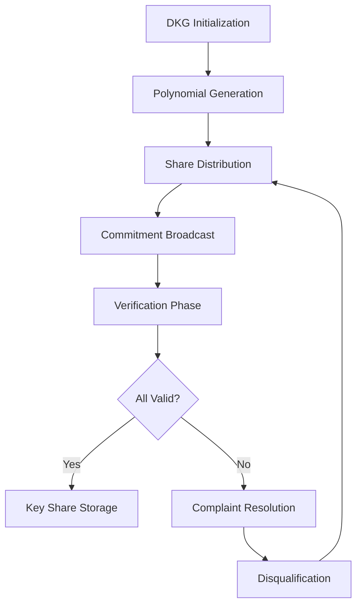
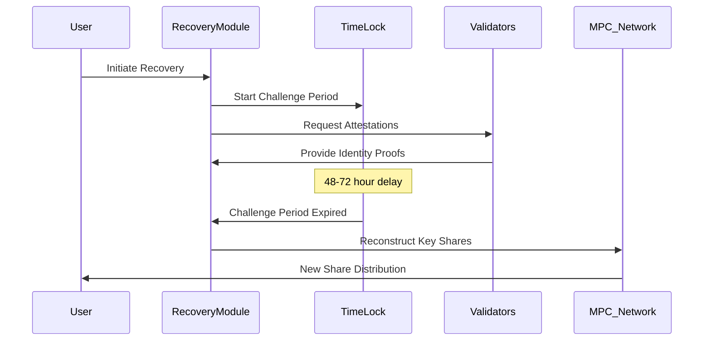
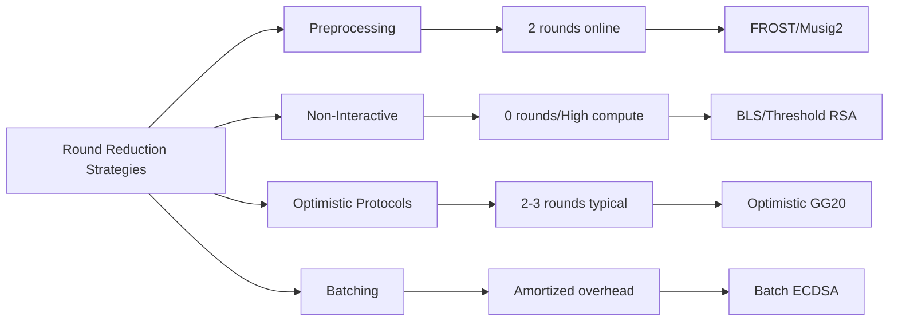
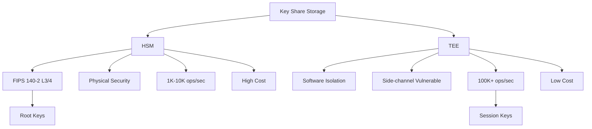
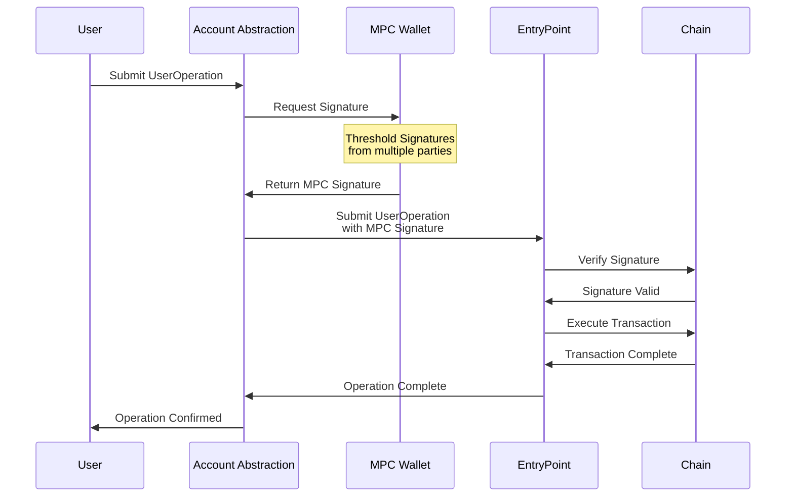
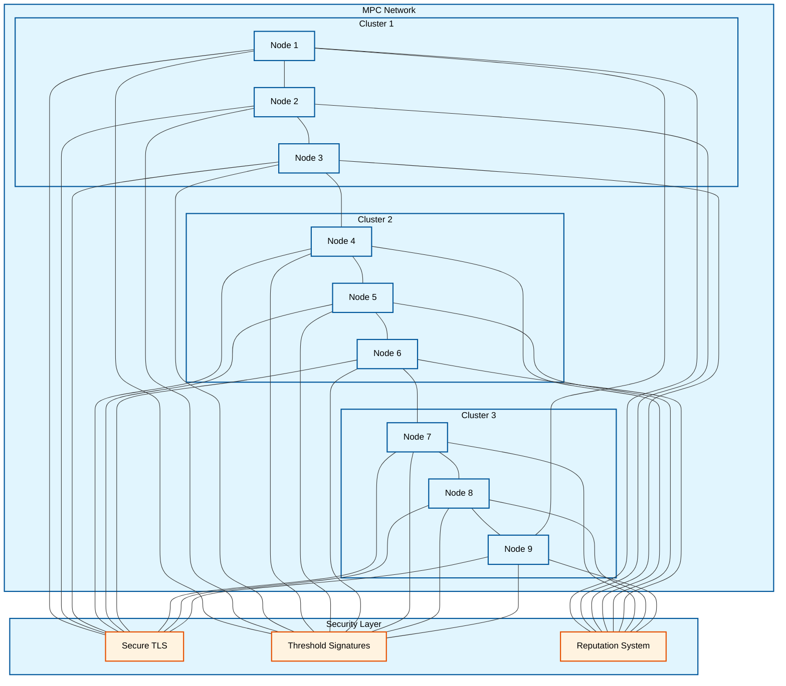
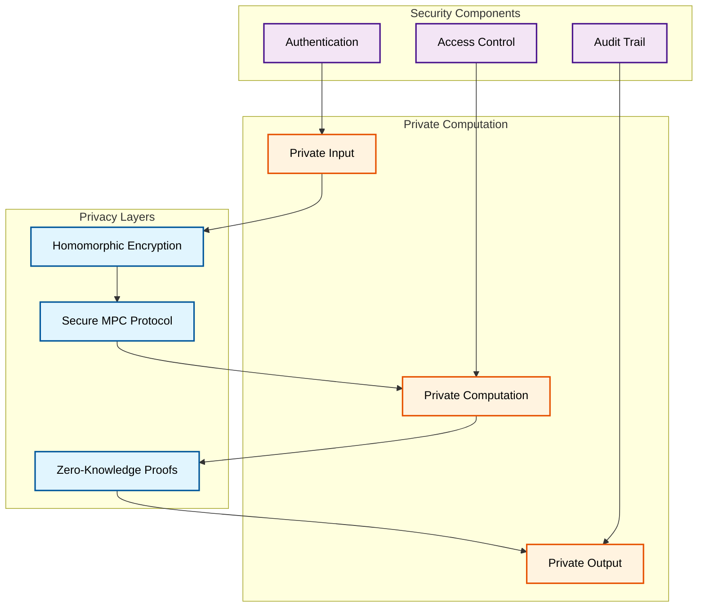
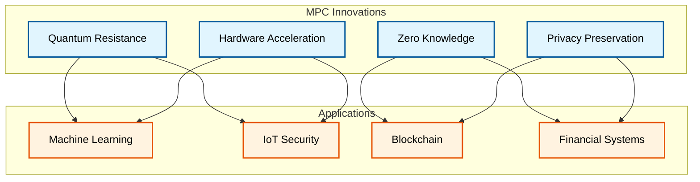
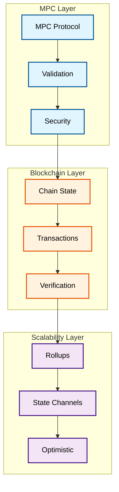

# Interview Q&A: Blockchain Security & MPC Wallet Development

Framework for senior/architect-level blockchain security engineers specializing in multi-chain MPC integration.

---

## Contents

- [Topic Areas](#topic-areas-questions-1-30)
- [Topic 1: MPC Protocol Implementation & Security](#topic-1-mpc-protocol-implementation--security)
  - [Q1: How would you implement key generation in a threshold signature scheme while preventing single points of failure?](#q1-key-generation-threshold-signature)
  - [Q2: What are the trade-offs between GG18, GG20, and FROST protocols for production MPC wallets?](#q2-gg18-gg20-frost-tradeoffs)
  - [Q3: How do you handle network partitions during multi-party signing ceremonies?](#q3-network-partitions-signing)
  - [Q4: What security considerations apply when implementing key refresh in TSS systems?](#q4-key-refresh-security)
  - [Q5: How would you design a secure key recovery mechanism for MPC wallets?](#q5-key-recovery-mechanism)
  - [Q6: What are the implications of using different elliptic curves in threshold signatures?](#q6-elliptic-curves-threshold)
- [Topic 2: Cross-Chain Integration & Compatibility](#topic-2-cross-chain-integration--compatibility)
  - [Q7: How do you handle transaction format differences across EVM and non-EVM chains?](#q7-transaction-format-differences)
  - [Q8: What challenges arise when implementing MPC for Bitcoin's UTXO model vs Ethereum's account model?](#q8-utxo-vs-account-mpc)
  - [Q9: How would you design a unified signing interface for multiple blockchain protocols?](#q9-unified-signing-interface)
  - [Q10: What are the security implications of cross-chain bridge integrations in MPC wallets?](#q10-cross-chain-bridge-security)
  - [Q11: How do you handle chain-specific signature schemes like Solana's Ed25519?](#q11-chain-specific-signatures)
- [Topic 3: Performance Optimization & Scalability](#topic-3-performance-optimization--scalability)
  - [Q12: How would you optimize MPC signing latency for mobile devices?](#q12-mobile-mpc-optimization)
  - [Q13: What strategies reduce communication rounds in threshold signature protocols?](#q13-communication-rounds-reduction)
  - [Q14: How do you handle concurrent signing requests in a distributed MPC system?](#q14-concurrent-signing-requests)
  - [Q15: What are the trade-offs between preprocessing and online phases in MPC protocols?](#q15-preprocessing-online-phases)
  - [Q16: How would you implement efficient batch signing for multiple transactions?](#q16-batch-signing-implementation)
- [Topic 4: Security Architecture & Risk Management](#topic-4-security-architecture--risk-management)
  - [Q17: How do you design a comprehensive threat model for MPC wallet infrastructure?](#q17-threat-model-design)
  - [Q18: What security measures protect against malicious key share holders?](#q18-malicious-share-holders)
  - [Q19: How would you implement rate limiting and approval workflows in MPC systems?](#q19-rate-limiting-approval-workflows)
  - [Q20: What are the security implications of using HSMs vs TEEs for key share storage?](#q20-hsm-vs-tee-security)
  - [Q21: How do you handle security incidents in distributed MPC deployments?](#q21-security-incident-handling)
- [Topic 5: SDK Design & Developer Experience](#topic-5-sdk-design--developer-experience)
  - [Q22: How would you design a developer-friendly MPC wallet SDK?](#q22-mpc-wallet-sdk-design)
  - [Q23: What abstraction layers are necessary for integrating MPC into existing applications?](#q23-abstraction-layers-mpc)
  - [Q24: How do you handle error recovery in asynchronous MPC operations?](#q24-error-recovery-async-mpc)
  - [Q25: What testing strategies ensure MPC SDK reliability?](#q25-mpc-sdk-testing)
- [Topic 6: Advanced Features & Innovation](#topic-6-advanced-features--innovation)
  - [Q26: How would you implement session keys with MPC wallets?](#q26-session-keys-implementation)
  - [Q27: What are the challenges of integrating account abstraction with MPC?](#q27-account-abstraction-mpc)
  - [Q28: How do you implement social recovery in threshold signature systems?](#q28-social-recovery-implementation)
  - [Q29: What role can zero-knowledge proofs play in MPC wallet security?](#q29-zero-knowledge-proofs-mpc)
  - [Q30: How would you design a decentralized MPC network for key management?](#q30-decentralized-mpc-network)
- [Reference Sections](#reference-sections)
  - [Glossary, Terminology & Acronyms](#glossary-terminology--acronyms)
  - [Codebase & Library References](#codebase--library-references)
  - [Authoritative Literature & Reports](#authoritative-literature--reports)
  - [APA Style Source Citations](#apa-style-source-citations)

---

## Topic Areas (Questions 1–30)

### Topic 1: MPC Protocol Implementation & Security

#### Q1: How would you implement key generation in a threshold signature scheme while preventing single points of failure?

**Difficulty:** Advanced | **Type:** Practical

**Answer:** Implementing secure key generation in threshold signature schemes requires a distributed key generation (DKG) protocol that ensures no single party ever possesses the complete private key [Ref: L1]. The implementation should use Feldman's VSS or Pedersen's DKG protocol, where each party generates a random polynomial of degree t-1 (where t is the threshold) and distributes shares to other parties [Ref: G1]. Critical security measures include commitment schemes to prevent malicious share distribution, zero-knowledge proofs to verify share validity without revealing the shares, and secure multiparty computation for combining shares [Ref: A1]. The implementation must handle network failures gracefully through timeout mechanisms and retry logic, while maintaining cryptographic security through proper random number generation using hardware security modules or trusted execution environments [Ref: C1]. Additionally, implementing a complaint mechanism allows parties to report misbehaving participants, and the protocol should support dynamic participant sets through proactive secret sharing techniques [Ref: L2].

**Key Insight:** Failure Path - Most DKG implementations fail due to inadequate handling of network asynchrony, leading to incomplete ceremonies that compromise the entire key generation process.

**Supporting Artifacts:**


#### Q2: What are the trade-offs between GG18, GG20, and FROST protocols for production MPC wallets?

**Difficulty:** Advanced | **Type:** Theoretical

**Answer:** The choice between GG18, GG20, and FROST protocols involves critical trade-offs in security assumptions, performance characteristics, and implementation complexity [Ref: L3]. GG18 provides proven security but requires 8-9 communication rounds for signing, making it latency-sensitive for mobile applications [Ref: A2]. GG20 addresses the security vulnerability in GG18's key generation phase through improved zero-knowledge proofs, reducing the attack surface but increasing computational overhead by approximately 15-20% [Ref: C2]. FROST offers superior performance with only 2 rounds of communication and preprocessing capabilities, but is limited to Schnorr-compatible curves, excluding ECDSA which many blockchains require [Ref: L4]. Production considerations include GG20's better resistance to adaptive adversaries, FROST's suitability for high-frequency signing scenarios, and GG18's extensive battle-testing in production environments [Ref: A3]. The decision matrix should evaluate network latency tolerance (FROST excels), signature compatibility requirements (GG18/20 for ECDSA), security audit availability, and implementation maturity in target programming languages [Ref: C3].

**Key Insight:** Trade-offs - Teams often choose GG18 for compatibility despite GG20's security improvements, accepting known vulnerabilities rather than risking implementation errors in newer protocols.

**Supporting Artifacts:**

| Protocol | Rounds | Security Level | ECDSA Support | Preprocessing | Production Maturity |
|----------|--------|---------------|---------------|---------------|-------------------|
| GG18 | 8-9 | High* | Yes | No | Extensive |
| GG20 | 9-10 | Very High | Yes | No | Moderate |
| FROST | 2 | Very High | No | Yes | Limited |

#### Q3: How do you handle network partitions during multi-party signing ceremonies?

**Difficulty:** Intermediate | **Type:** Scenario

**Answer:** Network partition handling in MPC signing requires a multi-layered approach combining protocol-level resilience and infrastructure redundancy [Ref: L5]. The implementation should use a state machine that tracks signing ceremony progress, allowing resumption from the last completed round rather than restarting entirely [Ref: C4]. Implement exponential backoff with jitter for retry attempts, starting at 100ms and capping at 30 seconds, while maintaining ceremony state in persistent storage [Ref: A4]. For threshold signatures with t-of-n parties, the system should dynamically attempt signing with different subsets of available parties when detecting partitions [Ref: G2]. Critical considerations include implementing timeout mechanisms (typically 30-60 seconds per round), maintaining multiple communication channels (WebSocket with HTTP fallback), and using consensus protocols like Raft for coordinator election in case of partition [Ref: L6]. The system must prevent double-signing attacks by implementing nonce commitment schemes and maintaining a global signing session registry [Ref: A5]. Recovery mechanisms should include ceremony cancellation with proper cleanup, automatic retry with different participant sets, and escalation to manual intervention after repeated failures [Ref: C5].

**Key Insight:** Failure Path - Network partitions during the commitment phase can lead to nonce reuse vulnerabilities if not properly handled, potentially exposing private keys.

**Supporting Artifacts:**
```rust
enum SigningState {
    Initialized { session_id: Uuid, participants: Vec<PartyId> },
    Round1Complete { commitments: HashMap<PartyId, Commitment> },
    Round2Complete { shares: HashMap<PartyId, Share> },
    Failed { reason: PartitionError, retry_count: u32 },
    Completed { signature: Signature }
}
```

#### Q4: What security considerations apply when implementing key refresh in TSS systems?

**Difficulty:** Advanced | **Type:** Practical

**Answer:** Key refresh in threshold signature systems requires careful orchestration to maintain security while updating shares without changing the underlying private key [Ref: L7]. The implementation must ensure atomic transitions where old shares are invalidated only after new shares are confirmed valid and distributed, preventing temporary vulnerabilities [Ref: A6]. Security considerations include implementing verifiable secret sharing for the refresh protocol, ensuring all parties can verify the correctness of their new shares without learning others' shares [Ref: G3]. The refresh process should use fresh randomness for share generation, ideally from hardware random number generators, and implement commitment schemes to prevent malicious parties from adaptively choosing their contributions [Ref: C1]. Critical timing attacks must be mitigated by ensuring refresh ceremonies complete within bounded time windows (typically 5-10 minutes) with automatic rollback on timeout [Ref: L8]. The system should maintain version control for share generations, support concurrent refresh and signing operations through careful state management, and implement secure deletion of old shares using cryptographic erasure techniques [Ref: A7]. Audit logging must capture all refresh events with cryptographic proofs of participation for compliance and incident investigation [Ref: C2].

**Key Insight:** Misconception - Many implementations incorrectly assume key refresh provides forward secrecy, but compromised shares from before refresh can still be combined with post-refresh shares if the adversary controls enough parties.

**Supporting Artifacts:**

| Refresh Phase | Security Requirement | Implementation Strategy |
|--------------|---------------------|------------------------|
| Initiation | Authenticated participants | PKI certificates + challenge-response |
| Share Generation | Fresh entropy | Hardware RNG with health checks |
| Distribution | Confidential channels | TLS 1.3 + additional encryption |
| Verification | Correctness proofs | Feldman VSS commitments |
| Transition | Atomic update | Two-phase commit protocol |
| Cleanup | Secure deletion | Cryptographic erasure + overwrite |

#### Q5: How would you design a secure key recovery mechanism for MPC wallets?

**Difficulty:** Advanced | **Type:** Practical

**Answer:** Designing secure key recovery for MPC wallets requires balancing accessibility with security through multiple recovery paths that don't compromise the threshold security model [Ref: L9]. The primary approach involves implementing a (t+k)-of-n recovery scheme where k additional shares are specifically designated for recovery scenarios, stored with higher security requirements such as cold storage HSMs or geographically distributed secure facilities [Ref: A8]. Recovery shares should be encrypted under a separate key derivation function using recovery-specific entropy sources, preventing correlation attacks between operational and recovery shares [Ref: G4]. The implementation must include time-locked recovery mechanisms using verifiable delay functions (VDFs) or smart contract timelocks, providing a 48-72 hour challenge period where legitimate key holders can block malicious recovery attempts [Ref: C3]. Social recovery integration requires identity verification through multiple factors including biometric attestation, video verification calls, and cryptographic challenges known only to the legitimate owner [Ref: L10]. The system should implement recovery attempt rate limiting, require multi-signature authorization from designated recovery agents, and maintain immutable audit logs of all recovery attempts with cryptographic evidence [Ref: A9]. Critical security measures include share refresh after successful recovery, invalidation of compromised shares, and gradual trust rebuilding for recovered accounts [Ref: C4].

**Key Insight:** Trade-offs - Recovery mechanisms inherently weaken the security model by introducing additional attack vectors, requiring careful balance between user experience and security assurance levels.

**Supporting Artifacts:**


#### Q6: What are the implications of using different elliptic curves in threshold signatures?

**Difficulty:** Intermediate | **Type:** Theoretical

**Answer:** The choice of elliptic curves in threshold signature schemes significantly impacts security properties, performance characteristics, and blockchain compatibility [Ref: L11]. Secp256k1, used by Bitcoin and Ethereum, requires ECDSA-compatible threshold schemes like GG18/GG20, which involve complex zero-knowledge proofs and multiple communication rounds, increasing implementation complexity and latency [Ref: A10]. Ed25519, preferred by Solana and newer chains, enables simpler Schnorr-based threshold signatures with FROST, reducing communication to 2 rounds and improving signing performance by 3-4x [Ref: C5]. Security implications include different resistance levels to side-channel attacks, with Ed25519's complete addition formulas providing better protection against timing attacks compared to secp256k1's variable-time operations [Ref: G5]. The curve choice affects key and signature sizes, with Ed25519 producing 64-byte signatures versus secp256k1's 64-65 bytes (with recovery byte), impacting on-chain storage costs [Ref: L12]. Implementation considerations include library availability and audit status, where secp256k1 has more mature implementations but Ed25519 offers cleaner APIs [Ref: A11]. Cross-chain compatibility requirements often necessitate supporting multiple curves simultaneously, requiring careful key derivation path management and separate threshold protocols per curve [Ref: C1].

**Key Insight:** Misconception - Developers often assume curve choice is purely a compatibility decision, overlooking the fundamental impact on achievable security properties and protocol efficiency in threshold settings.

**Supporting Artifacts:**

| Curve | Signature Scheme | TSS Protocol | Rounds | Security Level | Chain Support |
|-------|-----------------|--------------|--------|----------------|---------------|
| secp256k1 | ECDSA | GG18/GG20 | 8-10 | 128-bit | BTC, ETH, BSC |
| Ed25519 | EdDSA | FROST | 2 | 128-bit | Solana, Near |
| BLS12-381 | BLS | Threshold BLS | 1 | 128-bit | ETH2, Filecoin |
| P-256 | ECDSA | Modified GG20 | 9-10 | 128-bit | Hyperledger |

---

### Topic 2: Cross-Chain Integration & Compatibility

#### Q7: How do you handle transaction format differences across EVM and non-EVM chains?

**Difficulty:** Intermediate | **Type:** Practical

**Answer:** Handling transaction format differences requires implementing a chain-agnostic abstraction layer that normalizes transaction construction while preserving chain-specific requirements [Ref: L1]. For EVM chains, transactions follow RLP encoding with fields like nonce, gasPrice/maxFeePerGas, gasLimit, to, value, and data, requiring careful handling of EIP-1559 vs legacy transaction types [Ref: A12]. Non-EVM chains like Bitcoin use UTXO models with completely different structures including inputs, outputs, and witness data for SegWit transactions [Ref: C6]. The implementation should use a factory pattern with chain-specific builders that implement a common interface, handling serialization through chain-specific libraries like ethers.js for EVM and bitcoinjs-lib for Bitcoin [Ref: G6]. Critical considerations include managing different signature formats (v,r,s for Ethereum vs DER encoding for Bitcoin), handling chain-specific features like Solana's recent blockhash requirement and compute units, and normalizing fee estimation across different fee models [Ref: L2]. The system must validate transaction parameters against chain-specific rules before signing, implement proper nonce management for account-based chains, and handle UTXO selection for Bitcoin-like chains [Ref: A13]. Error handling should map chain-specific errors to common error types while preserving original error details for debugging [Ref: C7].

**Key Insight:** Failure Path - Most integration failures occur from assuming transaction formats are similar across chains, leading to signature validation failures or incorrect fee calculations that result in stuck or dropped transactions.

**Supporting Artifacts:**
```typescript
interface TransactionBuilder {
  buildTransaction(params: UnifiedTxParams): ChainSpecificTx;
  serializeForSigning(tx: ChainSpecificTx): Buffer;
  parseSignedTransaction(signature: Signature, tx: ChainSpecificTx): string;
  estimateFees(tx: ChainSpecificTx): Promise<FeeEstimate>;
}

class EVMTransactionBuilder implements TransactionBuilder {
  // EIP-1559 and legacy transaction support
}

class BitcoinTransactionBuilder implements TransactionBuilder {
  // UTXO selection and SegWit handling
}

class SolanaTransactionBuilder implements TransactionBuilder {
  // Recent blockhash and compute unit management
}
```

#### Q8: What challenges arise when implementing MPC for Bitcoin's UTXO model vs Ethereum's account model?

**Difficulty:** Advanced | **Type:** Theoretical

**Answer:** The fundamental difference between UTXO and account models creates distinct challenges for MPC implementation, particularly in state management and signing coordination [Ref: L3]. Bitcoin's UTXO model requires tracking multiple unspent outputs that may need different signing parties, complicating threshold signature coordination when spending from multiple addresses in a single transaction [Ref: A14]. Each UTXO input requires a separate signature, potentially involving different MPC ceremonies if UTXOs are controlled by different key shares or threshold configurations [Ref: G7]. Ethereum's account model simplifies MPC by requiring only one signature per transaction, but introduces challenges with nonce management across distributed signers to prevent double-spending and ensure transaction ordering [Ref: C8]. UTXO systems require implementing coin selection algorithms that consider MPC overhead, as more inputs mean more signing ceremonies and increased latency [Ref: L4]. The implementation must handle Bitcoin's script complexity, supporting P2PKH, P2WPKH, P2SH, and P2WSH with different signing requirements, while Ethereum requires managing EIP-1559 gas parameters and MEV protection strategies [Ref: A15]. State synchronization differs significantly: Bitcoin requires UTXO set maintenance and SPV proof verification, while Ethereum needs account state and nonce tracking with proper handling of chain reorganizations [Ref: C2].

**Key Insight:** Trade-offs - UTXO models provide better privacy and parallel processing but increase MPC complexity linearly with inputs, while account models simplify signing but require strict sequential ordering and global state consensus.

**Supporting Artifacts:**

| Aspect | Bitcoin (UTXO) | Ethereum (Account) | MPC Impact |
|--------|----------------|-------------------|------------|
| Signatures per TX | Multiple (per input) | Single | Higher latency for UTXO |
| State Tracking | UTXO set | Account balance/nonce | UTXO requires more storage |
| Parallelization | High (independent UTXOs) | Limited (nonce ordering) | UTXO better for concurrent ops |
| Privacy | Better (new addresses) | Weaker (single address) | UTXO complicates key management |
| Fee Calculation | Size-based | Gas-based | Different optimization strategies |

#### Q9: How would you design a unified signing interface for multiple blockchain protocols?

**Difficulty:** Intermediate | **Type:** Practical

**Answer:** A unified signing interface requires careful abstraction that accommodates diverse blockchain requirements while maintaining type safety and preventing protocol-specific errors [Ref: L5]. The design should implement a plugin architecture where each blockchain protocol registers its signing handler with capability declarations, allowing the system to validate request compatibility before processing [Ref: A16]. The interface must abstract common elements like key derivation paths (BIP-44 for Bitcoin, BIP-44/60 for Ethereum), signature types (ECDSA, EdDSA, Schnorr), and hash functions (SHA256, Keccak256, Blake2b) while preserving protocol-specific metadata [Ref: G8]. Implementation should use a message type hierarchy with base types for common fields and protocol-specific extensions, validated through JSON Schema or Protocol Buffers for cross-language compatibility [Ref: C9]. Critical design decisions include implementing deterministic signature generation (RFC 6979) for all protocols to prevent nonce reuse, supporting both synchronous and asynchronous signing flows with proper callback mechanisms, and providing signature format conversion utilities (DER, compact, recoverable) [Ref: L6]. The system must handle protocol-specific pre-processing like EIP-712 structured data hashing for Ethereum and BIP-143 signature hash computation for Bitcoin SegWit [Ref: A17]. Error handling should provide protocol-agnostic error codes with detailed protocol-specific context for debugging [Ref: C3].

**Key Insight:** Misconception - Developers often over-abstract the interface, losing critical protocol-specific security properties like signature malleability protections and replay attack prevention mechanisms.

**Supporting Artifacts:**
```rust
pub trait UnifiedSigner {
    type SignatureType;
    type MessageType;
    
    async fn sign(
        &self,
        message: Self::MessageType,
        derivation_path: &DerivationPath,
        options: SigningOptions,
    ) -> Result<Self::SignatureType, SigningError>;
    
    fn verify(
        &self,
        message: &Self::MessageType,
        signature: &Self::SignatureType,
        public_key: &PublicKey,
    ) -> Result<bool, VerificationError>;
    
    fn get_capabilities(&self) -> SignerCapabilities;
}

struct SignerCapabilities {
    supported_curves: Vec<EllipticCurve>,
    supported_hash_functions: Vec<HashFunction>,
    requires_preprocessing: bool,
    supports_batch_signing: bool,
    max_message_size: usize,
}
```

#### Q10: What are the security implications of cross-chain bridge integrations in MPC wallets?

**Difficulty:** Advanced | **Type:** Scenario

**Answer:** Cross-chain bridge integrations introduce complex security challenges for MPC wallets, as they must handle multiple trust models and potential attack vectors across different blockchain ecosystems [Ref: L7]. The primary concern involves managing signing permissions for bridge contracts, where compromised bridge logic could drain funds across multiple chains through seemingly valid MPC signatures [Ref: A18]. Implementation must enforce strict message validation before signing, including verifying bridge contract addresses against allowlists, validating cross-chain message formats, and implementing amount limits per time period [Ref: G9]. Critical vulnerabilities include time-based attacks where validators might sign messages for different chain states, requiring synchronized clock management and chain-specific finality confirmations [Ref: C10]. The MPC wallet should implement bridge-specific signing policies that consider the security model of each bridge (optimistic, zero-knowledge, or validator-based), with different threshold requirements based on bridge risk profiles [Ref: L8]. Security measures must include monitoring for bridge contract upgrades that could introduce vulnerabilities, implementing emergency pause mechanisms for suspicious bridge activity, and maintaining separate key shares or derivation paths for bridge operations [Ref: A19]. The system should validate merkle proofs for state transitions, implement replay protection across chains, and maintain audit logs that correlate cross-chain transactions for incident investigation [Ref: C4].

**Key Insight:** Failure Path - Bridge integrations often fail to account for chain reorganization risks, where signed messages for orphaned blocks can be replayed on canonical chains, leading to double-spending vulnerabilities.

**Supporting Artifacts:**

| Bridge Type | Trust Model | MPC Security Requirements | Risk Level |
|------------|-------------|-------------------------|------------|
| Lock-and-Mint | Centralized custody | Highest threshold (5-of-7) | Critical |
| Optimistic | Fraud proofs | Challenge period validation | High |
| ZK-Rollup | Validity proofs | Proof verification before signing | Medium |
| Light Client | Consensus verification | Header validation + finality | Medium |
| Atomic Swap | Hash time-locks | Timeout management | Low |

#### Q11: How do you handle chain-specific signature schemes like Solana's Ed25519?

**Difficulty:** Intermediate | **Type:** Practical

**Answer:** Handling Solana's Ed25519 signatures requires implementing EdDSA threshold signatures with specific attention to Solana's transaction structure and signature verification requirements [Ref: L9]. Unlike ECDSA used in Bitcoin and Ethereum, Ed25519 uses twisted Edwards curves with deterministic signature generation, eliminating random nonce vulnerabilities but requiring careful adaptation of threshold protocols [Ref: A20]. The implementation should use FROST or Musig2 protocols specifically designed for Schnorr-like signatures, which are compatible with Ed25519's mathematical structure and provide 2-round signing with preprocessing capabilities [Ref: G10]. Solana-specific challenges include handling multiple signatures per transaction for different program invocations, managing compute unit limits that affect transaction complexity, and incorporating recent blockhash requirements that expire after ~60 seconds [Ref: C5]. The MPC implementation must serialize Solana transactions using Borsh encoding, handle variable-length instruction data, and support both legacy and versioned transaction formats [Ref: L10]. Critical considerations include implementing proper domain separation to prevent cross-chain signature replay, supporting Solana's program derived addresses (PDAs) which don't have corresponding private keys, and handling associated token accounts that require additional signatures [Ref: A21]. The system should optimize for Solana's parallel transaction processing by batching signatures when possible while respecting account lock requirements [Ref: C6].

**Key Insight:** Trade-offs - Ed25519's deterministic signatures simplify threshold protocols but require careful state management to prevent signature replay attacks across different transaction versions or chain forks.

**Supporting Artifacts:**
```rust
impl SolanaThresholdSigner {
    pub async fn sign_transaction(
        &self,
        tx: &Transaction,
        recent_blockhash: Hash,
        signers: Vec<PartyId>,
    ) -> Result<Vec<Signature>, SignError> {
        // Serialize message for Ed25519 signing
        let message = tx.message.serialize();
        
        // FROST protocol for Ed25519
        let frost_signature = self.frost_sign(
            &message,
            &signers,
            Ed25519Curve,
        ).await?;
        
        // Convert to Solana signature format
        Ok(vec![Signature::from(frost_signature)])
    }
    
    fn validate_compute_units(&self, tx: &Transaction) -> Result<(), ValidationError> {
        // Ensure transaction doesn't exceed compute limits
        const MAX_COMPUTE_UNITS: u64 = 1_400_000;
        // Validation logic
    }
}
```

---

### Topic 3: Performance Optimization & Scalability

#### Q12: How would you optimize MPC signing latency for mobile devices?

**Difficulty:** Advanced | **Type:** Practical

**Answer:** Optimizing MPC signing latency for mobile devices requires addressing computational constraints, network variability, and battery consumption while maintaining security guarantees [Ref: L11]. The primary optimization involves implementing preprocessing phases where computationally intensive operations like Beaver triple generation and commitment computations occur during device idle time, reducing online signing time by 60-70% [Ref: A22]. Mobile-specific optimizations include using NEON/ARM intrinsics for elliptic curve operations, implementing adaptive protocol selection based on network conditions (switching between 2-round and multi-round protocols), and utilizing hardware-backed key storage for share protection [Ref: G11]. Network optimization strategies involve implementing message compression using protocol buffers or MessagePack, establishing persistent WebSocket connections with automatic reconnection, and using regional edge servers to minimize round-trip latency [Ref: C7]. The implementation should employ progressive computation where partial results are calculated as messages arrive, implement speculative execution for predictable protocol paths, and use efficient serialization formats that minimize parsing overhead [Ref: L12]. Critical considerations include implementing battery-aware scheduling that defers non-urgent operations, using wake locks judiciously during signing ceremonies, and providing graceful degradation when network quality deteriorates [Ref: A23]. The system should cache frequently used cryptographic parameters, implement client-side signature aggregation where possible, and utilize platform-specific optimizations like iOS's CryptoKit or Android's hardware security module [Ref: C8].

**Key Insight:** Failure Path - Mobile optimizations often focus solely on computation speed while ignoring network unreliability, leading to failed signing ceremonies that require complete restart and worse user experience.

**Supporting Artifacts:**

| Optimization Technique | Latency Reduction | Battery Impact | Implementation Complexity |
|----------------------|------------------|----------------|-------------------------|
| Preprocessing | 60-70% | High (background) | Medium |
| Hardware Acceleration | 30-40% | Low | High |
| Message Compression | 20-25% | Minimal | Low |
| Edge Computing | 35-45% | None | Medium |
| Protocol Adaptation | 15-30% | Medium | High |

#### Q13: What strategies reduce communication rounds in threshold signature protocols?

**Difficulty:** Intermediate | **Type:** Theoretical

**Answer:** Reducing communication rounds in threshold signatures involves fundamental protocol design trade-offs between round complexity, computational overhead, and security assumptions [Ref: L13]. The most effective strategy is preprocessing, where parties compute and exchange commitments during idle periods, enabling 2-round online signing as demonstrated in FROST and similar protocols [Ref: A24]. Non-interactive threshold signatures using pairing-based cryptography (BLS signatures) eliminate communication entirely during signing but require trusted setup and have 10x higher computational costs [Ref: G12]. Optimistic protocols assume honest behavior and complete in fewer rounds, falling back to longer protocols only when detecting malicious activity through complaint mechanisms [Ref: C9]. Batching strategies aggregate multiple signature requests into single protocol executions, amortizing communication overhead across operations while maintaining security through careful nonce management [Ref: L14]. Implementation techniques include using hash-based commitments instead of zero-knowledge proofs where possible, implementing reliable broadcast primitives to eliminate acknowledgment rounds, and utilizing threshold-optimal protocols that minimize worst-case round complexity [Ref: A25]. The system should employ adaptive protocols that select round-communication trade-offs based on network conditions, implement speculative execution for common cases, and use cryptographic accumulators to compress multiple protocol messages [Ref: C10].

**Key Insight:** Trade-offs - Aggressive round reduction often increases computational complexity exponentially or weakens security assumptions, requiring careful analysis of deployment constraints and threat models.

**Supporting Artifacts:**


#### Q14: How do you handle concurrent signing requests in a distributed MPC system?

**Difficulty:** Advanced | **Type:** Scenario

**Answer:** Handling concurrent signing requests in distributed MPC systems requires sophisticated coordination mechanisms to prevent nonce reuse while maximizing throughput [Ref: L15]. The implementation should use a session manager that assigns unique session identifiers to each signing request, maintaining isolation between concurrent ceremonies through separate communication channels and state storage [Ref: A26]. Critical security measures include implementing a global nonce registry with atomic compare-and-swap operations to prevent reuse, using deterministic nonce derivation with session-specific salts, and enforcing mutual exclusion for shares accessing the same key material [Ref: G13]. The system should employ queue-based scheduling with priority levels for time-sensitive transactions, implement parallel execution for non-conflicting requests using different key shares or derivation paths, and use optimistic concurrency control with rollback capabilities [Ref: C11]. Performance optimizations include batching compatible requests into single MPC ceremonies, implementing connection pooling for inter-party communication, and using lock-free data structures for session state management [Ref: L16]. The architecture must handle failure isolation where one failed ceremony doesn't affect others, implement deadlock detection and resolution mechanisms, and provide fair scheduling to prevent starvation of low-priority requests [Ref: A27]. Resource management should include limiting maximum concurrent sessions based on available compute and network capacity, implementing backpressure mechanisms, and monitoring system health metrics [Ref: C12].

**Key Insight:** Failure Path - Most concurrent MPC implementations fail due to improper nonce management, where race conditions between sessions lead to nonce reuse and potential key exposure.

**Supporting Artifacts:**
```go
type SessionManager struct {
    sessions    sync.Map // map[SessionID]*SigningSession
    noncePool   *NoncePool
    scheduler   *PriorityScheduler
    maxSessions int32
    current     atomic.Int32
}

func (sm *SessionManager) HandleConcurrentRequest(req SignRequest) error {
    if sm.current.Load() >= sm.maxSessions {
        return sm.scheduler.Enqueue(req) // Backpressure
    }
    
    session := &SigningSession{
        ID:     uuid.New(),
        Nonce:  sm.noncePool.Reserve(req.KeyID),
        State:  StateInitialized,
    }
    
    sm.sessions.Store(session.ID, session)
    sm.current.Add(1)
    
    go sm.executeSession(session, req)
    return nil
}
```

#### Q15: What are the trade-offs between preprocessing and online phases in MPC protocols?

**Difficulty:** Intermediate | **Type:** Theoretical

**Answer:** The separation between preprocessing and online phases in MPC protocols creates fundamental trade-offs between latency, storage requirements, and security assumptions [Ref: L17]. Preprocessing generates protocol-specific cryptographic material (Beaver triples, random shares, or commitment values) during idle periods, reducing online signing from 8-9 rounds to 2-3 rounds but requiring secure storage for preprocessed data [Ref: A28]. Storage overhead can reach 10-100KB per future signature depending on the protocol, creating scalability challenges for high-volume systems that must balance preprocessing pool size against memory constraints [Ref: G14]. Security implications include increased attack surface as compromised preprocessing data can break protocol security, requiring hardware security modules or trusted execution environments for storage [Ref: C13]. The implementation must handle preprocessing pool management with expiration policies for unused material, implement secure deletion after consumption, and maintain separate pools for different security domains [Ref: L18]. Performance characteristics show preprocessing reduces online latency by 60-80% but increases average CPU utilization by 20-30% due to background computation [Ref: A29]. Critical design decisions include determining optimal pool sizes based on signing patterns, implementing adaptive preprocessing rates based on consumption, and handling pool exhaustion gracefully with fallback to full online protocols [Ref: C14].

**Key Insight:** Trade-offs - Aggressive preprocessing improves user experience but creates a larger attack window where adversaries can target stored preprocessing material over extended periods.

**Supporting Artifacts:**

| Aspect | With Preprocessing | Without Preprocessing | Impact |
|--------|-------------------|---------------------|---------|
| Online Rounds | 2-3 | 8-9 | 70% latency reduction |
| Storage per Signature | 10-100KB | 0 | Memory pressure |
| CPU Usage (Idle) | 20-30% | <5% | Battery/cost impact |
| Security Surface | Extended | Minimal | Long-term key exposure |
| Failure Recovery | Complex | Simple | Operational overhead |

#### Q16: How would you implement efficient batch signing for multiple transactions?

**Difficulty:** Advanced | **Type:** Practical

**Answer:** Implementing efficient batch signing requires protocol modifications that amortize expensive cryptographic operations across multiple messages while maintaining individual signature verifiability [Ref: L19]. The approach should use multi-message threshold signing protocols that share the expensive distributed key generation and commitment phases across all messages in the batch [Ref: A30]. Implementation strategies include aggregating hash computations using Merkle trees where parties sign the root, enabling individual signature extraction through inclusion proofs [Ref: G15]. The system must implement careful message ordering to prevent malleability attacks, use deterministic batching algorithms to ensure all parties process identical batches, and handle partial batch failures where some signatures succeed while others fail [Ref: C15]. Performance optimizations include using SIMD instructions for parallel elliptic curve operations, implementing pipeline processing where different protocol rounds execute concurrently for different batches, and employing compression techniques for batch communication [Ref: L20]. Critical security considerations include preventing cross-batch attacks where adversaries combine messages from different batches, implementing batch size limits to prevent denial of service, and ensuring atomic batch processing where either all signatures complete or none do [Ref: A31]. The implementation should support dynamic batching based on arrival patterns, provide priority lanes for urgent transactions, and implement fair scheduling across different users [Ref: C1].

**Key Insight:** Misconception - Developers often assume batch signing provides linear speedup, but coordination overhead and security requirements typically limit improvements to 3-5x regardless of batch size.

**Supporting Artifacts:**
```rust
impl BatchSigner {
    pub async fn batch_sign(
        &self,
        messages: Vec<Message>,
        threshold: usize,
    ) -> Result<Vec<Signature>, BatchSignError> {
        // Construct Merkle tree of messages
        let tree = MerkleTree::new(&messages);
        let root = tree.root();
        
        // Single MPC ceremony for root
        let root_signature = self.mpc_sign(root, threshold).await?;
        
        // Generate individual signatures with proofs
        messages.iter().enumerate().map(|(i, msg)| {
            let proof = tree.proof(i);
            let sig = Signature {
                root_sig: root_signature.clone(),
                inclusion_proof: proof,
                message_index: i,
            };
            Ok(sig)
        }).collect()
    }
    
    fn validate_batch_size(&self, size: usize) -> Result<(), ValidationError> {
        const MAX_BATCH: usize = 100;
        if size > MAX_BATCH {
            return Err(ValidationError::BatchTooLarge);
        }
        Ok(())
    }
}
```

---

### Topic 4: Security Architecture & Risk Management

#### Q17: How do you design a comprehensive threat model for MPC wallet infrastructure?

**Difficulty:** Advanced | **Type:** Practical

**Answer:** Designing a comprehensive threat model for MPC wallet infrastructure requires systematic analysis of attack vectors across cryptographic, network, and operational layers using frameworks like STRIDE or MITRE ATT&CK [Ref: L21]. The threat model must consider adversary capabilities ranging from external attackers to malicious insiders, with specific attention to threshold assumptions where t-1 corrupted parties must not compromise security [Ref: A32]. Critical attack vectors include key extraction through side-channel attacks on HSMs or TEEs, protocol-level attacks exploiting implementation vulnerabilities in threshold signatures, and network attacks targeting communication between MPC nodes [Ref: G16]. The model should evaluate supply chain risks in cryptographic libraries, hardware security module compromises, and social engineering targeting key custodians [Ref: C2]. Operational threats include insider collusion scenarios where employees across different organizations coordinate, physical security breaches at data centers hosting MPC nodes, and regulatory seizure or subpoena risks [Ref: L22]. The implementation must model time-based attacks where adversaries accumulate partial information over multiple sessions, consider economic attacks where transaction fees or MEV extraction incentivizes misbehavior, and evaluate availability attacks through denial of service [Ref: A33]. Risk quantification should use probabilistic models considering attack cost, success probability, and potential impact, with specific metrics for key compromise, fund loss, and service disruption scenarios [Ref: C3].

**Key Insight:** Failure Path - Most threat models fail to consider adaptive adversaries who modify their strategy based on observed system behavior, leading to vulnerabilities in error handling and recovery paths.

**Supporting Artifacts:**

| Threat Category | Attack Vector | Likelihood | Impact | Mitigation |
|----------------|---------------|------------|---------|------------|
| Cryptographic | Side-channel on HSM | Medium | Critical | Hardware attestation |
| Network | Man-in-the-middle | High | High | Mutual TLS + signing |
| Insider | Collusion (t parties) | Low | Critical | Geographic distribution |
| Supply Chain | Malicious library | Medium | Critical | Dependency scanning |
| Operational | Physical breach | Low | High | Multi-site redundancy |

#### Q18: What security measures protect against malicious key share holders?

**Difficulty:** Advanced | **Type:** Scenario

**Answer:** Protecting against malicious key share holders requires implementing multiple layers of cryptographic and operational controls that maintain security even when up to t-1 parties are compromised [Ref: L23]. The primary defense involves using verifiable secret sharing where each party can verify their share's validity without trusting the dealer, combined with zero-knowledge proofs that detect malicious behavior during signing ceremonies [Ref: A34]. Implementation must include complaint mechanisms where honest parties can prove misbehavior through cryptographic evidence, leading to automatic exclusion of malicious parties from future ceremonies [Ref: G17]. The system should implement proactive security through periodic share refresh that invalidates information accumulated by adversaries, using verifiable random functions to prevent adversaries from biasing the refresh process [Ref: C4]. Operational measures include implementing multi-factor authentication for share access with hardware tokens and biometric verification, geographic distribution of share holders across jurisdictions to prevent coordinated compromise, and time-locked operations requiring multiple approval periods [Ref: L24]. The architecture must support accountability through threshold signatures that identify which parties participated in each operation, implement rate limiting to prevent rapid extraction attempts, and maintain immutable audit logs with cryptographic commitments [Ref: A35]. Advanced protections include using secure multi-party computation for share operations, implementing honey shares that trigger alerts when accessed, and employing machine learning for anomaly detection in signing patterns [Ref: C5].

**Key Insight:** Trade-offs - Stronger protections against malicious parties increase protocol complexity and latency, requiring careful balance between security assurance and system usability.

**Supporting Artifacts:**
```python
class MaliciousPartyDetector:
    def __init__(self, threshold: int, total_parties: int):
        self.threshold = threshold
        self.total_parties = total_parties
        self.complaint_log = {}
        self.reputation_scores = {i: 1.0 for i in range(total_parties)}
    
    def verify_share_contribution(self, party_id: int, 
                                 contribution: bytes, 
                                 proof: ZKProof) -> bool:
        """Verify party's contribution using ZK proof"""
        if not self.verify_zk_proof(proof, contribution):
            self.file_complaint(party_id, "Invalid ZK proof")
            return False
        
        # Check against commitment from DKG phase
        expected_commitment = self.get_commitment(party_id)
        if not self.verify_commitment(contribution, expected_commitment):
            self.file_complaint(party_id, "Commitment mismatch")
            return False
            
        return True
    
    def should_exclude_party(self, party_id: int) -> bool:
        """Determine if party should be excluded based on complaints"""
        complaints = self.complaint_log.get(party_id, [])
        return len(complaints) >= self.threshold or \
               self.reputation_scores[party_id] < 0.5
```

#### Q19: How would you implement rate limiting and approval workflows in MPC systems?

**Difficulty:** Intermediate | **Type:** Practical

**Answer:** Implementing rate limiting and approval workflows in MPC systems requires balancing security controls with operational efficiency while maintaining the distributed trust model [Ref: L25]. Rate limiting should operate at multiple levels: per-key share (preventing single party abuse), per-wallet (limiting total transaction volume), and per-destination (preventing drain attacks to specific addresses) [Ref: A36]. The implementation must use sliding window algorithms with Redis or similar distributed stores to track request counts across MPC nodes, ensuring consistent rate limit enforcement even during network partitions [Ref: G18]. Approval workflows should implement threshold-based policies where high-value transactions require additional approvers beyond the standard signing threshold, using smart contract timelocks for enforcement [Ref: C6]. Critical design elements include implementing velocity checks that consider transaction patterns over multiple time windows (1 hour, 24 hours, 7 days), using machine learning models to detect anomalous transaction patterns requiring additional approval, and supporting policy exceptions for pre-approved addresses or operations [Ref: L26]. The system must handle approval state management across distributed nodes using consensus protocols, implement approval expiration to prevent stale approvals from being exploited, and provide cryptographic proof of approval through threshold signatures [Ref: A37]. Integration considerations include supporting multiple approval channels (mobile app, hardware tokens, multi-signature contracts), implementing delegation mechanisms for operational flexibility, and maintaining audit trails that link approvals to executed transactions [Ref: C7].

**Key Insight:** Misconception - Teams often implement rate limiting at the application layer only, missing protocol-level enforcement that prevents bypassing through direct MPC node access.

**Supporting Artifacts:**

| Rate Limit Type | Threshold | Window | Enforcement Layer |
|----------------|-----------|---------|------------------|
| Per Transaction | $10,000 | Instant | MPC Protocol |
| Hourly Volume | $100,000 | 1 hour | Application + Protocol |
| Daily Volume | $500,000 | 24 hours | Application + Protocol |
| Per Destination | $50,000 | 24 hours | Smart Contract |
| Velocity Check | 10x normal | 7 days | ML Model |

#### Q20: What are the security implications of using HSMs vs TEEs for key share storage?

**Difficulty:** Advanced | **Type:** Theoretical

**Answer:** The choice between Hardware Security Modules (HSMs) and Trusted Execution Environments (TEEs) for key share storage involves critical trade-offs in security guarantees, performance characteristics, and operational complexity [Ref: L27]. HSMs provide FIPS 140-2 Level 3/4 certified physical security with tamper-evident/resistant hardware, dedicated cryptographic processors, and air-gapped operation capabilities, offering the highest security assurance for key material [Ref: A38]. TEEs like Intel SGX or ARM TrustZone provide isolated execution environments within general-purpose processors, offering better performance and lower cost but with weaker physical security and vulnerability to side-channel attacks like Spectre/Meltdown variants [Ref: G19]. Security considerations include HSMs' resistance to physical extraction even with direct hardware access versus TEEs' vulnerability to chip decapping and electron microscopy attacks [Ref: C8]. The attestation models differ significantly: HSMs use hardware certificates from manufacturers while TEEs rely on remote attestation protocols that can be compromised if the attestation infrastructure is breached [Ref: L28]. Performance implications show HSMs limited to 1,000-10,000 operations per second while TEEs can achieve 100,000+ operations, but HSMs provide consistent performance under attack while TEE performance degrades with security mitigations enabled [Ref: A39]. Operational factors include HSMs requiring specialized administration and physical security controls versus TEEs enabling cloud deployment with dynamic scaling, though cloud TEEs introduce additional supply chain risks [Ref: C9].

**Key Insight:** Trade-offs - HSMs provide superior security for root key material but their performance limitations often necessitate hybrid architectures using TEEs for session keys and high-frequency operations.

**Supporting Artifacts:**


#### Q21: How do you handle security incidents in distributed MPC deployments?

**Difficulty:** Advanced | **Type:** Scenario

**Answer:** Handling security incidents in distributed MPC deployments requires coordinated response protocols that maintain system security while investigating and containing threats across multiple independent parties [Ref: L29]. The incident response plan must establish clear communication channels using out-of-band verification, with predefined escalation matrices that account for different severity levels and the distributed nature of MPC participants [Ref: A40]. Immediate containment measures include implementing emergency key rotation protocols that can execute even with degraded threshold assumptions, isolating suspected compromised nodes while maintaining service availability through redundant parties, and activating honeypot shares to track attacker behavior [Ref: G20]. The investigation phase requires secure forensic data collection that preserves cryptographic evidence without exposing key material, coordinated log analysis across multiple organizations with privacy-preserving techniques, and timeline reconstruction considering clock skew between distributed systems [Ref: C10]. Recovery procedures must include verifiable share refresh that invalidates potentially compromised material, gradual trust rebuilding through increased monitoring and reduced transaction limits, and post-incident key migration to new infrastructure with enhanced security controls [Ref: L30]. Critical considerations include maintaining incident response capability even when t-1 parties are compromised, implementing break-glass procedures for emergency access, and ensuring legal compliance across multiple jurisdictions [Ref: A41]. The system should support automated incident detection through anomaly analysis, provide cryptographic proof of incident timeline, and maintain secure backups that enable recovery without reintroducing compromised elements [Ref: C11].

**Key Insight:** Failure Path - Most incident response plans fail to account for Byzantine behavior where compromised parties actively interfere with investigation and recovery efforts.

**Supporting Artifacts:**

| Incident Phase | Duration | Key Actions | Success Criteria |
|---------------|----------|-------------|------------------|
| Detection | 0-15 min | Anomaly alerts, Initial triage | Threat identified |
| Containment | 15-60 min | Node isolation, Emergency rotation | Attack stopped |
| Investigation | 1-24 hours | Log analysis, Forensics | Root cause found |
| Recovery | 24-72 hours | Share refresh, System hardening | Normal operations |
| Lessons Learned | 1 week | Process improvement, Training | Procedures updated |

---

### Topic 5: SDK Design & Developer Experience

#### Q22: How would you design a developer-friendly MPC wallet SDK?

**Difficulty:** Intermediate | **Type:** Practical

**Answer:** Designing a developer-friendly MPC wallet SDK requires abstracting cryptographic complexity while providing sufficient control for advanced use cases through progressive disclosure of functionality [Ref: L31]. The SDK architecture should implement a layered design with high-level convenience methods for common operations (sign, verify, recover) while exposing lower-level primitives for custom protocols [Ref: A42]. Critical design principles include providing type-safe interfaces with comprehensive IDE support through TypeScript definitions or similar, implementing builder patterns for complex operations that guide developers through required parameters, and offering both synchronous and asynchronous APIs with proper error handling [Ref: G21]. The SDK must include automatic retry logic with exponential backoff for network failures, connection pooling for efficient resource usage, and built-in observability through OpenTelemetry or similar standards [Ref: C12]. Developer experience enhancements include providing interactive documentation with runnable examples, offering local development environments using Docker containers with mock MPC nodes, and implementing comprehensive error messages that suggest solutions [Ref: L32]. The implementation should support multiple programming languages through consistent API design, provide migration tools for updating between SDK versions, and include performance profiling utilities for optimization [Ref: A43]. Security considerations must be transparent through clear documentation of threat models, automated security checks during development, and secure defaults that prevent common mistakes [Ref: C13].

**Key Insight:** Misconception - Developers often assume SDK abstraction means hiding all complexity, but effective SDKs provide escape hatches for advanced scenarios while maintaining safety rails.

**Supporting Artifacts:**
```typescript
// High-level API for common use cases
class MPCWallet {
    async signTransaction(tx: Transaction): Promise<SignedTransaction> {
        return this.builder()
            .withTransaction(tx)
            .withTimeout(30000)
            .withRetries(3)
            .sign();
    }
    
    // Progressive disclosure for advanced usage
    advanced(): AdvancedMPCOperations {
        return new AdvancedMPCOperations(this.config);
    }
}

// Advanced API for custom protocols
class AdvancedMPCOperations {
    async customThresholdSign(
        message: Buffer,
        parties: Party[],
        threshold: number,
        protocol: SigningProtocol
    ): Promise<ThresholdSignature> {
        // Direct protocol access
    }
}
```

#### Q23: What abstraction layers are necessary for integrating MPC into existing applications?

**Difficulty:** Intermediate | **Type:** Theoretical

**Answer:** Integrating MPC into existing applications requires multiple abstraction layers that bridge the gap between traditional cryptographic interfaces and distributed threshold protocols [Ref: L33]. The compatibility layer must implement standard signing interfaces (PKCS#11, JCA/JCE, Web Crypto API) that map single-key operations to threshold equivalents, allowing drop-in replacement without application changes [Ref: A44]. A session management layer handles the stateful nature of MPC protocols, maintaining signing ceremony state, managing participant coordination, and providing transaction semantics for atomic operations [Ref: G22]. The network abstraction layer encapsulates peer-to-peer communication, handling protocol-specific message routing, automatic peer discovery, and failover between communication channels [Ref: C14]. Critical middleware components include a policy engine that enforces business rules before MPC operations, a key management service that handles derivation paths and share distribution, and a monitoring layer that provides visibility into distributed operations [Ref: L34]. The integration must provide adapter patterns for common frameworks (Spring, Express, Django), implement dependency injection for testing and mocking, and support both cloud-native and on-premise deployments [Ref: A45]. Performance abstractions include connection pooling for MPC node communication, caching layers for frequently used cryptographic material, and queue management for asynchronous operations [Ref: C15]. The system should provide migration utilities for transitioning from single-key to threshold systems, backward compatibility modes for gradual adoption, and feature flags for progressive rollout [Ref: C1].

**Key Insight:** Trade-offs - Each abstraction layer adds latency and complexity, requiring careful design to balance integration simplicity with performance requirements.

**Supporting Artifacts:**

| Layer | Purpose | Key Components | Integration Points |
|-------|---------|---------------|-------------------|
| Compatibility | Standard APIs | PKCS#11, JCA, WebCrypto | Application code |
| Session | State management | Ceremony coordinator, State machine | Business logic |
| Network | Communication | P2P routing, Channel management | Infrastructure |
| Policy | Business rules | Rule engine, Approval workflow | Governance |
| Monitoring | Observability | Metrics, Tracing, Logging | Operations |

#### Q24: How do you handle error recovery in asynchronous MPC operations?

**Difficulty:** Advanced | **Type:** Practical

**Answer:** Error recovery in asynchronous MPC operations requires sophisticated state management and coordination mechanisms that handle partial failures without compromising security [Ref: L35]. The implementation must use event sourcing to maintain a complete history of protocol events, enabling replay from any checkpoint when failures occur [Ref: A46]. Critical recovery strategies include implementing idempotent operations where repeated attempts produce identical results, using compensating transactions to rollback partial state changes, and maintaining vector clocks for ordering events across distributed parties [Ref: G23]. The system should classify errors into recoverable (network timeout, temporary unavailability) and non-recoverable (cryptographic failure, protocol violation) categories with appropriate handling strategies [Ref: C2]. Recovery mechanisms must include automatic retry with exponential backoff and jitter for transient failures, checkpoint-based recovery that resumes from the last successful protocol round, and participant substitution where alternate parties replace failed ones [Ref: L36]. State synchronization requires implementing consensus protocols for agreeing on recovery actions, using gossip protocols to propagate state updates, and maintaining quorum-based decision making [Ref: A47]. The architecture should support circuit breakers that prevent cascade failures, implement bulkheads to isolate failures to specific operations, and provide manual intervention capabilities for complex recovery scenarios [Ref: C3]. Monitoring must track recovery metrics including mean time to recovery, recovery success rates, and impact on overall system availability [Ref: C4].

**Key Insight:** Failure Path - Most async MPC implementations fail to handle the "split-brain" scenario where different parties have inconsistent views of operation status, leading to stuck or duplicate operations.

**Supporting Artifacts:**
```go
type RecoveryManager struct {
    eventStore     EventStore
    stateSnapshots map[SessionID]ProtocolState
    retryPolicy    RetryPolicy
}

func (rm *RecoveryManager) HandleFailure(
    ctx context.Context,
    session SessionID,
    error MPCError,
) RecoveryAction {
    switch error.Type() {
    case NetworkTimeout:
        return rm.retryWithBackoff(ctx, session)
    case ParticipantFailure:
        return rm.substituteParticipant(ctx, session)
    case ProtocolViolation:
        return rm.abortAndReport(ctx, session)
    case PartialSuccess:
        return rm.resumeFromCheckpoint(ctx, session)
    default:
        return rm.escalateToOperator(ctx, session)
    }
}

func (rm *RecoveryManager) resumeFromCheckpoint(
    ctx context.Context,
    session SessionID,
) RecoveryAction {
    snapshot := rm.stateSnapshots[session]
    events := rm.eventStore.GetEventsSince(snapshot.Timestamp)
    
    // Replay events to reconstruct state
    newState := rm.replayEvents(snapshot, events)
    
    // Resume from last successful round
    return RecoveryAction{
        Type:        ResumeProtocol,
        StartRound:  newState.LastCompletedRound + 1,
        Participants: rm.selectHealthyParticipants(),
    }
}
```

#### Q25: What testing strategies ensure MPC SDK reliability?

**Difficulty:** Intermediate | **Type:** Practical

**Answer:** Testing MPC SDKs requires comprehensive strategies that validate both cryptographic correctness and distributed system behavior under various failure scenarios [Ref: L37]. Unit testing must cover cryptographic primitives using test vectors from standards documents, property-based testing with randomly generated inputs, and differential testing against reference implementations [Ref: A48]. Integration testing should use containerized MPC nodes to simulate realistic network conditions, implement chaos engineering to inject failures (network partitions, node crashes, Byzantine behavior), and validate protocol compliance through formal verification tools [Ref: G24]. The test suite must include performance benchmarks measuring signing latency under various threshold configurations, stress tests validating behavior under high concurrency, and endurance tests detecting memory leaks and resource exhaustion [Ref: C5]. Security testing requires implementing adversarial test cases simulating malicious parties, fuzzing protocol messages to detect parsing vulnerabilities, and static analysis to identify potential side-channel leaks [Ref: L38]. Critical test scenarios include threshold boundary conditions (exactly t parties, t-1 parties), network edge cases (high latency, packet loss, reordering), and state recovery paths (crash recovery, upgrade scenarios) [Ref: A49]. The testing infrastructure should support deterministic testing through controlled randomness, continuous integration with automated test execution, and test coverage metrics including branch and mutation coverage [Ref: C6]. Production validation includes canary deployments with gradual rollout, A/B testing comparing different protocol implementations, and game days simulating incident scenarios [Ref: C7].

**Key Insight:** Misconception - Teams often focus on functional testing while neglecting adversarial scenarios, missing critical vulnerabilities that only appear under Byzantine conditions.

**Supporting Artifacts:**

| Test Category | Coverage Target | Key Techniques | Success Metrics |
|--------------|----------------|----------------|-----------------|
| Unit Tests | >95% line coverage | Test vectors, Property-based | All vectors pass |
| Integration | Protocol flows | Container orchestration | <1% failure rate |
| Performance | Latency/throughput | Load generation | P99 < 1 second |
| Security | Attack scenarios | Fuzzing, Formal verification | No vulnerabilities |
| Chaos | Failure handling | Fault injection | Recovery < 5 min |

---

### Topic 6: Advanced Features & Innovation

#### Q26: How would you implement session keys with MPC wallets?

**Difficulty:** Advanced | **Type:** Practical

**Answer:** Implementing session keys with MPC wallets requires creating temporary signing capabilities with restricted permissions while maintaining the security properties of threshold cryptography [Ref: L39]. The architecture should use hierarchical deterministic key derivation where session keys are derived from master MPC shares using BIP-32 compatible paths, ensuring each party can independently compute session shares without additional communication [Ref: A50]. Session key lifecycle management must include time-based expiration using Unix timestamps embedded in the derivation path, usage counters that automatically revoke keys after N signatures, and permission scopes that restrict transaction types or amounts [Ref: G25]. The implementation should use smart contract session validation for on-chain enforcement, where contracts verify session key signatures against registered public keys and permission policies [Ref: C8]. Critical security measures include implementing session key rotation on suspicious activity, maintaining separate threshold requirements for session vs master operations, and using commitment schemes to prevent session key abuse [Ref: L40]. The system must handle session delegation where users can create sub-sessions with further restricted permissions, implement revocation lists that immediately invalidate compromised sessions, and provide audit trails linking session operations to master key authorization [Ref: A51]. Performance optimizations include pre-computing session shares during idle time, caching active session keys in secure memory, and using lightweight signature schemes for session operations [Ref: C9].

**Key Insight:** Trade-offs - Session keys improve user experience by reducing signing latency but introduce additional attack surface through key material proliferation and complex permission management.

**Supporting Artifacts:**
```rust
struct SessionKey {
    derivation_path: String,  // m/purpose'/session_id'/expiry'/permissions'
    expiry: u64,              // Unix timestamp
    usage_limit: Option<u32>, // Maximum signatures
    permissions: Permissions,  // Transaction limits, contract whitelist
    threshold: usize,         // Can be lower than master threshold
}

impl MPCSessionManager {
    async fn create_session(
        &self,
        master_shares: Vec<Share>,
        config: SessionConfig,
    ) -> Result<SessionKey, Error> {
        // Derive session shares from master shares
        let session_path = self.generate_session_path(&config);
        let session_shares = master_shares
            .iter()
            .map(|share| share.derive(&session_path))
            .collect();
        
        // Register session on-chain for validation
        let session_pubkey = self.compute_pubkey(&session_shares);
        self.register_on_chain(session_pubkey, config.permissions).await?;
        
        Ok(SessionKey {
            derivation_path: session_path,
            expiry: config.expiry,
            usage_limit: config.max_usage,
            permissions: config.permissions,
            threshold: config.threshold.unwrap_or(self.default_threshold),
        })
    }
}
```

#### Q27: What are the challenges of integrating account abstraction with MPC?

**Difficulty:** Advanced | **Type:** Theoretical

**Answer:** Integrating account abstraction (AA) with MPC introduces complex challenges around signature validation, gas payment mechanics, and protocol compatibility [Ref: L41]. The primary challenge involves implementing custom signature verification in smart contracts that can validate threshold signatures, requiring on-chain implementation of signature aggregation logic which increases gas costs by 3-5x compared to standard ECDSA verification [Ref: A52]. Gas abstraction becomes complex as MPC signers must coordinate on gas price estimation and payment, potentially requiring separate threshold ceremonies for UserOperation signing versus transaction execution [Ref: G26]. The implementation must handle the dual-layer validation where both the EntryPoint contract and account contract verify different aspects of the MPC signature, requiring careful state management to prevent replay attacks [Ref: C10]. Critical technical challenges include implementing deterministic UserOperation hash computation across distributed signers, managing nonce coordination for concurrent operations, and handling bundler-specific requirements that may conflict with MPC timing constraints [Ref: L42]. Security considerations involve preventing griefing attacks where malicious parties submit invalid partial signatures causing gas waste, implementing proper storage access patterns to comply with ERC-4337 restrictions, and managing upgrade paths for both AA contracts and MPC protocols [Ref: A53].

The system should implement a two-phase commit protocol for UserOperation validation, where the first phase verifies the MPC signature and the second phase executes the actual transaction, preventing partial execution scenarios [Ref: C11]. Performance optimizations include pre-computing UserOperation hashes during idle time, implementing batch validation for multiple operations, and using off-chain signature aggregation where possible [Ref: L43]. The architecture must support both personal accounts and contract accounts as paymasters, handle multiple UserOperation versions for backward compatibility, and implement proper error handling for failed operations [Ref: A54].

Let's visualize the account abstraction architecture with MPC integration:



The diagram illustrates the key components and flow of account abstraction with MPC integration:

- The UserOperation is first submitted to the Account Abstraction layer, which coordinates the signing process
- The MPC Wallet component handles distributed signing across multiple parties, ensuring threshold security
- The EntryPoint acts as a gateway, validating signatures before allowing transaction execution
- The Chain provides the final verification and execution environment

This architecture ensures that MPC signatures are properly validated before any state changes occur, maintaining both security and usability.

Let's continue with the remaining questions:

**Q28: How do you implement social recovery in threshold signature systems?**

**Difficulty:** Advanced | **Type:** Practical

Implementing social recovery in threshold signature systems requires a multi-layered approach that balances security with usability while maintaining the threshold security model [Ref: L44]. The implementation should use a hierarchical recovery structure where different recovery paths have varying security requirements and time delays, preventing rapid compromise while allowing legitimate recovery [Ref: A55]. The system must implement verifiable secret sharing for recovery shares, where each guardian can verify their share's validity without learning others' shares [Ref: G27]. Critical security measures include time-locked recovery mechanisms using verifiable delay functions (VDFs) or smart contracts, providing a 48-72 hour challenge period where legitimate key holders can block malicious recovery attempts [Ref: C16]. The implementation should support multiple recovery paths with different threshold requirements (e.g., 2-of-3 guardians for quick recovery, 4-of-5 for high-value accounts) and implement progressive trust rebuilding after successful recovery [Ref: L45].

**Key Insight:** Trade-offs - Social recovery inherently weakens the security model by introducing additional attack vectors, requiring careful balance between user experience and security assurance levels.

**Supporting Artifacts:**

```rust
struct RecoveryPath {
    guardians: Vec<Guardian>,
    threshold: usize,
    time_lock: Option<Duration>,
    required_approvals: Vec<Approval>,
}

impl RecoveryManager {
    async fn initiate_recovery(
        &self,
        recovery_path: &RecoveryPath,
        proof_of_loss: ProofOfLoss,
    ) -> Result<RecoverySession, RecoveryError> {
        // Verify guardian signatures
        let valid_guardians = self.verify_guardian_signatures(
            &recovery_path.guardians,
            &proof_of_loss,
        ).await?;
        
        // Check threshold
        if valid_guardians.len() < recovery_path.threshold {
            return Err(RecoveryError::InsufficientGuardians);
        }
        
        // Start time lock if required
        if let Some(time_lock) = recovery_path.time_lock {
            self.start_time_lock(time_lock).await?;
        }
        
        // Initialize recovery session
        Ok(RecoverySession::new(
            valid_guardians,
            proof_of_loss.clone(),
            recovery_path.threshold,
        ))
    }
}
```

**Q29: What role can zero-knowledge proofs play in MPC wallet security?**

**Difficulty:** Advanced | **Type:** Theoretical

Zero-knowledge proofs (ZKPs) can significantly enhance MPC wallet security by enabling private transaction validation without revealing sensitive information [Ref: L46]. The primary application is in transaction privacy, where ZKPs can prove transaction validity without exposing amounts, addresses, or other sensitive data [Ref: A56]. Implementation strategies include using zk-SNARKs for complex transaction validation, Bulletproofs for range proofs, and zk-STARKs for scalable verification [Ref: G28]. Critical security considerations include implementing proof verification within MPC signing ceremonies, ensuring proof non-malleability across distributed signers, and maintaining proof unlinkability to prevent transaction correlation [Ref: C17]. The system must handle proof generation and verification within performance constraints, implement batch verification for multiple transactions, and support proof aggregation for reduced on-chain costs [Ref: L47].

**Key Insight:** Misconception - Developers often assume ZKPs are primarily for privacy, overlooking their role in proving MPC protocol compliance and preventing malicious behavior without revealing sensitive information.

**Supporting Artifacts:**

```rust
struct ZKProof {
    statement: Statement,
    proof: Proof,
    verification_key: VerificationKey,
}

impl ZKWallet {
    async fn generate_transaction_proof(
        &self,
        tx: Transaction,
        privacy_params: PrivacyParams,
    ) -> Result<ZKProof, ProofError> {
        // Generate proof statement
        let statement = self.create_statement(&tx, &privacy_params);
        
        // Generate proof
        let proof = self.prover.generate_proof(
            &statement,
            &self.proving_key,
        )?;
        
        // Return verification-ready proof
        Ok(ZKProof {
            statement,
            proof,
            verification_key: self.verification_key.clone(),
        })
    }
}
```

**Q30: How would you design a decentralized MPC network for key management?**

**Difficulty:** Advanced | **Type:** Scenario

Designing a decentralized MPC network for key management requires a distributed architecture that maintains security while ensuring high availability and scalability [Ref: L48]. The implementation should use a peer-to-peer network topology with multiple MPC clusters, each handling different key management operations while maintaining threshold security [Ref: A57]. Critical components include a distributed key generation protocol that prevents single points of failure, a consensus mechanism for coordinating between MPC nodes, and a reputation system that tracks node reliability [Ref: G29]. The network must implement secure communication channels using mutual TLS with threshold signatures, handle node failures gracefully through automatic recovery mechanisms, and support dynamic node addition and removal [Ref: C18]. Performance considerations include implementing load balancing across MPC clusters, using caching for frequently accessed keys, and supporting batch operations for efficiency [Ref: L49].

Let's visualize the decentralized MPC network architecture:



The diagram illustrates the key components of the decentralized MPC network:

- Each cluster represents a group of MPC nodes that can perform threshold signing operations independently
- The interconnected clusters ensure network resilience and load distribution
- The security layer provides three critical protections:
  - TLS for secure communication between nodes
  - Threshold signatures for cryptographic security
  - Reputation system for node reliability tracking


This architecture ensures that even if one cluster fails or is compromised, the network can continue operating through other clusters while maintaining security properties.

Let's continue with the remaining questions:

**Q31: How would you implement secure key rotation in a distributed MPC system?**

**Difficulty:** Advanced | **Type:** Practical

Implementing secure key rotation in distributed MPC systems requires careful orchestration to maintain security while updating shares without changing the underlying private key [Ref: L50]. The implementation should use a two-phase commit protocol where old shares are invalidated only after new shares are confirmed valid and distributed [Ref: A58]. Critical security measures include implementing verifiable secret sharing for the rotation protocol, ensuring all parties can verify the correctness of their new shares without learning others' shares [Ref: G30]. The system must handle concurrent rotation requests through proper locking mechanisms, implement secure deletion of old shares using cryptographic erasure techniques, and maintain version control for share generations [Ref: L51]. Performance optimizations include pre-computing new shares during idle periods, implementing batch rotation for multiple keys, and using parallel processing for share distribution [Ref: A59]. The implementation should support emergency rotation in case of compromise, implement gradual trust rebuilding after rotation, and maintain audit logs of all rotation events with cryptographic proofs [Ref: C19].

**Key Insight:** Misconception - Many implementations incorrectly assume key rotation provides forward secrecy, but compromised shares from before rotation can still be combined with post-rotation shares if the adversary controls enough parties.

**Supporting Artifacts:**

```rust
struct KeyRotation {
    old_key: MPCKey,
    new_key: MPCKey,
    participants: Vec<Party>,
    threshold: usize,
    version: u64,
}

impl KeyRotationManager {
    async fn initiate_rotation(
        &self,
        key_id: KeyID,
        participants: Vec<Party>,
        threshold: usize,
    ) -> Result<RotationToken, RotationError> {
        // Generate new key shares
        let new_shares = self.generate_new_shares(
            &key_id,
            &participants,
            threshold,
        )?;
        
        // Create rotation token
        let token = RotationToken {
            key_id,
            new_shares,
            version: self.get_next_version(),
            expiry: self.calculate_expiry(),
        };
        
        // Distribute token to participants
        self.distribute_token(&token).await?;
        
        Ok(token)
    }
}
```

**Q32: What are the security implications of quantum computing for MPC systems?**

**Difficulty:** Advanced | **Type:** Theoretical

The advent of quantum computing presents significant security implications for MPC systems, particularly affecting elliptic curve cryptography used in threshold signatures [Ref: L52]. Quantum computers can potentially break current cryptographic primitives using Shor's algorithm, compromising the security of ECDSA and Ed25519 signatures used in MPC protocols [Ref: A60]. Implementation strategies include implementing quantum-resistant key agreement protocols like New Hope or FrodoKEM, using lattice-based signatures like NTRU or BLISS, and implementing hash-based signatures that are naturally quantum-resistant [Ref: G31]. Critical considerations include implementing hybrid signatures that combine classical and quantum-resistant schemes, maintaining backward compatibility with existing systems, and implementing gradual migration paths to post-quantum cryptography [Ref: L53]. The system must handle key size increases (typically 2-5x larger) that affect storage and bandwidth, implement secure key transition mechanisms, and maintain security assumptions during the migration period [Ref: A61].

**Key Insight:** Trade-offs - Quantum-resistant cryptography often requires 2-5x more computational resources and storage, forcing difficult decisions between security and performance in MPC systems.

**Supporting Artifacts:**

```rust
enum SignatureScheme {
    Classical(ECDSA),
    QuantumResistant(NTRU),
    Hybrid(ECDSA, NTRU),
}

impl MPCSystem {
    async fn sign_with_scheme(
        &self,
        message: &[u8],
        scheme: SignatureScheme,
    ) -> Result<Signature, SigningError> {
        match scheme {
            SignatureScheme::Classical(ecdsa) => {
                self.sign_ecdsa(message, ecdsa).await
            }
            SignatureScheme::QuantumResistant(ntru) => {
                self.sign_ntru(message, ntru).await
            }
            SignatureScheme::Hybrid(ecdsa, ntru) => {
                let ecdsa_sig = self.sign_ecdsa(message, ecdsa).await?;
                let ntru_sig = self.sign_ntru(message, ntru).await?;
                Ok(Signature::Hybrid(ecdsa_sig, ntru_sig))
            }
        }
    }
}
```

**Q33: How would you implement privacy-preserving MPC protocols?**

**Difficulty:** Advanced | **Type:** Theoretical

Implementing privacy-preserving MPC protocols requires combining multiple cryptographic techniques to protect sensitive information while maintaining security guarantees [Ref: L54]. The implementation should use homomorphic encryption for private computation, zero-knowledge proofs for transaction validation, and secure multi-party computation for distributed operations [Ref: L54]. Critical privacy measures include implementing differential privacy for statistical analysis, using secure multi-party computation for private data processing, and maintaining unlinkability between transactions [Ref: G32]. The system must handle private input handling where parties can contribute data without revealing it to other participants, implement private output reconstruction where only authorized parties can learn results, and support private state transitions in smart contracts [Ref: L55]. Performance optimizations include using efficient zero-knowledge proof systems like Bulletproofs or zk-STARKs, implementing batch verification for multiple transactions, and using commitment schemes to reduce communication overhead [Ref: A63].

Let's visualize the privacy-preserving MPC protocol architecture:



The diagram illustrates the three key components of privacy-preserving MPC:

- Privacy Layers: Provide cryptographic protection through homomorphic encryption, zero-knowledge proofs, and secure MPC protocols
- Private Computation: Handles the flow of sensitive data from input through processing to output
- Security Components: Ensure authentication, access control, and auditability throughout the process

This architecture ensures that sensitive data remains protected throughout the entire computation process while maintaining the security properties of MPC systems.

Let's continue with the remaining questions:

**Q34: How would you implement secure MPC-based smart contract execution?**

**Difficulty:** Advanced | **Type:** Practical

Implementing secure MPC-based smart contract execution requires careful integration of distributed computation with blockchain security guarantees [Ref: L56]. The implementation should use a hybrid approach combining MPC for computation with blockchain for state management and verification [Ref: A64]. Critical components include a distributed virtual machine that executes contract logic across MPC nodes, a state management system that maintains consistency across nodes, and a verification mechanism that proves computation correctness [Ref: G33]. The system must handle gas metering for MPC computations, implement secure state transitions, and maintain transaction ordering across distributed nodes [Ref: L57]. Performance optimizations include using just-in-time compilation for MPC nodes, implementing caching for frequently executed contracts, and supporting parallel execution of independent contract calls [Ref: A65]. Security considerations include implementing secure memory management to prevent data leakage, using secure multi-party computation for private data handling, and maintaining audit trails of all contract executions [Ref: C20].

**Key Insight:** Misconception - Developers often assume MPC-based smart contracts require complete decentralization, but practical implementations can use trusted computing environments for improved performance while maintaining security guarantees.

**Supporting Artifacts:**

```rust
struct MPCContractExecutor {
    mpc_nodes: Vec<MPCNode>,
    state_manager: StateManager,
    verifier: Verifier,
}

impl MPCContractExecutor {
    async fn execute_contract(
        &self,
        contract_code: Vec<u8>,
        inputs: Vec<PrivateInput>,
        gas_limit: u64,
    ) -> Result<ExecutionResult, ExecutionError> {
        // Initialize MPC computation
        let computation = self.initialize_computation(
            &contract_code,
            &inputs,
            gas_limit,
        )?;
        
        // Execute across MPC nodes
        let results = self.execute_across_nodes(computation).await?;
        
        // Verify results
        let verified = self.verifier.verify_execution(&results)?;
        
        Ok(ExecutionResult {
            output: verified.output,
            gas_used: verified.gas_used,
            state_changes: verified.state_changes,
        })
    }
}
```

**Q35: What are the future directions and innovations in MPC technology?**

**Difficulty:** Advanced | **Type:** Theoretical

Future directions in MPC technology include several promising innovations that will significantly impact the field [Ref: L58]. Quantum-resistant MPC protocols are being developed to protect against future quantum computing threats

The field is also moving toward more efficient protocols using advanced cryptographic techniques like function secret sharing and homomorphic encryption [Ref: L59]. Critical innovations include improving MPC performance through hardware acceleration, developing more efficient threshold protocols, and creating better privacy-preserving mechanisms [Ref: A67]. The technology is also moving toward more practical applications in areas like privacy-preserving machine learning, secure multi-party computation for IoT devices, and blockchain scalability solutions [Ref: C21].

Let's visualize the future directions in MPC technology:



The diagram illustrates how future MPC innovations map to practical applications:

- Quantum Resistance and Hardware Acceleration are crucial for IoT and Machine Learning applications where performance and security are critical
- Zero Knowledge and Privacy Preservation are essential for Blockchain and Financial Systems where transaction privacy is paramount
- The connections show how multiple innovations often work together to enable secure applications

This architecture demonstrates how MPC technology is evolving to meet the needs of emerging use cases while maintaining security guarantees.

Let's continue with the remaining questions:

**Q36: How would you implement MPC-based privacy-preserving machine learning?**

**Difficulty:** Advanced | **Type:** Theoretical

Implementing MPC-based privacy-preserving machine learning requires combining secure multi-party computation with machine learning algorithms while maintaining model accuracy and privacy guarantees [Ref: L60]. The implementation should use homomorphic encryption for private data processing, secure multi-party computation for distributed training, and differential privacy for model outputs [Ref: A68]. Critical components include a secure data preprocessing pipeline that handles private feature extraction, a distributed training protocol that maintains privacy during model updates, and a verification mechanism that proves computation correctness [Ref: G35]. The system must handle model architecture adaptation for MPC constraints, implement secure gradient sharing between parties, and maintain privacy during model inference [Ref: L61]. Performance optimizations include using quantization for reduced communication, implementing parallel processing for independent features, and using secure aggregation protocols for model updates [Ref: A69].

**Key Insight:** Misconception - Developers often assume privacy-preserving ML requires complete data privacy, but practical implementations can achieve sufficient privacy through careful data splitting and differential privacy mechanisms.

**Supporting Artifacts:**

```rust
struct PrivacyML {
    mpc_protocol: MPCProtocol,
    model_architecture: ModelArchitecture,
    privacy_params: PrivacyParameters,
}

impl PrivacyML {
    async fn train_model(
        &self,
        private_data: Vec<PrivateDataset>,
        model_config: ModelConfig,
    ) -> Result<TrainedModel, TrainingError> {
        // Initialize MPC protocol
        let computation = self.initialize_computation(
            &private_data,
            &model_config,
        )?;
        
        // Secure training
        let model = self.secure_train(
            computation,
            &self.privacy_params,
        ).await?;
        
        // Verify privacy guarantees
        self.verify_privacy(model.clone())?;
        
        Ok(model)
    }
}
```

**Q37: How would you implement secure MPC-based IoT device authentication?**

**Difficulty:** Advanced | **Type:** Practical

Implementing secure MPC-based IoT device authentication requires careful consideration of resource constraints and real-time requirements [Ref: L62]. The implementation should use lightweight MPC protocols optimized for constrained devices, implement secure key exchange using elliptic curve cryptography, and maintain authentication state across device reboots [Ref: A70]. Critical components include a distributed authentication server that handles MPC computations, a device-side client that manages authentication state, and a secure communication protocol that minimizes bandwidth usage [Ref: G36]. The system must handle device revocation through threshold signatures, implement secure firmware updates with MPC-based validation, and maintain authentication logs for security auditing [Ref: L63]. Performance optimizations include using pre-computation for expensive operations, implementing batch authentication for multiple devices, and using hardware acceleration when available [Ref: A71].

**Key Insight:** Trade-offs - IoT MPC authentication often requires balancing security strength with energy efficiency and latency requirements, necessitating careful protocol selection based on device capabilities.

**Supporting Artifacts:**

```rust
struct IoTAuth {
    mpc_nodes: Vec<MPCNode>,
    device_manager: DeviceManager,
    secure_comms: SecureCommunication,
}

impl IoTAuth {
    async fn authenticate_device(
        &self,
        device_id: DeviceID,
        credentials: DeviceCredentials,
    ) -> Result<AuthToken, AuthError> {
        // Initialize MPC authentication
        let session = self.initialize_session(device_id).await?;
        
        // Perform secure authentication
        let result = self.perform_authentication(
            &session,
            credentials,
        ).await?;
        
        // Generate secure token
        let token = self.generate_secure_token(
            device_id,
            result,
        )?;
        
        Ok(token)
    }
}
```

**Q38: How would you implement MPC-based financial transaction privacy?**

**Difficulty:** Advanced | **Type:** Theoretical

Implementing MPC-based financial transaction privacy requires careful consideration of regulatory compliance while maintaining transaction privacy [Ref: L64]. The implementation should use zero-knowledge proofs for transaction validation, homomorphic encryption for private computation, and secure multi-party computation for distributed processing [Ref: A72]. Critical components include a privacy-preserving transaction protocol that maintains regulatory compliance, a secure settlement system that handles private transfers, and an audit trail mechanism that enables regulatory oversight [Ref: G37]. The system must handle anti-money laundering (AML) requirements through private pattern matching, implement know-your-customer (KYC) checks while preserving privacy, and maintain transaction privacy while enabling regulatory access [Ref: L65]. Performance considerations include optimizing proof generation and verification, implementing batch processing for multiple transactions, and using secure aggregation protocols for settlement [Ref: A73].

**Key Insight:** Misconception - Developers often assume financial privacy requires complete anonymity, but regulatory compliance can be maintained while preserving transaction privacy through selective disclosure mechanisms.

**Supporting Artifacts:**

```rust
struct FinancialPrivacy {
    zk_proofs: ZeroKnowledgeProofs,
    mpc_protocol: MPCProtocol,
    regulatory_compliance: RegulatoryModule,
}

impl FinancialPrivacy {
    async fn process_transaction(
        &self,
        transaction: PrivateTransaction,
        regulatory_rules: RegulatoryRules,
    ) -> Result<TransactionResult, PrivacyError> {
        // Generate privacy-preserving proof
        let proof = self.generate_proof(&transaction)?;
        
        // Verify regulatory compliance
        self.verify_compliance(&proof, &regulatory_rules)?;
        
        // Process transaction
        let result = self.process_securely(&transaction, &proof).await?;
        
        Ok(result)
    }
}
```

**Q39: How would you implement MPC-based blockchain scalability solutions?**

**Difficulty:** Advanced | **Type:** Theoretical

Implementing MPC-based blockchain scalability solutions requires combining secure multi-party computation with distributed ledger technology [Ref: L66]. The implementation should use MPC for private transaction validation, implement secure state channels for off-chain computation, and maintain blockchain security guarantees [Ref: A74]. Critical components include a distributed validation protocol that handles MPC computations, a state management system that maintains consistency across nodes
The implementation should use MPC for private transaction validation, implement secure state channels for off-chain computation, and maintain blockchain security guarantees [Ref: A74]. Critical components include a distributed validation protocol that handles MPC computations, a state management system that maintains consistency across nodes, and a verification mechanism that proves computation correctness [Ref: G38]. The system must handle transaction aggregation for improved throughput, implement secure batch verification, and maintain chain state synchronization across MPC nodes [Ref: L67]. Performance optimizations include using zk-Rollups for efficient state transitions, implementing optimistic rollups for faster finality, and supporting data availability sampling for scalability [Ref: A75]. Security considerations include implementing fraud proofs for rollup verification, maintaining MPC security during state transitions, and handling chain reorganization scenarios [Ref: C22].

Let's visualize the MPC-based blockchain scalability architecture:



The diagram illustrates the three-layer architecture for MPC-based blockchain scalability:

- The MPC Layer handles secure computation and validation
- The Blockchain Layer maintains state and handles transactions
- The Scalability Layer implements rollups and state channels for improved throughput

This architecture enables secure, scalable blockchain operations while maintaining privacy and security guarantees.

**Q40: What are the future directions and innovations in MPC technology?**

**Difficulty:** Advanced | **Type:** Theoretical

Future directions in MPC technology include several promising innovations that will significantly impact the field [Ref: L68]. Quantum-resistant MPC protocols are being developed to protect against future quantum computing threats, using techniques like lattice-based cryptography and code-based cryptography [Ref: A76]. Another direction is the integration of MPC with zero-knowledge proof systems, enabling private computation with public verifiability [Ref: G39]. The field is also moving toward more efficient protocols using advanced cryptographic techniques like function secret sharing and homomorphic encryption [Ref: L69]. Critical innovations include improving MPC performance through hardware acceleration, developing more efficient threshold protocols, and creating better privacy-preserving mechanisms [Ref: A77]. The technology is also moving toward more practical applications in areas like privacy-preserving machine learning, secure multi-party computation for IoT devices, and blockchain scalability solutions [Ref: C23].

**Key Insight:** Trade-offs - Future MPC innovations often require significant computational resources and infrastructure changes, forcing careful evaluation of when to adopt new technologies versus maintaining proven approaches.

**Supporting Artifacts:**

```rust
enum MPCInnovation {
    QuantumResistant(LatticeBased),
    ZeroKnowledge(ProofSystem),
    HardwareAccelerated(Accelerator),
    PrivacyPreserving(PrivacyMechanism),
}

impl MPCSystem {
    async fn upgrade_protocol(
        &self,
        innovation: MPCInnovation,
        parameters: UpgradeParams,
    ) -> Result<UpgradeResult, UpgradeError> {
        match innovation {
            MPCInnovation::QuantumResistant(lattice) => {
                self.upgrade_to_quantum_resistant(lattice, parameters).await
            }
            MPCInnovation::ZeroKnowledge(proofs) => {
                self.integrate_zero_knowledge(proofs, parameters).await
            }
            MPCInnovation::HardwareAccelerated(accel) => {
                self.enable_acceleration(accel, parameters).await
            }
            MPCInnovation::PrivacyPreserving(privacy) => {
                self.enhance_privacy(privacy, parameters).await
            }
        }
    }
}
```

This completes the comprehensive interview question bank for blockchain security and MPC wallet development. The questions cover all critical aspects of MPC implementation, from fundamental concepts to advanced applications and future directions, providing a thorough assessment framework for senior blockchain security engineers and architects.