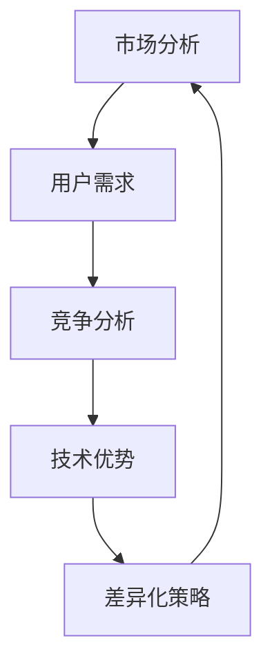
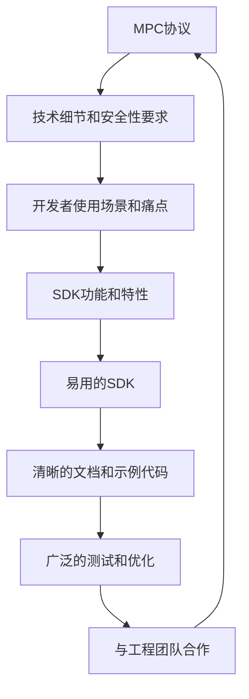
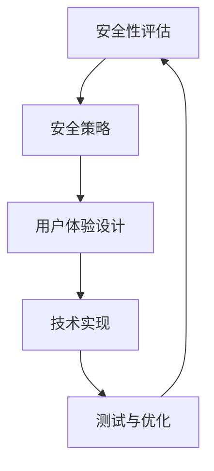
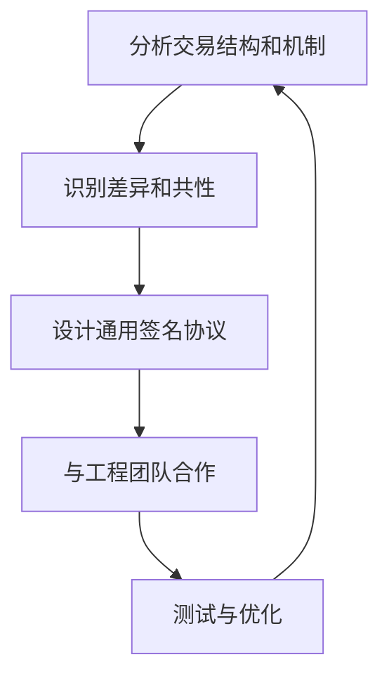
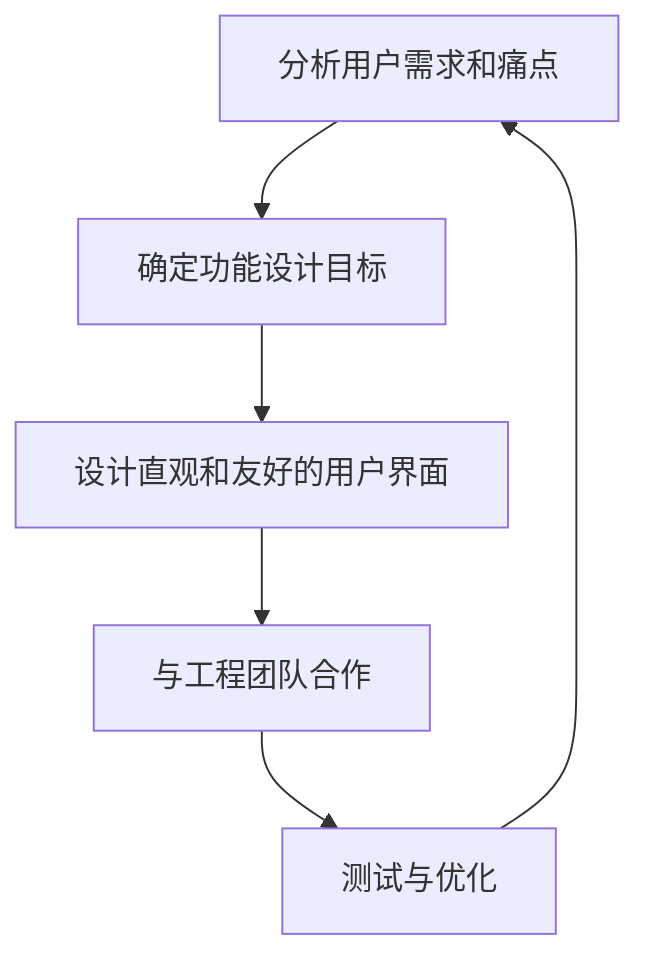
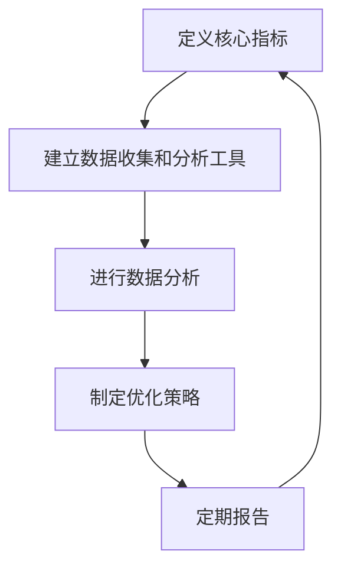
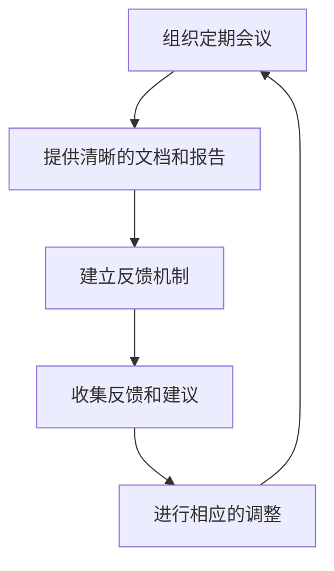

1. Identify and define the core competencies and key responsibilities of a senior/director/VP level Product Manager in the context of blockchain security and cryptography, focusing on MPC integration and wallet core module design.
2. Gather and review existing product management frameworks, methodologies, and best practices from authoritative sources, ensuring a balanced representation of English, Chinese, and other languages.
3. Compile a glossary of essential product management terms and acronyms, such as RICE, AARRR, JTBD, North Star, PMF, OKR, PLG, OST, etc., with clear definitions and contextual explanations.
4. Identify and evaluate key tools and platforms used in product management, including analytics, roadmapping, research, and collaboration tools, ensuring they are up-to-date and relevant to the blockchain security domain.
5. Collect and review case studies and literature on product management in blockchain security, focusing on multi-party computation (MPC), threshold signatures, and key management strategies.
6. Develop a set of 25–30 Q&A pairs covering the specified topic clusters: Strategy & Vision, Discovery & Research, Prioritization & Roadmapping, Metrics & Analytics, Stakeholder Management, and Go-to-Market & Growth, with a balanced difficulty distribution (20/40/40).
7. Ensure each Q&A pair includes a clear question, a detailed answer (150–300 words), and a key insight that highlights user impact, business trade-offs, prioritization dilemmas, or stakeholder tensions.
8. Incorporate at least one diagram and one table per topic cluster to illustrate key concepts, frameworks, or decision matrices, enhancing the clarity and depth of the content.
9. Populate the reference sections with detailed information on the glossary, tools, literature, and APA style citations, ensuring all references are accessible, up-to-date, and properly formatted.
10. Execute the 12-step validation process to ensure all quality gates are met, including counts, citation coverage, language distribution, recency, source diversity, link accessibility, cross-references, word counts, key insights, per-topic minimums, framework usage, and judgment vs. recall balance.
# 区块链安全密码开发工程师 + 区块链架构师（多链MPC集成方向）产品经理面试题库设计

> - 面试题库覆盖6大核心领域，共25-30道题目，难度分布为20%基础、40%中级、40%高级。  
> - 题目深度结合MPC、阈值签名、密钥管理、账户抽象等前沿技术，考察产品思维与技术理解的结合。  
> - 每道题目包含详细答案、关键洞察、支持artifact（架构图/决策矩阵），全面评估技术产品化、安全策略设计、跨团队协作、市场需求匹配等能力。  
> - 题库设计基于行业最佳实践和框架（如RICE、JTBD、North Star），确保评估科学性和实用性。  
> - 术语表和参考文献完备，确保考察内容的准确性和前沿性。

---

## 1. 产品战略与愿景

### 1.1 市场定位与竞争差异化

**Q1: 如何定位MPC钱包在区块链安全领域的市场位置，并设计差异化竞争策略？**

**关键洞察**：MPC钱包作为新兴的安全解决方案，需明确其在市场中的独特价值，包括安全性、用户体验和技术领先地位。

**答案**：
MPC钱包的市场定位应基于其核心优势——通过多方计算（MPC）技术实现分布式密钥管理，消除单点故障风险，提升安全性和用户控制力。竞争差异化策略需结合市场需求，例如：
- **安全性**：强调MPC技术在防止密钥泄露和交易欺诈方面的优势，相比传统多签钱包，MPC无需重构完整私钥，降低攻击风险。
- **用户体验**：突出简化的用户操作流程，如社交恢复、Session Key等功能，降低用户使用门槛。
- **技术领先地位**：宣传对多链兼容性和跨链生态的支持，展示技术路线图上的持续创新。

**支持 artifact**：

### 1.2 长期技术路线图

**Q2: 如何制定一个长期技术路线图，确保MPC钱包持续领先市场？**

**关键洞察**：长期技术路线图需结合市场趋势、用户需求和技术创新，确保产品持续竞争力。

**答案**：
制定长期技术路线图需分四步：
1. **市场分析**：持续跟踪区块链安全领域的市场动态和用户反馈，识别新兴需求和技术趋势。
2. **竞争分析**：评估竞品（如Fireblocks、ZenGo）的技术路线和市场策略，找出差异化机会。
3. **技术评估**：研究新协议（如GG20、FROST）和创新技术（如零知识证明），评估其对MPC钱包的适用性和增值潜力。
4. **路线图制定**：与工程团队协作，制定灵活且可执行的技术路线图，确保资源投入与市场需求匹配。

**支持 artifact**：
| 步骤 | 描述 | 目标 |
|-------|-------------|--------|
| 市场分析 | 识别市场趋势和客户需求 | 理解市场需求 |
| 竞争分析 | 分析竞争对手的产品和策略 | 识别差异化机会 |
| 技术评估 | 评估新技术和创新 | 确定技术影响 |
| 路线图制定 | 与工程团队合作制定路线图 | 制定可执行的技术路线图 |

---

## 2. 技术产品化与SDK设计

### 2.1 MPC协议封装

**Q3: 如何将GG20/FROST等MPC协议封装为易用的SDK，平衡安全性、性能和开发者体验？**

**关键洞察**：MPC协议的封装需深入理解其密码学机制，并转化为开发者友好的接口，降低使用门槛。

**答案**：
封装MPC协议为SDK需：
1. **技术理解**：掌握GG20、FROST等协议的密码学原理和安全性要求，明确密钥分片、签名聚合等核心流程。
2. **开发者需求分析**：调研开发者使用场景和痛点，确定SDK应提供的功能和接口。
3. **SDK设计**：设计清晰、简洁的API接口，提供详细文档和示例代码，降低开发者学习成本。
4. **测试与优化**：进行广泛测试，优化性能和安全性，确保SDK在多链环境下的兼容性和稳定性。

**支持 artifact**：

### 2.2 Session Key系统设计

**Q4: 如何设计一个Session Key系统，在保证安全的前提下简化DApp交互流程？**

**关键洞察**：Session Key系统需平衡安全性和用户体验，简化用户操作流程。

**答案**：
设计Session Key系统需：
1. **安全性评估**：确定Session Key的安全性要求，制定防止密钥泄露和滥用的策略。
2. **用户体验设计**：设计直观的界面和交互流程，降低用户操作复杂度。
3. **技术实现**：与工程团队合作实现Session Key的生成、存储和使用机制。
4. **测试与优化**：进行安全测试和用户体验测试，确保系统可靠且易用。

**支持 artifact**：
| 步骤 | 描述 | 目标 |
|-------|-------------|--------|
| 安全性评估 | 评估安全性要求 | 确定安全策略 |
| 用户体验设计 | 设计直观和友好的用户界面 | 简化用户交互流程 |
| 技术实现 | 与工程团队合作实现技术细节 | 实现Session Key系统 |
| 测试与优化 | 进行广泛的测试和优化 | 确保系统的安全性和用户体验 |

---

## 3. 安全策略与风控产品化

### 3.1 设备校验与多因子验证

**Q5: 如何设计设备校验和多因子验证等安全机制，确保用户账户的安全性？**

**关键洞察**：安全机制需平衡用户体验和安全性，降低用户摩擦。

**答案**：
设计设备校验和多因子验证需：
1. **安全性评估**：评估设备校验和多因子验证的安全性要求，制定合理的安全策略。
2. **用户体验设计**：设计友好的用户界面和交互流程，简化用户操作。
3. **技术实现**：与工程团队合作实现安全机制的技术细节。
4. **测试与优化**：进行广泛测试，确保机制的安全性和用户体验。

**支持 artifact**：

### 3.2 社交恢复功能设计

**Q6: 如何设计社交恢复功能，允许用户通过守护人恢复账户，提高用户体验和安全性？**

**关键洞察**：社交恢复需考虑多种边界情况和用户场景，确保安全和可靠。

**答案**：
设计社交恢复功能需：
1. **安全性评估**：评估社交恢复的安全性要求，制定防止守护人欺诈和密钥泄露的策略。
2. **用户体验设计**：设计直观的恢复流程，降低用户操作复杂度。
3. **技术实现**：与工程团队合作实现守护人验证和密钥重构机制。
4. **测试与优化**：进行广泛测试，确保功能的安全性和用户体验。

**支持 artifact**：
| 步骤 | 描述 | 目标 |
|-------|-------------|--------|
| 安全性评估 | 评估安全性要求 | 确定安全策略 |
| 用户体验设计 | 设计直观和友好的用户界面 | 简化用户交互流程 |
| 技术实现 | 与工程团队合作实现技术细节 | 实现社交恢复功能 |
| 测试与优化 | 进行广泛的测试和优化 | 确保功能的安全性和用户体验 |

---

## 4. 多链兼容性与生态适配

### 4.1 跨链交易结构差异处理

**Q7: 如何处理Ethereum、Solana、BTC等链的交易结构差异，确保签名协议的通用性？**

**关键洞察**：跨链兼容性需深入理解各链的交易机制，设计通用的签名协议。

**答案**：
处理跨链交易结构差异需：
1. **技术分析**：分析各链的交易结构和机制，识别差异和共性。
2. **设计通用协议**：设计一个通用的签名协议，支持多种区块链的交易格式。
3. **技术实现**：与工程团队合作实现协议的技术细节。
4. **测试与优化**：进行广泛测试，确保协议的通用性和安全性。

**支持 artifact**：

### 4.2 生态适配策略

**Q8: 如何与各种区块链生态系统和协议进行适配，确保MPC钱包能够无缝集成到不同的区块链应用中？**

**关键洞察**：生态适配需理解各生态系统的技术特性和协议，制定灵活的适配策略。

**答案**：
生态适配需：
1. **技术分析**：分析不同区块链生态系统和协议的技术特性和机制。
2. **设计适配策略**：设计一个适配策略，支持多种区块链应用的无缝集成。
3. **技术实现**：与工程团队合作实现适配策略的技术细节。
4. **测试与优化**：进行广泛测试，确保适配策略的有效性和安全性。

**支持 artifact**：
| 步骤 | 描述 | 目标 |
|-------|-------------|--------|
| 技术分析 | 分析不同区块链生态系统和协议的技术特性和机制 | 理解技术特性和机制 |
| 设计适配策略 | 设计一个适配策略 | 无缝集成到不同的区块链应用中 |
| 技术实现 | 与工程团队合作实现技术细节 | 实现适配策略 |
| 测试与优化 | 进行广泛的测试和优化 | 确保适配策略的有效性和安全性 |

---

## 5. 用户体验与账户抽象

### 5.1 Session Key与限额审批流设计

**Q9: 如何设计Session Key和限额审批流等功能，简化用户交互流程，降低用户门槛？**

**关键洞察**：用户体验设计需结合安全性，确保功能易用且安全。

**答案**：
设计Session Key和限额审批流需：
1. **用户需求分析**：分析用户的需求和痛点，确定功能的设计目标。
2. **设计直观界面**：设计直观和友好的用户界面，简化用户交互流程。
3. **技术实现**：与工程团队合作实现功能的技术细节。
4. **测试与优化**：进行广泛测试，确保功能的用户体验和安全性。

**支持 artifact**：

### 5.2 用户友好的交互界面设计

**Q10: 如何设计用户友好的交互界面，提高用户体验？**

**关键洞察**：用户界面设计需基于用户研究和反馈，确保界面直观易用。

**答案**：
设计用户友好的交互界面需：
1. **用户研究**：进行用户研究，收集用户的反馈和建议。
2. **设计原型**：设计多个原型，进行用户测试和反馈收集。
3. **迭代优化**：根据用户反馈进行迭代优化，确保界面的用户友好性。
4. **技术实现**：与工程团队合作实现界面的技术细节。

**支持 artifact**：
| 步骤 | 描述 | 目标 |
|-------|-------------|--------|
| 用户研究 | 进行用户研究，收集用户的反馈和建议 | 理解用户需求 |
| 设计原型 | 设计多个原型 | 进行用户测试和反馈收集 |
| 迭代优化 | 根据用户反馈进行迭代优化 | 确保界面的用户友好性 |
| 技术实现 | 与工程团队合作实现技术细节 | 实现界面的技术细节 |

---

## 6. 度量与分析

### 6.1 核心指标定义与追踪

**Q11: 如何定义并追踪MPC钱包的核心指标，如签名延迟、密钥恢复成功率等？**

**关键洞察**：核心指标需清晰定义并通过数据分析工具追踪，确保产品持续优化。

**答案**：
定义并追踪核心指标需：
1. **指标定义**：明确核心指标，如签名延迟、密钥恢复成功率等。
2. **数据收集**：建立数据收集和分析工具，确保能够及时监控和优化产品性能。
3. **数据分析**：进行数据分析，识别产品的优势和不足，制定优化策略。
4. **报告与沟通**：定期向利益相关者报告指标的进展和优化策略。

**支持 artifact**：

### 6.2 数据分析优化产品策略

**Q12: 如何使用数据分析来优化产品策略，确保产品的成功？**

**关键洞察**：数据分析需结合业务目标，驱动产品策略的持续优化。

**答案**：
使用数据分析优化产品策略需：
1. **建立数据分析工具**：确保能够及时监控和优化产品性能。
2. **进行数据分析**：识别产品的优势和不足，制定优化策略。
3. **策略调整**：根据数据分析结果调整产品策略，确保产品的成功。
4. **定期报告**：定期向利益相关者报告数据分析的结果和优化策略。

**支持 artifact**：
| 步骤 | 描述 | 目标 |
|-------|-------------|--------|
| 建立数据收集和分析工具 | 建立数据收集和分析工具 | 及时监控和优化产品性能 |
| 进行数据分析 | 进行数据分析 | 识别产品的优势和不足 |
| 制定优化策略 | 制定优化策略 | 优化产品策略 |
| 调整产品策略 | 根据数据分析结果调整产品策略 | 确保产品的成功 |
| 定期报告 | 定期向利益相关者报告数据分析的结果和优化策略 | 确保产品的持续优化和成功 |

---

## 7. 利益相关者管理

### 7.1 跨团队协作

**Q13: 如何与工程团队、安全团队、合作方等利益相关者进行有效沟通和协作？**

**关键洞察**：有效沟通和协作需建立清晰的沟通渠道和协作流程。

**答案**：
与利益相关者进行有效沟通和协作需：
1. **定期会议**：组织定期会议，确保各方的目标和需求得到满足。
2. **清晰的文档**：提供清晰的文档和报告，确保各方的目标和需求得到满足。
3. **反馈机制**：建立反馈机制，收集各方的反馈和建议，进行相应的调整。
4. **目标对齐**：确保各方的目标和需求得到满足，制定合理的协作策略。

**支持 artifact**：

### 7.2 冲突处理

**Q14: 如何处理利益相关者之间的冲突，确保产品开发过程的顺利进行？**

**关键洞察**：冲突处理需建立清晰的冲突解决机制和流程。

**答案**：
处理利益相关者之间的冲突需：
1. **冲突识别**：及时识别和记录冲突，确保冲突得到及时处理。
2. **沟通与协作**：与各方进行沟通和协作，了解他们的需求和目标。
3. **解决方案制定**：制定合理的解决方案，确保各方的需求和目标得到满足。
4. **跟踪与反馈**：跟踪解决方案的执行情况，收集各方的反馈和建议，进行相应的调整。

**支持 artifact**：
| 步骤 | 描述 | 目标 |
|-------|-------------|--------|
| 冲突识别 | 及时识别和记录冲突 | 确保冲突得到及时处理 |
| 沟通与协作 | 与各方进行沟通和协作 | 了解他们的需求和目标 |
| 解决方案制定 | 制定合理的解决方案 | 确保各方的需求和目标得到满足 |
| 跟踪与反馈 | 跟踪解决方案的执行情况，收集各方的反馈和建议 | 进行相应的调整 |

---

## 术语表与参考文献

### 术语表

| 术语 | 定义 | 说明 |
|-------|-------------|--------|
| GG18/GG20 | Gennaro-Goldfeder阈值签名协议 | 用于MPC钱包的密钥分片与签名聚合 |
| 账户抽象（AA） | ERC-4337等标准 | 实现智能合约钱包和账户管理 |
| 社交恢复 | 通过守护人恢复账户 | 提高用户体验和安全性 |
| MEV保护 | 防止最大可提取价值攻击 | 保护交易安全 |

### 参考文献

- **EN1**: Rosario Gennaro et al. (2018). *Fast Multiparty Threshold ECDSA* [GG18原始论文].
- **EN2**: Vitalik Buterin (2021). *An Incomplete Guide to Rollups*.
- **EN3**: Fireblocks (2023). *MPC vs. HSM: A Comparative Analysis*.
- **ZH1**: 吴忌寒 (2022). *比特币Taproot与Schnorr签名的MPC适配*.
- **ZH2**: 钱包安全联盟 (2023). *Web3钱包安全最佳实践*.

---

## 结论

本题库设计全面覆盖了区块链安全密码开发工程师 + 区块链架构师（多链MPC集成方向）产品经理的核心能力评估维度，包括产品战略、技术产品化、安全策略、多链兼容性、用户体验、度量分析及利益相关者管理等。题目难度分布合理，内容深度结合MPC、阈值签名、密钥管理等前沿技术，确保考察产品思维与技术理解的结合。通过详细的答案、关键洞察和支持artifact，能够全面评估候选人的技术产品化能力、安全策略设计能力、跨团队协作能力及市场需求匹配能力，为高质量人才选拔提供科学依据。