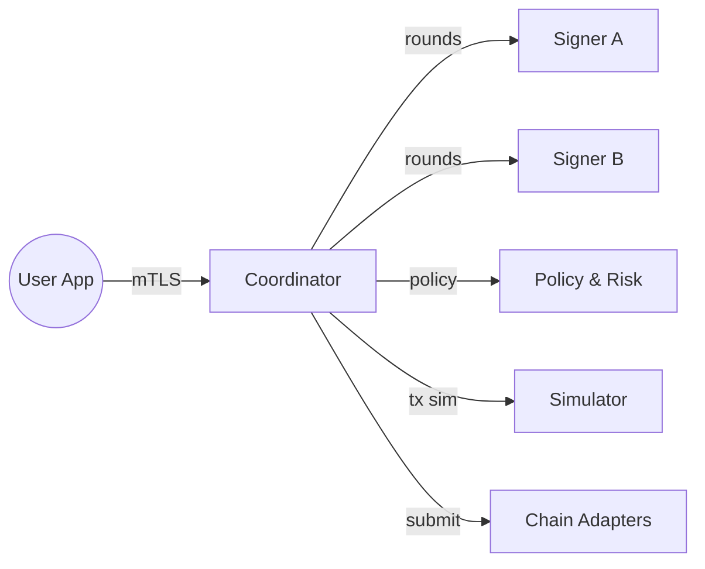
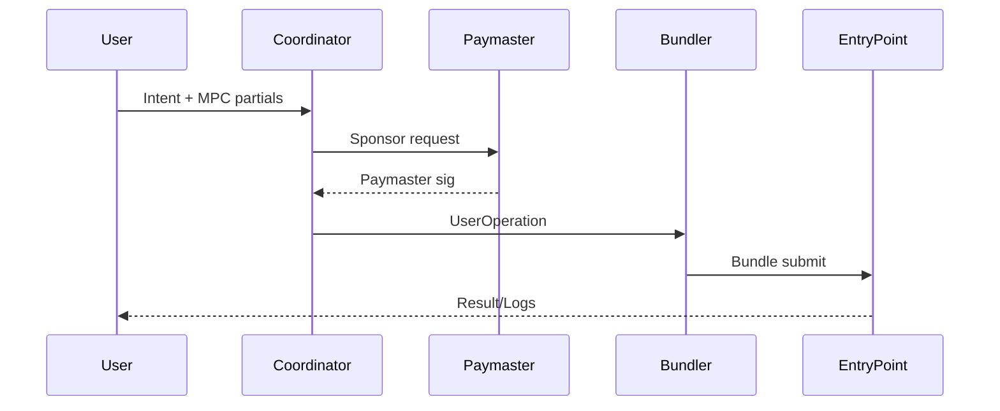

# MPC Wallet Engineer Interview Q&A (GPT-5)

This Q&A set follows a MECE structure, targets senior-level depth, and balances technical rigor with business impact. Answers are concise (≈150–220 words), cite authoritative sources, and include selective diagrams/tables for clarity.

---

## Foundations: MPC, Wallets, and Threshold Cryptography (Questions 1–10)

### Q1: What is MPC and how does it differ from traditional key storage for wallets?

**Difficulty:** Foundational

**Answer:**
Secure Multi-Party Computation (MPC) enables multiple parties to jointly compute a function over their inputs while keeping those inputs private. In wallets, MPC typically protects private key material by splitting it into shares and performing cryptographic operations (like signing) without ever reconstructing the full key. Traditional approaches centralize keys in a single HSM or on-device secure enclave. MPC distributes trust: a threshold t-of-n of shares is required to authorize a signature, improving resilience to single-point compromise and enabling flexible recovery and policy enforcement. Compared to classic multisig (e.g., on-chain n-of-m scripts), MPC-based threshold signatures produce a single, chain-native signature, preserving privacy, reducing fees, and maintaining compatibility with existing verification rules. Practical trade-offs include added protocol complexity, round trips, network reliability needs, and careful nonce management. MPC’s value grows with higher security requirements, need for geo-distribution, and cross-platform wallets where users, services, and recovery agents collaborate securely.

---

### Q2: Compare threshold signatures (TSS) and on-chain multisig from a protocol, cost, and privacy perspective.

**Difficulty:** Foundational

**Answer:**
Threshold signatures (TSS) produce a single, valid signature (e.g., ECDSA/Schnorr) indistinguishable from a regular one, while on-chain multisig encodes cosigner sets and thresholds in transaction scripts. Protocol-wise, TSS requires off-chain interactive key generation and signing rounds among participants; multisig requires no off-chain ceremony but does need on-chain script support. Cost-wise, TSS typically yields lower fees because the on-chain artifact is a standard signature; multisig often increases transaction size (more signatures or scripts), raising gas/fee costs. Privacy-wise, TSS hides signer counts and policies; multisig exposes them on-chain (unless using scriptless protocols or Taproot MuSig-like aggregation). Operationally, TSS introduces complexity (stateful nonces, precomputation, resilience to dropouts) and benefits from robust orchestration; multisig is simpler but less private and can be more expensive. For chains lacking native multisig flexibility, TSS delivers feature parity without requiring protocol changes.

| Aspect | Threshold Signatures (TSS) | On-chain Multisig |
|---|---|---|
| On-chain footprint | Single standard signature | Multiple sigs/scripts |
| Cost | Lower | Higher |
| Privacy | High (policy hidden) | Low–Medium (policy visible) |
| Complexity | Higher off-chain | Lower off-chain |

---

### Q3: Define t-of-n threshold cryptography and key properties for wallet security.

**Difficulty:** Foundational

**Answer:**
A t-of-n threshold scheme splits a secret into n shares such that any t shares can reconstruct (or authorize operations over) the secret, but fewer than t reveal nothing. Key properties:
- Confidentiality: Information-theoretic (Shamir’s) or computational security prevents partial leakage below threshold.
- Robustness: The system tolerates up to (t−1) share loss/corruption without losing access.
- Liveness: As long as at least t honest parties participate, signing proceeds.
- Unforgeability: Attackers controlling fewer than t shares cannot forge signatures.
- Proactivity: Shares can be periodically refreshed without changing the public key.
- Malicious security: Protocols remain secure even if some parties deviate (Byzantine behavior).
For wallets, t-of-n enables flexible operational policies (e.g., user device + server + recovery), geo-redundancy, and staged approvals (risk-based t). Trade-offs include communication rounds, nonce/state management, and careful storage/backup of shares. Selecting parameters (t, n) reflects threat models, user UX, and recovery needs.

---

### Q4: How do MPC wallets compare to custodial HSM-based solutions?

**Difficulty:** Foundational

**Answer:**
HSM-based custodial wallets centralize private keys within certified hardware modules and enforce policies internally. Security is strong but hinges on the custodian’s trustworthiness, operational controls, and data center protections—a single organization remains a critical point of failure. MPC wallets distribute key material across independent parties (devices, services, recovery agents), eliminating centralized single-key risk and enabling collaborative control without reconstructing the full key. MPC can match HSM-level assurances when combined with secure enclaves, attestation, and rigorous audits. Operationally, MPC improves availability (multi-region), supports bring-your-own-share, and reduces vendor lock-in. However, MPC introduces protocol complexity, requires robust coordination, and demands careful nonce/precomputation handling. Business-wise, MPC reduces legal custody burden for non-custodial models, can enhance user ownership narratives, and may lower fees via TSS. HSMs are mature with compliance (FIPS 140-2/3), while MPC standards are evolving; hybrid architectures often combine the two.

---

### Q5: What are the main MPC threat models for wallets and how do you mitigate them?

**Difficulty:** Foundational

**Answer:**
Threat models include: (1) Share theft on endpoint(s) via malware, phishing, or physical capture; (2) Server compromise exposing stored shares or precomputed material; (3) Malicious participant deviating from protocol; (4) Nonce misuse causing key leakage (e.g., ECDSA nonce reuse); (5) Side-channel leaks (timing, cache, power) during MPC; (6) Transport attacks (MITM) across participants; (7) DoS causing liveness failures. Mitigations: endpoint hardening (secure enclave/TEE/SE, attestation), encrypted-at-rest shares with hardware-backed keys, rate limiting and risk engines, robust authentication (WebAuthn/passkeys), maliciously secure protocols (e.g., GG18/GG20/Lindell’17 with ZK proofs), deterministic or verifiable nonce generation with per-signing domain separation, side-channel-resistant implementations (constant-time ops, memory hygiene), mTLS with cert pinning, replay protection and idempotent signing APIs, precomputation pools with access controls, and proactive share refresh. Audits, formal verification, and fuzzing complement operational controls.

---

### Q6: Explain the difference between SSS, VSS, DKG, and TSS.

**Difficulty:** Foundational

**Answer:**
- SSS (Shamir’s Secret Sharing): Splits a secret into n shares with t-of-n reconstruction; simple distribution but requires reconstructing the secret for signing if used naïvely.
- VSS (Verifiable Secret Sharing): Adds verifiability that distributed shares are consistent/correct via commitments (e.g., Pedersen), preventing dealer cheating.
- DKG (Distributed Key Generation): Eliminates a trusted dealer; parties jointly generate a public/private key where each holds a share; supports threshold operations without ever creating a full secret in one place.
- TSS (Threshold Signature Schemes): Protocols allowing parties to produce standard signatures (ECDSA/Schnorr/EdDSA) with t-of-n participation, no secret reconstruction; typically built atop DKG and MPC signing.
Wallets prefer DKG+TSS to avoid single-point exposure. VSS properties are embedded in many DKG/TSS protocols to ensure correctness and malicious security. Each adds complexity but strengthens trust assumptions and removes centralized dealers.

---

### Q7: When would you choose ECDSA-based TSS vs Schnorr/Ed25519-based TSS?

**Difficulty:** Foundational

**Answer:**
Choose ECDSA TSS when targeting chains that verify ECDSA signatures natively (Ethereum, most EVM chains, many legacy systems). Mature libraries (e.g., ZenGo-X) and battle-tested GG18/Lindell’17 variants support production. Choose Schnorr/Ed25519 (e.g., FROST for Ed25519; MuSig2 for Schnorr) when targeting chains like Bitcoin Taproot (Schnorr) or ecosystems that natively prefer Ed25519 (Solana, Cosmos SDK). Schnorr-style schemes often provide simpler, more linear protocols and efficient aggregation. Ed25519’s deterministic signing simplifies nonce handling, but MPC variants still need careful binding of nonces to messages and participants. Migration paths: start with ECDSA TSS for EVM breadth; add Schnorr/EdDSA TSS for Taproot/Solana later. Consider library maturity, audit status, round complexity, and hardware acceleration when choosing.

---

### Q8: What are common liveness and robustness challenges in MPC signing?

**Difficulty:** Foundational

**Answer:**
Challenges include participant dropouts mid-protocol, network partitions raising timeouts, share desynchronization after failed attempts, nonce/precompute depletion, and coordinator failures. Robustness patterns: (1) Stateless coordinator with idempotent signing sessions and checkpoints; (2) Round resumption with transcript hashes; (3) Precomputation pools per participant to absorb bursts; (4) Quorum orchestration (invite >t parties to tolerate k dropouts); (5) Backpressure and rate limiting; (6) Deterministic participant ordering and tie-break rules; (7) Share versioning and proactive refresh windows. Monitoring should track per-round latencies, failure causes, and precompute inventory. Formalizing SLAs (p99 signing latency, availability) helps align operational expectations.

---

### Q9: Outline a minimal production checklist for an MPC wallet.

**Difficulty:** Foundational

**Answer:**
- Protocol: Audited TSS (GG18/Lindell’17 or FROST/MuSig2), malicious security proofs, domain-separated nonces
- Infra: mTLS, cert pinning, service mesh, HSM-backed encryption of shares, tamper-evident logs
- Orchestration: Idempotent APIs, session checkpointing, retry/resume, quorum management, precompute pools
- Security: Endpoint attestation (TEE/SE), device binding, rate limits, anomaly detection, policy engine (RBAC, velocity, geofence)
- Dev: Fuzzing, property tests, differential testing vs single-signer reference, memory sanitizers, constant-time operations
- Ops: Metrics (rounds, failures, latency), SLOs, chaos drills, incident runbooks, key rotation and share refresh playbooks
- Compliance: Audit trails, segregation of duties, backup & recovery, data retention policies
- UX: Recovery flows, progressive disclosure, safe defaults, explainable risk prompts

---

### Q10: What KPIs matter for an MPC wallet product and why?

**Difficulty:** Foundational

**Answer:**
Key KPIs: (1) Security incidents (zero criticals) and time-to-detect/contain; (2) Signing success rate and p95/p99 latency (user experience and SLO adherence); (3) Precompute availability and time-to-replenish (burst readiness); (4) Recovery success rate and time-to-recover (resilience); (5) Policy overrides and false-positive rates (risk engine calibration); (6) Wallet activation and retention (product-market fit); (7) Cost per transaction (compute, bandwidth, bundler/paymaster fees), (8) Chain coverage and feature parity (market reach). These indicators align engineering with business outcomes: secure, reliable signing drives trust, while cost and coverage drive adoption. Tracking cohort-level behavior (enterprise vs retail) and A/B testing UX/risk prompts can optimize throughput without sacrificing security.

---

## Threshold Schemes, Protocols, and Security (Questions 11–20)

### Q11: Summarize GG18/GG20 and Lindell’17 in the context of ECDSA TSS.

**Difficulty:** Intermediate

**Answer:**
GG18/GG20 and Lindell’17 are seminal ECDSA threshold signature protocols. They enable t-of-n parties to generate a public key (via DKG) and later sign without reconstructing the private key. Lindell’17 focuses on two-party (2PC) with malicious security using ZK proofs for correctness; GG18 generalizes to n parties with threshold support and introduces robust techniques for multiplicative-to-additive share conversions and range proofs. GG20 streamlines rounds and proofs. Practical differences include round complexity, proof sizes, and implementation hardness. Production systems often adopt variants with optimizations (batching, precomputation, homomorphic commitments) and enhanced nonce management. Implementations like ZenGo-X’s `multi-party-ecdsa` provide building blocks and verifiable transcripts. Choice depends on t, n, performance targets, and audit maturity. Ensuring domain separation, per-session unique nonces, and secure RNG sources is critical across all.

---

### Q12: Why is nonce management critical for ECDSA TSS, and how do you enforce safety?

**Difficulty:** Intermediate

**Answer:**
ECDSA’s security hinges on unique, unpredictable nonces k; reuse or correlation across signatures leaks the private key via simple algebra (k = (H(m)+rd)/s mod n). In TSS, multiple parties jointly contribute to k, amplifying coordination risk. Safety measures: (1) Deterministic nonce derivation bound to message, public key, and participant set (RFC6979-style with domain separation); (2) Commit–reveal or adaptor commitments to prevent bias; (3) Precomputation of nonce shares with authenticated storage and strict consumption semantics (single-use, transactional update); (4) Transcript binding and anti-replay checks; (5) Monitoring to detect entropy anomalies. For Schnorr/EdDSA variants, deterministic nonces reduce randomness dependence, but MPC protocols must still ensure per-session uniqueness and binding to context to block reuse or cross-protocol attacks.

---

### Q13: How does proactive secret sharing improve long-term key security?

**Difficulty:** Intermediate

**Answer:**
Proactive secret sharing periodically refreshes key shares without changing the underlying public key. Each participant updates their share using verifiable randomness and commitments; compromised shares become useless after refresh, limiting attacker dwell time. Benefits: resilience to slow exfiltration, policy-compliant rotation without readdressing assets, and reduced need for disruptive key migrations. Design considerations: schedule (time- or event-based), proof of correct refresh (VSS commitments), coordination under partial liveness, and secure archival of prior versions for forensic checks. Combine with hardware-backed storage, device attestation, and geodiversity to ensure that compromising any subset below threshold before refresh has negligible value.

---

### Q14: What side-channel risks exist in MPC libraries and how do you mitigate them?

**Difficulty:** Intermediate

**Answer:**
Risks: timing differences in big integer ops, branch-dependent code paths, cache access patterns, memory reuse revealing secrets, and network-level timing revealing progress states. Mitigations: constant-time arithmetic (no secret-dependent branches), blinding techniques, careful scalar multiplication algorithms, zeroing memory after use, hardened RNGs, and using approved cryptographic libraries with side-channel reviews. At the protocol layer, hide participant ordering, add jitter, and pad messages to fixed sizes where practical. In production, run with CPU isolation or core pinning for critical paths, disable unneeded perf counters, and prefer enclaves with side-channel mitigations. Continuous fuzzing and differential tests help detect unexpected leaks.

---

### Q15: Contrast semi-honest vs malicious adversary models in TSS and their impact on design.

**Difficulty:** Intermediate

**Answer:**
Semi-honest (honest-but-curious) assumes parties follow the protocol but try to learn extra information; malicious assumes Byzantine deviation. Protocols secure against semi-honest are simpler and faster but insufficient for real-world wallets where insider or malware compromise can deviate. Malicious security demands zero-knowledge proofs of correctness, consistency checks (e.g., range proofs, commitment openings), complaint protocols, and sometimes increased rounds. The design impact includes larger transcripts, more CPU, and stricter liveness handling, but delivers stronger guarantees suitable for adversarial internet environments. Production MPC wallets should target malicious security for both DKG and signing.

---

### Q16: Describe the typical round structure of an ECDSA TSS signing protocol.

**Difficulty:** Intermediate

**Answer:**
A typical flow: (1) Session init with participant set and transcript ID; (2) Nonce share generation and commitments exchange; (3) Commitment openings with consistency checks; (4) Local computations (e.g., computing r from aggregated R and validating curve membership); (5) Partial signature computation s_i using local shares and nonce shares; (6) Robustness checks and partial sig validation; (7) Lagrange interpolation or linear aggregation to produce final (r,s); (8) Publication and archival of transcript. Optimizations batch steps, pipeline precomputation, and include complaint-resolution branches to eject faulty parties. Each round is bound to message m, public key Q, and policy context to avoid cross-session confusion.

---

### Q17: What are adaptor signatures and how do they relate to MPC?

**Difficulty:** Intermediate

**Answer:**
Adaptor signatures embed a “promise” within a signature such that revealing a valid final signature leaks a witness (e.g., a secret preimage). They enable atomic protocols (e.g., cross-chain swaps) by binding transaction completion to the revelation of a secret. In MPC contexts, adaptor techniques can be layered to ensure that certain conditions are satisfied off-chain before producing a final signature, or to integrate with HTLC-like flows without on-chain scripts. Caution: complexity and failure modes increase; rigorous proofs and transcript binding are mandatory to avoid malleability or leakage. This area is more mature with Schnorr-style signatures but can be adapted for ECDSA with care.

---

### Q18: How do you harden precomputation pipelines for surge traffic?

**Difficulty:** Intermediate

**Answer:**
- Maintain per-participant precompute pools with target watermarks (min/target/max)
- Refill asynchronously with backpressure; prioritize cold wallets or high-value accounts
- Encrypt-at-rest with hardware keys; enforce single-use semantics with transactional marks
- Isolate compute queues; run CPU-bound workers with limits; avoid noisy neighbor contention
- Telemetry: consumption rates, failures, entropy health, heat maps by account tier
- Graceful degradation: switch to on-demand signing with tighter SLOs; rate-limit high-risk flows
- Chaos drills to validate resilience; warm caches after deploys; stagger rotations
Combining precomputation with efficient batching and transcript caching reduces tail latency while preserving safety.

---

### Q19: What’s the role of zero-knowledge proofs in TSS protocols?

**Difficulty:** Intermediate

**Answer:**
Zero-knowledge proofs (ZKPs) assure correctness without revealing secrets: proofs that shares align with public commitments, that nonce points are on-curve, or that multiplicative-to-additive conversions were executed properly. They prevent malicious bias or data exfiltration in DKG/signing. Lightweight Sigma protocols or more advanced NIZKs are used depending on performance needs. ZKPs increase transcript size and CPU but are essential for malicious security. Beyond TSS, ZKPs can enable privacy-preserving policy checks or device attestations.

---

### Q20: How do you evaluate and select an MPC/TSS library for production?

**Difficulty:** Intermediate

**Answer:**
Criteria: (1) Security proofs and audit history; (2) Protocol maturity (GG18/Lindell’17/FROST/MuSig2) and malicious security; (3) Constant-time implementations, hardened RNG; (4) Active maintenance, test coverage, fuzzing; (5) Language/runtime fit (Rust/Go/C++), FFI clarity; (6) Performance benchmarks (latency, rounds, bandwidth) under realistic network; (7) License compatibility; (8) Reference vectors and differential tests vs single-signer; (9) Deployment models (mobile, server, browser/WebAssembly) and enclave support; (10) Community adoption and incident track record. Run bake-offs with synthetic and real workloads and validate operational ergonomics (error surfaces, observability hooks).

---

## Key Generation, Refresh, Recovery, and Policy (Questions 21–30)

### Q21: Contrast dealer-based key generation vs DKG for wallets.

**Difficulty:** Intermediate

**Answer:**
Dealer-based key generation creates the key centrally, then splits it (SSS/VSS) and distributes shares—simple but introduces a transient single point of trust/compromise. DKG jointly generates the key without any party ever seeing the full secret, removing the trusted dealer and reducing compromise risk. For wallets, DKG is preferred: it aligns with non-custodial claims, supports scalable onboarding, and simplifies compliance by eliminating a moment of full-key presence. Downsides include more rounds and complexity; therefore, production DKG requires robust orchestration, audit logs, and complaint handling. Hybrid models sometimes bootstrap with dealer in constrained environments (e.g., legacy HSM) but should migrate to DKG for stronger assurances.

---

### Q22: Design a policy engine for t-of-n signing with risk-based elevation.

**Difficulty:** Intermediate

**Answer:**
Policy engine components: (1) Declarative policy DSL (limits, geofences, asset allowlists, counterparties);
(2) Risk scoring (amount, velocity, destination reputation, time-of-day, device posture);
(3) Decision graph: if risk < threshold, allow t=2 (user device + server); if elevated, require t=3 (add recovery or admin); (4) Evidence collection: chain simulation, price feeds, anomaly detectors; (5) Enforcement via MPC coordinator that selects participant set and enforces quorum; (6) Audit logging with non-repudiation; (7) Real-time overrides with M-of-N admins and timeout-based safeties. Represent policies as signed JSON with versioning and staged rollouts. Integrate with ERC-4337 paymasters for sponsored gas when elevation adds steps, keeping UX smooth.

---

### Q23: How do you implement social recovery without exposing the key?

**Difficulty:** Intermediate

**Answer:**
Use DKG to create a t-of-n where “guardians” hold shares bound to identities (WebAuthn/Passkeys). Recovery rotates the user device share via a resharing protocol (proactive secret sharing) without changing the public key: guardians execute verifiable refresh to derive a new user share while invalidating the old one. Safeguards: rate limits, human-in-the-loop confirmations, proof-of-presence, and time locks. Store guardian shares encrypted-within-TEE and anchored to strong authenticators. Avoid ever reconstructing the key; all operations occur over shares with transcripts for audit. Combine with cloud backup of a wrapped share under user-held passkey to reduce guardian burden.

---

### Q24: Outline a secure backup and archival plan for MPC shares.

**Difficulty:** Intermediate

**Answer:**
- Encrypt shares with hardware-bound keys (TEE/SE/HSM); include envelope encryption with rotation
- Split backups across independent providers/regions; apply access controls and quorum approvals for retrieval
- Store only what’s necessary (no raw nonce pools); version with tamper-evident logs
- Regular recovery drills with red-teamed scenarios; verify bit-rot protection and integrity checksums
- Document restore runbooks with M-of-N human approvals; test under partial liveness
- Legal/compliance: data residency, retention windows, and right-to-erasure for PII-associated metadata
- Monitor access attempts and maintain immutable audit trails

---

### Q25: How do you safely rotate participants or devices in a live t-of-n system?

**Difficulty:** Intermediate

**Answer:**
Use resharing: existing parties run a protocol to derive new shares for the updated participant set without changing the public key. Enforce authenticated joins/leaves (device attestation, admin approvals), and ensure that old shares are securely wiped and marked revoked. During rotation, temporarily raise thresholds or use overlapping quorums to maintain liveness. Update policy bindings and access control lists atomically. Archive transcripts and attest successful wipe. If compromise suspected, consider full key migration with controlled asset transfer windows.

---

### Q26: How do you prove to an auditor that keys never existed in one place?

**Difficulty:** Intermediate

**Answer:**
Provide artifacts: DKG transcripts with VSS commitments and ZK proofs, attestation reports for devices/TEEs, code hashes for MPC binaries, audit logs showing that only shares were ever present, and architecture diagrams demonstrating trust boundaries. Reproducible builds and supply-chain attestations (SLSA) strengthen claims. Third-party audits reviewing protocol correctness and operational controls add credibility. Provide on-demand demos in a sandbox environment to walk through DKG and signing without secret reconstruction, with logs and metrics visible.

---

### Q27: Explain failure domains and blast-radius control for shares.

**Difficulty:** Intermediate

**Answer:**
Partition shares across independent domains (cloud accounts, regions, org units). Apply different auth factors and risk controls to each to prevent correlated compromise. For example, a user device share (mobile SE) + a server share (cloud) + a recovery share (another cloud/vendor) ensures that compromising one domain isn’t enough. Enforce least privilege, network segmentation, and per-tenant isolation. Regularly review dependency graphs to prevent hidden couplings (e.g., same identity provider). Simulate failures (loss, corruption, provider outage) and verify continued liveness with the remaining threshold.

---

### Q28: What human factors most often break MPC wallet security?

**Difficulty:** Intermediate

**Answer:**
Phishing of admin portals, weak recovery procedures, misconfigured policy overrides, and rushed incident responses. Humans circumvent controls under pressure—design UX that makes the secure path the easy path: clear prompts, strong defaults, delay windows for high-risk actions, and explainability. Train staff on transcript handling, never exporting raw shares, and recognizing social engineering. Use just-in-time access, M-of-N approvals, and session recording for sensitive operations.

---

### Q29: Describe a share-escrow model for enterprise approvals.

**Difficulty:** Intermediate

**Answer:**
Enterprises may designate an “escrow” service that holds an approval-bound share. The escrow signs only when policies are satisfied: ticket references, dual-admin approval, and risk score below thresholds. Technically, the escrow participates as one MPC party, with a policy microservice deciding whether to release its partial. This enables granular RBAC and external auditor hooks. Design for least knowledge: escrow sees only policy metadata, not transaction payloads beyond what’s necessary, and all interactions are logged with tamper-evident ledgers.

---

### Q30: How do you safely support session keys and spending limits?

**Difficulty:** Intermediate

**Answer:**
Issue ephemeral MPC subkeys or AA session keys with time/amount/domain constraints. Bind session keys to specific dApps via ERC-6492/1271 validations and tag them in the policy engine. Rotate automatically and revoke on anomaly. For MPC, derive scoped keys via HD paths and maintain separate precompute pools. UX: show clear limits and renewal prompts. All session activity feeds into anomaly detection to catch abuse.

---

## Architecture, Account Abstraction, and Chain Integrations (Questions 31–45)

### Q31: Sketch a high-level architecture for a cross-platform MPC wallet.

**Difficulty:** Intermediate

**Answer:**
Core components: client app with device-bound share (SE/TEE), MPC coordinator (stateless, idempotent), signer services (per share), policy/risk engine, precompute workers, simulation service, and chain adapters (EVM, Bitcoin, Solana). Observability includes tracing, metrics, and tamper-evident logs. Data flows ensure mTLS, cert pinning, and transcript storage. Optionally, a paymaster/bundler for AA.

---

### Q32: What is ERC-4337 Account Abstraction and why does it pair well with MPC wallets?

**Difficulty:** Intermediate

**Answer:**
ERC-4337 introduces smart account wallets that validate UserOperations via arbitrary logic instead of raw EOA signatures. It decouples UX from ECDSA-only flows: you can implement social recovery, session keys, batched actions, and sponsored gas (via paymasters). MPC pairs well because TSS can still produce the signature material needed by wallet validation logic (e.g., ERC-1271 checks), while policies and approvals happen off-chain. Business-wise, AA reduces onboarding friction (no native gas), enables programmable policies, and isolates signing from fee management. Risks include added dependencies (bundlers/paymasters), contract complexity, and new attack surfaces (griefing, sandbox escapes). Rigorous validation and simulation mitigate these.

---

### Q33: How do you design an ERC-1271-compatible MPC wallet?

**Difficulty:** Intermediate

**Answer:**
Implement a smart account that validates signatures via ERC-1271’s `isValidSignature(bytes,bytes)` by verifying chain-native signatures produced by the MPC (e.g., ECDSA over EVM). Bind validations to policy digests and enforce replay protection. For multi-chain, abstract signature encoding differences. Maintain an off-chain registry mapping MPC public keys to on-chain accounts. Ensure that MPC transcript IDs are included in signed payloads, preventing out-of-context reuse. Provide upgrade hooks with timelocks and M-of-N admin approvals.

---

### Q34: Compare strategies for Bitcoin support: P2WSH multisig vs Taproot with MuSig2 vs ECDSA TSS.

**Difficulty:** Advanced

**Answer:**
- P2WSH multisig: Simple to implement, transparent on-chain policy, larger transactions, higher fees, reduced privacy.
- Taproot + MuSig2 (Schnorr): Single-sig footprint, excellent privacy, efficient, but requires all co-signers online (or threshold variants) and careful nonce coordination; mature libraries exist.
- ECDSA TSS: Works with legacy paths where Schnorr is unavailable; single-sig footprint; higher protocol complexity; well-supported by ECDSA-focused MPC libraries. For modern wallets, Taproot+MuSig2 is compelling; ECDSA TSS is viable where infrastructure mandates it or for compatibility with existing custodial flows. Consider PSBT tooling, hardware compatibility, and audit maturity.

---

### Q35: What are the nuances of Solana and Ed25519 threshold signing?

**Difficulty:** Advanced

**Answer:**
Solana uses Ed25519 and expects high-throughput, low-latency signatures. FROST provides an efficient threshold EdDSA protocol with few rounds and strong security. Nuances: avoid nonce reuse across messages; bind nonces deterministically to context; ensure curve checks and subgroup membership; and harden against network jitter. Integration requires attention to Solana’s transaction versioning and blockhash lifetimes. Implement per-account precompute to keep up with TPS demands. Audited Rust implementations and WASM bindings help for client-side participation.

---

### Q36: Outline an AA transaction lifecycle with policy checks and sponsored gas.

**Difficulty:** Intermediate

**Answer:**
User creates a UserOperation with intent details. Client signs intent digest via MPC-TSS; coordinator attaches risk/policy metadata. Simulator validates against chain state, estimating gas and detecting reverts. Paymaster evaluates sponsorship conditions and signs a sponsorship. Bundler aggregates UserOperations, submits to EntryPoint. On-chain, the smart account’s `validateUserOp` checks MPC-produced signature (via ERC-1271), policy digests, and nonce management. If valid, execution proceeds; otherwise reverts with reason captured off-chain for UX. Logs feed analytics and anomaly detection.

---

### Q37: How do you implement cross-chain abstraction while preserving security guarantees?

**Difficulty:** Advanced

**Answer:**
Abstract intent capture, policy evaluation, and MPC signing from chain-specific encoding. Use chain adapters that map standardized intents to per-chain transaction formats. Maintain per-chain signature quirks (e.g., EIP-155, replay domains). Enforce domain separation in signatures: include chain ID, account address, nonce, and session IDs. For bridges or swaps, consider adaptor signatures or on-chain message verification rather than trusting third parties. Avoid universal private keys for all chains; derive per-chain child keys (HD derivation) and segregate precomputation pools. Centralize logging and rate-limiting per tenant/chain.

---

### Q38: What’s the role of simulation and how do you build it safely?

**Difficulty:** Intermediate

**Answer:**
Simulation prevents costly mistakes: it executes transactions in a forked VM/state to estimate gas, identify reverts, and detect approvals or token drains. Safety: run with up-to-date state, validate against known bad patterns (permit approvals, proxy calls), compare before/after balances, and feed a reputation engine. For Bitcoin/Solana, analogous dry-run tooling validates UTXO selection or instruction packing. Expose user-friendly diffs and risk summaries to aid human approvals.

---

### Q39: How do you achieve high availability for the coordinator and signer services?

**Difficulty:** Intermediate

**Answer:**
- Stateless coordinator with horizontal scaling behind a load balancer
- Idempotent APIs and session resumption
- Active-active signers across regions, each holding distinct shares
- Persistent queues for orchestration; retry with exponential backoff
- Health checks, circuit breakers, and bulkheads
- Disaster recovery with warm standbys; regular failover drills
- Observability: RED/SRE metrics, tracing, SLO-based alerts
- Secure service mesh and zero-trust networking

---

### Q40: Discuss data residency and privacy considerations for share storage.

**Difficulty:** Intermediate

**Answer:**
Shares and transcripts may be tied to user PII. Respect regional data residency (e.g., EU) by storing shares within compliant regions and processing transcripts accordingly. Minimize PII, pseudonymize identifiers, and encrypt metadata. Offer per-tenant storage controls and deletion workflows. Ensure audit logs are tamper-evident but scoped to jurisdictional rules. Privacy-by-design reduces regulatory risk and builds trust.

---

### Q41: How do you integrate WebAuthn/passkeys with MPC shares?

**Difficulty:** Intermediate

**Answer:**
Bind user device shares to WebAuthn credentials so that local participation requires a platform authenticator gesture. Use attestation to ensure a secure enclave and enforce key material protection. For recovery, require multiple WebAuthn factors (e.g., laptop+phone) and guardians. This pairing delivers strong phishing resistance and familiar UX while keeping MPC flows seamless. Be mindful of credential lifecycle and cross-device sync semantics.

---

### Q42: What’s the difference between ERC-1271 validation and EOA signature checks?

**Difficulty:** Foundational

**Answer:**
EOA checks verify ECDSA signatures over the transaction hash against the account’s public key. ERC-1271 generalizes validation to a smart contract that can implement arbitrary logic: it may verify a TSS-produced signature, enforce policies, check session keys, or consult off-chain attestations. It returns a magic value if valid. This enables MPC wallets to separate signing from on-chain verification and evolve logic over time. The trade-off is contract complexity and gas costs.

---

### Q43: How do you handle chain-specific signature malleability and encoding quirks?

**Difficulty:** Advanced

**Answer:**
Normalize ECDSA signatures (low-s), enforce canonical encodings, and include chain-specific replay protections (e.g., EIP-155, typed data EIP-712). For Bitcoin, be strict about DER encoding and low-s rules; for Solana/Ed25519, ensure consistent message serialization. Implement per-chain verifiers in tests to detect edge cases. Bind MPC transcripts to the exact encoded payload bytes to prevent ambiguity.

---

### Q44: How do you migrate from a single-signer wallet to MPC without changing addresses?

**Difficulty:** Advanced

**Answer:**
If the address derives from a public key, you can run a resharing-like protocol where the original key holder contributes to generating distributed shares matching the same public key, without exposing the private key. In practice, use interactive protocols with ZK proofs that ensure correctness. Where not possible, perform a rolling migration: deploy a smart account controlled by both old and new keys, move assets gradually, and deprecate the old key with timelocks.

---

### Q45: What’s your approach to multi-tenant isolation in an MPC signing service?

**Difficulty:** Advanced

**Answer:**
Isolate tenants at every layer: per-tenant signer pods or processes with distinct keys, separate precompute stores, KMS namespaces, and network policies. Use workload identity and short-lived credentials. Enforce rate limits and quotas per tenant. Ensure that no cross-tenant metadata leaks in logs or metrics. Conduct chaos tests that simulate one tenant under attack while others remain healthy. Provide cryptographic domain separation (namespacing transcripts and keys) to avoid cross-contamination.

---

## Performance, Reliability, Testing, and Compliance (Questions 46–70)

### Q46: What performance metrics matter most for MPC signing?

**Difficulty:** Intermediate

**Answer:**
- Latency: median, p95/p99 per signature and per round
- Throughput: sustained signatures/sec per tenant and globally
- Bandwidth: bytes exchanged per signing; impact of round count
- Precompute coverage: % requests served from precomputed pools
- Failure rates by cause: timeouts, complaints, resyncs
- Resource efficiency: CPU/core, memory, cost per signature
These guide capacity planning and UX commitments.

---

### Q47: How do you benchmark MPC protocols fairly?

**Difficulty:** Intermediate

**Answer:**
Create reproducible testbeds with controlled RTTs, packet loss, and CPU limits. Benchmark under varied party counts (n) and thresholds (t). Include cold-start, cache-warm, and failure-injection scenarios. Compare against single-signer baselines to quantify overhead. Publish methodology and raw data. Validate with independent audits or open-source harnesses.

---

### Q48: What testing strategy ensures protocol correctness and safety?

**Difficulty:** Intermediate

**Answer:**
- Unit tests for arithmetic and curve operations
- Property-based tests (e.g., QuickCheck) on protocol invariants
- Differential tests vs reference single-signer implementations
- Fuzzing on parsers and network messages
- Fault injection for dropouts and byzantine behavior
- Replay protection and transcript mismatch tests
- End-to-end tests across chains with real nodes/simulators
- Continuous tests in CI with strict reproducibility

---

### Q49: How do you approach formal verification in this domain?

**Difficulty:** Advanced

**Answer:**
Model critical subprotocols (commit–reveal, nonce derivation) in tools like TLA+, EasyCrypt, or ProVerif. Verify safety and liveness properties, absence of replay, and invariants on state transitions. Use typed languages (Rust) with linear types or ownership to enforce memory safety. Combine with verified cryptographic primitives (e.g., HACL*/EverCrypt) where feasible. Formal methods won’t cover everything but provide defense-in-depth and auditor confidence.

---

### Q50: What logs and metrics are audit-critical, and how do you secure them?

**Difficulty:** Intermediate

**Answer:**
Capture session IDs, participant sets, policy decisions, precompute usage, complaint events, and final signature hashes. Secure via append-only storage (WORM), cryptographic hashing/chaining, and offsite replication. Encrypt sensitive fields; segregate tenant views. Provide retention controls and eDiscovery support. Monitor for anomalous patterns (e.g., bursts from unusual regions). Access to logs requires M-of-N approvals.

---

### Q51: Outline a change management process for MPC protocol updates.

**Difficulty:** Intermediate

**Answer:**
Version protocols with capability negotiation. Roll out canaries per tenant/region, collect metrics, and run shadow sessions. Maintain downgrade paths. Document changes, provide runbooks, and train ops. Freeze windows around peak traffic. Require code review, security sign-off, and post-deploy audits. Keep old transcripts interpretable by including version tags.

---

### Q52: How do you meet regulatory expectations while staying non-custodial?

**Difficulty:** Intermediate

**Answer:**
Demonstrate user control (no unilateral signing), provide clear disclosures, and maintain audit trails. Implement AML policy hooks (screening, travel rule partners) at the transaction evaluation layer without taking custody. Ensure data protection compliance (GDPR, SOC2) via controls on PII, access, and change management. Provide incident reporting processes and user opt-outs for certain data uses.

---

### Q53: What incident response plan fits MPC wallets?

**Difficulty:** Intermediate

**Answer:**
Runbooks for suspected share compromise, nonce leakage, protocol bug, or supply-chain issues. Steps: isolate affected components, raise thresholds, suspend high-risk flows, rotate shares (proactive refresh), and engage third-party auditors. Communicate to users with clear impact scopes and recovery steps. Postmortems must be blameless, with corrective actions tracked.

---

### Q54: How do you design idempotent, replay-safe signing APIs?

**Difficulty:** Intermediate

**Answer:**
Use idempotency keys bound to message digests and participant sets. Store session states with checkpoints; reject replays with mismatch errors. Include anti-replay tokens and timestamps. Ensure final signatures are bound to exact payload bytes (no re-encoding). Provide explicit cancel endpoints. Rate limit by tenant and intent class.

---

### Q55: What privacy guarantees can you make to users, and how do you measure them?

**Difficulty:** Intermediate

**Answer:**
Guarantees: no party sees the full key; policies are evaluated with minimal data; signatures indistinguishable from single-signer. Measure via data minimization audits, access logs, and leakage tests (k-anonymity metrics for policy data). Communicate transparently about what metadata is stored and why. Offer local-only modes for high-sensitivity users.

---

### Q56: Discuss cost modeling for MPC signing at scale.

**Difficulty:** Intermediate

**Answer:**
Costs: compute for precompute/signing, bandwidth per round, storage for transcripts/logs, and third-party fees (bundlers/paymasters). Optimize via batching, efficient curves, fewer rounds, and autoscaling. Use tiered SLAs: premium users get faster signing; long-tail gets batch windows. Monitor cost per successful signature and amortize over user lifetime value.

---

### Q57: How do you secure build and supply chains for MPC binaries?

**Difficulty:** Advanced

**Answer:**
Reproducible builds, hermetic toolchains, signed artifacts (Sigstore), SBOMs, and SLSA level targets. Enforce code review, secret scanning, and dependency pinning with vulnerability monitoring. Runtime attestation for signer pods ensures only trusted code executes. Periodic third-party reviews validate pipeline integrity.

---

### Q58: What are the pitfalls of using TEEs/SEs and how to mitigate them?

**Difficulty:** Advanced

**Answer:**
TEEs provide isolation but have had side-channel and microarchitectural vulnerabilities. Mitigate by staying current on patches, using minimal trusted computing bases, partitioning secrets, and layering cryptography (encrypted blobs even inside TEEs). Validate attestation carefully; don’t overtrust vendor claims. Provide TEE-optional paths for resilience.

---

### Q59: How do you ensure consistent behavior across different curve libraries and platforms?

**Difficulty:** Intermediate

**Answer:**
Standardize on vetted libraries; add cross-implementation test vectors; enforce canonical encodings and validation rules. Abstract curves behind a common interface and run CI across platforms (x86/ARM, Linux/macOS/Android/iOS). Detect and gate differences in field reductions or edge cases. Use fuzzing to catch serialization quirks.

---

### Q60: Describe a comprehensive observability stack for an MPC wallet.

**Difficulty:** Intermediate

**Answer:**
- Metrics: rounds, latency, failures, precompute inventory
- Tracing: session spans across coordinator, signers, policy, and adapters
- Logs: structured, tenant-scoped, tamper-evident
- Alerts: SLO breaches, entropy health, surge detection
- Dashboards: per-tenant health, geographic heat maps
- Retention: tiered storage with privacy controls and access governance

---

### Q61: What memory safety practices are non-negotiable?

**Difficulty:** Intermediate

**Answer:**
Prefer memory-safe languages (Rust). Zero secrets after use, avoid copies, pin to locked pages to prevent swapping, use constant-time operations, and forbid unsafe constructs without review. Enable sanitizers in tests. For FFI, encapsulate and validate inputs/outputs rigorously.

---

### Q62: How do you validate randomness sources and DRBG health?

**Difficulty:** Intermediate

**Answer:**
Use NIST-recommended DRBGs seeded from multiple entropy sources (OS, hardware TRNG). Health tests (SP 800-90B) detect bias. Mix entropy at precompute time and at session time. Monitor for anomalies in nonce distributions. In TEEs, prefer attested RNG APIs.

---

### Q63: How do you prevent downgrade and cross-protocol confusion attacks?

**Difficulty:** Advanced

**Answer:**
Version-tag every message and bind to the protocol suite and curve. Include participant lists, chain IDs, and domain separators in transcripts. Refuse to process messages from unknown or older versions without explicit negotiation. Maintain allowlists and kill-switches. Test mixed-version clusters explicitly.

---

### Q64: What’s your approach to secrets sprawl and lifecycle management?

**Difficulty:** Intermediate

**Answer:**
Inventory all secrets (shares, wrap keys, API keys), store in centralized KMS with least privilege, rotate regularly, and audit access. Use envelope encryption, short-lived tokens, and hardware-backed root keys. Automate revocation on offboarding. Minimize secrets by deriving on demand where safe.

---

### Q65: Which artifacts do you publish to build customer trust?

**Difficulty:** Foundational

**Answer:**
Security whitepaper, independent audits, formal models, incident transparency reports, uptime SLOs, and open-source components with reproducible builds. Provide clear recovery guarantees and third-party attestations. Customer references and red-team summaries help procurement stakeholders.

---

### Q66: How do you design safe feature flags for cryptographic changes?

**Difficulty:** Intermediate

**Answer:**
Flags must be server-side, signed, and evaluated early in flows. Default to safest behavior; rolling enablement with canaries. Log flag states in transcripts. Ensure that disabling a feature does not strand sessions; provide migration shims. Avoid user-controlled flags that alter security guarantees.

---

### Q67: What governance is needed for parameter changes (t, n)?

**Difficulty:** Intermediate

**Answer:**
Treat as security-sensitive config: M-of-N admin approvals, change windows, simulations of liveness under new parameters, and staged rollouts. Notify users and adjust SLAs. Archive decisions with rationale. Ensure that resharing runs safely and that backups align with new topology.

---

### Q68: How do you evaluate vendors for recovery or risk signals?

**Difficulty:** Intermediate

**Answer:**
Assess data quality, coverage, SLAs, privacy posture, and integration paths (webhooks, streaming). Validate accuracy via sandbox experiments. Ensure contractual controls for availability and breach notifications. Avoid lock-in by abstracting providers and maintaining fallbacks.

---

### Q69: What are key differences integrating with Cosmos vs EVM vs Bitcoin?

**Difficulty:** Advanced

**Answer:**
EVM: ECDSA, ABI encoding, EIP-155/EIP-712, AA/1271 options. Bitcoin: UTXO, PSBT, DER ECDSA or Schnorr (Taproot), coin selection, fee estimation. Cosmos: Ed25519, amino/Protobuf encoding, account sequences, and different gas semantics. Each requires tailored serialization, replay protection, and test harnesses. MPC must bind signatures to chain-specific domains and handle throughput/latency differences.

---

### Q70: How do you quantify and report security posture to leadership?

**Difficulty:** Intermediate

**Answer:**
Use a balanced scorecard: protocol audits status, incident counts/time-to-contain, test coverage depth, signing SLOs, recovery drill success, dependency vulnerabilities, and compliance milestones. Present trends and residual risks with planned mitigations. Tie metrics to business impact (uptime, costs, customer trust).

---

## Product, UX, Team, and Strategy (Questions 71–90)

### Q71: What UX patterns reduce friction in MPC wallets?

**Difficulty:** Foundational

**Answer:**
Clear intent previews, human-readable addresses (ENS), batched actions, sponsored gas, session keys for trusted dApps, and forgiving recovery flows. Minimize prompts; consolidate approvals; provide transparent risk scoring. Offer offline codes or backup channels responsibly. Educate users inline with short tooltips.

---

### Q72: How do you run A/B tests without compromising security?

**Difficulty:** Intermediate

**Answer:**
Limit A/B to presentation and flow timing; never vary cryptographic parameters or policies per cohort. Ensure that analytics exclude sensitive data. Rollouts via server-side feature flags with strict guardrails. Monitor churn and security metrics together to prevent risky optimizations.

---

### Q73: What documentation do developers need to integrate your MPC wallet SDK?

**Difficulty:** Foundational

**Answer:**
Quickstart guides, code samples, error catalogs, retry/idempotency guidance, security model overview, supported chains, and testing sandboxes. Provide typed SDKs, WASM bindings where relevant, and mocking tools. Include rate limits, SLAs, and migration guides.

---

### Q74: How do you structure the engineering team for an MPC wallet product?

**Difficulty:** Intermediate

**Answer:**
Crypto protocols (R&D), core signing (implementation), platform (coordinator/orchestration), policy/risk, chain adapters, client apps, and SRE/infra. Security spans all as a horizontal function. Establish crypto review boards and secure coding training. Rotate on-call and run chaos/game days.

---

### Q75: Describe a roadmap for expanding chain support safely.

**Difficulty:** Intermediate

**Answer:**
Phase 1: EVM breadth (ECDSA), ERC-4337 support. Phase 2: Bitcoin Taproot (MuSig2) and PSBT tooling. Phase 3: Solana/Cosmos (Ed25519 FROST). Each phase includes audits, testnets, partner pilots, and staged rollouts. Maintain feature parity matrices and contract-level adapters.

---

### Q76: How do you decide build vs buy for MPC components?

**Difficulty:** Intermediate

**Answer:**
Consider differentiation, time-to-market, security assurance, and TCO. Buying audited libraries accelerates delivery; building core orchestration preserves control and IP. Hybrid: use vetted crypto primitives but own the policy engine, coordinator, and UX. Revisit decisions as the market evolves.

---

### Q77: What metrics track product-market fit for enterprise vs consumer segments?

**Difficulty:** Intermediate

**Answer:**
Enterprise: seat expansion, policy complexity adoption, integration depth, compliance passes, and support SLAs. Consumer: activation, 30/90-day retention, success of recovery flows, and dApp session usage. For both: NPS and incident-free usage days. Watch CAC/LTV ratios.

---

### Q78: How do you communicate complex security models to non-technical stakeholders?

**Difficulty:** Foundational

**Answer:**
Use analogies (safety deposit boxes requiring multiple keys), simple diagrams, and concrete commitments (no single party can move funds). Provide short primers and FAQs. Avoid jargon; focus on user outcomes (safer, recoverable, convenient). Share independent audit summaries and uptime stats.

---

### Q79: What SLAs make sense for signing and availability?

**Difficulty:** Intermediate

**Answer:**
For retail: p95 < 500 ms, p99 < 1.5 s for common chains with precompute; 99.95% monthly availability. For enterprise: configurable thresholds with dedicated capacity. Include incident response times, support channels, and maintenance windows. Define exclusions and credits clearly.

---

### Q80: How do you price an MPC wallet product?

**Difficulty:** Intermediate

**Answer:**
Options: per-active-user, per-transaction, tiered by features (AA, policy engine), or enterprise contracts with SLAs. Consider chain costs pass-through and volume discounts. Align pricing with delivered security and operational cost savings (e.g., reduced fraud). Provide transparent calculators.

---

### Q81: What partnerships accelerate adoption?

**Difficulty:** Foundational

**Answer:**
Exchanges/custodians (asset flows), dApps (session keys), identity providers (passkeys), compliance vendors (AML), and cloud/KMS providers. Co-marketing with audit firms builds trust. Ecosystem grants and hackathons drive developer mindshare.

---

### Q82: How do you manage roadmap risk amid fast-changing standards?

**Difficulty:** Intermediate

**Answer:**
Track standards (EIPs, IETF drafts), maintain modular adapters, and avoid locking into immature specs without escape hatches. Pilot with selected partners, gather feedback, and keep a deprecation policy. Invest in research bandwidth to anticipate shifts (e.g., post-quantum planning).

---

### Q83: What trade-offs exist between pure MPC and MPC+smart-contract controls?

**Difficulty:** Advanced

**Answer:**
Pure MPC hides policy details off-chain and minimizes on-chain costs but relies on off-chain enforcement and auditing. Adding smart-contract controls (timelocks, guardians, spending limits) increases transparency and verifiability but adds gas and upgrade risk. A hybrid balances privacy and on-chain assurances: critical policies on-chain; context-heavy checks off-chain. Choose based on user segment, threat model, and cost tolerance.

---

### Q84: How do you design for disaster scenarios (e.g., vendor outage, law enforcement requests)?

**Difficulty:** Intermediate

**Answer:**
Multi-vendor, multi-region setups with hot standbys and clear legal processes. For lawful requests, show that unilateral signing isn’t possible; provide logs and cooperate without compromising user secrets. Have a vendor exit plan: resharing to new providers, data export in standard formats, and user communication templates.

---

### Q85: What’s your stance on open-sourcing parts of the stack?

**Difficulty:** Foundational

**Answer:**
Open-source crypto libraries and SDKs to build trust and attract contributors. Keep orchestration internals private if they encode business advantage, but publish protocol specs and test vectors. Encourage external audits and bug bounties. This balances transparency with defensibility.

---

### Q86: How do you guard against “settings drift” across clusters?

**Difficulty:** Intermediate

**Answer:**
Infrastructure-as-code with policy-as-code, drift detection, and continuous compliance checks. Periodic conformance tests ensure protocol parameters match. Signed config snapshots linked to deployments. Alert on deviations and block rollouts until reconciled.

---

### Q87: What education do customer admins need?

**Difficulty:** Foundational

**Answer:**
Training on policy design, approval workflows, incident response, and recovery drills. Clear documentation on share handling (never export), audit usage, and safe overrides. Provide sandbox environments and certifications. Regular refreshers reduce human error.

---

### Q88: How do you measure and reduce approval fatigue?

**Difficulty:** Intermediate

**Answer:**
Track approval counts, time-to-approve, and decline reasons. Use risk-based elevation so low-risk flows auto-approve within limits. Batch and schedule approvals, add explainable summaries, and enable trusted sessions with sensible caps. Iterate with admin feedback.

---

### Q89: How would you align product with market trends in 2025–2026?

**Difficulty:** Intermediate

**Answer:**
Focus on AA adoption, passkey-native onboarding, L2/rollup support with low fees, and cross-chain intent UX. Add enterprise compliance hooks and reporting. Explore privacy features and programmable policies. Prepare for post-quantum roadmaps and modular wallet standards.

---

### Q90: What signals suggest readiness for SOC2/ISO certification?

**Difficulty:** Intermediate

**Answer:**
Mature change management, access controls, incident response, vendor risk management, and continuous monitoring. Evidence-backed policies, training, and audit trails. Stable SLOs and security testing cadence. Gap assessments showing minimal remediation.

---

## Advanced Cryptography, Future Trends, and Deep Dives (Questions 91–100)

### Q91: What is FROST and why is it attractive for EdDSA threshold signing?

**Difficulty:** Advanced

**Answer:**
FROST (Flexible Round-Optimized Schnorr Threshold Signatures) is a threshold Schnorr/EdDSA protocol that achieves minimal rounds and robust security, making it efficient under real-world network conditions. It supports DKG, efficient signing, and flexible participant sets. For Ed25519-heavy chains (Solana, Cosmos), FROST provides strong performance and security with fewer interactive steps than legacy ECDSA TSS. Audit maturity and reference implementations are improving, making it a practical choice in 2025.

---

### Q92: How do MuSig2 and threshold Schnorr differ conceptually?

**Difficulty:** Advanced

**Answer:**
MuSig2 aggregates multiple public keys into one and enables co-signing to produce a single Schnorr signature indistinguishable from single-sig. Threshold Schnorr enforces t-of-n semantics where any subset of size t can sign. MuSig2 usually needs all cosigners online (unless extended), while threshold Schnorr tolerates absences below (n−t). For wallets, MuSig2 is great for small fixed sets; threshold Schnorr fits distributed, resilient architectures and enterprise policies.

---

### Q93: Describe adaptor signatures for cross-chain atomicity using Schnorr.

**Difficulty:** Advanced

**Answer:**
Create a pre-signature that commits to a secret adaptor. When the counterparty reveals the final signature on chain, the embedded secret can be extracted, enabling atomic swaps without scripts. MPC can jointly compute such adaptor signatures ensuring that the secret is only revealed upon completion, reducing trust in intermediaries. Thorough proofs and careful nonce handling are required to avoid leakage or malleability.

---

### Q94: How do you plan for post-quantum (PQ) in wallet designs today?

**Difficulty:** Advanced

**Answer:**
Adopt crypto-agility: abstract signature schemes, maintain upgradeable smart account verifiers, and explore hybrid signatures (classical + PQ) for high-value flows. Track NIST PQC standardization and emerging threshold variants (e.g., threshold Dilithium). Begin with pilot environments and store metadata to prove algorithm agility later. Avoid hardwiring assumptions in protocols.

---

### Q95: What are common pitfalls when implementing GG18-like protocols?

**Difficulty:** Advanced

**Answer:**
Incorrect nonce binding, missing curve checks, inconsistent commitment openings, inadequate complaint handling, and poor error surfaces leading to deadlocks. Over-trusting RNGs or not zeroing sensitive buffers causes leaks. Fix with rigorous test vectors, transcript hashing, exhaustive negative tests, and careful spec adherence. Prefer audited libraries when possible.

---

### Q96: Explain verifiable resharing and why it matters.

**Difficulty:** Advanced

**Answer:**
Verifiable resharing lets parties change the participant set or refresh shares while proving consistency with the original public key. Commitments and proofs ensure no bias or key change occurs. It enables device replacement, vendor rotation, and continuous hardening without moving funds or breaking addresses—critical for long-lived wallets.

---

### Q97: What’s the difference between information-theoretic and computational security in sharing schemes?

**Difficulty:** Advanced

**Answer:**
Information-theoretic (e.g., Shamir’s) provides unconditional secrecy against unbounded adversaries below threshold. Computational security assumes bounded adversaries; leakage resistance depends on hard problems and parameters. TSS may combine both: sharing is information-theoretic, while signature unforgeability is computational based on discrete log assumptions. Understanding these helps choose parameters and argue about residual risk.

---

### Q98: How do you design complaint protocols without enabling DoS?

**Difficulty:** Advanced

**Answer:**
Complaints allow parties to flag malformed messages. To prevent abuse, require evidence (commitment openings), rate-limit complaints, and adjudicate with threshold votes. Penalize repeated frivolous complaints and allow ejecting faulty participants while preserving liveness by inviting alternates. Log evidence for audits and forensics.

---

### Q99: How would you validate correctness of a new TSS implementation before production?

**Difficulty:** Advanced

**Answer:**
Stage gates: formal review, unit/property tests, cross-check with reference implementations, fuzzing, side-channel scans, and end-to-end canaries with low-value accounts. External audit and bug bounty precede GA. Shadow-run alongside the old system and compare signature distributions, latencies, and failure modes. Only then migrate traffic gradually with kill switches.

---

### Q100: What future trends will shape MPC wallets in the next 2–3 years?

**Difficulty:** Advanced

**Answer:**
Standardization of threshold protocols (IETF FROST), broader AA adoption, passkey-native UX, chain-agnostic intent layers, and hybrid on/off-chain policy enforcement. Expect tighter TEE integrations, better formal verification, and early PQ pilots. Market consolidation will favor audited, interoperable stacks with transparent security postures and strong developer ecosystems.

---

## Terminology & Key Concepts

- MPC: Multi-party techniques allowing joint computation without revealing inputs.
- TSS: Threshold signatures producing a chain-native single signature.
- DKG: Collaborative key generation without a trusted dealer.
- VSS: Verifiable secret sharing with correctness checks via commitments.
- Proactive sharing: Periodic refresh of shares without changing the public key.
- Precomputation: Preparing nonce-related material to reduce signing latency.
- ERC-4337: Account Abstraction via EntryPoint, Bundlers, and Paymasters.
- ERC-1271: Smart contract signature validation standard.
- FROST: Efficient threshold Schnorr/EdDSA protocol with minimal rounds.
- MuSig2: Efficient multi-signer Schnorr aggregation protocol.
- AA: Account Abstraction enabling programmable wallets and sponsored gas.
- Adaptor signature: Signature that reveals a secret upon completion for atomicity.
- Liveness/Robustness: Ability to proceed under partial failures and Byzantine behavior.

---

## APA Style Source Citations

- Doerner, J., Abdalla, M., Bellet, M., & others. (2018–2020). Threshold ECDSA protocols (GG18/GG20). IACR ePrint. https://eprint.iacr.org/
- Lindell, Y. (2017). Fast secure two-party ECDSA signing. IACR ePrint. https://eprint.iacr.org/2017/552
- Komlo, C., & Goldberg, I. (2020). FROST: Flexible Round-Optimized Schnorr Threshold Signatures. IACR ePrint. https://eprint.iacr.org/2020/852
- Nick, J., Ruffing, T., & Seurin, Y. (2021). MuSig2: Simple two-round Schnorr multi-signatures. IACR ePrint. https://eprint.iacr.org/2020/1261
- Wikipedia contributors. (2025). Secure multi-party computation. Wikipedia. https://en.wikipedia.org/wiki/Secure_multi-party_computation
- Binance Academy. (2023). Threshold signatures explained. https://www.binance.com/en/academy/articles/threshold-signatures-explained
- ZenGo-X. (n.d.). multi-party-ecdsa (GitHub repository). https://github.com/ZenGo-X/multi-party-ecdsa
- ZenGo-X. (n.d.). round-based-protocol (GitHub repository). https://github.com/ZenGo-X/round-based-protocol
- Ethereum Foundation. (2023). ERC-4337: Account Abstraction via Entry Point. https://eips.ethereum.org/EIPS/eip-4337
- Ethereum Foundation. (2019). EIP-1271: Standard Signature Validation Method for Contracts. https://eips.ethereum.org/EIPS/eip-1271

Notes: References are provided for further reading and align with topics discussed above.
