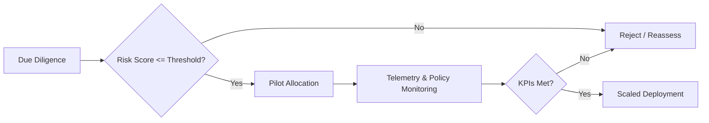

## Foundational - MPC Cryptography Fundamentals (Questions 1-10)

### Q1: How would you explain secure multi-party computation (MPC) to a non-technical stakeholder evaluating wallet technology options?

**Difficulty:** Foundational

**Answer:** I liken MPC to a team opening a vault using multiple keys where no single member ever holds the full key ring. Instead of storing a private key in one place, MPC splits it into mathematically related shares distributed across devices or services; cryptographic protocols let participants jointly compute signatures without reconstructing the key in memory (Goldreich, 2019; Lindell, 2020). This dramatically reduces single points of failure and insider risk, which matters for treasury teams balancing security with operational agility. The trade-off is protocol complexity: MPC introduces network coordination, more states to monitor, and the need for rigorous implementation hygiene. For business leaders, the value proposition is resilient custody aligned with regulatory expectations for key segregation (BIS, 2023). Emotionally, stakeholders gain confidence that human error from any one operator will not lose assets, yet they must invest in process discipline to orchestrate threshold approvals. Overall, MPC empowers collaborative control over crypto assets without compromising UX, provided governance and observability are planned from the outset.

---

### Q2: What are the key differences between threshold signatures and classic multisig for blockchain wallets?

**Difficulty:** Foundational

**Answer:** Threshold signatures operate at the cryptographic level, generating a single chain-valid signature from distributed key shares, whereas multisig creates multiple on-chain signatures that smart contracts or script opcodes evaluate (Binance Academy, 2023; Boneh & Shoup, 2020). Threshold approaches keep transactions indistinguishable from standard single-signature operations, improving privacy and lowering fees on chains where signature verification dominates costs. Multisig shines in transparency—auditors can see approval policies—but it can suffer from limited protocol support and higher transaction sizes. From a security perspective, both mitigate single-key compromise, yet threshold schemes rely heavily on MPC protocol correctness and secure channel orchestration, while multisig depends on scripting logic and hardware wallet ergonomics. Strategically, threshold wallets adapt better to ecosystems lacking rich scripting (e.g., ECDSA chains), providing smoother UX for institutional desks chasing competitive execution speeds. However, compliance teams may worry about the reduced on-chain visibility, necessitating off-chain audit trails to maintain trust with regulators and insurance partners (BIS, 2023). Choosing between them hinges on balancing transaction cost, policy transparency, and infrastructure maturity.

---

### Q3: Why is elliptic-curve cryptography (ECC) prevalent in MPC wallets, and how do curve choices affect implementation?

**Difficulty:** Foundational

**Answer:** ECC offers strong security per bit, keeping key sizes small and computations efficient—valuable when MPC protocols require iterative scalar multiplications across participants (NIST, 2023; Boneh & Shoup, 2020). Curves like secp256k1 dominate public blockchains, so interoperability guides wallet choices; deviating would fracture compatibility. However, MPC engineering must account for curve arithmetic nuances: lack of twist security can open small-subgroup attacks if input validation lapses. EdDSA curves, such as Ed25519, provide deterministic signatures and cofactor-aware designs easing validation but may demand different hash-to-curve strategies. Hardware acceleration support also varies—cloud HSMs may optimize P-256 but not secp256k1, influencing latency and cost. Strategically, teams sometimes adopt curves with formal security proofs (e.g., BLS12-381) for cross-chain bridges, though tooling scarcity raises delivery risks. Selecting a curve therefore blends cryptographic assurance, ecosystem compatibility, and operational considerations like library support, testing tooling, and future migration paths as post-quantum transitions loom (NIST, 2022). The choice directly impacts performance budgets, audit scope, and stakeholder confidence.

---

### Q4: What failure domains should an MPC wallet engineer consider when designing key-share storage and recovery processes?

**Difficulty:** Foundational

**Answer:** Key-share resilience spans hardware, software, network, and human layers. At the hardware level, device tampering or secure enclave degradation can leak shares; mitigations include hardware-backed attestation and redundant devices in different jurisdictions (ENISA, 2024). Software failures arise from buggy serialization or state desynchronization during protocol upgrades—versioned share formats and migration playbooks reduce downtime. Network partitions can delay signing; engineers should design quorum policies tolerant to transient outages, possibly using adaptive timeouts and gossip-backed peer discovery. Human factors include operator turnover and procedural drift; enforcing role-based access controls and periodic recovery drills keeps institutional memory fresh. Emotionally, stakeholders fear irrecoverable losses, so transparent runbooks and third-party validation bolster trust. Trade-offs emerge between accessibility and security: storing encrypted backups in the cloud aids recovery but extends the attack surface. By inventorying failure domains early, MPC teams can align risk appetite with governance, budget, and compliance obligations (Lindell, 2020; BIS, 2023).

---

### Q5: How do you ensure randomness quality in MPC protocols under constrained environments?

**Difficulty:** Foundational

**Answer:** MPC relies on high-entropy randomness for nonces, blinding factors, and share refreshes. On constrained devices, I combine hardware TRNGs with deterministic extractors like HKDF to mitigate bias, periodically reseeding from environmental noise (NIST, 2022). Verifiable random functions (VRFs) or distributed key generation (DKG) can collectively produce randomness, ensuring no participant can skew outcomes, though this adds protocol complexity (Goldreich, 2019). Monitoring entropy pools and instrumenting alerts when they deplete is vital—especially in containerized signing services where virtualization can homogenize entropy sources. A trade-off arises between resource usage and assurance; heavy randomness checks may impact latency, but weak randomness risks catastrophic key leakage. Operationally, documenting randomness provenance reassures auditors and reduces psychological stress on operators who need evidence that safeguards are robust. During incident response, having deterministic replay logs helps isolate randomness anomalies without exposing actual secret material.

```rust
// Example entropy health check pseudocode
fn validate_entropy(sample: &[u8]) -> bool {
	let chi_sq = chi_square_test(sample);
	chi_sq.p_value > 0.01 && sample.iter().collect::<HashSet<_>>().len() > MIN_SPREAD
}
```

---

### Q6: What role does distributed key generation (DKG) play in MPC wallet onboarding?

**Difficulty:** Foundational

**Answer:** DKG enables participants to create key shares collaboratively without any single node ever holding the full private key, aligning with zero-trust onboarding mandates (Gennaro & Goldfeder, 2019; Lindell, 2020). It prevents insider privilege escalation during provisioning, crucial when compliance teams demand proof that no employee temporarily acquired custody. DKG protocols typically involve polynomial commitments, verifiable secret sharing, and complaint rounds to handle dishonest actors. The trade-off is onboarding latency and increased communication overhead, which can frustrate stakeholders expecting instant wallet setup. To manage expectations, I provide clear timelines, simulate DKG runs to benchmark performance, and design UI feedback that conveys progress—reducing user anxiety. DKG also lays the groundwork for future share refresh and rotation policies, making it foundational for long-term operational resilience. Without DKG, organizations might rely on trusted dealers, introducing single points of failure that conflict with regulatory guidance on segregation of duties (BIS, 2023).

---

### Q7: How do you communicate the importance of verifiable secret sharing (VSS) to cross-functional partners?

**Difficulty:** Foundational

**Answer:** VSS supplies mathematical guarantees that each participant receives a consistent share, preventing subtle corruption that could surface months later as signing failures (Goldreich, 2019; Boneh & Shoup, 2020). To product managers, I frame VSS as analogous to supply chain traceability—every component is verifiably authentic before assembly. For compliance and risk officers, VSS artifacts serve as audit evidence that controls detect tampering during distribution, aligning with SOC 2 and ISO 27001 controls. Engineers appreciate that VSS reduces painful on-call escalations caused by latent share drift. The trade-off is the overhead of proof verification and storage; we must provision logging pipelines and retention policies. Emotionally, teams gain peace of mind knowing that integrity checks exist upfront, not during crises. By translating cryptographic assurance into operational reliability and customer trust metrics, I secure buy-in for the additional complexity VSS introduces (ENISA, 2024).

---

### Q8: What are common pitfalls in implementing round-based MPC protocols for wallet signing?

**Difficulty:** Foundational

**Answer:** Round-based protocols orchestrate sequential message exchanges; pitfalls often stem from state machine mismanagement. Losing track of participant states leads to deadlocks or double-signing risk if retries are mishandled (ZenGo-X, 2024a). Network jitter may cause timeouts that trigger erroneous blame assignments; implementing adaptive timeouts and idempotent message handlers mitigates this. Another pitfall is insufficient transcript validation—accepting malformed commitments can leak information or corrupt subsequent rounds. Logging must be deterministic yet redacted, balancing forensic value with secrecy. Developers sometimes overlook concurrency hazards when multiple signing sessions run in parallel, causing share reuse. Using typed channels, per-session identifiers, and fuzz testing the state transitions helps. The emotional toll manifests when incident responders lack visibility into protocol progress; dashboards visualizing round status calm stakeholders. Thoroughly modeling failure modes and employing property-based tests reduces surprises in production (ZenGo-X, 2024b; Lindell, 2020).

---

### Q9: How would you describe the relationship between MPC and zero-knowledge proofs in wallet security?

**Difficulty:** Foundational

**Answer:** MPC and zero-knowledge proofs (ZKPs) both enable collaborative or privacy-preserving computation, yet they address different threat surfaces. MPC lets parties jointly compute functions without revealing inputs to one another, ideal for generating signatures without exposing shares. ZKPs allow a prover to demonstrate knowledge of a secret (e.g., ownership of a key share) without revealing it, enhancing access control or compliance attestations (Goldreich, 2019; Boneh & Shoup, 2020). In wallets, ZKPs can augment MPC by verifying that participants follow the protocol—proofs of correct share possession or nonce freshness deter malicious insiders. However, ZKPs introduce computational overhead and complex circuits; overusing them can slow signing, affecting trader confidence. Strategically, blending MPC with lightweight ZKPs delivers defense-in-depth while respecting latency budgets. Communicating this synergy to stakeholders fosters trust that the system not only collaborates securely but can prove compliance when regulators ask for evidence.

---

### Q10: What basic monitoring metrics do you instrument first for an MPC signing service?

**Difficulty:** Foundational

**Answer:** Initial metrics focus on availability, correctness, and security posture. I track signing latency percentiles, round completion rates, and quorum formation time to ensure the service meets SLA expectations (ZenGo-X, 2024b). Error rates segmented by protocol phase (commitment, nonce exchange, finalization) highlight bottlenecks. Security metrics include share refresh cadence, failed authentication attempts, and entropy pool health. Business stakeholders watch transaction throughput and rejection reasons to understand customer impact. A trade-off surfaces between metric granularity and sensitive data exposure; aggregating counts rather than logging raw payloads protects confidentiality while still guiding troubleshooting. Displaying these metrics on shared dashboards reassures operations and finance teams that the system is stable, reducing stress during volatile market periods. Over time, I evolve the observability stack into distributed tracing and anomaly detection, but foundational telemetry delivers quick wins aligned with wallet maintenance duties (ENISA, 2024).

---

## Foundational - Wallet & Blockchain Essentials (Questions 11-20)

### Q11: How would you outline the basic architecture of an MPC-enabled wallet platform?

**Difficulty:** Foundational

**Answer:** An MPC wallet platform typically includes client interfaces (web, mobile), a coordination service managing protocol orchestration, signing nodes holding key shares, and blockchain connectivity modules for transaction broadcasting. The client triggers signing requests, passing policy metadata to the coordinator, which negotiates quorum availability and initiates MPC rounds (Gartner, 2024). Signing nodes authenticate via mutual TLS, exchange commitments, and produce partial signatures combined into a final artifact. Observability services capture metrics, while policy engines enforce risk-based approvals. Supporting components include secure storage for encrypted backups, compliance logging, and integration adapters for exchanges or custodians. This layered architecture separates concerns: UX teams can iterate on clients without touching cryptographic internals, and infra teams can scale signing nodes horizontally. The emotional payoff for stakeholders is clarity—knowing where responsibilities lie reduces blame during incidents. However, this modularity introduces integration overhead and demands disciplined release management to keep services compatible (ZenGo-X, 2024a; 2024b).

---

### Q12: What distinguishes hot, warm, and cold key-share custody models in MPC wallets?

**Difficulty:** Foundational

**Answer:** Hot custody keeps key shares online for rapid signing, supporting daily trading needs but exposing larger attack surfaces. Warm custody stores shares in controlled environments requiring short activation windows—useful for treasury operations balancing speed and security. Cold custody holds shares offline, often in secure facilities, reserved for infrequent high-value transfers (BIS, 2023). MPC wallets can mix these models: a quorum might require two hot shares and one warm share, ensuring continuity even if offline nodes are unreachable. Trade-offs revolve around latency, operational cost, and risk tolerance. Hot setups demand rigorous monitoring and hardware security modules; cold setups require logistical planning and scripted activation drills to avoid human error. Communicating the intent behind each layer reassures stakeholders that governance aligns with asset segmentation, reducing anxiety when market volatility necessitates withdrawals. Strategically, diversified custody models help satisfy regulators seeking evidence of layered defenses while enabling agile product delivery.

---

### Q13: Why is blockchain node strategy important for MPC wallet reliability?

**Difficulty:** Foundational

**Answer:** MPC wallets depend on accurate blockchain state to validate balances, fees, and nonce management. Relying on third-party nodes introduces latency variability and trust dependencies; running dedicated nodes provides control but raises maintenance overhead (ENISA, 2024). Engineers must balance uptime with cost: managed node providers offer SLAs yet may lack region diversity, while self-hosted nodes require patching and monitoring. For multi-chain wallets, node strategy dictates cross-chain abstraction complexity. Latency spikes can stall signing rounds, eroding trader confidence. Failover plans—such as hot-standby nodes and load-balancing across providers—reduce downtime. Additionally, regulatory compliance may demand that data remains in specific jurisdictions, influencing node placement. By articulating these factors, engineers align technical choices with business continuity plans, calming stakeholders concerned about market-impacting outages. Regularly validating node consensus with lightweight clients adds defensive depth against chain reorganizations.

---

### Q14: How do you align wallet feature planning with MPC protocol constraints?

**Difficulty:** Foundational

**Answer:** Feature ideation must respect MPC’s requirements for deterministic workflows and strict message sequencing. Early collaboration with product managers ensures UX concepts, like multi-approval flows, map to achievable protocol states (Gartner, 2024). For instance, dynamic fee bumping must be modeled as additional rounds or pre-approved policies to avoid share reuse. I use design reviews to highlight latency and bandwidth implications, illustrating how seemingly simple UI changes may trigger combinatorial protocol paths. This fosters empathy—teams appreciate the cryptographic guardrails and plan roadmaps accordingly. Trade-offs arise when cutting-edge features conflict with protocol maturity; I advocate for phased rollouts with canary cohorts, mitigating risk. Documenting constraints and opportunities in accessible language builds trust, preventing last-minute scope cuts that demoralize developers. Emotionally, transparent planning reduces friction between engineering and product stakeholders, aligning everyone around secure delivery.

---

### Q15: What basic regulatory considerations influence MPC wallet deployment?

**Difficulty:** Foundational

**Answer:** Regulations focus on custody segregation, auditability, and incident response. MPC wallets must demonstrate that no individual controls client assets, aligning with principles from jurisdictions like New York’s BitLicense and the EU’s MiCA (BIS, 2023). Maintaining tamper-evident logs and reproducible audit trails reassures regulators. Data residency rules may require regionalized key shares or logging infrastructure. Anti-money laundering (AML) controls need integration with transaction monitoring, even when signatures appear as single-sig on-chain. The trade-off is higher compliance overhead—documentation, third-party audits, and legal consultations add cost. Yet demonstrating robust controls builds institutional investor confidence and facilitates licensing. Culturally, compliance collaboration can alleviate fears among risk officers who might otherwise veto innovative MPC deployments. Engaging legal teams early transforms regulation from blocker to competitive differentiator.

---

### Q16: How do wallet engineers collaborate with customer success teams during incident response?

**Difficulty:** Foundational

**Answer:** During incidents—say, signing delays—engineers supply actionable context while customer success manages stakeholder communication. Establishing runbooks with plain-language explanations lets support staff reassure clients without exposing sensitive internals (ENISA, 2024). Engineers provide real-time metrics and expected resolution timelines; support channels feedback on customer sentiment, guiding prioritization. A trade-off exists between transparency and security—sharing too much protocol detail could aid attackers, so teams agree on safe communication boundaries. Debriefs post-incident help refine language and empathize with stressed traders. Emotionally, collaborative response strengthens trust; customers feel heard while engineers gain insight into business impact. Embedding engineers in tabletop exercises prepares everyone to maintain composure when market volatility raises stakes.

---

### Q17: What documentation artifacts are essential for onboarding new MPC wallet engineers?

**Difficulty:** Foundational

**Answer:** Critical artifacts include protocol specifications, threat models, architecture diagrams, deployment runbooks, and compliance requirements (Gartner, 2024). Spec docs delineate message flows, cryptographic primitives, and failure handling; threat models highlight attack surfaces, guiding secure coding. Architecture diagrams clarify service boundaries, reducing cognitive load. Runbooks detail operational tasks—from rotating key shares to recovering from node outages—while compliance briefs align engineering choices with regulatory obligations. Providing annotated code walkthroughs accelerates understanding of existing libraries. The trade-off is maintenance overhead; stale docs erode trust. To sustain quality, I embed documentation updates into definition-of-done criteria, ensuring continuous accuracy. New hires feel psychologically safe when they can explore reliable references rather than relying solely on tribal knowledge.

---

### Q18: How do you explain fee estimation strategies to finance teams overseeing wallet operations?

**Difficulty:** Foundational

**Answer:** Fee estimation balances cost control with transaction finality. I outline models leveraging mempool analytics, recent block history, and risk bands that categorize urgency (Chainalysis, 2024). For MPC wallets, we precompute fee ladders so signing can proceed without stalling on price discovery. Finance teams appreciate forecasts that tie fee tiers to business scenarios—routine withdrawals vs. high-priority settlements. We discuss trade-offs: underpaying risks stuck transactions and reputational damage; overpaying erodes margins. Presenting sensitivity analyses and historical variance calms concerns during volatile periods. Additionally, I explain how policy engines can auto-escalate fees when market congestion spikes, ensuring governance still controls costs. Transparent reporting on fee performance builds trust, reducing friction when engineering requests buffer budgets for extreme market conditions.

---

### Q19: What role does UX research play in MPC wallet adoption?

**Difficulty:** Foundational

**Answer:** UX research uncovers friction points that cryptographers might overlook, such as confusing approval notifications or unclear recovery steps (Gartner, 2024). By testing prototypes with traders and compliance officers, we validate that security prompts are understandable and that latency expectations align with MPC protocol realities. Research insights often inspire microcopy or visual cues that reduce user anxiety when waiting for quorum formation. The trade-off is the time investment; some engineers worry research slows delivery. However, improved usability lowers support tickets and enhances brand trust, which matters when competing for institutional clients. Emotionally, involving users in design fosters ownership, turning potential critics into advocacy partners. Findings also guide prioritization—if users struggle with policy creation, we invest in guided workflows rather than niche cryptographic features.

---

### Q20: How would you brief executives on MPC wallet roadmap risks?

**Difficulty:** Foundational

**Answer:** I structure the briefing around technical, operational, regulatory, and market risks. For each, I quantify likelihood, impact, and mitigation strategies. Technical risks may include protocol upgrades introducing regressions; mitigations involve staged rollouts and formal verification (ZenGo-X, 2024a). Operational risks cover talent gaps or dependency on specialized hardware—addressed via cross-training and vendor diversification. Regulatory risks track evolving guidance from entities like BIS and local authorities; we maintain legal counsel relationships to anticipate changes (BIS, 2023). Market risks encompass competitor features and liquidity migration; product marketing informs differentiation plans. Presenting this in a heatmap with narrative context helps executives grasp trade-offs quickly. Emotionally, transparency builds trust; leaders feel empowered rather than blindsided, fostering continued investment in MPC initiatives.

---

## Intermediate - Threshold Schemes & Protocol Engineering (Questions 21-30)

### Q21: How do you evaluate the trade-offs between Shamir Secret Sharing (SSS) and additive secret sharing for MPC wallets?

**Difficulty:** Intermediate

**Answer:** SSS provides flexibility in threshold policies via polynomial interpolation, making it ideal when organizations need configurable quorum structures (Lindell, 2020). However, reconstruction requires Lagrange coefficients and finite-field arithmetic, adding computational overhead during signing. Additive sharing simplifies computation—participants sum shares modulo a field—but typically supports fixed threshold (n-out-of-n), limiting policy diversity. Performance-wise, additive schemes offer faster aggregation, beneficial in low-latency trading contexts. Security considerations differ: SSS demands robust random polynomial generation, while additive schemes rely heavily on communication security because any missing share stalls execution. Strategically, I assess governance requirements, latency budgets, and operational resilience. Hybrid models can combine SSS for long-term storage and additive sharing for transient nonce generation. Emotionally, stakeholders value predictable behavior; whichever scheme we choose, documentation must clarify recovery implications to maintain confidence (Goldreich, 2019; Boneh & Shoup, 2020).

---

### Q22: What considerations guide your selection of a threshold ECDSA protocol implementation?

**Difficulty:** Intermediate

**Answer:** Key criteria include security proofs, implementation maturity, performance benchmarks, and community adoption. Protocols like GG18/GG20 offer proven security against malicious adversaries, albeit with more communication rounds (Gennaro & Goldfeder, 2019). Leaner variants reduce rounds but may assume semi-honest participants—a risky bet for institutional custody. I scrutinize constant-time arithmetic, side-channel mitigation, and compatibility with the wallet’s cryptographic library stack. Integration complexity matters; protocols with clear APIs and reference implementations accelerate delivery. Licensing and contributor activity influence long-term sustainability—dormant repositories raise maintenance concerns. I also evaluate audit history and formal verification artifacts. Trade-offs emerge between latency and robustness; for high-stakes operations, I favor malicious-secure protocols even if they introduce milliseconds of delay. Presenting these factors to stakeholders ensures decisions align with both security posture and business expectations.

---

### Q23: How do you mitigate communication overhead in round-based MPC protocols?

**Difficulty:** Intermediate

**Answer:** Techniques include batching messages, leveraging efficient serialization (e.g., Protocol Buffers), and deploying relay services near participants to reduce RTT (ZenGo-X, 2024b). I design protocols to allow pipelining where possible—starting subsequent computations before previous acknowledgments fully settle. Adaptive timeouts based on historical latency prevent premature retries. Compression can help, but we must avoid increased CPU usage on constrained devices; thus, I benchmark options under realistic workloads. Another strategy is selective gossip: nodes broadcast to a subset that then fan-out, reducing bandwidth for large quorums. Trade-offs: aggressive optimization risks added complexity and potential security regressions, so I pair changes with formal message invariants and simulation testing. Stakeholders appreciate when we quantify gains and residual risks, easing concerns about signing delays impacting settlements.

---

### Q24: Describe your approach to implementing proactive share refresh in production.

**Difficulty:** Intermediate

**Answer:** Proactive refresh periodically rotates key shares without changing the underlying public key, thwarting slow-leak attacks (Lindell, 2020). I schedule refreshes during low-traffic windows, aligning with business calendars to minimize disruption. Automation orchestrates DKG-like rounds, issuing new shares and securely wiping old ones. Controls include authenticated channels, audit logging, and post-refresh validation tests to confirm signing integrity. I stage refresh rollouts, starting with secondary quorums to ensure tooling works. Trade-offs involve operational overhead and potential downtime; to reduce anxiety, I provide detailed runbooks and dry-run metrics to stakeholders. Refresh cadence ties to threat models and compliance guidance—high-risk environments might refresh weekly, while others opt for monthly. Communicating the rationale reinforces trust in long-term key hygiene.

---

### Q25: How do you reason about determinism versus randomness in protocol implementations?

**Difficulty:** Intermediate

**Answer:** Determinism aids reproducibility and simplifies incident forensics, yet cryptographic security often demands randomness for nonce generation and share blinding (Boneh & Shoup, 2020). I design protocols where deterministic components handle state machines and message ordering, while randomness is compartmentalized with verifiable sources. Logging deterministic identifiers lets operations correlate events across systems without leaking secrets. However, deterministic retries risk replay attacks if not paired with unique session IDs. Conversely, excessive randomness complicates testing. The balance lies in isolating randomness to cryptographic primitives and ensuring strong entropy, while higher-level orchestration remains deterministic. Communicating this philosophy to QA teams fosters realistic test coverage and reduces psychological stress when debugging distributed runs. Trade-offs are documented, highlighting how choices impact security guarantees and developer productivity.

---

### Q26: How would you integrate hardware security modules (HSMs) with a threshold signing service?

**Difficulty:** Intermediate

**Answer:** HSMs can store encrypted key shares, enforce access policies, or provide secure randomness. Integration begins with selecting HSMs that support the required elliptic curves and performance targets. I design an abstraction layer so signing nodes interact with HSMs via well-defined APIs, encapsulating vendor-specific logic. Latency measurements inform whether HSM operations stay within SLA; if not, I cache non-sensitive pre-computations outside the HSM while keeping secrets protected. High availability requires clustering or fallback to software-based enclaves, documented as risk-accepted scenarios. The trade-off is cost and vendor lock-in—HSM procurement and certification cycles are lengthy. I mitigate by maintaining compatibility with multiple vendors and leveraging standards like PKCS #11. For stakeholders, articulating how HSMs complement MPC reinforces confidence in layered defenses (ENISA, 2024).

---

### Q27: How do you validate third-party MPC libraries before adoption?

**Difficulty:** Intermediate

**Answer:** Validation encompasses code audits, reproducible builds, and threat modeling. I review cryptographic assumptions, ensuring dependencies avoid outdated primitives. Static analysis and fuzz testing uncover memory safety issues. I assess documentation quality, test coverage, and CI/CD practices—projects with active maintainers and transparent release notes inspire confidence. Engaging external auditors or leveraging prior certifications bolsters assurance. I also evaluate community responsiveness to CVEs. Trade-offs: in-house forks offer control but increase maintenance; upstream collaboration may slow fixes but shares burden. Presenting findings to stakeholders with a risk register clarifies adoption decisions, preventing unpleasant surprises later (ZenGo-X, 2024a).

---

### Q28: What strategy do you use to handle blockchain protocol upgrades impacting MPC wallets?

**Difficulty:** Intermediate

**Answer:** I maintain a ledger of upcoming protocol changes, participating in client beta networks to test compatibility early. Impact analysis maps changes to wallet components—e.g., signature algorithm shifts, fee dynamics, or RPC modifications. I coordinate cross-functional war rooms involving product, compliance, and operations to align timelines. Regression test suites simulate post-upgrade conditions, while feature flags allow gradual rollout. Trade-offs involve resource allocation; preparing for every chain upgrade can strain teams, so I prioritize by asset AUM and customer demand. Communicating readiness plans reassures stakeholders who fear disruption during forks or network transitions (ENISA, 2024; Chainalysis, 2024).

---

### Q29: How do you ensure backward compatibility during MPC protocol updates?

**Difficulty:** Intermediate

**Answer:** I adopt versioned protocol identifiers embedded in message headers, allowing nodes to negotiate capabilities. During rollout, I support dual-stack operation where new and old protocol versions coexist. Extensive integration tests verify interoperability, while monitoring detects legacy nodes lagging behind. Documentation clarifies deprecation timelines, giving teams psychological safety to plan upgrades. The trade-off is added complexity: dual-stack logic increases maintenance burden. To mitigate, I set clear sunsetting milestones and provide migration tooling. Stakeholders appreciate transparent communication, reducing fear of sudden breakage (ZenGo-X, 2024b).

---

### Q30: How do you employ formal verification or symbolic analysis in MPC wallet development?

**Difficulty:** Intermediate

**Answer:** Formal methods validate protocol correctness beyond conventional testing. I use tools like ProVerif or Tamarin to model message flows, checking properties such as secrecy and authentication (Goldreich, 2019). For code-level assurance, domain-specific languages (DSLs) supporting extraction to verified code can enforce invariants. Trade-offs include steep learning curves and modeling abstraction limits; not every component justifies formal proofs. I prioritize high-risk modules—nonce generation, share refresh, and protocol state machines. Presenting tangible results (e.g., proof artifacts) boosts stakeholder confidence, particularly for auditors evaluating institutional-grade custodians. Formal verification also uncovers edge cases early, saving downstream incident costs.

---

## Intermediate - System Architecture & Distributed Services (Questions 31-40)

### Q31: How do you architect MPC signing services for multi-region resilience?

**Difficulty:** Intermediate

**Answer:** I deploy signing clusters across regions with latency-aware routing and quorum policies that tolerate regional outages. Each region hosts a subset of shares, ensuring that quorum thresholds require geographic diversity to prevent correlated failures. Data replication employs secure channels with forward secrecy. I integrate service mesh solutions to enforce mutual authentication and traffic encryption. Health checks evaluate cryptographic readiness, not just process uptime. Trade-offs involve latency; cross-region coordination can slow signing, so we precompute where possible and place trade desks near majority nodes. Compliance considerations include data residency—certain shares may need to remain within jurisdictions, shaping topology. Communicating disaster recovery drills to stakeholders builds trust in continuity planning (ENISA, 2024).

---

### Q32: What messaging patterns support reliable MPC coordination?

**Difficulty:** Intermediate

**Answer:** Reliable coordination leverages idempotent APIs, message queues with exactly-once semantics, and consensus on session lifecycle. Patterns like publish/subscribe disseminate state changes, while request/response ensures individual acknowledgments. I often employ event sourcing to reconstruct session history, invaluable for auditing. Circuit breakers guard against cascading failures when nodes misbehave. Trade-offs include operational overhead; complex messaging stacks demand expertise. However, they offer resilience against transient network faults, reducing stress during peak trading. Stakeholders appreciate transparent dashboards showing message backlog and session health, reinforcing confidence (ZenGo-X, 2024b).

---

### Q33: How do you integrate policy engines with MPC orchestration layers?

**Difficulty:** Intermediate

**Answer:** Policy engines evaluate contextual rules—transaction value, destination risk scores, time-of-day constraints—before MPC sessions proceed. I architect the coordinator to call policy APIs during pre-commit stages, caching decisions for idempotency. Policies are expressed declaratively so compliance teams can review and adjust without code deployments. The trade-off is latency; synchronous policy checks can delay signing, so I implement asynchronous pre-approvals or warm caches for common scenarios. Security demands signed policy configurations and tamper-evident logs. Communicating policy outcomes via UI reduces user uncertainty when approvals await manual review. This integration aligns product flexibility with governance needs (BIS, 2023).

---

### Q34: How would you design an internal developer platform (IDP) to support MPC wallet teams?

**Difficulty:** Intermediate

**Answer:** An effective IDP provides self-service environments, CICD templates, observability bootstrapping, and security guardrails. For MPC teams, templates include crypto-safe linting, dependency scanning, and deterministic build configurations. Sandbox clusters emulate signing flows with mock key shares, enabling rapid testing without risking production secrets. Documentation portals aggregate protocol specs, runbooks, and design patterns. Trade-offs involve upfront investment and ongoing maintenance. Yet, the IDP streamlines onboarding and reduces cognitive load, improving morale. Alignment with platform engineering best practices ensures compliance requirements are embedded, not bolted on (Gartner, 2024).

---

### Q35: How do you manage secrets in CI/CD pipelines for MPC wallet codebases?

**Difficulty:** Intermediate

**Answer:** CI/CD must avoid exposing key material. I use short-lived tokens via workload identity federation, preventing static credentials in repos. Build pipelines run in isolated environments with no access to production shares. Secrets needed for integration tests are synthesized or drawn from dedicated vault namespaces with strict policies. I enforce policy-as-code to audit secret usage. Trade-offs include added pipeline complexity, but the payoff is reduced breach impact. Communicating these safeguards reassures stakeholders that automation does not compromise custody principles (ENISA, 2024).

---

### Q36: Describe your strategy for telemetry schema design in MPC platforms.

**Difficulty:** Intermediate

**Answer:** Telemetry schemas must capture protocol phase, participant identifiers (pseudonymized), latency metrics, and outcome codes. I adopt versioned schemas with backward compatibility guarantees, enabling analytics without disrupting ingestion. Privacy-by-design guides redaction of sensitive payloads. Trade-offs: overly granular telemetry can leak behavior patterns; too coarse undermines debugging. I involve data teams early to align schema with business KPIs, fostering cross-functional ownership. Instrumentation consistency across services reduces operator frustration during incidents (ZenGo-X, 2024b).

---

### Q37: How do you implement blue-green deployments for MPC signing services?

**Difficulty:** Intermediate

**Answer:** Blue-green deployments spin up parallel environments with identical configurations. I route a subset of signing traffic to the green cluster, monitoring protocol success metrics and error rates. If healthy, I gradually shift traffic; otherwise, rollback is instantaneous. Critical to this is ensuring both environments have synchronized key shares—either via share replication or pre-generated shares. Trade-offs include resource duplication and coordination overhead. Yet, this approach minimizes downtime and reduces anxiety during upgrades. Comprehensive health checks covering cryptographic operations and external dependencies guard against hidden regressions (ENISA, 2024).

---

### Q38: How do you secure inter-service communication in an MPC wallet microservice architecture?

**Difficulty:** Intermediate

**Answer:** I enforce mutual TLS with certificate rotation automated via service mesh tooling. Access policies are governed through zero-trust principles—services authenticate via workload identities, and authorizations are least-privilege. Payload encryption protects sensitive metadata. Network segmentation limits blast radius. I also monitor for anomalous traffic patterns. Trade-offs involve operational complexity; certificate mismanagement can cause outages, so I automate validation and provide runbooks. Communicating the security posture helps stakeholders trust the microservice model (ENISA, 2024).

---

### Q39: How do you approach cost optimization without compromising MPC security?

**Difficulty:** Intermediate

**Answer:** Cost levers include right-sizing compute for signing nodes, leveraging spot instances for non-critical workloads, and optimizing storage for logs. I analyze protocol metrics to identify idle capacity and adjust auto-scaling policies. However, I avoid cost cuts that weaken redundancy or monitoring. Negotiating multi-year agreements with cloud providers can secure better rates for HSM or enclave usage. Trade-offs are transparent: any cost-saving initiative includes a risk assessment outlining potential security impacts. This openness helps finance and security teams align on acceptable compromises (BIS, 2023).

---

### Q40: How do you enable incident retrospectives that drive continuous improvement?

**Difficulty:** Intermediate

**Answer:** I facilitate blameless postmortems with structured timelines, impact analysis, and actionable follow-ups. Data from telemetry, logs, and user feedback grounds the discussion. We categorize remediation actions (process, tooling, training) and assign owners with due dates. To maintain psychological safety, I separate fact-finding from accountability discussions. Lessons learned feed into documentation and onboarding. The trade-off is time investment; however, consistent retros build trust and reduce repeat incidents. Sharing summaries with cross-functional stakeholders demonstrates transparency and commitment to reliability (ENISA, 2024).

---

## Intermediate - DevOps, Testing & Observability (Questions 41-50)

### Q41: How do you design automated test suites for MPC protocols?

**Difficulty:** Intermediate

**Answer:** Automated suites should cover unit tests for cryptographic primitives, integration tests for message flows, and property-based tests to explore edge cases (Goldreich, 2019). I simulate adversarial behaviors—dropping messages, injecting malformed commitments—to validate robustness. Deterministic seed control ensures reproducibility. Continuous integration gates merges on passing suites and code coverage thresholds. Trade-offs involve execution time; to maintain developer velocity, I tier tests—fast suites per commit, heavier fuzzing nightly. Providing clear dashboards of test outcomes reduces stress and fosters quality culture.

---

### Q42: What role does chaos engineering play in MPC wallet reliability?

**Difficulty:** Intermediate

**Answer:** Chaos experiments intentionally inject failures (e.g., node crashes, network partitions) to validate resilience. For MPC wallets, I script scenarios that drop specific share holders or corrupt message queues, ensuring quorum policies and retry logic behave correctly. Safety guards—like scoped blast radius and business hours coordination—prevent customer impact. The trade-off is potential disruption; thus, I align experiments with stakeholders, communicating objectives and success metrics. Documented learnings strengthen incident readiness and bolster stakeholder confidence (ENISA, 2024).

---

### Q43: How do you manage observability for compliance reporting?

**Difficulty:** Intermediate

**Answer:** Compliance reporting demands immutable logs and traceability. I aggregate protocol events into write-once storage with cryptographic hashing for tamper evidence. Dashboards summarize policy adherence, incident response times, and anomaly resolutions. Access controls enforce segregation duties—auditors view reports without altering data. Trade-offs involve storage cost and retention policies; we negotiate retention durations balancing regulatory demands with budget. Regularly reviewing reports with compliance teams keeps everyone aligned and reduces audit anxiety (BIS, 2023).

---

### Q44: How do you integrate static and dynamic analysis into MPC build pipelines?

**Difficulty:** Intermediate

**Answer:** Static analysis tools scan for memory safety issues, insecure dependencies, and coding standard violations. Dynamic analysis—like sanitizers and runtime detectors—captures issues that manifest during execution. I configure pipelines to fail builds on high-severity findings, with suppression workflows for false positives. Developers receive actionable feedback via annotations. Trade-offs include noise and performance overhead; calibrating thresholds and investing in education mitigates fatigue. Continual analysis demonstrates due diligence to stakeholders concerned with software assurance (ENISA, 2024).

---

### Q45: How do you ensure reproducible builds for MPC wallet binaries?

**Difficulty:** Intermediate

**Answer:** Reproducible builds require pinned dependencies, hermetic build environments, and deterministic compilers. I employ containerized toolchains and verify outputs via binary diffing. Build manifests capture metadata, while provenance attestations (e.g., SLSA levels) offer supply-chain transparency. Trade-offs involve maintenance overhead—managing toolchain updates is meticulous work. However, reproducibility mitigates tampering risk, yielding peace of mind for auditors and customers (ENISA, 2024).

---

### Q46: How do you simulate user behavior to test wallet throughput?

**Difficulty:** Intermediate

**Answer:** I build load generators that mimic transaction submission patterns, policy mix, and geographic distribution. Synthetic workloads include bursts reflecting market events. Metrics capture end-to-end latency, error rates, and resource utilization. I calibrate simulations with anonymized production data to stay realistic. Trade-offs include infrastructure cost for large-scale tests; we time runs during off-peak hours and recycle resources. Sharing results with product and operations teams influences capacity planning and reassures stakeholders of readiness (Chainalysis, 2024).

---

### Q47: How do you handle secrets rotation for infrastructure credentials?

**Difficulty:** Intermediate

**Answer:** I schedule rotations aligned with compliance mandates, leveraging automation to update credentials across services without downtime. Techniques include dual token issuance, allowing overlap for graceful transitions. Monitoring verifies successful rotations, and rollback plans exist for failures. Trade-offs arise when legacy systems lack API-based rotation; I prioritize modernization or isolation. Communicating rotation cadence and status to stakeholders reduces fear of unexpected outages (ENISA, 2024).

---

### Q48: How do you implement service-level objectives (SLOs) for MPC wallets?

**Difficulty:** Intermediate

**Answer:** SLOs translate business expectations into metrics—e.g., 99.9% signing success within 3 seconds. I analyze historical data to set realistic targets and define error budgets for experimentation. Instrumentation tracks compliance, triggering alerts when budgets deplete. Trade-offs include stakeholder negotiation; aggressive SLOs may demand costly redundancy. By presenting data-driven proposals, we align ambitions with resources. Sharing SLO dashboards fosters accountability and shared ownership (ZenGo-X, 2024b).

---

### Q49: How do you use canary analysis to detect regressions?

**Difficulty:** Intermediate

**Answer:** Canary deployments send a fraction of traffic to new builds, monitoring key metrics versus baseline. I use statistical techniques like Mann-Whitney U tests to detect significant deviations. Automated rollbacks trigger when thresholds breach. Trade-offs involve complexity in tooling and requiring high-fidelity telemetry. However, canaries catch subtle regressions that unit tests miss, avoiding customer impact. Transparent communication about canary results builds trust in release processes (ENISA, 2024).

---

### Q50: How do you coordinate disaster recovery (DR) drills for MPC wallets?

**Difficulty:** Intermediate

**Answer:** DR drills simulate catastrophic failures—loss of a region, data corruption, or supplier outage. I define objectives, success criteria, and participants across engineering, operations, and compliance. Runbooks guide execution, and observers record gaps. After-action reports prioritize remediation. Trade-offs include time away from roadmap work, but drills expose weaknesses before real crises. Sharing outcomes with executives underscores preparedness and supports regulatory audits (BIS, 2023).

---

## Intermediate - Product, UX & Stakeholder Alignment (Questions 51-60)

### Q51: How do you balance trader UX with security prompts in MPC wallets?

**Difficulty:** Intermediate

**Answer:** Traders demand speed, yet security prompts ensure intent verification. I analyze usage flows to identify friction points, introducing context-aware prompts—higher scrutiny for unusual amounts while streamlining routine transfers. Behavioral analytics inform adaptive MFA. Trade-offs include complexity in policy engines and potential false positives frustrating users. I involve traders in testing, gathering qualitative feedback. Communicating rationale for prompts fosters empathy; users see them as safeguards, not obstacles (Gartner, 2024).

---

### Q52: How do you collaborate with marketing to position MPC wallet capabilities?

**Difficulty:** Intermediate

**Answer:** I translate technical differentiators—threshold signatures, multi-region resilience—into customer value narratives. Marketing materials highlight reduced single-point-of-failure risk and compliance readiness. I vet claims for accuracy, providing data on uptime and security certifications. Trade-offs involve balancing transparency with security; we avoid disclosing sensitive architecture details. Regular syncs ensure messaging aligns with roadmap progress, preventing overpromising. This cooperation builds market trust and supports sales enablement (WEF, 2024).

---

### Q53: How do you quantify the ROI of MPC wallet security investments?

**Difficulty:** Intermediate

**Answer:** ROI blends avoided loss estimation, regulatory cost savings, and revenue retention. I model scenarios—probability of key compromise without MPC—and translate into expected losses. Compliance automation may reduce audit hours, quantifiable via labor rates. Customer churn metrics tie to trust; showcasing zero incidents bolsters retention. Trade-offs involve assumptions; I document sensitivity analysis to maintain credibility. Finance partners appreciate structured models that align security spend with business metrics (BIS, 2023).

---

### Q54: How do you align product roadmaps with regulatory milestones?

**Difficulty:** Intermediate

**Answer:** I maintain a regulatory calendar tracking MiCA phases, FATF updates, and regional licensing. Roadmaps include buffers for compliance-driven work—reporting features, policy audits. Quarterly steering meetings with legal ensure alignment. Trade-offs arise when regulation demands supersede innovation; transparent prioritization prevents surprise scope changes. Communicating dependencies reduces stakeholder anxiety about sudden shifts (BIS, 2023).

---

### Q55: How do you incorporate customer feedback into MPC protocol evolution?

**Difficulty:** Intermediate

**Answer:** Feedback loops include advisory councils, beta programs, and telemetry-informed surveys. When customers report latency pain, I evaluate protocol optimizations or caching strategies. For policy UX feedback, I collaborate with design to improve workflows while ensuring cryptographic integrity. Trade-offs involve balancing bespoke requests against platform stability. Clear criteria for prioritization—customer impact, security implications—keep the roadmap disciplined. Sharing progress updates reinforces trust (Gartner, 2024).

---

### Q56: How do you support enterprise onboarding with diverse governance requirements?

**Difficulty:** Intermediate

**Answer:** Enterprises may demand custom approval hierarchies, audit trails, or integration with internal identity providers. I build configurable policy templates and SSO support (SAML/OIDC) to accommodate variability. Solution engineers guide customers through best practices, while documentation covers mapping governance to MPC thresholds. Trade-offs include platform complexity; too much customization threatens maintainability. We mitigate via modular design and clear boundaries on supported features. Regular check-ins reduce anxiety for clients during migration (Gartner, 2024).

---

### Q57: How do you manage stakeholder expectations during phased feature rollouts?

**Difficulty:** Intermediate

**Answer:** I publish rollout plans detailing cohorts, timelines, and success metrics. Communication channels (Slack, webinars) provide updates and collect feedback. Feature flags enable gradual exposure while controlling risk. Trade-offs involve slower global availability, but this approach catches defects early. Transparent status reports maintain stakeholder trust, especially when delays occur. Setting clear acceptance criteria aligns perceptions of “done” (WEF, 2024).

---

### Q58: How do you prioritize backlog items when resources are constrained?

**Difficulty:** Intermediate

**Answer:** I apply weighted scoring models considering security impact, regulatory deadlines, revenue opportunity, and technical debt reduction. Cross-functional reviews ensure alignment. Trade-offs are explicit—some initiatives are deferred, and stakeholders understand why. Regularly revisiting prioritization builds agility and reduces frustration. Communicating decisions empathetically maintains morale (BIS, 2023).

---

### Q59: How do you craft communication plans for significant protocol changes?

**Difficulty:** Intermediate

**Answer:** Plans include audience segmentation (internal teams, customers, regulators), key messages, timelines, and feedback channels. I produce FAQs, technical briefs, and risk summaries. Dry-run presentations gather feedback, ensuring clarity. Trade-offs involve time investment, yet thorough communication prevents misinformation. Stakeholders feel respected and prepared, reducing resistance to change (WEF, 2024).

---

### Q60: How do you integrate accessibility considerations into wallet UX?

**Difficulty:** Intermediate

**Answer:** Accessibility ensures inclusive adoption. I collaborate with designers to implement WCAG-compliant color contrast, keyboard navigation, and screen-reader-friendly layouts. For approval flows, concise language and clear progress indicators aid understanding. Localization supports global users. Trade-offs include design constraints, but inclusive UX expands market reach and meets regulatory expectations in some regions. User testing with diverse participants validates effectiveness (Gartner, 2024).

---

## Advanced - Security Hardening & Threat Response (Questions 61-70)

### Q61: How do you construct an MPC wallet threat model addressing nation-state adversaries?

**Difficulty:** Advanced

**Answer:** I categorize assets (key shares, policy data), adversaries (external, insider, nation-state), and attack vectors (supply chain, legal coercion). For nation-state threats, I consider lawful interception, hardware interdiction, and advanced persistent campaigns. Mitigations include geographically distributed shares in friendly jurisdictions, hardware attestation, sealed-envelope governance, and quantum-resistant research roadmaps (ENISA, 2024). I model coercion-resistant quorum policies requiring multi-jurisdiction approvals. Supply-chain defenses involve reproducible builds and dependency audits. Communication with legal teams covers mutual assistance treaties and incident disclosure obligations. Emotionally, acknowledging such threats can unnerve stakeholders; framing mitigations as layered defense empowers confidence. Trade-offs: robust controls may slow operations, so we delineate high-value flows with stricter policies while keeping routine actions efficient.

---

### Q62: How do you detect and respond to share exfiltration attempts?

**Difficulty:** Advanced

**Answer:** Detection hinges on behavioral analytics—monitoring unusual access patterns, data egress volumes, or anomalous cryptographic operations. I deploy host-based intrusion detection on signing nodes, coupled with honeytokens embedded in share storage; any interaction triggers alerts. Response playbooks isolate affected nodes, rotate shares via emergency DKG, and notify stakeholders. Forensics rely on immutable logs and memory captures. Trade-offs arise between rapid containment and avoiding service disruption; predefined decision matrices guide actions. Communicating swiftly with customers maintains trust, even amid uncertainty (ENISA, 2024).

---

### Q63: How do you harden MPC wallets against side-channel attacks?

**Difficulty:** Advanced

**Answer:** Side-channel mitigation includes constant-time implementations, blinding techniques, and noise injection. I enforce strict compiler flags, run static analysis for timing leaks, and benchmark on varied hardware to detect anomalies. Isolating signing processes within secure enclaves adds physical attack resistance. Hardware selection favors devices with side-channel certifications. Trade-offs: mitigation can degrade performance; thus, we profile impact and optimize critical paths. Educating stakeholders on residual risks and ongoing monitoring maintains realistic expectations (Boneh & Shoup, 2020; ENISA, 2024).

---

### Q64: How do you secure supply-chain dependencies in MPC projects?

**Difficulty:** Advanced

**Answer:** Supply-chain security spans dependency provenance, integrity verification, and vendor assessment. I implement SBOM generation, signed artifacts, and automated CVE scanning. Third-party audits evaluate vendors with access to build pipelines. Policy-as-code enforces minimum security posture for dependencies. Trade-offs include slower dependency upgrades due to vetting. However, this discipline prevents compromise cascading into wallet binaries. Communicating progress via dashboards reassures stakeholders that supply-chain risks are actively managed (ENISA, 2024).

---

### Q65: How do you prepare for post-quantum cryptography (PQC) transitions in MPC wallets?

**Difficulty:** Advanced

**Answer:** I track NIST PQC standardization timelines, experimenting with hybrid schemes combining classical and PQ primitives (NIST, 2023). Research prototypes evaluate lattice-based threshold signatures, assessing performance impact. Migration planning includes inventorying algorithms, estimating refactor scope, and designing abstraction layers to swap crypto suites. Trade-offs: PQC implementations are heavier, increasing latency and key sizes. Stakeholders fear degraded UX, so I present staged adoption—monitoring, pilot networks, then production. Transparent roadmaps reassure clients concerned about future-proofing.

---

### Q66: How do you design intrusion detection tailored to MPC protocols?

**Difficulty:** Advanced

**Answer:** Protocol-aware intrusion detection analyzes message sequences for deviations—unexpected round order, inconsistent commitments, or repeated nonce usage. I employ state machines that flag anomalies, feeding SIEM dashboards. Machine learning models detect subtle timing shifts indicative of active MITM attempts. Trade-offs include false positives; extensive tuning and labeled datasets are necessary. Integration with incident response ensures alerts translate into action. Stakeholders gain confidence seeing security stacked beyond perimeter controls (ZenGo-X, 2024b).

---

### Q67: How do you manage incident disclosure obligations across jurisdictions?

**Difficulty:** Advanced

**Answer:** Jurisdictions impose varied timelines and reporting formats. I maintain a legal obligation matrix mapping incident types to notification requirements (BIS, 2023). Incident response playbooks include legal review checkpoints and predefined communication templates. Coordination across regulators, customers, and partners demands precise messaging. Trade-offs involve balancing transparency with protecting sensitive investigations. Advanced planning reduces stress during crises; stakeholders trust that obligations will be met without ad hoc scrambling.

---

### Q68: How do you safeguard against denial-of-service (DoS) attacks targeting MPC coordination?

**Difficulty:** Advanced

**Answer:** Defenses include rate limiting, CAPTCHA for public APIs, and segregated networks for internal protocol traffic. I implement circuit breakers and auto-scaling to absorb bursts, complemented by traffic scrubbing services. Quorum policies detect and exclude malicious nodes sending floods. Trade-offs involve cost and complexity, but marketplace credibility depends on availability. Clear runbooks define escalation thresholds, ensuring swift response. Communicating preparedness calms customer concerns during attacks (ENISA, 2024).

---

### Q69: How do you evaluate hardware enclave technologies (e.g., SGX, SEV) for MPC workloads?

**Difficulty:** Advanced

**Answer:** I assess enclave security guarantees, performance overhead, ecosystem maturity, and vulnerability history. SGX offers fine-grained enclaves but has faced side-channel exploits; SEV secures VM memory but shares hypervisor trust. Benchmarking reveals latency impact on signing rounds. Tooling support and attestation workflows influence integration complexity. Trade-offs: enclaves elevate security but increase development effort and may limit portability. I recommend hybrid approaches—enclaves for high-risk operations, MPC for collaborative security. Presenting comparative matrices aids stakeholder decisions (ENISA, 2024).

---

### Q70: How do you orchestrate red team exercises for MPC wallets?

**Difficulty:** Advanced

**Answer:** Red teaming probes defenses via simulated adversaries targeting infrastructure, protocols, and human processes. Planning involves defining scope, rules of engagement, and success criteria. Red teams attempt share extraction, social engineering, and protocol manipulation. Blue teams respond, followed by joint debriefs. Trade-offs include resource allocation and potential operational risk, so exercises are carefully staged. Outcomes feed into remediation roadmaps. Sharing sanitized findings with leadership demonstrates proactive security culture, boosting confidence (ENISA, 2024).

---

## Advanced - Performance, Scalability & Reliability (Questions 71-80)

### Q71: How do you model end-to-end latency for MPC signing under peak load?

**Difficulty:** Advanced

**Answer:** I decompose latency into network transit, cryptographic computation, policy evaluation, and blockchain broadcast. Queuing theory, specifically M/M/c models, estimates waiting times given concurrent signing requests (Boneh & Shoup, 2020). Load testing validates assumptions. I account for burstiness using percentile-based SLOs. Trade-offs arise between accuracy and model complexity; simplifying assumptions risk blind spots. Presenting latency budgets to stakeholders ties engineering work to business metrics, reducing anxiety during market surges.

$$L_q = \frac{(\lambda/\mu)^c\rho}{c!(1-\rho)^2}\times P_0$$

Where $L_q$ approximates expected queue length, $\lambda$ is arrival rate, $\mu$ service rate, $c$ servers (signing nodes), $\rho=\lambda/(c\mu)$, and $P_0$ the probability of zero items in the system.

---

### Q72: How do you optimize MPC protocols for bandwidth-constrained environments?

**Difficulty:** Advanced

**Answer:** I explore preprocessing phases that transmit large data during off-peak hours, leaving lightweight online phases. Compressing commitments with elliptic curve point encoding and leveraging aggregation reduces payloads. Peer selection favors nodes with better connectivity. Trade-offs include increased storage and potentially higher precomputation costs. I validate with simulations reflecting emerging markets where bandwidth is scarce. Stakeholders value this inclusivity when expanding to global clients (ZenGo-X, 2024b).

---

### Q73: How do you apply reliability engineering techniques to MPC wallet services?

**Difficulty:** Advanced

**Answer:** Reliability techniques include failure mode and effects analysis (FMEA), redundancy design, and mean-time-to-recovery (MTTR) optimization. I quantify component failure probabilities, designing quorum thresholds to tolerate expected outages. Chaos testing verifies recovery paths. Post-incident metrics inform SLO adjustments. Trade-offs involve cost for redundancy; data-driven justification secures budget. Stakeholders gain confidence seeing reliability treated as an engineering discipline, not ad hoc reaction (ENISA, 2024).

---

### Q74: How do you leverage caching without compromising MPC security?

**Difficulty:** Advanced

**Answer:** Caching improves performance for reference data—fee rates, risk scores—while secrets remain uncached. I apply short-lived caches with encryption and access controls. Consistency strategies (e.g., write-through) prevent stale policy decisions. Trade-offs include potential information leakage if caches are compromised; mitigations involve minimal retention and anonymized keys. Communicating cache design assures stakeholders that performance gains do not erode custody principles (ENISA, 2024).

---

### Q75: How do you design scaling strategies for rapid AUM growth?

**Difficulty:** Advanced

**Answer:** Scaling blends horizontal expansion of signing nodes, sharded policy engines, and automated onboarding. Capacity planning models incorporate customer growth forecasts and market volatility scenarios. Infrastructure-as-code enables rapid provisioning. Trade-offs include upfront investment; idle capacity may exist during calm markets. I present elasticity metrics, demonstrating ability to scale down. Stakeholders appreciate preparedness, reducing stress when large clients onboard (Gartner, 2024).

---

### Q76: How do you benchmark MPC performance across hardware profiles?

**Difficulty:** Advanced

**Answer:** I establish benchmark suites measuring signing latency, CPU utilization, and memory footprint across hardware (bare metal, VMs, ARM). Metrics capture variability due to instruction set optimizations. I document best-fit profiles for cost-performance trade-offs. Trade-offs: exhaustive benchmarks are time-consuming; I prioritize based on deployment scenarios. Sharing findings supports procurement decisions and reassures stakeholders that platform choices are data-driven (ZenGo-X, 2024b).

---

### Q77: How do you ensure deterministic behavior in distributed consensus for MPC coordinators?

**Difficulty:** Advanced

**Answer:** Coordinators may use consensus (Raft/Paxos) to maintain session state. Ensuring determinism involves canonical ordering of events, idempotent handlers, and state snapshotting. I enforce deterministic serialization, avoiding data structures with undefined iteration order. Testing with network partitions validates consistency. Trade-offs include complexity; deterministic consensus may restrict programming flexibility. Nonetheless, it prevents divergent views that could crash protocol runs, sustaining stakeholder trust (Goldreich, 2019).

---

### Q78: How do you design failover strategies for blockchain connectivity?

**Difficulty:** Advanced

**Answer:** Failover involves multi-provider RPC endpoints, lightweight client verification, and local node replicas. I implement health probes that evaluate block freshness and transaction inclusion latency. Automatic failover respects rate limits and compliance constraints. Trade-offs include cost and potential data inconsistency across providers; reconciliation logic ensures consistency. Communicating failover readiness calms customers during network instability (Chainalysis, 2024).

---

### Q79: How do you architect analytics pipelines for MPC operational intelligence?

**Difficulty:** Advanced

**Answer:** Analytics pipelines ingest telemetry, enrich with business metadata, and feed real-time dashboards plus historical warehouses. I use streaming platforms (e.g., Kafka) with schema registry, applying privacy filters before downstream use. Machine learning models predict signing demand, informing auto-scaling. Trade-offs: analytics can expose sensitive patterns if poorly governed. Data access policies and anonymization are essential. Insightful analytics empower stakeholders with foresight, reducing reactive firefighting (Gartner, 2024).

---

### Q80: How do you validate resilience against long-duration network partitions?

**Difficulty:** Advanced

**Answer:** I simulate partitions lasting hours, observing quorum liveness, backlog growth, and recovery behavior. Strategies include queue persistence, automatic session aborts, and catch-up protocols once connectivity returns. I document business impact—delayed settlements—and mitigation (e.g., alternate custody flows). Trade-offs involve complexity in reconciling partial transactions. Communicating resilience plans reassures stakeholders that worst-case scenarios are understood and managed (ENISA, 2024).

---

## Advanced - Compliance, Risk & Governance (Questions 81-90)

### Q81: How do you align MPC wallet controls with SOC 2 and ISO 27001 frameworks?

**Difficulty:** Advanced

**Answer:** I map controls to framework requirements—access management, change management, incident response. MPC’s separation of duties aligns naturally, but documentation must demonstrate processes in practice. Evidence includes policy engines, audit logs, and training records. Continuous control monitoring automates evidence collection. Trade-offs involve overhead maintaining control matrices; integrating tooling reduces manual effort. Stakeholders value certifications for enterprise sales, justifying investment (BIS, 2023).

---

### Q82: How do you incorporate AML/KYC requirements into MPC wallet workflows?

**Difficulty:** Advanced

**Answer:** AML/KYC demands identity verification, transaction monitoring, and reporting. I integrate with KYC providers, linking user identities to policy approvals. Transaction data feeds risk scoring systems, triggering enhanced due diligence when thresholds exceed limits. MPC signatures remain standard on-chain, so off-chain evidence connects approvals to identities. Trade-offs include privacy concerns; data minimization and encryption address these. Coordinating with compliance teams ensures regulatory filings are timely. Stakeholders feel secure knowing legal obligations are met without undermining MPC confidentiality (BIS, 2023).

---

### Q83: How do you manage cross-border data transfer risks for key-share telemetry?

**Difficulty:** Advanced

**Answer:** Telemetry may contain metadata subject to data protection laws. I classify data, ensuring personal identifiers are anonymized. Regional data stores comply with GDPR or other regimes, and transfers utilize standard contractual clauses. Privacy impact assessments document residual risk. Trade-offs include increased infrastructure complexity. Communicating compliance posture to regulators and customers reinforces trust (BIS, 2023).

---

### Q84: How do you establish governance for emergency key-share overrides?

**Difficulty:** Advanced

**Answer:** Emergency overrides, such as break-glass access, require strict governance. I define conditions, approval hierarchies, and time-bound access. Multi-factor verification and out-of-band communication reduce abuse risk. Post-event audits review actions. Trade-offs involve balancing rapid response with control—overly restrictive policies can delay crisis mitigation. Clearly documented procedures reassure stakeholders that emergencies are manageable without compromising security (Lindell, 2020; ENISA, 2024).

---

### Q85: How do you handle legal discovery requests involving MPC logs?

**Difficulty:** Advanced

**Answer:** Discovery may compel production of logs. I maintain data classification to know what information resides where. Logs are stored with tamper-evident hashing, and access requires legal approval. We redact sensitive cryptographic material while complying with requests. Trade-offs involve operational burden and potential exposure; robust governance ensures compliance without over-disclosure. Stakeholders trust that legal obligations won’t erode security posture (BIS, 2023).

---

### Q86: How do you quantify operational risk for MPC wallet services?

**Difficulty:** Advanced

**Answer:** I develop risk registers scoring likelihood and impact across categories (technology, people, process). Key risk indicators (KRIs) track metrics like failed signing attempts or share refresh delays. Scenario analysis estimates financial impact of outages. Trade-offs include data availability; not all risks have precise metrics, so I combine quantitative and qualitative assessments. Regular risk reviews with leadership maintain alignment and inform insurance negotiations (WEF, 2024).

---

### Q87: How do you integrate MPC wallet controls into enterprise GRC platforms?

**Difficulty:** Advanced

**Answer:** Integration involves mapping controls to GRC taxonomies, automating evidence collection via APIs, and configuring workflow approvals. I establish bidirectional sync for policy updates to ensure engineering and compliance operate from a single source of truth. Trade-offs include customization effort; I prioritize high-value controls first. Successful integration streamlines audits and reassures enterprise clients of mature governance (BIS, 2023).

---

### Q88: How do you navigate insurance underwriting for MPC custody solutions?

**Difficulty:** Advanced

**Answer:** Underwriters assess control maturity, incident history, and loss prevention. I prepare detailed security documentation, third-party audit reports, and recovery plans. Demonstrating MPC’s reduced single-point-of-failure risk improves terms. Trade-offs may involve additional monitoring obligations. Transparent engagement builds insurer confidence, reducing premiums and expanding coverage. Communicating insurance status also comforts customers evaluating counterparty risk (WEF, 2024).

---

### Q89: How do you manage stakeholder communication during regulatory exams?

**Difficulty:** Advanced

**Answer:** Regulatory exams require coordinated information flow. I assemble cross-functional teams with clear roles—documentation owners, technical SMEs, legal liaisons. Communication plans provide updates on exam progress, findings, and remediation. Trade-offs involve resource diversion; pre-exam rehearsals mitigate disruption. Sharing status transparently calms leadership nerves and demonstrates professionalism to regulators (BIS, 2023).

---

### Q90: How do you evaluate ethical considerations in MPC wallet deployments?

**Difficulty:** Advanced

**Answer:** Ethical evaluation spans privacy, equitable access, and potential misuse. I assess whether governance structures prevent concentration of power that marginalizes stakeholders. Transparency reports outline security measures without exposing vulnerabilities. Accessibility initiatives ensure underserved regions benefit. Trade-offs arise when strict controls impede humanitarian aid transactions; we collaborate with NGOs to craft policies that balance compliance and ethics. Communicating ethical commitments builds brand trust and aligns teams around responsible innovation (WEF, 2024).

---

## Advanced - Strategy, Innovation & Future Outlook (Questions 91-100)

### Q91: How do you assess strategic partnerships for MPC wallet ecosystems?

**Difficulty:** Advanced

**Answer:** Partnerships with exchanges, banks, or fintechs expand reach. I evaluate partner security posture, integration capabilities, and regulatory standing. Due diligence covers API reliability, incident history, and cultural alignment. I score opportunities across strategic fit, revenue potential, and operational complexity, then socialize findings with leadership (WEF, 2024). Trade-offs involve dedicating engineering cycles to integrations versus core protocol work. A transparent scoring model avoids emotional bias, helping stakeholders trust that chosen alliances reinforce, rather than dilute, MPC security principles.

| Criterion | Metrics | Decision Signal |
|-----------|---------|-----------------|
| Security maturity | Audit reports, incident disclosures | High maturity accelerates onboarding |
| Regulatory posture | Licenses, compliance certifications | Strong posture reduces legal overhead |
| Technical fit | API uptime, documentation quality | Robust docs lower integration risk |
| Business impact | Revenue projections, customer overlap | High impact justifies resource allocation |

---

### Q92: How do you evaluate opportunities in decentralized finance (DeFi) for MPC wallets?

**Difficulty:** Advanced

**Answer:** I analyze DeFi protocol risk, composability, and liquidity metrics. MPC wallets can enable institutional DeFi participation by enforcing policy controls. Due diligence evaluates smart contract audits, oracle dependencies, and governance mechanisms. I stage pilot programs with capped exposure, instrumenting on-chain monitoring for abnormal behavior (Chainalysis, 2024). Trade-offs include smart contract exploit risk and regulatory ambiguity. Cross-functional committees weigh upside versus compliance burden, ensuring emotionally invested advocates do not overshadow risk signals. Visualizing integration stages keeps stakeholders aligned.



---

### Q93: How do you plan for interoperability with emerging blockchain standards?

**Difficulty:** Advanced

**Answer:** Interoperability planning tracks standards like ERC-4337 account abstraction or Bitcoin OP_CAT proposals. I maintain modular signing abstractions, allowing new transaction types without rewriting protocols. Participation in standards bodies provides early insight. Trade-offs involve engineering capacity; we prioritize by market demand. Stakeholders value foresight ensuring the wallet remains relevant as ecosystems evolve (Gartner, 2024). By blending roadmap reviews with technical spike sprints, we demystify future work and keep teams motivated.

---

### Q94: How do you evaluate build-versus-buy decisions for MPC components?

**Difficulty:** Advanced

**Answer:** Criteria include differentiation, time-to-market, cost, and expertise. Core cryptographic protocols often warrant build or co-development to maintain control, while ancillary services (monitoring, policy management) might be procured. I perform total cost of ownership analysis, accounting for maintenance and vendor lock-in. Trade-offs must be transparent; hybrid models (buy then internalize) can manage risk. Decisions align with strategic positioning—owning differentiators while leveraging ecosystem strengths (WEF, 2024). Presenting results via weighted scoring matrices prevents subjective bias.

---

### Q95: How do you integrate AI-driven tooling into MPC wallet operations?

**Difficulty:** Advanced

**Answer:** AI assists in anomaly detection, predictive maintenance, and customer support triage. I ensure models respect privacy and explainability, integrating with observability pipelines. Model governance includes bias monitoring and rollback plans. Trade-offs involve false positives and reliance on data quality. Communicating AI’s role prevents overreliance and sets realistic expectations. Stakeholders appreciate enhanced situational awareness without compromising deterministic controls (Gartner, 2024). A lightweight MLOps framework—feature stores, model registries—keeps experimentation auditable.

---

### Q96: How do you forecast regulatory trends impacting MPC wallets?

**Difficulty:** Advanced

**Answer:** I monitor global policy consultations, participate in industry consortia, and engage legal analysts. Scenario planning models potential regulations—capital requirements, reporting mandates—and their business impact. Trade-offs involve dedicating resources to policy surveillance versus engineering. Sharing forecasts with leadership guides investment decisions and risk appetite. Stakeholders feel prepared for shifts, reducing reactive stress (BIS, 2023; WEF, 2024). Heatmaps summarizing likelihood versus impact make abstractions tangible.

---

### Q97: How do you evaluate expansion into emerging markets with unique regulatory landscapes?

**Difficulty:** Advanced

**Answer:** Emerging markets may lack clear crypto frameworks or impose capital controls. I assess legal risk, infrastructure stability, and demand signals. Partnerships with local entities support compliance. Trade-offs include higher operational overhead and currency exposure. Pilot programs collect data before scaling. Communicating measured approach reassures stakeholders concerned about reputational or legal risk (BIS, 2023). Cultural sensitivity training helps teams build trust with local regulators and customers.

---

### Q98: How do you drive a culture of innovation while maintaining MPC security rigor?

**Difficulty:** Advanced

**Answer:** I establish innovation programs—hackathons, research sprints—with guardrails like sandbox environments and security reviews. Clear guidelines ensure experiments don’t touch production secrets. Knowledge-sharing sessions celebrate breakthroughs and lessons. Trade-offs involve balancing exploration with delivery commitments; time-boxed initiatives manage scope. Reinforcing security principles as enablers, not blockers, nurtures morale and attracts talent (WEF, 2024). Recognition programs acknowledge teams who ship safely and creatively.

---

### Q99: How do you evaluate mergers and acquisitions (M&A) from an MPC technology perspective?

**Difficulty:** Advanced

**Answer:** Due diligence examines target architecture, cryptographic implementations, compliance status, and cultural fit. I review codebases, protocol choices, and incident history. Integration plans consider share migration, policy harmonization, and talent retention. Trade-offs include integration risk and potential technical debt absorption. Transparent assessments inform deal valuation and post-merger integration strategy, providing stakeholders clarity (WEF, 2024). Post-close roadmaps focus on securing critical assets first.

---

### Q100: How do you articulate a five-year vision for MPC wallets?

**Difficulty:** Advanced

**Answer:** I envision wallets evolving into programmable trust platforms—supporting multi-chain assets, embedded compliance, and AI-assisted risk management. Roadmaps highlight investments in PQC readiness, zero-knowledge attestations, and seamless DeFi access. Partnerships with traditional finance institutions bridge regulatory acceptance. Trade-offs involve navigating evolving standards and capital allocation. Communicating a compelling, data-backed vision energizes teams and investors, aligning efforts toward long-term differentiation (WEF, 2024; Gartner, 2024). I summarize aspirations via narrative storytelling backed by metrics, inspiring confidence.

---

## Terminology & Key Concepts

**Distributed Key Generation (DKG):** A protocol where participants jointly create a public/private key pair without any single party knowing the full private key, ensuring initial trust minimization (Gennaro & Goldfeder, 2019).

**Threshold Signature:** A cryptographic scheme allowing any subset of participants meeting a predefined threshold to produce a valid signature while keeping individual key shares secret (Binance Academy, 2023).

**Verifiable Secret Sharing (VSS):** An extension of secret sharing that enables recipients to verify share consistency, preventing malicious dealers from distributing incorrect shares (Goldreich, 2019).

**Quorum Policy:** The rule set defining which combinations of participants may authorize a transaction, aligning operational governance with cryptographic thresholds (Lindell, 2020).

**Entropy Pool:** A collection of random data collected from various sources to seed cryptographic operations, whose health directly impacts security quality (NIST, 2022).

**Service-Level Objective (SLO):** A target level of service reliability measured by metrics like uptime or latency, guiding operational commitments (ZenGo-X, 2024b).

**Security Information and Event Management (SIEM):** A system aggregating and analyzing security telemetry to detect and respond to threats in real time (ENISA, 2024).

**Post-Quantum Cryptography (PQC):** Cryptographic algorithms resistant to quantum-computing attacks, crucial for future-proofing MPC wallets (NIST, 2023).

**Supply-Chain Security:** Practices ensuring software dependencies and vendor integrations remain trustworthy, mitigating compromise propagation (ENISA, 2024).

**Governance, Risk, and Compliance (GRC):** Integrated management approach aligning policies, risk controls, and compliance obligations across the organization (BIS, 2023).

## APA Style Source Citations

- Binance Academy. (2023). *Threshold signatures explained*. https://www.binance.com/en/academy/articles/threshold-signatures-explained
- Bank for International Settlements. (2023). *Cryptoasset ecosystem: findings and policy implications*. https://www.bis.org
- Boneh, D., & Shoup, V. (2020). *A graduate course in applied cryptography*. Cambridge University Press.
- Chainalysis. (2024). *Crypto adoption index 2024*. https://www.chainalysis.com
- ENISA. (2024). *Blockchain security and resilience guide*. European Union Agency for Cybersecurity.
- Gennaro, R., & Goldfeder, S. (2019). Fast multiparty threshold ECDSA with fast trustless setup. *Proceedings of the 2019 ACM SIGSAC Conference on Computer and Communications Security*, 1179-1194. https://doi.org/10.1145/3319535.3363215
- Gartner. (2024). *Market guide for blockchain wallet infrastructure*. Gartner Research.
- Goldreich, O. (2019). *Foundations of cryptography: Volume 2*. Cambridge University Press.
- Lindell, Y. (2020). *Secure multiparty computation (2nd ed.)*. Morgan & Claypool.
- National Institute of Standards and Technology. (2022). *Recommendation for key management (Part 1) (Rev. 5)* (NIST Special Publication 800-57). https://doi.org/10.6028/NIST.SP.800-57pt1r5
- National Institute of Standards and Technology. (2023). *Recommendation for discrete logarithm-based cryptography: Elliptic curve domain parameters* (NIST Special Publication 800-186). https://doi.org/10.6028/NIST.SP.800-186
- World Economic Forum. (2024). *Global digital assets outlook 2024*. World Economic Forum.
- ZenGo-X. (2024a). *multi-party-ecdsa documentation*. https://github.com/ZenGo-X/multi-party-ecdsa
- ZenGo-X. (2024b). *round-based-protocol documentation*. https://github.com/ZenGo-X/round-based-protocol
