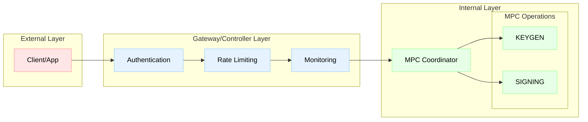

0:0**MPC Servers: The Architecture Behind Privacy-Preserving Observability**

Multi-Party Computation (MPC) servers are emerging as critical infrastructure for organizations that require collaborative analytics without compromising data privacy. In the observability space, these specialized servers enable a new paradigm: gaining collective insights from distributed systems while maintaining complete data sovereignty. This in-depth exploration examines the architecture, protocols, and operational considerations of MPC servers in contemporary observability platforms.0:1**Understanding MPC Server Architecture**

At its core, an MPC server is a specialized compute node designed to perform cryptographic operations on secret-shared data. Unlike traditional servers that process plaintext data, MPC servers work with mathematical shares that reveal no information about the underlying data.0:2**Core Components of an MPC Server**

Secret Sharing Engine
Splits input data into cryptographic shares using protocols like
Shamir’s Secret Sharing
or
additive secret sharing
.
Manages share distribution across the MPC cluster
Handles share reconstruction for authorized outputs
Secure Computation Runtime
Executes arithmetic and boolean circuits on secret-shared data
Implements protocols like GMW, BGW, or SPDZ for different security models
Optimizes computation paths for everyday observability operations (sum, average, min/max, percentiles)
Network Communication Layer
Manages authenticated channels between MPC nodes
Implements optimized protocols for share exchange
Handles Byzantine fault tolerance in adversarial settings
State Management
Maintains computation state across multi-round protocols
Implements secure storage for intermediate values
Manages protocol checkpoints for failure recovery0:3**MPC Protocol Selection for Observability Workloads**

Different MPC protocols offer varying trade-offs between security, performance, and functionality. For observability platforms, the choice of protocol significantly impacts system design:0:4**Information-Theoretic Protocols (BGW, GMW)**

Advantages:
Perfect security against computationally unbounded adversaries
No reliance on cryptographic assumptions
Lower computational overhead per operation
Observability Use Cases:
High-security environments (financial services, healthcare)
Scenarios where long-term data confidentiality is critical
Smaller-scale deployments with trusted infrastructure
Limitations:
Requires honest majority of servers
Higher communication complexity
Not suitable for wide-area deployments0:5**Computational Protocols (SPDZ, MASCOT)**

Advantages:
Security against a dishonest majority
Better suited for adversarial environments
Can operate with just two parties
Observability Use Cases:
Cross-organization collaborations
Public cloud deployments
Scenarios with potential malicious actors
Trade-offs:
Higher computational overhead
Requires a preprocessing phase
Dependent on cryptographic hardness assumptions0:6**Hybrid Protocols**

Modern MPC servers often implement hybrid approaches:
Use information-theoretic sharing for data distribution
Apply computational protocols for actual computation
Optimize different phases for specific observability metrics0:7**Optimizing MPC Servers for Observability Metrics**

Observability workloads have unique characteristics that MPC servers must accommodate:0:8**1. High-Volume Time Series Data**

MPC servers handling metrics must process millions of data points efficiently:
Optimization Strategies:
Batching
: Aggregate multiple metrics into a single MPC operation
Approximation
: Use privacy-preserving sketches for approximate statistics
Hierarchical Aggregation
: Compute local aggregates before MPC operations
Implementation Example:

```
// Instead of computing individual metrics

for each metric in metrics_stream:

    mpc_compute(metric)  // Inefficient


// Batch processing approach

metric_batch = batch_metrics(metrics_stream, size=1000)

mpc_compute_batch(metric_batch)  // Much more efficient
```0:9**2. Real-Time Processing Requirements**

Traditional MPC protocols struggle with real-time constraints. Modern MPC servers address this through:
Preprocessing Separation:
Expensive cryptographic operations performed offline
Online phase uses preprocessed materials for fast computation
Continuous preprocessing maintains material pools
Circuit Optimization:
Custom circuits for common observability operations
SIMD (Single Instruction, Multiple Data) operations on secret shares
Vectorized implementations of statistical functions0:10**3. Dynamic Participant Sets**

Observability platforms often have varying numbers of participants:
MPC Server Adaptations:
Dynamic secret sharing schemes
Proactive share refresh protocols
Elastic scaling of MPC clusters0:11**1. Dedicated MPC Cluster**

Organizations deploy dedicated MPC server clusters for observability:
Architecture:

```
[Observability Agent] → [MPC Gateway] → [MPC Server Cluster]

                                        ├── MPC Node 1

                                        ├── MPC Node 2

                                        └── MPC Node 3
```

Benefits:
Optimized for specific workloads
Better performance isolation
Simplified security boundaries0:12**2. MPC-as-a-Service**

Cloud providers offer MPC servers as managed services:
Components:
Multi-tenant MPC infrastructure
API-based access to MPC operations
Integrated with existing observability pipelines
Considerations:
The trust model includes a service provider
Potential for better economies of scale
Simplified operational overhead0:13**3. Federated MPC Networks**

Multiple organizations contribute MPC servers to a shared network:
Topology:

```
Org A MPC Servers ←→ Org B MPC Servers

        ↑                    ↑

        ↓                    ↓

Org C MPC Servers ←→ Org D MPC Servers
```

Advantages:
No single point of trust
Geographic distribution for resilience
Aligned incentives among participants0:14**Computation Optimization**

Circuit Depth Reduction
Minimize multiplication depth in arithmetic circuits
Use approximation algorithms where exact computation isn’t required
Implement specialized circuits for common operations
Parallelization Strategies
Thread-level parallelism for independent computations
GPU acceleration for suitable protocols
Distributed computation across MPC nodes
Memory Management
Efficient share representation to minimize memory footprint
Streaming algorithms for large datasets
Garbage collection is aware of the cryptographic material lifecycle0:15**Network Optimization**

Communication Patterns
Minimize round complexity in protocols
Batch communication to reduce latency impact
Use network coding for efficient multicast
Bandwidth Management
Compress shares where possible
Delta encoding for time series data
Adaptive protocols based on network conditions
Geographic Distribution
Strategic MPC server placement to minimize latency
Regional clusters for local computations
Hierarchical aggregation to reduce wide-area traffic0:16**1. Side-Channel Protection**

MPC servers must defend against side-channel attacks:
Constant-time implementations of cryptographic operations
Memory access pattern obfuscation
Power analysis countermeasures0:17**2. Malicious Adversary Protection**

Implement verifiable secret sharing
Use commitment schemes for input validation
Deploy zero-knowledge proofs for computation correctness0:18**3. Infrastructure Security**

Hardware security modules (HSMs) for key management
Secure enclaves for critical operations
Network isolation and encrypted communication channels0:19**Monitoring MPC Servers**

Ironically, monitoring MPC servers requires careful consideration:
Performance metrics must not leak information about computations
Health checks need to respect privacy boundaries
Audit logs must balance transparency with confidentiality0:20**Capacity Planning**

MPC servers have unique capacity requirements:
Preprocessing material generation creates a baseline load
Computation costs scale non-linearly with participant count
Network bandwidth often becomes a bottleneck before the CPU0:21**Failure Handling**

MPC protocols must gracefully handle server failures:
Redundant share distribution
Protocol checkpointing for recovery
Automatic failover with share reconstruction0:22**Hardware Acceleration**

Custom ASICs for MPC operations
FPGA implementations of standard protocols
Trusted execution environments (TEEs) for hybrid approaches0:23**Protocol Innovation**

Quantum-resistant MPC protocols
Improved preprocessing techniques
Function-specific optimizations for observability0:24**Standardization**

Common APIs for MPC operations
Interoperability between different MPC implementations
Industry-standard benchmarks for MPC server performance0:25**Implementing MPC Servers: A Practical Checklist**

For organizations deploying MPC servers for observability:
Protocol Selection
Assess security model (semi-honest vs. malicious)
Determine acceptable performance trade-offs
Consider long-term cryptographic requirements
Infrastructure Planning
Calculate computational requirements based on metric volume
Design network topology for optimal communication
Plan for preprocessing material generation
Integration Strategy
Define interfaces with existing observability stack
Implement data classification for MPC processing
Design fallback mechanisms for MPC unavailability
Operational Readiness
Establish monitoring without compromising privacy
Create runbooks for common failure scenarios
Train operations team on MPC-specific considerations0:26**MPC servers represent a fundamental shift in how we architect systems**

In the
observability
domain, they enable unprecedented collaboration while maintaining strict data boundaries. As these systems mature, we’re seeing convergence around common patterns and best practices.
The key to successful
M
ulti-
P
arty
C
omputation server deployment lies in understanding the unique constraints and opportunities they present. By carefully selecting protocols, optimizing for specific workloads, and building robust operational practices, organizations can harness the power of collaborative computation without compromising on privacy or security.
As we move toward an increasingly interconnected yet privacy-conscious world, MPC servers will likely become as fundamental to our infrastructure as load balancers and databases are today. The organizations that master this technology now will be best positioned to build the privacy-preserving observability platforms of tomorrow.1:0**How MPC Wallets Work: A Complete Guide for All Levels**

In digital asset security, understanding the foundations of key management is no longer optional. Whether you're a retail user exploring safer ways to store crypto or a CTO building custody infrastructure for a regulated institution, how a private key is protected defines the security, usability, and compliance profile of your entire system.
Among emerging technologies,
Multi-Party Computation (MPC) wallets
stand out for their unique ability to eliminate single points of failure without sacrificing usability or chain compatibility. But despite widespread adoption by major exchanges, trading firms, and fintech platforms, MPC remains a complex and often misunderstood subject—frequently oversimplified in marketing or conflated with legacy solutions like multi-sig and HSMs.
This article focuses specifically on
key material protection
—that is,
the physical security and distributed generation of private keys
. It does
not
attempt to cover
authorization security
—the policies, quorum enforcement, and consensus-based approval workflows that determine how and when keys are used to sign transactions. Those components are equally critical in production systems, but are treated separately from the cryptographic layer analyzed here.
To help you navigate the topic of MPC wallets at your depth of expertise, we present a tiered explanation model:
Beginners
will learn the basic concepts through real-world analogies and practical use cases.
Intermediate readers
will explore how MPC compares to other custody architectures like multi-signature wallets and hardware security modules.
Experts and technical leaders
will dive into MPC’s underlying cryptographic protocols, implementation trade-offs, and infrastructure-level implications.
The goal: to give readers at any level a working knowledge of what MPC wallets
are
, how they
work
, and what role they play in next-generation digital asset custody.
‍1:1**For Beginners: What Is an MPC Wallet and Why Does It Matter?**

Think of your crypto wallet as a safe that stores access to your money. In traditional setups, there's one key to that safe. If someone copies or steals it, your money is gone.
Now imagine this: you and two friends each have a piece of the key. The safe only opens when at least two of you use your parts together. None of you ever sees the whole key, and none of you can open the safe alone. That's how an
MPC wallet
(short for
Multi-Party Computation wallet
) works.
Instead of storing the full private key (which lets someone spend your crypto) in one place—on your phone, your laptop, or a server—MPC wallets create “pieces” of a key in encrypted fragments called
shares
. These shares are stored in separate devices or locations. When you want to make a transaction, the wallet asks enough of these key fragments to each generate a partial signature. These partial signatures are then assembled into a valid final signature—without ever reconstructing the full key.
That might sound complex, but it solves a big problem: because the key is distributed, a hacker would need to compromise multiple devices—at least enough to meet the signing threshold. Even if one device is breached, that alone isn’t enough. Contrast this with traditional hardware wallets or HSMs, where a single breach could expose the full key.
MPC wallets are commonly used for:
Securely holding Bitcoin, Ethereum, or stablecoins across multiple devices or systems
Sending crypto without relying on a single private key or seed phrase
Supporting shared control setups where multiple devices (not necessarily people) participate in signing
Institutions—banks, exchanges, and funds—that require robust key storage security through MPC, often paired with a separate authorization layer that governs who can trigger or approve transactions
Examples of MPC wallet providers:
Zengo
– a mobile consumer wallet that uses facial biometrics and MPC for easy, secure access
Fireblocks
– an enterprise platform that offers MPC-based custody for trading desks and institutions
Cordial Systems
– enables self-hosted MPC wallets for regulated financial institutions
MPC wallets are growing in popularity because they solve two critical challenges:
Storage Security
– They eliminate the risk of a single point of failure by distributing key shares across devices, reducing the chance that a single compromise results in asset loss.

Usability
– They remove the need for seed phrases or external hardware, making it easier for users to manage crypto securely.

Even if you’re just starting out in crypto, MPC wallets offer a way to benefit from strong cryptographic protections without needing to understand the math. And when paired with clear authorization policies, they form the foundation of secure, modern crypto custody.
This separation of how the key is protected (physical security) from who can use it and under what conditions (authorization security) is a powerful security model that aligns with institutions desires to follow the school of thought around
zero trust
: no single party or system is automatically trusted, and every action must be verified.
While MPC secures key material, policy engines define
how
keys are used. Best-practice architecture separates policy logic from signing components, allowing institutions to enforce compliance constraints (e.g., withdrawal limits, whitelisted addresses) independently. Integrating policy enforcement
within
the MPC quorum—where each participant validates policy rules before computing their share—is emerging as a preferred zero-trust pattern.
‍1:2**For Intermediates and Crypto Natives: Comparing MPC to Multi-Sig and HSMs**

As digital asset adoption matures, so do the technical expectations around custody infrastructure. Professionals working in crypto, fintech, and institutional finance are increasingly tasked with evaluating wallet architectures—not just for basic security, but for scalability, auditability, and operational resilience.
With more funds flowing into digital asset platforms, the wallet is no longer just a user endpoint; it's a compliance-sensitive, risk-bearing control plane. This section compares three leading custody approaches—multi-signature (multi-sig), Hardware Security Modules (HSMs), and Multi-Party Computation (MPC)—to help builders and decision-makers understand their technical distinctions and trade-offs.
Whether you're building for multi-chain support, regulatory alignment, or high-frequency operations, the wallet architecture you choose will shape your ability to operate securely and effectively.1:3**Multi-Signature (Multi-Sig) Wallets**

Multi-sig wallets require multiple parties to sign a transaction before it can be broadcast to the blockchain. A typical example might be a 2-of-3 wallet, where any two out of three signatures are needed.
Pros:
Transparent: On-chain representation of signers.
Proven: Widely used by Bitcoin and Ethereum wallets.
Cons:
Protocol-specific: Needs custom implementation for each blockchain.
Public: Anyone viewing the blockchain can see which addresses are involved.
Rigid: Changing signers requires redeploying the contract.1:4**Hardware Security Modules (HSMs)**

HSMs are tamper-resistant physical devices designed to store cryptographic keys and perform signing operations. They are widely used in enterprise settings and often certified under standards like FIPS 140-2 or FIPS 140-3.
Advantages:
Strong Physical Security
– Designed to protect key material from tampering or extraction, even under physical attack.

Regulatory Familiarity
– Well-understood by auditors and regulators, often required in traditional finance (e.g., PCI-DSS, FIPS).

Limitations:
Centralization of Control
– While HSMs offer robust storage, they do not natively provide distributed authorization. The entity that holds the HSM typically has unilateral signing power unless additional policy systems are layered on top. This separation between storage security (where and how the key material lives) and authorization logic (who gets to use it and under what circumstances) is central to the
zero-trust
philosophy. In modern custody architecture, trust isn't granted to any one actor, system, or device by default. Instead, policy enforcement, access approvals, and cryptographic participation must be independently verifiable. This principle underpins why MPC-based systems are increasingly decoupling key protection from policy decisioning.
‍
Single Logical Unit
– Even with physical protection, an HSM is still one box. If stolen or compromised (physically or via credential leaks), it becomes a single point of failure.
‍
Operational Rigidity
– Integrating HSMs into multi-chain, cloud-native environments can be costly, complex, and brittle at scale.

⚠️
Important Distinction:
HSMs excel at
storage security
,
not authorization policy
. They secure the private key, but don’t define who is allowed to use it or under what conditions — that logic must be implemented separately, often via external access control systems or middleware.
‍1:5**MPC Wallets: Bridging Both Worlds**

MPC wallets combine the distributed control of multi-sig with the high-assurance security of HSMs—without their limitations.
Advantages over Multi-Sig:
Chain Agnostic:
Works across blockchains without requiring smart contracts or protocol changes.
Privacy-Preserving:
No on-chain exposure of the signing structure.
Decoupled Access Control
: Instead of resharing key material (i.e., regenerating new key shares for the same private key to change quorum participants — a process that can be complex and error-prone), advanced MPC systems like Cordial decouple access control from key storage. They model dynamic signer permissions in a separate authorization layer, allowing policy updates without touching the underlying cryptographic material.
Advantages over HSMs:
No Single Point of Storage:
Key shares are spread across multiple nodes.
Scalable Security:
The number of nodes/shares can be tailored to the required security
Cloud-Native:
Can be deployed in modern cloud environments without proprietary hardware.
Software Upgradability:
Easier to iterate and improve over time.1:6**Institutional Implications**

MPC wallets when designed correctly allow banks, custodians, exchanges, and payment firms to not only distribute signing operations but also:
Enforce policy controls and approval logic in a secure, distributed layer—rather than relying on centralized role-based access control (RBAC)

systems that can reintroduce single points of failure.
Support multi-chain portfolios with a unified signing engine.
Reduce attack surfaces and avoid compliance bottlenecks tied to centralized infrastructure.
In operational terms, MPC wallets enable a higher degree of control and fault tolerance. Even if one signing device fails, transactions can still proceed (depending on the threshold setup), which is critical for uptime-sensitive financial infrastructure.
As regulatory frameworks like NYDFS part 500 and DORA begin emphasizing operational resilience, cryptographic auditability, and secure key governance, MPC’s separation of physical key security from policy logic—when implemented correctly—offers a path to compliance that legacy solutions cannot.
In sum: MPC wallets aren’t just more secure wallets. They’re the foundation for programmable, distributed control planes that align with institutional governance, resilience, and auditability standards.
‍1:7**MPC For Technical Experts: Under the Hood of MPC Wallets**

At the most granular level, MPC wallets are cryptographic orchestration frameworks designed to eliminate single points of private key exposure during both key generation and signing. Rather than being a single algorithm or library, “MPC” in practice refers to a class of cryptographic protocols that enable secure multiparty computation—each with different performance profiles, security assumptions, and implementation challenges.1:8**Foundational Cryptographic Concepts**

Threshold Cryptography:

MPC wallets rely on threshold cryptography, where a private signing key exists as
n
shares such that any
t
of them (where
t ≤ n
) can cooperatively generate a valid signature. The private key is never assembled in full—not even in memory—at any stage.
Distributed Key Generation (DKG):

Secure DKG protocols allow each party to generate its key share independently, without any single party knowing or reconstructing the full key. This contrasts with legacy models like Shamir’s Secret Sharing (SSS), where a full key is created first and then split afterward—a process that introduces centralization risks at genesis. Modern DKG schemes are critical for achieving robust, production-ready distributed key generation. An example can be found in Appendix A of
Lindell22
(Appendix not specific to Schnorr signatures). In essence, all parties
in parallel
contribute a SSS, instead of a single trusted dealer. These protocols form the bedrock of MPC custody infrastructure that is secure from the very beginning—ensuring that no full key ever exists, even during setup.
Secure Multiparty Computation (SMPC):

During transaction signing, each participant locally computes functions over their key share without revealing it. The parties jointly compute a digital signature (e.g.,
ECDSA
or
EdDSA
) via cryptographic protocols such as:
Threshold ECDSA
– used for the many blockchains that were created before the patent on Schnorr signatures expired (e.g.
Lindell’s 2-party ECDSA
or
DKLs23
)
Threshold Schnorr
– which underpins both EdDSA (used in modern cryptographic systems) and Bitcoin’s Taproot upgrade. Examples include
Lindell22
and
FROST.
These protocols require multiple rounds of communication, nonce synchronization, and input validation to defend against rogue key attacks, transcript replay, and nonce reuse vulnerabilities.1:9**Architecture and Implementation Considerations**

Communication Rounds and Latency

MPC signing protocols differ in the number of communication rounds required. Both ECDSA and Schnorr signatures can be created in three rounds under standard cryptographic assumptions (DKLs23 for ECDSA, Lindell22 for Schnorr). Schnorr signatures can be sped up to two rounds under non-standard cryptographic assumptions (FROST). Older schemes take more rounds, for example the complicated four round ECDSA protocol CGGMP21. There is also a tradeoff between communication complexity (size of messages sent) and computational complexity (content of messages). Most protocols have a concept of prepared signatures, where most of the protocol is run in advance, such that the actual signing can in zero rounds, consuming a prepared signature. In practice, nobody uses MPC wallets for high-frequency trading, and all protocols are performant enough.
Fault Tolerance and Infrastructure Strategy
In high-assurance MPC custody setups, fault tolerance is achieved through a t-of-n quorum, which allows signing operations to proceed even if one or more key share holders are unavailable. This design enables resilient transaction processing without exposing the full private key at any point.
Rather than relying on heterogeneous devices (which may introduce weak links), enterprise-grade MPC wallets should distribute key shares across secured infrastructure nodes—for example, a mix of bare-metal servers, secure enclaves, and multi-cloud deployments. This approach ensures geographic redundancy, business continuity, and compliance-grade isolation for each signing participant.
There are some things to watch out for, starting with “MPC on HSM”. Which is pure marketing nonsense. HSMs cannot participate in MPC, they don't have the required granularity of cryptographic operations. Few HSMs have usable generic programming (i.e. sideload whatever program, using it as a trusted execution environment) and when they do, often they’re not even “constant time” which is a basic requirement for doing secure cryptographic engineering. For instance the popular nCipher Connect series has a PPC32 which is 32 bit and has non constant-time arithmetic.
The second danger is mobile phones. Mobiles are no place for high value key shares (although fine for consumer wallets). High value key shares should be on highly secured servers. Enough said.
Policy Enforcement and Orchestration

While MPC secures key material, policy engines define
how
keys are used. Best-practice architecture separates policy logic from signing components, allowing institutions to enforce compliance constraints (e.g., withdrawal limits, whitelisted addresses) independently. Integrating policy enforcement
within
the MPC quorum—where each participant validates policy rules before computing their share—is emerging as a preferred zero-trust pattern.
Auditability and Verifiability

From a security auditing perspective, MPC systems must emit detailed logs at each step:
Who initiated the signing session?
Which quorum members participated?
What policy was evaluated and by whom?
What transaction hash was ultimately signed?
These logs support forensic analysis and regulatory compliance (e.g., under DORA’s ICT auditability requirements). In well-designed MPC systems, signatures can be cryptographically tied to the metadata of the signing session—such as quorum composition and approval decisions—ensuring that every transaction is both accountable and policy-bound, without revealing sensitive internal logic or key material.
DKG vs. SSS Confusion:

Some “MPC” wallet providers still use
Shamir’s Secret Sharing
under the hood for key generation, falsely marketing it as MPC. Unlike DKG, bare SSS requires a centralized dealer and lacks forward secrecy in compromised environments. Institutions evaluating solutions must scrutinize how keys are created—not just how they’re used.1:10**Application-Level Implications**

Latency in High-Frequency Environments:

For trading platforms or real-time payment networks, MPC’s communication overhead may introduce latency. The ability to pre-sign transactions or batch nonce commitments can help mitigate this. Some providers adopt hybrid models—e.g., using MPC for transaction approval and ephemeral ECDSA keys for actual execution—to balance speed and safety.
Disaster Recovery Models:

A robust MPC architecture includes independent, recoverable key shares stored in secure enclaves or third-party custodians. Unlike traditional wallets, recovery doesn’t require recreating the private key—it simply needs reinitializing quorum participants. This is critical for regulated institutions who must demonstrate business continuity under DORA and MiCA.
Cross-Chain Support:

Because MPC wallets operate at the cryptographic layer, they are blockchain-agnostic. Whether managing assets on Bitcoin, Ethereum, Cosmos SDK chains, or newer Layer-1s, the underlying MPC engine does not need to change—only the transaction payloads differ.
However, cross-chain consistency assumes that payloads presented for signing are valid and well-formed. In best-practice architectures (including Cordial’s), this risk is mitigated by integrating payload generation and validation directly into the MPC flow. Each signing participant independently verifies that the payload complies with expected transaction formats and policy constraints before contributing their share.
This ensures that signing quorum members are not blindly signing opaque or malicious data—preserving the integrity of MPC even across diverse chains with varying serialization formats or policy models.
As a result, institutions gain a unified, verifiable key management and signing interface across all supported chains—without compromising on trust assumptions or execution transparency.
‍1:11**Conclusion: Cryptographic Infrastructure for the Next Financial Era**

From simplifying key recovery for consumers to enabling fault-tolerant, chain-agnostic signing infrastructure for institutions, MPC wallets represent one of the most important evolutions in the secure custody of digital assets. By distributing cryptographic control without ever reconstructing private keys, they remove long-standing single points of failure in wallet design.
But real MPC isn't just about secure key storage—it's about how signing policies are enforced, how payloads are verified, and how quorum participants coordinate securely without relying on hidden central authorities. As we've seen, not all MPC wallets are created equal. Many vendors stop at cryptography, while leaving critical control and logic outside the quorum—where it can be bypassed, compromised, or misunderstood.
The future of custody isn't just about strong math—it's about making every control point independently verifiable, policy-driven, and immune to single-device compromise. That means merging cryptographic resilience with zero-trust orchestration—and doing it in a way that scales across chains, teams, and regulatory frameworks.
Most MPC wallets stop at securing the key. But real-world security requires consensus on how, when, and
why
it’s used. In an upcoming post, we’ll explore how Cordial extends MPC beyond the key layer—into the heart of distributed governance.
Whether you're a user, developer, or enterprise architect, the MPC wallet you choose is more than a tool. It’s your system's security foundation. If you're building critical infrastructure and need MPC that delivers cryptographic and operational integrity—end to end—Cordial Treasury gives you the architecture to do it right in a fully productised format that’s easy to run in your own environment.
Schedule a walkthrough
today.
Share to:
Text Link
Text Link1:12**The Custody Trilemma: Achieving Security, Access and Control**

The custody trilemma: balancing security, accessibility, and operational control in digital assets.2:0**Platform capabilities**

Fireblocks Network
Security
Policy & governance
Compliance
Flexible deployment2:1**Community**


Webinars

Fireblocks Academy

Dynamic joins Fireblocks
The complete infrastructure stack to bring customers onchain in the most seamless and secure way possible.
Pricing
Products
Digital Asset Infrastructure
Treasury Management
Wallets-as-a-service
Embedded Wallets
Payments
Tokenization
Network
Stablecoin Infrastructure

Payments

Network for Payments

Compliance

Batched Transactions


Wallets-as-a-service

Embedded Wallets

Policy & governance

Security


Automation

Staking

Swaps

Issue

Tokenization

Network

Solutions

Digital asset infrastructure

Stablecoin infrastructure

Industries
Trading firms
Fintechs & exchanges
Financial institutions
Platform capabilities
Fireblocks Network
Flexible deployment
Ecosystem

Trust Company

Partners

Professional Services

Support

Developer
Resources
Communication

Blogs

Customer stories

Reports & guides

Community
August 18, 2025
Expert Commentary
,
Industry Insights
,
Knowledge Base2:2**Standardizing MPC Cryptography: A Cross-Industry Call to Action**

Peter Marton
Director of Digital Identity, Compliance Advisory, and U.S. Policy
11 min. read
Written in collaboration with Arik Galansky
The
GENIUS Act’s passage
and the recent release of the
Report
from the Presidents Working Group on Digital Asset Markets reflects a pivotal shift in how the U.S. financial system is preparing for blockchain innovation. As financial regulators turn their focus toward stablecoins, tokenization, and onchain payments, a core question is emerging: how do we ensure that the cryptographic infrastructure underpinning these new activities is secure, resilient, and interoperable?
One such technology,
Multi-Party Computation (MPC)
, has already become a de facto security standard across the digital asset ecosystem, protecting trillions of dollars with advanced safeguards. But its widespread institutional adoption still faces a hurdle: the lack of formal U.S. technical standards.
That’s why Fireblocks recently brought together a cross-industry coalition of leaders from world-class cryptography labs, financial institutions, infrastructure providers, and cybersecurity firms to submit a joint letter urging the
National Institute of Standards and Technology
(NIST) to accelerate its important and welcomed work on MPC standardization. This blog outlines the context, urgency, and implications of that effort.2:3**Why MPC Is Core to Institutional-Grade Digital Asset Security**

Why MPC Is Core to Institutional-Grade Digital Asset Security
Over the past decade, novel cryptographic technologies like
Multi-Party Computation (MPC)
have been used to secure billions of dollars across the digital asset and crypto payments ecosystem. MPC has become a de facto standard for institutions needing advanced safeguards, playing a foundational role in “defense-in-depth” strategies that protect against both nation-state adversaries like the DPRK and consumer-targeted threats such as scams, fraud, and ransomware.
Unlike traditional approaches to digital asset custody,
MPC
enables sensitive operations such as transaction signing and key management without ever reconstructing a full private key in a single location. That decentralization mitigates single points of failure, making it a powerful architecture for securing both assets and operations.
As regulated financial institutions scale their digital asset programs, MPC offers a proven cryptographic backbone that meets institutional expectations around risk controls, resilience, and operational flexibility. Its growing adoption underscores the need for
official technical standards
to guide secure implementation—particularly in regulated environments.3:0**Implementation of an IoT based Embedded MPC scheme**

Karthikmr
--3:1**I. Introduction**

In this article, I will explain you about an IoT based Embedded MPC scheme with a practical example on the pendulum swing-up control problem also known as the cart-pole stabilization problem. The crux of the problem is to control the pendulum (pole) in an inverted position only by the virtue of input force applied to the cart i.e. the base of the system.
It is also important to note that the system must be stabilized for any given state configuration
. In order to solve this problem, an MPC controller is developed using the pNMPC C code generation software tool [1][2]. The generated C-code MPC controller is then integrated with a MQTT client programmed in C++ and also, deployed and executed on the embedded board Raspberry Pi 4 model B (RPi-4B). At the PC end, a python code runs the OpenAI Gym’s cart-pole simulation with the feedback control signal obtained from the RPi-4B board. In short, a “Hardware in the Loop” (HiL) simulation is performed where the RPi-4B acts as an embedded controller and the PC acts as the plant. So to summarize
What does the RPi-4B do?
The RPi-4B hardware receives the state information from the PC via the MQTT client which is subscribed to the STATES/ topic where the state information is published by the PC. The obtained states are processed and the optimal control input is computed by the MPC controller. The computed input is published to the INPUTS/ topic which is subscribed by the PC.
What does the PC do?
The PC simulates the OpenAI Gym’s cart-pole system and at each time step, the control input is obtained from the INPUTS/ topic and this input is injected into the system and thereby the system transitions to the next state. Finally, the transitioned state is published to the STATES/ topic which is subscribed by the RPi-4B board.
It is also important to note that in this example the PC also acts as the MQTT broker
.
For the uninitiated, I know I have sprinkled a lot of terminologies which you might or might not be familiar. Therefore, I have listed a few prerequisites which are required for the reader to grasp the concepts as well as implement the control algorithm in real-time. The prerequisites are
Basics on non-linear state space models, optimal control/MPC, and optimization problem formulation.
Basics of MQTT protocol and programming MQTT C++/Python client
Basics in C++/Python programming.
Setting up the RPi-4B board.
Of course, I have provided a cursory overview for a select few topics, however I haven’t delved much into the details on MQTT, how to setup MQTT in your system, C++/Python tutorials, setting up your C++/Python projects etc. There are deluge of online resources which provide an in-depth walkthrough on explaining these topics and also setting up your system with the aforementioned tools.3:2**II. Physical modeling**

One of the key ingredients of an MPC problem is the underlying model of the system. The model which I used for the cart-pole system was based on the modified Cart-pole example provided along with the OpenAI Gym python package (source code — “cartpole.py”). With a little research on the code, I was able to find the right reference paper with the appropriate model equations and system parameters [3]. The model equations utilized for the MPC problem is given below as shown in Fig1.
Where the states and inputs of the system are represented with X, U respectively. The elements of the state vector are [cart position (m), cart velocity (m/s), pole angle (rad), pole angular velocity (rad/s)] and the elements of the input vector is the force (N) respectively as shown below in Fig2.
The system parameters and its values are listed in the table below (shown in Fig3).
Fig3.
Despite the fact that the mathematical model matches up with the code, the underlying assumption over the input injected into the system was fundamentally different from the natural assumption that one would make out from the above model. With a closer look into the code, I was able to figure out that the assumption for the input was a binary input, i.e. the input would swing from maximum force to minimum force and vice versa (typically like a bang-bang control). However, in the context of the MPC problem considered in this article, the requirement of the input was to follow a continuum of values between the maximum and minimum force values and thereby, I commented out the code where the input was considered to be a binary signal and added the code where the force equals the action (shown in Fig4 and Fig5).
Fig4.
Fig5.
force=action
Now, the system’s states and inputs are in the realm of continuous spaces.3:3**III.
Model Predictive Control**

Model Predictive Control
Model predictive control (MPC) is one of the most efficient control strategies due to the fact that the system’s performance objectives and constraints satisfaction requirements are inherently baked into the controller as an optimization problem. As literally from the definition “Model” + “Predictive” + “Control”, the mathematical model of the system is utilized to predict how the system states evolve over the prediction horizon given the initial state information. Then, by virtue of optimization techniques, the optimal set of inputs are computed such that it satisfies the required objectives and constraints. Finally, the first input of the sequence of optimal control inputs over the prediction horizon is injected into the system. This process is repeated at every sampling period with the receipt of new state information and that’s why MPC is also known as receding horizon control (RHC). A graphical interpretation of the control algorithm is illustrated in Fig6.
There are several MPC software tools available at one’s disposal, however in this article I would like to use the pNMPC C-code generation software tool which I developed during my PhD. This choice is by no means meant to promote or boast myself (:D) rather it was by my level of comfort with the tool and also, I am quite acquainted with it because I programmed it from scratch. Added to that, the pNMPC method utilizes a derivative free solver (suitable for black-box models) and also, the generated controller C-code was optimized to suit small scale and fast sampled systems. Nevertheless, the reader is free to choose any tool of his/her comfort. For more details about the pNMPC method refer [1].
Fig7.
I will directly delve into the code part of the controller.
It is important to note that the control policy for this example follows a linear state feedback policy i.e. at every sampling instance, the optimal linear feedback gains are computed by the pNMPC solver
. Once when the pNMPC code as shown in Fig8 is executed, the generated C-codes are populated in the appropriate file directories as shown in Fig7.
Fig8.
An example of the C-code generated for the dynamics of the system (source code — Dynamics.c) is shown in Fig9.
The generated codes along with the folders as shown in Fig7 forms the entirety of the MPC controller.3:4**IV. Implementation details**

Coding the embedded controller on Rpi4-B
Obtaining the MPC controller codes are pretty straightforward as the pNMPC code generation tool automatically generates the MPC C-codes and these are placed in appropriate folders as shown in Fig7. The MQTT client is setup up in C++ with the client ID, broker address (IPv4 address), MQTT port and publish/subscribe topics. A controller code is called from the main function which performs the following commands in order
1) The state information is received from the subscribed STATES/ topic and processed into a numeric array.
2) With the obtained state information the optimal input is computed from the MPC codes.
3) Finally the computed input is published to theINPUTS/ topic.
The whole process is placed in a loop until the simulation ends at the PC end, i.e. when the signal “Q” (“Q” stands for quit) is received by the controller, the loop gets terminated and the program execution is completed.
Fig10.
Coding the plant on PC
Programming the Cart-pole simulation and MQTT client in python is easy and very straightforward as there are already several packages which has the necessary methods to easily implement the module. The OpenAI’s Gym package is used for the cart-pole simulation and the Paho MQTT package is used for programming the MQTT client. As an example, the plant code is shown in Fig10.
Implementation (Video)3:5**V. Conclusion**

In this article I have explained on how to implement an IoT based Embedded MPC scheme with a simple example on control of a cart-pole system. The implementation was implemented for a small-scale plant (cart-pole system), however for large scale systems different MPC methods such as decentralized, cooperative, non-cooperative or game-theoretic approaches could be adopted with several embedded controllers working in parallel. This approach of integrating with IoT has a huge potential for better optimized control of the entire plant and also the approach is scalable.3:6**References**

[1] Rathai, Karthik Murali Madhavan, Mazen Alamir, and Olivier Sename. “pNMPC-A Code Generation Software Tool for Implementation of Derivative Free Parameterized NMPC Scheme for Embedded Control Systems.” (2020).
[2] K. M. M. Rathai, “pNMPC: A code generation tool for implementation of pNMPC controller for embedded control systems,” https://github.com/Kartz4code/pNMPC CODEGEN, 2020, [Online; accessed 22-June-2020]
[3] Florian, Razvan V. “Correct equations for the dynamics of the cart-pole system.”
Center for Cognitive and Neural Studies (Coneural), Romania
(2007).
[4] Rawlings, James Blake, David Q. Mayne, and Moritz Diehl. Model predictive control: theory, computation, and design. Vol. 2. Madison: Nob Hill Publishing, 2017.
--4:0**Vehicle MPC Controller**

David Rose
--
An
MPC, or Model Predictive Control
, is a process control designed to automate a sensor/actuator system such industrial power systems, robotics, or in this case: driving a vehicle around a track. We can sense the car and the position (x/y coordinates) relative to the track, and then we can control it via steering.
To help illustrate, you can see in the diagram below the light blue line on the bottom is the actuation, in this case a discrete input, along with the trajectory (both reference and predicted) at the top. The controller will take in the sensed state of the system and optimize an ideal control plan based on a
cost function
defined within the model.
Here we only have one actuator, which for example could be the control rods that moderate the fission rate in a nuclear plant, but in my controller I will have two.4:1**My Model**

Through using a Unity game engine simulation of a vehicle on a track, the vehicle will be controlled using MPC (model predictive control) process control. This is similar to
my other project on GitHub that used a PID controller for this same task
. The difference is that an MPC controller (forgive the redundancy of words here, I prefer this phrasing) can effectively model future time states and plan ahead. The model was optimize throughout this finite time-horizon each actuator, which in this case is steering and throttle/brake. Throttle and braking are controlled via the same actuation via values with a range of [1,1].4:2**Steps Involved:**

Understand methods of accessing and controlling the car.
Convert the MPC method to C++ code and implement in both main.cpp and mpc.cpp to control the vehicle
Observe and take into account the simulated latency (in this case 100ms) of the sensor stack and optimize the model using this knowledge.4:3**Dependencies and Compiling the C++ code**

If you care for the technical aspects of implementation see my
GitHub ReadMe her
e for more detailed instructions.4:4**Vehicle Control API**

Using a WebSocket server, the C++ console program communicates with the driving simulator through a JSON file that takes in and reads out various telemetry variables. These include: CTE, speed, angle, throttle, and steering angle.
In this MPC controller I will need to observe the CTE, heading, and speed, while pushing throttle (including braking for negative values under 0) and steering angle in an attempt to keep up the highest possible speed while staying safely within the lane. Though in this case I have locked speed to a specific value to aim for at 60mph. Below is the code for reading the initial telemetry into C++:4:5**MPC Controller Algorithm**

The aim of this is to model the behavior of dynamical systems, in this case the vehicle positioning and trajectory. This is a kinematic model that is a more advanced version of the
PID controller from my other repository
that does not take into account future time states. This will model the change in dependent variables that are caused by changes in the independent variables.
This is an iterative process based on a finite-horizon optimization of states. We will attempt to minimize the cost (CTE, heading, velocity) of the vehicle on the track. This is what is called on online model, in that it calculates on-the-fly.
This is a multi-variable control algorithm that uses:
a dynamical model of the process.
a history of past actuation.
an optimization of a cost function (CTE, heading, velocity) over the prediction horizon.
Below is the mathematical notation for some of the state prediction updates:
The code to implement the above is as follows:4:6**Tuning the Model**

For me personally, I found these variables to work best with my model at a target speed of 60mph:
Timestep Length
—
N
- This is the count of way-points to predict actuation for the vehicle in the future. For this project I used a length of
7
as it predicted enough around turns but did not run too slowly for my computer. Though I have a feeling on slower CPUs it may struggle. In the image below you can see an example of a controller with 6 way-points:
Duration
—
dt
- Elapsed time at
100
should coincide very cleanly with the
100ms
delay built in to the model. Quicker is ideally better, but will be more taxing on the system CPU.4:7**In Closing**

This is an expansion of my PID controller from earlier, which I have a
GitHub repository for here
. To really get to enjoy the fun, apply for the
Udacity Self-Driving Car NanoDegreee program
. This project will come up in Term 2 near the end. It has taught me an amazing amount so far of curated skills that will be useful in such a career. Beforehand, much of this material was relegated to scientific papers and engineering textbooks. Having it all together on a responsive website, with videos and code examples, is a huge benefit. The projects then help you really hammer all this information in.
Machine Learning
Autonomous Cars
Automation
--5:0**MPC Servers: The Architecture Behind Privacy-Preserving Observability**

Multi-Party Computation (MPC) servers are emerging as critical infrastructure for organizations that require collaborative analytics without compromising data privacy. In the observability space, these specialized servers enable a new paradigm: gaining collective insights from distributed systems while maintaining complete data sovereignty. This in-depth exploration examines the architecture, protocols, and operational considerations of MPC servers in contemporary observability platforms.5:1**Understanding MPC Server Architecture**

At its core, an MPC server is a specialized compute node designed to perform cryptographic operations on secret-shared data. Unlike traditional servers that process plaintext data, MPC servers work with mathematical shares that reveal no information about the underlying data.5:2**Core Components of an MPC Server**

Secret Sharing Engine
Splits input data into cryptographic shares using protocols like
Shamir’s Secret Sharing
or
additive secret sharing
.
Manages share distribution across the MPC cluster
Handles share reconstruction for authorized outputs
Secure Computation Runtime
Executes arithmetic and boolean circuits on secret-shared data
Implements protocols like GMW, BGW, or SPDZ for different security models
Optimizes computation paths for everyday observability operations (sum, average, min/max, percentiles)
Network Communication Layer
Manages authenticated channels between MPC nodes
Implements optimized protocols for share exchange
Handles Byzantine fault tolerance in adversarial settings
State Management
Maintains computation state across multi-round protocols
Implements secure storage for intermediate values
Manages protocol checkpoints for failure recovery5:3**MPC Protocol Selection for Observability Workloads**

Different MPC protocols offer varying trade-offs between security, performance, and functionality. For observability platforms, the choice of protocol significantly impacts system design:5:4**Information-Theoretic Protocols (BGW, GMW)**

Advantages:
Perfect security against computationally unbounded adversaries
No reliance on cryptographic assumptions
Lower computational overhead per operation
Observability Use Cases:
High-security environments (financial services, healthcare)
Scenarios where long-term data confidentiality is critical
Smaller-scale deployments with trusted infrastructure
Limitations:
Requires honest majority of servers
Higher communication complexity
Not suitable for wide-area deployments5:5**Computational Protocols (SPDZ, MASCOT)**

Advantages:
Security against a dishonest majority
Better suited for adversarial environments
Can operate with just two parties
Observability Use Cases:
Cross-organization collaborations
Public cloud deployments
Scenarios with potential malicious actors
Trade-offs:
Higher computational overhead
Requires a preprocessing phase
Dependent on cryptographic hardness assumptions5:6**Hybrid Protocols**

Modern MPC servers often implement hybrid approaches:
Use information-theoretic sharing for data distribution
Apply computational protocols for actual computation
Optimize different phases for specific observability metrics5:7**Optimizing MPC Servers for Observability Metrics**

Observability workloads have unique characteristics that MPC servers must accommodate:5:8**1. High-Volume Time Series Data**

MPC servers handling metrics must process millions of data points efficiently:
Optimization Strategies:
Batching
: Aggregate multiple metrics into a single MPC operation
Approximation
: Use privacy-preserving sketches for approximate statistics
Hierarchical Aggregation
: Compute local aggregates before MPC operations
Implementation Example:

```
// Instead of computing individual metrics

for each metric in metrics_stream:

    mpc_compute(metric)  // Inefficient


// Batch processing approach

metric_batch = batch_metrics(metrics_stream, size=1000)

mpc_compute_batch(metric_batch)  // Much more efficient
```5:9**2. Real-Time Processing Requirements**

Traditional MPC protocols struggle with real-time constraints. Modern MPC servers address this through:
Preprocessing Separation:
Expensive cryptographic operations performed offline
Online phase uses preprocessed materials for fast computation
Continuous preprocessing maintains material pools
Circuit Optimization:
Custom circuits for common observability operations
SIMD (Single Instruction, Multiple Data) operations on secret shares
Vectorized implementations of statistical functions5:10**3. Dynamic Participant Sets**

Observability platforms often have varying numbers of participants:
MPC Server Adaptations:
Dynamic secret sharing schemes
Proactive share refresh protocols
Elastic scaling of MPC clusters5:11**1. Dedicated MPC Cluster**

Organizations deploy dedicated MPC server clusters for observability:
Architecture:

```
[Observability Agent] → [MPC Gateway] → [MPC Server Cluster]

                                        ├── MPC Node 1

                                        ├── MPC Node 2

                                        └── MPC Node 3
```

Benefits:
Optimized for specific workloads
Better performance isolation
Simplified security boundaries5:12**2. MPC-as-a-Service**

Cloud providers offer MPC servers as managed services:
Components:
Multi-tenant MPC infrastructure
API-based access to MPC operations
Integrated with existing observability pipelines
Considerations:
The trust model includes a service provider
Potential for better economies of scale
Simplified operational overhead5:13**3. Federated MPC Networks**

Multiple organizations contribute MPC servers to a shared network:
Topology:

```
Org A MPC Servers ←→ Org B MPC Servers

        ↑                    ↑

        ↓                    ↓

Org C MPC Servers ←→ Org D MPC Servers
```

Advantages:
No single point of trust
Geographic distribution for resilience
Aligned incentives among participants5:14**Computation Optimization**

Circuit Depth Reduction
Minimize multiplication depth in arithmetic circuits
Use approximation algorithms where exact computation isn’t required
Implement specialized circuits for common operations
Parallelization Strategies
Thread-level parallelism for independent computations
GPU acceleration for suitable protocols
Distributed computation across MPC nodes
Memory Management
Efficient share representation to minimize memory footprint
Streaming algorithms for large datasets
Garbage collection is aware of the cryptographic material lifecycle5:15**Network Optimization**

Communication Patterns
Minimize round complexity in protocols
Batch communication to reduce latency impact
Use network coding for efficient multicast
Bandwidth Management
Compress shares where possible
Delta encoding for time series data
Adaptive protocols based on network conditions
Geographic Distribution
Strategic MPC server placement to minimize latency
Regional clusters for local computations
Hierarchical aggregation to reduce wide-area traffic5:16**1. Side-Channel Protection**

MPC servers must defend against side-channel attacks:
Constant-time implementations of cryptographic operations
Memory access pattern obfuscation
Power analysis countermeasures5:17**2. Malicious Adversary Protection**

Implement verifiable secret sharing
Use commitment schemes for input validation
Deploy zero-knowledge proofs for computation correctness5:18**3. Infrastructure Security**

Hardware security modules (HSMs) for key management
Secure enclaves for critical operations
Network isolation and encrypted communication channels5:19**Monitoring MPC Servers**

Ironically, monitoring MPC servers requires careful consideration:
Performance metrics must not leak information about computations
Health checks need to respect privacy boundaries
Audit logs must balance transparency with confidentiality5:20**Capacity Planning**

MPC servers have unique capacity requirements:
Preprocessing material generation creates a baseline load
Computation costs scale non-linearly with participant count
Network bandwidth often becomes a bottleneck before the CPU5:21**Failure Handling**

MPC protocols must gracefully handle server failures:
Redundant share distribution
Protocol checkpointing for recovery
Automatic failover with share reconstruction5:22**Hardware Acceleration**

Custom ASICs for MPC operations
FPGA implementations of standard protocols
Trusted execution environments (TEEs) for hybrid approaches5:23**Protocol Innovation**

Quantum-resistant MPC protocols
Improved preprocessing techniques
Function-specific optimizations for observability5:24**Standardization**

Common APIs for MPC operations
Interoperability between different MPC implementations
Industry-standard benchmarks for MPC server performance5:25**Implementing MPC Servers: A Practical Checklist**

For organizations deploying MPC servers for observability:
Protocol Selection
Assess security model (semi-honest vs. malicious)
Determine acceptable performance trade-offs
Consider long-term cryptographic requirements
Infrastructure Planning
Calculate computational requirements based on metric volume
Design network topology for optimal communication
Plan for preprocessing material generation
Integration Strategy
Define interfaces with existing observability stack
Implement data classification for MPC processing
Design fallback mechanisms for MPC unavailability
Operational Readiness
Establish monitoring without compromising privacy
Create runbooks for common failure scenarios
Train operations team on MPC-specific considerations5:26**MPC servers represent a fundamental shift in how we architect systems**

In the
observability
domain, they enable unprecedented collaboration while maintaining strict data boundaries. As these systems mature, we’re seeing convergence around common patterns and best practices.
The key to successful
M
ulti-
P
arty
C
omputation server deployment lies in understanding the unique constraints and opportunities they present. By carefully selecting protocols, optimizing for specific workloads, and building robust operational practices, organizations can harness the power of collaborative computation without compromising on privacy or security.
As we move toward an increasingly interconnected yet privacy-conscious world, MPC servers will likely become as fundamental to our infrastructure as load balancers and databases are today. The organizations that master this technology now will be best positioned to build the privacy-preserving observability platforms of tomorrow.6:0MPC Deployments
A hub for real-world MPC deployments6:1**The Deployment Dilemma: Merits & Challenges of Deploying MPC**

Sep 27, 2023
17 min
MPC, or
secure multi-party computation
, is a powerful class of cryptographic primitives that enables a host of privacy-preserving systems. In MPC, $n$ parties each have an input $s_i$, and aim to compute a joint function $f(s_1, …, s_n)$. Because parties can only learn the function’s output, each party’s input is entirely hidden from the rest.
In recent years, milestones in the efficiency of MPC protocols have opened a new door: leveraging MPC in broad-reaching, user-facing applications. But
designing
and
implementing
an MPC protocol is only the first step to
deploying
an
end-to-end
MPC application.
The authors of this post are working on real-world MPC systems, some that serve many millions of users. In this piece, we bring together our respective experiences to collectively reflect on the following question:
What are the most significant challenges to the development and deployment of MPC applications?6:2**Signal**

Signal
is the most widely used truly private messaging service in the world, enabling private communications for many millions of people across the globe daily. Signal offers a
secure value recovery protocol
in which users can leverage a PIN to recover backups of account data. The current scheme relies on SGX hardware enclaves hosted on Azure. And, as evidenced in the open-sourced
Secure Value Recovery 2
repository, Signal is already making progress toward a subsequent system that leverages MPC, using threshold cryptography and oPRFs. Such a design would allow Signal to distribute computation across multiple hardware platforms offered by distinct cloud providers. This distribution provides significant security benefits: No single server sees users’ passwords or keys and user backups will remain secure even if all but one hardware platform are compromised.6:3**Coinbase**

Coinbase
is a publicly traded company that operates a leading cryptocurrency exchange platform and offers a broad suite of solutions for institutional and retail customers. Coinbase began to incorporate cutting-edge MPC into its product and security roadmap a few years ago, accelerating this initiative with the
acquisition of Unbound Security
in 2021.
Earlier this year, Coinbase released
Wallet as a Service (WaaS)
, a set of wallet infrastructure APIs that enables companies to create and deploy customizable wallets. WaaS wallets use MPC for generating keys, deriving keys, and generating signatures on transactions. The signing key is secret-shared between the end user and Coinbase. WaaS has publicly-verifiable backups in the case of an end-user losing access to their device. At the user’s discretion, the backup key is either secret-shared between Coinbase and the user, or the user holds both shares encrypted under strong keys. Very recently, Coinbase also released their
Prime Web3 wallet
, an institutional solution that uses MPC to secret-share keys between the institutional customer and Coinbase.6:4**Internet Security Research Group (ISRG)**

ISRG
is a 501(c)3 nonprofit that develops public-benefit digital infrastructure projects relating to internet security and privacy, including the
Let’s Encrypt
Certificate Authority and
Prossimo
. ISRG also has experience developing and deploying privacy-preserving metrics systems.
At the height of the COVID-19 pandemic, Apple and Google sought the help of ISRG to collaborate on an exposure notification-related system known as
Exposure Notification Privacy-preserving Analytics (ENPA)
. ISRG, the National Institutes of Health (NIH), and the MITRE Corporation used MPC via the
Prio
protocol to privately compute analytics over responses from participating Android and Apple mobile devices. As a result, public health authorities could analyze meaningful aggregate statistics about COVID-19 exposures without revealing any one client’s data. ENPA enabled authorities to tune exposure notification thresholds, monitor epidemiological trends, and even estimate the number of COVID-19 infections avoided due to the exposure notification system.

A simplification of ENPA: Clients divide their data among ISRG and NIH, which conduct MPC to yield private analytics.
Following the success of ENPA, ISRG is now developing
Divvi Up
, a service built on top of the
Distributed Aggregation Protocol (DAP)
, offering a family of Prio-based variants that support more complex data types. As Divvi Up approaches launch, ISRG is eager to facilitate a broad range of private analytics deployments.6:5**UC Berkeley Security Group**


The UC Berkeley Security Group’s research projects in the MPC systems stack
The
UC Berkeley security group
is conducting research to enable more efficient and easy-to-use MPC systems. This includes MPC systems for collaborative learning (
ELSA
,
Piranha
,
Helen
,
HOLMES
,
Cerebro
,
Delphi
,
Muse
), collaborative analytics (
Senate
), secure authentication (
MPCAuth
), or secure databases (
Waldo
), as well as rethinking the systems stack for MPC (
MAGE
,
CostCO
). The group is hosting a list of MPC deployments at
mpc.cs.berkeley.edu
based on community contributions.6:6**From pure to practical MPC**

In the “Pure MPC” setting, cryptographers assume that MPC parties are run in separate
trust domains
, establishing strong conjectures and abstractions about their behavior. “Pure MPC” assumes a set of synthetic conditions that cannot be taken for granted in the real world. As we venture beyond the theoretical realm, MPC is no longer run among hypothetical parties with arbitrary degrees of honesty. In a practical deployment,
real
organizations serve as trust domains, unearthing a host of practical considerations. In fact, deploying MPC in production requires answering a series of questions, such as:

| Who are the parties among which we can run MPC? |
| --- |
| Who assigns session IDs across multi-round protocols? Are we trusting a centralized entity to assign them? |
| How is key management done? If parties are storing intermediate MPC secret shares, where are they stored? |
| How do the $n$ parties authenticate to one another? |
| How does a client authenticate to the $n$ parties? |
| How do we ensure that MPC parties have secure communication channels between them (such as TLS)? |
| How do we resolve the synchronization challenges that manifest when communicating between parties? |

For instance, many of the bugs that followed ISRG’s initial deployment of the exposure notification system (ENPA) were distributed systems challenges such as scheduling and consensus between the MPC parties, rather than cryptography-specific roadblocks.
In the case of Coinbase, significant effort is invested in writing cryptographic specifications that ensure a secure deployment of a theoretical MPC protocol. There are two types of specifications. The first involves specifying exactly how to implement the pure MPC protocol, assuming that all of the above questions have been answered. The second specifies how participating parties achieve a setting that resolves all of those questions. The typical workflow for the first type of specification is as follows: First, the MPC protocol’s security proof is verified. Once the cryptography undergoes a review process by the security and cryptography teams, a detailed specification is written for software engineers to implement the protocol. Next, the security and cryptography teams confirm that the specification matches the theoretical paper, and that the code matches the specification. The second type of specification relates to how parties set up secure channels, agree on who is participating, what the input is, how secrets are backed up, and so on. As with the first type of specification, these are also reviewed independently by both the cryptography and security teams. After all of this work, the MPC protocol can finally be implemented and deployed.
And so, in many cases,
implementing
the novel MPC protocol itself ends up being significantly less time-intensive than preparing to
deploy
the MPC protocol in a practical setting, and a significant amount of work is needed, even given a rigorously proven and reviewed theoretical paper.6:7**Who are these $n$ parties?**

Hundreds of academic MPC papers simply state “Assume $n$ independent parties…” This brings us to the most daunting question when it comes to making MPC work in practice: Who are these parties in a real deployment? In a high-stakes security application like Coinbase’s digital asset key management, it is of utmost importance to select parties that maintain sufficient
separation
between their computing environments. The greater the separation, the more difficult it would be for an attacker to compromise the entire signing key and generate a fraudulent transaction.
Currently, Coinbase’s Wallet as a Service product uses two-party ECDSA signatures, where one party is the user and another is Coinbase. While $n=2$ in this case, Coinbase’s roadmap includes exploring product suites that provide additional flexibility to increase $n$ to more parties for additional separation. Nevertheless, in the wallet scenario when the two sides are in completely different environments (Coinbase’s infrastructure and a user’s mobile or laptop), there is inherent separation that provides a high level of security. This is different from running MPC internally in a single organization, where separation of the entities is critical.
Finally, it is challenging to find a partner that matches the scale of compute and security requirements needed to conduct the MPC in one’s application. In fact, whenever Signal has considered MPC for secure value recovery and other services, a major concern has been finding parties that can simultaneously match Signal’s computing needs and maintain Signal’s rigorous privacy guarantees to its users. Because Signal operates critical infrastructure that needs to be instantly available in order to function, such a partner must also provide infrastructure capable of handling many millions of users, with a high level of fault tolerance, 24/7 support, and the ability to recover quickly upon failure. While Signal uses
untrusted
third-party service providers today, introducing a business partner, university, or non-profit as a distinct MPC trust domain would implicate trust assumptions. Not only would the third party need to provide a sufficient service level, but users would have to trust the security measures intended to prevent attackers from breaching the separation between the third party and Signal. This would be a significant change since today, Signal goes to great lengths to build its systems such that users do not even need to trust Signal staff. As a result, Signal has opted to approximate these parties through hardware enclaves. Thus, even if MPC parties are hosted by a third party service provider, they have hardware-based guarantees that the memory is protected and that the correct code is being executed.
Determining which parties can function as MPC nodes in real-world contexts often necessitates intensive effort and negotiation, a process that requires balancing complex and potentially competing concerns.6:8**Collaboration is… hard**

Partnerships between organizations cooperating to deploy MPC aren’t impossible, but they are rare. In the case of ENPA, while ISRG wrote much of the aggregator codebase, Apple and Google built out their respective client-side applications. However, in ISRG’s experience, collaborating closely with other teams in order to deploy MPC presents a host of its own obstacles, even after the organizations are identified and finalized. For example, since ISRG was providing much of the ENPA software to other parties, ISRG’s engineers had to devote a great deal of resources to simplify the external deployment process for other parties (e.g. making it simple for the National Institutes of Health to deploy onto AWS).
Following the initial deployment, maintenance and testing were the next obstacle. The parties involved in ENPA set up shared infrastructure for testing, including a parallel staging environment. For ISRG, this meant precisely understanding the workflows of other organizations and ensuring they were comfortable with the same deployment software (e.g. Terraform). Testing was particularly challenging; in one instance, all parties involved in the ENPA project synchronously came together to perform a massive cross-organization integration test. In fact, real-time Slack communications were crucial to the maintenance of ENPA. Conducting synchronous communication between teams in order to maintain a complex distributed system is inherently arduous.

ENPA system overview including all involved institutions
ISRG and its collaborators uncovered workarounds to alleviate cross-organizational burdens. For ENPA, there was a significant effort to mitigate such synchronous collaboration. For example, adding a new U.S. State’s clients to ENPA required a significant additional operational workload. As such, ISRG configured the system so that servers could dynamically discover each other’s public keys and mailboxes via manifests at well-known URLs, eliminating the need for all parties to have a call for a configuration file setup. So when distinct organizations are identified,
independent

setup
processes for parties can take the toil out of onboarding new parties. In building the privacy-preserving aggregate statistics service Divvi Up, ISRG has been collaborating with other potential users of the
DAP
protocol through the
IETF Privacy Preserving Measurement Working Group
to develop and standardize the protocol. Taking a standards-based approach to MPC enables interoperation with independent implementations, and sets the foundation for an ecosystem around the protocol.
Signal has opted to run MPC parties on hosted hardware enclaves as opposed to third-party partners not only in light of the aforementioned security considerations, but also due to overhead of such a collaboration for a hypothetical third-party partner. Indeed, Signal requires a very high service-level agreement to meet the uptime commitment required by the many millions of people who rely on Signal as core communications infrastructure. In an application utilized on a daily basis by many millions worldwide, Signal must be always available—a property that not all institutional collaborators offer.
Indeed, in Coinbase’s experience, there are two types of institutional users of WaaS-like products: those who are willing to maintain robust infrastructure to serve as an MPC party, and those who simply seek a SaaS-type experience. We cannot expect all entities to fall into the former category.
And oftentimes, even if two collaborating entities are willing to maintain robust infrastructure, this often gets us to $n=2$ MPC parties. How do we get to $n > 2$ for improved security? Is there another solution that avoids involving other organizations altogether?6:9**MPC in the clouds**

And so, as with a plethora of modern-day computing, some MPC applications have turned to leveraging distinct corporate cloud infrastructure as independent MPC parties. For MPC deployments, clouds not only offer convenience benefits, but also serve as automatic disjoint organizations. For instance, ISRG made it a point to run the distinct ENPA aggregators in distinct clouds to ensure a compromise of one cloud provider would not impact privacy. After experiencing the convenience upside of cloud computing first-hand, ISRG is kickstarting Divvi Up with cloud deployment.
Likewise, Signal is working on leveraging encrypted hardware offerings from corporate cloud infrastructure
as
distinct MPC parties, thus ensuring that neither Signal, nor those who use Signal, need to trust these providers, even as Signal can avail itself of the scale, reach, and uptime of these infrastructures. This choice makes Signal the administrator over their cloud deployment. To ensure that those who rely on Signal do not need to trust Signal employees and their administration, Signal publicly shares source code and reproducible build instructions, and uses attestation to confirm that the code published in Signal’s repos is the exact code running on Signal’s servers.
Cloud deployments also implicate system cost. In ISRG’s experience, a core challenge with the cross-cloud MPC setup is that communication can be more slow and costly, with significantly higher latency and egress fees than intra-cloud communication. These frictions led Signal to design an MPC protocol that does not need cross-cloud communication.6:10**It’s $n$ times the work!**

Operating in a multi-cloud setting is challenging, especially when secure enclaves are involved. For example, AWS Nitro involves attesting to an AWS Docker container, while AMD-SEV attests to a kernel, neither of which support application-level attestation like Intel SGX. Recently, Signal allocated significant development resources toward finding ways to achieve acceptable application-level attestation and reproducible builds on multiple platforms, and this remains the foremost obstacle to eventual deployment. Once these issues are addressed, Signal will also need to allocate operations engineering resources towards handling the inconsistencies between the different enclaves offered by distinct clouds. While cross-cloud deployment tools like Terraform exist, they can only abstract away cloud provider differences for the simplest of multi-cloud operations, excluding more complex cloud-specific services such as hardware enclaves.

Cloud providers and their distinct hardware enclave offerings: Google Cloud with AMD-SEV, AWS with AWS Nitro, and Azure with Intel SGX.
To gain the security benefits of distributing its computation across multiple hardware platforms and cloud providers, not only does Signal need to deploy servers in each cloud, it must also provide distinct attestation for each cloud’s enclave. This means that for every future software update, Signal’s developers must update the codebase for
each
cloud and each client.
It’s $n$ times the work for $n$ MPC parties! ISRG’s experience with ENPA confirmed this, as it was challenging to write deployment tools that were reused and ported across clouds. The multi-cloud setting is not only $n$ times the work for the application developers, but also for application clients. Indeed, in a cross-cloud MPC application, a client must independently
authenticate
to each cloud, which can be repetitive, tedious, and time-consuming.
So while cloud computing is a stepping stone to readily available real-world MPC parties, they present serious development and operational challenges.6:11**A perspectival shift on secure enclaves & hardware**

Unlike MPC and other advanced cryptography, secure hardware enclaves are incredibly computationally efficient and unrestricted by the circuit implementation of a function.
For some users, hardware enclaves alone may be enough, but they are not a replacement for cryptography. To start, enclaves are known to suffer from side channel attacks. Signal has put significant time and resources into developing novel approaches to mitigate side-channel attacks, including timing and memory access pattern attacks. Moreover, Signal makes enclave-backed services opt-in for users and keeps software and hardware up to date with the latest mitigations. Nevertheless, with hardware-based trust, we can expect attackers with sufficient resources to continue discovering new vulnerabilities, just as we can expect hardware vendors and software developers to continue developing defenses against these new attacks. As such, hardware enclaves serve as an excellent source of defense in depth as components of a larger system, but systems should be designed so that they remain secure even when one or more of the component enclaves are rendered vulnerable. Signal sees enclaves as a
supplement
to cryptography and a form of defense in-depth, rather than as a sole security measure.
Similarly, Coinbase certainly utilizes cloud hardware security modules for key storage, as well as enclaves on mobile phones to encrypt users’ secret shares. However, it does not rely on enclaves alone. A general consensus among MPC deployers is that enclaves are an excellent
secondary
security measure when combined with MPC.
It is evident that translating theoretical MPC to practical systems is not easy, and deploying the different trust domains is a core challenge. While cloud computing holds promise to help set up these trust domains in practice, there are significant challenges that need to be addressed before this becomes a robust solution. MPC is a powerful cryptographic primitive that can enable a host of exciting applications and is on the precipice of being embedded ubiquitously in large-scale systems. The key to achieving this reality is cost-efficient, developer-friendly, secure software for deploying MPC.6:12**Learn More**

Coinbase:

Prime Web3 Wallet Whitepaper
,
WaaS Whitepaper
ISRG:

ENPA Whitepaper
,
Divvi Up
Signal:

SecureValueRecovery2
UC Berkeley Security Group:

MPC Deployments Dashboard
* Authors are listed in alphabetical order based on their institutions.
This post is licensed under
CC BY 4.0
by the author.
In recent years,
MPC
(secure multi-party computation) has seen an increase in adoption in real-world use cases. Find deployments
here
and
add more
.
Recently Updated6:13**Privacy-preserving monitoring of toddlers to early detect development delays**

The Municipality of Rotterdam in the Netherlands uses Roseman Labs’ MPC platform to provide additional educational support in a timely manner to toddlers with developmental delays, so they can star...
Jan 26, 20256:14**Cursive Consumer Private Overlap**

Cursive built demos of private set intersection between two consumer’s sets of personal data: contacts, event attendance, emails, personality quizzes, hiring compatibility and more. The initial de...
May 16, 20247:0**PDF**

2 Preliminaries
This section outlines the background of concepts that support the practical area of this
thesis. Section 2.1 introduces foundations of MPC along with the SHAREMIND MPC
framework which is the MPC backend of choice for this work. In section 2.2, the focus
is on explaining general parallel programming paradigms and the motivation of their
usage with MPC. Finally, the latest practices and concepts of cloud-native applications
are given an overview in section 2.3.
2.1 Secure Multi-Party Computation
Secure multi-party computation is a cryptographic problem described by Yao [ 37] for
computing on secret inputs of multiple participants. In it, nparties come together to
jointly compute a known function fon their private inputs x1,...,x nto find the output
y1,...,y n.
(y1,...,y n) =f(x1,...,x n)
In the process, a party learns nothing about the inputs of its neighbours and only the
output they are supposed to receive. The function fcaptures the functionality that is
required of the private computation, which is generally such that all output values are
dependent on all inputs. Given this, mutually distrusting participants are able to extract
useful (aggregated) information from each other’s knowledge while avoiding leakage.
The formal definition distinctly specifies n≥2mutually distrusting parties that
take the roles of input provider, computing party, and output receiver simultaneously.
The author uses the millionaires’ problem to illustrate such a scenario – two individuals
who are adamant in hiding their net worth from each other want to know which one of
them is richer; they engage in MPC, each inputting their cumulative wealth, calculating
the comparison in private, and receiving the result [ 37]. It is accepted that practical
MPC deployments models can vary in attributing those roles in different manners for
supporting a wider range of business cases [ 21]. For example, input parties may be
different from the parties receiving results, as was the case with a study by Bogdanov, et
al [12], in which separate government institutions acting as data owners and computation
parties aggregated their records to be output to the statistics bureau interested in the
outcome. In addition, decoupling input parties from computation allows for relieving
computational load from clients. Such a scenario was exercised by the Danish sugar beet
auction [13], where MPC was used to process private bids in remote servers.
MPC relies on specific cryptographic protocols for computing fin which all par-
ticipants engage in. In essence of a general MPC protocol, parties can be thought to
hold encrypted representations of values they operate on. During the execution they
may engage in protocol communication over network channels they have established
between each other to securely evaluate the necessary expressions. Most prominent
68:0**PDF**Yes, you're absolutely right about the security concern. The MPC coordinator should indeed be an internal component that coordinates only MPC activities like KEYGEN and SIGNING operations. Here's why and how to implement this securely:

###  Security Architecture

The MPC coordinator should never be exposed externally 5:18. Instead, clients should interact with a gateway or controller that acts as a secure intermediary. This architecture provides several security benefits:

1. **Security Boundaries**  - Prevents direct access to sensitive MPC operations
  - Reduces attack surface
  - Enables proper authentication and authorization


2. **Access Control**  - Centralizes security policies
  - Enables monitoring and logging
  - Provides rate limiting and quota management


Here's how the secure architecture should be structured:



###  Implementation Alternatives

There are two main approaches for implementing this secure architecture:

1. **Gateway-Based Architecture**  - Acts as a reverse proxy for MPC operations
  - Handles authentication and rate limiting
  - Provides monitoring and logging capabilities
  - Example: 5:11 shows a dedicated MPC cluster with a gateway layer


2. **Controller-Based Architecture**  - More sophisticated orchestration of MPC operations
  - Manages complex workflows and state
  - Handles policy enforcement
  - Example: 6:3 describes Coinbase's implementation using a controller pattern


###  Security Benefits

This architecture provides several security advantages:

1. **Defense in Depth**  - Multiple security layers protect the MPC coordinator
  - Prevents direct access to sensitive cryptographic operations
  - Enables comprehensive monitoring and logging


2. **Operational Security**  - Centralized security policy management
  - Consistent authentication and authorization
  - Better audit trail and compliance monitoring


###  Real-World Implementation

Major organizations have successfully implemented this pattern:

- **Coinbase**: Uses a gateway/controller architecture for their Wallet as a Service (WaaS) platform 6:3
- **Signal**: Implements secure value