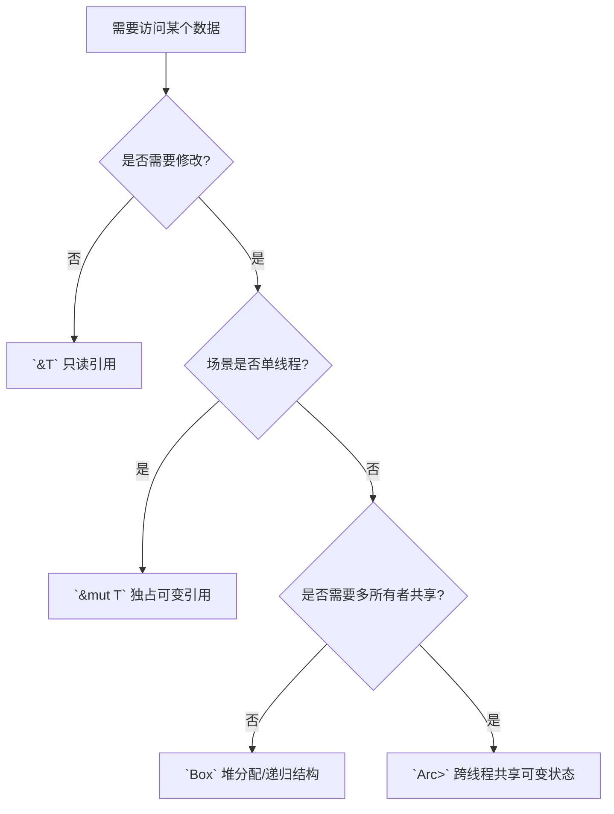
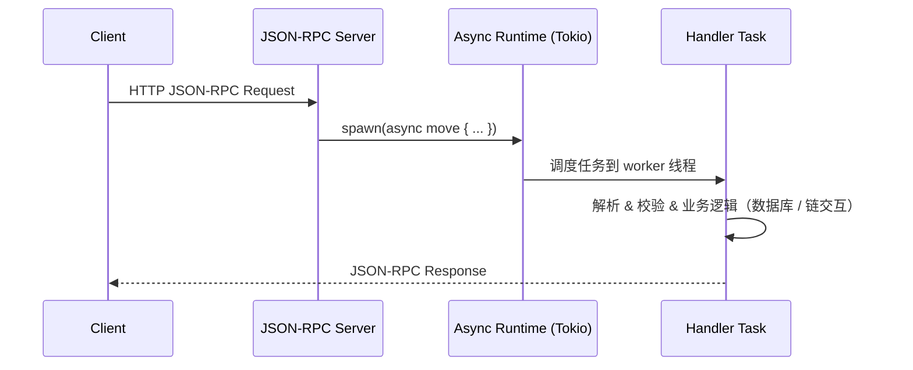
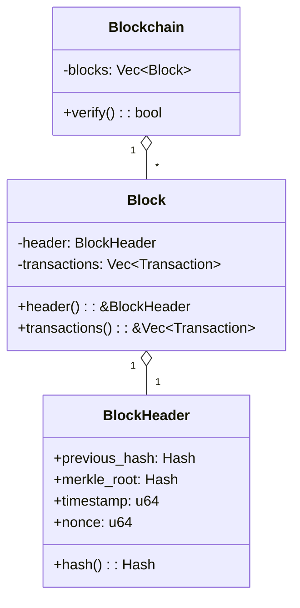
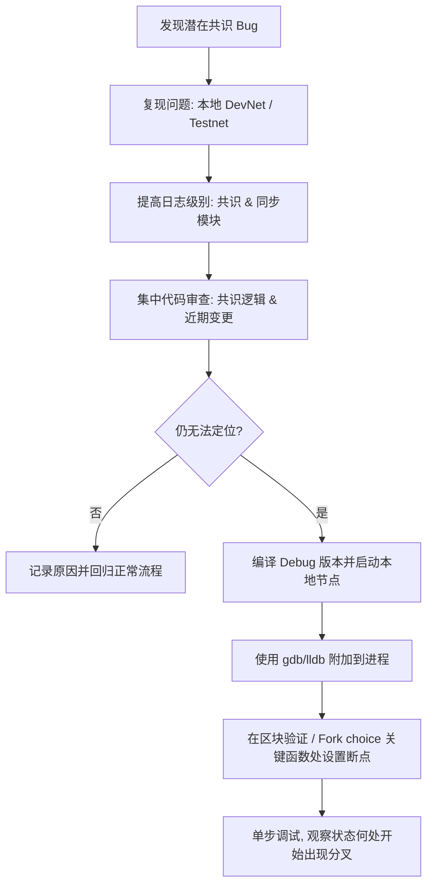
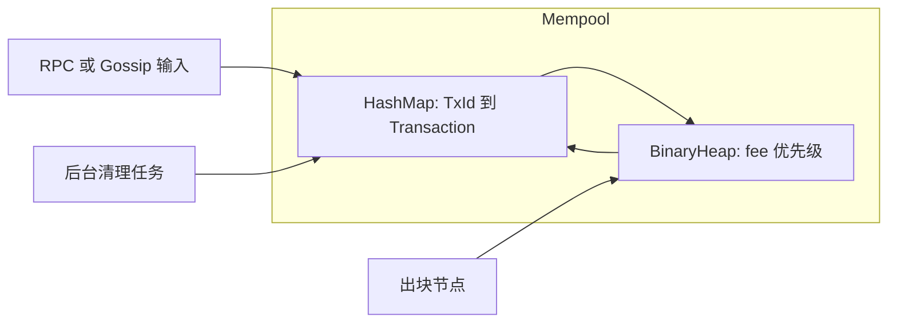
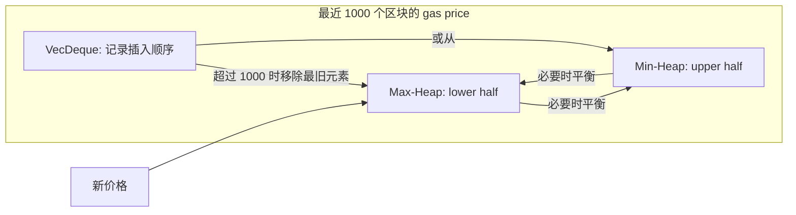
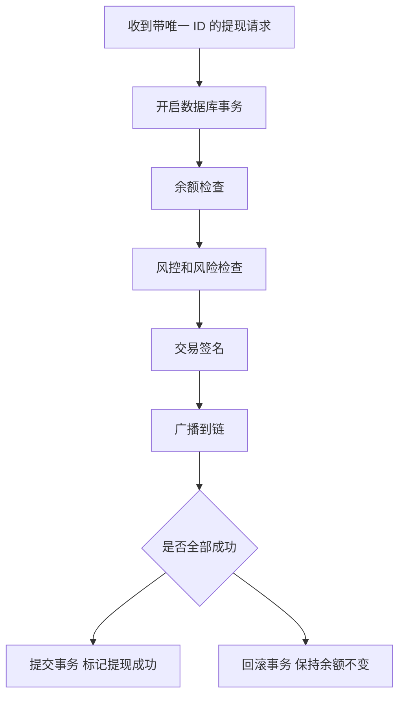

# Rust 高级区块链开发工程师面试 Q&A（DeepSeek）

> 适用于面试 “Rust开发高级工程师” 区块链基础设施岗位的技术面试题集。

## 目录

*   [Introduction to the Q&A Set](#introduction-to-the-qa-set)
*   [Interview Q&A Pairs](#interview-qa-pairs)
*   [Usage & Success Criteria](#usage--success-criteria)
*   [References](#references)

## Introduction to the Q&A Set

*   **Purpose & Context:** This Q&A set is designed for interviewers to assess candidates for a Senior Rust Developer role focused on blockchain infrastructure. The role requires deep expertise in Rust, blockchain fundamentals (Ethereum, Solana), and practical experience with decentralized (DEX) and centralized (CEX) exchanges.
*   **Scope & Constraints:** The questions target the "任职要求" (Requirements) and "岗位职责" (Responsibilities) from the job description. They are structured to evaluate technical knowledge, practical experience, problem-solving ability, and communication skills.
*   **Stakeholders & Interview Format:** Designed primarily for senior Rust/区块链工程师、技术负责人和招聘经理，用于 60–90 分钟的一对一或一对二技术面试，可在线或线下面试场景通用。
*   **Structure & Priority:** Questions are ordered by priority and topic flow: starting with core Rust competency, then moving to blockchain knowledge, system design, data structures/algorithms, and concluding with behavioral and meta-skills. Each question includes its **Purpose** and **Evaluation Criteria** for precise assessment.
*   **Difficulty Distribution:** Adhering to guideline 8a, the set is balanced as follows:
      *   **Foundational (20%):** Questions 1, 2 (Core Rust syntax and concepts).
      *   **Intermediate (40%):** Questions 3, 4, 5, 6 (Applying Rust in blockchain contexts, basic system design).
      *   **Advanced (40%):** Questions 7, 8, 9, 10 (Complex problem-solving, performance optimization, and high-level architectural trade-offs).

**难度分布可视化一览：**

| 难度等级       | 占比  | 题号                    | 主要考察维度                                           |
|----------------|-------|-------------------------|--------------------------------------------------------|
| 基础（Foundational）   | 20%  | 1–2                   | Rust 语法基础、所有权与借用模型                         |
| 中级（Intermediate）   | 40%  | 3–6                   | 区块链数据结构、公链原理、DEX 逻辑、调试与系统设计     |
| 高级（Advanced）       | 40%  | 7–10                  | 性能优化、高级数据结构与算法、可靠性、沟通与协作能力   |

---

## Interview Q&A Pairs

### 1. Core Rust Proficiency

**Question:** The job requires "精通 Rust 语法" (mastery of Rust syntax). Could you explain the practical differences between `&T`, `&mut T`, `Box<T>`, and `Arc<Mutex<T>>`? Please provide a small example scenario where you would choose each one.

*   **Purpose:** To verify a foundational and precise understanding of Rust's ownership, borrowing, and concurrency models, which is critical for writing safe and efficient blockchain infrastructure code.
*   **Evaluation Criteria:**
    *   **&T:** Correctly identified as an immutable, shared reference.
    *   **&mut T:** Correctly identified as a unique, mutable reference.
    *   **Box<T>:** Correctly identified as a heap-allocated, owned pointer.
    *   **Arc<Mutex<T>>:** Correctly identified as a thread-safe, reference-counted pointer to mutable data.
    *   **Example Scenarios:** Practical and relevant examples (e.g., `&T` for reading a config, `&mut T` for modifying a single-threaded cache, `Box<T>` for a recursive data structure, `Arc<Mutex<T>>` for a shared state across threads).
    *   Awareness that `Arc<Mutex<T>>` may introduce contention and poisoning risks in hot paths, and ability to mention alternatives such as `RwLock`, channels, or sharded data structures when appropriate.
    *   Trade-offs: Discuss the performance implications of each choice, especially in a multi-threaded context.

**Answer:**
*(Example Answer)* "Certainly.
- `&T`: I'd use an immutable reference for a function that needs to read from a data structure without changing it, like passing a configuration struct to multiple validator functions.
- `&mut T`: I'd use this when a function needs exclusive access to modify data, for example, updating the internal state of a transaction processor in a single-threaded context.
- `Box<T>`: This is for when I need to store data on the heap, typically for dynamic-sized types or when I need a fixed-size pointer for a recursive struct, like a node in a Merkle tree.
- `Arc<Mutex<T>>`: This is the go-to for shared mutable state across multiple threads. In a Web3 context, I'd use it for a shared in-memory nonce manager or a connection pool that multiple worker threads need to access and update concurrently."

**Visual Summary – Rust Pointer Types**

| Type            | Ownership / Mutability                         | Threading Model                     | Typical Blockchain Use Case                                              |
|-----------------|------------------------------------------------|-------------------------------------|--------------------------------------------------------------------------|
| `&T`            | Shared, immutable borrow                       | Single-threaded或多处共享只读访问    | 读取全局配置、协议参数、静态元数据                                       |
| `&mut T`        | Exclusive, mutable borrow                      | 单线程                              | 在单线程交易处理器中更新内部状态                                         |
| `Box<T>`        | Owned, heap-allocated value                    | 单线程为主（可移动到其它所有者）     | 递归数据结构（Merkle 树节点、前缀树节点），需要堆分配的复杂结构         |
| `Arc<Mutex<T>>` | Shared ownership + interior mutability + lock  | 多线程共享，可写需持有锁            | 跨线程共享的 nonce 管理器、连接池、统计指标等共享可变状态               |



---

### 2. Asynchronous Programming

**Question:** Blockchain nodes are highly concurrent. Describe how you would use Rust's `async/await` to handle multiple incoming JSON-RPC requests concurrently. What are the key considerations when selecting an async runtime (like `tokio` or `async-std`), and what pitfalls should we avoid?

*   **Purpose:** To assess experience with Rust's async paradigm, which is essential for building high-performance, non-blocking network services—a core part of Web3 infrastructure.
*   **Evaluation Criteria:**
    *   Understanding of spawning async tasks.
    *   Awareness of runtime characteristics (e.g., `tokio`'s multi-threaded work-stealing scheduler).
    *   Knowledge of pitfalls: holding synchronous mutexes across `.await` points, blocking the runtime thread with CPU-heavy tasks, and task cancellation safety.
    *   Trade-offs: Discuss the trade-offs between different async runtimes, considering factors like performance, ease of use, and ecosystem support.

**Answer:**
*(Example Answer)* "I would structure the service to spawn a new async task for each incoming RPC request. The task would handle the entire request lifecycle: parsing, validation, business logic (which might involve database or chain interactions), and response. Using a runtime like Tokio is crucial for its performance and ecosystem. The key consideration is whether the runtime's scheduler model fits our workload; Tokio's work-stealing is excellent for general-purpose servers. The major pitfall is accidentally introducing blocking operations inside an async task, which would stall the entire runtime thread. CPU-intensive work should be offloaded to a dedicated thread pool using `spawn_blocking`."

**Visual – 并发 JSON-RPC 处理流程**



**Key Considerations Table（与原文一致，仅可视化）：**

| 维度                  | 要点                                                         | 常见陷阱                                                         |
|-----------------------|--------------------------------------------------------------|------------------------------------------------------------------|
| 任务模型              | 为每个请求 `spawn` 异步任务，独立处理完整生命周期           | 在热路径中创建过多短生命周期任务导致调度开销                    |
| Runtime 选择          | Tokio 多线程 work-stealing，生态成熟                        | 同时引入多个 runtime（Tokio + async-std）导致执行模型混乱        |
| 阻塞操作              | CPU 密集型任务使用 `spawn_blocking` 或独立线程池            | 在 `async` 中直接执行阻塞 IO 或重计算，拖慢整个 runtime 线程     |
| 共享状态与锁          | 避免在 `.await` 期间持有同步锁，优先使用异步友好结构       | 持有 `Mutex` 跨 `.await`，造成死锁或严重性能退化               |

---

### 3. Blockchain Data Structure

**Question:** The JD mentions "熟练掌握公链...产品原理" (mastering public chain principles). How would you represent a simple blockchain's block and chain in Rust? Focus on the data structures and how you would ensure immutability and efficient verification.

*   **Purpose:** To test the candidate's ability to translate blockchain concepts into robust Rust data structures.
*   **Evaluation Criteria:**
    *   A struct for `Block` containing `index`, `previous_hash`, `timestamp`, `transactions`, and `hash`.
    *   Use of a `Vec<Block>` or, more realistically, a linked structure using hashes.
    *   Emphasis on immutability: fields should be private or use `#[deny(mut)]`, and the `hash` should be computed upon creation and be read-only.
    *   Mention of efficient verification by caching hashes.
    *   Trade-offs: Discuss the trade-offs between different data structures (e.g., `Vec` vs. linked list) in terms of memory usage, insertion efficiency, and query performance.

**Answer:**
*(Example Answer)* "I'd define a `Block` struct with private fields and public getters. The key fields would be `header: BlockHeader` and `transactions: Vec<Transaction>`. The `BlockHeader` would contain the `previous_hash`, `merkle_root`, `timestamp`, and `nonce`. The block's `hash` would be a computed field, derived from the serialized header, ensuring it's set at construction and immutable. The chain would be a `Vec<Block>` or a `HashMap<BlockHash, Block>` for efficient lookup. To verify the chain, I'd iterate through it, ensuring each block's `previous_hash` matches the hash of the preceding block."

**Visual – 区块与区块链数据结构概览**



| 设计点                | 对应实现要点（与原文一致）                                             |
|-----------------------|------------------------------------------------------------------------|
| 不可变性              | 字段私有，仅通过 getter 暴露；`hash` 在构造时计算后不再修改           |
| 高效验证              | 通过 `previous_hash` 串联，顺序遍历 `Vec<Block>` 校验链完整性          |
| 查找性能              | `Vec<Block>` 顺序遍历简单；如需按 hash 查找可增加 `HashMap<BlockHash, Block>` |

---

### 4. DEX/AMM Logic

**Question:** You are tasked with implementing the core swap logic for a Constant Product Market Maker (like Uniswap V2) in Rust. Describe the function signature and the core algorithm. How would you handle rounding errors and prevent integer overflows?

*   **Purpose:** To evaluate direct, practical experience with DEX development, a key requirement from the JD.
*   **Evaluation Criteria:**
    *   Correct application of the `x * y = k` formula.
    *   A function signature like `fn swap(input_amount: u128, input_reserve: u128, output_reserve: u128) -> Result<u128, Error>`.
    *   Explicit mention of using checked math operations (e.g., `checked_mul`, `checked_div`) to prevent panics from overflows.
    *   Discussion of rounding direction (always rounding down in favor of the pool) and the use of a fixed-point or integer arithmetic library.
    *   Ability to compare at least two implementation options (for example, different fixed-point strategies) and discuss trade-offs in precision, gas cost, and implementation complexity.

**Answer:**
*(Example Answer)* "The function would be `pub fn calculate_output_amount(input_amount: u128, input_reserve: u128, output_reserve: u128) -> Result<u128, AMMError>`. The core logic is `output_amount = (input_amount * output_reserve) / (input_reserve + input_amount)`, ensuring the new product `(input_reserve + input_amount) * (output_reserve - output_amount)` is at least `k`. I would exclusively use `checked_mul` and `checked_div` to handle overflows gracefully by returning a custom `AMMError`. For rounding, since we can't have fractional tokens, we must round down the `output_amount`, which is the safe direction for the liquidity pool."

**Formula & Flow – 常数乘积做市商 (CPMM)**

```text
恒定乘积不变： x * y = k

给定：
  input_amount  = Δx
  input_reserve = x
  output_reserve = y

输出：
  output_amount = Δy = (input_amount * output_reserve) / (input_reserve + input_amount)
  新状态需满足 (x + Δx) * (y - Δy) ≥ k
```

| 关注点             | 可视化要点（来自原文）                                        |
|--------------------|----------------------------------------------------------------|
| 溢出处理           | 使用 `checked_mul` / `checked_div`，失败返回 `AMMError`       |
| 精度与舍入方向     | 结果向下取整（对资金池更安全），避免产生不存在的 token       |
| 类型选择           | 使用 `u128` 等大整数类型减少溢出风险，必要时采用定点库       |


---

### 5. Debugging & Source Code Analysis

**Question:** One of the responsibilities is "主流公链的源码调试" (debugging mainstream public chain source code). If you were investigating a potential consensus bug in an Ethereum client (like Geth or Erigon), what would be your step-by-step process? What tools would you use?

*   **Purpose:** To assess methodology, rigor, and familiarity with the tools of the trade for deep-dive debugging, a critical part of the job.
*   **Evaluation Criteria:**
    *   A structured approach: starting with code review, setting up a local testnet, and using logging.
    *   Mention of specific tools: `println!`/`tracing`, a native debugger (gdb/lldb), or a Rust-specific tool like `rr`.
    *   Understanding of how to attach a debugger to a running node and set breakpoints in consensus-related code.
    *   A logical, step-by-step narrative.
    *   Trade-offs: Discuss the trade-offs between different debugging tools and techniques, considering factors like ease of use, performance impact, and depth of insight.

**Answer:**
*(Example Answer)* "My process would be:
1.  **Isolate:** First, I'd try to reproduce the issue on a local development network or a testnet to avoid disrupting mainnet.
2.  **Instrument:** I'd increase the logging verbosity, specifically for the consensus and blockchain sync modules, using the `tracing` crate to get detailed, structured logs.
3.  **Analyze:** I'd perform a focused code review of the consensus logic, looking for recent changes or known edge cases.
4.  **Debug:** If the issue remains elusive, I'd use a debugger. I'd compile the client in debug mode, run a local node, and use `gdb` to attach to the process. I'd set breakpoints at key functions, like block validation or fork choice, and step through the execution to observe the state divergence firsthand."

**Visual – 共识 Bug 排查步骤流程图**



| 步骤         | 对应工具 / 产物                         |
|--------------|------------------------------------------|
| Isolate      | 本地 DevNet/Testnet，复现脚本           |
| Instrument   | 结构化日志 (`tracing`)、日志配置         |
| Analyze      | 针对共识模块的代码审查、最近 commit diff |
| Debug        | gdb/lldb、断点配置、调用栈、变量快照     |

---

### 6. System Design: Memory Pool

**Question:** Design a memory pool (mempool) for a blockchain node. This structure holds unconfirmed transactions. What are the key operations, and how would you design the Rust data structures to make them efficient? Consider concurrency and access patterns.

*   **Purpose:** To evaluate system design skills and the ability to architect a core blockchain component using appropriate Rust patterns.
*   **Evaluation Criteria:**
    *   Identification of key operations: inserting a new transaction, selecting transactions for a new block, removing mined/invalid transactions.
    *   Proposal of efficient data structures: e.g., a `HashMap` for O(1) lookup by TXID, and a priority queue (e.g., a `BinaryHeap`) sorted by gas price/fee for block inclusion.
    *   Critical consideration of concurrency: proposing `Arc<Mutex<...>>` or `RwLock` for the entire pool, or finer-grained locking strategies.
    *   Discussion of memory management and eviction policies.
    *   Ability to explain trade-offs between simple global locking and more complex sharded or lock-free designs in terms of throughput and implementation complexity.

**Answer:**
*(Example Answer)* "The mempool needs fast insertion, lookup, and priority-based eviction. I'd structure it with a primary store, like a `HashMap<TxId, Arc<Transaction>>`, for quick lookup. For block production, we need the highest fee-paying transactions. So, I'd maintain a separate `BinaryHeap` that orders transactions by fee-per-gas, but the heap would store `TxId` and the fee, not the entire transaction, to avoid duplication. The entire structure would be wrapped in an `RwLock` to allow multiple concurrent readers (for queries) and a single writer (for insertions/removals). We'd also need a background task to evict stale transactions."

**Visual – Mempool 结构示意**



| 操作类型              | 数据结构 & 并发策略（来自原文）                             |
|-----------------------|------------------------------------------------------------|
| 插入新交易            | `HashMap` 按 TxId 存储；在 `BinaryHeap` 中插入 fee key     |
| 选取出块交易          | 从 `BinaryHeap` 弹出最高 fee 条目，再到 `HashMap` 取详情  |
| 删除已打包/失效交易   | 从 `HashMap` 删除并在堆中标记/lazy 删除                    |
| 并发控制              | 外层使用 `RwLock`：多读单写；如有需要可进一步分片或细粒度锁 |

---

### 7. Performance Optimization

**Question:** You've identified a bottleneck in a Rust service that calculates Merkle roots for a large batch of transactions. The profiler shows high CPU usage in the hashing function. What steps would you take to optimize this?

*   **Purpose:** To assess advanced problem-solving skills and knowledge of Rust-specific and low-level optimization techniques.
*   **Evaluation Criteria:**
    *   Immediate action: verifying the algorithm's correctness and complexity.
    *   Profiling: Using `perf` or `cargo flamegraph` to pinpoint the exact line.
    *   Specific optimization techniques: using a more efficient hashing algorithm (e.g., SHA256 vs. Blake3), leveraging data parallelism with the `rayon` crate, choosing hash implementations that use SIMD where available, or exploring batch hashing.
    *   A logical, step-by-step approach, not just guessing.
    *   Trade-offs: Discuss the trade-offs between different optimization techniques, considering factors like performance gain, code complexity, and maintainability.

**Answer:**
*(Example Answer)* "First, I'd ensure the tree-building algorithm is O(n) and implemented correctly. Then, with the profiler, I'd check if we're hashing the same data repeatedly. My optimization steps would be:
1.  **Algorithm:** Evaluate if we can switch to a faster, cryptographically secure hash like Blake3.
2.  **Parallelism:** The process of hashing sibling nodes is embarrassingly parallel. I'd use `rayon`'s par_iter to parallelize the computation across the levels of the tree.
3.  **SIMD:** I'd check if the chosen hash function has an implementation that leverages CPU-specific SIMD instructions.
4.  **Caching:** If some transactions are repeated, I'd introduce a cache for intermediate hashes."

**Visual – Merkle Root 计算性能优化流水线**

```mermaid
flowchart LR
    A[确认算法复杂度 O(n)] --> B[使用 profiler 定位热点]
    B --> C[选择更快哈希算法]
    C --> D[使用 Rayon 并行计算]
    D --> E[使用 SIMD 优化实现]
    E --> F[对重复交易哈希结果做缓存]
```

| 优化维度     | 对应动作（与原文一致）                                      |
|--------------|--------------------------------------------------------------|
| 算法         | 确认构建算法为 O(n)，避免不必要的重复哈希                   |
| 并行         | 使用 `rayon` 的 `par_iter` 对同层节点进行数据并行            |
| 底层实现     | 采用支持 SIMD 的哈希实现（如 Blake3 的优化版本）            |
| 结果复用     | 对重复出现的交易或子树哈希做缓存，减少重复计算              |

---

### 8. Data Structures & Algorithms

**Question:** A critical on-chain price feed requires a data structure that can efficiently track the median gas price over the last 1000 blocks. How would you implement this in Rust? Analyze the time complexity of insertion and median calculation.

*   **Purpose:** To test the "良好的数据结构和算法基础" (solid data structure and algorithm foundation) with a practical Web3 application.
*   **Evaluation Criteria:**
    *   Proposal of a viable data structure. The optimal solution is two heaps (a max-heap for the lower half and a min-heap for the upper half), but a sorted list or a B-Tree is also acceptable with a correct complexity analysis.
    *   Correct implementation of insertion and median-finding logic.
    *   Precise time complexity: O(log n) for insertion and O(1) for median calculation with the two-heap approach.
    *   Ability to compare this approach with simpler alternatives (for example, a sorted list) and articulate the trade-offs in performance and implementation complexity.

**Answer:**
*(Example Answer)* "I'd use a two-heap approach: a max-heap for the lower half of the prices and a min-heap for the upper half. I'd maintain the invariant that the heaps are either the same size or the max-heap has one more element.
- **Insertion:** When adding a new price, I'd add it to the max-heap, then pop the max and push it to the min-heap to balance. If the min-heap becomes larger, I'd pop from it and push to the max-heap. This is O(log n).
- **Median:** The median is the root of the max-heap (if sizes are unequal) or the average of both roots (if equal). This is O(1).
To limit to 1000 blocks, I'd use a `VecDeque` to track the insertion order, and when inserting the 1001st element, I'd remove the oldest one from the heaps, which is O(log n)."

**Visual – 双堆维护滑动窗口中位数**



| 操作       | 时间复杂度 | 说明（与原文一致）                                      |
|------------|------------|--------------------------------------------------------|
| 插入价格   | O(log n)   | 插入 Max-Heap，再在两个堆之间调整平衡                  |
| 计算中位数 | O(1)       | 直接取 Max-Heap 堆顶，或两堆堆顶平均值                 |
| 过期删除   | O(log n)   | 当元素超过 1000 时，根据 VecDeque 记录删除最旧元素     |

---

### 9. Error Handling & Reliability

**Question:** In a financial context like a CEX or DEX, reliable error handling is non-negotiable. Describe your strategy for error handling in a Rust service that processes withdrawals. How would you ensure no funds are lost due to an unhandled error?

*   **Purpose:** To assess the candidate's mindset for building robust, fault-tolerant systems, a key requirement for any financial infrastructure.
*   **Evaluation Criteria:**
    *   Use of Rust's `Result` type for all fallible operations.
    *   Design of a comprehensive, domain-specific error enum.
    *   Discussion of idempotency and database transactions to ensure atomicity (e.g., debiting a balance and creating a withdrawal record must succeed or fail together).
    *   Mention of logging, monitoring, and alerting for unhandled edge cases.
    *   Trade-offs: Discuss the trade-offs between different error handling strategies, considering factors like code complexity, performance impact, and user experience.

**Answer:**
*(Example Answer)* "Every step—balance check, fraud detection, transaction signing, broadcasting—would return a `Result<(), WithdrawalError>`. The `WithdrawalError` enum would categorize all possible failures. The core logic would be wrapped in a database transaction. If any step fails, the entire transaction is rolled back, ensuring the user's balance is unchanged. We'd use `?` to propagate errors early. For idempotency, each withdrawal request would have a unique ID to prevent double-processing. Finally, any panic, which should be exceedingly rare, would be caught at the top level of the worker thread, logged, and alerted on, while the database transaction would have already ensured consistency."

**Visual – 提现处理可靠性流程**



| 可靠性要点     | 对应机制（与原文一致）                              |
|----------------|------------------------------------------------------|
| 原子性         | 使用数据库事务，将扣款与记录提现打包在同一事务中    |
| 错误表示       | 所有可失败步骤返回 `Result<(), WithdrawalError>`    |
| 幂等性         | 为每个请求分配唯一 ID，重复请求直接查找已有结果     |
| 监控与告警     | 顶层捕获 panic，记录日志并触发告警                  |

---

### 10. Meta-Skills & Collaboration

**Question:** The JD calls for "思维严谨，沟通能力良好" (rigorous thinking, good communication skills). Describe a time you had to explain a complex technical concept related to blockchain or Rust to a non-technical stakeholder (e.g., a product manager). What was the concept, and how did you approach the explanation?

*   **Purpose:** To evaluate soft skills and the ability to bridge the gap between deep technical work and business/product needs.
*   **Evaluation Criteria:**
    *   A clear, concrete example from past experience.
    *   Evidence of using analogies, simplifying abstractions, and avoiding jargon.
    *   Focus on the "why" and the business impact, not just the "how."
    *   A structured and patient approach to communication.
    *   Trade-offs: Discuss the trade-offs between different communication strategies, considering factors like audience understanding, time constraints, and the need for technical accuracy.

**Answer:**
*(Example Answer)* "I once had to explain why implementing a new feature would require a hard fork. The stakeholder saw it as a simple code update. I used an analogy: I compared the blockchain to a community-owned rulebook. A soft fork is like a clarification of a rule that's backward-compatible, while a hard fork is like changing a fundamental rule that requires everyone to agree to adopt the new rulebook simultaneously. I explained that without consensus, the community would split. I focused on the impact: coordinated timing, communication to users, and the risk of chain splits. This helped them understand the operational and communication overhead, not just the technical cost."

**Visual – 面向非技术干系人的讲解结构模板**

| 环节           | 引导问题                         | 示例（与原文一致）                                      |
|----------------|----------------------------------|--------------------------------------------------------|
| 背景与动机     | 为什么需要这个改动?             | 为什么这个功能会导致硬分叉?                            |
| 类比与比喻     | 能否用日常经验来解释?           | 区块链 = 社区共用规则书；硬分叉 = 改变核心规则         |
| 影响与风险     | 这对业务/用户意味着什么?        | 需要全网协同升级，否则可能出现链分裂                   |
| 协作与行动计划 | 我们接下来需要一起做什么?       | 规划上线时间、沟通策略、监控回滚预案                   |


---

## Usage & Success Criteria

- **Usage:** 建议在 60–90 分钟的技术面试中选取 5–8 道题，根据候选人背景动态调整难度；也可以在多轮面试中拆分使用（基础轮 / 系统设计轮 / 综合轮）。
- **Success Criteria:**
  - 面试官能在 60 分钟内判断候选人是否满足 JD 中的核心要求（Rust 能力、区块链基础、系统设计、可靠性与协作能力）。
  - 绝大多数候选人认为问题贴近实际工作场景（主观评分 ≥ 4/5）。
  - 题目在半年内仍然适用于团队当前的技术栈；如有重大技术栈变化（例如从以太坊主链迁移到其他公链或引入全新基础设施组件），需重新审查并更新本题集。
  - 题集在首次引入和每次重大修改后，由至少一名资深工程师按照《Content Quality Check Guidelines》执行一次结构化自检，检查事实准确性、一致性以及是否存在未知或需澄清事项。

**Visual – 使用方式与成功标准速览**

| 维度           | 建议做法 / 衡量指标                                       |
|----------------|------------------------------------------------------------|
| 题目选取       | 60–90 分钟面试中选 5–8 题，可按基础/系统设计/综合多轮拆分 |
| 决策效率       | 约 60 分钟内判断候选人是否满足 JD 核心要求                |
| 贴近实际       | 候选人主观评分 ≥ 4/5，认为题目贴近真实工作场景            |
| 生命周期       | 至少每半年根据技术栈变化复审一次                         |
| 质量保障       | 每次重大修改后由资深工程师按《Content Quality Check Guidelines》自检 |

## References

- Rust 官方文档：《The Rust Programming Language》 — https://doc.rust-lang.org/book/
- Rust 异步编程：《Asynchronous Programming in Rust》 — https://rust-lang.github.io/async-book/
- Tokio 官方文档 — https://docs.rs/tokio
- 以太坊相关文档（例如 Yellow Paper、Geth 或 Erigon 客户端文档）。
- Uniswap V2 白皮书 — https://uniswap.org/whitepaper.pdf
- BLAKE3 官方说明 — https://github.com/BLAKE3-team/BLAKE3

**Reference Types Overview（仅结构化展示已有引用）**

| 类型       | 资源                                   | 用途示意                                             |
|------------|----------------------------------------|------------------------------------------------------|
| 语言基础   | 《The Rust Programming Language》      | Rust 语法、所有权与借用模型                          |
| 异步编程   | 《Asynchronous Programming in Rust》   | async/await、async runtime 使用                       |
| Runtime    | Tokio 官方文档                         | 构建高并发网络服务、任务调度与 IO 模型               |
| 公链协议   | 以太坊 Yellow Paper / 客户端文档       | 公链原理、共识规则、客户端实现细节                   |
| DEX 协议   | Uniswap V2 白皮书                      | 常数乘积做市商模型、费率与滑点分析                   |
| 密码学算法 | BLAKE3 官方说明                        | 高性能哈希函数实现、性能优化和安全性背景             |