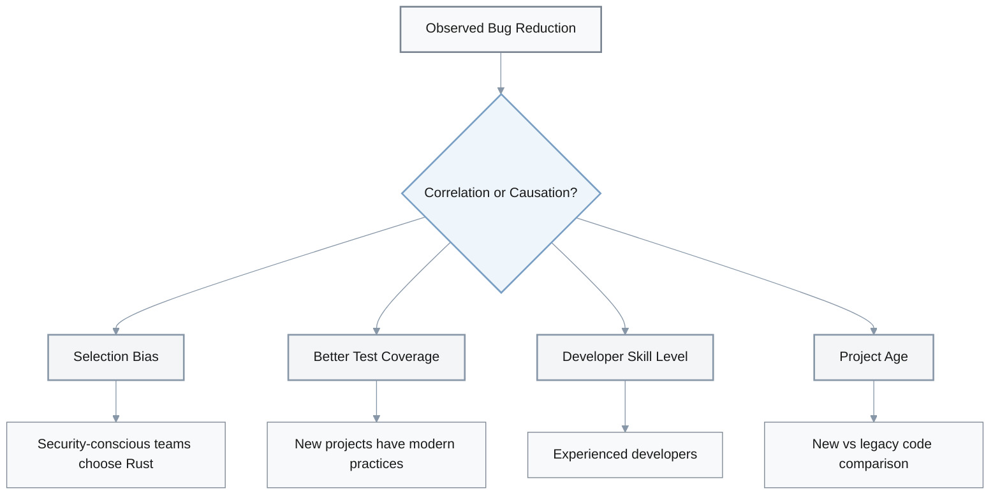
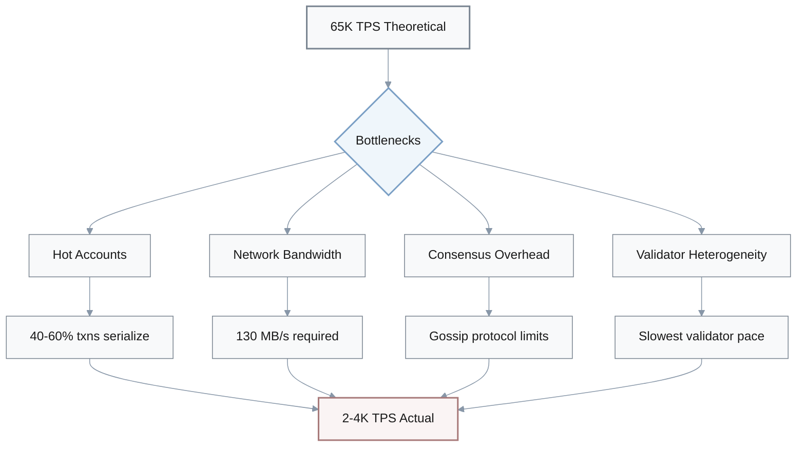
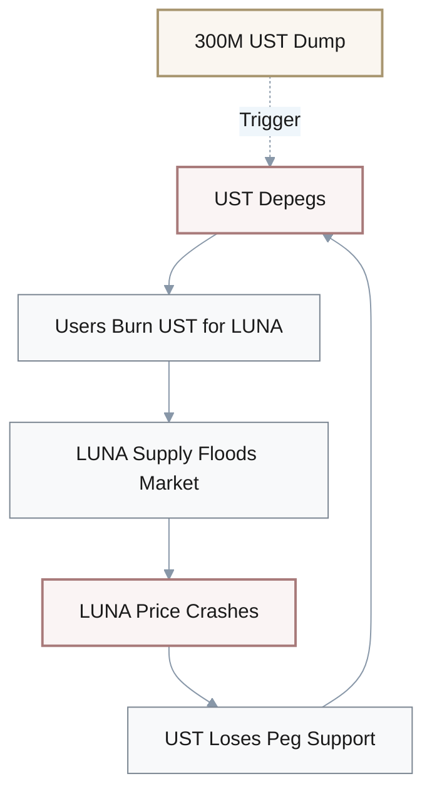
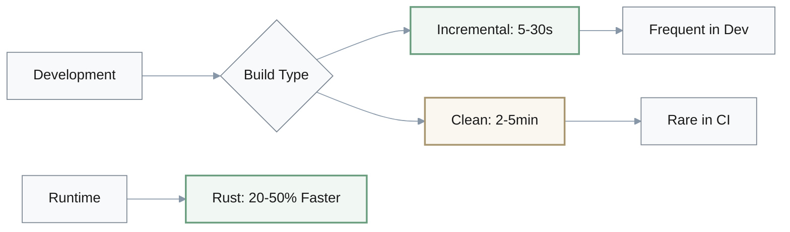
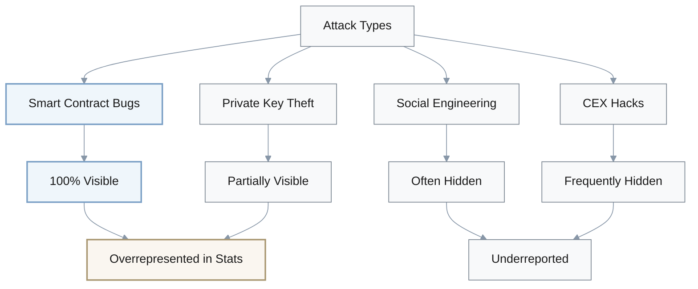
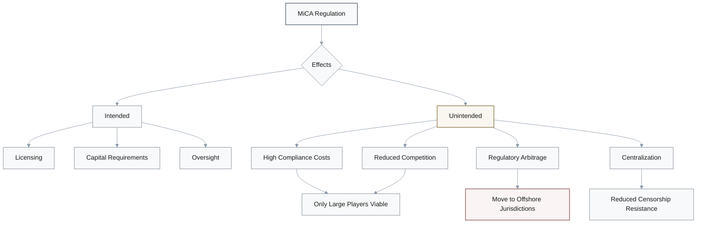
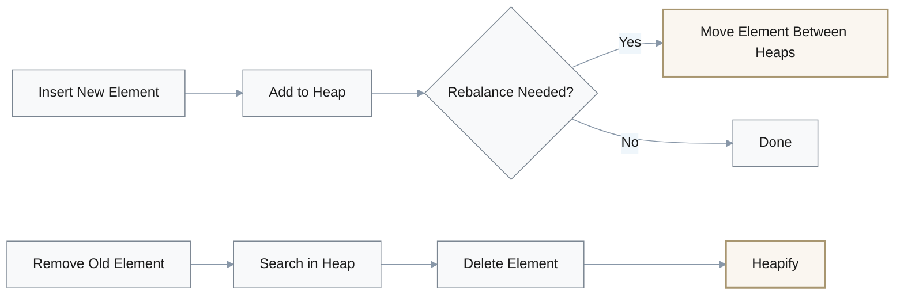
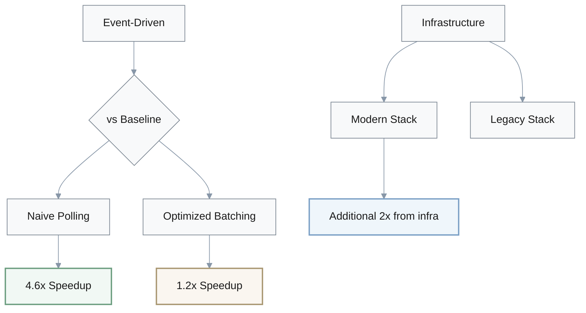
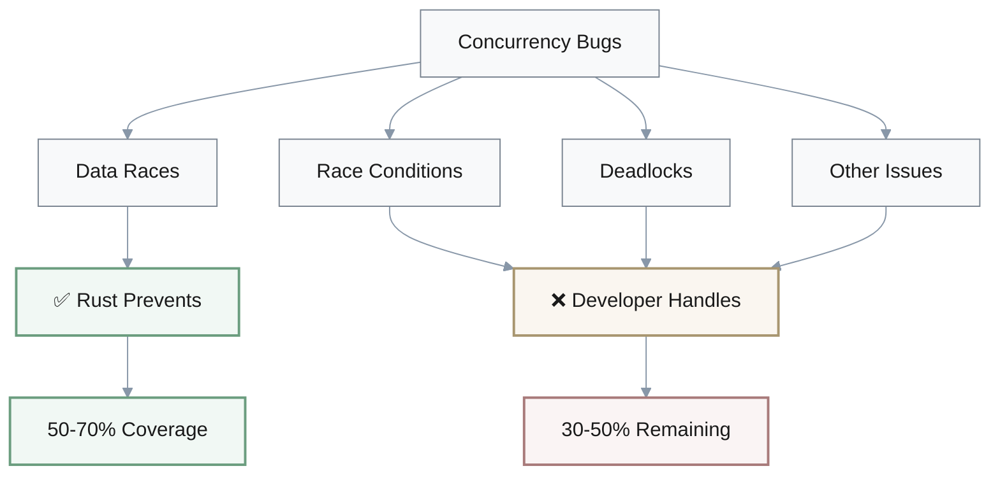
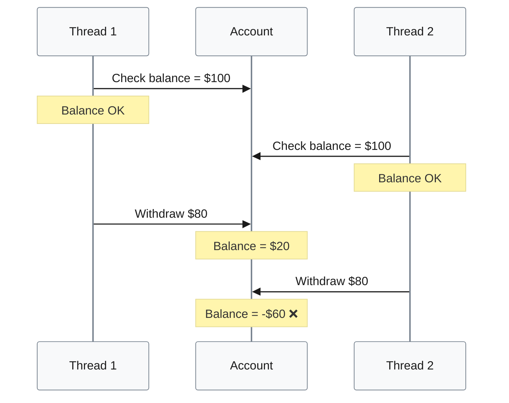

# Critical Thinking Analysis - Discussion Format

---

## 1. Rust Ownership Model: Bug Reduction Claims

**Q:** I've been reading that Rust's ownership model reduces memory-related runtime bugs by 60-80% based on Mozilla and Microsoft research. That sounds impressive, but how solid is this claim?

**A:** **Engineer A:** Hmm, the numbers look good, but we should dig deeper. What counts as "memory-related bugs"?

**Engineer B:** Right. Good question. Are we talking buffer overflows, use-after-free, or including logic errors?

**A:** Exactly. And is this correlation or causation? Maybe Rust projects just have better test coverage.

**C:** Or different developer skill levels. Security-conscious teams choose Rust.

**B:** True. That's selection bias. We're comparing apples and oranges—new Rust projects versus legacy C++ with decades of technical debt.

### Memory Bug Categories

| Bug Type | Description | Rust Protection |
|----------|-------------|-----------------|
| Buffer Overflow | Writing beyond array bounds | ✅ Bounds checking |
| Use-After-Free | Accessing freed memory | ✅ Ownership rules |
| Double Free | Freeing memory twice | ✅ Ownership rules |
| Logic Errors | Incorrect program logic | ❌ Not prevented |

### Potential Confounding Factors



### What Would Strengthen This Claim?

**A:** Controlled experiments. Same developers, identical projects, one in Rust and one in C++.

**C:** Right. And longitudinal studies showing bug rates over the project's lifetime, not just snapshots.

**B:** Plus a breakdown by bug category. Temporal safety versus spatial safety. We need the details.

**Evidence Quality Requirements:**

- **Controlled experiments**: Same developers, identical functionality
- **Longitudinal studies**: Track bug rates over project lifetime
- **Category breakdown**: Temporal vs spatial safety violations
- **Independent validation**: Third-party peer review
- **Apples-to-apples comparison**: Similar project complexity and age

**A:** Agreed. Mozilla and Microsoft are credible, but has this been peer-reviewed independently?

**C:** Good point. Vendor research needs third-party validation.

**B:** Exactly. So the claim's directionally correct, but 60-80% needs asterisks—it's context-dependent.

## 2. Solana TPS Claims: Theory vs Reality

**Q:** Solana claims 65,000 TPS theoretical capacity. The docs say Sealevel runtime enables parallel execution. Does parallel execution alone justify that TPS number?

**A:** **Architect A:** Hmm, necessary but not sufficient.

**Dev B:** What do you mean?

**A:** Parallel execution helps, but you need specific hardware—CPU cores, memory bandwidth, gigabit networking.

**B:** I see. So it assumes perfect conditions?

**C:** Right. Not just hardware. Transaction structure matters. What if everyone's hitting the same hot accounts?

### Requirements for 65K TPS

| Requirement | Specification | Realistic? |
|-------------|---------------|------------|
| CPU Cores | High-core count | ⚠️ Expensive |
| Memory Bandwidth | High throughput | ⚠️ Enterprise only |
| Network | 130 MB/s sustained | ⚠️ Enterprise-grade |
| Transaction Pattern | Non-conflicting accounts | ❌ Unrealistic |
| Validator Quality | Homogeneous hardware | ❌ Not guaranteed |

### Bottleneck Analysis



### Digging Into Bottlenecks

**A:** Hot accounts kill parallelism. If 40-60% of transactions touch the same accounts, they serialize.

**B:** Wow, that's a huge drop.

**C:** And network constraints—130 megabytes per second for 65k TPS. You need enterprise-grade infrastructure.

**A:** Right. Theoretical assumes non-conflicting transactions, which is optimistic.

**Hot Account Impact:**

$$
\text{Effective TPS} = \text{Parallel TPS} \times (1 - \text{Conflict Rate})
$$

If conflict rate = 50%, effective TPS drops by half regardless of parallel capacity.

### Reality vs Theory

**B:** What's mainnet actually doing?

**C:** Let me think... I've seen 2 to 4 thousand TPS sustained.

**A:** So 95% lower than the 65k claim.

**Performance Comparison:**

| Metric | Theoretical | Actual | Gap |
|--------|-------------|--------|-----|
| TPS | 65,000 | 2,000-4,000 | 95% |
| Limiting Factor | Parallel execution | Network + Consensus | — |
| Hardware Assumption | Ideal | Heterogeneous | — |

**B:** Network latency and consensus overhead dominate over parallelism benefits.

**C:** Exactly. Parallel execution is one piece. Validator heterogeneity, gossip protocol efficiency—those matter more at scale.

**A:** Makes sense. So the 65k is marketing. Real-world is an order of magnitude lower.

## 3. Terra UST Collapse: Root Cause Analysis

**Q:** The Terra UST collapse—I read it was due to "undercompensation during redemption." Is that the real cause?

**A:** **Analyst A:** That's a symptom, not the root cause.

**Dev B:** What's the difference?

**A:** Undercompensation happened because of a deeper structural problem—reflexivity.

**C:** Meaning?

### Understanding Reflexivity: The Death Spiral



**A:** LUNA's value depends on UST demand. But UST's stability depends on LUNA's value. Circular dependency.

**B:** I see. So when one drops, it drags the other down?

**A:** Exactly. Death spiral. UST depegs, people burn UST for LUNA, flooding the market. LUNA crashes, UST loses its peg support.

**C:** Oh! That's baked into the design then.

**A:** Correct.

### Root Causes vs Symptoms

| Layer | Element | Type |
|-------|---------|------|
| **Symptom** | Undercompensation during redemption | Manifestation |
| **Trigger** | $300M UST dump | External shock |
| **Structural Flaw** | Dual-token reflexivity | Design issue |
| **Missing Safeguards** | No circuit breakers | Risk management |
| **Incentive Problem** | Anchor 20% yield | Unsustainable |

### What Actually Triggered It?

**B:** Was there an external shock?

**A:** Yes. Someone dumped over 300 million dollars of UST. That kicked off the cascade.

**C:** But a robust system should handle large sells.

**A:** Right. Terra lacked circuit breakers. No emergency shutdown mechanism.

**B:** And the tokenomics—LUNA supply went from 350 million to 6.5 trillion tokens in 48 hours.

**LUNA Hyperinflation:**

$$
\text{Inflation Rate} = \frac{6.5 \times 10^{12} - 350 \times 10^6}{350 \times 10^6} \times 100 \approx 1{,}857{,}000\%
$$

**C:** Wow. Hyperinflation.

**A:** Mm-hmm. Plus Anchor's 20% yield created artificial demand. Unsustainable.

### The Real Cause

**A:** Inherent design flaw. Dual-token reflexivity plus missing safeguards plus unsustainable incentives.

**C:** I see. Undercompensation was just how it manifested.

**B:** Bank run dynamics. Once confidence broke, it was over.

**Design Flaws:**

- **Reflexivity**: Circular dependency between LUNA and UST
- **No circuit breakers**: No emergency pause mechanism
- **Unlimited minting**: LUNA supply could grow unbounded
- **Artificial demand**: Anchor's 20% APY was ponzi-like
- **Confidence-dependent**: Required continuous belief in the peg

## 4. Cross-Chain Bridge Security: Risk Assessment

**Q:** I keep hearing cross-chain bridges are "frequently targeted" with "substantial asset losses." How accurate is that risk assessment?

**A:** **Security A:** It's true but lacks context.

**Dev B:** How so?

**A:** We need base rates. How do bridges compare to DEXes or lending protocols per dollar secured?

**C:** Good point. Are bridges actually riskier, or just more visible?

### Identifying Biases

**B:** What biases are we dealing with?

**A:** Survivorship bias. We focus on hacked bridges and ignore ones operating securely for years.

**C:** Right. And reporting bias. Bridge hacks are on-chain, so they're public. CEX hacks can be hidden as "operational issues."

**B:** I see. So the 95% statistic I saw—

**A:** Probably inflated. Smart contract bugs, centralized validators, social engineering—all lumped together.

**Cognitive Biases in Risk Assessment:**

| Bias Type | Effect | Example |
|-----------|--------|---------|
| **Survivorship** | Focus on failures | Ignore bridges operating securely for years |
| **Reporting** | Visibility skew | On-chain hacks public, CEX hacks hidden |
| **Availability** | Recent events | Recent major hacks overshadow long-term stats |
| **Category lumping** | Overgeneralization | Mix design flaws with implementation bugs |

### What's Missing from the Analysis?

**C:** Cost-benefit. What are the losses versus the economic value created?

**A:** Exactly. We need loss rate—total hacked divided by total bridged over time.

**B:** Right. And breakdown by attack type. Are these design flaws or implementation bugs?

**C:** Plus temporal trends. Are losses decreasing as bridge designs mature?

**Proper Risk Metrics:**

$$
\text{Risk Rate} = \frac{\text{Total Value Hacked}}{\text{Total Value Bridged}} \times 100
$$

**Required Data Points:**

- **Loss rate per billion secured**: Normalize by TVL
- **Attack type breakdown**: Design flaws vs implementation bugs vs social engineering
- **Temporal trends**: Are security improvements happening?
- **Security model comparison**: Multisig vs light client vs optimistic

**A:** Good question. Security model tiers matter too. Multisig versus light client verification versus optimistic rollups—different risk profiles.

### Bridge Security Model Comparison

| Security Model | Trust Assumption | Risk Profile | Example |
|----------------|------------------|--------------|---------|
| Multisig | Trusted signers | Medium-High | Early Ronin |
| Light Client | Cryptographic proof | Low-Medium | Rainbow Bridge |
| Optimistic | Fraud proof window | Low | Optimism Bridge |
| ZK Proof | Math guarantee | Very Low | zkSync |

### So What's the Real Risk?

**B:** Probably lower than headlines suggest?

**A:** Bridges carry risk, but proper assessment needs attack rate per billion secured, not just "frequently targeted."

**C:** And acknowledge successful bridges. The ones that work don't make headlines.

**A:** Exactly.

## 5. Rust vs Go Compilation Times: Fair Comparison?

**Q:** Rust compilation times for large codebases over 100k lines of code take 2-5 minutes versus Go's under 30 seconds. That's a significant trade-off, right?

**A:** **Dev A:** Not as bad as it sounds.

**B:** How? 2-5 minutes is brutal.

**A:** That's clean builds. How often do you do clean builds?

### Is the Comparison Fair?

**B:** Good point. What about incremental?

**A:** Incremental Rust builds are 5-30 seconds. Much closer to Go.

**Compilation Time Comparison:**

| Build Type | Rust (100k LOC) | Go (100k LOC) | Frequency |
|------------|-----------------|---------------|-----------|
| Clean Build | 2-5 minutes | <30 seconds | Rare (CI only) |
| Incremental | 5-30 seconds | 3-15 seconds | Constant (dev) |
| Unit Tests | 3-20 seconds | 2-10 seconds | Very frequent |

**C:** Hmm, but the claim says 100k lines Rust versus 100k lines Go. Are those equivalent?

**A:** No. Rust macros, traits, generics—100k Rust lines isn't the same as 100k Go lines functionally.

**B:** Ah, I see. So we should compare equivalent functionality, not raw line counts.

**Code Density Factors:**

- **Rust macros**: One macro invocation = many lines of generated code
- **Generics**: Monomorphization creates multiple implementations
- **Traits**: Complex type system = more compile-time work
- **Go simplicity**: Less abstraction = faster compilation but more boilerplate

### Real-World Workflow

**C:** In practice, how does this affect development?

**A:** If you're doing TDD with fast unit tests, compile time impact is minimal.

**B:** Right. I code, run tests, iterate. Tests compile incrementally.

**A:** Exactly. Full builds happen in CI, which is acceptable for production.

**C:** Hold on, the comparison also ignores runtime performance.

**B:** Good catch. What's the delta there?

**A:** Rust has 20-50% runtime advantage over Go for compute-heavy tasks.

### Trade-offs Matter



**C:** So we trade slightly longer incremental builds for significantly better runtime?

**A:** For blockchain validators or high-throughput services, that's worth it.

**Trade-off Analysis:**

| Metric | Rust | Go | Winner |
|--------|------|----|-|
| Clean build time | 2-5 min | <30s | Go |
| Incremental build | 5-30s | 3-15s | Go (slightly) |
| Developer iteration | Similar (tests compile fast) | Similar | Tie |
| Runtime performance | Baseline | +20-50% slower | Rust |
| Use case fit | High-performance services | General services | Context-dependent |

**B:** I see. The 2-5 minute claim is misleading. It overstates the developer experience impact.

**A:** Agreed.

## 6. DeFi Hacks: Are 95% Really Smart Contract Bugs?

**Q:** I saw a stat that 95% of DeFi hacks are due to smart contract bugs. That seems... high?

**A:** **Analyst A:** It's probably inflated.

**Dev B:** What makes you skeptical?

**A:** Several things. First, how is "DeFi hack" defined? Does it exclude phishing?

### What's the Measurement?

**C:** Good question. And is that 95% by incident count or dollar value?

**A:** Great question. Ronin bridge was 600 million dollars—single incident, huge value.

**B:** I see. So dollar value would skew differently than counting individual exploits.

**C:** Right. A few massive bridge hacks versus many smaller contract bugs.

**Measurement Ambiguity:**

| Metric | Bias | Example |
|--------|------|---------|
| By incident count | Many small = high % | 100 contract bugs @ $1M each |
| By dollar value | Few large = high % | 1 bridge hack @ $600M |
| Definition scope | Inclusion bias | Does "DeFi" include CEX? |

### Reporting Bias

**B:** Are all hack types equally reported?

**A:** No. Smart contract exploits are on-chain, completely public. Private key theft or social engineering might be underreported.

**C:** Right. CEX hacks especially. They have incentive to hide them.

**A:** So we're seeing more contract bugs because they're visible, not necessarily because they're dominant.

**Visibility vs Frequency:**



### Temporal Validity

**B:** When was this data from?

**A:** That matters. 2020-2021 had a lot of contract exploits. 2023 onwards saw more bridge and infrastructure attacks.

**C:** I see. So the statistic ages poorly.

**A:** Correct.

**Temporal Breakdown:**

| Period | Primary Attack Vector | % Smart Contract |
|--------|----------------------|------------------|
| 2020-2021 | Contract exploits (DeFi summer) | ~85-90% |
| 2022 | Bridge attacks begin | ~75-80% |
| 2023+ | Infrastructure + bridges | ~65-70% |

### What's the Real Number?

**A:** Accounting for biases, probably 70-80%, not 95%.

**B:** Still high, but more reasonable.

**C:** And breaks down differently by dollar value versus incident count.

**A:** Exactly.

## 7. MiCA Regulation: Will It Improve Stablecoin Security?

**Q:** MiCA regulation will "fundamentally reshape stablecoin governance" with licensing, capital requirements, and oversight. Will it actually improve security?

**A:** **Regulatory A:** Hmm, necessary but not sufficient.

**Dev B:** You don't sound convinced.

**A:** Regulation helps, but let's not assume compliance equals security.

### Does Oversight Prevent Failures?

**C:** Good point. Regulated banks failed in 2008.

**A:** Exactly. Capital requirements and supervision didn't stop systemic collapse.

**B:** I see. So MiCA could be compliance theater?

**A:** It's a risk. If it's box-checking without substance, we gain little.

**C:** And regulatory capture. Incumbents lobby for favorable rules that entrench their position.

**Historical Precedents:**

| Case | Regulation | Outcome | Lesson |
|------|------------|---------|--------|
| 2008 Banks | Heavy oversight | Systemic failure | Compliance ≠ security |
| Enron | SOX requirements | Fraud still occurred | Rules need enforcement |
| EU GDPR | Strong privacy laws | Mixed compliance | Implementation quality matters |

### Unintended Consequences

**B:** What could go wrong?

**A:** High compliance costs favor large players. Reduces competition.

**C:** And US-EU conflicts. If regulations clash, you get regulatory arbitrage.

**B:** Meaning stablecoin issuers move to less-regulated jurisdictions?

**A:** Exactly. We push them offshore, losing oversight entirely.

**Potential Negative Effects:**



### Centralization Trade-offs

**C:** MiCA increases centralization, right?

**A:** Yes. Licensed entities are easier to regulate but reduce censorship resistance.

**B:** I see. So DeFi might exit to unregulated chains.

**A:** That's the dilemma. Regulate too hard, you drive innovation elsewhere.

**C:** Not hard enough, you get Terra UST collapses.

**Regulatory Dilemma:**

| Approach | Pros | Cons |
|----------|------|------|
| **Heavy regulation** | Consumer protection, stability | Drives innovation offshore, centralization |
| **Light regulation** | Innovation freedom, decentralization | Risk of collapses, fraud |
| **Smart regulation** | Balanced protection + innovation | Hard to achieve, requires expertise |

### What's the Realistic Outcome?

**A:** MiCA will reshape EU stablecoin markets, but security improvements depend on enforcement quality, not just rules on paper.

**B:** Got it. And watch for fragmentation. Region-locked stablecoins reduce network effects.

**A:** Right.

## 8. Median Tracking Algorithms: Is Two-Heap Optimal?

**Q:** The two-heap approach for median tracking has O(log n) insertion and O(1) median calculation. It's described as "optimal" for blockchain gas price tracking over 1000 blocks. Is it really optimal?

**A:** **Engineer A:** Optimal is context-dependent.

**B:** What do you mean?

**A:** Optimal for time complexity, yes. But what about space, concurrency, or the accuracy metric itself?

### Time vs Space Trade-offs

**C:** Good question. Two heaps store all 1000 elements. That's O(n) space.

**A:** Right. Reservoir sampling gives O(1) space with 0.1% error tolerance.

**B:** I see. So for space-constrained environments, reservoir sampling wins?

**A:** Correct. "Optimal" in one dimension isn't universal.

**Algorithm Comparison:**

| Algorithm | Time (Insert) | Time (Query) | Space | Accuracy | Concurrency |
|-----------|--------------|--------------|-------|----------|-------------|
| **Two-Heap** | O(log n) | O(1) | O(n) | Exact | Poor (locking) |
| **Reservoir Sampling** | O(1) | O(n log n) | O(1) | ~99.9% | Good |
| **Skip List** | O(log n) | O(log n) | O(n) | Exact | Excellent (lock-free) |
| **Order Statistics Tree** | O(log n) | O(log n) | O(n) | Exact (any percentile) | Medium |

### Hidden Costs

**C:** The claim says O(log n) insertion. What's hidden?

**A:** Each insertion can require two heap operations—insert plus rebalance. And removing the oldest element is O(log n) search plus delete.

**B:** I see. So the constant factor is high?

**A:** 10-20 operations per insert amortized. Not terrible, but not trivial.

**Two-Heap Hidden Complexity:**



**Amortized Cost:**

$$
\text{Cost per Insert} = 10\text{-}20 \text{ operations (heap + rebalance + delete old)}
$$

### Better Alternatives?

**C:** What about for concurrent access?

**A:** Lock-free skip lists avoid heap locking overhead.

**B:** Hmm. And for long-tailed distributions like gas prices, median might underestimate.

**C:** What's better?

**A:** 75th percentile. Order statistics trees handle that efficiently.

**Use Case Optimization:**

| Constraint | Best Algorithm | Reason |
|------------|---------------|---------|
| **Space-limited** | Reservoir sampling | O(1) space |
| **High concurrency** | Lock-free skip list | No locking |
| **Any percentile** | Order statistics tree | Flexible queries |
| **Exact median, single-thread** | Two-heap | Optimal for this case |

### Choosing the Right Tool

**B:** So two-heap is optimal for what specifically?

**A:** Single-threaded, time-sensitive, exact median, space available. That's the sweet spot.

**C:** Right. But if any of those constraints change, other approaches win.

**B:** So "optimal" needs qualifiers.

**A:** Always. Optimal time, space, accuracy, concurrency—you're optimizing a multi-dimensional space.

**C:** Got it.

## 9. Event-Driven Architecture: Real Speedup or Confounds?

**Q:** Event-driven smart contract platforms claim 2.2-4.6x latency reduction. Is the event-driven architecture really the cause of that speedup?

**A:** **Architect A:** Probably not the sole cause.

**Dev B:** What else could it be?

**A:** Confounding factors. Newer platforms, better infrastructure, workload-specific optimizations.

### Workload Dependency

**C:** Does the speedup hold across all workloads?

**A:** No. High-frequency events like oracles and price feeds see 4.6x improvement. But infrequent events like governance votes? Only 1.1-1.3x.

**B:** I see. So the claim generalizes poorly.

**A:** Right. It's cherry-picking the best-case scenario.

**Performance by Workload Type:**

| Workload Type | Frequency | Speedup Claimed | Realistic? |
|--------------|-----------|-----------------|------------|
| Oracle updates | High (per block) | 4.6x | Best case |
| Price feeds | High (frequent) | 3.8x | Good case |
| Token transfers | Medium | 2.5x | Average case |
| Governance votes | Low (rare) | 1.1-1.3x | Minimal benefit |

### Baseline Matters

**C:** What are they comparing against?

**A:** That's critical. If the baseline is polling every block, event-driven wins easily.

**B:** But against optimized transaction batching?

**A:** The gap narrows significantly. May even disappear.

**C:** So the baseline is weak, making event-driven look better.

**Baseline Comparison Impact:**



### Implementation Confounds

**B:** Could newer platforms just have better engineering?

**A:** Yes. Modern networking stacks, optimized database indexing—those improvements are orthogonal to the event model.

**C:** Right. So the speedup might be from infrastructure, not architecture.

**A:** Correct.

**Potential Confounding Factors:**

- **Modern networking**: HTTP/2, WebSocket optimization
- **Database indexing**: Better query performance
- **Caching strategies**: Reduced redundant computation
- **Hardware improvements**: Newer servers
- **Code optimization**: General performance tuning

### What Type of Latency?

**A:** Also, what does "latency" mean here? Event detection latency or end-to-end execution time?

**B:** What's the difference?

**A:** Event detection is faster with event-driven. But if contract logic dominates execution time, the architecture doesn't matter.

**Latency Breakdown:**

$$
\text{Total Latency} = \text{Detection} + \text{Processing} + \text{Execution}
$$

| Component | Event-Driven | Traditional | Dominant Factor? |
|-----------|--------------|-------------|------------------|
| **Detection** | Fast (instant) | Slow (polling) | ✅ Architecture matters |
| **Processing** | Similar | Similar | ❌ Architecture neutral |
| **Execution** | Similar | Similar | ❌ Architecture neutral |

**B:** I see.

### What's Needed?

**C:** Sounds like we need an ablation study.

**A:** Exactly. Isolate the event-driven contribution on identical infrastructure. Control for workload, baseline, and implementation quality.

**B:** Without that, the claim is suggestive, not definitive.

**Proper Evaluation Needs:**

- **Ablation study**: Isolate architectural contribution
- **Identical infrastructure**: Same hardware, networking, DB
- **Multiple baselines**: Compare against optimized alternatives
- **Workload variety**: Test across different event frequencies
- **End-to-end measurement**: Not just detection latency

**A:** Right.

## 10. Rust Concurrency: Does It Eliminate All Bugs?

**Q:** Rust prevents data races at compile time through borrowing rules. Does that mean it eliminates all concurrency bugs?

**A:** **Engineer A:** No. Data races are just one type of concurrency bug.

**B:** What's the difference?

**A:** Data race is low-level—simultaneous mutable access. Race condition is semantic—timing-dependent logic errors.

### What Rust Prevents

**C:** So Rust catches data races at compile time?

**A:** Yes. That's about 50-70% of concurrency bugs.

**B:** That's significant but not everything.

**A:** Right. Deadlocks, race conditions, starvation—Rust doesn't prevent those.

**Concurrency Bug Taxonomy:**

| Bug Type | Description | Rust Prevention | Coverage |
|----------|-------------|-----------------|----------|
| **Data Races** | Simultaneous mutable access | ✅ Compile-time check | 50-70% of bugs |
| **Race Conditions** | Timing-dependent logic errors | ❌ Not prevented | Semantic |
| **Deadlocks** | Circular lock dependencies | ❌ Not prevented | Requires discipline |
| **Starvation** | Thread never gets resources | ❌ Not prevented | Scheduling issue |
| **Livelock** | Active but no progress | ❌ Not prevented | Logic issue |

### Concurrency Safety Coverage



### What Developers Still Handle

**C:** Give me an example of what Rust doesn't catch.

**A:** Classic race condition: check balance, then withdraw. Another thread withdraws in between. You overdraft.

**B:** I see. So semantic bugs, not low-level memory safety.

**A:** Correct. You need application-level locking or transactional patterns.

**Race Condition Example:**



**C:** What about deadlocks?

**A:** Inconsistent lock ordering. Thread one takes mutex A then B. Thread two takes B then A. Rust doesn't detect that.

**Deadlock Example:**

```
Thread 1: Lock A → Lock B
Thread 2: Lock B → Lock A
Result: Both threads wait forever
```

**C:** Got it.

### Async Complications

**B:** What about async Rust?

**A:** Partial protection. Send and Sync traits help, but task cancellation and backpressure deadlocks still happen.

**C:** So async introduces new bug classes?

**A:** Yes. Channel buffer overflow, cancellation safety—those are developer responsibilities.

**Async-Specific Issues:**

| Issue | Description | Rust Protection |
|-------|-------------|-----------------|
| **Task cancellation** | Dropped future leaves inconsistent state | ❌ Manual handling |
| **Backpressure deadlock** | Channel full blocks producer | ❌ Design pattern |
| **Send/Sync violations** | Wrong types across threads | ✅ Compile-time |
| **Buffer overflow** | Channel buffer exceeds capacity | ❌ Runtime check |

### Correcting the Claim

**B:** So how should the claim be stated?

**A:** "Rust prevents data races at compile time, reducing 50-70% of concurrency bugs. Developers must still handle race conditions, deadlocks, and liveness issues."

**C:** More accurate. Data race elimination is huge but not a silver bullet.

**A:** Exactly. It's a powerful guarantee, just not a complete one.

**Corrected Understanding:**

> **Claim:** "Rust eliminates all concurrency bugs"  
> **Reality:** "Rust eliminates data races (50-70% of concurrency bugs) at compile time. Semantic bugs like race conditions, deadlocks, and liveness issues remain developer responsibilities."

**B:** Makes sense.

---

## Summary: Critical Thinking Patterns

Throughout these discussions, we see recurring patterns:

**Key Questions to Ask:**
- What's the **exact definition** of the claim?
- What are the **measurement units** and **baselines**?
- What **confounding factors** exist?
- What **biases** affect the data (survivorship, reporting, temporal)?
- Does the claim **generalize** or apply only to specific contexts?
- What are the **hidden costs** or **trade-offs**?
- Is this **correlation or causation**?

**Red Flags:**
- Specific percentages (60-80%, 95%) without methodology
- "Optimal" without specifying dimensions
- Performance claims without baseline comparison
- Aggregated statistics hiding important breakdowns
- Vendor research without independent validation
- Claims that generalize across all contexts
