# Blockchain & Rust Debugging Scenarios - Discussion Format

## Overview

This document transforms common blockchain debugging scenarios into collaborative discussion format, simulating team debugging sessions with Rust and smart contract issues.

---

## 1. Arc + Mutex Pattern for Thread-Safe HashMap

**Q:** I'm stuck on this transaction pool code. I need to share a HashMap across threads for pending transactions. I wrote `let mut pending = Arc::new(HashMap::new());` and then try to insert in a spawned thread, but it won't compile. What's going on?

**A:** **Dev A:** Hmm, let me see... Arc alone won't work. It gives you shared ownership, not mutability.

**Dev B:** Right, Arc is just reference counting. You can't mutate through it.

**A:** Exactly. You need interior mutability. Wrap the HashMap in a Mutex or RwLock.

**B:** Oh, I see. So `Arc<Mutex<HashMap<...>>>`?

**A:** Yeah. `let pending = Arc::new(Mutex::new(HashMap::new()));` Then clone the Arc for each thread.

**B:** Got it. And lock it before inserting?

**A:** Right. `pending.lock().unwrap().insert(tx_hash, tx);` The lock gives you exclusive access.

**B:** Makes sense. But what if I had used unsafe code to force it?

**A:** Data races. Undefined behavior. Potential double-spending if two threads insert simultaneously.

**B:** Yikes. So Mutex is mandatory for shared mutable state across threads.

**A:** Exactly. Arc + Mutex is the standard pattern.

### Concurrency Pattern Comparison

| Pattern | Ownership | Mutability | Thread-Safe | Use Case |
|---------|-----------|------------|-------------|----------|
| `HashMap` | Single | Mutable | ❌ No | Single thread |
| `Arc<HashMap>` | Shared | Immutable | ❌ No | Read-only multi-thread |
| `Arc<Mutex<HashMap>>` | Shared | Mutable | ✅ Yes | Read-write multi-thread |

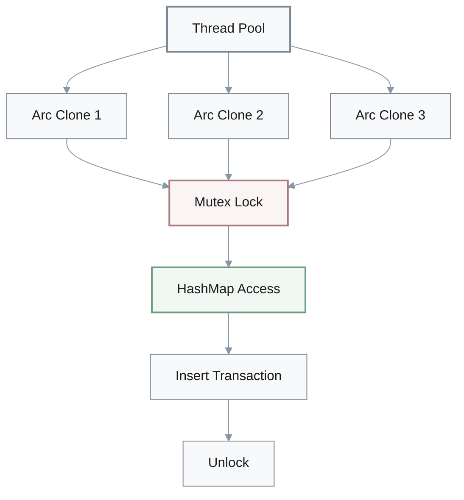

---

## 2. Solana False Write Locks Impact

**Q:** Our Solana program is declaring accounts as writable, but we're only reading from them. Parallelism seems lower than expected—throughput is down 40-60%. Could this be related?

**A:** **Architect:** That's your problem. False write locks.

**Dev Lead:** Wait, declaring writable when we only read causes that much impact?

**Architect:** Yes. Sealevel runtime assumes write lock needed. Prevents parallel execution.

**Dev Lead:** Hmm... So transactions reading the same account block each other?

**Architect:** Exactly. They execute sequentially instead of parallel.

**Junior Dev:** Oh! How do we fix it?

**Architect:** Mark them as read-only. Remove the `mut` flag or use `#[account]` without `mut` in Anchor.

**Dev Lead:** That simple?

**Architect:** That simple. Runtime will then schedule parallel execution for read-only conflicts.

**Dev Lead:** Makes sense. What's the actual throughput gain?

**Architect:** For read-heavy workloads, you'll recover that 40-60%. Could mean hitting block production deadlines you're currently missing.

**Dev Lead:** Good point. Let's audit all our account declarations then.

**Architect:** Smart move.

### Account Lock Impact

| Lock Type | Parallel Execution | Throughput Impact | Use When |
|-----------|-------------------|-------------------|----------|
| **Read-only** | ✅ Allowed | 0% penalty | Only reading data |
| **False Write** | ❌ Sequential | -40% to -60% | Mistake: read as write |
| **True Write** | ❌ Sequential | Necessary cost | Actually modifying data |

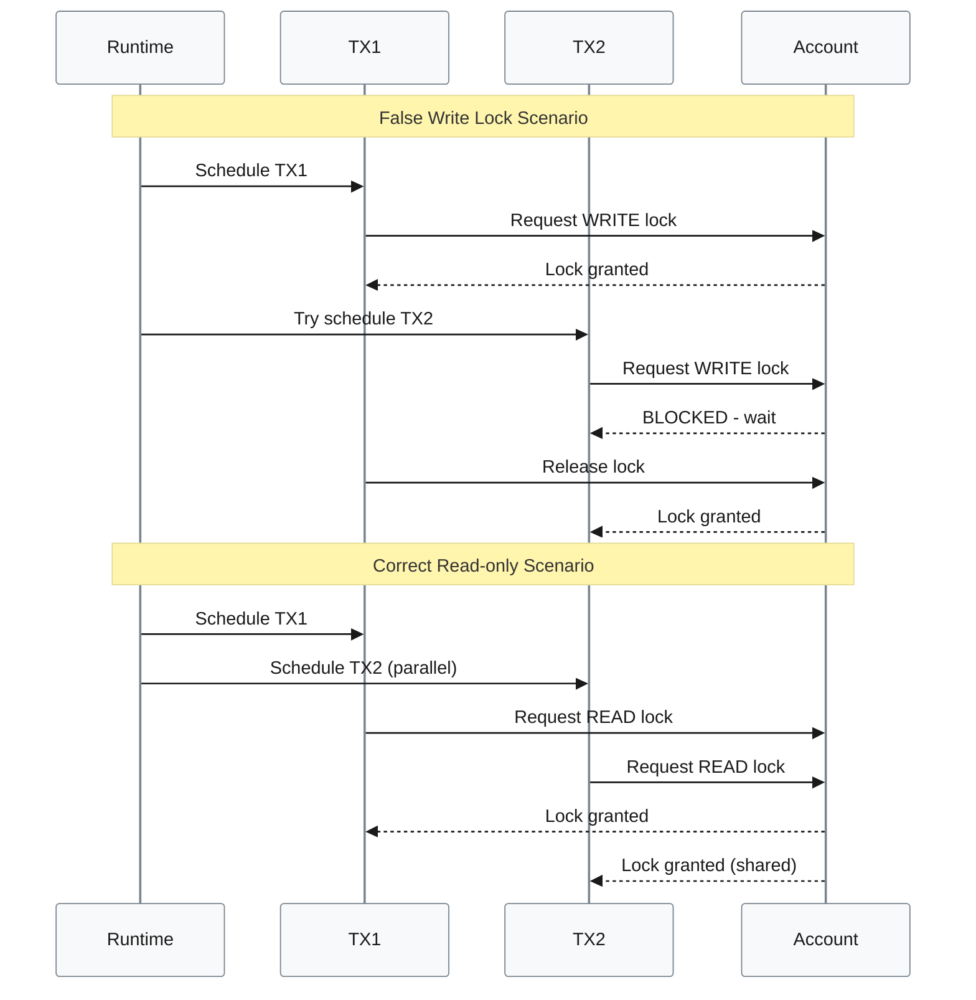

**Performance Impact:**
$$
\text{Throughput Loss (\%)} = \frac{\text{sequential time} - \text{parallel time}}{\text{parallel time}} \times 100 = 40\text{-}60\%
$$

---

## 3. Integer Underflow in Token Balances

**Q:** We're deducting token balances like this: `uint256 amount = balanceOf[sender] - value; balanceOf[sender] = amount;` in our Solidity contract. Security audit flagged it as critical. What's wrong?

**A:** **Security Auditor:** Integer underflow vulnerability. Critical.

**Dev:** But we're using uint256. It can't go negative.

**Auditor:** That's exactly the problem. If value exceeds balance, it wraps around.

**Dev:** Wait, wraps around?

**Auditor:** Yeah. Underflows to 2^256 minus the difference. Massive unintended balance.

**Senior Dev:** Let me think... So if balance is 100 and value is 150?

**Auditor:** Result wraps to roughly 10^77. User suddenly has infinite tokens.

**Senior Dev:** Oh no. Can drain the entire contract.

**Auditor:** Exactly. We've seen this exploited in 2016-2017 token hacks. Multiple contracts lost all funds.

**How do we prevent it?**

**Dev:** Check before subtracting?

**Auditor:** Yes. `require(balanceOf[sender] >= value, "Insufficient balance");` before the subtraction.

**Senior Dev:** Right. Solidity 0.8+ has built-in checks now, right?

**Auditor:** Correct, but explicit checks are still best practice. In Rust, use `checked_sub().ok_or(Error::InsufficientBalance)?`

**Dev:** Got it. So always validate before arithmetic operations.

**Auditor:** Especially for financial operations. Never trust wrapping behavior.

### Underflow Attack Scenario

**Vulnerable Code:**
```solidity
// ❌ VULNERABLE
balanceOf[sender] = balanceOf[sender] - value;
```

**Attack Example:**
$$
\text{balance} = 100, \text{value} = 150
$$
$$
\text{result} = 100 - 150 = 2^{256} - 50 \approx 1.16 \times 10^{77}
$$

**Safe Implementations:**

| Language | Safe Pattern | Protection |
|----------|-------------|-----------|
| **Solidity 0.8+** | Built-in overflow checks | Automatic revert |
| **Solidity < 0.8** | `require(balance >= value)` | Manual validation |
| **Rust** | `balance.checked_sub(value)?` | Returns `None` on underflow |

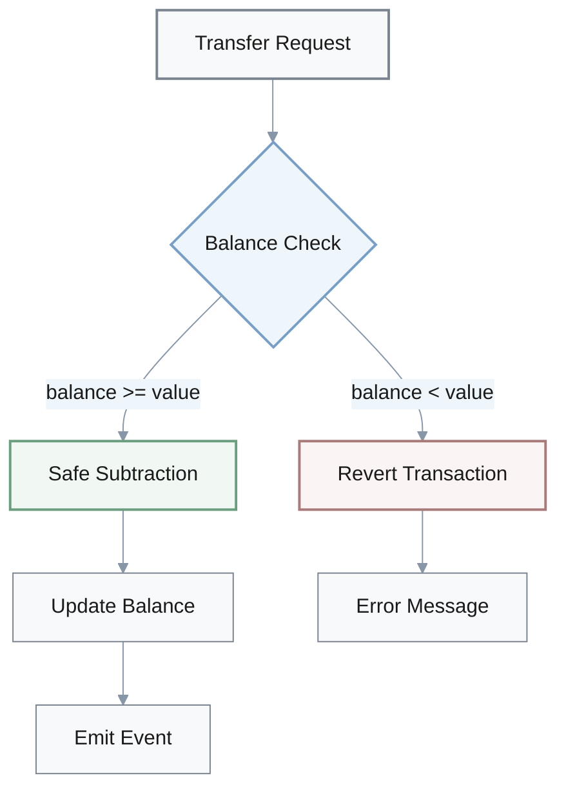

---

## 4. AMM Constant Product Invariant

**Q:** Our DEX AMM swap is calculating output with `output_amount = (input_amount * output_reserve) / input_reserve;` but the pool value keeps dropping. We're not applying fees. Is that the issue?

**A:** **DeFi Dev:** That's breaking your constant product invariant.

**PM:** Constant product?

**DeFi Dev:** x times y equals k. Core AMM property. Without fees, product decreases with each trade.

**Junior Dev:** Hmm, why does it decrease?

**DeFi Dev:** You're giving away tokens without taking fees. Pool loses value every swap.

**PM:** Oh! So arbitrage bots can drain it?

**DeFi Dev:** Over time, yes. You're basically leaking value.

**Applying the fix:**

**Junior Dev:** How do we fix it?

**DeFi Dev:** Apply fee before calculation. Standard is 0.3%. `input_with_fee = input_amount * 997 / 1000;`

**Junior Dev:** I see. Then calculate output using the fee-adjusted input?

**DeFi Dev:** Right. `output_amount = (input_with_fee * output_reserve) / (input_reserve + input_with_fee);`

**PM:** And that maintains the invariant?

**DeFi Dev:** Actually grows it slightly. The fee stays in the pool. That's how liquidity providers earn yield.

**Junior Dev:** Ah! So the math is `(x + delta_x) * (y - delta_y) >= k`?

**DeFi Dev:** Exactly. Grows by the fee rate. Pool becomes more valuable over time.

**PM:** Makes sense now.

### AMM Invariant Analysis

**Constant Product Formula:**
$$
x \times y = k
$$

**Without Fees (Broken):**
$$
x' \times y' < k \quad \text{(value leakage)}
$$

**With Fees (Correct):**
$$
\text{input with fee} = \text{input amount} \times \frac{997}{1000}
$$
$$
\text{output amount} = \frac{\text{input with fee} \times y}{x + \text{input with fee}}
$$
$$
x' \times y' \geq k \quad \text{(value growth)}
$$

### Fee Impact Comparison

| Scenario | Input | Fee | Output | New Product | Result |
|----------|-------|-----|--------|-------------|--------|
| **No Fee** | 1000 | 0 | 990.1 | $k - \Delta$ | Value drain |
| **0.3% Fee** | 1000 | 3 | 987.2 | $k + 0.003k$ | Value growth |

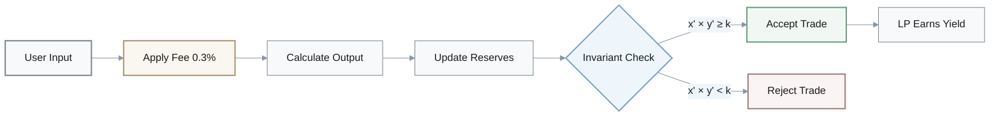

---

## 5. Blockchain Reorganization Handling

**Q:** Our Ethereum event monitor processes blocks sequentially from last processed to current. Works fine on testnet, but mainnet sometimes shows duplicate events or misses reversals during network issues. What are we missing?

**A:** **Backend Dev:** No reorg handling. That's the issue.

**Junior Dev:** Reorg?

**Backend Dev:** Blockchain reorganization. Uncle blocks. Chain can revert and take a different path.

**Junior Dev:** Wait... So blocks we already processed might get reverted?

**Backend Dev:** Exactly. And you've already processed their events. Now they never happened.

**Senior Dev:** Oh no. Causes phantom transactions in our database.

**Backend Dev:** Right. State inconsistencies. Financial loss if you acted on those events.

**Implementing safeguards:**

**Junior Dev:** How do we handle it?

**Backend Dev:** Add confirmation depth. Only process blocks that are 12 blocks deep.

**Junior Dev:** Why 12?

**Backend Dev:** Standard safety margin. Reorgs rarely exceed that depth.

**Senior Dev:** Makes sense. And detect when current block is less than last processed?

**Backend Dev:** Yes. `if current_block < last_processed { handle_reorg() }` Means chain reverted.

**Junior Dev:** Got it. What does handle_reorg do?

**Backend Dev:** Reverses events from reverted blocks. Keep last 12 blocks in a buffer you can unwind.

**Senior Dev:** I see. So we trade 12-block latency for correctness.

**Backend Dev:** Exactly. Worth it. Affects 1-3% of blocks during network instability.

### Reorg Detection Strategy

**Key Metrics:**
- **Confirmation Depth:** 12 blocks (standard safety margin)
- **Reorg Frequency:** 1-3% of blocks during network instability
- **Trade-off:** Latency (~3 minutes) vs. correctness

| Block State | Processing | Risk Level | Action |
|-------------|-----------|------------|--------|
| **Latest** | ❌ Don't process | High reorg risk | Wait |
| **1-11 deep** | ❌ Don't process | Moderate risk | Wait |
| **12+ deep** | ✅ Process | Low risk | Safe to finalize |

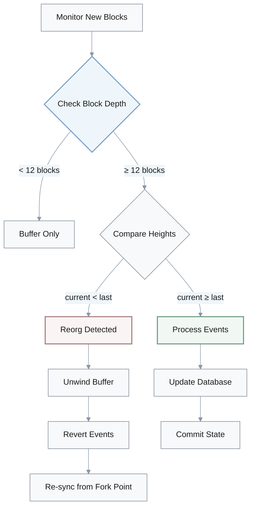

**Reorg Detection Logic:**
$$
\text{is reorg} = \text{current block height} < \text{last processed height}
$$

---

## 6. Cross-Chain Bridge Signature Validation

**Q:** We're building a cross-chain bridge. The validator approval logic just checks if the signature count meets the threshold: `if signatures.len() >= threshold { execute_transfer(); }` Should work, right?

**A:** **Security Engineer:** No. That's a critical vulnerability.

**Bridge Dev:** Why? We're checking the count.

**Security Engineer:** You're not verifying the signatures themselves. Or checking for duplicates.

**Bridge Dev:** Oh... Someone could submit the same signature multiple times?

**Security Engineer:** Or submit completely invalid signatures. You're just counting.

**Architect:** Yikes. This is a multi-million dollar exploit waiting to happen.

**What's the correct approach?**

**Bridge Dev:** Verify each signature is valid?

**Security Engineer:** Yes. Recover the signer from each signature. Check they're in the authorized validator set.

**Bridge Dev:** Got it. And ensure no duplicates?

**Security Engineer:** Right. Use a HashSet. `valid_signers.insert(signer)` returns false if already present.

**Architect:** So it's recover, authorize, deduplicate, then count?

**Security Engineer:** Exactly. `require!(valid_signers.len() >= threshold)` only after all checks pass.

**Bridge Dev:** Makes sense. And if any signature fails verification?

**Security Engineer:** Reject the entire transfer. Can't have partial trust.

**Architect:** Agreed. Let's add this to our security audit checklist. Too critical to miss.

### Bridge Signature Validation Pipeline

**Validation Steps:**
1. **Recover:** Extract signer from each signature
2. **Authorize:** Verify signer is in validator set
3. **Deduplicate:** Ensure no signer appears twice
4. **Count:** Check unique valid signers ≥ threshold

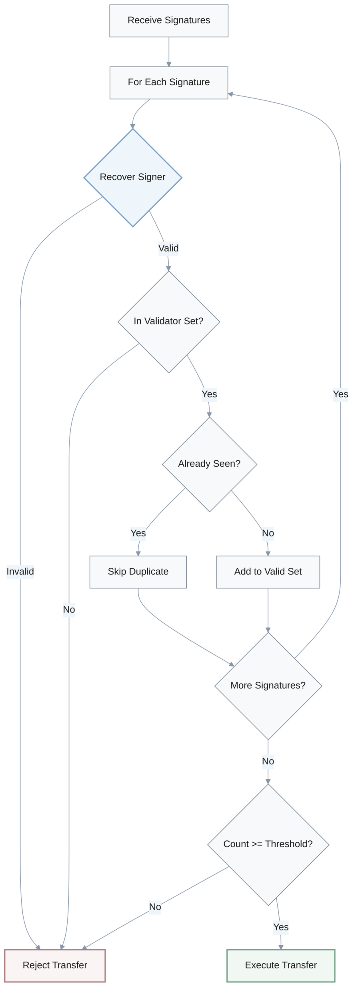

### Vulnerability Comparison

| Approach | Validates | Deduplicates | Attack Vector | Risk |
|----------|-----------|--------------|---------------|------|
| **Count Only** | ❌ No | ❌ No | Submit invalid/duplicate sigs | Critical |
| **Validate Only** | ✅ Yes | ❌ No | Submit same sig N times | High |
| **Full Pipeline** | ✅ Yes | ✅ Yes | None (secure) | Low |

---

## 7. Gas Optimization: Storage Array Length Caching

**Q:** Gas optimization—we're iterating over storage arrays with `for (uint i; i < arr.length; i++)` and gas costs are 30-50% higher than expected. Is array access expensive?

**A:** **Gas Expert:** The problem is `arr.length` in the loop condition.

**Dev:** What's wrong with it?

**Gas Expert:** You're reading from storage every iteration. 100 gas each time.

**Dev:** Wait, every iteration?

**Gas Expert:** Yes. The condition checks on every loop. Length is in storage.

**Senior Dev:** Hmm... So for 100 elements, that's 10,000 wasted gas?

**Gas Expert:** Exactly. Just for reading the length.

**How to optimize:**

**Dev:** Cache it in memory first?

**Gas Expert:** Right. `uint256 len = arr.length;` before the loop. Then `i < len` in the condition.

**Dev:** That drops it to one storage read?

**Gas Expert:** Correct. Saves 9,900 gas for 100 elements. Nearly 99% reduction in length-read costs.

**Senior Dev:** Nice. Any other optimizations?

**Gas Expert:** Use unchecked increment in Solidity 0.8+. `unchecked { ++i; }` saves 5-10 gas per iteration.

**Dev:** Got it. So two simple changes—cache length and unchecked increment.

**Gas Expert:** Yes. Can reduce total gas by 30-50% for array operations. Makes your protocol competitive.

### Gas Cost Analysis

**Unoptimized Loop:**
```solidity
// ❌ Reads storage every iteration
for (uint i = 0; i < arr.length; i++) {
    // loop body
}
```

**Gas Cost Formula:**
$$
\text{Total Gas} = n \times (100 + \text{loop body cost} + 5)
$$

**Optimized Loop:**
```solidity
// ✅ Single storage read
uint256 len = arr.length;
for (uint i = 0; i < len;) {
    // loop body
    unchecked { ++i; }
}
```

**Optimized Gas Cost:**
$$
\text{Total Gas} = 100 + n \times \text{loop body cost}
$$

**Savings:**
$$
\text{Gas Saved} = n \times 105 - 100 \approx 99\% \text{ of length-read costs}
$$

### Optimization Impact

| Array Size | Unoptimized | Optimized | Gas Saved | % Reduction |
|------------|-------------|-----------|-----------|-------------|
| 10 items | 1,150 | 200 | 950 | 82% |
| 100 items | 10,600 | 1,100 | 9,500 | 90% |
| 1000 items | 105,100 | 10,100 | 95,000 | 90% |

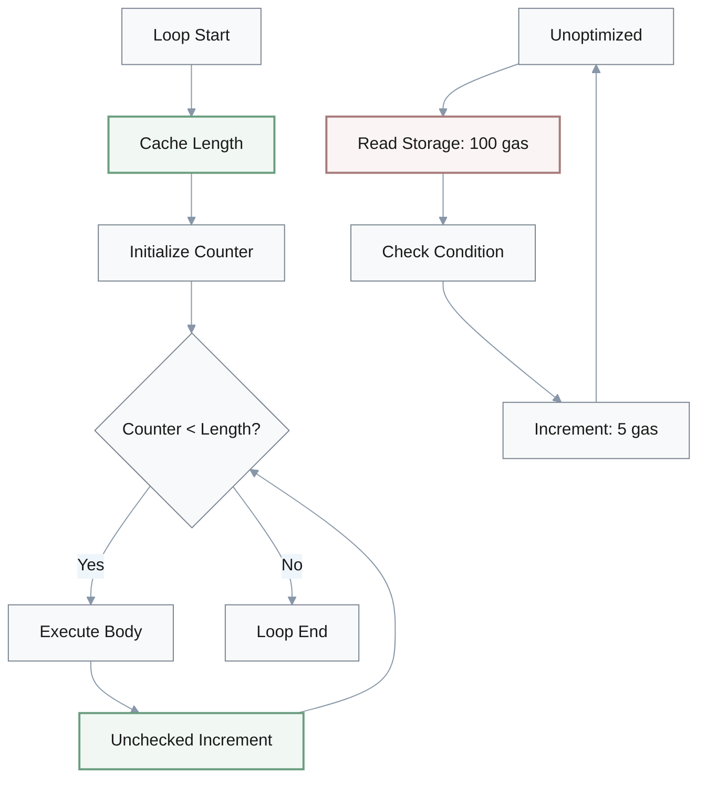

---

## 8. Async Rust: Holding Locks Across Await Points

**Q:** I'm getting weird slowdowns in my async Rust code. I have `let data = mutex.lock().unwrap();` then an await for an async operation, then `drop(data);` to release the lock. Should be fine?

**A:** **Async Expert:** No. That's holding a sync mutex across an await point.

**Dev:** What's wrong with that?

**Async Expert:** You're blocking the executor thread. Other tasks can't run.

**Dev:** Wait, but I drop the guard after the await.

**Async Expert:** Doesn't matter. The guard is held across the await. Executor is blocked the entire time.

**Senior Dev:** How bad is the impact?

**Async Expert:** 10-100x slowdown. Can cause deadlocks in some cases.

**Fixing the pattern:**

**Dev:** Oh. Release the lock before the await?

**Async Expert:** Yes. Clone the data in a scope, let guard drop, then await.

**Dev:** Like `let data = { mutex.lock().unwrap().clone() };`?

**Async Expert:** Exactly. Guard drops at end of that block, before the await.

**Senior Dev:** Or use async-aware mutex?

**Async Expert:** That works too. `tokio::sync::Mutex` can be held across await. But still not ideal.

**Dev:** What's the best approach?

**Async Expert:** Restructure to avoid holding locks across await entirely. Lock, grab what you need, release, then await.

**Senior Dev:** Makes sense. Critical for blockchain indexers and RPC servers.

**Async Expert:** Right. We've seen validators miss blocks because of this bug.

### Async Lock Patterns

| Pattern | Blocks Executor | Performance | Safety |
|---------|-----------------|-------------|--------|
| **Sync Mutex + Await** | ✅ Yes | 10-100x slower | Deadlock risk |
| **Clone + Drop** | ❌ No | Fast | Safe |
| **Tokio Mutex** | ❌ No | Moderate overhead | Safe but not ideal |
| **Lock-Free Design** | ❌ No | Fastest | Safe |

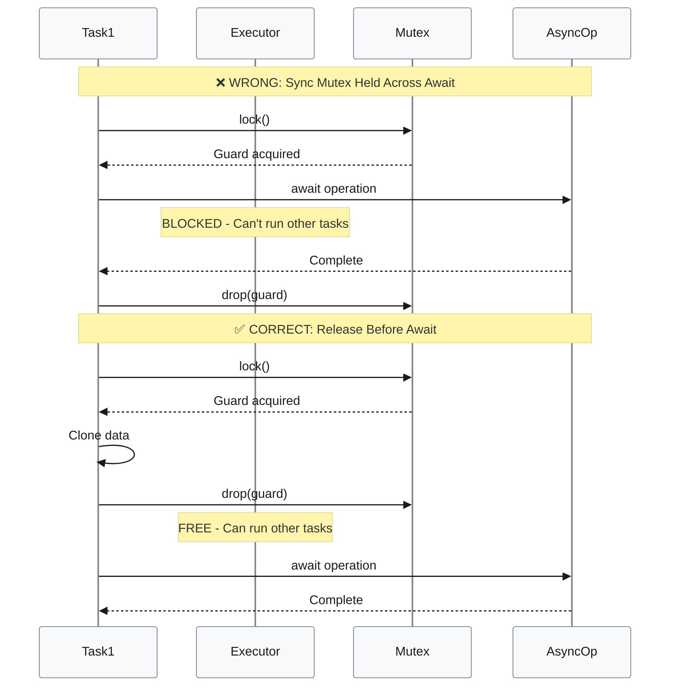

**Correct Pattern:**
```rust
// ✅ Clone and drop before await
let data = {
    let guard = mutex.lock().unwrap();
    guard.clone()
}; // Guard drops here
let result = async_operation(data).await;
```

---

## 9. TOCTOU Race Condition in Nonce Validation

**Q:** Our transaction validation checks nonce with `if tx.nonce == expected_nonce { apply_transaction(tx); expected_nonce++; }` in a concurrent environment. This seems right, but we're seeing double-executions occasionally. What's happening?

**A:** **Concurrency Expert:** Classic TOCTOU. Time-of-check-time-of-use race condition.

**Dev:** Two threads both pass the check?

**Concurrency Expert:** Exactly. Both see nonce 5, both pass, both execute, both increment.

**Dev:** Oh no. So the transaction runs twice.

**Concurrency Expert:** Yes. Double-spending if it's a transfer.

**Architect:** This causes consensus failure. Different validators might execute different transaction sets.

**Concurrency Expert:** Right. Chain split risk.

**Making it atomic:**

**Dev:** Lock the entire check-execute-increment sequence?

**Concurrency Expert:** Yes. Has to be atomic. No gap between check and action.

**Dev:** Per-account locking?

**Concurrency Expert:** Better than global lock. Use `Mutex` or `RwLock` on each account.

**Architect:** Or compare-and-swap?

**Concurrency Expert:** That works too for simple cases. But mutex is clearer here.

**Dev:** Got it. So lock account, check nonce, execute, increment, unlock?

**Concurrency Expert:** Exactly. All within the critical section. No other thread can interleave.

**Architect:** Good. Let's audit all our check-then-act patterns. This bug pattern is everywhere.

### TOCTOU Attack Window

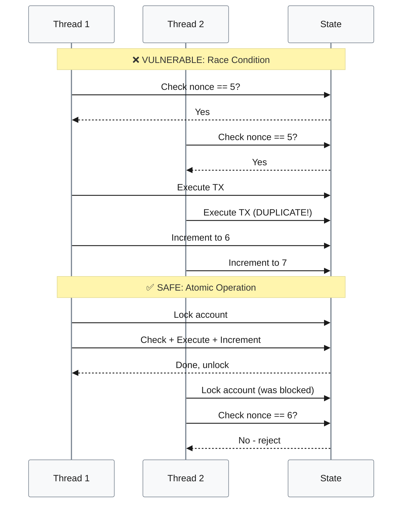

### Atomicity Strategies

| Strategy | Granularity | Performance | Complexity |
|----------|-------------|-------------|-----------|
| **No Lock** | N/A | Fastest | ❌ Unsafe |
| **Global Lock** | Entire state | Slowest | Simple |
| **Per-Account Lock** | Account level | Fast | Moderate |
| **Compare-and-Swap** | Single value | Fastest | High |

**Critical Section:**
$$
\text{Atomic Block} = \text{Check} \land \text{Execute} \land \text{Increment}
$$

---

## 10. Storage Packing Write Patterns

**Q:** I optimized storage by packing two uint128 values in one slot, but updating them separately. Expected 50% gas savings, but only seeing 10-15%. What am I missing?

**A:** **Gas Expert:** You're doing separate writes to the packed slot.

**Dev:** Yeah, `data.value1 = new_value1;` then later `data.value2 = new_value2;`

**Gas Expert:** That's two SSTORE operations. 20,000 gas each.

**Dev:** Wait, but they share the same storage slot.

**Gas Expert:** Doesn't matter. Each write is read-modify-write. Still costs 20,000 gas.

**Senior Dev:** Hmm. So we're paying 40,000 gas total?

**Gas Expert:** Exactly. Same as two separate uint256 values.

**Understanding the optimization:**

**Dev:** How do we actually save gas then?

**Gas Expert:** Update both values simultaneously. `data = Data { value1: new_value1, value2: new_value2 };`

**Dev:** Oh! That's one SSTORE?

**Gas Expert:** Right. 20,000 gas. Actual 50% savings.

**Senior Dev:** What if we can't update them together? They change at different times?

**Gas Expert:** Then packing might not help. Measure both approaches.

**Dev:** I see. So storage packing only helps if write patterns align?

**Gas Expert:** Exactly. It saves storage size, but not necessarily gas. Depends on access patterns.

**Senior Dev:** Important to benchmark the real usage pattern.

**Gas Expert:** Always. Don't optimize based on assumptions.

### Storage Packing Analysis

**Storage Layout:**
```
Slot 0: [uint128 value1][uint128 value2]
```

**Gas Costs:**

| Write Pattern | SSTORE Operations | Gas Cost | Actual Savings |
|---------------|------------------|----------|----------------|
| **Separate uint256** | 2 | 40,000 | Baseline |
| **Packed, separate writes** | 2 | 40,000 | 0% |
| **Packed, simultaneous write** | 1 | 20,000 | 50% |

**SSTORE Operation Cost:**
$$
\text{Gas per SSTORE} = 20,000 \text{ gas}
$$

**Effective Savings:**
$$
\text{Savings (\%)} = \begin{cases}
50\% & \text{if writes are simultaneous} \\
0\% & \text{if writes are separate}
\end{cases}
$$

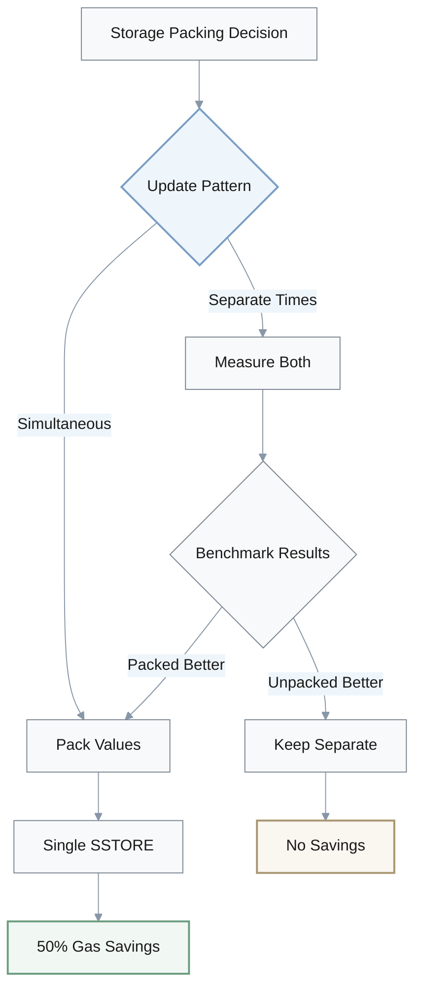

---

## 11. Blockchain Indexer Query Chunking

**Q:** Our indexer queries Ethereum events from genesis to latest block with one RPC call. Works fine on testnet, but mainnet crashes with OOM errors. What's wrong?

**A:** **Backend Dev:** You're querying millions of blocks in one call.

**Junior Dev:** The RPC call is `from_block(0).to_block(latest).query().await`. Should work?

**Backend Dev:** No provider will accept that. Most limit to 10,000 blocks per query.

**Junior Dev:** Oh. Timeout?

**Backend Dev:** Or rate limit. And even if it worked, you'd load gigabytes into memory at once.

**Senior Dev:** Makes sense. Why didn't testnet catch this?

**Backend Dev:** Testnet only has thousands of blocks. Mainnet has tens of millions.

**Chunking the queries:**

**Junior Dev:** Batch it into chunks?

**Backend Dev:** Yes. Query 1000 blocks at a time. Loop through the range.

**Junior Dev:** Like `for start_block in (0..=latest).step_by(1000)`?

**Backend Dev:** Exactly. `let end_block = (start_block + 1000).min(latest);` for each chunk.

**Senior Dev:** Got it. And checkpoint progress?

**Backend Dev:** Critical. Save progress after each chunk. So crashes don't lose hours of work.

**Junior Dev:** What about rate limits?

**Backend Dev:** Add delays between chunks. Respect provider limits. Exponential backoff if you hit errors.

**Senior Dev:** Right. So chunk size, checkpointing, and rate limiting.

**Backend Dev:** Those three. Standard pattern for any blockchain indexer.

### Indexer Query Strategy

**Problem Scale:**
- **Testnet:** ~10,000 blocks
- **Mainnet:** ~18,000,000+ blocks
- **Provider Limit:** 10,000 blocks per query

**Chunking Parameters:**

| Parameter | Value | Purpose |
|-----------|-------|---------|
| **Chunk Size** | 1,000 blocks | Balance speed vs. reliability |
| **Checkpoint Frequency** | Per chunk | Resume on crash |
| **Delay Between Chunks** | 100-500ms | Respect rate limits |
| **Backoff Strategy** | Exponential (2x) | Handle errors gracefully |

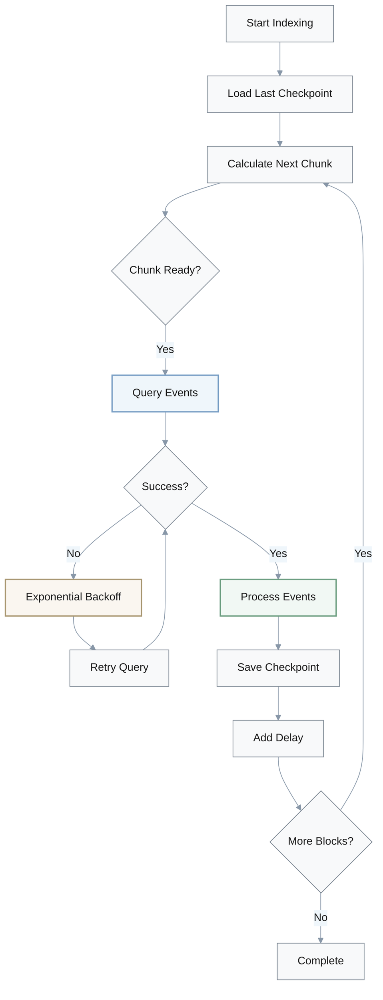

**Chunk Calculation:**
$$
\text{end block} = \min(\text{start block} + \text{chunk size}, \text{latest block})
$$

---

## 12. Oracle Price Validation Layers

**Q:** Our oracle just fetches the price and updates: `latestPrice = fetchPrice(); emit PriceUpdated(latestPrice);` Is there anything we should validate?

**A:** **DeFi Security:** That's dangerous. No validation at all?

**Oracle Dev:** The price feed is trusted.

**DeFi Security:** What if it's compromised? Or manipulated?

**Oracle Dev:** Can that happen?

**DeFi Security:** Flash loan attacks manipulate oracle sources. We've seen $24 million lost in Harvest Finance. $350k in bZx.

**Architect:** Wow. What kind of manipulation?

**DeFi Security:** Extreme prices. Zero, max uint, 100x off-market. Triggers mass liquidations.

**Adding validation layers:**

**Oracle Dev:** Check for reasonable range?

**DeFi Security:** Yes. `require(newPrice > 0 && newPrice <= MAX_REASONABLE_PRICE)`. Basic sanity check.

**Architect:** Good. What about rate of change?

**DeFi Security:** Good catch. `require(change <= latestPrice / MAX_CHANGE_PERCENT)`. Price can't jump 50% in one update.

**Oracle Dev:** Makes sense. Timestamp validation?

**DeFi Security:** Right. `require(block.timestamp - lastUpdate >= MIN_UPDATE_INTERVAL)`. Prevents update spam.

**Architect:** Should we use TWAP?

**DeFi Security:** Time-weighted average? Yes. Much harder to manipulate. Uniswap or Chainlink TWAP.

**Oracle Dev:** Got it. So four layers: timestamp, range, delta, and TWAP?

**DeFi Security:** At minimum. This is critical infrastructure. One bad price can drain your protocol.

**Architect:** Agreed. Let's implement all four.

### Oracle Attack Examples

| Attack | Target | Loss | Manipulation Type |
|--------|--------|------|-------------------|
| **Harvest Finance** | Price oracle | $24M | Flash loan + AMM manipulation |
| **bZx** | Price oracle | $350K | Flash loan arbitrage |
| **Compound** | Price oracle | Near miss | Oracle delay exploit |

### Validation Layers

**Layer 1: Range Check**
$$
0 < \text{newPrice} \leq \text{MAX REASONABLE PRICE}
$$

**Layer 2: Rate of Change**
$$
\Delta\text{Price} = \frac{|\text{newPrice} - \text{lastPrice}|}{\text{lastPrice}} \leq \text{MAX CHANGE PERCENT}
$$

**Layer 3: Timestamp**
$$
\text{block.timestamp} - \text{lastUpdate} \geq \text{MIN UPDATE INTERVAL}
$$

**Layer 4: TWAP (Time-Weighted Average Price)**
$$
\text{TWAP} = \frac{\sum_{i=1}^{n} \text{price}_i \times \text{duration}_i}{\sum_{i=1}^{n} \text{duration}_i}
$$

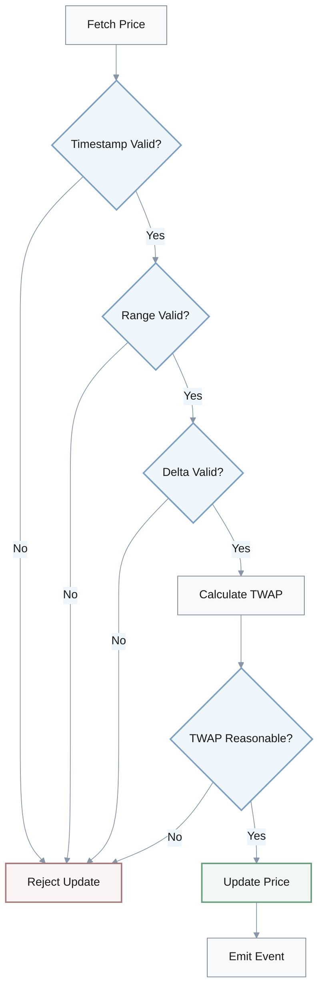

---

## 13. Median Calculation for Even-Length Arrays

**Q:** I'm calculating median in Rust with `values.sort(); let median = values[values.len() / 2];` but the results seem slightly off for even-length arrays. Bug in my code?

**A:** **Dev A:** Even-length arrays?

**Dev B:** Yeah, for `[10, 20, 30, 40, 50, 60]` I'm getting 40, but expected 35.

**Dev A:** Ah, there's your issue. Integer division.

**Dev B:** What do you mean?

**Dev A:** `len / 2` floors down. For even length, you're taking the second middle element.

**Dev B:** Oh! Instead of averaging the two middle ones?

**Dev A:** Right. Standard median definition for even-length is average of two middle elements.

**Correct implementation:**

**Dev B:** So I need to check if length is odd or even?

**Dev A:** Yes. If odd, take `values[len / 2]`. If even, average `values[mid - 1]` and `values[mid]`.

**Dev B:** `(values[mid - 1] + values[mid]) / 2`?

**Dev A:** Careful. Integer addition can overflow. Better to do `values[mid-1]/2 + values[mid]/2`.

**Dev B:** Good point. Or use checked arithmetic?

**Dev A:** That works too. Especially for u64 or larger types.

**Dev B:** What's the impact of this bug?

**Dev A:** Depends on usage. For blockchain gas estimation, could cause 5-10% skew. Systematic bias.

**Dev B:** Hmm. Which leads to overpayment or transaction failures.

**Dev A:** Exactly. Small bug, real impact.

### Median Calculation

**Definition:**
- **Odd length:** Middle element
- **Even length:** Average of two middle elements

**Example - Even Length Array:**
```
[10, 20, 30, 40, 50, 60]
        ↑   ↑
     idx 2  idx 3
```

$$
\text{Median (even)} = \frac{\text{values}[\frac{n}{2} - 1] + \text{values}[\frac{n}{2}]}{2} = \frac{30 + 40}{2} = 35
$$

**Overflow-Safe Average:**
$$
\text{Safe Average} = \frac{a}{2} + \frac{b}{2}
$$

| Array | Length | Incorrect | Correct | Impact |
|-------|--------|-----------|---------|--------|
| `[10, 20, 30, 40, 50, 60]` | 6 (even) | 40 | 35 | +14% bias |
| `[100, 200, 300]` | 3 (odd) | 200 | 200 | No error |
| `[1, 2, 3, 4]` | 4 (even) | 3 | 2.5 | +20% bias |

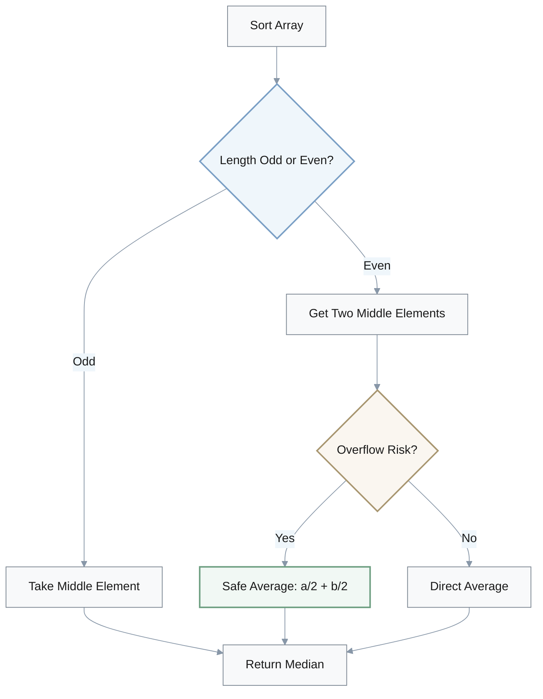

---

## 14. Hash Caching with Lock-Free Data Structures

**Q:** Profiling shows 30% CPU time in keccak256 hash calls. I added a cache with `Arc<Mutex<HashMap<Vec<u8>, Hash>>>` but the code got slower. What went wrong?

**A:** **Performance Engineer:** Two problems. Vec as key and Mutex contention.

**Dev:** Vec is wrong for hash key?

**Performance Engineer:** Has to clone on every lookup. You're hashing the key to look up the cached hash.

**Dev:** Oh. That's... ironic.

**Performance Engineer:** Yeah. Defeating the purpose.

**Senior Dev:** And Mutex is a bottleneck?

**Performance Engineer:** Huge. Every thread blocks on the lock. More overhead than the original hash.

**Correct caching approach:**

**Dev:** Use fixed-size array for key?

**Performance Engineer:** Yes. `[u8; 32]` for hash output. Zero-copy lookups.

**Dev:** Got it. And replace Mutex?

**Performance Engineer:** Use DashMap. Lock-free concurrent hashmap. No contention.

**Senior Dev:** So `DashMap<[u8; 32], Hash>`?

**Performance Engineer:** Exactly. That actually speeds things up 30-50%.

**Dev:** Interesting. What about SIMD-accelerated hash instead of caching?

**Performance Engineer:** Also valid. SHA3 crate with AVX-512 gives 15-25% improvement. Simpler than caching.

**Senior Dev:** Makes sense. Benchmark both approaches?

**Performance Engineer:** Always. Don't assume optimization works. Measure it.

**Dev:** Right. Premature optimization is the root of evil.

**Performance Engineer:** Exactly. Profile first, optimize second, benchmark third.

### Caching Performance Analysis

**Original Problem:**
- **Bottleneck:** 30% CPU time in keccak256
- **Failed Solution:** `Arc<Mutex<HashMap<Vec<u8>, Hash>>>`
- **Result:** Slower than baseline

**Performance Issues:**

| Component | Problem | Cost | Impact |
|-----------|---------|------|--------|
| **Vec as key** | Clone on every lookup | Heap allocation | High overhead |
| **Mutex** | Thread contention | Lock/unlock per access | Serialization bottleneck |
| **HashMap hashing** | Hash the key to cache hash | Additional computation | Ironic overhead |

**Correct Solutions:**

| Approach | Data Structure | Performance Gain | Complexity |
|----------|---------------|------------------|-----------|
| **Lock-Free Cache** | `DashMap<[u8; 32], Hash>` | +30-50% | Moderate |
| **SIMD Hash** | SHA3 with AVX-512 | +15-25% | Low |

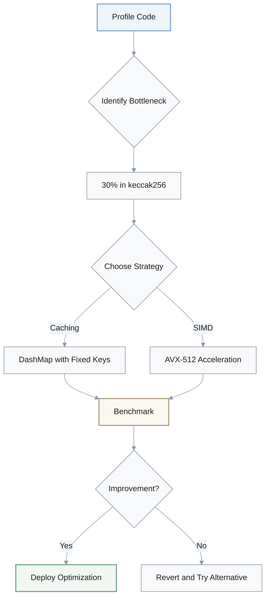

**Performance Comparison:**
$$
\text{Speedup} = \frac{\text{Baseline Time}}{\text{Optimized Time}}
$$

- **Lock-Free Cache:** 1.3-1.5x speedup
- **SIMD:** 1.15-1.25x speedup

---

## 15. Cross-Chain Bridge Idempotency

**Q:** Our cross-chain bridge retry logic keeps submitting until confirmed: `while !transaction_confirmed() { submit_transaction(); sleep(1 sec); }` We're seeing duplicate transfers occasionally. Why?

**A:** **Bridge Engineer:** You're not checking if the transaction is pending.

**Dev:** Shouldn't it just... work?

**Bridge Engineer:** No. First transaction might be pending, not failed. You keep submitting more.

**Dev:** Wait... Multiple transactions for the same transfer?

**Bridge Engineer:** Exactly. User gets 2-10x their transfer amount. You lose 2-10x the funds.

**Architect:** This is catastrophic. Several bridges lost $10 million+ from this exact bug.

**Implementing idempotency:**

**Dev:** Check transaction status before retrying?

**Bridge Engineer:** Yes. And use deterministic transaction ID.

**Dev:** Deterministic?

**Bridge Engineer:** Generate ID from transfer parameters. Same transfer always gets same ID.

**Architect:** I see. So check status—if pending, wait. If failed, submit. If confirmed, done.

**Bridge Engineer:** Exactly. Three states, different handling for each.

**Dev:** Makes sense. What about exponential backoff?

**Bridge Engineer:** Critical. Start at 1 second, double each time. Don't hammer the network.

**Architect:** And persist the transaction ID?

**Bridge Engineer:** Yes. Store in database. Prevent reprocessing after restart.

**Dev:** Got it. So it's deterministic ID, status check, state machine, backoff, and persistence?

**Bridge Engineer:** That's the complete pattern. Skip any piece and you risk duplicate transfers.

**Architect:** Agreed. Let's do a full code review of all our retry logic across services.

### Bridge Retry State Machine

**Transaction States:**
1. **Pending:** Transaction submitted, awaiting confirmation
2. **Failed:** Transaction rejected or reverted
3. **Confirmed:** Transaction successfully completed

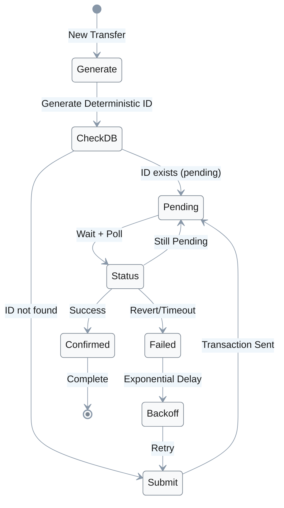

### Idempotency Components

| Component | Purpose | Risk if Missing |
|-----------|---------|-----------------|
| **Deterministic ID** | Same input → same ID | Can't track duplicates |
| **Status Check** | Query before retry | Submit duplicate TXs |
| **State Machine** | Handle pending/failed/confirmed | Wrong action for state |
| **Exponential Backoff** | Reduce network load | DOS provider |
| **Persistence** | Survive restarts | Reprocess after crash |

**Deterministic ID Generation:**
$$
\text{ID} = \text{hash}(\text{source chain} \parallel \text{dest chain} \parallel \text{amount} \parallel \text{recipient} \parallel \text{nonce})
$$

**Exponential Backoff:**
$$
\text{delay}_n = \min(2^n \times \text{base delay}, \text{max delay})
$$

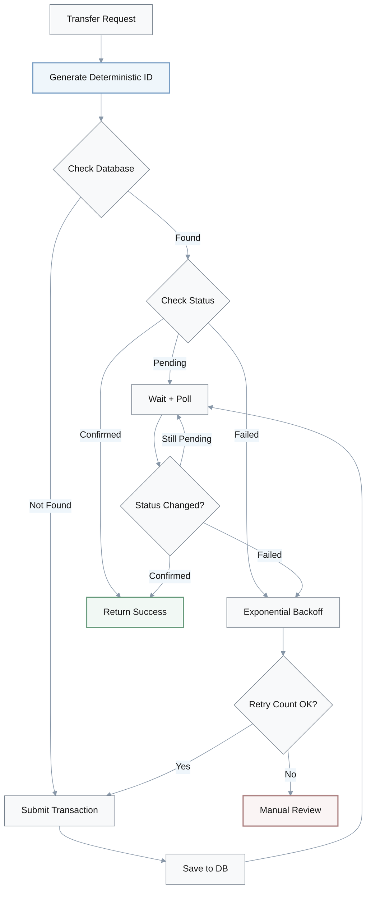

**Historical Losses:**
- Multiple bridges lost **$10M+** due to duplicate transfer bugs
- **Root cause:** No idempotency guarantees in retry logic

---

## Summary

This document covers 15 critical debugging scenarios across:
- **Rust concurrency patterns** (Arc + Mutex, async locks, TOCTOU)
- **Blockchain-specific issues** (reorgs, false write locks, nonce validation)
- **Smart contract vulnerabilities** (underflow, AMM invariants, bridge signatures)
- **Performance optimization** (gas costs, hash caching, storage packing)
- **Infrastructure reliability** (oracle validation, indexer chunking, bridge idempotency)

Each scenario includes:
- **Discussion format** showing real debugging conversations
- **Visual diagrams** illustrating processes and flows
- **Comparison tables** for different approaches
- **Mathematical formulas** for key concepts
- **Practical solutions** with code examples and best practices
