---

## 1. Rust's Ownership Model: Mental Model Shift from Reactive to Proactive Safety

**Q:** Rust's ownership model prevents data races at compile time, leading many to call Rust "safe by default." How does this change your mental model of programming safety compared to languages you've used before? What new categories of bugs might you now overlook?

**A:** **Dev A:** Coming from Python, Rust's safety model is a total mindset shift. Safety happens at compile time, not runtime.

**Dev B:** Right. In languages like Java or Python, you're debugging memory issues during testing. In Rust, the borrow checker forces you to think about ownership upfront.

**A:** That's the shift—from reactive debugging to proactive design. You're reasoning about lifetimes before you even run the code.

**B:** Mm-hmm. Makes sense.

### Safety Model Comparison

| Language | Safety Approach | Bug Discovery Phase | Mental Model |
|----------|----------------|---------------------|--------------|
| **Python/Java** | Runtime checks | During testing/production | Reactive debugging |
| **C/C++** | Manual management | Testing (segfaults) | Manual control |
| **Rust** | Compile-time verification | Before running | Proactive design |

### The Dangerous Trap: "If It Compiles, It Works"

**But here's what worries me:**

**A:** I'm starting to over-rely on "if it compiles, it works."

**B:** Yeah, that's a trap. Good catch. Rust prevents memory unsafety, not logic errors. You can still write race conditions, deadlocks, algorithmic bugs.

**A:** And panics—`unwrap()`, array bounds, integer overflow. Those still crash your program, just more gracefully than segfaults.

**B:** True. Memory-safe doesn't mean panic-safe.

**A:** Right.

### New Bug Categories to Watch

**What about unsafe blocks?**

**A:** That's another blindspot. If you use `unsafe` without documenting invariants, you've just created a security hole.

**B:** False sense of security. The compiler can't help you there.

**A:** Exactly. So the mental model shift: Rust moves memory bugs to compile time, but you're still responsible for logic and unsafe boundaries.

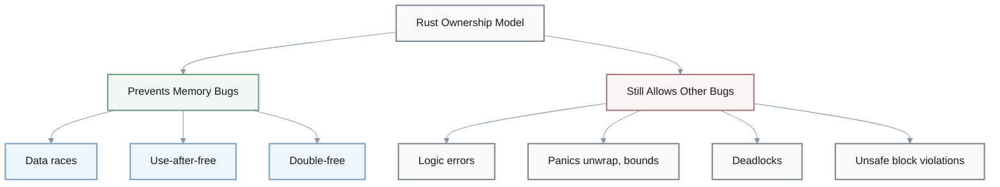

**B:** From C++, I miss manual control but appreciate automatic safety. Worth the upfront cognitive load.

**A:** Agreed. Long-term productivity gains for short-term learning pain.

> **Key Insight**: Memory-safe ≠ bug-free. Rust shifts memory bugs to compile time but requires vigilance for logic errors, panics, and `unsafe` boundaries.

---

## 2. Blockchain Trust: From "Trustless" Marketing to "Trust-Minimized" Reality

**Q:** Blockchain systems are often described as "trustless," yet bridges, oracles, and validators introduce trust assumptions. How does this reconciliation challenge your initial understanding of decentralization? What does "trust-minimized" really mean in practice?

**A:** **Engineer A:** I thought blockchain meant "no trust needed." Turns out that's marketing, not reality.

**Engineer B:** Right. Trust isn't eliminated—it's redistributed and made explicit.

**A:** Hmm... so what are we actually trusting?

**B:** Cryptography, consensus majority, code correctness. Still trust, just different form.

**A:** I see.

### The Three Dimensions of "Trust-Minimized"

**Let's break down "trust-minimized":**

**A:** Okay, so what does trust-minimized actually mean in practice?

**B:** Good question. Let me think... [pause] Three dimensions. First, distributed trust—no single point of failure. You need 51% or 2/3+ validators to collude.

**A:** More resistant than trusting one company, but not "zero trust."

**B:** Exactly. Second dimension: verifiable trust. You can audit smart contracts, verify signatures, replay transactions.

**A:** Oh! Transparency enables accountability.

**B:** Right. And third: economic trust. Rational actors behave predictably when incentivized. You trust game theory, not individuals.

**A:** Got it.

| Trust Dimension | Description | Example | Key Property |
|----------------|-------------|---------|--------------|
| **Distributed** | No single point of failure | 51% or 2/3+ validators to attack | Collusion resistance |
| **Verifiable** | Auditable and transparent | Smart contract audits, replay | Accountability |
| **Economic** | Game theory incentives | Staking penalties, rewards | Rational behavior |

```mermaid
%%{init: {
  "theme": "base",
  "themeVariables": {
    "primaryColor": "#f8f9fa",
    "primaryTextColor": "#1a1a1a",
    "primaryBorderColor": "#7a8591",
    "lineColor": "#8897a8",
    "secondaryColor": "#eff6fb",
    "tertiaryColor": "#f3f5f7"
  }
}}%%
graph TD
    A["Trust-Minimized"] --> B["Distributed Trust"]
    A --> C["Verifiable Trust"]
    A --> D["Economic Trust"]
    
    B --> B1["51% or 2/3+ collude needed"]
    B --> B2["No single point of failure"]
    
    C --> C1["Audit smart contracts"]
    C --> C2["Verify signatures"]
    C --> C3["Replay transactions"]
    
    D --> D1["Staking penalties"]
    D --> D2["Economic incentives"]
    D --> D3["Game theory alignment"]
    
    style A fill:#f8f9fa,stroke:#7a8591,stroke-width:2px,color:#1a1a1a
    style B fill:#eff6fb,stroke:#7a9fc5,stroke-width:2px,color:#1a1a1a
    style C fill:#eff6fb,stroke:#7a9fc5,stroke-width:2px,color:#1a1a1a
    style D fill:#eff6fb,stroke:#7a9fc5,stroke-width:2px,color:#1a1a1a
    style B1 fill:#f3f5f7,stroke:#8897a8,stroke-width:2px,color:#1a1a1a
    style B2 fill:#f3f5f7,stroke:#8897a8,stroke-width:2px,color:#1a1a1a
    style C1 fill:#f3f5f7,stroke:#8897a8,stroke-width:2px,color:#1a1a1a
    style C2 fill:#f3f5f7,stroke:#8897a8,stroke-width:2px,color:#1a1a1a
    style C3 fill:#f3f5f7,stroke:#8897a8,stroke-width:2px,color:#1a1a1a
    style D1 fill:#f3f5f7,stroke:#8897a8,stroke-width:2px,color:#1a1a1a
    style D2 fill:#f3f5f7,stroke:#8897a8,stroke-width:2px,color:#1a1a1a
    style D3 fill:#f3f5f7,stroke:#8897a8,stroke-width:2px,color:#1a1a1a
```

### Applying This to Real Systems

**Applying this to real systems:**

**A:** So when we design a bridge, we should be explicit about trust assumptions?

**B:** Yes, exactly. "This bridge trusts 7-of-10 validators not to collude" is honest. "Fully trustless" is marketing.

**A:** Makes sense. Users can then choose appropriate risk level.

**B:** Exactly. Trust is a spectrum, not binary. Every system trusts something—math, physics of information propagation, economic rationality.

**A:** The question is: which trust model fits your threat model?

**B:** Now you're thinking like an engineer, not a marketer.

> **Key Insight**: "Trustless" is marketing. "Trust-minimized" means distributed, verifiable, and economically-aligned trust. Be explicit about what your system trusts.

---

## 3. Terra Collapse: When Mathematics Meets Human Panic

**Q:** You've learned that Terra's algorithmic stablecoin collapsed due to misaligned incentives in its dual-token model. How does this reshape your understanding of the relationship between mathematics (x*y=k works) and human behavior (death spirals from panic selling)?

**A:** **Dev A:** Terra's math was correct—the constant product formula works. But the system still collapsed.

**Dev B:** Right. Because math assumes rational actors with infinite liquidity and no reflexivity.

**A:** And humans have loss aversion, herding behavior, asymmetric information.

**B:** Exactly. Psychology dominates math in crisis.

### What Went Wrong: Normal vs Crisis Scenarios

**So what went wrong specifically?**

**A:** The dual-token model's incentives broke under stress. Redemption arbitrage profits disappeared during the crisis.

**B:** Wait, walk me through that.

**A:** Okay. Normal times: price depegs slightly, arbitrageurs profit by restoring peg. Crisis: liquidity vanishes, arbitrage doesn't work, death spiral begins.

**B:** Oh, I see. So the mechanism that relies on profit-seeking breaks when profit disappears.

**A:** Exactly. It's a game theory failure, not a math failure.

**B:** Got it.

| Scenario | Price Depeg | Liquidity | Arbitrage | Outcome |
|----------|------------|-----------|-----------|---------|
| **Normal Times** | Slight (1-2%) | Abundant | Profitable | Peg restored |
| **Crisis** | Large (>10%) | Vanished | Unprofitable | Death spiral |

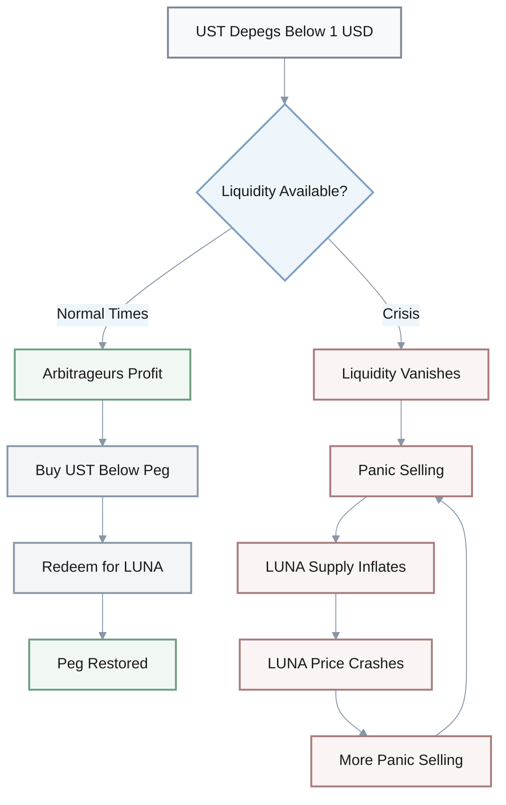

### Design Thinking Evolution

**How does this change design thinking?**

**B:** Before, I thought "if math checks out, protocol is secure."

**A:** Now?

**B:** Now it's: if math checks out AND incentives hold under 10x worst-case stress scenarios AND governance can't be captured... then maybe secure.

**A:** Right. Always ask: "What breaks this when people panic?"

**B:** Design for adversarial environments, not idealized cooperation.

**A:** This applies to all DeFi—DEX liquidity withdrawals during volatility, lending liquidation cascades, governance attacks.

**B:** True. Math is necessary but not sufficient.

> **Key Insight**: Math assumes rational actors with infinite liquidity. Reality has loss aversion, herding, and panic. **Game theory failure**, not math failure. Design for 10x worst-case stress scenarios.

---

## 4. Rust vs Go: Fast Feedback vs Correct Feedback Trade-off

**Q:** Rust's compile times are often 5-10x slower than Go. This creates a trade-off between "fast feedback" (rapid iteration) and "correct feedback" (catching bugs early). How does this challenge affect your development workflow and when would you prefer one over the other?

**A:** **Dev A:** I've been working in Rust for six months now. Compile times are brutal—5 to 10 minutes sometimes.

**Dev B:** Mm-hmm. How does that change your workflow?

**A:** I design more upfront. Can't just code-first and refactor-later like I did in Go.

**B:** So slower compilation forces discipline?

**A:** Yeah. I batch changes, run tests less frequently. Delays bug discovery but encourages deeper reasoning.

**B:** Interesting trade-off.

### Workflow Impact

| Aspect | Rust (Slow Compilation) | Go (Fast Compilation) |
|--------|------------------------|----------------------|
| **Design Approach** | More upfront design | Code-first, refactor-later |
| **Testing Frequency** | Batched, less frequent | Continuous, rapid |
| **Bug Discovery** | Delayed but deeper reasoning | Faster but shallower |
| **Iteration Style** | Deliberate, planned | Exploratory, experimental |

### When Would You Choose Each?

**When would you choose each?**

**B:** When do you prefer Rust despite the slow builds?

**A:** Hmm... [pause] Systems with high correctness requirements—consensus, cryptography, value transfer. Compilation time is minor compared to cost of runtime bugs.

**B:** And performance-critical paths?

**A:** Exactly. Solana validator, Ethereum clients—20-50% speedup justifies slower iteration.

**B:** Makes sense. What about Go?

**A:** Prototyping, business logic, web APIs, internal tools. Developer productivity matters more than runtime performance. Fast feedback loop enables experimentation.

**B:** Got it.

| Use Case | Language Choice | Rationale |
|----------|----------------|-----------|
| **Consensus/Cryptography** | Rust | High correctness requirements |
| **Value Transfer** | Rust | Bug cost > compilation time |
| **Performance-Critical** | Rust | 20-50% speedup justifies slower iteration |
| **Prototyping** | Go | Fast feedback enables experimentation |
| **Business Logic** | Go | Developer productivity > runtime performance |
| **Web APIs** | Go | Rapid iteration needed |
| **Internal Tools** | Go | Time-to-market matters |

### The Deeper Insight

**What's the deeper insight here?**

**A:** Compilation time isn't just an inconvenience—it's a forcing function for discipline.

**B:** Right. Slow builds → more careful design → fewer rewrites.

**A:** Versus fast builds → exploratory coding → potential technical debt.

**B:** So it depends on context?

**A:** Exactly. Blockchain infrastructure needs deliberation—one bug costs millions. User-facing features need speed—market timing matters.

**B:** Recognize which mode you're in and choose accordingly.

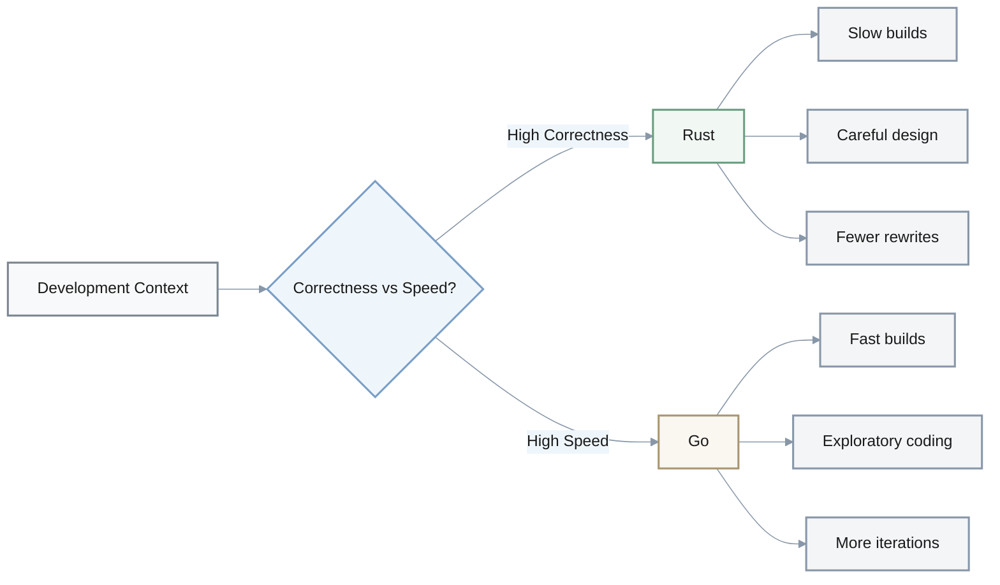

> **Key Insight**: Compilation time is a **forcing function for discipline**. Choose Rust when correctness > iteration speed (blockchain infrastructure). Choose Go when speed-to-market > runtime performance (prototyping, APIs).

---

## 5. Solana Account Model vs Ethereum: Stateless Programs vs Fat Contracts

**Q:** Solana's account model separates code (programs) from state (account data), unlike Ethereum where contracts own their storage. How does this architectural choice change how you think about smart contract composability and upgradability?

**A:** **Engineer A:** I'm coming from Ethereum. Solana's account model feels... backwards?

**Engineer B:** How so?

**A:** Ethereum bundles logic and state—"fat contracts." You call a contract, it mutates its own storage. Simple.

**B:** Mm-hmm. Solana separates them—"stateless programs." You pass accounts explicitly.

**A:** More verbose. Why?

**B:** Good question. Enables parallel execution. Explicit account passing means static analysis can determine which transactions conflict.

**A:** Oh! Interesting.

### Ethereum vs Solana Architecture Comparison

| Aspect | Ethereum | Solana |
|--------|----------|--------|
| **Model** | Fat contracts | Stateless programs |
| **Code & State** | Bundled together | Separated |
| **Storage** | Contract owns state | Accounts own themselves |
| **Transaction** | Call contract | Pass accounts explicitly |
| **Verbosity** | Implicit, concise | Explicit, verbose |
| **Parallelization** | Difficult | Easier (static analysis) |

### Upgradability Implications

**What about upgradability?**

**A:** Okay, that's interesting. How does this affect upgrades?

**B:** Solana programs can be upgraded without migrating state. Just replace the program bytecode; accounts remain unchanged.

**A:** Ethereum often requires proxy patterns or state migration.

**B:** Right. Changes "deploy and forget" to "deploy and maintain."

**A:** Is that better?

**B:** Hmm... depends. More flexibility, but also more ongoing responsibility.

**A:** I see.

| Aspect | Ethereum | Solana |
|--------|----------|--------|
| **Upgrade Process** | Proxy patterns or migration | Replace program bytecode |
| **State Migration** | Often required | Not required |
| **Philosophy** | Deploy and forget | Deploy and maintain |
| **Flexibility** | Lower | Higher |
| **Responsibility** | One-time | Ongoing |

### Composability Trade-offs

**Composability trade-offs:**

**A:** What about composability? Ethereum makes that easy.

**B:** True. Ethereum has implicit state access—easy composition but tight coupling. Solana requires explicit accounts—verbose but clear dependencies.

**A:** And that verbosity can hit limits?

**B:** Yeah. Transaction size limits—32 accounts max in simple cases. Composing programs requires passing all relevant accounts transitively.

**A:** Got it. So what's the deeper pattern here?

**B:** Ownership models. Ethereum contracts "own" state. Solana accounts "own" themselves—users or programs mutate via permissions.

**A:** Oh! Like OS design?

**B:** Exactly. Ethereum is monolithic kernel—integrated. Solana is microkernel—separated.

**A:** Makes sense. Each has pros and cons for security, performance, complexity.

```mermaid
%%{init: {
  "theme": "base",
  "themeVariables": {
    "primaryColor": "#f8f9fa",
    "primaryTextColor": "#1a1a1a",
    "primaryBorderColor": "#7a8591",
    "lineColor": "#8897a8",
    "secondaryColor": "#eff6fb",
    "tertiaryColor": "#f3f5f7"
  }
}}%%
graph TD
    A["Smart Contract Architecture"] --> B["Ethereum: Monolithic"]
    A --> C["Solana: Microkernel"]
    
    B --> B1["Logic and State Bundled"]
    B --> B2["Implicit State Access"]
    B --> B3["Easy Composition"]
    B --> B4["Tight Coupling"]
    
    C --> C1["Logic and State Separated"]
    C --> C2["Explicit Account Passing"]
    C --> C3["Verbose but Clear"]
    C --> C4["Parallel Execution"]
    
    style A fill:#f8f9fa,stroke:#7a8591,stroke-width:2px,color:#1a1a1a
    style B fill:#eff6fb,stroke:#7a9fc5,stroke-width:2px,color:#1a1a1a
    style C fill:#f1f8f4,stroke:#6b9d7f,stroke-width:2px,color:#1a1a1a
    style B1 fill:#f3f5f7,stroke:#8897a8,stroke-width:2px,color:#1a1a1a
    style B2 fill:#f3f5f7,stroke:#8897a8,stroke-width:2px,color:#1a1a1a
    style B3 fill:#f3f5f7,stroke:#8897a8,stroke-width:2px,color:#1a1a1a
    style B4 fill:#f3f5f7,stroke:#8897a8,stroke-width:2px,color:#1a1a1a
    style C1 fill:#f3f5f7,stroke:#8897a8,stroke-width:2px,color:#1a1a1a
    style C2 fill:#f3f5f7,stroke:#8897a8,stroke-width:2px,color:#1a1a1a
    style C3 fill:#f3f5f7,stroke:#8897a8,stroke-width:2px,color:#1a1a1a
    style C4 fill:#f3f5f7,stroke:#8897a8,stroke-width:2px,color:#1a1a1a
```

> **Key Insight**: Ethereum = monolithic kernel (contracts own state, easy composition). Solana = microkernel (accounts own themselves, explicit dependencies enable parallelization). Each trades off simplicity for different benefits.

---

## 6. Cross-Chain Bridges: Reconciling Security Ideals with Practical Necessity

**Q:** Cross-chain bridges have suffered $2B+ in hacks, yet remain essential infrastructure. This "necessary evil" dynamic challenges pure security thinking. How do you reconcile building something you know has systemic vulnerabilities?

**A:** **Architect:** We need to talk about bridges. $2B+ lost to hacks. How do we justify building these?

**Dev Lead:** That's the ethical tension. As engineers, we want "secure or don't build."

**Product:** But bridges enable real economic value—cross-chain liquidity, user migration. Total avoidance strands users on single chains.

**Architect:** Right.

### Four Strategies to Reconcile the Tension

**How do we reconcile this?**

**Architect:** Let me think... [pause] Four strategies. First, risk transparency. Don't market as "fully secure." Educate users on validator set trust assumptions.

**Dev Lead:** So honest communication?

**Architect:** Exactly. Second, defense in depth. Combine multisig, optimistic fraud proofs, insurance funds. Reduce single-point failure probability.

**Product:** Makes sense. What about limiting exposure?

**Architect:** That's third—graduated exposure. Cap bridge size at $100M to bound blast radius. Implement circuit breakers.

**Dev Lead:** Got it. And fourth?

**Architect:** Progressive decentralization. Launch with multisig training wheels, gradually move to light client verification as tech matures.

**Product:** I see.

| Strategy | Description | Example Implementation |
|----------|-------------|----------------------|
| **Risk Transparency** | Honest communication about trust assumptions | Document validator set, educate users |
| **Defense in Depth** | Multiple security layers | Multisig + fraud proofs + insurance |
| **Graduated Exposure** | Limit blast radius | Cap at $100M, circuit breakers |
| **Progressive Decentralization** | Gradual security improvements | Launch multisig → light client verification |

### Risk-Benefit Analysis Framework

**Thinking about risk-benefit analysis:**

**Product:** So security isn't binary?

**Architect:** Right. It's risk-benefit analysis. A bridge with 99.9% security enabling $10B value may be net positive.

**Dev Lead:** Versus 100% security—which is impossible—and $0 value—which doesn't exist.

**Architect:** Exactly. Users informed, we've done due diligence, alternative is worse—centralized solutions.

**Product:** Personal values check?

**Dev Lead:** If you can't accept shipping imperfect security under those conditions, stay in pure infrastructure—clients, consensus. Not bridges.

**Architect:** That's a valid choice. Know yourself.

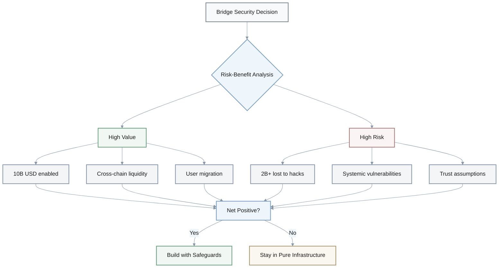

> **Key Insight**: Security isn't binary. **99.9% security + $10B value** may be net positive vs impossible 100% security. Use risk transparency, defense in depth, graduated exposure, and progressive decentralization. Know your values—bridges aren't for pure security purists.

---

## 7. PoW to PoS: Physical Resources vs Economic Stake

**Q:** The shift from PoW (Ethereum pre-merge) to PoS fundamentally changed how you secure a blockchain—from computational cost to economic stake. How does this reframe your understanding of "security" in distributed systems?

**A:** **Dev A:** Pre-merge, Ethereum security was about making attacks expensive through energy and hardware.

**Dev B:** Right. Physical resources as barrier. 51% attack requires massive capital expenditure on ASICs and electricity.

**A:** Post-merge, it's economic. 51% attack forfeits billions in staked ETH through slashing.

**B:** Financial resources as barrier.

**A:** Exactly.

### PoW vs PoS Security Comparison

| Aspect | PoW (Pre-merge) | PoS (Post-merge) |
|--------|----------------|------------------|
| **Barrier Type** | Physical resources | Economic stake |
| **Attack Cost** | ASIC hardware + electricity | Staked ETH (billions) |
| **Attack Penalty** | Wasted energy | Slashed stake |
| **Energy Usage** | High (external waste) | Low (99% reduction) |
| **Capital Location** | External (electric companies) | Internal (validators) |
| **Centralization Vector** | Mining pool concentration | Liquid staking (Lido) |

### Three Key Differences

**What are the key differences?**

**A:** Let's break this down. First difference: nothing-at-stake problem.

**B:** What's that?

**A:** PoW miners have physical costs running hardware on the wrong fork. PoS validators can costlessly validate multiple forks.

**B:** Hmm... so how does PoS handle that?

**A:** Protocol-level slashing conditions. You get penalized for signing conflicting blocks.

**B:** Oh! I see. Second difference?

**A:** Capital efficiency. PoW wastes energy externally—you're paying electric companies. PoS locks capital internally—you're paying validators.

**B:** Same security, 99% less energy.

**A:** Right. Third: centralization vectors differ.

**B:** How?

**A:** PoW leads to mining pool concentration. PoS leads to liquid staking derivatives like Lido.

**B:** Got it. Different problems, but both exist.

- **Nothing-at-stake**: PoW has physical costs per fork; PoS needs protocol slashing
- **Capital efficiency**: PoW wastes energy externally; PoS locks capital internally
- **Centralization vectors**: PoW → mining pools; PoS → liquid staking

### The Deeper Insight: Security is Mechanism-Dependent

**What's the deeper insight?**

**A:** "Security" is mechanism-dependent. BFT needs 2/3 honest participants. Nakamoto consensus needs 51% hashpower. PoS needs 51%+ stake.

**B:** So which do you trust more? Economic incentives or physical constraints?

**A:** That's the question. PoS assumes rational actors. PoW assumes majority computing power aligned.

**B:** Neither is "more true"—just different trust bases.

**A:** Exactly. Recognize the assumptions, don't claim one is objectively better.

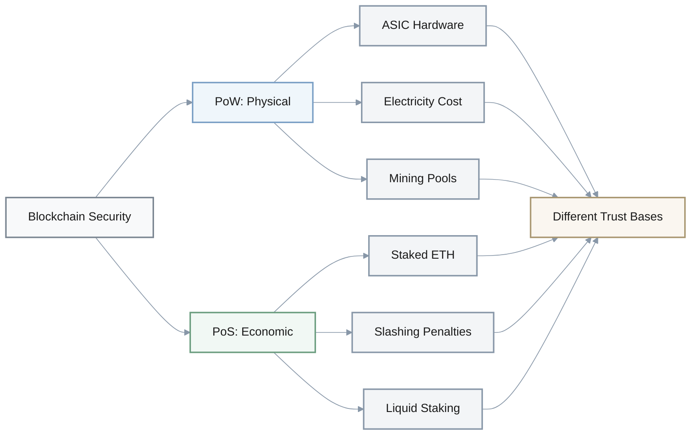

> **Key Insight**: Security is mechanism-dependent. **PoW** = physical constraints (energy, hardware). **PoS** = economic incentives (slashing, rational actors). Neither is objectively better—just different trust assumptions. Recognize your assumptions.

---

## 8. Tracing vs Printf Debugging: From Temporary Prints to Instrumentation as Code

**Q:** You've been debugging by adding `println!()` statements, then discovered Rust's `tracing` crate with structured logging, spans, and context propagation. How does this tool change your mental model of observability from "printf debugging" to "instrumentation as code"?

**A:** **Dev A:** I've been using `println!()` for debugging. Add prints, find bug, remove prints.

**Dev B:** Mm-hmm. That's reactive and temporary. Have you tried `tracing`?

**A:** What's different?

**B:** Observability becomes first-class. You instrument during development, retain in production.

**A:** So it's permanent?

**B:** Right.

### Printf vs Tracing Comparison

| Aspect | `println!()` | `tracing` |
|--------|-------------|-----------|
| **Nature** | Temporary, reactive | Permanent, proactive |
| **Data Format** | Unstructured strings | Structured, queryable data |
| **Context** | None | Hierarchical spans |
| **Lifecycle** | Add, debug, remove | Instrument once, keep forever |
| **Production Use** | Removed | Retained |
| **Querying** | String parsing (nightmare) | Direct queries (trivial) |

### How Tracing Works

**Let me show you:**

**B:** Instead of `println!("User {}, amount {}", id, amt)`, you do `tracing::info!(user_id = %id, amount = %amt)`.

**A:** Looks similar?

**B:** But it's structured data, not strings. You can query logs—find all transactions for user X. Can't do that with string parsing.

**A:** Oh! Logs become data source, not text dump.

**B:** Exactly. And spans give you context. Wrap transaction processing in a span, all logs inside inherit that context.

**A:** Like hierarchical context?

**B:** Right. And it propagates across async tasks, even microservices via OpenTelemetry.

**A:** Got it.

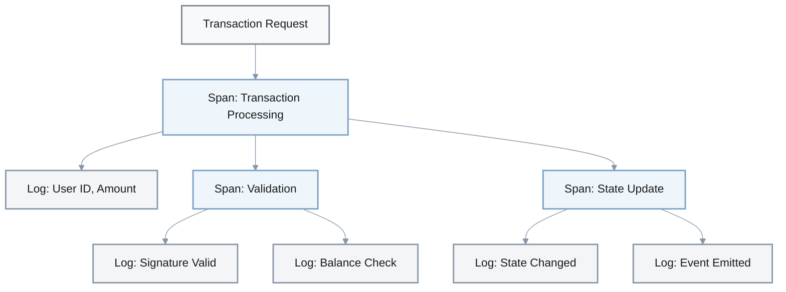

### Practical Impact on Development

**Practical impact:**

**A:** How does this change how I code?

**B:** Design for observability upfront. Add spans around critical sections—transaction processing, RPC handlers—from day one.

**A:** Isn't that extra work?

**B:** Hmm... [pause] 10-15% more initial dev time. But eliminates 50-80% of debugging time later.

**A:** That's worth it.

**B:** For blockchain, tracing a transaction from mempool to state update requires correlating events across modules. `tracing` spans make this trivial. Raw logs make it a nightmare.

**A:** Makes sense.

### Cost-Benefit Analysis

$$
\text{Net Time Saved} = (0.50 \text{ to } 0.80) \times \text{Debugging Time} - 0.15 \times \text{Dev Time}
$$

For typical projects where debugging time ≥ 30% of development time:

$$
\text{Net Savings} \geq 0.50 \times 0.30 - 0.15 = 0.15 - 0.15 = 0\text{ (break-even)}
$$

With 50-80% debugging reduction, net savings = **15-25% total project time**.

### Mental Model Shift

**Mental model shift:**

**A:** So my logs should be optimized for machines, not my eyes?

**B:** Both. Structured, queryable data that you view through good UI tools—Jaeger, Grafana.

**A:** Machine-optimized with good UI beats human-optimized text files.

**B:** In production systems, absolutely.

> **Key Insight**: **Printf debugging** = reactive, temporary, unstructured. **Tracing** = proactive, permanent, structured. **+15% dev time → -50-80% debugging time** = 15-25% net time savings. Instrument once, benefit forever.

---

## 9. MiCA Regulation: Protection vs Innovation Trade-off

**Q:** MiCA regulation in the EU requires stablecoin issuers to be licensed, hold capital reserves, and submit to supervisory oversight. Some argue this "protects users," others say it "kills innovation." How do you reconcile these opposing views in your own framework for evaluating regulation?

**A:** **PM:** MiCA regulation just passed. Stablecoin issuers need licensing, capital reserves, oversight.

**Dev A:** That kills innovation. Compliance costs $1M-5M+. Startups can't afford that.

**Dev B:** But it protects users. Remember Terra? Algorithmic stablecoins collapsed. People lost savings.

**PM:** Right. Tension between both.

### Both Perspectives Have Merit

**Let's look at both perspectives:**

**PM:** What's the protection argument?

**Dev B:** Data shows unregulated algorithmic stablecoins have 10-15% failure rate. Regulated products like USDC? 0% failures.

**Dev A:** Wait. That's cherry-picking. USDC isn't algorithmic.

**Dev B:** Fair point. But transparent reserves, regular audits, emergency procedures prevent collapses.

**PM:** I see. And the innovation argument?

**Dev A:** High barriers to entry favor incumbents—Circle, Tether. Experimental models don't fit regulatory categories, killing research.

**Dev B:** True. Innovation happens at edges, not regulated centers.

| Perspective | Key Argument | Evidence | Trade-off |
|-------------|-------------|----------|-----------|
| **Protection** | Prevent user losses | 10-15% failure rate (unregulated) | Restricts experimentation |
| **Innovation** | Enable research | Experimental models blocked | Higher user risk |

### Reconciliation Framework

**Can we reconcile these?**

**PM:** So both have valid points. How do we reconcile?

**Dev A:** Hmm... [pause] Risk-proportional regulation. Low-risk products—fully-backed, audited—get fast-track approval.

**Dev B:** High-risk products like algorithmic stablecoins?

**Dev A:** Sandbox or higher capital requirements.

**PM:** Got it. What about scale?

**Dev B:** Tiered licensing. Small issuers under $10M supply get light requirements. Large issuers over $100M face full oversight.

**Dev A:** Protects users at scale without blocking experiments.

**PM:** Makes sense. And adaptation?

**Dev B:** Sunset clauses. Regulations include 2-year review periods to adapt as tech evolves.

**PM:** Smart approach.

### Three-Part Reconciliation Strategy

- **Risk-proportional regulation**: Low-risk (fully-backed) = fast-track; High-risk (algorithmic) = sandbox/higher capital
- **Tiered licensing by scale**: <$10M = light requirements; >$100M = full oversight
- **Sunset clauses**: 2-year review periods to adapt to tech evolution

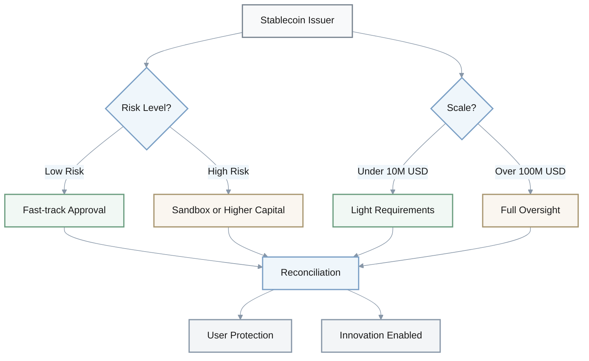

### Personal Values Matter

**Personal values matter:**

**Dev A:** Ultimately, this comes down to values. Do you prioritize user protection or permissionless experimentation?

**Dev B:** There's no "correct" answer.

**PM:** Right. Blockchain ethos leans toward experimentation. Traditional finance leans toward protection.

**Dev A:** Recognize your biases. Engage with the opposing view genuinely.

> **Key Insight**: No "correct" answer—values matter. **Reconciliation**: Risk-proportional regulation + tiered licensing by scale + sunset clauses. Blockchain ethos = experimentation; TradFi = protection. Recognize your biases.

---

## 10. Exactly-Once Delivery: Theory vs Practice in Distributed Systems

**Q:** The source materials emphasize "exactly-once delivery guarantees" for transaction processing, but distributed systems theory proves this is impossible (at-most-once or at-least-once are achievable). How do you resolve this apparent contradiction?

**A:** **Dev A:** The docs say we guarantee "exactly-once delivery" for transactions.

**Dev B:** That's... not possible. CAP theorem, FLP impossibility.

**A:** Wait, what?

### The Theoretical Impossibility

**Let's clarify the theory:**

**B:** Distributed systems theory proves exactly-once delivery is impossible. Requires perfect synchrony—no latency, no failures.

**A:** But blockchains clearly prevent duplicate transactions?

**B:** Right. They achieve exactly-once processing, not delivery.

**A:** What's the difference?

**B:** Good question. At-least-once delivery plus idempotency equals appears-exactly-once.

**A:** Hmm... can you explain that?

| Concept | Definition | Achievable? |
|---------|-----------|-------------|
| **Exactly-once delivery** | Message arrives exactly once | ❌ Impossible (requires perfect synchrony) |
| **Exactly-once processing** | Side effects occur exactly once | ✅ Achievable (at-least-once + idempotency) |
| **At-most-once** | Message arrives 0 or 1 times | ✅ Achievable |
| **At-least-once** | Message arrives 1+ times | ✅ Achievable |

### How Blockchain Systems Work

**How does this actually work?**

**B:** Message may arrive twice, but side effects occur once. Transaction ID uniquely identifies the operation. Replays are ignored if already processed.

**A:** Oh! So Ethereum's nonces prevent replay?

**B:** Exactly. Solana uses sequence numbers. Same concept.

**A:** So even if a node crashes and retries submission, duplicate transactions get rejected?

**B:** Right. User experiences exactly-once—balance changes once—even though system does at-least-once plus deduplication.

**A:** Got it.

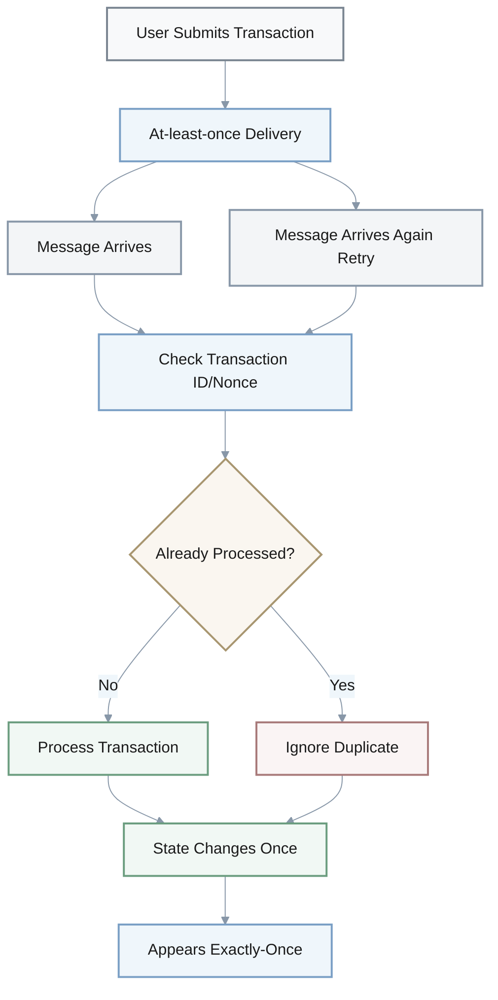

### Precision in Language Matters

**Precision in language matters:**

**A:** So when engineers say "exactly-once," they're being imprecise?

**B:** Yeah. They mean "exactly-once processing" not "exactly-once delivery."

**A:** That's an important distinction.

**B:** In interviews and design docs, clarify: delivery versus processing.

**A:** Makes sense. And in failure mode analysis?

**B:** Always ask: "What happens if this operation is retried?" If the answer is "duplicate state change," you need idempotency, not just reliability.

**A:** Right. Distributed systems are full of "impossible but practically achievable" concepts.

**B:** Exactly. Understand both the theory—what can't be done—and engineering workarounds—how to approximate it.

### The Formula

$$
\text{At-least-once delivery} + \text{Idempotency} = \text{Appears exactly-once processing}
$$

> **Key Insight**: **Exactly-once delivery** is theoretically impossible. Blockchains achieve **exactly-once processing** via at-least-once delivery + idempotency (nonces/sequence numbers). Precision matters: delivery ≠ processing.

---

## 11. Optimization Timing: "Premature is Evil" vs "Gas Matters Day One"

**Q:** Many developers advocate for "optimizing later" (premature optimization is evil), yet blockchain engineers spend significant time on gas/compute optimization from day one. How do you reconcile these seemingly contradictory principles?

**A:** **Dev A:** I keep hearing "premature optimization is evil." But in blockchain, we're optimizing gas from day one.

**Dev B:** Right. Context matters. Knuth's warning applies to typical software where developer time exceeds compute cost.

**A:** And blockchain inverts that?

**B:** Exactly. Gas costs users directly—every operation is billed. Optimization isn't premature; it's a core product requirement.

### When to Optimize What

**What should we optimize?**

**A:** So optimize everything?

**B:** No. Optimize architecture, not micro-optimizations. Choosing O(n) versus O(n²) isn't premature. Hand-tuning assembly is.

**A:** Got it. Gas-aware design patterns?

**B:** Right. Storage slot packing, batch operations—those are architectural decisions, not premature.

**A:** But we should still measure first?

**B:** Always. Profile before claiming something is "too slow." 90% of gas may be in 10% of code—optimize hot paths, not the entire codebase.

**A:** Makes sense.

| Optimization Type | Blockchain | Traditional Software |
|-------------------|-----------|---------------------|
| **Architectural** | Day one (O(n) vs O(n²)) | Day one (still matters) |
| **Gas-aware patterns** | Day one (storage packing) | N/A |
| **Micro-optimizations** | After profiling (assembly) | Later (rarely needed) |
| **Hot path optimization** | After profiling (90% in 10%) | After profiling |

### Cost-Benefit Analysis

**Cost-benefit thinking:**

**A:** When is optimization worth it?

**B:** Hmm... [pause] If optimization saves 20% gas but doubles development time, analyze the trade-off.

**A:** High-frequency contracts?

**B:** DEX swaps, 1M+ transactions per day—20% savings equals $50k per year. Worth it.

**A:** Low-frequency?

**B:** Governance contracts, 10 transactions per day—20% savings equals $50 per year. Not worth doubling dev time.

**A:** Clear trade-off.

| Contract Type | Frequency | 20% Gas Savings | Worth Doubling Dev Time? |
|---------------|-----------|----------------|-------------------------|
| **DEX Swaps** | 1M+ tx/day | $50k/year | ✅ Yes |
| **Governance** | 10 tx/day | $50/year | ❌ No |

### Broader Principle: Optimize Intentionally

**Broader principle:**

**A:** So "optimize later" is too simplistic?

**B:** Replace it with "optimize intentionally." Domain dictates strategy.

**A:** Blockchain?

**B:** Optimize early for gas—users pay directly.

**A:** Microservices?

**B:** Optimize later for latency—only if SLA is violated. Developer time exceeds compute cost.

**A:** What are the constraints of your system?

**B:** Exactly. Time-sensitive? Resource-limited? User-paid? Cost-free? Adjust optimization timing accordingly.

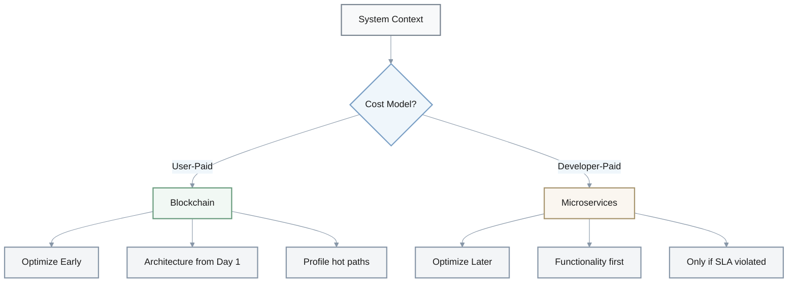

> **Key Insight**: "Optimize later" is too simplistic. **Replace with "optimize intentionally"**. User-paid costs (blockchain gas) = optimize early. Developer-paid costs (microservices) = optimize later. Domain dictates strategy.

---

## 12. Layered Architecture: Monolithic vs Modular Blockchain Design

**Q:** The materials describe multiple blockchain "layers" (L1, L2, L3) and modular vs monolithic architectures. How does this layered thinking change your approach to system design compared to traditional monolithic application architectures?

**A:** **Engineer A:** Traditional apps bundle everything—database, business logic, API. One deployable unit.

**Engineer B:** Right. Blockchain is different. L1 for settlement and consensus, L2 for execution and scaling, L3 for applications.

**A:** Why separate them?

**B:** Each layer optimizes different trade-offs. L1 prioritizes security, L2 prioritizes throughput, L3 prioritizes customization.

**A:** Oh! Independent innovation per layer?

**B:** Exactly.

### Layer Separation and Optimization

| Layer | Purpose | Priority | Example |
|-------|---------|----------|---------|
| **L1** | Settlement & Consensus | Security | Ethereum, Bitcoin |
| **L2** | Execution & Scaling | Throughput | Optimism, Arbitrum |
| **L3** | Applications | Customization | dApps, specialized chains |

### Design Approach Changes

**How does this change design?**

**A:** So how do I design differently?

**B:** Good question. Think composability over integration. Don't build an "all-in-one DEX."

**A:** Instead?

**B:** Build orderbook on L2, settlement on L1, leverage existing price oracles on L3. Each layer best-in-class.

**A:** Interesting. What about trust?

**B:** Trust boundaries become explicit. Monoliths have implicit trust—all code is "ours." Layered systems document assumptions at boundaries.

**A:** Like "this L2 trusts L1's finality"?

**B:** Right. L1 trusts consensus 2/3 majority. Make it explicit.

**A:** Got it.

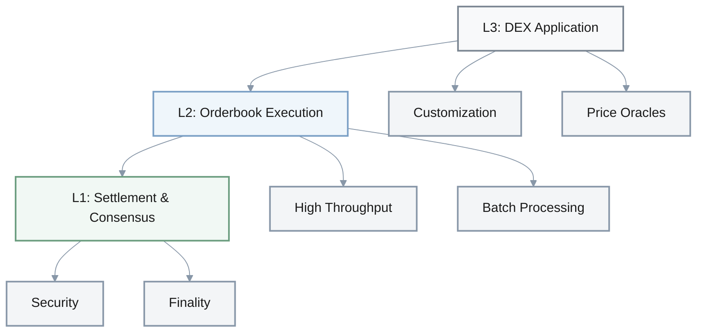

### Trade-offs: Layered vs Monolithic

**Trade-offs recognized:**

**A:** Layering sounds complex.

**B:** It is. Cross-layer communication, data availability challenges. Plus latency—L2 to L1 finalization takes minutes to hours.

**A:** Monoliths are simpler?

**B:** Simpler to reason about, deploy, debug. But if one part crashes, entire service goes down.

**A:** Layers provide failure isolation?

**B:** Exactly. If L2 crashes, L1 continues.

| Aspect | Monolithic | Layered |
|--------|-----------|---------|
| **Complexity** | Simple to reason about | Complex cross-layer communication |
| **Deployment** | Single unit | Multiple components |
| **Debugging** | Easier | Harder (distributed) |
| **Failure Mode** | Total crash | Isolated failures |
| **Latency** | Low | Higher (L2→L1: minutes-hours) |
| **Innovation** | Coupled | Independent per layer |
| **Optimization** | Single target | Multiple trade-offs |

### When to Choose Each

**When to layer?**

**A:** So when do I choose layered architecture?

**B:** Hmm... [pause] High-scale systems with diverse requirements—security plus speed plus customization.

**A:** When stay monolithic?

**B:** Prototypes, internal tools, or when coordination overhead exceeds benefits.

**A:** This mirrors microservices versus monoliths debate.

**B:** Exactly. Not "which is better" but "which fits your context."

**A:** Start monolithic, migrate to layered as complexity justifies?

**B:** That's the pragmatic approach.

| Context | Architecture Choice | Rationale |
|---------|-------------------|-----------|
| **High-scale diverse requirements** | Layered | Security + speed + customization |
| **Prototypes** | Monolithic | Faster iteration |
| **Internal tools** | Monolithic | Lower complexity |
| **Early stage** | Monolithic | Migrate later as needed |
| **Production at scale** | Layered | Failure isolation, optimization |

> **Key Insight**: **Monolithic** = simple, fast iteration, single failure point. **Layered** = complex, independent optimization per layer, failure isolation. Not "which is better" but **"which fits your context"**. Start monolithic, migrate as complexity justifies (pragmatic approach).
