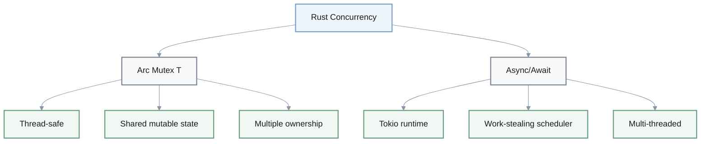
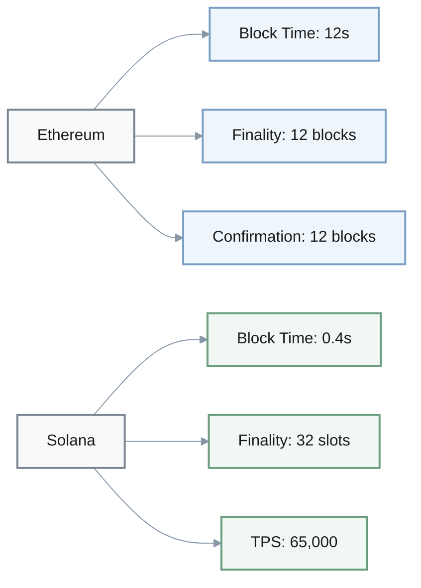
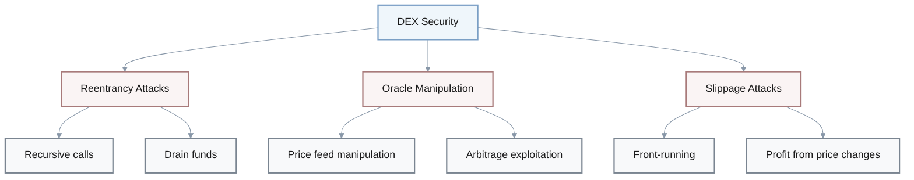
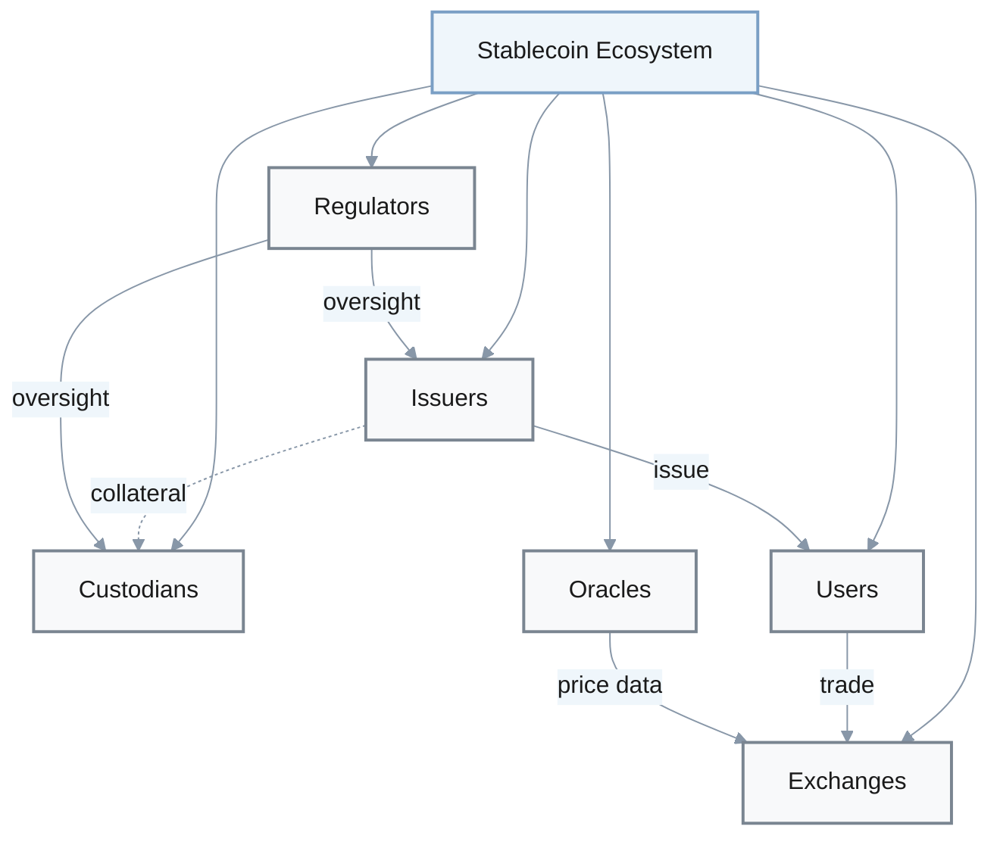
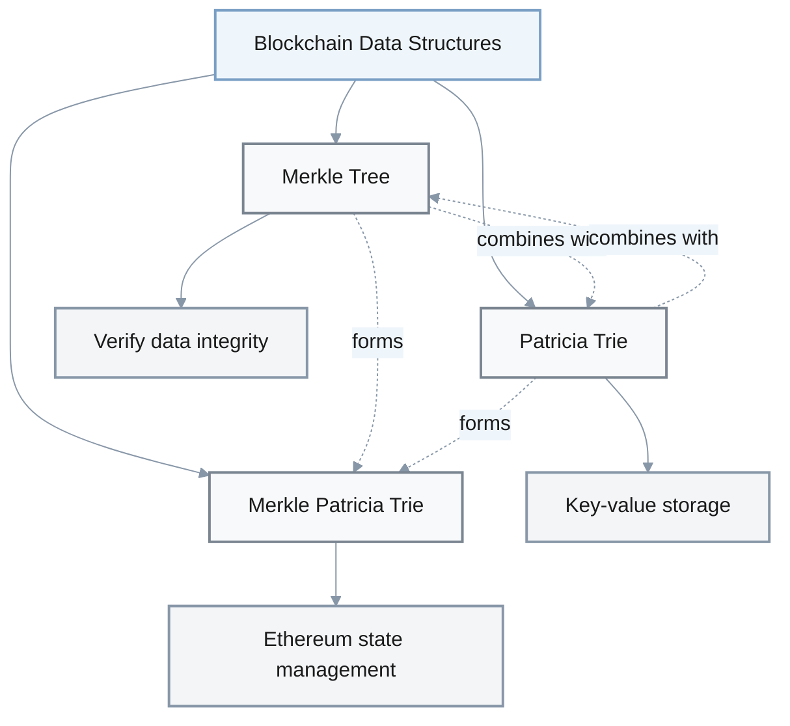
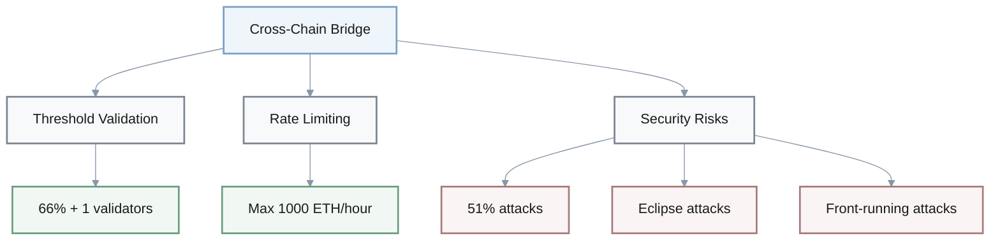

# Rust & Blockchain Engineering - Cloze Questions

## Rust Fundamentals

### Ownership System

1. Q: Rust's ownership system has three core rules: each value has ___ owner, only ___ owner at a time, and values are dropped when ___ go out of scope.
   A: **one; one; owners**

**Rust Pointer Types:**

| Type | Ownership | Description |
|------|-----------|-------------|
| `&T` | Shared | Immutable reference |
| `&mut T` | Exclusive | Mutable reference |
| `Box<T>` | Owned | Heap allocation |

2. Q: List the 3 Rust pointer types with their ownership characteristics: ___, ___, ___.
   A: `&T` (shared immutable reference), `&mut T` (exclusive mutable reference), `Box<T>` (owned heap allocation)

### Concurrency & Async

3. Q: In Rust, the `Arc<Mutex<T>>` pattern is used for ___.
   A: **thread-safe shared mutable state** (or multi-threaded shared state with interior mutability)

4. Q: Rust's `async/await` uses ___ runtime for multi-threaded work-stealing scheduling.
   A: **Tokio** (or async-std)

### Language Features

5. Q: In Rust, the `?` operator is used for ___.
   A: **error propagation** (or early return on error)

**Rust Naming Conventions:**

| Category | Convention | Example |
|----------|------------|---------|
| Types/Structs/Traits | UpperCamelCase | `HashMap`, `MyStruct` |
| Functions/Variables | snake_case | `calculate_sum`, `user_name` |
| Constants | SCREAMING_SNAKE_CASE | `MAX_SIZE`, `API_KEY` |

6. Q: List the 3 Rust naming conventions: type-level constructs use ___, functions/variables use ___, constants use ___.
   A: UpperCamelCase; snake_case; SCREAMING_SNAKE_CASE

### Performance & Tooling

7. Q: Rust profiling tools for blockchain optimization include ___, ___, and ___.
   A: **cargo flamegraph; perf; valgrind**

8. Q: Rust's ownership model reduces memory-related runtime bugs by ___-___%.
   A: **60-80%**

9. Q: Rust compile times for large codebases (>100k LOC) may reach ___-___ minutes.
   A: **2-5 minutes**

---

## Blockchain Platform Comparison

### Throughput & Timing

| Platform | Metric | Value |
|----------|--------|-------|
| Solana | TPS Capacity | 65,000 |
| Solana | Block Time | 0.4 seconds |
| Solana | Finality (slots) | 32 |
| Ethereum | Block Time | 12 seconds |
| Ethereum | Finality (blocks) | 12 |
| Ethereum | Confirmation Depth | 12 blocks |

1. Q: Solana's theoretical transaction throughput capacity is ___ TPS.
   A: **65,000**

2. Q: In Ethereum consensus, what is the finality requirement? Wait ___ blocks on Ethereum, ___ slots on Solana.
   A: **12; 32**

3. Q: Ethereum block time target is approximately ___ seconds.
   A: **12**

4. Q: Solana block time is approximately ___ seconds.
   A: **0.4**

5. Q: For blockchain event monitoring, the standard confirmation depth is ___ blocks on Ethereum.
   A: **12**

### Platform-Specific Features

**Ethereum:**

6. Q: Patricia Merkle Trie is used in Ethereum for ___ data management.
   A: **state**

7. Q: Ethereum's Fusaka hard-fork in 2025 increases data capacity by up to ___x.
   A: **20x**

8. Q: ERC-20 is a standard for ___ on Ethereum.
   A: **fungible tokens**

**Ethereum Consensus - Slashing Conditions:**

- **Double voting**: Same slot, different attestation data
- **Surround voting**: Source-target span violations
- **Attestation timing violations**: Late or incorrect attestations

9. Q: List the 3 slashing conditions in Ethereum consensus.
   A: double voting (same slot, different attestation data), surround voting (source-target span violations), attestation timing violations

**Solana:**

10. Q: In Solana's account model, programs are ___, and data is stored in ___.
    A: **stateless; separate accounts**

11. Q: The maximum account data size in Solana is ___ MB.
    A: **10 MB**

12. Q: Solana's proposed 2025 upgrade increases block capacity from ___ to ___ Compute Units.
    A: **60M; 100M**

13. Q: Solana's Sealevel runtime enables ___ transaction execution.
    A: **parallel**

---

## DeFi & DEX Concepts

### AMM Formula

**Constant Product Formula:**

$$
x \times y = k
$$

Where:
- `x` = Token A reserves
- `y` = Token B reserves  
- `k` = Constant (invariant)

1. Q: The AMM constant product formula is ___.
   A: **x * y = k**

### DEX Performance Metrics

| Metric | Target Value |
|--------|--------------|
| P99 Latency | < 100 ms |
| Target TPS | 50,000 |
| Slippage Protection | 95-99% of expected |
| Gas Cost Reduction (batching) | ~40% |

2. Q: For high-throughput DEX design, typical target P99 latency is under ___ ms at ___ TPS.
   A: **100; 50,000**

3. Q: Gas optimization best practice: batch storage operations can reduce gas costs by approximately ___%.
   A: **40%**

4. Q: Ideal DEX swap slippage protection parameter: reject if actual output is less than ___% of expected.
   A: **95-99%** (minimum amount out threshold)

**DEX Security Vulnerabilities:**

- **Reentrancy attacks**: Recursive calls draining funds
- **Oracle manipulation**: Price feed manipulation
- **Slippage attacks**: Front-running to profit from price changes

5. Q: List the 3 main DEX security vulnerabilities to protect against.
   A: reentrancy attacks, oracle manipulation, slippage attacks

### CEX vs DEX Comparison

| Metric | CEX | DEX |
|--------|-----|-----|
| Latency | 1-10 ms | 50-200 ms |
| Throughput | 100x higher | Baseline |

6. Q: In order matching engines, CEX latency is typically ___-___ ms vs DEX ___-___ ms.
   A: **1; 10; 50; 200**

7. Q: CEX throughput is approximately ___x higher than DEX throughput.
   A: **100x**

---

## Stablecoins & Compliance

### Stablecoin Ecosystem

**Core Parties (6):**

- **Issuers**: Create and manage stablecoins
- **Custodians**: Hold collateral assets
- **Users**: Transact with stablecoins
- **Exchanges**: Provide liquidity
- **Oracles**: Supply price data
- **Regulators**: Enforce compliance

1. Q: In a blockchain stablecoin ecosystem, list the 6 core parties.
   A: issuers, custodians, users, exchanges, oracles, regulators

**Stablecoin Revenue Models:**

- **Seigniorage**: Profit from issuance
- **Collateral yield**: Earnings from reserves
- **Transaction fees**: Per-transaction charges
- **DeFi integration fees**: Protocol integration revenue

2. Q: List the 4 main stablecoin revenue models.
   A: seigniorage, collateral yield, transaction fees, DeFi integration fees

3. Q: Algorithmic stablecoins rely on ___ to absorb price fluctuations.
   A: **a second, volatile governance token**

### Regulatory Compliance

4. Q: MiCA stands for ___.
   A: **Markets in Crypto-Assets Regulation**

5. Q: In KYC/AML compliance for stablecoins, banks globally spend significant amounts, with costs increasing operational overhead by approximately ___-___%.
   A: **15-30%**

---

## Cryptography & Security

### Cryptographic Primitives

1. Q: ECDSA stands for ___.
   A: **Elliptic Curve Digital Signature Algorithm**

2. Q: zk-SNARKs stands for ___.
   A: **Zero-Knowledge Succinct Non-Interactive Argument of Knowledge**

3. Q: Merkle tree is used to verify ___ of data.
   A: **integrity** (or completeness)

**Essential Blockchain Data Structures:**

- **Merkle tree**: Binary tree with cryptographic hashes
- **Patricia trie**: Radix tree for key-value storage
- **Merkle Patricia trie**: Hybrid combining both

4. Q: List the 3 blockchain data structures essential for integrity and efficiency.
   A: Merkle tree, Patricia trie, Merkle Patricia trie

### Cross-Chain Bridge Security

5. Q: In cross-chain bridge security, threshold signature validation typically requires ___% + 1 validators.
   A: **66% (or 2/3)**

**Cross-Chain Bridge Security Risks:**

- **51% attacks**: Majority control compromise
- **Eclipse attacks**: Network isolation
- **Front-running attacks**: Transaction ordering manipulation

6. Q: For cross-chain bridges, the primary security risks are ___, ___, and ___.
   A: 51% attacks, eclipse attacks, front-running attacks

7. Q: Rate limiting for cross-chain bridges typically caps transfers at ___ ETH equivalent per hour.
   A: **1000 ETH**

### Consensus Mechanisms

**Trade-offs:**

| Mechanism | Advantages | Disadvantages |
|-----------|-----------|---------------|
| PoW | Secure, battle-tested | Energy-intensive |
| PoS | Energy-efficient | Centralization risk |

8. Q: Consensus mechanism trade-off: PoW is ___ but ___, while PoS is ___ but may have ___.
   A: secure; energy-intensive; energy-efficient; centralization risk

---

## Performance Optimization

### Node Performance Targets

| Metric | Target | Unit |
|--------|--------|------|
| Cache Hit Ratio | > 85% | % |
| DB Read Latency (P95) | < 500 | μs |
| DB Read IOPS | < 8,000 | read/s |
| Consensus State Transition | < 50-100 | ms |
| HA Recovery Time | < 5 | seconds |

1. Q: For production blockchain nodes, cache hit ratio should be greater than ___%.
   A: **85%**

2. Q: Database read latency P95 target for healthy blockchain nodes is under ___ μs.
   A: **500 μs**

3. Q: For blockchain state storage, typical DB read IOPS target is under ___ read/s.
   A: **8,000**

4. Q: For validator performance, target consensus state transition processing time should be under ___ ms.
   A: **50-100 ms**

5. Q: For high-availability blockchain nodes, recovery time objective should be under ___ seconds after failure.
   A: **5 seconds**

### Memory & Cache Optimization

6. Q: For memory-efficient trie implementation, LRU cache hit ratio target is ___%.
   A: **90+%**

**Median Tracking Complexity:**

$$
\text{Insertion} = O(\log n), \quad \text{Median} = O(1)
$$

7. Q: The two-heap approach for median tracking has insertion time complexity of ___ and median calculation of ___.
   A: **O(log n); O(1)**

### System Architecture

8. Q: In Web3 indexer design, backpressure channel capacity should be ___x throughput.
   A: **2x**

9. Q: Transaction pool (mempool) eviction policy should prioritize transactions by ___.
   A: **fee** (or gas price)

10. Q: Event-driven smart contract platforms can reduce latency by ___-___x compared to transaction-driven models.
    A: **2.2-4.6x**
