# Rust 区块链高级工程师完形填空题库

## 目录

- [Rust 核心概念](#rust-核心概念)
- [跨链与多链架构](#跨链与多链架构)
- [性能优化与调优](#性能优化与调优)
- [系统监控与部署](#系统监控与部署)

---

## Rust 核心概念

### 1. 所有权模型

**Q:** Rust 的所有权模型有三个核心规则：每个值只能有一个 ___；同一时间只能有一个 ___；当所有者离开作用域时，值会被 ___。

**A:** 所有者；所有者（或所有权）；自动释放/被丢弃（drop）

### 2. 借用规则

**Q:** Rust 的借用规则允许同时存在多个 ___ 引用，或者一个 ___ 引用，但不能同时存在二者。这一规则在区块链交易处理时有助于防止 ___。

**A:** 不可变（`&T`）；可变（`&mut T`）；数据竞争/竞态条件

| 借用类型 | 数量限制 | 语法 | 用途 |
|---------|---------|------|------|
| **不可变借用** | 多个同时存在 | `&T` | 只读访问 |
| **可变借用** | 同一时间仅一个 | `&mut T` | 读写访问 |

---

## 跨链与多链架构

### 3. 跨链桥安全门限

**Q:** 在设计以太坊 ↔ Solana 跨链桥时，常见的安全门限是：验证者签名数量至少达到验证者总数的 ___ 加 ___，才能认为跨链消息有效。

**A:** 三分之二（2/3）；一（即 2/3+1 门限）

$$
\text{安全门限} = \left\lfloor \frac{2 \times \text{验证者总数}}{3} \right\rfloor + 1
$$

### 4. 链间性能差异

**Q:** 以太坊主网典型区块时间约为 ___ 秒，而 Solana 的 slot 时间约为 ___ 秒量级，这意味着跨链设计中需要考虑两条链之间的 ___ 差异。

**A:** 12；0.4（或亚秒级）；最终性/确认延迟

| 区块链 | 区块/Slot时间 | 最终性确认 | 性能特点 |
|--------|--------------|-----------|---------|
| **Ethereum** | ~12秒 | 2-3个epoch | 相对保守 |
| **Solana** | ~0.4秒 | <1秒 | 高吞吐量 |
| **延迟比** | 30倍 | - | 需同步策略 |

### 5. 多链钱包加密

**Q:** 在多链 Rust 钱包中，种子或私钥通常使用对称加密算法（如 ___-___-___）存储，并在使用后通过 `zeroize` 等手段清除内存，以降低被本地恶意软件或内存转储获取的风险。

**A:** AES-256-GCM

**加密方案要点:**
- **算法**: AES-256-GCM (Galois/Counter Mode)
- **密钥长度**: 256位
- **认证**: 提供数据完整性验证
- **内存安全**: 使用后通过 `zeroize` 清零

---

## 性能优化与调优

### 6. 批量转账优化

**Q:** 在优化批量转账合约时，从逐笔读写改为缓存后批量写入，通常可以把存储写操作的数量从约 ___ 次降到约 ___ 次（以 n 笔转账为例），从而显著降低 Gas 成本。

**A:** 2n；n+1

$$
\text{优化前存储操作} = 2n \quad \text{优化后存储操作} = n + 1
$$

$$
\text{Gas节省比例} = \frac{2n - (n + 1)}{2n} = \frac{n - 1}{2n} \approx 50\%
$$

| 优化方案 | 读操作 | 写操作 | 总操作 | Gas成本 |
|---------|-------|-------|--------|--------|
| **逐笔读写** | n | n | 2n | 高 |
| **批量写入** | n | 1 | n+1 | 低 |

### 7. 状态 Trie 缓存优化

**Q:** 针对以太坊状态 Trie 的性能调优中，一般认为健康的缓存命中率应高于 ___%，当命中率低于 ___% 且 DB 延迟升高时，应优先考虑扩大缓存和优化 DB，而不是压缩缓存。

**A:** 85；70

### 8. I/O 瓶颈判断

**Q:** 在 Trie/DB 性能分析中，判断系统是否被 I/O 限制时，一个常见的 Linux 指标是 `iostat` 中的 `%iowait`；当该值长期高于约 ___% 时，往往说明需要关注 ___ 而不仅仅是 CPU。

**A:** 20；磁盘/存储 I/O 性能（或数据库 I/O 瓶颈）

| 指标 | 阈值 | 状态 | 优化方向 |
|------|------|------|---------|
| `%iowait` | <10% | 正常 | 无需特别关注 |
| `%iowait` | 10%-20% | 警告 | 监控趋势 |
| `%iowait` | >20% | I/O瓶颈 | 优化存储性能 |

### 9. Keccak-256 基准测试

**Q:** 在对 Keccak-256 哈希实现进行基准测试时，如果吞吐量明显低于每秒 ___ MB，且 CPU 占用较高，通常需要检查是否启用了 ___ 级别的编译优化（如 `-C target-cpu=native`）。

**A:** 50；SIMD/硬件加速相关

**优化检查清单:**
- **目标吞吐量**: ≥50 MB/s
- **编译标志**: `-C target-cpu=native`
- **硬件特性**: SIMD指令集（AVX2/AVX512）
- **优化级别**: `--release` 模式

### 10. 区块链节点性能指标

**Q:** 对于高吞吐量 Rust 区块链节点，常见的性能指标包括：区块处理 p95 延迟、每秒交易数 TPS，以及用于追踪热路径的 ___ 图和 ___ 分析结果。

**A:** Flamegraph（火焰图）；CPU/内存 Profiling（性能剖析）

| 指标类型 | 具体指标 | 工具 | 用途 |
|---------|---------|------|------|
| **延迟** | p95/p99延迟 | metrics | 发现长尾问题 |
| **吞吐量** | TPS | benchmarks | 容量规划 |
| **热路径** | Flamegraph | perf/cargo-flamegraph | 优化CPU使用 |
| **内存** | Profiling | valgrind/heaptrack | 内存优化 |

### 11. 多线程并发模型

**Q:** 在 Rust 多线程节点设计中，为避免粗粒度全局锁带来的竞争和长尾延迟，一个常见替代方案是使用基于消息传递的 ___ 模型，让状态由单线程拥有，其他任务通过消息交互。

**A:** actor（参与者）/worker（工作线程）

### 12. 智能合约事件优化

**Q:** 针对批量交易处理的智能合约设计，如果把原来的「逐笔事件」改为「单个批量事件」，可以在保持审计能力的前提下降低 ___ 成本，并减少链上 ___ 的体积。

**A:** Gas；日志/事件数据

| 方案 | 事件数量 | Gas成本 | 链上数据 | 审计能力 |
|------|---------|---------|---------|---------|
| **逐笔事件** | n | 高 | 大 | 完整 |
| **批量事件** | 1 | 低 | 小 | 完整 |

---

## 系统监控与部署

### 13. DEX 关键指标

**Q:** 在生产环境监控 Rust DEX 时，常见的关键业务指标（SLI）包括：交易成功率、滑点分布以及池子的 ___ 深度（以 USD 计），这些指标超出阈值时往往意味着需要触发 ___ 或熔断逻辑。

**A:** 流动性；告警/保护

**DEX 监控指标:**
- **交易成功率**: 目标 >99.9%
- **滑点分布**: 监控 p50/p95/p99
- **流动性深度**: 以 USD 计量
- **响应策略**: 告警通知 + 熔断保护

### 14. 面试技术领域

**Q:** 用于评估高级 Rust 区块链工程师候选人的面试题库中，常见覆盖的技术领域包括：Rust 语言与并发、区块链共识与客户端实现、智能合约与安全、系统设计与性能调优，以及 ___ 与 ___ 等软技能。

**A:** 故障排查/调试；团队协作/沟通

### 15. 金丝雀发布

**Q:** 在生产部署策略中，常见的一种渐进式上线方式是「金丝雀发布（canary）」：先将约 ___% 的流量导向新版本，并在持续约 ___ 小时无严重告警后再逐步扩大流量。

**A:** 5；1（或「一」）

```mermaid
%%{init: {
  "theme": "base",
  "themeVariables": {
    "primaryColor": "#f8f9fa",
    "primaryTextColor": "#1a1a1a",
    "primaryBorderColor": "#7a8591",
    "lineColor": "#8897a8",
    "secondaryColor": "#eff6fb",
    "tertiaryColor": "#f3f5f7"
  }
}}%%
gantt
    title 金丝雀发布流程
    dateFormat HH:mm
    axisFormat %H:%M
    
    section 初始阶段
    5%流量到新版本     :a1, 00:00, 1h
    
    section 观察期
    监控告警           :a2, 01:00, 2h
    
    section 扩展阶段
    25%流量           :a3, 03:00, 1h
    50%流量           :a4, 04:00, 1h
    100%流量          :a5, 05:00, 1h
```

### 16. 性能故障排查

**Q:** 当一个 Rust 区块链节点在负载下出现 CPU 和内存使用飙高时，推荐的首要步骤是增加代码中的 ___（例如 tracing、metrics）和系统层面的 ___ 指标采集，而不是立即修改核心算法或随意增加线程数。

**A:** 观测/埋点；性能/资源（监控）

**故障排查优先级:**
1. **增加观测**: tracing、metrics 埋点
2. **收集指标**: CPU、内存、I/O 监控
3. **分析定位**: 识别瓶颈根因
4. **制定方案**: 针对性优化
5. ❌ **避免盲目**: 随意修改算法或增加线程
