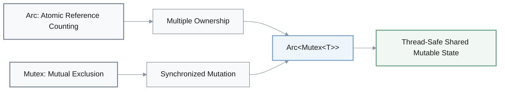
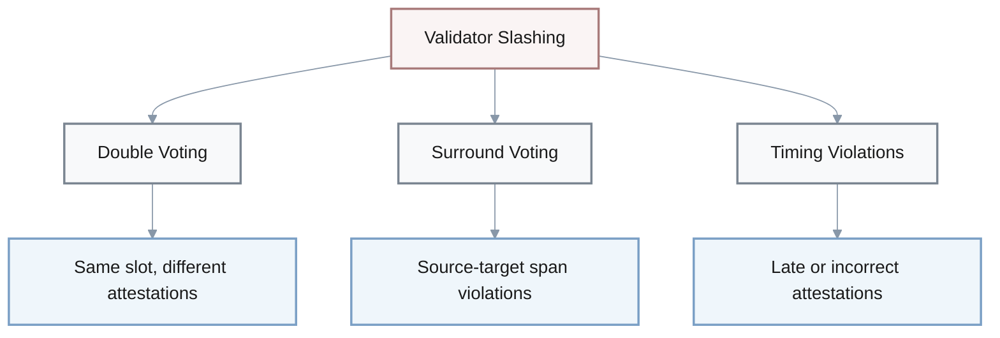
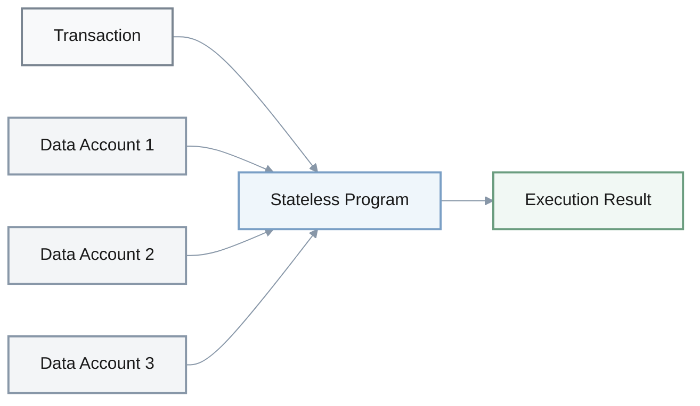
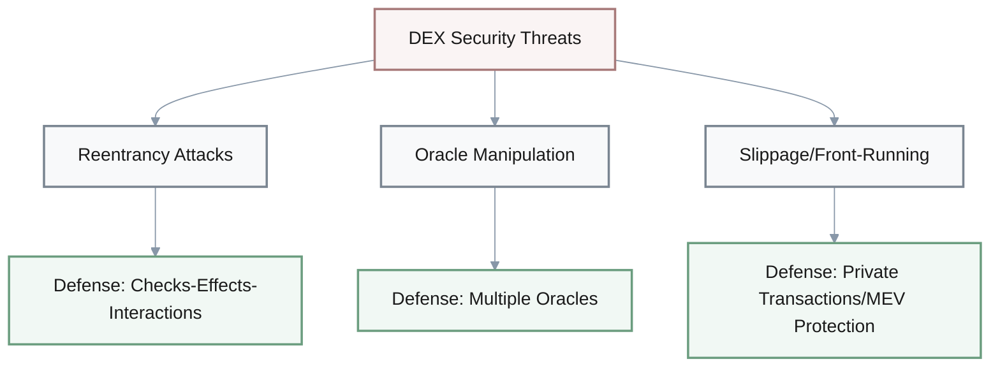
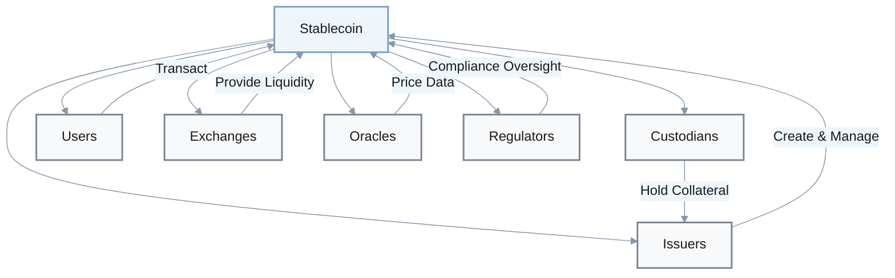
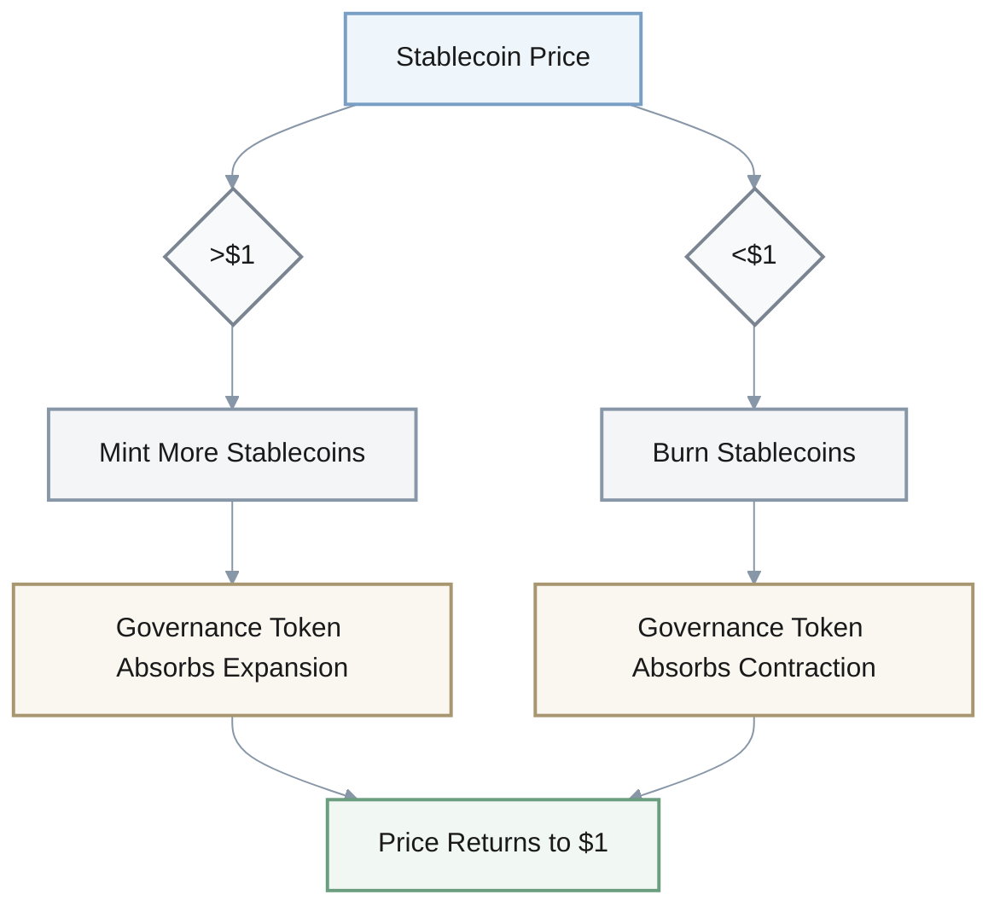
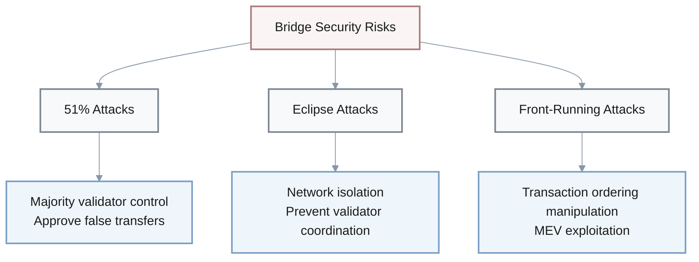
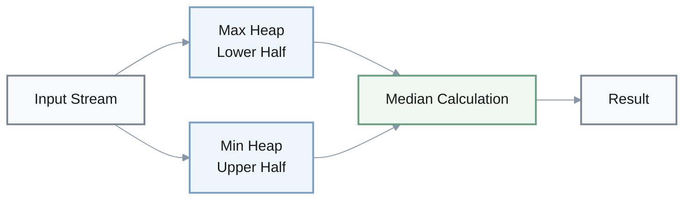
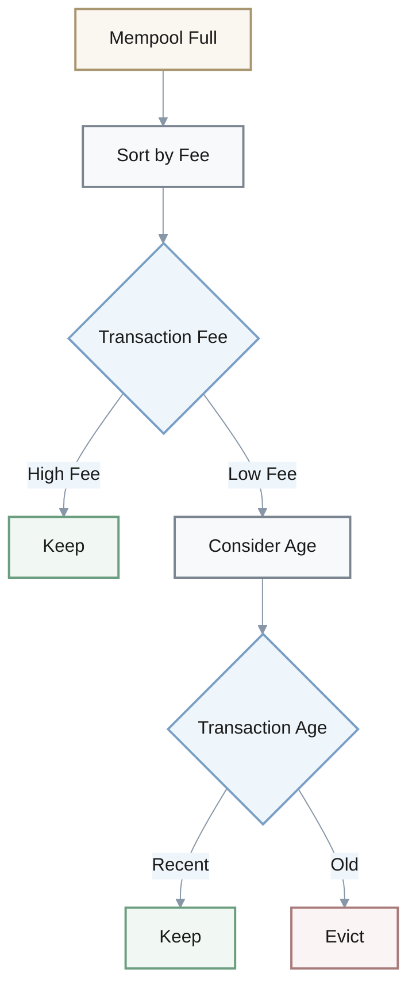

# Rust & Blockchain Engineering - Discussion Format

> **Document Structure**: This document presents technical Q&A in conversational format with visual enhancements including formulas, tables, and diagrams for improved comprehension.

## Table of Contents

| Section | Topics Covered |
|---------|----------------|
| **Rust Fundamentals** | Ownership, pointers, concurrency, async, naming, tooling |
| **Blockchain Platform Comparison** | Ethereum vs Solana, throughput, finality, slashing |
| **DeFi & DEX Concepts** | AMM formulas, performance metrics, security, CEX vs DEX |
| **Stablecoins & Compliance** | Ecosystem, revenue models, algorithmic stablecoins, regulations |
| **Cryptography & Security** | ECDSA, zk-SNARKs, Merkle trees, bridge security, consensus |
| **Performance Optimization** | Cache, latency, IOPS, median tracking, architecture |

---

## Rust Fundamentals

### Ownership System

1. Q: I'm trying to understand Rust's ownership system. What are the core rules?
   A: **Dev A:** Good question. Three main rules. First, each value has one owner.
   
   **Dev B:** And only one owner at a time, right?
   
   **A:** Exactly. No shared ownership by default.
   
   **Dev C:** What happens when the owner goes out of scope?
   
   **A:** Value gets dropped. Automatic cleanup.
   
   **B:** So it's like RAII in C++?
   
   **A:** Similar concept. Deterministic destruction.
   
   **C:** Ah, now I see the connection.

**Core Ownership Rules:**
- **Each value has exactly one owner** - No shared ownership by default
- **Only one owner at a time** - Ownership can be transferred (moved) but not duplicated
- **Value is dropped when owner goes out of scope** - Automatic memory management (deterministic destruction)

2. Q: We're reviewing Rust pointer types for the team. What are the main ones?
   A: **A:** Three types to know. First, `&T`—shared immutable reference.
   
   **B:** And `&mut T` for when you need to mutate?
   
   **A:** Right. Exclusive mutable reference.
   
   **C:** What about heap allocation?
   
   **A:** That's `Box<T>`. Owned heap allocation.
   
   **B:** So `&T` is shared, `&mut T` is exclusive, and `Box<T>` owns the data on the heap.
   
   **A:** Exactly. Those cover most use cases.
   
   **B:** Clear summary. Got it.

| Type | Access | Mutability | Ownership | Allocation |
|------|--------|-----------|-----------|------------|
| `&T` | Shared | Immutable | Borrowed | Stack/Heap |
| `&mut T` | Exclusive | Mutable | Borrowed | Stack/Heap |
| `Box<T>` | Exclusive | Mutable | Owned | Heap |

### Concurrency & Async

3. Q: For our multi-threaded blockchain indexer, how do we share mutable state safely in Rust?
   A: **Engineer A:** Hmm... `Arc<Mutex<T>>` pattern.
   
   **Engineer B:** Arc for reference counting?
   
   **A:** Yeah, atomic reference counting. Thread-safe.
   
   **B:** And Mutex for the actual mutation lock?
   
   **A:** Right. Interior mutability with synchronization.
   
   **C:** Wait, so Arc handles multiple ownership, Mutex handles the mutation?
   
   **A:** Exactly. Together they give you thread-safe shared mutable state.
   
   **C:** Oh! Got it now.

**Thread-Safe Shared Mutable State Pattern:**

4. Q: Which async runtime should we use for our Rust blockchain node?
   A: **A:** Tokio's the standard.
   
   **B:** What makes it good?
   
   **A:** Multi-threaded work-stealing scheduler. Efficient.
   
   **B:** Other options?
   
   **A:** async-std exists, but Tokio has better ecosystem support.
   
   **C:** And it works well with blockchain workloads?
   
   **A:** Yeah, most Rust blockchain projects use it. Battle-tested.
   
   **C:** Makes sense. Industry consensus then.

### Language Features

5. Q: I keep seeing this `?` operator in Rust code. What's it doing?
   A: **A:** Error propagation. Shorthand for early return.
   
   **B:** So instead of matching on Result...?
   
   **A:** Exactly. `?` returns the error if there is one, unwraps the value if not.
   
   **B:** Oh! Cleaner than nested match statements.
   
   **A:** Way cleaner. Especially in functions with multiple fallible calls.
   
   **B:** Makes sense now.

6. Q: We need to establish naming conventions for our Rust codebase. What's standard?
   A: **A:** Three patterns. Types, structs, traits use UpperCamelCase.
   
   **B:** Like `HashMap`, `MyStruct`?
   
   **A:** Right. Functions and variables use snake_case.
   
   **C:** So `calculate_sum`, `user_name`?
   
   **A:** Exactly. And constants use SCREAMING_SNAKE_CASE.
   
   **B:** `MAX_SIZE`, `API_KEY`. Got it.
   
   **A:** That's the Rust standard. Follow it.

| Element | Convention | Examples |
|---------|-----------|----------|
| Types, Structs, Traits | UpperCamelCase | `HashMap`, `MyStruct`, `Display` |
| Functions, Variables | snake_case | `calculate_sum`, `user_name` |
| Constants | SCREAMING_SNAKE_CASE | `MAX_SIZE`, `API_KEY` |
| Lifetimes | lowercase single letter | `'a`, `'static` |
| Type Parameters | Single uppercase letter | `T`, `K`, `V` |

### Performance & Tooling

7. Q: What profiling tools should we use for optimizing our blockchain code?
   A: **A:** Good question. Three main ones. cargo flamegraph for visualization.
   
   **B:** That's the flame graph generator?
   
   **A:** Yeah. Shows where time's spent. Then perf for detailed profiling.
   
   **C:** What about memory?
   
   **A:** valgrind. Catches leaks and memory issues.
   
   **B:** So flamegraph for overview, perf for details, valgrind for memory.
   
   **A:** That covers most optimization work.
   
   **B:** Makes sense. Clear breakdown.

**Rust Profiling Tools:**
- **`cargo flamegraph`**: Flame graph visualization, identifies hot paths
- **`perf`**: Detailed CPU profiling, performance counters
- **`valgrind`**: Memory profiling, leak detection, memory errors

8. Q: How much do Rust's safety guarantees actually help in practice?
   A: **A:** Reduces memory bugs by 60 to 80%.
   
   **B:** That's significant.
   
   **A:** Huge. No null pointer derefs, no use-after-free.
   
   **B:** But only at runtime?
   
   **A:** No, compile time. Catches it before it runs.
   
   **C:** Oh! That's why compile times are longer though.
   
   **A:** Trade-off. Slower compilation, safer runtime.
   
   **C:** Worth it for production systems.

9. Q: Speaking of compile times, what should we expect for our large codebase?
   A: **A:** How many lines?
   
   **B:** Over 100k.
   
   **A:** Hmm... Probably 2 to 5 minutes for full builds.
   
   **B:** That's... slow.
   
   **A:** Yeah. Use incremental compilation, sccache. Helps a lot.
   
   **C:** Can we parallelize?
   
   **A:** Already does. That's with parallelization.
   
   **C:** Fair enough. Trade-off for safety.

---

## Blockchain Platform Comparison

### Throughput & Timing

1. Q: We're evaluating Solana for high-frequency trading. What's the theoretical throughput?
   A: **A:** 65,000 TPS capacity.
   
   **B:** Theoretical or actual?
   
   **A:** Theoretical max. Real-world is lower.
   
   **B:** Still, that's way higher than Ethereum.
   
   **A:** Orders of magnitude. Solana's built for speed.
   
   **B:** Good to know for our evaluation.

| Platform | Theoretical TPS | Block Time | Finality Time | Architecture |
|----------|----------------|------------|---------------|--------------|
| Ethereum | ~30 | 12 seconds | ~2.4 minutes (12 blocks) | PoS |
| Solana | 65,000 | 0.4 seconds | ~13 seconds (32 slots) | PoH + PoS |

2. Q: For our multi-chain bridge, we need to understand finality. How long do we wait?
   A: **A:** Good question—depends on the chain. Ethereum needs 12 blocks.
   
   **B:** And Solana?
   
   **A:** 32 slots.
   
   **C:** Wait, which is longer in actual time?
   
   **A:** Let me calculate... Ethereum. 12 blocks at 12 seconds each is about 2.4 minutes. Solana's 32 slots is around 13 seconds.
   
   **B:** Oh! So Solana's faster to finality despite more slots.
   
   **A:** Exactly. Block time matters more than count.
   
   **C:** Got it. Makes sense now.

**Finality Time Calculation:**

$$
\text{Finality Time} = \text{Number of Blocks} \times \text{Block Time}
$$

- **Ethereum**: $12 \times 12\text{s} = 144\text{s} \approx 2.4\text{ minutes}$
- **Solana**: $32 \times 0.4\text{s} = 12.8\text{s} \approx 13\text{ seconds}$

3. Q: What's Ethereum's block time target?
   A: **A:** 12 seconds.
   
   **B:** Is that guaranteed?
   
   **A:** Target, not guarantee. Can vary slightly.
   
   **B:** But roughly every 12 seconds a new block?
   
   **A:** Right. After the merge, it's pretty consistent.

4. Q: And Solana's block time?
   A: **A:** 0.4 seconds. About 400 milliseconds.
   
   **B:** Wow, that's fast.
   
   **A:** Yeah, 30x faster than Ethereum.
   
   **B:** How do they do that?
   
   **A:** Proof of History, parallel execution. Different architecture.
   
   **B:** Interesting trade-offs.

5. Q: For our event monitoring service, how many confirmations should we wait for on Ethereum?
   A: **A:** Standard is 12 blocks.
   
   **B:** Same as finality?
   
   **A:** Yeah. 12 blocks is considered safe from reorgs.
   
   **B:** So wait 12 blocks before considering a transaction final?
   
   **A:** Correct. About 2.4 minutes.

### Platform-Specific Features

6. Q: What does Ethereum use Patricia Merkle Tries for?
   A: **A:** State data management.
   
   **B:** So storing account balances, contract storage?
   
   **A:** Yeah. Efficient key-value storage with Merkle proofs.
   
   **B:** Why not a regular Merkle tree?
   
   **A:** Patricia trie is more space-efficient for key-value data. Combines both structures.
   
   **B:** Ah, hybrid approach. Makes sense.

7. Q: I heard about Ethereum's Fusaka upgrade. What's the impact?
   A: **A:** Increases data capacity up to 20x.
   
   **B:** 20x? That's massive.
   
   **A:** Yeah. Helps with rollup scaling.
   
   **B:** When does it go live?
   
   **A:** 2025. Still in testing.

8. Q: We're implementing token support. What's ERC-20?
   A: **A:** Standard for fungible tokens on Ethereum.
   
   **B:** Like USDC, DAI?
   
   **A:** Exactly. Defines transfer, balance, approval functions.
   
   **B:** So any wallet supporting ERC-20 works with our token?
   
   **A:** Right. Interoperability through standards.

9. Q: We're running an Ethereum validator. What can get us slashed?
   A: **Validator A:** Critical question. Three main conditions. Double voting—same slot, different attestations.
   
   **Validator B:** That's voting twice in one slot?
   
   **A:** Yeah. Forbidden. Second is surround voting.
   
   **C:** Wait, what's that?
   
   **A:** Source-target span violations. Contradictory attestations across slots.
   
   **C:** Hmm... [pause] Getting clearer now.
   
   **B:** And the third?
   
   **A:** Attestation timing violations. Late or incorrect attestations.
   
   **C:** So don't double vote, don't surround vote, and be on time.
   
   **A:** Exactly. Those three will get you slashed.
   
   **B:** Got it. Three rules to never break.

**Ethereum Slashing Conditions:**

10. Q: How does Solana's account model work? It's different from Ethereum, right?
    A: **A:** Yeah. Programs are stateless.
    
    **B:** Wait, stateless? Lost me there.
    
    **A:** Right, let me clarify. Programs don't hold state. Data's stored in separate accounts.
    
    **B:** So like... programs are pure functions?
    
    **A:** Basically. They operate on data passed in via accounts.
    
    **C:** That's unusual.
    
    **A:** Enables parallel execution. Programs don't conflict if they touch different accounts.
    
    **B:** Ah! Now I see the design rationale.

**Solana Account Model:**

**Key Properties:**
- **Programs**: Stateless, operate like pure functions
- **Data**: Stored in separate accounts
- **Parallelization**: Non-overlapping account transactions execute concurrently
- **Max Account Size**: 10 MB

11. Q: What's the max account size in Solana? We're designing a large data storage contract.
    A: **A:** 10 MB per account.
    
    **B:** That's not much for large datasets.
    
    **A:** Nope. Need to split across multiple accounts.
    
    **B:** Or use off-chain storage?
    
    **A:** Better for large data. Solana's expensive for storage.
    
    **B:** Got it. Hybrid approach then.

12. Q: I saw something about a Solana upgrade in 2025. What changes?
    A: **A:** Block capacity increase. From 60M to 100M Compute Units.
    
    **B:** That's a 67% increase.
    
    **A:** Roughly. Means higher throughput.
    
    **B:** More transactions per block?
    
    **A:** Or more complex transactions. More compute per block.
    
    **B:** Right. Two ways to use the capacity.

**Solana 2025 Upgrade:**

| Metric | Before | After | Change |
|--------|--------|-------|--------|
| Block Capacity | 60M CU | 100M CU | +67% |
| Impact | Lower throughput | Higher throughput | More TPS or complex txs |

$$
\text{Increase} = \frac{100M - 60M}{60M} \times 100\% = 67\%
$$

13. Q: What's Sealevel in Solana?
    A: **A:** The runtime. Enables parallel transaction execution.
    
    **B:** How does it parallelize?
    
    **A:** Transactions declare which accounts they access. Non-overlapping transactions run in parallel.
    
    **B:** So if two transactions touch different accounts...
    
    **A:** They can execute simultaneously. That's how Solana gets high throughput.

---

## DeFi & DEX Concepts

### AMM Formula

1. Q: We're building an AMM. What's the constant product formula?
   A: **A:** x times y equals k.
   
   **B:** That's it?
   
   **A:** That's the core. x is token A reserves, y is token B reserves.
   
   **B:** And k is constant?
   
   **A:** Right. As you trade, x and y change but their product stays the same.
   
   **C:** So if you buy token A, x decreases and y increases?
   
   **A:** Exactly. Maintains the invariant.
   
   **C:** Ah, I see. Elegant design.

**Constant Product Market Maker (CPMM) Formula:**

$$
x \times y = k
$$

Where:
- $x$ = reserves of Token A
- $y$ = reserves of Token B
- $k$ = constant product invariant

**Trading Mechanics:**
- **Buy Token A**: $x$ decreases, $y$ increases, $k$ remains constant
- **Buy Token B**: $y$ decreases, $x$ increases, $k$ remains constant
- **Price**: $P = \frac{y}{x}$ (implicitly determined by reserves ratio)

### DEX Performance Metrics

2. Q: What are reasonable performance targets for our DEX?
   A: **A:** P99 latency under 100 milliseconds.
   
   **B:** At what throughput?
   
   **A:** Target 50,000 TPS.
   
   **B:** That's ambitious.
   
   **A:** It is. But achievable on Solana.
   
   **C:** What if we can't hit 100ms?
   
   **A:** Users will feel the lag. 100ms is the threshold for feeling instant.

| Metric | Target | Notes |
|--------|--------|-------|
| P99 Latency | < 100ms | Human perception threshold |
| Throughput | 50,000 TPS | Solana achievable |
| Gas Optimization | ~40% reduction | Via batching |
| Slippage Protection | 95-99% | Min output threshold |

3. Q: We're optimizing gas costs. How much can batching help?
   A: **A:** About 40% reduction.
   
   **B:** From batching storage operations?
   
   **A:** Yeah. Write multiple values in one transaction.
   
   **B:** That's significant savings.
   
   **A:** Especially with high gas prices. Compound it over millions of transactions.
   
   **B:** Definitely worth implementing.

4. Q: For slippage protection in our swap function, what's a good threshold?
   A: **A:** Reject if actual output is less than 95% of expected.
   
   **B:** Some use 99%.
   
   **A:** True. Depends on volatility tolerance. 95-99% range.
   
   **C:** So if expected output is 100 tokens...
   
   **A:** Minimum 95 tokens, or revert. Protects against sandwich attacks.
   
   **B:** Got it. Tunable parameter.
   
   **A:** Exactly. Adjust based on market conditions.

**Slippage Protection Formula:**

$$
\text{Minimum Output} = \text{Expected Output} \times \text{Slippage Tolerance}
$$

Where slippage tolerance is typically 0.95 to 0.99 (95-99%)

**Example**: For 100 expected tokens with 95% tolerance:
$$
\text{Minimum Output} = 100 \times 0.95 = 95 \text{ tokens}
$$

If actual output < minimum → transaction reverts (prevents sandwich attacks)

5. Q: What are the main security vulnerabilities we need to protect against?
   A: **Security A:** Critical question. Three main ones. Reentrancy attacks.
   
   **Dev B:** Where attacker recursively calls back?
   
   **A:** Yeah. Can drain funds. Use checks-effects-interactions pattern.
   
   **Dev C:** What else?
   
   **A:** Oracle manipulation. Price feed attacks.
   
   **C:** Use multiple oracles?
   
   **A:** Helps. And third is slippage attacks—front-running to profit from price changes.
   
   **B:** Mempool watching?
   
   **A:** Yeah. Use private transactions or MEV protection.
   
   **B:** Got it. Three attack vectors to defend against.

**DEX Security Vulnerabilities:**

### CEX vs DEX Comparison

6. Q: How do order matching latencies compare between CEX and DEX?
   A: **A:** CEX is 1 to 10 milliseconds typically.
   
   **B:** And DEX?
   
   **A:** 50 to 200 milliseconds. Blockchain adds latency.
   
   **B:** That's 10x slower at minimum.
   
   **A:** At least. Block time is the floor.
   
   **C:** Why use DEX then?
   
   **A:** Custody, transparency, censorship resistance. Different trade-offs.
   
   **C:** Ah, value proposition isn't speed.

7. Q: What about throughput differences?
   A: **A:** CEX throughput is about 100x higher than DEX.
   
   **B:** Wow. That much?
   
   **A:** Yeah. CEX runs in a datacenter, no blockchain overhead.
   
   **B:** So DEX will never match CEX speed?
   
   **A:** Not with current blockchain constraints. But rollups help close the gap.
   
   **B:** Interesting. Technology evolution then.

| Metric | CEX | DEX | Difference |
|--------|-----|-----|------------|
| **Latency** | 1-10ms | 50-200ms | ~10-20x slower |
| **Throughput** | Very high | Lower | ~100x difference |
| **Custody** | Centralized | Self-custody | Trust model |
| **Transparency** | Opaque | Fully transparent | On-chain verification |
| **Censorship** | Possible | Resistant | Decentralization benefit |

---

## Stablecoins & Compliance

### Stablecoin Ecosystem

1. Q: We're launching a stablecoin. Who are all the parties involved?
   A: **Product:** Good question. Six core parties. First, us—the issuers.
   
   **Legal:** Custodians to hold the collateral.
   
   **Product:** Right. Then users who transact with it.
   
   **Dev:** Exchanges for liquidity?
   
   **Product:** Yeah. Oracles for price data. And regulators for compliance.
   
   **Legal:** So issuers, custodians, users, exchanges, oracles, regulators.
   
   **Product:** That's the ecosystem.
   
   **Legal:** Complex web of relationships.

**Stablecoin Ecosystem:**

2. Q: How do we make money from this stablecoin?
   A: **CFO:** Four revenue models. Seigniorage—profit from issuance.
   
   **CEO:** Like the difference between face value and production cost?
   
   **CFO:** Right. Second is collateral yield. We earn on the reserves.
   
   **Product:** Transaction fees?
   
   **CFO:** Yeah, per-transaction charges. And fourth is DeFi integration fees.
   
   **CEO:** So we charge protocols to integrate our stablecoin?
   
   **CFO:** Potentially. Or share of their revenue.
   
   **CEO:** Got it. Four revenue streams.

| Revenue Model | Description | Source |
|---------------|-------------|--------|
| **Seigniorage** | Profit from issuance | Face value - production cost |
| **Collateral Yield** | Interest on reserves | Treasury investments, staking |
| **Transaction Fees** | Per-transaction charges | User payments |
| **DeFi Integration Fees** | Protocol partnerships | Integration fees or revenue share |

3. Q: I'm researching algorithmic stablecoins. How do they maintain the peg?
   A: **Researcher A:** They use a second, volatile governance token.
   
   **Researcher B:** To absorb price fluctuations?
   
   **A:** Exactly. When stablecoin goes above $1, mint more. Below $1, burn some.
   
   **B:** And the governance token value adjusts?
   
   **A:** Right. It's the shock absorber.
   
   **B:** Hmm... Risky. Terra's UST collapsed.
   
   **A:** Yeah. Death spiral risk if confidence breaks.
   
   **B:** So the fundamental risk is the peg depends on market confidence?
   
   **A:** That's the core issue.

**Algorithmic Stablecoin Mechanism:**

> **⚠️ Risk Warning**: Death spiral occurs if market confidence breaks. Governance token must absorb losses, but if it drops too much, the mechanism fails (e.g., Terra UST collapse).

### Regulatory Compliance

4. Q: What's MiCA? Keep seeing it in regulatory discussions.
   A: **Legal A:** Markets in Crypto-Assets Regulation.
   
   **Dev B:** EU regulation?
   
   **A:** Yeah. Comprehensive framework for crypto assets.
   
   **B:** Does it apply to us?
   
   **A:** If we operate in EU, yes. Affects issuance, trading, custody.
   
   **B:** Got it. Need to factor that in.

5. Q: How much does KYC/AML compliance cost typically?
   A: **Compliance A:** Banks spend big. Increases operational overhead by about 15 to 30%.
   
   **CFO:** 15 to 30%? That's huge.
   
   **A:** Yeah. Staff, software, ongoing monitoring.
   
   **CFO:** For stablecoins too?
   
   **A:** If you're regulated like a bank. Depends on jurisdiction.
   
   **CFO:** We need to budget for this.
   
   **A:** Definitely. Significant cost center.

---

## Cryptography & Security

### Cryptographic Primitives

1. Q: What does ECDSA stand for? Reviewing crypto basics.
   A: **A:** Elliptic Curve Digital Signature Algorithm.
   
   **B:** That's what Bitcoin and Ethereum use?
   
   **A:** Yeah. For signatures. More efficient than RSA.
   
   **B:** Why elliptic curves?
   
   **A:** Smaller keys, faster computation, same security level.
   
   **B:** Ah, efficiency advantage.

**ECDSA (Elliptic Curve Digital Signature Algorithm):**
- **Used by**: Bitcoin, Ethereum (signatures)
- **Advantages over RSA**: Smaller keys, faster computation, equivalent security
- **Key benefit**: Efficiency without compromising security

2. Q: And zk-SNARKs? Everyone talks about them for privacy.
   A: **A:** Zero-Knowledge Succinct Non-Interactive Argument of Knowledge.
   
   **B:** That's a mouthful.
   
   **A:** Yeah. Key parts: zero-knowledge means proving without revealing. Succinct means small proofs.
   
   **C:** Non-interactive?
   
   **A:** One message. No back-and-forth.
   
   **B:** Zcash uses these?
   
   **A:** Yeah. Privacy-preserving transactions.
   
   **C:** So you prove you have valid data without revealing what it is?
   
   **A:** Exactly. That's the power of zero-knowledge.

**zk-SNARKs (Zero-Knowledge Succinct Non-Interactive Argument of Knowledge):**
- **Zero-Knowledge**: Prove validity without revealing data
- **Succinct**: Small proof size
- **Non-Interactive**: Single message proof (no back-and-forth)
- **Used by**: Zcash, privacy-preserving applications
- **Key benefit**: Privacy + verification

3. Q: What's the purpose of Merkle trees in blockchain?
   A: **A:** Verify integrity of data.
   
   **B:** Like proving a transaction is in a block?
   
   **A:** Exactly. Give you a Merkle proof, you can verify without the whole block.
   
   **B:** So it's for efficient verification?
   
   **A:** Right. Completeness and integrity. Tamper-evident structure.
   
   **B:** Makes sense. Elegant solution.

4. Q: What are the essential blockchain data structures we should know?
   A: **A:** Three main ones. Merkle tree for integrity.
   
   **B:** Binary tree with hashes?
   
   **A:** Right. Patricia trie for key-value storage.
   
   **C:** That's the radix tree?
   
   **A:** Yeah. And Merkle Patricia trie—hybrid combining both.
   
   **B:** Ethereum uses that for state?
   
   **A:** Exactly. Gets benefits of both structures.
   
   **C:** Clever design. Best of both worlds.

| Data Structure | Purpose | Properties | Used By |
|----------------|---------|------------|---------|
| **Merkle Tree** | Data integrity verification | Binary tree, cryptographic hashes | Bitcoin, most blockchains |
| **Patricia Trie** | Key-value storage | Radix tree, space-efficient | Ethereum state |
| **Merkle Patricia Trie** | Combined storage + verification | Hybrid structure | Ethereum (accounts, storage) |

### Cross-Chain Bridge Security

5. Q: For our bridge validator setup, what threshold should we use?
   A: **Security A:** 66% plus one validator.
   
   **Dev B:** So more than two-thirds?
   
   **A:** Right. Byzantine fault tolerance threshold.
   
   **B:** Why 66%?
   
   **A:** Tolerates up to one-third malicious. Standard for BFT systems.
   
   **C:** All 66% need to sign?
   
   **A:** Minimum 66% plus one. Prevents single points of failure.
   
   **B:** Ah, I see. Security margin against attacks.

**Byzantine Fault Tolerance (BFT) Threshold:**

$$
\text{Threshold} = \frac{2n}{3} + 1
$$

Where:
- $n$ = total number of validators
- Tolerates up to $\frac{n}{3}$ malicious validators
- Standard for consensus systems requiring Byzantine fault tolerance

6. Q: What security risks should we be worried about?
   A: **A:** Critical question. Three main attacks. 51% attacks—majority control compromise.
   
   **B:** They control enough validators?
   
   **A:** Right. Can approve false transfers. Second is eclipse attacks.
   
   **C:** Wait, what's that?
   
   **A:** Network isolation. Separate validators so they can't coordinate.
   
   **B:** And third?
   
   **A:** Front-running attacks. Transaction ordering manipulation.
   
   **C:** So 51% attacks, eclipse attacks, and front-running.
   
   **A:** Those are the big three for bridges.
   
   **B:** Got it. Need defenses for all three.

**Bridge Security Attack Vectors:**

7. Q: Should we implement rate limiting on the bridge?
   A: **A:** Definitely. Cap at 1000 ETH equivalent per hour.
   
   **B:** Why 1000?
   
   **A:** Limits damage from attacks. If exploited, max loss is bounded.
   
   **B:** But wouldn't that annoy large users?
   
   **A:** Good point. Trade-off. Security vs convenience. Can whitelist for trusted users.
   
   **C:** Wait, 1000 ETH is still millions of dollars.
   
   **A:** Yeah, but better than unlimited. Can adjust based on risk tolerance.
   
   **B:** Makes sense. Acceptable risk level.

### Consensus Mechanisms

8. Q: We're comparing PoW and PoS for a new chain. What are the trade-offs?
   A: **Architect A:** Good question. Let me think... PoW is secure and battle-tested.
   
   **B:** But energy-intensive?
   
   **A:** Massively. That's the downside.
   
   **C:** And PoS?
   
   **A:** Energy-efficient. Way lower power consumption.
   
   **C:** Downside?
   
   **A:** Centralization risk. Wealth concentration leads to control.
   
   **B:** So PoW trades energy for security, PoS trades potential centralization for efficiency.
   
   **A:** That's the basic trade-off.
   
   **B:** Clear summary. Got it.

| Aspect | Proof of Work (PoW) | Proof of Stake (PoS) |
|--------|-------------------|---------------------|
| **Security** | Battle-tested, proven | Mature, improving |
| **Energy** | Extremely high | Minimal (~99% less) |
| **Hardware** | Specialized (ASICs) | Consumer-grade |
| **Centralization Risk** | Mining pool concentration | Wealth concentration |
| **Attack Cost** | 51% hash power | 51% stake |
| **Examples** | Bitcoin, Ethereum pre-merge | Ethereum post-merge, Cardano |

---

## Performance Optimization

### Node Performance Targets

**Performance Targets Summary:**

| Metric | Target | Notes |
|--------|--------|-------|
| **Cache Hit Ratio** | > 85% | General cache |
| **Trie Cache Hit Ratio** | > 90% | LRU cache for hot paths |
| **DB Read Latency (P95)** | < 500μs | 95th percentile |
| **DB Read IOPS** | < 8,000/sec | Healthy node threshold |
| **State Transition Time** | 50-100ms | Validator processing |
| **Recovery Time (RTO)** | < 5 seconds | High availability |

1. Q: What cache hit ratio should we target for our node?
   A: **Ops A:** Greater than 85%.
   
   **Dev B:** That's pretty high.
   
   **A:** It is. But necessary for good performance.
   
   **B:** What if we're at 70%?
   
   **A:** Too many cache misses. Disk I/O becomes bottleneck.
   
   **B:** How do we improve it?
   
   **A:** Larger cache, better eviction policy, preloading hot data.
   
   **B:** Got it. Three approaches.

2. Q: What's a healthy database read latency for a blockchain node?
   A: **A:** P95 under 500 microseconds.
   
   **B:** P95, not average?
   
   **A:** Right. 95th percentile. Most requests should be fast.
   
   **B:** What if we're hitting 2 milliseconds?
   
   **A:** That's 4x target. Probably an indexing issue or slow disk.
   
   **B:** Makes sense. Need to investigate.

3. Q: How many DB read IOPS should we expect?
   A: **A:** Under 8,000 reads per second for healthy nodes.
   
   **B:** Over that is bad?
   
   **A:** Could indicate inefficient queries or missing cache.
   
   **B:** So optimize before scaling hardware?
   
   **A:** Always. Software optimization first.
   
   **B:** Makes sense. Cheaper too.

4. Q: For our validator, how fast should state transitions be?
   A: **Validator A:** Under 50 to 100 milliseconds.
   
   **B:** For consensus?
   
   **A:** Yeah. Processing new state. Faster is better.
   
   **B:** What if we're at 200ms?
   
   **A:** Might miss attestations. Optimization needed.
   
   **C:** Database? Computation?
   
   **A:** Profile it. Could be either.
   
   **C:** Right. Measure first.

5. Q: We're designing high availability. What's the recovery time objective?
   A: **SRE A:** Under 5 seconds after failure.
   
   **Dev B:** 5 seconds? That's tight.
   
   **A:** Has to be. Can't miss blocks.
   
   **B:** How do we achieve that?
   
   **A:** Warm standby, health checks every second, automatic failover.
   
   **C:** Tested?
   
   **A:** Must be. Chaos engineering. Kill primary regularly.
   
   **B:** Ah, proactive failure testing. Smart.

### Memory & Cache Optimization

6. Q: For our trie implementation, what cache hit ratio should we target?
   A: **A:** 90% or higher for LRU cache.
   
   **B:** Higher than general cache?
   
   **A:** Yeah. Tries have hot paths. Frequently accessed nodes.
   
   **B:** So most accesses hit recent nodes?
   
   **A:** Right. Optimize for that pattern.
   
   **B:** Makes sense. Leverage the access pattern.

7. Q: We're implementing median tracking. What's the efficient approach?
   A: **A:** Two-heap approach.
   
   **B:** Complexity?
   
   **A:** Insertion is O(log n), median calculation is O(1).
   
   **B:** O(1) median? That's great.
   
   **A:** Yeah. Max heap for lower half, min heap for upper half.
   
   **C:** And you just look at the heap tops?
   
   **A:** Right. Constant time.
   
   **C:** Ah! Clever data structure design.

**Two-Heap Median Tracking:**

**Complexity Analysis:**
- **Insertion**: $O(\log n)$ - Insert into appropriate heap and rebalance
- **Median Query**: $O(1)$ - Look at heap tops
- **Space**: $O(n)$ - Store all elements

### System Architecture

8. Q: For our Web3 indexer, what should the backpressure channel capacity be?
   A: **Architect A:** 2x throughput.
   
   **Dev B:** So if we process 1000 events per second...
   
   **A:** Buffer 2000. Handles burst without dropping.
   
   **B:** Why 2x specifically?
   
   **A:** Rule of thumb. Enough for spikes, not so much you hide problems.
   
   **C:** What if bursts are bigger?
   
   **A:** Then you need to scale processing. Buffer's not the answer.
   
   **B:** Got it. Treat symptoms vs root cause.

**Backpressure Channel Sizing:**

$$
\text{Buffer Capacity} = 2 \times \text{Throughput (events/sec)}
$$

**Rationale:**
- Handles burst traffic without dropping events
- Not so large that it masks processing bottlenecks
- Larger buffers needed → scale processing instead

9. Q: Our mempool is filling up. What's the eviction policy?
   A: **A:** Prioritize by fee.
   
   **B:** Drop lowest fee first?
   
   **A:** Yeah. Miners will pick high-fee transactions anyway.
   
   **B:** What about transaction age?
   
   **A:** Secondary factor. Fee first, then age.
   
   **C:** So old low-fee transactions get dropped first?
   
   **A:** Correct. That's standard mempool policy.
   
   **B:** Got it. Economic incentives align.

**Mempool Eviction Policy:**

**Priority**: Fee (primary) → Age (secondary)

10. Q: I read about event-driven smart contract platforms. How much faster are they?
    A: **Researcher A:** 2.2 to 4.6x lower latency compared to transaction-driven.
    
    **B:** That's significant. Why?
    
    **A:** No waiting for block inclusion. Event triggers immediate execution.
    
    **C:** What's the downside?
    
    **A:** Complexity. Harder to reason about execution order.
    
    **B:** And not all platforms support it?
    
    **A:** Right. Mostly newer experimental platforms.
    
    **C:** So we trade latency for complexity?
    
    **A:** That's the core trade-off.

| Aspect | Transaction-Driven | Event-Driven |
|--------|-------------------|--------------|
| **Latency** | Baseline | 2.2-4.6x lower |
| **Execution** | Block inclusion required | Immediate on event |
| **Complexity** | Simpler | Higher |
| **Reasoning** | Sequential, predictable | Harder to reason about order |
| **Adoption** | Widespread | Experimental |
| **Trade-off** | Higher latency | More complex |

---

## Quick Reference Summary

### Key Formulas

**AMM (Constant Product):**
$$x \times y = k$$

**Finality Time:**
$$\text{Finality Time} = \text{Blocks} \times \text{Block Time}$$

**BFT Threshold:**
$$\text{Threshold} = \frac{2n}{3} + 1$$

**Slippage Protection:**
$$\text{Min Output} = \text{Expected Output} \times \text{Tolerance}$$

**Backpressure Buffer:**
$$\text{Capacity} = 2 \times \text{Throughput}$$

### Critical Thresholds

| Metric | Threshold | Context |
|--------|-----------|---------|
| Cache Hit Ratio | > 85% | General cache |
| Trie Cache Hit Ratio | > 90% | Hot path optimization |
| DB Read Latency (P95) | < 500μs | Healthy node |
| State Transition | 50-100ms | Validator processing |
| DEX P99 Latency | < 100ms | User experience threshold |
| Slippage Tolerance | 95-99% | Swap protection |
| BFT Validator Threshold | 66%+ | Byzantine fault tolerance |
| Bridge Rate Limit | 1000 ETH/hour | Security cap |
