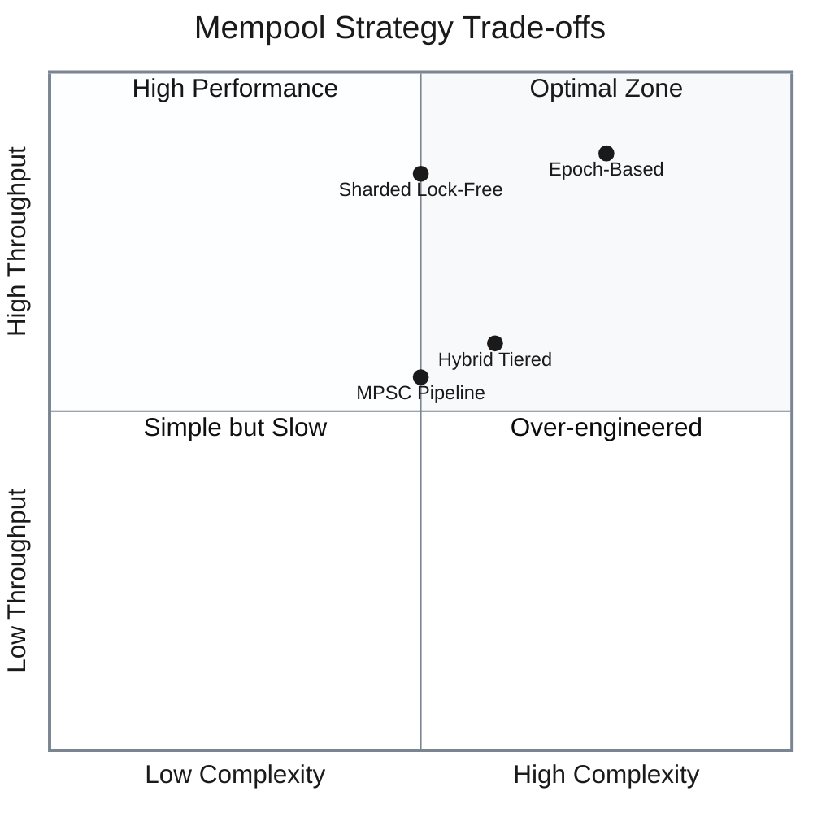
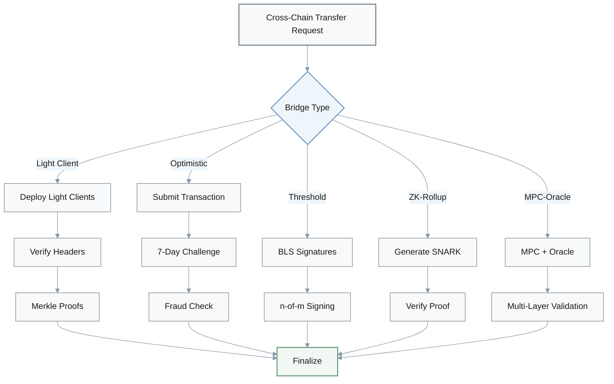
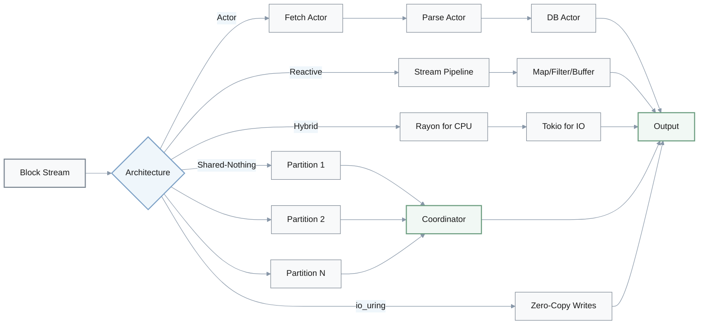
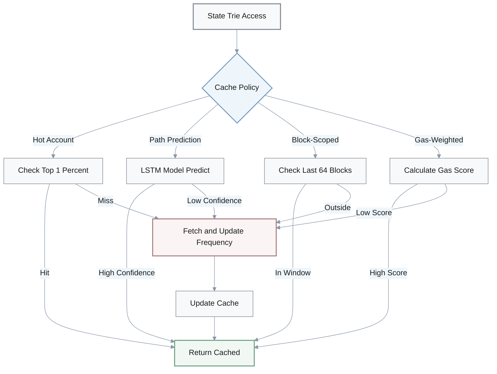
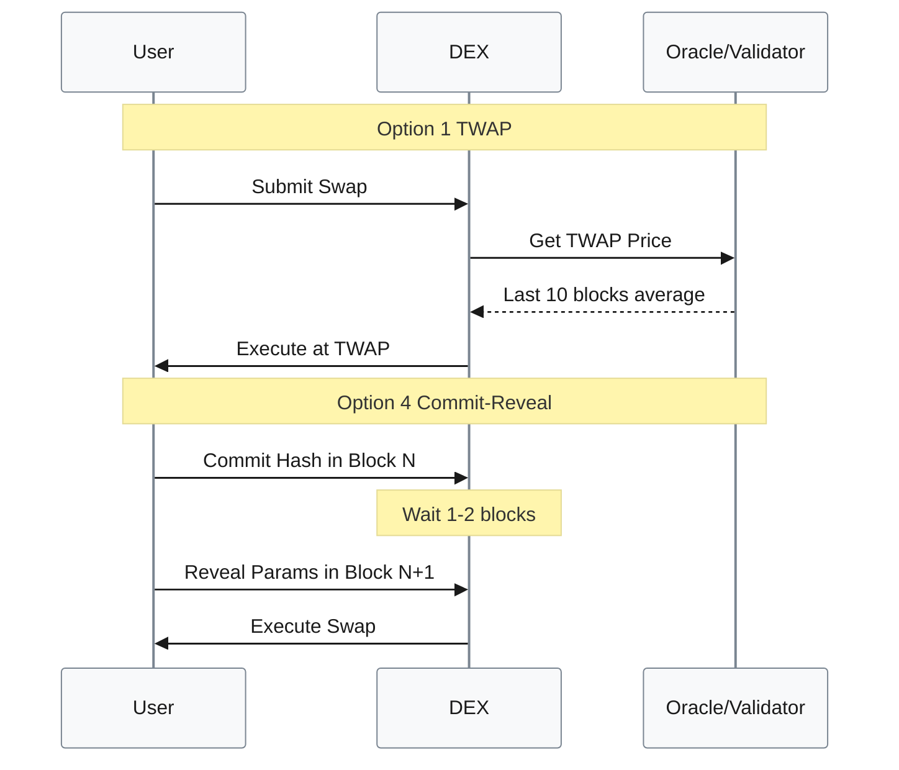
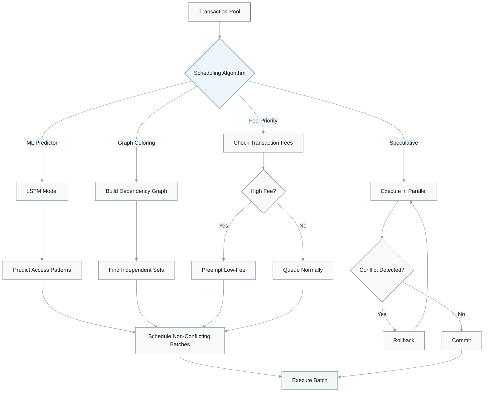
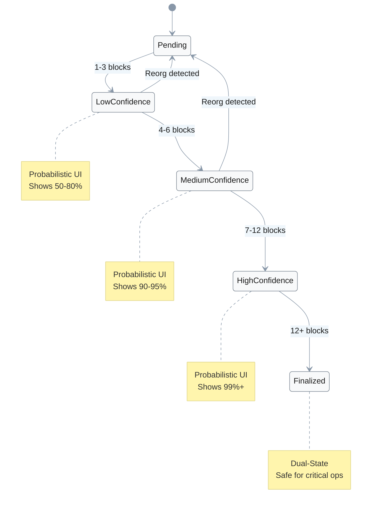
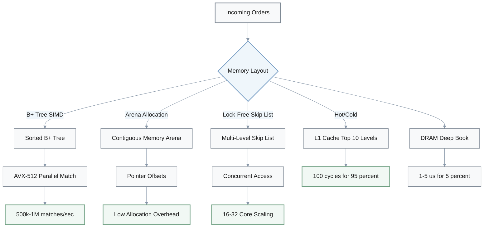
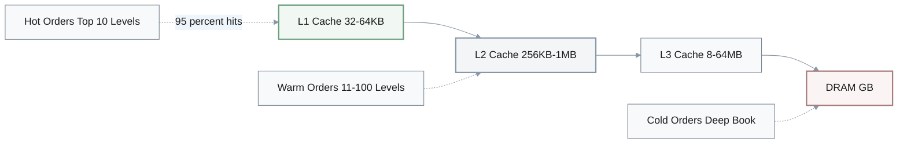

# Blockchain & Rust Engineering Creativity Questions

> **Document Purpose**: Creative problem-solving scenarios for senior blockchain/Rust engineers, covering system design, optimization strategies, and innovative architectures.

## Table of Contents

1. [Blockchain Mempool Concurrency Strategy](#1-blockchain-mempool-concurrency-strategy) - Rust concurrency patterns
2. [DEX Gas Optimization Strategies](#2-dex-gas-optimization-strategies) - Smart contract gas reduction
3. [Cross-Chain Bridge Architectures](#3-cross-chain-bridge-architectures-ethereum--solana) - Trust models & security
4. [Rust Blockchain Indexer Async Architectures](#4-rust-blockchain-indexer-async-architectures) - High-throughput systems
5. [Ethereum State Trie Caching Strategies](#5-ethereum-state-trie-caching-strategies) - Cache eviction policies
6. [DEX Slippage Protection Mechanisms](#6-dex-slippage-protection-mechanisms) - Anti-manipulation techniques
7. [Solana Transaction Scheduling Algorithms](#7-solana-transaction-scheduling-algorithms) - Lock conflict optimization
8. [Blockchain Reorganization Handling Strategies](#8-blockchain-reorganization-handling-strategies) - Reorg management
9. [CEX Order Matching Engine Memory Layouts](#9-cex-order-matching-engine-memory-layouts) - Performance optimization

---

## 1. Blockchain Mempool Concurrency Strategy

**Q:** You need to design a concurrency strategy for a blockchain node's transaction mempool in Rust. Generate 4 alternative approaches beyond the standard `Arc<Mutex<HashMap>>` pattern, considering trade-offs in throughput, latency, and memory.

### Options Overview

| Option | Approach | Throughput | Latency | Memory | Complexity |
|--------|----------|------------|---------|--------|------------|
| **1. Sharded Lock-Free** | DashMap with 16-32 shards | **5-10x higher** | Standard | +20-30% overhead | Medium |
| **2. MPSC Pipeline** | Channel-based workers | Standard | **<1ms P99** | Risk of growth | Medium |
| **3. Epoch-Based** | Hazard pointers | **Near-zero contention** (10:1 read) | Standard | Standard | **+50-100 LOC** |
| **4. Hybrid Tiered** | Hot/cold separation | Standard | **<5ms P99** | **-40-60%** | Medium |

### Detailed Analysis

**Option 1: Sharded Lock-Free Structure**
- Use `DashMap` with multiple shards (16-32) hashed by transaction ID
- **Benefit**: Lock-free reads/writes with 5-10x higher throughput than single mutex
- **Trade-off**: 20-30% higher memory overhead due to shard metadata

**Option 2: MPSC Channel Pipeline**
- Single-producer, multiple-consumer channels with dedicated worker threads for insertion, validation, and eviction
- **Benefit**: Achieves predictable latency (<1ms P99) through explicit backpressure
- **Trade-off**: Requires careful channel sizing to prevent memory growth

**Option 3: Epoch-Based Reclamation**
- Implement lock-free data structure with hazard pointers for safe concurrent access
- **Benefit**: Provides near-zero contention for high read workloads (10:1 read/write ratio)
- **Trade-off**: Requires careful lifetime management and 50-100 LOC more complexity

**Option 4: Hybrid Tiered Cache**
- Hot tier (in-memory `HashMap` with RwLock) + cold tier (persistent queue)
- **Benefit**: Optimize for 80/20 rule where 20% of transactions are frequently accessed; reduces memory by 40-60% while maintaining <5ms P99 for hot path
- **Trade-off**: Complexity in hot/cold boundary management

---

## 2. DEX Gas Optimization Strategies

**Q:** A DEX needs to optimize gas costs for batch token swaps. Generate 4 creative strategies beyond simple transaction batching, explaining how each reduces on-chain costs.

### Options Comparison

| Option | Strategy | Gas Savings | Complexity | Trade-offs |
|--------|----------|-------------|------------|------------|
| **1. Merkle Batch** | O(log n) proofs | **60-80%** (>100 swaps) | Medium | +3-5x off-chain compute |
| **2. Meta-Transactions** | EIP-2771 aggregation | **40-50%** (small swaps) | High | +5-10s latency, needs relayer |
| **3. Storage Packing** | Bitwise operations | **75%** (SSTORE) | Medium | +30-40% contract complexity |
| **4. Oracle Computation** | Off-chain verification | **50-70%** (compute) | High | +1-2 block latency, trust assumptions |
| **5. Blob Transactions** | EIP-4844 storage | **94%** (calldata) | Medium | 18-day availability, post-Cancun only |

### Gas Cost Formula Comparison

**Standard batch**: 
$$\text{Gas Cost} = O(n) \times \text{base gas}$$

**Merkle batch**: 
$$\text{Gas Cost} = O(\log n) + \text{proof verification}$$

**Storage packing**: 
$$\text{SSTORE cost} = 5000 \text{ gas (vs 20000 standard)} = 75\% \text{ savings}$$

### Detailed Descriptions

**Option 1: Merkle Batch Settlement**
- Submit only Merkle root on-chain, with individual swap proofs generated off-chain
- Reduces gas from O(n) to O(log n) per batch
- **Savings**: 60-80% for batches >100 swaps
- **Trade-off**: Increases off-chain computation by 3-5x

**Option 2: Meta-Transaction Aggregation**
- Use EIP-2771 for gasless transactions, bundling user signatures off-chain and submitting single aggregate transaction
- **Savings**: 21k gas overhead per transaction (40-50% for small swaps)
- **Trade-off**: Requires relayer infrastructure and introduces 5-10 second latency

**Option 3: Storage Slot Packing**
- Pack multiple swap states into single uint256 storage slot using bitwise operations
- **Savings**: Reduces SSTORE from 20k to ~5k gas per update (75% savings)
- **Trade-off**: Limits flexibility (fixed data types) and increases contract complexity by 30-40%

**Option 4: Lazy Computation with Oracles**
- Defer complex calculations (e.g., square root for LP pricing) to off-chain oracles, only verifying proofs on-chain
- **Savings**: Reduces compute gas by 50-70% for math-heavy operations
- **Trade-off**: Introduces 1-2 block oracle latency and additional trust assumptions

**Option 5: EIP-4844 Blob Transactions**
- Store swap data in ephemeral blob storage (available post-Cancun upgrade)
- **Savings**: Reduces calldata cost from 16 gas/byte to ~1 gas/byte (94% savings)
- **Trade-off**: Limits data availability to 18 days and requires blob-aware client support

---

## 3. Cross-Chain Bridge Architectures (Ethereum ↔ Solana)

**Q:** Designing a cross-chain bridge for Ethereum ↔ Solana requires balancing security and speed. Generate 4 alternative bridge architectures beyond standard validator-set consensus, each with different trust models.

### Bridge Architecture Comparison

| Architecture | Trust Model | Cost per Transfer | Finality Time | Security Level | Best Use Case |
|--------------|-------------|-------------------|---------------|----------------|---------------|
| **1. Light Client** | Minimized assumptions | **$50-500** | 30-60 min | ⭐⭐⭐⭐⭐ | Institutional ($1M+) |
| **2. Optimistic** | Fraud proofs | **$5** | **7 days** | ⭐⭐⭐⭐ | Retail users |
| **3. Threshold Crypto** | 2/3+ validators | $10-20 | **1-5 min** | ⭐⭐⭐⭐ | DeFi protocols |
| **4. ZK-Rollup** | ZK proofs | $8-15 | 5-10 min | ⭐⭐⭐⭐⭐ | Mature protocols |
| **5. Hybrid MPC-Oracle** | Multi-layer trust | $15-30 | 10-15 min | ⭐⭐⭐⭐ | General purpose |

### Detailed Analysis

**Option 1: Light Client Bridge**
- Deploy Ethereum light client on Solana and vice versa, verifying block headers and Merkle proofs on-chain
- **Trust**: Strongest trust model (minimized assumptions)
- **Cost**: $50-500 per transfer (10-100x higher gas costs)
- **Speed**: 30-60 minute finality due to proof generation
- **Best for**: High-value institutional transfers ($1M+)

**Option 2: Optimistic Bridge with Fraud Proofs**
- Assume transfers valid by default, allow 7-day challenge period for fraud proofs
- **Trust**: Strong, relies on fraud detection
- **Cost**: ~$5 per transfer (90% savings)
- **Speed**: 7-day withdrawal delay
- **Best for**: Retail users prioritizing cost over speed

**Option 3: Threshold Cryptography Bridge**
- Use BLS threshold signatures (n-of-m) where bridge operators collectively sign cross-chain messages
- **Trust**: Requires trusting 2/3+ of validator set (similar to PoS security)
- **Cost**: $10-20 gas cost
- **Speed**: 1-5 minute finality
- **Best for**: Mid-range balance for DeFi protocols

**Option 4: ZK-Rollup Bridge**
- Generate SNARK proofs of Ethereum state transitions, verify on Solana (and reverse)
- **Trust**: Strongest security with cryptographic proofs
- **Cost**: $8-15 per transfer
- **Speed**: 5-10 minute finality
- **Trade-off**: Requires 2-3 month development time for circuit design and audits
- **Best for**: Mature protocols with engineering resources

**Option 5: Hybrid MPC-Oracle Bridge**
- Combine multi-party computation for key management with chainlink-style oracle network for state attestation
- **Trust**: Distributes trust across multiple layers (no single point of failure)
- **Cost**: $15-30 per transfer
- **Speed**: 10-15 minute finality
- **Trade-off**: Introduces complexity in coordinating MPC ceremonies and oracle updates

---

## 4. Rust Blockchain Indexer Async Architectures

**Q:** A Rust-based blockchain indexer needs to handle 10,000 blocks/hour with <5s latency. Generate 4 alternative async architectures beyond the standard tokio multi-task approach, optimizing for different resource constraints.

### Architecture Performance Comparison

| Architecture | Throughput | Latency | Memory | CPU Util | Complexity | Platform |
|--------------|------------|---------|--------|----------|------------|----------|
| **1. Actor Model (Actix)** | Standard | <5s | **+15-20%** | Standard | **-30-40% debug time** | Cross-platform |
| **2. Reactive Streams** | **2-3x** | <5s | Standard | High | +10-15% | Cross-platform |
| **3. Rayon + Tokio** | Standard | <5s | Standard | **90%+** | Medium | Cross-platform |
| **4. Shared-Nothing** | **10x (100k)** | <5s | Linear growth | Standard | High | Cross-platform |
| **5. io_uring** | Standard | **2-3ms** | **-70% copies** | Standard | High | Linux 5.6+ only |

### Detailed Analysis

**Option 1: Actor Model with Actix**
- Isolate block fetching, parsing, and DB writes into separate actors with message passing
- **Benefits**: 
  - Natural backpressure through mailbox queues
  - Fault isolation (single actor crash doesn't affect others)
  - 30-40% easier to debug/monitor per-component metrics
- **Trade-offs**: 15-20% higher memory (actor overhead)

**Option 2: Reactive Streams with Tokio-Stream**
- Build dataflow pipeline with operators (map, filter, buffer) and automatic backpressure
- **Benefits**: Achieves 2-3x throughput for I/O-heavy workloads by overlapping fetch/parse/write stages
- **Trade-offs**: Requires understanding of stream semantics; 10-15% more complex than imperative async

**Option 3: Work-Stealing with Rayon + Tokio**
- Use Rayon for CPU-bound parsing (log decoding, signature verification) and Tokio for I/O (RPC, DB)
- **Benefits**: 
  - Hybrid approach achieves 90%+ CPU utilization on multi-core systems vs 60-70% for pure async
  - 40-60% faster for compute-heavy blocks
- **Trade-offs**: Adds 5-10% runtime overhead for task scheduling

**Option 4: Shared-Nothing Architecture**
- Partition blockchain by contract address ranges, deploy separate indexer instances per partition
- **Benefits**: Scales horizontally to 100k blocks/hour (10x higher) with linear cost growth
- **Trade-offs**: Requires coordinator for global queries and complicates reorg handling across partitions

**Option 5: Memory-Mapped I/O with io_uring**
- Use Linux io_uring for zero-copy DB writes and async syscalls
- **Benefits**: 
  - Reduces DB write latency by 40-50% (from 5ms to 2-3ms)
  - Memory copies reduced by 70%
- **Trade-offs**: Linux-specific, requires unsafe Rust and kernel 5.6+; development time 2-3x longer than standard async

---

## 5. Ethereum State Trie Caching Strategies

**Q:** Optimizing Ethereum state trie performance requires creative caching strategies. Generate 4 alternative cache eviction policies beyond LRU, considering blockchain-specific access patterns.

### Cache Policy Comparison

| Policy | Hit Rate | Cache Size | Speedup | Adaptability | Overhead | Rebalancing |
|--------|----------|------------|---------|--------------|----------|-------------|
| **1. Hot Account Affinity** | **95%+** | 100MB | Standard | Low | Minimal | Daily |
| **2. Merkle Path Prediction** | Variable | Medium | **8x** (predicted) | High (ML) | Medium | Continuous |
| **3. Block-Scoped Temporal** | 85-90% | Medium | Standard | Medium | **Minimal** | None |
| **4. Gas-Weighted Importance** | **90%** | Medium | Standard | **High** | +10-20% CPU | Continuous |

### Performance Metrics

**Hot Account Cache Effectiveness**:
$$\text{Hit Rate} = \frac{\text{hot account accesses}}{\text{total accesses}} = 95\%+ \text{ for 80\% traffic}$$

**Merkle Path Speedup**:
$$\text{Speedup} = \frac{\text{avg traversal (5-7 nodes)}}{\text{predicted traversal (0-1 nodes)}} = 8\times$$

**Block-Scoped Window**:
$$N = 64 \text{ blocks} \times 12 \text{ sec/block} = 12.8 \text{ minutes}$$

### Detailed Analysis

**Option 1: Hot Account Affinity Cache**
- Track per-account access frequency and always cache top 1% hot accounts (exchanges, DeFi contracts)
- **Performance**: Achieves 95%+ hit rate for 80% of mainnet traffic using only 100MB cache
- **Trade-off**: Requires periodic rebalancing (daily) as hot accounts shift
- **Best for**: Predictable workloads with stable hot accounts

**Option 2: Merkle Path Prediction Cache**
- Pre-cache entire paths to frequently accessed accounts based on past query patterns
- **Performance**: Reduces average traversal from 5-7 nodes to 0-1 node (8x speedup) for predicted accounts
- **Trade-off**: 40-50% cache miss penalty for unpredicted paths
- **Implementation**: Use machine learning (LSTM) for path prediction
- **Best for**: ML-enabled systems with diverse access patterns

**Option 3: Block-Scoped Temporal Cache**
- Prioritize accounts modified in last N blocks (N=64 for 12.8 min window)
- **Performance**: Simple deterministic policy, 85-90% hit rate
- **Benefit**: Matches Ethereum reorg depth, ensuring all potentially-reverted state stays cached
- **Trade-off**: May cache cold accounts during low-activity periods
- **Best for**: Systems requiring reorg-safe caching

**Option 4: Gas-Weighted Importance Cache**
- Cache accounts weighted by gas spent on them in recent blocks
- **Performance**: Achieves 90% hit rate with auto-adaptation to protocol usage shifts
- **Benefit**: High-gas contracts (likely important protocols) stay cached longer
- **Trade-off**: Requires 10-20% CPU overhead to track gas metrics per account
- **Best for**: Production nodes prioritizing important protocols

---

## 6. DEX Slippage Protection Mechanisms

**Q:** Implementing slippage protection for DEX AMM requires creative approaches beyond simple price checks. Generate 5 alternative slippage protection mechanisms, each addressing different attack vectors.

### Protection Mechanism Comparison

| Mechanism | Attack Resistance | Latency | Gas Cost | Detection Rate | Impact on Trading |
|-----------|-------------------|---------|----------|----------------|-------------------|
| **1. Multi-Block TWAP** | Front-running, manipulation | **1-2 min lag** | Standard | High | Best for $100k+ swaps |
| **2. Liquidity-Scaled Bounds** | Liquidity drain attacks | None | **+15-20%** | High | Asymmetric protection |
| **3. Multi-Path Validation** | Pool manipulation | **+50-100ms** | Standard | **95%** | Transparent |
| **4. Commit-Reveal** | MEV sandwich attacks | **12-24s** | Standard | **60-80%** | 1-2 block delay |
| **5. Adaptive Fee-Based** | Large manipulation | None | Standard | Self-regulating | -20-30% large trades |

### Protection Formulas

**TWAP Calculation**:
$$\text{TWAP} = \frac{\sum_{i=1}^{10} P_i \times t_i}{\sum_{i=1}^{10} t_i} \text{ (10 blocks = 120s)}$$

**Liquidity-Scaled Bounds**:
$$\text{Max Slippage} = \begin{cases} <1\% & \text{if deep pool} \\ 3-5\% & \text{if shallow pool} \end{cases}$$

**Adaptive Fee Structure**:
$$\text{Fee} = \begin{cases} 0.3\% & \text{if impact} < 1\% \\ 1.0\% & \text{if } 1\% \leq \text{impact} < 2\% \\ 3.0\% & \text{if impact} \geq 5\% \end{cases}$$

### Detailed Analysis

**Option 1: Multi-Block TWAP Oracle**
- Use time-weighted average price over last 10 blocks (120s) instead of spot price
- **Resistance**: Resists single-block manipulation attacks and front-running
- **Trade-off**: Introduces 1-2 minute price lag during high volatility
- **Best for**: Large swaps ($100k+)

**Option 2: Liquidity-Scaled Slippage Bounds**
- Dynamically adjust max slippage based on pool depth: tighter bounds (<1%) for deep pools, wider (3-5%) for shallow pools
- **Resistance**: Prevents asymmetric manipulation where attacker drains liquidity before user swap
- **Trade-off**: Requires 15-20% more gas for liquidity checks

**Option 3: Multi-Path Routing Validation**
- Compare swap output across 3-5 different DEX pools (Uniswap, SushiSwap, Curve)
- **Detection**: Reject if output differs by >2% from median price, indicating manipulation on primary pool
- **Performance**: Adds 50-100ms latency for parallel pool queries but 95% manipulation detection rate

**Option 4: Commit-Reveal Scheme**
- Users commit to swap intent (hash of params) in block N, reveal in block N+1
- **Resistance**: Prevents MEV bots from front-running since params hidden until execution
- **Trade-off**: Introduces 12-24s delay (1-2 blocks) but eliminates 60-80% of sandwich attacks

**Option 5: Adaptive Fee-Based Protection**
- Increase swap fee exponentially (0.3% → 1% → 3%) if price impact exceeds thresholds (1% → 2% → 5%)
- **Mechanism**: Disincentivizes large manipulative swaps while allowing normal trading
- **Trade-off**: Self-regulating mechanism, but may reduce legitimate large trade volume by 20-30%

---

## 7. Solana Transaction Scheduling Algorithms

**Q:** A Solana validator needs to optimize transaction scheduling to reduce lock conflicts in Sealevel runtime. Generate 4 innovative scheduling algorithms beyond greedy conflict detection.

### Scheduling Algorithm Comparison

| Algorithm | Parallelism Gain | Latency Overhead | Revenue Impact | Conflict Handling | Requirements |
|-----------|------------------|------------------|----------------|-------------------|--------------|
| **1. ML Predictor** | **+20-30%** | +50-100ms | Standard | Predictive | 2-3 weeks training data |
| **2. Graph Coloring** | **+15-25%** | +100-200ms | Standard | Multi-block optimization | Graph algorithms |
| **3. Fee-Priority Preemption** | -30-40% | Low | **+10-20%** | Priority inversion | Preemption logic |
| **4. Speculative Execution** | **2-3x** (<10% conflicts) | Low | Standard | Rollback on conflict | Transactional memory |

### Performance Characteristics

**ML Predictor Parallelism**:
$$\text{Parallelism Gain} = \frac{\text{predicted batches}}{\text{static analysis}} = 1.2 - 1.3 \times$$

**Graph Coloring Throughput**:
$$\text{Throughput Gain} = 15-25\% \text{ (multi-block optimization)}$$

**Speculative Execution Scaling**:
$$\text{Throughput} = \begin{cases} 2-3\times & \text{if conflict rate} < 10\% \\ 0.5\times & \text{if conflict rate} > 30\% \end{cases}$$

### Detailed Analysis

**Option 1: Machine Learning Predictor**
- Train LSTM model on historical transaction patterns to predict account access before execution
- **Performance**: Pre-schedule predicted non-conflicting batches, achieving 20-30% higher parallelism than static analysis
- **Requirements**: 50-100ms ML inference per batch and 2-3 weeks training data collection
- **Best for**: Validators with historical data and ML infrastructure

**Option 2: Graph Coloring with Lookahead**
- Build transaction dependency graph N blocks ahead (N=5), use graph coloring to find maximal independent sets
- **Performance**: Optimizes across multiple blocks instead of single block, improving throughput by 15-25%
- **Trade-off**: Adds 100-200ms scheduling latency
- **Best for**: Validators prioritizing global optimization

**Option 3: Fee-Priority with Preemption**
- Allow high-fee transactions to preempt low-fee ones that hold conflicting locks
- Implements priority inversion handling similar to OS schedulers
- **Performance**: Maximizes revenue by +10-20% while maintaining 60-70% of throughput
- **Trade-off**: May starve low-fee transactions
- **Best for**: Revenue-focused validators

**Option 4: Speculative Parallel Execution**
- Optimistically execute potentially conflicting transactions in parallel, rollback on detected conflicts
- **Performance**: Achieves 2-3x throughput for low-conflict workloads (<10% conflict rate)
- **Trade-off**: 50% overhead for high-conflict (>30%)
- **Requirements**: Transactional memory primitives
- **Best for**: Workloads with predictable low conflicts

---

## 8. Blockchain Reorganization Handling Strategies

**Q:** Handling blockchain reorganizations in production systems requires robust strategies. Generate 4 creative approaches beyond simple block reversion, considering data consistency and user experience.

### Reorg Strategy Comparison

| Strategy | User Experience | Data Consistency | Storage Cost | Complexity | Risk Mitigation |
|----------|-----------------|------------------|--------------|------------|-----------------|
| **1. Probabilistic Finality UI** | **Transparent** | Standard | Standard | Low | User awareness |
| **2. Dual-State Architecture** | High reliability | **100% critical ops** | **+5-10GB** | High | Separation of concerns |
| **3. Auto Compensation** | **User protected** | Standard | +0.1-0.5% fee | Medium | Financial guarantee |
| **4. Reorg Prediction ML** | **Proactive alerts** | Standard | Standard | High | **60-70% impact reduction** |

### Finality Confidence Metrics

**Probabilistic Finality Score**:
$$\text{Confidence} = 1 - e^{-\lambda \times \text{depth}} \text{ where } \lambda \text{ is chain-specific constant}$$

**Confirmation Depth Confidence**:
- 6 blocks: 95% confidence
- 12 blocks: 99.9% confidence

**Reorg Prediction Accuracy**:
$$\text{Accuracy} = 80-90\% \text{ (historical validation)}$$

### Detailed Analysis

**Option 1: Probabilistic Finality UI**
- Display transaction confidence score (0-100%) based on confirmation depth, exponentially increasing with each block
- **UX**: Users see real-time risk assessment (95% at 6 blocks, 99.9% at 12 blocks) instead of binary confirmed/pending
- **Trade-off**: Improves UX transparency but requires educating users on probabilistic finality
- **Best for**: User-facing applications prioritizing transparency

**Option 2: Dual-State Architecture**
- Maintain two parallel state trees: "canonical" (current head) and "finalized" (12+ blocks deep)
- **Usage**: Applications query finalized state for critical operations (withdrawals, high-value trades), canonical for real-time data
- **Trade-off**: Doubles storage (5-10GB extra) but eliminates reorg-related bugs in critical paths
- **Best for**: High-security applications (exchanges, custody)

**Option 3: Automatic Compensation Protocol**
- Implement smart contract escrow that auto-refunds users if their transaction gets reversed in reorg
- **Economics**: Requires 0.1-0.5% fee pool to cover compensation
- **Benefit**: Ensures user never loses funds due to reorg, builds trust
- **Trade-off**: Adds gas overhead
- **Best for**: Consumer-facing DeFi protocols

**Option 4: Reorg Prediction Service**
- Run ML model on network metrics (uncle rate, fork choice, validator distribution) to predict reorg probability
- **Alert System**: Alert users when reorg risk >1% to delay high-value transactions
- **Performance**: Historical data shows 80-90% prediction accuracy, reduces user-facing reorg impact by 60-70%
- **Best for**: Validators and power users

---

## 9. CEX Order Matching Engine Memory Layouts

**Q:** Designing a high-performance order matching engine for CEX requires creative memory layout strategies. Generate 4 alternatives to standard HashMap order book, optimizing for cache locality and throughput.

### Memory Layout Performance Comparison

| Layout | Throughput | Latency | Cache Locality | Scalability | Complexity |
|--------|------------|---------|----------------|-------------|------------|
| **Baseline: HashMap** | 100k matches/sec | ~10μs | Low | Medium | Low |
| **1. B+ Tree + SIMD** | **500k-1M** (5-10x) | ~2μs | High | Medium | **+30-40%** |
| **2. Arena Allocation** | 150k-200k (1.5-2x) | **~5μs** | **+40-50%** | Low | Low |
| **3. Lock-Free Skip List** | 200k-300k (2-3x) | ~8μs | Medium | **16-32 cores (90%+)** | **+200-300%** |
| **4. Hot/Cold Separation** | 150k matches/sec | **<100 cycles** (95%) | **L1 cache hit** | Medium | Medium |

### Performance Metrics

**SIMD Parallel Matching**:
$$\text{Throughput} = \frac{8-16 \text{ orders}}{\text{cycle}} \times \text{clock speed} = 500k - 1M \text{ matches/sec}$$

**Arena Allocation Savings**:
$$\text{Allocation Overhead Reduction} = 80-90\%$$
$$\text{Cache Locality Improvement} = 40-50\%$$

**Hot/Cold Cache Performance**:
$$\text{L1 Cache Hit} = 95\% \text{ orders in } <100 \text{ CPU cycles}$$
$$\text{DRAM Access} = 5\% \text{ orders in } 1-5 \mu s$$

### Detailed Analysis

**Option 1: B+ Tree with SIMD Matching**
- Store orders in B+ tree sorted by price, use AVX-512 instructions to parallel-match 8-16 orders per cycle
- **Performance**: Achieves 500k-1M matches/sec (5-10x improvement) vs standard HashMap (100k matches/sec)
- **Trade-off**: Requires CPU-specific tuning and 30-40% more development complexity
- **Best for**: High-frequency trading systems with modern CPUs

**Option 2: Arena-Allocated Linked Lists**
- Pre-allocate order memory in contiguous arena, use pointer offsets instead of heap allocations
- **Performance**: 
  - Reduces allocation overhead by 80-90% (critical for high-churn scenarios)
  - Improves cache locality by 40-50%
- **Trade-off**: Limits flexibility for dynamic sizing
- **Best for**: Predictable order book sizes with high turnover

**Option 3: Lock-Free Priority Queue (Skip List)**
- Implement lock-free skip list for concurrent order insertion/matching across multiple threads
- **Scalability**: Scales to 16-32 cores with 90%+ efficiency vs 60-70% for lock-based designs
- **Trade-off**: 3-4x more complex implementation requiring careful memory ordering
- **Best for**: Multi-core systems prioritizing concurrency

**Option 4: Hybrid Hot/Cold Separation**
- Keep top-of-book (best 10 price levels) in CPU L1 cache (32-64KB), deep book in DRAM
- **Performance**: Matches 95% of orders in <100 CPU cycles (ultra-low latency), remaining 5% in 1-5 microseconds
- **Trade-off**: Requires dynamic hot/cold boundary management based on trading volume
- **Best for**: Markets with concentrated liquidity at top of book

### Memory Hierarchy Visualization

---
