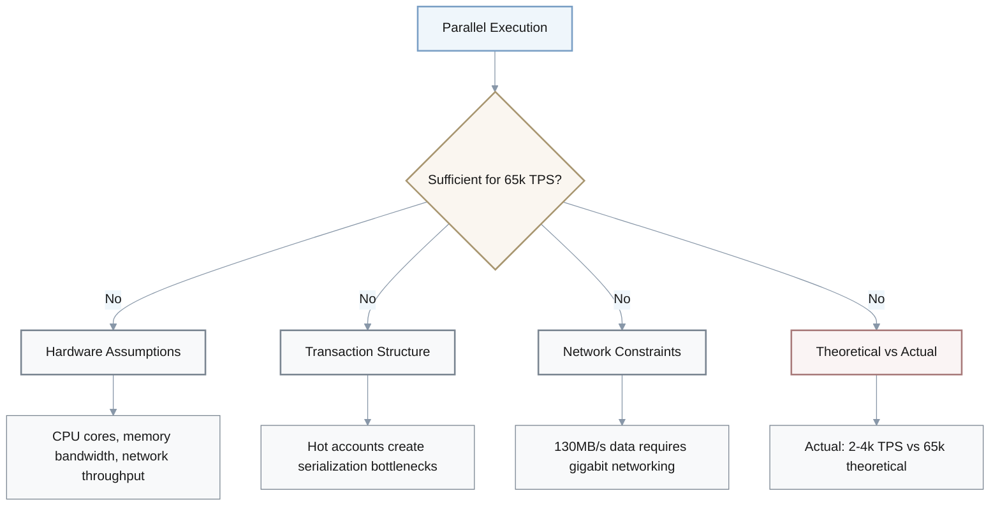
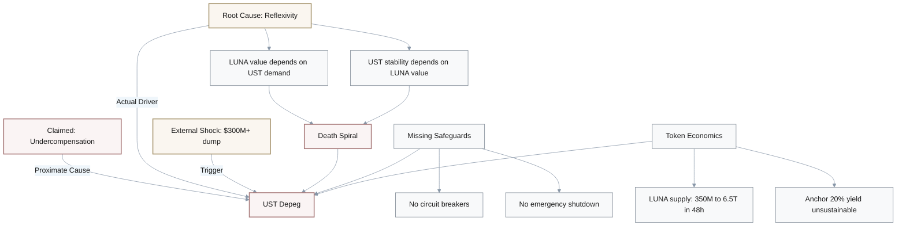
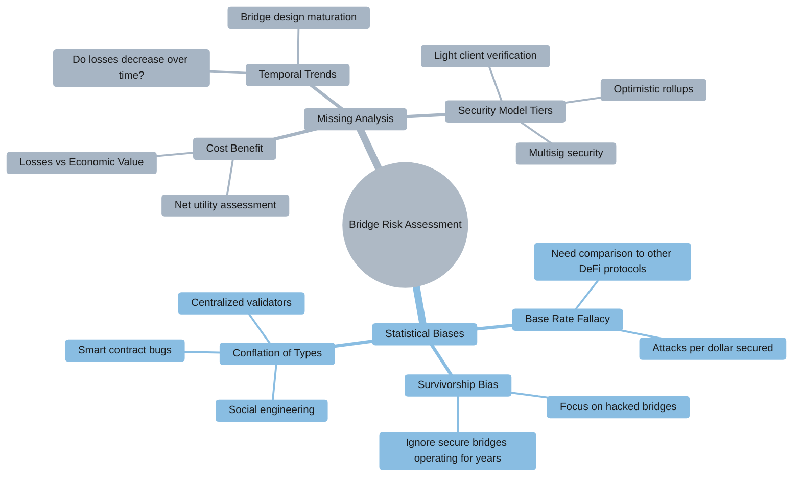
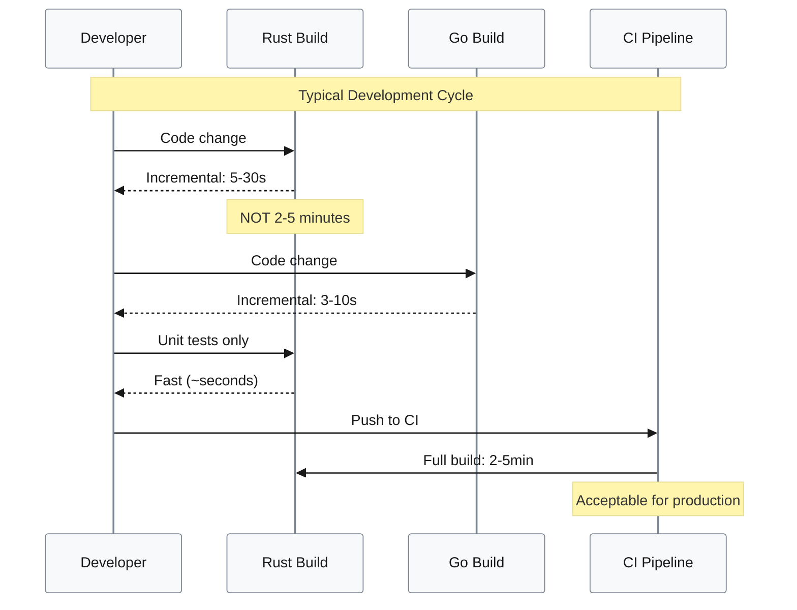
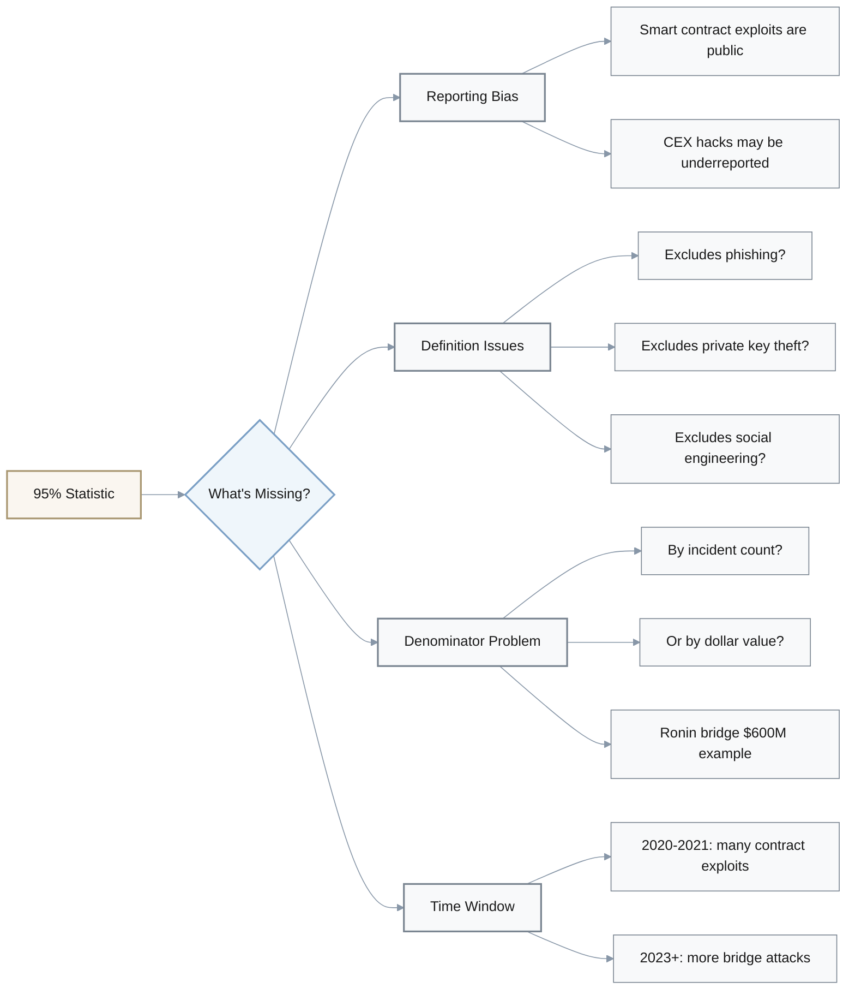
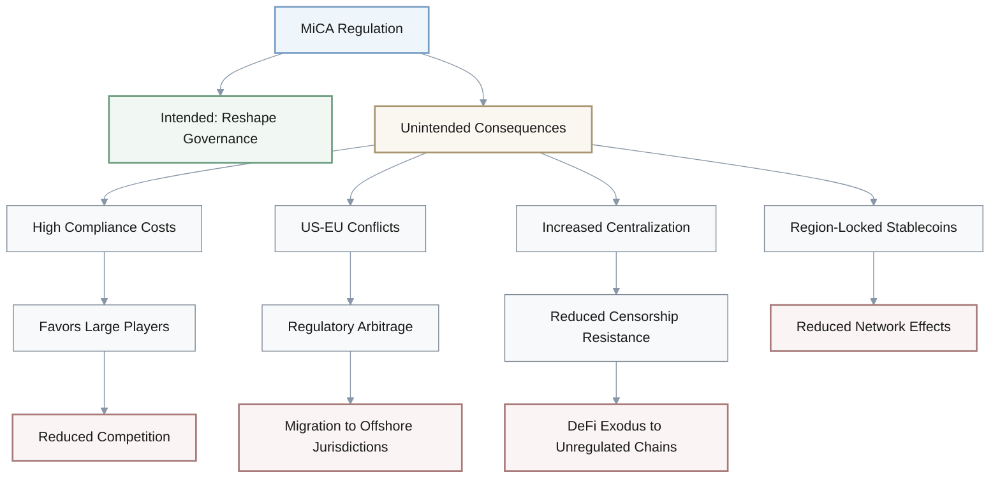
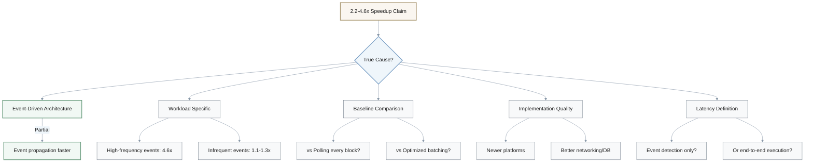
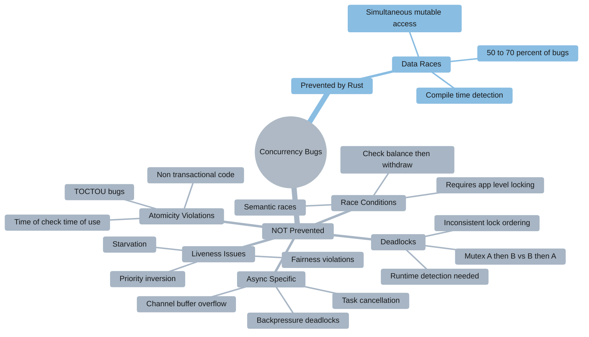

# Critical Thinking Analysis of Technical Claims

---

## 1. Rust's Memory Safety Claims

### Question
The source claims "Rust's ownership model reduces memory-related runtime bugs by 60-80% based on Mozilla/Microsoft security research." Evaluate the strength of this claim: What additional evidence would strengthen it? What confounding factors might explain these results?

### Analysis Framework

| **Aspect** | **Issues Identified** | **Strengthening Evidence Needed** |
|------------|----------------------|----------------------------------|
| **Causation** | Correlation vs causation—reduction could be due to better test coverage, different developer skill levels, or selection bias | Controlled experiments with same developers on identical projects in Rust vs C++/Go |
| **Scope** | Time period and scope unclear—comparing legacy C++ with decades of debt vs new Rust projects | Longitudinal studies showing bug rates over project lifetime |
| **Definition** | "Memory-related bugs" is vague—logic errors vs use-after-free/buffer overflows? | Breakdown by bug category (temporal safety, spatial safety) |
| **Credibility** | Mozilla/Microsoft research is credible but needs peer review | Independent peer-reviewed validation |

#### Logical Issues Breakdown

1. **Correlation vs Causation**: 60-80% reduction could stem from:
   - Better test coverage in Rust projects
   - Different developer skill levels
   - Selection bias (security-focused projects choose Rust)

2. **Unfair Comparisons**:
   - Legacy C++ codebases with decades of technical debt
   - New Rust projects with modern practices
   
3. **Ambiguous Metrics**: "Memory-related bugs" needs clarification

---

## 2. Solana's TPS Claims

### Question
A document states "Solana achieves 65,000 TPS theoretical capacity" and "Sealevel runtime enables parallel execution." Evaluate whether parallel execution alone is sufficient to justify the TPS claim.

### Argument Structure Analysis

#### Hidden Assumptions

| **Category** | **Assumption** | **Reality** |
|--------------|----------------|-------------|
| **Hardware** | Specific CPU cores, memory bandwidth, network throughput | May not hold on commodity hardware |
| **Transaction Structure** | Majority are non-conflicting (disjoint account sets) | Hot accounts reduce parallelism by 40-60% |
| **Networking** | Can handle ~130MB/s transaction data | Requires gigabit networking + efficient gossip |
| **Performance Gap** | Theoretical = Practical | Mainnet: 2-4k TPS (95% lower than theoretical) |

**Key Insight**: Parallel execution is **necessary but not sufficient**. Network latency, consensus overhead, and validator heterogeneity dominate over parallel execution benefits.

---

## 3. Terra UST Collapse: Causal Analysis

### Question
The materials claim "algorithmic stablecoins are 'especially susceptible to incentive failures' and that Terra's UST collapse was due to 'undercompensation during redemption.'" Evaluate this causal claim.

### Causal Chain Diagram

#### Causal Reasoning Issues

**Oversimplification**: Undercompensation is a symptom, not the root cause.

**Root Cause**: Inherent reflexivity in dual-token models creates circular dependency:

$$
\text{LUNA value} = f(\text{UST demand}) \text{ AND } \text{UST stability} = f(\text{LUNA value})
$$

**Alternative Explanations**:
1. **Protocol Design**: Lacked circuit breakers or emergency shutdown mechanisms
2. **Supply Inflation**: LUNA supply exploded from 350M to 6.5T tokens in 48 hours
3. **Unsustainable Yield**: Anchor Protocol's 20% yield created artificial demand
4. **Bank Run Dynamics**: Large coordinated selling triggered cascading failures

---

## 4. Cross-Chain Bridge Risk Assessment

### Question
Sources suggest "cross-chain bridges are 'frequently targeted' and have 'substantial asset loss.'" Evaluate this risk assessment.

### Risk Assessment Framework

#### Key Analysis Gaps

| **Gap Type** | **Issue** | **Required Metric** |
|--------------|-----------|---------------------|
| **Base Rate** | No comparison to DEXes/lending protocols | Attack rate per $1B secured |
| **Vulnerability** | All attack types lumped together | Breakdown: smart contract / validator / oracle / social |
| **Selection** | Only hacked bridges highlighted | Include successfully operating bridges |
| **Cost-Benefit** | No comparison of losses vs value created | Loss rate = total hacked $ ÷ total $ bridged over time |

**Proper Risk Formula**:

$$
\text{Bridge Risk} = \frac{\text{Total Losses}}{\text{Total Value Transferred}} \times 100\%
$$

---

## 5. Rust vs Go Compilation Time Trade-offs

### Question
The claim that "Rust compilation times for large codebases (>100k LOC) may reach 2-5 minutes vs. Go's <30 seconds" is presented as a trade-off. Evaluate this comparison.

### Comparison Validity Analysis

| **Issue** | **Problem** | **Fair Comparison** |
|-----------|-------------|---------------------|
| **LOC Metric** | 100k Rust LOC ≠ 100k Go LOC (macros, traits, generics) | Compare equivalent functionality, not raw lines |
| **Build Type** | Implies clean builds; ignores incremental | Specify incremental (5-30s) vs clean (2-5min) |
| **Workflow** | Overstates impact if TDD with fast unit tests | Measure code-compile-test cycles per hour |
| **Trade-off** | Ignores runtime performance delta | Include Rust's 20-50% runtime advantage |

#### Hidden Assumptions About Workflow

**Key Insight**: Developers rarely do clean builds. Incremental compilation makes the 2-5 minute claim misleading.

---

## 6. DeFi Smart Contract Hack Statistics

### Question
Materials claim "DEX failure modes include 'smart contract bugs accounting for 95% of DeFi hacks.'" Evaluate this statistic.

### Statistical Biases

#### Critical Questions

1. **Reporting Bias**: Smart contract exploits are on-chain (public), CEX hacks are off-chain (may be hidden as "operational issues")
2. **Definition Scope**: Does "DeFi hacks" exclude user-level attacks like phishing?
3. **Measurement Unit**: 95% by incident count or by dollar value?
4. **Temporal Validity**: Is this 2020-2021 data or current 2023+ trends?

**True rate estimate**: Likely 70-80%, not 95%, when accounting for biases.

---

## 7. MiCA Regulation Impact on Stablecoins

### Question
The source suggests "MiCA regulation will 'fundamentally reshape stablecoin governance' by mandating licensing, capital requirements, and supervisory oversight." Assess this causal claim.

### Causal Mechanism Analysis

| **Assumption** | **Risk** | **Alternative Outcome** |
|----------------|----------|-------------------------|
| Compliance improves security | Regulated entities can still fail (2008 banks) | Compliance theater without security gains |
| Oversight prevents failures | Regulatory capture weakens rules | Incumbents lobbied for favorable treatment |
| Unified regulation helps | US vs EU conflicts | Regulatory arbitrage to less-regulated jurisdictions |
| Centralization is acceptable | Reduces censorship resistance | DeFi moves to unregulated chains |

#### Potential Unintended Consequences

**Key Insight**: Regulation is necessary but not sufficient. Historical precedent (2008 financial crisis) shows regulated entities can still fail catastrophically.

---

## 8. Two-Heap Median Tracking Optimality

### Question
The materials claim "two-heap approach for median tracking has O(log n) insertion and O(1) median calculation, making it optimal for blockchain gas price tracking over 1000 blocks." Evaluate the optimality claim.

### Complexity Analysis

| **Aspect** | **Two-Heap Approach** | **Alternative** | **Trade-off** |
|------------|----------------------|-----------------|---------------|
| **Time Complexity** | O(log n) insert + O(1) median | Same or better | ✓ Efficient |
| **Space Complexity** | O(n) stores all 1000 elements | Reservoir sampling: O(1) space | Accuracy vs space |
| **Heap Maintenance** | 2 ops per insert + O(log n) delete | Lock-free skip lists | Constant factor overhead |
| **Concurrency** | Requires locking | Lock-free alternatives | Single vs multi-threaded |
| **Metric Choice** | Median may underestimate | 75th percentile better for long-tailed | Gas estimation accuracy |

#### Optimality Challenged

**"Optimal" is context-dependent**:

$$
\text{Optimality} = f(\text{time}, \text{space}, \text{accuracy}, \text{concurrency})
$$

**Hidden Costs**:
- Each insertion requires up to 2 heap operations (insert + rebalance)
- Removing oldest element: O(log n) search + delete
- Amortized cost has high constant factor (10-20 operations per insert)

**Better Alternatives for Specific Contexts**:
1. **Space-constrained**: Reservoir sampling with 0.1% error tolerance
2. **Concurrent access**: Lock-free skip lists
3. **Long-tailed distributions**: Order statistics tree for 75th percentile

---

## 9. Event-Driven Smart Contract Latency Claims

### Question
The claim that "event-driven smart contract platforms reduce latency by 2.2-4.6x" implies causation. Evaluate whether event-driven architecture alone causes speedup.

### Confounding Factors Analysis

#### Critical Evaluation Points

1. **Workload Dependency**: 
   - High-frequency events (oracles, price feeds): 2.2-4.6x improvement
   - Infrequent events (governance votes): Only 1.1-1.3x improvement
   - **Generalization is weak** without workload diversity

2. **Baseline Matters**:
   - vs Polling-based triggering: Expected speedup
   - vs Optimized transaction batching: Gap narrows significantly

3. **Confounding Variables**:
   - Event-driven platforms may be newer
   - Benefit from modern infrastructure (networking, database indexing)
   - Improvements may be unrelated to event model

4. **Latency Ambiguity**:
   - Event detection latency? ✓ Faster
   - End-to-end execution time? Contract logic dominates

**Needed**: Ablation study isolating event-driven contribution on identical infrastructure.

---

## 10. Rust's Concurrency Safety Claims

### Question
Sources claim "Rust prevents data races at compile time through borrowing rules," implying this eliminates all concurrency bugs. Evaluate this claim.

### Concurrency Bug Taxonomy

### What Rust DOES and DOESN'T Prevent

| **Bug Type** | **Rust Prevention** | **Remaining Risk** | **Developer Responsibility** |
|--------------|---------------------|-------------------|------------------------------|
| **Data Races** | ✓ Compile-time | None | Minimal |
| **Race Conditions** | ✗ Not detected | High | Application-level locking |
| **Deadlocks** | ✗ Not detected | Medium | Lock ordering discipline |
| **Starvation** | ✗ Not detected | Medium | Fair scheduling design |
| **Priority Inversion** | ✗ Not detected | Low | Priority inheritance |
| **Async Bugs** | Partial (Send/Sync) | Medium | Cancellation handling |
| **TOCTOU** | ✗ Not detected | High | Transactional patterns |

#### Corrected Claim

> "Rust prevents **data races** at compile time, reducing **50-70%** of concurrency bugs, but developers must still handle **race conditions, deadlocks, and liveness issues** via design patterns and testing."

**Key Distinction**:

$$
\text{Data Race} \neq \text{Race Condition}
$$

- **Data Race**: Low-level simultaneous mutable access (Rust prevents)
- **Race Condition**: Semantic interleaving issues (Rust does NOT prevent)

---

## Summary: Critical Thinking Framework

### Universal Evaluation Checklist

When evaluating technical claims, always assess:

1. **Causal Logic**: Correlation vs causation, confounding factors
2. **Evidence Quality**: Peer review, controlled experiments, sample size
3. **Definitions**: Are terms ambiguous or clearly defined?
4. **Baselines**: What are we comparing against?
5. **Hidden Assumptions**: Hardware, workload, time period, scope
6. **Statistical Biases**: Reporting, selection, survivorship, time window
7. **Trade-offs**: What costs are omitted? Runtime vs compile time?
8. **Alternative Explanations**: What else could explain the results?
9. **Generalizability**: Does it hold across all contexts or specific ones?
10. **Unintended Consequences**: What risks does the solution introduce?

### Strengthening Claims: Best Practices

**Strong claims require**:
- **Controlled experiments** with isolated variables
- **Breakdown by category** (not lumped statistics)
- **Longitudinal data** showing trends over time
- **Peer-reviewed validation** from independent sources
- **Clear scope** with explicit assumptions stated
- **Comparative baselines** against relevant alternatives
- **Cost-benefit analysis** including trade-offs
- **Failure mode analysis** considering what could go wrong
