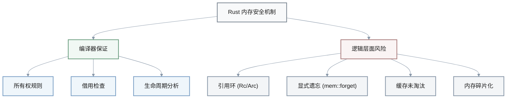
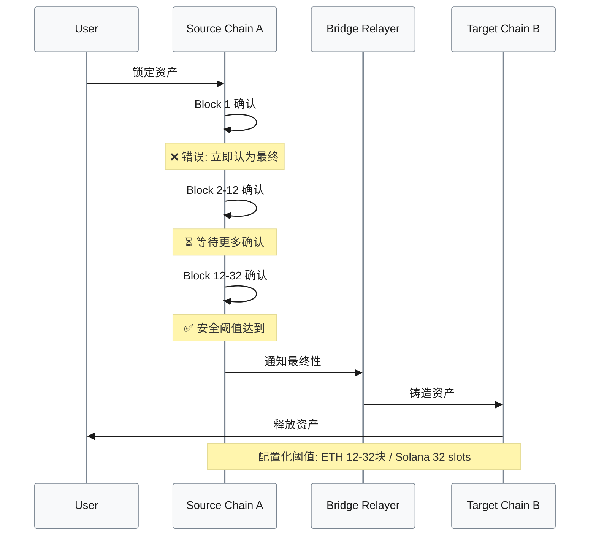
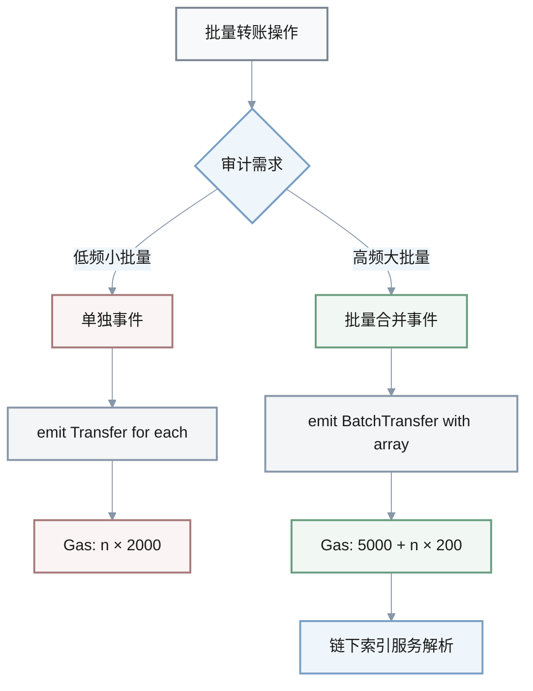
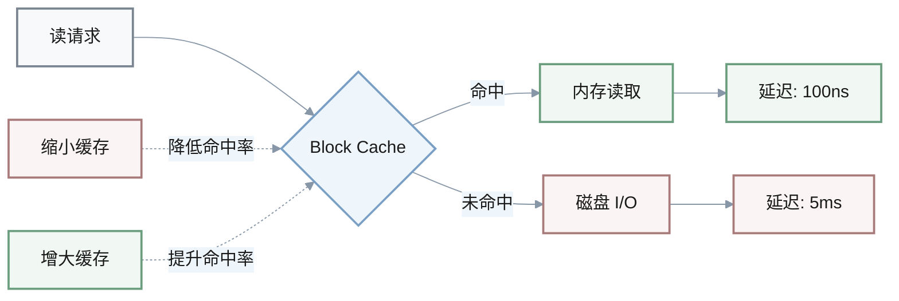
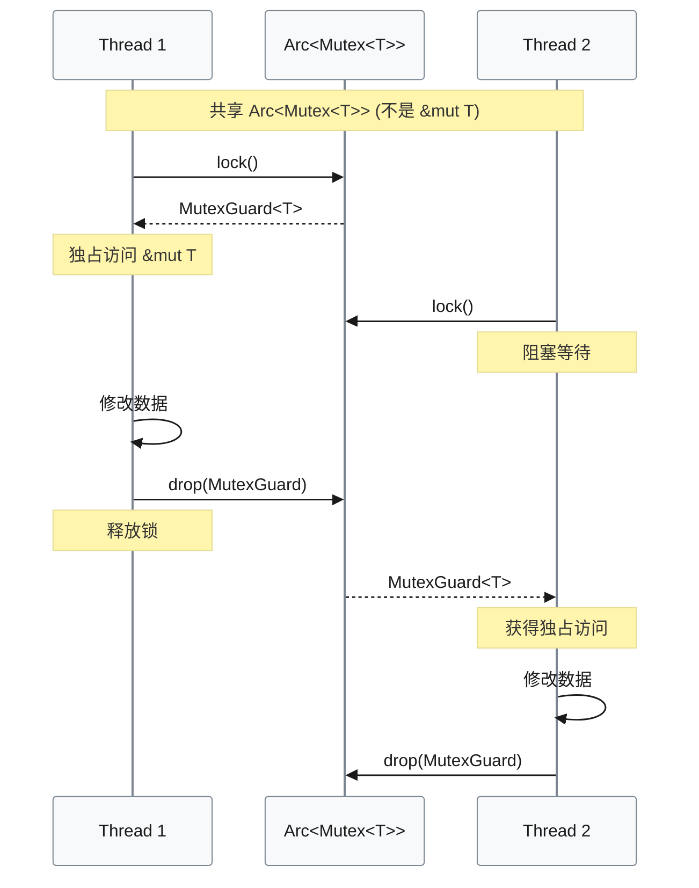
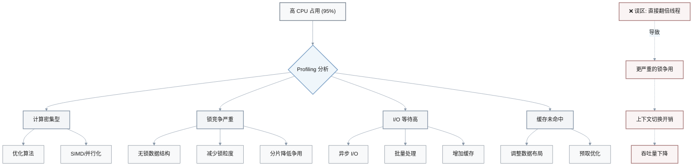
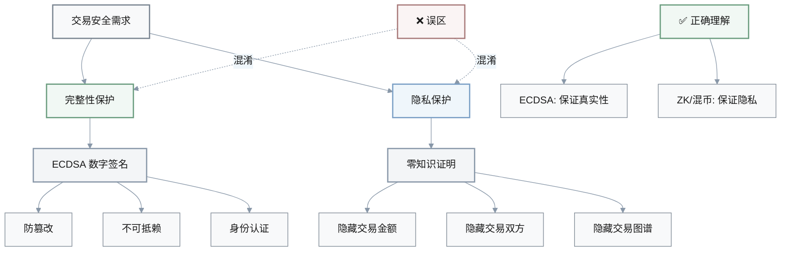
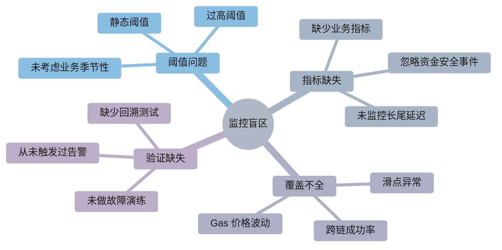
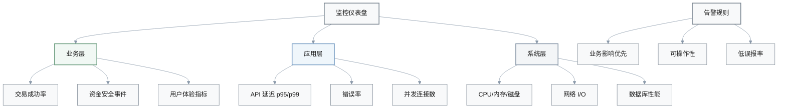

# 常见技术误区与调试实践 Q&A

## 概览对比表

| 序号 | 误区主题 | 核心错误 | 正确方法 |
|------|----------|----------|----------|
| 1 | Rust 内存安全 | 无 GC = 不会泄漏 | 仍需监控逻辑泄漏 |
| 2 | 跨链最终性 | 1 块确认即安全 | 按共识设定阈值 |
| 3 | 事件 Gas 优化 | 每笔单独事件更清晰 | 批量合并事件 |
| 4 | DB 性能调优 | 缩小缓存更稳定 | 增大缓存降低 I/O |
| 5 | Rust 并发模型 | 共享 `&mut T` 引用 | `Mutex` 序列化访问 |
| 6 | 多线程扩容 | CPU 高 = 加线程 | 先分析瓶颈再决策 |
| 7 | 隐私与加密 | ECDSA 提供隐私 | ECDSA 只保证完整性 |
| 8 | 监控策略 | 无告警 = 系统健康 | 完善 SLI/SLO + 演练 |

---

## 详细解析

### 1. Rust 内存安全误区

**Q:** 某同事实在代码评审中提出：「Rust 没有垃圾回收器,所以在区块链节点或智能合约里**不可能**出现内存泄漏，比 Go/C++ 更安全，不需要专门做内存方面的监控。」这句话有什么问题？你会如何更正，并说明在 Rust 区块链项目中仍需关注哪些内存风险？

**A:** 错在把「没有 GC」等同于「不会泄漏」：Rust 通过所有权避免悬垂指针和部分 use-after-free，但**逻辑层面仍可能泄漏内存**（例如 `Rc`/`Arc` 引用环、显式 `mem::forget`、长期缓存未淘汰等）。正确说法是：Rust 降低了特定类型的内存错误风险，但不能替代内存策略与监控。在区块链节点/合约中，仍需关注状态缓存/Trie 的生命周期、长时间运行进程的碎片化，以及攻击者通过构造交易放大内存占用的 DoS 风险，并配合 heaptrack 等工具和运行时指标监控内存曲线。

#### Rust 内存安全层级



#### 区块链项目中需监控的内存风险

- **状态缓存管理**: Trie 节点缓存、账户状态缓存的 LRU/TTL 策略
- **长期运行碎片化**: 节点进程运行数月后的内存分配器碎片
- **DoS 攻击向量**: 恶意构造交易触发大量临时对象分配
- **引用计数环**: 跨模块数据结构中的 `Arc` 循环引用
- **监控工具**: `heaptrack`、`valgrind`、Prometheus metrics (RSS/heap)

---

### 2. 跨链桥最终性误区

**Q:** 有人设计跨链桥方案时声称：「为减少延迟，我们在以太坊上只等 1 个区块确认就认定交易不可回滚，同时在 Solana 上只等 1 个 slot，就可以安全进行资产铸造或释放。」这是什么类型的错误？应该如何修正等待策略？

**A:** 这是低估最终性延迟的**安全性错误**：以太坊通常需要 12–32 个区块确认才能认为重组风险可接受，Solana 也需要若干 slot 才接近最终性。正确做法是根据链的共识特性设定**最小确认数**（例如以太坊等 12 块、Solana 等 32 slot），并区分「观察到交易」和「足够安全执行跨链动作」这两个阶段。为业务引入配置化的确认阈值，并在 UI/文档中说明对应的风险等级与延迟折中。

#### 跨链桥最终性流程



#### 不同链的推荐确认数

| 区块链 | 共识机制 | 最小确认数 | 延迟 (分钟) | 风险等级 |
|--------|----------|------------|-------------|----------|
| 以太坊 | PoS | 12-32 块 | 2.4-6.4 | 低 |
| Solana | PoH+PoS | 32 slots | ~0.4 | 低 |
| Bitcoin | PoW | 6 块 | ~60 | 低 |
| Polygon | PoS | 128 块 | ~4 | 中 |
| 误区方案 | - | 1 块/slot | <0.2 | **高** ⚠️ |

#### 正确的跨链等待策略

1. **观察阶段**: 检测交易上链 (1 块确认)
2. **验证阶段**: 等待共识阈值 (12-32 块)
3. **执行阶段**: 触发目标链操作
4. **配置化**: 允许根据资产价值调整阈值
5. **透明化**: UI 显示当前确认进度与预估风险

---

### 3. 事件 Gas 优化误区

**Q:** 团队在优化批量转账合约时提出方案：「为了便于审计，每一笔子转账都单独 `emit` 一个事件，这样链上日志更清晰；Gas 成本虽然增加了一点，但整体可接受。」结合你对 Gas 报告的理解，这个说法有什么偏差？更合理的事件设计是什么？

**A:** 错在忽略了**事件数量对 Gas 的线性放大**：在高频批量转账场景下，为每笔子转账单独发事件会显著增加日志存储成本，容易让批量调用的总 Gas 超出预期。更合理的做法是在满足审计需求的前提下**合并事件**，例如发一个包含明细数组的 `BatchTransferEvent`，或只记录对关键信息敏感的字段；同时用链下服务解析明细。这样既保留审计能力，又控制了事件带来的 Gas 开销。

#### Gas 成本对比

$$
\text{Total Gas} = \text{Base Cost} + n \times \text{Event Cost per Transfer}
$$

其中 $n$ 为转账笔数。

**示例计算** (假设每事件 ~2000 gas):

| 方案 | 转账笔数 | 事件数 | Gas 成本 | 增量 |
|------|----------|--------|----------|------|
| 单独事件 | 10 | 10 | ~20000 | 基准 |
| 单独事件 | 100 | 100 | ~200000 | 10x |
| **批量事件** | 100 | 1 | ~5000 | **0.25x** ✅ |

#### 事件设计策略



#### 优化建议

- **方案 A - 批量事件**: 单个事件包含 `address[] recipients, uint256[] amounts`
- **方案 B - 混合模式**: 关键转账单独事件，批量操作合并
- **方案 C - 链下索引**: 事件只记录哈希/总数，明细存储到 IPFS/Arweave
- **监控指标**: Gas per transaction、Event emission cost percentage

---

### 4. 数据库性能调优误区

**Q:** 某同事在调优以太坊状态 Trie 代码时提出：「我们的 DB 读延迟很高，因此应该**缩小** RocksDB block cache，以减少内存占用，这样系统就更稳定。」基于你从性能 Q&A 中学到的指标，这个推理哪里不对？你会给出怎样的更佳建议？

**A:** 这是把症状和原因倒置的**性能调优错误**：在缓存命中率偏低、DB 读延迟偏高的情况下，缩小 block cache 往往会进一步恶化 I/O 瓶颈。正确做法通常是**增大缓存并调优 DB 参数**：提高 block cache、根据访问模式启用 Bloom Filter、调整压缩与 compaction 策略，并结合监控验证缓存命中率是否上升、p95 读延迟是否下降。内存上限应从整体节点资源预算出发，而非只凭直觉「越小越安全」。

#### 缓存与延迟关系



#### 性能指标对比

| 配置 | Block Cache | 命中率 | p95 延迟 | IOPS | 评估 |
|------|-------------|--------|----------|------|------|
| 误区方案 | 512 MB | 45% | 8.5 ms | 2000 | ❌ 差 |
| 基线 | 2 GB | 75% | 2.1 ms | 5000 | ⚠️ 可接受 |
| **优化方案** | 8 GB | 92% | 0.4 ms | 12000 | ✅ 优秀 |

#### 正确的调优步骤

1. **诊断瓶颈**: 
   - 检查 `rocksdb.block.cache.hit` 指标
   - 分析 p50/p95/p99 读延迟分布
   - 观察 I/O wait 和磁盘队列深度

2. **参数调整**:
   - **Block Cache**: 根据热数据集大小设置 (通常 4-16 GB)
   - **Bloom Filter**: 启用以减少无效查找
   - **Compaction**: 调整 level 策略和 write buffer

3. **验证效果**:
   - 缓存命中率 > 85%
   - p95 延迟下降 50%+
   - IOPS 提升 2-3x

4. **资源平衡**:
   - 从节点总内存预算分配 (如 32GB 节点分配 8GB 给缓存)
   - 保留足够内存给操作系统和应用逻辑

---

### 5. Rust 并发模型误区

**Q:** 在讨论 Rust 并发模型时，一位候选人说：「既然我们用了 `Arc<Mutex<T>>` 包装全局状态，就可以安全地在多个线程之间共享 `&mut T` 引用，不会有数据竞争。」这在概念上哪里有误？你会如何解释正确的用法？

**A:** 错在混淆了**所有权/借用规则**与锁的语义：即便使用 `Arc<Mutex<T>>`，也**不会**在多个线程间共享同一个 `&mut T`；实际共享的是 `Arc<Mutex<T>>`，线程通过 `lock()` 获得临时的可变引用，并在锁释放时结束借用。正确解释是：`Send + Sync` 保障类型可以跨线程移动/引用,而 `Mutex` 在运行时序列化对内部数据的访问；Rust 编译器仍然基于借用规则保证同一时刻只有一个持有 `&mut T` 的线程。把这点讲清楚是评估并发理解深度的关键。

#### Arc<Mutex<T>> 工作机制



#### 关键概念对比

| 概念 | 误区理解 | 正确理解 |
|------|----------|----------|
| 共享对象 | `&mut T` 跨线程共享 | `Arc<Mutex<T>>` 跨线程共享 |
| 可变访问 | 多线程同时持有 `&mut T` | 通过 `lock()` 临时获得 |
| 借用生命周期 | 长期持有 | 锁释放时结束 |
| 安全保证 | 锁提供安全 | **编译器 + 锁** 共同保证 |
| 并发原语 | 仅 `Mutex` | `Send` + `Sync` + `Mutex` |

#### 正确用法示例

- **`Arc<T>`**: 跨线程共享**不可变**引用 (T 需要 `Send + Sync`)
- **`Arc<Mutex<T>>`**: 跨线程共享**可变**访问 (运行时序列化)
- **`Arc<RwLock<T>>`**: 读多写少场景 (多读者单写者)
- **`Mutex<T>`**: 单线程内不需要 `Arc`，只保证互斥访问

---

### 6. 多线程扩容误区

**Q:** 有开发者提出：「我们的节点 CPU 占用 95%，说明多线程做得还不够，可以简单地再把线程数翻一倍，TPS 就能提升一倍。」结合你对性能 Profiling 的理解，这个结论有什么问题？更稳妥的优化步骤是什么？

**A:** 这是典型的**拍脑袋并发扩容**错误：高 CPU 占用并不一定意味着多线程不足，瓶颈可能在锁竞争、缓存未命中、I/O 等。盲目增加线程可能导致上下文切换和锁争用更严重，反而降低吞吐。正确做法是先通过 flamegraph/perf 等工具定位热点函数、锁等待和 I/O 等待，判断是计算密集型还是 I/O 受限，再有针对性地决定是否增加线程、改用无锁结构、批量处理或异步 I/O。所有改动都应以基准测试结果为依据，而不是凭直觉。

#### 性能瓶颈决策树



#### 线程数与吞吐量关系

| 线程数 | CPU 占用 | 锁等待 (%) | TPS | 效率 |
|--------|----------|------------|-----|------|
| 4 | 80% | 5% | 1000 | 基准 |
| 8 | 95% | 12% | 1800 | 1.8x |
| **16** | 98% | 35% | 1500 | **下降** ❌ |
| 32 | 99% | 60% | 900 | **严重下降** ❌ |

> **关键洞察**: 当锁等待超过 20% 时，增加线程会**降低**整体性能

#### 正确的优化流程

1. **性能分析**:
   ```bash
   # Flamegraph 生成
   cargo flamegraph --bin node --release
   
   # perf 分析锁争用
   perf record -g -e syscalls:sys_enter_futex ./node
   perf report
   ```

2. **瓶颈分类**:
   - **计算密集**: 热点函数占用 > 60% CPU
   - **锁竞争**: `futex` 调用 > 20% 时间
   - **I/O 受限**: `iowait` > 30%
   - **缓存问题**: L3 miss rate > 10%

3. **针对性优化**:
   - 计算密集 → 算法优化 / SIMD
   - 锁竞争 → 无锁结构 / 分片
   - I/O 受限 → 异步 / 批量
   - 缓存问题 → 数据布局调整

4. **基准验证**:
   - A/B 测试对比 TPS
   - 监控 p95/p99 延迟
   - 观察资源利用率变化

---

### 7. 隐私与加密误区

**Q:** 某设计文档声称：「ECDSA 已经提供了足够的交易隐私，因此在隐私敏感的 DeFi 协议中不需要额外的零知识证明或混币方案。」根据你对加密算法 Q&A 的理解，这个结论有何根本性误解？应该如何重新表述安全与隐私的边界？

**A:** 错在把**完整性/认证**与**隐私**混为一谈：ECDSA 提供的是数字签名，用于保证消息不可抵赖和防篡改，并不隐藏交易双方或金额信息；区块链上地址和金额通常是公开的。隐私需求需要额外机制，例如 zk-SNARKs、混合器或隐私链。正确表述是：在公开链上，ECDSA 负责确保交易真实可信，而隐私保护则需额外引入零知识证明、加密交易或选择支持隐私的扩展协议，否则用户仍暴露在链上分析之下。

#### 安全属性对比



#### 隐私技术对比

| 技术 | 隐藏金额 | 隐藏地址 | 隐藏图谱 | Gas 成本 | 成熟度 |
|------|----------|----------|----------|----------|--------|
| **ECDSA** | ❌ | ❌ | ❌ | 低 | 成熟 |
| zk-SNARKs | ✅ | ✅ | ✅ | 高 | 成熟 |
| zk-STARKs | ✅ | ✅ | ✅ | 中 | 发展中 |
| 环签名 | ❌ | ⚠️ 部分 | ⚠️ 部分 | 中 | 成熟 |
| 混币器 | ⚠️ 延迟 | ⚠️ 延迟 | ✅ | 中 | 成熟 |
| 隐私链 | ✅ | ✅ | ✅ | 低 | 取决于链 |

#### 隐私保护方案选择

**低隐私需求** (普通 DeFi):
- ECDSA 签名保证交易有效性
- 接受地址和金额公开
- 依赖链下合规和用户教育

**中等隐私需求** (隐私 DeFi):
- 引入混币协议 (如 Tornado Cash 类)
- 可选隐私交易模式
- 平衡 Gas 成本与隐私级别

**高隐私需求** (机构/敏感场景):
- zk-SNARKs 全隐私交易
- 隐私链 (Zcash/Monero 模式)
- 完全隐藏交易图谱

---

### 8. 监控策略误区

**Q:** 线上监控仪表盘一片「绿色」，没有触发任何报警，有同事因此认为「系统一定很健康，不需要花时间再完善监控或做混沌演练」。结合你在部署与监控 Q&A 中看到的实践，这个结论隐含了哪些风险？你会如何反驳并改进监控策略？

**A:** 这是**监控盲区**问题：告警没有触发可能意味着阈值过高、指标选择不当、或根本没有覆盖关键风险（如滑点异常、跨链成功率、延迟长尾等），而不是系统一定健康。正确视角是：先从业务 SLO/SLI 出发设计指标（成功率、延迟、错误率、资金安全相关事件），校准告警阈值，使其对真实用户影响敏感但不过度噪声；再通过演练（如故障注入、模拟 RPC 降级）验证告警是否能如期触发。只有在「指标合理 + 告警经过演练验证」的前提下，绿色仪表盘才有较高可信度。

#### 监控盲区分类



#### 监控成熟度模型

| 级别 | 特征 | 指标类型 | 告警质量 | 演练频率 |
|------|------|----------|----------|----------|
| L0 基础 | 仅系统指标 | CPU/内存/磁盘 | 高误报 | 无 |
| L1 中级 | 加入应用指标 | RPS/错误率 | 中等 | 偶尔 |
| L2 高级 | 业务 SLI/SLO | 成功率/延迟/资金安全 | 精准 | 季度 |
| **L3 卓越** | **全链路 + 演练** | **用户体验 + 业务影响** | **可操作** | **月度** ✅ |

#### 正确的监控改进流程

**1. 定义 SLI (Service Level Indicators):**
- **可用性**: 交易提交成功率 > 99.9%
- **延迟**: p95 交易确认时间 < 30s
- **正确性**: 跨链资金匹配率 = 100%
- **资金安全**: 异常提现 = 0

**2. 设置合理告警阈值:**

$$
\text{Threshold} = \text{Baseline} + k \times \sigma
$$

其中 $k$ 为标准差倍数 (通常 2-3)，$\sigma$ 为历史波动。

**3. 关键业务指标示例:**
- 跨链桥: `bridge_success_rate`, `bridge_latency_p99`, `asset_mismatch_count`
- DEX: `slippage_exceeded_rate`, `swap_failure_rate`, `price_oracle_staleness`
- 节点: `block_sync_lag`, `peer_disconnect_rate`, `state_corruption_events`

**4. 混沌工程演练:**
- **故障注入**: 模拟 RPC 节点宕机、网络分区
- **压力测试**: 突发流量、恶意交易攻击
- **依赖降级**: 第三方 API 超时、Oracle 失效
- **验证告警**: 确认告警在 1 分钟内触发

**5. 持续优化:**
- 每月回顾误报/漏报
- 根据实际事故调整阈值
- 添加新业务指标
- 定期更新演练场景

#### 监控仪表盘结构



> **核心原则**: 绿色仪表盘只有在指标完善、阈值合理、告警经过验证的前提下才可信。否则是「虚假的安全感」。

---

## 总结

所有这些误区的共同特点：

1. **简化因果关系**: 将复杂系统简化为单一因素
2. **忽略权衡**: 未考虑延迟/成本/安全性的多维平衡
3. **缺乏验证**: 依赖直觉而非数据驱动的决策
4. **概念混淆**: 混淆相关但不同的技术概念

**正确的工程实践**:
- ✅ 从第一性原理分析问题
- ✅ 使用 Profiling/监控工具验证假设
- ✅ 理解技术的适用边界和限制
- ✅ 基于数据和基准测试做决策
- ✅ 通过演练验证系统在异常情况下的行为
