# Blockchain & Rust Debugging Scenarios

## Overview

This document contains common debugging scenarios in blockchain development, focusing on Rust and smart contract issues.

| # | Category | Issue Type | Severity | Impact |
|---|----------|-----------|----------|--------|
| 1 | Concurrency | Missing interior mutability | Critical | Compilation failure, data races |
| 2 | Performance | False write locks | High | 40-60% parallelism loss |
| 3 | Security | Integer underflow | Critical | Fund theft vulnerability |
| 4 | DeFi | AMM invariant violation | High | Pool value drainage |
| 5 | Blockchain | Missing reorg handling | Medium | 1-3% phantom events |
| 6 | Security | Signature validation | Critical | Multi-million dollar exploit |
| 7 | Gas | Storage read inefficiency | Medium | 30-50% higher gas costs |
| 8 | Async | Mutex across await | High | 10-100x slowdown |
| 9 | Concurrency | TOCTOU race condition | Critical | Double-spending |
| 10 | Gas | Storage packing misuse | Medium | Misleading optimization |
| 11 | Integration | Unbounded RPC queries | High | Application crashes |
| 12 | Security | Oracle manipulation | Critical | Mass liquidation exploit |
| 13 | Algorithm | Median calculation | Low | 5-10% estimation skew |
| 14 | Performance | Cache contention | Medium | 20-40% slowdown |
| 15 | Security | Non-idempotent retry | Critical | 2-10x fund overdraft |

---

## 1. Arc Without Interior Mutability

### Question
A developer writes this Rust code for a blockchain transaction pool:
```rust
let mut pending = Arc::new(HashMap::new());
thread::spawn(move || {
    pending.insert(tx_hash, tx);
});
```
What is wrong and how to fix it?

### Answer

**Issue**: `Arc<HashMap>` provides shared ownership but not interior mutability. The code won't compile because `Arc` doesn't allow mutation without a lock.

**Impact**: Compilation failure; even if it compiled with unsafe code, would cause data races in concurrent transaction insertion leading to undefined behavior and potential double-spending.

**Problem Breakdown:**
- **Arc** provides: Shared ownership across threads (reference counting)
- **Arc** does NOT provide: Interior mutability (ability to mutate shared data)
- **Need**: Both shared ownership AND mutability
- **Solution**: Combine `Arc` with `Mutex` or `RwLock`

**Correction**: Use `Arc<Mutex<HashMap<TxHash, Transaction>>>` or `Arc<RwLock<HashMap>>` for shared mutable state across threads:

```rust
let pending = Arc::new(Mutex::new(HashMap::new()));
let pending_clone = Arc::clone(&pending);
thread::spawn(move || {
    pending_clone.lock().unwrap().insert(tx_hash, tx);
});
```

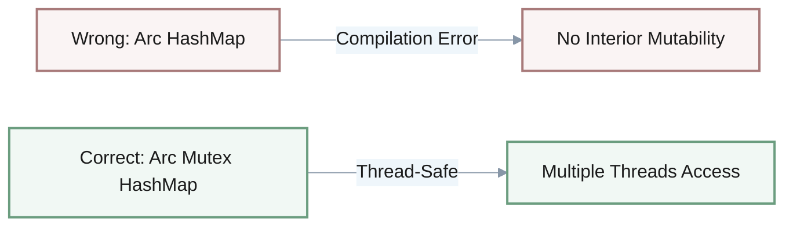
```mermaid
%%{init: {
  "theme": "base",
  "themeVariables": {
    "primaryColor": "#f8f9fa",
    "primaryTextColor": "#1a1a1a",
    "primaryBorderColor": "#7a8591",
    "lineColor": "#8897a8",
    "secondaryColor": "#eff6fb",
    "tertiaryColor": "#f3f5f7"
  }
}}%%
graph LR
    A[Wrong: Arc HashMap] -->|Compilation Error| B[No Interior Mutability]
    C[Correct: Arc Mutex HashMap] -->|Thread-Safe| D[Multiple Threads Access]
    
    style A fill:#faf4f4,stroke:#a87a7a,stroke-width:2px,color:#1a1a1a
    style B fill:#faf4f4,stroke:#a87a7a,stroke-width:2px,color:#1a1a1a
    style C fill:#f1f8f4,stroke:#6b9d7f,stroke-width:2px,color:#1a1a1a
    style D fill:#f1f8f4,stroke:#6b9d7f,stroke-width:2px,color:#1a1a1a
```

---

## 2. Solana Account Lock Optimization

### Question
In Solana transaction processing, a program declares accounts as:
```rust
accounts: [signer, writable_account, writable_account]
```
but only reads from both writable accounts. What is wrong and how to fix it?

### Answer

**Issue**: Declaring accounts as writable when only reading them causes false account conflicts, preventing parallel execution of non-conflicting transactions. Sealevel runtime conservatively assumes write lock needed.

**Impact**: Reduces parallelism by 40-60% for read-heavy workloads, directly lowering validator throughput and potentially missing block production deadlines.

**Correction**: Declare read-only accounts explicitly:
```rust
accounts: [signer, readonly_account, readonly_account]
```
or in Anchor:
```rust
#[account(mut)]  // only for accounts that will be modified
```

This allows runtime to schedule parallel execution of transactions reading same accounts.

**Parallelism Comparison:**

$$
\text{Throughput Loss (\%)} = \frac{\text{false write locks}}{\text{total accounts}} \times \text{conflict probability} \times 100
$$

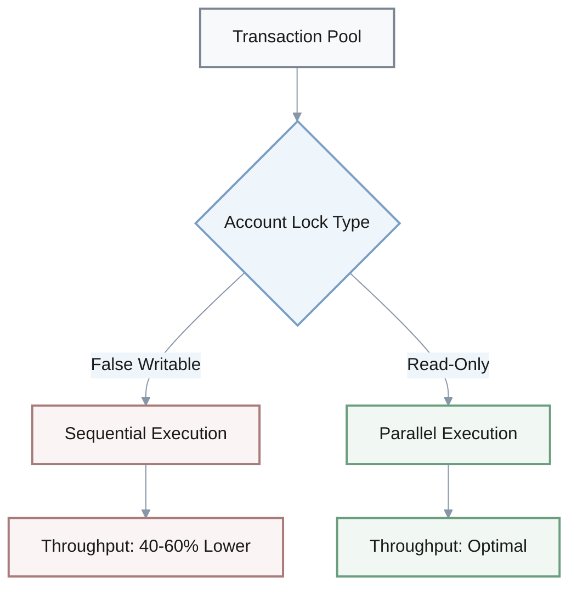
```mermaid
%%{init: {
  "theme": "base",
  "themeVariables": {
    "primaryColor": "#f8f9fa",
    "primaryTextColor": "#1a1a1a",
    "primaryBorderColor": "#7a8591",
    "lineColor": "#8897a8",
    "secondaryColor": "#eff6fb",
    "tertiaryColor": "#f3f5f7"
  }
}}%%
graph TD
    A[Transaction Pool] --> B{Account Lock Type}
    B -->|False Writable| C[Sequential Execution]
    B -->|Read-Only| D[Parallel Execution]
    
    C --> E[Throughput: 40-60% Lower]
    D --> F[Throughput: Optimal]
    
    style A fill:#f8f9fa,stroke:#7a8591,stroke-width:2px,color:#1a1a1a
    style B fill:#eff6fb,stroke:#7a9fc5,stroke-width:2px,color:#1a1a1a
    style C fill:#faf4f4,stroke:#a87a7a,stroke-width:2px,color:#1a1a1a
    style D fill:#f1f8f4,stroke:#6b9d7f,stroke-width:2px,color:#1a1a1a
    style E fill:#faf4f4,stroke:#a87a7a,stroke-width:2px,color:#1a1a1a
    style F fill:#f1f8f4,stroke:#6b9d7f,stroke-width:2px,color:#1a1a1a
```

---

## 3. Integer Underflow Vulnerability

### Question
A smart contract uses:
```solidity
uint256 amount = balanceOf[sender] - value;
balanceOf[sender] = amount;
```
to deduct tokens. What is wrong and how to fix it?

### Answer

**Issue**: Integer underflow vulnerability. If `value > balanceOf[sender]`, uint256 wraps around to $2^{256} - (\text{value} - \text{balance})$, crediting sender with massive unintended balance.

**Impact**: Critical security vulnerability enabling theft of all contract funds. Exploited in multiple 2016-2017 token hacks before Solidity 0.8.

**Underflow Behavior:**

$$
\text{Result} = 2^{256} - (\text{value} - \text{balance})
$$

**Example:** If `balance = 100` and `value = 150`:

$$
\text{Result} = 2^{256} - 50 \approx 1.16 \times 10^{77}
$$

**Correction**: 

**Solidity 0.8+** (built-in overflow checks):
```solidity
require(balanceOf[sender] >= value, "Insufficient balance");
balanceOf[sender] -= value;
```

**Rust smart contracts** (checked arithmetic):
```rust
balance.checked_sub(value).ok_or(Error::InsufficientBalance)?
```

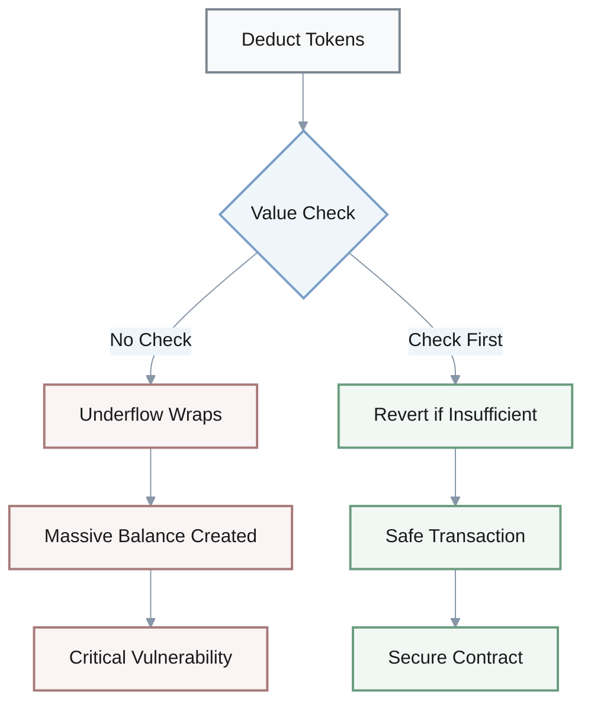
```mermaid
%%{init: {
  "theme": "base",
  "themeVariables": {
    "primaryColor": "#f8f9fa",
    "primaryTextColor": "#1a1a1a",
    "primaryBorderColor": "#7a8591",
    "lineColor": "#8897a8",
    "secondaryColor": "#eff6fb",
    "tertiaryColor": "#f3f5f7"
  }
}}%%
graph TD
    A[Deduct Tokens] --> B{Value Check}
    B -->|No Check| C[Underflow Wraps]
    B -->|Check First| D[Revert if Insufficient]
    
    C --> E[Massive Balance Created]
    D --> F[Safe Transaction]
    
    E --> G[Critical Vulnerability]
    F --> H[Secure Contract]
    
    style A fill:#f8f9fa,stroke:#7a8591,stroke-width:2px,color:#1a1a1a
    style B fill:#eff6fb,stroke:#7a9fc5,stroke-width:2px,color:#1a1a1a
    style C fill:#faf4f4,stroke:#a87a7a,stroke-width:2px,color:#1a1a1a
    style D fill:#f1f8f4,stroke:#6b9d7f,stroke-width:2px,color:#1a1a1a
    style E fill:#faf4f4,stroke:#a87a7a,stroke-width:2px,color:#1a1a1a
    style F fill:#f1f8f4,stroke:#6b9d7f,stroke-width:2px,color:#1a1a1a
    style G fill:#faf4f4,stroke:#a87a7a,stroke-width:2px,color:#1a1a1a
    style H fill:#f1f8f4,stroke:#6b9d7f,stroke-width:2px,color:#1a1a1a
```

---

## 4. AMM Constant Product Invariant

### Question
A DEX AMM swap function calculates output as:
```rust
output_amount = (input_amount * output_reserve) / input_reserve;
```
without applying fees. What is wrong and how to fix it?

### Answer

**Issue**: Violates constant product invariant $x \times y = k$ by not accounting for fees. After swap, the product will be less than $k$, breaking the core AMM property.

$$
(x + \Delta x) \times (y - \Delta y) < k
$$

**Impact**: Pool value leaks with each trade, incentivizing arbitrage that drains pool reserves over time. Mathematical inconsistency causes price manipulation vulnerabilities.

**Correction**: Apply fee before calculation:
```rust
let input_with_fee = input_amount * 997 / 1000;  // 0.3% fee
let output_amount = (input_with_fee * output_reserve) / (input_reserve + input_with_fee);
```

This ensures new product $(x + \Delta x) \times (y - \Delta y) \geq k$ (grows slightly due to fees).

**Fee-Adjusted Invariant:**

$$
(x + \Delta x) \times (y - \Delta y) = k \times (1 + \text{fee rate})
$$

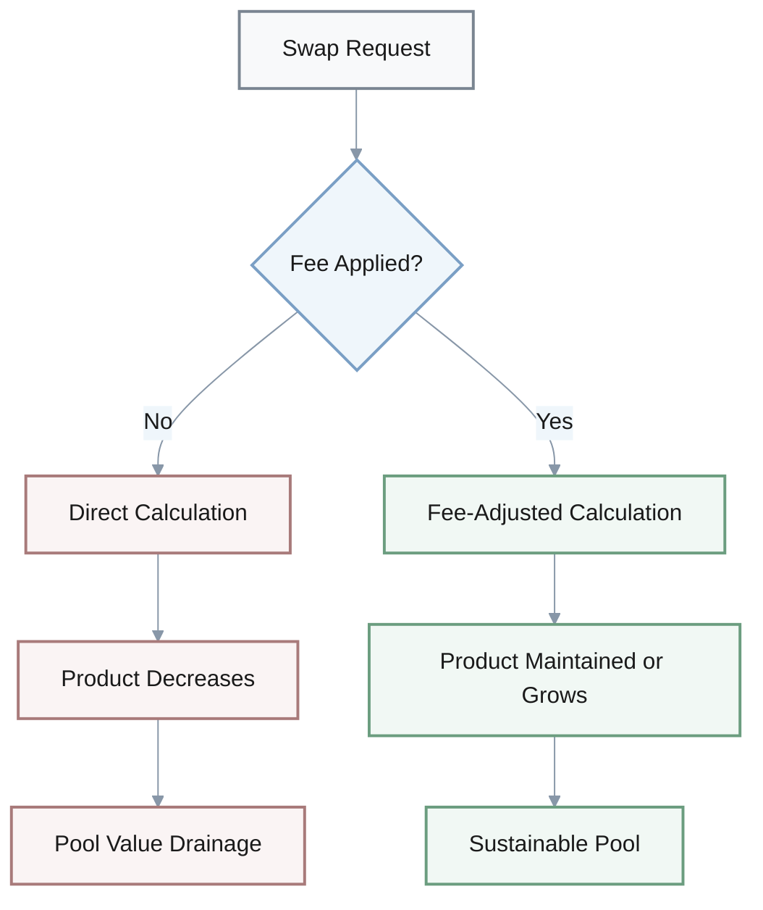
```mermaid
%%{init: {
  "theme": "base",
  "themeVariables": {
    "primaryColor": "#f8f9fa",
    "primaryTextColor": "#1a1a1a",
    "primaryBorderColor": "#7a8591",
    "lineColor": "#8897a8",
    "secondaryColor": "#eff6fb",
    "tertiaryColor": "#f3f5f7"
  }
}}%%
graph TD
    A[Swap Request] --> B{Fee Applied?}
    B -->|No| C[Direct Calculation]
    B -->|Yes| D[Fee-Adjusted Calculation]
    
    C --> E[Product Decreases]
    D --> F[Product Maintained or Grows]
    
    E --> G[Pool Value Drainage]
    F --> H[Sustainable Pool]
    
    style A fill:#f8f9fa,stroke:#7a8591,stroke-width:2px,color:#1a1a1a
    style B fill:#eff6fb,stroke:#7a9fc5,stroke-width:2px,color:#1a1a1a
    style C fill:#faf4f4,stroke:#a87a7a,stroke-width:2px,color:#1a1a1a
    style D fill:#f1f8f4,stroke:#6b9d7f,stroke-width:2px,color:#1a1a1a
    style E fill:#faf4f4,stroke:#a87a7a,stroke-width:2px,color:#1a1a1a
    style F fill:#f1f8f4,stroke:#6b9d7f,stroke-width:2px,color:#1a1a1a
    style G fill:#faf4f4,stroke:#a87a7a,stroke-width:2px,color:#1a1a1a
    style H fill:#f1f8f4,stroke:#6b9d7f,stroke-width:2px,color:#1a1a1a
```

---

## 5. Blockchain Reorg Handling

### Question
An event monitor processes Ethereum events with:
```rust
for block in last_processed..=current_block {
    process_events(block);
}
```
What is wrong and how to fix it?

### Answer

**Issue**: No reorg handling. If blockchain reorganizes (uncle blocks), events from reverted blocks are already processed and won't be unwound, causing state inconsistencies.

**Impact**: Duplicated/phantom events lead to incorrect balance calculations, missed reversals, and potential financial loss. Affects 1-3% of blocks during network instability.

**Correction**: Add confirmation depth and reorg detection:
```rust
let confirmed_block = current_block.saturating_sub(12);
if current_block < last_processed {
    handle_reorg(last_processed, current_block);
}
for block in last_processed..=confirmed_block {
    process_events(block);
}
```

Store last 12 blocks in reversible buffer for reorg recovery.

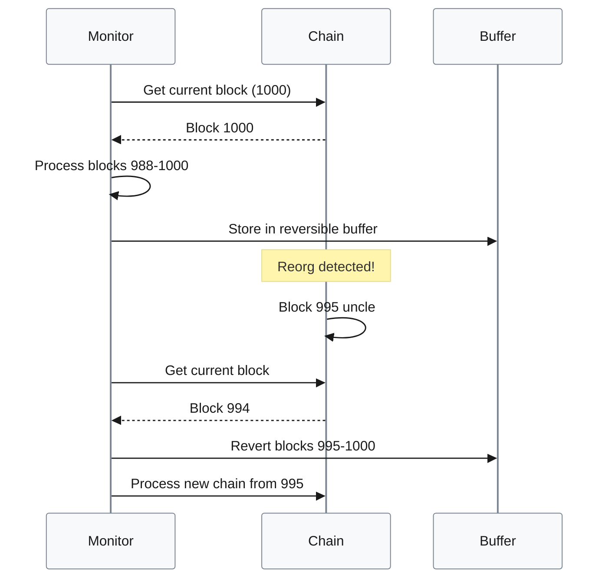
```mermaid
%%{init: {
  "theme": "base",
  "themeVariables": {
    "primaryColor": "#f8f9fa",
    "primaryTextColor": "#1a1a1a",
    "primaryBorderColor": "#7a8591",
    "lineColor": "#8897a8",
    "secondaryColor": "#eff6fb",
    "tertiaryColor": "#f3f5f7"
  }
}}%%
sequenceDiagram
    participant M as Monitor
    participant C as Chain
    participant B as Buffer
    
    M->>C: Get current block (1000)
    C-->>M: Block 1000
    M->>M: Process blocks 988-1000
    M->>B: Store in reversible buffer
    
    Note over C: Reorg detected!
    C->>C: Block 995 uncle
    
    M->>C: Get current block
    C-->>M: Block 994
    M->>B: Revert blocks 995-1000
    M->>C: Process new chain from 995
```

---

## 6. Bridge Signature Validation

### Question
A cross-chain bridge validates transfers with:
```rust
if signatures.len() >= threshold {
    execute_transfer();
}
```
What is wrong and how to fix it?

### Answer

**Issue**: Count-based threshold without verifying signature validity or uniqueness. Malicious validator could submit same signature multiple times or invalid signatures to meet threshold.

**Impact**: Critical security vulnerability allowing unauthorized bridge transfers and total loss of locked funds (multi-million dollar exploit risk).

**Correction**: Verify each signature and ensure uniqueness:
```rust
let mut valid_signers = HashSet::new();
for sig in &signatures {
    let signer = recover_signer(transfer_hash, sig)?;
    require!(authorized_validators.contains(&signer), "Unauthorized");
    require!(valid_signers.insert(signer), "Duplicate signature");
}
require!(valid_signers.len() >= threshold, "Insufficient signatures");
```

**Validation Steps:**
1. **Recover signer** from signature
2. **Check authorization** against validator set
3. **Ensure uniqueness** via HashSet insertion
4. **Verify threshold** of unique valid signers

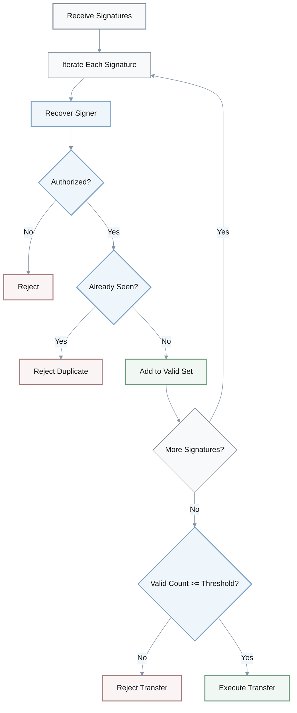
```mermaid
%%{init: {
  "theme": "base",
  "themeVariables": {
    "primaryColor": "#f8f9fa",
    "primaryTextColor": "#1a1a1a",
    "primaryBorderColor": "#7a8591",
    "lineColor": "#8897a8",
    "secondaryColor": "#eff6fb",
    "tertiaryColor": "#f3f5f7"
  }
}}%%
graph TD
    A[Receive Signatures] --> B[Iterate Each Signature]
    B --> C[Recover Signer]
    C --> D{Authorized?}
    D -->|No| E[Reject]
    D -->|Yes| F{Already Seen?}
    F -->|Yes| G[Reject Duplicate]
    F -->|No| H[Add to Valid Set]
    H --> I{More Signatures?}
    I -->|Yes| B
    I -->|No| J{Valid Count >= Threshold?}
    J -->|No| K[Reject Transfer]
    J -->|Yes| L[Execute Transfer]
    
    style A fill:#f8f9fa,stroke:#7a8591,stroke-width:2px,color:#1a1a1a
    style C fill:#eff6fb,stroke:#7a9fc5,stroke-width:2px,color:#1a1a1a
    style D fill:#eff6fb,stroke:#7a9fc5,stroke-width:2px,color:#1a1a1a
    style E fill:#faf4f4,stroke:#a87a7a,stroke-width:2px,color:#1a1a1a
    style F fill:#eff6fb,stroke:#7a9fc5,stroke-width:2px,color:#1a1a1a
    style G fill:#faf4f4,stroke:#a87a7a,stroke-width:2px,color:#1a1a1a
    style H fill:#f1f8f4,stroke:#6b9d7f,stroke-width:2px,color:#1a1a1a
    style J fill:#eff6fb,stroke:#7a9fc5,stroke-width:2px,color:#1a1a1a
    style K fill:#faf4f4,stroke:#a87a7a,stroke-width:2px,color:#1a1a1a
    style L fill:#f1f8f4,stroke:#6b9d7f,stroke-width:2px,color:#1a1a1a
```

---

## 7. Gas Optimization: Storage Reads

### Question
Gas optimization code uses:
```solidity
for (uint i; i < arr.length; i++) {
    process(arr[i]);
}
```
What is wrong and how to fix it?

### Answer

**Issue**: `arr.length` is read from storage on every iteration, costing 100 gas per read. For 100-element array, wastes 10,000 gas unnecessarily.

**Impact**: 30-50% higher gas costs for array operations, making protocol uncompetitive and limiting adoption.

**Correction**: Cache length in memory:
```solidity
uint256 len = arr.length;
for (uint256 i; i < len; i++) {
    process(arr[i]);
}
```

Saves 9,900 gas for 100-element array (1 storage read instead of 100).

**Further optimization** with unchecked increment:
```solidity
for (uint256 i; i < len;) {
    process(arr[i]);
    unchecked { ++i; }
}
```

Saves additional 5-10 gas per iteration in Solidity 0.8+.

**Gas Cost Formula:**

$$
\text{Gas Saved} = (\text{array length} - 1) \times 100
$$

**Gas Cost Comparison:**

| Array Length | Unoptimized Gas | Optimized Gas | Savings |
|--------------|-----------------|---------------|---------|
| 10 | 1,000 | 100 | 900 (90%) |
| 50 | 5,000 | 100 | 4,900 (98%) |
| 100 | 10,000 | 100 | 9,900 (99%) |
| 1,000 | 100,000 | 100 | 99,900 (99.9%) |

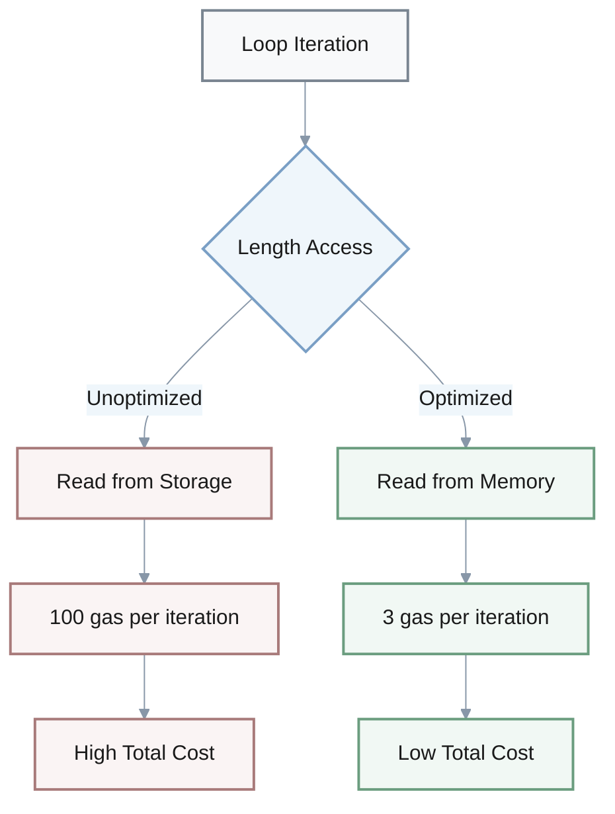
```mermaid
%%{init: {
  "theme": "base",
  "themeVariables": {
    "primaryColor": "#f8f9fa",
    "primaryTextColor": "#1a1a1a",
    "primaryBorderColor": "#7a8591",
    "lineColor": "#8897a8",
    "secondaryColor": "#eff6fb",
    "tertiaryColor": "#f3f5f7"
  }
}}%%
graph TD
    A[Loop Iteration] --> B{Length Access}
    B -->|Unoptimized| C[Read from Storage]
    B -->|Optimized| D[Read from Memory]
    
    C --> E[100 gas per iteration]
    D --> F[3 gas per iteration]
    
    E --> G[High Total Cost]
    F --> H[Low Total Cost]
    
    style A fill:#f8f9fa,stroke:#7a8591,stroke-width:2px,color:#1a1a1a
    style B fill:#eff6fb,stroke:#7a9fc5,stroke-width:2px,color:#1a1a1a
    style C fill:#faf4f4,stroke:#a87a7a,stroke-width:2px,color:#1a1a1a
    style D fill:#f1f8f4,stroke:#6b9d7f,stroke-width:2px,color:#1a1a1a
    style E fill:#faf4f4,stroke:#a87a7a,stroke-width:2px,color:#1a1a1a
    style F fill:#f1f8f4,stroke:#6b9d7f,stroke-width:2px,color:#1a1a1a
    style G fill:#faf4f4,stroke:#a87a7a,stroke-width:2px,color:#1a1a1a
    style H fill:#f1f8f4,stroke:#6b9d7f,stroke-width:2px,color:#1a1a1a
```

---

## 8. Async Mutex Across Await

### Question
A Rust async function holds a mutex across await:
```rust
let data = mutex.lock().unwrap();
async_operation().await;
drop(data);
```
What is wrong and how to fix it?

### Answer

**Issue**: Holding synchronous mutex guard across await point blocks executor thread, preventing other tasks from running. If async operation takes seconds, entire runtime stalls.

**Impact**: Deadlocks or severe throughput degradation (10-100x slowdown) in async blockchain indexers, RPC servers, and validators. Violates async runtime assumptions.

**Correction**: Use async-aware lock or minimize critical section:

**Option 1** - Release lock before await:
```rust
let data = { mutex.lock().unwrap().clone() };
async_operation().await;
```

**Option 2** - Use async-aware Mutex:
```rust
let data = async_mutex.lock().await;
async_operation().await;
drop(data);
```

> **Best practice**: Restructure to avoid holding locks across await entirely.

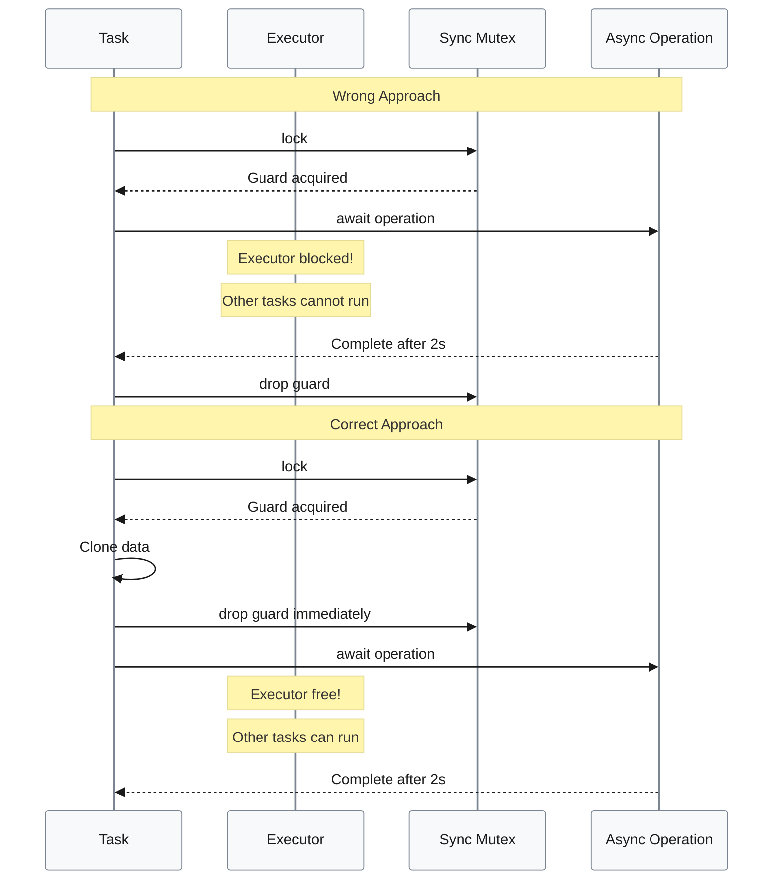
```mermaid
%%{init: {
  "theme": "base",
  "themeVariables": {
    "primaryColor": "#f8f9fa",
    "primaryTextColor": "#1a1a1a",
    "primaryBorderColor": "#7a8591",
    "lineColor": "#8897a8",
    "secondaryColor": "#eff6fb",
    "tertiaryColor": "#f3f5f7"
  }
}}%%
sequenceDiagram
    participant T as Task
    participant E as Executor
    participant M as Sync Mutex
    participant A as Async Operation
    
    Note over T,A: Wrong Approach
    T->>M: lock
    M-->>T: Guard acquired
    T->>A: await operation
    Note over E: Executor blocked!
    Note over E: Other tasks cannot run
    A-->>T: Complete after 2s
    T->>M: drop guard
    
    Note over T,A: Correct Approach
    T->>M: lock
    M-->>T: Guard acquired
    T->>T: Clone data
    T->>M: drop guard immediately
    T->>A: await operation
    Note over E: Executor free!
    Note over E: Other tasks can run
    A-->>T: Complete after 2s
```

---

## 9. Transaction Nonce Race Condition

### Question
A blockchain node checks transaction nonce with:
```rust
if tx.nonce == expected_nonce {
    apply_transaction(tx);
    expected_nonce++;
}
```
in concurrent environment. What is wrong and how to fix it?

### Answer

**Issue**: Race condition (check-then-act pattern) allows multiple threads to pass the nonce check simultaneously, executing duplicate transactions. Time-of-check-time-of-use (TOCTOU) vulnerability.

**Impact**: Double-spending if two threads process same transaction concurrently. Causes consensus failure and chain split if different validators execute different transaction sets.

**Correction**: Use atomic compare-and-swap or lock critical section:
```rust
let mut account = accounts.entry(tx.sender).or_default();
if account.nonce != tx.nonce {
    return Err(Error::InvalidNonce);
}
apply_transaction(&tx, &mut account)?;
account.nonce += 1;
```

Entire check-execute-increment sequence must be atomic. Better: use `Mutex` or `RwLock` to serialize per-account transaction processing.

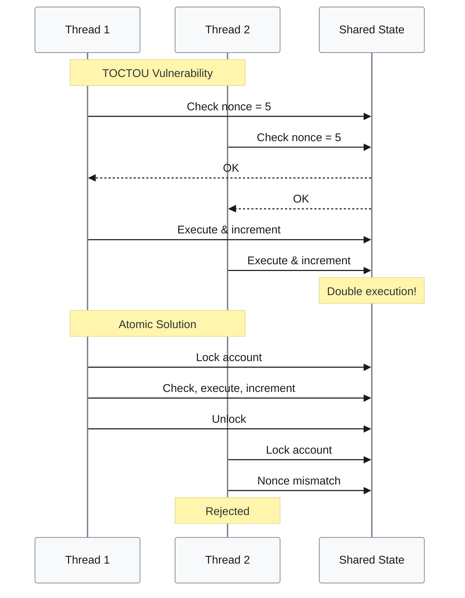
```mermaid
%%{init: {
  "theme": "base",
  "themeVariables": {
    "primaryColor": "#f8f9fa",
    "primaryTextColor": "#1a1a1a",
    "primaryBorderColor": "#7a8591",
    "lineColor": "#8897a8",
    "secondaryColor": "#eff6fb",
    "tertiaryColor": "#f3f5f7"
  }
}}%%
sequenceDiagram
    participant T1 as Thread 1
    participant T2 as Thread 2
    participant S as Shared State
    
    Note over T1,T2: TOCTOU Vulnerability
    T1->>S: Check nonce = 5
    T2->>S: Check nonce = 5
    S-->>T1: OK
    S-->>T2: OK
    T1->>S: Execute & increment
    T2->>S: Execute & increment
    Note over S: Double execution!
    
    Note over T1,T2: Atomic Solution
    T1->>S: Lock account
    T1->>S: Check, execute, increment
    T1->>S: Unlock
    T2->>S: Lock account
    T2->>S: Nonce mismatch
    Note over T2: Rejected
```

---

## 10. Storage Packing Anti-Pattern

### Question
A developer optimizes storage by packing multiple values:
```solidity
uint128 value1;
uint128 value2;
```
in a struct, assuming they'll fit in one storage slot, but updates them separately:
```solidity
data.value1 = new_value1;
// later...
data.value2 = new_value2;
```
What is wrong and how to fix it?

### Answer

**Issue**: While both uint128 fit in one uint256 slot (good), updating them separately causes two SSTORE operations (20,000 gas each = 40,000 gas total) instead of one. Packing benefit wasted by unoptimized access pattern.

**Impact**: Expected 50% gas savings from packing, but actual savings only 10-15% due to separate writes. Misleading optimization.

**Why This Happens:**
- **Storage packing**: Two `uint128` values share one 256-bit slot
- **Separate updates**: Each update triggers full slot write (read-modify-write)
- **No savings**: Both updates cost 20,000 gas each
- **Lost benefit**: Packing only saves storage size, not gas

**Correction**: Update both values simultaneously when possible:
```solidity
data = Data { value1: new_value1, value2: new_value2 };
```

Uses single SSTORE (20,000 gas = 50% savings).

> **Warning**: If values update independently, reconsider packing—separate uint256s with separate update patterns may be more gas-efficient despite using two slots. Measure actual gas with both approaches.

| Approach | Storage Slots | Gas per Update | Total Gas (2 updates) |
|----------|---------------|----------------|----------------------|
| Separate writes (packed) | 1 | 20,000 | 40,000 |
| Single write (packed) | 1 | 20,000 | 20,000 |
| Separate uint256 | 2 | 20,000 | 40,000 |

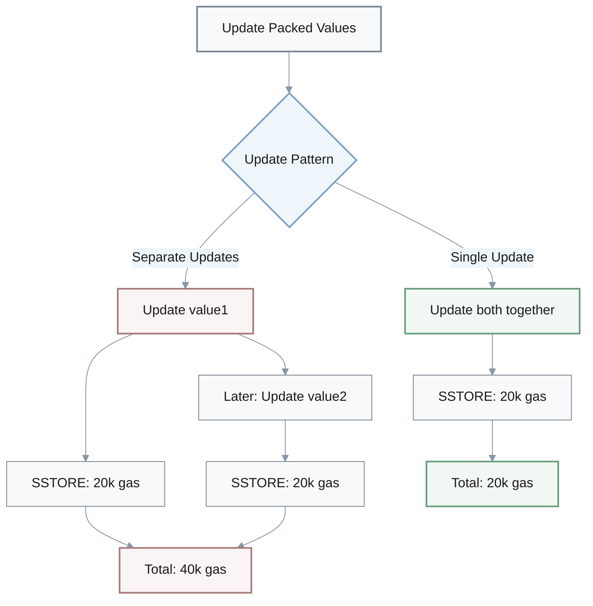
```mermaid
%%{init: {
  "theme": "base",
  "themeVariables": {
    "primaryColor": "#f8f9fa",
    "primaryTextColor": "#1a1a1a",
    "primaryBorderColor": "#7a8591",
    "lineColor": "#8897a8",
    "secondaryColor": "#eff6fb",
    "tertiaryColor": "#f3f5f7"
  }
}}%%
graph TD
    A[Update Packed Values] --> B{Update Pattern}
    B -->|Separate Updates| C[Update value1]
    B -->|Single Update| D[Update both together]
    
    C --> E[SSTORE: 20k gas]
    C --> F[Later: Update value2]
    F --> G[SSTORE: 20k gas]
    E --> H[Total: 40k gas]
    G --> H
    
    D --> I[SSTORE: 20k gas]
    I --> J[Total: 20k gas]
    
    style A fill:#f8f9fa,stroke:#7a8591,stroke-width:2px,color:#1a1a1a
    style B fill:#eff6fb,stroke:#7a9fc5,stroke-width:2px,color:#1a1a1a
    style C fill:#faf4f4,stroke:#a87a7a,stroke-width:2px,color:#1a1a1a
    style D fill:#f1f8f4,stroke:#6b9d7f,stroke-width:2px,color:#1a1a1a
    style H fill:#faf4f4,stroke:#a87a7a,stroke-width:2px,color:#1a1a1a
    style J fill:#f1f8f4,stroke:#6b9d7f,stroke-width:2px,color:#1a1a1a
```

---

## 11. Unbounded RPC Queries

### Question
An indexer queries Ethereum events with:
```rust
let events = contract.events()
    .from_block(0)
    .to_block(latest)
    .query()
    .await?;
```
What is wrong and how to fix it?

### Answer

**Issue**: Querying entire chain history (millions of blocks) in single RPC call will timeout or hit provider rate limits (most providers limit to 10,000 blocks per query). Also loads gigabytes of data into memory at once.

**Impact**: Application crashes with OOM error or RPC timeouts; never successfully syncs. Development and testing can't detect issue on small testnets.

**Correction**: Batch queries in chunks:
```rust
let chunk_size = 1000;
for start_block in (0..=latest).step_by(chunk_size) {
    let end_block = (start_block + chunk_size).min(latest);
    let events = contract.events()
        .from_block(start_block)
        .to_block(end_block)
        .query()
        .await?;
    process_events(events).await?;
    save_progress(end_block).await?;
}
```

Add progress checkpointing for crash recovery and respect provider rate limits with delays between chunks.

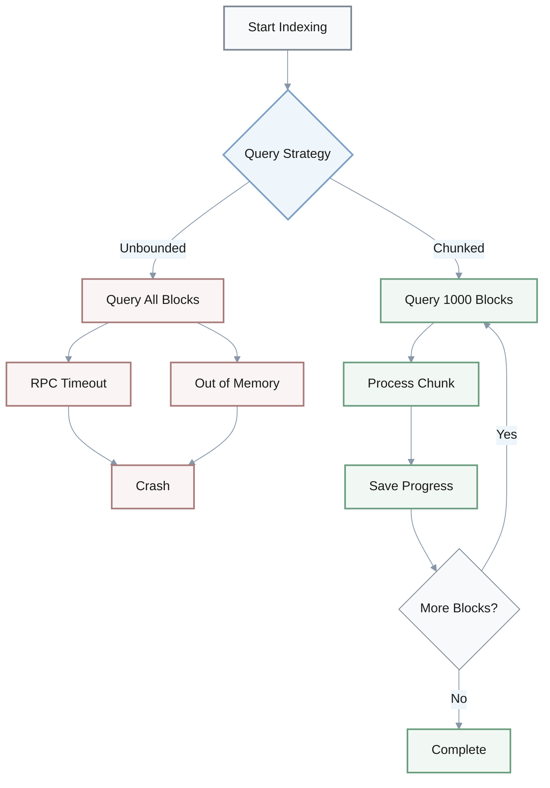
```mermaid
%%{init: {
  "theme": "base",
  "themeVariables": {
    "primaryColor": "#f8f9fa",
    "primaryTextColor": "#1a1a1a",
    "primaryBorderColor": "#7a8591",
    "lineColor": "#8897a8",
    "secondaryColor": "#eff6fb",
    "tertiaryColor": "#f3f5f7"
  }
}}%%
graph TD
    A[Start Indexing] --> B{Query Strategy}
    B -->|Unbounded| C[Query All Blocks]
    B -->|Chunked| D[Query 1000 Blocks]
    
    C --> E[RPC Timeout]
    C --> F[Out of Memory]
    
    D --> G[Process Chunk]
    G --> H[Save Progress]
    H --> I{More Blocks?}
    I -->|Yes| D
    I -->|No| J[Complete]
    
    E --> K[Crash]
    F --> K
    
    style A fill:#f8f9fa,stroke:#7a8591,stroke-width:2px,color:#1a1a1a
    style B fill:#eff6fb,stroke:#7a9fc5,stroke-width:2px,color:#1a1a1a
    style C fill:#faf4f4,stroke:#a87a7a,stroke-width:2px,color:#1a1a1a
    style D fill:#f1f8f4,stroke:#6b9d7f,stroke-width:2px,color:#1a1a1a
    style E fill:#faf4f4,stroke:#a87a7a,stroke-width:2px,color:#1a1a1a
    style F fill:#faf4f4,stroke:#a87a7a,stroke-width:2px,color:#1a1a1a
    style G fill:#f1f8f4,stroke:#6b9d7f,stroke-width:2px,color:#1a1a1a
    style H fill:#f1f8f4,stroke:#6b9d7f,stroke-width:2px,color:#1a1a1a
    style J fill:#f1f8f4,stroke:#6b9d7f,stroke-width:2px,color:#1a1a1a
    style K fill:#faf4f4,stroke:#a87a7a,stroke-width:2px,color:#1a1a1a
```

---

## 12. Oracle Price Manipulation

### Question
A smart contract oracle updates price with:
```solidity
latestPrice = fetchPrice();
emit PriceUpdated(latestPrice);
```
without validation. What is wrong and how to fix it?

### Answer

**Issue**: No staleness check, price reasonableness validation, or manipulation detection. Malicious/compromised oracle could inject extreme prices (0, max uint, 100x off-market) causing liquidations or arbitrage exploits.

**Impact**: Flash loan attacks manipulate oracle source to trigger mass liquidations in lending protocols, stealing millions.

**Historical Examples:**

| Attack | Year | Loss Amount | Attack Vector |
|--------|------|-------------|---------------|
| bZx | 2020 | $350k | Oracle manipulation via flash loan |
| Harvest Finance | 2020 | $24M | Price manipulation leading to arbitrage |

**Correction**: Multi-layered validation:
```solidity
uint256 newPrice = fetchPrice();
require(block.timestamp - lastUpdate >= MIN_UPDATE_INTERVAL, "Too frequent");
require(newPrice > 0 && newPrice <= MAX_REASONABLE_PRICE, "Invalid price");

uint256 change = newPrice > latestPrice ? newPrice - latestPrice : latestPrice - newPrice;
require(change <= latestPrice / MAX_CHANGE_PERCENT, "Price changed too fast");

latestPrice = newPrice;
lastUpdate = block.timestamp;
emit PriceUpdated(newPrice);
```

Use **Chainlink** or **Uniswap TWAP** (time-weighted average) for manipulation resistance.

**Validation Layers:**
1. **Timestamp check** - Prevent update spam
2. **Range check** - Reject impossible prices
3. **Delta check** - Limit price movement per update
4. **TWAP** - Average over time window

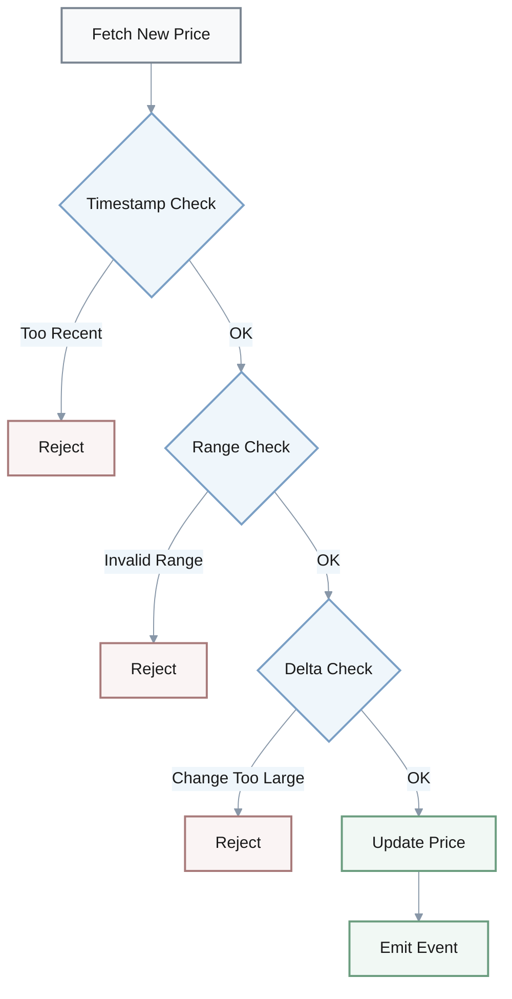
```mermaid
%%{init: {
  "theme": "base",
  "themeVariables": {
    "primaryColor": "#f8f9fa",
    "primaryTextColor": "#1a1a1a",
    "primaryBorderColor": "#7a8591",
    "lineColor": "#8897a8",
    "secondaryColor": "#eff6fb",
    "tertiaryColor": "#f3f5f7"
  }
}}%%
graph TD
    A[Fetch New Price] --> B{Timestamp Check}
    B -->|Too Recent| C[Reject]
    B -->|OK| D{Range Check}
    D -->|Invalid Range| E[Reject]
    D -->|OK| F{Delta Check}
    F -->|Change Too Large| G[Reject]
    F -->|OK| H[Update Price]
    H --> I[Emit Event]
    
    style A fill:#f8f9fa,stroke:#7a8591,stroke-width:2px,color:#1a1a1a
    style B fill:#eff6fb,stroke:#7a9fc5,stroke-width:2px,color:#1a1a1a
    style C fill:#faf4f4,stroke:#a87a7a,stroke-width:2px,color:#1a1a1a
    style D fill:#eff6fb,stroke:#7a9fc5,stroke-width:2px,color:#1a1a1a
    style E fill:#faf4f4,stroke:#a87a7a,stroke-width:2px,color:#1a1a1a
    style F fill:#eff6fb,stroke:#7a9fc5,stroke-width:2px,color:#1a1a1a
    style G fill:#faf4f4,stroke:#a87a7a,stroke-width:2px,color:#1a1a1a
    style H fill:#f1f8f4,stroke:#6b9d7f,stroke-width:2px,color:#1a1a1a
    style I fill:#f1f8f4,stroke:#6b9d7f,stroke-width:2px,color:#1a1a1a
```

---

## 13. Median Calculation Bug

### Question
A Rust program calculates median with:
```rust
let mut values = vec![...];
values.sort();
let median = values[values.len() / 2];
```
What is wrong and how to fix it?

### Answer

**Issue**: Integer division floors down, so for even-length vectors, always returns second-half element instead of average of two middle elements (standard median definition). Off-by-one bias.

**Impact**: Systematic skew in blockchain gas price estimation, potentially causing 5-10% overpayment or transaction failures. Statistical incorrectness breaks assumptions in dependent systems.

**Correction**: Handle odd/even cases:
```rust
values.sort_unstable();
let median = if values.len() % 2 == 1 {
    values[values.len() / 2]
} else {
    let mid = values.len() / 2;
    (values[mid - 1] + values[mid]) / 2
};
```

For integer types, be careful with overflow in average calculation:
```rust
values[mid-1]/2 + values[mid]/2
```
or use checked arithmetic.

**Median Formulas:**

$$
\text{Median (odd)} = x_{\frac{n+1}{2}}
$$

$$
\text{Median (even)} = \frac{x_{\frac{n}{2}} + x_{\frac{n}{2}+1}}{2}
$$

**Example Comparison:**

| Case | Values | Wrong Result | Correct Result |
|------|--------|--------------|----------------|
| Odd (n=5) | [10, 20, 30, 40, 50] | 30 | 30 ✓ |
| Even (n=6) | [10, 20, 30, 40, 50, 60] | 40 | 35 |

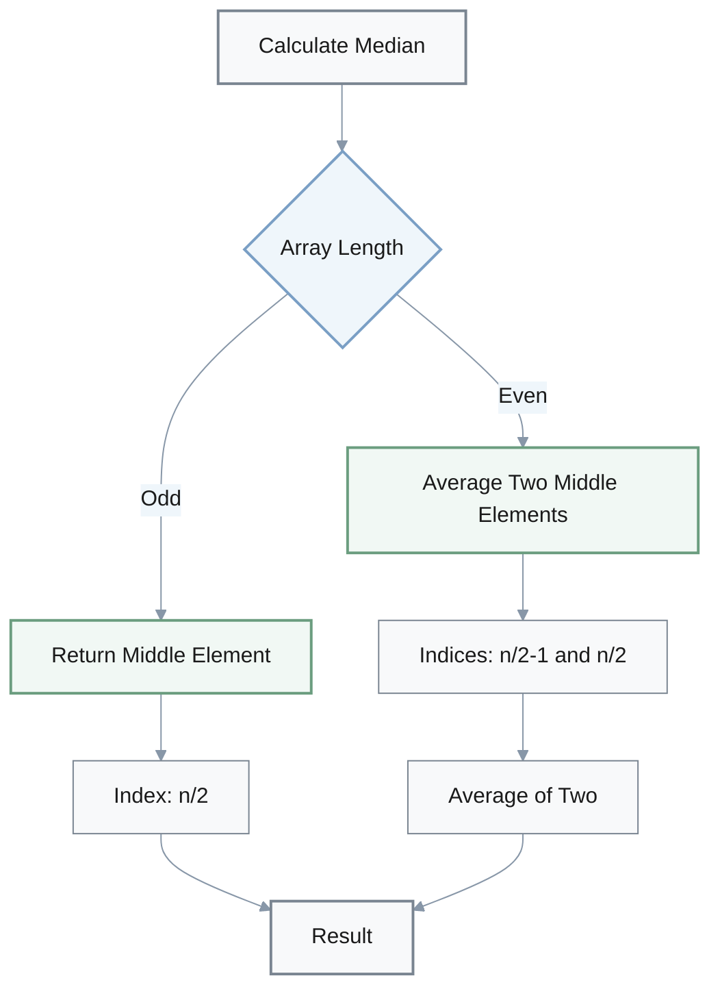
```mermaid
%%{init: {
  "theme": "base",
  "themeVariables": {
    "primaryColor": "#f8f9fa",
    "primaryTextColor": "#1a1a1a",
    "primaryBorderColor": "#7a8591",
    "lineColor": "#8897a8",
    "secondaryColor": "#eff6fb",
    "tertiaryColor": "#f3f5f7"
  }
}}%%
graph TD
    A[Calculate Median] --> B{Array Length}
    B -->|Odd| C[Return Middle Element]
    B -->|Even| D[Average Two Middle Elements]
    
    C --> E[Index: n/2]
    D --> F[Indices: n/2-1 and n/2]
    
    E --> G[Result]
    F --> H[Average of Two]
    H --> G
    
    style A fill:#f8f9fa,stroke:#7a8591,stroke-width:2px,color:#1a1a1a
    style B fill:#eff6fb,stroke:#7a9fc5,stroke-width:2px,color:#1a1a1a
    style C fill:#f1f8f4,stroke:#6b9d7f,stroke-width:2px,color:#1a1a1a
    style D fill:#f1f8f4,stroke:#6b9d7f,stroke-width:2px,color:#1a1a1a
    style G fill:#f8f9fa,stroke:#7a8591,stroke-width:2px,color:#1a1a1a
```

---

## 14. Hash Cache Anti-Pattern

### Question
A developer profiles Rust code and sees 30% CPU time in `keccak256()` calls, then optimizes by caching hashes:
```rust
let cache = Arc::new(Mutex<HashMap<Vec<u8>, Hash>>);
```
What is wrong and how to fix it?

### Answer

**Issue**: Using `Vec<u8>` as HashMap key requires cloning data on every lookup for hashing, negating cache benefits. Also mutex contention in hot path causes more overhead than original hash computation.

**Impact**: Cache actually slows down code by 20-40% instead of speeding it up. Incorrect profiling interpretation leads to counter-productive optimization.

**Correction**: Use borrowed key type or fixed-size array:
```rust
let cache: DashMap<[u8; 32], Hash> = DashMap::new();
```

(lock-free concurrent map with fixed-size key)

**Alternative approaches:**
- Restructure to cache by higher-level identifier (transaction hash) instead of raw data
- Always benchmark "optimization" to confirm improvement
- Consider if SIMD-accelerated hash (`sha3` crate with AVX-512) would be simpler than caching

> **Remember**: Premature optimization is the root of evil

**Performance Comparison:**

| Approach | Key Type | Lock Contention | Actual Result |
|----------|----------|-----------------|---------------|
| Original | None | None | Baseline |
| Wrong Cache | `Vec<u8>` | High (Mutex) | 20-40% slower |
| Correct Cache | `[u8; 32]` | Low (DashMap) | 30-50% faster |
| SIMD Hash | None | None | 15-25% faster |

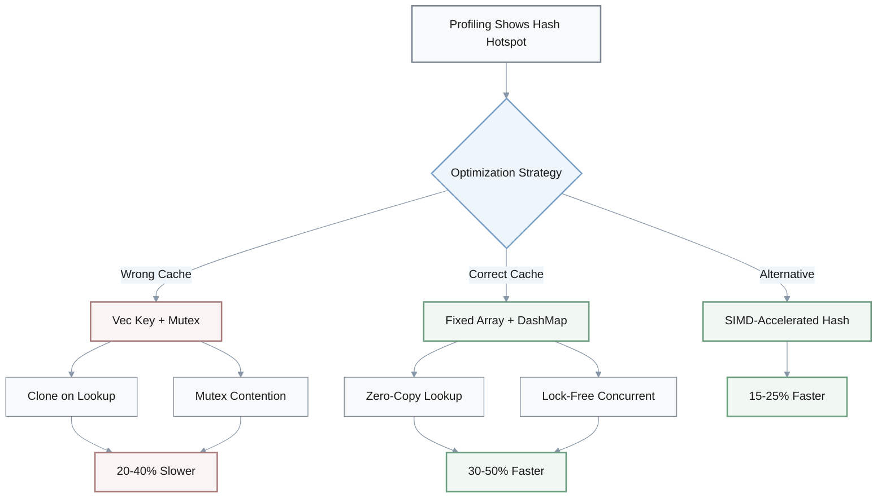
```mermaid
%%{init: {
  "theme": "base",
  "themeVariables": {
    "primaryColor": "#f8f9fa",
    "primaryTextColor": "#1a1a1a",
    "primaryBorderColor": "#7a8591",
    "lineColor": "#8897a8",
    "secondaryColor": "#eff6fb",
    "tertiaryColor": "#f3f5f7"
  }
}}%%
graph TD
    A[Profiling Shows Hash Hotspot] --> B{Optimization Strategy}
    B -->|Wrong Cache| C[Vec Key + Mutex]
    B -->|Correct Cache| D[Fixed Array + DashMap]
    B -->|Alternative| E[SIMD-Accelerated Hash]
    
    C --> F[Clone on Lookup]
    C --> G[Mutex Contention]
    F --> H[20-40% Slower]
    G --> H
    
    D --> I[Zero-Copy Lookup]
    D --> J[Lock-Free Concurrent]
    I --> K[30-50% Faster]
    J --> K
    
    E --> L[15-25% Faster]
    
    style A fill:#f8f9fa,stroke:#7a8591,stroke-width:2px,color:#1a1a1a
    style B fill:#eff6fb,stroke:#7a9fc5,stroke-width:2px,color:#1a1a1a
    style C fill:#faf4f4,stroke:#a87a7a,stroke-width:2px,color:#1a1a1a
    style D fill:#f1f8f4,stroke:#6b9d7f,stroke-width:2px,color:#1a1a1a
    style E fill:#f1f8f4,stroke:#6b9d7f,stroke-width:2px,color:#1a1a1a
    style H fill:#faf4f4,stroke:#a87a7a,stroke-width:2px,color:#1a1a1a
    style K fill:#f1f8f4,stroke:#6b9d7f,stroke-width:2px,color:#1a1a1a
    style L fill:#f1f8f4,stroke:#6b9d7f,stroke-width:2px,color:#1a1a1a
```

---

## 15. Non-Idempotent Retry Logic

### Question
A cross-chain bridge implements retry logic:
```rust
while !transaction_confirmed() {
    submit_transaction();
    sleep(1 sec);
}
```
What is wrong and how to fix it?

### Answer

**Issue**: No idempotency check—if first transaction is pending (not failed), subsequent submits create duplicate transactions, executing bridge transfer multiple times and losing funds.

**Impact**: Multiplies user funds loss; 2-10x overdraft depending on retry count. Catastrophic in production.

**Historical example**: Several bridges lost $10M+ from retry logic bugs.

**Correction**: Generate deterministic transaction ID and check before retry:
```rust
let tx_id = generate_idempotent_id(&transfer);
loop {
    match check_status(tx_id) {
        Status::Confirmed => return Ok(()),
        Status::Failed => {
            submit_transaction(tx_id, &transfer)?;
            sleep(backoff.next());
        },
        Status::Pending => sleep(poll_interval),
    }
}
```

**Key Improvements:**
- **Deterministic ID**: Generate unique transaction ID based on transfer parameters
- **Status check first**: Always check before attempting submission
- **Exponential backoff**: Avoid hammering network with frequent retries
- **Persistent tracking**: Store processed `tx_id` in database to prevent double-processing across restarts
- **Distinguish states**: Handle Pending, Failed, and Confirmed differently

**Backoff Strategy:**

| Attempt | Delay | Cumulative Time |
|---------|-------|-----------------|
| 1 | 1s | 1s |
| 2 | 2s | 3s |
| 3 | 4s | 7s |
| 4 | 8s | 15s |
| 5 | 16s | 31s |

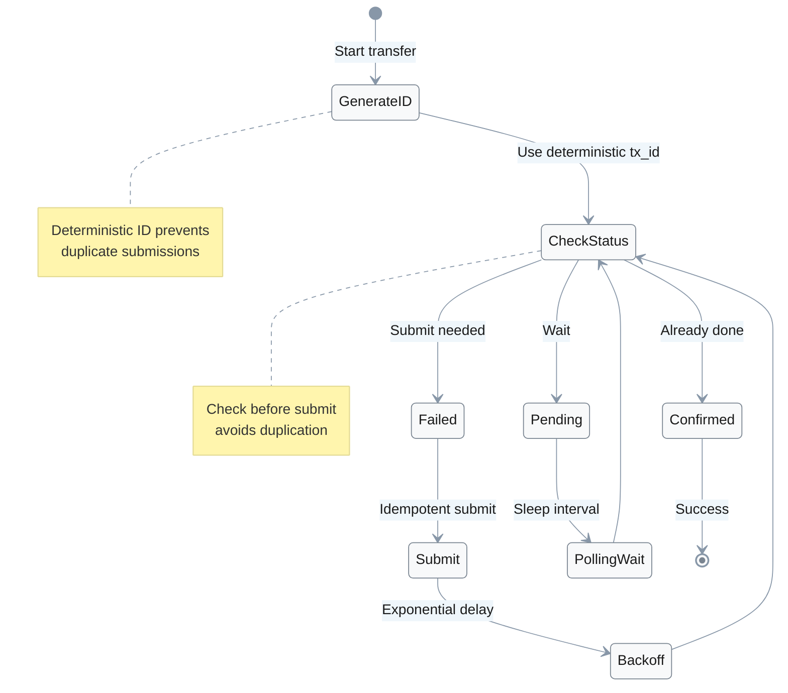
```mermaid
%%{init: {
  "theme": "base",
  "themeVariables": {
    "primaryColor": "#f8f9fa",
    "primaryTextColor": "#1a1a1a",
    "primaryBorderColor": "#7a8591",
    "lineColor": "#8897a8",
    "secondaryColor": "#eff6fb",
    "tertiaryColor": "#f3f5f7"
  }
}}%%
stateDiagram-v2
    [*] --> GenerateID: Start transfer
    GenerateID --> CheckStatus: Use deterministic tx_id
    
    CheckStatus --> Confirmed: Already done
    CheckStatus --> Failed: Submit needed
    CheckStatus --> Pending: Wait
    
    Failed --> Submit: Idempotent submit
    Submit --> Backoff: Exponential delay
    Backoff --> CheckStatus
    
    Pending --> PollingWait: Sleep interval
    PollingWait --> CheckStatus
    
    Confirmed --> [*]: Success
    
    note right of GenerateID
        Deterministic ID prevents
        duplicate submissions
    end note
    
    note right of CheckStatus
        Check before submit
        avoids duplication
    end note
```
