# 区块链 Rust 高级工程师决策场景问答

## 1. Solana DEX 高并发性能优化

### 问题场景

**Q**: 你负责的 Solana DEX 在主网上高峰期（> 50k TPS）时，订单撮合延迟从 50ms 飙升到 300ms,部分撮合失败还导致用户抱怨滑点异常。节点 CPU 占用 90% 以上、内存使用 12/32GB，而且监控指标还不完善。你会如何在不影响交易安全性的前提下，系统性地排查并降低延迟？请说明关键步骤和取舍。

### 当前状态

| 指标 | 正常值 | 高峰期值 | 偏差 |
|------|--------|----------|------|
| **TPS** | < 50k | > 50k | 超载 |
| **撮合延迟** | 50ms | 300ms | +500% |
| **CPU 占用** | < 70% | 90%+ | 过高 |
| **内存使用** | 12/32 GB | 12/32 GB | 正常 |
| **监控覆盖** | 完善 | 不完善 | 盲区 |

### 优化策略

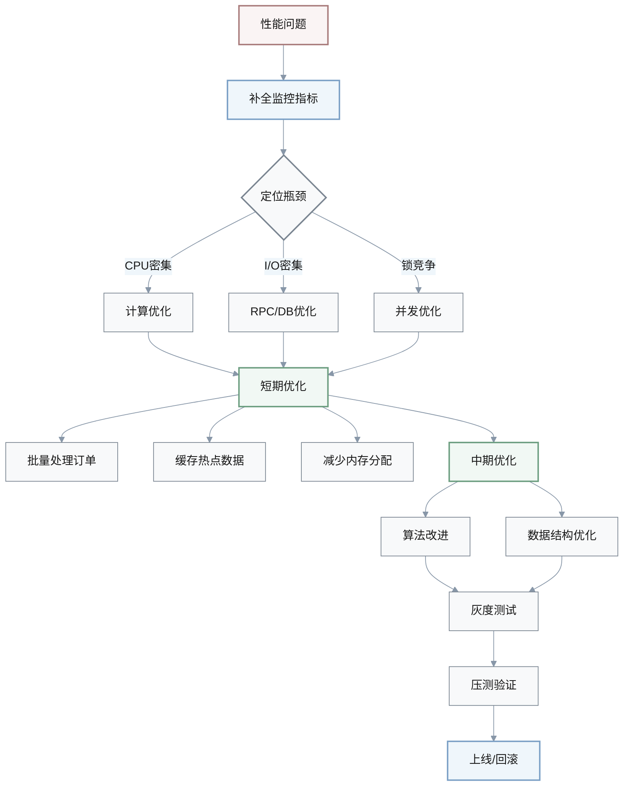

### 解决方案

**A**: 采取**监控先行、渐进优化**的策略：

#### 第一阶段：补全监控体系

- **Tracing/Metrics**: 为撮合路径添加延迟直方图
- **性能指标**: 每阶段 CPU/内存占用、队列长度
- **瓶颈定位**: 区分编排逻辑、链上调用、RPC I/O

#### 第二阶段：短期优化（无行为改变）

- **批量处理**: 减少链上调用/事件数量
- **缓存机制**: 缓存热点行情/订单簿
- **内存优化**: 避免不必要的 `clone`/分配

#### 第三阶段：中期优化（算法改进）

- **数据结构**: 有序数组 + 二分 或 跳表，替代线性扫描
- **性能边界**: 设定性能与一致性阈值
- **流量控制**: 限流/排队，避免撮合错误

#### 第四阶段：验证与部署

- **灰度环境**: 压测 + 回滚预案
- **量化评估**: 每次改动都有可量化收益

> **原则**: 宁可丢弃极端流量，也避免撮合错误或状态不一致

---

## 2. 跨链桥架构方案选择

### 问题场景

**Q**: 团队计划上线以太坊 ↔ Solana 跨链桥，你需要在「多签验证者桥」与「轻客户端桥」之间做方案选择。业务要求 1–6 个月内上线 MVP，日跨链规模预计 500–2000 ETH 等值，安全性优先于极致性能。你会选哪种方案？为什么？如何控制剩余风险？

### 方案对比

| 维度 | 多签验证者桥 | 轻客户端桥 |
|------|-------------|-----------|
| **开发周期** | 1–6 个月 ✓ | 6–12 个月 |
| **实现复杂度** | 简单 ✓ | 复杂 |
| **链上成本** | 低 ✓ | 中 |
| **安全模型** | 委员会信任 | 原生链安全 ✓ |
| **验证方式** | 2/3+1 门限签名 | 轻客户端验证 |
| **适用场景** | MVP 快速上线 ✓ | 长期生产环境 |

### 架构演进路径

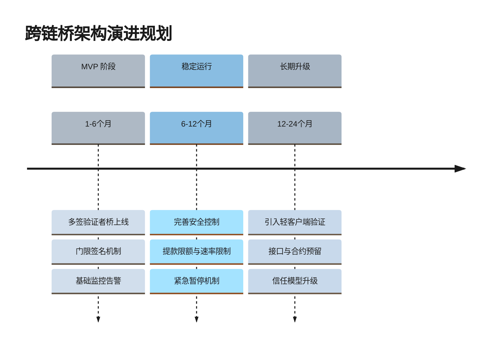

### 解决方案

**A**: 在给定时间与复杂度约束下，优先选择**门限多签验证者桥**

#### 选择理由

- **时间约束**: 1–6 个月内可交付 MVP
- **实现简单**: 开发成本低，上线更快
- **链上成本**: Gas 费用可控

#### 安全控制措施

1. **验证者准入**
   - 质押机制
   - 声誉评估体系

2. **签名机制**
   - 2/3+1 门限签名
   - 多方计算（MPC）

3. **风险控制**
   - 提款限额：单笔上限
   - 速率限制：每小时 1000 ETH 等值
   - 紧急暂停开关

4. **监控体系**
   - 异常提款告警
   - 验证者行为监控
   - 定期安全审计

#### 演进路径

> **中长期规划**: 预留轻客户端桥的接口与合约结构，待团队和预算允许时逐步升级，将信任模型从「委员会信任」升级为「接近原生链安全性」

---

## 3. 以太坊 Gas 优化排查

### 问题场景

**Q**: 你接手一份 Rust 智能合约代码，最近一次以太坊升级后，同样一组批量转账操作 Gas 费用从 300k 飙升到 800k，用户开始抱怨成本过高。你会如何判定问题主要在链上逻辑、存储访问，还是事件/日志？你会按照什么顺序优化，确保不引入安全回归？

### Gas 消耗分析

$$
\text{Total Gas} = \text{Storage Gas} + \text{Computation Gas} + \text{Event Gas}
$$

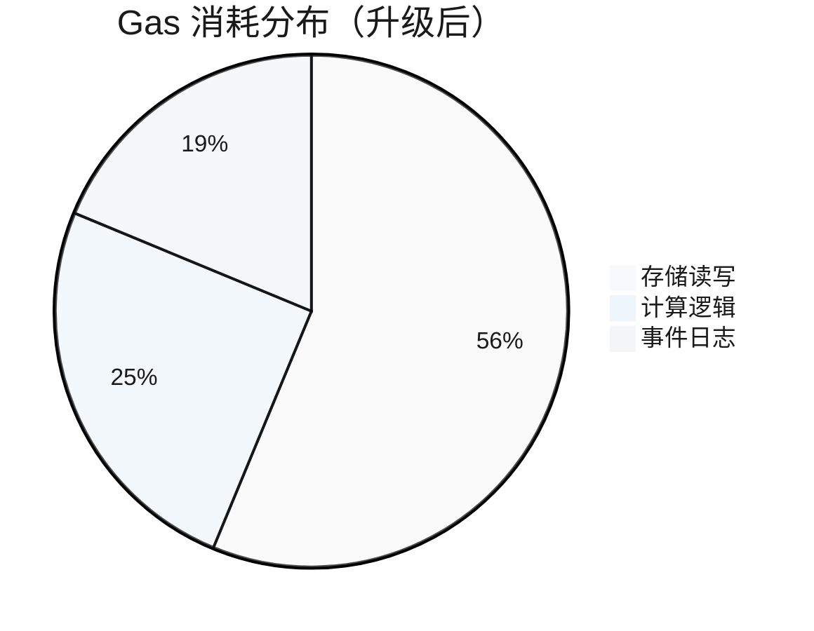

### 排查流程

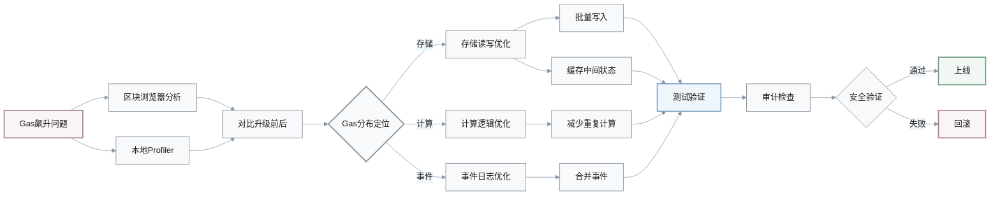

### 解决方案

**A**: 采取**分析定位、行为等价优化、安全验证**的三步策略

#### 步骤 1: 定位 Gas 消耗

使用以下工具进行分析：

- **区块浏览器**: 对比升级前后 Gas 分布
- **Profiler 工具**: `trace debug`、Gas 报告
- **代码 diff**: 分析最近合约改动

将 Gas 消耗拆分为三个维度：

| 维度 | 常见原因 | 优化方向 |
|------|---------|---------|
| **存储读写** | 频繁 SSTORE/SLOAD | 批量写入、缓存 |
| **计算逻辑** | 循环、映射嵌套 | 算法优化 |
| **事件日志** | 频繁 emit | 合并事件 |

#### 步骤 2: 优化顺序（行为等价）

1. **批量写入**
   - 从逐笔保存改为缓存后一次写入
   - 使用内存 HashMap 缓存中间状态

2. **减少重复读写**
   - 避免重复 SLOAD
   - 内存变量复用

3. **合并事件**
   - 从逐笔事件改为批次事件
   - 保持外部接口不变

#### 步骤 3: 安全验证

- **单元测试**: 覆盖所有优化路径
- **回归测试**: 确保行为一致性
- **安全审计**: 重点检查
  - 整数溢出
  - 重入风险
  - 授权边界

> **原则**: Gas 降低不以安全性为代价

---

## 4. 以太坊状态 Trie 性能优化

### 问题场景

**Q**: 以太坊状态 Trie 在主网同步时明显拖慢区块处理：p95 区块处理时间从 400ms 提升到 900ms，CPU 主要耗在 Trie 查询与 Merkle 证明生成。你已经采集到缓存命中率、DB 读写和哈希计算等指标。在「调大缓存」「优化 RocksDB 参数」「重构 Trie 结构」三类方案中，你会如何排序试验？依据是什么？

### 性能指标

| 指标 | 正常值 | 当前值 | 目标值 |
|------|--------|--------|--------|
| **p95 区块处理** | 400ms | 900ms | < 500ms |
| **缓存命中率** | > 80% | < 70% | > 85% |
| **DB I/O 延迟** | < 10ms | 15-30ms | < 12ms |
| **CPU 占用** | < 60% | 80%+ | < 70% |

### 优化方案排序

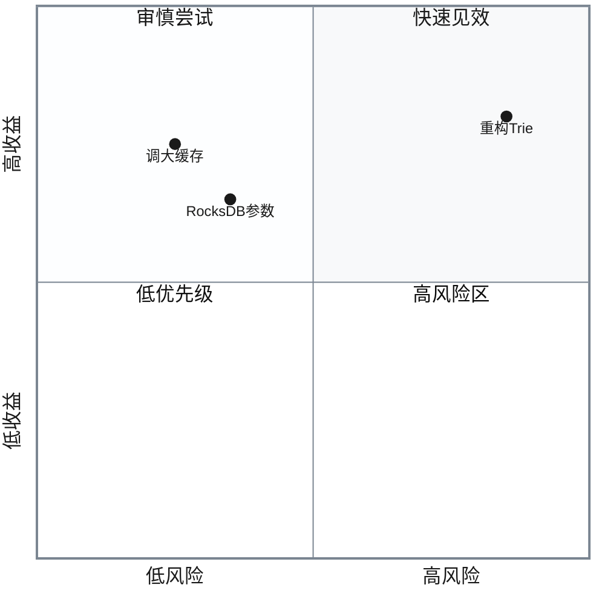

### 解决方案

**A**: 按照**风险最小、回滚成本最低**的原则排序优化

#### 阶段 1: 缓存优化（优先级最高）

**判断条件**: 缓存命中率 < 70% 且 DB I/O 延迟高

**优化措施**:
- **调大 RocksDB block cache**: 8MB → 512MB–2GB
- **启用/优化 Bloom Filter**: 减少不必要的磁盘读取
- **验证指标**: 缓存命中率、p95 I/O 延迟

**优势**:
- ✅ 风险最小
- ✅ 回滚成本最低
- ✅ 快速见效

#### 阶段 2: RocksDB 参数调优（中等优先级）

**前提条件**: 缓存优化后仍未达标

**调优参数**:

| 参数 | 默认值 | 调整建议 | 影响 |
|------|--------|---------|------|
| `write_buffer_size` | 64MB | 128MB–256MB | 写性能 |
| `max_write_buffer_number` | 2 | 4-6 | 写吞吐 |
| `compaction_style` | Level | Universal | 读性能 |
| `block_cache` | 8MB | 512MB–2GB | 读性能 |

**验证指标**:
- 整体块处理延迟
- 写放大系数
- 空间放大系数

#### 阶段 3: Trie 结构重构（最后考虑）

**触发条件**: 缓存与 DB 已优化，瓶颈仍在 Trie 逻辑

**重构方向**:
- 重新设计键空间
- 路径压缩
- Verkle Tree 升级

**风险评估**:
- ❌ 高风险
- ❌ 高工作量
- ❌ 需要长期验证

> **决策原则**: 只有在前两个阶段无法达标时，才启动架构级重构

---

## 5. 钱包私钥内存安全

### 问题场景

**Q**: 你维护的多链 Rust 钱包最近暴露出一个关键问题：由于内存清零不严格，某些环境下解密后的私钥在进程内存中残留时间过长。团队讨论中，有人建议先上线新功能再「顺便修复」，有人主张立即停更/只打安全补丁。你会如何评估风险并推动决策？具体行动步骤是什么？

### 威胁建模

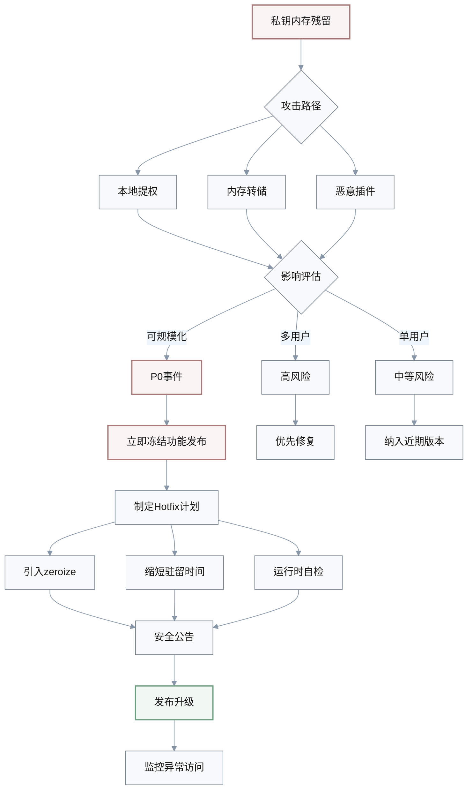

### 风险评估矩阵

| 攻击路径 | 可行性 | 影响范围 | 可规模化 | 优先级 |
|---------|--------|---------|---------|--------|
| **本地提权** | 中 | 单用户 | 否 | P1 |
| **内存转储** | 高 | 单用户 | 是 | P0 |
| **恶意插件** | 高 | 多用户 | 是 | P0 |

### 解决方案

**A**: 从**威胁建模**入手，评估风险等级后推动决策

#### 步骤 1: 威胁分析

分析以下维度：

1. **泄露路径**
   - 本地提权
   - 内存转储
   - 恶意插件

2. **影响范围**
   - 单用户 vs 多用户
   - 是否可规模化利用

3. **合规/声誉成本**
   - 监管要求
   - 品牌影响

#### 步骤 2: 风险分级

- **P0 安全事件**: 立即冻结非安全功能发布
- **P1 问题**: 纳入最近 1-2 个版本
- **低优先级**: 常规修复流程

#### 步骤 3: Hotfix 计划（P0 场景）

1. **技术措施**
   - 引入 `zeroize` 等内存清理机制
   - 缩短密钥驻留时间
   - 增加运行时自检

2. **流程管理**
   - 发布安全公告
   - 升级指引
   - 监控遥测

3. **后续监控**
   - 日志与遥测
   - 异常访问模式检测

> **决策边界**: 在评审中明确「功能 vs 安全」的取舍边界与负责人

---

## 6. 区块链节点性能优化

### 问题场景

**Q**: 某 Rust 区块链节点在高负载下 CPU 长期 95%+、内存 8/16GB，p95 区块处理时间逼近共识阈值。你有有限的时间窗口（1–2 周）做性能优化。你会怎样在「代码级优化（算法/数据结构）」「系统级优化（线程/调度/配置）」「架构级变更（分片/模块拆分）」之间做优先级排序？为什么？

### 优化方案对比

| 优化层级 | 时间成本 | 风险等级 | 预期收益 | 可回滚性 | 1-2周内可行 |
|---------|---------|---------|---------|---------|-----------|
| **代码级** | 3-7天 | 低 | 20-50% | 高 | ✓ |
| **系统级** | 2-5天 | 低-中 | 15-40% | 高 | ✓ |
| **架构级** | 4-12周 | 高 | 50-200% | 低 | ✗ |

### 优化流程

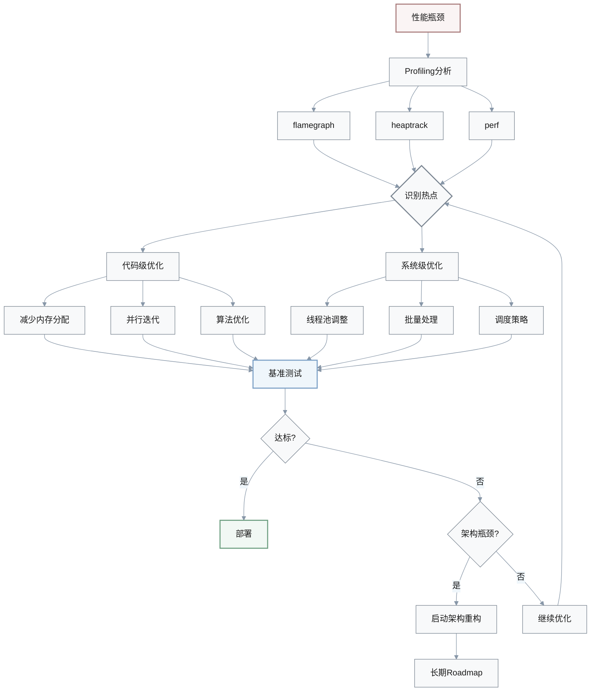

### 解决方案

**A**: 在 1–2 周窗口下优先做**可验证、可回滚、影响面小**的优化

#### 阶段 1: Profiling 分析

使用工具识别热点：

- **flamegraph**: CPU 热点分析
- **heaptrack**: 内存分配追踪
- **perf**: 系统级性能分析

#### 阶段 2: 代码级优化（优先）

**优化方向**:

1. **内存优化**
   - 减少不必要的 `clone()`
   - 使用 `&str` 替代 `String`
   - 对象池复用

2. **并行化**
   - 使用 `rayon` 并行迭代
   - 将串行计算改为并行

3. **算法改进**
   - 缓存重复计算
   - 更高效的数据结构

**预期收益**: 20–50% 性能提升

#### 阶段 3: 系统级优化（并行）

**调整参数**:

| 参数 | 调整方向 | 影响 |
|------|---------|------|
| **线程池大小** | CPU 核心数 × 2 | 并发能力 |
| **批量大小** | 增大 | 吞吐量 |
| **调度策略** | 优先级队列 | 延迟 |

**预期收益**: 15–40% 性能提升

#### 阶段 4: 架构级变更（最后考虑）

**触发条件**: Profiling 显示瓶颈来自架构层

**架构问题示例**:
- 单线程全局锁
- 单节点承担全部验证工作

**解决方案**:
- 拆成更长期的 Roadmap
- 分片/模块拆分

> **原则**: 每次改动都有基准测试与回滚预案，避免引入共识/状态不一致

---

## 7. DEX 紧急事件响应

### 问题场景

**Q**: 生产环境中的 Solana DEX 在某些极端行情下出现**滑点异常和部分用户资产短暂冻结**的问题，但监控告警并不明显。你作为值班工程师，需要在 30–60 分钟内给出处理策略。你会如何在「立刻停机/熔断」「仅限制高风险交易」「先观察再处理」之间做决策？

### 决策流程

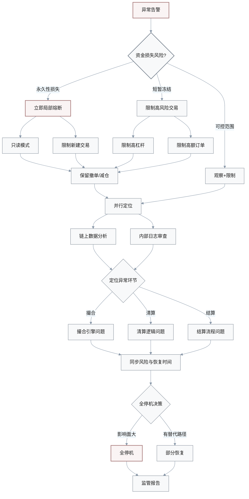

### 风险评估矩阵

| 场景 | 资金损失 | 影响范围 | 恢复时间 | 策略 |
|------|---------|---------|---------|------|
| **永久性资产损失** | 不可逆 | 全局 | > 12h | 立即熔断 |
| **连锁清算风险** | 可能扩大 | 部分用户 | 2-6h | 局部熔断 |
| **短暂冻结** | 可恢复 | 个别用户 | < 2h | 限制高风险 |
| **滑点异常** | 用户体验 | 部分交易 | < 1h | 观察+限制 |

### 解决方案

**A**: 快速评估**用户资金永久性损失风险**，采取分级响应

#### 步骤 1: 风险评估（5分钟内）

**P0 事件** - 立即触发**局部熔断**:
- 不可逆资产损失
- 连锁清算风险

**P1 事件** - **限制高风险交易**:
- 短暂冻结
- 可通过重启/重放缓解

#### 步骤 2: 熔断策略

**局部熔断/只读模式**:
- ✅ 保留: 撤单、减仓等风险缓释操作
- ❌ 限制: 新建高风险交易（高杠杆/高额订单）

**完全停机**:
- 触发条件: 影响面广 + 无替代路径 + 监管要求

#### 步骤 3: 并行定位（10-20分钟）

1. **链上数据分析**
   - 交易序列
   - 状态变更

2. **内部日志审查**
   - 撮合引擎
   - 清算逻辑
   - 结算流程

#### 步骤 4: 沟通协调

同步以下信息：
- 业务/风控团队
- 合规部门
- 预期恢复时间

> **决策原则**: 优先保护用户资产与系统信誉，再考虑短期交易量损失

---

## 8. 技术面试评估策略

### 问题场景

**Q**: 面试高级 Rust 区块链工程师时，你发现候选人在 Rust 语言、异步并发和性能调优上表现很强，但对区块链共识、安全模型和经济激励理解较弱。你需要在 60–90 分钟的面试内做出「是否继续推进」的决定。你会怎样设计后续追问或补充环节，以做出更可靠的录用判断？

### 候选人能力矩阵

```mermaid
%%{init: {
  "theme": "base",
  "themeVariables": {
    "primaryColor": "#f8f9fa",
    "primaryTextColor": "#1a1a1a",
    "primaryBorderColor": "#7a8591",
    "lineColor": "#8897a8",
    "secondaryColor": "#eff6fb",
    "tertiaryColor": "#f3f5f7"
  }
}}%%
radar
    title 候选人能力评估
    x-axis [Rust语言, 异步并发, 性能调优, 共识机制, 安全模型, 经济激励, 系统设计]
    dataset a:
        data: [9, 8, 9, 4, 4, 3, 7]
    dataset b:
        data: [7, 7, 7, 7, 7, 7, 7]
```

### 岗位需求映射

| 岗位类型 | 技术权重 | 领域权重 | 候选人匹配度 | 风险 |
|---------|---------|---------|------------|------|
| **底层客户端** | 70% | 30% | ✓ 高 | 低 |
| **共识引擎** | 50% | 50% | ⚠ 中 | 中 |
| **跨链桥核心** | 40% | 60% | ✗ 低 | 高 |
| **DeFi 协议** | 30% | 70% | ✗ 低 | 高 |

### 评估流程

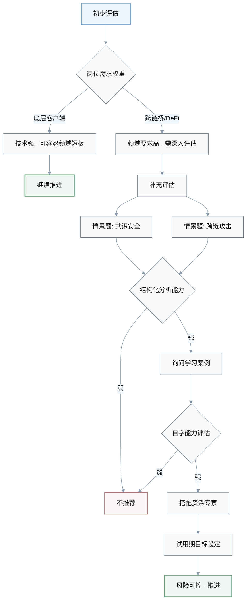

### 解决方案

**A**: 明确岗位需求的**「硬技能 vs 领域认知」权重**，设计补充评估

#### 步骤 1: 岗位匹配度分析

根据岗位类型判断：

**底层客户端开发**:
- 技术权重: 70%
- 可容忍领域短板
- 有学习曲线空间

**跨链桥/DeFi 核心**:
- 领域权重: 60-70%
- 安全/经济理解要求高
- 短板风险大

#### 步骤 2: 补充评估环节

**追加情景题** (15-20分钟):

1. **共识安全场景**
   - 评估结构化分析能力
   - 观察信息不足时的思维方式

2. **跨链攻击面分析**
   - 风险识别能力
   - 安全意识

**学习能力评估** (10-15分钟):

询问问题：
- 过往在陌生领域的学习案例
- 自学方法与成果
- 跨领域协作经验

#### 步骤 3: 风险对冲方案

**可接受场景**:

| 对冲措施 | 适用条件 | 执行方式 |
|---------|---------|---------|
| **搭配资深专家** | 团队有 mentor | 定期 review |
| **试用期目标** | 3-6个月学习期 | 明确考核点 |
| **降低职级** | 预算允许 | 成长空间 |

**团队同步**:
- 当前评估: 技术强、领域弱
- 风险点与对冲方案
- 团队结构与承受能力

> **决策依据**: 团队结构与风险承受能力，而非只看单轮面试表现

---

## 9. 跨链桥灰度发布策略

### 问题场景

**Q**: 你需要为一个 Rust 编写的跨链桥设计上线方案，约束是：已有用户量较小但 TVL 可能在 3–6 个月内快速增长，团队运维能力有限。你会如何在「一次性全量切换」「分阶段灰度（canary）」「仅在部分链/资产上先行启用」之间制定策略？为什么？

### 发布策略对比

| 策略 | 上线速度 | 风险等级 | 运维压力 | TVL增长适配 | 推荐度 |
|------|---------|---------|---------|-----------|--------|
| **全量切换** | 最快 | 高 | 低 | 差 | ✗ |
| **分阶段灰度** | 中 | 低 | 中 | 好 | ✓✓ |
| **部分链/资产** | 慢 | 最低 | 高 | 最好 | ✓✓✓ |

### 灰度发布流程

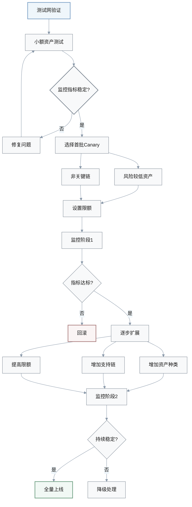

### 监控指标

| 指标 | 阈值 | 告警级别 | 处理策略 |
|------|------|---------|---------|
| **跨链成功率** | > 99.5% | P0 | 立即回滚 |
| **平均延迟** | < 5min | P1 | 限流 |
| **异常告警数** | < 10/天 | P1 | 调查 |
| **TVL 增速** | 监控 | P2 | 动态调整限额 |

### 解决方案

**A**: 在 TVL 预期快速增长且运维能力有限的情况下，优先选择**分阶段灰度 + 资产/链分批上线**

#### 阶段 1: 测试网验证

- **环境**: 测试网/小额资产
- **目标**: 验证稳定性和监控体系
- **验收**: 监控指标达标

#### 阶段 2: 首批 Canary

**选择标准**:
- ✅ 风险较低资产（稳定币、主流币）
- ✅ 对生态关键性较低的链
- ✅ 用户量小、影响面可控

**限额设置**:

| 资产类型 | 单笔限额 | 日限额 | 总 TVL 限额 |
|---------|---------|--------|-----------|
| **稳定币** | $10k | $100k | $1M |
| **主流币** | $5k | $50k | $500k |
| **长尾资产** | $1k | $10k | $100k |

#### 阶段 3: 逐步扩展

**扩展路径**:

1. **增加资产种类**
   - 从稳定币 → 主流币 → 长尾资产

2. **增加支持链**
   - 从低风险链 → 主流链 → 新兴链

3. **提高限额**
   - 根据监控指标动态调整

#### 阶段 4: 持续监控

**关键指标**:
- 跨链成功率 > 99.5%
- 延迟 < 5 分钟
- 异常告警 < 10/天

**回滚预案**:
- 清晰的回滚方案
- 用户沟通机制

> **避免理由**: 跨链桥的故障常常是**低频高损失**事件，一次事故就可能导致 TVL 大量流失或合规调查

---

## 10. Rust 全局状态管理

### 问题场景

**Q**: 你在审阅团队设计文档时，发现有人提出为了「简化开发」，在 Rust 区块链节点中广泛使用 `Arc<Mutex<T>>` 包装全局状态，并在多个异步任务中频繁加锁访问。你会如何评估这一方案的风险？如果要在保持开发效率的前提下改进，你有哪些可行的替代设计？

### 风险分析

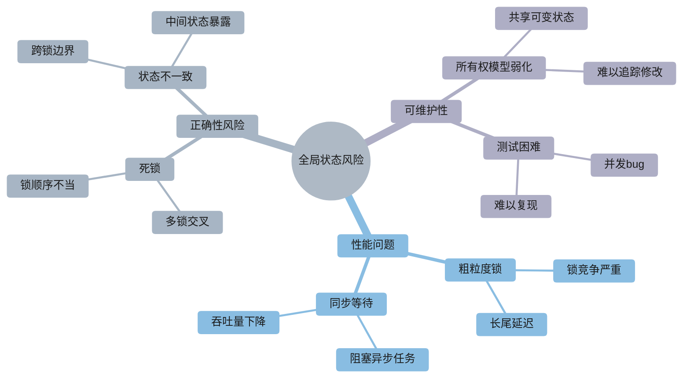

### 方案对比

| 方案 | 开发效率 | 性能 | 安全性 | 可维护性 | 推荐场景 |
|------|---------|------|--------|---------|---------|
| **Arc<Mutex<T>>** | 高 | 差 | 差 | 差 | 仅原型 |
| **消息传递** | 中 | 优 | 优 | 优 | 生产环境 ✓ |
| **细粒度锁** | 中 | 中 | 中 | 中 | 过渡方案 |
| **RwLock** | 中 | 中-优 | 中 | 中 | 读多写少 ✓ |
| **无锁结构** | 低 | 优 | 高 | 中 | 关键路径 ✓ |

### 替代设计

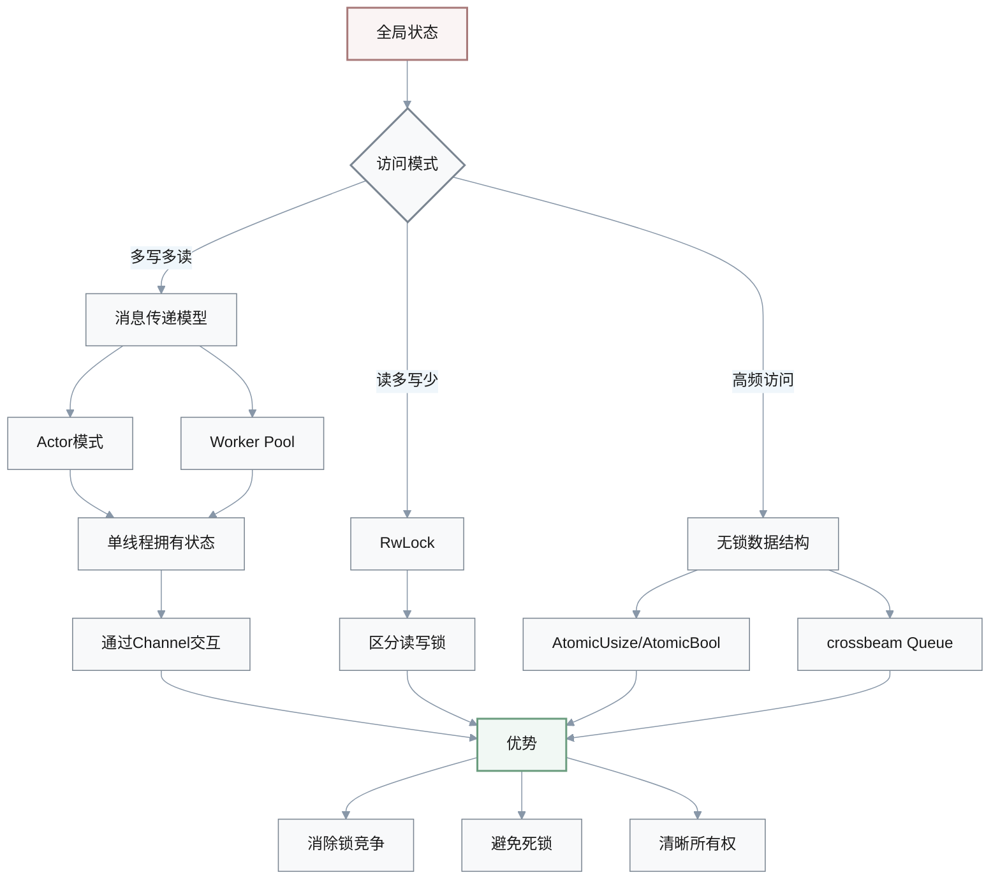

### 解决方案

**A**: 从**性能与死锁风险**角度评估，提供渐进式改进方案

#### 风险评估

**性能问题**:
- 全局 `Arc<Mutex<T>>` → 粗粒度锁
- 高并发下严重锁竞争
- 长尾延迟 (p99 ↑)

**正确性风险**:
- 多锁交叉 → 死锁风险
- 共享可变状态 → 所有权模型弱化

#### 改进方案 1: 消息传递模型（推荐）

**设计原则**:
- 状态由单线程拥有
- 其他任务通过消息交互

**实现方式**:

```rust
// Actor 模式示例
struct StateActor {
    state: State,
    receiver: mpsc::Receiver<Message>,
}

impl StateActor {
    async fn run(mut self) {
        while let Some(msg) = self.receiver.recv().await {
            match msg {
                Message::Read(reply) => {
                    reply.send(self.state.clone());
                }
                Message::Write(data) => {
                    self.state.update(data);
                }
            }
        }
    }
}
```

**优势**:
- ✅ 消除锁竞争
- ✅ 避免死锁
- ✅ 清晰所有权边界

#### 改进方案 2: 细粒度锁拆分

**设计原则**:
- 将全局状态拆分为多个子状态
- 每个子状态有独立锁

**示例**:

```rust
// 粗粒度锁（不推荐）
struct GlobalState {
    data: Arc<Mutex<AllData>>,
}

// 细粒度锁（改进）
struct GlobalState {
    accounts: Arc<Mutex<Accounts>>,
    transactions: Arc<Mutex<Transactions>>,
    metrics: Arc<Mutex<Metrics>>,
}
```

#### 改进方案 3: 读写锁优化

**适用场景**: 读多写少

**实现**:

```rust
use tokio::sync::RwLock;

struct State {
    data: Arc<RwLock<Data>>,
}

// 读操作（并发）
let data = state.data.read().await;

// 写操作（独占）
let mut data = state.data.write().await;
```

#### 改进方案 4: 无锁数据结构

**适用场景**: 关键路径、高频访问

**实现**:

```rust
use std::sync::atomic::{AtomicU64, Ordering};
use crossbeam::queue::SegQueue;

struct Metrics {
    counter: AtomicU64,
    queue: SegQueue<Event>,
}

// 无锁递增
metrics.counter.fetch_add(1, Ordering::Relaxed);

// 无锁队列
metrics.queue.push(event);
```

### 渐进式迁移策略

| 阶段 | 目标 | 工作量 | 优先级 |
|------|------|--------|--------|
| **识别热点** | Profiling 找锁竞争 | 1-2天 | P0 |
| **局部重构** | 热点路径改消息传递 | 1-2周 | P0 |
| **拆分全局锁** | 细粒度锁或 RwLock | 2-4周 | P1 |
| **全面优化** | 无锁结构 + Actor | 1-3月 | P2 |

> **决策考量**: 团队现有代码量和交付时间，优先在最热点路径上先做局部重构，逐步降低全局互斥锁的依赖
