## 1. Solana Validator Transaction Retry Optimization

**Q:** Your Solana validator is experiencing 15% transaction retry rate due to account lock conflicts during parallel execution. You have 3 days to reduce this to below 5%. What actions do you take and why?

**A:** Three-phase approach with aggressive timeline:


### Phase Breakdown

| Phase | Timeline | Actions | Expected Impact | Key Metrics |
|-------|----------|---------|-----------------|-------------|
| **Phase 1: Diagnose** | Day 1 | Instrument `banking_stage.rs` with lock acquisition metrics; build transaction dependency graph | Identify root cause | Measure if conflicts are concentrated (top 10 accounts = 80% retries) or distributed |
| **Phase 2: Quick Wins** | Day 2 | Implement account-specific sharding; dedicate threads to hot accounts (DEX programs, token mints) | 5-8% reduction | Retry rate drops to 7-10% |
| **Phase 3: Scheduler** | Day 3 | Implement greedy maximal independent set (MIS) scheduler: sort by fee, build conflict graph, select non-conflicting batches | 7-10% additional reduction | Retry rate drops below 5% |

**Rationale:** 
- **Metrics-first approach**: Ensures addressing root cause, not symptoms
- **Balance**: Short-term fixes (sharding) + sustainable solutions (scheduler)
- **Escalation path**: If target not met, invest in ML-based predictor for long-term optimization

---

## 2. DEX Architecture: AMM Model Selection

**Q:** You're architecting a new DEX and must choose between Uniswap V2's simple constant product model ($x \times y = k$) vs Curve's StableSwap model optimized for stablecoins. Your target market is 60% stablecoin pairs, 40% volatile pairs. How do you decide?

**A:** Hybrid approach with phased rollout.

### Decision Framework



```mermaid
%%{init: {
  "theme": "base",
  "themeVariables": {
    "primaryColor": "#f8f9fa",
    "primaryTextColor": "#1a1a1a",
    "primaryBorderColor": "#7a8591",
    "lineColor": "#8897a8",
    "secondaryColor": "#eff6fb",
    "tertiaryColor": "#f3f5f7"
  }
}}%%
graph TD
    A[Market Analysis: 60% Stablecoin, 40% Volatile] --> B{Choose Model}
    B --> C[Uniswap V2 Only]
    B --> D[Curve Only]
    B --> E[Hybrid Approach]
    
    C --> C1[Simple implementation]
    C --> C2[Poor stablecoin efficiency]
    C --> C3[❌ Loses 60% of market value]
    
    D --> D1[Excellent stablecoin efficiency]
    D --> D2[Poor volatile pair handling]
    D --> D3[❌ Complex for all pairs]
    
    E --> E1[✅ Optimal capital efficiency]
    E --> E2[Curve for stablecoins]
    E --> E3[V2 for volatile pairs]
    E --> E4[Best of both worlds]
    
    style E fill:#f1f8f4,stroke:#6b9d7f,stroke-width:2px,color:#1a1a1a
    style E1 fill:#f1f8f4,stroke:#6b9d7f,stroke-width:2px,color:#1a1a1a
    style C3 fill:#faf4f4,stroke:#a87a7a,stroke-width:2px,color:#1a1a1a
    style D3 fill:#faf4f4,stroke:#a87a7a,stroke-width:2px,color:#1a1a1a
```

### Model Comparison

| Aspect | Uniswap V2 | Curve StableSwap | Hybrid (Decision) |
|--------|------------|------------------|-------------------|
| **Formula** | $x \times y = k$ | Complex amplified invariant | Both models |
| **Stablecoin efficiency** | Low (high slippage) | High (10-50x lower slippage) | ✅ High |
| **Volatile pair efficiency** | Good | Poor | ✅ Good |
| **Implementation complexity** | Low | High (amplification tuning) | Medium |
| **Audit cost** | Baseline | +50% | +30% |
| **Market capture** | 40% optimal | 60% optimal | ✅ 100% optimal |
| **TVL potential** | 1x | 1.2x | ✅ 2-3x |

### Execution Timeline


**Decision: Implement hybrid DEX**

**Key Rationale Points:**
1. **Market fit**: 60% stablecoin volume → Curve captures 80% of segment value
2. **Capital efficiency**: 10-50x lower slippage for stablecoin pairs (USDC-USDT, DAI-USDC)
3. **Risk management**: V2 for volatile pairs (ETH-TOKEN) maintains simplicity for complex price movements
4. **Cost-benefit**: +30% audit cost justified by 2-3x TVL growth potential
5. **Derisked timeline**: Start V2-only (months 1-3), add Curve (months 4-6) after traction validation

---

## 3. Blockchain Indexer Performance Optimization

**Q:** Your blockchain indexer is 3 hours behind chain head (target: <5 seconds). Profiling shows 60% time in database writes, 30% in RPC fetches, 10% in parsing. You have 1 engineer for 2 weeks. What do you prioritize and why?

**A:** Focus on bottlenecks in ROI order.

### Current Performance Profile


### Optimization Priority Matrix

| Priority | Component | Timeline | Optimization | Expected Speedup | Impact on Total Time | Effort (LOC) |
|----------|-----------|----------|--------------|------------------|---------------------|--------------|
| **P1** 🔥 | Database writes | Week 1 | Accumulate 1000 events in-memory, bulk insert with single transaction | 5-10x | 60% → 6-12% | 50 (low-hanging fruit) |
| **P2** ⚡ | RPC fetches | Week 2 (Days 1-3) | Switch from sequential `getBlockByNumber` to parallel batch requests (10-20 blocks) | 3-5x | 30% → 6-10% | 100 (proven pattern) |
| **P3** ⏸️ | Parsing | Deprioritized | Even heroic optimization yields <2x | <2x | 10% → 5% | 500+ (not worth it) |

### Optimization Impact Calculation

**Before optimization:**
$$
\text{Total Time} = 60\% + 30\% + 10\% = 100\%
$$

**After P1 (Database batching):**
$$
\text{Total Time} = \frac{60\%}{10} + 30\% + 10\% = 6\% + 30\% + 10\% = 46\% \text{ (2.2x speedup)}
$$

**After P1 + P2 (RPC batching):**
$$
\text{Total Time} = 6\% + \frac{30\%}{5} + 10\% = 6\% + 6\% + 10\% = 22\% \text{ (4.5x speedup)}
$$

### Implementation Flow


**Rationale:**
- **Pareto principle**: Address 60% bottleneck first for maximum impact
- **ROI optimization**: 50 LOC change yields 2.2x speedup (highest leverage)
- **Proven patterns**: Both optimizations are battle-tested approaches
- **Escalation path**: If optimizations insufficient, horizontal scaling becomes necessary

**Success Metrics:**
- Catch up to chain head within 6 hours of deployment
- Maintain <10 second lag thereafter

---

## 4. Smart Contract Critical Bug Response

**Q:** A critical smart contract bug is discovered in production that could lead to fund loss, but no exploit has occurred yet. You can either: **(A)** immediately pause the contract (30 min downtime, affects all users), or **(B)** deploy a fix and gradually migrate over 6 hours (no downtime but exploit window remains open). How do you decide?

**A:** Risk-based decision framework with hybrid options.

### Risk Assessment Matrix


### Decision Framework

| Factor | Assessment | Impact on Decision |
|--------|------------|-------------------|
| **Exploit Likelihood** | Public disclosure: >80% within 1 hour<br>Internal finding: 10-20% per day | Higher likelihood → favor pause |
| **Loss Magnitude** | Calculate MEV: $10K vs $10M | Higher value → favor pause |
| **User Impact** | 30 min downtime vs 6-hour exposure | Balance UX against security |

### Decision Paths


### Scenario Analysis

**Scenario 1: Public + High Value ($1M+)**
- **Decision**: Choose (A) immediate pause
- **Rationale**: 30min downtime < potential catastrophic loss
- **Trade-off**: Accept user frustration over protocol insolvency

**Scenario 2: Internal + Medium Value ($10K-$1M)**
- **Decision**: Choose (B) gradual migration
- **Rationale**: 6-hour window with monitoring has 1-2% exploit probability
- **Trade-off**: Calculated risk worth preserving user experience

**Scenario 3: Hybrid Approach**
- **Actions**: 
  1. Reduce contract exposure via parameter update (5 min)
  2. Lower deposit limits
  3. Deploy fix over 6 hours with monitoring
- **Best for**: Public + medium value OR internal + high value

### Execution Checklist

- [ ] **Pre-pause communication**: Notify users via Twitter/Discord
- [ ] **Incident report**: Prepare transparent explanation
- [ ] **Emergency withdrawals**: Offer alternative withdrawal method during pause
- [ ] **Monitoring**: Enable real-time alerts for suspicious transactions
- [ ] **Post-mortem**: Document incident and prevention measures

---

## 5. Cross-Chain Bridge Architecture Decision

**Q:** You're evaluating two cross-chain bridge designs for Ethereum ↔ Solana: **(A)** 7-of-10 multisig with reputable validators, 2-minute finality, $20 cost per transfer; **(B)** optimistic bridge with 7-day dispute period, $5 cost per transfer. Your users are DeFi traders making 10-50 transfers/month. Which do you choose and why?

**A:** Multisig bridge with segmented economy option.

### Bridge Comparison

| Attribute | Option A: Multisig | Option B: Optimistic | Winner for DeFi Traders |
|-----------|-------------------|---------------------|------------------------|
| **Finality** | 2 minutes | 7 days | ✅ A (500x faster) |
| **Cost per transfer** | $20 | $5 | B (4x cheaper) |
| **Daily throughput** | ~500 round-trips | ~1 per week | ✅ A |
| **Security model** | 7-of-10 trust assumption | Fraud proof (trustless) | Tie (different models) |
| **Opportunity cost** | Minimal (2min lock) | High (7-day lock) | ✅ A |
| **Best for** | Active traders | Long-term holders | ✅ A (target persona) |

### User Persona Analysis

**DeFi Trader Profile:**
- **Trading frequency**: 10-50 transfers/month
- **Time sensitivity**: Arbitrage/yield farming requires fast capital movement
- **Cost sensitivity**: Secondary to speed (opportunity cost > transfer cost)

**Economic Calculation:**

For a trader with $100K capital:
- **Option A**: 2-minute finality → can compound yield ~500 times/day
- **Option B**: 7-day finality → capital locked, loses 7 days of yield

$$
\text{Opportunity Cost (7 days)} = \$100{,}000 \times 5\% \text{ APY} \times \frac{7}{365} \approx \$96
$$

**Conclusion**: $15 savings < $96 opportunity cost → Option A preferred

### Decision Architecture


**Decision: Choose (A) multisig bridge as primary + offer (B) as secondary "economy" option**

### Risk Mitigation Strategy

**Multisig Security Concerns:**
- **Validator compromise**: 2/10 validators could collude
- **Mitigation**:
  - Geographic diversity (validators in different jurisdictions)
  - Legal diversity (different corporate structures)
  - Slashing stakes (economic deterrent)
  - Signature pattern monitoring

**Monitoring Checklist:**
- [ ] Track which 7-of-10 validators sign each transaction
- [ ] Alert if same 7 validators always signing (potential collusion)
- [ ] Verify validator liveness and diversity
- [ ] Rotate validator set periodically

### Success Metrics

- User churn due to bridge costs: <5%
- Bridge uptime: 99.9%
- Average transfer time: <3 minutes
- Security incidents: 0

---

## 6. State Trie Corruption Recovery

**Q:** Your Ethereum client's state trie has corruption at block 18,450,001. Full resync takes 72 hours but business requires <4 hour recovery. You have a snapshot from block 18,449,500 (500 blocks behind). What is your recovery strategy and why?

**A:** Multi-phase surgical repair with escalation path.

### Recovery Decision Tree


### Recovery Timeline

| Phase | Duration | Actions | Success Criteria | Failure Escalation |
|-------|----------|---------|------------------|-------------------|
| **Triage** | 30 min | Run `reth db check`, count corrupted nodes | Scope determined | None |
| **Phase 1** | 1 hour | Rollback to snapshot 18,449,500; fast-sync 500 blocks | State root matches at 18,450,001 | Escalate to Plan B |
| **Phase 2** | 2 hours | Rebuild corrupted subtrie; identify affected accounts (e.g., `0x3f...a2`); recompute hashes | State root validated by multiple peers | Escalate to Plan B |
| **Plan B** | ~6 hours | Request recent snapshot from archive peer at 18,449,900; sync 101 blocks | Node operational | Exceeds SLA but recoverable |

### Risk-Benefit Analysis


### Strategy Comparison

| Approach | Time | Correctness | Risk | Decision |
|----------|------|-------------|------|----------|
| **Surgical repair** | 3.5 hours | 98-99% | 1-2% false negative | ✅ Primary choice |
| **Archive snapshot** | 6 hours | 100% | Requires trusted peer | Fallback (Plan B) |
| **Full resync** | 72 hours | 100% | Zero risk | ❌ Violates SLA |

**Decision: Attempt surgical repair with extensive validation; escalate to Plan B if needed**

### Post-Incident Prevention

**Automated Monitoring:**
- Add state root validation every 1000 blocks
- Detect corruption early (within 1000 blocks)
- Enable faster recovery with fresher snapshots

**Checklist:**
- [ ] Enable continuous state root checks
- [ ] Maintain rolling snapshots every 500 blocks
- [ ] Set up peer diversity for validation
- [ ] Document corruption recovery runbook

---

## 7. DEX Concentrated Liquidity: Build vs Fork

**Q:** Your DEX has $50M TVL and wants to add concentrated liquidity (Uniswap V3 style). Implementing it requires 6 months and $500K (audits, engineering). Alternatively, you could integrate with existing V3 forks in 1 month for $50K but give up 20% of fee revenue to the forked protocol. What do you decide and why?

**A:** Context-dependent decision with hybrid option preferred.

### Financial Model

**Current State:**
- TVL: $50M
- Fee revenue: ~$100K/month (0.2% APR)

**With Concentrated Liquidity:**
- Capital efficiency: 2-3x improvement
- Expected TVL: $100-150M (same capital, higher utilization)
- Expected fees: $200-300K/month

### Build vs Fork Analysis

| Factor | Option A: Build | Option B: Fork | Hybrid Approach |
|--------|----------------|----------------|-----------------|
| **Timeline** | 6 months | 1 month | 1-9 months (phased) |
| **Upfront cost** | $500K | $50K | $50K + $500K |
| **Fee retention** | 100% | 80% (20% to protocol) | 80% → 100% over time |
| **Breakeven** | Month 8-10 | Month 2 | Month 2 (immediate), Month 12 (full) |
| **Time-to-market advantage** | - | +5 months | +5 months initial |
| **IP ownership** | ✅ Full ownership | ❌ Dependency | ✅ Eventually full |
| **Differentiation** | ✅ Custom features | ❌ Standard features | ✅ Evolves over time |

### Breakeven Calculation

**Option A (Build):**
$$
\text{Breakeven} = \frac{\$500{,}000}{\$50{,}000\text{-}\$60{,}000/\text{month}} \approx 8\text{-}10 \text{ months}
$$

**Option B (Fork):**
$$
\text{Breakeven} = \frac{\$50{,}000}{(\$80{,}000\text{-}\$120{,}000) \times 0.8} \approx 2 \text{ months}
$$

### Decision Matrix


### Decision Scenarios

**Choose B (Fork) if:**
1. **Competitive market**: 5-month delay risks losing market share
2. **Short-term focus**: Need quick wins for fundraising/traction
3. **Resource constraints**: $500K investment too high

**Choose A (Build) if:**
1. **Differentiation critical**: Need custom features beyond standard V3
2. **Long-term horizon**: 24+ months makes 20% perpetual tax expensive
3. **Regulatory concerns**: Forking creates legal/compliance issues

**Choose Hybrid (Recommended) if:**
1. **Balance speed + ownership**: Get to market fast, own IP eventually
2. **Risk mitigation**: Test product-market fit before full investment
3. **Competitive positioning**: Match competitors immediately, differentiate later

### Hybrid Timeline


**Recommended Decision: Hybrid approach**
- Fastest path to market (1 month)
- De-risks $500K investment with MVP validation
- Reclaims fee share and enables differentiation long-term

---

## 8. Hiring Decision: Rust vs Blockchain Experience

**Q:** You're hiring a senior Rust blockchain engineer. Candidate A has 5 years C++ blockchain experience and 6 months Rust; Candidate B has 3 years Rust systems programming but 0 blockchain experience. Both passed technical interviews. Your team has 2 Rust experts but needs blockchain domain knowledge. Who do you hire and why?

**A:** Context-dependent; default to Candidate B for most scenarios.

### Skills Gap Analysis

| Skill Domain | Candidate A | Candidate B | Learning Curve |
|--------------|-------------|-------------|----------------|
| **Rust proficiency** | 6 months in (needs 6 more) | Senior level (3 years) | 6-12 months for C++ → Rust |
| **Blockchain domain** | Expert (5 years) | Zero | 3-6 months for systems → blockchain |
| **Total time to full productivity** | 12 months | 6 months | - |
| **Technical debt risk** | High (Rust footguns) | Low (Rust prevents bug classes) | - |

### Team Context Matrix


### Decision Framework


### Rationale Comparison

**Hire Candidate B (Rust Expert) if:**
- **Greenfield project**: Building new chain/protocol from scratch
- **Quality critical**: Rust's safety prevents entire bug classes (use-after-free, data races)
- **Team leverage**: 2 Rust experts can mentor blockchain domain faster than teaching Rust
- **Long-term value**: Rust mastery is experiential (not just learned from docs)

**Hire Candidate A (Blockchain Expert) if:**
- **Existing codebase**: Extending Ethereum client or Solana runtime
- **Domain context**: Understanding geth/Sealevel architecture requires blockchain knowledge
- **Short-term need**: Immediate blockchain expertise needed for specific project
- **Team capacity**: Limited bandwidth to mentor blockchain fundamentals

### Default Decision: Hire B

**Primary Rationale:**
1. **Technical debt prevention**: Inadequate Rust skills create memory safety issues, lifetime bugs, async footguns
2. **Knowledge transferability**: Blockchain concepts are documentable/teachable; Rust mastery requires hands-on experience
3. **Productivity timeline**: Candidate B reaches full productivity in 6 months vs 12 for Candidate A
4. **Team composition**: 2 Rust experts provide better Rust code review than blockchain mentoring

### Risk Mitigation Plan

**For Candidate B:**
- [ ] Pair with blockchain mentor for first 3 months
- [ ] Provide Solana/Ethereum codebase study materials
- [ ] Assign consensus/cryptography deep-dive projects
- [ ] Schedule weekly blockchain architecture discussions

**Success Metrics:**
- Month 3: Contributing to blockchain logic with review
- Month 6: Full autonomy on blockchain features

---

## 9. Rust Node Performance: Mysterious Pauses

**Q:** Your blockchain node is processing 2000 TPS but users report intermittent 5-10 second pauses every 2-3 minutes. Profiling shows no single hot function. You suspect garbage collection but your language (Rust) has no GC. What do you investigate and why?

**A:** Investigate deterministic resource operations mimicking GC behavior.

### Hypothesis Framework

**Key Insight:** Rust has no GC, but exhibits GC-like symptoms → investigate periodic batch operations

### Three Primary Hypotheses


### Hypothesis Details

| Hypothesis | Root Cause | Detection Method | Fix |
|------------|------------|------------------|-----|
| **H1: Disk I/O Stalls** | RocksDB compaction merging SSTables blocks writes 5-10s | `iostat -x 1` during pause<br/>Expect: >80% iowait | Tune RocksDB compaction rate or upgrade to NVMe SSD |
| **H2: Memory Allocator** | `jemalloc` background thread reclaims memory in large batches | Compile with jemalloc stats<br/>Look for `background_thread` time spikes | Tune arena count or switch to `mimalloc` |
| **H3: Checkpointing** | Node snapshots state every 1000 blocks, blocking main thread | Correlate pauses with block numbers (multiples of 1000) | Move snapshot to background thread with copy-on-write |

### Diagnostic Process (30 minutes)


### Likelihood Assessment

**Most Likely: H1 or H3**

**Reasoning:**
- **Pattern regularity**: "Every 2-3 minutes" suggests periodic batch operation, not random I/O
- **Duration**: 5-10 seconds matches typical DB compaction or checkpoint duration
- **Absence of hot function**: Indicates system-level blocking, not CPU bottleneck

### Action Plan

1. **Quick test (5 min)**: Disable checkpointing temporarily; observe if pauses disappear
2. **Monitoring (15 min)**: Run `perf record -g` during next pause
3. **Analysis (10 min)**: Inspect syscall patterns to confirm hypothesis

### Implementation Fixes

**If H1 (RocksDB):**
```rust
// Tune compaction parameters
db_opts.set_max_background_jobs(4);
db_opts.set_max_subcompactions(2);
```

**If H2 (jemalloc):**
```rust
// Adjust arena count
#[global_allocator]
static ALLOC: jemallocator::Jemalloc = jemallocator::Jemalloc;
// Or switch to mimalloc
```

**If H3 (Checkpointing):**
```rust
// Move to background thread
tokio::spawn(async move {
    snapshot_state().await;
});
```

---

## 10. Caching Strategy: Microbenchmark vs Production

**Q:** You've implemented a new Merkle Patricia Trie caching strategy that shows 40% read speedup in microbenchmarks but 5% slowdown in full node sync. Do you deploy it? Why or why not?

**A:** **Do not deploy.** Production workload trumps synthetic benchmarks.

### Performance Comparison

| Metric | Microbenchmark | Full Node Sync | Winner |
|--------|----------------|----------------|--------|
| **Read speedup** | +40% | -5% (slowdown) | ❌ Real workload fails |
| **Cache hit rate** | 95% (hot data) | ~50% (cold data) | Mismatch |
| **Memory pressure** | Isolated test | Contention with networking/parsing | System-level impact |
| **Workload realism** | Synthetic | Production ground truth | ✅ Sync is reality |

### Root Cause Analysis


### Why Full Node Sync is Ground Truth

**Microbenchmark Limitations:**
- Measures isolated component in ideal conditions
- Misses system-level interactions (memory contention, I/O interference)
- Uses synthetic workload patterns (hot data bias)

**Full Node Sync Advantages:**
- Realistic workload: cache eviction pressure, bandwidth contention, disk I/O
- Production representative: actual access patterns and resource constraints
- System-level validation: entire stack under real conditions

### Next Steps (Do Not Deploy Yet)

```mermaid
%%{init: {
  "theme": "base",
  "themeVariables": {
    "primaryColor": "#f8f9fa",
    "primaryTextColor": "#1a1a1a",
    "primaryBorderColor": "#7a8591",
    "lineColor": "#8897a8",
    "secondaryColor": "#eff6fb",
    "tertiaryColor": "#f3f5f7"
  }
}}%%
graph LR
    A[Profile Full Sync] --> B[Identify Bottleneck]
    B --> C{Root Cause?}
    
    C -->|Cache misses| D[Adjust Cache Size]
    C -->|Eviction overhead| E[Optimize Eviction Logic]
    C -->|Memory pressure| F[Reduce Cache Size]
    
    D --> G[Test: 4GB → 1GB cache]
    E --> G
    F --> G
    
    G --> H{Performance improved?}
    H -->|Yes| I[Consider Deployment]
    H -->|No| J[Implement Adaptive Caching]
    
    J --> J1[Enable for steady-state]
    J --> J2[Disable for sync]
    
    style I fill:#f1f8f4,stroke:#6b9d7f,stroke-width:2px,color:#1a1a1a
```



### Action Plan

| Step | Action | Expected Outcome |
|------|--------|------------------|
| **1. Profile** | Profile full sync with caching enabled | Identify where slowdown occurs |
| **2. Adjust cache size** | Reduce from 4GB to 1GB | Reduce memory pressure on other components |
| **3. Test** | Re-run full node sync | Validate performance improvement |
| **4. Adaptive caching** | Enable for steady-state, disable for sync | Optimize for both workloads |

### Adaptive Caching Strategy

```rust
// Pseudo-code for adaptive caching
enum SyncMode {
    FullSync,      // Disable cache (cold data access)
    SteadyState,   // Enable cache (hot data access)
}

impl TrieCache {
    fn should_cache(&self, mode: SyncMode) -> bool {
        match mode {
            SyncMode::FullSync => false,      // Cache hit rate ~50%
            SyncMode::SteadyState => true,    // Cache hit rate ~95%
        }
    }
}
```

### Key Lesson

> **Optimize for production workload, not synthetic benchmarks.**

- Microbenchmarks are development tools for component testing
- Deployment decisions require system-level validation
- Real workload performance is the only criterion that matters

---

## 11. Stablecoin Protocol Revenue Model Prioritization

**Q:** Your stablecoin protocol has 3 revenue models: **(A)** seigniorage from minting (high revenue in growth, zero in steady-state), **(B)** collateral yield (steady 3-5% APR), **(C)** transaction fees (0.1% per transfer). Initial users are 70% buy-and-hold, 30% active traders. How do you prioritize revenue models for first year?

**A:** Prioritize (A) + (B); defer (C) to Year 2.

### Revenue Model Characteristics

| Model | Growth Phase (Year 1) | Steady-State (Year 2+) | User Dependency |
|-------|----------------------|------------------------|-----------------|
| **(A) Seigniorage** | High (captures TVL growth) | Zero (no new minting) | Growth-dependent |
| **(B) Collateral Yield** | Steady (3-5% APR on reserves) | Steady (baseline revenue) | TVL-dependent |
| **(C) Transaction Fees** | Negligible (low volume) | Meaningful (mature volume) | Activity-dependent |

### Year 1 Revenue Projections

**Assumptions:**
- TVL growth: $0 → $100M
- Collateral ratio: 1:1
- User split: 70% buy-and-hold, 30% active traders

**Revenue Breakdown:**


### Financial Model

| Source | Calculation | Annual Revenue | % of Total |
|--------|-------------|----------------|------------|
| **(A) Seigniorage** | $100M TVL growth × ~1% capture | ~$1M (one-time) | 95% |
| **(B) Collateral Yield** | $50M avg reserves × 4% APR | $2M | 4.5% |
| **(C) Transaction Fees** | $30M volume × 2x turnover × 0.1% | $60K | 0.5% |

### Strategic Rationale


### Decision Framework

**Prioritize (A) Seigniorage:**
- Captures growth phase value (TVL $0 → $100M)
- One-time opportunity window
- Represents 95% of Year 1 revenue

**Prioritize (B) Collateral Yield:**
- Provides steady baseline income
- Sustainable business model long-term
- Low regulatory risk (protocol-retained yield)

**Deprioritize (C) Transaction Fees:**
- Only $60K/year with current user mix
- Risk alienating users during growth phase
- More relevant when TVL plateaus (Year 2+)

### Implementation Strategy

**Year 1:**
- **Seigniorage**: Active (capture growth phase)
- **Collateral Yield**: Active (invest in T-bills at 4% APR)
- **Transaction Fees**: Set to 0% (maximize adoption)

**Year 2:**
- **Seigniorage**: Diminishes (TVL growth slows)
- **Collateral Yield**: Continues (steady baseline)
- **Transaction Fees**: Introduce 0.05-0.1% (after liquidity bootstrapping)

### Regulatory Consideration

> **Collateral yield securities law compliance**

- **If passed to users**: May trigger securities regulations
- **If retained by protocol**: Lower regulatory risk; use for reserve buffer/protocol stability

### Phase Timeline

```mermaid
%%{init: {
  "theme": "base",
  "themeVariables": {
    "primaryColor": "#f8f9fa",
    "primaryTextColor": "#1a1a1a",
    "primaryBorderColor": "#7a8591",
    "lineColor": "#8897a8",
    "secondaryColor": "#eff6fb",
    "tertiaryColor": "#f3f5f7"
  }
}}%%
gantt
    title Revenue Model Activation Timeline
    dateFormat YYYY-MM
    section Seigniorage
    High Revenue Phase     :2024-01, 12M
    section Collateral Yield
    Steady Revenue         :2024-01, 24M
    section Transaction Fees
    Fee Infrastructure     :2024-01, 12M
    Active Fees 0.05-0.1%  :2025-01, 12M
```

---

## 12. Async Runtime Selection: Tokio vs async-std

**Q:** Your team must choose between Tokio and async-std for a new blockchain indexer's async runtime. Tokio has larger ecosystem but steeper learning curve; async-std is simpler but fewer Web3 libraries. Your team has 2 senior engineers (familiar with both) and 3 mid-level engineers (new to async). What do you choose and why?

**A:** **Choose Tokio.** Ecosystem dominance outweighs learning curve.

### Runtime Comparison

| Factor | Tokio | async-std | Winner |
|--------|-------|-----------|--------|
| **Ecosystem** | 90% of blockchain crates (`ethers-rs`, `solana-client`, `jsonrpsee`) | Limited Web3 support | ✅ Tokio |
| **Production use** | Discord, AWS Lambda, Cloudflare Workers | Smaller footprint | ✅ Tokio |
| **Learning curve** | Steep (2-3 weeks for mid-level) | Gentle (1 week) | async-std |
| **Development overhead** | None (native support) | 20-30% (wrapping/reimplementing) | ✅ Tokio |
| **Maintenance burden** | Low (ecosystem compatibility) | High (friction with Web3 libs) | ✅ Tokio |
| **Long-term ROI** | High (amortized over 12 months) | Low (ongoing friction) | ✅ Tokio |

### Decision Framework

```mermaid
%%{init: {
  "theme": "base",
  "themeVariables": {
    "primaryColor": "#f8f9fa",
    "primaryTextColor": "#1a1a1a",
    "primaryBorderColor": "#7a8591",
    "lineColor": "#8897a8",
    "secondaryColor": "#eff6fb",
    "tertiaryColor": "#f3f5f7"
  }
}}%%
graph TD
    A[Project Type] --> B{Blockchain Indexer?}
    B -->|Yes Web3 Project| C[Choose Tokio]
    B -->|No Generic API| D[Consider async-std]
    
    C --> C1[Ecosystem dominance]
    C --> C2[90% blockchain crates use Tokio]
    C --> C3[Native ethers-rs, solana-client support]
    C --> C4[Production battle-tested]
    
    D --> D1[Simpler learning curve]
    D --> D2[Adequate for generic HTTP APIs]
    D --> D3[No Web3 dependency friction]
    
    style C fill:#f1f8f4,stroke:#6b9d7f,stroke-width:2px,color:#1a1a1a
    style D fill:#eff6fb,stroke:#7a9fc5,stroke-width:2px,color:#1a1a1a
```

### Learning Curve Amortization

**Time Investment Analysis:**

| Phase | Tokio | async-std | Delta |
|-------|-------|-----------|-------|
| **Initial learning** | 2-3 weeks | 1 week | +1-2 weeks for Tokio |
| **Development overhead** | 0% | 20-30% ongoing | -20-30% for Tokio |
| **12-month project** | Pays off by Month 2 | Cumulative friction | ✅ Tokio wins |

**ROI Calculation:**
- Tokio: 2 weeks upfront investment, smooth development thereafter
- async-std: 1 week upfront, but 20-30% ongoing overhead = 10-15 weeks lost over year

### Tokio Adoption Strategy

**Mitigation for Learning Curve:**

```mermaid
%%{init: {
  "theme": "base",
  "themeVariables": {
    "primaryColor": "#f8f9fa",
    "primaryTextColor": "#1a1a1a",
    "primaryBorderColor": "#7a8591",
    "lineColor": "#8897a8",
    "secondaryColor": "#eff6fb",
    "tertiaryColor": "#f3f5f7"
  }
}}%%
graph LR
    A[Week 1: Tokio Workshop] --> B[Week 2-3: Pattern Library]
    B --> C[Ongoing: Code Review + Linting]
    
    A --> A1[Hands-on exercises]
    A --> A2[Senior engineers teach]
    
    B --> B1[Write async patterns]
    B --> B2[futures, streams, select!]
    B --> B3[spawn patterns]
    
    C --> C1[Codify best practices]
    C --> C2[Linter rules]
    C --> C3[PR templates]
    
    style A fill:#eff6fb,stroke:#7a9fc5,stroke-width:2px,color:#1a1a1a
    style B fill:#eff6fb,stroke:#7a9fc5,stroke-width:2px,color:#1a1a1a
    style C fill:#f1f8f4,stroke:#6b9d7f,stroke-width:2px,color:#1a1a1a
```

**Implementation Plan:**

1. **Week 1**: Schedule Tokio workshop with hands-on exercises
   - Cover: work-stealing scheduler, `tokio-console` debugging, async patterns
   - Led by 2 senior engineers

2. **Week 2-3**: Senior engineers create async pattern library
   - Document common patterns: futures, streams, `select!`, spawn
   - Provide code examples for blockchain indexer use cases

3. **Ongoing**: Codify best practices
   - Linter rules for async correctness
   - PR templates with async checklist
   - Regular code reviews focused on async patterns

### Key Rationale

**For Blockchain Indexer (Web3 Project):**
- **Ecosystem lock-in**: 90% of blockchain Rust crates target Tokio
- **Compatibility**: `ethers-rs`, `solana-client`, `jsonrpsee` require Tokio
- **Production proven**: Powers Discord (messaging), AWS Lambda (serverless), Cloudflare Workers (edge)
- **Development efficiency**: Zero overhead integrating with Web3 ecosystem

**Alternative Scenario:**
- **For generic HTTP API** (non-Web3): async-std becomes viable
- Simpler learning curve justified when no blockchain dependency friction

### Decision: Tokio

**Primary Reasons:**
1. Blockchain indexer **requires** Web3 libraries (Tokio-dependent)
2. 2-3 week learning curve amortizes over 12-month project
3. Senior engineers provide mentorship and patterns
4. Production battle-tested in high-scale infrastructure

---

## 13. Transaction Reorg Handling & User Communication

**Q:** A user reports their transaction was confirmed at block 18,000,100 but disappeared after a reorg to block 18,000,095. They demand compensation for "lost funds." Your system displayed the transaction as confirmed with 3 confirmations (insufficient for finality). How do you respond and what system changes do you make?

**A:** Acknowledge, educate, and improve system UX.

### Reorg Situation Analysis

```mermaid
%%{init: {
  "theme": "base",
  "themeVariables": {
    "primaryColor": "#f8f9fa",
    "primaryTextColor": "#1a1a1a",
    "primaryBorderColor": "#7a8591",
    "lineColor": "#8897a8",
    "secondaryColor": "#eff6fb",
    "tertiaryColor": "#f3f5f7"
  }
}}%%
graph LR
    A[Block 18,000,095] --> B[Block 18,000,096]
    B --> C[Block 18,000,097]
    C --> D[Block 18,000,098]
    D --> E[Block 18,000,099]
    E --> F[Block 18,000,100<br/>TX Confirmed]
    F --> G[REORG!]
    G --> H[Fork back to 18,000,095]
    H --> I[New canonical chain]
    I --> J[TX back in mempool]
    J --> K[Will be re-included]
    
    style F fill:#eff6fb,stroke:#7a9fc5,stroke-width:2px,color:#1a1a1a
    style G fill:#faf4f4,stroke:#a87a7a,stroke-width:2px,color:#1a1a1a
    style K fill:#f1f8f4,stroke:#6b9d7f,stroke-width:2px,color:#1a1a1a
```

### Immediate Response (Customer Service)

**1. Acknowledge Reality**
> "Your transaction was confirmed in block 18,000,100, which was later orphaned in a 5-block reorg. The transaction is now in the mempool and will be included in the new canonical chain within 1-10 blocks."

**2. Clarify No Fund Loss**
- **Funds are NOT lost**: Transaction is pending, not reverted
- **Expected timeline**: Re-inclusion within 1-10 blocks (15-150 seconds)
- **Status**: Transaction valid, just waiting for new block

**3. Explain Confirmation Depth**
- **3 confirmations**: Probabilistic finality (~99.7%), not absolute
- **Finality threshold**: 12 confirmations for Ethereum (>99.99% finality probability)
- **Reorg probability**: 1-3% for shallow depths, exponentially decreases with depth

### Liability Assessment Decision Tree

```mermaid
%%{init: {
  "theme": "base",
  "themeVariables": {
    "primaryColor": "#f8f9fa",
    "primaryTextColor": "#1a1a1a",
    "primaryBorderColor": "#7a8591",
    "lineColor": "#8897a8",
    "secondaryColor": "#eff6fb",
    "tertiaryColor": "#f3f5f7"
  }
}}%%
graph TD
    A[UI Claim Assessment] --> B{What did UI say?}
    
    B -->|"Final/Irreversible"<br/>at 3 confirmations| C[System Misled User]
    B -->|"Confirmed"<br/>without finality claim| D[No Compensation Owed]
    
    C --> C1[Consider goodwill gesture]
    C --> C2[Gas refund]
    C --> C3[Acknowledge UI error]
    
    D --> D1[User accepted probabilistic risk]
    D --> D2[Standard blockchain behavior]
    D --> D3[Educate on finality]
    
    style C fill:#faf4f4,stroke:#a87a7a,stroke-width:2px,color:#1a1a1a
    style D fill:#f1f8f4,stroke:#6b9d7f,stroke-width:2px,color:#1a1a1a
```

### System Changes (Prevent Future Issues)

#### 1. Confirmation Threshold Update

| Status | Old Behavior | New Behavior |
|--------|-------------|--------------|
| **Pending** | 0-2 confirmations | 0-11 confirmations: "Pending (X/12 confirmations)" |
| **Confirmed** | 3+ confirmations: "Confirmed ✓" | Removed (ambiguous) |
| **Final** | N/A | 12+ confirmations: "Final ✓" |

#### 2. Probabilistic Finality Meter

```mermaid
%%{init: {
  "theme": "base",
  "themeVariables": {
    "primaryColor": "#f8f9fa",
    "primaryTextColor": "#1a1a1a",
    "primaryBorderColor": "#7a8591",
    "lineColor": "#8897a8",
    "secondaryColor": "#eff6fb",
    "tertiaryColor": "#f3f5f7"
  }
}}%%
graph LR
    A[0 conf: 0%] --> B[1 conf: 50%]
    B --> C[3 conf: 99.7%]
    C --> D[6 conf: 99.95%]
    D --> E[12 conf: 99.99%+]
    
    style A fill:#faf4f4,stroke:#a87a7a,stroke-width:2px,color:#1a1a1a
    style B fill:#faf6f0,stroke:#a89670,stroke-width:2px,color:#1a1a1a
    style C fill:#f3f5f7,stroke:#8897a8,stroke-width:2px,color:#1a1a1a
    style D fill:#eff6fb,stroke:#7a9fc5,stroke-width:2px,color:#1a1a1a
    style E fill:#f1f8f4,stroke:#6b9d7f,stroke-width:2px,color:#1a1a1a
```

**Finality Probability Formula:**
$$
P(\text{finality}) = 1 - e^{-\lambda \cdot \text{confirmations}}
$$
Where $\lambda$ depends on network conditions (typically 2-3 for Ethereum)

#### 3. Reorg Detection & Notification

**System Implementation:**
```rust
// Pseudo-code for reorg detection
async fn monitor_reorgs() {
    loop {
        let current_head = get_chain_head().await;
        if current_head.parent != last_known_head.hash {
            let reorg_depth = calculate_reorg_depth();
            notify_affected_users(reorg_depth).await;
        }
        tokio::time::sleep(Duration::from_secs(12)).await;
    }
}
```

**Notification Flow:**
- Detect reorg depth (e.g., 5 blocks)
- Identify affected transactions
- Send real-time alerts: email, push notification, in-app
- Provide reassurance: "Your transaction will be re-included"

#### 4. High-Value Transaction Warnings

```mermaid
%%{init: {
  "theme": "base",
  "themeVariables": {
    "primaryColor": "#f8f9fa",
    "primaryTextColor": "#1a1a1a",
    "primaryBorderColor": "#7a8591",
    "lineColor": "#8897a8",
    "secondaryColor": "#eff6fb",
    "tertiaryColor": "#f3f5f7"
  }
}}%%
graph TD
    A[Transaction Submitted] --> B{Value Check}
    B -->|<$100| C[Standard Flow]
    B -->|$100-$1000| D[Recommend 6 confirmations]
    B -->|>$1000| E[Recommend 12 confirmations]
    
    E --> E1["⚠️ High-value transaction"]
    E --> E2["Wait 12+ blocks for finality"]
    E --> E3["~2.4 minutes"]
    
    style E fill:#faf6f0,stroke:#a89670,stroke-width:2px,color:#1a1a1a
    style E1 fill:#faf6f0,stroke:#a89670,stroke-width:2px,color:#1a1a1a
```

### Implementation Checklist

**Phase 1 (Immediate):**
- [ ] Update UI to show "Pending (X/12)" for confirmations <12
- [ ] Remove ambiguous "Confirmed ✓" status
- [ ] Add "Final ✓" status for 12+ confirmations

**Phase 2 (Week 1):**
- [ ] Implement probabilistic finality meter (0-100%)
- [ ] Add reorg detection monitoring
- [ ] Set up notification system for affected users

**Phase 3 (Week 2):**
- [ ] Add high-value transaction warnings (>$1000)
- [ ] Update documentation/FAQ on blockchain finality
- [ ] User education campaign on reorg risks

**Phase 4 (Long-term):**
- [ ] Integrate with Ethereum finality gadget (when available)
- [ ] Consider faster finality for high-value transactions
- [ ] Track reorg statistics for transparency

### User Education Content

**FAQ Update:**
> **Q: What is a blockchain reorg?**
> 
> A: A reorganization occurs when the network temporarily forks and later converges on a different canonical chain. Transactions in orphaned blocks return to the mempool and are typically re-included within 1-10 blocks. This is normal blockchain behavior.
> 
> **Q: Are my funds safe during a reorg?**
> 
> A: Yes. Your transaction is still valid and will be re-included in the new canonical chain. Funds are never lost due to reorgs.
> 
> **Q: How many confirmations do I need?**
> 
> A: For low-value transactions (<$100): 3-6 confirmations. For high-value (>$1000): 12+ confirmations (99.99%+ finality).

### Post-Incident Summary

**Key Learnings:**
1. **UI clarity critical**: "Confirmed" vs "Final" must be distinct
2. **User education**: Reorgs are rare (1-3% of blocks) but possible
3. **Probabilistic finality**: Communicate confidence levels, not binary states
4. **Value-based guidance**: High-value transactions warrant higher confirmation thresholds
