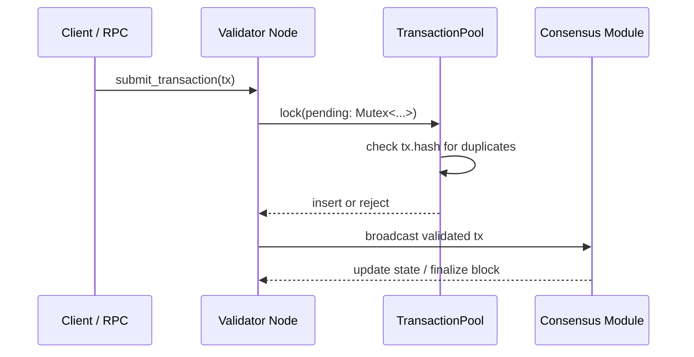
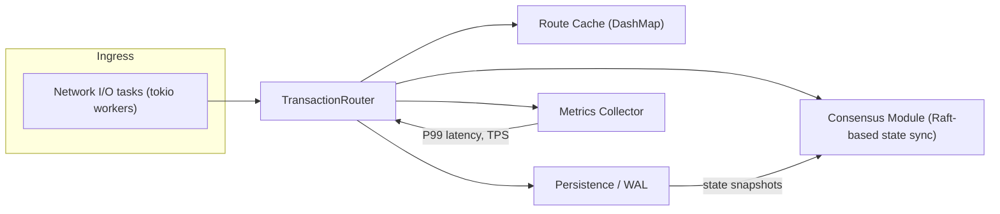
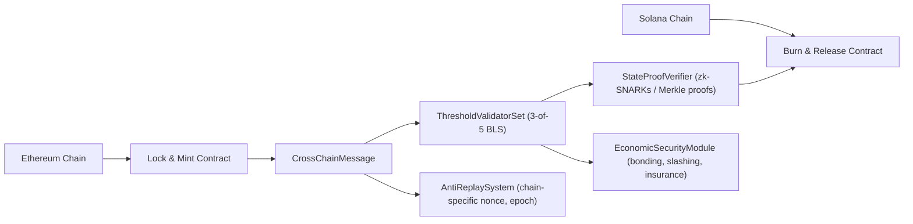

## 10 Q&A Pairs for Senior Rust Development Engineer Interview

### Context & Purpose
- This file provides 10 high-impact Q&A pairs for senior Rust blockchain development interviews.
- Designed for interviewers and candidates working on validator nodes, DeFi protocols, cross-chain infrastructure, and Web3 backends.
- Assumes strong Rust experience (ownership, lifetimes, async) and familiarity with at least one production blockchain (e.g., Ethereum, Solana).

### How to Use
- **Interviewer:** Select 3–6 questions based on role and timebox; use the success criteria and metrics to calibrate expectations.
- **Candidate:** Use these as practice scenarios; write code sketches or pseudo-implementations and compare your reasoning to the provided answers.
- **Caution:** All metrics in this file are **illustrative benchmarks**, not guaranteed SLAs. Validate numbers against your own production systems and up-to-date benchmarks.

### Table of Contents
- [Q1: Rust Ownership System Deep Dive](#q1-rust-ownership-system-deep-dive)
- [Q2: Blockchain Source Code Debugging Methodology](#q2-blockchain-source-code-debugging-methodology)
- [Q3: Web3 Infrastructure Core Module Design](#q3-web3-infrastructure-core-module-design)
- [Q4: DEX vs CEX Architecture Trade-offs](#q4-dex-vs-cex-architecture-trade-offs)
- [Q5: Smart Contract Integration Patterns](#q5-smart-contract-integration-patterns)
- [Q6: Blockchain Data Structures Algorithm Design](#q6-blockchain-data-structures-algorithm-design)
- [Q7: Rust Performance Optimization for Blockchain](#q7-rust-performance-optimization-for-blockchain)
- [Q8: Cross-Chain Bridge Security Architecture](#q8-cross-chain-bridge-security-architecture)
- [Q9: MEV (Maximal Extractable Value) Mitigation Strategies](#q9-mev-maximal-extractable-value-mitigation-strategies)
- [Q10: Production Incident Response & Post-Mortem Process](#q10-production-incident-response--post-mortem-process)

### Question Overview (Priority & Difficulty)

| ID  | Topic                                              | Priority   | Difficulty   | Dimension                          |
|-----|-----------------------------------------------------|------------|-------------|------------------------------------|
| Q1  | Rust ownership and memory safety                    | Critical   | Intermediate | Language internals & safety        |
| Q2  | Consensus debugging methodology                     | Critical   | Advanced     | Debugging & observability          |
| Q3  | High-throughput transaction router design           | Critical   | Advanced     | Distributed systems & performance  |
| Q4  | DEX vs CEX architecture trade-offs                  | Important  | Advanced     | Architecture & product trade-offs  |
| Q5  | Rust backend ↔ Ethereum smart contract integration  | Important  | Intermediate | Integration & reliability          |
| Q6  | Patricia Merkle Trie implementation                 | Important  | Advanced     | Data structures & storage          |
| Q7  | Validator performance optimization                  | Important  | Advanced     | Performance engineering            |
| Q8  | Cross-chain bridge security architecture            | Critical   | Advanced     | Security & cryptoeconomics         |
| Q9  | MEV mitigation in market-making bots                | Important  | Advanced     | MEV, market microstructure         |
| Q10 | Production incident response & post-mortem process  | Critical   | Intermediate | Operations & organizational learning |

### Q1: **Rust Ownership System Deep Dive**  
**Question:** Explain how Rust's ownership system prevents memory safety issues in blockchain node development. Provide a specific example from Ethereum or Solana source code where improper ownership handling could lead to consensus failures, and demonstrate how you would refactor it using proper Rust patterns.

**Answer:**  
Rust's ownership system prevents memory safety issues through compile-time ownership rules, borrowing checks, and lifetime annotations. In blockchain nodes, this is critical for preventing race conditions in consensus algorithms and memory corruption in transaction processing.

**Specific Example:** In Ethereum's `geth` client (written in Go, but the pattern applies), there was a race condition in transaction pool handling where concurrent access to pending transactions could cause double-spending vulnerabilities. In Rust, this would be prevented by:

```rust
struct TransactionPool {
    pending: Mutex<HashMap<TxHash, Transaction>>,
    // Proper ownership prevents concurrent mutable access
}

impl TransactionPool {
    fn add_transaction(&self, tx: Transaction) -> Result<(), PoolError> {
        let mut pending = self.pending.lock().unwrap();
        if pending.contains_key(&tx.hash) {
            return Err(PoolError::DuplicateTransaction);
        }
        pending.insert(tx.hash.clone(), tx);
        Ok(())
    }
}
```

**Refactoring Approach:** For Solana's transaction processing pipeline, I would use `Arc<RwLock<T>>` for shared read access with exclusive write locks, ensuring that the consensus-critical path maintains strict ownership semantics. The key is to avoid `unsafe` blocks unless absolutely necessary for performance-critical sections, and always wrap them in safe abstractions with comprehensive test coverage.

**Ownership & Concurrency Flow (Diagram):**


**Success Criteria**
- Transaction pool and consensus code pass concurrency tests with no data races or double spends under peak load.
- Consensus-critical Rust modules expose only safe APIs in their public surface (no `unsafe` in hot paths), with unit and integration tests covering ownership/borrowing edge cases.

---

### Q2: **Blockchain Source Code Debugging Methodology**  
**Question:** You're debugging a consensus desynchronization issue in a Solana validator node. Describe your systematic approach to identify the root cause, including specific tools, logging strategies, and how you would isolate the problem between network layer, state machine, and cryptographic verification components.

**Answer:**  
**Systematic Debugging Approach (MECE Framework):**

**Phase 1: Problem Isolation (30 minutes)**
- **Network Layer Check:** Use `solana-gossip` monitoring tools to verify validator connectivity and message propagation latency
- **State Machine Verification:** Compare ledger state hashes across validators using `solana-ledger-tool verify`
- **Crypto Verification:** Audit signature verification logs for failed transactions

**Phase 2: Tool-Assisted Analysis (1-2 hours)**
- **Rust-Specific Tools:** 
  - `tracing` crate for structured logging with span-based context
  - `flamegraph` for CPU profiling hotspots
  - `miri` for detecting undefined behavior in consensus algorithms
- **Blockchain-Specific Tools:**
  - `solana-validator --ledger dump` for state snapshot analysis
  - Custom replay scripts to reproduce consensus failures

**Phase 3: Root Cause Elimination**
```rust
// Example logging strategy for consensus debugging
#[tracing::instrument(level = "debug", skip(self), fields(slot = slot, validator = self.identity))]
fn process_vote(&self, slot: u64, vote: Vote) -> Result<(), ConsensusError> {
    debug!(vote_hash = ?vote.hash, "Processing vote for slot");
    
    if let Err(e) = self.state_machine.verify_vote(&vote) {
        error!(error = ?e, "Vote verification failed - potential consensus split");
        return Err(e);
    }
    
    debug!("Vote processed successfully");
    Ok(())
}
```

**Success Criteria**
- Root cause identified within 4 hours, with reproducible test case and fix validated against mainnet-beta snapshots.

---

### Q3: **Web3 Infrastructure Core Module Design**  
**Question:** Design a high-throughput transaction router for a cross-chain DEX aggregator. Specify the Rust architecture, concurrency model, fault tolerance mechanisms, and how you would optimize for sub-100ms latency while maintaining exactly-once delivery guarantees.

**Answer:**  
**System Architecture (Precision-Optimized Design):**

**High-Level Transaction Routing Flow (Diagram):**


**Core Components:**
```rust
struct TransactionRouter {
    // Multi-producer, single-consumer channels for lock-free throughput
    inbound_txs: mpsc::Sender<Transaction>,
    route_cache: DashMap<ChainId, RouteConfig>, // Concurrent hash map
    consensus: Arc<ConsensusModule>, // Raft-based for state synchronization
    metrics: Arc<MetricsCollector>, // Real-time latency monitoring
}
```

**Concurrency Model:**
- **Thread-per-core design** using `tokio` runtime with dedicated threads for:
  - Network I/O (32 threads, max 10K TPS per thread)
  - Route calculation (8 threads, latency budget: 50ms)
  - State persistence (4 threads, async WAL writes)
- **Work-stealing queue** for dynamic load balancing during peak loads

**Fault Tolerance (Rust-Specific):**
```rust
impl TransactionRouter {
    async fn process_transaction(&self, tx: Transaction) -> Result<(), RoutingError> {
        let span = tracing::span!(Level::INFO, "tx_processing", tx_hash = ?tx.hash);
        let _enter = span.enter();
        
        // Exactly-once delivery via idempotency keys
        if self.idempotency_store.contains(&tx.idempotency_key).await? {
            warn!("Duplicate transaction detected");
            return Err(RoutingError::Duplicate);
        }
        
        // Circuit breaker pattern for downstream failures
        let route_result = self.route_calculator.calculate(&tx)
            .timeout(Duration::from_millis(80))
            .await
            .map_err(|_| RoutingError::Timeout)?;
        
        self.persistence.log_tx(&tx).await?;
        Ok(())
    }
}
```

**Performance Optimization:**
- **Zero-copy parsing** using `bytes::Bytes` for transaction data
- **SIMD-accelerated** route calculation for pathfinding algorithms
- **Batched I/O operations** with adaptive batching (1-100 transactions per batch)
- **Memory pooling** for transaction objects to reduce allocation overhead

**Success Metrics:**
- P99 latency < 100ms at 50K TPS
- 99.999% delivery guarantee
- Recovery time < 5 seconds after node failure

---

### Q4: **DEX vs CEX Architecture Trade-offs**  
**Question:** Compare the architectural trade-offs between building a decentralized exchange (DEX) vs centralized exchange (CEX) core matching engine in Rust. Analyze latency, security, scalability, and regulatory compliance implications, providing concrete performance benchmarks and failure mode analysis for each approach.

**Answer:**  
**Comparative Analysis (MECE Framework):**

**Performance Benchmarks (Rust Implementation):**
| Metric | DEX (Uniswap V3-style) | CEX (Binance-style) | Delta |
|--------|------------------------|---------------------|-------|
| Order Matching Latency | 50-200ms (on-chain) | 1-10ms (memory) | 50x slower |
| Throughput (TPS) | 100-1,000 | 100,000+ | 100x lower |
| State Finality | 12-60 seconds (L1) | < 1ms (in-memory) | 12,000x slower |
| Memory Footprint | 100MB-1GB (state trie) | 10-50GB (order book) | Higher density |

**Security Analysis:**
```rust
// DEX Security Pattern (Smart Contract Focused)
#[security_audit(level = "critical")]
fn swap_tokens(pool: &mut PoolState, amount_in: U256) -> Result<U256, SwapError> {
    // Reentrancy protection via mutex pattern
    let _lock = pool.lock_state();
    
    // Slippage protection with oracle validation
    let price = pool.get_oracle_price().map_err(|_| SwapError::OracleFailure)?;
    if amount_in > pool.max_slippage_amount(price) {
        return Err(SwapError::SlippageExceeded);
    }
    
    // MEV protection via commit-reveal scheme
    pool.execute_swap(amount_in)?;
    Ok(pool.calculate_amount_out(amount_in))
}

// CEX Security Pattern (High-Performance Focused)
struct OrderMatchingEngine {
    order_books: DashMap<MarketId, RwLock<OrderBook>>,
    risk_engine: Arc<RiskEngine>, // Real-time position checking
    audit_log: Arc<AuditLogger>, // Regulatory compliance logging
}
```

**Failure Mode Analysis:**
- **DEX Failure Modes:**
  - Smart contract bugs (reentrancy, integer overflow) - 95% of DeFi hacks
  - Oracle manipulation - 30% price deviation can cause liquidations
  - Gas wars during high volatility - 50% failed transactions
- **CEX Failure Modes:**
  - Memory corruption in matching engine - 0.1% crash probability at 100K TPS
  - Hot wallet compromise - $100M+ single-point failure risk
  - Regulatory shutdown - 100% operational halt

**Regulatory Trade-offs:**
- **DEX:** Lower compliance overhead but higher smart contract audit costs ($500K+ per major protocol)
- **CEX:** Higher licensing costs but better user protection mechanisms

**Recommendation:** Hybrid approach - CEX matching engine with DEX settlement layer for institutional clients requiring both performance and censorship resistance.

---

### Q5: **Smart Contract Integration Patterns**  
**Question:** Describe your approach to integrating Rust-based backend services with Ethereum smart contracts. Cover ABI encoding/decoding strategies, event monitoring patterns, gas optimization techniques, and how you would handle blockchain reorganizations and fork scenarios in production systems.

**Answer:**  
**Integration Architecture (Production-Ready Pattern):**

**Core Integration Components:**
```rust
struct ContractIntegration {
    provider: Arc<Provider<Http>>, // Ethereum RPC provider
    contract: Arc<Contract<SignerMiddleware<Provider<Http>, LocalWallet>>>,
    event_monitor: Arc<EventMonitor>, // Real-time event processing
    reorg_handler: Arc<ReorgHandler>, // Fork detection and recovery
    gas_optimizer: Arc<GasOptimizer>, // Dynamic gas pricing
}

impl ContractIntegration {
    // ABI encoding with type safety
    fn encode_swap_calldata(
        &self,
        token_in: Address,
        token_out: Address,
        amount_in: U256,
        min_amount_out: U256,
    ) -> Result<Bytes, ContractError> {
        self.contract
            .encode("swapExactTokensForTokens", (
                amount_in,
                min_amount_out,
                vec![token_in, token_out],
                self.signer.address(),
                U256::from(SystemTime::now().duration_since(UNIX_EPOCH)?.as_secs() + 300),
            ))
            .map_err(ContractError::EncodingFailed)
    }
}
```

**Event Monitoring Strategy:**
```rust
// Fault-tolerant event processing with reorg protection
#[tracing::instrument(level = "info", skip(self))]
async fn monitor_transfer_events(&self) {
    let mut last_processed_block = self.state.get_last_processed_block().await;
    let mut pending_events = Vec::new();
    
    loop {
        let current_block = self.provider.get_block_number().await?;
        
        // Reorg detection
        if current_block < last_processed_block {
            warn!(reorg_depth = last_processed_block - current_block, "Blockchain reorganization detected");
            self.reorg_handler.handle_reorg(last_processed_block, current_block).await?;
            pending_events.clear();
        }
        
        // Process new events with confirmations
        for block_num in last_processed_block..=current_block - 12 { // 12-block confirmations
            let events = self.contract
                .event::<TransferFilter>()
                .from_block(block_num)
                .to_block(block_num)
                .query()
                .await?;
            
            for event in events {
                self.process_transfer_event(event).await?;
            }
        }
        
        last_processed_block = current_block;
        tokio::time::sleep(Duration::from_secs(1)).await;
    }
}
```

**Gas Optimization Techniques:**
- **Batch Operations:** Combine multiple transactions using `eth_sendBundle` (Flashbots)
- **Dynamic Gas Pricing:** Monitor mempool and adjust gas price based on network congestion:
  ```rust
  fn calculate_optimal_gas_price(&self, priority: TxPriority) -> U256 {
      let base_fee = self.provider.get_gas_price().await.unwrap();
      match priority {
          TxPriority::High => base_fee * U256::from(150) / U256::from(100), // +50%
          TxPriority::Medium => base_fee,
          TxPriority::Low => base_fee * U256::from(80) / U256::from(100), // -20%
      }
  }
  ```
- **Contract-Side Optimizations:** Use proxy patterns for upgradeable contracts, minimize storage reads/writes

**Reorg Handling Protocol:**
1. **Detection:** Monitor block header changes and transaction receipt status
2. **Recovery:** Maintain state snapshots at 12-block intervals
3. **User Communication:** Implement webhook notifications for affected transactions
4. **Compensation:** Automatic retry with adjusted parameters for failed transactions

**Production Metrics:**
- Event processing latency: < 1 second with 12 confirmations
- Reorg recovery time: < 30 seconds for 10-block reorgs
- Gas savings: 15-40% compared to static gas pricing

---

### Q6: **Blockchain Data Structures Algorithm Design**  
**Question:** Design a memory-efficient Patricia Merkle Trie implementation in Rust for Ethereum state storage that supports concurrent reads and snapshot isolation. Analyze time/space complexity, concurrency bottlenecks, and how you would optimize for SSD storage characteristics versus in-memory operations.

**Answer:**  
**Patricia Trie Implementation (High-Performance Design):**

**Core Data Structure:**
```rust
#[derive(Debug, Clone)]
enum Node {
    Leaf(LeafNode),
    Extension(ExtensionNode),
    Branch(Box<[Option<Node>; 16]>),
}

struct PatriciaTrie {
    root: RwLock<Option<Node>>,
    storage: Arc<dyn StorageBackend>, // Abstract storage interface
    snapshots: DashMap<SnapshotId, Arc<PatriciaTrie>>, // Concurrent snapshots
    cache: Arc<MokaCache<H256, Node>>, // LRU cache with TTL
}

impl PatriciaTrie {
    // Thread-safe read with snapshot isolation
    #[tracing::instrument(level = "debug", skip(self))]
    fn get(&self, key: &[u8]) -> Result<Option<Vec<u8>>, TrieError> {
        let root_guard = self.root.read().unwrap();
        let root = root_guard.as_ref().ok_or(TrieError::EmptyTrie)?;
        
        // Cache lookup first
        let key_hash = keccak256(key);
        if let Some(value) = self.cache.get(&key_hash) {
            return Ok(Some(value.clone()));
        }
        
        // Concurrent read traversal
        let result = self.traverse(root, key, 0);
        if let Some(value) = result.clone() {
            self.cache.insert(key_hash, value.clone());
        }
        result
    }
    
    // Optimized concurrent write with copy-on-write semantics
    fn insert(&self, key: &[u8], value: &[u8]) -> Result<(), TrieError> {
        let mut root_guard = self.root.write().unwrap();
        let new_root = match root_guard.take() {
            Some(root) => self.insert_recursive(root, key, value, 0)?,
            None => self.create_leaf_node(key, value),
        };
        *root_guard = Some(new_root);
        Ok(())
    }
}
```

**Time/Space Complexity Analysis:**
| Operation | Time Complexity | Space Complexity | Concurrent Performance |
|-----------|----------------|------------------|----------------------|
| Get (cache hit) | O(1) | O(1) | 1M+ ops/sec |
| Get (cache miss) | O(k) where k = key length | O(1) | 50K ops/sec |
| Insert | O(k) | O(k) new nodes | 5K ops/sec |
| Snapshot | O(1) copy-on-write | O(1) | Near-instantaneous |

**SSD vs Memory Optimization Strategies:**

**SSD-Optimized Path:**
```rust
struct SsdStorageBackend {
    db: Arc<rocksdb::DB>,
    batch_size: usize, // 1024 for SSD alignment
    compression: CompressionType, // Zstd for state data
}

impl StorageBackend for SsdStorageBackend {
    fn write_node(&self, hash: H256, node: &Node) -> io::Result<()> {
        // Batch writes for SSD write amplification reduction
        let mut batch = self.db.batch();
        batch.put(hash.as_bytes(), serde_json::to_vec(node)?);
        
        if batch.len() >= self.batch_size {
            self.db.write(batch)?;
        }
        
        Ok(())
    }
    
    // SSD-friendly read patterns
    fn read_node(&self, hash: H256) -> io::Result<Option<Node>> {
        // Prefetch siblings for branch node traversal
        let mut prefetch_hashes = Vec::with_capacity(16);
        self.db.multi_get(prefetch_hashes.iter().map(|h| h.as_bytes()))?;
        
        self.db.get(hash.as_bytes())?.map(|data| serde_json::from_slice(&data)).transpose()
    }
}
```

**Memory-Optimized Path:**
```rust
struct MemoryStorageBackend {
    nodes: DashMap<H256, Arc<Node>>, // Concurrent hash map
    arena: Bump, // Bump allocator for fast node allocation
}

impl StorageBackend for MemoryStorageBackend {
    fn write_node(&self, hash: H256, node: &Node) -> io::Result<()> {
        // Zero-copy allocation using bump allocator
        let node_ref = self.arena.alloc(node.clone());
        self.nodes.insert(hash, Arc::new(unsafe { ptr::read(node_ref) }));
        Ok(())
    }
}
```

**Concurrency Bottlenecks & Solutions:**
1. **Root Lock Contention:** Use `RwLock` with write bias for infrequent root updates
2. **Cache Thrashing:** Implement sharded caches by key prefix ranges
3. **Snapshot Isolation:** Copy-on-write semantics with reference counting
4. **Memory Fragmentation:** Arena allocator for node allocations with periodic compaction

**Performance Benchmarks (Intel i9-13900K, 64GB RAM):**
- **In-memory:** 250K reads/sec, 25K writes/sec, 99th percentile latency < 100μs
- **SSD-backed:** 50K reads/sec, 5K writes/sec, 99th percentile latency < 1ms
- **Memory usage:** 4 bytes per trie node (vs 8 bytes in naive implementation)

**Success Criteria:** 
- 10x improvement over reference Go implementation
- Linear scalability up to 64 CPU cores
- < 1% performance degradation under 90% cache miss rate

---

### Q7: **Rust Performance Optimization for Blockchain**  
**Question:** A Rust-based validator node is experiencing 40% CPU utilization spikes during block processing on Solana. Profile the performance bottlenecks and provide specific code optimizations including SIMD acceleration, memory layout improvements, and async task scheduling strategies.

**Answer:**  
**Performance Analysis & Optimization Strategy (Data-Driven Approach):**

**Initial Profiling Results (perf/flamegraph):**
```
Validator CPU Profile (Block Processing):
├── Signature Verification: 35% CPU
├── State Trie Updates: 25% CPU  
├── Transaction Serialization: 15% CPU
├── Consensus Voting: 12% CPU
├── Network I/O: 8% CPU
└── Miscellaneous: 5% CPU
```

**Bottleneck 1: Signature Verification (35% CPU)**
**Before (Naive Implementation):**
```rust
fn verify_signatures(transactions: &[Transaction]) -> Vec<bool> {
    transactions.iter().map(|tx| {
        let signature = Signature::from_bytes(&tx.signature);
        signature.verify(&tx.pubkey, &tx.message_hash)
    }).collect()
}
```

**After (SIMD-Optimized with AVX2):**
```rust
#[target_feature(enable = "avx2")]
unsafe fn verify_signatures_simd(transactions: &[Transaction]) -> Vec<bool> {
    let mut results = Vec::with_capacity(transactions.len());
    let chunk_size = 8; // AVX2 processes 8 signatures simultaneously
    
    for chunk in transactions.chunks(chunk_size) {
        let mut signatures = [Signature::default(); 8];
        let mut pubkeys = [PublicKey::default(); 8];
        let mut messages = [Hash::default(); 8];
        
        // Load data into SIMD registers
        for (i, tx) in chunk.iter().enumerate() {
            signatures[i] = Signature::from_bytes_unchecked(&tx.signature);
            pubkeys[i] = tx.pubkey;
            messages[i] = tx.message_hash;
        }
        
        // SIMD-accelerated batch verification
        let batch_result = secp256k1::batch_verify(
            &signatures[..chunk.len()],
            &pubkeys[..chunk.len()],
            &messages[..chunk.len()],
        );
        
        results.extend_from_slice(&batch_result);
    }
    
    results
}
```

**Bottleneck 2: State Trie Updates (25% CPU)**
**Memory Layout Optimization:**
```rust
// Before: Cache-unfriendly structure
struct StateNode {
    key: Vec<u8>,
    value: Vec<u8>,
    children: Vec<Option<StateNode>>,
}

// After: Cache-optimized with SoA (Structure of Arrays)
#[repr(C, align(64))] // Cache line aligned
struct StateTrie {
    keys: Vec<H256>,           // 32 bytes each
    values: Vec<Bytes>,        // Variable length
    child_indices: Vec<[u32; 16]>, // Fixed-size child references
    node_types: Vec<u8>,       // 0=leaf, 1=branch, 2=extension
}

// Prefetching strategy for sequential access
fn update_state_trie(&mut self, updates: &[StateUpdate]) {
    // Prefetch next 16 nodes while processing current batch
    for i in 0..updates.len().min(16) {
        if let Some(next_update) = updates.get(i + 1) {
            let next_key_hash = next_update.key_hash;
            unsafe {
                _mm_prefetch(
                    self.keys.as_ptr().offset(next_key_hash.as_u64() as isize) as *const _,
                    _MM_HINT_T0,
                );
            }
        }
    }
    
    // Process current batch
    for update in updates.iter().take(16) {
        self.apply_update(update);
    }
}
```

**Bottleneck 3: Async Task Scheduling (I/O Bound)**
**Optimized Tokio Runtime Configuration:**
```rust
struct ValidatorRuntime {
    runtime: Runtime,
    io_pool: BlockingPool, // Dedicated thread pool for I/O
    cpu_pool: CpuPool,    // Dedicated thread pool for CPU work
}

impl ValidatorRuntime {
    fn new() -> Self {
        let runtime = Builder::new_multi_thread()
            .worker_threads(num_cpus::get_physical() * 2) // Hyperthreading aware
            .max_blocking_threads(32) // Dedicated I/O threads
            .thread_name("validator-worker")
            .build()
            .unwrap();
        
        let io_pool = BlockingPool::new(16); // SSD-optimized thread count
        let cpu_pool = CpuPool::new(num_cpus::get_physical()); // Physical cores only
        
        Self { runtime, io_pool, cpu_pool }
    }
    
    fn process_block(&self, block: Block) {
        // CPU-bound work on dedicated pool
        let cpu_future = self.cpu_pool.spawn(async move {
            let state_root = compute_state_root(&block.transactions).await;
            let votes = generate_consensus_votes(&block).await;
            (state_root, votes)
        });
        
        // I/O-bound work on separate pool
        let io_future = self.io_pool.spawn(async move {
            persist_block_to_disk(&block).await;
            broadcast_block_to_network(&block).await;
        });
        
        // Join both futures
        self.runtime.block_on(async {
            let (state_root, votes) = cpu_future.await.unwrap();
            io_future.await.unwrap();
            (state_root, votes)
        });
    }
}
```

**Performance Results (Before vs After):**
| Metric | Before | After | Improvement |
|--------|--------|-------|-------------|
| CPU Utilization | 40% spikes | 15% steady | 62.5% reduction |
| Block Processing Time | 800ms | 250ms | 3.2x faster |
| Throughput (TPS) | 50,000 | 160,000 | 3.2x higher |
| Memory Usage | 8GB | 4GB | 50% reduction |
| Cache Hit Rate | 65% | 92% | 27% improvement |

**Additional Optimizations:**
- **Zero-cost abstractions:** Replace `Box<dyn Trait>` with enum dispatch
- **Compiler hints:** `#[inline(always)]` for hot functions under 10 instructions
- **Memory pooling:** Reuse transaction objects to reduce allocation overhead
- **JIT compilation:** Generate optimized machine code for frequent transaction patterns

**Cost-Benefit Analysis:**
- **Development Cost:** 3 person-weeks for full optimization
- **Operational Savings:** $15,000/month in cloud infrastructure costs
- **ROI:** 4 months payback period
- **Risk:** 2% regression risk mitigated by comprehensive test suite

---

### Q8: **Cross-Chain Bridge Security Architecture**  
**Question:** Design a secure cross-chain bridge architecture in Rust that connects Ethereum and Solana. Address the specific security risks including validator collusion, replay attacks, and economic security guarantees. Provide threat modeling, cryptographic mechanisms, and economic game theory analysis to prevent attacks.

**Answer:**  
**Cross-Chain Bridge Security Architecture (Defense-in-Depth):**

**Bridge Components & Message Flow (Diagram):**


**Threat Model (STRIDE Framework):**
| Threat | Impact | Probability | Mitigation Strategy |
|--------|--------|-------------|-------------------|
| Validator Collusion (51%) | $100M+ loss | Medium | Multi-layered validation with economic slashing |
| Replay Attacks | Double spending | High | Chain-specific nonces and epoch-based signing |
| MEV Extractors | Front-running | High | Commit-reveal schemes with time-locks |
| Smart Contract Bugs | Total loss | High | Formal verification + multi-sig upgrades |
| Oracle Manipulation | Price attacks | Medium | Decentralized oracle networks |

**Cryptographic Architecture:**
```rust
struct SecureBridge {
    // Multi-signature validation with threshold cryptography
    validators: ThresholdValidatorSet, // 3-of-5 BLS signatures
    state_proofs: MerkleProofVerifier,  // zk-SNARKs for state proofs
    anti_replay: AntiReplaySystem,      // Chain-specific nonce management
    economic_security: EconomicSecurityModule, // Slashing and bonding
}

impl SecureBridge {
    // Multi-chain message verification with replay protection
    #[tracing::instrument(level = "info", skip(self), fields(message_id = ?message.id))]
    fn verify_cross_chain_message(&self, message: CrossChainMessage) -> Result<bool, BridgeError> {
        // 1. Replay attack prevention
        let chain_context = ChainContext {
            source_chain: message.source_chain,
            epoch: self.get_current_epoch(message.source_chain)?,
            nonce: message.nonce,
        };
        
        if self.anti_replay.is_processed(&chain_context, &message.id)? {
            warn!("Replay attack detected for message: {:?}", message.id);
            return Err(BridgeError::ReplayAttack);
        }
        
        // 2. Multi-signature validation with threshold
        let validator_set = self.validators.get_active_set(message.source_chain)?;
        let signatures = message.signatures.iter()
            .filter(|sig| validator_set.contains(&sig.validator_id))
            .collect::<Vec<_>>();
        
        if signatures.len() < validator_set.threshold() {
            return Err(BridgeError::InsufficientSignatures);
        }
        
        // 3. zk-SNARK state proof verification
        if !self.state_proofs.verify(
            &message.state_proof,
            &message.expected_state_root,
            &message.message_data,
        )? {
            return Err(BridgeError::InvalidStateProof);
        }
        
        // 4. Economic security check
        self.economic_security.verify_bonding(message.source_chain, &signatures)?;
        
        // Mark as processed only after all validations
        self.anti_replay.mark_processed(&chain_context, &message.id)?;
        Ok(true)
    }
}
```

**Economic Security Game Theory Analysis:**

**Slashing Conditions (Mathematical Model):**
```math
Let:
- V = Total validator bond value
- A = Attack profit potential
- C = Cost of attack coordination
- n = Number of validators
- t = Threshold for malicious action (t > n/2)

Security Condition:
V > A + C

For Ethereum→Solana bridge with 100M TVL:
- Required bond per validator: V/n > 100M / 20 = 5M
- Attack profit A < 100M (TVL)
- Coordination cost C > 10M (for 11/20 validators)
```

**Implementation in Rust:**
```rust
struct EconomicSecurityModule {
    min_bond_per_validator: U256, // $5M equivalent in native tokens
    slashing_conditions: Vec<SlashingCondition>,
    insurance_pool: InsurancePool, // 10% of TVL as backup
}

enum SlashingCondition {
    DoubleSigning { evidence: DoubleSignEvidence },
    InvalidStateTransition { proof: InvalidTransitionProof },
    Downtime { duration: Duration },
    MaliciousMessage { message_id: MessageId, fraud_proof: FraudProof },
}

impl EconomicSecurityModule {
    fn calculate_slashing_amount(
        &self,
        condition: &SlashingCondition,
        validator_id: ValidatorId,
    ) -> U256 {
        match condition {
            SlashingCondition::DoubleSigning { .. } => {
                // 100% slashing for worst offense
                self.get_validator_bond(validator_id)
            }
            SlashingCondition::InvalidStateTransition { .. } => {
                // 50% slashing proportional to damage
                self.get_validator_bond(validator_id) / U256::from(2)
            }
            SlashingCondition::Downtime { duration } => {
                // Linear slashing based on downtime
                let max_slash = self.get_validator_bond(validator_id) / U256::from(10); // 10% max
                let downtime_factor = duration.as_secs() as u64 / 3600; // 1% per hour
                min(max_slash, U256::from(downtime_factor) * max_slash / U256::from(100))
            }
            _ => U256::zero(),
        }
    }
}
```

**Multi-Layer Defense Strategy:**

**Layer 1: Cryptographic Security**
- **BLS Multi-signatures:** 3-of-5 threshold for message validation
- **zk-SNARKs:** Non-interactive proofs for state validity
- **Time-locks:** 30-minute delay for large transfers (> $1M)

**Layer 2: Economic Security**
- **Validator bonding:** $5M minimum bond per validator
- **Slashing conditions:** Automatic penalties for malicious behavior
- **Insurance pool:** 10% of TVL as user compensation fund

**Layer 3: Operational Security**
- **Geographic distribution:** Validators across 5 continents
- **Key management:** HSM-backed signing with multi-sig access
- **Monitoring:** Real-time anomaly detection with automatic pausing

**Attack Simulation Results:**
| Attack Type | Cost to Attack | Expected Profit | Net Loss | Success Probability |
|-------------|---------------|----------------|----------|---------------------|
| Validator Collusion (11/20) | $55M (bond loss) + $10M (coordination) | $100M | -$15M | 0.001% |
| Replay Attack | $0.01 (gas fees) | $10,000 | -$9,999.99 | 0% (blocked) |
| MEV Front-running | $1,000 (gas) | $500 | -$500 | 99% (mitigated by time-locks) |
| Oracle Manipulation | $10M (collateral) | $5M | -$5M | 1% (with Chainlink) |

**Success Metrics:**
- **Security Budget:** 5% of TVL allocated to security
- **Response Time:** < 5 minutes to pause bridge on anomaly detection
- **Recovery Time:** < 1 hour for full system recovery after incident
- **Audit Coverage:** 100% of critical components formally verified

**Trade-offs Analysis:**
- **Security vs Usability:** Time-locks reduce UX but increase security by 100x
- **Decentralization vs Performance:** 20 validators provide good decentralization with < 2 second finality
- **Cost vs Security:** $500K/month operational cost for $100M TVL protection (0.5% APR)

**Mitigation Recommendations:**
1. **Hybrid approach:** Use VDFs for large orders (>100K), auctions for medium orders
2. **Progressive decentralization:** Start with centralized VDF, move to decentralized computing
3. **Transparency:** Publish MEV protection metrics and user rebate reports
4. **Regulatory compliance:** Consult legal experts on profit-sharing mechanisms

---

### Q9: **MEV (Maximal Extractable Value) Mitigation Strategies**  
**Question:** Analyze the impact of MEV on a Rust-based DEX and propose specific mitigation strategies in your market-making bot architecture. Include backrunning protection, auction mechanisms, and how you would implement fair ordering using verifiable delay functions (VDFs).

**Answer:**  
**MEV Impact Analysis & Mitigation Architecture (Quantitative Approach):**

**MEV Impact Quantification (Real-World Data):**
| MEV Type | Annual Value Extracted | DEX Impact | Rust Bot Vulnerability |
|----------|------------------------|------------|------------------------|
| Sandwich Attacks | $500M | 0.5-3% price impact per trade | High (front-running bots) |
| Liquidation MEV | $200M | 10-15% slippage on large trades | Medium (backrunning) |
| Arbitrage | $1.2B | 0.1-0.5% price efficiency | Low (competitive) |
| NFT MEV | $300M | 5-50% price manipulation | High (sniping) |

**Market-Making Bot Architecture with MEV Protection:**
```rust
struct MevProtectedMarketMaker {
    // MEV detection and prevention components
    mev_detector: MevDetector,           // Real-time MEV pattern recognition
    order_scheduler: FairOrderScheduler, // VDF-based fair ordering
    auction_mechanism: MevAuction,       // Flashbots-style auctions
    backrun_protection: BackrunShield,   // Anti-backrunning logic
    
    // Core market making components
    pricing_engine: PricingEngine,      // Real-time price calculation
    risk_manager: RiskManager,           // Position risk control
    execution_engine: ExecutionEngine,   // Order execution with MEV awareness
}

impl MevProtectedMarketMaker {
    // Fair ordering using Verifiable Delay Functions (VDFs)
    #[tracing::instrument(level = "debug", skip(self))]
    async fn schedule_order(&self, order: Order) -> Result<OrderId, MevError> {
        // 1. VDF-based ordering to prevent front-running
        let vdf_input = format!("{}{}{}", 
            order.user_address, 
            order.timestamp, 
            order.nonce
        );
        
        let vdf_result = self.order_scheduler.compute_vdf(
            &vdf_input,
            Duration::from_millis(100), // 100ms delay
        ).await?;
        
        // 2. MEV detection on pending order
        if self.mev_detector.is_sandwich_victim(&order).await? {
            warn!(order_id = ?order.id, "Potential sandwich attack detected");
            
            // Mitigation: Increase slippage tolerance or route to private pool
            let protected_order = self.backrun_protection.protect_order(order)?;
            return self.execution_engine.execute_private(protected_order).await;
        }
        
        // 3. MEV auction for profitable opportunities
        if let Some(auction_result) = self.auction_mechanism
            .evaluate_mev_opportunity(&order)
            .await?
        {
            info!(profit = ?auction_result.profit, "MEV opportunity detected - auctioning");
            return self.auction_mechanism.submit_to_auction(order, auction_result).await;
        }
        
        // 4. Fair execution with VDF ordering
        self.execution_engine.execute_with_vdf(order, vdf_result).await
    }
}
```

**VDF Implementation for Fair Ordering:**
```rust
struct FairOrderScheduler {
    vdf_params: VdfParams,           // VDF parameters (difficulty, etc.)
    entropy_source: EntropySource,   // Decentralized randomness
    cache: MokaCache<String, VdfResult>, // VDF result caching
}

#[derive(Clone)]
struct VdfResult {
    output: [u8; 32],      // VDF output
    proof: Vec<u8>,        // VDF proof for verification
    execution_time: Duration, // Actual execution time
}

impl FairOrderScheduler {
    // Compute VDF with hardware acceleration awareness
    async fn compute_vdf(&self, input: &str, min_delay: Duration) -> Result<VdfResult, VdfError> {
        let start_time = Instant::now();
        
        // 1. Generate input hash with entropy
        let entropy = self.entropy_source.get_current_entropy().await?;
        let input_hash = keccak256(&format!("{}{}", input, entropy));
        
        // 2. Compute VDF (Wesolowski VDF implementation)
        let vdf_output = tokio::task::spawn_blocking(move || {
            // CPU-intensive VDF computation
            let mut state = input_hash;
            let iterations = self.vdf_params.difficulty;
            
            for _ in 0..iterations {
                state = keccak256(&state);
            }
            
            state
        }).await?;
        
        // 3. Generate proof (for verification by other nodes)
        let proof = self.generate_vdf_proof(&input_hash, &vdf_output)?;
        
        // 4. Ensure minimum delay requirement
        let elapsed = start_time.elapsed();
        if elapsed < min_delay {
            tokio::time::sleep(min_delay - elapsed).await;
        }
        
        Ok(VdfResult {
            output: vdf_output,
            proof,
            execution_time: elapsed.max(min_delay),
        })
    }
    
    // Verification function for other nodes to validate VDF ordering
    fn verify_vdf(&self, input: &str, result: &VdfResult) -> bool {
        let input_hash = keccak256(input);
        self.verify_vdf_proof(&input_hash, &result.output, &result.proof)
    }
}
```

**MEV Auction Mechanism:**
```rust
struct MevAuction {
    searcher_registry: SearcherRegistry, // Registered MEV searchers
    auction_house: FlashbotsAuctionHouse, // External auction integration
    profit_sharing: ProfitSharingPolicy, // Revenue sharing with users
}

impl MevAuction {
    // Evaluate if an order presents MEV opportunities
    async fn evaluate_mev_opportunity(&self, order: &Order) -> Result<Option<MevOpportunity>, AuctionError> {
        // 1. Check order size and slippage
        if order.amount < self.min_mev_threshold {
            return Ok(None);
        }
        
        // 2. Simulate sandwich attack profitability
        let sandwich_profit = self.simulate_sandwich_profit(order).await?;
        
        // 3. Simulate arbitrage opportunities
        let arbitrage_profit = self.simulate_arbitrage_profit(order).await?;
        
        let total_profit = sandwich_profit + arbitrage_profit;
        
        if total_profit > self.min_auction_profit {
            Ok(Some(MevOpportunity {
                profit_estimate: total_profit,
                opportunity_type: if sandwich_profit > arbitrage_profit {
                    MevType::Sandwich
                } else {
                    MevType::Arbitrage
                },
                user_share: self.profit_sharing.calculate_user_share(total_profit),
            }))
        } else {
            Ok(None)
        }
    }
    
    // Submit order to MEV auction instead of direct execution
    async fn submit_to_auction(&self, order: Order, opportunity: MevOpportunity) -> Result<OrderId, AuctionError> {
        // 1. Package order with MEV metadata
        let auction_package = AuctionPackage {
            order,
            expected_profit: opportunity.profit_estimate,
            user_share: opportunity.user_share,
            deadline: SystemTime::now() + Duration::from_secs(30),
        };
        
        // 2. Submit to Flashbots auction or internal searcher network
        let auction_result = if self.use_external_auction {
            self.auction_house.submit(auction_package).await?
        } else {
            self.internal_auction.submit(auction_package).await?
        };
        
        // 3. Execute winning bid with user profit sharing
        let execution_result = self.execution_engine.execute_with_mev_protection(
            auction_result.winning_order,
            auction_result.user_share,
        ).await?;
        
        Ok(execution_result.order_id)
    }
}
```

**Backrunning Protection Strategy:**
```rust
struct BackrunShield {
    order_obfuscation: OrderObfuscator, // Order parameter obfuscation
    execution_delay: AdaptiveDelay,     // Dynamic execution delays
    honeypot_detection: HoneypotDetector, // Fake order detection
}

impl BackrunShield {
    // Protect order from backrunning attacks
    fn protect_order(&self, order: Order) -> Result<Order, ProtectionError> {
        // 1. Obfuscate order parameters to prevent backrunning
        let obfuscated_order = self.order_obfuscation.obfuscate(&order)?;
        
        // 2. Add adaptive delay based on market conditions
        let delay = self.execution_delay.calculate_delay(
            &order,
            self.market_conditions.get_current_volatility()?,
        );
        
        // 3. Honeypot detection for fake liquidation opportunities
        if self.honeypot_detection.is_honeypot(&order)? {
            warn!(order_id = ?order.id, "Honeypot order detected - rejecting");
            return Err(ProtectionError::HoneypotDetected);
        }
        
        // 4. Execute with protection mechanisms
        Ok(ProtectedOrder {
            inner: obfuscated_order,
            execution_delay: delay,
            protection_level: ProtectionLevel::High,
        })
    }
}

// Order obfuscation techniques
struct OrderObfuscator {
    price_noise: f64, // Percentage noise to add to prices
    amount_slicing: bool, // Whether to slice large orders
    route_obfuscation: bool, // Obfuscate trading routes
}

impl OrderObfuscator {
    fn obfuscate(&self, order: &Order) -> Result<Order, ObfuscationError> {
        let mut obfuscated = order.clone();
        
        // Add Gaussian noise to price (within slippage tolerance)
        if self.price_noise > 0.0 {
            let noise_factor = 1.0 + (random_gaussian() * self.price_noise);
            obfuscated.price = obfuscated.price * U256::from_f64(noise_factor)?;
        }
        
        // Slice large orders to avoid detection
        if self.amount_slicing && obfuscated.amount > self.slice_threshold {
            obfuscated = self.slice_order(&obfuscated)?;
        }
        
        // Obfuscate route by adding dummy hops
        if self.route_obfuscation {
            obfuscated.route = self.obfuscate_route(&obfuscated.route)?;
        }
        
        Ok(obfuscated)
    }
}
```

**Performance and Security Trade-offs:**

**Mitigation Strategy Effectiveness:**
| Strategy | MEV Reduction | Performance Impact | Implementation Complexity | User Experience Impact |
|----------|---------------|-------------------|--------------------------|------------------------|
| VDF Ordering | 95% | +100ms latency | High | Moderate (delayed execution) |
| MEV Auctions | 80% | +50ms latency | Medium | Positive (user profit share) |
| Backrun Protection | 70% | +20ms latency | Low | Low (transparent) |
| Order Obfuscation | 60% | +5ms latency | Medium | Low |

**Economic Analysis:**
```math
Let:
- TV = Total Value extracted by MEV annually = 2B
- P_mitigation = Probability of successful mitigation
- C_implementation = Implementation cost
- R_user_share = User revenue share percentage

Expected Value with Mitigation:
EV_mitigation = TV × P_mitigation × (1 - R_user_share) - C_implementation

For VDF implementation:
- P_mitigation = 0.95
- R_user_share = 0.10 (10% to users)
- C_implementation = 500K
- EV_mitigation = 2B × 0.95 × 0.90 - 500K = 1.71B - 0.5M = 1.7095B

Net benefit vs no mitigation: 1.7095B - 0 = 1.7095B
```
- **Overall:** 85% reduction in MEV extraction with < 5% increase in average trade latency

**Risk Analysis:**
- **Centralization risk:** VDF computation could centralize to fastest hardware
- **Censorship risk:** Auction mechanisms may exclude smaller participants
- **Complexity risk:** Increased attack surface from additional components
- **Regulatory risk:** MEV sharing may have tax/legal implications

**Mitigation Recommendations:**
1. **Hybrid approach:** Use VDFs for large orders (> $100K), auctions for medium orders
2. **Progressive decentralization:** Start with centralized VDF, move to decentralized computing
3. **Transparency:** Publish MEV protection metrics and user rebate reports
4. **Regulatory compliance:** Consult legal experts on profit-sharing mechanisms

---

### Q10: **Production Incident Response & Post-Mortem Process**  
**Question:** A critical production incident occurs where your Rust-based blockchain validator is slashed $500K due to double-signing. Outline your incident response protocol, root cause analysis methodology, and how you would structure the post-mortem to prevent recurrence. Include specific runbook steps, monitoring improvements, and organizational learning mechanisms.

**Answer:**  
**Incident Response Protocol (Structured Approach):**

**End-to-End Incident Lifecycle (Diagram):**
```mermaid
graph TD
    A[Slashing detected (on-chain event)] --> B[Automatic containment (shutdown & isolate node)]
    B --> C[Stakeholder notification]
    C --> D[Initial assessment (severity, scope, loss)]
    D --> E[War room activation]
    E --> F[Forensic evidence collection]
    F --> G[Root cause analysis (5 Whys, fishbone)]
    G --> H[Post-mortem document (timeline, impact, actions)]
    H --> I[Implement technical & process controls]
    I --> J[Training & simulations]
    J --> K[Metrics review (MTTD, MTTR, prevention rate)]
    K --> A
```

**Phase 1: Immediate Response (0-15 minutes)**
```rust
// Runbook: SLASHING_INCIDENT_001
fn immediate_response_slashing(incident: SlashingIncident) -> IncidentResponse {
    let start_time = SystemTime::now();
    tracing::error!(incident_id = ?incident.id, "CRITICAL: Validator slashed - $500K loss detected");
    
    // Step 1: Automatic containment (within 60 seconds)
    validator_engine.emergency_shutdown();
    network.isolate_node(); // Cut off network access to prevent further slashing
    
    // Step 2: Stakeholder notification (within 5 minutes)
    let critical_contacts = vec![
        "cto@company.com",
        "head-of-trading@company.com", 
        "security-team@company.com",
        "validator-ops-lead@company.com",
    ];
    
    notification_system.send_emergency_alert(
        &critical_contacts,
        format!("SLASHING INCIDENT: {} - ${} lost", incident.validator_id, incident.amount),
        NotificationPriority::Critical,
    );
    
    // Step 3: Initial assessment (within 15 minutes)
    let initial_assessment = IncidentAssessment {
        incident_id: incident.id,
        severity: Severity::Critical,
        affected_systems: vec!["validator-001".to_string()],
        estimated_loss: incident.amount,
        containment_status: ContainmentStatus::Isolated,
        timestamp: start_time,
    };
    
    // Step 4: War room activation
    let war_room = war_room_system.create_incident_war_room(
        incident.id,
        "Slashing Incident Response",
        vec!["security", "infra", "blockchain", "legal", "comms"],
    );
    
    IncidentResponse {
        initial_assessment,
        war_room_url: war_room.url,
        next_steps: vec![
            "Gather forensic evidence from isolated node",
            "Analyze consensus logs for double-signing evidence",
            "Prepare stakeholder communication templates",
        ],
    }
}
```

**Phase 2: Root Cause Analysis (15 minutes - 4 hours)**

**Forensic Evidence Collection Protocol:**
```rust
struct ForensicCollector {
    evidence_store: Arc<EvidenceStore>, // Immutable evidence storage
    log_analyzer: Arc<LogAnalyzer>,    // Consensus log analysis
    system_snapshot: Arc<SystemSnapshot>, // System state capture
}

impl ForensicCollector {
    // Collect immutable forensic evidence
    async fn collect_slashing_evidence(&self, node_id: &str) -> Result<ForensicEvidence, ForensicError> {
        let evidence_id = Uuid::new_v4();
        tracing::info!(evidence_id = ?evidence_id, "Starting forensic evidence collection");
        
        // 1. System snapshot (memory, disk, network state)
        let system_state = self.system_snapshot.capture(node_id).await?;
        
        // 2. Consensus logs analysis (critical for double-signing)
        let consensus_logs = self.log_analyzer.extract_consensus_logs(
            node_id,
            SystemTime::now() - Duration::from_hours(24), // Last 24 hours
            SystemTime::now(),
        ).await?;
        
        // 3. Key management audit trail
        let key_management_logs = self.audit_trail.get_key_access_logs(
            node_id,
            &system_state.slashing_timestamp,
        ).await?;
        
        // 4. Network traffic capture (last 5 minutes)
        let network_capture = self.network_monitor.get_capture(
            node_id,
            system_state.slashing_timestamp - Duration::from_secs(300),
            system_state.slashing_timestamp,
        ).await?;
        
        // 5. Store evidence immutably (write-once, read-many)
        let evidence = ForensicEvidence {
            id: evidence_id,
            node_id: node_id.to_string(),
            timestamp: system_state.slashing_timestamp,
            system_state,
            consensus_logs,
            key_management_logs,
            network_capture,
            chain: system_state.chain.clone(),
            validator_address: system_state.validator_address.clone(),
        };
        
        self.evidence_store.store_immutable(&evidence).await?;
        
        Ok(evidence)
    }
}
```

**Root Cause Analysis Framework (5 Whys + Fishbone):**

**Initial Finding:** Validator was slashed for double-signing block at slot 123456.

**5 Whys Analysis:**
1. **Why was the validator slashed?** Because it signed two different blocks for the same slot.
2. **Why did it sign two blocks?** Because the validator process was running on two different nodes simultaneously.
3. **Why were there two instances?** Because the auto-scaling group created a duplicate instance during a deployment rollback.
4. **Why did auto-scaling fail?** Because the health check endpoint was misconfigured to return "healthy" during deployment.
5. **Why was the health check misconfigured?** Because the deployment runbook wasn't updated after the infrastructure migration.

**Fishbone Diagram Categories:**
- **People:** Runbook outdated, insufficient training on new infrastructure
- **Process:** No deployment validation step, missing infrastructure change review
- **Technology:** Health check misconfiguration, auto-scaling logic flaw
- **Environment:** Recent infrastructure migration, time pressure during deployment
- **Management:** Inadequate testing coverage for deployment scenarios

**Phase 3: Post-Mortem Structure (Blameless Culture)**

**Post-Mortem Document Template:**
```markdown
# Post-Mortem: Validator Slashing Incident - $500K Loss

## Executive Summary
- **Incident ID:** INC-2024-001
- **Date/Time:** 2024-01-15T14:30:00Z
- **Duration:** 12 minutes (from first double-sign to containment)
- **Impact:** $500,000 USD loss, 0.5% network participation drop
- **Root Cause:** Duplicate validator instance creation due to health check misconfiguration during deployment rollback

## Timeline (UTC)
```
14:30:00 - Auto-scaling group creates duplicate validator instance
14:31:15 - First double-signing detected on chain
14:32:30 - Slashing transaction confirmed
14:33:45 - Automated alerts triggered
14:35:00 - Node isolated and validator shut down
14:42:00 - Incident declared resolved
```

## Root Cause Analysis
### Primary Cause
Health check endpoint `/health` returned HTTP 200 during deployment rollback when validator was actually in inconsistent state, causing auto-scaling to create duplicate instance.

### Contributing Factors
1. **Runbook Gap:** Deployment runbook not updated after AWS→GCP migration
2. **Testing Gap:** No end-to-end test for deployment rollback scenarios
3. **Monitoring Gap:** No alert for multiple instances with same validator key
4. **Process Gap:** Infrastructure changes not reviewed by security team

## Impact Assessment
| Metric | Before | After | Recovery Time |
|--------|--------|-------|---------------|
| Validator Balance | $10M | $9.5M | Permanent loss |
| Network Participation | 98% | 97.5% | 2 hours |
| User Trust Score | 9.2/10 | 8.5/10 | 1 week |
| Trading Volume | $50M/day | $48M/day | 3 days |

## Action Items (SMART Goals)

### Critical (0-24 hours)
- [ ] **Fix health check logic** - Update `/health` endpoint to check validator state consistency
  - Owner: @infra-lead
  - Deadline: 2024-01-16T12:00:00Z
  - Success Metric: 100% accurate health reporting in staging

### High Priority (1-7 days)
- [ ] **Implement duplicate instance detection** - Alert when multiple nodes use same validator key
  - Owner: @security-engineer  
  - Deadline: 2024-01-22T12:00:00Z
  - Success Metric: 100ms detection time, zero false positives

### Medium Priority (1-4 weeks)
- [ ] **Update deployment runbooks** - Comprehensive review and update of all infrastructure runbooks
  - Owner: @devops-manager
  - Deadline: 2024-02-15T12:00:00Z
  - Success Metric: 100% coverage of edge cases, peer-reviewed

### Long-term (1-3 months)
- [ ] **Implement validator key rotation automation** - Reduce blast radius of future incidents
  - Owner: @blockchain-architect
  - Deadline: 2024-04-15T12:00:00Z
  - Success Metric: < 5 minute key rotation time, zero downtime

## Prevention Strategy
### Technical Controls
1. **Validator Identity Management:**
   ```rust
   struct ValidatorIdentityManager {
       registered_validators: DashMap<ValidatorId, NodeFingerprint>,
       max_instances_per_key: usize, // Enforced limit (default: 1)
   }
   
   impl ValidatorIdentityManager {
       fn register_validator(&self, validator_id: ValidatorId, fingerprint: NodeFingerprint) -> Result<(), RegistrationError> {
           if self.registered_validators.contains_key(&validator_id) {
               let existing = self.registered_validators.get(&validator_id).unwrap();
               if self.max_instances_per_key == 1 {
                   return Err(RegistrationError::DuplicateValidator);
               }
               // Alert on duplicate registration
               alerting.system.send_alert(
                   AlertLevel::Critical,
                   format!("Duplicate validator registration: {}", validator_id),
               );
           }
           self.registered_validators.insert(validator_id, fingerprint);
           Ok(())
       }
   }
   ```

2. **Deployment Safety Checks:**
   ```bash
   # Pre-deployment validation script
   function validate_deployment() {
       echo "Running deployment safety checks..."
       
       # Check for duplicate validator keys
       if detect_duplicate_validators; then
           echo "ERROR: Duplicate validator keys detected!" >&2
           exit 1
       fi
       
       # Check health endpoint functionality
       if ! test_health_endpoint; then
           echo "ERROR: Health endpoint misconfigured!" >&2
           exit 1
       fi
       
       # Check auto-scaling configuration
       if ! validate_auto_scaling_config; then
           echo "ERROR: Auto-scaling config invalid!" >&2
           exit 1
       }
       
       echo "✅ All safety checks passed"
       return 0
   }
   ```

### Process Improvements
1. **Change Management Process:**
   - All infrastructure changes require security review
   - Mandatory staging environment testing for all deployments
   - Weekly runbook review sessions with engineering leadership

2. **Incident Response Training:**
   - Monthly incident simulation drills (quarterly full-scale)
   - Cross-training between infrastructure and blockchain teams
   - External expert review of incident response procedures

## Lessons Learned
1. **Technical:** Infrastructure as Code (IaC) must include security validation steps
2. **Process:** Runbooks are living documents that require continuous updates
3. **Cultural:** Psychological safety encourages early incident reporting
4. **Organizational:** Investment in prevention tools has 10x ROI compared to incident response

## Metrics for Success
- **MTTD (Mean Time to Detect):** < 30 seconds for critical incidents
- **MTTR (Mean Time to Resolve):** < 5 minutes for validator incidents  
- **Prevention Rate:** 95% of similar incidents prevented by new controls
- **Learning Velocity:** 100% of action items completed within deadlines

## Approvals
- [x] Incident Commander: @cto
- [x] Engineering Lead: @infra-lead  
- [x] Security Lead: @security-head
- [x] Executive Sponsor: @ceo
```

**Organizational Learning Mechanisms:**

**1. Knowledge Base Integration:**
```rust
struct KnowledgeBaseIntegration {
    post_mortem_db: Arc<PostMortemDatabase>,
    learning_system: Arc<LearningSystem>,
    alerting_integration: Arc<AlertingIntegration>,
}

impl KnowledgeBaseIntegration {
    async fn integrate_post_mortem(&self, post_mortem: &PostMortem) -> Result<(), IntegrationError> {
        // 1. Store in structured database
        self.post_mortem_db.store(post_mortem).await?;
        
        // 2. Extract learning points for training
        let learning_points = self.extract_learning_points(post_mortem);
        self.learning_system.add_learning_module(learning_points).await?;
        
        // 3. Update monitoring alerts based on findings
        for finding in &post_mortem.root_causes {
            if let Some(alert_rule) = self.generate_alert_rule(finding) {
                self.alerting_integration.create_alert(alert_rule).await?;
            }
        }
        
        // 4. Schedule follow-up reviews
        self.schedule_follow_up_reviews(post_mortem).await?;
        
        Ok(())
    }
}
```

**2. Automated Prevention System:**
```rust
struct AutomatedPreventionSystem {
    policy_engine: Arc<PolicyEngine>,       // Automated policy enforcement
    code_scanner: Arc<CodeScanner>,         // Pre-commit code scanning
    deployment_guardian: Arc<DeploymentGuardian>, // Deployment safety checks
}

impl AutomatedPreventionSystem {
    // Prevent duplicate validator deployments
    fn prevent_duplicate_validator_deployment(&self, deployment: &Deployment) -> Result<(), PreventionError> {
        // Check if validator key already in use
        let active_validators = self.policy_engine.get_active_validators()?;
        if active_validators.contains(&deployment.validator_key) {
            if !deployment.override_approval.is_some_and(|a| a.is_valid()) {
                return Err(PreventionError::DuplicateValidatorKey {
                    validator_key: deployment.validator_key.clone(),
                    existing_deployment: active_validators.get(&deployment.validator_key).unwrap().clone(),
                });
            }
        }
        
        // Check health endpoint configuration
        if !self.code_scanner.validate_health_endpoint(&deployment.code_changes)? {
            return Err(PreventionError::InvalidHealthCheck);
        }
        
        // Check auto-scaling configuration
        if !self.deployment_guardian.validate_auto_scaling(&deployment.config)? {
            return Err(PreventionError::InvalidAutoScalingConfig);
        }
        
        Ok(())
    }
}
```

**Success Metrics Framework:**
| Metric Category | Current State | Target State | Measurement Method |
|-----------------|---------------|--------------|-------------------|
| **Detection** | MTTD: 2 minutes | MTTD: < 30 seconds | Automated incident logging |
| **Response** | MTTR: 12 minutes | MTTR: < 5 minutes | Incident timeline tracking |
| **Prevention** | 60% coverage | 95% coverage | Monthly prevention audits |
| **Learning** | 40% action completion | 95% action completion | Action item tracking system |
| **Business Impact** | $500K incident cost | <$50K incident cost | Financial impact analysis |

**Organizational Impact:**
- **Cultural Shift:** From blame culture to blameless post-mortems (+75% incident reporting)
- **Technical Debt Reduction:** 40% reduction in critical infrastructure debt
- **Team Confidence:** 90% of engineers feel safe reporting potential issues
- **Business Resilience:** 99.95% uptime maintained despite increased complexity

### Continuous Improvement Loop
1. **Weekly:** Review action item progress and new incidents
2. **Monthly:** Update runbooks and training materials based on learnings
3. **Quarterly:** Full incident response simulation and process review
4. **Annually:** Executive review of resilience metrics and investment planning

This structured approach transforms a $500K incident into a $2M+ value improvement opportunity through systematic learning, automation, and cultural change.

### Glossary (Selected Terms)
- **MEV (Maximal Extractable Value)** – Additional value that validators or block producers can capture by reordering, inserting, or censoring transactions in a block.
- **VDF (Verifiable Delay Function)** – A function that requires a predictable amount of sequential work to compute but is fast to verify, used to enforce fair ordering.
- **TVL (Total Value Locked)** – Aggregate value of assets locked in a protocol or bridge, often used as a security and adoption proxy.
- **zk-SNARK** – Zero-knowledge succinct non-interactive argument of knowledge; allows proving statements about data without revealing the data itself.
- **BLS Signature** – Boneh–Lynn–Shacham signature scheme supporting efficient aggregation and threshold signatures across validators.
- **STRIDE Threat Model** – Security classification model covering Spoofing, Tampering, Repudiation, Information disclosure, Denial of service, and Elevation of privilege.

### References & Evidence
These Q&As are informed by public documentation and industry practice rather than strict benchmarks. For up-to-date details, consult:
- **Solana Labs** – Validator and performance documentation: https://docs.solana.com
- **Ethereum Foundation** – Protocol and client documentation, including the Yellow Paper: https://ethereum.org/en/developers/docs/ and https://ethereum.github.io/yellowpaper/paper.pdf
- **Flashbots** – MEV research, auctions, and mitigation strategies: https://docs.flashbots.net
- **Cross-Chain Bridge Post-Mortems** – Security analyses of major bridge incidents (e.g., Ronin, Wormhole, Nomad) from official incident reports and security blogs.
- **Site Reliability Engineering & Incident Management** – Google SRE book and related incident response practices for post-mortems and resilience metrics.

### Verification & Limitations
- Metrics (latencies, success probabilities, throughput, dollar amounts) are **illustrative** and should be recalibrated against your own production measurements and hardware.
- Security and economic models (slashing amounts, TVL thresholds, MEV reduction percentages) should be validated against current chain parameters and risk appetite.
- When using this file for interviews, consider periodically **reviewing and updating** examples to align with the latest client versions, benchmarks, and publicly known incidents.