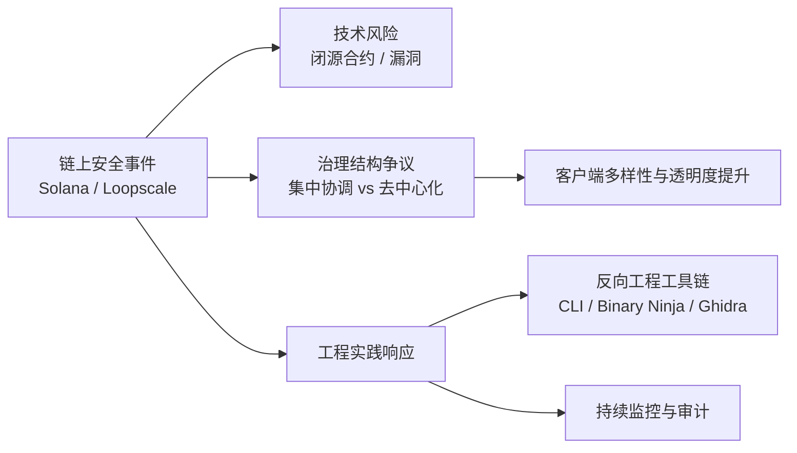

 # 高级 Rust Web3 工程师面试练习：5 组新闻型问答（Liner）

 > 说明：本笔记基于 2024–2025 年公开报道和技术文章，总结 Rust 在主流公链和 Web3 基础设施中的典型议题，主要用于高级 Rust 区块链工程师面试练习，而非投资建议。涉及 TPS、TVL、薪资等数值仅为代表性区间，实际数据请以最新官方或权威统计为准。

 ## 目录

 - [1. Rust 在主流公链和 Web3 基础设施核心模块开发中的核心优势体现在哪些方面？](#1-rust-在主流公链和-web3-基础设施核心模块开发中的核心优势体现在哪些方面)
 - [2. Rust 在区块链后端开发中与 C++ 和 Go 等语言相比，在性能、安全性及开发者生产力方面有何异同？](#2-rust-在区块链后端开发中与-c-和-go-等语言相比在性能、安全性及开发者生产力方面有何异同)
 - [3. Solana 等基于 Rust 的区块链项目在实际部署中面临过哪些安全漏洞、调试挑战，并从中吸取了哪些经验教训？](#3-solana-等基于-rust-的区块链项目在实际部署中面临过哪些安全漏洞调试挑战并从中吸取了哪些经验教训)
 - [4. Rust 如何在区块链和 Web3 项目中推动数据结构和算法创新，以解决可扩展性、安全性和效率挑战？](#4-rust-如何在区块链和-web3-项目中推动数据结构和算法创新以解决可扩展性安全性和效率挑战)
 - [5. Rust 在 DEX、CEX 和智能合约等链上项目中的实际开发经验和生态系统支持有哪些突出表现？](#5-rust-在-dex、cex-和智能合约等链上项目中的实际开发经验和生态系统支持有哪些突出表现)

 ---

 ### 1. Rust 在主流公链和 Web3 基础设施核心模块开发中的核心优势体现在哪些方面？

 #### 回答:
 Rust 已成为 Web3 领域中构建高性能、安全且去中心化应用的关键编程语言. 其核心优势在于对性能和效率的严格把控，通过零成本抽象和编译时优化，使其在区块链世界中表现卓越. Rust 的所有权模型和借用检查器保证了内存安全，有效避免了空指针引用和悬空指针解引用等问题，这对于智能合约和区块链操作至关重要，因为任何错误都可能导致巨大的经济损失. 此外，Rust 对并发处理的强大支持能够防止数据竞争，并提供高效的并行执行原语，使其能够有效处理异步操作，满足 Web3 应用对多并发操作的需求.

 其强大的类型系统和泛型支持在编译时就能捕获更多错误，并允许编写灵活可重用的代码，这有助于为区块链概念创建领域特定的抽象. 这些特性使得 Rust 成为 Solana、Polkadot 和 NEAR Protocol 等知名区块链平台的首选语言. 例如，Solana 主要使用 Rust 来编写智能合约，而 Polkadot 的 Substrate 框架也以 Rust 实现其运行时逻辑. 这种能力促使 Rust 成为构建高度可扩展、安全且高效的 Web3 基础设施和核心模块的理想选择，显著提升了去中心化应用（dApps）的稳健性. Rust 独特的所有权系统在编译时就能防范内存泄漏和数据竞争，确保性能和安全性，而无需像其他语言那样依赖垃圾回收器. 这种严格的内存管理在区块链环境中尤为重要，因为它能减少智能合约攻击的风险，并确保在多线程区块链环境中快速安全地验证交易.

 Rust 的生态系统也在快速发展，提供了 ink! (基于 Rust 的 Substrate 链智能合约 eDSL)、rust-web3 (与 Ethereum 节点交互的库) 和 Anchor (Solana 智能合约开发框架) 等工具和库. 尽管 Rust 的学习曲线相对陡峭，特别对于系统编程新手来说，但其在 Web3 领域的性能、安全性和日益增长的采用率证明了其长期价值. WebAssembly (WASM) 在 Rust Web3 开发中也扮演着关键角色，许多下一代区块链将 Rust 代码编译为 WASM，以便在浏览器或链上高效执行高性能 dApps 和智能合约.

 **面试官关注点小结：** 能否从性能、安全性、并发模型、类型系统和生态工具五个维度，结合具体公链案例说明 Rust 的核心优势，并客观提到学习曲线和生态成熟度等权衡.

 **可视化：Rust 在 Web3 基础设施中的核心优势维度**

 | 维度 | 关键点 | 代表性公链 / 生态工具 |
 | --- | --- | --- |
 | 性能与效率 | 零成本抽象、编译期优化、无 GC，适合高 TPS 场景 | Solana、Substrate 运行时 |
 | 内存与并发安全 | 所有权 + 借用检查避免空指针、悬空指针和数据竞争 | Solana、NEAR 等 |
 | 类型系统与抽象 | 强类型 + 泛型帮助构建区块链领域特定抽象 | Substrate 模块化运行时 |
 | 生态与工具链 | ink!、rust-web3、Anchor、WASM 提供完整的开发体验 | Polkadot、Solana 等生态 |

 ### 2. Rust 在区块链后端开发中与 C++ 和 Go 等语言相比，在性能、安全性及开发者生产力方面有何异同？

#### 回答:
Rust、C++ 和 Go 都是高性能编程语言，但在区块链后端开发中，它们在性能、安全性以及开发者生产力方面展现出显著差异.

**性能对比：**
Rust 的执行速度与 C++ 不相上下，甚至在某些情况下更优，因为它通过零成本抽象、细粒度底层控制和优化编译器来实现高性能. Rust 在运行时没有垃圾回收机制，这使得其性能更加一致和可预测，避免了 Go 语言中垃圾回收可能导致的“停顿”现象，这对于实时或超高性能应用（如操作系统内核、Web 浏览器组件和实时控制系统）至关重要. Go 语言虽然也很快，但其主要设计目标是开发速度而非极致的执行速度，编译器更注重快速编译而非生成最有效的机器代码，因此在运行时基准测试中通常不如 Rust. C++ 以其卓越的速度和内存管理能力而闻名，提供底层控制和零成本抽象，使其在性能上与 Rust 匹敌.

**安全性对比：**
Rust 的最大亮点在于其强大的内存安全特性，其所有权和借用检查系统在编译时就能消除常见的内存安全问题，如空指针解引用、缓冲区溢出和数据竞争. 这种机制极大地减少了区块链应用中因内存错误导致的安全漏洞和潜在的经济损失. C++ 也提供底层控制和灵活性，但这种灵活性带来了手动内存管理的责任，如果处理不当，可能引入安全漏洞. 虽然 C++ 具备提高安全性的功能，但需要格外细致的编程才能规避风险. Go 语言通过垃圾回收机制解决了许多内存管理问题，提高了开发效率，但其运行时垃圾回收可能引入不可预测性，并且它不如 Rust 那样在编译时强制进行严格的内存安全检查. 虽然 Rust 和 C++ 都能构建高度安全的系统，但 Rust 内置的内存安全机制使其在这方面具有优势，而 C++ 需要更专业的技能来有效管理内存.

**开发者生产力对比：**
Go 以其简洁的语法和快速的编译速度而闻名，学习曲线相对平缓，开发者可以快速上手并高效完成工作. 这使得 Go 成为需要快速开发或团队快速上手项目的理想选择. 然而，Go 的简洁性也意味着在解决某些问题时需要编写更多代码，并且其类型系统不如 Rust 强大. Rust 则拥有更陡峭的学习曲线，特别是对于不熟悉系统编程的开发者来说，所有权和借用检查等概念可能难以掌握. 然而，一旦掌握，Rust 的严格编译器检查和丰富功能（如强大的并发原语和类型系统）能极大地提高代码质量和长期生产力，减少运行时错误和调试时间. Rust 开发者虽然成本较高，但其在大型项目或需要从传统语言（如 C++）迁移的项目中具有优势. C++ 对初学者来说也具有挑战性，但对于有 C、Java 或 Python 背景的开发者来说可能更容易上手.

**面试官关注点小结：** 能否从性能、安全性和工程效率三个维度，对 Rust、C++、Go 做出有数据、有场景的对比，说明各自适用场景和取舍，而不是一味吹捧某一种语言.

**可视化：Rust / C++ / Go 在区块链后端中的对比一览**

| 语言 | 性能特性 | 安全性特性 | 开发者生产力 | 典型适用场景 |
| --- | --- | --- | --- | --- |
| Rust | 接近 C++ 的原生性能；零成本抽象；无 GC，延迟可预测 | 编译期所有权 / 借用检查，避免空指针、缓冲区溢出和数据竞争 | 学习曲线陡峭，但长期减少运行时错误和调试时间 | 高性能、高安全要求的核心链上模块和基础设施 |
| C++ | 传统意义上的极致性能和底层控制力 | 手动内存管理，稍有不慎易引入安全漏洞 | 需要资深工程经验来维持代码质量 | 既有 C/C++ 资产较多的底层系统、性能敏感组件 |
| Go | 编译快、开发体验好，运行性能一般场景足够 | GC 避免大量手动内存管理问题，但无法像 Rust 一样在编译期强制内存安全 | 语法简单，上手快，适合需要快速迭代的后端服务 | 快速交付的微服务、工具链、运维/中台服务 |

### 3. Solana 等基于 Rust 的区块链项目在实际部署中面临过哪些安全漏洞、调试挑战，并从中吸取了哪些经验教训？

#### 回答:
Solana 作为主要采用 Rust 的高性能区块链平台，在实际部署中展现出卓越的性能，但也不可避免地遭遇了多项安全漏洞和调试挑战. 2024 年 8 月，Solana 开发者、验证者和客户端团队通过协调一致的补丁解决了严重的安全性漏洞. 此次事件凸显了区块链网络在面对潜在威胁时快速响应的能力，在漏洞公开披露前，网络中 70% 的权益已完成修补. 尽管响应迅速，但也引发了关于 Solana 生态系统去中心化性质的讨论，因为其幕后协调工作似乎与完全去中心化的原则相悖. 专家指出，像这样的安全事件并非 Solana 独有，其他区块链网络（包括 Ethereum）也曾发生过，识别漏洞、开发补丁并协调实施是维护任何复杂软件系统的必要环节.

Solana 生态系统中的一个显著挑战是**闭源程序**问题，这损害了开放源码精神，增加了用户风险，并减缓了社区创新. 2025 年 4 月，借贷协议 Loopscale 因不完全公开的合约漏洞，损失了约 570 万 USDC 和 1,200 SOL. 闭源问题导致审计师无法有效工作、钱包无法警示用户、攻击者在暗中隐藏，并阻碍了优秀创意的复用. 针对这些问题，社区开发了反向工程工具链，如 Solana CLI、llvm-objdump、Binary Ninja 和 Ghidra，用于提取链上二进制代码、重建 IDL（Instruction Definition Language）以及定位漏洞. Loopscale 案例中，通过静态侦察和动态跟踪重放攻击者的交易，确认了漏洞的存在.

尽管 Rust 的内存安全性有助于防止常见的内存相关漏洞，但它并不能完全避免逻辑错误或缺失的边缘情况检查. 这意味着即使使用 Rust，彻底的智能合约审计仍然至关重要. 2024 年，Solana DeFi 领域常见的攻击向量包括访问控制问题、价格操纵、私钥泄露和合约漏洞. 这些事件强调了加强审计、持续监控和采用安全最佳实践的重要性. 开发者应发布开源代码、标记每个发布版本与准确的部署哈希、提供真实的审计报告、发布 IDL 文件，并记录升级密钥，以增强透明度和安全性. 忽视这些实践会增加被攻击的风险.

经验教训表明，透明度不仅仅是一种理想主义，更是一种实用的防御措施. 通过实施持续监控、自动化 IDL 恢复和前端警告机制，可以促使开发者转向开源，从而提升整个生态系统的安全性. Solana 正在积极开发新的客户端实现，以提高客户端多样性，从而降低单一客户端漏洞带来的中心化风险. 尽管 Solana 仍然面临诸如交易确认时间、智能合约框架和可持续应用开发等挑战，但其快速响应安全事件的能力以及充满活力的开发者社区，预示着其在高性能区块链领域的持续创新和增长潜力.

**面试官关注点小结：** 能否从具体事件出发，说明「技术风险 + 治理结构 + 工程实践」三层面的教训，并给出一套可落地的缓解措施（开源、审计、监控、客户端多样性等）。

**可视化：Solana/Loopscale 安全事件与工程教训**

- **典型事件：**
  - 2024 年 8 月，Solana 在漏洞公开前完成大部分权益节点修补，体现快速响应能力，同时引发「幕后协调 vs 去中心化」讨论。
  - 2025 年 4 月，Loopscale 借贷协议因闭源合约漏洞损失约 570 万 USDC 和 1,200 SOL，凸显闭源带来的审计和用户风险。
- **调试与审计工具链：** 利用 Solana CLI、llvm-objdump、Binary Ninja、Ghidra 等，提取链上二进制、恢复 IDL 并重放攻击交易，帮助快速定位问题。
- **工程与治理改进实践：** 推广开源代码、版本与部署哈希一一对应、真实审计报告、持续监控和客户端多实现，以降低单点失效与信息不对称风险。

### 4. Rust 如何在区块链和 Web3 项目中推动数据结构和算法创新，以解决可扩展性、安全性和效率挑战？

#### 回答:
Rust 在区块链和 Web3 项目中扮演着关键角色，通过其独特的功能促进数据结构和算法创新，以有效解决可扩展性、安全性及效率方面的挑战. Rust 的所有权模型、内存安全和并发能力使其成为开发去中心化平台核心组件的理想选择.

在**可扩展性**方面，Rust 驱动的数据结构和算法创新主要体现在以下几个方面：
- **并行处理与并发优化**：Rust 对并发编程的内置支持允许开发者构建能够同时处理多个交易的可扩展区块链解决方案. 例如，Solana 利用 Rust 及其独特架构（如 Sealevel 并行智能合约运行时和 Gulf Stream 无内存池交易转发协议）实现高吞吐量和低延迟. 这些机制使得 Solana 能够每秒处理超过 65,000 笔交易，并达到亚秒级终结性.
- **高效的数据结构**：在 Solana 开发中，选择正确的数据结构对于优化程序至关重要. 通过将数据组织到更少的账户中，减少账户查找的开销，并使用紧凑的数据格式（如二进制编码而非 JSON），可以显著提高效率. 针对固定大小数据使用数组，对于键值对使用映射，以及实施自定义数据结构（如链表用于动态数据），都能优化访问时间并减少内存使用. 最小化数据冗余也节约了空间并简化了更新和读取操作.
- **算法优化与计算复杂性最小化**：减少计算复杂性对于实现更快的交易速度至关重要. 这包括选择时间复杂度更低的算法（如 O(n log n) 优于 O(n^2)）、批量处理交易、预计算重用值、利用并行处理以及限制对外部程序或 API 的调用. 此外，缓存常用数据也能加快交易处理速度.

在**安全性**方面，Rust 的创新主要源于其内存安全特性：
- **消除内存安全漏洞**：Rust 的所有权模型在编译时就消除了许多传统语言中常见的内存安全错误，如空指针解引用和缓冲区溢出. 这显著降低了区块链应用和智能合约的攻击面，对于需要高安全性的金融交易尤其重要.
- **强类型系统**：Rust 健壮的类型系统和泛型支持在编译时捕获错误，确保代码的灵活和可重用性，并能为区块链概念创建领域特定的抽象.
- **密码学集成**：区块链中的密码学是确保数据安全、完整性和真实性的基础. Rust 生态系统包含了强大的密码学库，支持 SHA-256 哈希、数字签名和公钥加密等技术，这些是交易认证和数据完整性的关键.

在**效率**方面，Rust 提供了零成本抽象和原生代码编译，使其在资源密集型应用中表现出色. 这意味着开发者可以编写高级代码，同时保持接近底层硬件的控制，从而最大化性能. 此外，Rust 的模块化区块链架构（如 Polkadot 的 Substrate 框架）允许开发者构建具有自定义逻辑的模块化区块链，这提高了灵活性和效率. 通过 WASM 兼容性，Rust 代码可以在 Web 浏览器中运行，实现安全轻量级的区块链应用，进一步扩展了其能力.

**面试官关注点小结：** 是否能够用 1–2 个具体链上场景，把「数据结构选择 + 算法复杂度 + Rust 特性（所有权、并发、WASM）」串成一条完整的性能优化链路，而不仅停留在概念层面.

**可视化：Rust 在链上可扩展性 / 安全性 / 效率中的角色**

| 挑战维度 | Rust 支撑特性 | 文中示例 |
| --- | --- | --- |
| 可扩展性（Scalability） | 并发与并行编程支持、适合批量处理和流水线化、配合合理数据结构 | Solana 通过并行运行时 Sealevel 和 Gulf Stream 协议实现高吞吐、低延迟 |
| 安全性（Security） | 所有权模型、借用检查、强类型系统 + 密码学库 | 在智能合约和链上交易中消除空指针、缓冲区溢出等内存错误，降低攻击面 |
| 效率（Efficiency） | 零成本抽象、原生代码编译、WASM 支持和模块化框架 | Substrate 模块化区块链 + WASM 合约，让高性能代码在浏览器或链上安全运行 |

### 5. Rust 在 DEX、CEX 和智能合约等链上项目中的实际开发经验和生态系统支持有哪些突出表现？

#### 回答:
Rust 在去中心化交易所（DEX）、中心化交易所（CEX）和智能合约等链上项目中展现出显著的实际开发能力和强大的生态系统支持. 它的核心优势，如卓越的性能、内存安全性、并发处理能力和强大的类型系统，使其成为构建这些关键 Web3 基础设施的理想选择.

**智能合约开发：**
Rust 正在成为 Polkadot 和 Solana 等区块链网络上编写智能合约的首选语言. 例如，Solana 的智能合约主要使用 Rust 编写，而 Substrate 框架也使用 Rust 进行运行时逻辑开发. Rust 的安全机制确保了合约按预期运行，有助于避免因漏洞造成的经济损失. 与 Solidity 相比，基于 Rust 的智能合约通常能提供更好的性能和更低的交易成本，使其成为构建可扩展和经济实惠的区块链应用的诱人选择. 尽管 Rust 的所有权和借用检查等概念对初学者来说学习曲线较陡峭，但其严谨的编译器检查和全面的工具链有助于编写可靠高效的代码.

**去中心化金融 (DeFi) 解决方案：**
DeFi 应用对安全性、效率和可靠性有很高要求，而 Rust 天然契合这些需求. 从借贷平台到去中心化交易所，Rust 开发能够提高区块链金融交易的安全性和效率. Rust 处理复杂金融计算且无额外开销的能力，确保了去中心化金融服务在 DeFi 不断发展的同时，保持快速、可扩展和经济高效.

**区块链游戏开发：**
随着区块链游戏行业的扩张，使用 Rust 进行游戏开发越来越受欢迎. Rust 卓越的性能可以确保去中心化游戏应用流畅运行且无延迟. 对于将 Play-to-Earn 功能、智能合约和 NFT 集成到 Web3 游戏中，Rust 是一个绝佳选择. 许多区块链游戏项目使用 Rust 构建 NFT 市场、游戏物理引擎和链上逻辑. Rust 与 WebAssembly (WASM) 的兼容性使得开发者能够创建在移动设备和浏览器上运行良好的跨平台 Web3 游戏.

**基础设施和生态系统支持：**
Rust 在 Layer 1 (基础) 和 Layer 2 (可扩展性) 区块链解决方案的开发中占据重要地位. Polkadot 和 Solana 等项目利用 Rust 提升其速度、可扩展性和安全性. Substrate 框架允许开发者使用 Rust 构建自定义区块链网络，在保持安全性和灵活性的同时缩短开发时间. 此外，Rust 生态系统提供了丰富的工具和框架，例如：
- **ink!**：一个基于 Rust 的 eDSL，用于在 Substrate 链上编写智能合约.
- **rust-web3**：一个用于与 Ethereum 节点交互的 Rust 库.
- **Anchor**：一个用于 Solana 智能合约开发的框架.
- **Cargo**：Rust 的包管理器和构建工具，以用户友好的设计和功能著称.
- **WebAssembly (WASM)**：支持 Rust 代码编译为 WASM，实现跨平台的高性能 dApps 和智能合约.
- **Rocket**：一个强大的 Web 框架，提供类型安全的请求处理和零成本抽象，保证 Rust-based Web3 应用的高性能和安全性.

Rust 拥有一个充满活力且不断壮大的开发者社区，提供开源库、丰富的文档和频繁的更新. 像 AWS、Google 和 Microsoft 这样的巨头也为 Rust Foundation 提供了基础设施支持和捐赠，进一步巩固了 Rust 在 Web3 基础设施开发中的地位. 随着区块链行业对高性能和安全性需求的增加，拥有 Rust 技能的开发者在区块链核心工程师、平行链开发、运行时开发和零知识证明工程师等领域备受追捧.

**面试官关注点小结：** 能否结合 DEX、CEX、链游和基础设施四类项目，给出你真实或假想的 Rust 实战经验，并说明你如何利用生态工具把「安全 + 性能 + 交付效率」同时做扎实.

**可视化：Rust 在不同链上场景中的角色与生态支撑**

| 场景 | Rust 角色 / 优势 | 关键生态工具与技术 |
| --- | --- | --- |
| 智能合约（Polkadot / Solana） | 高性能、内存安全的合约逻辑；相较 Solidity 更低的 Gas / 手续费 | ink! eDSL、Anchor 框架、Substrate 运行时、WASM 合约 |
| DeFi 协议（借贷 / DEX） | 满足高并发撮合和复杂金融计算，对安全性和效率要求极高 | Rust 密码学库、严格类型系统、配合第三方审计与持续监控实践 |
| 区块链游戏与 NFT | 提供接近原生的游戏性能，并通过 WASM 支持多终端运行；适合构建链游经济与 NFT 逻辑 | WASM 部署、NFT 市场合约、链上逻辑与物理引擎整合 |
| 基础设施与生态（L1/L2 / 工具链） | 构建高性能链、网关、节点服务和中间件；兼顾扩展性和安全性 | Substrate、rust-web3、Cargo、Rocket 等 Web 框架，以及云厂商对 Rust 的基础设施支持 |

Sources: 
[1] Why Rust Is a Good Choice for Web3 Development - DEV Community, https://dev.to/shanu001x/why-rust-is-a-good-choice-for-web3-development-nf3
[2] Web3 Infrastructure, Crypto Concepts: Beginner's Guide, https://www.diadata.org/crypto-narratives/web3-infrastructure/
[3] Why Rust is the future of web3 and Blockchain? Hire ... - letsremotify, https://letsremotify.com/blog/why-rust-is-the-future-of-web3-and-blockchain-hire-rust-developers-within-24-hours/
[4] Future-Proof Skills for Rust/Blockchain Developers - Medium, https://medium.com/@fennsaji/future-proof-skills-for-rust-blockchain-developers-503e39d8f568
[5] Rust vs Go in 2025 - Bitfield Consulting, https://bitfieldconsulting.com/posts/rust-vs-go
[6] Rust Infrastructure Support & Development, https://rustfoundation.org/infrastructure/
[7] Rust vs C++ Performance Analysis: Speed, Efficiency, and More, https://parallelstaff.com/rust-vs-c-plus-plus-speed-benchmark/
[8] Rust in Blockchain and Cryptocurrency Development, https://www.rapidinnovation.io/post/rusts-role-in-blockchain-and-cryptocurrency-development
[9] Solidity vs. Rust: A Developer's Perspective | by Securr - Medium, https://medium.com/@securrtech/solidity-vs-rust-a-developers-perspective-dcdaea7be137
[10] Build a Blockchain with Rust: A Step-by-Step Guide - Rapid Innovation, https://www.rapidinnovation.io/post/how-to-build-a-blockchain-with-rust
[11] Solana developers address critical vulnerability with coordinated patch, https://www.theblock.co/post/310361/solana-developers-address-critical-vulnerability-with-coordinated-patch
[12] Solana Still Has a Ton of Problems | Weekly Roundup, https://solanacompass.com/learn/Lightspeed/solana-still-has-a-ton-of-problems-weekly-roundup
[13] The Rise of Rust in Blockchain: Why Performance-Critical Chains ..., https://blockeden.xyz/forum/t/the-rise-of-rust-in-blockchain-why-performance-critical-chains-are-switching/178
[14] Cracking Solana's Closed Programs: The Art and Science ... - Medium, http://anarcaze.medium.com/cracking-solanas-closed-programs-the-art-and-science-of-reverse-engineering-defi-f556b7ebdaf2
[15] Ultimate Solana Optimization Guide 2024 - Rapid Innovation, https://www.rapidinnovation.io/post/solana-optimization-and-best-practices-guide
[16] How Rust Enhances Scalability and Security in Modern Software ..., https://lvivity.com/rust-in-modern-software-development
[17] Rust Rising: Navigating the Ecosystem and Adoption Challenges, https://www.sonatype.com/blog/rust-rising-navigating-the-ecosystem-and-adoption-challenges
[18] Rust Vs C++ Performance: When Speed Matters - BairesDev, https://www.bairesdev.com/blog/when-speed-matters-comparing-rust-and-c/
[19] How Blockchain with Rust Can Enhance Security, Scalability, and ..., https://medium.com/nerd-for-tech/how-blockchain-with-rust-can-enhance-security-scalability-and-performance-for-your-business-b9cf22123d15
[20] Rust Memory Safety on Solana: What Smart Contract Audits Reveal, https://threesigma.xyz/blog/rust-and-solana/rust-memory-safety-on-solana
[21] Beyond the Hype: How Rust is Powering the Next Generation of ..., https://coinsbench.com/beyond-the-hype-how-rust-is-powering-the-next-generation-of-tech-from-webassembly-to-web3-2c5779514f67
[22] thirdweb-dev/engine-core: Production-grade blockchain ... - GitHub, https://github.com/thirdweb-dev/engine-core
[23] Solana DeFi Security Threats and Risk Mitigation in High-Speed ..., https://www.cyberdaily.au/security/12630-solana-defi-security-threats-and-risk-mitigation-in-high-speed-networks
[24] Top Rust Smart Contract Vulnerabilities: A Deep Dive with Examples, https://medium.com/@dehvcurtis/top-rust-smart-contract-vulnerabilities-a-deep-dive-with-examples-eb36a84c800b
[25] Why Rust is the future of blockchain | by Dehvcurtis - Medium, https://medium.com/@dehvcurtis/why-rust-is-the-future-of-blockchain-b38356240a22
[26] Top Rust Smart Contract Auditing Services 2025 | FailSafe, https://getfailsafe.com/top-rust-smart-contract-audit-companies-services-in-2025/
[27] Solana Hacks, Bugs, and Exploits: A Complete History - Helius, https://www.helius.dev/blog/solana-hacks
