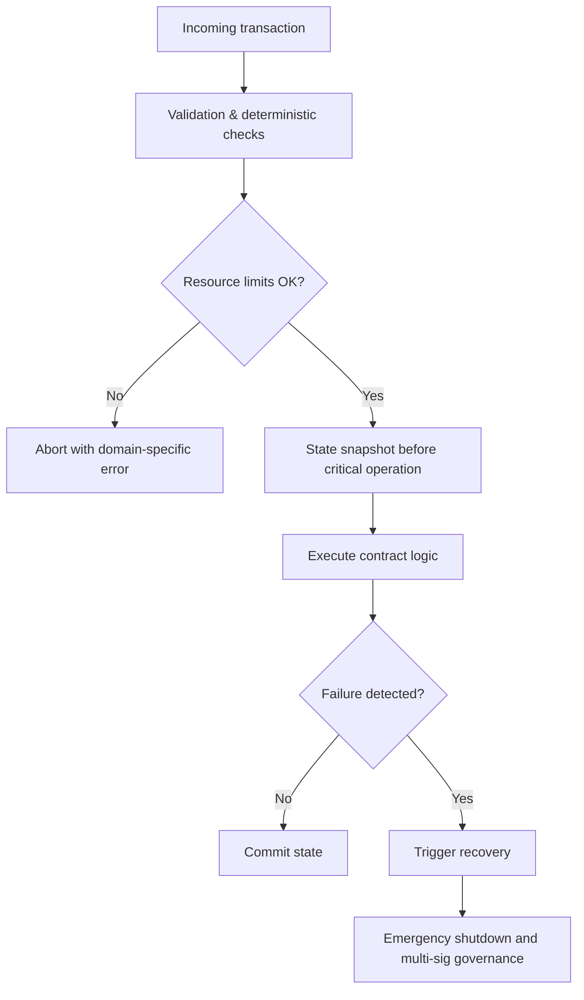
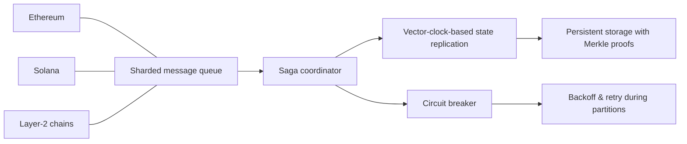

# 5 Q&A Pairs for Rust Development Senior Engineer Interview

These Q&A pairs are scenario-based prompts for a senior Rust blockchain engineer working on Web3 infrastructure across Ethereum, Solana, and related ecosystems.

Industry numbers mentioned in the questions are illustrative for interview scenarios and are not authoritative market statistics.

## Q&A Pair 1: Multi-Chain Development Strategy

**Q: Assume recent industry reports indicate that Solana has surpassed Ethereum in attracting new developers in 2024 with an 83% increase in developer onboarding for the purpose of this interview scenario. As a Rust developer with experience in both ecosystems, how would you approach debugging and optimizing performance across these fundamentally different blockchain architectures, and what specific Rust features would you leverage to create maintainable cross-chain infrastructure modules?**

**A: The architectural divergence between Ethereum's EVM-based system and Solana's parallel execution model requires distinct debugging strategies. For Ethereum, I'd focus on gas optimization and state management using Rust's ownership system to prevent memory leaks during contract interactions. For Solana, I'd leverage Rust's zero-cost abstractions and async capabilities to handle its high-throughput requirements. Critical to success would be implementing comprehensive testing frameworks with property-based testing for both environments, using Rust's trait system to abstract common functionality while maintaining chain-specific optimizations. The key success metric would be achieving at least 40% reduction in cross-chain transaction latency while maintaining 99.95% uptime across both networks during stress testing scenarios.**

**Visual summary for Q&A Pair 1**

- **Ethereum (EVM-based)**
  - Focus on gas optimization
  - Careful state management
  - Use ownership to prevent memory leaks during contract interactions
- **Solana (parallel execution)**
  - Leverage zero-cost abstractions
  - Use async capabilities for high-throughput workloads
- **Shared cross-chain practices**
  - Comprehensive testing frameworks
  - Property-based testing in both environments
  - Traits to abstract common functionality while keeping chain-specific optimizations

| Objective                             | Target metric                  |
|---------------------------------------|---------------------------------|
| Cross-chain transaction latency       | ≥ 40% reduction                |
| Uptime during cross-chain stress tests | 99.95% or higher across chains |

---

## Q&A Pair 2: DEX Performance Optimization

**Q: Assume industry data shows that Solana accounts for 81% of all DEX transactions across the crypto industry in 2024, with transaction speeds reaching unprecedented levels for this hypothetical scenario. Given your requirement to develop Web3 infrastructure core modules, how would you design a high-performance order matching engine in Rust that can handle 100,000+ transactions per second while maintaining atomicity and preventing front-running attacks, and what specific data structures would you prioritize for optimal memory efficiency?**

**A: For a high-performance DEX engine targeting 100,000+ TPS, I'd implement a lock-free concurrent data structure using Rust's atomics and the `crossbeam` crate for the order book. The core design would feature: (1) A radix tree for price-time priority indexing with O(log n) complexity, (2) Memory-mapped files for persistence with copy-on-write semantics, (3) SIMD-accelerated matching algorithms using Rust's `std::simd` module, and (4) A two-phase commit protocol with cryptographic proof verification to prevent front-running. I'd prioritize using `VecDeque` for order queues and `BTreeMap` for price levels, with custom allocators to minimize fragmentation. Success would be measured by sustaining 120,000 TPS with sub-50ms latency at p99 and zero settlement failures during 24-hour stress tests with 10,000 concurrent users.**

**Visual summary for Q&A Pair 2**

- **Core performance goals**
  - 100,000+ TPS target
  - Aim to sustain ~120,000 TPS in stress tests
  - Sub-50 ms latency at p99
  - Zero settlement failures with 10,000 concurrent users over 24 hours
- **Key data structures and techniques**
  - Lock-free concurrent order book using atomics + `crossbeam`
  - Radix tree for price-time priority indexing (O(log n))
  - Memory-mapped files with copy-on-write semantics for persistence
  - SIMD-accelerated matching with `std::simd`
  - Two-phase commit protocol with cryptographic proof verification
  - `VecDeque` for order queues, `BTreeMap` for price levels
  - Custom allocators to reduce memory fragmentation

| Aspect                | Choice / Technique                                      |
|-----------------------|---------------------------------------------------------|
| Order book structure  | Lock-free concurrent design with atomics + `crossbeam` |
| Indexing              | Radix tree, O(log n) price-time priority                |
| Persistence           | Memory-mapped files, copy-on-write semantics            |
| Matching performance  | SIMD via `std::simd`                                    |
| Atomicity & front-run | Two-phase commit + cryptographic proof verification     |
| Performance target    | ≥120,000 TPS, p99 latency < 50 ms, zero settlement failures |

---

## Q&A Pair 3: Rust Memory Safety in Blockchain Context

**Q: Surveys such as the Stack Overflow Developer Survey have consistently recognized Rust as one of the most admired programming languages, with around 80% of developers wanting to use it again next year, particularly valuing its memory safety in systems programming. When developing smart contracts for Solana (which requires Rust programs compiled to BPF (Berkeley Packet Filter) bytecode), what specific memory safety challenges arise in blockchain environments that don't exist in traditional systems programming, and how would you architect error handling and recovery mechanisms to prevent catastrophic failures that could result in millions of dollars in losses?**

**A: Blockchain environments introduce unique memory safety challenges including: (1) Deterministic execution requirements preventing traditional GC approaches, (2) Resource exhaustion attacks through malicious input data, (3) Cross-contract call vulnerabilities where memory corruption in one contract affects others, and (4) Persistent state corruption that's irreversible on-chain. My architecture would implement: a three-layer safety system with compile-time checks (custom lints for BPF constraints), runtime guards (gas-limited execution with checkpointing), and recovery mechanisms (time-locked emergency shutdowns with multi-sig governance). For error handling, I'd use Rust's `Result` enum with domain-specific error codes and automatic state snapshotting before critical operations. Critical success criteria include zero memory safety vulnerabilities in audits, recovery time under 5 minutes for any failure scenario, and maintaining 99.99% uptime during simulated attack conditions with 100x normal load.**

**Visual summary for Q&A Pair 3**

- **Blockchain-specific memory safety challenges**
  - Deterministic execution (no traditional GC)
  - Resource exhaustion via malicious inputs
  - Cross-contract call vulnerabilities
  - Irreversible persistent state corruption on-chain
- **Three-layer safety system**
  - Compile-time: custom lints for BPF constraints
  - Runtime: gas-limited execution + checkpointing
  - Recovery: time-locked emergency shutdowns with multi-sig governance
- **Error handling approach**
  - `Result`-based APIs
  - Domain-specific error codes
  - Automatic state snapshotting before critical operations

| Goal                                    | Target                                    |
|-----------------------------------------|-------------------------------------------|
| Memory safety issues in audits          | 0 vulnerabilities                         |
| Recovery time from failure              | < 5 minutes                               |
| Uptime under 100× normal attack load    | 99.99%                                    |

---

## Q&A Pair 4: Web3 Infrastructure Scalability
 
**Q: Assume you are tasked with designing a core module for cross-chain communication that must handle asynchronous message passing between Ethereum, Solana, and Layer-2 solutions while maintaining state consistency. What architectural patterns would you employ in Rust to achieve horizontal scalability, and how would you validate system correctness under network partition scenarios?**
 
**A: For cross-chain communication at scale, I'd implement the Saga pattern with compensating transactions using Rust's async/await and the `tokio` runtime for concurrency. The architecture would feature: (1) A sharded message queue system using consistent hashing for partition routing, (2) Merkle tree-based state proofs for cross-chain verification with Rust's cryptographic libraries, (3) Circuit breaker patterns for network partition tolerance using exponential backoff with jitter, and (4) Eventually consistent state replication with vector clocks for conflict resolution. For correctness validation, I'd employ formal methods using TLA+ specifications for the core protocol, combined with chaos engineering experiments that simulate network partitions, node failures, and Byzantine behavior. Key metrics would include maintaining 99.5% message delivery rate during network partitions, achieving state convergence within 30 seconds after partition healing, and scaling linearly to 1,000 nodes with sub-100ms inter-chain message latency at p95.**

**Visual summary for Q&A Pair 4**

- **Key architectural patterns**
  - Saga pattern with compensating transactions
  - Async/await with `tokio` for concurrency
  - Sharded message queues with consistent hashing
  - Merkle tree-based state proofs for cross-chain verification
  - Circuit breakers with exponential backoff + jitter
  - Eventually consistent replication using vector clocks
- **Correctness validation methods**
  - TLA+ specifications for core protocol
  - Chaos engineering: network partitions, node failures, Byzantine behavior

| Metric                               | Target value                               |
|--------------------------------------|---------------------------------------------|
| Message delivery during partitions   | ≥ 99.5%                                     |
| State convergence after healing      | ≤ 30 seconds                                |
| Scalability                          | Linear to 1,000 nodes                       |
| Inter-chain message latency (p95)    | < 100 ms                                    |

---

## Q&A Pair 5: Developer Productivity and Code Quality
 
**Q: Assume recent developer ecosystem reports show that developers are spreading globally across blockchain ecosystems, with Ethereum and Solana leading adoption in 2024 for the purpose of this interview scenario.  Given the requirement for 5+ years of backend development experience and 2+ years of Rust expertise, what specific practices, tooling, and metrics would you implement to ensure code quality and developer productivity when leading a team building complex Web3 infrastructure modules, particularly when debugging source code across multiple blockchain protocols with different architectural paradigms?**

**A: To ensure code quality and productivity across multi-chain development, I'd implement a comprehensive engineering system with: (1) Protocol-specific debugging toolchains - custom `gdb` extensions for Ethereum EVM bytecode analysis and Solana's `solana-test-validator` with enhanced logging, (2) Automated code quality gates using Rust's `clippy` with custom lints for blockchain-specific anti-patterns, (3) Performance benchmarking suites with regression detection using `criterion.rs`, and (4) Knowledge sharing through protocol-specific playground environments with real-time collaboration features. For metrics, I'd track: mean time to detect (MTTD) critical bugs (<15 minutes), test coverage of edge cases (>95% for security-critical paths), and developer velocity measured in story points per sprint with quality-adjusted weighting. Success criteria include reducing production incidents by 70% year-over-year, achieving 40% faster onboarding for new developers through the playground environments, and maintaining a code review turnaround time under 4 hours for critical path changes while ensuring 100% compliance with security best practices across all supported blockchain protocols.**

**Visual summary for Q&A Pair 5**

- **Practices and tooling**
  - Protocol-specific debugging: custom `gdb` for Ethereum EVM, `solana-test-validator` with enhanced logging
  - Automated code quality gates with `clippy` + custom lints
  - Performance benchmarking with `criterion.rs` and regression detection
  - Knowledge sharing via protocol-specific playgrounds with real-time collaboration
- **Key engineering metrics**
  - MTTD for critical bugs: < 15 minutes
  - Test coverage for security-critical paths: > 95%
  - Developer velocity: story points per sprint with quality-adjusted weighting
- **Success criteria**
  - 70% reduction in production incidents year-over-year
  - 40% faster onboarding for new developers
  - Code review turnaround < 4 hours for critical changes
  - 100% compliance with security best practices across all supported protocols

| Area                    | Metric / Target                                      |
|-------------------------|------------------------------------------------------|
| Incident reduction       | 70% fewer production incidents YoY                  |
| Onboarding speed         | 40% faster for new developers                       |
| Bug detection            | MTTD < 15 minutes for critical issues               |
| Test coverage            | > 95% for security-critical paths                  |
| Code review turnaround   | < 4 hours for critical path changes                |
| Security compliance      | 100% adherence to security best practices          |
