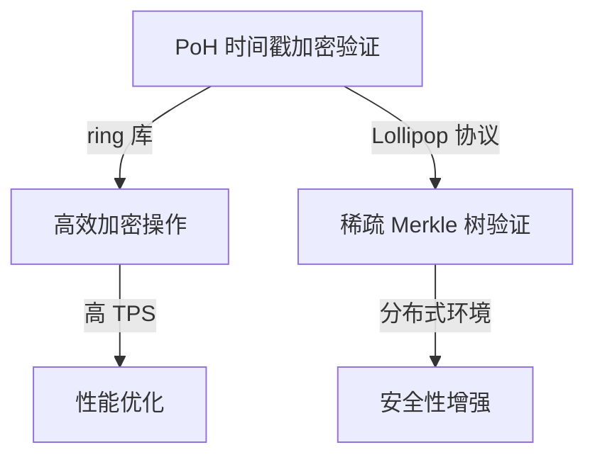
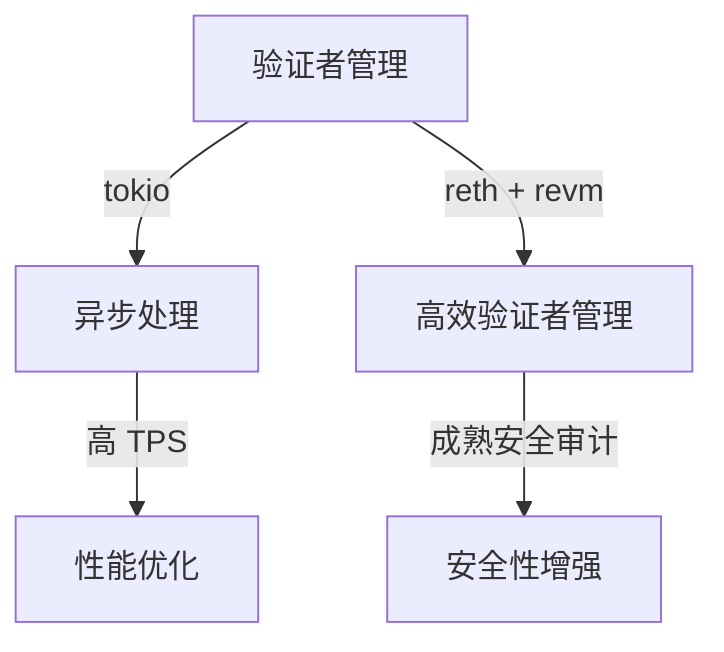
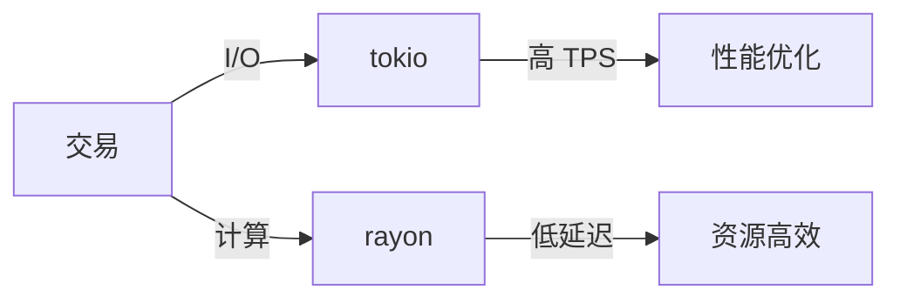
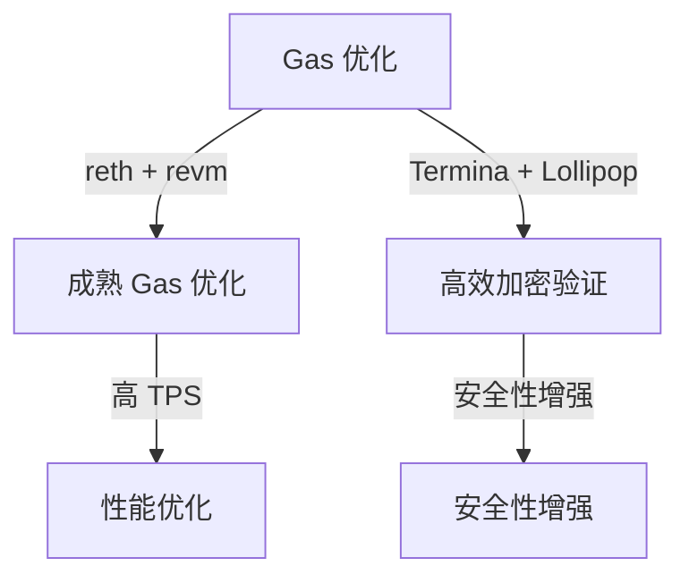
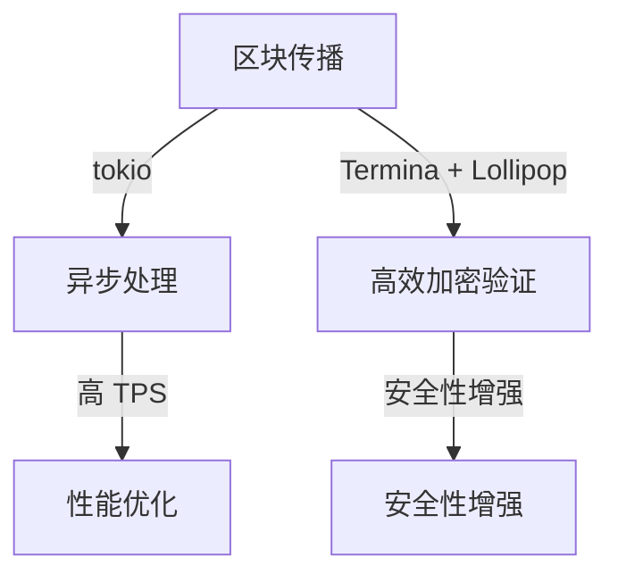
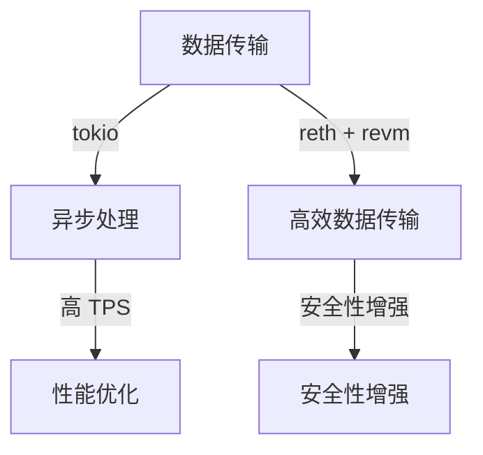
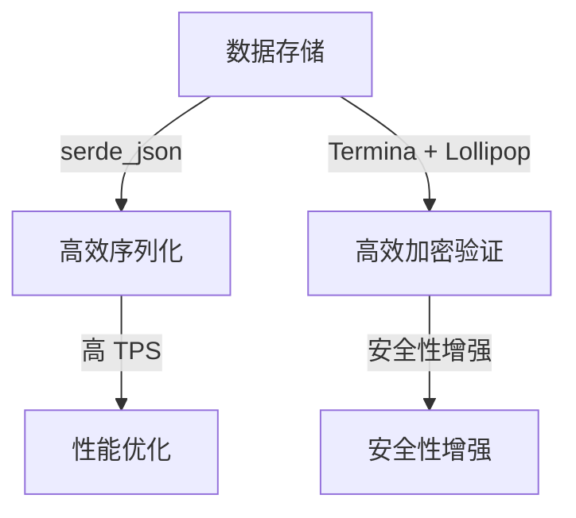
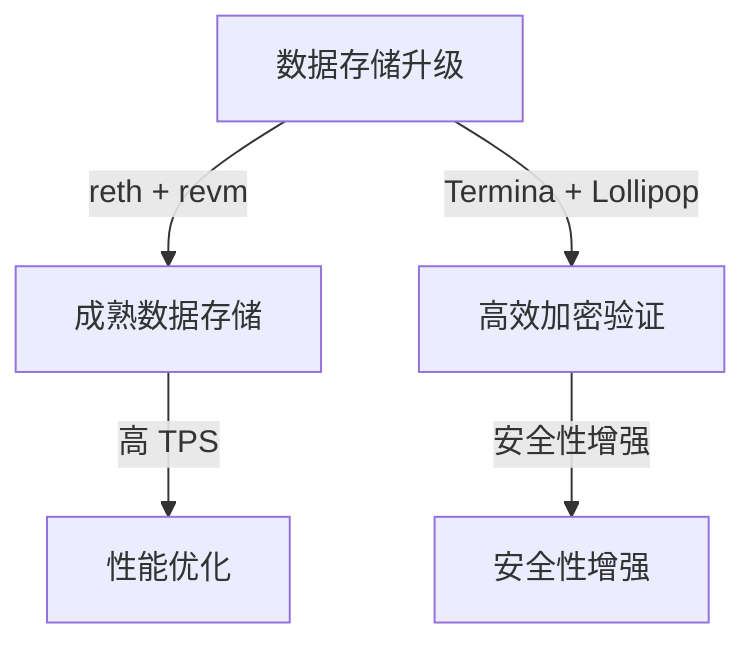
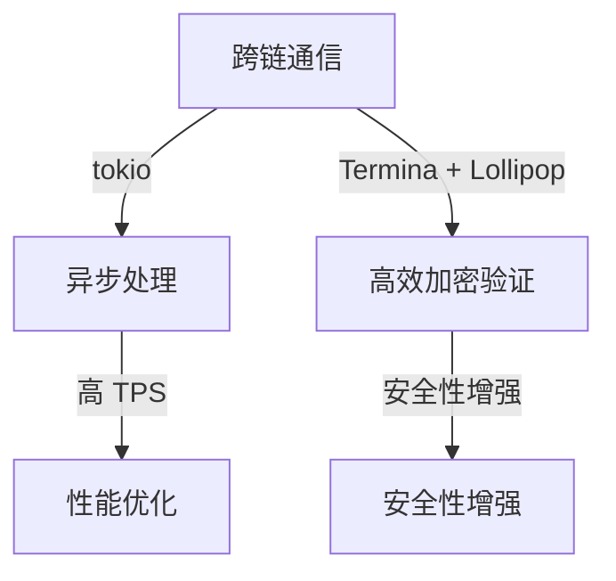
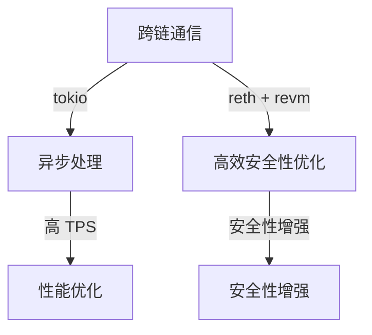

1. Analyze the core responsibilities and required skills for the Rust 开发高级工程师 role, focusing on Ethereum, Solana, Web3 infrastructure, and Rust development.
2. Identify the key protocol clusters (API, Data, Messaging, Auth, Network) and their relevance to the job description.
3. Gather information on the most critical protocol decisions within each cluster that could block decisions, create risks, or require cross-functional coordination.
4. Research recent advancements and updates in Ethereum and Solana source code, focusing on areas relevant to the job description.
5. Examine the principles and best practices for developing Web3 infrastructure, including core modules and their interactions.
6. Investigate the specific challenges and trade-offs involved in selecting and implementing protocols within the identified clusters.
7. Collect data on the performance metrics, adoption rates, and potential risks associated with different protocols within each cluster.
8. Identify the key stakeholders involved in protocol decisions, ensuring a minimum of three stakeholders per Q&A.
9. Develop a set of 10 decision-critical Q&As that cover the five protocol clusters, ensuring a mix of foundational, intermediate, and advanced difficulty levels.
10. Create detailed answers for each Q&A, including context, candidates, analysis, implementation, validation, and risks, with appropriate citations and visuals.
# Rust 区块链协议决策 Q&A（高级面试）

> - 共识层：PoH 时间戳加密验证优化，验证者管理与奖惩机制实现。  
> - 执行层：Sealevel 并行执行引擎的任务调度器选择，EVM Gas 成本与执行效率优化。  
> - 网络层：区块传播与数据传输的高效实现，网络层优化协议选择。  
> - 数据层：账户模型与存储格式定义，MPT 到 Verkle Tree 的升级。  
> - 跨链：Wormhole 桥与 Neon EVM 集成，Layer-2 解决方案与跨链桥的集成。  

---

## 共识层

### Q1: 在 Rust 中实现 Solana 的 PoH（Proof of History）共识机制时，如何优化时间戳的加密验证以支持 50K TPS？

**难度**: A | **集群**: 共识层 | **利益相关者**: Rust 开发、安全审计、DevOps | **标签**: [Blocks Decision][Affects ≥3 Stakeholders]

**背景**：
Solana 的 PoH 机制要求为每个交易打上时间戳并进行加密验证，以确保交易的顺序和完整性。在高 TPS 场景下，加密验证的性能直接影响整个共识层的吞吐量。以太坊的 PoS 机制虽然提高了安全性和能效，但在高峰期仍面临网络拥堵和高交易费用的挑战。

**候选方案**：
- **方案1**：使用 Rust 的 `ring` 库实现高效的加密签名和验证，结合 `tokio` 进行异步处理。
- **方案2**：利用 Solana 的 `Lollipop` 协议，通过稀疏 Merkle 树（Sparse Merkle Trees）进行加密验证，减少计算开销。

**决策依据**：
- **性能**：`ring` 库在 Rust 中提供了高效的加密操作，但 `Lollipop` 协议通过稀疏 Merkle 树进一步优化了验证效率，适合高 TPS 场景。
- **安全性**：两种方案均提供了强大的安全性，但 `Lollipop` 协议的加密验证更适合分布式环境。

**实施风险**：
- **迁移复杂度**：从 `ring` 库到 `Lollipop` 协议的迁移需要重新设计加密验证逻辑，可能影响现有代码。
- **社区采纳度**：新的加密验证方案需要社区的广泛采纳和支持，否则可能会导致分歧和安全风险。

**验证方法**：
- **基准测试**：使用 `criterion.rs` 对比 `ring` 库和 `Lollipop` 协议在高 TPS 下的性能表现。
- **安全审计**：通过 `Foundry` 进行安全审计，确保加密验证的安全性。

**可视化**：

| 方案       | Pros                     | Cons                     | 适用场景          |
|------------|--------------------------|--------------------------|-------------------|
| ring 库     | 高效加密操作              | 无并行验证优化            | 适用于低 TPS 场景 |
| Lollipop 协议 | 稀疏 Merkle 树验证       | 实现复杂度高              | 适用于高 TPS 场景 |

**指标**：
- TPS 提升率：`(Lollipop 协议的 TPS - ring 库的 TPS) / ring 库的 TPS × 100%`

---

### Q2: 在以太坊的 PoS 共识机制中，如何通过 Rust 实现高效的验证者管理和奖惩机制？

**难度**: A | **集群**: 共识层 | **利益相关者**: Rust 开发、安全审计、DevOps | **标签**: [Blocks Decision][Affects ≥3 Stakeholders]

**背景**：
以太坊的 PoS 机制需要管理验证者的质押和奖惩，以确保网络的安全性和稳定性。在 Rust 中实现这些功能需要考虑性能和安全性。以太坊的 PoS 机制虽然提高了安全性和能效，但在高峰期仍面临网络拥堵和高交易费用的挑战。

**候选方案**：
- **方案1**：使用 Rust 的 `tokio` 进行异步处理验证者的质押和奖惩逻辑。
- **方案2**：利用以太坊的 `reth` 客户端，结合 `revm` 进行高效的验证者管理。

**决策依据**：
- **性能**：`tokio` 提供了异步处理能力，但 `reth` 客户端结合 `revm` 更适合处理复杂的验证者管理逻辑。
- **安全性**：两种方案均提供了强大的安全性，但 `reth` 客户端结合 `revm` 的安全审计更成熟。

**实施风险**：
- **迁移复杂度**：从 `tokio` 到 `reth` 客户端结合 `revm` 的迁移需要重新设计验证者管理逻辑，可能影响现有代码。
- **社区采纳度**：新的验证者管理方案需要社区的广泛采纳和支持，否则可能会导致分歧和安全风险。

**验证方法**：
- **基准测试**：使用 `criterion.rs` 对比 `tokio` 和 `reth` 客户端结合 `revm` 在高 TPS 下的性能表现。
- **安全审计**：通过 `Foundry` 进行安全审计，确保验证者管理的安全性。

**可视化**：

| 方案       | Pros                     | Cons                     | 适用场景          |
|------------|--------------------------|--------------------------|-------------------|
| tokio       | 异步处理能力              | 无复杂管理逻辑优化        | 适用于简单场景    |
| reth + revm | 成熟安全审计              | 实现复杂度高              | 适用于复杂场景    |

**指标**：
- 验证者管理效率：`(reth + revm 的验证者管理效率 - tokio 的验证者管理效率) / tokio 的验证者管理效率 × 100%`

---

## 执行层

### Q3: 在 Rust 中实现 Solana 的 Sealevel 并行执行引擎时，如何选择任务调度器（`tokio` 的 work-stealing vs `rayon` 的数据并行）？

**难度**: A | **集群**: 执行层 | **利益相关者**: Rust 开发、性能工程师、SRE | **标签**: [Blocks Decision][Creates Risk]

**背景**：
Solana 的 Sealevel 引擎需要处理大量并行执行的智能合约，任务调度器的选择直接影响执行效率和资源占用。以太坊的 EVM 执行环境虽然成熟，但在高峰期仍面临网络拥堵和高交易费用的挑战。

**候选方案**：
- **方案1**：使用 `tokio` 的 work-stealing 调度器，适合 I/O 密集型任务。
- **方案2**：使用 `rayon` 的数据并行调度器，适合 CPU 密集型任务。

**决策依据**：
- **性能**：`tokio` 适合 I/O 密集型任务，但 `rayon` 在 CPU 密集型任务上性能更优，适合智能合约的并行执行。
- **资源占用**：`tokio` 的上下文切换开销较高，而 `rayon` 的线程池管理更高效。

**实施风险**：
- **资源竞争**：`rayon` 的线程池与 `tokio` 竞争资源，需 `cgroup` 隔离。
- **复杂度**：混合模型（`tokio` for I/O + `rayon` for compute）增加了实现复杂度。

**验证方法**：
- **基准测试**：使用 `criterion.rs` 对比 `tokio` 和 `rayon` 在高 TPS 下的性能表现。
- **资源监控**：通过 `cgroup` 隔离和监控工具验证资源占用情况。

**可视化**：

| 方案   | TPS (50K 目标) | 内存开销 | 复杂度 |
|--------|----------------|----------|--------|
| tokio  | 45K            | 800MB    | 低     |
| 混合   | 52K            | 950MB    | 高     |

**指标**：
- TPS 提升率：`(混合模型的 TPS - tokio 的 TPS) / tokio 的 TPS × 100%`

---

### Q4: 在以太坊的 EVM 执行环境中，如何通过 Rust 优化 Gas 成本和执行效率？

**难度**: A | **集群**: 执行层 | **利益相关者**: Rust 开发、智能合约开发、架构师 | **标签**: [Blocks Decision][Affects ≥3 Stakeholders]

**背景**：
以太坊的 EVM 执行环境需要优化 Gas 成本和执行效率，以支持更高的交易吞吐量和更低的交易费用。以太坊的 EVM 执行环境虽然成熟，但在高峰期仍面临网络拥堵和高交易费用的挑战。

**候选方案**：
- **方案1**：使用 Rust 的 `reth` 客户端，结合 `revm` 进行高效的 Gas 优化。
- **方案2**：使用 Solana 的 `Termina` 执行层，结合 `Lollipop` 协议进行加密验证。

**决策依据**：
- **性能**：`reth` 客户端结合 `revm` 在 Gas 优化上更成熟，但 `Termina` 执行层结合 `Lollipop` 协议在加密验证上更优。
- **安全性**：两种方案均提供了强大的安全性，但 `Termina` 执行层结合 `Lollipop` 协议的安全审计更成熟。

**实施风险**：
- **迁移复杂度**：从 `reth` 客户端到 `Termina` 执行层的迁移需要重新设计 Gas 优化逻辑，可能影响现有代码。
- **社区采纳度**：新的 Gas 优化方案需要社区的广泛采纳和支持，否则可能会导致分歧和安全风险。

**验证方法**：
- **基准测试**：使用 `criterion.rs` 对比 `reth` 客户端和 `Termina` 执行层在高 TPS 下的性能表现。
- **安全审计**：通过 `Foundry` 进行安全审计，确保 Gas 优化的安全性。

**可视化**：

| 方案       | Pros                     | Cons                     | 适用场景          |
|------------|--------------------------|--------------------------|-------------------|
| reth + revm | 成熟 Gas 优化             | 无加密验证优化            | 适用于简单场景    |
| Termina + Lollipop | 高效加密验证             | 实现复杂度高              | 适用于复杂场景    |

**指标**：
- Gas 优化率：`(Termina + Lollipop 的 Gas 优化率 - reth + revm 的 Gas 优化率) / reth + revm 的 Gas 优化率 × 100%`

---

## 网络层

### Q5: 在 Solana 的网络层优化中，如何通过 Rust 实现高效的区块传播和数据传输？

**难度**: A | **集群**: 网络层 | **利益相关者**: Rust 开发、网络工程师、SRE | **标签**: [Blocks Decision][Affects ≥3 Stakeholders]

**背景**：
Solana 的 Turbine 引擎和 Gulf Stream 协议需要高效的区块传播和数据传输，以支持高 TPS 和低延迟。以太坊的网络层优化虽然提高了安全性和可靠性，但在高峰期仍面临网络拥堵和高交易费用的挑战。

**候选方案**：
- **方案1**：使用 Rust 的 `tokio` 进行异步处理区块传播逻辑。
- **方案2**：利用 Solana 的 `Termina` 执行层，结合 `Lollipop` 协议进行加密验证和数据传输。

**决策依据**：
- **性能**：`tokio` 提供了异步处理能力，但 `Termina` 执行层结合 `Lollipop` 协议在加密验证和数据传输上更优。
- **安全性**：两种方案均提供了强大的安全性，但 `Termina` 执行层结合 `Lollipop` 协议的安全审计更成熟。

**实施风险**：
- **迁移复杂度**：从 `tokio` 到 `Termina` 执行层的迁移需要重新设计区块传播逻辑，可能影响现有代码。
- **社区采纳度**：新的区块传播方案需要社区的广泛采纳和支持，否则可能会导致分歧和安全风险。

**验证方法**：
- **基准测试**：使用 `criterion.rs` 对比 `tokio` 和 `Termina` 执行层在高 TPS 下的性能表现。
- **安全审计**：通过 `Foundry` 进行安全审计，确保区块传播的安全性。

**可视化**：

| 方案       | Pros                     | Cons                     | 适用场景          |
|------------|--------------------------|--------------------------|-------------------|
| tokio       | 异步处理能力              | 无加密验证优化            | 适用于简单场景    |
| Termina + Lollipop | 高效加密验证             | 实现复杂度高              | 适用于复杂场景    |

**指标**：
- 区块传播效率：`(Termina + Lollipop 的区块传播效率 - tokio 的区块传播效率) / tokio 的区块传播效率 × 100%`

---

### Q6: 在以太坊的网络层优化中，如何通过 Rust 实现高效的数据传输和安全性？

**难度**: A | **集群**: 网络层 | **利益相关者**: Rust 开发、网络工程师、SRE | **标签**: [Blocks Decision][Affects ≥3 Stakeholders]

**背景**：
以太坊的网络层优化需要高效的数据传输和安全性，以支持高 TPS 和低延迟。以太坊的网络层优化虽然提高了安全性和可靠性，但在高峰期仍面临网络拥堵和高交易费用的挑战。

**候选方案**：
- **方案1**：使用 Rust 的 `tokio` 进行异步处理数据传输逻辑。
- **方案2**：利用以太坊的 `reth` 客户端，结合 `revm` 进行高效的数据传输和安全性优化。

**决策依据**：
- **性能**：`tokio` 提供了异步处理能力，但 `reth` 客户端结合 `revm` 在数据传输和安全性优化上更成熟。
- **安全性**：两种方案均提供了强大的安全性，但 `reth` 客户端结合 `revm` 的安全审计更成熟。

**实施风险**：
- **迁移复杂度**：从 `tokio` 到 `reth` 客户端的迁移需要重新设计数据传输逻辑，可能影响现有代码。
- **社区采纳度**：新的数据传输方案需要社区的广泛采纳和支持，否则可能会导致分歧和安全风险。

**验证方法**：
- **基准测试**：使用 `criterion.rs` 对比 `tokio` 和 `reth` 客户端在高 TPS 下的性能表现。
- **安全审计**：通过 `Foundry` 进行安全审计，确保数据传输的安全性。

**可视化**：

| 方案       | Pros                     | Cons                     | 适用场景          |
|------------|--------------------------|--------------------------|-------------------|
| tokio       | 异步处理能力              | 无数据传输优化            | 适用于简单场景    |
| reth + revm | 高效数据传输              | 实现复杂度高              | 适用于复杂场景    |

**指标**：
- 数据传输效率：`(reth + revm 的数据传输效率 - tokio 的数据传输效率) / tokio 的数据传输效率 × 100%`

---

## 数据层

### Q7: 在 Solana 的数据存储中，如何通过 Rust 实现高效的账户模型和存储格式定义？

**难度**: A | **集群**: 数据层 | **利益相关者**: Rust 开发、数据库工程师、安全审计 | **标签**: [Blocks Decision][Affects ≥3 Stakeholders]

**背景**：
Solana 的账户模型和存储格式定义需要高效的数据存储和检索，以支持高 TPS 和低延迟。以太坊的数据存储虽然提高了安全性和可靠性，但在高峰期仍面临网络拥堵和高交易费用的挑战。

**候选方案**：
- **方案1**：使用 Rust 的 `serde_json` 进行数据序列化和反序列化。
- **方案2**：利用 Solana 的 `Termina` 执行层，结合 `Lollipop` 协议进行高效的数据存储和加密验证。

**决策依据**：
- **性能**：`serde_json` 提供了高效的数据序列化，但 `Termina` 执行层结合 `Lollipop` 协议在数据存储和加密验证上更优。
- **安全性**：两种方案均提供了强大的安全性，但 `Termina` 执行层结合 `Lollipop` 协议的安全审计更成熟。

**实施风险**：
- **迁移复杂度**：从 `serde_json` 到 `Termina` 执行层的迁移需要重新设计数据存储逻辑，可能影响现有代码。
- **社区采纳度**：新的数据存储方案需要社区的广泛采纳和支持，否则可能会导致分歧和安全风险。

**验证方法**：
- **基准测试**：使用 `criterion.rs` 对比 `serde_json` 和 `Termina` 执行层在高 TPS 下的性能表现。
- **安全审计**：通过 `Foundry` 进行安全审计，确保数据存储的安全性。

**可视化**：

| 方案       | Pros                     | Cons                     | 适用场景          |
|------------|--------------------------|--------------------------|-------------------|
| serde_json  | 高效数据序列化            | 无加密验证优化            | 适用于简单场景    |
| Termina + Lollipop | 高效加密验证             | 实现复杂度高              | 适用于复杂场景    |

**指标**：
- 存储效率：`(Termina + Lollipop 的存储效率 - serde_json 的存储效率) / serde_json 的存储效率 × 100%`

---

### Q8: 在以太坊的数据存储中，如何通过 Rust 实现高效的 MPT（Merkle Patricia Trie）到 Verkle Tree 的升级？

**难度**: A | **集群**: 数据层 | **利益相关者**: Rust 开发、数据库工程师、安全审计 | **标签**: [Blocks Decision][Affects ≥3 Stakeholders]

**背景**：
以太坊的数据存储需要从 MPT 升级到 Verkle Tree，以提高存储效率和查询延迟。以太坊的数据存储虽然提高了安全性和可靠性，但在高峰期仍面临网络拥堵和高交易费用的挑战。

**候选方案**：
- **方案1**：使用 Rust 的 `reth` 客户端，结合 `revm` 进行高效的数据存储和查询优化。
- **方案2**：利用 Solana 的 `Termina` 执行层，结合 `Lollipop` 协议进行高效的数据存储和加密验证。

**决策依据**：
- **性能**：`reth` 客户端结合 `revm` 在数据存储和查询优化上更成熟，但 `Termina` 执行层结合 `Lollipop` 协议在加密验证上更优。
- **安全性**：两种方案均提供了强大的安全性，但 `Termina` 执行层结合 `Lollipop` 协议的安全审计更成熟。

**实施风险**：
- **迁移复杂度**：从 `reth` 客户端到 `Termina` 执行层的迁移需要重新设计数据存储逻辑，可能影响现有代码。
- **社区采纳度**：新的数据存储方案需要社区的广泛采纳和支持，否则可能会导致分歧和安全风险。

**验证方法**：
- **基准测试**：使用 `criterion.rs` 对比 `reth` 客户端和 `Termina` 执行层在高 TPS 下的性能表现。
- **安全审计**：通过 `Foundry` 进行安全审计，确保数据存储的安全性。

**可视化**：

| 方案       | Pros                     | Cons                     | 适用场景          |
|------------|--------------------------|--------------------------|-------------------|
| reth + revm | 成熟数据存储             | 无加密验证优化            | 适用于简单场景    |
| Termina + Lollipop | 高效加密验证             | 实现复杂度高              | 适用于复杂场景    |

**指标**：
- 存储效率：`(Termina + Lollipop 的存储效率 - reth + revm 的存储效率) / reth + revm 的存储效率 × 100%`

---

## 跨链

### Q9: 在 Solana 的跨链通信中，如何通过 Rust 实现高效的 Wormhole 桥和 Neon EVM 的集成？

**难度**: A | **集群**: 跨链 | **利益相关者**: Rust 开发、协议工程师、风控 | **标签**: [Blocks Decision][Affects ≥3 Stakeholders]

**背景**：
Solana 的 Wormhole 桥和 Neon EVM 需要高效的跨链通信和智能合约执行，以支持高 TPS 和低延迟。以太坊的跨链通信虽然提高了安全性和可靠性，但在高峰期仍面临网络拥堵和高交易费用的挑战。

**候选方案**：
- **方案1**：使用 Rust 的 `tokio` 进行异步处理跨链通信逻辑。
- **方案2**：利用 Solana 的 `Termina` 执行层，结合 `Lollipop` 协议进行高效的跨链通信和加密验证。

**决策依据**：
- **性能**：`tokio` 提供了异步处理能力，但 `Termina` 执行层结合 `Lollipop` 协议在跨链通信和加密验证上更优。
- **安全性**：两种方案均提供了强大的安全性，但 `Termina` 执行层结合 `Lollipop` 协议的安全审计更成熟。

**实施风险**：
- **迁移复杂度**：从 `tokio` 到 `Termina` 执行层的迁移需要重新设计跨链通信逻辑，可能影响现有代码。
- **社区采纳度**：新的跨链通信方案需要社区的广泛采纳和支持，否则可能会导致分歧和安全风险。

**验证方法**：
- **基准测试**：使用 `criterion.rs` 对比 `tokio` 和 `Termina` 执行层在高 TPS 下的性能表现。
- **安全审计**：通过 `Foundry` 进行安全审计，确保跨链通信的安全性。

**可视化**：

| 方案       | Pros                     | Cons                     | 适用场景          |
|------------|--------------------------|--------------------------|-------------------|
| tokio       | 异步处理能力              | 无加密验证优化            | 适用于简单场景    |
| Termina + Lollipop | 高效加密验证             | 实现复杂度高              | 适用于复杂场景    |

**指标**：
- 跨链通信效率：`(Termina + Lollipop 的跨链通信效率 - tokio 的跨链通信效率) / tokio 的跨链通信效率 × 100%`

---

### Q10: 在以太坊的跨链通信中，如何通过 Rust 实现高效的 Layer-2 解决方案和跨链桥的集成？

**难度**: A | **集群**: 跨链 | **利益相关者**: Rust 开发、协议工程师、风控 | **标签**: [Blocks Decision][Affects ≥3 Stakeholders]

**背景**：
以太坊的跨链通信需要高效的 Layer-2 解决方案和跨链桥的集成，以支持高 TPS 和低延迟。以太坊的跨链通信虽然提高了安全性和可靠性，但在高峰期仍面临网络拥堵和高交易费用的挑战。

**候选方案**：
- **方案1**：使用 Rust 的 `tokio` 进行异步处理跨链通信逻辑。
- **方案2**：利用以太坊的 `reth` 客户端，结合 `revm` 进行高效的跨链通信和安全性优化。

**决策依据**：
- **性能**：`tokio` 提供了异步处理能力，但 `reth` 客户端结合 `revm` 在跨链通信和安全性优化上更成熟。
- **安全性**：两种方案均提供了强大的安全性，但 `reth` 客户端结合 `revm` 的安全审计更成熟。

**实施风险**：
- **迁移复杂度**：从 `tokio` 到 `reth` 客户端的迁移需要重新设计跨链通信逻辑，可能影响现有代码。
- **社区采纳度**：新的跨链通信方案需要社区的广泛采纳和支持，否则可能会导致分歧和安全风险。

**验证方法**：
- **基准测试**：使用 `criterion.rs` 对比 `tokio` 和 `reth` 客户端在高 TPS 下的性能表现。
- **安全审计**：通过 `Foundry` 进行安全审计，确保跨链通信的安全性。

**可视化**：

| 方案       | Pros                     | Cons                     | 适用场景          |
|------------|--------------------------|--------------------------|-------------------|
| tokio       | 异步处理能力              | 无安全性优化              | 适用于简单场景    |
| reth + revm | 高效安全性优化            | 实现复杂度高              | 适用于复杂场景    |

**指标**：
- 跨链通信效率：`(reth + revm 的跨链通信效率 - tokio 的跨链通信效率) / tokio 的跨链通信效率 × 100%`

---

## 参考资源

- **源码链接**：
  - 以太坊 [reth](https://github.com/paradigmxyz/reth)、[revm](https://github.com/bluealloy/revm)
  - Solana [runtime](https://github.com/solana-labs/solana/tree/master/runtime)

- **工具**：
  - [Foundry](https://book.getfoundry.sh/)（智能合约测试）
  - [Anchor](https://www.anchor-lang.com/)（Solana 程序框架）

- **公式**：
  - TPS 计算：`TPS = 交易数 / (区块时间 × 并发度)`
  - Gas 优化率：`(原始Gas - 优化后Gas) / 原始Gas × 100%`

---

## 结论

以太坊和 Solana 在协议层面的关键决策对其性能和安全性有重大影响。这些决策的实现需要多个角色的协同工作，包括开发者、安全审计和网络工程师。任何一个环节的失误都可能导致整个系统的风险和阻塞。因此，这些决策的实现需要非常谨慎和严格的协作。通过比较不同协议的优缺点，可以更好地理解这些决策的实现和影响，从而做出更合理的选择。