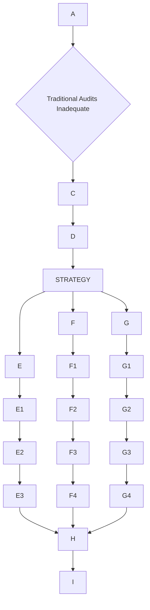

 # Security Posture for Rust-based Web3 Infrastructure: Decision-Critical Q&As for Advanced Engineers

As an advanced Rust developer contributing to Ethereum, Solana, and other Web3 infrastructure, a deep understanding of current and emerging security challenges is paramount. This report addresses key decision-critical security scenarios, providing comprehensive insights into vulnerabilities, compliance, and advanced defense strategies essential for building robust and resilient blockchain systems.

---

## Context & Usage

- **Problem**: Security incidents and regulatory changes in 2024–2025 are increasing the risk profile of Rust-based Web3 infrastructure.
- **Scope**: Three decision-critical Q&As covering vulnerabilities, compliance/regulation, and defense-in-depth strategies for Rust-based Web3 systems.
- **Timeline**: Focus on vulnerabilities and frameworks disclosed or updated in 2024–2025; re-validate if using this content beyond 12 months.
- **Stakeholders**: Advanced Rust developers, security engineers, architects, DevOps/SRE, and compliance leaders working on Web3 infrastructure.
- **Assumptions**: Teams have CI/CD pipelines, can adopt security tooling, and operate in or interact with regulated markets (e.g., EU).

## Table of Contents

- [Q1: Recent high-severity vulnerabilities and how Rust developers should respond](#q1-what-are-the-recent-high-severity-vulnerabilities-affecting-rust-based-web3-modules-and-how-should-a-rust-developer-respond-to-mitigate-these-risks-effectively)
- [Q2: Compliance and regulatory changes impacting Rust-based blockchain development](#q2-how-do-recent-web3-compliance-and-regulatory-changes-mica-nist-csf-20-iso-27001-impact-rust-based-blockchain-development-and-what-strategic-adjustments-are-required-to-ensure-compliance-and-enhance-security-posture)
- [Q3: Advanced defense-in-depth strategies beyond traditional audits](#q3-given-the-limitations-of-traditional-audits-in-web3-what-advanced-defense-in-depth-strategies-such-as-formal-methods-and-zero-trust-architecture-should-be-prioritized-for-rust-based-smart-contract-and-dexcex-core-module-development)

---

## Q1: What are the recent high-severity vulnerabilities affecting Rust-based Web3 modules, and how should a Rust Developer respond to mitigate these risks effectively?

**Dimension**: Threat Detection, Incident Response | **Roles**: Security Engineer, DevOps/SRE, Architect | **Decision Criticality**: Blocks incident response, creates material risk, affects multiple roles, requires immediate action, quantified impact.

**Scenario**: The Rust ecosystem, despite its memory safety guarantees, is not immune to critical vulnerabilities and supply chain attacks, particularly as its adoption grows within Web3 infrastructure. Recent incidents from late 2025 highlight significant threats, demanding proactive and informed responses from Rust developers working on core blockchain modules.

**Risk Chain**:
- **Threat Vector**:
    - **CVE-2025-62518 (TARmageddon)**: A high-severity (CVSS 8.1) boundary-parsing bug in the `async-tar` Rust library and its popular forks like `tokio-tar`. This flaw allows remote code execution (RCE) by exploiting inconsistencies between PAX extended headers and ustar headers in nested TAR files. Attackers can smuggle malicious files, overwrite configuration files, or hijack build backends, potentially compromising CI/CD pipelines and developer environments.
    - **CVE-2025-62370**: A vulnerability in Alloy Core libraries, fundamental to the Rust Ethereum ecosystem, where malformed input to `alloy_dyn_abi::TypedData` can trigger an uncaught panic, leading to a Denial-of-Service (DoS) via `eip712_signing_hash()`. This specifically impacts software with high availability requirements like network services.
    - **Malicious Rust Crates**: Typosquatting attacks where crates like `faster_log` and `async_println` impersonate legitimate libraries (e.g., `fast_log`) to steal Solana and Ethereum private keys from source code. These crates incorporate working logging code for cover while embedding routines to scan for and exfiltrate private keys to a command-and-control (C2) endpoint disguised as a blockchain RPC service.
- **Exploit Mechanism**: TARmageddon leverages a desynchronization flaw where the parser incorrectly advances stream positions based on the ustar size (often 0) instead of the actual file size specified in the PAX header. This allows attackers to hide malicious inner archives within legitimate outer containers, bypassing security scans. The Alloy Core DoS stems from a missing check for empty elements before access, leading to a panic. Malicious crates achieve private key theft by scanning local file systems for patterns indicative of keys and exfiltrating them via HTTP POST requests.
- **Affected Systems**: The `tokio-tar` library alone has over 5 million downloads, indicating a broad potential blast radius across Web3 projects, Python package managers (e.g., `uv`), container tools, and CI/CD environments. Alloy Core libraries are at the root of the Rust Ethereum ecosystem, making many dependent projects vulnerable to DoS. The malicious crates infected developer environments, amassing over 8,400 downloads before removal.
- **Business Impact**: RCE can lead to full system compromise, data exfiltration, or tampering with blockchain smart contracts and underlying infrastructure. DoS attacks can disrupt critical network services, affecting availability and user trust. Private key theft can result in direct asset loss on Ethereum and Solana, leading to significant financial and reputational damage. The unmaintained nature of vulnerable open-source projects exacerbates systemic risk, making remediation challenging.

**Decision**: Rust developers must prioritize immediate identification and remediation of these vulnerabilities, ensuring the integrity of their development environments and deployed Web3 modules. This requires a shift from reactive patching to proactive dependency management and security-first development practices.

**Practical Actions & Configuration**:
- **Immediate (0-2 weeks)**:
    - **Dependency Audit**: Use `cargo audit` to scan `Cargo.toml` and `Cargo.lock` for known vulnerabilities against the RustSec advisory database.
    - **Patch/Migrate for TARmageddon**: Immediately upgrade affected projects using `async-tar` or `tokio-tar` to patched versions, specifically `astral-tokio-tar` 0.5.6 or later. If migration is not feasible, implement runtime mitigations such as post-extraction directory scanning and file count validation.
    - **Patch for Alloy Core DoS**: Update Alloy Core libraries to versions v1.4.1 or v0.8.26 to include the fix that validates inputs before accessing elements.
    - **Supply Chain Scan**: Implement automated checks in CI/CD for typosquatting and known malicious packages.
    - **Isolate & Sandbox**: Process all incoming TAR files and external dependencies in isolated environments with limited privileges to contain potential exploits.
    - **Developer Awareness**: Educate development teams on the risks of typosquatting and the importance of verifying package authenticity.

- **Short-Term (2 weeks-2 months)**:
    - **Proactive Security Tools**: Integrate automated security tools that perform comprehensive static analysis and generate tests probing for vulnerabilities, trained on historical exploits.
    - **Maintain Approved Crate List**: Establish an internal list of approved and actively maintained Rust crates, potentially mirroring `crates.io` for enhanced control.
    - **Enforce Strict Input Validation**: Ensure all external inputs (user data, file contents, network requests) are strictly validated and sanitized before use in sensitive operations.
    - **Continuous Monitoring**: Implement logging and monitoring in production to detect anomalies or unusual activity indicative of exploitation attempts.

**YAML Configuration for CI/CD Dependency Checks**:
```yaml
# .github/workflows/security-scan.yml
name: Dependency Security Scan

on:
  push:
    branches:
      - main
  pull_request:
    branches:
      - main
  schedule:
    - cron: '0 0 * * *' # Daily scan

jobs:
  audit:
    runs-on: ubuntu-latest
    steps:
    - uses: actions/checkout@v4
    - name: Install Rust
      uses: dtolnay/rust-toolchain@stable
      with:
        toolchain: stable
    - name: Install cargo-audit
      run: cargo install cargo-audit
    - name: Run cargo audit
      run: cargo audit --deny warnings || true # Allow to fail, but report warnings
      continue-on-error: true # For monitoring, actual blocking should be done with `deny warnings`
    - name: Check for vulnerable async-tar/tokio-tar versions
      run: |
        if grep -q "async-tar = \"<0.5.6\"" Cargo.lock || grep -q "tokio-tar = \"*\"" Cargo.lock; then
          echo "::error::Vulnerable async-tar or tokio-tar detected! Upgrade to astral-tokio-tar >= 0.5.6."
          exit 1
        fi
```

**Metrics**:
| Metric | Target | Owner |
|---|---|---|
| Vulnerable Dependencies | 0 critical/high-severity vulnerabilities in production dependencies | Security Engineer, DevOps/SRE |
| Patch Compliance | 100% of critical systems patched within 7 days post-disclosure | DevOps/SRE |
| Detection Rate (Malicious Crates) | ≥95% detection of typosquatted packages in development/CI | Security Engineer |
| MTTR (Vulnerability Remediation) | <30 minutes for emergency patching of exploited vulnerabilities | DevOps/SRE |

**Insight**: The `TARmageddon` vulnerability underscores that Rust's memory safety does not eliminate logic bugs, and vigilance against all classes of vulnerabilities, including those stemming from unmaintained open-source libraries, is crucial. The prevalence of supply chain attacks targeting private keys necessitates rigorous dependency vetting and continuous monitoring for suspicious activity.

```mermaid
flowchart TD
    SUBGRAPH "Threat Vectors"
        TAR --> RCE
        ALLOY --> DOS
        MALCRATE --> KEYTHEFT
    END

    SUBGRAPH "Impact"
        RCE --> COMPROMISE
        DOS --> UNAVAIL
        KEYTHEFT --> ASSETLOSS
    END

    SUBGRAPH "Controls & Actions"
        PATCH --> MITIGATE
        AUDIT --> IDENTIFY_VULN
        VALIDATE --> PREVENT_EXPLOIT
        SANDBOX --> CONTAIN
        DEVELOPER_ED --> REDUCE_RISK
    END

    COMPROMISE --> BUSINESS_IMPACT
    UNAVAIL --> BUSINESS_IMPACT
    ASSETLOSS --> BUSINESS_IMPACT

    TAR --> PATCH
    ALLOY --> PATCH
    MALCRATE --> AUDIT
    MALCRATE --> DEVELOPER_ED
    PATCH --> VALIDATE
    VALIDATE --> SANDBOX
    AUDIT --> PATCH
```

---

## Q2: How do recent Web3 compliance and regulatory changes (MiCA, NIST CSF 2.0, ISO 27001) impact Rust-based blockchain development, and what strategic adjustments are required to ensure compliance and enhance security posture?

**Dimension**: Compliance & Governance, Risk & Control | **Roles**: Compliance Officer, Security Leader, Architect | **Decision Criticality**: Blocks strategic decisions, creates material regulatory risk, affects multiple roles, requires long-term action, quantified impact.

**Scenario**: The Web3 regulatory landscape is rapidly formalizing in 2025, with major frameworks like the EU's Markets in Crypto-Assets (MiCA), updates to NIST Cybersecurity Framework (CSF) 2.0, and continued relevance of ISO 27001. These changes profoundly influence the design, development, and deployment of Rust-based blockchain infrastructure, demanding a compliance-by-design approach.

**Risk Chain**:
- **Regulatory Change**:
    - **MiCA Regulation**: Fully effective in phases, with stablecoin rules applied since June 30, 2024, and licensing for Crypto-Asset Service Providers (CASPs) required starting January 2025. MiCA mandates authorization, robust governance, capital requirements, AML/KYC policies, and comprehensive transparency for token issuers and CASPs operating within the EU. It effectively bans algorithmic stablecoins and imposes strict 1:1 liquid reserve requirements for fiat-backed stablecoins.
    - **NIST CSF 2.0**: Published on July 18, 2025, this update introduces a 'Govern' function, emphasizing organizational cybersecurity governance, supply chain risk management, and continuous improvement. It provides a flexible framework for assessing and improving an organization's ability to prevent, detect, and respond to cyberattacks.
    - **ISO 27001 (and SOC 2)**: Remains a critical international standard for information security management systems, with a growing trend towards on-chain verifiability of certifications. Its controls (e.g., Annex A 8.8 for patch management) are directly relevant to securing Web3 infrastructure.
- **Non-Compliance Risk**: Failure to adhere to these evolving regulations can result in severe penalties, including fines, operational restrictions, and loss of operating licenses. Non-compliance also leads to reputational damage, reduced investor confidence, and hindered institutional adoption of Web3 solutions.
- **Control Integration**:
    - **Compliance-by-Design**: Embedding regulatory requirements directly into smart contract logic and Rust module architecture from the outset.
    - **Enhanced Governance**: Implementing robust governance structures, multi-signature controls, and transparent upgrade mechanisms for smart contracts and protocols.
    - **Supply Chain Security**: Adopting rigorous practices for third-party dependency vetting and software supply chain management, aligning with NIST CSF 2.0's emphasis on supply chain risk.
    - **Continuous Auditing & Monitoring**: Implementing real-time monitoring of on-chain activities, automated audit trails, and regular independent security audits to prove adherence to standards.
- **Action**: Rust developers and architects must actively incorporate these controls into their development lifecycle.
- **Metric**: Compliance percentages, successful audit outcomes, absence of regulatory enforcement actions.

**Decision Impact**: Organizations that proactively integrate compliance strategies with technical implementations will gain a competitive advantage and foster greater trust in their Web3 offerings. Conversely, reactive approaches will lead to costly retrofits, operational disruptions, and legal liabilities.

**Strategic Adjustments & Practical Implementation**:
- **Embed Compliance in Rust Code**: For token issuers, integrate MiCA-compliant disclosure mechanisms and logic for token classifications (e.g., utility token, ART, EMT) directly into Rust-based smart contracts. Implement dynamic controls for secondary markets and user access based on jurisdictional rules.
- **Zero-Trust for Internal Systems**: Apply Zero-Trust principles to internal Rust-based infrastructure development and deployment environments to prevent unauthorized access and lateral movement, which aligns with NIST CSF 2.0's focus on proactive security. Ensure continuous authentication and authorization for every component interaction.
- **Automated Security & Auditability**:
    - Develop Rust modules with built-in logging and telemetry to create comprehensive audit trails for regulatory inspections.
    - Integrate automated static analysis, fuzzing, and formal verification tools (e.g., `coq-of-rust`) into CI/CD pipelines to ensure code correctness and security from early stages.
    - Adopt on-chain verifiable certifications (ISO 27001, SOC 2) through platforms like VaaSBlock to demonstrate security posture transparently.
- **Supply Chain Risk Management (NIST CSF 2.0 GOVERN/GV.SC)**: Enforce strict dependency management, including regular `cargo audit` scans, version pinning, and provenance verification for all third-party Rust crates used in critical infrastructure.
- **Legal and Technical Collaboration**: Foster strong collaboration between legal/compliance teams and Rust development/architecture teams to translate regulatory requirements into technical specifications and ensure continuous alignment.

**Metrics**:
| Metric | Target | Owner |
|---|---|---|
| MiCA Compliance Score | 100% adherence to applicable MiCA articles (e.g., whitepaper, reserves) | Compliance Officer |
| ISO 27001 Certification | Maintained and verifiable on-chain | Security Leader, Compliance Officer |
| NIST CSF 2.0 Govern Function Maturity | Achieve 'Optimizing' level by end of 2025 | Architect, Security Leader |
| Automated Audit Trail Coverage | 100% of critical on-chain operations recorded and auditable | Security Engineer, Architect |
| Audit Findings (Regulatory) | 0 critical non-compliance issues | Compliance Officer |

**Limitations & Trade-offs**:
- Implementing compliance-by-design and continuous monitoring increases upfront engineering and legal costs and may slow initial delivery.
- Over-focusing on one framework (for example, only MiCA) can leave gaps in other jurisdictions; balance global applicability with local depth.
- Excessive governance friction can reduce developer velocity; align controls with quantified risk thresholds rather than blanket rules.

**Insight**: Compliance is no longer an afterthought but a foundational pillar of Web3 development. By strategically integrating regulatory requirements into Rust-based system design, organizations can transform compliance challenges into a competitive advantage, attracting institutional investment and ensuring long-term sustainability.

```mermaid
graph TD
    A --> B{MiCA Compliance (EU)}
    A --> C{NIST CSF 2.0 (Global)}
    A --> D{ISO 27001 Adoption (Global)}

    B --> B1
    B --> B2
    B --> B3

    C --> C1
    C --> C2

    D --> D1
    D --> D2

    B1 & B2 & B3 & C1 & C2 & D1 & D2 --> E{Rust-based Web3 Development}

    E --> F
    E --> G
    E --> H
    E --> I

    F & G & H & I --> J
    J --> K

    style A fill:#f9f,stroke:#333,stroke-width:2px
    style J fill:#bbf,stroke:#333,stroke-width:2px
```

---

## Q3: Given the limitations of traditional audits in Web3, what advanced defense-in-depth strategies, such as formal methods and Zero-Trust Architecture, should be prioritized for Rust-based smart contract and DEX/CEX core module development?

**Dimension**: Risk & Control, Threat Detection | **Roles**: Architect, Security Engineer, Security Leader | **Decision Criticality**: Blocks architectural decisions, addresses systemic risk, affects multiple roles, requires long-term strategy, quantified impact.

**Scenario**: Traditional security audits alone are proving insufficient: according to [6], over 70% of major Web3 exploits in 2024 occurred in audited smart contracts. The increasing complexity of modern Web3 protocols, including composability, multi-chain deployments, and upgradeability, often exceeds the scope and effectiveness of snapshot audits. This necessitates a pivot towards advanced, continuous, and integrated defense-in-depth strategies for Rust-based smart contracts and core modules.

**Risk Chain**:
- **Sophisticated Threats**:
    - **Complexity Explosion**: Modern DeFi protocols integrate numerous external systems (oracles, cross-chain bridges), creating combinatorial complexity that traditional audits struggle to evaluate. Upgradeable contracts and multi-chain deployments introduce additional layers of indirection and chain-specific quirks that can harbor subtle vulnerabilities.
    - **Evolving Attack Vectors**: New threats include sophisticated cross-chain bridge exploits, MEV (Maximum Extractable Value) manipulation, AI-assisted vulnerability discovery, and governance attacks. Attackers are leveraging AI to explore contract state spaces and craft adaptive exploits.
    - **Human Element & Logic Flaws**: Despite Rust's memory safety, logic bugs and human errors remain significant attack vectors, as demonstrated by incidents like TARmageddon, which was a parsing inconsistency rather than a memory issue.
- **Inadequate Traditional Defenses**: Audits are time-boxed, suffer from context asymmetry, and only review code at a specific moment, failing to address post-audit changes or emergent risks from composability. Best practices often lag reality, and extensive testing can create a "testing illusion" if it doesn't systematically explore attack surfaces.
- **Advanced Strategies**:
    - **Formal Methods**: Mathematically proving the correctness of critical code against a formal specification.
    - **Zero-Trust Architecture (ZTA)**: Enforcing "never trust, always verify" principles across all internal and external interactions.
    - **Proactive Security Movement**: Integrating security throughout the development lifecycle ("shifting left"), rather than as a post-development gate.
- **Implementation**: These strategies require significant architectural shifts, tooling, and cultural changes.
- **Metric**: Drastic reduction in vulnerabilities, improved audit efficiency, enhanced control effectiveness.

**Decision Impact**: Adopting these advanced strategies is critical for achieving a robust security posture, reducing exploit risk, and building long-term trust in Web3 projects. This enables projects to navigate the increasingly complex threat landscape and sustain growth.

**Practical Implementation Steps**:
1.  **Formal Methods for Critical Rust Modules**:
    -   **Approach**: Utilize tools like `coq-of-rust` to translate critical Rust programs (e.g., smart contract logic, DEX core modules, wallet functionality) into the Coq proof assistant. This allows for mathematical proofs that the Rust code implements its specification for *all* inputs, covering scenarios such as absence of panics, proper data invariant preservation, and full backward compatibility during upgrades.
    -   **Workflow**: The process typically involves generating an automatic translation to Coq, followed by semi-automated refinement steps (linking and simulations), and finally, writing specifications and proving their fulfillment.
    -   **Target**: Critical paths in smart contracts (e.g., access control, fund transfers, governance) where a mathematical proof of correctness provides guarantees testing alone cannot.
    -   **Trade-offs**: High upfront cost in expertise, specialized tooling, and increased development time; however, it virtually reduces bugs and vulnerabilities to zero in verified components, offering the highest confidence level.
2.  **Zero-Trust Architecture (ZTA) for Web3 Infrastructure**:
    -   **Approach**: Implement ZTA principles across the entire Web3 infrastructure, treating every user, device, application, and component as untrusted by default, regardless of its location. This minimizes the blast radius of any compromise and prevents lateral movement.
    -   **Implementation in Rust**:
        -   **Micro-segmentation**: Design Rust-based microservices for core Web3 functions (e.g., oracle data processing, transaction relayers) with isolated network segments.
        -   **Least Privilege**: Enforce strict role-based access control (RBAC) and least privilege principles within Rust applications, ensuring that modules (e.g., a DEX matching engine) can only access the minimum necessary resources and functions.
        -   **Continuous Verification**: Embed continuous authentication and authorization checks within Rust modules using cryptographic proofs and secure key management. For instance, a Rust module handling inter-chain communication should cryptographically verify the identity and permissions of every incoming request.
        -   **Runtime Monitoring**: Utilize runtime monitoring for anomaly detection and policy enforcement within the Rust environment. This can include monitoring memory access patterns and function calls to detect deviations from expected behavior.
    -   **Context**: The convergence of blockchain and ZTA offers a transformative pathway for enhancing security and resilience in financial infrastructures.
    -   **Trade-offs**: Increased complexity in architectural design and initial setup; potential for operational overhead due to continuous verification. However, it significantly reduces the impact of insider threats and external breaches, making it ideal for high-stakes blockchain environments.
3.  **Proactive Security Movement & Automated Tooling**:
    -   **Shift Left**: Integrate security into every stage of the Rust development lifecycle, using real-time static analysis in IDEs and automated comprehensive testing that probes for vulnerabilities, not just code coverage.
    -   **Tool Accuracy**: Leverage new generations of security tools that use custom intermediate representations and AI trained on historical exploits for higher accuracy (e.g., 75% true positive rates compared to 15% for legacy tools).
    -   **Continuous Security**: Security is an ongoing process that extends beyond deployment, requiring continuous monitoring, regular security reviews for upgrades, and staying current on emerging threats.
 
**Strategy Trade-off Comparison**:

| Strategy | Primary Benefits | Costs / Risks | Best Use Cases |
|---|---|---|---|
| Formal Methods | Strongest guarantees for critical logic; prevents entire vulnerability classes by construction. | High expertise and time cost; not practical for all components. | Narrow, high-risk code paths where failure is catastrophic (bridges, custody, governance). |
| Zero-Trust Architecture | Limits blast radius and lateral movement; improves resilience to insider and external threats. | Increased architectural complexity and operational overhead. | Infrastructure and services with sensitive keys, funds, or privileged access. |
| Proactive Security & Automation | Continuous coverage across codebase; scales with team size; improves audit efficiency. | Potential tool noise and false positives; requires tuning and process integration. | Broad application across the Rust codebase to reduce day-to-day defect and vulnerability volume. |

**Metrics**:
| Metric | Target | Owner |
|---|---|---|
| Critical Formal Verification Coverage | 100% of high-risk functions formally verified | Architect, Security Engineer |
| Vulnerability Reduction Rate | 84% fewer vulnerabilities detected post-implementation of proactive tools | Security Engineer |
| Control Effectiveness (ZTA) | ≥80% for critical access controls and micro-segmentation | Architect |
| Audit Findings Reduction | 20% fewer audit findings after proactive security integration | Security Leader |
| Security-Focused Training Coverage | 100% of Rust developers complete security training upon onboarding | Security Leader |

**Insight**: The future of Web3 security, particularly for Rust-based core modules, lies in moving beyond reactive, periodic audits towards a holistic, proactive, and continuously verified security posture. By embracing formal methods, Zero-Trust principles, and advanced automation, organizations can significantly reduce exploit risk, enhance resilience, and build a more trustworthy digital economy.



## Verification & Success Criteria

- **Verification (Freshness & Accuracy)**:
  - Re-check CVE IDs, library versions, and download counts in Q1 against RustSec and NVD before relying on them in incident response runbooks.
  - Confirm MiCA dates, NIST CSF 2.0 publication status, and ISO 27001 control mappings in Q2 against primary regulatory/standards sources.
  - Validate tool capabilities and benchmark numbers in Q3 (for example, 75% vs 15% true positive rates) against current vendor documentation or independent evaluations.
- **Operational Success Criteria**:
  - **Q1 (Vulnerabilities & Supply Chain)**: All metrics in the Q1 table are at or above target for at least one full release cycle (for example, 1–3 months).
  - **Q2 (Compliance & Governance)**: No critical regulatory findings in the last two audits, and all Q2 compliance metrics are at target.
  - **Q3 (Defense-in-Depth)**: Formal verification, ZTA, and proactive security coverage reach the targets in the Q3 metrics table for all identified high-risk systems.

Sources: 
[1] RUSTSEC-2025-0073 Impact, Exploitability, and Mitigation Steps | Wiz, https://www.wiz.io/vulnerability-database/cve/rustsec-2025-0073
[2] Top 5 Trends Shaping the Future of Web3 Infrastructure (2025 Edition), https://medium.com/@zchao/navigating-the-next-wave-key-trends-in-web3-infrastructure-5ff18a7a6145
[3] formal-land/coq-of-rust: Formal verification tool for Rust - GitHub, https://github.com/formal-land/coq-of-rust
[4] Serious vulnerability found in Rust library - CSO Online, https://www.csoonline.com/article/4077445/serious-vulnerability-found-in-rust-library.html
[5] Rust Foundation's 2025 Technology Report Showcases Year of ..., https://rustfoundation.org/media/rust-foundations-2025-technology-report-showcases-year-of-rust-security-advancements-ecosystem-resilience-strategic-partnerships/
[6] The State of Web3 Security in 2025: Why Most Exploits Come From ..., https://olympix.security/blog/the-state-of-web3-security-in-2025-why-most-exploits-come-from-audited-contracts
[7] Rust CVEs and Security Vulnerabilities - OpenCVE, https://app.opencve.io/cve/?product=rust&vendor=rust-lang
[8] Solana's Cybersecurity Risks: A Growing Threat to Crypto ... - AInvest, https://www.ainvest.com/news/solana-cybersecurity-risks-growing-threat-crypto-influencers-wallet-security-2509/
[9] Rust Security Best Practices 2025 - Corgea - Home, https://corgea.com/Learn/rust-security-best-practices-2025
[10] Malicious Rust Crates Steal Solana and Ethereum Keys - LinkedIn, https://www.linkedin.com/posts/exploitsecurityio_malicious-rust-crates-steal-solana-and-ethereum-activity-7376902733359960064-arSz
[11] Another Vulnerability Hits Rust's Ecosystem - Rust Bytes, https://weeklyrust.substack.com/p/another-vulnerability-hits-rusts
[12] FailSafe Web3 Security Report 2025, https://getfailsafe.com/failsafe-web3-security-report-2025/
[13] CVE-2025-62370 Detail - NVD, https://nvd.nist.gov/vuln/detail/CVE-2025-62370
[14] Researchers Expose GhostCall and GhostHire: BlueNoroff's New ..., https://thehackernews.com/2025/10/researchers-expose-ghostcall-and.html
[15] Global Regulatory Landscape: Navigating Web3 Compliance in 2025, https://belong.net/blog/navigating-web3-compliance-in-2025
[16] Researchers uncover remote code execution flaw in abandoned ..., https://cyberscoop.com/async-tar-rust-open-source-vulnerability/
[17] Denial of Fuzzing: Rust in the Windows kernel - Check Point Research, https://research.checkpoint.com/2025/denial-of-fuzzing-rust-in-the-windows-kernel/
[18] Malicious Rust Crates Steal Solana and Ethereum Private Keys, https://securityonline.info/supply-chain-attack-malicious-rust-crates-steal-solana-and-ethereum-private-keys/
[19] An approach for modularly verifying the core of Rust's atomic ... - arXiv, https://arxiv.org/html/2505.00449v2
[20] The EU Markets in Crypto-Assets (MiCA) Regulation Explained, https://legalnodes.com/article/mica-regulation-explained
[21] TARmageddon Bug in Rust Library Lets Attackers Overwrite Configs ..., https://cyberpress.org/tarmageddon-bug-in-rust-library/
[22] async-tar vulnerability: High-severity RCE flaw found - LinkedIn, https://www.linkedin.com/posts/gati-krishna-meher_tarmageddon-cve202562518-rust-activity-7389089350896046081-yAEz
[23] New Rust Packages Masquerading as fast_log Compromise Solana ..., https://cyberpress.org/malicious-rust-packages/
[24] CVE-2025-62518 (CVSS 9.8) in Rust Async-Tar Enables RCE, https://www.purple-ops.io/resources-hottest-cves/rust-async-tar-rce-2/
[25] [PDF] RefinedRust: A Type System for High-Assurance Verification of Rust ..., https://iris-project.org/pdfs/2024-pldi-refinedrust.pdf
[26] [PDF] Practical Zero-Trust Threshold Signatures in Large-Scale Dynamic ..., https://eprint.iacr.org/2025/297.pdf
[27] (PDF) Integrating Zero Trust Principles into Blockchain-Oriented ..., https://www.researchgate.net/publication/396991398_Integrating_Zero_Trust_Principles_into_Blockchain-Oriented_Financial_Infrastructures
[28] ISO-27001, SOC‑2 and RMA certifications are now verifiable on ..., https://www.cbs42.com/business/press-releases/ein-presswire/865490185/iso-27001-soc%E2%80%912-and-rma-certifications-are-now-verifiable-on-chain-with-vaasblock
[29] TARmageddon (CVE-2025-62518): RCE Vulnerability Highlights the ..., https://edera.dev/stories/tarmageddon
[30] Top 10 Recommendations for Web3 CISOs in 2025 - Halborn, https://www.halborn.com/blog/post/top-10-recommendations-for-web3-cisos-in-2025
[31] Software Supply Chain Security of Web3 - arXiv, https://arxiv.org/html/2511.12274v1
[32] BingX Achieves ISO 27001 Certification, Setting the Standard for ..., https://www.prnewswire.com/ru/press-releases/bingx-achieves-iso-27001-certification-setting-the-standard-for-web3-information-security-302587486.html
[33] MiCA Regulation: What Crypto Projects Must Know For 2025 ..., https://hacken.io/discover/mica-regulation/
[34] Cybersecurity Framework | NIST, https://www.nist.gov/cyberframework
[35] NIST CSF 2.0: A CISO's Guide - Security Boulevard, https://securityboulevard.com/2024/10/nist-csf-2-0-a-cisos-guide/
