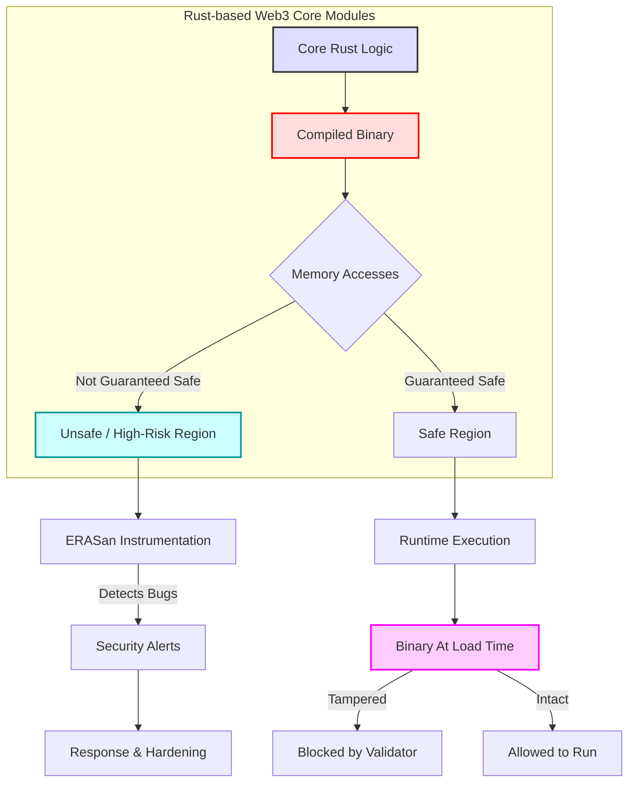
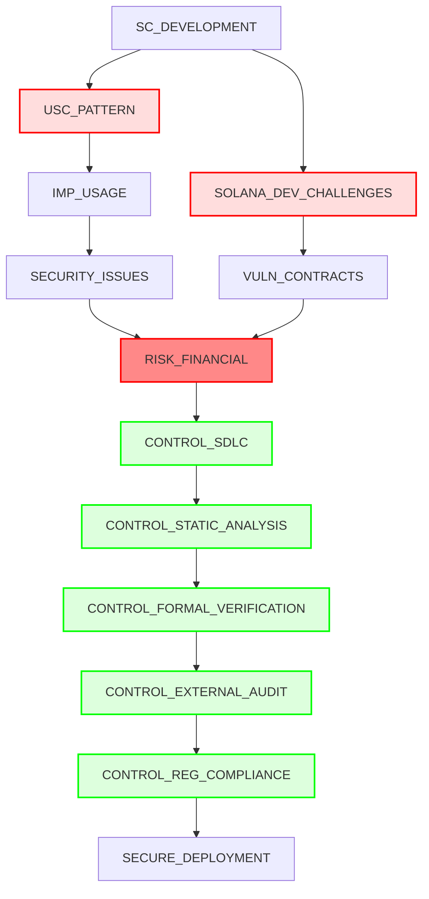
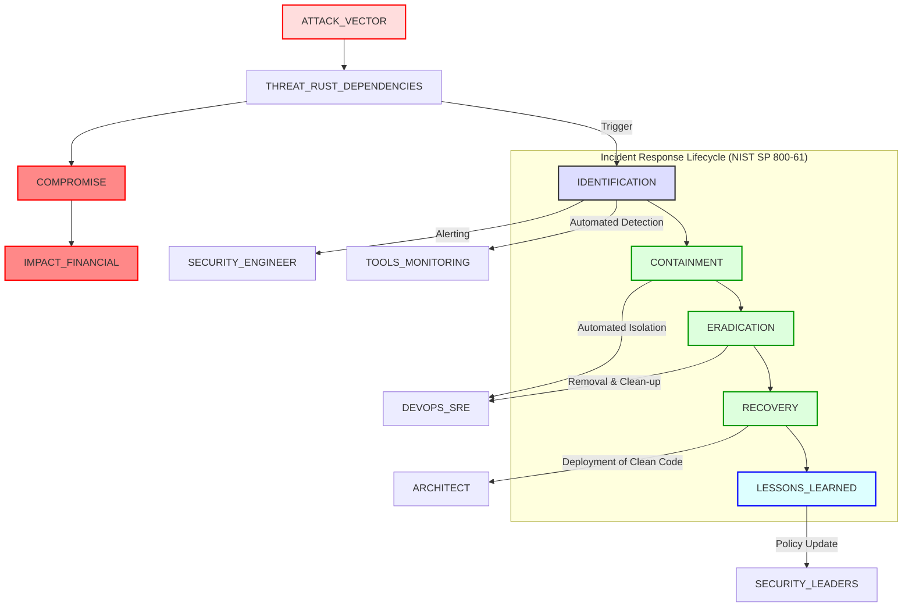

 # Q&A Generation for Rust-Based Web3 Infrastructure Security

This report provides decision-critical security Q&As focused on Rust-based Web3 infrastructure, addressing the challenges faced by advanced Rust developers and security stakeholders. The Q&As are designed to mitigate hallucinations, enhance decision quality, and offer actionable insights for high-stakes scenarios such as 0-days, breaches, and compliance changes. Each Q&A includes a clear scenario, identifies risks and controls, proposes actions with timelines and owners, and defines measurable metrics, adhering to the principles of decision-criticality, freshness, and practicality.

**Context & Scope**:
- **Problem**: Rust-based Web3 infrastructure teams need decision-critical, non-hallucinated security guidance for high-stakes incidents and architecture choices.
- **Scope**: Three Q&As covering memory safety in core Rust modules, smart contract upgradeability and audit requirements, and Rust supply chain incident response.
- **Assumptions**: Teams have CI/CD pipelines, baseline observability, and the ability to deploy new monitoring and control mechanisms.
- **Scale**: Protocols, rollups, or infrastructure services where security incidents can cause material financial loss or systemic disruption.
- **Timeline**: Focused on research and practices available up to 2024–2025; revisit at least annually or after major security or regulatory events.
- **Stakeholders**: Advanced Rust developers, security engineers, DevOps/SRE, architects, security leaders, and compliance officers.
- **Resources**: This Q&A plus the curated source list at the end; intended to complement, not replace, internal policies and audits.

---

### Q1: How can Rust's memory safety guarantees be challenged in Web3 core modules, and what advanced runtime monitoring strategies are required to detect these subtle vulnerabilities?

**Dimension**: Threat Detection, Risk & Control
**Roles**: Security Engineer, DevOps/SRE, Architects
**Decision Criticality**: Blocks effective threat detection, creates material risk of memory exploits, affects security engineers and architects, requires immediate action on monitoring, quantifiable impact on system stability and data integrity.
**Difficulty**: Advanced
**Priority**: Critical

**Scenario**: While Rust is lauded for its memory safety, particularly compared to C/C++, the use of `unsafe Rust` in Web3 core modules, essential for performance or low-level interaction, introduces temporal and spatial memory bugs. These can account for a significant portion of reported bugs (22% between 2016 and 2023). Furthermore, even "safe Rust" can contain vulnerabilities that existing program analysis tools fail to detect, often leveraged in real-world supply chain attacks. Attackers can also fabricate Rust binaries to remove compiler-enforced safety defenses at runtime.

**Risk**: Exploitable memory bugs in `unsafe Rust` code can lead to remote code execution, data corruption, or denial-of-service attacks, compromising the integrity and availability of core Web3 infrastructure. The ability to manipulate Rust binaries post-compilation means that even seemingly "safe" deployments might be vulnerable to sophisticated attacks, bypassing compile-time guarantees. Such vulnerabilities create significant operational and financial risks for blockchain platforms like Ethereum and Solana, affecting their stability and user trust.

**Control**: Implement a multi-layered defense incorporating specialized runtime sanitizers for Rust, binary validation at load time, and continuous behavioral anomaly detection. This approach extends beyond compile-time checks to actively monitor for memory safety violations that Rust's compiler might miss or that are introduced maliciously post-compilation.

**Action**:
- **Immediate (0-2 weeks)**:
    - **Security Engineer**: Deploy ERASan, an efficient address sanitizer customized for Rust, which instruments memory accesses only in areas where Rust cannot guarantee safety, significantly reducing performance overhead while maintaining bug-finding ability.
    - **DevOps/SRE**: Integrate a binary validator into the CI/CD pipeline to assess if spatial and temporal safety checks remain intact within Rust binaries before execution, thereby preventing the deployment of tampered modules.
- **Short-term (2 weeks - 2 months)**:
    - **Architects**: Re-evaluate critical Web3 core modules for `unsafe Rust` usage, prioritizing refactoring or enhanced runtime monitoring for these sections.
    - **Security Engineer**: Develop and refine detection rules for subtle memory-related anomalies, including atomic memory ordering issues, that could indicate an ongoing exploit.

**Practical** (ERASan Integration & Binary Validation):
```yaml
runtime_security_config:
  er_asan_integration:
    enabled: true
    scope: "unsafe_rust_only" # Instruments only where Rust's strict rules are not fully applied
    overhead_reduction_target: 90.03% # ERASan's average check reduction
    performance_gain_target: 239.05% # ERASan's average performance gain
  binary_integrity_validator:
    enabled: true
    validation_point: "load_time" # Validate before execution
    checks:
      - spatial_safety_integrity
      - temporal_safety_integrity
    action_on_failure: "block_execution_and_alert"
```

**Metrics**:
| Metric | Formula / Description | Target Value | Primary Owner | Notes |
|-------------------------------------|----------------------------------------------------|------------------------|-------------------|---------------------------------------------------------------------------------------------------------------------------------|
| **Memory Safety Violation Detection Rate** | (Number of detected memory safety violations / Total actual memory safety violations) × 100% | ≥80% | Security Engineer | Focus on both `unsafe Rust` and potential binary tampering. |
| **Runtime Performance Overhead** | (Performance with ERASan - Baseline Performance) / Baseline Performance | <10% of baseline | DevOps/SRE | Ensure security tooling doesn't degrade critical infrastructure performance significantly. |
| **Binary Integrity Check Failure Rate** | (Number of failed binary validations / Total deployed binaries) × 100% | ≤0.1% | DevOps/SRE | Indicates successful prevention of compromised binaries. |

**Alternatives & Trade-offs**:
- **Option A – Extensive instrumentation**: Instrument all Rust modules, including safe code, to maximize bug discovery. Higher detection coverage but significantly higher overhead; may be unsuitable for latency-critical paths.
- **Option B – Targeted instrumentation plus binary validation** (recommended): Focus sanitizers on `unsafe` blocks and high-risk components, complemented by binary validation and anomaly detection. Slightly lower coverage but better performance and operational fit for high-throughput Web3 infrastructure.


**Insight**: Rust's memory safety is a significant advantage, but it is not an absolute panacea, especially when `unsafe Rust` is used or when malicious actors manipulate binaries post-compilation. Proactive runtime monitoring with specialized tools like ERASan and load-time binary validation are crucial, moving beyond mere compile-time assurances to provide a robust defense-in-depth against sophisticated memory-related exploits in critical Web3 infrastructure.
**Key Sources**: [1], [2], [3], [4], [5].

---

### Q2: Given the prevalence of upgradable smart contracts (USCs) in Ethereum and the high potential for developers to release vulnerable Solana smart contracts, what strategic controls and audit requirements are paramount for new deployments in 2025?

**Dimension**: Risk & Control, Compliance & Governance
**Roles**: Architects, Security Leaders, Compliance Officers
**Decision Criticality**: Blocks secure deployment, creates significant financial risk, affects architects, security leaders, and compliance officers, requires immediate action on audit and compliance, quantifiable impact on asset security and regulatory adherence.
**Difficulty**: Advanced
**Priority**: Critical

**Scenario**: Upgradeable smart contracts (USCs) are widely adopted in Ethereum to allow modifications post-deployment, but their improper use can introduce severe security issues, including hijacking. A large-scale study on Ethereum found that 10,218 upgrade chains were constructed, disclosing multiple real-world USCs with potential security issues. Concurrently, studies show that Solana smart contract developers often struggle with security, with 83% likely to release vulnerable smart contracts, despite the overall low prevalence of vulnerabilities in deployed contracts due to frameworks like Anchor. New deployments for 2025 must navigate these complexities.

**Risk**: Improperly designed or audited USCs and newly deployed vulnerable smart contracts can lead to significant asset loss, protocol manipulation, and reputational damage. The immutable nature of smart contracts amplifies the financial risks associated with vulnerabilities. Non-compliance with emerging regulations, such as those impacting smart contract termination or control, can also lead to legal and financial penalties.

**Control**: Implement stringent secure development lifecycle (SDLC) practices, integrate specialized vulnerability detection tools for smart contracts, mandate comprehensive auditing, and adhere to emerging compliance requirements for smart contract governance. This includes incorporating "kill switch" functionalities or equivalent mechanisms in upgradable contracts where regulatory frameworks demand it.

**Action**:
- **Immediate (0-2 weeks)**:
    - **Architects**: Ensure all new smart contract designs, especially USCs, incorporate a formal security design review process focused on upgrade mechanisms and potential attack vectors identified by tools like USCDetector.
    - **Security Leader**: Mandate the use of static analysis tools for Rust smart contracts (e.g., `hax` or `SafeCheck`) and formal verification where applicable, to detect reentrancy, integer overflows, and logic bugs, with configuration emphasizing high-precision detection over false positives.
    - **Compliance Officer**: Begin integrating requirements for smart contract "kill switch" or pause functionality into contract design for compliance with potential EU Data Act provisions or similar regulations, ensuring the ability to manage or terminate contracts under specific, audited conditions.
- **Short-term (2 weeks - 2 months)**:
    - **DevOps/SRE**: Establish automated auditing pipelines that include bytecode analysis for deployed smart contracts, especially for identifying known USC patterns and potential vulnerabilities without needing source code.
    - **Security Engineer**: Conduct external security audits by reputable firms for all decision-critical smart contracts and USCs before deployment, focusing on complex logic and interaction patterns.

**Practical** (Smart Contract Audit & Compliance Checklist):
```yaml
smart_contract_deployment_checklist:
  - requirement: Formal Security Design Review
    status: Mandatory
    owner: Architect
    notes: Focus on USC upgradeability, access control, and interaction patterns.
  - requirement: Static Analysis Integration
    tools:
      - hax
      - SafeCheck
      - cargo-contract
    config_params:
      precision_threshold: 90% # Aim for high precision to reduce false positives
      vulnerability_types:
        - reentrancy
        - integer_overflow_underflow
        - access_control
        - unchecked_external_calls
    status: Mandatory pre-deployment
    owner: Security Engineer
  - requirement: External Security Audit
    status: Mandatory for critical contracts (CVSS ≥7.0)
    owner: Security Leader
    timeline: 1-2 months pre-deployment
  - requirement: Smart Contract Kill Switch/Pause Functionality
    status: Conditional (Regulatory requirement)
    owner: Architect, Compliance Officer
    notes: Design for controlled termination/pause; ensure auditability of activation.
```

**Metrics**:
| Metric | Formula / Description | Target Value | Primary Owner | Notes |
|-------------------------------------|----------------------------------------------------|------------------------|-------------------|---------------------------------------------------------------------------------------------------------------------------------|
| **Vulnerability Detection Rate (Pre-deployment)** | (Number of unique critical vulnerabilities detected / Total unique critical vulnerabilities) × 100% | ≥95% | Security Engineer | Prioritize high-severity vulnerabilities (CVSS ≥7.0). |
| **Audit Compliance Rate** | (Number of contracts undergoing mandatory audits / Total mandatory contracts) × 100% | 100% | Compliance Officer | Ensures adherence to internal and external audit requirements. |
| **Time-to-Market Impact (Compliance)** | Days added to deployment cycle due to compliance/audits | <2 months | Security Leader | Balances rigor with business agility. |
 
**Alternatives & Trade-offs**:
- **Option A – Minimal compliance-focused baseline**: Meet only mandatory regulatory and internal audit requirements. Lower short-term cost and faster time-to-market, but higher residual risk and weaker assurance for high-value contracts.
- **Option B – Comprehensive best-practice pipeline** (recommended): Combine formal design reviews, high-precision static analysis, external audits, and governance-enforced kill switches for all decision-critical contracts. Higher upfront cost but significantly reduces catastrophic loss probability.
- **Option C – Staged adoption by criticality**: Apply Option B to critical contracts (TVL, governance, bridges) and Option A to low-risk ones. Balances security investment with business agility but requires robust classification and periodic re-evaluation.


**Insight**: The complexity of upgradable smart contracts and inherent challenges in secure smart contract development, particularly on platforms like Solana, necessitate a robust, multi-faceted security strategy. Integrating advanced static analysis, mandatory external audits, and proactive compliance with evolving regulatory demands (e.g., smart contract kill switches) are not merely best practices but critical requirements for mitigating catastrophic risks in Web3 deployments.
**Key Sources**: [6], [7], [8], [9], [10], [11], [12], [13].

---

### Q3: How should Web3 infrastructure leveraging Rust dependencies implement an incident response playbook for supply chain attacks, ensuring rapid containment and mitigation of malicious crates and dependency confusion vulnerabilities?

**Dimension**: Incident Response, Threat Detection, Risk & Control
**Roles**: Security Engineer, DevOps/SRE, Security Leaders
**Decision Criticality**: Blocks effective incident response, creates material supply chain risk, affects security engineers, DevOps, and security leaders, requires immediate action on playbook development, quantifiable impact on MTTD/MTTR and asset loss.
**Difficulty**: Intermediate–Advanced
**Priority**: High

**Scenario**: Software supply chain attacks, like SolarWinds and Log4j, have demonstrated devastating impacts, affecting thousands of businesses. In the Rust ecosystem, where applications heavily rely on open-source `crates`, malicious crates or dependency confusion attacks pose significant risks. These vulnerabilities can compromise entire Web3 infrastructures, bypassing Rust's inherent memory safety guarantees. An effective incident response playbook, aligned with NIST SP 800-61, is crucial.

**Risk**: A successful supply chain attack via a malicious Rust crate could inject backdoors, steal private keys, or compromise consensus mechanisms in core Web3 infrastructure. This leads to potential financial losses, reputational damage, and operational disruption. The complexity of dependency trees makes detection and isolation challenging, highlighting the need for predefined, actionable response plans.

**Control**: Develop and implement a comprehensive incident response playbook based on NIST SP 800-61, specifically tailored for Rust-based Web3 infrastructure, focusing on detection rules, automated containment, and rapid remediation strategies for compromised `crates`. This includes leveraging tools for binary analysis and continuous monitoring of dependency behavior.

**Action**:
- **Immediate (0-2 weeks)**:
    - **Security Engineer**: Implement detection rules for anomalous crate behavior (e.g., unexpected size increases using `cargo-bloat`), unapproved registry URLs, and suspicious runtime activities. Integrate these rules with security information and event management (SIEM) systems to trigger alerts.
    - **DevOps/SRE**: Establish automated containment protocols within CI/CD pipelines to isolate affected build environments or block deployment of `crates` flagged as suspicious.
- **Short-term (2 weeks - 2 months)**:
    - **Security Leaders**: Develop and formalize a Rust-specific incident response playbook that details roles, responsibilities, and communication channels for identification, containment, eradication, and recovery of supply chain attacks, aligning with NIST SP 800-61.
    - **Architects**: Conduct a comprehensive inventory and risk assessment of all third-party Rust dependencies in core Web3 modules, prioritizing those with critical access or high privilege.

**Practical** (Incident Response Playbook Snippet & Detection Rules):
```yaml
incident_response_playbook_rust_supply_chain:
  incident_type: "Rust Crate Supply Chain Compromise"
  phases:
    - name: "Identification"
      actions:
        - "Monitor CI/CD logs for build failures related to dependency resolution."
        - "Review security alerts from dependency scanning tools for new vulnerabilities or malicious crate flags."
        - "Analyze network traffic for unusual outbound connections from build servers or deployed modules."
      owner: "Security Engineer"
      tools:
        - "cargo-audit"
        - "osv-scanner"
        - "SIEM (e.g., Splunk, Elastic Security)"
        - "Network monitoring (e.g., Zeek, Suricata)"
    - name: "Containment"
      actions:
        - "Isolate compromised build environments or affected production instances."
        - "Block access to malicious crate registries or specific versions of compromised crates."
        - "Suspend automated deployments to prevent further spread."
      owner: "DevOps/SRE"
      automation_trigger: "High-severity alert on malicious crate detection"
    - name: "Eradication"
      actions:
        - "Remove all instances of the compromised crate from repositories and caches."
        - "Clean and rebuild affected modules from trusted sources."
        - "Invalidate affected API keys or credentials if compromised."
      owner: "DevOps/SRE, Security Engineer"
    - name: "Recovery"
      actions:
        - "Deploy verified, patched versions of modules."
        - "Restore services and monitor for residual indicators of compromise."
        - "Update dependency policies and security baselines."
      owner: "DevOps/SRE, Architect"
```

**Metrics**:
| Metric | Formula / Description | Target Value | Primary Owner | Notes |
|-------------------------------------|----------------------------------------------------|------------------------|-------------------|---------------------------------------------------------------------------------------------------------------------------------|
| **Mean Time To Detect (MTTD)** | Average time from supply chain compromise to detection | ≤5 minutes | Security Engineer | Crucial for limiting exposure to malicious crates. |
| **Mean Time To Respond (MTTR)** | Average time from detection to full recovery | <30 minutes | DevOps/SRE | Encompasses containment, eradication, and initial recovery steps. |
| **Supply Chain Vulnerability Detection Rate** | (Number of detected malicious crates / Total actual malicious crates) × 100% | ≥95% | Security Engineer | Measures effectiveness of detection tools and processes. |
 
**Alternatives & Trade-offs**:
- **Option A – Manual, playbook-only response**: Rely on human-led detection and response steps documented in runbooks. Low tooling cost but slow MTTD/MTTR and highly dependent on individual expertise.
- **Option B – Automated detection with semi-automated response** (recommended): Integrate `cargo-audit`, OSV-based scanners, and CI/CD automation to trigger containment steps, while keeping humans in the loop for eradication and recovery decisions. Strong balance between speed, control, and false-positive handling.
- **Option C – Fully automated response with continuous simulation**: Add chaos/simulation exercises and fully automated rollback/isolation flows. Fastest MTTD/MTTR but higher engineering cost and risk of over-automation if playbooks are immature.


**Insight**: Software supply chain attacks are a critical, evolving threat, especially in the dependency-rich Rust ecosystem for Web3 infrastructure. A well-defined, Rust-specific incident response playbook, integrating automated detection via tools like `cargo-bloat` and strict adherence to NIST SP 800-61 phases, is indispensable for achieving rapid Mean Time To Detect (MTTD) and Mean Time To Respond (MTTR) targets. Proactive planning and continuous refinement of this playbook are essential for maintaining the integrity and security of core Web3 modules.
**Key Sources**: [14], [15], [16], [17], [18].

---

Sources:
[1] ERASan: Efficient Rust Address Sanitizer, https://ieeexplore.ieee.org/document/10646812/
[2] Understanding and detecting real-world safety issues in Rust, https://ieeexplore.ieee.org/abstract/document/10479047/
[3] Counterexamples in Safe Rust, https://www.semanticscholar.org/paper/5fe6d98243c4c895cde0f381cbc00f2b967cb76a
[4] Unsafe code detection in Rust and metamorphic testing of autonomous driving systems, https://onlinelibrary.wiley.com/doi/10.1002/stvr.1891
[5] Validating Memory Safety in Rust Binaries, https://dl.acm.org/doi/10.1145/3642974.3652281
[6] Characterizing Ethereum Upgradable Smart Contracts and Their Security Implications, https://arxiv.org/abs/2403.01290
[7] Defying the Odds: Solana's Unexpected Resilience in Spite of the Security Challenges Faced by Developers, https://www.semanticscholar.org/paper/5ea2307fbb8fcc83e75960c7572d70bf5da4edb4
[8] A Systematic Review and Performance Evaluation of Open-Source Tools for Smart Contract Vulnerability Detection., https://search.ebscohost.com/login.aspx?direct=true&profile=ehost&scope=site&authtype=crawler&jrnl=15462218&AN=178740899
[9] Smart Contract Security Vulnerability Through The NIST Cybersecurity Framework 2.0 Perspective, https://ieeexplore.ieee.org/abstract/document/10877189/
[10] OVERVIEW OF VULNERABILITIES IN SMART CONTRACTS WRITTEN IN SOLIDITY, https://ite.kspu.edu/index.php/ite/article/view/870/839
[11] Vulnerability anti-patterns in Solidity: Increasing smart contracts security by reducing false alarms, https://arxiv.org/abs/2410.17204
[12] Understanding Common Smart Contract Vulnerabilities and the Critical Need for Testing and Audits, https://www.semanticscholar.org/paper/279791ff4c81421188b418bfb8a8fb8d1ed36e87
[13] Exploring User Perceptions of Security Auditing in the Web3 Ecosystem, https://www.ndss-symposium.org/wp-content/uploads/2025-775-paper.pdf
[14] Analyzing Challenges in Deployment of the SLSA Framework for Software Supply Chain Security, https://arxiv.org/abs/2409.05014
[15] BT2X: Multi-Leveled Binary Transparency to Protect the Software Supply Chain of Operational Technology, https://dl.acm.org/doi/pdf/10.1145/3690134
[16] S3C2 Summit 2023-11: Industry Secure Supply Chain Summit, https://arxiv.org/abs/2408.16529
[17] Dirty-Waters: Detecting Software Supply Chain Smells, https://arxiv.org/abs/2410.16049
[18] The True Cost of Network Security Automation: Demo Playbook for Posture Assessment, https://ieeexplore.ieee.org/document/10575557/
