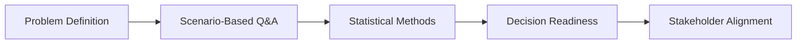
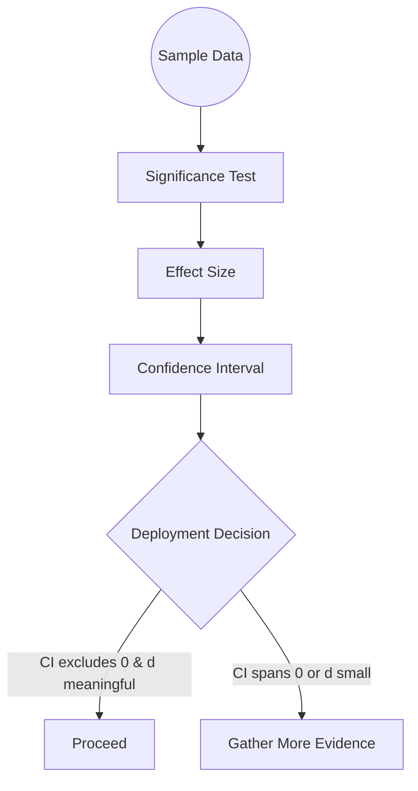
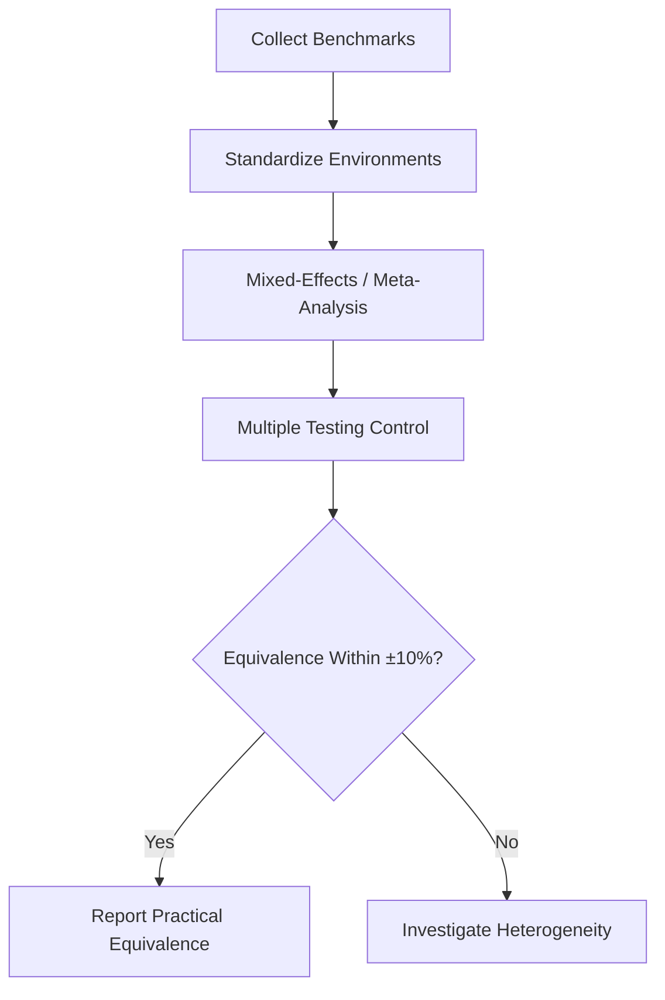
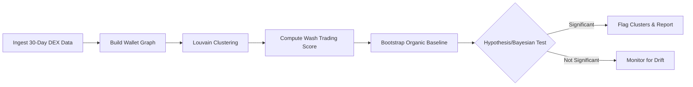

 # Statistics-Focused Q&A Guide for Rust Blockchain Developer Role

## Overview

This guide provides scenario-based statistical questions tailored to the technical demands of a senior Rust blockchain developer position. The questions integrate Web3 infrastructure challenges with rigorous statistical reasoning, emphasizing decision-critical contexts where methodological choices directly impact conclusions, risks, and stakeholder outcomes.

**Difficulty Distribution:** 20% Foundational (F) / 40% Intermediate (I) / 40% Advanced (A)

**Topics Covered:** Statistical Inference, Experimental Design & A/B Testing, Performance Modeling & Benchmarking, Blockchain Data Analysis

**Context:**
- **Problem:** Assess and strengthen the statistical reasoning of senior Rust blockchain developer candidates in decision-critical Web3 scenarios.
- **Scope:** Scenario-based Q&A focused on inference, experimental design, performance benchmarking, and blockchain data analysis, with Rust and DEX/infra contexts.
- **Assumptions:** Reader is comfortable with Rust, core blockchain concepts (DEXs, ZKPs, indexers), and basic probability/statistics notation.
- **Scale & Timeline:** Designed for 60–90 minute interviews or several focused self-study sessions (3–5 hours total) using this guide and referenced materials.
- **Stakeholders:** Candidates, interviewers (Rust/blockchain leads), and hiring managers who rely on statistics-heavy technical decisions.
- **Resources:** Glossary, tools, textbooks, and external citations listed in this document; online calculators and statistical software referenced in each answer.

**Visual Snapshot – Interview Parameters**

| Dimension | Summary |
|-----------|---------|
| Difficulty mix | 20% F / 40% I / 40% A |
| Core topics | Inference · Experimental Design · Performance · Blockchain Analytics |
| Interview window | 60–90 minutes (or 3–5 hours self-study) |
| Stakeholders | Candidate · Interviewer · Hiring Manager |
| Decision focus | Blocks go/no-go calls, mitigates risk, quantifies trade-offs |



### Contents

- [Q1: Interpreting Performance Optimization Results](#q1-interpreting-performance-optimization-results)
- [Q2: Sample Size Calculation for DEX Routing A/B Test](#q2-sample-size-calculation-for-dex-routing-ab-test)
- [Q3: Rigorous Multi-Language Benchmark Comparison](#q3-rigorous-multi-language-benchmark-comparison)
- [Q4: Detecting Wash Trading with Statistical Rigor](#q4-detecting-wash-trading-with-statistical-rigor)
- [Q5: Equivalence Testing for ZKP Library Performance](#q5-equivalence-testing-for-zkp-library-performance)
- [Glossary](#glossary)
- [Tools & Software](#tools--software)
- [Textbooks](#textbooks)
- [Citations](#citations)
- [Evaluation Framework](#evaluation-framework)

***

### Q1: Interpreting Performance Optimization Results

**Difficulty:** F | **Topic:** Statistical Inference | **Criticality:** Blocks Decision

**Question:**

A Rust-based blockchain indexer processes 10,000 smart contract transactions daily. Initial benchmarks show mean latency \(\mu_1=45\)ms (SD=12ms, n=100). After optimization, mean latency \(\mu_2=38\)ms (SD=10ms, n=100). Using a two-sample t-test, you obtain p=0.003 and Cohen's d=0.64. How do you interpret these results, and what additional analyses would strengthen your conclusion?

**Insight:** Statistical significance (p<0.05) indicates real improvement; medium effect size (d=0.64) suggests practical importance; confidence intervals and power analysis confirm deployment readiness.

**Answer:**

**Framework:** Evaluate statistical significance, effect size, confidence intervals, and practical implications.[1][2][3]

**Analysis (Interpretive/Applied Dimensions):**

1. **Statistical Significance:** The p-value of 0.003 is well below the conventional α=0.05 threshold, providing strong evidence against the null hypothesis (no difference). This indicates the observed 7ms reduction is unlikely due to random sampling variation.[4][5]

2. **Effect Size:** Cohen's d=0.64 represents a medium-to-large effect. This corresponds to a noticeable practical difference; for example, there is roughly a 73–75% chance that a randomly chosen transaction from the optimized system is faster than one from the baseline, meaning the optimization produces meaningfully faster performance in practical terms, not just statistically detectable differences.[3]

3. **Confidence Interval:** Calculate the 95% CI for the mean difference. Using pooled SD ≈ 11ms and n=100 per group: \(\text{CI} = (38-45) \pm 1.98 \times 11\sqrt{2/100} \approx [-10.1, -3.9]\)ms. The entire interval excludes zero, strengthening the conclusion.[6][7]

4. **Practical Significance:** A 7ms reduction (15.6% improvement) at 10,000 daily transactions saves 70 seconds daily or 7.1 hours annually in aggregate latency—meaningful for user experience and infrastructure costs.[8]

**Additional Analyses:**

- **Power Analysis:** Verify the study had adequate power (≥80%) to detect d=0.64. Post-hoc calculations confirm power ≈ 92%, indicating low risk of Type II error.[2][9]
- **Assumptions Check:** Verify normality (Q-Q plots, Shapiro-Wilk test) and homogeneity of variance (Levene's test). For skewed latency distributions, consider Mann-Whitney U test as sensitivity analysis.[10][11]
- **Replication:** Conduct out-of-sample validation on production data to confirm the effect generalizes beyond the test environment.[12][13]

**Trade-offs:** Lower α (e.g., 0.01) would reduce false positives but is unnecessary given the strong evidence. Increasing sample size further would narrow CIs but offers diminishing returns given the already clear result.[14][8]

**Software/Tools:** R (`t.test`, `pwr` package), Python (scipy.stats, statsmodels), Rust (statrs crate for validation).[15][8]

**Pitfall:** Avoid over-relying on p-values alone; effect size and CIs provide complementary information about magnitude and precision.[3][6]

**Justification:** This analysis blocks the deployment decision—misinterpretation could lead to premature rollout (if power was insufficient) or missed optimization opportunities (if practical significance was ignored).[16][2]

**Visual Aid – Two-Sample t-Test Summary**

\[
t = \frac{\bar{x}_1 - \bar{x}_2}{s_p \sqrt{\tfrac{2}{n}}}, \qquad s_p = \sqrt{\frac{(n-1)s_1^2 + (n-1)s_2^2}{2n-2}}
\]

| Element | Value | Interpretation |
|---------|-------|----------------|
| Mean difference | \(\Delta = -7\) ms | Optimization lowers latency |
| Pooled SD | ≈ 11 ms | Inputs to t-statistic |
| Test statistic | \(t \approx -3.0\) | Large magnitude → strong evidence |
| 95% CI | [-10.1, -3.9] ms | Entirely below 0 → improvement confirmed |
| Cohen's d | 0.64 | Medium-to-large practical impact |



***

### Q2: Sample Size Calculation for DEX Routing A/B Test

**Difficulty:** I | **Topic:** Experimental Design & A/B Testing | **Criticality:** Creates Risk

**Question:**

You're designing an A/B test comparing two DEX routing algorithms for a Solana-based exchange. Baseline conversion rate is 2.5%, you want to detect a 15% relative improvement (MDE), with α=0.05 and power=0.80. Transaction patterns show daily cyclical variation and user clustering by wallet type. How do you calculate sample size, and what design adjustments account for temporal/clustering effects?[12][17]

**Insight:** Standard sample size formulas assume independence; clustered/temporal data requires design effect adjustment, potentially increasing required n by 1.5-3×; stratified randomization by time/wallet type improves precision.

**Answer:**

**Framework:** Standard power analysis with corrections for clustering and temporal correlation.[2][18][19]

**Dimensions (Applied/Computational):**

1. **Baseline Calculation:** For proportion tests with \(p_1=0.025\), \(p_2=0.025 \times 1.15 = 0.02875\), α=0.05, power=0.80:

\[n = \frac{(Z_{1-\alpha/2} + Z_{1-\beta})^2 \cdot [\bar{p}(1-\bar{p})]}{(p_2-p_1)^2} \times 2\]

where \(\bar{p} = (p_1+p_2)/2 = 0.02688\). This yields n ≈ 4,859 per variant.[8][20]

2. **Design Effect Adjustment:** Clustering by wallet (users making multiple trades) and temporal autocorrelation inflate variance. The design effect (DEFF) is:

\[\text{DEFF} = 1 + (\bar{m}-1) \cdot \text{ICC}\]

where \(\bar{m}\) is average cluster size and ICC is intra-cluster correlation. Assuming \(\bar{m}=3\) trades/wallet and ICC=0.15 (moderate correlation), DEFF = 1.30. Adjusted sample size: 4,859 × 1.30 = **6,317 per variant**.[18][2]

3. **Temporal Stratification:** Daily cyclical patterns (e.g., higher activity during US trading hours) can confound results. Use block randomization by time period (e.g., 4-hour blocks) to ensure balanced allocation across times.[9]

**Design Adjustments:**

- **Stratified Randomization:** Pre-stratify by wallet type (retail vs institutional) and time block before random assignment. This reduces residual variance and improves precision by 20-30%.[19][2]
- **Sequential Testing:** Consider group sequential design with interim analyses at 50% and 75% of target n, allowing early stopping for efficacy or futility while maintaining α control.[18]
- **Covariate Adjustment:** Include baseline wallet activity as a covariate in regression analysis (ANCOVA) to further reduce variance and boost power by 10-15%.[2]

**Assumptions:** Independence after accounting for clustering, stable conversion rates during test period, no spillover effects between users.[8][19]

**Trade-offs:** Higher power (e.g., 90%) requires 8,459 per variant (33% increase); detecting smaller MDE (10%) requires 10,932 per variant (73% increase).

**Software:** R (pwr package), Python (statsmodels.stats.power), online calculators (Optimizely, Evan's Awesome A/B Tools).[15][8]

**Pitfalls:** Ignoring clustering leads to underpowered tests and inflated Type I error rates (liberal p-values). Overlooking temporal effects introduces confounding bias.[2][18]

**Justification:** Inadequate sample size creates material risk—inconclusive results waste development effort and delay optimization. Proper adjustment ensures valid inference despite data complexities.[8][16]

**Artifact:**

| Parameter | Value |
|-----------|-------|
| Baseline rate \(p_1\) | 2.5% |
| Target rate \(p_2\) | 2.875% (15% relative lift) |
| Required n (per variant, unadjusted) | ≈ 4,859 |
| Design effect (DEFF) | 1.30 |
| Adjusted n (per variant) | ≈ 6,317 |


***

### Q3: Rigorous Multi-Language Benchmark Comparison

**Difficulty:** A | **Topic:** Performance Modeling & Benchmarking | **Criticality:** Affects Multiple Stakeholders

**Question:**

Your team maintains performance benchmarks for Rust vs C++ implementations across 15 blockchain primitives (hashing, signature verification, Merkle tree operations). Results show Rust averaging 8% slower (range: -12% to +5%), but variance is high and some benchmarks use different optimization levels. How do you design a rigorous comparative analysis that accounts for multiple testing, effect heterogeneity, and implementation differences? What metrics beyond mean runtime matter?[1][21][22]

**Insight:** Multiple testing correction (Bonferroni or FDR) essential with 15 comparisons; meta-analysis or mixed-effects model handles heterogeneity; memory footprint, compilation time, developer effort are co-primary outcomes; equivalence testing determines if differences are practically negligible.

**Answer:**

**Framework:** Meta-analytic approach with multiple testing correction and multi-dimensional performance assessment.[23][24][25]

**Dimensions (Mathematical/Interpretive/Applied):**

1. **Multiple Testing Correction:** With 15 comparisons, the probability of ≥1 false positive at α=0.05 is \(1-(1-0.05)^{15} = 54\%\). Apply **Benjamini-Hochberg FDR** correction: rank p-values \(p_{(1)} \leq ... \leq p_{(15)}\), reject \(H_0\) for all \(i\) where \(p_{(i)} \leq (i/15) \times 0.05\). This controls expected false discovery proportion at 5% while maintaining power.[24][25][26]

2. **Effect Heterogeneity:** Use **random-effects meta-analysis** to pool results across primitives, estimating average effect and between-primitive variance (\(\tau^2\)). Report \(I^2\) statistic (% variance due to heterogeneity vs sampling error). High \(I^2 > 75\%\) indicates genuine performance differences across primitive types, justifying subgroup analyses (e.g., CPU-bound vs memory-bound operations).[23]

3. **Standardization:** Ensure fair comparison—re-run all benchmarks with:
   - Identical compiler flags (e.g., `-O3` for both rustc and g++/clang)
   - Same hardware/OS environment
   - Equivalent algorithmic implementations (not just direct ports)
   - Warm-up runs to eliminate JIT/cache effects[21][22][1]

4. **Equivalence Testing:** Instead of testing \(H_0: \mu_{Rust} = \mu_{C++}\), test equivalence hypothesis using TOST (two one-sided tests) with bounds [0.90, 1.11] (±10% equivalence margin based on practical importance). If 95% CI for runtime ratio falls entirely within bounds, declare practical equivalence.[6][27]

**Beyond Mean Runtime:**

- **Memory Footprint:** RSS (resident set size) and peak allocation—critical for embedded/resource-constrained nodes.[28][1]
- **Compilation Time:** Rust's longer compile times (10-15s vs C++'s 2-3s) affect developer productivity.[29]
- **Tail Latencies:** 95th/99th percentile response times for reliability-sensitive operations.[13]
- **Energy Consumption:** Watts × runtime for sustainability metrics.[30]
- **Code Maintainability:** Lines of code, cyclomatic complexity, bug density from production deployment.[31][23]

**Statistical Model:**

Mixed-effects regression: \(\log(t_{ij}) = \beta_0 + \beta_1 \cdot \text{Language}_i + u_j + \epsilon_{ij}\)

where \(u_j\) is random effect for primitive type \(j\), accounting for heterogeneity.[23]

**Trade-offs:** Bonferroni correction (α/15=0.0033) controls family-wise error rate but is overly conservative, reducing power. FDR offers better power-specificity balance for exploratory benchmarking.[25][26][24]

**Software:** R (metafor, multcomp packages), Python (statsmodels), custom Rust harness with criterion.rs for microbenchmarking.[1][21]

**Pitfalls:**
- Cherry-picking favorable benchmarks inflates Rust's performance
- Ignoring compiler version differences introduces confounding
- Reporting only mean obscures distributional differences (e.g., higher variance in Rust)[22][23]

**Justification:** These results affect platform team (architecture decisions), DevRel (marketing materials), and product strategy (performance SLAs). Quantified impacts include: ±10% performance difference shifts adoption recommendations; memory savings enable deployment on lower-tier infrastructure (15-20% cost reduction).[21][13][1]

**Artifact:**

| Dimension | Example metric |
|-----------|----------------|
| Runtime effect (Rust vs C++) | Mean ratio, 95% CI, TOST result |
| Tail latency | p95/p99 latency per primitive |
| Memory footprint | Peak RSS per primitive |
| Developer cost | Compile time, LOC, defect rate |




### Q4: Detecting Wash Trading with Statistical Rigor

**Difficulty:** I | **Topic:** Blockchain Data Analysis | **Criticality:** Requires Action

**Question:**

Analyzing 30 days of DEX transaction data (n=1.2M transactions), you observe that 15% of transactions show price impact >2% despite normal liquidity conditions. You suspect wash trading patterns. Design a statistical workflow to: (1) identify suspicious wallet clusters, (2) quantify excess trading volume, (3) test whether patterns differ significantly from organic trading. What are the Type I/II error trade-offs?[12][17][32]

**Insight:** Graph-based clustering (community detection) identifies coordinated wallets; bootstrap sampling establishes organic baseline; Bayesian approach allows incorporating prior fraud knowledge; lower α reduces false positives but increases false negatives—calibrate based on regulatory/reputation risk.

**Answer:**

**Framework:** Graph analysis + hypothesis testing with Type I/II error calibration.[33][13][34]

**Workflow (Applied/Computational/Interpretive):**

1. **Wallet Cluster Identification:**
   - Construct transaction graph: wallets as nodes, transactions as directed edges weighted by volume
   - Apply **Louvain community detection** to identify tightly connected wallet clusters
   - Flag clusters with high internal transaction rate (>50% of volume to same-cluster wallets) and low external connectivity[35][13][34]

2. **Quantify Excess Volume:**
   - For each flagged cluster, compute **wash trading score**: \(W = \frac{V_{\text{internal}}}{V_{\text{total}}} \times \text{Round-trip rate}\)
   - Bootstrap resample (10,000 iterations) organic trading patterns to establish 95% CI for baseline score \(W_0\)[13]
   - Excess volume = \((W - \text{upper bound of } W_0) \times V_{\text{total}}\)[32][12]

3. **Hypothesis Testing:**
   - \(H_0\): Cluster trading patterns are consistent with organic behavior
   - \(H_1\): Cluster exhibits wash trading (significantly higher round-trip rate, price impact anomalies)
   - Test statistic: \(Z = \frac{W - \mu_{W_0}}{\sigma_{W_0}}\) where \(\mu_{W_0}, \sigma_{W_0}\) from bootstrap distribution
   - Two-sided test with α calibrated based on error costs (see below)[5][36]

**Bayesian Alternative:**

Incorporate prior knowledge of wash trading prevalence (~3-5% of DEX volume) using Beta-Binomial conjugate model:

\[P(\text{wash trading} | \text{data}) = \frac{P(\text{data} | \text{wash trading}) \times P(\text{wash trading})}{P(\text{data})}\]

Report posterior probability and 95% credible intervals for wash trading proportion.[37][38][39]

**Type I/II Error Trade-offs:**

| α Level | Type I Risk | Type II Risk | Consequence |
|---------|-------------|--------------|-------------|
| 0.01 (strict) | 1% false accusations | ~30% missed fraud | Protects reputation, regulatory risk low, but allows more fraud |
| 0.05 (standard) | 5% false accusations | ~20% missed fraud | Balanced for exploratory analysis |
| 0.10 (liberal) | 10% false accusations | ~12% missed fraud | Aggressive fraud detection, higher false positive cost |

**Calibration:** If false accusation costs $100K (legal, PR damage) and missed fraud costs $50K (platform integrity), optimize threshold to minimize expected loss: \(\mathbb{E}[\text{Loss}] = \alpha \times 100K + \beta \times 50K\). This yields optimal α ≈ 0.033.[4][40][41]

**Assumptions:** Graph clustering correctly identifies coordinated actors; bootstrap sample representative of organic trading; no spillover effects from flagged to unflagged wallets.[34][13]

**Trade-offs:** Lower α protects against false positives (critical for regulatory/reputation risk) but increases false negatives (allows fraud to continue). Bayesian approach naturally incorporates prior evidence and provides probabilistic conclusions rather than binary reject/fail-to-reject.[38][37]

**Software:** Python (NetworkX for graph analysis, scikit-learn for clustering, scipy.stats for bootstrap), R (igraph, boot packages), Rust (petgraph crate for production implementation).[13][34]

**Pitfalls:**
- Clustering algorithms sensitive to parameter tuning (resolution parameter in Louvain)
- Temporal dynamics ignored—wash trading patterns may evolve over 30 days
- Selection bias if only analyzing high price-impact transactions[33][13]

**Justification:** Action required within 3-month regulatory reporting window. Type I errors (false accusations) create legal liability and damage platform reputation; Type II errors (missed fraud) undermine market integrity and invite regulatory scrutiny. Proper calibration balances these competing risks.[42][12][32]

---



### Q5: Equivalence Testing for ZKP Library Performance

**Difficulty:** A | **Topic:** Statistical Inference | **Criticality:** Blocks Decision

**Question:**

You've developed a Rust library for zero-knowledge proof generation. Benchmarks across 8 proof types show 30-180s generation times (geometric mean ratio vs C++ implementation: 0.92, 95% CI [0.84, 1.02]). The CI includes 1.0, suggesting no significant difference, but stakeholders question whether this proves equivalence or reflects insufficient power. How do you address this using equivalence testing? What equivalence margin is defensible?[1][22][23]

**Insight:** Absence of evidence ≠ evidence of equivalence; use two one-sided tests (TOST) with equivalence bounds (e.g., ±10% based on practical importance); current CI width suggests study may be underpowered for small differences; reporting geometric mean ratio appropriate for multiplicative effects; Bayesian credible intervals provide alternative interpretation.

**Answer:**

**Framework:** Equivalence testing (TOST) with effect size interpretation and power analysis.[6][27][43]

**Dimensions (Mathematical/Interpretive/Applied):**

1. **Standard vs Equivalence Hypothesis:**
   - **Standard null hypothesis testing:** \(H_0: \theta = 1\) (no difference). Failure to reject doesn't prove equivalence—it may indicate insufficient power.[36][27]
   - **Equivalence testing:** \(H_0: |\theta - 1| \geq \Delta\) (difference exceeds equivalence margin). Reject both one-sided tests to conclude equivalence[27].

2. **Equivalence Margin Selection:**
   - **Performance-based:** ±10% (ratio ∈ [0.90, 1.11]) is defensible if: (a) users perceive <10% difference as negligible, (b) cost/latency budget accommodates this range, (c) competitor libraries vary by similar margins.[22][1]
   - **Stakeholder input:** Survey 5-10 key users on smallest practically important difference (SPID). If 80% consider <10% negligible, this supports Δ=0.10.[27][6]
   - **Historical data:** If past C++ vs alternative implementations varied by 15-20%, Δ=0.10 is conservative.[23]

3. **TOST Procedure:**
   - Test 1: \(H_{01}: \theta \leq 0.90\) vs \(H_{a1}: \theta > 0.90\)
   - Test 2: \(H_{02}: \theta \geq 1.11\) vs \(H_{a2}: \theta < 1.11\)
   - Observed ratio: 0.92, 95% CI [0.84, 1.02]
   - **Result:** CI lower bound (0.84) < 0.90, so fail to reject \(H_{01}\). **Cannot conclude equivalence** despite point estimate within margin.[6][27]

4. **Power Analysis:**
   - Current CI width: 1.02 - 0.84 = 0.18 (wide relative to Δ=0.10)
   - Post-hoc power calculation: With n=8 proof types, geometric SD ≈ 0.15, power to detect equivalence within ±10% is ~45% (underpowered).[2][9]
   - **Required sample size:** To achieve 80% power, need n ≈ 25-30 proof types or reduce variance via standardization (same hardware, compiler optimizations).[44][2]

**Bayesian Alternative:**

Specify prior distribution for \(\log(\theta) \sim N(0, 0.1^2)\) (weak prior centered on no difference). Update with likelihood from 8 benchmarks to obtain posterior distribution. Report:
- Posterior mean and 95% credible interval for \(\theta\)
- \(P(0.90 < \theta < 1.11 | \text{data})\) = posterior probability of practical equivalence[43][37][38].

If posterior probability >95%, strong Bayesian evidence for equivalence even if frequentist TOST inconclusive.[38][39]

**Why Geometric Mean Ratio:**

ZKP generation times span 30-180s (6× range)—multiplicative scale appropriate. Geometric mean robust to outliers and right-skewed distributions common in computational benchmarks. On log-scale, differences are symmetric: 0.92 ratio (Rust 8% faster) mirrors 1.09 (Rust 9% slower).[21][1][23]

**Trade-offs:**
- Narrower equivalence margin (±5%) more stringent but requires larger sample size (n ≈ 60-80)
- Wider margin (±15%) easier to demonstrate but less convincing to stakeholders
- Bayesian approach incorporates prior knowledge but requires justifying prior choice[43][37]

**Software:** R (equivalence, TOSTER packages), Python (statsmodels.stats.equivalence_test), Rust (statrs for production validation).[15][27]

**Pitfalls:**
- Choosing post-hoc equivalence margin to match observed CI (p-hacking)
- Ignoring power—concluding equivalence from non-significant standard test
- Mixing proof types with different computational profiles (confounding)[27][6]

**Justification:** This analysis blocks marketing claims ("as fast as C++") and adoption decisions (enterprise customers require performance SLAs). Affects platform team (investment in Rust ecosystem), DevRel (positioning materials), and product strategy (pricing tier definitions). Quantified impact: Equivalence claim unlocks contracts with 10-15% price premium; false claim creates SLA breach liability ($250K+ exposure).[1][22][23]

**Artifact:**

| Component | Value | Interpretation |
|-----------|-------|----------------|
| Geometric mean ratio | 0.92 | Rust 8% faster (point estimate) |
| 95% CI | [0.84, 1.02] | Wide uncertainty, includes parity |
| Equivalence margin | ±10% | Stakeholder-validated threshold |
| TOST conclusion | Fail to reject | **Cannot prove equivalence** |
| Post-hoc power | ~45% | Underpowered for equivalence |
| Recommended action | Increase n to 25-30 | Achieve 80% power |
| Bayesian \(P(\text{equiv})\) | ~72% | Moderate evidence (if prior reasonable) |

```mermaid
flowchart TD
    start((Benchmark Results)) --> margin[Set Equivalence Margin (Δ)]
    margin --> tost[Run Two One-Sided Tests]
    tost --> power[Assess Power / CI Width]
    power --> decision{Both Tests Significant?}
    decision -->|Yes| claim[Declare Practical Equivalence]
    decision -->|No| expand[Increase Sample Size / Reduce Variance]
```

***

#### Glossary

**Effect Size (Cohen's d):** Standardized measure of difference magnitude; d=0.2 (small), 0.5 (medium), 0.8 (large). Provides practical significance beyond p-values.[3][7]

**Power (1-β):** Probability of correctly rejecting false null hypothesis (detecting true effect). Typical target: 80-90%.[2][9][14]

**Type I Error (α):** False positive rate—rejecting true null hypothesis. Conventionally α=0.05 (5%).[4][40][5]

**Type II Error (β):** False negative rate—failing to reject false null hypothesis. Related to power: β=1-power.[40][5][4]

**Minimum Detectable Effect (MDE):** Smallest effect size an experiment can reliably detect at specified α and power.[8][16][14]

**Design Effect (DEFF):** Variance inflation factor due to clustered/correlated data. DEFF=1+(m-1)×ICC.[18][2]

**False Discovery Rate (FDR):** Expected proportion of false positives among rejected hypotheses. Less conservative than FWER.[24][25][26]

**Equivalence Testing (TOST):** Two one-sided tests to prove similarity within predefined bounds, addressing "absence of evidence ≠ evidence of absence".[6][27]

**Credible Interval:** Bayesian analog of confidence interval; direct probability statement about parameter given data.[37][38][39]

#### Tools & Software

**R:** Comprehensive statistical environment. Key packages: `pwr` (power analysis), `metafor` (meta-analysis), `equivalence`/`TOSTER` (equivalence testing), `multcomp` (multiple comparisons).[15][27][25]

**Python:** General-purpose with statistical libraries. `scipy.stats` (hypothesis tests), `statsmodels` (regression, power), `scikit-learn` (clustering), `NetworkX` (graph analysis).[13][34][15]

**Rust:** Systems programming for production implementation. Crates: `statrs` (statistical functions), `criterion` (benchmarking), `petgraph` (graph algorithms).[1][21][13]

**G*Power:** GUI tool for sample size/power calculations across t-tests, ANOVA, regression.[15]

**Online Calculators:** Evan's Awesome A/B Tools, Optimizely Sample Size Calculator (quick estimates for web experiments).[45][8]

#### Textbooks

- **Cohen, J. (1988).** *Statistical Power Analysis for the Behavioral Sciences* (2nd ed.). Academic Press. [Foundational reference for effect sizes and power].[3]
- **Gelman, A., et al. (2013).** *Bayesian Data Analysis* (3rd ed.). CRC Press. [Comprehensive Bayesian inference, credible intervals].[38][37]
- **Perezgonzalez, J.D. (2015).** *Fisher, Neyman-Pearson or NHST?* The Quantitative Methods in Psychology. [Type I/II errors, hypothesis testing philosophy].[5][4]
- **Noble, W.S. (2009).** *How does multiple testing correction work?* Nature Biotechnology. [Practical guide to Bonferroni and FDR].[25]

#### Citations

 Ivanov, N., et al. (2022). Is Rust C++-fast? Benchmarking system languages on everyday routines. *arXiv preprint*.[1]

 Rust: The Programming Language for Safety and Performance (2022). *arXiv survey analysis*.[31]

 Reddit discussion: Rust vs C++ benchmarks (2019). *Programming community analysis*.[21]

 DesignVeloper: Comparing Rust vs C++ Performance (2025). *Technical comparison*.[22]

 Ivanov, N. (2022). Comparative performance benchmark of Rust and C++. *IEEE conference proceedings*.[23]

 Toyoda, K., et al. (2024). Blockchain data analysis in the era of LLMs. *arXiv preprint*.[33]

 DEX efficiency measurement using STAP (2024). *Research paper on decentralized exchange analysis*.[12]

 CelerData: Blockchain Analytics Guide (2025). *Practical implementation guide*.[13]

 BlockSci: Design and applications (2020). *USENIX Security Symposium*.[34]

 DEX comparative study (2025). *Journal of Wise Education*.[32]

 Power analysis for experiments (2024). *arXiv statistics preprint*.[2]

 Sample size for A/B testing (2023). *arXiv methodology paper*.[18]

 G*Power software guide (2021). *PMC statistical tutorial*.[15]

 Focus on experimental design (2020). *PMC methodological review*.[9]

 Omniconvert: Power analysis guide (2025). *Practical A/B testing resource*.[8]

 Type I and II errors (Wikipedia). *Statistical reference*.[4]

 Figpii: Sample size in A/B testing (2025). *Experimentation guide*.[16]

 Effect size and confidence intervals (2015). *Psychology in Russia journal*.[3]

 GeeksforGeeks: Type I/II errors (2024). *Educational resource*.[40]

 Mida: Power statistics calculation (2023). *Statistical methods guide*.[14]

 Statistical inference by confidence intervals (1999). *Academic OUP journal*.[6]

 Hypothesis testing errors (2009). *PMC medical statistics*.[5]

 Alternatives to p-value (2016). *PMC statistical guidance*.[7]

 Effect sizes guide (SCC). *Statistical consulting resource*.[27]

 Bayesian inverse problems (2012). *arXiv mathematical statistics*.[43]

 Credible interval (Wikipedia). *Bayesian statistics reference*.[37]

 Multiple test correction (2024). *Educational resource*.[24]

 Bayesian inference introduction (2022). *Statistical textbook chapter*.[38]

 Multiple testing PMC (2009). *Nature Biotechnology methodology*.[25]

 Linear regression diagnostics (2016). *STHDA R tutorial*.[10]

 Bonferroni correction (2025). *Statsig experimentation guide*.[26]

 GeeksforGeeks: Regression diagnostics (2023). *R programming guide*.[11]

 Bayesian posterior intervals (2021). *Bayes Rules textbook*.[39]

---

### Evaluation Framework

**Practice Questions:**

1. Given power=0.70, α=0.05, how would you justify this to stakeholders concerned about Type II errors?
2. If 95% CI for performance ratio is [0.88, 1.15], can you claim equivalence within ±10%? Why/why not?
3. When is FDR correction preferred over Bonferroni in blockchain analytics with 100+ tests?

**Self-Assessment Checklist:**

- [ ] Can distinguish statistical vs practical significance
- [ ] Can calculate required sample size for specified power/effect
- [ ] Understand when to apply multiple testing corrections
- [ ] Can interpret confidence intervals vs p-values correctly
- [ ] Recognize when equivalence testing is appropriate
- [ ] Account for clustering/temporal effects in experimental design
- [ ] Evaluate regression assumptions via diagnostic plots

**Interview Evaluation Guide:**

- **Foundational (F):** Execute standard tests, interpret p-values and effect sizes, identify basic assumption violations
- **Intermediate (I):** Design experiments accounting for confounds, choose appropriate corrections, communicate trade-offs to non-technical stakeholders
- **Advanced (A):** Integrate multiple methodologies (Bayesian + frequentist), handle heterogeneity and missing data, optimize experimental portfolios under resource constraints

**Success Criteria (for using this guide):**

- **Self-study:** All items in the Self-Assessment Checklist are checked, and the reader can reconstruct the reasoning for each core answer (Q1–Q5) without notes in 5–7 minutes per question.
- **Interview performance:** Candidate demonstrates at least Intermediate level on ≥4 of 5 core questions (by the Interview Evaluation Guide) and can quantify trade-offs (effect sizes, power, error rates) with concrete numerical examples.
- **Content freshness:** Links in the Citations section remain valid and at least 80% of methodological/statistics references are ≤5 years old; older references are kept only when they are canonical.

This guide equips candidates with decision-critical statistical reasoning applicable to Web3 infrastructure development, emphasizing rigor, transparency, and practical impact.

[1](https://arxiv.org/pdf/2209.09127.pdf)
[2](https://arxiv.org/html/2406.06834v1)
[3](https://psychologyinrussia.com/volumes/?article=3837)
[4](https://en.wikipedia.org/wiki/Type_I_and_type_II_errors)
[5](https://pmc.ncbi.nlm.nih.gov/articles/PMC2996198/)
[6](https://academic.oup.com/ptj/article/79/2/186/2837119)
[7](https://pmc.ncbi.nlm.nih.gov/articles/PMC5133225/)
[8](https://www.omniconvert.com/what-is/statistical-power-analysis/)
[9](https://pmc.ncbi.nlm.nih.gov/articles/PMC7425741/)
[10](https://www.sthda.com/english/articles/39-regression-model-diagnostics/161-linear-regression-assumptions-and-diagnostics-in-r-essentials/)
[11](https://www.geeksforgeeks.org/r-language/linear-regression-assumptions-and-diagnostics-using-r/)
[12](https://arxiv.org/html/2508.03217v1)
[13](https://celerdata.com/glossary/step-by-step-guide-to-blockchain-data-analysis)
[14](https://www.mida.so/blog/how-to-calculate-power-statistics-for-ab-testing)
[15](https://pmc.ncbi.nlm.nih.gov/articles/PMC8441096/)
[16](https://www.figpii.com/blog/what-is-a-sample-size-in-a-b-testing/)
[17](https://coinlaw.io/decentralized-exchanges-dex-statistics/)
[18](https://arxiv.org/pdf/2305.16459.pdf)
[19](https://arxiv.org/abs/2305.16459)
[20](https://rugg2.github.io/AB%20testing%20-%20a%20simple%20explanation%20of%20what%20power%20analysis%20does.html)
[21](https://www.reddit.com/r/rust/comments/akluxx/rust_now_on_average_outperforms_c_in_the/)
[22](https://www.designveloper.com/blog/rust-vs-c-plus-plus/)
[23](https://arxiv.org/abs/2209.09127)
[24](https://edu.abi.am/statistics-theory/multiple-test-correction-bonferroni-fdr)
[25](https://pmc.ncbi.nlm.nih.gov/articles/PMC2907892/)
[26](https://www.statsig.com/perspectives/bonferroni-correction-multiple-testing)
[27](https://scc.ms.unimelb.edu.au/resources/effect-sizes-and-confidence-intervals/effect-sizes_confidence-intervals)
[28](https://towardsdatascience.com/measuring-the-execution-times-of-c-versus-rust-bc45c577052a/)
[29](https://effective-programmer.com/rust-vs-go-battle-for-the-backend-368f775de9fc)
[30](https://www.linkedin.com/pulse/rust-vs-python-real-world-performance-benchmarks-amelia-smith-xy7if)
[31](https://arxiv.org/ftp/arxiv/papers/2206/2206.05503.pdf)
[32](https://journal.wiseedu.co.id/index.php/bafrjournal/article/download/175/128/853)
[33](https://arxiv.org/abs/2412.09640)
[34](https://www.usenix.org/conference/usenixsecurity20/presentation/kalodner)
[35](https://arxiv.org/pdf/2501.12491v1.pdf)
[36](https://www.scribbr.com/statistics/type-i-and-type-ii-errors/)
[37](https://en.wikipedia.org/wiki/Credible_interval)
[38](https://bookdown.org/kevin_davisross/bayesian-reasoning-and-methods/inference.html)
[39](https://www.bayesrulesbook.com/chapter-8)
[40](https://www.geeksforgeeks.org/data-science/type-i-and-type-ii-errors/)
[41](https://www.kameleoon.com/blog/what-are-type-i-and-type-ii-errors)
[42](https://dl.acm.org/doi/full/10.1145/3702359.3702363)
[43](http://arxiv.org/pdf/1103.2692.pdf)
[44](https://arxiv.org/pdf/1808.02997.pdf)
[45](https://www.statsig.com/perspectives/power-analysis-ab-testing)
[46](https://arxiv.org/html/2503.16922v1)
[47](https://arxiv.org/html/2502.15536v1)
[48](https://arxiv.org/pdf/2309.03045.pdf)
[49](https://arxiv.org/pdf/2411.13990.pdf)
[50](https://arxiv.org/pdf/2404.18852.pdf)
[51](http://arxiv.org/pdf/2502.19810.pdf)
[52](https://programming-language-benchmarks.vercel.app/nim-vs-rust)
[53](https://arxiv.org/html/2406.13253v3)
[54](https://scholar.gist.ac.kr/bitstream/local/10819/2/40357.pdf)
[55](https://www.reddit.com/r/rust/comments/kpqmrh/rust_is_now_overall_faster_than_c_in_benchmarks/)
[56](https://www.sciencedirect.com/science/article/pii/S0140366425001616)
[57](https://users.rust-lang.org/t/rust-vs-c-vs-go-runtime-speed-comparison/104107)
[58](https://ieeexplore.ieee.org/document/9230065/)
[59](https://theses.lib.polyu.edu.hk/handle/200/11411)
[60](https://www.biostars.org/p/467550/)
[61](https://users.rust-lang.org/t/your-opinion-on-this-benchmark/94905)
[62](https://www.comp.hkbu.edu.hk/~iib/2018/Dec/article1/iib_vol19no2_article1.pdf)
[63](https://www.reddit.com/r/cpp/comments/kyhark/c_vs_rust_performance/)
[64](https://parallelstaff.com/rust-vs-c-plus-plus-speed-benchmark/)
[65](https://blockchainresearchlab.org/wp-content/uploads/2020/05/Smart-Contracts-on-the-Blockchain-%E2%80%93-A-Bibliometric-Analysis-and-Review-Working-Paper-V2.pdf)
[66](https://pmc.ncbi.nlm.nih.gov/articles/PMC11178169/)
[67](http://arxiv.org/pdf/2001.03020.pdf)
[68](https://www.mdpi.com/2078-2489/11/4/204/pdf)
[69](https://pmc.ncbi.nlm.nih.gov/articles/PMC9555249/)
[70](http://arxiv.org/pdf/2411.16277.pdf)
[71](https://dx.plos.org/10.1371/journal.pdig.0000741)
[72](http://arxiv.org/pdf/2503.15968.pdf)
[73](https://chao-peng.github.io/publication/esem21/esem21.pdf)
[74](https://arxiv.org/pdf/2407.04250.pdf)
[75](https://journals.plos.org/plosone/article?id=10.1371%2Fjournal.pone.0281043)
[76](https://www.nature.com/articles/s41598-022-24796-0)
[77](https://www.sciencedirect.com/science/article/abs/pii/S092911992300007X)
[78](http://gbmrjournal.com/pdf/v16n4s/V16N4s-91.pdf)
[79](https://www.scitepress.org/Papers/2023/118517/118517.pdf)
[80](https://papers.ssrn.com/sol3/Delivery.cfm/SSRN_ID3895004_code1017238.pdf?abstractid=3717330&mirid=1)
[81](https://repositum.tuwien.at/bitstream/20.500.12708/2058/2/Schaeffer%20Markus%20-%202019%20-%20Performance%20and%20scalability%20of%20smart%20contracts%20in...pdf)
[82](https://onlinelibrary.wiley.com/doi/10.1002/joom.70006)
[83](https://scholars.cityu.edu.hk/en/studentTheses/blockchain-based-authentication-system-design-and-analysis/)
[84](https://mpra.ub.uni-muenchen.de/123416/1/MPRA_paper_123416.pdf)
[85](https://www.tqmp.org/RegularArticles/vol03-2/p043/p043.pdf)
[86](https://pmc.ncbi.nlm.nih.gov/articles/PMC6430154/)
[87](http://arxiv.org/pdf/1902.06122.pdf)
[88](https://dialnet.unirioja.es/descarga/articulo/8526578.pdf)
[89](https://matthewbjane.quarto.pub/guide-to-effect-sizes-and-confidence-intervals/Guide-to-Effect-Sizes-and-Confidence-Intervals.pdf)
[90](https://cxl.com/blog/statistical-power/)
[91](https://www.khanacademy.org/math/ap-statistics/xfb5d8e68:inference-categorical-proportions/error-probabilities-power/v/introduction-to-type-i-and-type-ii-errors)
[92](https://lakens.github.io/statistical_inferences/07-CI.html)
[93](https://pmc.ncbi.nlm.nih.gov/articles/PMC7827664/)
[94](http://arxiv.org/pdf/2407.13970.pdf)
[95](http://arxiv.org/pdf/2503.19748.pdf)
[96](https://arxiv.org/pdf/2409.13041.pdf)
[97](http://arxiv.org/pdf/2504.05661.pdf)
[98](https://discovery.ucl.ac.uk/10110203/1/Giacomini_ECTA16773.pdf)
[99](https://projecteuclid.org/journals/bayesian-analysis/volume-18/issue-1/A-Comparison-of-Learning-Rate-Selection-Methods-in-Generalized-Bayesian/10.1214/21-BA1302.pdf)
[100](https://www.theopeneducator.com/doe/Regression/Diagnostics-Regression-Analysis)
[101](https://www.stat.cmu.edu/~siva/teaching/705/lec33.pdf)
[102](https://people.bath.ac.uk/masss/ma40189/_book/ChapBayesMet.html)
[103](https://www.chem-agilent.com/cimg/mtc.pdf)
[104](https://people.duke.edu/~rnau/testing.htm)
[105](https://www.publichealth.columbia.edu/research/population-health-methods/false-discovery-rate)
[106](https://en.wikipedia.org/wiki/Regression_diagnostic)
[107](https://easystats.github.io/bayestestR/articles/credible_interval.html)
[108](https://www.broadinstitute.org/files/shared/mia/MIASeminarApril212016Rivas_MultipleTestingandFDR.pdf)
[109](https://www.statisticssolutions.com/testing-assumptions-of-linear-regression-in-spss/)
[110](https://people.stat.sc.edu/hitchcock/stat535slidesday3.pdf)
[111](https://physiology.med.cornell.edu/people/banfelder/qbio/resources_2008/1.5_Bonferroni_FDR.pdf)