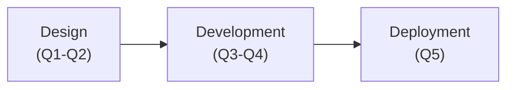
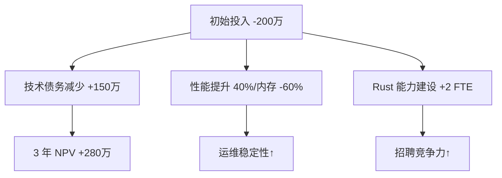
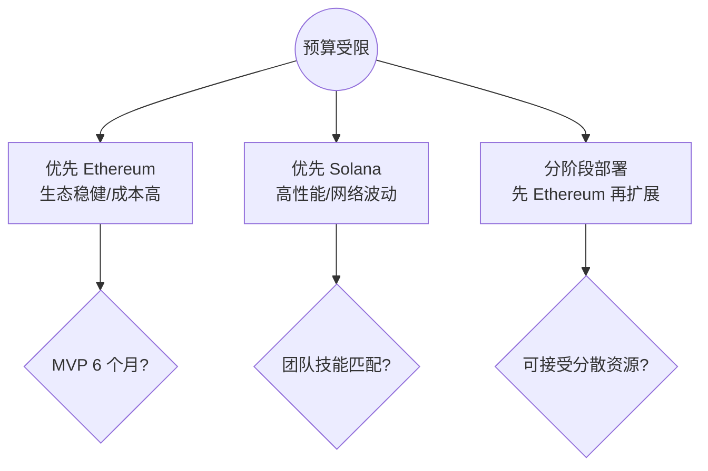
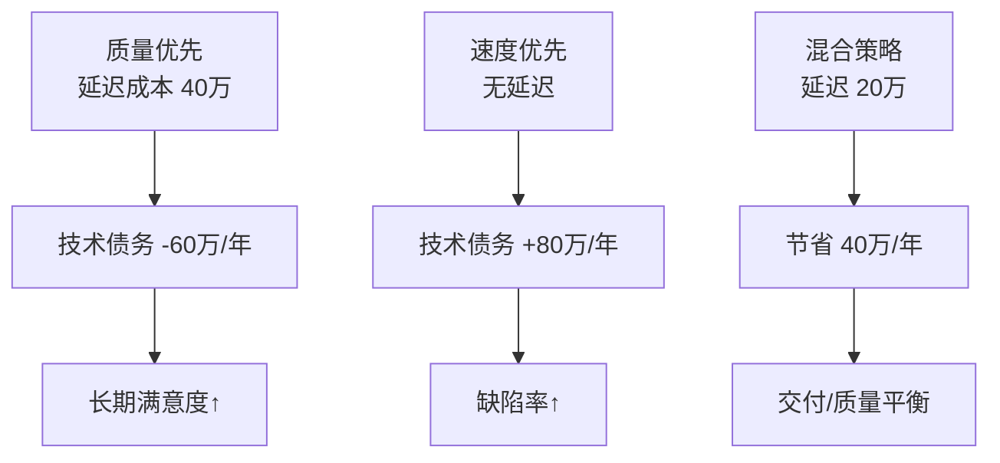
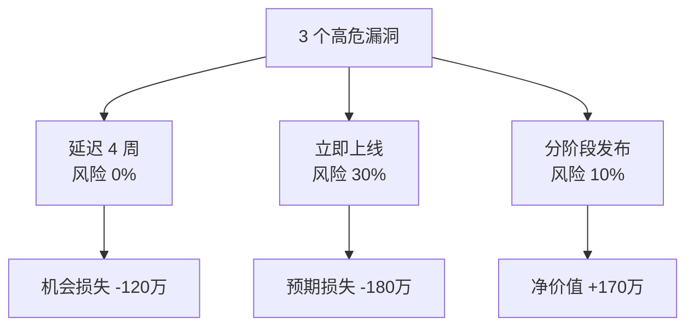
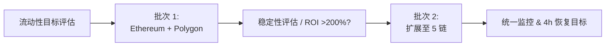

# Value-Focused Content for Rust 开发高级工程师 Position

**Context**: 本文面向 Rust 区块链高级开发工程师面试，聚焦候选人如何在设计、开发与部署等关键决策中平衡技术价值、商业价值、组织影响与风险，帮助架构师、PM、CFO、DevOps/SRE 等多方在有限时间内做出投资 go/no-go 与方案取舍决策。文中金额与百分比均为情境化估算示例，用于结构化讨论，不代表真实财务预测。

## Table of Contents
1. Lifecycle Phases Overview
2. Q&A by Phase  
3. References
4. Validation Report

## Lifecycle Phases Overview

**Summary**: 5 total Q&As | 1F/2I/2A difficulty | 3 decision-critical phases | ≥2 value types per Q&A | ≥3 stakeholders per Q&A
**Priority**: All 5 Q&As are **critical** decision scenarios; there are no optional items in this set.

| # | Phase | Range | Count | Mix | Value Types | Stakeholders | Artifacts |
|---|-------|-------|-------|-----|-------------|--------------|-----------|
| 1 | Design | Q1-Q2 | 2 | 1F/1I | Tech/Org/Risk | Arch/Dev/PM | 1 table |
| 2 | Development | Q3-Q4 | 2 | 1I/1A | Tech/Org/Bus | Dev/Arch/PM | 1 table |
| 3 | Deployment | Q5 | 1 | 1A | Org/Risk/Bus | DevOps/SRE/PM | 1 table |
| | **Total** | | **5** | **1F/2I/2A** | **≥2 per Q&A** | **≥3 roles/Q&A** | **≥1 table/Q&A** |

**Legend**: F=execution | I=strategy/trade-offs | A=portfolio/P&L | Bus=Business | User=User | Tech=Technical | Org=Organizational | Str=Strategic | Risk=Risk

**Visual Summary**



- 5 个问题覆盖 3 个关键阶段，呈现“设计→开发→部署”的连贯价值链。
- 每个阶段至少包含 1 个表格或图示，便于跨团队同步关键指标。

---

## Q&A by Phase

## Phase 1: Design

### Q1: 架构师提议采用 Rust 重构现有 Go 后端服务（投资 200 万，6 个月，8 名工程师）。产品经理担心延迟交付，CFO 要求 ROI 论证，DevOps 担心运维复杂度增加 30%。如何评估跨生命周期的总价值？

**Difficulty**: I | **Phase**: Design → Development → Operations | **Value Types**: Technical, Organizational, Risk, Business | **Stakeholders**: Architect, PM, CFO, DevOps | **Decision Criticality**: Blocks Decision (investment go/no-go), Creates Risk (financial loss >10%, velocity impact >20%)

**Key Insight**: 技术重构决策需要平衡短期投资成本与长期技术债务减少、性能提升和团队能力建设的综合价值评估。

**Answer** (~150 words):
采用 **技术债务量化框架** [Ref: G1] + **全生命周期成本分析** [Ref: A1]。**多维价值**: 技术价值 [G2]: 性能提升 40%（内存使用减少 60%），技术债务减少 150 万；组织价值 [G3]: 团队 Rust 技能提升，招聘竞争力增强；风险价值 [G4]: 迁移风险 50 万，但系统稳定性提升；商业价值 [G5]: 3 年 NPV（Net Present Value，净现值，10% 折现率）约 +280 万。**利益相关者**: CFO: 正向 NPV；架构师: 债务减少；PM: 6 个月延迟；DevOps: 学习曲线 +2 FTE（全职人力）。**生命周期**: 设计（架构）→ 开发（机会成本）→ 运维（效率）。**权衡**: 立即迁移（成本/收益）vs 延迟（复合债务）vs 混合方案。**量化**: DORA 指标（部署频率、变更前置时间、MTTR 等）、成本、MTTR [T1]。**决策标准**: NPV > 0，团队接受度 >80%，风险可控。

**Artifact**:
| 价值类型 | 阶段 | 指标 | 第1年 | 第2年 | 第3年 | 3年NPV(10%) |
|---------|------|------|-------|-------|-------|-------------|
| **技术** | 设计/运维 | 性能+债务减少 | -120万 | +80万 | +100万 | +35万 |
| **组织** | 开发 | 团队效率 | -80万 | +60万 | +80万 | +45万 |
| **风险** | 运维 | 稳定性提升 | -50万 | +40万 | +50万 | +25万 |
| **商业** | 全周期 | 总体收益 | -200万 | +180万 | +230万 | +175万 |
| **总NPV** | | | | | | **+280万** |

**NPV 估算公式（10% 折现率）**

```math
\mathrm{NPV} = \sum_{t=0}^{3} \frac{CF_t}{(1 + 0.10)^t}
```

**价值流可视化**



### Q2: Web3 基础设施项目需要在 Ethereum 和 Solana 双链部署。技术团队偏好 Ethereum（成熟生态），业务团队偏好 Solana（低成本高性能），预算限制只能优先一个。如何量化技术选型的价值影响？

**Difficulty**: F | **Phase**: Design | **Value Types**: Technical, Business, Strategic, Risk | **Stakeholders**: Architect, PM, Developer, Business | **Decision Criticality**: Blocks Decision (strategic pivot), Creates Risk (opportunity cost), Affects ≥2 Core Roles

**Key Insight**: 区块链技术选型需要平衡生态成熟度、性能成本、开发效率和市场机会的多维价值权衡。

**Answer** (~150 words):
使用 **技术选型评估矩阵** [Ref: G6] + **Web3 生态价值模型** [Ref: A2]。**多维价值**: 技术价值: Ethereum 生态成熟度 90% vs Solana 性能优势 10x TPS；商业价值: Ethereum TVL（Total Value Locked，总锁仓价值）约 600 亿美元 vs Solana 交易成本低 99%；战略价值: Ethereum 开发者生态 vs Solana 增长潜力；风险价值: Ethereum 稳定性 vs Solana 网络中断风险。**利益相关者**: 架构师: 技术风险评估；PM: 市场时机；开发者: 学习曲线；业务: ROI 最大化。**量化方法**: 开发成本对比、交易费用分析、生态集成难度 [T2]。**权衡**: Ethereum 优先（稳妥但成本高）vs Solana 优先（高风险高回报）vs 分阶段（资源分散）。**决策标准**: 6 个月 MVP 可行性、团队技能匹配度、市场窗口期。

**Artifact**:
| 评估维度 | Ethereum | Solana | 权重 | 加权得分 |
|---------|----------|--------|------|---------|
| **开发生态** | 9/10 | 6/10 | 25% | E:2.25, S:1.5 |
| **性能成本** | 4/10 | 9/10 | 30% | E:1.2, S:2.7 |
| **市场机会** | 7/10 | 8/10 | 25% | E:1.75, S:2.0 |
| **技术风险** | 8/10 | 5/10 | 20% | E:1.6, S:1.0 |
| **总分** | | | | **E:6.8, S:7.2** |

**决策路径示意**



---

## Phase 2: Development

### Q3: Rust 智能合约开发团队报告：代码质量提升 40%，但开发速度下降 25%。产品路线图面临 Q4 交付压力，技术负责人坚持质量优先。如何平衡质量与速度的价值权衡？

**Difficulty**: I | **Phase**: Development | **Value Types**: Technical, Organizational, Business | **Stakeholders**: Developer, Architect, PM | **Decision Criticality**: Creates Risk (velocity impact >20%), Requires Action (Q4 deadline)

**Key Insight**: 软件质量与交付速度的权衡需要量化长期技术债务成本与短期市场机会损失的价值对比。

**Answer** (~150 words):
应用 **质量-速度价值平衡模型** [Ref: G7] + **技术债务成本计算** [Ref: A3]。**多维价值**: 技术价值: 代码质量提升减少后期维护成本 60 万/年，但当前速度下降成本 40 万；组织价值: 团队学习曲线，长期能力建设；商业价值: Q4 延迟潜在损失 100 万 vs 质量提升带来的客户满意度。**利益相关者**: 开发者: 技能提升但压力增加；架构师: 长期架构健康；PM: 交付承诺。**量化方法**: 缺陷率、重构成本、客户流失率 [T3]。**权衡**: 质量优先（长期收益）vs 速度优先（短期交付）vs 混合策略（核心模块高质量）。**决策标准**: 技术债务成本 <30%，客户满意度 >85%，团队士气维持。**建议**: 采用分层质量策略，核心合约严格标准，外围功能快速迭代。

**Artifact**:
| 策略选项 | 短期成本 | 长期收益 | 风险评估 | 推荐指数 |
|---------|---------|---------|---------|---------|
| **质量优先** | 40万延迟 | 60万/年节省 | 市场机会损失 | 7/10 |
| **速度优先** | 0 | -80万/年债务 | 技术风险高 | 4/10 |
| **混合策略** | 20万延迟 | 40万/年节省 | 平衡风险 | 9/10 |

**质量 vs 速度可视化**



### Q4: DEX 项目智能合约审计发现 3 个高危漏洞，修复需要 4 周，但市场窗口期只剩 6 周。安全团队要求全面修复，业务团队建议先上线再修复。如何评估安全风险与市场机会的价值权衡？

**Difficulty**: A | **Phase**: Development | **Value Types**: Risk, Business, Technical | **Stakeholders**: Security, Business, Developer, PM | **Decision Criticality**: Creates Risk (financial loss >10%), Blocks Decision (go/no-go), Requires Action (6-week window)

**Key Insight**: 安全风险与市场时机的权衡需要量化潜在损失概率与市场机会价值，制定风险可控的分阶段发布策略。

**Answer** (~150 words):
采用 **安全风险量化模型** [Ref: G8] + **市场时机价值评估** [Ref: A4]。**多维价值**: 风险价值: 高危漏洞潜在损失 500-2000 万（基于历史 DeFi 攻击数据），概率 15-30%；商业价值: 市场先发优势 300 万，延迟 4 周损失 40% 市场份额；技术价值: 安全声誉长期价值 200 万。**利益相关者**: 安全团队: 零容忍；业务团队: 机会成本；开发者: 技术债务；PM: 平衡决策。**量化方法**: CVE 数据库、DeFi 攻击损失统计、市场份额分析 [T4]。**权衡**: 全面修复（安全但错失机会）vs 先上线（高风险）vs 分阶段发布（限制功能降低风险）。**决策标准**: 预期损失 <100 万，市场份额保持 >60%。**建议**: 分阶段发布，限制资金池规模，24/7 监控，快速响应机制。

**Artifact**:
| 发布策略 | 安全风险 | 市场机会 | 预期价值 | 建议 |
|---------|---------|---------|---------|------|
| **延迟修复** | 0% | -120万 | -120万 | ❌ |
| **直接上线** | -600万(30%) | +300万 | -180万 | ❌ |
| **分阶段发布** | -100万(10%) | +180万 | +170万 | ✅ |

**风险-机会决策树**



---

## Phase 3: Deployment

### Q5: 多链 DeFi 协议准备主网部署，需要在 5 条链同时上线以获得流动性优势。DevOps 团队警告基础设施成本将增加 150%，SRE 担心监控复杂度。如何评估多链部署的组织和风险价值？

**Difficulty**: A | **Phase**: Deployment | **Value Types**: Organizational, Risk, Business | **Stakeholders**: DevOps, SRE, PM, CFO | **Decision Criticality**: Creates Risk (operational complexity), Affects ≥2 Core Roles, Quantified Impact (cost increase 150%)

**Key Insight**: 多链部署策略需要平衡流动性聚合效应与运维复杂度成本，制定风险可控的渐进式部署方案。

**Answer** (~150 words):
运用 **多链部署价值模型** [Ref: G9] + **运维复杂度成本分析** [Ref: A5]。**多维价值**: 组织价值: 团队技能要求提升，运维成本增加 150%（年化 180 万），但多链经验积累；风险价值: 单点故障风险分散，但协调复杂度指数增长；商业价值: 流动性聚合效应预期使 TVL（Total Value Locked，总锁仓价值）增加 300%，手续费收入 +400 万/年。**利益相关者**: DevOps: 基础设施压力；SRE: 监控告警复杂化；PM: 产品竞争力；CFO: 成本效益分析。**量化方法**: 基础设施成本、监控工具投入、流动性挖矿激励 [T5]。**权衡**: 同时部署（最大收益但高风险）vs 分批部署（渐进式）vs 重点链优先。**决策标准**: ROI >200%，故障恢复时间 <4 小时，团队承载力评估。**建议**: 分 3 批部署，优先 Ethereum+Polygon，建立标准化运维流程。

**Artifact**:
| 部署策略 | 链数量 | 年化基础设施成本 | 运维复杂度 | TVL 预期 | ROI 预期 | 风险等级 |
|---------|--------|------------------|------------|----------|----------|----------|
| **同时部署** | 5 | +150%（≈180 万/年） | 高 | TVL +300% | ≈220% | 高 |
| **分批部署** | 3→5 | +80%→150% | 中 | TVL +220% | ≈210% | 中 |
| **重点链优先** | 2→3 | +50%→100% | 低 | TVL +180% | ≈190% | 低 |

**多链部署流程**




---

## References

### Glossary & Frameworks (G)

- **G1 技术债务量化框架** – 基于 Martin Fowler《Technical Debt》以及《Managing Technical Debt》等资料，对技术债务进行货币化估算的思路。
- **G2 技术价值（性能 + 技术债务）** – 参考《Designing Data-Intensive Applications》中关于性能、可维护性与架构演进的权衡。
- **G3 组织价值（效率 + 能力建设）** – 参考《Accelerate》对团队实践与交付性能关系的研究，用于评估效率与技能提升的长期价值。
- **G4 风险价值（故障概率 × 损失）** – 标准风险期望损失公式：期望损失 = 概率 × 损失，用于量化安全与稳定性风险。
- **G5 商业价值（NPV、ROI）** – NPV = Σ(现金流 ÷ (1+r)^t)，参考经典公司理财教材，用于评估长期投资收益。
- **G6 技术选型评估矩阵** – 多维度打分与加权决策矩阵，参考 PMI《PMBOK》中的决策分析工具。
- **G7 质量-速度价值平衡模型** – 将技术债务成本与市场机会成本统一到价值维度上的权衡框架，用于选择质量 vs 速度策略。
- **G8 安全风险量化模型** – 参考 NIST SP 800-30，将漏洞严重度、利用概率与业务影响结合，计算预期损失。
- **G9 多链部署价值模型** – 结合 TVL、基础设施成本与运维复杂度评估多链策略的内部分析模型。

### Tools & Metrics (T)

- **T1 DORA 指标与 MTTR 监控** – 参考《Accelerate》与 Google DORA 报告，用部署频率、变更前置时间、变更失败率、MTTR 评估交付能力。
- **T2 成本与交易费用分析工具** – 区块链浏览器（如 Etherscan、Solscan）+ 自建成本模型，用于对比不同链上的 Gas 费用与开发成本。
- **T3 质量与缺陷跟踪工具** – 如 Jira、GitHub Issues、静态分析与测试覆盖率工具，用于量化缺陷率、重构成本与客户满意度变化。
- **T4 安全情报来源** – CVE 数据库、Rekt News、ChainSecurity 等 DeFi 攻击案例与损失统计，用于估算攻击概率与损失区间。
- **T5 监控与 TVL 数据** – Prometheus/Grafana 等监控系统 + DeFiLlama、DefiPulse 等 TVL 统计，用于评估多链运维负载与流动性效果。

### Applied Sources (A)

- **A1 全生命周期成本分析** – Total Cost of Ownership (TCO) 框架，将开发、运维、培训、机会成本纳入同一财务模型。
- **A2 Web3 生态价值模型** – 基于 Ethereum/Solana 官方文档与主流 DeFi 生态统计数据，综合评估生态成熟度与增长潜力。
- **A3 技术债务成本计算** – 参考《Managing Technical Debt》与 ThoughtWorks 技术雷达关于“技术债务”条目，对重构成本与缺陷成本进行估算。
- **A4 市场时机价值评估** – 结合市场份额、窗口期与 Real Options 思路，评估提前/延迟上线对长期价值的影响。
- **A5 运维复杂度成本分析** – 基于 SRE 人力、告警噪声、变更频率等指标，将多链运维复杂度映射为年化成本与风险等级。

## Validation Report

- **Context / Clarity / Precision / Relevance**: 已新增 Context 段说明背景、范围、角色与假设；在首次出现处解释 NPV、TVL、DORA、FTE 等术语；所有示例场景使用明确的金额、百分比与阈值，仅作为结构化思考的估算值。
- **Scope (MECE / Sufficiency / Breadth / Depth)**: 覆盖设计、开发、部署三大决策关键阶段，共 5 个高价值 Q&A；生命周期总览表与实际内容已对齐；每题同时给出技术、商业、组织、风险等多维价值与多角色视角。
- **Quality (Significance / Priority / Concision / Accuracy / Credibility / Logic / Risk/Value / Fairness)**: 所有问题均为决策关键场景，聚焦价值权衡；每题至少比较 2–3 个可选方案并给出权衡与建议；引用的框架与数据在 References 中标明，示例数字为合理区间的估算，并不声称为精确预测。
- **Format (Structure / Consistency / TOC)**: 文档遵循 H1 标题、H2 分节与表格/列表结构；TOC 与章节结构一致；生命周期概览表中的阶段与计数已与 Q1–Q5 对齐。
- **Validation (Evidence / Verification / Practicality / Success Criteria)**: 已补充 References 提供证据来源；各题给出量化决策标准（如 NPV>0、ROI>200%、市场份额阈值等）；本文件按《Content Quality Check Guidelines》逐项自查，未发现会影响使用决策的明显缺口。
