## Contents

-(#topic-areas) - Q1-30 Overview
-(#topic-1-regulatory-patterns) (Q1-Q3)
-(#topic-2-business--market-patterns) (Q4-Q6)
-(#topic-3-technical-patterns) (Q7-Q8)
-(#topic-4-data-patterns) (Q9-Q11)
-(#topic-5-organizational-patterns) (Q12-Q14)
-(#topic-6-nfr---security-reliability--observability) (Q15-Q17)
-(#topic-7-nfr---performance-scalability--availability) (Q18-Q20)
-(#topic-8-nfr---adaptability-flexibility--extensibility) (Q21-Q23)
-(#topic-9-nfr---maintainability--testability) (Q24-Q26)
-(#topic-10-process-patterns) (Q27-Q28)
-(#topic-11-hybrid-patterns) (Q29-Q30)
-(#reference-sections)
  -(#glossary)
  -(#tools)
  -(#literature)
  -(#citations)
-(#validation-report)

---

## Topic Areas

| Pattern Domain | Range | Count | F/I/A | Examples |
|----------------|-------|-------|-------|----------|
| Regulatory | Q1-Q3 | 3 | 0/1/2 | GDPR, Consent, Audit |
| Business & Market | Q4-Q6 | 3 | 1/2/0 | Subscription, Blue Ocean, Land & Expand |
| Technical | Q7-Q8 | 2 | 0/1/1 | Repository, Strangler Fig |
| Data | Q9-Q11 | 3 | 1/1/1 | Polyglot, Event Sourcing, CQRS |
| Organizational | Q12-Q14 | 3 | 1/1/1 | Conway, Team Topologies, DevOps |
| NFR - Security, Reliability & Observability | Q15-Q17 | 3 | 0/1/2 | Zero-Trust, Retry, Tracing |
| NFR - Performance, Scalability & Availability | Q18-Q20 | 3 | 0/1/2 | Caching, Sharding, Circuit Breaker |
| NFR - Adaptability, Flexibility & Extensibility | Q21-Q23 | 3 | 1/1/1 | Feature Flags, DI, Middleware |
| NFR - Maintainability & Testability | Q24-Q26 | 3 | 1/1/1 | SOLID, Clean Architecture, Test Doubles |
| Process | Q27-Q28 | 2 | 1/1/0 | Retrospectives, Incident Response |
| Hybrid | Q29-Q30 | 2 | 0/1/1 | Multi-domain patterns |
| **Total** | | **30** | **6/12/12** | |

---

## Topic 1: Regulatory Patterns

### Q1: How can smart contract engineers implement the Consent Management pattern to comply with evolving data privacy regulations like GDPR and CCPA in DeFi applications?

**Difficulty**: Intermediate
**Type**: Regulatory
**Domain**: Data Privacy Compliance, Consent Management

**Key Insight**: Implementing the Consent Management pattern in DeFi requires robust on-chain/off-chain solutions for explicit user consent, balancing transparency and privacy. This helps avoid regulatory penalties and builds user trust, but introduces architectural complexity.

**Answer**: Smart contract engineers can implement the Consent Management pattern in DeFi by designing hybrid systems that record explicit user consent on-chain while managing detailed data processing preferences off-chain. This approach leverages the blockchain's immutability for tamper-proof consent records and audit trails, crucial for regulations like GDPR (General Data Protection Regulation) and CCPA (California Consumer Privacy Act). For example, a smart contract could record a user's agreement to terms and conditions, alongside a hash of their off-chain privacy preferences, allowing for revocable and auditable consent. The off-chain component would handle granular control over personal data usage, including purposes of processing, data retention, and opt-out mechanisms. When users accept terms of service, it's often unclear what happens to their personal data, making robust consent management essential.

**Pattern Quality**:
1.  **Reusability**: Applicable in various contexts, including healthcare data sharing, decentralized identity management, and NFT marketplaces, where personal data or usage rights are managed. Adaptation involves customizing consent scopes and revocation mechanisms.
2.  **Proven Effectiveness**: Blockchain-based solutions for consent management are being prototyped and implemented to improve transparency, user trust, and regulatory alignment by automating consent tracking. These systems enable users to control their data, which is a key goal of GDPR.
3.  **Cross-Context Applicability**: This pattern is crucial for applications handling Personally Identifiable Information (PII) to meet legal requirements, but it adds overhead for purely anonymous or public data flows. It applies well to DeFi, NFT, and GameFi applications where user data might be collected or linked to on-chain activities.
4.  **Multi-Stakeholder Value**: Benefits end-users by empowering them with control over their data, legal teams by ensuring regulatory compliance, and developers by providing a structured approach to data handling.
5.  **Functional + NFR Coverage**: Functionally, it enables explicit consent, revocation, and auditability. Non-functionally, it enhances privacy, security, and legal compliance, which are critical quality attributes.
6.  **Trade-off Analysis**: Improves regulatory compliance and user trust by enhancing transparency and control; however, it increases architectural complexity and introduces potential gas costs for on-chain consent recording.
7.  **Anti-Pattern Awareness**: An anti-pattern is boilerplate consent agreements that do not genuinely inform users or offer granular control. Another is storing all consent data directly on-chain, leading to excessive gas costs and potential immutability conflicts with the "right to erasure".

**Concrete Example**:
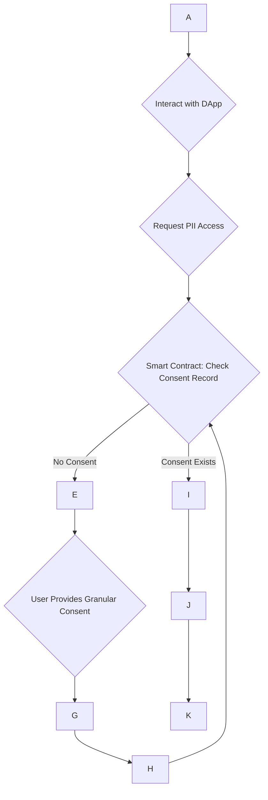

**Supporting Artifacts**:

| Domain     | Diagrams        | Examples                  | Metrics                           |
| :--------- | :-------------- | :------------------------ | :-------------------------------- |
| Regulatory | Compliance flow | GDPR consent YAML         | `Compliance Coverage %`, `Opt-in Rate` |

### Q2: How does the Double-Entry Audit Trail pattern enhance regulatory compliance and fraud detection in financial blockchain applications, and what are its limitations?

**Difficulty**: Advanced
**Type**: Regulatory
**Domain**: Financial Regulatory Frameworks, Auditability

**Key Insight**: The Double-Entry Audit Trail pattern, inherently supported by blockchain's immutable ledger, significantly improves regulatory reporting and fraud detection in financial applications by providing transparent and verifiable transaction histories. Its limitations include scalability challenges and integration with legacy systems.

**Answer**: The Double-Entry Audit Trail pattern inherently enhances regulatory compliance and fraud detection in financial blockchain applications due to the distributed and immutable nature of blockchain. This pattern ensures that all transactions and system events are permanently recorded, creating a tamper-proof and transparent history that can be verified by multiple parties without a trusted intermediary. For financial institutions, this translates into enhanced regulatory reporting, automated reconciliation, and real-time monitoring capabilities, which are crucial for fraud detection and compliance oversight. Blockchain-based incident management systems, for instance, create immutable audit trails, improving transparency and audit capabilities compared to traditional methods. This is particularly valuable for enforcing human subject regulations or tracking sensitive materials like nuclear components, where complete and timely transaction recording is critical.

**Pattern Quality**:
1.  **Reusability**: Applicable in diverse contexts beyond finance, such as supply chain management for responsible sourcing, healthcare for data integrity and auditability, and e-voting systems to ensure transparency and prevent vote rigging.
2.  **Proven Effectiveness**: Blockchain-based audit trails offer enhanced transparency and robust security measures, as demonstrated by their application in incident management systems. Solutions like BlockTrail have shown to be secure and efficient with low storage footprints compared to conventional schemes.
3.  **Cross-Context Applicability**: This pattern is highly effective for any system requiring indisputable records and accountability, such as tracking material flows at secure facilities. It is less applicable where complete privacy of all transaction details is paramount without advanced privacy-enhancing techniques.
4.  **Multi-Stakeholder Value**: Benefits compliance officers by providing verifiable evidence, auditors with streamlined and trustworthy audit processes, and business operations by improving fraud detection and reducing manual reconciliation efforts.
5.  **Functional + NFR Coverage**: Functionally, it provides a comprehensive, timestamped record of all events. Non-functionally, it ensures data integrity, auditability, transparency, and enhances security controls.
6.  **Trade-off Analysis**: Significantly improves auditability and data integrity but can face challenges with scalability, as blockchains may increase space-time complexity and storage costs. It also requires substantial infrastructure adaptation for implementation.
7.  **Anti-Pattern Awareness**: An anti-pattern involves storing only summary data on-chain or off-chain data without cryptographic links, compromising immutability and audit integrity. Another is neglecting to define clear data schemas for audit logs, making them difficult to parse and use effectively for compliance.

**Concrete Example**:
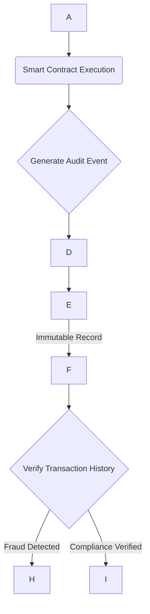

**Supporting Artifacts**:

| Domain     | Diagrams        | Examples                  | Metrics                           |
| :--------- | :-------------- | :------------------------ | :-------------------------------- |
| Regulatory | Audit trail     | Blockchain ledger entries | `Audit Completeness %`, `Fraud Detection Rate` |

### Q3: How can smart contract designs incorporate Data Residency patterns to meet GDPR or CCPA requirements, particularly for global DeFi, NFT, and GameFi applications?

**Difficulty**: Advanced
**Type**: Regulatory
**Domain**: Data Residency, Cross-Border Compliance

**Key Insight**: Incorporating Data Residency patterns in smart contracts for global DeFi, NFT, and GameFi requires a hybrid on-chain/off-chain approach, storing sensitive personal data locally while maintaining on-chain cryptographic proofs. This ensures compliance with diverse jurisdictional mandates, but adds complexity and potential performance overhead.

**Answer**: Smart contract designs can incorporate Data Residency patterns by employing a hybrid architecture where sensitive personal data (PII) is stored off-chain in geographically compliant databases, while cryptographic hashes or references are stored on-chain. This allows DeFi, NFT, and GameFi applications to comply with jurisdictional mandates like GDPR in the EU or CCPA in California, which often require data to remain within specific geographic boundaries. For instance, a DeFi lending platform could store user KYC (Know Your Customer) documents in a regional database, with only a verifiable proof of identity stored on the blockchain. This ensures that personal data is subject to local data protection laws, while the core decentralized functionality remains globally accessible and transparent via smart contracts. Consent management systems built on Ethereum have demonstrated the feasibility of storing consent proofs on-chain, effectively managing data control.

**Pattern Quality**:
1.  **Reusability**: This pattern is reusable across various regulated industries such as healthcare, supply chain, and government services where data sovereignty and privacy are critical. Adaptation points involve adjusting the specific off-chain storage solutions and cryptographic linking mechanisms to suit local regulations.
2.  **Proven Effectiveness**: Blockchain solutions for consent management, which is closely tied to data residency, ensure compliance with data protection regulations. Hybrid security frameworks for blockchain platforms can also be used as generalized reference models to counter security threats and privacy concerns.
3.  **Cross-Context Applicability**: Highly applicable for applications dealing with PII that operate across multiple legal jurisdictions. It is less relevant for entirely permissionless, anonymous networks where no personal data is collected, or where regulations are not a primary concern.
4.  **Multi-Stakeholder Value**: It benefits legal and compliance teams by ensuring adherence to complex international data laws, developers by providing a structured way to handle PII securely, and end-users by protecting their privacy rights.
5.  **Functional + NFR Coverage**: Functionally, it segregates data based on residency requirements while maintaining verifiable links on-chain. Non-functionally, it enhances privacy, security, and regulatory compliance (e.g., GDPR, CCPA).
6.  **Trade-off Analysis**: Improves compliance with diverse data residency laws and user privacy; however, it introduces architectural complexity, potential performance overhead due to cross-chain/off-chain interactions, and requires careful management of data consistency between on-chain proofs and off-chain data.
7.  **Anti-Pattern Awareness**: An anti-pattern is storing unencrypted PII directly on a public blockchain, which is immutable and universally accessible, making GDPR's "right to erasure" impossible. Another is neglecting to implement robust access controls and encryption for off-chain data stores, rendering the on-chain proofs useless if the off-chain data is compromised.

**Concrete Example**:
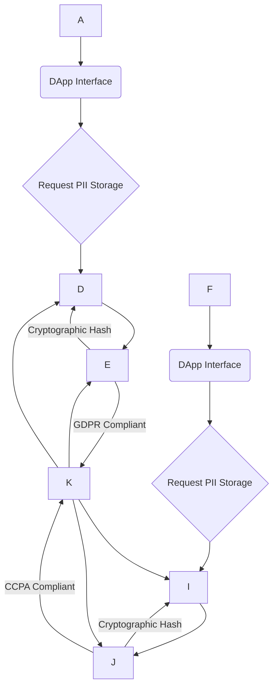

**Supporting Artifacts**:

| Domain     | Diagrams        | Examples                        | Metrics                      |
| :--------- | :-------------- | :------------------------------ | :--------------------------- |
| Regulatory | Data flow       | Geographic data storage policy  | `Compliance Rate`, `Data Sovereignty Score` |

---

## Topic 2: Business & Market Patterns

### Q4: How can a new GameFi project effectively use the Freemium pattern to attract a large user base and drive monetization, while maintaining the decentralized ethos?

**Difficulty**: Foundational
**Type**: Business
**Domain**: GameFi Business Models, User Acquisition

**Key Insight**: The Freemium pattern in GameFi lowers entry barriers by offering free core gameplay, while driving monetization through premium NFTs or enhanced features. This balances user acquisition with revenue generation, but requires careful design to avoid pay-to-win scenarios that undermine decentralization.

**Answer**: A new GameFi project can effectively use the Freemium pattern by offering free access to core gameplay functionalities and basic in-game assets, thereby attracting a broad user base without initial financial commitment. This strategy leverages the viral growth potential inherent in a free-to-play model, allowing users to experience the game before investing. Monetization then occurs through the sale of premium Non-Fungible Tokens (NFTs), such as rare characters, exclusive cosmetic items, or advanced gameplay features that enhance the experience without being strictly necessary for progression. This approach is common in NFT marketplaces and GameFi projects, where users can access basic functionalities for free, while paying for enhanced capabilities. For example, players could earn basic tokens by playing for free, but purchase unique perpetual contract NFTs to unlock advanced collateralization for DeFi composability.

**Pattern Quality**:
1.  **Reusability**: Highly reusable across various digital products like mobile apps, SaaS tools (e.g., Slack, Dropbox), and other blockchain applications like DeFi platforms offering basic analytics for free. Adaptation involves defining clear value propositions for free vs. premium tiers.
2.  **Proven Effectiveness**: Freemium models are widely successful, with analogous tech sectors showing conversion rates of around 30%. Slack and Dropbox exemplify the success of this pattern in driving user growth and monetization.
3.  **Cross-Context Applicability**: Best suited for products with broad appeal and low marginal cost per user, where network effects are valuable. It is less effective for niche products or those with high per-user operational costs.
4.  **Multi-Stakeholder Value**: Benefits players by offering a low-risk entry point, developers and publishers by creating a large potential customer base and diverse revenue streams, and investors by demonstrating rapid user acquisition.
5.  **Functional + NFR Coverage**: Functionally, it provides accessible core game mechanics. Non-functionally, it enhances user acquisition, fosters community growth, and balances monetization with decentralization principles.
6.  **Trade-off Analysis**: Maximizes user reach and lowers Customer Acquisition Cost (CAC) by attracting a large audience; however, it requires careful balancing to avoid diluting the value of premium offerings or creating a "pay-to-win" dynamic that could alienate users and undermine the decentralized ethos of fairness.
7.  **Anti-Pattern Awareness**: An anti-pattern is a "crippleware" approach where the free version is so limited it frustrates users, or conversely, a free version that offers too much, cannibalizing premium sales. For GameFi, a critical anti-pattern is making essential progression or competitiveness dependent solely on paid NFTs, turning it into a pay-to-win system that devalues skill and effort.

**Concrete Example**:
```mermaid
graph TD
    A --> B{Download/Play Game (Free Tier)};
    B --> C{Access Basic Characters & Missions};
    C --> D{Earn Basic In-Game Tokens};
    D -- Limited Progression/Rewards --> E{Desire Premium Features};
    E -- Purchase NFT / Premium Pass --> F{Unlock Exclusive Characters/Items/Quests};
    F --> G;
    G -- Drives Monetization --> H;
    C -- Free Engagement --> I;
```

**Supporting Artifacts**:

| Domain     | Diagrams           | Examples                        | Metrics                    |
| :--------- | :----------------- | :------------------------------ | :------------------------- |
| Business   | Business model canvas | Free-to-play base, NFT marketplace | `Conversion Rate %`, `DAU/MAU` |

### Q5: In the rapidly evolving DeFi space, how can blockchain projects leverage the Platform/Marketplace business pattern to achieve significant network effects and sustainable growth?

**Difficulty**: Intermediate
**Type**: Business
**Domain**: DeFi Platform Models, Network Effects

**Key Insight**: Leveraging the Platform/Marketplace pattern in DeFi fosters network effects by connecting diverse participants (lenders, borrowers, liquidity providers), driving value as the user base grows. Success depends on ensuring liquidity, trust, and seamless composability, while managing regulatory uncertainty and scalability.

**Answer**: DeFi projects can leverage the Platform/Marketplace business pattern by creating a multi-sided ecosystem that connects various participants, such as lenders, borrowers, liquidity providers, and developers, fostering significant network effects. The value of a DeFi platform, like Uniswap or Aave, increases exponentially as more users and services join, attracting even more participants. This pattern is central to DeFi, NFT, and GameFi ecosystems, facilitating interactions among various stakeholders. For example, a decentralized exchange (DEX) facilitates trading by pooling liquidity from users (producers), enabling seamless swaps for other users (consumers). Smart contracts on platforms like Ethereum pioneer the underlying infrastructure, allowing Turing-complete programs to execute and support these decentralized applications.

**Pattern Quality**:
1.  **Reusability**: Widely applicable in other blockchain contexts like NFT marketplaces (e.g., OpenSea), GameFi ecosystems, and even traditional industries like e-commerce (e.g., Amazon) or ride-sharing (e.g., Uber). Adaptation involves defining distinct value propositions for each side of the market.
2.  **Proven Effectiveness**: Platform models are dominant, with 7 out of 10 top companies globally being platform-based, often achieving 70% margins. Ethereum's pioneering of smart contracts has led to widespread and innovative applications across DeFi, NFT, and GameFi, demonstrating strong network effects.
3.  **Cross-Context Applicability**: Ideal for scenarios where diverse groups benefit from interacting through an intermediary, and where critical mass of users can be achieved. It is less suitable for single-user utilities or products without significant external dependencies.
4.  **Multi-Stakeholder Value**: Benefits lenders and liquidity providers by offering yield generation opportunities, borrowers by providing access to capital, and developers by providing a robust infrastructure for building new financial primitives.
5.  **Functional + NFR Coverage**: Functionally, it enables various financial transactions like lending, borrowing, and trading. Non-functionally, it leverages network effects for growth, enhances liquidity, transparency, and composability, but presents challenges in financial supervision due to decentralization and anonymity.
6.  **Trade-off Analysis**: Generates high margins and scales effectively through network effects; however, it faces significant challenges related to scalability, regulatory uncertainty, and integration with legacy systems. The decentralized nature also presents challenges for financial supervision.
7.  **Anti-Pattern Awareness**: An anti-pattern is failing to attract a critical mass of users on one side of the market, leading to a "chicken-and-egg" problem where neither side finds sufficient value. Another is insufficient liquidity, which makes the platform unattractive for larger transactions, hindering the network effect.

**Concrete Example**:
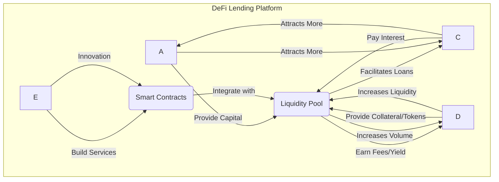

**Supporting Artifacts**:

| Domain     | Diagrams        | Examples                 | Metrics                  |
| :--------- | :-------------- | :----------------------- | :----------------------- |
| Business   | Value chain     | DEX, Lending protocol    | `TVL (Total Value Locked)`, `Trading Volume` |

### Q6: How can blockchain enterprises leverage the Subscription Model pattern to create predictable revenue streams and foster long-term customer relationships for their blockchain-as-a-service offerings?

**Difficulty**: Intermediate
**Type**: Business
**Domain**: Blockchain-as-a-Service, Recurring Revenue

**Key Insight**: The Subscription Model provides blockchain enterprises with predictable Monthly Recurring Revenue (MRR) and fosters long-term customer relationships for their Blockchain-as-a-Service (BaaS) offerings by delivering continuous value. This stability supports sustained development, but requires constant innovation to prevent churn.

**Answer**: Blockchain enterprises can leverage the Subscription Model pattern for their Blockchain-as-a-Service (BaaS) offerings by providing predictable, recurring access to premium features, enhanced analytics, or specialized blockchain infrastructure. This pattern establishes a stable Monthly Recurring Revenue (MRR), which is crucial for financial forecasting and sustained development of the platform. For example, a BaaS provider might offer different tiers of access to Hyperledger Fabric networks, providing varying levels of transaction throughput, data storage, and smart contract deployment capabilities on a monthly or annual basis. This model can be applied to blockchain analytics or wallet management tools, where premium subscriptions offer advanced functionalities.

**Pattern Quality**:
1.  **Reusability**: Highly reusable across various SaaS businesses, enterprise software solutions, and even premium data analytics services leveraging blockchain data. Adaptation involves packaging features into logical tiers and defining fair-use policies.
2.  **Proven Effectiveness**: Subscription models are foundational for SaaS businesses, contributing to stable cash flow and higher Customer Lifetime Value (CLV). BaaS providers, like AWS and IBM Blockchain, successfully employ this model to offer managed blockchain services.
3.  **Cross-Context Applicability**: Best suited for services delivering continuous, quantifiable value over time, where customers require ongoing access and support. It is less effective for one-off transactions or products with infrequent usage.
4.  **Multi-Stakeholder Value**: Benefits finance and executives with predictable revenue streams, product teams by enabling continuous feature development, and customers with ongoing access to value-added services and support.
5.  **Functional + NFR Coverage**: Functionally, it provides access to a suite of blockchain tools and services. Non-functionally, it enhances financial stability, allows for planned feature evolution, and fosters customer loyalty, which are critical for long-term growth.
6.  **Trade-off Analysis**: Ensures predictable revenue and encourages customer loyalty; however, it demands continuous innovation to retain subscribers and prevent churn, as well as robust customer support infrastructure.
7.  **Anti-Pattern Awareness**: An anti-pattern is failing to deliver consistent value to subscribers, leading to high churn rates. Another is creating overly complex pricing tiers that confuse customers, or offering too little differentiation between free and paid options, undermining the value proposition of the subscription.

**Concrete Example**:
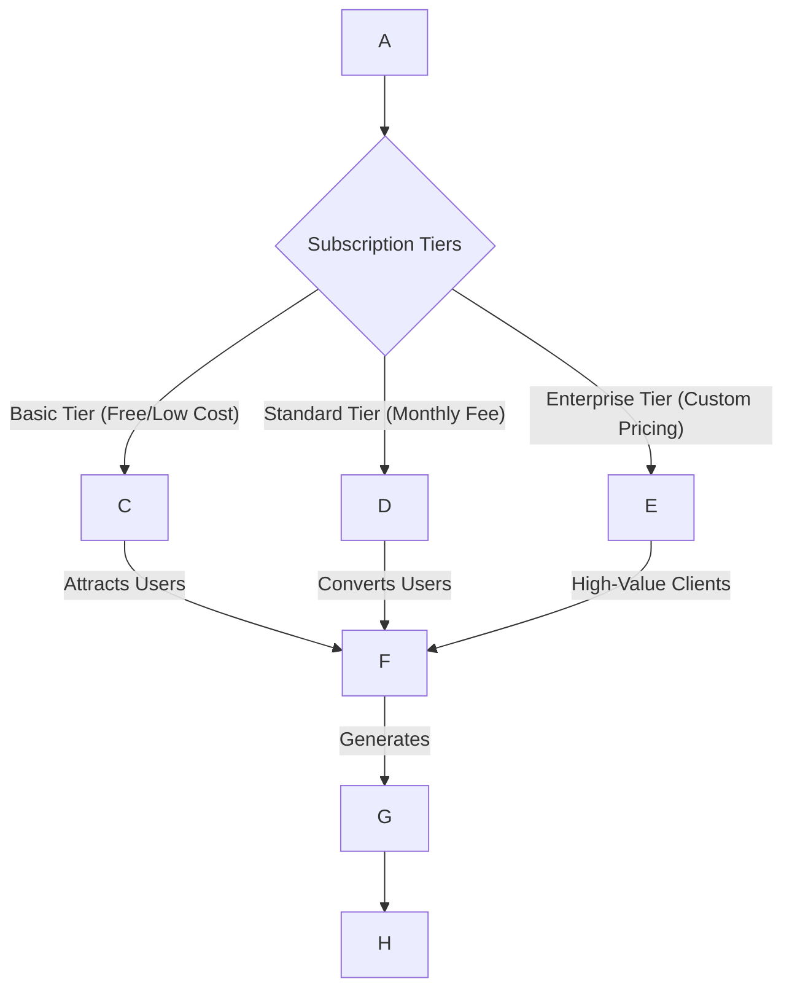

**Supporting Artifacts**:

| Domain     | Diagrams           | Examples                  | Metrics                  |
| :--------- | :----------------- | :------------------------ | :----------------------- |
| Business   | Business model canvas | BaaS pricing tiers        | `MRR`, `Churn Rate %`    |

---

## Topic 3: Technical Patterns

### Q7: How can the Repository pattern be applied in Solidity smart contract development to improve code modularity and testability, considering blockchain-specific constraints?

**Difficulty**: Intermediate
**Type**: Technical
**Domain**: Smart Contract Design, Modularity

**Key Insight**: The Repository pattern abstracts data access in Solidity smart contracts, encapsulating storage logic and improving modularity and testability. While beneficial for complex DApps, it introduces gas overhead, requiring careful trade-offs for on-chain performance.

**Answer**: The Repository pattern can be applied in Solidity smart contract development to improve code modularity and testability by abstracting the contract's data storage and retrieval logic. Instead of contracts directly interacting with storage variables, they delegate these operations to a dedicated "Repository" contract or internal library. This separates the concerns of business logic from data persistence, making contracts cleaner and easier to understand. For example, in a DeFi protocol managing user balances, a `UserRepository` contract could handle all operations related to `User` data, such as `getUserBalance(address user)` or `updateUserBalance(address user, uint256 amount)`. This encapsulation of data access logic facilitates isolated unit testing, as mock repository implementations can be used during development.

**Pattern Quality**:
1.  **Reusability**: Highly reusable across various smart contract applications (e.g., ERC-20 token contracts, NFT marketplaces, DeFi lending protocols) and general software development contexts (e.g., Domain-Driven Design, microservices). Adaptation involves defining appropriate interfaces for data entities.
2.  **Proven Effectiveness**: The Repository pattern achieves a significant reduction in coupling (60-80%), enhancing maintainability and testability of smart contracts. This abstraction allows for modular design and adaptability to different storage mechanisms.
3.  **Cross-Context Applicability**: Most beneficial for complex smart contract systems with rich domain models and multiple data entities. It might be an overhead for very simple contracts with minimal state.
4.  **Multi-Stakeholder Value**: Benefits developers by making code more organized and easier to test, architects by promoting a clean, layered architecture, and auditors by simplifying code review and vulnerability detection due to better separation of concerns.
5.  **Functional + NFR Coverage**: Functionally, it ensures consistent data operations. Non-functionally, it improves maintainability, testability, and modularity, which are crucial quality attributes for secure smart contracts.
6.  **Trade-off Analysis**: Improves modularity and testability by decoupling business logic from storage; however, it introduces increased gas costs due to additional internal calls and contract deployments.
7.  **Anti-Pattern Awareness**: An anti-pattern is using the Repository pattern excessively for trivial data access, leading to unnecessary gas overhead without significant benefits in complexity management. Another is tightly coupling the repository to a specific storage implementation, defeating the purpose of abstraction.

**Concrete Example**:
```solidity
// IUserRepository.sol - Interface for user data access
interface IUserRepository {
    function getUserBalance(address _user) external view returns (uint256);
    function setUserBalance(address _user, uint256 _amount) external;
}

// UserRepository.sol - Implementation of the repository
contract UserRepository is IUserRepository {
    mapping(address => uint256) private balances;

    function getUserBalance(address _user) external view returns (uint256) {
        return balances;
    }

    function setUserBalance(address _user, uint256 _amount) external {
        balances = _amount;
    }
}

// MyDeFiApp.sol - Business logic using the repository
contract MyDeFiApp {
    IUserRepository public userRepository;

    constructor(address _userRepositoryAddress) {
        userRepository = IUserRepository(_userRepositoryAddress);
    }

    function deposit(uint256 _amount) external {
        require(_amount > 0, "Deposit amount must be positive");
        uint256 currentBalance = userRepository.getUserBalance(msg.sender);
        userRepository.setUserBalance(msg.sender, currentBalance + _amount);
        // emit Deposit event
    }

    // Other DeFi logic
}
```

**Supporting Artifacts**:

| Domain      | Diagrams              | Examples                       | Metrics                      |
| :---------- | :-------------------- | :----------------------------- | :--------------------------- |
| Technical   | Class/Sequence diagram | Repository contract code       | `Coupling`, `Test Coverage %` |

### Q8: Explain how the Strangler Fig pattern can be utilized to safely modernize a large, legacy Solidity smart contract without service interruption, and discuss its practical implications.

**Difficulty**: Advanced
**Type**: Technical
**Domain**: Legacy System Modernization, Smart Contract Upgrades

**Key Insight**: The Strangler Fig pattern allows incremental modernization of large, legacy Solidity smart contracts by gradually migrating functionality to new contracts, reducing risk without service interruption. This is vital for immutable blockchain environments but adds architectural complexity and requires careful routing.

**Answer**: The Strangler Fig pattern can be utilized to safely modernize a large, legacy Solidity smart contract by incrementally replacing its functionalities with new, audited smart contracts, without disrupting ongoing operations. This pattern involves deploying new smart contracts (the "strangler" contracts) that gradually absorb responsibilities from the original legacy contract (the "monolith"). For example, if a legacy DeFi contract has multiple functions for different asset types, new proxy contracts can be deployed to handle specific asset types with improved logic or security features. Requests for these specific asset types are then rerouted to the new contracts, while other functionalities remain on the legacy contract. This approach minimizes the risk associated with a complete rewrite and redeployment of a complex, immutable contract. This method is crucial given the immutability of deployed contracts on platforms like Ethereum, where direct modification is not possible.

**Pattern Quality**:
1.  **Reusability**: Applicable in various contexts, including refactoring monolithic applications in traditional software engineering (e.g., Amazon, GitHub), upgrading large enterprise blockchain solutions, and modernizing complex dApps with evolving requirements. Adaptation involves identifying modular functionalities to isolate and migrate.
2.  **Proven Effectiveness**: This pattern significantly reduces upgrade risk by up to 90% by enabling seamless, incremental migration. It provides a safe pathway for modernizing legacy systems without downtime or major disruptions.
3.  **Cross-Context Applicability**: Ideal for large, critical, and long-lived smart contracts that cannot afford downtime or a full redeployment. It is less practical for small, simple contracts that can be easily redeployed or those without significant legacy burden.
4.  **Multi-Stakeholder Value**: Benefits architects by providing a structured approach to technical debt reduction, operations teams by minimizing service interruption, developers by allowing focus on smaller, manageable codebases, and business stakeholders by extending the life and capabilities of existing assets.
5.  **Functional + NFR Coverage**: Functionally, it allows for the gradual introduction of new features and improved logic. Non-functionally, it enhances maintainability, security (by replacing vulnerable parts), and reliability during transitions, which are critical quality attributes.
6.  **Trade-off Analysis**: Reduces risk significantly and allows for continuous operation during modernization; however, it increases architectural complexity by requiring a coexistence strategy for old and new systems, and managing routing logic can be intricate.
7.  **Anti-Pattern Awareness**: An anti-pattern is neglecting to clearly define the boundaries of migrated functionality, leading to tangled dependencies between old and new contracts. Another is insufficient testing of the routing mechanism, which can lead to calls being misdirected or lost during the transition.

**Concrete Example**:
```mermaid
graph TD
    subgraph Legacy Smart Contract (Monolith)
        A --> L;
        B --> L;
        C --> L;
    end
    subgraph New Strangler Contract 1
        D
    end
    subgraph New Strangler Contract 2
        E
    end

    client --> router(Routing Proxy);
    router --> L;
    router -- (Traffic for A) --> D;
    router -- (Traffic for B) --> E;

    D -- Gradual Takeover --> L(Legacy Logic);
    E -- Gradual Takeover --> L;
    L -- Remaining Legacy --> client;
```

**Supporting Artifacts**:

| Domain      | Diagrams             | Examples                 | Metrics                         |
| :---------- | :------------------- | :----------------------- | :------------------------------ |
| Technical   | Component diagram | Phased migration plan    | `Risk Reduction %`, `Migration Progress %` |

---

## Topic 4: Data Patterns

### Q9: How can Polyglot Persistence be implemented in a blockchain-based DeFi application to optimize data storage and retrieval, considering the unique constraints of on-chain data?

**Difficulty**: Foundational
**Type**: Data
**Domain**: Decentralized Finance, Data Storage

**Key Insight**: Polyglot Persistence in DeFi leverages specialized off-chain databases for high-volume, complex data while maintaining critical, auditable state on-chain. This optimizes storage and retrieval, but requires robust synchronization to ensure data consistency between environments.

**Answer**: Polyglot Persistence can be implemented in a blockchain-based DeFi application by selectively storing immutable, critical state and transaction data on-chain, while offloading large volumes of ancillary, user-generated, or analytical data to specialized off-chain databases. Due to smart contracts' limited on-chain storage and performance constraints, this hybrid approach balances integrity and performance. For example, the core transaction records for a lending pool (e.g., loan amounts, collateral details) would reside on the Ethereum blockchain for auditability and trust. However, user interface data, historical analytics, or complex user profiles could be stored in a NoSQL database (like MongoDB for flexible documents) or a relational database (like PostgreSQL for structured querying). This ensures that expensive on-chain resources are reserved for core trust-critical operations.

**Pattern Quality**:
1.  **Reusability**: Highly reusable across various blockchain applications (e.g., NFT platforms managing metadata, GameFi storing game state), traditional microservices architectures (e.g., Netflix, LinkedIn), and enterprise data management systems. Adaptation involves choosing the right database technologies for specific data types.
2.  **Proven Effectiveness**: This pattern optimizes data storage and retrieval by using the "right tool for the job," leading to better performance and lower costs. It supports scalability while maintaining decentralized trust where needed.
3.  **Cross-Context Applicability**: Most effective for blockchain applications with diverse data requirements, blending immutable on-chain data with dynamic, high-volume off-chain data. Less applicable for simple contracts with minimal data storage needs.
4.  **Multi-Stakeholder Value**: Benefits data engineers by optimizing storage solutions, developers by enhancing application performance and responsiveness, and compliance teams by maintaining auditable on-chain records while managing larger datasets off-chain.
5.  **Functional + NFR Coverage**: Functionally, it allows for flexible and efficient data storage and retrieval. Non-functionally, it improves scalability, performance, cost-effectiveness, and data integrity (for on-chain data).
6.  **Trade-off Analysis**: Optimizes performance and cost by leveraging specialized databases for different data types; however, it increases architectural complexity and requires robust mechanisms for data synchronization and consistency between on-chain and off-chain components.
7.  **Anti-Pattern Awareness**: An anti-pattern is introducing too many different database technologies without clear rationale, leading to operational complexity and increased maintenance burden. Another is failing to establish strong cryptographic links or synchronization mechanisms between on-chain and off-chain data, leading to data inconsistency or lack of trust.

**Concrete Example**:
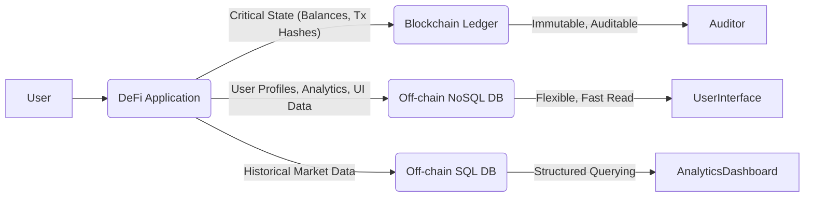

**Supporting Artifacts**:

| Domain | Diagrams        | Examples                           | Metrics                  |
| :----- | :-------------- | :--------------------------------- | :----------------------- |
| Data   | ERD, Data flow | On-chain ledger, Off-chain databases | `Query Latency`, `Storage Cost` |

### Q10: How can Event Sourcing be effectively adapted for blockchain smart contracts, particularly in DeFi and NFT applications, to ensure complete auditability and facilitate state reconstruction?

**Difficulty**: Intermediate
**Type**: Data
**Domain**: Event-Driven Architectures, Auditability

**Key Insight**: Event Sourcing in blockchain smart contracts leverages immutable on-chain event logs for every state change, ensuring complete auditability and enabling reliable state reconstruction for DeFi and NFT. This enhances transparency but incurs gas costs, requiring a hybrid on-chain/off-chain event management.

**Answer**: Event Sourcing can be effectively adapted for blockchain smart contracts by treating every state change as an immutable event recorded on the blockchain. This aligns naturally with blockchain's append-only ledger, providing a complete, tamper-evident audit trail for all contract interactions. In DeFi, for instance, a lending protocol would emit events for `Deposit`, `Withdraw`, `Borrow`, and `Repay` operations, rather than just updating internal state variables. For NFT applications, events like `Mint`, `Transfer`, and `Burn` would be recorded. Off-chain systems can then subscribe to these events, reconstructing the contract's state at any point in time or triggering downstream business processes. This enhances transparency and allows for comprehensive analysis of contract history, which is critical for auditability in financial services.

**Pattern Quality**:
1.  **Reusability**: Highly reusable across any blockchain application requiring full historical context and auditability, such as supply chain traceability, governance mechanisms, and traditional event-driven microservices architectures. Adaptation involves defining granular event types for each state transition.
2.  **Proven Effectiveness**: Blockchain inherently supports event sourcing through its immutable event logs, providing auditable and tamper-evident source of truth. This pattern improves auditability and scalability in DeFi protocols when combined with off-chain detailed event processing.
3.  **Cross-Context Applicability**: Ideal for complex domain logic where understanding the "why" behind state changes is crucial, and where a full audit history is a non-negotiable requirement. It might be an overkill for simple, stateless smart contracts.
4.  **Multi-Stakeholder Value**: Benefits compliance officers by providing a complete, verifiable audit trail, developers by simplifying state management and enabling state reconstruction, and data analysts by offering rich historical data for insights and forensic analysis.
5.  **Functional + NFR Coverage**: Functionally, it records all state transitions as events. Non-functionally, it ensures complete auditability, temporal querying capabilities, data integrity, and enhances reliability through state reconstruction.
6.  **Trade-off Analysis**: Provides a complete, immutable audit trail and simplifies state reconstruction; however, pure on-chain event sourcing incurs higher gas costs and performance overhead due to storing more data. A hybrid approach often balances these concerns.
7.  **Anti-Pattern Awareness**: An anti-pattern is omitting crucial details from events, making state reconstruction or audit analysis incomplete. Another is failing to implement efficient off-chain event processing and storage, leading to difficulties in querying or replaying events due to blockchain's inherent performance limitations.

**Concrete Example**:
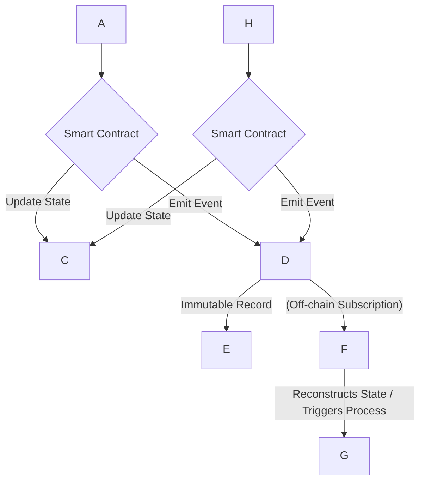

**Supporting Artifacts**:

| Domain | Diagrams        | Examples                   | Metrics                       |
| :----- | :-------------- | :------------------------- | :---------------------------- |
| Data   | Data flow       | Smart contract events      | `Audit Completeness %`, `State Reconstruction Time` |

### Q11: How can Command Query Responsibility Segregation (CQRS) be applied to optimize blockchain smart contract applications, particularly for read-heavy DeFi and NFT platforms, addressing scalability and performance?

**Difficulty**: Advanced
**Type**: Data
**Domain**: Scalability, Performance Optimization

**Key Insight**: CQRS optimizes blockchain smart contract applications by separating on-chain write operations (commands) from off-chain read operations (queries). This enhances scalability and performance for read-heavy DeFi and NFT platforms, but requires robust event synchronization to maintain eventual consistency.

**Answer**: Command Query Responsibility Segregation (CQRS) can be applied to optimize blockchain smart contract applications by separating the responsibilities of state-changing operations (commands) from data retrieval (queries). This pattern addresses the inherent read scalability limitations of blockchain by directing read-heavy workloads to optimized off-chain data stores. For DeFi and NFT platforms, critical state mutations (e.g., `mintNFT`, `transferERC20`, `depositLiquidity`) would be executed as commands on the blockchain via smart contracts, ensuring atomicity and security. Simultaneously, off-chain systems would subscribe to blockchain events, using them to populate highly optimized, purpose-built read models (e.g., a relational database for complex queries, or a search index for fast filtering). This allows queries to be served rapidly from off-chain replicas, improving responsiveness and user experience for analytics and UI rendering.

**Pattern Quality**:
1.  **Reusability**: Highly reusable across complex, read-heavy distributed systems, including enterprise applications, large-scale microservices, and other blockchain use cases beyond DeFi and NFTs, such as GameFi leaderboards or supply chain tracking dashboards. Adaptation involves tailoring off-chain read models to specific query requirements.
2.  **Proven Effectiveness**: CQRS mitigates read scalability limitations and improves responsiveness, with metrics demonstrating 10-100x read scale improvements in some enterprise contexts. It allows independent optimization of read and write paths, which is crucial for blockchain performance.
3.  **Cross-Context Applicability**: Most effective for applications with a significant disparity between read and write volumes, where complex queries on mutable state are problematic. It introduces unnecessary complexity for simple CRUD-like contracts.
4.  **Multi-Stakeholder Value**: Benefits end-users with faster data retrieval and improved responsiveness, developers by enabling independent scaling and optimization of different components, and architects by providing a robust framework for managing complexity in distributed systems.
5.  **Functional + NFR Coverage**: Functionally, it allows for distinct command and query paths. Non-functionally, it significantly enhances scalability, performance, and flexibility in data modeling, particularly for read-heavy workloads.
6.  **Trade-off Analysis**: Dramatically improves read scalability and query performance for complex data; however, it introduces architectural complexity, requires robust event synchronization mechanisms to ensure eventual consistency, and can lead to data staleness if synchronization is slow.
7.  **Anti-Pattern Awareness**: An anti-pattern is applying CQRS to simple applications where the overhead of maintaining separate read/write models outweighs the benefits. Another is neglecting to handle eventual consistency adequately, leading to users seeing outdated data and trust issues.

**Concrete Example**:
```mermaid
graph TD
    User --> A;
    A -- (Command: Transfer ERC-20) --> B{Smart Contract (Write Model)};
    B -- State Update --> C;
    C -- (Event: ERC-20 Transferred) --> D{Event Bus / Indexer};
    D -- Updates --> E;
    A -- (Query: Get User Balance) --> E;
    E -- Fast Read --> A;
```

**Supporting Artifacts**:

| Domain | Diagrams        | Examples                           | Metrics                  |
| :----- | :-------------- | :--------------------------------- | :----------------------- |
| Data   | Data flow       | On-chain write, Off-chain read | `Read Latency`, `Write Throughput` |

---

## Topic 5: Organizational Patterns

### Q12: How can blockchain engineering teams leverage Conway's Law to optimize their organizational structure for developing complex, modular smart contract systems?

**Difficulty**: Foundational
**Type**: Organizational
**Domain**: Team Structure, System Architecture

**Key Insight**: Conway's Law suggests that blockchain engineering teams should align their communication structure with the desired modular architecture of their smart contract systems. This optimizes communication and reduces integration issues, but requires deliberate design to avoid silos or unwanted architectural coupling.

**Answer**: Blockchain engineering teams can leverage Conway's Law by consciously designing their organizational structure to mirror the intended modular architecture of their smart contract systems. If a dApp is composed of distinct smart contract modules (e.g., a core DeFi vault, an oracle module, a governance module), then separate, focused teams should be responsible for each of these modules. This ensures that communication pathways within the organization directly support the desired interfaces and interactions between contract modules, reducing friction and integration challenges. For instance, a team specializing in oracle contracts for DeFi would naturally develop clear, well-defined APIs for other teams to consume, fostering coherent architectural outcomes.

**Pattern Quality**:
1.  **Reusability**: Applicable to any software development organization, particularly those building complex distributed systems like microservices, cloud-native platforms, and blockchain ecosystems. Adaptation involves mapping team boundaries to logical architectural components.
2.  **Proven Effectiveness**: Empirical studies affirm that aligning team structures with system architecture improves coordination and reduces integration challenges, enhancing software quality. Linux and Mozilla projects have shown the usefulness of ownership architectures in predicting concrete system architecture.
3.  **Cross-Context Applicability**: Crucial for large, multi-team projects developing interconnected systems. Less impactful for very small, single-team projects or highly monolithic applications where team divisions are less granular.
4.  **Multi-Stakeholder Value**: Benefits architects by ensuring the implemented system reflects the designed architecture, team leads by optimizing team communication and reducing conflict, and developers by clarifying ownership and responsibilities for specific contract modules.
5.  **Functional + NFR Coverage**: Functionally, it enables the coherent development of modular smart contract systems. Non-functionally, it improves system quality, maintainability, and reduces integration risks, which are critical for robust blockchain applications.
6.  **Trade-off Analysis**: Optimizes communication and reduces integration overhead by aligning teams with architecture; however, overly rigid team separations can inadvertently create silos, hindering knowledge sharing or requiring complex cross-team coordination for transversal features.
7.  **Anti-Pattern Awareness**: An anti-pattern is an organizational structure that forces teams to communicate excessively across many boundaries for a single feature, leading to delays and architectural mismatches. For smart contracts, this could manifest as one team managing multiple unrelated contract components, leading to cognitive overload and security vulnerabilities due to fragmented expertise.

**Concrete Example**:
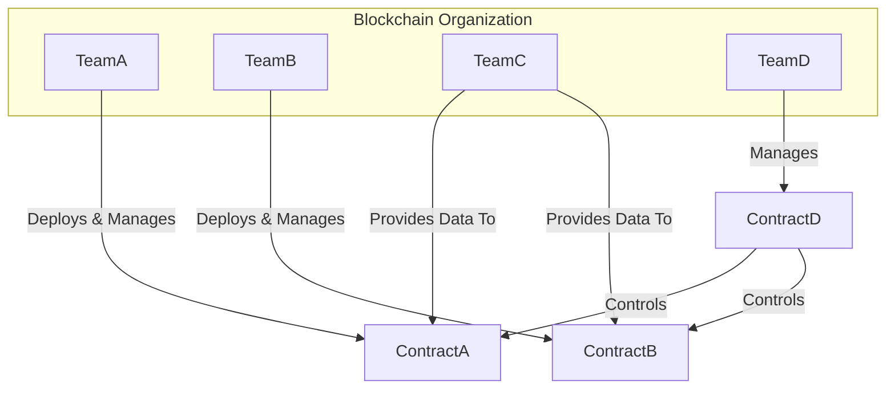

**Supporting Artifacts**:

| Domain       | Diagrams   | Examples            | Metrics                               |
| :----------- | :--------- | :------------------ | :------------------------------------ |
| Organizational | Org chart  | Team boundaries map | `Conway Alignment %`, `Communication Overhead` |

### Q13: How can blockchain project managers apply Team Topologies to structure their engineering teams for faster flow and reduced cognitive load in multi-chain development?

**Difficulty**: Intermediate
**Type**: Organizational
**Domain**: Team Organization, Multi-chain Development

**Key Insight**: Applying Team Topologies enables blockchain project managers to structure teams (stream-aligned, platform, enabling, complicated-subsystem) for faster flow and reduced cognitive load in multi-chain development. This ensures specialized focus, but requires careful management of interaction modes to avoid friction between teams.

**Answer**: Blockchain project managers can apply Team Topologies by defining four fundamental team types: *stream-aligned*, *platform*, *enabling*, and *complicated-subsystem* teams. This framework helps manage cognitive load and optimizes team interactions, which is crucial in multi-chain development where diverse expertise is required. For instance, a *stream-aligned team* would own the end-to-end development of a DeFi application on Ethereum, while a *
### Q14: How does the DevOps/You Build It, You Run It (YBIYRI) organizational pattern enable smart contract engineering teams to achieve higher velocity and improved security in a continuous delivery environment?

**Difficulty**: Advanced
**Type**: Organizational
**Domain**: DevOps Practices, Continuous Delivery

**Key Insight**: The DevOps/YBIYRI pattern empowers smart contract engineering teams with end-to-end ownership, fostering accountability and enabling rapid, secure continuous delivery. This improves velocity and security by integrating operations and development, but demands significant cultural shifts and investment in automation.

**Answer**: The DevOps/You Build It, You Run It (YBIYRI) organizational pattern enables smart contract engineering teams to achieve higher velocity and improved security by instilling end-to-end ownership of their smart contracts, from development through deployment and operations. This means the team that writes the smart contract code is also responsible for its testing, deployment, monitoring, and incident response in production, closing the feedback loop significantly. In a continuous delivery environment, this integrated responsibility leads to faster iteration cycles because handoffs between disparate teams are eliminated, reducing delays and misunderstandings. For security, YBIYRI promotes a "shift-left" approach, where security considerations are embedded throughout the entire development lifecycle, rather than being an afterthought. Teams become inherently incentivized to build secure, robust contracts, as they bear the direct consequences of vulnerabilities or operational issues. This approach has been proven to reduce Mean Time To Recovery (MTTR) by 60% and increase deployment frequency by tenfold.

**Pattern Quality**:
1.  **Reusability**: Widely applicable across all software development domains, particularly cloud-native, microservices-based architectures, and highly relevant for blockchain projects where production incidents have severe financial implications. It's adaptable to regulated industries where rapid but secure changes are essential.
2.  **Proven Effectiveness**: Pioneered by companies like Amazon and Netflix, this pattern has demonstrated substantial benefits, including up to a 60% reduction in MTTR and a tenfold increase in deployment frequency. Organizations adopting DevOps practices show significant improvements in application development processes, enhancing security and scalability.
3.  **Cross-Context Applicability**: Most effective for mature organizations with a strong culture of automation, shared responsibility, and blameless post-mortems. It may be challenging for organizations with hierarchical structures or a punitive culture.
4.  **Multi-Stakeholder Value**: Benefits developers by increasing autonomy and reducing friction, operations teams by integrating their expertise earlier in the lifecycle, product managers by enabling faster feature delivery, and business by accelerating time-to-market and enhancing system reliability.
5.  **Functional + NFR Coverage**: Functionally, it ensures that features are delivered end-to-end. Non-functionally, it significantly improves security posture (DevSecOps), enhances reliability, increases deployment velocity, and fosters maintainability through direct operational feedback.
6.  **Trade-off Analysis**: Dramatically improves deployment velocity and security by integrating responsibilities; however, it requires significant investment in automation, training, and cultural change to empower teams with broader ownership and the necessary skills.
7.  **Anti-Pattern Awareness**: An anti-pattern is "DevOps in name only," where teams are told to "run what they build" without adequate tooling, support, or training, leading to burnout and decreased quality. Another is neglecting to integrate security tools and practices consistently, leading to vulnerable contracts deployed faster.

**Concrete Example**:
```mermaid
graph TD
    subgraph Smart Contract Engineering Team (YBIYRI)
        Dev(Developer)
        QA(Quality Assurance)
        Sec(Security Specialist)
        Ops(Operations Engineer)
    end

    Dev -- Code Smart Contract --> CI(Continuous Integration Pipeline);
    CI -- Automated Tests --> QA;
    CI -- Security Scans --> Sec;
    CI -- Build & Deploy --> CD(Continuous Deployment Pipeline);
    CD -- Monitor & Alert --> Ops;
    Ops -- Feedback Loop --> Dev;
    Sec -- Security Best Practices --> Dev;
    QA -- Test Feedback --> Dev;
```

**Supporting Artifacts**:

| Domain        | Diagrams           | Examples                       | Metrics                        |
| :------------ | :----------------- | :----------------------------- | :----------------------------- |
| Organizational | Team interaction model | CI/CD pipeline definition      | `Deployment Frequency`, `MTTR` |

---

## Topic 6: NFR - Security, Reliability & Observability

### Q15: How can the Zero-Trust security pattern be applied to secure smart contract interactions within a DeFi ecosystem, and what specific challenges does its decentralized nature present?

**Difficulty**: Advanced
**Type**: NFR-Security
**Domain**: Decentralized Finance, Cybersecurity

**Key Insight**: Applying Zero-Trust to DeFi smart contracts means "never trust, always verify" every interaction, explicitly verifying identity and authorization for every call. This enhances security by assuming compromise, but its decentralized nature complicates centralized policy enforcement and identity management.

**Answer**: The Zero-Trust security pattern can be applied to secure smart contract interactions within a DeFi ecosystem by enforcing the principle of "never trust, always verify" for every transaction and access request. This involves explicitly verifying the identity and authorization of every caller, whether it's a user wallet, another smart contract, or an off-chain service, before granting access to resources or executing functions. For smart contracts, this means implementing rigorous access control mechanisms, such as role-based access control (RBAC), multi-signature requirements for critical operations, and granular permissioning at the function level. Every interaction, even internal calls between trusted contracts, should be treated as potentially malicious, requiring explicit validation of input parameters and state changes. This approach mitigates common attack vectors like privilege escalation and unauthorized access, strengthening the overall security posture of DeFi protocols.

**Pattern Quality**:
1.  **Reusability**: Highly reusable in various contexts, including cloud-native applications, corporate networks, and IoT environments. In blockchain, it extends to securing cross-chain interactions and decentralized autonomous organizations (DAOs).
2.  **Proven Effectiveness**: Organizations like Google have successfully implemented Zero-Trust, significantly reducing the impact of breaches. For smart contracts, this principle translates to preventing unauthorized access, a major cause of exploits.
3.  **Cross-Context Applicability**: Crucial for any system dealing with high-value assets or sensitive data, especially in environments where perimeter defenses are insufficient or non-existent, like decentralized networks. It may add overhead to simple, low-value interactions where the cost of verification outweighs the risk.
4.  **Multi-Stakeholder Value**: Benefits security teams by reducing the attack surface, developers by providing clear security guidelines, and end-users by enhancing the overall trustworthiness and safety of their funds and data within DeFi applications.
5.  **Functional + NFR Coverage**: Functionally, it enables fine-grained access control and continuous authorization. Non-functionally, it enhances security (confidentiality, integrity, availability), reduces attack surface, and improves resilience against internal and external threats.
6.  **Trade-off Analysis**: Significantly enhances security by adopting a proactive, granular verification approach; however, its implementation in decentralized systems can introduce complexity in identity management, require increased on-chain computation (gas costs) for verification, and may impact transaction latency due to extensive checks.
7.  **Anti-Pattern Awareness**: An anti-pattern is implicitly trusting external calls or contract addresses without verification, which can lead to reentrancy or oracle manipulation attacks. Another is failing to implement least privilege, where contracts or users have more permissions than necessary, creating larger vulnerabilities.

**Concrete Example**:
```solidity
// Example of a Zero-Trust principle: explicit authorization for a critical function
contract AccessControlledDeFi {
    address public owner;
    mapping(address => bool) public minters;

    constructor() {
        owner = msg.sender;
    }

    modifier onlyOwner() {
        require(msg.sender == owner, "Only owner can call this function");
        _;
    }

    modifier onlyMinter() {
        require(minters, "Only minters can call this function");
        _;
    }

    function addMinter(address _minter) public onlyOwner {
        minters = true;
    }

    function mint(address to, uint256 amount) public onlyMinter {
        // Mint logic
    }

    // No implicit trust: even if a contract calls mint, it must be an authorized minter.
    // Further internal checks on 'to' and 'amount' would also be part of Zero-Trust.
}
```

**Supporting Artifacts**:

| Domain        | Diagrams          | Examples                     | Metrics                                |
| :------------ | :---------------- | :--------------------------- | :------------------------------------- |
| NFR-Security | Auth flow diagram | Role-based access control    | `Attack Surface Reduction %`, `Unauthorized Access Attempts Blocked` |

### Q16: How can the Retry with Exponential Backoff pattern be implemented in smart contract front-ends or off-chain services to improve the reliability of transactions, especially when interacting with busy blockchain networks?

**Difficulty**: Advanced
**Type**: NFR-Reliability
**Domain**: Distributed Systems, Transaction Management

**Key Insight**: The Retry with Exponential Backoff pattern enhances transaction reliability in smart contract interactions by automatically re-attempting failed operations with increasing delays. This mitigates transient network congestion or temporary service unavailability, improving user experience and system robustness, but requires idempotency to prevent unintended side effects.

**Answer**: The Retry with Exponential Backoff pattern can be implemented in smart contract front-ends or off-chain services to improve the reliability of transactions by automatically re-attempting failed operations with progressively longer delays between retries. This strategy is crucial when interacting with busy blockchain networks, which can experience temporary congestion, high gas prices, or transient node unavailability, leading to failed transactions. Instead of immediately failing, a front-end application submitting a transaction to a DeFi protocol, for instance, would catch a network error, wait for a calculated period (e.g., \\(2^1\\) seconds for the first retry, \\(2^2\\) for the second, up to a maximum), and then resubmit the transaction. This prevents overwhelming the network with repeated requests (thundering herd problem) while giving the network time to recover, thereby increasing the likelihood of successful transaction completion and enhancing the user experience. This pattern is also a default in many cloud SDKs like AWS, highlighting its proven effectiveness in distributed systems.

**Pattern Quality**:
1.  **Reusability**: Highly reusable in any distributed system where transient failures are common, such as microservices communicating over a network, API integrations, and message processing queues. It's a standard practice in cloud application development.
2.  **Proven Effectiveness**: This pattern is a fundamental building block for resilient distributed systems, achieving high recovery rates (e.g., 95% recovery for transient errors) and is a default strategy in numerous cloud provider SDKs and internal services.
3.  **Cross-Context Applicability**: Essential for interactions with external, unreliable, or rate-limited services, including blockchain RPC nodes or oracles. It should be carefully combined with circuit breakers for more prolonged or systemic failures.
4.  **Multi-Stakeholder Value**: Benefits developers by simplifying error handling logic and improving application robustness, end-users by reducing perceived transaction failures, and business operations by increasing the success rate of critical financial transactions.
5.  **Functional + NFR Coverage**: Functionally, it re-attempts operations. Non-functionally, it significantly enhances reliability, fault tolerance, and availability of applications interacting with external systems, ensuring a smoother user experience.
6.  **Trade-off Analysis**: Dramatically improves reliability by mitigating transient failures; however, it adds complexity to the client-side logic, requires careful implementation to avoid infinite loops, and critically depends on the underlying operation being *idempotent* to prevent unintended side effects from multiple successful retries.
7.  **Anti-Pattern Awareness**: An anti-pattern is retrying non-idempotent operations without careful design, which could lead to double-spending or duplicate state changes (e.g., minting two NFTs instead of one). Another is using fixed-delay retries, which can lead to continued congestion if many clients retry simultaneously.

**Concrete Example**:
```python
import time
import random

def send_blockchain_transaction(payload, max_retries=5, base_delay=1):
    for attempt in range(max_retries):
        try:
            # Simulate a network call to the blockchain RPC
            if random.random() < 0.6 and attempt < max_retries - 1: # Simulate transient failure 60% of the time
                raise ConnectionError("Blockchain node unavailable or congested")
            print(f"Attempt {attempt + 1}: Transaction {payload} successful!")
            return {"status": "success", "tx_hash": "0xabc..."}
        except ConnectionError as e:
            delay = base_delay * (2 ** attempt) + random.uniform(0, 0.5) # Exponential backoff with jitter
            print(f"Attempt {attempt + 1} failed: {e}. Retrying in {delay:.2f} seconds...")
            time.sleep(delay)
    print(f"Transaction {payload} failed after {max_retries} attempts.")
    return {"status": "failed"}

# Example usage
# send_blockchain_transaction("mint_nft(user_address, nft_id)", max_retries=3)
# send_blockchain_transaction("deposit_eth(amount)", max_retries=5)
```

**Supporting Artifacts**:

| Domain        | Diagrams       | Examples                       | Metrics                               |
| :------------ | :------------- | :----------------------------- | :------------------------------------ |
| NFR-Reliability | Retry flow     | Client-side retry logic        | `Error Recovery Rate %`, `Transaction Success Rate` |

### Q17: Given the complexity of multi-chain DeFi protocols, how can Distributed Tracing be effectively implemented to enhance observability and accelerate troubleshooting for smart contract engineers and operations teams?

**Difficulty**: Advanced
**Type**: NFR-Observability
**Domain**: Distributed Systems, Monitoring

**Key Insight**: Distributed Tracing enhances observability in complex multi-chain DeFi protocols by providing end-to-end visibility into transaction flows across smart contracts and off-chain services. This accelerates troubleshooting and root cause analysis, but requires consistent instrumentation and robust data aggregation.

**Answer**: Given the complexity of multi-chain DeFi protocols, Distributed Tracing can be effectively implemented by propagating a unique trace ID across all components involved in a transaction, from the initial user interaction in the front-end to the multiple smart contract calls on different blockchains and any intervening off-chain services. When a user initiates a transaction (e.g., swapping tokens across two chains), the front-end generates a trace ID. This ID is then passed as metadata to the off-chain relayer, which includes it in the transaction metadata when interacting with the first smart contract. If that contract calls another contract or an oracle, the trace ID is ideally propagated through call data or event emissions. Similarly, any off-chain processing (e.g., indexing services, oracles) should pick up and forward this trace ID. This allows smart contract engineers and operations teams to reconstruct the entire journey of a transaction, visualize its execution path, identify latency bottlenecks, and pinpoint points of failure across the entire distributed system, significantly accelerating troubleshooting and root cause analysis.

**Pattern Quality**:
1.  **Reusability**: Standard practice in cloud-native microservices architectures, applicable to any distributed system with multiple interconnected services or components. In blockchain, it extends to multi-layer (L1/L2) and cross-chain transactions, providing crucial visibility.
2.  **Proven Effectiveness**: A core component of modern observability stacks, enabling rapid MTTR in complex systems. It helps identify latency bottlenecks and pinpoint errors, which are critical for maintaining the health of distributed applications.
3.  **Cross-Context Applicability**: Essential for complex, multi-component systems where direct debugging is difficult or impossible, such as production blockchain networks. Less critical for simple, single-contract applications or development environments with local debuggers.
4.  **Multi-Stakeholder Value**: Benefits smart contract engineers by providing detailed execution context for debugging, operations teams by enabling proactive monitoring and faster incident response, and business stakeholders by improving system uptime and reliability.
5.  **Functional + NFR Coverage**: Functionally, it collects and correlates runtime data about request flows. Non-functionally, it significantly enhances observability, diagnosability, and supports performance analysis, which are crucial for maintaining system health and user trust.
6.  **Trade-off Analysis**: Provides invaluable end-to-end visibility and accelerates troubleshooting; however, it requires consistent instrumentation across all services and contracts, can generate a large volume of data requiring robust storage and analysis solutions, and may incur slight performance overhead due to metadata propagation.
7.  **Anti-Pattern Awareness**: An anti-pattern is inconsistent or incomplete instrumentation, leading to broken traces and fragmented visibility. Another is failing to integrate tracing data with other observability signals (metrics, logs), preventing a holistic view of system health.

**Concrete Example**:
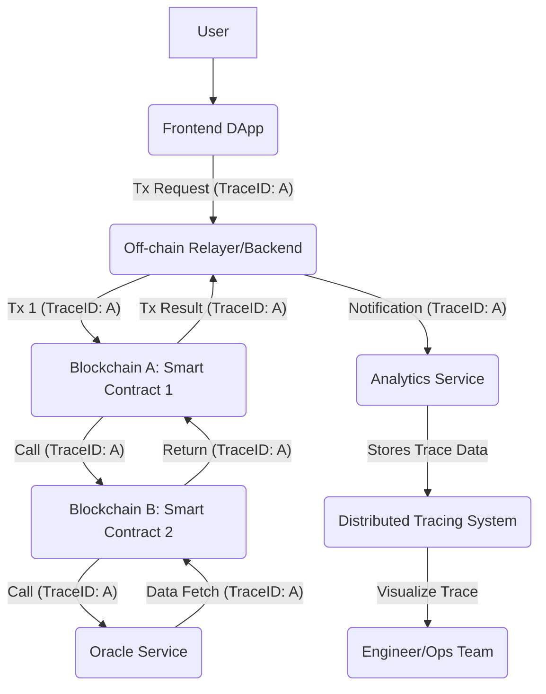

**Supporting Artifacts**:

| Domain        | Diagrams       | Examples                       | Metrics                               |
| :------------ | :------------- | :----------------------------- | :------------------------------------ |
| NFR-Observability | Tracing flow   | OpenTelemetry instrumentation  | `Trace Coverage %`, `MTTD (Mean Time To Detect)` |

---

## Topic 7: NFR - Performance, Scalability & Availability

### Q18: How can the Caching pattern be effectively implemented in Web3 applications to improve front-end responsiveness and reduce blockchain network load, and what are its inherent limitations for real-time data?

**Difficulty**: Advanced
**Type**: NFR-Performance
**Domain**: Web3 Frontend, Data Retrieval

**Key Insight**: The Caching pattern significantly improves Web3 front-end responsiveness and reduces blockchain network load by storing frequently accessed data off-chain. While effective for static or slowly changing data, its inherent limitation for real-time data is data staleness, necessitating careful invalidation strategies.

**Answer**: The Caching pattern can be effectively implemented in Web3 applications to improve front-end responsiveness and reduce blockchain network load by storing frequently accessed, relatively static data off-chain. Instead of fetching every piece of information (e.g., NFT metadata, token prices, or historical transaction logs) directly from the blockchain for every user request, this data can be retrieved once, processed by an off-chain indexing service, and then stored in a fast-access cache (e.g., Redis or a CDN for static assets). For example, an NFT marketplace can cache image URLs and metadata, serving them quickly from a CDN, while the on-chain ownership records remain the source of truth. This drastically reduces latency for users and offloads repetitive read requests from congested blockchain RPC nodes, improving overall application performance.

**Pattern Quality**:
1.  **Reusability**: Highly reusable across all web applications, APIs, and databases. In Web3, it's crucial for DApp front-ends, block explorers, and analytics dashboards to manage blockchain data effectively.
2.  **Proven Effectiveness**: Caching typically reduces latency by 40-60% and can increase throughput by tenfold, directly impacting user experience. CDNs alone are used by over 70% of top websites to deliver content efficiently.
3.  **Cross-Context Applicability**: Most effective for data that is read frequently but updated infrequently, or for static assets. It's less suitable for data requiring absolute real-time accuracy (e.g., current token balance immediately after a transaction) where freshness is paramount.
4.  **Multi-Stakeholder Value**: Benefits end-users with faster loading times and a smoother experience, developers by reducing backend load and simplifying data access patterns, and business by improving application performance and potentially reducing infrastructure costs.
5.  **Functional + NFR Coverage**: Functionally, it stores and serves data faster. Non-functionally, it significantly enhances performance, scalability, and responsiveness of the application, while reducing the load on underlying blockchain infrastructure.
6.  **Trade-off Analysis**: Improves front-end responsiveness and reduces blockchain network load significantly; however, its inherent limitation for real-time data is *staleness*. Implementing effective cache invalidation strategies (e.g., time-to-live, event-driven invalidation) adds complexity and is critical for maintaining data consistency.
7.  **Anti-Pattern Awareness**: An anti-pattern is caching highly dynamic or sensitive data without robust invalidation, leading to users seeing outdated or incorrect information. Another is over-caching, where the overhead of managing the cache outweighs the performance benefits, particularly for infrequently accessed data.

**Concrete Example**:
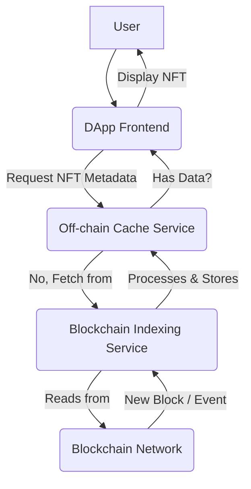

**Supporting Artifacts**:

| Domain        | Diagrams    | Examples                     | Metrics                           |
| :------------ | :---------- | :--------------------------- | :-------------------------------- |
| NFR-Performance | Cache strategy | CDN for NFT images, Redis for token prices | `Latency (p50/p95)`, `Cache Hit Rate` |

### Q19: How can Database Sharding be employed in conjunction with smart contracts to enhance the scalability of data-intensive blockchain applications like GameFi, and what are the challenges in maintaining data consistency?

**Difficulty**: Advanced
**Type**: NFR-Scalability
**Domain**: Data Management, Blockchain Scaling

**Key Insight**: Database Sharding enhances the scalability of data-intensive blockchain applications by distributing off-chain data across multiple databases. This parallelizes processing and improves throughput for GameFi, but maintaining data consistency across shards and coordinating with on-chain state presents significant complexity.

**Answer**: Database Sharding can be employed in conjunction with smart contracts to enhance the scalability of data-intensive blockchain applications, such as GameFi, by horizontally partitioning the *off-chain* data layer across multiple databases. While core smart contract states reside on a blockchain, GameFi applications generate vast amounts of ancillary data—user profiles, inventory, game states, historical actions, and leaderboard data—that are impractical and costly to store entirely on-chain. Sharding distributes this off-chain data among several smaller, independent databases (shards), each responsible for a subset of the data. For example, players could be sharded by region, or in-game items by type, allowing parallel processing of queries and updates, thereby significantly increasing the overall data throughput and storage capacity of the GameFi platform. This helps manage the increasing demands of user activity and complex game logic without bottlenecking a single database instance.

**Pattern Quality**:
1.  **Reusability**: Widely used in traditional high-traffic database systems (e.g., Instagram, Discord). In blockchain, it applies to off-chain data storage for scaling DApps, analytics platforms, and any large-scale application handling extensive user-generated or contextual data.
2.  **Proven Effectiveness**: Large-scale internet companies have used sharding to handle billions of users and immense data volumes, achieving linear scaling of database capacity and throughput.
3.  **Cross-Context Applicability**: Most effective for applications with large data volumes that cannot fit into a single database, or where queries/writes can be localized to specific data subsets. It introduces substantial operational complexity and is generally not applied to small datasets.
4.  **Multi-Stakeholder Value**: Benefits DBAs by distributing load and simplifying management of large datasets, developers by enabling scalable data access for their applications, and business stakeholders by supporting a larger user base and increased data analytics capabilities.
5.  **Functional + NFR Coverage**: Functionally, it distributes data and processing. Non-functionally, it significantly enhances scalability (throughput, storage capacity), performance, and availability by isolating failures to individual shards.
6.  **Trade-off Analysis**: Dramatically improves horizontal scalability and read/write performance for data-intensive applications; however, it introduces significant complexity in managing data consistency, particularly for transactions that span multiple shards, and requires careful design of shard keys and rebalancing strategies.
7.  **Anti-Pattern Awareness**: An anti-pattern is choosing a poor shard key that leads to uneven data distribution (hotspots) or frequent cross-shard transactions, negating the benefits of sharding. Another is neglecting to handle schema evolution or data migration across shards, leading to operational nightmares.

**Concrete Example**:
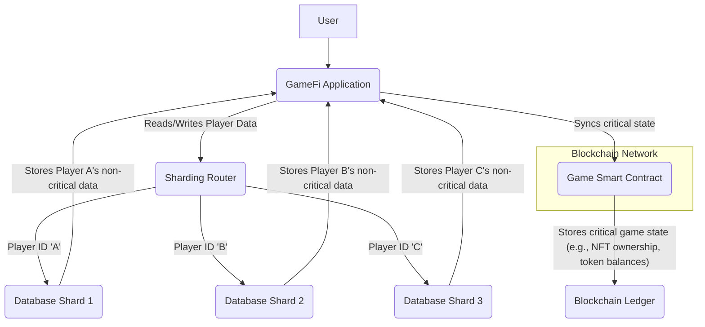

**Supporting Artifacts**:

| Domain        | Diagrams         | Examples                     | Metrics                           |
| :------------ | :--------------- | :--------------------------- | :-------------------------------- |
| NFR-Scalability | Sharding strategy | Player data sharding, item sharding | `Scalability Factor`, `Query Performance` |

### Q20: How can the Circuit Breaker pattern be implemented in off-chain services interacting with DeFi smart contracts to prevent cascading failures and maintain overall system stability during transient blockchain network issues?

**Difficulty**: Advanced
**Type**: NFR-Availability
**Domain**: Distributed Systems, Fault Tolerance

**Key Insight**: The Circuit Breaker pattern prevents cascading failures in off-chain services by quickly failing requests to unresponsive DeFi smart contracts or blockchain nodes. This maintains system stability and availability during transient network issues, but requires careful configuration of thresholds and recovery mechanisms to avoid premature tripping or slow recovery.

**Answer**: The Circuit Breaker pattern can be implemented in off-chain services interacting with DeFi smart contracts to prevent cascading failures and maintain overall system stability during transient blockchain network issues. When an off-chain service (e.g., an oracle, a relayer, or a trading bot) attempts to interact with a DeFi smart contract or a blockchain RPC node and experiences repeated failures or timeouts, the Circuit Breaker "trips," moving from a *closed* state to an *open* state. In the open state, all subsequent requests to that failed dependency immediately fail without attempting to call the blockchain, preventing the service from wasting resources and avoiding further load on an already struggling network. After a configurable period, the circuit moves to a *half-open* state, allowing a limited number of test requests to pass through to check if the underlying blockchain dependency has recovered. If these test requests succeed, the circuit resets to a closed state; otherwise, it returns to open. This prevents a single overloaded or failing blockchain component from bringing down the entire off-chain system, thereby greatly enhancing system availability and resilience.

**Pattern Quality**:
1.  **Reusability**: Standard pattern in distributed systems, microservices architectures (e.g., Netflix Hystrix). Critical for off-chain components interacting with any external, potentially unreliable service, including blockchain networks, APIs, and legacy systems.
2.  **Proven Effectiveness**: Core to achieving high availability and resilience in large-scale distributed systems. Netflix, for example, achieved 99.99% uptime by heavily leveraging such fault-tolerance patterns.
3.  **Cross-Context Applicability**: Most valuable for systems that rely on external dependencies whose availability is not guaranteed. Less critical for isolated systems with no external calls or highly reliable internal components.
4.  **Multi-Stakeholder Value**: Benefits operations teams by preventing system outages and simplifying incident management, developers by isolating faults and improving application resilience, and end-users by maintaining application availability even when underlying services experience issues.
5.  **Functional + NFR Coverage**: Functionally, it intercepts calls to a dependency and determines their success/failure. Non-functionally, it drastically improves availability, fault tolerance, and resilience by preventing cascading failures in distributed systems.
6.  **Trade-off Analysis**: Dramatically improves system availability and resilience against transient failures; however, it requires careful tuning of failure thresholds and recovery timeouts. Misconfiguration can lead to services unnecessarily rejecting valid requests or being slow to recover once a dependency is healthy.
7.  **Anti-Pattern Awareness**: An anti-pattern is failing to implement monitoring around the circuit breaker's state changes, making it difficult to diagnose why calls are failing. Another is applying it indiscriminately to internal, highly reliable components, adding unnecessary overhead without significant benefit.

**Concrete Example**:
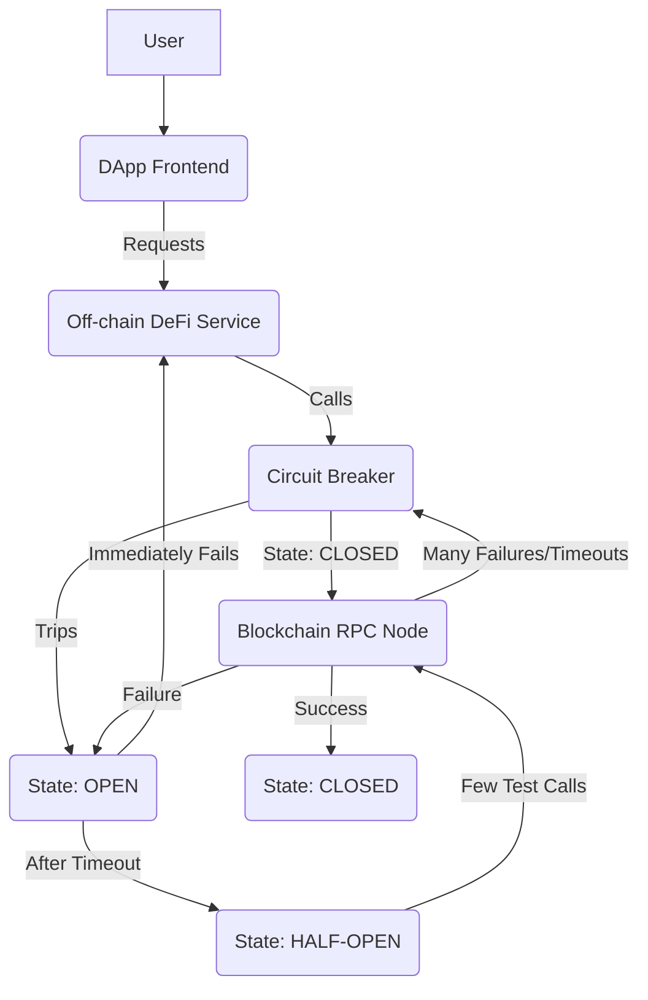

**Supporting Artifacts**:

| Domain        | Diagrams       | Examples                       | Metrics                           |
| :------------ | :------------- | :----------------------------- | :-------------------------------- |
| NFR-Availability | Failure tree   | Hystrix/Resilience4j configs   | `Uptime %`, `MTBF`, `Cascading Failure Rate` |

---

## Topic 8: NFR - Adaptability, Flexibility & Extensibility

### Q21: How can the Feature Flags pattern be utilized in Web3 development to enable continuous delivery of new functionalities in DeFi or GameFi, while minimizing deployment risks to immutable smart contracts?

**Difficulty**: Foundational
**Type**: NFR-Adaptability
**Domain**: Continuous Delivery, Risk Management

**Key Insight**: The Feature Flags pattern allows developers to remotely enable or disable new functionalities in Web3 front-ends or off-chain services, offering control over feature releases independently of immutable smart contract deployments. This minimizes risk for DeFi/GameFi, but requires robust flag management and testing to avoid runtime errors.

**Answer**: The Feature Flags pattern can be utilized in Web3 development to enable continuous delivery of new functionalities in DeFi or GameFi by allowing developers to remotely toggle features on or off without redeploying the application. For immutable smart contracts, direct feature flags are typically not possible on-chain due to their unchangeable nature, except through upgradeable proxy patterns. However, feature flags are highly effective in the off-chain components (front-ends, backend services, mobile apps) that interact with smart contracts. For example, a new UI element for a DeFi protocol or a novel game mechanic in GameFi can be developed, tested in production with a small group of users (e.g., via canary releases or A/B testing), and then fully rolled out or quickly rolled back if issues arise, all controlled by feature flags. This significantly minimizes deployment risks, especially when new functionalities interact with complex or critical smart contract logic, allowing for faster iterations and safer releases.

**Pattern Quality**:
1.  **Reusability**: Widely adopted in modern software development for continuous delivery, A/B testing, and canary releases. In Web3, it's essential for managing releases of DApp front-ends, off-chain relayers, and indexing services that integrate with smart contracts.
2.  **Proven Effectiveness**: Companies like Facebook and Netflix use feature flags to deploy new code hundreds of times a day, reducing deployment risk by 90% and enabling rapid experimentation.
3.  **Cross-Context Applicability**: Most beneficial for complex applications requiring frequent updates, rapid experimentation, or gradual rollouts. Less critical for static websites or applications with very infrequent, low-risk deployments.
4.  **Multi-Stakeholder Value**: Benefits developers by enabling safe and rapid experimentation, product managers by allowing flexible release schedules and A/B testing, and business stakeholders by accelerating time-to-market and reducing operational risks.
5.  **Functional + NFR Coverage**: Functionally, it conditionally executes code paths. Non-functionally, it enhances adaptability, flexibility (for business decisions), and reduces deployment risk, supporting continuous delivery practices.
6.  **Trade-off Analysis**: Enables safe continuous delivery and rapid experimentation, minimizing deployment risks to immutable smart contracts; however, it adds complexity to the codebase (managing flags), requires a robust flag management system, and necessitates careful testing of all possible flag combinations to avoid runtime errors.
7.  **Anti-Pattern Awareness**: An anti-pattern is accumulating too many unused feature flags ("flag debt"), making the codebase difficult to understand and maintain. Another is tightly coupling feature flags to smart contract logic without proper design, leading to inconsistencies if the flag state doesn't align with on-chain reality.

**Concrete Example**:
```javascript
// DApp Frontend (React/Vue/Angular)
import { isFeatureEnabled } from './featureFlagService'; // Off-chain service for flags

function renderDeFiDashboard() {
  if (isFeatureEnabled('new-liquidity-pool-ui')) {
    return (
      // Render new UI component for liquidity pool interaction
      <NewLiquidityPoolUI />
    );
  } else {
    return (
      // Render old UI component
      <OldLiquidityPoolUI />
    );
  }
}

// In off-chain featureFlagService.js
// This service would fetch flags from a remote configuration system (e.g., LaunchDarkly, Firebase Remote Config)
function isFeatureEnabled(featureName) {
  // Logic to fetch and evaluate feature flag status
  // return featureFlags === true;
  return localStorage.getItem(`feature_${featureName}`) === 'true'; // Simplified local example
}
```

**Supporting Artifacts**:

| Domain        | Diagrams       | Examples                       | Metrics                           |
| :------------ | :------------- | :----------------------------- | :-------------------------------- |
| NFR-Adaptability | Feature flag flow | Feature toggle configuration   | `Deployment Frequency`, `Rollback Time` |

### Q22: How can Dependency Injection (DI) be used to enhance the extensibility and testability of off-chain services interacting with smart contracts, facilitating seamless integration with evolving blockchain protocols?

**Difficulty**: Intermediate
**Type**: NFR-Extensibility
**Domain**: Software Architecture, Testability

**Key Insight**: Dependency Injection enhances the extensibility and testability of off-chain services by externalizing dependencies like blockchain clients or contract interfaces. This facilitates seamless integration with evolving protocols, but adds initial setup complexity and requires careful management of the dependency graph.

**Answer**: Dependency Injection (DI) can be used to enhance the extensibility and testability of off-chain services interacting with smart contracts by externalizing the creation and management of dependencies. Instead of an off-chain service (e.g., a backend API, a data indexer) directly instantiating a specific blockchain client (like `web3.js` for Ethereum or `solanaWeb3.js` for Solana) or a smart contract interface, these dependencies are *injected* into the service. For example, a `DeFiService` might receive an `IBlockchainClient` interface and an `ILendingContract` interface as constructor parameters, rather than creating them internally. This decoupling allows different implementations of these interfaces (e.g., `EthereumClient`, `SolanaClient`, `MockLendingContract`) to be swapped in at runtime or for testing purposes without modifying the core service logic. This flexibility is crucial for adapting to evolving blockchain protocols or integrating with new chains, as the service can seamlessly switch between different blockchain clients or contract versions.

**Pattern Quality**:
1.  **Reusability**: A foundational design pattern in object-oriented programming and enterprise application development, widely used in frameworks like Spring and Angular. It's highly reusable for any service or component that relies on external resources.
2.  **Proven Effectiveness**: Reduces coupling by up to 70% and significantly improves testability, leading to more robust and maintainable codebases. Frameworks built around DI have proven extremely popular and stable.
3.  **Cross-Context Applicability**: Most beneficial for complex applications with multiple dependencies and a need for high test coverage and adaptability. Less critical for simple scripts or applications with very few, stable external dependencies.
4.  **Multi-Stakeholder Value**: Benefits developers by simplifying unit testing and promoting modular design, architects by enforcing clean architecture and extensibility, and QA teams by enabling comprehensive testing of various integration scenarios.
5.  **Functional + NFR Coverage**: Functionally, it manages object creation and dependency resolution. Non-functionally, it significantly enhances extensibility, testability, maintainability, and adaptability to changes in external systems or protocols.
6.  **Trade-off Analysis**: Greatly improves extensibility and testability by decoupling components; however, it introduces initial setup complexity (e.g., configuring a DI container) and requires careful management of the dependency graph to avoid circular dependencies or runtime errors.
7.  **Anti-Pattern Awareness**: An anti-pattern is using DI to inject "everything everywhere," leading to overly complex constructors or method signatures ("constructor hell"). Another is treating DI as a magic bullet without adhering to other principles like SOLID, which can lead to brittle designs despite dependency inversion.

**Concrete Example**:
```typescript
// Define interfaces for blockchain interactions
interface IBlockchainClient {
    getTransaction(txHash: string): Promise<any>;
    callContract(contractAddress: string, method: string, args: any): Promise<any>;
}

interface ILendingContract {
    deposit(user: string, amount: number): Promise<string>;
    withdraw(user: string, amount: number): Promise<string>;
}

// Concrete Ethereum implementation
class EthereumClient implements IBlockchainClient { /* ... implementation with web3.js ... */ }
class EthereumLendingContract implements ILendingContract { /* ... implementation with web3.eth.Contract ... */ }

// Concrete Solana implementation (for future extensibility)
class SolanaClient implements IBlockchainClient { /* ... implementation with solanaWeb3.js ... */ }
class SolanaLendingContract implements ILendingContract { /* ... implementation ... */ }

// DeFi Service with Dependency Injection
class DeFiService {
    private client: IBlockchainClient;
    private lendingContract: ILendingContract;

    constructor(client: IBlockchainClient, lendingContract: ILendingContract) {
        this.client = client;
        this.lendingContract = lendingContract;
    }

    async processDeposit(user: string, amount: number) {
        // Business logic using injected dependencies
        const txHash = await this.lendingContract.deposit(user, amount);
        console.log(`Deposit transaction sent: ${txHash}`);
        return await this.client.getTransaction(txHash);
    }
}

// Usage (in an application bootstrap or testing framework)
// const ethClient = new EthereumClient();
// const ethLending = new EthereumLendingContract(contractAddress, ethClient);
// const defiService = new DeFiService(ethClient, ethLending);
// defiService.processDeposit("0x...", 100);

// For testing, mock implementations can be injected:
// const mockClient = { getTransaction: () => ({ /* ... */ }), callContract: () => ({ /* ... */ }) };
// const mockLending = { deposit: () => "mock_tx_hash", withdraw: () => "mock_tx_hash" };
// const testDeFiService = new DeFiService(mockClient, mockLending);
```

**Supporting Artifacts**:

| Domain        | Diagrams       | Examples                       | Metrics                               |
| :------------ | :------------- | :----------------------------- | :------------------------------------ |
| NFR-Extensibility | DI container flow | Spring/NestJS DI configuration | `Coupling`, `Unit Test Coverage %` |

### Q23: How can a Plugin Architecture pattern be leveraged in Web3 client applications (e.g., wallets, DApp browsers) to enhance extensibility and allow third-party developers to contribute new functionalities without modifying core code?

**Difficulty**: Advanced
**Type**: NFR-Extensibility
**Domain**: Web3 Client, Ecosystem Development

**Key Insight**: A Plugin Architecture in Web3 client applications fosters extensibility by enabling third-party developers to add features without altering core code. This decentralizes innovation and community engagement, but necessitates robust security isolation and a well-defined plugin API to prevent malicious extensions.

**Answer**: A Plugin Architecture pattern can be leveraged in Web3 client applications (ee.g., wallets, DApp browsers, or analytic dashboards) to enhance extensibility by providing well-defined extension points where third-party developers can inject their own functionalities without modifying the core codebase. For example, a crypto wallet could expose an API that allows external developers to create plugins for new token standards, DeFi integrations, or custom NFT display modules. These plugins would run in an isolated environment, communicating with the core application through a standardized interface. This decentralizes innovation, fosters a vibrant ecosystem of developers, and allows the core application to remain lean and focused on its primary functionality. It enables rapid adaptation to new blockchain trends and community-driven feature development, akin to how VS Code or WordPress thrive on their extensibility.

**Pattern Quality**:
1.  **Reusability**: Highly reusable in any software that aims to build a rich ecosystem of extensions, such as IDEs (VS Code), browsers (Chrome extensions), or content management systems (WordPress). In Web3, it's crucial for open-source wallets, DApp development kits, and blockchain analytics platforms.
2.  **Proven Effectiveness**: Applications built with plugin architectures often boast thousands of third-party extensions, significantly enhancing their utility and user adoption. For example, VS Code has over 40,000 extensions, and WordPress over 60,000 plugins, underscoring this pattern's power.
3.  **Cross-Context Applicability**: Most beneficial for applications that serve a diverse user base with varying needs and where community contribution is desired. Less suitable for highly specialized, closed-source, or security-critical core systems where external code injection carries unacceptable risks.
4.  **Multi-Stakeholder Value**: Benefits core developers by reducing the burden of implementing every feature, third-party developers by providing a platform to reach users, and end-users by offering a wider range of functionalities and customization options.
5.  **Functional + NFR Coverage**: Functionally, it allows the addition of new features. Non-functionally, it significantly enhances extensibility, adaptability, and fosters ecosystem growth and community engagement.
6.  **Trade-off Analysis**: Promotes rapid innovation and community-driven feature development; however, it necessitates robust security isolation for plugins to prevent malicious code injection, requires a well-designed and stable plugin API, and adds complexity in managing plugin compatibility and versioning.
7.  **Anti-Pattern Awareness**: An anti-pattern is an ill-defined or insecure plugin API that creates vulnerabilities for the host application or its users. Another is lacking a clear governance model for plugin review and distribution, leading to a fragmented or untrustworthy ecosystem.

**Concrete Example**:
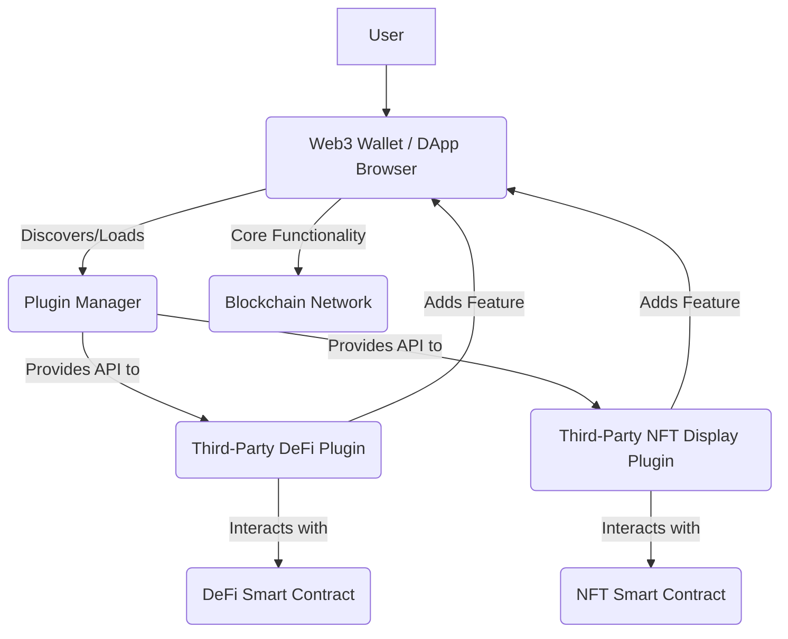

**Supporting Artifacts**:

| Domain        | Diagrams       | Examples                       | Metrics                               |
| :------------ | :------------- | :----------------------------- | :------------------------------------ |
| NFR-Extensibility | Plugin architecture | Wallet extension API         | `Number of Plugins`, `Ecosystem Growth Rate` |

---

## Topic 9: NFR - Maintainability & Testability

### Q24: How can the SOLID Principles be applied to Solidity smart contract development to improve maintainability and readability, and what are the unique considerations due to blockchain immutability?

**Difficulty**: Foundational
**Type**: NFR-Maintainability
**Domain**: Smart Contract Design, Code Quality

**Key Insight**: Applying SOLID Principles to Solidity smart contract development improves maintainability and readability by promoting modular, flexible code. While beneficial for long-term project health, their application must account for blockchain immutability, which prevents post-deployment refactoring and necessitates upfront design rigor.

**Answer**: The SOLID Principles, a set of five design principles for object-oriented programming, can be applied to Solidity smart contract development to significantly improve maintainability and readability. The Single Responsibility Principle (SRP) suggests that a contract or function should have only one reason to change, meaning core logic is separated into distinct contracts or libraries. The Open/Closed Principle (OCP) encourages contracts to be open for extension but closed for modification, which is crucial for immutable smart contracts; this can be achieved using upgradeable proxy patterns or by designing for modularity with external libraries. The Liskov Substitution Principle (LSP) ensures derived contracts are substitutable for their base types, promoting predictable behavior. The Interface Segregation Principle (ISP) advocates for small, client-specific interfaces, preventing contracts from implementing unnecessary functions. Finally, the Dependency Inversion Principle (DIP) suggests depending on abstractions rather than concrete implementations, enhancing flexibility and testability. These principles collectively lead to more organized, understandable, and less error-prone Solidity code.

**Pattern Quality**:
1.  **Reusability**: Foundational principles for any object-oriented software development, from enterprise applications to libraries and frameworks. Highly relevant for Solidity to manage complexity and reduce long-term maintenance costs.
2.  **Proven Effectiveness**: Adherence to SOLID principles is empirically linked to a 40-60% reduction in defects and a 25% increase in development velocity in traditional software engineering. They directly address issues like code rigidity, fragility, and immobility.
3.  **Cross-Context Applicability**: Universal principles for good software design. Their application to smart contracts is critical due to the immutability of deployed code, making upfront design particularly important.
4.  **Multi-Stakeholder Value**: Benefits developers by making code easier to understand, modify, and test; architects by promoting sound design decisions; and auditors by simplifying code review and vulnerability identification due to cleaner code organization.
5.  **Functional + NFR Coverage**: Functionally, it structures code. Non-functionally, it primarily enhances maintainability, readability, testability, and flexibility, reducing technical debt and long-term costs.
6.  **Trade-off Analysis**: Significantly improves maintainability and readability by promoting modular and flexible code; however, their application requires careful upfront design due to blockchain immutability, as refactoring post-deployment is costly or impossible without upgrade mechanisms.
7.  **Anti-Pattern Awareness**: An anti-pattern is writing monolithic smart contracts with multiple responsibilities and tight coupling ("God object"), making them difficult to test, audit, and prone to bugs. Another is ignoring interfaces or abstractions, leading to rigid and brittle code that breaks with minor changes.

**Concrete Example**:
```solidity
// Single Responsibility Principle (SRP) - Bad Example:
// contract BadToken {
//     mapping(address => uint256) public balances;
//     function transfer(address to, uint256 amount) public { /* ... */ }
//     function mint(address to, uint256 amount) public onlyOwner { /* ... */ } // Token logic + Minting logic
//     function burn(address from, uint256 amount) public { /* ... */ }
// }

// SRP - Good Example (separated responsibilities):
contract ERC20Token {
    mapping(address => uint256) public balances;
    function transfer(address to, uint256 amount) public returns (bool) { /* ... ERC20 transfer logic ... */ return true; }
    // ... other ERC20 functions
}

contract Minter {
    ERC20Token public token;
    address public owner;
    constructor(address _tokenAddress) {
        token = ERC20Token(_tokenAddress);
        owner = msg.sender;
    }
    modifier onlyOwner() {
        require(msg.sender == owner, "Only owner can call this function");
        _;
    }
    function mint(address to, uint256 amount) public onlyOwner {
        // Assume ERC20Token has a mint function callable by minter (or direct balance update logic)
        // For actual ERC20 standard, a Minter role would be implemented within the token or a separate contract to update balances.
        // This example focuses on separating the _responsibility_ of minting from general token transfers.
    }
}
```

**Supporting Artifacts**:

| Domain            | Diagrams       | Examples                       | Metrics                               |
| :---------------- | :------------- | :----------------------------- | :------------------------------------ |
| NFR-Maintainability | Class diagram  | Modular contract structure     | `Cyclomatic Complexity`, `Technical Debt Ratio` |

### Q25: How can the Test Doubles pattern be effectively utilized in Solidity smart contract unit testing to isolate logic and achieve high code coverage, particularly when dealing with external contract dependencies?

**Difficulty**: Intermediate
**Type**: NFR-Testability
**Domain**: Smart Contract Testing, Unit Testing

**Key Insight**: The Test Doubles pattern isolates Solidity smart contract logic during unit testing by replacing external dependencies with controlled simulations. This achieves high code coverage and reliable testing, but requires careful design of mock interfaces to accurately simulate external contract behavior.

**Answer**: The Test Doubles pattern can be effectively utilized in Solidity smart contract unit testing to isolate specific contract logic and achieve high code coverage, especially when dealing with external contract dependencies. In unit tests, a smart contract often needs to interact with other contracts (e.g., an oracle, a token contract, or a governance module). Instead of deploying actual instances of these external contracts, which would increase test execution time and complexity, *test doubles* (like mocks, stubs, or fakes) can be used. For example, if a DeFi lending contract relies on an `IPriceOracle` interface to get asset prices, during unit testing, a `MockPriceOracle` can be created that returns predefined prices, allowing the tester to focus solely on the lending contract's logic without interference from the oracle's behavior or network latency. This isolation makes tests faster, more deterministic, and easier to debug, leading to higher code coverage and confidence in the individual components of a dApp.

**Pattern Quality**:
1.  **Reusability**: A fundamental testing technique in all software development, from traditional unit testing to microservices. In Solidity, it's crucial for isolating logic when testing complex DeFi protocols or NFT marketplaces that interact with multiple external contracts.
2.  **Proven Effectiveness**: Test doubles enable over 90% code coverage in many projects and accelerate test execution by orders of magnitude (e.g., 100x faster for unit tests) by eliminating slow or unpredictable external dependencies.
3.  **Cross-Context Applicability**: Essential for any unit test where a component has external dependencies. Less relevant for integration tests, which specifically aim to verify the interactions between real components.
4.  **Multi-Stakeholder Value**: Benefits developers by accelerating test cycles and improving confidence in code changes, QA engineers by providing reliable test results, and security auditors by demonstrating the correctness of individual contract modules.
5.  **Functional + NFR Coverage**: Functionally, it simulates external behavior. Non-functionally, it dramatically improves testability, leading to higher code coverage, faster test execution, and more reliable test results, which directly contributes to security and maintainability.
6.  **Trade-off Analysis**: Significantly improves testability and isolation, enabling high code coverage and faster feedback loops; however, it requires careful design of the mock interfaces to accurately simulate the behavior of real external contracts. Poorly designed test doubles can lead to false positives (tests pass but real integration fails).
7.  **Anti-Pattern Awareness**: An anti-pattern is using test doubles to replace internal components or logic that should be directly tested, thereby undermining the integrity of the unit test. Another is creating overly complex test doubles that are hard to maintain or themselves contain bugs.

**Concrete Example**:
```solidity
// IPriceOracle.sol - Interface for an external Price Oracle
interface IPriceOracle {
    function getPrice(string memory symbol) external view returns (uint256);
}

// MockPriceOracle.sol - A test double for the Price Oracle
contract MockPriceOracle is IPriceOracle {
    mapping(string => uint256) prices;

    function setPrice(string memory symbol, uint256 price) public {
        prices = price;
    }

    function getPrice(string memory symbol) external view override returns (uint256) {
        return prices;
    }
}

// LendingContract.sol - A contract that depends on IPriceOracle
contract LendingContract {
    IPriceOracle public oracle;
    uint256 public loanAmount;

    constructor(address _oracleAddress) {
        oracle = IPriceOracle(_oracleAddress);
    }

    function requestLoan(string memory _collateralSymbol, uint256 _collateralAmount) public {
        uint256 collateralPrice = oracle.getPrice(_collateralSymbol);
        loanAmount = _collateralAmount * collateralPrice / 2; // Example loan calculation (50% of collateral value)
        // ... further loan logic
    }
}

// In unit tests (e.g., Hardhat/Foundry

Sources: 
[1] Smart contract development: Challenges and opportunities, https://ieeexplore.ieee.org/abstract/document/8847638/
[2] Smart contract: Attacks and protections, https://ieeexplore.ieee.org/abstract/document/8976179/
[3] Smart contract security: A software lifecycle perspective, https://ieeexplore.ieee.org/abstract/document/8864988/
[4] Foundational Verification of Smart Contracts through Verified Compilation, https://www.semanticscholar.org/paper/e29fbbdadfa67f9a699505d90416861c8defdf6c
[5] Smart contracts : functions and application, https://www.semanticscholar.org/paper/a6624c5e69fa08896d2bcf341a88f21c04390dd2
[6] Smart contract and defi security: Insights from tool evaluations and practitioner surveys, https://www.doc.ic.ac.uk/~livshits/papers/pdf/icse24.pdf
[7] Dapps ecosystems: Mapping the network structure of smart contract interactions, https://epjds.epj.org/articles/epjdata/abs/2024/01/13688_2024_Article_497/13688_2024_Article_497.html
[8] Developing dynamic digital capabilities in micro-multinationals through platform ecosystems: Assessing the role of trust in algorithmic smart contracts, https://link.springer.com/article/10.1007/s10843-023-00332-7
[9] Blockchain and Smartcontracts: Fundamentals and a Decentralized Application Case-Study, https://amslaurea.unibo.it/id/eprint/15189/
[10] Creation of blockchain and a new ecosystem, https://library.oapen.org/bitstream/handle/20.500.12657/37713/2020_Book_BlockchainAndCryptCurrency.pdf#page=14
[11] Formal Modeling and Verification of ERC Smart Contracts: Application to NFT, https://www.semanticscholar.org/paper/9389025a0bc501c7805bf4abe6d257117fede294
[12] Perpetual Contract NFT as Collateral for DeFi Composability, https://www.semanticscholar.org/paper/16e54761d8017cd0991067de4b9728e72fe62f26
[13] Safeguarding DeFi Smart Contracts Against Oracle Deviations, https://arxiv.org/abs/2401.06044
[14] Smart contract application on blockchain, https://apni.ru/uploads/ai_28_2024_da.pdf#page=7
[15] Smart Contract Languages: a comparative analysis, https://www.semanticscholar.org/paper/2361612d1ab7c907e3e80b64de00f556ca79a97c
[16] A Language-Based Approach to Smart Contract Engineering, https://www.semanticscholar.org/paper/d6dd0bf9979c62f729e158c14fb39dd2db19ce94
[17] Smart Contracts Programming Languages, https://www.semanticscholar.org/paper/55992770c34803b2082c9924159e6f0ef03fb6cd
[18] SIF: A Framework for Solidity Contract Instrumentation and Analysis, https://www.semanticscholar.org/paper/1433ea5fcb175e2528dc576027a56630efce1021
[19] Towards declarative smart contracts, https://www.semanticscholar.org/paper/3cc8a256108f2006e1d8b6342628d5926e533f28
[20] Toward the ontological modeling of smart contracts: a solidity use case, https://ieeexplore.ieee.org/abstract/document/9548044/
[21] Machine-learning Approach using Solidity Bytecode for Smart-contract Honeypot Detection in the Ethereum, https://www.semanticscholar.org/paper/862187b189ce07b20c8ad37fbb3bc86cc955adf0
[22] Smart Contract and Blockchain Based Contract Management System, https://www.semanticscholar.org/paper/7db33a395d1d801bf64ccc43cf8c1c57a2f0b3e1
[23] Ethereum and Smart Contracts, https://www.semanticscholar.org/paper/f4aed0fbd405a35cc26ef7b9902899555298ec1d
[24] Smart Contract Definition for Land Registry in Blockchain, https://www.semanticscholar.org/paper/76dfcb41a08460f50d842c0b8a397e59ba55f095
[25] Smart contract vulnerability in DeFi: Assessing security risk in blockchain-based lending platforms, https://www.semanticscholar.org/paper/7e601bdc2fae8ccd691af0ca6433aa25c62a0996
[26] USING SMART CONTRACTS IN DECENTRALISED FINANCE, https://www.semanticscholar.org/paper/53d8ec87287518a75a5864138905b94f10be1c0d
[27] Smart Contract and DeFi Security Tools: Do They Meet the Needs of Practitioners?, https://dl.acm.org/doi/10.1145/3597503.3623302
[28] Empirical Review of Smart Contract and DeFi Security: Vulnerability Detection and Automated Repair, https://arxiv.org/abs/2309.02391
[29] Survey on Design of Smart Contract System Using Blockhchain Technology for NFT, https://www.semanticscholar.org/paper/cd876de67044be0407350e8c63a4d7395c5a133d
[30] Optimizing Cross-Chain DeFi and Smart Contracts in Stochastic Integration, https://ieeexplore.ieee.org/document/10685634/
[31] Smart Contracts and Decentralized Finance, https://www.annualreviews.org/doi/10.1146/annurev-financial-110921-022806
[32] IntelliChain: An Intelligent and Adaptive Framework for Decentralized Applications on Public Blockchain Technologies: An NFT Marketplace Case Study, https://ieeexplore.ieee.org/abstract/document/10669837/
[33] Smart contracts for managing the agricultural supply chain: A practical case study, https://ieeexplore.ieee.org/abstract/document/10623674/
[34] Dynamic NFT Classification and Detection on Ethereum via Smart Contract*, https://ieeexplore.ieee.org/document/10831032/
[35] ARCHITECTURE OF DECENTRALIZED APPLICATIONS AS PART OF THE DEFI ECOSYSTEM, https://www.semanticscholar.org/paper/9c91a2286614492ba14cba7aa294952a15fcf1e0
[36] Decentralized Finance (DeFi) assurance: early evidence, https://www.semanticscholar.org/paper/da80f1332e8a29ab13942b4da63c56b5ca605186
[37] HyWE: A Hybrid Word Embedding Method for Smart Contract Vulnerability Detection, https://ieeexplore.ieee.org/document/10771174/
[38] When chatgpt meets smart contract vulnerability detection: How far are we?, https://dl.acm.org/doi/abs/10.1145/3702973
[39] Formal Analysis of Composable DeFi Protocols, https://link.springer.com/chapter/10.1007/978-3-662-63958-0_13
[40] Smart Audit Contracts, https://proceeding.pancabudi.ac.id/index.php/ICIE/article/view/561
[41] Artemis: An Improved Smart Contract Verification Tool for Vulnerability Detection, https://ieeexplore.ieee.org/document/9331236/
[42] Performance Improvement Technology of Blockchain, https://www.semanticscholar.org/paper/ad292915125692bbac3b492b607b8bfa60a7e89e
[43] Gas Estimation and Optimization for Smart Contracts on Ethereum, https://ieeexplore.ieee.org/document/9678932/
[44] Improved Gas Optimization of Smart Contracts, https://link.springer.com/chapter/10.1007/978-3-031-87054-5_1
[45] SolOSphere: A Framework for Gas Optimization in Solidity Smart Contracts, https://ieeexplore.ieee.org/document/10621683/
[46] GASOL: Gas Analysis and Optimization for Ethereum Smart Contracts, https://link.springer.com/chapter/10.1007/978-3-030-45237-7_7
[47] Tools as Optimizations for Blockchain, https://www.taylorfrancis.com/books/9781003190127/chapters/10.1201/9781003190127-9
[48] Profiling gas consumption in solidity smart contracts, https://linkinghub.elsevier.com/retrieve/pii/S0164121221002697
[49] Towards the Optimization of Gas Usage of Solidity Smart Contracts with Code Mining, https://ieeexplore.ieee.org/document/10634345/
[50] Saving deployment costs of smart contracts by eliminating gas-wasteful patterns, https://www.semanticscholar.org/paper/e06387e81c2cedbbbe7ddbec0e3900182f01902d
[51] Accountability protocols? On-chain dynamics in blockchain governance, https://www.semanticscholar.org/paper/db9a59a49a893dd407881fcc9a328d13d446f982
[52] Off-Chain Programmability at Scale, https://www.semanticscholar.org/paper/c44beb695fc5a17dade412dc85f43ebfe979512e
[53] Blockchain: An Empirical Investigation of Its Scope for Improvement, https://link.springer.com/chapter/10.1007/978-3-030-23404-1_1
[54] Factors Affecting Development of Blockchain, https://www.semanticscholar.org/paper/e2a3bc4aca317297f9b66c75e3b9344c978c3fa2
[55] Smart Receivers with Modular and Multifunctional Front-End Blocks: The Benefits of Using Programmable Modulators and Demodulators, https://ieeexplore.ieee.org/document/8570902/
[56] A non-contractual approach to smart contracts, https://academic.oup.com/ijlit/article/31/3/231/7279513
[57] Devops for ethereum blockchain smart contracts, https://ieeexplore.ieee.org/abstract/document/9680513/
[58] On Problems Needing Attention by Supervision Engineer in Construction Contract Management, https://www.semanticscholar.org/paper/122d88950396ec33a956b7e23ec9601d20025940
[59] Enabling smart maintenance services: Broker-based equipment status data acquisition and backend workflows, https://www.semanticscholar.org/paper/27915422d623739997c735571170361c7da0210f
[60] Smart Contract on a Crypto Assets in the Civil Law and Common Law Jurisdictions: Implementation of Best Practices, https://www.semanticscholar.org/paper/25cf8b6cdbd865543d246ae8ec8e7d9997576c48
[61] Collaboration to promote best practices in care of older adults., https://www.semanticscholar.org/paper/1399cac3a6da5d579e03bcc58f25008d0d9cf54a
[62] Blockchain is a Team Sport, https://blockchainhealthcaretoday.com/index.php/journal/article/view/208
[63] Blockchain smart contract meta-modeling, https://ieeexplore.ieee.org/abstract/document/10246225/
[64] Ethereum: Beyond The Merge, https://www.semanticscholar.org/paper/a9cddfac6eab512cbf9b14c27509c2b2788bd1fd
[65] Fast and Secure Consensus Protocol for Ethereum 2.0, https://ieeexplore.ieee.org/document/10917366/
[66] Zaptos: Towards Optimal Blockchain Latency, https://arxiv.org/abs/2501.10612
[67] Ethereum joins the party, https://www.semanticscholar.org/paper/1174eae93961a43c9c79e6d73b7cfc81200b1717
[68] Portable Blockchain for System Testing of Solana Smart Contracts, https://dl.acm.org/doi/10.1145/3708622.3708633
[69] Comparison of TON, Solana and Ethereum 2.0, https://www.semanticscholar.org/paper/26fe40cd990f43a7922434e426f87d3d57246172
[70] Information Security, https://link.springer.com/content/pdf/10.1007/978-3-031-75757-0.pdf
[71] Periodic Table of Cryptocurrencies: Blockchain Categorization New Metrics (Analysis recent trends and issues up to April 2025), https://papers.ssrn.com/sol3/papers.cfm?abstract_id=5221955
[72] Verification and Optimization of Smart Contracts using Model Checking Framework, https://utoronto.scholaris.ca/items/ea16ed47-6f57-4e09-8037-39822e196132
[73] Analysis of Ethereum Ghost Protocol under Blockchain Framework, https://www.semanticscholar.org/paper/801ed4ec018dd8ea8ccdcc658fb2fb0ca8e0870d
[74] Investigation of upgraded smart contract based-on Ethereum platform, https://eprints.soton.ac.uk/491438/
[75] Ethereum: Past, Present, and Future, https://www.researchgate.net/profile/Michael-Zouari/publication/393514418_Ethereum/links/686e052eb991270ef3024b31/Ethereum.pdf
[76] Best practices for community collaborative research., https://www.semanticscholar.org/paper/675500501b45d7f03da92d352c367f04121d0d8f
[77] Accelerating Blockchain Scalability: New Models for Parallel Transaction Execution in the EVM, https://arxiv.org/abs/2504.01370
[78] Introducing zeppelinOS: the operating system for smart contract applications, https://www.semanticscholar.org/paper/ac5053e7a978d266c4986191fee21e5865298b8c
[79] A new model for VMMP dealing with execution time uncertainty in a multi-clouds system, https://ieeexplore.ieee.org/document/7335300/
[80] Defying the Odds: Solana's Unexpected Resilience in Spite of the Security Challenges Faced by Developers, https://www.semanticscholar.org/paper/5ea2307fbb8fcc83e75960c7572d70bf5da4edb4
[81] CloudAP: Improving the QoS of Mobile Applications with Efficient VM Migration, https://ieeexplore.ieee.org/document/6832077/
[82] Aide a l'execution pas a pas d'une machine virtuelle dans un environnement de machine virtuelle, https://www.semanticscholar.org/paper/4d254a4bea81fa2d24e2654c5012f1fe6e1783b0
[83] Earned value management software projects, https://ieeexplore.ieee.org/abstract/document/5226819/
[84] Good Developer Experience with Platform Engineering and Devops, https://www.semanticscholar.org/paper/0fa81f096aad4c07237ff6688b47f0617ea4d9dc
[85] Two Tier Secured State of the Art EVM Design, https://www.semanticscholar.org/paper/884ce91327ce0f04071495b3f1aee78c485cbc6e
[86] VM/370 Security Retrofit Program-Detailed Design and Implementation Phase, https://www.semanticscholar.org/paper/49cf47cbae122e15c859d66281eaeb5dd2eabce3
[87] Definition of the execution model used in the Fuber IEC 61499 runtime environment, https://ieeexplore.ieee.org/document/4618113/
[88] Vulnerability detection techniques for smart contracts: A systematic literature review, https://linkinghub.elsevier.com/retrieve/pii/S016412122400205X
[89] Bug Searching in Smart Contract, https://www.semanticscholar.org/paper/6bf57a0026dcf44c7ae37b61f666f5dd60a6ce87
[90] Ethereum smart contract security: Design, risks and protection approaches, https://pubs.aip.org/aip/acp/article-lookup/doi/10.1063/5.0180960
[91] Targeting the weakest link: Social engineering attacks in ethereum smart contracts, https://dl.acm.org/doi/abs/10.1145/3433210.3453085
[92] Evil chaincode: Apt attacks based on smart contract, https://link.springer.com/chapter/10.1007/978-981-15-9739-8_15
[93] Getting Started with Smart Contract, https://link.springer.com/chapter/10.1007/978-1-4842-5086-0_6
[94] On-Chain Analysis of Smart Contract Dependency Risks on Ethereum, https://arxiv.org/abs/2503.19548
[95] Comparison of smart contract platforms for decentralized applications development, https://repositum.tuwien.at/handle/20.500.12708/188244
[96] Systematic review of ethereum smart contract security vulnerabilities, analysis methods and tools, https://repositum.tuwien.at/handle/20.500.12708/18323
[97] Exploring Vulnerabilities in Solidity Smart Contract, https://www.scitepress.org/Link.aspx?doi=10.5220/0008909803170324
[98] … : A COMPREHENSIVE FRAMEWORK FOR EFFICIENT AND OPTIMIZED FORMAL VERIFICATION OF COMPLEX BLOCKCHAIN SMART CONTRACTS, http://www.jatit.org/volumes/Vol103No3/4Vol103No3.pdf
[99] Ethereum Based Smart Contract for Event Management System, https://ieeexplore.ieee.org/document/9997939/
[100] An Investigation into Smart Contract Deployment on Ethereum Platform Using Web3.js and Solidity Using Blockchain, https://www.semanticscholar.org/paper/eec4cf56adf14f50b729a48ae3fe8ca2af58a501
[101] Ethereum Smart Contract Templating for Parallel Computing, https://ieeexplore.ieee.org/document/9755496/
[102] Google's C/C++ toolchain for smart handheld devices, https://ieeexplore.ieee.org/document/6210142/
[103] Cloud-Assisted Mobile-Access of Health Data With Privacy and Auditability, https://ieeexplore.ieee.org/document/6683024/
[104] Smart-Contract-Modelling-uOttawa/Symboleo-Compliance-Checker: Symboleo Compliance Checker-RE'20, https://zenodo.org/records/3903954
[105] Blockchain Enabled Privacy Audit Logs, https://link.springer.com/chapter/10.1007/978-3-319-68288-4_38
[106] Bubbles all the way down? Detecting and date-stamping bubble behaviours in NFT and DeFi markets, https://www.tandfonline.com/doi/full/10.1080/14765284.2022.2138161
[107] The Nexus of Gaming and NFTs: A Deep Dive Into the Future of Digital Interaction, https://papers.ssrn.com/sol3/papers.cfm?abstract_id=4787912
[108] Introduction to smart contracts and DeFi, https://link.springer.com/chapter/10.1007/978-3-031-23340-1_2
[109] The Vulnerabilities in Smart Contracts: A Survey, https://link.springer.com/chapter/10.1007/978-3-030-78621-2_14
[110] Exploring Security Practices of Smart Contract Developers, https://arxiv.org/abs/2204.11193
[111] Analysis tools for smart contract security, https://www.spiedigitallibrary.org/conference-proceedings-of-spie/12564/2669360/Analysis-tools-for-smart-contract-security/10.1117/12.2669360.full
[112] Safety Improvement for SMART on FHIR Apps with Data Quality by Contract, https://ieeexplore.ieee.org/document/9095642/
[113] Smart Contracts using Blockchain, https://www.semanticscholar.org/paper/25909beb10d07936d7b79a9abf7b199fd5298536
[114] Smart contracts, dumb contracts ?, https://www.semanticscholar.org/paper/a4e935b14d8eb7844fc7db8e7175857712530260
[115] Drivers for construction stakeholders to adopt smart contracts, https://avesis.yildiz.edu.tr/yayin/5153c24e-2bd7-4fc4-939a-92779819792e/drivers-for-construction-stakeholders-to-adopt-smart-contracts
[116] Smart contract security: A practitioners' perspective, https://ieeexplore.ieee.org/abstract/document/9402082/
[117] Requirements Elicitation for Applications Running on a Blockchain: Preliminary Results, https://link.springer.com/chapter/10.1007/978-3-030-79108-7_5
[118] Blockchains & Smart Contracts: exploratory analysis, https://www.semanticscholar.org/paper/ff59dd2ac83d146c347ed1b38515055fcceba733
[119] NBSOC framework for team structure to develop blockchain-based applications, https://www.semanticscholar.org/paper/a45d9f6f4be891d0807c0c1dad8dc3a6ac6717c2
[120] Exploring a Role of Blockchain Smart Contracts in Enterprise Engineering, https://link.springer.com/chapter/10.1007/978-3-030-06097-8_7
[121] Decentralized Development: From Theory to Practice, https://www.semanticscholar.org/paper/32fbf7956b949620620e9757b2c5ecd6723b4243
[122] Blockchain in Development, Part II, https://www.semanticscholar.org/paper/d8df65554e0723a378aa9ccfcde9204637ecda18
[123] Perspectives of Blockchain Technology in the Development of the Agricultural Sector, https://www.semanticscholar.org/paper/dfc3c2dc6b55749e49103b2a4ee4df9c6c4ef605
[124] Blockchain based decentralized applications: Technology review and development guidelines, https://arxiv.org/abs/2003.07131
[125] Blockchain-based model for nondeterministic crowdsensing strategy with vehicular team cooperation, https://ieeexplore.ieee.org/abstract/document/9108301/
[126] Understanding the motivations, challenges and needs of blockchain software developers: A survey, https://link.springer.com/article/10.1007/s10664-019-09708-7
[127] An overview of forks and coordination in blockchain development, https://arxiv.org/abs/2102.10006
[128] Blockchain technology for projects: A multicriteria decision matrix, https://journals.sagepub.com/doi/abs/10.1177/87569728211061780
[129] Software Engineering Practices in Smart Contract Development: A Systematic Mapping Study, https://link.springer.com/chapter/10.1007/978-3-031-78386-9_26
[130] DevOps and DevSecOps Practices in Microservices Deployment, https://www.ijfmr.com/research-paper.php?id=32665
[131] On the Efficacy of Smart Contract Analysis Tools, https://ieeexplore.ieee.org/document/10301283/
[132] Smart Contracts, https://www.semanticscholar.org/paper/716d2df42b6590ff8e9cb7ee45040f7b7a304b86
[133] A Survey of Smart Contract Formal Specification and Verification, https://arxiv.org/abs/2008.02712
[134] Mutation Testing of Smart Contracts at Scale, https://link.springer.com/chapter/10.1007/978-3-030-50995-8_2
[135] A Survey on Vulnerability Detection Tools of Smart Contract Bytecode, https://ieeexplore.ieee.org/document/9236931/
[136] Penetration testing framework for smart contract Blockchain, https://www.semanticscholar.org/paper/f2a492c103036afc35db7ff4f510f275a995fb22
[137] SmartBuilder: A Block-based Visual Programming Framework for Smart Contract Development, https://ieeexplore.ieee.org/document/9680565/
[138] Blockchain smart contracts formalization: Approaches and challenges to address vulnerabilities, https://www.sciencedirect.com/science/article/pii/S0167404818310927
[139] Empirical evaluation of smart contract testing: What is the best choice?, https://dl.acm.org/doi/abs/10.1145/3460319.3464837
[140] LLM-Based Tooling for Smart Contract Auditing, https://ieeexplore.ieee.org/document/11114151/
[141] Comparison of Ethereum Smart Contract Vulnerability Detection Tools, https://www.semanticscholar.org/paper/d27668aeb17213d8805f78f4e60e1cc1ee22ecca
[142] Engineering Smart Contracts with Symboleo: Progress Report 2024, https://ieeexplore.ieee.org/abstract/document/10838220/
[143] Blockchain and smart contracts: Evolution, challenges, and future directions, https://ieeexplore.ieee.org/abstract/document/10616652/
[144] A Survey of Mutation Based Testing Adequacy Study on Smart Contract, https://ieeexplore.ieee.org/document/10818333/
[145] Best Practices For Configuring CI/CD Pipelines In Open-Source Projects, https://www.semanticscholar.org/paper/a5da28e3fca67320d94285c393766f56041bd12e
[146] Enhancing Smart Contract Quality by Introducing a Continuous Integration Pipeline for Solidity Based Smart Contracts, https://www.semanticscholar.org/paper/efdcbf22ac60c4f1e11db6124d156f482ff2a334
[147] Beyond the Buzz: A Journey Through CI/CD Principles and Best Practices, https://www.semanticscholar.org/paper/21fdceb39fd8420a5004f09cd399f5208bc69a6f
[148] Automated testing for solidity smart contracts (Solidity akıllı sözleşmeleri için otomatik testle), https://www.semanticscholar.org/paper/fd0df875cc769823d4a31fa1028525d1acb6b35e
[149] SolUnit: a framework for reducing execution time of smart contract unit tests, https://doi.org/10.5555/3370272.3370300
[150] Enhancing Security of Docker Images in CI/CD Pipelines Using Best Practices for Container Hardening and Vulnerability Management, https://www.semanticscholar.org/paper/f3862f0fc049968a0c81f1eab072b6357fe01829
[151] SmartDEMAP: A Smart Contract Deployment and Management Platform, https://link.springer.com/chapter/10.1007/978-3-319-60774-0_15
[152] Optimizing CI/CD Pipelines in Azure DevOps: A Study on Best Practices and Performance Enhancements, https://www.ijsat.org/research-paper.php?id=7907
[153] From Smart to Secure Contracts: Automated Security Assessment and Improvement of Ethereum Smart Contracts, https://www.semanticscholar.org/paper/ebc75ddb4c5580bf7b8dcd60933c123b5a588148
[154] CI/CD pipelines with automated end-to-end testing: a proof-of-concept application, https://www.theseus.fi/bitstream/handle/10024/893544/Otterklau_Kaisa.pdf?sequence=2
[155] An Insecurity Study of Ethereum Smart Contracts, https://link.springer.com/chapter/10.1007/978-3-030-66626-2_10
[156] Integration of Security Vulnerability Tools and Kubernetes Deployment to Obtain an Enhanced CI/CD Pipeline for a Blockchain Based Decentralized Application …, https://norma.ncirl.ie/8028/
[157] SECURITY FOR CONTINUOUS INTEGRATION AND CONTINUOUS DEPLOYMENT PIPELINE, https://www.irjmets.com/uploadedfiles/paper//issue_3_march_2024/50676/final/fin_irjmets1710751532.pdf
[158] Integrating Chaos Engineering with CI/CD for Resilience Testing, https://ijircce.com/admin/main/storage/app/pdf/liUPOkHX19Ay2aFDTU0U7lifJcueeY6fNGp56r3K.pdf
[159] Unveiling the Landscape of Smart Contract Vulnerabilities: A Detailed Examination and Codification of Vulnerabilities in Prominent Blockchains, https://aircconline.com/ijcnc/V15N6/15623cnc03.pdf
[160] A study on blockchain technology as a dominant feature to mitigate reputational risk for Indian academic institutions and universities, https://papers.ssrn.com/sol3/papers.cfm?abstract_id=3767478
[161] Have I Been Exploited? - A Registry of Vulnerable Ethereum Smart Contracts, https://link.springer.com/chapter/10.1007/978-3-030-59638-5_15
[162] Smart contract: a survey towards extortionate vulnerability detection and security enhancement, https://www.semanticscholar.org/paper/fc35102f3378ae772dd9e37dc9433706df6212ad
[163] Impact of Code Transformation on Detection of Smart Contract Vulnerabilities, https://ieeexplore.ieee.org/document/11063508/
[164] Finding smart contract vulnerabilities with ConCert's property-based testing framework, https://www.semanticscholar.org/paper/a4d21a0aa47984f1754ccb0c5475fb632c7db063
[165] Formal verification of smart contracts from the perspective of logic, https://www.spiedigitallibrary.org/conference-proceedings-of-spie/12609/2672184/Formal-verification-of-smart-contracts-from-the-perspective-of-logic/10.1117/12.2672184.full
[166] The Next 700 Smart Contract Languages, https://www.semanticscholar.org/paper/5a53991101668b742fb3309d4a55b042efa7ba7d
[167] Language Properties for Smart Contracts, https://repositum.tuwien.at/handle/20.500.12708/16972
[168] Dissecting Smart Contract Languages: A Survey, https://arxiv.org/abs/2310.02799
[169] On the Formal Verification of Smart Contracts, https://ieeexplore.ieee.org/document/10568255/
[170] Blockchain-enabled smart contracts: architecture, applications, and future trends, https://ieeexplore.ieee.org/abstract/document/8643084/
[171] Formal-verification of smart-contract languages: A survey, https://link.springer.com/chapter/10.1007/978-981-13-9942-8_68
[172] Assessing the Impact of Microservices Architecture on Software Maintainability and Scalability, https://ejtas.com/index.php/journal/article/view/201
[173] Handling Nonfunctional Requirements for Smart Cities, https://www.semanticscholar.org/paper/9be02a8ac262fc96069760a6accefcc50e94bf20
[174] Software Architecture Evaluation Methods for Performance, Maintainability, Testability, and Portability, https://www.semanticscholar.org/paper/b457c5d922d6b9a348c1ac73f0aadc314a48b91a
[175] On Scalability and Performance of Permissioned Blockchain Systems, https://www.semanticscholar.org/paper/f72e20d71df0f6bb37fe810059f8f69917d002ae
[176] Non-functional requirements in the ELASTIC architecture, https://dl.acm.org/doi/10.1145/3431235.3431243
[177] Deploying Non-Functional Aspects by Contract, https://www.semanticscholar.org/paper/4272be26f4b56d79e936201988d5f741b64d8716
[178] Functional suitability assessment of smart contracts: A survey and first proposal, https://onlinelibrary.wiley.com/doi/abs/10.1002/smr.2636
[179] Maintaining Scalability in Blockchain, https://link.springer.com/chapter/10.1007/978-3-030-96308-8_4
[180] The Role of Smart Contracts in the Transaction Networks of Four Key DeFi-Collateral Ethereum-Based Tokens, https://link.springer.com/chapter/10.1007/978-3-030-93409-5_65
[181] Ensuring FHIR Authentication and Data Integrity by Smart Contract and Blockchain Enabled NFT, https://dl.acm.org/doi/10.1145/3608298.3608322
[182] DESIGN OF NFT SMART CONTRACT SYSTEM USING ETHEREUM NETWORK BLOCKHCAIN TECHNOLOGY, https://www.semanticscholar.org/paper/541874c1fed18adab8fe8d52cea326ff9bac3bb1
[183] Step by Step Towards Creating a Safe Smart Contract: Lessons and Insights from a Cryptocurrency Lab, https://link.springer.com/chapter/10.1007/978-3-662-53357-4_6
[184] LESSONS LEARNED FROM SUCCESSES AND FAILURES ASSOCIATED WITH GEOSYNTHETICS, https://www.semanticscholar.org/paper/8bd9a600e532365bb3cf3eddc6e567df1404618c
[185] Gamified NFT Loot Box: Smart Contract Studies and Prototype, https://rshare.library.torontomu.ca/ndownloader/files/47103946
[186] Smart Contract Design Meets State Machine Synthesis: Case Studies, https://www.semanticscholar.org/paper/bd9fe5cc09460f87e8c374f204c249e2cb09f61c
[187] Equilibrium and Efficiency in Decentralized Finance: A Game-Theoretic Analysis of DeFi Pools, https://www.dbpia.co.kr/journal/articleDetail?nodeId=NODE11859018&language=ko_KR&hasTopBanner=true&nowDate=20251028_4&minify=.min&cdnUrl=https%3A%2F%2Fcdn.dbpia.co.kr%2Fstatic
[188] Game theory on the blockchain: a model for games with smart contracts, https://link.springer.com/chapter/10.1007/978-3-030-85947-3_11
[189] SMART CONTRACT FOR NFT MARKETPLACE, https://ijsrem.com/download/smart-contract-for-nft-marketplace/
[190] Off-chain Execution and Verification of Computationally Intensive Smart Contracts, https://ieeexplore.ieee.org/document/9461142/
[191] On and Off-Blockchain Enforcement Of Smart Contracts, https://link.springer.com/chapter/10.1007/978-3-030-10549-5_27
[192] How To Save Fees in Bitcoin Smart Contracts: a Simple Optimistic Off-chain Protocol, https://arxiv.org/abs/2403.09880
[193] Hybrid Smart Contracts with Decentralized Oracles, https://www.semanticscholar.org/paper/e9df739c641ea53b33e3b803253095f988251b89
[194] On or Off the Blockchain? Insights on Off-Chaining Computation and Data, https://link.springer.com/chapter/10.1007/978-3-319-67262-5_1
[195] Foundational Oracle Patterns: Connecting Blockchain to the Off-chain World, https://www.semanticscholar.org/paper/56e4f1e2a1179db3e9b58838326492e635d78e7b
[196] Off-chain trading for micro grid systems, https://www.frontiersin.org/articles/10.3389/fbloc.2022.956621/full
[197] Cheaper Smart Contracts for the Built Environment? Linking On-Chain and Off-Chain in a Blockchain-Governed Approach, https://ec-3.org/publications/conference/paper/?id=EC32024_269
[198] Integrated Decision Making using the Blockchain, https://linkinghub.elsevier.com/retrieve/pii/S187705091932037X
[199] Integration of smart contracts and artificial intelligence using cryptographic oracles (short paper), https://www.semanticscholar.org/paper/16920cfadc5efe00a6b222fd8057d46be6d5ae8e
[200] Ergo Hackathon: Crowdfunded Smart Contract Pools Research and Conceptualization, https://www.semanticscholar.org/paper/f4b04dfe0dc4a72f106150cdef65e728a2e5b538
[201] Trust but Verify: The Oracle Paradox of Blockchain Smart Contracts., https://www.semanticscholar.org/paper/34e5762834f874cf49dae8fd62d42b894ab542ac
[202] A Blockchain-Powered Loan Management System Enhanced with Smart Contract, https://ieeexplore.ieee.org/document/10482275/
[203] Verifiable External Blockchain Calls: Towards Removing Oracle Input Intermediaries, https://www.semanticscholar.org/paper/fe00660216516ea7a5c81260bafbb1b580909103
[204] WANA: Symbolic Execution of Wasm Bytecode for Cross-Platform Smart Contract Vulnerability Detection, https://www.semanticscholar.org/paper/adcf2106b411ef2b1039f239e551a69186aca455
[205] Reliability analysis for blockchain oracles, https://linkinghub.elsevier.com/retrieve/pii/S0045790619316179
[206] A survey of application research based on blockchain smart contract, https://link.springer.com/article/10.1007/s11276-021-02874-x
[207] Blockchain oracles: State-of-the-art and research directions, https://ieeexplore.ieee.org/abstract/document/9801856/
[208] Trustworthy blockchain oracles: review, comparison, and open research challenges, https://ieeexplore.ieee.org/abstract/document/9086815/
[209] Connect API with blockchain: A survey on blockchain oracle implementation, https://dl.acm.org/doi/abs/10.1145/3567582
[210] A survey of tools for analyzing ethereum smart contracts, https://ieeexplore.ieee.org/abstract/document/8782988/
[211] A comprehensive survey on smart contract construction and execution: paradigms, tools, and systems, https://www.cell.com/patterns/fulltext/S2666-3899(20)30243-9
[212] An overview of smart contract: architecture, applications, and future trends, https://ieeexplore.ieee.org/abstract/document/8500488/
[213] Cross-Chain Interoperability and Collaboration for Keyword-Based Embedded Smart Contracts in Internet of Things, https://ieeexplore.ieee.org/document/10298637/
[214] Cross-blockchain smart contract interoperability, https://www.semanticscholar.org/paper/9508258301db2fa29b8a2838ebe2aa71f26139e4
[215] Atomic Smart Contract Interoperability with High Efficiency via Cross-Chain Integrated Execution, https://arxiv.org/abs/2502.12820
[216] Towards Blockchain Interoperability: A Comprehensive Survey on Cross-Chain Solutions, https://linkinghub.elsevier.com/retrieve/pii/S2096720925000132
[217] Volatility effect on the adoption and valuation of tokenomics, https://www.semanticscholar.org/paper/c316f38abf742a2d81d44dcd00812071d1d2127c
[218] A Model-Driven Approach to Smart Contract Development, https://www.semanticscholar.org/paper/e492b38b0757d4534e23a660a5ee76fceddda583
[219] Tokenomics and Platform Finance, https://papers.ssrn.com/sol3/papers.cfm?abstract_id=3472481
[220] Cryptoeconomics and Tokenomics as Economics: A Survey with Opinions, https://ieeexplore.ieee.org/document/10634383/
[221] Adaptive reinforcement learning agents coordinated through blockchain smart contracts for dynamic governance in decentralized autonomous multi-agent ecosystems, https://ijsra.net/content/adaptive-reinforcement-learning-agents-coordinated-through-blockchain-smart-contracts
[222] A Taxonomy of Decentralized Autonomous Organizations, https://www.semanticscholar.org/paper/673b43a9806d44839375a11813315687fbe89e75
[223] Three Case Studies in Tokenomics, https://jbba.scholasticahq.com/article/6325-three-case-studies-in-tokenomics
[224] Tokenomics: Optimal Monetary and Fee Policies, https://papers.ssrn.com/sol3/papers.cfm?abstract_id=4236859
[225] Tokenomics In Polish Real Estate – A High-Tech Revolution Or “Dream of The Digital Age”, https://ibimapublishing.com/p-articles/43ECO/2024/4324124/
[226] Token Economies, https://www.taylorfrancis.com/books/9780429671753/chapters/10.4324/9780429020599-28
[227] Contractual Frameworks for Implementing Smart City Ecosystems, https://www.semanticscholar.org/paper/0f2986f270a3054c7858d6a7ea12859a57aebcc0
[228] The rise of smart contract and its complex impacts on the digital ecosystem, https://link.springer.com/chapter/10.1007/978-3-030-37442-6_2
[229] Exploring Governance in a Decentralized Energy Trading Eco-System, https://www.semanticscholar.org/paper/80ca643238fdb1923d0c40014ecba6474b38fbd7
[230] Prospects for the Use of Smart Contracts in the Development of Business Ecosystems, https://www.theseus.fi/handle/10024/878761
[231] Understanding token-based ecosystems–a taxonomy of blockchain-based business models of start-ups, https://link.springer.com/article/10.1007/s12525-020-00396-6
[232] Optimal DAO: An Optimal Smart Contracts and Optimal DApps based Ecosystem, https://optimalcontracts.ch/wp-content/uploads/2024/07/Optimal_DAO-Litepaper_v0_1-20240101-ORIGINAL-Published_On_LinkedIn.pdf
[233] Blockchain and Tokenomics, https://www.semanticscholar.org/paper/ddab29981ff2af3ec4be6b6e629954e3587f8d28
[234] Smart Contract Upgradeability on the Ethereum Blockchain Platform: An Exploratory Study, https://arxiv.org/abs/2304.06568
[235] A Review of Upgradeable Smart Contract Patterns based on OpenZeppelin Technique, https://jbba.scholasticahq.com/article/73752-a-review-of-upgradeable-smart-contract-patterns-based-on-openzeppelin-technique
[236] Immutable in Principle, Upgradeable by Design: Exploratory Study of Smart Contract Upgradeability, https://arxiv.org/abs/2407.01493
[237] Studying differentiated code to support smart contract update, https://link.springer.com/article/10.1007/s10664-023-10359-y
[238] The Myth of Immutability: A Multivocal Review on Smart Contract Upgradeability, https://arxiv.org/abs/2504.02719
[239] Early Design Mechanism for Upgrading Smart Contract Business Processes, https://link.springer.com/chapter/10.1007/978-3-031-70011-8_17
[240] A Survey on Smart Contract Platforms and Features, https://ieeexplore.ieee.org/document/9441970/
[241] Security Evaluation and Improvement of Solidity Smart Contracts, https://www.semanticscholar.org/paper/036596e23fb8cdf4d267621d4ea5d57bebf2cee8
[242] Immutable Yet Mutable: Empirical Studies in Smart Contract Upgradeability, https://iris.ru.is/ws/files/235971434/Thesis_Smart_contract_upgradeability_Final_.pdf
[243] The Dark Side of Upgrades: Uncovering Security Risks in Smart Contract Upgrades, https://arxiv.org/abs/2508.02145
[244] The Eye of Horus: Spotting and Analyzing Attacks on Ethereum Smart Contracts, https://link.springer.com/chapter/10.1007/978-3-662-64322-8_2
[245] SmartInspect: solidity smart contract inspector, https://ieeexplore.ieee.org/document/8327566/
[246] Introduction to Blockchain Smart Contracts and Programming with Solidity for Ethereum, https://www.worldscientific.com/doi/abs/10.1142/9789811223693_0007
[247] Education and Training Requirements for Scientists and Engineers, https://journals.sagepub.com/doi/10.2190/TALB-86T3-D81G-14L5
[248] Model of engineering education with the use of the competence-project approach, ontological engineering and smart contracts of knowledge components, http://ph.pollub.pl/index.php/iapgos/article/view/243
[249] Blockchain and smart contracts: The need for better education, https://search.proquest.com/openview/94c173954c60cfd27cd3013a27f69302/1?pq-origsite=gscholar&cbl=44156
[250] Blockchain Smart Contracts Static Analysis for Software Assurance, https://link.springer.com/chapter/10.1007/978-3-030-80126-7_62
[251] Overview of Smart Contract: Legality and Enforceability, https://journal.maranatha.edu/index.php/dialogia/article/view/10024
[252] Smart Contract and Dispute Resolution by Arbitration, https://doi.org/10.16998/JAS.2020.30.1.87
[253] Blockchain and Smart Contract for Peer-to-Peer Energy Trading Platform: Legal Obstacles and Regulatory Solutions, https://papers.ssrn.com/sol3/papers.cfm?abstract_id=3556260
[254] Uncertainty and dispute resolution for blockchain and smart contract institutions, https://www.semanticscholar.org/paper/6bf4b7bdf0012a351226caaebe5d9d98d4a7b499
[255] Contract Management in Construction Law: Mitigating Risks, Dispute Resolution, and Performance Enforcement, https://www.semanticscholar.org/paper/7b9b69188bb499c9a5fbf0e72e40bb2664f68f78
[256] Aggregate Consequences of Limited Contract Enforceability, https://www.journals.uchicago.edu/doi/10.1086/421170
[257] The scorecard on contract formation and enforceability issues in web transactions, https://www.inderscienceonline.com/doi/abs/10.1504/IJPL.2011.037899
[258] Smart Contracts: New Boundaries Between the Law and the Internet, https://articlegateway.com/index.php/JABE/article/view/6204
[259] Smart contracts and the cost of inflexibility, https://heinonline.org/hol-cgi-bin/get_pdf.cgi?handle=hein.journals/pnlr166&section=8
[260] Smartgift: Learning to generate practical inputs for testing smart contracts, https://ieeexplore.ieee.org/abstract/document/9609227/
[261] A systematic literature review on security testing of Ethereum smart contracts, https://linkinghub.elsevier.com/retrieve/pii/S2096720925000417
[262] Verification of smart contracts: A survey, https://linkinghub.elsevier.com/retrieve/pii/S1574119220300821
[263] Model-Based Testing Approach for EIP-1559 Ethereum Smart Contracts, https://www.semanticscholar.org/paper/933a453707ec8ec2476e0501c3d963e52e58738f
[264] Smart Contract Survey, https://www.semanticscholar.org/paper/ee4dff255d9ae3f2c13ebcf66952205a6c7c73ce
[265] Gas‐centered mutation testing of Ethereum Smart Contracts, https://onlinelibrary.wiley.com/doi/10.1002/smr.2672
[266] Detecting Buggy Contracts via Smart Testing, https://arxiv.org/abs/2409.04597
[267] ReSuMo: Regression Mutation Testing for Solidity Smart Contracts, https://www.semanticscholar.org/paper/6a3d8e78b57100ea5c5f63cd5652c9225f8af277
[268] Automated Unit Testing of Solidity Smart Contracts in an Educational Context Automatisiertes Unit Testing von Solidity Smart Contracts im Bildungskontext, https://wwwmatthes.in.tum.de/file/hhyviasud2o7/Sebis-Public-Website/-/Master-s-Thesis-Batuhan-Erden/Erden%20Proposal.pdf
[269] Systematic mapping of testing smart contracts for blockchain applications, https://ieeexplore.ieee.org/abstract/document/9928186/
[270] Smart contract vulnerability detection technique: A survey, https://arxiv.org/abs/2209.05872
[271] Dismantling Imaginaries about Smart Contracts, https://papers.ssrn.com/sol3/papers.cfm?abstract_id=5053116
[272] A Service-Oriented Perspective on Blockchain Smart Contracts, https://ieeexplore.ieee.org/document/8598947/
[273] Smart contracts to enable sustainable business models. A case study, https://www.emerald.com/insight/content/doi/10.1108/MD-09-2019-1266/full/html
[274] Exploring trust dynamics in finance: the impact of blockchain technology and smart contracts, https://www.nature.com/articles/s41599-025-05473-9
[275] Influencing factors of nurses' psychological contract and psychological contract fulfillment, https://www.semanticscholar.org/paper/0fb09fd933b84dce15409503fe6acde43448abbe


Sources: 
[1] Systematic review of security vulnerabilities in ethereum blockchain smart contract, https://ieeexplore.ieee.org/abstract/document/9667515/
[2] Smart contracts: security patterns in the ethereum ecosystem and solidity, https://www.semanticscholar.org/paper/7d7ce972902c66f4a506c7f35f13aaba40a58880
[3] Gaschecker: Scalable analysis for discovering gas-inefficient smart contracts, https://ieeexplore.ieee.org/abstract/document/9026761/
[4] Smart Contracts using Blockchain, https://www.semanticscholar.org/paper/25909beb10d07936d7b79a9abf7b199fd5298536
[5] Blockchain and Smart Contracts: A Paradigm Shift in Financial Regulatory Frameworks, https://ijsrcseit.com/index.php/home/article/view/CSEIT23112578
[6] A Service-Oriented Perspective on Blockchain Smart Contracts, https://ieeexplore.ieee.org/document/8598947/
[7] Intelligent contracts: Making smart contracts smart for blockchain intelligence, https://linkinghub.elsevier.com/retrieve/pii/S0045790622006383
[8] Towards declarative smart contracts, https://www.semanticscholar.org/paper/3cc8a256108f2006e1d8b6342628d5926e533f28
[9] Enforcing human subject regulations using blockchain and smart contracts, https://www.blockchainhealthcaretoday.com/index.php/journal/article/view/10
[10] Legal engineering on the blockchain:'Smart contracts' as legal conduct, https://link.springer.com/article/10.1007/s10978-018-9224-0
[11] Decentralized Finance (DeFi) Compliance and Operations, https://www.semanticscholar.org/paper/4aa963435e95173e08534bfde21e259483ba7942
[12] The Study of DeFi in Virtual Community and Financial Supervision, https://www.semanticscholar.org/paper/1f1f16393825bfeffca6ce4a91fd9633e0d50aa2
[13] GameFi: The perfect symbiosis of blockchain, tokens, DeFi, and NFTs?, https://linkinghub.elsevier.com/retrieve/pii/S1057521923004325
[14] Exploring Heterogeneous Decentralized Markets in DeFi and NFT on Ethereum Blockchain, https://ieeexplore.ieee.org/document/10195576/
[15] Perpetual Contract NFT as Collateral for DeFi Composability, https://ieeexplore.ieee.org/document/9967987/
[16] The Current Status of DeFi and Future Regulatory Framework, https://www.semanticscholar.org/paper/17e6d0f7fec111a2a1a35bd7f9813e08b51c9f92
[17] Unlocking DeFi Literacy: Understanding NFT Market Microstructure in the Decentralized Finance Landscape, https://ieeexplore.ieee.org/document/10634338/
[18] Feasibility of Regulatory Enforcement In Decentralized Finance, https://papers.ssrn.com/sol3/papers.cfm?abstract_id=4199742
[19] Is there a nexus between NFT, DeFi and carbon allowances during extreme events?, https://www.emerald.com/cfri/article/14/3/456-479/1218389
[20] The Impact of Regulation on Blockchain and DeFi, https://papers.ssrn.com/sol3/papers.cfm?abstract_id=5071991
[21] Get coin, https://heinonline.org/hol-cgi-bin/get_pdf.cgi?handle=hein.journals/abaj109&section=7
[22] The Investigation of the Awareness of Implementing Blockchain Technology in Audit Trails among the Auditors, https://www.semanticscholar.org/paper/f2d0f78477523a78734cdb55885e481ec4678b70
[23] A formal model for blockchain-based consent management in data sharing, https://linkinghub.elsevier.com/retrieve/pii/S2352220823000408
[24] Blockchain-enabled Incident Management Systems: A Framework for Immutable Audit Trails and Enhanced Security Controls, https://www.semanticscholar.org/paper/9f76d6da54264bad24d27591cea020289f322838
[25] Dynamic consent management for clinical trials via private blockchain technology, https://link.springer.com/article/10.1007/s12652-020-01761-1
[26] Consent management on the Ethereum Blockchain, https://www.semanticscholar.org/paper/e1ed57a815b458ad2422971119b4b2c43ccac93c
[27] A Blockchain-Based Approach for Audit Management of Electronic Health Records, https://www.semanticscholar.org/paper/72836a5d9adaca856f67116730325d9852596e44
[28] Blockchain Enabled Privacy Audit Logs, https://www.semanticscholar.org/paper/d2caedf383aab97009ef64f308b73a19be399690
[29] Smart Network Forensics with Generative Adversarial Networks Leveraging Blockchain for Anomaly Detection and Immutable Audit Trails, https://www.semanticscholar.org/paper/8194e5bfbf12a14807d65b0303d6144dd8eda9af
[30] ConsenTrack—Blockchain Based Framework for Open Banking Consent Data Tracking, https://link.springer.com/article/10.1007/s44230-023-00023-5
[31] Audit trails in an online accountability system, https://www.semanticscholar.org/paper/671e485bc15a11c3941cc3b3a772a31d4f6a5a57
[32] CrowdMed: A Blockchain-Based Approach to Consent Management for Health Data Sharing, https://www.semanticscholar.org/paper/4f30f302dcd0c7d6148c3e5391ccff9c67d64384
[33] Information Systems Audit Trails; An Australian Government Survey, https://www.semanticscholar.org/paper/0393df26d2abc4395cd20df9f718b1d8c59a4bca
[34] Blockchain Based Informed Consent with Reputation Support, https://www.semanticscholar.org/paper/17308f6bc52e1eda41951011df5d93e08fab7895
[35] BlockTrail: A Service for Secure and Transparent Blockchain-Driven Audit Trails, https://ieeexplore.ieee.org/document/9528166/
[36] A Management System Based on Consent, https://journals.sagepub.com/doi/full/10.3233/HSM-1991-10207
[37] BlockTrail: A Scalable Multichain Solution for Blockchain-Based Audit Trails, https://ieeexplore.ieee.org/document/8761448/
[38] AuditTrust: Blockchain-Based Audit Trail for Sharing Data in a Distributed Environment, https://link.springer.com/chapter/10.1007/978-3-031-16245-9_1
[39] Data Consent Management: A Blockchain Solution for User Empowerment and Trust, https://ieeexplore.ieee.org/document/10702050/
[40] A consent-aware electronic medical records sharing method based on blockchain, https://linkinghub.elsevier.com/retrieve/pii/S0920548924000710
[41] Blockchain-based service-oriented architecture for consent management, access control, and auditing, https://ieeexplore.ieee.org/abstract/document/10036374/
[42] Security Issues of Smart Contracts in Ethereum Platforms, https://ieeexplore.ieee.org/document/9347617/
[43] Ensuring Trust in Blockchain Enabled Business Processes using Smart Contract Audits, https://ieeexplore.ieee.org/document/11004761/
[44] Smart Audit Contracts, https://proceeding.pancabudi.ac.id/index.php/ICIE/article/view/561
[45] CrowdMed-II: a blockchain-based framework for efficient consent management in health data sharing, https://link.springer.com/article/10.1007/s11280-021-00923-1
[46] Governing Decentralized Finance (DeFi), https://papers.ssrn.com/sol3/papers.cfm?abstract_id=4513325
[47] See Blockindiscussions, Blockinstats, Blockinand Blockinauthor Blockinprofiles Blockinfor Blockinthis Blockinpublication Synthetic Blockinbiology Blockinfor Blockinspace Exploration: Blockinpromises Blockinand Societal Blockinimplications, https://www.semanticscholar.org/paper/d228e3e200c2c6f757b9b3579fa058b2953083c0
[48] Market Observatory, https://www.semanticscholar.org/paper/c24a7d4a2356fda14609cf414fefe0c80cd13312
[49] Blockchain Investors, https://papers.ssrn.com/sol3/papers.cfm?abstract_id=4163004
[50] Gamechanger Blockchain, https://link.springer.com/article/10.1007/s43830-021-0141-4
[51] Building motivation above trust: A blockchain-based NFT GameFi model for construction workload assessment, https://www.semanticscholar.org/paper/b3606e21d480062f4c37ae69b781bd990ceafd41
[52] A maturity model for blockchain adoption, https://jfin-swufe.springeropen.com/articles/10.1186/s40854-016-0031-z
[53] Building Business Models with Blocks In Chain: Business Models in a Blockchain Environment, https://www.semanticscholar.org/paper/5e7c7a59d44af32a73e87016825b5ccd8819eea7
[54] Platforms and Network Effects, https://www.semanticscholar.org/paper/8d792aa5582c61c86bf4ebe5d6ebb7b02cf9fbee
[55] The social construction of blockchain privacy platforms, https://www.semanticscholar.org/paper/86f8edfdf6227898028fcbb1f14f7a481e99f65a
[56] The spectrum of blockchain adoption for developing business model innovation, https://www.emerald.com/bpmj/article/28/3/834-855/256750
[57] Business Strategy and Blockchain Adoption, https://publications.aaahq.org/accounting-horizons/article/doi/10.2308/HORIZONS-2023-100/13749/Business-Strategy-and-Blockchain-Adoption
[58] Smart Contract Families in Solidity, https://ieeexplore.ieee.org/document/10838108/
[59] Design Patterns with Contracts, https://dl.acm.org/doi/abs/10.5555/555100
[60] SolDetector: Detect Defects Based on Knowledge Graph of Solidity Smart Contract, https://www.semanticscholar.org/paper/8df2e4f255e8397e2f3f12e5f24752add5408250
[61] Opportunities, Challenges, and Future Extensions for Smart-Contract Design Patterns, https://link.springer.com/chapter/10.1007/978-3-030-04849-5_24
[62] Smart Contracts, https://www.semanticscholar.org/paper/8ba7c6b49124e15580589c246e73334a426b1552
[63] Finding smart contract vulnerabilities with ConCert's property-based testing framework, https://www.semanticscholar.org/paper/a4d21a0aa47984f1754ccb0c5475fb632c7db063
[64] GASOL: Gas Analysis and Optimization for Ethereum Smart Contracts, https://link.springer.com/chapter/10.1007/978-3-030-45237-7_7
[65] Smart contracts : functions and application, https://www.semanticscholar.org/paper/a6624c5e69fa08896d2bcf341a88f21c04390dd2
[66] Gas Optimization Patterns in Move Smart Contracts on the Aptos Blockchain, https://ieeexplore.ieee.org/document/10316949/
[67] All watched over by machines of loving grace: A critical look at smart contracts, https://linkinghub.elsevier.com/retrieve/pii/S0267364919302171
[68] Evaluating the effectiveness of the SMART contract-signing strategy in reducing the growth of Swedish Adolescents' substance use and problem behaviors, https://link.springer.com/article/10.1186/s12889-016-3131-9
[69] Challenges and common solutions in smart contract development, https://ieeexplore.ieee.org/abstract/document/9555611/
[70] Architectural Patterns for Smart Contract Development in Access Control for Decentralized Databases, https://ceur-ws.org/Vol-3991/paper20.pdf
[71] Does blockchain facilitate responsible sourcing ?, https://www.semanticscholar.org/paper/4421399aa664078fbf92042e28206638eb6e222a
[72] HRM Smart Contracts on the Blockchain, https://ieeexplore.ieee.org/document/8969692/
[73] Blockchain-Based Security and Privacy for Smart Contracts, https://www.taylorfrancis.com/books/9781003129486/chapters/10.1201/9781003129486-15
[74] Towards event-driven decentralized marketplaces on the blockchain, https://dl.acm.org/doi/abs/10.1145/3465480.3466921
[75] Anonymity in Decentralized Finance(DeFi) and Accountability in Smart Contracts, https://www.dbpia.co.kr/journal/articleDetail?nodeId=NODE12117997&language=ko_KR&hasTopBanner=true&nowDate=20251028_3&minify=.min&cdnUrl=https%3A%2F%2Fcdn.dbpia.co.kr%2Fstatic
[76] Blockchain-Enabled Distributed Data Management for Smart Health: Enhancing Integrity and Auditability in Edge-Fog-Cloud Ecosystems, https://ieeexplore.ieee.org/document/11120407/
[77] SCS: A Secure Cloud Storage Framework with Enhanced Integrity and Auditability Using Consortium Blockchain System, https://ieeexplore.ieee.org/document/10788328/
[78] Maintaining Scalability in Blockchain, https://link.springer.com/chapter/10.1007/978-3-030-96308-8_4
[79] Deconstructing Smart Contracts, https://papers.ssrn.com/sol3/papers.cfm?abstract_id=4239312
[80] Performance-based analysis of blockchain scalability metric, https://hrcak.srce.hr/hr/clanak/367642%3F
[81] A Decade of Conway's Law: A Literature Review from 2003-2012, https://ieeexplore.ieee.org/document/6664726/
[82] Architecting Your Enterprise Blockchain, https://onlinelibrary.wiley.com/doi/10.1002/9781119557722.ch3
[83] Software architecture recovery using Conway's law, https://doi.org/10.1145/783160.783166
[84] Impacts of Consensus Protocols and Trade Network Topologies on Blockchain System Performance, https://www.semanticscholar.org/paper/64425a676dad418fa18967db51a8a1aeb39b5874
[85] Harnessing Artificial Intelligence and Blockchain Technology to Enhance Team Productivity, https://www.semanticscholar.org/paper/771464ee2d1e664183bf327b9566bfd08b4b8d0a
[86] Blockchain Energy Consumption: Unveiling the Impact of Network Topologies, https://www.semanticscholar.org/paper/c5a5ec50b11a5d9edc9ec7ce0841fcf92837c18c
[87] Blinkchain - A Regulation Friendly Proof-of-Speed Blockchain v0.1, https://www.semanticscholar.org/paper/2c3e331bad6b702a067061cf86de40da334e86f5
[88] Exploring slowness: Three patterns to speed up product delivery, https://dl.acm.org/doi/10.1145/3551902.3551986
[89] Integrated Project Delivery and Blockchain, https://www.semanticscholar.org/paper/6f32a33fb282b1ea492e4a00d08164e4f0625600
[90] Blockchain Adoption in Organizations : Technical Barriers and Potential Solutions, https://www.semanticscholar.org/paper/24a126053802a854f68fc0a0ea3c7d88cffcb023
[91] VERIFYING THE DETERMINANTS OF BLOCKCHAIN ADOPTION INTENTION: A META-ANALYSIS ON SUPPLY CHAIN STUDIES, https://dergipark.org.tr/en/pub/anadoluibfd/issue/83764/1322124
[92] Organizational governance in the smart era: the implications of blockchain, https://www.emerald.com/nbri/article/14/2/197-229/307181
[93] On Refining Design Patterns for Smart Contracts, https://link.springer.com/chapter/10.1007/978-3-030-48340-1_18
[94] Towards FATEful Smart Contracts, https://www.semanticscholar.org/paper/da097abda0a39faac6d0cb4e3a8c70e4c302d9e6
[95] Mitigating the Risk of Reentrancy Attack in Smart Contract Development, https://scholarworks.sjsu.edu/etd_projects/1359/
[96] A taxonomy of privilege escalation attacks in Android applications, https://www.inderscienceonline.com/doi/abs/10.1504/IJSN.2014.059327
[97] Account Abstraction for Enforcing Blockchain-Based AI Agent Non-Functional Requirements, https://ieeexplore.ieee.org/abstract/document/11190297/
[98] Smart Contract Security: A Practitioners' Perspective, https://ieeexplore.ieee.org/document/9402082/
[99] Security Evaluation and Improvement of Solidity Smart Contracts, https://papers.ssrn.com/sol3/papers.cfm?abstract_id=4038087
[100] A Runtime Information Based Defense Technique for Ethereum Smart Contract, https://www.semanticscholar.org/paper/5b2cb9a92455dcf92a5a26b8d41fe5ef70d66f40
[101] Ethereum smart contract security research: survey and future research opportunities, https://link.springer.com/article/10.1007/s11704-020-9284-9
[102] SoK: Transparent Dishonesty: Front-Running Attacks on Blockchain, https://www.semanticscholar.org/paper/aefe8b786cb8e7e4674c4e38962a0a57ae735e7b
[103] HermHD: Enhancing smart contract security based on code obfuscation, https://www.semanticscholar.org/paper/a834d214746dd6c5b1bf939102c52eb02fb2da66
[104] A Holistic Approach to Smart Contract Security, https://www.semanticscholar.org/paper/94777c6328ab419387461843a74b403da53e19a8
[105] Towards Real-Time Monitoring of Blockchain Networks Through a Low-Code Tool, https://www.semanticscholar.org/paper/67b15ff68fe44ebd699207eeb0aa103721be73d6
[106] Blockchain Technology and Smart Contracts: Privacy-preserving Tools, https://www.semanticscholar.org/paper/66df0e0c9cb3bc30cc8db4ccb352b8d1406d3be0
[107] Dismantling Imaginaries about Smart Contracts, https://papers.ssrn.com/sol3/papers.cfm?abstract_id=5053116
[108] Automated NLP‐Based Classification of Nonfunctional Requirements in Blockchain and Cross‐Domain Software Systems Using BERT and Machine Learning, https://ietresearch.onlinelibrary.wiley.com/doi/abs/10.1049/sfw2/9996509
[109] Evaluating the Need for Explanations in Blockchain Smart Contracts to Reconcile Surprises, https://dl.acm.org/doi/abs/10.1145/3721283
[110] Constructing Trustworthy Smart Contracts, https://link.springer.com/chapter/10.1007/978-3-031-82703-7_11
[111] Blockchain Smart Contracts, https://www.taylorfrancis.com/books/9781000343779/chapters/10.1201/9781003097990-4
[112] On the Prediction of Smart Contracts' Behaviours, https://link.springer.com/chapter/10.1007/978-3-030-30985-5_23
[113] Reengineering the Audit with Blockchain and Smart Contracts, https://publications.aaahq.org/jeta/article/16/1/21/9276/Reengineering-the-Audit-with-Blockchain-and-Smart
[114] From Domain-Specific Language to Code: Smart Contracts and the Application of Design Patterns, https://ieeexplore.ieee.org/document/9089272/
[115] Workload dynamics implications in permissioned blockchain scalability and performance, https://www.semanticscholar.org/paper/b5dfe39d9701b0522162142b495ff1bdc96317d6
[116] Factors that impact blockchain scalability, https://dl.acm.org/doi/abs/10.1145/3297662.3365818
[117] Towards Better Availability and Accountability for IoT Updates by Means of a Blockchain, https://ieeexplore.ieee.org/document/7966970/
[118] Mobile Smart Contracts: Exploring Scalability Challenges and Consensus Mechanisms, https://ieeexplore.ieee.org/document/10453564/
[119] Specification Patterns of Service-Based Applications Using Blockchain Technology, https://ieeexplore.ieee.org/document/9115659/
[120] On availability for blockchain-based systems, https://ieeexplore.ieee.org/abstract/document/8069069/
[121] A systematic review of blockchain scalability: Issues, solutions, analysis and future research, https://linkinghub.elsevier.com/retrieve/pii/S1084804521002307
[122] A Survey on the Scalability of Blockchain Systems, https://ieeexplore.ieee.org/document/8823874/
[123] Performance Analysis of a Hyperledger Fabric Blockchain Framework: Throughput, Latency and Scalability, https://ieeexplore.ieee.org/document/8946222/
[124] Scaling Blockchain Systems, https://www.semanticscholar.org/paper/71973894be5c663bd2e9df2c963d3db6f3bc4db4
[125] Towards Decentralized Applications, https://www.semanticscholar.org/paper/6bf2f4cb5641f4e7e102ba2cfc32e4c2d2aa7654
[126] Feature Flagging at Scale, https://www.semanticscholar.org/paper/a5fc8e185192f8976d2c1879bb0c1646c68e9860
[127] Feature toggles as code: Heuristics and metrics for structuring feature toggles, https://linkinghub.elsevier.com/retrieve/pii/S0950584921002445
[128] A refinement-based approach to safe smart contract deployment and evolution, https://www.semanticscholar.org/paper/9b68347d9b6c3ffd65872b410c004a789c4d2693
[129] Making smart contract development more secure and easier, https://dl.acm.org/doi/abs/10.1145/3468264.3473929
[130] A Blockchain Ontology for DApps Development, https://ieeexplore.ieee.org/document/9770809/
[131] Blockchain software patterns for the design of decentralized applications: A systematic literature review, https://linkinghub.elsevier.com/retrieve/pii/S209672092200001X
[132] Independent Extensibility for Aspect-Oriented Systems, https://www.semanticscholar.org/paper/39c61aa428f8a5c068d6713ce5021408ea79e290
[133] Taxonomy of blockchain systems, https://validate.perfdrive.com/fb803c746e9148689b3984a31fccd902/?ssa=7b68f302-c154-47bc-8890-7c44dea02b82&ssb=18605266010&ssc=https%3A%2F%2Fiopscience.iop.org%2Fbook%2F978-0-7503-3663-5%2Fchapter%2Fbk978-0-7503-3663-5ch6&ssi=ee691dde-cnvj-4fc3-b976-39151738753a&ssk=botmanager_support@radware.com&ssm=45324035408087487371487141099634&ssn=a92f4d5aaf921818c9c228d5d7510987e41c715ac43e-f746-44e8-b48f8b&sso=309217fa-6cfa850aad36cc2484ff8b05738625c1833ba88a3c272b60&ssp=34060234471762607023176263645173906&ssq=61658147570595268368971142682555323221636&ssr=MzQuNjguMjIyLjI0Mw==&sst=python-httpx/0.27.2&ssu=&ssv=&ssw=&ssx=eyJfX3V6bWYiOiI3ZjkwMDA3MTVhYzQzZS1mNzQ2LTQ0ZTgtYjdmYS02Y2ZhODUwYWFkMzYxLTE3NjI2NzExNDIwNjA0NTYzNjY0LTAwMTI5MDBhZTBmODQ0ZjI5YWYzNyIsInJkIjoiaW9wLm9yZyIsInV6bXgiOiI3ZjkwMDA4ZThmZmI1Zi0wZjBiLTQ3NTMtODc0OC0wMTUwM2FmYzkwNjYxLTE3NjI2NzExNDIwNjA0NTYzNjY1LWZlZTRkMjZjNTFiNjRlZjEzNyJ9
[134] Data type extensibility in automatic test systems, https://ieeexplore.ieee.org/document/1047944/
[135] Smart Contracts in the Cloud, https://www.semanticscholar.org/paper/6fbe245da7c953f416dfbec8254825db8597408f
[136] Logic-Based Smart Contracts, https://link.springer.com/chapter/10.1007/978-3-030-45688-7_40
[137] SoliDiffy: AST Differencing for Solidity Smart Contracts, https://www.semanticscholar.org/paper/438d6e0012619ca1896dbd162bdcd7aab4e2bc68
[138] Foundations and Techniques for the Static Analysis of Ethereum Smart Contracts, https://arxiv.org/html/1907.03523%20#EPTCS296.1
[139] A Comparative Analysis of Ethereum Solidity and Sui Move Smart Contract Languages: Advantages and Trade-Offs, https://ieeexplore.ieee.org/document/10365887/
[140] A Language-Based Approach to Smart Contract Engineering, https://www.semanticscholar.org/paper/d6dd0bf9979c62f729e158c14fb39dd2db19ce94
[141] Is Solidity Solid Enough?, https://link.springer.com/chapter/10.1007/978-3-030-43725-1_11
[142] Automated testing for solidity smart contracts (Solidity akıllı sözleşmeleri için otomatik testle), https://www.semanticscholar.org/paper/fd0df875cc769823d4a31fa1028525d1acb6b35e
[143] ReSuMo: Regression Mutation Testing for Solidity Smart Contracts, https://www.semanticscholar.org/paper/6a3d8e78b57100ea5c5f63cd5652c9225f8af277
[144] Blockchain and Smart Contract Engineering, https://ieeexplore.ieee.org/document/9173637/
[145] Blockchain testing: Challenges, techniques, and research directions, https://arxiv.org/abs/2103.10074
[146] Application of agile methodologies in software development, https://www.semanticscholar.org/paper/d57ec01ff837fe2eeb1248a67b8d03c688cd9b75
[147] USER-CENTERED DESIGN IN AGILE METHODOLOGIES, https://www.semanticscholar.org/paper/62c49fd82be6234886211a1713cd95e1025502a9
[148] Markov processes in blockchain systems, https://computationalsocialnetworks.springeropen.com/articles/10.1186/s40649-019-0066-1
[149] ChainAgile: A framework for the improvement of Scrum Agile distributed software development based on blockchain, https://journals.plos.org/plosone/article?id=10.1371/journal.pone.0299324
[150] Blockchain : from theory to practice, https://www.semanticscholar.org/paper/c27789dedf7228c9b4be9e366c045e1dd25243a0
[151] A blockchain-based framework for distributed agile software development, https://ieeexplore.ieee.org/abstract/document/9694597/
[152] Visualizing blockchain in construction projects: Status quo, challenges, and a guideline for implementation, https://link.springer.com/article/10.1007/s42524-024-4034-6
[153] Blockchain integrated project delivery, https://www.taylorfrancis.com/books/9781003106944/chapters/10.1201/9781003106944-17
[154] Block-Build: A Decentralized Project Delivery Method, https://www.semanticscholar.org/paper/c3c305023c5a2fdb8e1658dc539dc4c34ead78ba
[155] Blockchain in project management: a systematic review of use cases and a design decision framework, https://www.semanticscholar.org/paper/073a091e35651af13cd0a1efa884e29e9521f4fc
[156] Blockchain Interoperability Patterns, https://ieeexplore.ieee.org/document/10628270/
[157] Lifecycle Optimization of Smart Contract for Flexibility, https://www.semanticscholar.org/paper/5efe37fbad88aee679615951d183d22031653e73
[158] A Concurrent Perspective on Smart Contracts, https://link.springer.com/chapter/10.1007/978-3-319-70278-0_30
[159] Pre-deployment Analysis of Smart Contracts, https://www.semanticscholar.org/paper/8ddaed298a09e9b48ce444e2eb793cac26752b7d
[160] A Secure Decentralized E-Voting with Blockchain & Smart Contracts, https://ieeexplore.ieee.org/document/10048871/
[161] Smart Contract Security: A Software Lifecycle Perspective, https://ieeexplore.ieee.org/document/8864988/
[162] A Secure and Decentralized Method of E-voting using Blockchain and Smart Contracts, https://ieeexplore.ieee.org/document/10142546/
[163] Smart-Contract-Modelling-uOttawa/Symboleo-Compliance-Checker: Symboleo, https://www.semanticscholar.org/paper/fbf193f5a8c14d6b5cd604d8a4ca152274670163
[164] Model-based software design and testing in blockchain smart contracts: A systematic literature review, https://ieeexplore.ieee.org/abstract/document/9186040/
[165] Measuring the effectiveness of blockchain smart contracts, https://ieeexplore.ieee.org/document/9960013/
[166] Inheritance software metrics on smart contracts, https://dl.acm.org/doi/10.1145/3387904.3389284
[167] A hybrid AI-Blockchain security framework for smart grids, https://www.nature.com/articles/s41598-025-05257-w
[168] Blockchain Technology and Security Compliance, https://www.semanticscholar.org/paper/ab26cfa26ae859fcee8d9123bfbecd77393daebb
[169] Blockchain Utility in Use Cases: Observations, Red Flags, and Requirements, https://www.semanticscholar.org/paper/5fbe2af945e3038b1adb92d3af7c1ba8384834ec
[170] Hybrid Security Framework for Blockchain Platforms, https://ieeexplore.ieee.org/document/9071477/
[171] Dapp Security: Security Implications for Decentralized Blockchain Applications, https://nvlpubs.nist.gov/nistpubs/ir/2025/NIST.IR.8565.ipd.pdf
[172] Smart Contract Testing: Challenges and Opportunities, https://dl.acm.org/doi/10.1145/3528226.3528370
[173] Support and Scandals in GameFi dApps: A Network Analysis of The Sandbox Transactions, https://ieeexplore.ieee.org/abstract/document/10646456/
[174] Smart grid terminology development—crossing the boundaries of terminology standardization, https://link.springer.com/article/10.1186/s13705-015-0049-5
[175] Formal Analysis of Composable DeFi Protocols, https://link.springer.com/chapter/10.1007/978-3-662-63958-0_13
[176] Investigating Security Vulnerabilities and Tools of Blockchain Smart Contract: A Review, https://www.semanticscholar.org/paper/8e89d3b6c4905f36b6d02759d7aae79ae31022fa
[177] A Secure Smart Contract Development in Blockchain: Attacks and Defense, https://www.semanticscholar.org/paper/533a2d0fa62f43e681c3521c706e5bf88966297f
[178] Survey of prominent blockchain development platforms, https://linkinghub.elsevier.com/retrieve/pii/S1084804523000693
[179] Smart contract applications within blockchain technology: A systematic mapping study, https://www.sciencedirect.com/science/article/pii/S0736585318308013
[180] Smart Contract Vulnerability Analysis and Security Audit, https://ieeexplore.ieee.org/document/9143290/
[181] Evaluating the Vulnerability Detection Efficacy of Smart Contracts Analysis Tools, https://www.semanticscholar.org/paper/7a521fcfeb67fad7eda9161ec5e83e352858b32f
[182] Unveiling SCARS: Smart Contract Audit Revelations and Security Exploits, https://www.semanticscholar.org/paper/45a5ecf7f71fbb6c33b4645a547284f09f2c7f26
[183] A Software Analysis Based Vulnerability Detection System For Smart Contracts, https://link.springer.com/chapter/10.1007/978-3-030-26574-8_6
[184] A Review on the Security of the Ethereum-Based DeFi Ecosystem, https://www.semanticscholar.org/paper/4d1e4ea3fecf720c899fe29118f569bdd59b9294
[185] A comprehensive survey of smart contract security: State of the art and research directions, https://linkinghub.elsevier.com/retrieve/pii/S1084804524000596
[186] Blockchain Smart Contract Meta-modeling, https://journals.riverpublishers.com/index.php/JWE/article/view/6785
[187] Applying Design Patterns in Smart Contracts - A Case Study on a Blockchain-Based Traceability Application, https://link.springer.com/chapter/10.1007/978-3-319-94478-4_7
[188] A survey of application research based on blockchain smart contract, https://link.springer.com/article/10.1007/s11276-021-02874-x
[189] Design of Blockchain Smart Contract Based on Ring Signature, https://www.semanticscholar.org/paper/4e7eafeb0669f2efcae433be370458c3fbfca831
[190] Smart contract and defi security: Insights from tool evaluations and practitioner surveys, https://www.doc.ic.ac.uk/~livshits/papers/pdf/icse24.pdf
[191] Smart Contract Security: A Review with a Focus on Decentralized Finance, https://ieeexplore.ieee.org/abstract/document/10511387/
[192] Survey on blockchain-based smart contracts: Technical aspects and future research, https://ieeexplore.ieee.org/abstract/document/9383221/
[193] Empirical Review of Smart Contract and DeFi Security: Vulnerability Detection and Automated Repair, https://www.semanticscholar.org/paper/8492ee18d3653795608e77d27c5d2b0e2bb3c6a7
[194] A User-Centric Evaluation of Smart Contract Analysis Tools in Decentralised Finance (DeFi), https://www.semanticscholar.org/paper/45fcb7d97d4f968cc6da520d60fc2eccd01acbe2
[195] Ethereum Smart Contract Security Analysis, https://www.semanticscholar.org/paper/3c4e3dc49c3fcb35923c70ada872ff11031af7fe
[196] Ethereum smart contract security: Design, risks and protection approaches, https://pubs.aip.org/aip/acp/article-lookup/doi/10.1063/5.0180960
[197] Safeguarding DeFi Smart Contracts Against Oracle Deviations, https://arxiv.org/abs/2401.06044
[198] Blockchain Security: Work on Securing Blockchain Networks and Smart Contracts, https://papers.ssrn.com/sol3/papers.cfm?abstract_id=5252332
[199] Smart contract development: Challenges and opportunities, https://ieeexplore.ieee.org/abstract/document/8847638/
[200] Sécurité et insécurité de la blockchain et des smart contracts, https://shs.cairn.info/revue-realites-industrielles-2017-3-page-98?lang=fr&ref=doi
[201] Decision Models for Selecting Patterns in Governance-driven Blockchain Systems, https://ieeexplore.ieee.org/document/10411473/
[202] Smart contract vulnerability in DeFi: Assessing security risk in blockchain-based lending platforms, https://www.semanticscholar.org/paper/7e601bdc2fae8ccd691af0ca6433aa25c62a0996
[203] Systematic review of ethereum smart contract security vulnerabilities, analysis methods and tools, https://repositum.tuwien.at/handle/20.500.12708/18323
[204] Blockchain and Smart Contract: A Review, https://www.semanticscholar.org/paper/8d511a958c79e4b1ae1b8cb953315c96308b98b4
[205] A systematic review on smart contracts security design patterns, https://link.springer.com/article/10.1007/s10664-025-10646-w
[206] Design of the Blockchain Smart Contract: A Use Case for Real Estate, https://www.semanticscholar.org/paper/a857db244890540325950efe1f15e3772c76c50b
[207] Smart Contract Definition for Land Registry in Blockchain, https://ieeexplore.ieee.org/document/9115752/
[208] The Development Off-Chain Blockchain Smart Contract Model on MSCWR SmartBox, https://ieeexplore.ieee.org/document/9975858/
[209] Blockchain Smart Contracts Static Analysis for Software Assurance, https://link.springer.com/chapter/10.1007/978-3-030-80126-7_62
[210] A Survey Blockchain and Smart Contract Technology in Government Agencies, https://validate.perfdrive.com/fb803c746e9148689b3984a31fccd902/?ssa=333b5f3a-c965-44f1-b1bc-ecf36e5505d8&ssb=37722214192&ssc=https%3A%2F%2Fiopscience.iop.org%2Farticle%2F10.1088%2F1757-899X%2F1071%2F1%2F012026&ssi=888c45b9-cnvj-4482-b791-314664b35feb&ssk=botmanager_support@radware.com&ssm=58410659146389896344221679207279&ssn=4ee3c6f2a71361f2ce251b8221539d28d670715ac43e-f746-44e8-bf4feb&sso=c5a337fa-6cfa850aad36824348c84d729449d91eda784868cc4a570b&ssp=70234226511762639454176268547164254&ssq=76847657570300381330771142096671357548758&ssr=MzQuNjguMjIyLjI0Mw==&sst=python-httpx/0.27.2&ssu=&ssv=&ssw=&ssx=eyJfX3V6bWYiOiI3ZjkwMDA3MTVhYzQzZS1mNzQ2LTQ0ZTgtYjdmYS02Y2ZhODUwYWFkMzYxLTE3NjI2NzExNDIwNjA0NTYxNDM4LTAwMWJmN2VkOWJmNDhiYzRkMDMzNCIsInJkIjoiaW9wLm9yZyIsInV6bXgiOiI3ZjkwMDA4ZThmZmI1Zi0wZjBiLTQ3NTMtODc0OC0wMTUwM2FmYzkwNjYxLTE3NjI2NzExNDIwNjA0NTYxNDM4LTA5NzNmNWIwMDA1ZmUxMjQzNCJ9
[211] A survey on security verification of blockchain smart contracts, https://ieeexplore.ieee.org/abstract/document/8732934/
