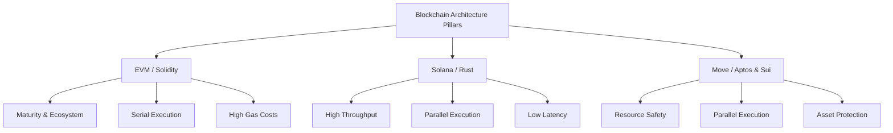
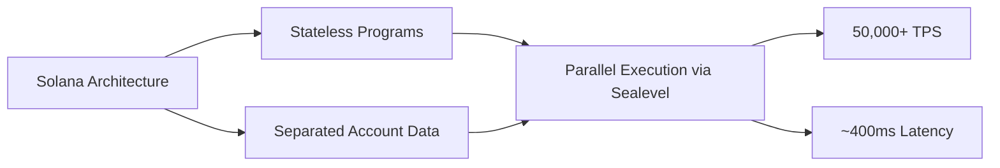
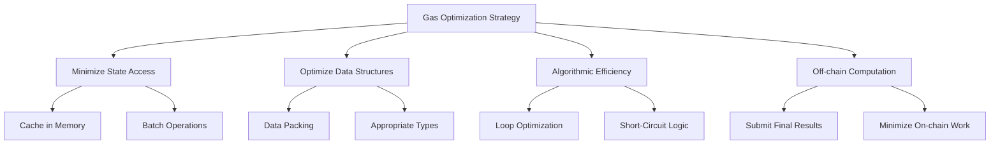
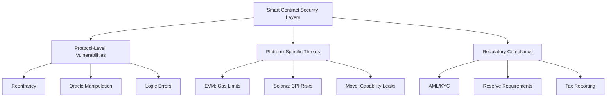
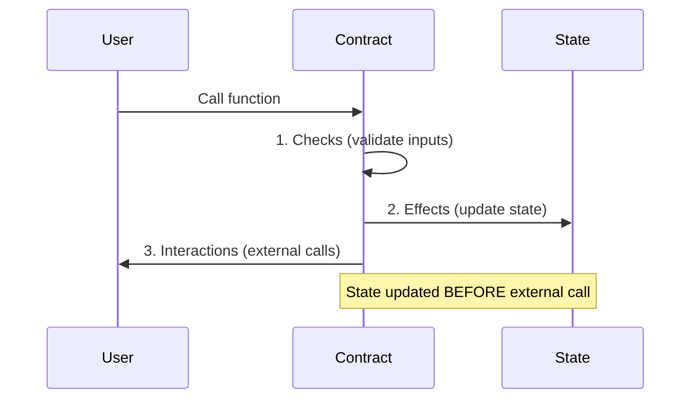
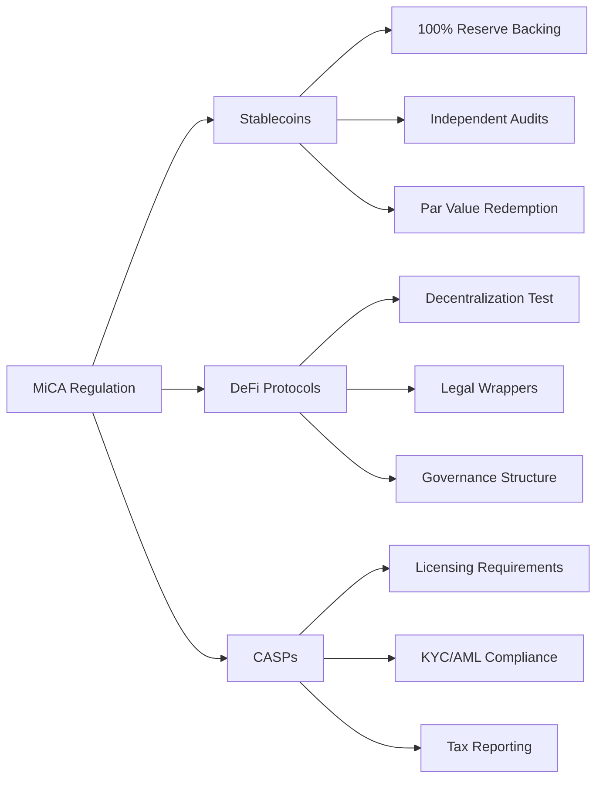
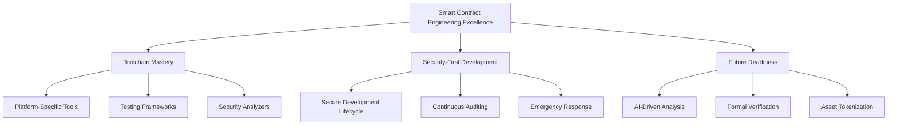
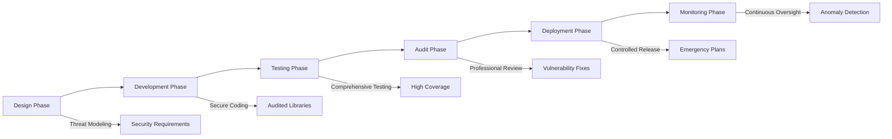

# A Deep Dive into Blockchain Smart Contract Engineering: Paradigms, Security, and Optimization

## 1. The Three Pillars of Blockchain Architecture: EVM, Solana, and Move

The blockchain development landscape is defined by three distinct technological pillars, each with unique philosophies, programming languages, and architectural trade-offs.



### EVM Pillar: Solidity on Ethereum Virtual Machine

**Core Characteristics:**
- **Maturity**: Most widely adopted framework in the industry [[69](https://www.linkedin.com/pulse/top-5-frameworks-web3-rust-solana-solidity-move-evm-burlakov-e08we)]
- **Language**: High-level, object-oriented with JavaScript-like syntax [[10](https://www.alchemy.com/overviews/solidity-vs-rust), [12](https://101blockchains.com/solidity-vs-rust/)]
- **Accessibility**: Lower barrier to entry for web developers [[10](https://www.alchemy.com/overviews/solidity-vs-rust), [12](https://101blockchains.com/solidity-vs-rust/)]

**Key Challenges:**
1. **Integer Overflows**: Common vulnerability in versions prior to 0.8.0 [[7](https://dev.to/truongpx396/solidity-limitations-solutions-best-practices-and-gas-optimization-27cb), [50](https://www.rapidinnovation.io/post/smart-contract-security-best-practices-common-vulnerabilities)]
   - Required SafeMath libraries or compiler-built-in checks
2. **Immutability**: Contracts cannot be modified post-deployment [[7](https://dev.to/truongpx396/solidity-limitations-solutions-best-practices-and-gas-optimization-27cb)]
   - Upgrades rely on complex proxy patterns
3. **Gas Costs**: Storage operations cost up to 20,000 gas [[2](https://www.infuy.com/blog/7-simple-ways-to-optimize-gas-in-solidity-smart-contracts/), [6](https://moldstud.com/articles/p-a-comprehensive-checklist-for-gas-optimization-in-solidity-boost-your-smart-contract-efficiency)]
   - Necessitates sophisticated optimization patterns

**Strengths:**
- Robust ecosystem with extensive tooling (OpenZeppelin, Hardhat) [[10](https://www.alchemy.com/overviews/solidity-vs-rust), [69](https://www.linkedin.com/pulse/top-5-frameworks-web3-rust-solana-solidity-move-evm-burlakov-e08we)]
- Foundation for DeFi, NFTs, and DAOs
- Wide interoperability across Layer 1 and Layer 2 solutions

---

### Solana Pillar: Rust on High-Performance Architecture

**Architectural Innovation:**


**Core Features:**
- **Separation Model**: Program code separated from account data [[88](https://www.quicknode.com/guides/solana-development/getting-started/solana-development-for-evm-developers)]
- **Parallel Processing**: Sealevel runtime executes thousands of concurrent transactions [[70](https://gbhackers.com/the-rise-of-a-solana-blockchain-development-company-pioneering-high-speed-scalable-decentralized-solutions/)]
- **Consensus**: Proof of History (PoH) + Tower BFT [[71](https://www.developcoins.com/solana-token-development)]

**Rust Language Benefits:**
- Memory safety enforced at compile time [[64](https://www.blockchainappfactory.com/blog/rust-smart-contract-audits-for-blockchain-projects/), [67](https://medium.com/coinmonks/rust-smart-contract-audits-why-they-matter-for-defi-nfts-daos-57c8ecff1c7e)]
- No garbage collector overhead
- Prevents buffer overflows and memory corruption

**Security Considerations:**
| Vulnerability Type | Description | Mitigation |
|:---|:---|:---|
| **CPI Risks** | Cross-Program Invocation vulnerabilities | Validate program IDs [[76](https://threesigma.xyz/blog/rust-and-solana/rust-memory-safety-on-solana)] |
| **Account Confusion** | Improper account validation | Verify ownership and signer status [[63](https://cantina.xyz/blog/securing-solana-a-developers-guide), [76](https://threesigma.xyz/blog/rust-and-solana/rust-memory-safety-on-solana)] |
| **Logic Flaws** | Protocol design errors | Thorough testing and audits [[76](https://threesigma.xyz/blog/rust-and-solana/rust-memory-safety-on-solana)] |

---

### Move Pillar: Resource-Oriented Programming

**Fundamental Philosophy:**
- Digital assets as first-class "resources" [[62](https://pontem.network/posts/how-the-move-programming-language-works), [81](https://www.hackquest.io/zh-tw/forum/1d48ba0d-a6c5-48ef-b62c-ae647a0f7ad8)]
- Resources cannot be copied or destroyed accidentally [[56](https://tokenminds.co/blog/blockchain-development/move-programming-languange)]
- Structurally prevents reentrancy and double-spending [[56](https://tokenminds.co/blog/blockchain-development/move-programming-languange), [60](https://www.gate.com/learn/articles/lets-move-sui-suis-underlying-move-language-explained/3221)]

**Platform Variants:**

**Aptos Approach:**
- **Execution Model**: Block-STM optimistic parallel execution [[42](https://www.gate.com/learn/articles/a-guide-to-understanding-the-differences-among-ethereum-solana-and-aptos-through-a-transaction-s-lifecycle/7636), [55](https://aeorysanalytics.medium.com/sui-vs-aptos-a-technical-deep-dive-into-move-language-implementations-b2c2c8132dd6)]
- **Use Cases**: General-purpose DeFi and high-reliability applications
- **Consensus**: AptosBFT

**Sui Approach:**
- **Execution Model**: Object-centric with deterministic parallelism [[40](https://metaschool.so/articles/build-on-sui-blockchain/), [44](https://cryptoweekly.co/sui-vs-ethereum-solana/)]
- **Use Cases**: Gaming and real-time applications requiring ultra-low latency
- **Consensus**: Narwhal + Bullshark (DAG-based)

---

### Platform Comparison Matrix

| Feature | EVM (Solidity) | Solana (Rust) | Move (Aptos/Sui) |
| :--- | :--- | :--- | :--- |
| **Primary Language** | Solidity [[10](https://www.alchemy.com/overviews/solidity-vs-rust)] | Rust [[10](https://www.alchemy.com/overviews/solidity-vs-rust), [70](https://gbhackers.com/the-rise-of-a-solana-blockchain-development-company-pioneering-high-speed-scalable-decentralized-solutions/)] | Move [[69](https://www.linkedin.com/pulse/top-5-frameworks-web3-rust-solana-solidity-move-evm-burlakov-e08we)] |
| **Execution Model** | Stateful, serial execution per transaction [[42](https://www.gate.com/learn/articles/a-guide-to-understanding-the-differences-among-ethereum-solana-and-aptos-through-a-transaction-s-lifecycle/7636)] | Stateless, parallel execution via Sealevel [[70](https://gbhackers.com/the-rise-of-a-solana-blockchain-development-company-pioneering-high-speed-scalable-decentralized-solutions/), [88](https://www.quicknode.com/guides/solana-development/getting-started/solana-development-for-evm-developers)] | Parallel execution via Block-STM (Aptos) or DAG consensus (Sui) [[42](https://www.gate.com/learn/articles/a-guide-to-understanding-the-differences-among-ethereum-solana-and-aptos-through-a-transaction-s-lifecycle/7636), [55](https://aeorysanalytics.medium.com/sui-vs-aptos-a-technical-deep-dive-into-move-language-implementations-b2c2c8132dd6)] |
| **Data Model** | Centralized contract storage (mappings, structs) [[80](https://supra.com/academy/the-top-move-programming-language-examples-explained/)] | Separated code (programs) and data (accounts) [[88](https://www.quicknode.com/guides/solana-development/getting-started/solana-development-for-evm-developers)] | Resource-oriented; assets are objects with clear ownership [[56](https://tokenminds.co/blog/blockchain-development/move-programming-languange), [62](https://pontem.network/posts/how-the-move-programming-language-works)] |
| **Key Strength** | Maturity, large ecosystem, broad compatibility [[69](https://www.linkedin.com/pulse/top-5-frameworks-web3-rust-solana-solidity-move-evm-burlakov-e08we)] | High throughput (>50,000 TPS), low latency (~400ms) [[10](https://www.alchemy.com/overviews/solidity-vs-rust), [70](https://gbhackers.com/the-rise-of-a-solana-blockchain-development-company-pioneering-high-speed-scalable-decentralized-solutions/)] | Built-in asset safety, prevention of common vulnerabilities [[21](https://supra.com/academy/ultimate-guide-to-the-move-programming-language/), [56](https://tokenminds.co/blog/blockchain-development/move-programming-languange)] |
| **Primary Weakness** | Lower throughput, higher gas fees [[40](https://metaschool.so/articles/build-on-sui-blockchain/)] | Steep learning curve (Rust), unique security vectors (CPI) [[70](https://gbhackers.com/the-rise-of-a-solana-blockchain-development-company-pioneering-high-speed-scalable-decentralized-solutions/), [76](https://threesigma.xyz/blog/rust-and-solana/rust-memory-safety-on-solana)] | Smaller ecosystem, newer technology, potential for new logical vulnerabilities [[11](https://www.cryptopolitan.com/move-vs-rust-for-smart-contract-development/), [58](https://arxiv.org/html/2508.17964v2)] |
| **Consensus** | Proof of Stake (PoS) variants [[40](https://metaschool.so/articles/build-on-sui-blockchain/)] | Proof of History (PoH) + Tower BFT [[68](https://arxiv.org/html/2504.07419v1), [71](https://www.developcoins.com/solana-token-development)] | AptosBFT (Aptos) / Narwhal + Bullshark (Sui) [[14](https://medium.com/ybbcapital/move-twins-how-sui-and-aptos-are-challenging-the-blockchain-landscape-648c89eeb740), [55](https://aeorysanalytics.medium.com/sui-vs-aptos-a-technical-deep-dive-into-move-language-implementations-b2c2c8132dd6)] |

---

## 2. Gas Optimization: The Art and Science of Transactional Efficiency

Gas optimization transcends mere efficiency—it's critical for user adoption, economic viability, and security. Each platform presents unique gas metering systems and corresponding optimization patterns.



### Solidity Gas Optimization

**Storage Cost Structure:**
- **SSTORE** (new write): 20,000 gas [[2](https://www.infuy.com/blog/7-simple-ways-to-optimize-gas-in-solidity-smart-contracts/), [3](https://hacken.io/discover/solidity-gas-optimization/)]
- **SSTORE** (reset): 5,000 gas
- **Memory operations**: ~3 gas [[5](https://yamenmerhi.medium.com/gas-optimization-in-solidity-75945e12322f), [8](https://rareskills.io/post/gas-optimization)]

**Optimization Techniques:**

1. **Memory Caching**
   - Read storage values into memory before loops
   - Write back only once after computation [[5](https://yamenmerhi.medium.com/gas-optimization-in-solidity-75945e12322f), [8](https://rareskills.io/post/gas-optimization)]

2. **Data Packing**
   - Pack small types (uint8, bool) into single 256-bit slots [[3](https://hacken.io/discover/solidity-gas-optimization/), [5](https://yamenmerhi.medium.com/gas-optimization-in-solidity-75945e12322f)]
   - Note: uint256 often more efficient for arithmetic [[5](https://yamenmerhi.medium.com/gas-optimization-in-solidity-75945e12322f), [91](https://coinsbench.com/solidity-gas-optimization-tips-52e62d4ce57d)]

3. **Data Structure Selection**
   - **Mappings**: O(1) lookups, best for large datasets [[3](https://hacken.io/discover/solidity-gas-optimization/), [5](https://yamenmerhi.medium.com/gas-optimization-in-solidity-75945e12322f)]
   - **Arrays**: Better for small, fixed-size collections requiring iteration

4. **Event Logging vs Storage**
   - Emit events for non-critical off-chain data [[2](https://www.infuy.com/blog/7-simple-ways-to-optimize-gas-in-solidity-smart-contracts/), [6](https://moldstud.com/articles/p-a-comprehensive-checklist-for-gas-optimization-in-solidity-boost-your-smart-contract-efficiency)]
   - Significantly cheaper than state variables

5. **Additional Patterns**
   - Use `external` over `public` for external-only functions [[5](https://yamenmerhi.medium.com/gas-optimization-in-solidity-75945e12322f), [8](https://rareskills.io/post/gas-optimization)]
   - Apply short-circuiting in boolean logic [[2](https://www.infuy.com/blog/7-simple-ways-to-optimize-gas-in-solidity-smart-contracts/), [5](https://yamenmerhi.medium.com/gas-optimization-in-solidity-75945e12322f)]
   - Avoid redundant storage writes

---

### Solana Compute Unit (CU) Optimization

**Constraints:**
- **Hard limit**: 48 million CUs per transaction [[72](https://exvul.com/rust-smart-contract-security-guide-in-solana/), [88](https://www.quicknode.com/guides/solana-development/getting-started/solana-development-for-evm-developers)]
- **Focus**: Algorithmic efficiency and avoiding expensive loops

**Optimization Strategies:**

1. **Transaction Batching**
   - Combine multiple operations atomically [[6](https://moldstud.com/articles/p-a-comprehensive-checklist-for-gas-optimization-in-solidity-boost-your-smart-contract-efficiency), [88](https://www.quicknode.com/guides/solana-development/getting-started/solana-development-for-evm-developers)]
   - Reduces individual instruction count

2. **Fixed-Size Data Structures**
   - Prefer arrays over dynamic structures [[5](https://yamenmerhi.medium.com/gas-optimization-in-solidity-75945e12322f), [87](https://bestarch.ae/tpost/5810lremb1-rust-smart-contract-gas-optimization-str)]
   - Predictable memory allocation

3. **Off-Chain Computation**
   - Perform intensive calculations off-chain [[87](https://bestarch.ae/tpost/5810lremb1-rust-smart-contract-gas-optimization-str)]
   - Submit only final results to chain

4. **Rust Zero-Cost Abstractions**
   - Leverage iterators for clean, optimized code [[87](https://bestarch.ae/tpost/5810lremb1-rust-smart-contract-gas-optimization-str)]
   - Compiles to efficient machine code

5. **Account Management**
   - Request exact CU budgets [[72](https://exvul.com/rust-smart-contract-security-guide-in-solana/)]
   - Minimize account reads/writes [[88](https://www.quicknode.com/guides/solana-development/getting-started/solana-development-for-evm-developers)]

---

### Move Gas Optimization (Aptos/Sui)

**Gas Components:**
- **Payload size**: Transaction and bytecode size
- **Instruction execution**: VM operation costs
- **Storage gas**: Global storage access [[1](https://medium.com/cryptocurrency-scripts/aptos-move-gas-optimization-proven-strategies-for-peak-performance-and-efficiency-10015d4e55d9)]

**Eleven Optimization Patterns:**

1. ✅ **Minimize code lines and parameters**
2. ✅ **Reduce function calls within transactions**
3. ✅ **Operate on local variables before global storage**
4. ✅ **Store data in events vs on-chain state** [[1](https://medium.com/cryptocurrency-scripts/aptos-move-gas-optimization-proven-strategies-for-peak-performance-and-efficiency-10015d4e55d9)]
5. ✅ **Pack data using bitwise masking**
   - Example: Combine multiple small values into single u64
6. ✅ **Prefer read-only access** (`borrow_global` vs `borrow_global_mut`) [[1](https://medium.com/cryptocurrency-scripts/aptos-move-gas-optimization-proven-strategies-for-peak-performance-and-efficiency-10015d4e55d9)]
7. ✅ **Overwrite unused resources** instead of deallocating
8. ✅ **Inline small functions** to reduce call overhead
9. ✅ **Use generics** to reduce bytecode duplication
10. ✅ **Optimize struct field order** for better packing
11. ✅ **Avoid unnecessary clones** of large data structures

**Sui-Specific Optimizations:**
- Use sponsored transactions for end-user cost reduction [[40](https://metaschool.so/articles/build-on-sui-blockchain/)]
- Leverage object-centric model for parallel execution [[44](https://cryptoweekly.co/sui-vs-ethereum-solana/)]

---

### Cross-Platform Optimization Comparison

| Optimization Technique | Solidity (EVM) | Solana (Rust) | Move (Aptos/Sui) |
| :--- | :--- | :--- | :--- |
| **Core Metric** | Gas [[3](https://hacken.io/discover/solidity-gas-optimization/)] | Compute Units (CU) [[72](https://exvul.com/rust-smart-contract-security-guide-in-solana/)] | Octa (APT units) [[1](https://medium.com/cryptocurrency-scripts/aptos-move-gas-optimization-proven-strategies-for-peak-performance-and-efficiency-10015d4e55d9)] |
| **Primary Cost Driver** | Storage Read/Writes [[2](https://www.infuy.com/blog/7-simple-ways-to-optimize-gas-in-solidity-smart-contracts/)] | Algorithm Complexity & Loops [[72](https://exvul.com/rust-smart-contract-security-guide-in-solana/)] | Global Storage Access [[1](https://medium.com/cryptocurrency-scripts/aptos-move-gas-optimization-proven-strategies-for-peak-performance-and-efficiency-10015d4e55d9)] |
| **Memory Management** | Cache storage in memory before loops; use `memory` keyword [[5](https://yamenmerhi.medium.com/gas-optimization-in-solidity-75945e12322f), [8](https://rareskills.io/post/gas-optimization)] | Use local variables; leverage Rust's ownership model for efficient allocation [[87](https://bestarch.ae/tpost/5810lremb1-rust-smart-contract-gas-optimization-str)] | Operate on local variables before writing back to storage [[1](https://medium.com/cryptocurrency-scripts/aptos-move-gas-optimization-proven-strategies-for-peak-performance-and-efficiency-10015d4e55d9)] |
| **Data Structures** | Prefer mappings over arrays for large datasets; pack structs [[3](https://hacken.io/discover/solidity-gas-optimization/), [5](https://yamenmerhi.medium.com/gas-optimization-in-solidity-75945e12322f)] | Prefer fixed-size arrays over dynamic ones; use efficient maps like BTreeMap [[87](https://bestarch.ae/tpost/5810lremb1-rust-smart-contract-gas-optimization-str)] | Pack small fields into a single storage slot using bitwise masking [[1](https://medium.com/cryptocurrency-scripts/aptos-move-gas-optimization-proven-strategies-for-peak-performance-and-efficiency-10015d4e55d9)] |
| **State Changes** | Minimize writes; use short-circuiting boolean logic to avoid unnecessary checks [[2](https://www.infuy.com/blog/7-simple-ways-to-optimize-gas-in-solidity-smart-contracts/), [5](https://yamenmerhi.medium.com/gas-optimization-in-solidity-75945e12322f)] | Batch operations into single transactions; use off-chain computation [[6](https://moldstud.com/articles/p-a-comprehensive-checklist-for-gas-optimization-in-solidity-boost-your-smart-contract-efficiency), [87](https://bestarch.ae/tpost/5810lremb1-rust-smart-contract-gas-optimization-str)] | Reduce global storage access; overwrite unused resources instead of deallocating [[1](https://medium.com/cryptocurrency-scripts/aptos-move-gas-optimization-proven-strategies-for-peak-performance-and-efficiency-10015d4e55d9)] |
| **Logging** | Emit events instead of storing logs in state [[2](https://www.infuy.com/blog/7-simple-ways-to-optimize-gas-in-solidity-smart-contracts/), [6](https://moldstud.com/articles/p-a-comprehensive-checklist-for-gas-optimization-in-solidity-boost-your-smart-contract-efficiency)] | Information not available in provided sources | Store data in events instead of on-chain state [[1](https://medium.com/cryptocurrency-scripts/aptos-move-gas-optimization-proven-strategies-for-peak-performance-and-efficiency-10015d4e55d9)] |
| **Tools** | `eth-gas-reporter` for measuring consumption [[5](https://yamenmerhi.medium.com/gas-optimization-in-solidity-75945e12322f)] | Information not available in provided sources | Information not available in provided sources |

---

## 3. A Multi-Layered Security Imperative: From Protocol Flaws to Platform-Specific Threats

Security in smart contract engineering is a multi-layered discipline encompassing:
- Protocol-level risks inherent to DeFi
- Platform-specific threat models
- Legal and regulatory obligations



### Protocol-Level Vulnerabilities (Cross-Platform)

#### 1. Reentrancy Attacks

**Mechanism:**
- Malicious contract recursively calls vulnerable function before state update [[47](https://medium.com/@olatunjimayowa0396/the-reentrancy-attack-patterns-for-solidity-smart-contract-e0bf90e46b17), [51](https://www.quicknode.com/guides/ethereum-development/smart-contracts/a-broad-overview-of-reentrancy-attacks-in-solidity-contracts)]

**Mitigation Pattern: Checks-Effects-Interactions (CEI)**


**Implementation Strategies:**
- Perform all state changes before external calls [[46](https://betterprogramming.pub/solidity-smart-contract-security-preventing-reentrancy-attacks-fc729339a3ff), [50](https://www.rapidinnovation.io/post/smart-contract-security-best-practices-common-vulnerabilities)]
- Use reentrancy guards (e.g., OpenZeppelin's `nonReentrant`)

---

#### 2. Oracle Manipulation & Flash Loan Attacks

**Attack Vector:**
- Temporarily skew market prices to trigger unfavorable liquidations [[20](https://medium.com/@dehvcurtis/smart-contract-security-12-solidity-vulnerabilities-every-developer-must-know-0c1772f61a79), [49](https://hacken.io/discover/smart-contract-vulnerabilities/)]

**Mitigation Strategies:**
1. **Decentralized Oracles**: Multiple independent data sources
2. **Time-Weighted Averages (TWAPs)**: Resist short-term manipulation [[20](https://medium.com/@dehvcurtis/smart-contract-security-12-solidity-vulnerabilities-every-developer-must-know-0c1772f61a79)]
3. **Sanity Checks**: Validate price deviation limits
4. **Commit-Reveal Schemes**: Two-phase price updates

---

#### 3. Logic Errors

**Nature:**
- Flaws in business logic causing unintended behavior [[53](https://www.tokenmetrics.com/blog/what-are-common-smart-contract-bugs-a-comprehensive-security-guide-for-2025?1aa987e3_page=4&617b332e_page=4&c17ab9be_page=13)]

**Detection Methods:**
- Comprehensive manual code review
- Property-based fuzzing (e.g., Echidna)
- Formal verification [[26](https://github.com/johnsonstephan/awesome-web3-formal-verification), [27](https://veridise.com/audits/smart-contract/)]

---

### Platform-Specific Threats

#### Solana Threat Model

**3.1.1 Cross-Program Invocation (CPI) Risks**

**Vulnerability:**
- Failing to validate target program ID → "confused deputy" attack [[76](https://threesigma.xyz/blog/rust-and-solana/rust-memory-safety-on-solana)]

**Mitigation:**
```rust
// Explicitly validate program ID before CPI
require!(
    target_program.key == &expected_program_id,
    ErrorCode::InvalidProgramId
);
```

**3.1.2 Account Confusion**

**Vulnerability:**
- Not verifying account ownership/mint/type [[63](https://cantina.xyz/blog/securing-solana-a-developers-guide), [76](https://threesigma.xyz/blog/rust-and-solana/rust-memory-safety-on-solana)]

**Mitigation Checklist:**
- ✅ Verify account ownership
- ✅ Validate signer status
- ✅ Check discriminator fields
- ✅ Confirm mint addresses

**3.1.3 Program Derived Address (PDA) Issues**

**Risk:**
- Incorrect derivation/validation grants unauthorized access [[72](https://exvul.com/rust-smart-contract-security-guide-in-solana/), [76](https://threesigma.xyz/blog/rust-and-solana/rust-memory-safety-on-solana)]

**Best Practices:**
- Use deterministic seeds
- Validate PDA derivation on-chain
- Never expose seed generation logic

**3.1.4 State Desynchronization**

**Issue:**
- Snapshot at instruction start becomes stale after CPI [[63](https://cantina.xyz/blog/securing-solana-a-developers-guide), [76](https://threesigma.xyz/blog/rust-and-solana/rust-memory-safety-on-solana)]

**Solution:**
- Explicitly reload account data after CPI calls

---

#### Move Threat Model

**Key Insight:**
> While Move prevents reentrancy and double-spending structurally, vulnerabilities shift to cross-module interactions and capability misuse [[56](https://tokenminds.co/blog/blockchain-development/move-programming-languange), [58](https://arxiv.org/html/2508.17964v2)]

**3.2.1 Capability Leaks**

**Vulnerability Example:**
- Exposing `ConstructorRef` allows attacker to reclaim NFT ownership [[57](https://aptos.dev/build/smart-contracts/move-security-guidelines)]

**Mitigation:**
- Principle of least privilege
- Discard sensitive capabilities immediately after use [[57](https://aptos.dev/build/smart-contracts/move-security-guidelines)]

**3.2.2 Improper Ability Assignment**

**Risk Example:**
- Giving Token struct `copy` ability → double-spending possible [[57](https://aptos.dev/build/smart-contracts/move-security-guidelines)]

**Prevention:**
- Carefully audit ability declarations
- Review cross-module interactions

**3.2.3 Emerging Vulnerability Categories**

**Detected by MoveScanner [[58](https://arxiv.org/html/2508.17964v2)]:**
- Resource leakage
- Privilege escalation
- Unchecked return values
- Cross-module boundary issues

---

### Vulnerability Comparison Matrix

| Vulnerability Category | Description | Primary Mitigation Pattern(s) | Affected Platforms |
| :--- | :--- | :--- | :--- |
| **Reentrancy** | External call made before state update, allowing recursive calls to drain funds [[47](https://medium.com/@olatunjimayowa0396/the-reentrancy-attack-patterns-for-solidity-smart-contract-e0bf90e46b17)]. | Checks-Effects-Interactions (CEI) pattern; Reentrancy guards (e.g., OpenZeppelin's `nonReentrant`) [[46](https://betterprogramming.pub/solidity-smart-contract-security-preventing-reentrancy-attacks-fc729339a3ff), [51](https://www.quicknode.com/guides/ethereum-development/smart-contracts/a-broad-overview-of-reentrancy-attacks-in-solidity-contracts)]. | Primarily Solidity/EVM. Structurally prevented in Move [[56](https://tokenminds.co/blog/blockchain-development/move-programming-languange)]. |
| **Oracle Manipulation** | Attacker manipulates on-chain price feeds (e.g., via flash loans) to trigger adverse protocol actions [[20](https://medium.com/@dehvcurtis/smart-contract-security-12-solidity-vulnerabilities-every-developer-must-know-0c1772f61a79)]. | Use decentralized oracles with multiple data sources; implement sanity checks and deviation thresholds [[20](https://medium.com/@dehvcurtis/smart-contract-security-12-solidity-vulnerabilities-every-developer-must-know-0c1772f61a79), [76](https://threesigma.xyz/blog/rust-and-solana/rust-memory-safety-on-solana)]. | All DeFi platforms (Solidity, Rust, Move). |
| **Logic Errors** | Flaw in business logic causing unintended behavior, such as incorrect reward distribution or fee calculation [[53](https://www.tokenmetrics.com/blog/what-are-common-smart-contract-bugs-a-comprehensive-security-guide-for-2025?1aa987e3_page=4&617b332e_page=4&c17ab9be_page=13)]. | Comprehensive manual code review; property-based fuzzing (e.g., Echidna); formal verification [[26](https://github.com/johnsonstephan/awesome-web3-formal-verification), [27](https://veridise.com/audits/smart-contract/)]. | All platforms, as logic is implementation-dependent. |
| **Cross-Program Invocation (CPI) Risk** | Insecurely validating the target program ID during a CPI, allowing a "confused deputy" attack [[76](https://threesigma.xyz/blog/rust-and-solana/rust-memory-safety-on-solana)]. | Explicitly validate the target program ID before invoking `invoke`; use Anchor constraints [[76](https://threesigma.xyz/blog/rust-and-solana/rust-memory-safety-on-solana)]. | Primarily Solana/Rust. |
| **Account Confusion** | Failing to verify that a passed account is of the correct type and owned by the expected program [[63](https://cantina.xyz/blog/securing-solana-a-developers-guide)]. | Rigorous validation of account ownership, signer status, and discriminator fields [[76](https://threesigma.xyz/blog/rust-and-solana/rust-memory-safety-on-solana)]. | Primarily Solana/Rust. |
| **Capability Leaks** | Exposing resources or keys (e.g., `ConstructorRef`) that can be used to bypass intended access control [[57](https://aptos.dev/build/smart-contracts/move-security-guidelines)]. | Adhere to the principle of least privilege; discard sensitive capabilities immediately after use [[57](https://aptos.dev/build/smart-contracts/move-security-guidelines)]. | Primarily Move. |
| **State Desynchronization** | Using stale in-memory copies of account data after a CPI call, leading to incorrect logic [[63](https://cantina.xyz/blog/securing-solana-a-developers-guide)]. | Explicitly reload account data from storage after a CPI call [[63](https://cantina.xyz/blog/securing-solana-a-developers-guide)]. | Primarily Solana/Rust. |

---

## Regulatory Compliance as a Core System Requirement: Navigating the MiCA Framework

The EU's Markets in Crypto-Assets (MiCA) regulation transforms compliance from peripheral consideration to core design requirement.



### Stablecoin Requirements (ARTs & EMTs)

**Regulatory Classification:**
- **ARTs**: Asset-Referenced Tokens
- **EMTs**: Electronic Money Tokens [[92](https://hacken.io/discover/mica-regulation/), [94](https://mylegalpal.com/smart-guide-to-crypto-compliance-in-eu/?srsltid=AfmBOorCbt24_OudWf5VWD9iHuBn2bGmSc9RmSHa1rxRauWBgqWoJlz9)]

**Mandatory Requirements:**

1. **Authorization**
   - Obtain approval from National Competent Authorities (NCAs)

2. **Reserve Management**
   - ✅ Maintain 100% reserve backing [[98](https://www.blockchainappfactory.com/blog/guide-to-developing-mica-compliant-euro-backed-stablecoins/), [100](https://www.innreg.com/blog/mica-regulation-guide)]
   - ✅ Segregate reserves from corporate assets
   - ✅ Facilitate redemption at par value

3. **Audit & Transparency**
   - Regular independent audits [[98](https://www.blockchainappfactory.com/blog/guide-to-developing-mica-compliant-euro-backed-stablecoins/), [100](https://www.innreg.com/blog/mica-regulation-guide)]
   - Transparent reporting to regulators

4. **Smart Contract Implications**
   - Enforce capital adequacy mechanisms
   - Maintain detailed audit trails
   - Integrate KYC/AML procedures
   - Implement Travel Rule (transfers >€1,000) [[94](https://mylegalpal.com/smart-guide-to-crypto-compliance-in-eu/?srsltid=AfmBOorCbt24_OudWf5VWD9iHuBn2bGmSc9RmSHa1rxRauWBgqWoJlz9), [100](https://www.innreg.com/blog/mica-regulation-guide)]

**Commercial Impact:**
> Non-compliant stablecoins have already been delisted from major EU exchanges [[98](https://www.blockchainappfactory.com/blog/guide-to-developing-mica-compliant-euro-backed-stablecoins/), [100](https://www.innreg.com/blog/mica-regulation-guide)]

---

### DeFi & DAO Implications

**Decentralization Exemption:**
- Crypto-asset services provided in "fully decentralised manner without intermediary" may be exempt [[97](https://bitcoin.tax/blog/eu-crypto-regulations/), [101](https://legal.pwc.de/en/news/articles/demystifying-defi-in-micar)]

**Ambiguity & Challenges:**

**Problem:** Definition of "full decentralisation" remains uncertain and subject to case-by-case analysis [[97](https://bitcoin.tax/blog/eu-crypto-regulations/), [101](https://legal.pwc.de/en/news/articles/demystifying-defi-in-micar)]

**Regulatory Considerations:**
- Securities laws (e.g., MiFID II) may apply to investment-like tokens [[101](https://legal.pwc.de/en/news/articles/demystifying-defi-in-micar)]
- Centralized frontends/custodians may still be CASPs [[97](https://bitcoin.tax/blog/eu-crypto-regulations/), [101](https://legal.pwc.de/en/news/articles/demystifying-defi-in-micar)]

**Mitigation Strategies:**

1. **Legal Wrappers**
   - Establish centralized entities for liability [[94](https://mylegalpal.com/smart-guide-to-crypto-compliance-in-eu/?srsltid=AfmBOorCbt24_OudWf5VWD9iHuBn2bGmSc9RmSHa1rxRauWBgqWoJlz9)]

2. **DAO Governance**
   - Distribute control effectively
   - Implement KYC for significant participants
   - Establish revenue-sharing compliance [[94](https://mylegalpal.com/smart-guide-to-crypto-compliance-in-eu/?srsltid=AfmBOorCbt24_OudWf5VWD9iHuBn2bGmSc9RmSHa1rxRauWBgqWoJlz9)]

3. **Indirect Compliance**
   - Even exempt protocols face pressure through ecosystem participants

---

### Crypto-Asset Service Provider (CASP) Requirements

**Licensing Process:**
- ✅ Obtain license from any one EU country → operate across all member states
- ✅ Pass fitness-and-proper tests for management
- ✅ Meet minimum capital requirements
- ✅ Implement robust cybersecurity measures [[97](https://bitcoin.tax/blog/eu-crypto-regulations/), [100](https://www.innreg.com/blog/mica-regulation-guide)]

**Operational Requirements:**

**DORA Compliance (Digital Operational Resilience Act):**
- Incident reporting mechanisms [[92](https://hacken.io/discover/mica-regulation/)]
- Third-party oversight
- Operational resilience testing

**DAC8 Directive:**
- Report customer crypto holdings to tax authorities [[97](https://bitcoin.tax/blog/eu-crypto-regulations/)]
- Track and report on-chain transactions for tax purposes

**Smart Contract Design Impact:**
- Support operational resilience requirements
- Enable comprehensive transaction tracking
- Provide tax reporting interfaces

---

### MiCA Compliance Matrix

| Regulatory Aspect | Key Requirement | Impact on Smart Contract Design | Relevant Regulation/Framework |
| :--- | :--- | :--- | :--- |
| **Stablecoin Backing** | 100% reserve backing with segregated assets; regular independent audits [[98](https://www.blockchainappfactory.com/blog/guide-to-developing-mica-compliant-euro-backed-stablecoins/), [100](https://www.innreg.com/blog/mica-regulation-guide)]. | Must include mechanisms for depositing/withdrawing collateral, verifying reserves, and facilitating redemptions at par value [[94](https://mylegalpal.com/smart-guide-to-crypto-compliance-in-eu/?srsltid=AfmBOorCbt24_OudWf5VWD9iHuBn2bGmSc9RmSHa1rxRauWBgqWoJlz9)]. | MiCA (Titles II, III, IV) [[100](https://www.innreg.com/blog/mica-regulation-guide)] |
| **Crypto-Asset Service Provider (CASP) Licensing** | Obtain authorization from National Competent Authorities (NCAs); meet fitness/proper tests, minimum capital, and cybersecurity standards [[97](https://bitcoin.tax/blog/eu-crypto-regulations/), [100](https://www.innreg.com/blog/mica-regulation-guide)]. | Requires transparent governance and operational controls that can be audited. May necessitate "legal wrappers" or hybrid governance models [[94](https://mylegalpal.com/smart-guide-to-crypto-compliance-in-eu/?srsltid=AfmBOorCbt24_OudWf5VWD9iHuBn2bGmSc9RmSHa1rxRauWBgqWoJlz9)]. | MiCA (Title VII) [[100](https://www.innreg.com/blog/mica-regulation-guide)] |
| **Anti-Money Laundering (AML)** | Implement Customer Due Diligence (CDD), transaction monitoring, and suspicious activity reporting [[92](https://hacken.io/discover/mica-regulation/)]. | Requires integration of KYC/AML procedures, potentially through compliance-as-a-service providers, and mechanisms for transaction tracking [[94](https://mylegalpal.com/smart-guide-to-crypto-compliance-in-eu/?srsltid=AfmBOorCbt24_OudWf5VWD9iHuBn2bGmSc9RmSHa1rxRauWBgqWoJlz9)]. | AML Directives (AMLD5/6) [[94](https://mylegalpal.com/smart-guide-to-crypto-compliance-in-eu/?srsltid=AfmBOorCbt24_OudWf5VWD9iHuBn2bGmSc9RmSHa1rxRauWBgqWoJlz9)] |
| **Transaction Monitoring** | Exchange originator/beneficiary details for transfers >€1,000 (Travel Rule) [[94](https://mylegalpal.com/smart-guide-to-crypto-compliance-in-eu/?srsltid=AfmBOorCbt24_OudWf5VWD9iHuBn2bGmSc9RmSHa1rxRauWBgqWoJlz9), [100](https://www.innreg.com/blog/mica-regulation-guide)]. | Contracts must be able to handle and transmit identity information securely between VASPs [[94](https://mylegalpal.com/smart-guide-to-crypto-compliance-in-eu/?srsltid=AfmBOorCbt24_OudWf5VWD9iHuBn2bGmSc9RmSHa1rxRauWBgqWoJlz9)]. | Transfer of Funds Regulation (TFR) [[100](https://www.innreg.com/blog/mica-regulation-guide)] |
| **Tax Reporting** | Report customer crypto holdings and transactions to tax authorities [[97](https://bitcoin.tax/blog/eu-crypto-regulations/)]. | Requires transparent on-chain accounting and reporting capabilities to comply with DAC8 [[97](https://bitcoin.tax/blog/eu-crypto-regulations/)]. | Directive on Administrative Cooperation (DAC8) [[97](https://bitcoin.tax/blog/eu-crypto-regulations/)] |
| **Decentralization Exemption** | Services provided in a fully decentralised manner may be exempt from MiCA [[101](https://legal.pwc.de/en/news/articles/demystifying-defi-in-micar)]. | Forces developers to carefully design governance structures (e.g., DAOs) and assess the "substance-over-form" of their decentralisation claims to qualify for the exemption [[101](https://legal.pwc.de/en/news/articles/demystifying-defi-in-micar)]. | MiCA Recital 22 [[101](https://legal.pwc.de/en/news/articles/demystifying-defi-in-micar)] |

---

## Synthesizing Expertise: Toolchains, Development Practices, and Future Trends

Modern smart contract engineering requires fluency in sophisticated toolchains, security-first methodologies, and strategic foresight.



### Platform-Specific Toolchains

#### Solidity/EVM Ecosystem

**Development Tools:**
- **Hardhat**: Development environment, testing, deployment [[73](https://www.rapidinnovation.io/post/how-to-create-a-smart-contract-using-solidity)]
- **Foundry**: Fast, portable toolkit for EVM development
- **Truffle**: Project scaffolding and management
- **Ganache**: Local blockchain environment
- **Remix IDE**: Browser-based editor and debugger [[7](https://dev.to/truongpx396/solidity-limitations-solutions-best-practices-and-gas-optimization-27cb)]

**Security Tools:**
- **Slither**: Static analysis for vulnerability detection [[23](https://agilie.com/blog/secure-smart-contract-design-best-practices-in-solidity-programming), [54](https://www.alchemy.com/overviews/smart-contract-security-best-practices)]
- **Mythril**: Security analysis tool
- **OpenZeppelin**: Audited smart contract libraries

---

#### Rust/Solana Ecosystem

**Core Framework:**
- **Anchor**: Structured development, deployment, testing [[76](https://threesigma.xyz/blog/rust-and-solana/rust-memory-safety-on-solana), [78](http://www.dc.narpm.org/browse/mLA93D/6051073/Solana%20Development%20With%20Rust%20And%20Anchor.pdf)]
  - Simplifies account validation
  - Provides security constraints
  - Reduces boilerplate code

**Tools:**
- **Solana CLI**: Primary command-line interface
- **@solana/web3.js**: Frontend integration SDK [[90](https://metalamp.io/magazine/article/how-smart-contracts-work-on-solana-full-breakdown-and-usage-tips)]
- **SPL Token**: Token program standard library

---

#### Move/Aptos & Sui Ecosystem

**Development Tools:**
- **Aptos CLI**: Project initialization, compilation, deployment [[38](https://www.hackquest.io/zh-cn/forum/1d48ba0d-a6c5-48ef-b62c-ae647a0f7ad8)]
- **Sui CLI**: Network interaction and management
- **Move Prover**: Formal verification tool
- **IDE Plugins**: Syntax highlighting and debugging [[41](https://blockchain.oodles.io/blog/sui-blockchain/), [59](https://sui.io/move)]

**Security Tools:**
- **MoveScanner**: Static analysis for Move-specific vulnerabilities [[58](https://arxiv.org/html/2508.17964v2)]

---

### Secure Development Lifecycle (SDL)



#### Phase Breakdown

**1. Design Phase**
- ✅ Conduct threat modeling
- ✅ Define security requirements
- ✅ Identify potential attack vectors

**2. Development Phase**
- ✅ Follow secure coding practices [[50](https://www.rapidinnovation.io/post/smart-contract-security-best-practices-common-vulnerabilities), [74](https://codezeros.medium.com/best-practices-for-smart-contract-development-84b35b3c62d4)]
- ✅ Use audited libraries (e.g., OpenZeppelin)
- ✅ Implement security patterns (CEI, reentrancy guards)

**3. Testing Phase**
- ✅ **Unit Tests**: Component-level validation
- ✅ **Integration Tests**: System-level verification
- ✅ **Property-Based Fuzzing**: Uncover unexpected behaviors [[26](https://github.com/johnsonstephan/awesome-web3-formal-verification), [75](https://www.quicknode.com/guides/ethereum-development/nfts/how-to-write-good-nft-smart-contract)]
- ✅ **Formal Verification**: Mathematical correctness proofs

**4. Audit Phase**
- ✅ Professional security audit by experienced firms [[4](https://blog.pessimistic.io/auditors-advice-math-solidity-gas-optimizations-part-1-3-a99c478d2ebb), [50](https://www.rapidinnovation.io/post/smart-contract-security-best-practices-common-vulnerabilities)]
- ✅ Address all critical and high-severity findings
- ✅ Retest after fixes

**5. Deployment Phase**
- ✅ Controlled rollout strategy
- ✅ Emergency pause mechanisms
- ✅ Upgrade pathways (if applicable)

**6. Monitoring Phase**
- ✅ Continuous anomaly detection [[50](https://www.rapidinnovation.io/post/smart-contract-security-best-practices-common-vulnerabilities), [74](https://codezeros.medium.com/best-practices-for-smart-contract-development-84b35b3c62d4)]
- ✅ Emergency response plan
- ✅ Bug bounty programs

---

### Future Trends Reshaping Smart Contract Engineering

#### 1. AI-Driven Security Analysis

**Capabilities:**
- Enhanced vulnerability detection [[34](https://www.skyquestt.com/report/gamefi-market), [50](https://www.rapidinnovation.io/post/smart-contract-security-best-practices-common-vulnerabilities)]
- Predictive attack vector analysis
- Automated audit acceleration
- Pattern recognition in complex contracts

**Impact:**
> AI/ML tools will revolutionize how we identify and mitigate security flaws in increasingly complex smart contracts

---

#### 2. Formal Verification Adoption

**Benefits:**
- Mathematical proof of correctness [[24](https://hacken.io/discover/formal-verification/), [26](https://github.com/johnsonstephan/awesome-web3-formal-verification)]
- Higher assurance level
- Verification under all circumstances
- Reduced audit costs over time

**Tools:**
- **Certora Prover**: EVM formal verification
- **Move Prover**: Native Move verification
- **K Framework**: Multi-platform verification

---

#### 3. Real-World Asset (RWA) Tokenization

**Evolution:**
- Shift from yield farming to complex financial instruments [[30](https://www.blockchain-council.org/cryptocurrency/top-crypto-trends/)]
- Tokenization of physical assets
- Regulatory-compliant frameworks
- Institutional adoption

**Requirements:**
- Robust contract implementations
- Verifiable asset backing
- Compliance integration

---

#### 4. Next-Generation GameFi

**Paradigm Shift:**
- From "play-to-earn" to "play-and-own" [[30](https://www.blockchain-council.org/cryptocurrency/top-crypto-trends/), [32](https://market.us/report/gamefi-market/)]
- Focus on gameplay quality
- Sustainable economic models
- Enhanced accessibility

**Technical Demands:**
- Low-latency transactions
- Scalable architectures
- Secure asset management

---

## Conclusion: The Multidisciplinary Smart Contract Engineer

The modern smart contract engineer must excel across multiple dimensions:

**Technical Excellence:**
- ✅ Master multiple programming paradigms (Solidity, Rust, Move)
- ✅ Deep understanding of platform architectures
- ✅ Proficiency in optimization techniques

**Security Expertise:**
- ✅ Protocol-level vulnerability mitigation
- ✅ Platform-specific threat awareness
- ✅ Continuous security mindset

**Regulatory Awareness:**
- ✅ Compliance-by-design principles
- ✅ Understanding of MiCA and emerging frameworks
- ✅ Legal and technical integration

**Strategic Foresight:**
- ✅ Adaptation to emerging technologies
- ✅ Anticipation of industry trends
- ✅ Continuous learning commitment

> The role transcends traditional software engineering, requiring balance between technical sophistication, security vigilance, economic understanding, and regulatory compliance to build the next generation of decentralized applications.
