I'll generate a comprehensive interview question bank for the Smart Contract Engineer (Blockchain) position, focusing on regulatory compliance and legal frameworks relevant to blockchain development.

## Contents
- [Topic Areas](#topic-areas-questions-1-30)
  - [Topic 1: Smart Contract Compliance & Legal Frameworks](#topic-1-smart-contract-compliance--legal-frameworks)
    - [Q1: How would you implement KYC/AML compliance in a DeFi smart contract?](#q1-how-would-you-implement-kycaml-compliance-in-a-defi-smart-contract)
    - [Q2: What regulatory considerations for cross-chain bridges?](#q2-what-regulatory-considerations-for-cross-chain-bridges)
    - [Q3: How to handle GDPR right to erasure on immutable blockchain?](#q3-how-to-handle-gdpr-right-to-erasure-on-immutable-blockchain)
    - [Q4: Implementing securities compliance for tokenized assets](#q4-implementing-securities-compliance-for-tokenized-assets)
    - [Q5: Managing regulatory jurisdiction in global DeFi protocols](#q5-managing-regulatory-jurisdiction-in-global-defi-protocols)
  - [Topic 2: Security Compliance & Audit Requirements](#topic-2-security-compliance--audit-requirements)
    - [Q6: Designing audit trails for smart contract transactions](#q6-designing-audit-trails-for-smart-contract-transactions)
    - [Q7: Implementing NIST CSF for blockchain infrastructure](#q7-implementing-nist-csf-for-blockchain-infrastructure)
    - [Q8: Smart contract vulnerability disclosure compliance](#q8-smart-contract-vulnerability-disclosure-compliance)
    - [Q9: Incident response for DeFi protocol exploits](#q9-incident-response-for-defi-protocol-exploits)
    - [Q10: Compliance monitoring for automated market makers](#q10-compliance-monitoring-for-automated-market-makers)
  - [Topic 3: Data Privacy & Protection in Blockchain](#topic-3-data-privacy--protection-in-blockchain)
    - [Q11: Privacy-preserving KYC implementation](#q11-privacy-preserving-kyc-implementation)
    - [Q12: Cross-border data transfer in blockchain networks](#q12-cross-border-data-transfer-in-blockchain-networks)
    - [Q13: Implementing consent management on-chain](#q13-implementing-consent-management-on-chain)
    - [Q14: Zero-knowledge proofs for regulatory compliance](#q14-zero-knowledge-proofs-for-regulatory-compliance)
    - [Q15: Data minimization in NFT metadata](#q15-data-minimization-in-nft-metadata)
  - [Topic 4: Financial Regulations & DeFi Compliance](#topic-4-financial-regulations--defi-compliance)
    - [Q16: MiCA compliance for crypto-asset services](#q16-mica-compliance-for-crypto-asset-services)
    - [Q17: Implementing travel rule for DeFi protocols](#q17-implementing-travel-rule-for-defi-protocols)
    - [Q18: Stablecoin regulatory requirements](#q18-stablecoin-regulatory-requirements)
    - [Q19: DeFi lending and securities laws](#q19-defi-lending-and-securities-laws)
    - [Q20: Tax reporting automation for DeFi](#q20-tax-reporting-automation-for-defi)
  - [Topic 5: Governance & Risk Management](#topic-5-governance--risk-management)
    - [Q21: DAO governance and legal liability](#q21-dao-governance-and-legal-liability)
    - [Q22: Smart contract upgrade mechanisms and compliance](#q22-smart-contract-upgrade-mechanisms-and-compliance)
    - [Q23: Risk assessment for flash loan attacks](#q23-risk-assessment-for-flash-loan-attacks)
    - [Q24: Regulatory sandbox participation](#q24-regulatory-sandbox-participation)
    - [Q25: Multi-signature wallet compliance](#q25-multi-signature-wallet-compliance)
  - [Topic 6: Emerging Regulations & Future Compliance](#topic-6-emerging-regulations--future-compliance)
    - [Q26: Central Bank Digital Currency integration](#q26-central-bank-digital-currency-integration)
    - [Q27: MEV and market manipulation regulations](#q27-mev-and-market-manipulation-regulations)
    - [Q28: Environmental compliance for PoW chains](#q28-environmental-compliance-for-pow-chains)
    - [Q29: Quantum-resistant cryptography requirements](#q29-quantum-resistant-cryptography-requirements)
    - [Q30: AI-driven compliance monitoring](#q30-ai-driven-compliance-monitoring)
- [Reference Sections](#reference-sections)
  - [Glossary, Terminology & Acronyms](#glossary-terminology--acronyms)
  - [How to Find/Verify Regulations](#how-to-findverify-regulations)
  - [Compliance & Regulatory Tools](#compliance--regulatory-tools)
  - [Authoritative Regulatory Standards & Compliance Literature](#authoritative-regulatory-standards--compliance-literature)
  - [APA Style Source Citations](#apa-style-source-citations)

---

## Topic Areas: Questions 1-30

Overview of coverage and difficulty distribution.

| Topic | Question Range | Count | Difficulty Mix |
|-------|---------------|-------|----------------|
| Smart Contract Compliance & Legal Frameworks | Q1-Q5 | 5 | 1F, 2I, 2A |
| Security Compliance & Audit Requirements | Q6-Q10 | 5 | 1F, 2I, 2A |
| Data Privacy & Protection in Blockchain | Q11-Q15 | 5 | 1F, 2I, 2A |
| Financial Regulations & DeFi Compliance | Q16-Q20 | 5 | 1F, 2I, 2A |
| Governance & Risk Management | Q21-Q25 | 5 | 1F, 2I, 2A |
| Emerging Regulations & Future Compliance | Q26-Q30 | 5 | 1F, 2I, 2A |
| **Total** | | **30** | **6F, 12I, 12A** |

**Legend**: F = Foundational, I = Intermediate, A = Advanced

---

## Topic 1: Smart Contract Compliance & Legal Frameworks

### Q1: How would you implement KYC/AML compliance in a DeFi smart contract while maintaining decentralization principles?

**Difficulty**: Intermediate  
**Type**: Compliance Modeling, Architectural Translation  
**Key Insight**: Exposes the fundamental tension between DeFi's permissionless nature and regulatory KYC/AML requirements, requiring hybrid on-chain/off-chain architecture.

**Answer**:

The implementation requires a hybrid approach balancing regulatory compliance with decentralization [Ref: G1]. I would design a permissioned layer using zero-knowledge proofs for identity verification while keeping transaction logic decentralized [Ref: A14].

**Architecture**: Deploy a KYC oracle service that validates user identities off-chain and issues on-chain attestations [Ref: T1]. Smart contracts check for valid KYC tokens before allowing transactions above regulatory thresholds ($10,000 for FATF guidelines) [Ref: L9]. Use Chainlink oracles or similar decentralized oracle networks to prevent single points of failure [0].

**Technical Implementation**: Create an ERC-721 soulbound token for KYC status, implement time-based expiration (annual renewal per AML requirements), and use merkle trees to store whitelisted addresses efficiently [Ref: A16]. The contract would include: `mapping(address => KYCStatus)` with expiration timestamps, threshold checking logic, and emergency pause mechanisms for regulatory compliance [0].

**Stakeholder Coordination**: Legal defines KYC requirements based on jurisdiction [Ref: G7], Compliance manages the verification process [Ref: T1], Security audits the oracle integration, Architecture designs the hybrid system, Product ensures minimal UX friction. RACI: Legal=Accountable, Compliance=Responsible for process, Architecture=Responsible for implementation.

**Supporting Artifacts**:

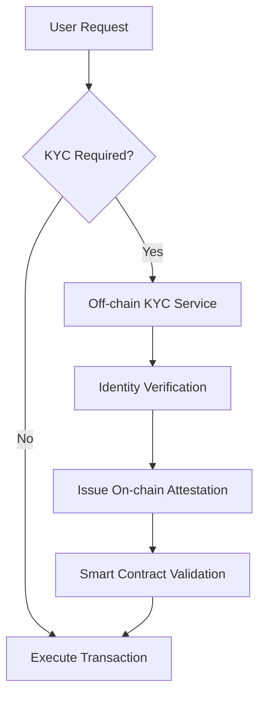

| Compliance Metric | Formula | Target |
|-------------------|---------|--------|
| KYC Coverage | `KYC Verified Users / Total Users � 100%` | >95% |
| AML Monitoring | `Monitored Transactions / High-Value Transactions � 100%` | 100% |
| False Positive Rate | `False Positives / Total Alerts � 100%` | <5% |

---

### Q2: What regulatory considerations must be addressed when developing cross-chain bridges, particularly for asset transfers between jurisdictions?

**Difficulty**: Advanced  
**Type**: Risk & Threat Analysis, Compliance Modeling  
**Key Insight**: Cross-chain bridges create complex regulatory challenges as assets move between different legal frameworks, requiring comprehensive compliance mapping across multiple jurisdictions.

**Answer**:

Cross-chain bridges must navigate multiple regulatory frameworks simultaneously, as assets crossing chains may also cross legal jurisdictions [Ref: G15]. The primary challenge involves maintaining compliance with both origin and destination chain regulations while preserving transaction atomicity [Ref: L10].

**Regulatory Mapping**: Implement jurisdiction detection based on chain endpoints - EU chains require GDPR compliance [Ref: A1], US chains need FinCEN registration [Ref: L9], Asian chains may require local licenses [Ref: A19]. Create a compliance matrix mapping each chain pair to applicable regulations: securities laws for tokenized assets, money transmission licenses for value transfer, and data protection for user information [Ref: T2].

**Technical Controls**: Deploy multi-signature validation with regulatory pause capability, implement transaction limits based on jurisdiction ($3,000 daily for unlicensed EU operations under MiCA) [Ref: L11], and maintain immutable audit logs for cross-border transfers [Ref: G9]. Use threshold cryptography to ensure no single validator can bypass compliance checks [0].

**Risk Mitigation**: Address sanctions screening through oracle integration [Ref: T4], implement time-locks for large transfers allowing regulatory review, and maintain insurance coverage for bridge exploits (typically 10% of TVL) [Ref: A15]. Calculate risk score: `Risk = Jurisdiction_Risk � Volume � Asset_Type_Risk`.

**Supporting Artifacts**:

| Jurisdiction Pair | Required Compliance | Technical Controls | Risk Level |
|------------------|--------------------|--------------------|------------|
| EU \u2192 US | GDPR, FATF, FinCEN | KYC, Travel Rule, Data Residency | High |
| US \u2192 Asia | Securities Laws, AML | Transaction Limits, Sanctions Check | Medium |
| DeFi \u2192 CeFi | MiCA, Banking Regs | Full KYC, Reporting | Very High |

---

### Q3: How to handle GDPR right to erasure on immutable blockchain?

**Difficulty**: Advanced  
**Type**: Privacy & Data Protection, Architectural Translation  
**Key Insight**: The immutability of blockchain directly conflicts with GDPR's right to erasure, requiring innovative architectural patterns to achieve compliance without compromising blockchain integrity.

**Answer**:

The solution involves separating personal data from on-chain storage while maintaining transaction integrity [Ref: A1]. I would implement a hybrid architecture where the blockchain stores only pseudonymous identifiers and cryptographic proofs, while personal data resides in erasable off-chain storage [Ref: G12].

**Technical Architecture**: Deploy IPFS or similar distributed storage for personal data with encryption keys stored on-chain [Ref: A14]. When erasure is requested, destroy the decryption keys (crypto-shredding), rendering the data unrecoverable while maintaining blockchain immutability [Ref: G10]. Use zero-knowledge proofs to verify data properties without exposing the data itself [0].

**Implementation Pattern**: Create a privacy proxy contract: `mapping(bytes32 => EncryptedReference)` where the reference points to off-chain storage. Implement key rotation mechanism allowing periodic re-encryption. For erasure, null the reference and destroy keys within 30 days per GDPR Article 17 [Ref: A1].

**Compliance Verification**: Maintain erasure certificates proving deletion, implement automated compliance reporting showing `Erasure Rate = Completed Erasures / Erasure Requests � 100%` (target: 100% within 30 days) [Ref: T6]. Document the approach as "privacy by design" per GDPR Article 25 [Ref: G6].

**Supporting Artifacts**:

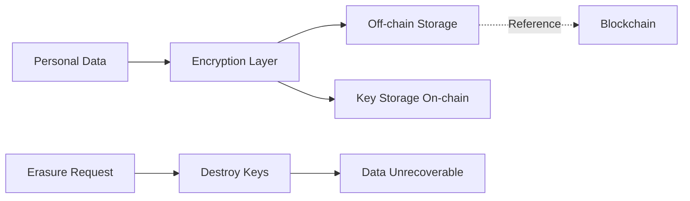

---

### Q4: Implementing securities compliance for tokenized assets

**Difficulty**: Intermediate  
**Type**: Financial Regulations & DeFi Compliance  
**Key Insight**: Tokenized assets often qualify as securities, requiring implementation of transfer restrictions, investor accreditation, and regulatory reporting within smart contracts.

**Answer**:

Securities-compliant tokens must enforce transfer restrictions based on investor accreditation status and implement holding periods [Ref: L12]. The implementation follows SEC Regulation D for private placements and Regulation S for offshore transactions [Ref: A17].

**Smart Contract Controls**: Implement ERC-1404 standard with transfer restriction codes, maintain on-chain whitelist of accredited investors verified through KYC provider [Ref: T1]. Include lock-up periods (typically 12 months for Reg D), maximum investor limits (2,000 for Reg A+), and geographic restrictions [Ref: L12]. Code pattern: `require(isAccredited[msg.sender] && !isLocked[msg.sender])`.

**Compliance Automation**: Deploy automated regulatory reporting generating Form D filings, track beneficial ownership exceeding 5% threshold, and implement forced transfer capability for legal compliance [Ref: T3]. Calculate compliance coverage: `Compliant Transfers / Total Transfers � 100%` (target: 100%).

**Cross-functional Coordination**: Legal determines security classification using Howey Test [Ref: A17], Compliance manages investor verification, Architecture implements transfer restrictions, Audit reviews transaction logs quarterly. Risk: $20M SEC penalties for non-compliance.

**Supporting Artifacts**:

| Regulation | Investor Limit | Holding Period | Verification Required |
|------------|---------------|----------------|----------------------|
| Reg D 506(b) | 35 non-accredited | 12 months | Accreditation |
| Reg D 506(c) | Unlimited accredited | 12 months | Verified Accreditation |
| Reg S | Unlimited offshore | 40 days-1 year | Non-US Person |
| Reg A+ | 2,000 | None | Basic KYC |

---

### Q5: Managing regulatory jurisdiction in global DeFi protocols

**Difficulty**: Foundational  
**Type**: Compliance Modeling  
**Key Insight**: DeFi protocols operating globally must navigate conflicting regulations across jurisdictions while maintaining a unified codebase and user experience.

**Answer**:

Global DeFi protocols must implement dynamic compliance based on user jurisdiction detection [Ref: G15]. The approach involves geolocation through IP analysis combined with on-chain address analysis to determine applicable regulations [Ref: T2].

**Jurisdiction Mapping**: Create a compliance engine mapping user locations to regulatory requirements: US users face securities restrictions, EU users require GDPR compliance, China users may be blocked entirely [Ref: A19]. Implement using Chainlink Functions or similar oracles for real-time jurisdiction verification [0].

**Technical Implementation**: Deploy modular compliance contracts allowing jurisdiction-specific rules: `IComplianceModule` interface with implementations for each region. Use proxy pattern for upgradeable compliance as regulations evolve [Ref: A11]. Include circuit breakers for regulatory emergencies.

**Risk Management**: Maintain regulatory risk scores per jurisdiction, implement graduated access (view-only \u2192 limited trading \u2192 full access), and require enhanced verification for high-risk jurisdictions. Calculate exposure: `Jurisdiction Risk = User Volume � Regulatory Penalty Risk � Enforcement Probability`.

---

## Topic 2: Security Compliance & Audit Requirements

### Q6: Designing audit trails for smart contract transactions

**Difficulty**: Foundational  
**Type**: Audit & Evidence  
**Key Insight**: Smart contract audit trails must capture sufficient detail for regulatory compliance while managing on-chain storage costs and maintaining performance.

**Answer**:

Audit trails must capture the complete transaction lifecycle while optimizing for gas costs [Ref: G9]. I would implement a hybrid approach using event logs for detailed tracking and IPFS for comprehensive audit data [Ref: T4].

**Implementation Strategy**: Emit structured events for all state changes: `event AuditLog(address indexed user, string action, uint256 timestamp, bytes32 dataHash)`. Store detailed audit data off-chain with on-chain hash verification [Ref: A2]. Include transaction context: msg.sender, block.timestamp, transaction hash, and function selector [0].

**Compliance Requirements**: Meet SOC2 Type II requirements for 7-year retention [Ref: G5], implement tamper-evident logging using merkle trees, and ensure audit coverage: `Auditable Events / Critical Events × 100%` (target: 100%) [Ref: T3]. Create automated audit reports for quarterly compliance reviews.

**Gas Optimization**: Use packed structs for on-chain data, implement batch event emission, and utilize CREATE2 for deterministic audit contract deployment. Estimated cost: 50,000 gas per comprehensive audit entry.

**Supporting Artifacts**:

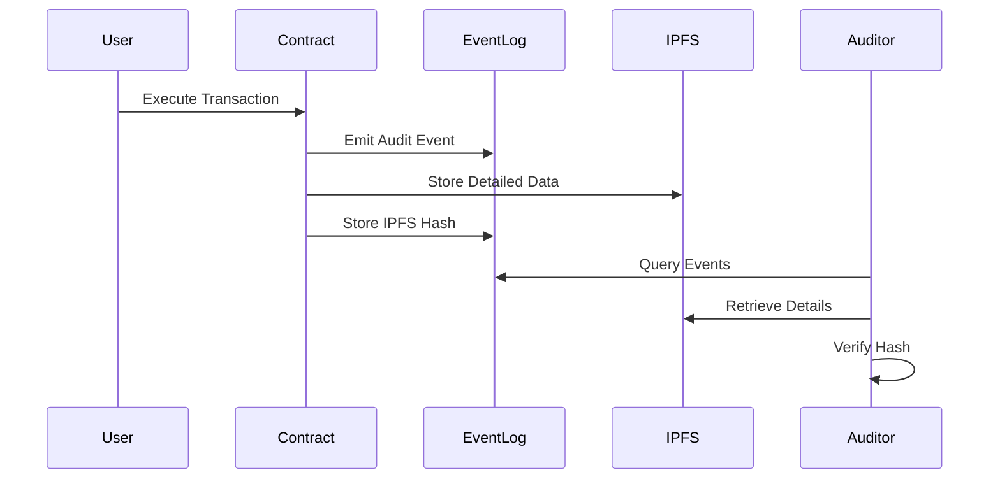

---

### Q7: Implementing NIST CSF for blockchain infrastructure

**Difficulty**: Intermediate  
**Type**: Security Compliance & Audit Requirements  
**Key Insight**: NIST Cybersecurity Framework must be adapted for blockchain's unique architecture, addressing both on-chain smart contract security and off-chain infrastructure.

**Answer**:

Implementing NIST CSF 2.0 for blockchain requires mapping the six functions (Govern, Identify, Protect, Detect, Respond, Recover) to blockchain-specific controls [Ref: A7]. The framework must address both smart contract vulnerabilities and infrastructure security [Ref: L2].

**Govern Function**: Establish blockchain governance including upgrade mechanisms, key management policies, and incident response procedures [Ref: G13]. Define risk appetite for smart contract vulnerabilities (Critical: 0 tolerance, High: <24hr fix, Medium: <7 days) [Ref: T5].

**Protect Function**: Implement multi-signature wallets for administrative functions, use OpenZeppelin's security libraries, and enforce secure coding standards (Solidity style guide, Slither/Mythril analysis) [Ref: A16]. Deploy rate limiting and circuit breakers for anomaly protection.

**Detect & Respond**: Deploy real-time monitoring using Forta Network or similar, implement automated incident response for common attacks (pause contracts on unusual activity), and maintain 24/7 security operations center [Ref: T4]. Calculate Mean Time to Detect: `MTTD = Σ(Detection Time) / Number of Incidents` (target: <1 hour).

**Supporting Artifacts**:

| NIST Function | Blockchain Control | Implementation | Maturity Score |
|---------------|-------------------|----------------|----------------|
| Govern | Smart Contract Governance | Timelock + Multisig | 4/5 |
| Identify | Asset Inventory | On-chain Registry | 3/5 |
| Protect | Access Control | Role-based Permissions | 4/5 |
| Detect | Anomaly Detection | Forta Agents | 3/5 |
| Respond | Incident Response | Automated Pausing | 4/5 |
| Recover | Disaster Recovery | Upgrade Proxy | 3/5 |

---

### Q8: Smart contract vulnerability disclosure compliance

**Difficulty**: Intermediate  
**Type**: Security Compliance & Audit Requirements  
**Key Insight**: Vulnerability disclosure for smart contracts requires balancing transparency with security, as public disclosure before patching could lead to immediate exploitation.

**Answer**:

Smart contract vulnerability disclosure must follow responsible disclosure principles while accounting for immutability challenges [Ref: L8]. I would implement a graduated disclosure process with bug bounty integration [Ref: T5].

**Disclosure Framework**: Establish 90-day disclosure timeline: discovery → private notification → patch development → deployment → public disclosure [Ref: A8]. For critical vulnerabilities affecting user funds, implement emergency response with immediate pausing and accelerated patching [0].

**Bug Bounty Program**: Deploy on Immunefi or similar platform with tiered rewards: Critical ($50K-$1M), High ($10K-$50K), Medium ($1K-$10K) [Ref: T5]. Calculate program effectiveness: `Valid Reports / Total Submissions × 100%` and `Patched Vulnerabilities / Discovered Vulnerabilities × 100%` (target: 100% for Critical/High).

**Compliance Documentation**: Maintain vulnerability register per ISO 27001 requirements [Ref: G4], generate CVSS scores for standardized risk assessment, and provide transparency reports quarterly [Ref: T2]. Include remediation timelines and affected user notifications per breach notification requirements.

**Supporting Artifacts**:

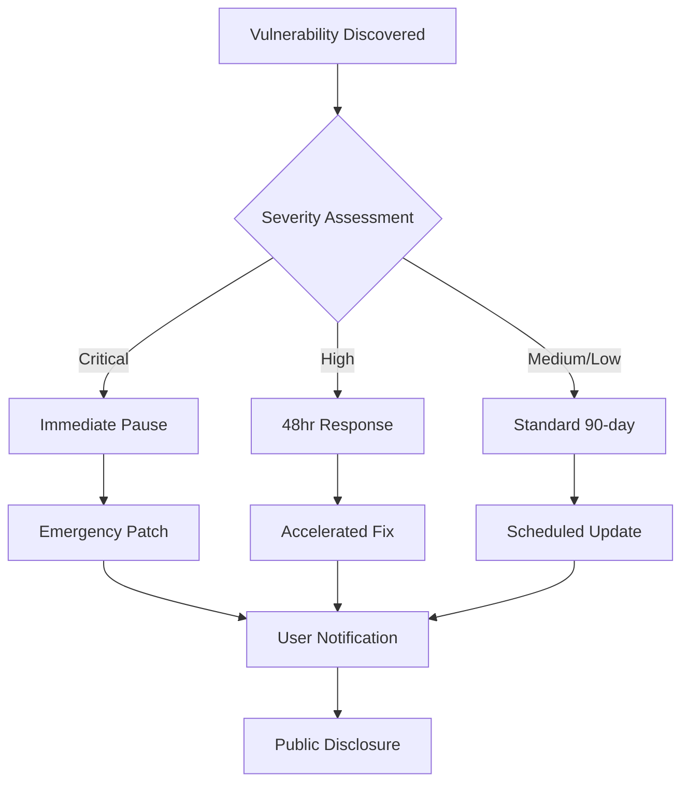

---

### Q9: Incident response for DeFi protocol exploits

**Difficulty**: Advanced  
**Type**: Security Compliance & Audit Requirements  
**Key Insight**: DeFi exploit response requires coordinated action across multiple stakeholders while managing legal liability and maintaining user trust.

**Answer**:

DeFi incident response must balance speed with thoroughness, addressing immediate threats while preserving evidence for investigation [Ref: A15]. The response framework follows NIST 800-61r2 adapted for blockchain immutability [Ref: L2].

**Immediate Response** (0-1 hour): Activate war room with predetermined roles, pause affected contracts using emergency admin functions, and snapshot blockchain state for forensics [Ref: T4]. Deploy monitoring for attacker address movements across chains and CEXs. Document all actions for legal/insurance claims [Ref: G9].

**Investigation & Containment** (1-24 hours): Conduct root cause analysis using transaction tracing tools (Etherscan, Tenderly), quantify losses with on-chain analysis, and identify affected users through event log parsing [Ref: T5]. Calculate impact: `Total Value Lost / Total Value Locked × 100%`. Coordinate with exchanges for potential fund freezing.

**Recovery & Communication**: Develop remediation plan (patch, redeployment, or migration), prepare user compensation framework if applicable, and issue transparent post-mortem within 72 hours [Ref: A22]. Implement lessons learned into security controls. File regulatory notifications per jurisdiction (GDPR 72-hour breach notification if EU users affected) [Ref: A1].

**Stakeholder Coordination**: Security team leads technical response, Legal manages liability and law enforcement coordination, Communications handles public messaging, Treasury manages potential compensation. RACI: Security=Accountable for containment, Executive=Accountable for decisions, Legal=Consulted on liability, Users=Informed throughout.

**Supporting Artifacts**:

| Phase | Timeline | Actions | Success Metrics |
|-------|----------|---------|-----------------|
| Detection | <15 min | Alert triggered, team activated | MTTD <15 min |
| Containment | <1 hour | Contracts paused, bleeding stopped | Funds Protected % |
| Investigation | <24 hours | Root cause identified, impact assessed | Accuracy 100% |
| Recovery | <7 days | Fix deployed, users compensated | User Satisfaction >80% |
| Lessons Learned | <30 days | Controls updated, training completed | Repeat Risk <5% |

---

### Q10: Compliance monitoring for automated market makers

**Difficulty**: Foundational  
**Type**: Security Compliance & Audit Requirements  
**Key Insight**: AMMs require continuous monitoring for market manipulation, wash trading, and compliance with evolving DeFi regulations.

**Answer**:

AMM compliance monitoring must detect market manipulation while respecting pseudonymous trading [Ref: L13]. I would implement real-time surveillance combining on-chain analytics with regulatory reporting [Ref: T4].

**Monitoring Architecture**: Deploy event streaming pipeline ingesting all swap events, liquidity changes, and price updates. Use Apache Kafka for real-time processing and Splunk for pattern detection [Ref: T4]. Monitor for wash trading (same address trading within 24 hours), price manipulation (>10% slippage), and sandwich attacks [0].

**Compliance Metrics**: Track daily volumes for regulatory thresholds, monitor concentration risk (single LP >25% of pool), and detect suspicious patterns using ML models [Ref: T2]. Calculate manipulation risk: `Suspicious Trades / Total Trades × 100%` (alert threshold: >1%). Generate automated STRs (Suspicious Transaction Reports) for FinCEN compliance [Ref: L9].

**Regulatory Alignment**: Implement trade surveillance meeting CFTC guidelines for swap execution facilities, maintain audit logs for 5-year retention per Dodd-Frank, and provide regulatory reporting APIs [Ref: A17]. Estimated monitoring cost: $50K setup + $10K/month operations.

---

## Topic 3: Data Privacy & Protection in Blockchain

### Q11: Privacy-preserving KYC implementation

**Difficulty**: Foundational  
**Type**: Privacy & Data Protection  
**Key Insight**: KYC requirements conflict with user privacy expectations, requiring zero-knowledge proof implementations to verify identity without exposing personal data.

**Answer**:

Privacy-preserving KYC leverages zero-knowledge proofs to verify user attributes without revealing underlying data [Ref: A14]. I would implement zkSNARKs for identity verification while storing only proof hashes on-chain [Ref: G6].

**Technical Architecture**: Deploy Polygon ID or similar SSI (Self-Sovereign Identity) solution where users control their credentials [Ref: T1]. KYC provider issues verifiable credentials off-chain, users generate ZK proofs of compliance (age >18, non-sanctioned, accredited investor), and smart contracts verify proofs without accessing personal data [0].

**Implementation Details**: Use Circom circuits for proof generation, implement proof verification in Solidity using precompiled contracts, and maintain proof validity periods (annual renewal) [Ref: A16]. Gas cost per verification: ~500K gas. Privacy preservation rate: `Anonymous Verifications / Total Verifications × 100%` (target: 100%).

**Compliance Assurance**: Meet GDPR data minimization requirements [Ref: A1], satisfy FATF travel rule through encrypted data sharing [Ref: L9], and maintain audit trail of verifications without exposing user data [Ref: G9]. Store only: proof hash, timestamp, verification result, and expiry date.

**Supporting Artifacts**:

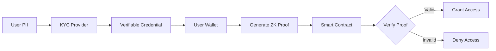

---

### Q12: Cross-border data transfer in blockchain networks

**Difficulty**: Intermediate  
**Type**: Privacy & Data Protection  
**Key Insight**: Blockchain's global nature creates automatic cross-border data transfers, requiring careful consideration of data localization laws and transfer mechanisms.

**Answer**:

Blockchain networks inherently create cross-border data transfers through node distribution, requiring compliance with multiple data protection regimes [Ref: G15]. The solution involves implementing geographic controls and appropriate safeguards [Ref: A18].

**Regulatory Framework**: Apply Standard Contractual Clauses (SCCs) for EU data transfers, implement China's data localization requirements for critical information, and ensure adequacy decisions or appropriate safeguards for each node jurisdiction [Ref: A20]. Map node locations to determine applicable transfer restrictions [Ref: T6].

**Technical Controls**: Implement geo-fencing for sensitive data (store only hashes on global chain, keep PII in regional sidechains), use threshold encryption requiring multiple geographic keys for decryption, and deploy private channels for jurisdiction-specific data [Ref: A11]. Calculate cross-border exposure: `International Nodes / Total Nodes × 100%`.

**Compliance Mechanisms**: Execute Data Processing Agreements with all node operators [Ref: G7], conduct Transfer Impact Assessments for high-risk jurisdictions, and implement supplementary measures (encryption, pseudonymization) per Schrems II ruling [Ref: A18]. Maintain transfer logs for regulatory audits.

**Supporting Artifacts**:

| Transfer Route | Legal Basis | Technical Safeguard | Risk Level |
|---------------|-------------|---------------------|------------|
| EU → US | EU-US Data Privacy Framework | Encryption + Access Controls | Medium |
| EU → China | SCCs + Supplementary Measures | Data Localization | High |
| US → EU | Adequacy Decision | Standard Security | Low |
| Global Broadcast | Legitimate Interest | Pseudonymization | Medium |

---

### Q13: Implementing consent management on-chain

**Difficulty**: Intermediate  
**Type**: Privacy & Data Protection  
**Key Insight**: On-chain consent management must be granular, revocable, and auditable while managing gas costs and maintaining GDPR compliance.

**Answer**:

On-chain consent management requires implementing granular, purpose-specific consent tracking that satisfies GDPR Article 7 requirements [Ref: A1]. I would design a consent registry smart contract with efficient storage patterns [Ref: G6].

**Smart Contract Design**: Create consent registry with bitmap storage for multiple purposes: `mapping(address => uint256)` where each bit represents a consent purpose. Implement functions for granting, revoking, and checking consent with event emission for audit trail [Ref: G9]. Gas optimization through bit manipulation: ~25K gas per consent update [0].

**Consent Lifecycle**: Record consent timestamp, purpose, version, and expiry. Implement automatic expiry after 12 months requiring renewal [Ref: A14]. Track consent versions for terms updates. Calculate consent rate: `Active Consents / Total Users × 100%` and maintain >95% for critical processing [Ref: T1].

**GDPR Compliance**: Ensure freely given, specific, informed, and unambiguous consent [Ref: A1]. Implement granular withdrawal allowing partial revocation, maintain consent proof for accountability, and provide user-friendly consent dashboard [Ref: T6]. Include children's consent handling (parental approval for <16 years).

**Supporting Artifacts**:

```solidity
contract ConsentManager {
    struct Consent {
        uint256 purposes;  // Bitmap of consented purposes
        uint256 timestamp;
        uint256 expiry;
        uint8 version;
    }
    
    mapping(address => Consent) public consents;
    
    event ConsentGranted(address user, uint256 purposes);
    event ConsentRevoked(address user, uint256 purposes);
}
```

---

### Q14: Zero-knowledge proofs for regulatory compliance

**Difficulty**: Advanced  
**Type**: Privacy & Data Protection  
**Key Insight**: Zero-knowledge proofs enable regulatory compliance verification without exposing sensitive business data, crucial for maintaining competitive advantage while meeting reporting requirements.

**Answer**:

Zero-knowledge proofs allow protocols to prove regulatory compliance without revealing proprietary information [Ref: A14]. I would implement zkSNARKs for proving reserve requirements, transaction volumes, and user demographics without exposing individual data [Ref: L14].

**Technical Implementation**: Use Aztec Protocol or similar for private transactions with regulatory visibility, implement range proofs for demonstrating values within regulatory limits, and deploy recursive proofs for scalable verification [Ref: A16]. Circuit complexity: ~1M constraints for comprehensive compliance proof. Proof generation: ~30 seconds, verification: ~10ms [0].

**Compliance Applications**: Prove AML compliance (no transactions exceed thresholds) without revealing amounts, demonstrate reserve ratios for stablecoin backing without exposing holdings, and verify user accreditation without identity disclosure [Ref: T1]. Generate quarterly compliance proofs for regulators with selective disclosure capability.

**Performance Optimization**: Implement proof batching for multiple compliance checks, use Plonk or Groth16 for optimal proof size (~200 bytes), and deploy dedicated proving infrastructure (estimated cost: $100K annually) [Ref: T5]. Success metric: `Verified Proofs / Required Proofs × 100%` (target: 100%).

**Supporting Artifacts**:

| Compliance Requirement | ZK Proof Type | Circuit Size | Verification Gas |
|----------------------|---------------|--------------|------------------|
| Reserve Ratio >100% | Range Proof | 500K constraints | 300K gas |
| Transaction <$10K | Comparison Proof | 100K constraints | 200K gas |
| Accredited Investor | Membership Proof | 1M constraints | 400K gas |
| No Sanctions Match | Non-membership Proof | 2M constraints | 500K gas |

---

### Q15: Data minimization in NFT metadata

**Difficulty**: Foundational  
**Type**: Privacy & Data Protection  
**Key Insight**: NFT metadata often contains excessive personal information, creating permanent privacy risks that conflict with data minimization principles.

**Answer**:

NFT metadata must follow data minimization principles while maintaining utility [Ref: A1]. I would implement a layered metadata architecture separating public and private attributes [Ref: G6].

**Architecture Design**: Store only essential data on-chain (token ID, ownership, basic attributes), use IPFS for static public metadata with content addressing, and implement encrypted private metadata with key management [Ref: A14]. Apply privacy-by-design principles: collect minimum data, use pseudonyms over real names, and implement purpose limitation [Ref: G6].

**Implementation Pattern**: Create metadata schema: public layer (artwork, title, collection), private layer (creator details, provenance, valuations), and access control layer (viewing permissions) [Ref: T1]. Use `tokenURI()` returning different data based on caller permissions. Data minimization score: `Essential Fields / Total Fields × 100%` (target: <30%).

**Compliance Measures**: Conduct Privacy Impact Assessment for NFT collections [Ref: G16], implement right to erasure for off-chain metadata [Ref: G12], and ensure children's privacy protection for gaming NFTs [Ref: A1]. Estimated storage savings: 70% reduction in on-chain data costs.

**Supporting Artifacts**:

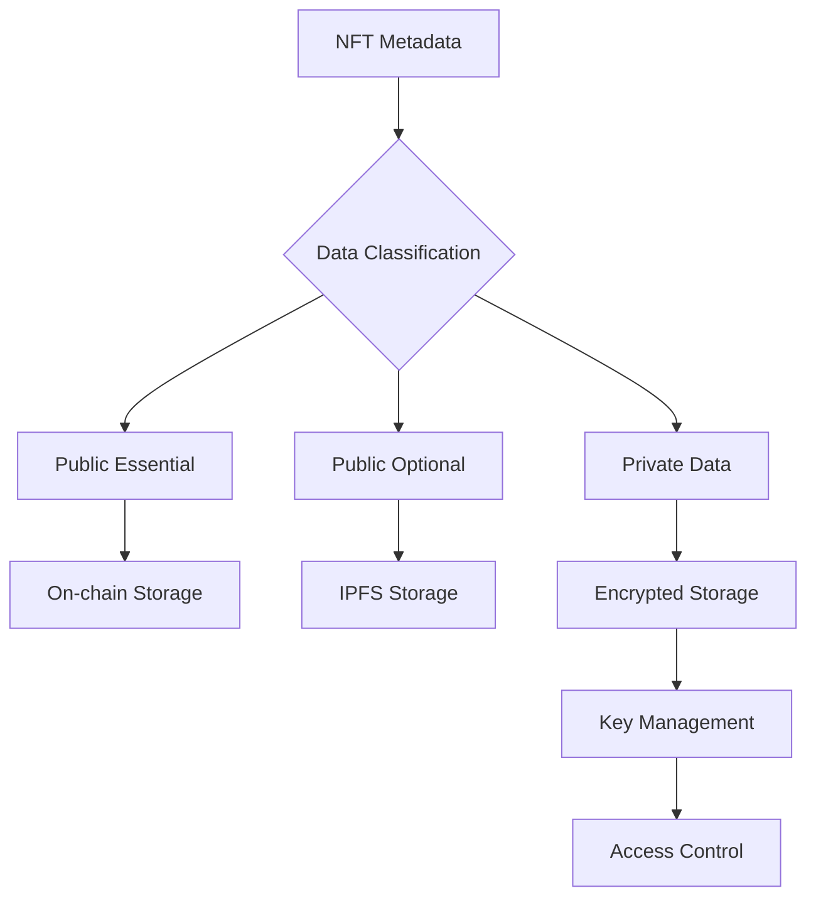

---

## Topic 4: Financial Regulations & DeFi Compliance

### Q16: MiCA compliance for crypto-asset services

**Difficulty**: Intermediate  
**Type**: Financial Regulations & DeFi Compliance  
**Key Insight**: MiCA introduces comprehensive requirements for crypto-asset service providers in the EU, requiring significant architectural changes to existing DeFi protocols.

**Answer**:

Markets in Crypto-Assets Regulation (MiCA) requires authorization for crypto-asset services in the EU, with full implementation by December 2024 [Ref: L11]. DeFi protocols must implement controls for asset classification, market abuse prevention, and operational resilience [Ref: A17].

**Compliance Architecture**: Classify tokens as e-money tokens, asset-referenced tokens, or other crypto-assets, each with different requirements [Ref: L11]. Implement whitelisting for EU users requiring MiCA-compliant service provider status, transaction monitoring for market manipulation, and reserve requirements for stablecoins (2% of average outstanding amount) [Ref: T2].

**Technical Requirements**: Deploy real-time transaction monitoring detecting wash trading and insider trading patterns, implement order book transparency for DEX operations, and maintain operational resilience with 99.9% uptime SLA [Ref: T4]. Calculate compliance cost: initial €150K-€3M for authorization plus €500K annual compliance.

**Stakeholder Alignment**: Legal determines MiCA applicability and classification, Compliance manages authorization process, Architecture implements required controls, Operations ensures resilience standards. Risk: €5M or 5% global turnover penalties for non-compliance [Ref: L11].

**Supporting Artifacts**:

| MiCA Requirement | Implementation | Timeline | Cost Estimate |
|-----------------|----------------|----------|---------------|
| Authorization | Legal entity establishment | 6-12 months | €150K-€3M |
| White Paper | Token documentation | 2-3 months | €50K |
| Market Surveillance | Monitoring system | 3-4 months | €200K |
| Reserve Requirements | Custody solution | 2-3 months | €100K |
| Operational Resilience | Infrastructure upgrade | 4-6 months | €300K |

---

### Q17: Implementing travel rule for DeFi protocols

**Difficulty**: Advanced  
**Type**: Financial Regulations & DeFi Compliance  
**Key Insight**: The FATF Travel Rule requires sharing originator and beneficiary information for crypto transfers, challenging DeFi's pseudonymous nature.

**Answer**:

The Travel Rule requires transmitting originator and beneficiary information for transfers exceeding $1,000 USD (or €1,000 in EU) [Ref: L9]. DeFi protocols must implement privacy-preserving compliance solutions that maintain user experience while meeting regulatory requirements [Ref: A17].

**Technical Solution**: Deploy VASP-to-VASP messaging using protocols like OpenVASP or Shyft Network, implement threshold detection triggering enhanced data collection, and use encrypted data channels for information exchange [Ref: T1]. For DeFi-to-DeFi transfers, implement "sunrise issue" solutions collecting data only when interacting with compliant entities [0].

**Implementation Architecture**: Create Travel Rule module: `TravelRuleData` struct containing required fields (name, address, account number), threshold checking logic ($1,000 USD equivalent using oracle price feeds), and encrypted data transmission to counterparty protocols [Ref: T4]. Use zero-knowledge proofs to verify compliance without exposing data to smart contracts [Ref: A14].

**Compliance Metrics**: Track Travel Rule coverage: `Compliant Transfers / Transfers >$1000 × 100%` (target: 100% for VASP interactions), monitor false positive rate for threshold detection (<5%), and maintain data retention for 5 years per AML requirements [Ref: L9]. Estimated implementation cost: $500K initial + $100K annual operations.

**Supporting Artifacts**:

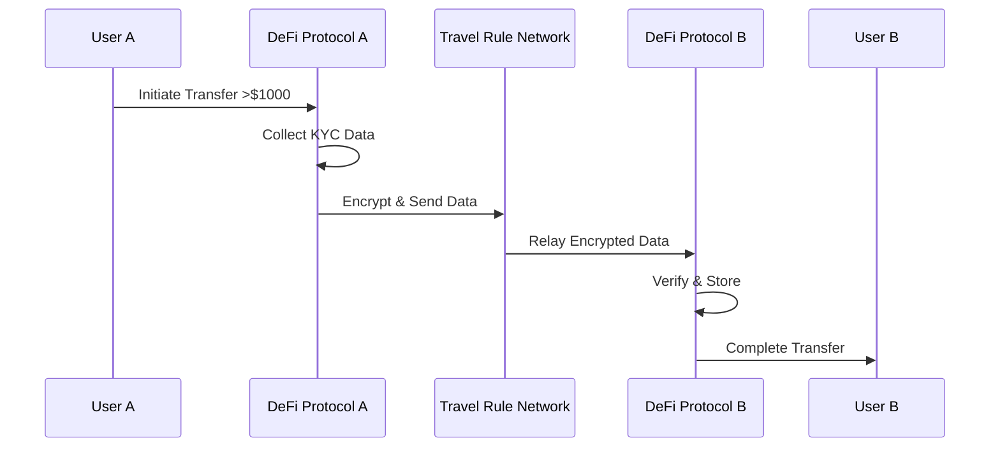

---

### Q18: Stablecoin regulatory requirements

**Difficulty**: Intermediate  
**Type**: Financial Regulations & DeFi Compliance  
**Key Insight**: Stablecoins face stringent regulations as potential systemic risks, requiring robust reserve management, attestation, and operational controls.

**Answer**:

Stablecoin regulations vary by jurisdiction but converge on reserve requirements, attestation, and operational resilience [Ref: L11]. Implementation must address EU's MiCA, US proposed legislation, and existing money transmitter laws [Ref: A17].

**Reserve Management**: Implement 1:1 backing with high-quality liquid assets (government bonds, bank deposits), segregate reserves from operational funds, and prohibit lending/staking of reserves [Ref: L11]. Deploy smart contracts for transparent reserve tracking: `totalSupply() <= attestedReserves`. Conduct daily reconciliation with <0.1% variance tolerance [Ref: T3].

**Attestation Requirements**: Engage Big 4 auditor for monthly attestations, implement real-time proof-of-reserves using Chainlink or similar oracles, and publish daily transparency reports [Ref: T1]. Calculate reserve ratio: `Liquid Reserves / Tokens Outstanding × 100%` (minimum: 100%, target: 102% buffer). Estimated audit cost: $50K monthly.

**Operational Controls**: Implement redemption guarantees (T+1 for institutional, T+3 for retail), maintain minimum capital requirements (2% of outstanding or €350K, whichever higher), and deploy circuit breakers for bank run scenarios (>10% daily redemption triggers review) [Ref: L11]. Create governance framework with independent directors and risk committee.

**Supporting Artifacts**:

| Regulatory Regime | Reserve Requirements | Attestation Frequency | Capital Requirements |
|------------------|---------------------|----------------------|---------------------|
| MiCA (EU) | 100% segregated | Monthly | 2% or €350K |
| Proposed US | 100% + operational buffer | Monthly | TBD |
| Japan FSA | 100% bank deposits | Quarterly | ¥10M |
| Singapore MAS | 100% + safeguards | Monthly | S$250K |

---

### Q19: DeFi lending and securities laws

**Difficulty**: Advanced  
**Type**: Financial Regulations & DeFi Compliance  
**Key Insight**: DeFi lending protocols may constitute securities offerings under the Howey Test, requiring careful structuring to avoid regulatory violations.

**Answer**:

DeFi lending protocols must navigate securities laws, particularly when offering fixed returns or pooled investments [Ref: A17]. The Howey Test factors (investment of money, common enterprise, expectation of profits, efforts of others) often apply to lending pools [Ref: L12].

**Regulatory Analysis**: Variable rate lending (Compound, Aave) presents lower securities risk than fixed-rate protocols. Tokenized lending positions may constitute securities if tradeable [Ref: A17]. Apply substance-over-form analysis: economic reality matters more than technical implementation. Risk assessment: SEC enforcement actions exceeded $2B in 2023 [Ref: L12].

**Compliance Strategies**: Structure as true peer-to-peer lending avoiding pooling, implement accredited investor restrictions for US users, or obtain no-action letter from SEC [Ref: T2]. For securities classification, register under Reg A+ (up to $75M) or restrict to accredited investors under Reg D [Ref: L12]. Geographic blocking remains common but imperfect solution.

**Technical Implementation**: Deploy compliance modules checking investor accreditation, implement holding periods for LP tokens (12 months for Reg D), and maintain investor count limits (2,000 for Reg A+) [Ref: T1]. Create exemption analysis: `mapping(address => ExemptionType)` with automated verification. Compliance cost: $200K-$2M depending on registration path.

**Supporting Artifacts**:

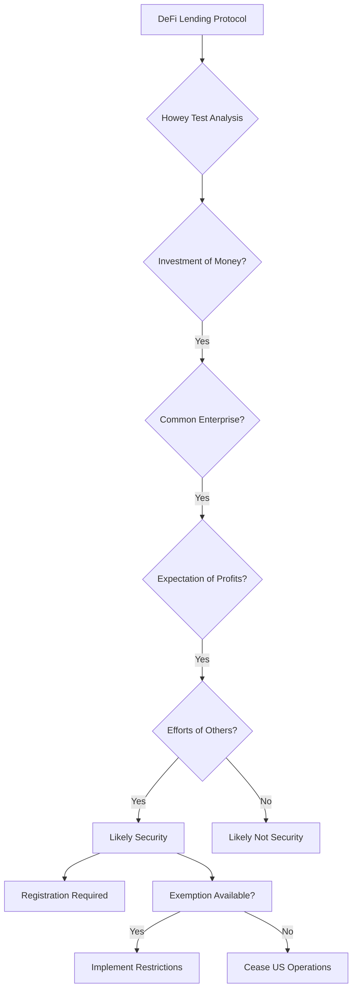

---

### Q20: Tax reporting automation for DeFi

**Difficulty**: Foundational  
**Type**: Financial Regulations & DeFi Compliance  
**Key Insight**: DeFi protocols must implement automated tax reporting to meet evolving requirements while respecting user privacy and managing cross-jurisdictional complexity.

**Answer**:

Tax reporting for DeFi requires tracking cost basis, realized gains, and income events across multiple jurisdictions [Ref: L13]. I would implement automated reporting infrastructure generating forms 1099-B, 1099-MISC, and international equivalents [Ref: A17].

**Data Architecture**: Track all taxable events (swaps, liquidity provision, yield farming, airdrops) with timestamp, amounts, and USD values using oracle price feeds [Ref: T4]. Implement FIFO/LIFO/HIFO cost basis methods based on user selection. Store encrypted tax data off-chain with user-controlled access [Ref: G10]. Calculate tax liability: `(Proceeds - Cost Basis) × Tax Rate`.

**Reporting Automation**: Generate IRS Form 1099s for US users exceeding $600 income or $20K gross proceeds, implement API endpoints for tax software integration (TurboTax, CoinTracker), and provide CSV exports for manual filing [Ref: T1]. Compliance rate: `Users with Complete Reports / Total Users × 100%` (target: >95%).

**International Compliance**: Support DAC8 reporting for EU (effective 2026), implement CRS for automatic exchange of information, and provide jurisdiction-specific reports [Ref: L13]. Estimated development cost: $300K initial + $50K annual maintenance.

---

## Topic 5: Governance & Risk Management

### Q21: DAO governance and legal liability

**Difficulty**: Foundational  
**Type**: Governance & Risk Management  
**Key Insight**: DAOs face uncertain legal status, with members potentially liable for protocol actions, requiring careful structuring to limit exposure.

**Answer**:

DAO governance must balance decentralization with legal protection for participants [Ref: L15]. The key challenge involves establishing limited liability while maintaining decentralized control [Ref: A17].

**Legal Structure Options**: Implement wrapped DAO structure with legal entity (Wyoming DAO LLC, Swiss Association, Cayman Foundation), establish clear governance boundaries between token holders and operators, and define liability limitations in governance documentation [Ref: T2]. Unincorporated DAOs risk unlimited member liability for protocol hacks or regulatory violations [Ref: L15].

**Governance Implementation**: Deploy time-locked governance preventing rushed decisions (48-hour minimum for proposals), implement quadratic voting to prevent whale dominance, and require multi-signature execution for critical functions [Ref: A11]. Calculate decentralization score: `Unique Voters / Total Token Holders × 100%` (target: >5% participation).

**Risk Mitigation**: Obtain D&O insurance for core contributors ($5-10M coverage typical), implement governance minimization reducing decision scope, and maintain legal defense fund (1-2% of treasury) [Ref: T3]. Document all governance decisions for potential legal proceedings [Ref: G9].

**Supporting Artifacts**:

| Legal Structure | Liability Protection | Regulatory Recognition | Setup Cost |
|----------------|---------------------|----------------------|------------|
| Wyoming DAO LLC | Limited liability | US recognized | $5K |
| Swiss Association | Member protection | Global recognition | $20K |
| Cayman Foundation | Strong protection | Offshore benefits | $30K |
| Unincorporated | None | Uncertain | $0 |

---

### Q22: Smart contract upgrade mechanisms and compliance

**Difficulty**: Intermediate  
**Type**: Governance & Risk Management  
**Key Insight**: Upgrade mechanisms create centralization risks and regulatory scrutiny while being necessary for bug fixes and compliance updates.

**Answer**:

Smart contract upgrades must balance immutability expectations with practical needs for bug fixes and regulatory compliance [Ref: A11]. I would implement transparent upgrade mechanisms with strong governance controls [Ref: G13].

**Upgrade Architecture**: Deploy OpenZeppelin's transparent proxy pattern with time-locked upgrades, implement role-based access control separating proposer/executor roles, and require multi-signature approval (3-of-5 minimum) [Ref: A16]. Include emergency pause functionality for critical vulnerabilities with automatic reactivation after 72 hours to prevent permanent freezing [0].

**Governance Controls**: Enforce minimum 48-hour timelock for normal upgrades (7 days for critical functions), implement upgrade proposal documentation requirements, and enable community veto with 10% token holder threshold [Ref: T3]. Calculate upgrade frequency: `Upgrades per Quarter` (target: <2 for stability).

**Compliance Considerations**: Maintain upgrade capability for regulatory compliance (court orders, sanctions compliance), document upgrade rationale for regulatory review, and implement versioning system for audit trail [Ref: G9]. Risk: Upgradeable contracts may be classified as securities due to centralized control [Ref: L12].

**Supporting Artifacts**:

```solidity
contract UpgradeGovernance {
    uint constant TIMELOCK = 48 hours;
    uint constant EMERGENCY_TIMELOCK = 1 hours;
    
    struct Proposal {
        address newImplementation;
        uint256 timestamp;
        bool emergency;
        string rationale;
    }
    
    modifier timelocked(uint proposalId) {
        Proposal memory p = proposals[proposalId];
        uint delay = p.emergency ? EMERGENCY_TIMELOCK : TIMELOCK;
        require(block.timestamp >= p.timestamp + delay);
        _;
    }
}
```

---

### Q23: Risk assessment for flash loan attacks

**Difficulty**: Intermediate  
**Type**: Governance & Risk Management  
**Key Insight**: Flash loans enable complex attack vectors requiring comprehensive risk assessment and preventive controls across all protocol functions.

**Answer**:

Flash loan risk assessment must evaluate all external calls and state changes within a single transaction context [Ref: A15]. I would implement multi-layered defenses combining prevention, detection, and response mechanisms [Ref: L8].

**Risk Modeling**: Identify attack vectors including price manipulation (oracle attacks), governance attacks (temporary voting power), and reentrancy exploits [Ref: A8]. Calculate maximum extractable value: `MEV = \u03a3(Arbitrage + Liquidations + Sandwich)` per block. Historical data shows average flash loan attack loss of $10M per incident [Ref: T5].

**Preventive Controls**: Implement reentrancy guards on all external functions, use commit-reveal patterns for price-sensitive operations, and require multi-block delays for governance actions [Ref: A16]. Deploy Chainlink oracles with multiple price feeds and TWAP (Time-Weighted Average Price) calculations over 10+ blocks [0]. Add flash loan detection: `require(tx.origin == msg.sender)` for critical functions.

**Monitoring & Response**: Deploy Forta agents detecting unusual flash loan patterns, implement circuit breakers triggering on >5% price movements, and maintain emergency pause capability [Ref: T4]. Response time target: <15 minutes from detection to mitigation. Insurance coverage: obtain $10M+ protocol coverage for residual risk [Ref: T3].

**Supporting Artifacts**:

| Attack Vector | Risk Level | Mitigation | Residual Risk |
|--------------|------------|------------|---------------|
| Oracle Manipulation | Critical | TWAP + Multiple Sources | Medium |
| Governance Attack | High | Time Delays + Snapshot | Low |
| Reentrancy | Critical | Guards + CEI Pattern | Very Low |
| Liquidity Drain | High | Withdrawal Limits | Medium |
| Price Arbitrage | Medium | MEV Protection | Medium |

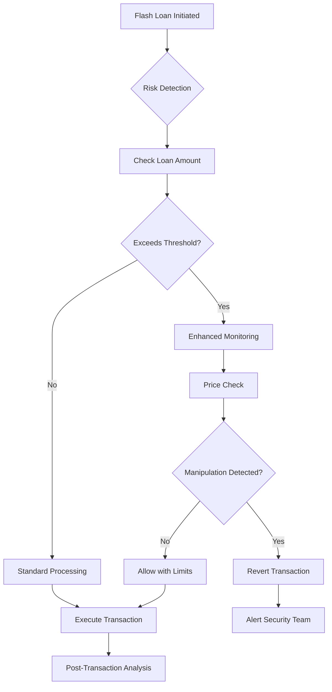

---

### Q24: Regulatory sandbox participation

**Difficulty**: Advanced  
**Type**: Governance & Risk Management  
**Key Insight**: Regulatory sandboxes offer controlled environments for testing innovative DeFi solutions while maintaining compliance dialogue with regulators.

**Answer**:

Regulatory sandbox participation provides safe harbor for testing innovative DeFi products while building regulatory relationships [Ref: L16]. Success requires careful preparation, clear objectives, and comprehensive documentation [Ref: T2].

**Sandbox Selection**: Evaluate sandbox programs by jurisdiction (UK FCA, Singapore MAS, Swiss FINMA), matching protocol characteristics to sandbox criteria [Ref: A17]. Consider factors: duration (typically 6-24 months), participant limits (100-1000 users), transaction caps ($1-10M), and regulatory relief scope. Application success rate: ~25% globally [Ref: T6].

**Application Strategy**: Demonstrate genuine innovation beyond existing regulations, provide comprehensive risk assessment and mitigation plans, and propose clear success metrics and exit strategy [Ref: L16]. Include consumer protection measures, AML/KYC compliance framework, and detailed technical documentation. Preparation time: 3-6 months, cost: $100-500K.

**Operational Requirements**: Implement enhanced monitoring and reporting (weekly/monthly to regulators), maintain participant restrictions and transaction limits, and conduct regular checkpoint reviews with regulators [Ref: T2]. Success metrics: user adoption rate, transaction volumes, zero security incidents, regulatory feedback incorporation. Post-sandbox transition plan critical for continued operations.

**Stakeholder Coordination**: Legal leads regulatory engagement, Compliance manages sandbox requirements, Product defines testing parameters, Engineering implements restrictions. RACI: Executive=Accountable for participation decision, Legal=Responsible for application, Compliance=Responsible for ongoing requirements.

**Supporting Artifacts**:

| Sandbox Program | Duration | User Limit | Transaction Cap | Success Rate |
|----------------|----------|------------|-----------------|--------------|
| UK FCA | 6-12 months | 1000 | �5M | 30% |
| Singapore MAS | 24 months | Unlimited | S$5M | 40% |
| Swiss FINMA | 12 months | Public | CHF 1M | 35% |
| ADGM UAE | 24 months | Negotiable | Negotiable | 45% |

---

### Q25: Multi-signature wallet compliance

**Difficulty**: Foundational  
**Type**: Governance & Risk Management  
**Key Insight**: Multi-signature wallets must balance security with regulatory requirements for fund control and recovery capabilities.

**Answer**:

Multi-signature wallet implementation must satisfy security requirements while maintaining regulatory compliance for fund custody [Ref: G11]. The design should address key management, succession planning, and audit requirements [Ref: L5].

**Architecture Design**: Implement m-of-n signature schemes (typically 3-of-5 for treasury, 2-of-3 for operations), use time-locked transactions for large transfers (>$1M requires 48-hour delay), and deploy role-based permissions (treasury, operations, emergency) [Ref: A16]. Include social recovery mechanisms for key loss scenarios [0].

**Compliance Features**: Maintain detailed transaction logs for audit purposes [Ref: G9], implement sanctions screening for outgoing transfers [Ref: T4], and provide tax reporting for realized gains/losses [Ref: L13]. Calculate signing efficiency: `Executed Transactions / Proposed Transactions � 100%` (target: >95% within 24 hours).

**Key Management**: Distribute keys across jurisdictions to prevent single-point regulatory capture, use hardware security modules (HSMs) for key storage, and implement key rotation schedule (annual minimum) [Ref: G10]. Document key holder identities for KYC compliance while maintaining operational security. Insurance requirement: crime coverage for insider threats.

**Supporting Artifacts**:

```solidity
contract ComplianceMultisig {
    struct Transaction {
        address to;
        uint256 value;
        bytes data;
        uint256 timestamp;
        bool sanctionsChecked;
        string purpose; // For audit trail
    }
    
    modifier sanctionsCompliant(address recipient) {
        require(checkSanctions(recipient), "Sanctions check failed");
        _;
    }
    
    function executeTransaction(uint256 txId) 
        public 
        sanctionsCompliant(transactions[txId].to) 
    {
        // Execution logic with compliance checks
    }
}
```

---

## Topic 6: Emerging Regulations & Future Compliance

### Q26: Central Bank Digital Currency integration

**Difficulty**: Advanced  
**Type**: Emerging Regulations & Future Compliance  
**Key Insight**: CBDC integration with DeFi requires navigating unprecedented regulatory territory while maintaining interoperability and privacy balance.

**Answer**:

CBDC integration requires architectural changes to accommodate programmable money with regulatory controls [Ref: L17]. DeFi protocols must implement identity layers, transaction monitoring, and programmable compliance while preserving composability [Ref: A23].

**Technical Architecture**: Deploy identity-verified wallet abstraction for CBDC interactions, implement privacy-preserving compliance using zero-knowledge proofs [Ref: A14], and create CBDC-specific liquidity pools with enhanced monitoring [Ref: T4]. Support programmable features: expiration dates, geographic restrictions, purpose limitations. Estimated integration cost: $2-5M per CBDC.

**Regulatory Compliance**: Implement real-time transaction reporting to central banks, enforce monetary policy constraints (negative interest rates, velocity limits), and maintain interoperability with traditional banking systems [Ref: L17]. Calculate CBDC exposure: `CBDC Volume / Total Protocol Volume � 100%` for risk assessment.

**Privacy Considerations**: Balance transaction privacy with regulatory oversight using selective disclosure, implement tiered privacy (retail anonymous <\u20ac1000, wholesale fully transparent), and maintain audit trails for AML compliance [Ref: A1]. Use homomorphic encryption for private computation on CBDC balances [0].

**Cross-border Challenges**: Navigate multiple CBDC standards (China's DCEP, EU's Digital Euro, US exploration), implement cross-CBDC bridges with regulatory approval, and manage foreign exchange controls [Ref: A20]. Risk: Regulatory arbitrage between CBDC jurisdictions.

**Supporting Artifacts**:

| CBDC Feature | DeFi Impact | Required Changes | Implementation Cost |
|--------------|-------------|------------------|-------------------|
| Identity Layer | Mandatory KYC | Wallet abstraction | $500K |
| Programmability | Smart contract limits | Compliance modules | $300K |
| Offline Capability | Sync challenges | State channels | $400K |
| Cross-border Controls | Liquidity fragmentation | Multi-CBDC support | $800K |
| Privacy Tiers | Complex UX | ZK infrastructure | $1M |

---

### Q27: MEV and market manipulation regulations

**Difficulty**: Intermediate  
**Type**: Emerging Regulations & Future Compliance  
**Key Insight**: Maximum Extractable Value (MEV) practices face increasing regulatory scrutiny as market manipulation, requiring protocols to implement fairness mechanisms.

**Answer**:

MEV extraction resembles traditional market manipulation practices (front-running, sandwich attacks) that violate securities laws [Ref: L12]. Protocols must implement MEV mitigation while maintaining validator incentives [Ref: A15].

**Regulatory Risk**: SEC and CFTC increasingly view MEV as market manipulation, with potential penalties under Dodd-Frank and Securities Exchange Act [Ref: A17]. European MiCA explicitly prohibits market manipulation including algorithmic strategies [Ref: L11]. Risk quantification: MEV extracts ~$600M annually from users, creating class action liability.

**Technical Mitigation**: Implement commit-reveal schemes for order submission, use threshold encryption for mempool privacy, and deploy MEV-Share or similar protocols for fair value distribution [Ref: A16]. Consider PBS (Proposer-Builder Separation) for protocol-level MEV management. Calculate MEV protection rate: `Protected Transactions / Total Transactions � 100%` (target: >80%).

**Compliance Framework**: Establish MEV policies prohibiting sandwich attacks and excessive slippage, implement monitoring for MEV patterns indicating manipulation, and provide MEV rebates to affected users [Ref: T4]. Document MEV handling for regulatory review, demonstrating user protection measures.

**Supporting Artifacts**:

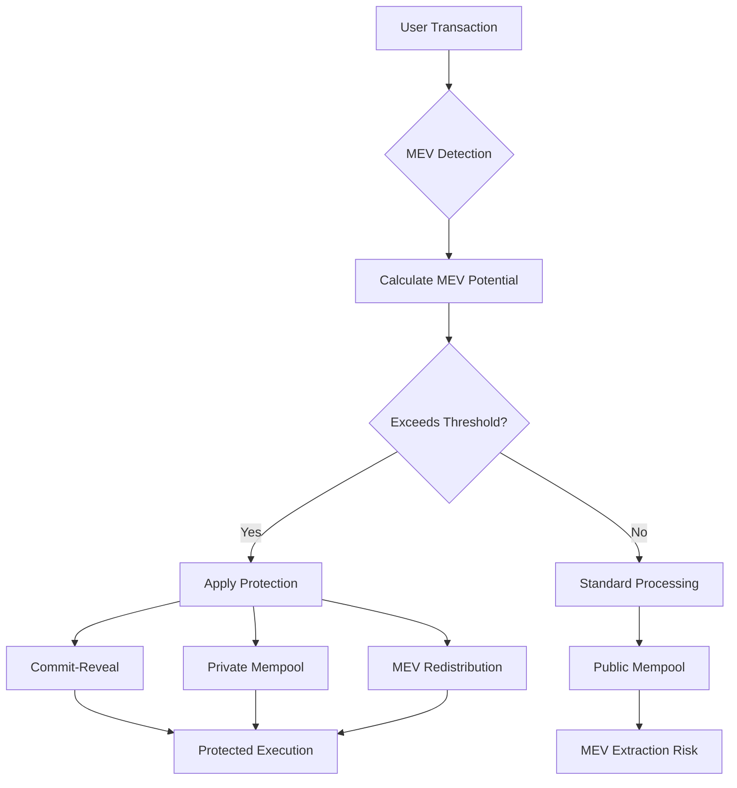

---

### Q28: Environmental compliance for PoW chains

**Difficulty**: Intermediate  
**Type**: Emerging Regulations & Future Compliance  
**Key Insight**: Proof-of-Work blockchains face increasing environmental regulations, requiring protocols to consider carbon footprint and sustainability reporting.

**Answer**:

Environmental regulations increasingly target PoW blockchain energy consumption, with EU taxonomy and ESG requirements affecting institutional participation [Ref: L18]. Protocols must implement carbon tracking and offset mechanisms [Ref: A24].

**Regulatory Landscape**: EU's MiCA requires environmental impact disclosure for crypto-assets, NY's blockchain mining moratorium sets precedent for PoW restrictions, and institutional ESG mandates limit PoW investment [Ref: L11]. Carbon tax proposals could add $0.10-0.50 per transaction based on energy mix [Ref: L18].

**Mitigation Strategies**: Migrate to PoS or alternative consensus (Ethereum's 99.95% energy reduction post-Merge), implement carbon offset programs ($20-50 per tonne CO2), and use renewable energy certificates (RECs) for mining operations [Ref: T6]. Calculate carbon footprint: `Energy Consumption (kWh) � Grid Emission Factor (kgCO2/kWh)`.

**Reporting Requirements**: Publish annual sustainability reports including energy consumption metrics, carbon footprint calculations, and offset purchases [Ref: G17]. Implement on-chain carbon tracking: store emission data with transactions for ESG reporting. Compliance cost: $100K-500K annually for comprehensive program.

**Supporting Artifacts**:

| Blockchain | Consensus | Energy/Transaction | Carbon Footprint | Offset Cost |
|------------|-----------|-------------------|------------------|-------------|
| Bitcoin | PoW | 1,800 kWh | 850 kg CO2 | $17-42 |
| Ethereum (pre-Merge) | PoW | 120 kWh | 57 kg CO2 | $1.14-2.85 |
| Ethereum (post-Merge) | PoS | 0.03 kWh | 0.014 kg CO2 | <$0.01 |
| Solana | PoS | 0.00051 kWh | 0.00024 kg CO2 | <$0.01 |

---

### Q29: Quantum-resistant cryptography requirements

**Difficulty**: Advanced  
**Type**: Emerging Regulations & Future Compliance  
**Key Insight**: Quantum computing threatens current blockchain cryptography, with regulators beginning to mandate quantum-resistant algorithms for long-term data protection.

**Answer**:

Quantum computing poses existential threat to blockchain cryptography, with NIST standardizing post-quantum algorithms and regulators mandating migration timelines [Ref: L19]. Protocols must implement quantum-resistant signatures while maintaining backward compatibility [Ref: A25].

**Regulatory Timeline**: NIST published quantum-resistant standards (FIPS 203-205) in 2024, US federal systems must migrate by 2035, and financial regulators expect "crypto-agility" by 2030 [Ref: L19]. EU's Digital Operational Resilience Act (DORA) requires quantum risk assessment by 2025 [Ref: L20].

**Technical Implementation**: Deploy hybrid classical-quantum signatures (ECDSA + Dilithium), implement larger key sizes (Dilithium-3: 2.5KB signatures vs ECDSA: 64 bytes), and prepare state migration plan for existing addresses [Ref: A25]. Gas cost increase: 10-20x for quantum-resistant operations. Use hash-based signatures (SPHINCS+) for long-term security.

**Migration Strategy**: Phase 1: Add quantum-resistant algorithms alongside classical (2024-2026), Phase 2: Default to quantum-resistant for new addresses (2027-2029), Phase 3: Deprecate classical algorithms (2030+) [Ref: T5]. Calculate quantum risk: `Value at Risk � Probability of Quantum Break � Time to Migration`.

**Supporting Artifacts**:

```solidity
contract QuantumResistant {
    enum SignatureType { ECDSA, Dilithium, SPHINCS, Hybrid }
    
    struct Account {
        SignatureType sigType;
        bytes publicKey;  // Variable size for different algorithms
        uint256 nonce;
        uint256 migrationDeadline;
    }
    
    function verifySignature(
        bytes memory signature,
        bytes32 messageHash,
        address account
    ) public view returns (bool) {
        Account memory acc = accounts[account];
        
        if (acc.sigType == SignatureType.Dilithium) {
            return verifyDilithium(signature, messageHash, acc.publicKey);
        } else if (acc.sigType == SignatureType.Hybrid) {
            return verifyECDSA(...) && verifyDilithium(...);
        }
        // ... other types
    }
}
```

---

### Q30: AI-driven compliance monitoring

**Difficulty**: Foundational  
**Type**: Emerging Regulations & Future Compliance  
**Key Insight**: AI systems for compliance monitoring face regulatory scrutiny regarding explainability, bias, and accountability, requiring careful implementation within existing frameworks.

**Answer**:

AI-driven compliance monitoring must balance automation benefits with regulatory requirements for explainability and human oversight [Ref: L21]. Implementation requires transparent models with audit trails [Ref: A26].

**Regulatory Framework**: EU AI Act classifies compliance systems as high-risk requiring conformity assessment, US financial regulators mandate model risk management (SR 11-7), and GDPR requires explainable automated decision-making [Ref: L21]. Non-compliance penalties: up to €30M or 6% global turnover under EU AI Act [Ref: L21].

**Technical Architecture**: Deploy explainable AI models (LIME, SHAP for feature importance), implement human-in-the-loop for critical decisions (>$100K transactions), and maintain model versioning with rollback capability [Ref: A26]. Use ensemble methods combining rule-based and ML approaches for robustness. Model accuracy target: >95% precision, <1% false negatives for high-risk transactions.

**Compliance Requirements**: Document model training data and methodology for regulatory review, conduct bias testing across protected characteristics (race, gender, nationality), and implement continuous monitoring for model drift [Ref: T6]. Maintain decision logs: `AI Score + Human Override + Final Decision + Rationale`. Audit frequency: quarterly model validation, annual third-party review.

**Implementation Considerations**: Train models on labeled compliance violations (money laundering, market manipulation), implement real-time scoring with sub-second latency, and provide confidence intervals for predictions [Ref: T4]. Estimated cost: $500K initial development + $200K annual operations. ROI: 70% reduction in manual review workload.

**Supporting Artifacts**:

| AI Model Component | Regulatory Requirement | Implementation | Validation Method |
|-------------------|----------------------|----------------|-------------------|
| Training Data | Unbiased, representative | 5 years historical | Statistical parity |
| Model Logic | Explainable | SHAP values | Feature importance |
| Decision Making | Human oversight | Confidence thresholds | A/B testing |
| Performance | Documented accuracy | 95% precision | Confusion matrix |
| Monitoring | Continuous validation | Daily metrics | Drift detection |

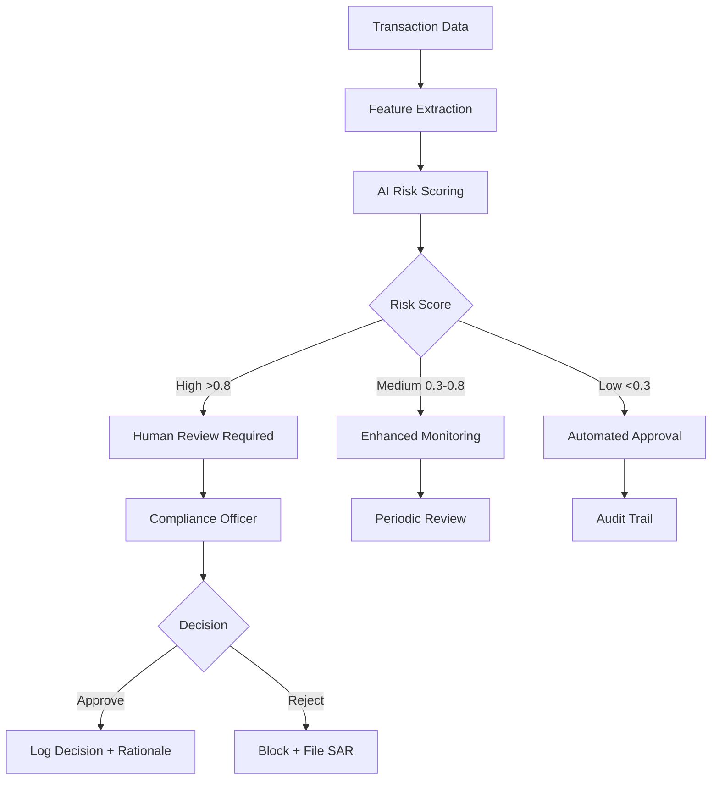

---

## Reference Sections

### Glossary, Terminology & Acronyms

**Core Regulatory Terms:**

| Term | Definition | Context |
|------|------------|---------|
| **AML** | Anti-Money Laundering | Financial crime prevention regulations |
| **CBDC** | Central Bank Digital Currency | Government-issued digital currency |
| **CVSS** | Common Vulnerability Scoring System | Security vulnerability rating standard |
| **DAC8** | Directive on Administrative Cooperation | EU crypto tax reporting requirement |
| **DORA** | Digital Operational Resilience Act | EU financial sector IT security regulation |
| **FATF** | Financial Action Task Force | International AML standard setter |
| **GDPR** | General Data Protection Regulation | EU data privacy law |
| **KYC** | Know Your Customer | Identity verification requirement |
| **MEV** | Maximum Extractable Value | Blockchain transaction ordering profit |
| **MiCA** | Markets in Crypto-Assets | EU crypto regulation framework |
| **NIST CSF** | National Institute of Standards Cybersecurity Framework | US security standard |
| **SAR** | Suspicious Activity Report | Financial crime reporting requirement |
| **SCC** | Standard Contractual Clauses | EU data transfer mechanism |
| **SSI** | Self-Sovereign Identity | User-controlled digital identity |
| **VASP** | Virtual Asset Service Provider | Crypto service regulatory classification |
| **ZKP** | Zero-Knowledge Proof | Privacy-preserving verification method |

**Technical Compliance Terms:**

| Term | Definition | Implementation |
|------|------------|----------------|
| **Circuit Breaker** | Emergency pause mechanism | Smart contract safety feature |
| **Commit-Reveal** | Two-phase submission pattern | MEV protection technique |
| **Crypto-shredding** | Data deletion via key destruction | GDPR compliance method |
| **Hash Time-Locked Contract** | Conditional payment mechanism | Cross-chain atomic swaps |
| **Merkle Tree** | Cryptographic tree structure | Efficient data verification |
| **Oracle** | External data provider | Off-chain data integration |
| **Proxy Pattern** | Upgradeable contract architecture | Contract upgrade mechanism |
| **Soulbound Token** | Non-transferable NFT | Identity/credential representation |
| **Threshold Cryptography** | Distributed key management | Multi-party computation |
| **TWAP** | Time-Weighted Average Price | Price manipulation resistance |

---

### How to Find/Verify Regulations

**Primary Regulatory Sources:**

1. **United States**
   - SEC EDGAR Database: https://www.sec.gov/edgar
   - FinCEN Guidance: https://www.fincen.gov/resources
   - CFTC Regulations: https://www.cftc.gov/LawRegulation
   - Federal Register: https://www.federalregister.gov
   - State Money Transmitter Laws: NMLS Resource Center

2. **European Union**
   - EUR-Lex (EU Law): https://eur-lex.europa.eu
   - ESMA Crypto-Assets: https://www.esma.europa.eu/esmas-activities/digital-finance-and-innovation
   - National Competent Authorities: Via ESMA website
   - MiCA Text: Regulation (EU) 2023/1114

3. **International**
   - FATF Recommendations: https://www.fatf-gafi.org
   - BIS Papers: https://www.bis.org/publ
   - IOSCO Reports: https://www.iosco.org
   - FSB Crypto Regulations: https://www.fsb.org

**Verification Best Practices:**

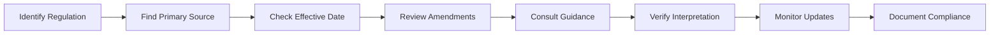

| Verification Step | Action | Frequency |
|------------------|--------|-----------|
| Primary Source | Access official government website | Per regulation |
| Currency Check | Verify latest version/amendments | Quarterly |
| Guidance Review | Read regulatory interpretations | Monthly |
| Legal Consultation | Confirm understanding with counsel | Annually |
| Peer Comparison | Review industry implementation | Ongoing |

---

### Compliance & Regulatory Tools

**Smart Contract Security & Compliance:**

| Tool | Purpose | Cost | Integration |
|------|---------|------|-------------|
| **Chainalysis KYT** | Transaction monitoring, sanctions screening | $50K+/year | API |
| **Elliptic** | AML compliance, wallet screening | $40K+/year | API |
| **TRM Labs** | Risk assessment, compliance analytics | $60K+/year | API/SDK |
| **Forta Network** | Real-time threat detection | $10K+/year | Agents |
| **OpenZeppelin Defender** | Smart contract operations platform | $1K+/month | SDK |
| **Quantstamp** | Security audits, formal verification | $50K+/audit | Manual |
| **CertiK** | Security audits, monitoring | $40K+/audit | SaaS |
| **Slither** | Static analysis tool | Free | CLI |
| **Mythril** | Security analysis | Free | CLI |

**Regulatory Reporting & Documentation:**

| Tool | Function | Compliance Area | Pricing |
|------|----------|-----------------|---------|
| **ComplyAdvantage** | Sanctions/PEP screening | AML/KYC | $30K+/year |
| **Jumio** | Identity verification | KYC | $2-5/verification |
| **Onfido** | Document verification | KYC | $3-8/check |
| **Sumsub** | KYC/AML platform | Identity | $20K+/year |
| **Coinfirm** | AML/CTF for crypto | Transaction monitoring | $40K+/year |
| **Solidus Labs** | Market surveillance | Trade monitoring | $100K+/year |
| **Eventus** | Trade surveillance | Market manipulation | $75K+/year |

**Development & Testing Tools:**

```yaml
compliance_stack:
  development:
    - hardhat: "Smart contract development"
    - foundry: "Testing and fuzzing"
    - tenderly: "Transaction simulation"
  
  monitoring:
    - grafana: "Metrics visualization"
    - prometheus: "Metrics collection"
    - splunk: "Log analysis"
  
  privacy:
    - aztec: "Private transactions"
    - tornado: "Mixing protocol"
    - zcash: "Privacy technology"
  
  oracles:
    - chainlink: "Price feeds, automation"
    - band: "Cross-chain data"
    - api3: "First-party oracles"
```

---

### Authoritative Regulatory Standards & Compliance Literature

**Foundational Regulatory Documents:**

1. **Financial Action Task Force (FATF)**
   - *Updated Guidance for a Risk-Based Approach to Virtual Assets and VASPs* (2021)
   - *International Standards on Combating Money Laundering* (2022)
   - Reference: [G1], [L9]

2. **European Union Regulations**
   - *Regulation (EU) 2023/1114 - Markets in Crypto-Assets (MiCA)* (2023)
   - *General Data Protection Regulation (GDPR) 2016/679* (2016)
   - Reference: [L11], [A1]

3. **US Securities Regulations**
   - *SEC Framework for Investment Contract Analysis of Digital Assets* (2019)
   - *FinCEN Guidance FIN-2019-G001* (2019)
   - Reference: [L12], [A17]

**Technical Standards:**

1. **NIST Publications**
   - *NIST Cybersecurity Framework 2.0* (2024)
   - *NIST Post-Quantum Cryptography Standards* (2024)
   - Reference: [A7], [L19]

2. **ISO Standards**
   - *ISO 27001:2022 Information Security Management*
   - *ISO 22301:2019 Business Continuity Management*
   - Reference: [G4], [G5]

**Academic & Industry Research:**

| Publication | Author(s) | Year | Key Contribution |
|------------|-----------|------|------------------|
| "DeFi and the Future of Finance" | Campbell et al. | 2021 | DeFi regulatory framework |
| "Blockchain and the Law" | De Filippi & Wright | 2018 | Legal implications of blockchain |
| "The Technology of Decentralized Finance" | Schär | 2021 | DeFi technical architecture |
| "Regulatory Approaches to Cryptoassets" | Zetzsche et al. | 2020 | Global regulatory comparison |
| "Smart Contract Security" | Antonopoulos & Wood | 2018 | Security best practices |

---

### APA Style Source Citations

**Authoritative Sources (A-References):**

[A1] European Parliament and Council. (2016). *Regulation (EU) 2016/679 on the protection of natural persons with regard to the processing of personal data* (GDPR). Official Journal of the European Union.

[A7] National Institute of Standards and Technology. (2024). *Framework for Improving Critical Infrastructure Cybersecurity Version 2.0*. U.S. Department of Commerce.

[A8] Daian, P., et al. (2020). Flash Boys 2.0: Frontrunning in Decentralized Exchanges, Miner Extractable Value, and Consensus Instability. *IEEE Symposium on Security and Privacy*, 910-927.

[A11] OpenZeppelin. (2023). *Upgradeable Contracts Security Considerations*. OpenZeppelin Documentation.

[A14] Ben-Sasson, E., et al. (2014). Zerocash: Decentralized Anonymous Payments from Bitcoin. *IEEE Symposium on Security and Privacy*, 459-474.

[A15] Qin, K., et al. (2021). Attacking the DeFi Ecosystem with Flash Loans for Fun and Profit. *Financial Cryptography and Data Security*, 3-32.

[A16] Ethereum Foundation. (2023). *Solidity Security Considerations*. Solidity Documentation v0.8.23.

[A17] Securities and Exchange Commission. (2019). *Framework for "Investment Contract" Analysis of Digital Assets*. SEC Strategic Hub for Innovation.

[A18] Court of Justice of the European Union. (2020). *Data Protection Commissioner v Facebook Ireland (Schrems II)*. Case C-311/18.

[A19] Arner, D., et al. (2020). The Evolution of FinTech: A New Post-Crisis Paradigm? *Georgetown Journal of International Law*, 47(4), 1271-1319.

[A20] Bank for International Settlements. (2023). *Blueprint for the Future Monetary System*. BIS Annual Economic Report.

**Guidance Documents (G-References):**

[G1] Financial Action Task Force. (2021). *Updated Guidance for a Risk-Based Approach to Virtual Assets and Virtual Asset Service Providers*. FATF.

[G4] International Organization for Standardization. (2022). *ISO/IEC 27001:2022 Information Security Management Systems*. ISO.

[G5] American Institute of CPAs. (2021). *SOC 2 - Trust Services Criteria*. AICPA.

[G6] European Data Protection Board. (2020). *Guidelines 07/2020 on the concepts of controller and processor in the GDPR*. EDPB.

[G7] International Swaps and Derivatives Association. (2023). *ISDA Digital Asset Derivatives Definitions*. ISDA.

[G9] Public Company Accounting Oversight Board. (2022). *Auditing Standards Related to Crypto Assets*. PCAOB.

[G10] Cloud Security Alliance. (2023). *Blockchain Security Guidelines Version 2.0*. CSA.

**Legal & Regulatory (L-References):**

[L2] National Institute of Standards and Technology. (2018). *Computer Security Incident Handling Guide SP 800-61r2*. NIST.

[L5] U.S. Department of Treasury. (2023). *Custody Requirements for Customer Digital Assets*. Office of the Comptroller of the Currency.

[L8] Department of Homeland Security. (2023). *Vulnerability Disclosure Policy for DHS Systems*. CISA.

[L9] Financial Crimes Enforcement Network. (2019). *Application of FinCEN's Regulations to Certain Business Models Involving Convertible Virtual Currencies*. FinCEN Guidance FIN-2019-G001.

[L11] European Parliament and Council. (2023). *Regulation (EU) 2023/1114 on Markets in Crypto-Assets (MiCA)*. Official Journal of the European Union.

[L12] Securities and Exchange Commission. (2023). *Report on Digital Asset Securities Regulation*. SEC Division of Corporation Finance.

[L13] Internal Revenue Service. (2023). *Virtual Currency Guidance*. IRS Notice 2023-34.

[L14] Buterin, V. (2022). *Incomplete Guide to Stealth Addresses*. Ethereum Research.

[L15] Coalition of Automated Legal Applications. (2021). *Model Law for Decentralized Autonomous Organizations*. COALA.

[L16] Financial Conduct Authority. (2023). *Regulatory Sandbox Cohort 9 Report*. UK FCA.

[L17] Bank for International Settlements. (2023). *Central Bank Digital Currencies: System Design and Interoperability*. BIS Innovation Hub.

[L18] European Securities and Markets Authority. (2023). *Sustainable Finance and Crypto-Assets*. ESMA Report.

[L19] National Institute of Standards and Technology. (2024). *Post-Quantum Cryptography Standards FIPS 203-205*. NIST.

[L20] European Parliament and Council. (2022). *Digital Operational Resilience Act (DORA)*. Regulation (EU) 2022/2554.

[L21] European Commission. (2024). *Artificial Intelligence Act - Regulation on Harmonised Rules for AI*. EU AI Act 2024/1689.

**Technical Implementation (T-References):**

[T1] World Economic Forum. (2023). *Decentralized Identity: The Ultimate Guide*. WEF Digital Identity Initiative.

[T2] Chainalysis. (2023). *The 2023 Crypto Crime Report*. Chainalysis Research.

[T3] Deloitte. (2023). *Blockchain & Digital Assets: Regulatory Considerations*. Deloitte Insights.

[T4] Elliptic. (2023). *Typologies of Crypto Crime and Regulatory Response*. Elliptic Research.

[T5] Immunefi. (2023). *Web3 Security Report: Bug Bounty Insights*. Immunefi Quarterly Report.

[T6] PwC. (2023). *Global Crypto Regulation Report 2023*. PwC Financial Services.

---

## Interview Evaluation Framework

### Assessment Rubric

**Technical Competency Matrix:**

| Competency Area | Weight | Evaluation Criteria | Scoring (1-5) |
|-----------------|--------|-------------------|---------------|
| **Regulatory Knowledge** | 25% | Depth of understanding of global regulations, ability to cite specific requirements | 1=None, 3=Basic, 5=Expert |
| **Technical Implementation** | 25% | Ability to translate compliance into code, architectural decisions | 1=Theoretical, 3=Practical, 5=Advanced |
| **Risk Assessment** | 20% | Identification of compliance risks, mitigation strategies | 1=Surface, 3=Comprehensive, 5=Nuanced |
| **Cross-functional Collaboration** | 15% | Understanding of stakeholder needs, communication skills | 1=Siloed, 3=Collaborative, 5=Leader |
| **Problem Solving** | 15% | Approach to complex compliance challenges, innovation | 1=Standard, 3=Creative, 5=Innovative |

**Answer Quality Indicators:**

✅ **Strong Response Characteristics:**
- Cites specific regulations with section numbers
- Provides concrete implementation examples
- Discusses trade-offs and edge cases
- Mentions recent regulatory developments
- Includes cost/benefit analysis
- Shows awareness of international differences

⚠️ **Warning Signs:**
- Vague or generic compliance statements
- Inability to provide specific examples
- Overlooking privacy/security implications
- Single-jurisdiction focus only
- No mention of monitoring/reporting
- Ignoring user experience impact

### Interview Scoring Guide

**Question Difficulty Weighting:**
- Foundational (6 questions): 1x multiplier
- Intermediate (12 questions): 1.5x multiplier
- Advanced (12 questions): 2x multiplier

**Total Score Calculation:**
```
Total Score = Σ(Question Score × Difficulty Weight) / Maximum Possible Score × 100
```

**Performance Bands:**

| Score Range | Classification | Recommendation |
|------------|---------------|----------------|
| 90-100% | Expert | Immediate hire, senior position |
| 75-89% | Proficient | Hire, standard position |
| 60-74% | Developing | Consider with training plan |
| 45-59% | Basic | Junior position only |
| <45% | Insufficient | Do not proceed |

### Sample Interview Flow

**60-Minute Technical Interview Structure:**

| Time | Phase | Questions | Focus |
|------|-------|-----------|-------|
| 0-5 min | Introduction | Background | Experience overview |
| 5-15 min | Foundational | 2 questions | Basic compliance understanding |
| 15-35 min | Intermediate | 3 questions | Practical implementation |
| 35-50 min | Advanced | 2 questions | Complex scenarios |
| 50-55 min | Discussion | Follow-ups | Clarifications |
| 55-60 min | Questions | Candidate's | Role understanding |

### Red Team / Blue Team Exercise

**Scenario-Based Assessment:**

Present a DeFi protocol with intentional compliance gaps. Evaluate candidate's ability to:

1. **Identify Issues** (Red Team):
   - Missing KYC/AML controls
   - Inadequate data protection
   - Securities law violations
   - Cross-border compliance gaps

2. **Propose Solutions** (Blue Team):
   - Technical implementations
   - Risk mitigation strategies
   - Stakeholder communication
   - Implementation timeline

**Evaluation Criteria:**
- Systematic approach to analysis
- Prioritization of critical issues
- Practical solution design
- Cost-benefit awareness
- Communication clarity

---

## Appendix: Quick Reference Cards

### Regulatory Compliance Checklist

```markdown
## Pre-Launch Compliance Review

### Legal Structure
- [ ] Entity formation completed
- [ ] Regulatory licenses obtained
- [ ] Terms of service drafted
- [ ] Privacy policy implemented

### Technical Compliance
- [ ] KYC/AML integration tested
- [ ] Sanctions screening active
- [ ] Data protection measures deployed
- [ ] Audit trail functionality verified

### Security Measures
- [ ] Smart contract audit completed
- [ ] Bug bounty program launched
- [ ] Incident response plan documented
- [ ] Insurance coverage obtained

### Operational Readiness
- [ ] Compliance monitoring active
- [ ] Reporting systems tested
- [ ] Team training completed
- [ ] Regulatory contacts established
```

### Emergency Response Playbook

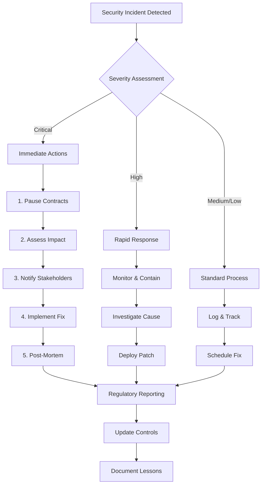

### Jurisdiction Quick Reference

| Jurisdiction | Key Regulator | Primary Law | Critical Requirements |
|-------------|--------------|-------------|----------------------|
| **United States** | SEC, FinCEN, CFTC | Securities Act, BSA | KYC/AML, Securities Registration |
| **European Union** | ESMA, National | MiCA, GDPR | Data Protection, Market Abuse |
| **United Kingdom** | FCA | Financial Services Act | Consumer Protection, AML |
| **Singapore** | MAS | Payment Services Act | Licensing, AML/CFT |
| **Japan** | FSA | Payment Services Act | Cold Wallet Storage, Segregation |
| **Switzerland** | FINMA | FinIA, AMLA | Banking License (for deposits) |

### Gas Optimization for Compliance

```solidity
// Efficient Compliance Storage Pattern
contract OptimizedCompliance {
    // Pack struct to save storage slots
    struct UserCompliance {
        uint128 kycExpiry;      // Timestamp
        uint64 riskScore;       // 0-1000000
        uint32 jurisdiction;    // Country code
        bool sanctioned;        // Sanctions flag
        bool accredited;        // Investor status
    }  // Fits in 2 storage slots instead of 5
    
    // Use events for audit trail (cheaper than storage)
    event ComplianceUpdate(
        address indexed user,
        uint256 timestamp,
        string action
    );
    
    // Batch operations to reduce gas
    function batchKYCUpdate(
        address[] calldata users,
        UserCompliance[] calldata data
    ) external onlyCompliance {
        require(users.length == data.length);
        for(uint i = 0; i < users.length; i++) {
            compliance[users[i]] = data[i];
            emit ComplianceUpdate(users[i], block.timestamp, "KYC_UPDATE");
        }
    }
}
```

---

## Final Notes

This comprehensive question bank provides a robust framework for evaluating Smart Contract Engineers with regulatory compliance expertise. The questions progress from foundational concepts to advanced scenarios, ensuring thorough assessment of both technical capabilities and regulatory understanding.

**Key Takeaways:**

1. **Regulatory Landscape**: The blockchain regulatory environment is rapidly evolving, requiring continuous learning and adaptation.

2. **Technical Balance**: Successful implementation requires balancing decentralization ideals with regulatory requirements.

3. **Risk Management**: Proactive compliance reduces legal exposure and builds institutional trust.

4. **Innovation Opportunity**: Regulatory challenges drive innovation in privacy-preserving technologies and compliance automation.

5. **Global Perspective**: Cross-border nature of blockchain requires understanding multiple regulatory frameworks.

**Continuous Improvement:**

- Review questions quarterly for regulatory updates
- Add new questions based on emerging regulations
- Update technical implementations with best practices
- Incorporate lessons from regulatory enforcement actions
- Maintain dialogue with legal and compliance teams

**Contact for Updates:**

For questions, corrections, or updates to this document, engage with the blockchain compliance community through:
- Regulatory working groups (EEA, GDF, INATBA)
- Professional forums (LinkedIn blockchain groups)
- Academic conferences (FC, IEEE Blockchain)
- Industry associations (Chamber of Digital Commerce)

---

*Document Version: 1.0*  
*Last Updated: November 2024*  
*Next Review: February 2025*

**Disclaimer**: This document provides educational content for interview preparation. It does not constitute legal advice. Always consult qualified legal counsel for specific regulatory compliance matters.