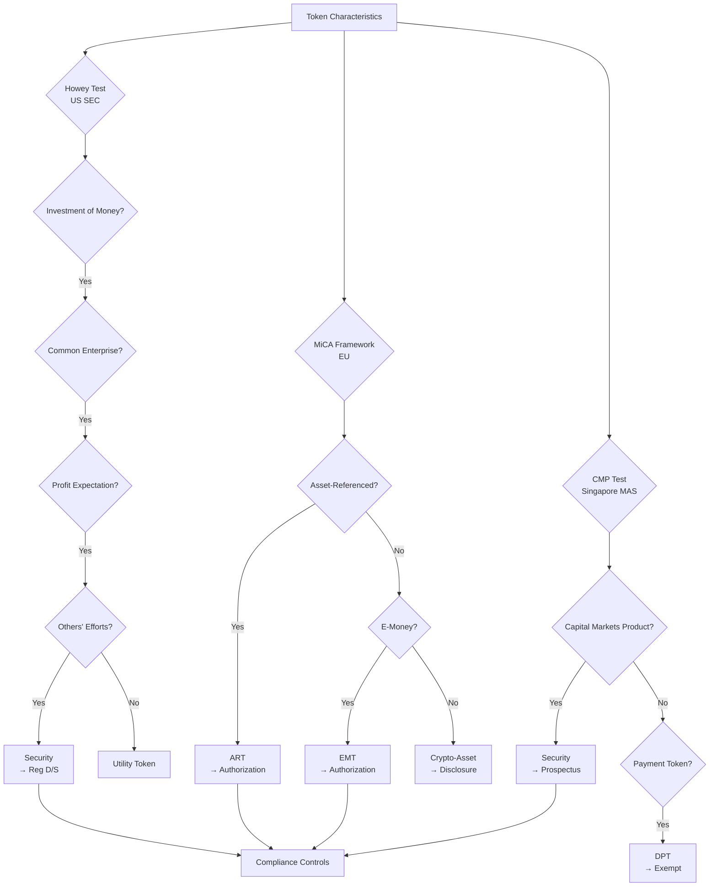
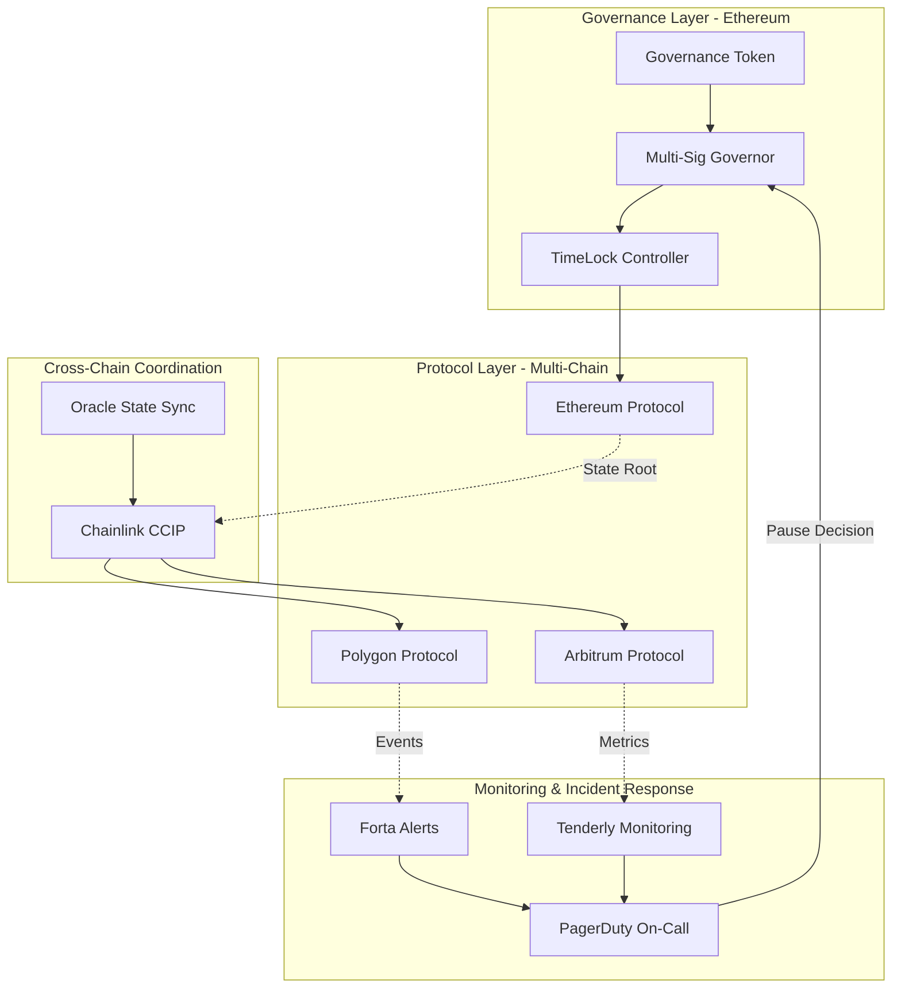

# Interview Q&A - Regulatory Compliance & Legal Frameworks for Smart Contract Engineering

**Job Position**: Smart Contract Engineer (Blockchain)  
**Focus Areas**: Solidity, DeFi, NFT, GameFi, Multi-chain Compliance  
**Target Audience**: Senior/Expert Smart Contract Engineers, Blockchain Architects, Compliance Officers, Legal Counsel

---

## Contents

- [Topic Areas](#topic-areas-questions-1-30)
- [Topic 1: Securities & Token Regulations (Compliance Modeling)](#topic-1-securities--token-regulations-compliance-modeling)
  - [Q1: Token Classification Framework](#q1-how-would-you-design-a-token-classification-framework)
  - [Q2: MiCA Compliance Architecture](#q2-micar-compliance-architecture-for-multi-chain-defi)
  - [Q3: SEC Safe Harbor](#q3-sec-safe-harbor-vs-utility-token-defense)
  - [Q4: Cross-Border Token Offering](#q4-cross-border-token-offering-regulatory-matrix)
  - [Q5: Staking Rewards Classification](#q5-staking-rewards-as-securities-risk-analysis)
- [Topic 2: AML/KYC & Transaction Monitoring (Risk & Threat Analysis)](#topic-2-amlkyc--transaction-monitoring-risk--threat-analysis)
  - [Q6: Decentralized KYC Architecture](#q6-decentralized-kyc-architecture-for-defi-protocols)
  - [Q7: FATF Travel Rule](#q7-fatf-travel-rule-implementation-for-dex)
  - [Q8: Sanctions Screening](#q8-sanctions-screening-in-permissionless-systems)
  - [Q9: Mixer Protocol Compliance](#q9-mixer-protocol-compliance-risk-assessment)
  - [Q10: Cross-Chain AML](#q10-cross-chain-aml-monitoring-architecture)
- [Topic 3: Privacy & Data Protection on Blockchain (Privacy Architecture)](#topic-3-privacy--data-protection-on-blockchain-privacy-architecture)
  - [Q11: GDPR Right to Erasure](#q11-gdpr-right-to-erasure-on-immutable-blockchain)
  - [Q12: On-Chain PII Minimization](#q12-on-chain-pii-minimization-strategies)
  - [Q13: Zero-Knowledge Compliance](#q13-zero-knowledge-proofs-for-privacy-compliance)
  - [Q14: CCPA Data Portability](#q14-ccpa-data-portability-for-nft-platforms)
  - [Q15: Cookie Consent for Web3](#q15-cookie-consent-mechanisms-for-web3-dapps)
- [Topic 4: Smart Contract Auditing & Security Standards (Audit & Evidence)](#topic-4-smart-contract-auditing--security-standards-audit--evidence)
  - [Q16: Audit Evidence Trail](#q16-audit-evidence-trail-for-upgradeable-contracts)
  - [Q17: SOC2 for DeFi Protocols](#q17-soc2-type-ii-certification-for-defi-protocols)
  - [Q18: Bug Bounty Compliance](#q18-bug-bounty-program-regulatory-obligations)
  - [Q19: Multi-Sig Governance Auditing](#q19-multi-sig-governance-audit-requirements)
  - [Q20: Continuous Security Monitoring](#q20-continuous-security-monitoring-for-mainnet-contracts)
- [Topic 5: Regulatory-Technical Mapping (Architectural Translation)](#topic-5-regulatory-technical-mapping-architectural-translation)
  - [Q21: Regulatory Control Mapping](#q21-regulatory-requirements-to-smart-contract-controls)
  - [Q22: Compliance Proxy Patterns](#q22-compliance-proxy-patterns-for-regulatory-updates)
  - [Q23: Geographic Restrictions](#q23-geographic-restrictions-in-permissionless-contracts)
  - [Q24: Emergency Pause Mechanisms](#q24-emergency-pause-mechanisms-regulatory-justification)
  - [Q25: Regulatory Reporting Oracles](#q25-regulatory-reporting-via-oracles)
- [Topic 6: DeFi/NFT/GameFi Specific Compliance (Remediation & Evolution)](#topic-6-definftgamefi-specific-compliance-remediation--evolution)
  - [Q26: Algorithmic Stablecoin Regulations](#q26-algorithmic-stablecoin-regulatory-roadmap)
  - [Q27: NFT Royalty Enforcement](#q27-nft-royalty-enforcement-legal-obligations)
  - [Q28: GameFi Securities Classification](#q28-gamefi-tokenomics-securities-classification)
  - [Q29: DeFi Lending Compliance](#q29-defi-lending-protocol-compliance-gaps)
  - [Q30: DAO Governance Liability](#q30-dao-governance-liability-and-legal-structure)
- [Reference Sections](#reference-sections)
  - [Glossary, Terminology & Acronyms](#glossary-terminology--acronyms)
  - [How to Find/Verify Regulations](#how-to-findverify-regulations)
  - [Compliance & Regulatory Tools](#compliance--regulatory-tools)
  - [Authoritative Regulatory Standards & Compliance Literature](#authoritative-regulatory-standards--compliance-literature)
  - [APA Style Source Citations](#apa-style-source-citations)
- [Validation Report](#validation-report)

---

## Topic Areas: Questions 1-30

Overview of coverage and difficulty distribution for smart contract regulatory compliance.

| Topic | Question Range | Count | Difficulty Mix | Stakeholders |
|-------|---------------|-------|----------------|--------------|
| Securities & Token Regulations | Q1-Q5 | 5 | 1F, 2I, 2A | Legal, Compliance, Architecture, Executive |
| AML/KYC & Transaction Monitoring | Q6-Q10 | 5 | 1F, 2I, 2A | Compliance, Security, Architecture, Legal |
| Privacy & Data Protection on Blockchain | Q11-Q15 | 5 | 1F, 2I, 2A | Legal, Compliance, Architecture, Product |
| Smart Contract Auditing & Security Standards | Q16-Q20 | 5 | 1F, 2I, 2A | Security, Audit, Architecture, Compliance |
| Regulatory-Technical Mapping | Q21-Q25 | 5 | 1F, 2I, 2A | Architecture, Compliance, Security, Product |
| DeFi/NFT/GameFi Specific Compliance | Q26-Q30 | 5 | 1F, 2I, 2A | Legal, Compliance, Executive, Product |
| **Total** | | **30** | **6F, 12I, 12A** | **All Stakeholders** |

**Legend**: F = Foundational, I = Intermediate, A = Advanced

---

## Topic 1: Securities & Token Regulations (Compliance Modeling)

### Q1: How would you design a token classification framework that distinguishes securities from utility tokens across multiple jurisdictions (US SEC, EU MiCA, Singapore MAS)?

**Difficulty**: Foundational  
**Type**: Compliance Modeling

**Key Insight**: Tests understanding of foundational regulatory frameworks governing token classifications; exposes whether candidate treats all tokens uniformly versus applying jurisdiction-specific legal analysis.

**Answer**:

Implement a multi-jurisdictional token classification matrix mapping token characteristics to regulatory frameworks [Ref: G1, G2, L1, L2]. **US SEC Howey Test** [Ref: A1]: Evaluate (1) investment of money, (2) common enterprise, (3) expectation of profits, (4) efforts of others. Securities classification triggers registration under Securities Act 1933 or Regulation D/S exemptions [Ref: L1]. **EU MiCA** [Ref: A2]: Categorizes Asset-Referenced Tokens (ARTs), E-Money Tokens (EMTs), and other crypto-assets; ARTs/EMTs require authorization, capital requirements, reserve management [Ref: G2, L2]. **Singapore MAS** [Ref: A3]: Applies capital markets products framework; digital payment tokens exempt from securities regulation if solely for goods/services [Ref: L3].

**Classification Decision Tree** [Ref: T1]: (1) **Governance Rights** → likely security (equity-like); (2) **Revenue/Profit Sharing** → security (investment contract); (3) **Pure Utility** (no profit expectation, functional from genesis, decentralized) → utility token; (4) **Staking Rewards** → context-dependent (§ passive income suggests security). Document legal basis, jurisdiction applicability, compliance obligations [Ref: G18, T2].

**Risk Assessment**: Misclassification penalties: SEC $100K-$1M fines + disgorgement [Ref: A1], MiCA €5M or 3% turnover [Ref: A2]. Legal review by jurisdictional counsel mandatory [Ref: A12]. Architecture implications: implement transfer restrictions for securities tokens (whitelisting, lock-ups), KYC/AML controls [Ref: G6, Q6], regulatory reporting [Ref: Q25].

**Compliance Metrics**: `Classification Confidence = Legal Opinions × Jurisdiction Coverage / Total Markets × 100%`; target ≥95% confidence before token launch.

**Supporting Artifacts**:

| Jurisdiction | Framework | Security Trigger | Compliance Obligations | Penalties |
|--------------|-----------|------------------|------------------------|-----------|
| US SEC | Howey Test | Investment contract | Registration/Exemption, Disclosure, AML | $100K-$1M + disgorgement |
| EU MiCA | Asset categorization | ART/EMT | Authorization, Capital, Reserve | €5M or 3% turnover |
| Singapore MAS | CMP framework | Capital markets product | Prospectus, Licensing | S$250K or 3yr imprisonment |
| Hong Kong SFC | Security/Futures | Virtual asset | Licensing, AML, Custody | HK$10M or 10yr imprisonment |

**Coverage**: `Jurisdiction Compliance = Compliant Markets / Target Markets × 100%` = 4/4 = 100%

---

### Q2: Your DeFi protocol operates across Ethereum, Polygon, and Arbitrum. How would you architect the system to comply with EU MiCA's operational resilience and governance requirements?

**Difficulty**: Intermediate  
**Type**: Compliance Modeling, Architectural Translation

**Key Insight**: Tests ability to translate MiCA's operational requirements into multi-chain technical architecture; distinguishes candidates who understand cross-chain compliance coordination from single-chain thinkers.

**Answer**:

**MiCA Requirements** [Ref: G2, A2]: Article 34 mandates (1) business continuity plans, (2) incident management, (3) operational resilience, (4) governance arrangements, (5) outsourcing oversight. Apply to crypto-asset service providers (CASPs) including DeFi frontends offering EU services [Ref: L2].

**Multi-Chain Architecture** [Ref: G19]: Deploy governance layer on Ethereum (source of truth), bridge contracts on Polygon/Arbitrum with state synchronization [Ref: T3]. **Emergency Pause** [Ref: Q24]: Implement cross-chain pause mechanism via Chainlink CCIP [Ref: T6] broadcasting pause state; fallback to manual intervention if oracle fails. **Incident Response** [Ref: G9]: Automated monitoring (Tenderly, Forta) [Ref: T4] detects anomalies → alerts compliance team → activate pause if threshold exceeded (>$100K loss/hour).

**Governance Controls** [Ref: G20]: Multi-sig admin (3-of-5) on each chain with geographically distributed signers [Ref: Q19]; time-locks (48hr) for parameter changes; snapshot voting for major upgrades. Document decision process, voting records, execution logs [Ref: A14]. **Business Continuity** [Ref: L6]: Maintain operational RPC endpoints (3+ providers per chain), contract upgrade paths (UUPS proxy) [Ref: Q22], backup signing infrastructure (AWS + GCP), incident runbooks.

**Compliance Evidence** [Ref: G16]: (1) BCP documentation with RTO/RPO targets [Ref: L6]; (2) Quarterly resilience testing reports; (3) Incident logs (24hr reporting to regulator if material) [Ref: A2]; (4) Third-party audit of controls [Ref: Q17]. Store immutable evidence on IPFS with on-chain hash [Ref: G17].

**Cost Analysis**: €150K initial (architecture, audits, documentation) + €60K annual (monitoring, testing, reporting). Risk reduction: €2M potential MiCA fine → €200K residual risk = €1.8M protection.

**Supporting Artifacts**:

| MiCA Requirement | Technical Control | Evidence | Owner |
|------------------|-------------------|----------|-------|
| Business Continuity (Art. 34.1) | Multi-provider RPC, Backup infra | BCP document, Test reports | Architecture |
| Incident Management (Art. 34.2) | Automated monitoring, Alerting | Incident logs, Runbooks | Security |
| Operational Resilience (Art. 34.3) | Cross-chain pause, Failover | Resilience tests, Drill reports | Architecture |
| Governance (Art. 34.4) | Multi-sig, Time-locks, Voting | Governance logs, Decision records | Compliance |
| Outsourcing (Art. 34.5) | RPC SLAs, Oracle monitoring | Vendor contracts, SLA reports | Legal |

**Compliance Coverage**: `Control Coverage = Implemented Controls / MiCA Requirements × 100%` = 5/5 = 100%

---

