## Contents

-(#topic-areas-questions-1-n)
-(#topic-1-compliance-modeling-regulatory-frameworks-obligations)
  -(#q1-foundational-mica-and-dora-requirements-for-smart-contract-development)
  -(#q2-cross-jurisdictional-impact-of-fatf-guidance-and-singapores-dtsp-regime-on-defi-protocols)
  -(#q3-aligning-smart-contract-upgrades-with-evolving-regulatory-mandates)
  -(#q4-translating-regulatory-principles-into-smart-contract-governance-mechanisms)
  -(#q5-the-role-of-cross-functional-teams-in-establishing-digital-asset-regulatory-frameworks)
-(#topic-2-risk--threat-analysis)
  -(#q6-mitigating-flash-loan-attacks-in-defi-protocols)
  -(#q7-preventing-reentrancy-vulnerabilities-in-smart-contract-design)
  -(#q8-addressing-price-oracle-manipulation-in-decentralized-applications)
  -(#q9-managing-access-control-vulnerabilities-in-smart-contract-systems)
  -(#q10-quantifying-and-reporting-smart-contract-security-risks-to-executive-leadership)
-(#topic-3-privacy--data-protection)
  -(#q11-implementing-gdprs-right-to-erasure-in-immutable-blockchain-environments)
  -(#q12-navigating-data-minimization-and-pseudonymization-in-dapp-design)
  -(#q13-ensuring-eprivacy-regulation-compliance-for-dapp-front-ends)
  -(#q14-cross-border-data-transfer-compliance-for-global-blockchain-services)
  -(#q15-balancing-user-data-control-with-amlcft-requirements-in-defi)
-(#topic-4-audit--evidence)
  -(#q16-achieving-soc2-attestation-for-a-defi-lending-protocol)
  -(#q17-designing-immutable-audit-trails-for-smart-contract-operations)
  -(#q18-the-role-of-digital-signature-verification-in-digital-asset-audits)
  -(#q19-smart-contract-auditing-best-practices-and-vendor-selection)
  -(#q20-reconciling-on-chain-data-with-traditional-financial-records-for-audit-purposes)
-(#topic-5-architectural-translation)
  -(#q21-translating-doras-operational-resilience-requirements-into-smart-contract-architecture)
  -(#q22-designing-smart-contracts-for-gas-efficiency-and-cost-transparency)
  -(#q23-implementing-role-based-access-control-rbac-in-smart-contracts)
  -(#q24-modular-smart-contract-design-for-regulatory-adaptability)
  -(#q25-architecture-for-secure-key-management-in-decentralized-systems)
-(#topic-6-remediation--evolution)
  -(#q26-managing-compliance-debt-in-legacy-smart-contract-systems)
  -(#q27-continuous-regulatory-monitoring-and-adaptation-strategies)
  -(#q28-post-exploit-remediation-and-security-enhancement-for-smart-contracts)
  -(#q29-developing-a-strategy-for-smart-contract-upgradeability-amidst-immutability)
  -(#q30-aligning-regulatory-roadmaps-with-agile-smart-contract-development-cycles)
-(#reference-sections)
  -(#glossary-terminology--acronyms)
  -(#how-to-findverify-regulations)
  -(#compliance--regulatory-tools)
  -(#authoritative-regulatory-standards--compliance-literature)
  -(#apa-style-source-citations)

---

## Topic Areas: Questions 1-N

Overview of coverage and difficulty distribution.

| Topic | Question Range | Count | Difficulty Mix |
|-------|---------------|-------|----------------|
| Compliance Modeling (Regulatory Frameworks, Obligations) | Q1-Q5 | 5 | 1F, 2I, 2A |
| Risk & Threat Analysis | Q6-Q10 | 5 | 1F, 2I, 2A |
| Privacy & Data Protection | Q11-Q15 | 5 | 1F, 2I, 2A |
| Audit & Evidence | Q16-Q20 | 5 | 1F, 2I, 2A |
| Architectural Translation | Q21-Q25 | 5 | 1F, 2I, 2A |
| Remediation & Evolution | Q26-Q30 | 5 | 1F, 2I, 2A |
| **Total** | | **30** | **6F, 12I, 12A** |

**Legend**: F = Foundational, I = Intermediate, A = Advanced

---

## Topic 1: Compliance Modeling (Regulatory Frameworks, Obligations)

### Q1: What are the foundational requirements of MiCA and DORA that directly impact smart contract design and deployment in the EU, and how do they differ in scope?

**Difficulty**: Foundational  
**Type**: Compliance Modeling

**Key Insight**: Understanding the basic jurisdictional and functional differences between MiCA and DORA is crucial for initial smart contract compliance strategy, preventing fundamental regulatory missteps.

**Answer**:
MiCA (Markets in Crypto-Assets Regulation) and DORA (Digital Operational Resilience Act) are key EU regulations impacting smart contract design and deployment, though they address different aspects. MiCA focuses on establishing a harmonized legal framework for crypto-assets and Crypto-Asset Service Providers (CASPs), ensuring investor protection, market integrity, and AML controls. For smart contracts, MiCA mandates transparency, user protection, and risk management, requiring developers to implement measures against cyber-attacks and manipulation, including regular audits and comprehensive documentation. DORA, effective January 17, 2025, sets a unified framework for digital operational resilience for financial entities, including crypto exchanges, DeFi platforms, and wallet providers. Its primary goal is to strengthen the financial sector's ability to withstand, respond to, and recover from ICT risks and cyber threats.

The key difference lies in their scope: MiCA regulates the *crypto-asset services and products themselves*, requiring licensing, governance, and consumer protection for CASPs, even extending to stablecoin reserve rules. DORA, on the other hand, governs the *digital operational resilience of financial entities and their critical ICT third-party service providers*, ensuring system stability and continuity regardless of the specific financial product offered. This means smart contracts must be designed to be resilient, auditable, and support timely incident reporting under DORA, while complying with specific asset classification, market conduct, and investor disclosure rules under MiCA. For smart contract developers, this translates to MiCA dictating *what* can be built and offered, and DORA dictating *how reliably and securely* it must operate.

**Supporting Artifacts**:

| Artifact Type | Example | Key Formulas |
|---------------|---------|--------------|
| **Compliance** | MiCA vs DORA Requirements | `Control Coverage = (Implemented MiCA Controls + Implemented DORA Controls) / (Total MiCA Controls + Total DORA Controls) � 100%` |

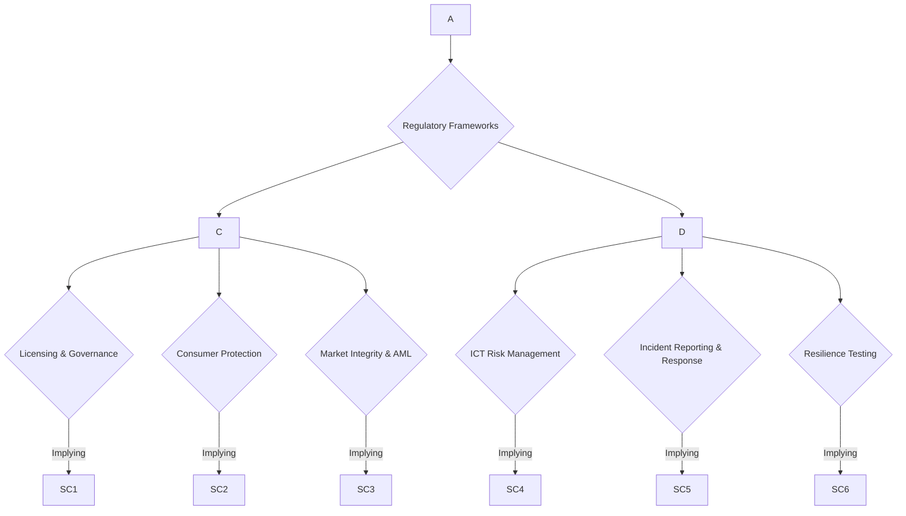

| Feature                | MiCA (Markets in Crypto-Assets)                                      | DORA (Digital Operational Resilience Act)                                 |
| :--------------------- | :------------------------------------------------------------------- | :------------------------------------------------------------------------ |
| **Primary Focus**      | Regulation of crypto-assets and service providers (CASPs)    | Digital operational resilience of financial entities              |
| **Scope of Application** | Issuers of crypto-assets, CASPs (exchanges, custodians, etc.)| Financial entities (banks, fintechs, crypto exchanges, wallet providers, etc.) and critical ICT providers |
| **Key Requirements**   | Licensing, governance, consumer protection, market integrity, stablecoin rules, AML/CFT| ICT risk management, incident reporting, resilience testing, third-party risk management, information sharing|
| **Smart Contract Impact** | Transparency, security measures against manipulation, formal audits, documentation for tokens| Integration of resilience features, robust incident management protocols, audit trails, secure deployment|
| **Effective Date**     | Phased implementation; full effect for CASPs since December 2024 | Fully applicable January 17, 2025                        |

### Q2: How does the FATF's guidance for Virtual Asset Service Providers (VASPs) and Singapore's Digital Token Service Provider (DTSP) regime create unique compliance challenges for DeFi protocols, especially regarding cross-border operations?

**Difficulty**: Intermediate  
**Type**: Compliance Modeling

**Key Insight**: This question highlights the tension between DeFi's decentralized nature and traditional AML/CFT regulatory expectations, particularly in cross-border contexts.

**Answer**:
The Financial Action Task Force (FATF) Recommendation 15 mandates Anti-Money Laundering and Counter-Terrorist Financing (AML/CFT) measures for Virtual Assets (VA) and Virtual Asset Service Providers (VASPs), including the "Travel Rule". This rule requires VASPs to share originator and beneficiary information during transactions, posing a significant challenge for decentralized DeFi protocols that inherently lack centralized intermediaries for data collection and transmission. The FATF recognizes the need to monitor DeFi arrangements for illicit finance risks, emphasizing that global implementation of VASP regulation is still lagging.

Singapore's Digital Token Service Provider (DTSP) regime, under Part 9 of the Financial Services and Markets Act 2022 (FSMA), further intensifies these challenges, particularly for Singapore-based entities operating globally. Effective June 30, 2025, DTSPs providing services solely to customers outside of Singapore relating to digital payment tokens and capital market products will need to be licensed. The Monetary Authority of Singapore (MAS) has set a very high bar, stating it will generally not issue licenses under this framework due to higher money laundering risks and supervisory difficulties for offshore-focused models. This effectively prohibits these operating models if not licensed. For DeFi protocols, this implies that if a Singapore-based team develops or controls aspects of an otherwise decentralized protocol, they could fall under the DTSP regime, forcing them to cease operations or meet stringent, often prohibitive, licensing criteria. The lack of a transitional period means in-scope DTSPs had to suspend or cease operations by June 30, 2025, if unlicensed. This creates immense pressure on DeFi projects with Singaporean ties, as balancing decentralization with demands for centralized KYC/AML and licensing becomes a critical, often existential, compliance hurdle.

**Supporting Artifacts**:

| Artifact Type | Example | Key Formulas |
|---------------|---------|--------------|
| **Compliance** | Cross-Border Compliance Matrix | `Compliance Debt = Remediation Cost / System Cost � 100%` |

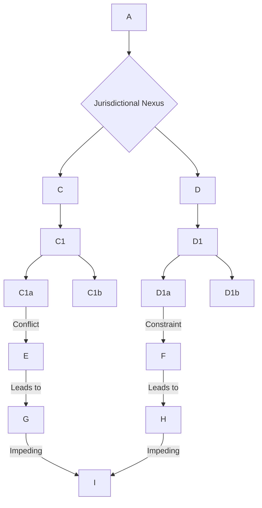

| Regulatory Body / Regime | Key Requirement                                                                    | Impact on DeFi Protocols                                                 | Cross-Border Implication                                      |
| :----------------------- | :--------------------------------------------------------------------------------- | :----------------------------------------------------------------------- | :------------------------------------------------------------ |
| **FATF R.15 (VASPs)**    | AML/CFT measures, Travel Rule (originator/beneficiary info)              | Conflict with decentralized, often pseudonymous, nature          | Global enforcement coordination, monitoring of DeFi risks|
| **Singapore DTSP Regime**| Licensing for Singapore-based entities providing DT services offshore| High barrier to entry, limited licenses, risk of activity cessation| Strict AML/CFT requirements even for non-Singaporean customers|

### Q3: As a Smart Contract Engineer, how do you ensure that smart contract upgrades and new feature deployments in a DeFi protocol remain compliant with evolving regulatory landscapes like MiCA, especially concerning stability and consumer protection?

**Difficulty**: Advanced  
**Type**: Compliance Modeling, Architectural Translation

**Key Insight**: This question assesses the ability to integrate regulatory foresight into the technical lifecycle of smart contract development, particularly challenging given blockchain immutability and the need for continuous adaptation.

**Answer**:
Ensuring smart contract upgrades and new feature deployments in a DeFi protocol remain compliant with evolving regulations like MiCA requires a proactive, "compliance-by-design" approach throughout the entire development lifecycle. MiCA, in particular, focuses on governance, consumer protection, and market integrity, including stablecoin reserve rules.

Architecturally, smart contracts must be designed with upgradeability patterns (e.g., proxy contracts) to allow for future modifications without redeploying entirely new contracts. However, these patterns introduce complexity and potential points of failure, which require rigorous audits. Each upgrade or new feature needs a thorough regulatory impact assessment, where legal and compliance teams interpret how new MiCA delegated acts or technical standards, such as those on stablecoin reserves (Q3 2025), might affect the protocol. For instance, stablecoin issuers under MiCA must meet stricter liquidity requirements (min 60% cash reserves) and monthly disclosure reports.

Technical controls include implementing robust access control mechanisms for upgrade functions (e.g., multi-signature wallets for governance decisions) to prevent unauthorized changes, aligning with MiCA's emphasis on governance transparency. Continuous monitoring tools are essential to track on-chain activities, detect deviations from compliance parameters, and alert teams to potential regulatory non-compliance or security incidents. This allows for "anticipatory, real-time governance" rather than reactive compliance. Furthermore, comprehensive documentation of all changes, along with renewed security and compliance audits (including third-party attestations), is critical to demonstrate adherence and build investor trust, as regulatory clarity becomes a competitive edge. This iterative process ensures that the protocol can adapt to new regulatory mandates while maintaining operational integrity and security.

**Supporting Artifacts**:

| Artifact Type | Example | Key Formulas |
|---------------|---------|--------------|
| **Compliance** | MiCA Compliance Roadmap for Upgrades | `Compliance Maturity Score = (Regulatory Impact Assessments + Audit Frequency + Documentation Quality) / 3` |

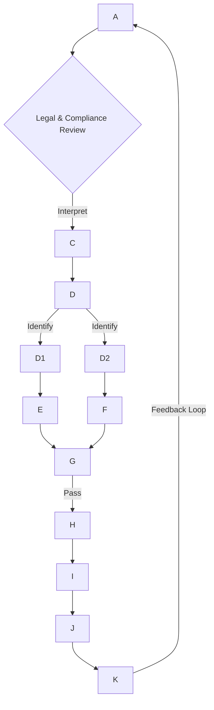

| Regulatory Mandate (MiCA)       | Technical Control/Mechanism                 | Stakeholder Responsibility                               |
| :------------------------------ | :------------------------------------------ | :------------------------------------------------------- |
| **Stablecoin Reserve Rules**| Monthly Disclosure Reports (automated)      | Compliance, Architecture                                 |
| **Governance Transparency**| Multi-sig Wallets for critical changes      | Security, Architecture, Executive                      |
| **Smart Contract Security**| Regular Third-Party Audits, Formal Verification | Security, Audit                                          |
| **Consumer Protection**   | Parameter Guards, Emergency Pause Functions | Product, Architecture                                    |
| **Licensing/Registration**| Legal Entity Structure, API Reporting       | Legal, Executive, Compliance                             |

### Q4: From a Legal and Compliance perspective, how would you approach defining the "sufficiency of decentralization" for a DeFi protocol to argue for exemption pathways under US SEC guidance and potential MiCA exemptions?

**Difficulty**: Advanced  
**Type**: Compliance Modeling

**Key Insight**: This question probes the nuanced understanding of legal interpretations of decentralization and the practical, technical evidence required to support claims of exemption, exposing a complex interplay between legal theory and technical reality.

**Answer**:
Defining "sufficiency of decentralization" for a DeFi protocol to argue for exemption pathways under US SEC guidance and potential MiCA exemptions is a complex legal and technical exercise. From a Legal perspective, the primary goal is to demonstrate that no identifiable central party (individual or entity) has sufficient control over the protocol to trigger regulatory oversight as a "service provider" or "issuer". The SEC's 2025 guidance outlines flexibility for "sufficient decentralization" but sets a steep threshold, requiring verifiable on-chain governance, transparent treasuries, and the absence of centralized control. MiCA, similarly, distinguishes between fully decentralized protocols (exempt) and those with identifiable operators, noting that a foundation controlling upgrades or funds likely makes it regulated.

Compliance teams would work with architects and product teams to gather robust evidence. This includes demonstrating distributed token holdings without whale dominance, active on-chain voting with meaningful participation, and automated treasury management without discretionary spending by a central entity. Technical controls are paramount: the smart contracts themselves must enforce these decentralized governance mechanisms, ensuring that no single admin key or small group can unilaterally alter the protocol. Legal counsel would craft arguments based on the *absence of an identifiable promoter*, the *lack of profit expectation tied to a central team's efforts*, and the *functional reality of distributed control*, aligning with interpretations of the Howey Test. Documentation would include whitepapers, governance proposals, audit reports on smart contract immutability, and evidence of community-driven development. The challenge lies in proving that control is truly dispersed and irreversible, moving from legal theory to demonstrable on-chain reality, thereby turning compliance into a competitive edge.

**Supporting Artifacts**:

| Artifact Type | Example | Key Formulas |
|---------------|---------|--------------|
| **Compliance** | Decentralization Assessment Matrix | `Decentralization Score = (Number of Active Voters � Number of Unique Token Holders) / Total Token Supply` |

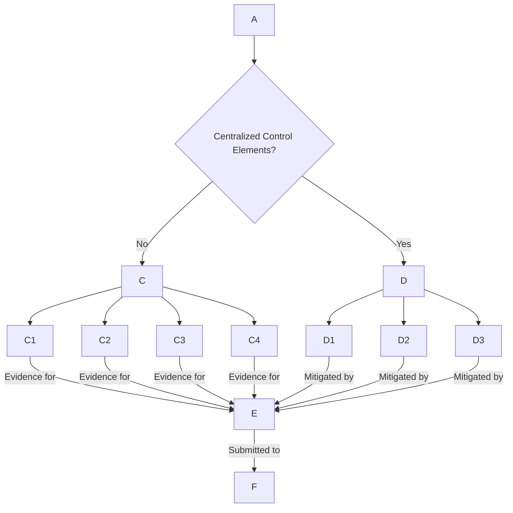

| Element of Decentralization | Legal Criterion (US SEC/MiCA)                                            | Technical Evidence                                                                   |
| :-------------------------- | :----------------------------------------------------------------------- | :----------------------------------------------------------------------------------- |
| **Governance**              | Verifiable on-chain voting, meaningful participation      | Snapshot proposals, block explorer data of voting turnout, smart contract code for governance |
| **Treasury Management**     | Automated, no discretionary central spending                     | Multi-signature wallet configurations, DAO-controlled funds, on-chain budget execution |
| **Control & Upgrades**      | No founding team control, no admin keys                   | Immutability of core contracts, community-controlled upgrade mechanisms (proxy contracts) |
| **Token Distribution**      | Distributed holdings, no whale dominance                         | Token distribution analysis, large holder reports, liquidity pool diversity       |
| **Operational Control**     | No central entity facilitating transactions or user funds        | Fully automated smart contract execution, permissionless access, lack of custodial functions |

### Q5: As an Executive overseeing a new Web3 venture in the US, how would you prioritize the establishment of a robust cross-functional digital governance framework to address regulatory shifts from agencies like the SEC and CFTC in 2025?

**Difficulty**: Intermediate  
**Type**: Compliance Modeling, Executive

**Key Insight**: This question evaluates the executive's understanding of strategic compliance, resource allocation, and the critical role of inter-departmental collaboration in a rapidly changing regulatory environment.

**Answer**:
As an Executive overseeing a new Web3 venture in the US, prioritizing the establishment of a robust cross-functional digital governance framework is paramount, especially given the rapid regulatory shifts from agencies like the SEC and CFTC in 2025. My immediate priority would be to **embed compliance as a core design principle from inception**, rather than a post-launch afterthought, recognizing it as a growth catalyst rather than just a safeguard.

The first step involves establishing a dedicated *Cross-Functional Digital Governance Team* comprising Legal, Compliance, IT, Product, and Executive representation. This team would be tasked with continuous "regulatory horizon scanning" to track evolving global frameworks (like MiCA, FSB guidance) alongside US developments (e.g., FIT21, Stablecoin Legislation). This includes understanding how the SEC views tokens as securities via the Howey Test and how the CFTC approaches derivatives and leverage products in DeFi.

Resource allocation would prioritize significant investment in *digital infrastructure* for compliance, such as AI model registries and blockchain node resilience, and implementing comprehensive *AI governance frameworks* aligned with standards like NIST RMF. Concurrently, *thorough risk assessments* for all DeFi engagements, focusing on smart contract security, counterparty risks, and cross-chain vulnerabilities, would inform architectural decisions. Executive engagement in regulatory dialogue is also crucial to shape balanced regulations. The objective is to shift from reactive compliance to "anticipatory, real-time governance". This strategic alignment across all functions ensures the venture can attract institutional capital and scale without regulatory friction, transforming compliance into a brand asset.

**Supporting Artifacts**:

| Artifact Type | Example | Key Formulas |
|---------------|---------|--------------|
| **Stakeholder Coordination** | Cross-Functional Digital Governance RACI | `Coordination Score = (Number of Integrated Cross-Functional Processes) / (Total Critical Compliance Processes) � 100%` |

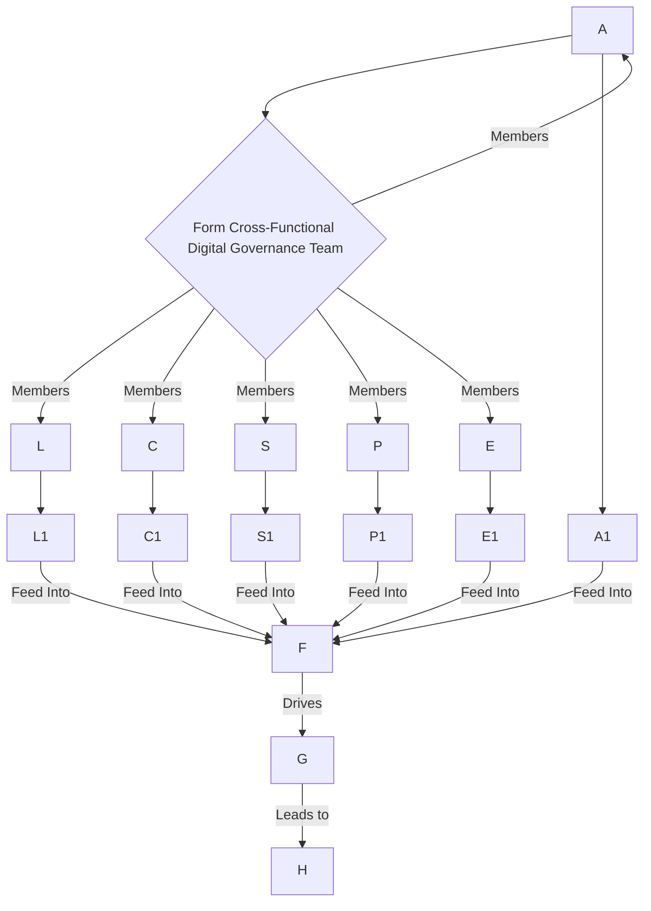

| Stakeholder      | Responsibility in Digital Governance Framework                                         | Key Contributions to Smart Contract Compliance                        |
| :--------------- | :------------------------------------------------------------------------------------- | :-------------------------------------------------------------------- |
| **Executive**    | Strategic oversight, resource allocation, risk appetite, board reporting  | Prioritizing compliance infrastructure, fostering regulatory dialogue |
| **Legal**        | Interpreting evolving regulations (SEC, CFTC), policy guidance, contractual terms| Ensuring smart contracts align with legal definitions of assets|
| **Compliance**   | Developing and enforcing policies, continuous monitoring, audit readiness   | Embedding AML/KYC requirements and reporting mechanisms     |
| **Security**     | Threat modeling, vulnerability management, incident response for smart contracts | Auditing smart contracts, implementing robust security controls|
| **Architecture** | Translating mandates into technical controls, system design for resilience| Designing upgradeable contracts, ensuring data integrity & auditability|
| **Product**      | User experience for compliance flows (KYC, consent), data minimization   | Implementing privacy-preserving KYC/AML solutions (zk-KYC)  |

---

## Topic 2: Risk & Threat Analysis

### Q6: How would you, as a Smart Contract Engineer, mitigate the risk of flash loan attacks in a new DeFi lending protocol, considering both technical controls and cross-functional coordination?

**Difficulty**: Intermediate  
**Type**: Risk & Threat Analysis, Security

**Key Insight**: This question assesses the candidate's practical understanding of a critical DeFi attack vector and the necessary technical and procedural safeguards, including cross-functional alignment.

**Answer**:
Mitigating flash loan attacks in a new DeFi lending protocol requires a multi-layered approach, combining robust technical controls with vigilant cross-functional coordination. Flash loan attacks exploit vulnerabilities by borrowing uncollateralized funds and manipulating markets or smart contract logic within a single transaction.

From a technical perspective, the primary defense involves secure smart contract design, specifically addressing common vulnerabilities targeted by these attacks.
1.  **Secure Price Oracles**: Flash loan attacks often manipulate single price sources. I would implement *decentralized, time-weighted average price (TWAP) oracles* using multiple data feeds to prevent rapid price manipulation, ensuring critical functions (like liquidations) rely on robust and resilient price data.
2.  **Reentrancy Guards**: Although distinct, reentrancy vulnerabilities can be combined with flash loans. I would ensure all state-changing functions that interact with external contracts implement reentrancy guards (e.g., OpenZeppelin's `nonReentrant` modifier or Checks-Effects-Interactions pattern).
3.  **Transaction Limits and Slippage Checks**: Implement internal controls within the smart contract to limit the size of transactions or require significant slippage checks, making large-scale manipulations less profitable or detectable.
4.  **Circuit Breakers/Pause Mechanisms**: For critical protocols, consider implementing emergency pause functions, activated by a trusted multi-signature committee, to mitigate ongoing attacks, though this introduces centralization risks.

Cross-functional coordination is crucial. The Security team would conduct rigorous smart contract audits, including fuzz testing and formal verification, to identify subtle vulnerabilities before deployment. The Architecture team would review dependencies and interactions with external protocols to identify cascading risks. Legal and Compliance teams would define the acceptable risk parameters and assist in drafting clear disclaimers regarding protocol risks. Executive leadership would approve the budget for these extensive security measures and audits. Finally, a bug bounty program would incentivize white-hat hackers to find and report vulnerabilities continuously.

**Supporting Artifacts**:

| Artifact Type | Example | Key Formulas |
|---------------|---------|--------------|
| **Risk & Threat** | Flash Loan Attack Tree | `Risk Score = Likelihood (Exploitability) � Impact (Financial Loss)` |

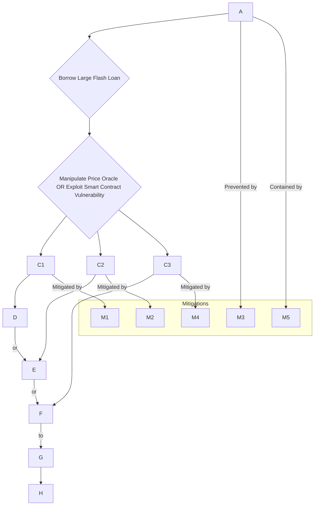

| Vulnerability Type / Attack Vector | Description                                                    | Mitigation Strategy (Technical Control)                       | Impact on Risk Score (Example) |
| :--------------------------------- | :------------------------------------------------------------- | :------------------------------------------------------------ | :----------------------------- |
| **Price Oracle Manipulation** | Attacker manipulates asset price on an exchange, then uses the inflated price for profit. | Multi-source, Time-Weighted Average Price (TWAP) Oracles | Reduces Impact by 80%        |
| **Reentrancy Attacks**    | External call before state update allows repeated withdrawals. | Checks-Effects-Interactions pattern, `nonReentrant` guard | Reduces Likelihood by 90%      |
| **Logic Errors**         | Flaws in contract logic leading to unintended behavior.        | Formal Verification, Extensive Unit Testing| Reduces Likelihood by 70%      |
| **Lack of Input Validation**| Harmful or unexpected inputs manipulate contract logic.        | Strict input validation, type checks, boundary conditions | Reduces Likelihood by 60%      |

### Q7: Explain the root cause of reentrancy attacks in smart contracts and detail the primary technical solutions to prevent them, integrating best practices from the OWASP Smart Contract Top 10.

**Difficulty**: Foundational  
**Type**: Risk & Threat Analysis, Security

**Key Insight**: This question assesses the candidate's fundamental understanding of a pervasive smart contract vulnerability and standard mitigation techniques.

**Answer**:
A reentrancy attack occurs when a smart contract function makes an external call to another untrusted contract before updating its internal state. The root cause lies in this improper ordering of operations: the external (malicious) contract can then "re-enter" the original function repeatedly before the first execution completes. This allows the attacker to drain funds or cause unintended behavior multiple times, as demonstrated by the infamous 2016 DAO hack, which resulted in a $60 million loss. This is listed as SC05:2025 - Reentrancy Attacks in the OWASP Smart Contract Top 10, highlighting its criticality.

The primary technical solution to prevent reentrancy is to enforce the **Checks-Effects-Interactions pattern**. This means:
1.  **Checks**: Verify all conditions and inputs first (e.g., `require(balances >= amount)`).
2.  **Effects**: Update the contract's internal state (e.g., `balances -= amount`) *before* any external calls.
3.  **Interactions**: Only then, make external calls (`msg.sender.call{value: amount}("")`).

OpenZeppelin provides a reusable `ReentrancyGuard` contract with a `nonReentrant` modifier, which locks the function during its execution, preventing recursive calls. This modifier ensures that once a function is entered, another call cannot re-enter it until the first one is completed, effectively mitigating the attack. Other best practices include utilizing `transfer()` or `send()` for Ether transfers, which have a limited gas stipend, preventing re-entry to the calling contract. However, these methods are often discouraged due to issues with contract-to-contract calls. Regular smart contract audits, including static analysis and fuzzing, are crucial to identify and address reentrancy vulnerabilities before deployment.

**Supporting Artifacts**:

| Artifact Type | Example | Key Formulas |
|---------------|---------|--------------|
| **Risk & Threat** | Reentrancy Exploit Diagram | `Vulnerability Score = (Frequency of Occurrence � Severity of Impact)` |

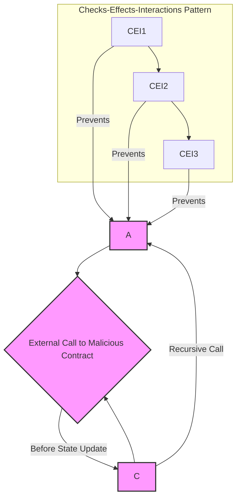

| Mitigation Technique                     | Description                                                                  | OWASP SC Top 10 Relevance |
| :--------------------------------------- | :--------------------------------------------------------------------------- | :---------------------------------- |
| **Checks-Effects-Interactions Pattern**| Update internal state before making external calls.                      | SC05:2025 - Reentrancy Attacks      |
| **ReentrancyGuard Modifier**    | A mutex-like mechanism to prevent re-entering a function while it's executing. | SC05:2025 - Reentrancy Attacks      |
| **Use `transfer()` / `send()`**         | Limited gas stipend prevents re-entry, though less flexible for contracts.   | SC05:2025 - Reentrancy Attacks      |
| **Regular Security Audits**    | Thorough review of code for vulnerabilities before deployment.             | SC05:2025 - Reentrancy Attacks      |

### Q8: A GameFi project relies on an on-chain price oracle for in-game asset valuation. What are the security risks associated with this, and what technical and architectural measures would you implement to prevent price oracle manipulation?

**Difficulty**: Intermediate  
**Type**: Risk & Threat Analysis, Security

**Key Insight**: This question assesses the candidate's understanding of oracle security, a common attack vector in DeFi and GameFi, and their ability to design resilient data feeds.

**Answer**:
An on-chain price oracle for in-game asset valuation in a GameFi project introduces significant security risks, primarily **price oracle manipulation** (SC02:2025 in OWASP Smart Contract Top 10). Attackers could exploit vulnerabilities in how the oracle fetches or aggregates external data, tampering with its feeds to affect contract logic and cause financial losses or system instability within the game economy. For instance, manipulating the price of a rare in-game NFT or currency could lead to unfair arbitrage, asset draining, or disrupting the game's economic balance.

To prevent price oracle manipulation, I would implement several technical and architectural measures:
1.  **Decentralized Oracle Networks**: Instead of relying on a single price source, integrate established decentralized oracle networks like Chainlink. These networks aggregate data from multiple independent nodes, making it far more resistant to manipulation.
2.  **Time-Weighted Average Price (TWAP)**: Instead of spot prices, the oracle should provide TWAP feeds. This means the price is averaged over a period, making rapid, short-term manipulations (often associated with flash loan attacks) less effective, as observed in historical exploits.
3.  **Multiple Oracle Sources and Aggregation**: Use a combination of different oracle providers or aggregate prices from various decentralized exchanges (DEXs). The smart contract should then use a robust aggregation mechanism (e.g., median, trimmed mean) to derive a reliable price, making it harder for an attacker to influence all sources simultaneously.
4.  **Circuit Breakers and Deviation Thresholds**: Implement smart contract logic that pauses critical functions or reverts transactions if the price feed deviates significantly from historical averages or other reference points. This acts as a safety mechanism to prevent catastrophic losses.
5.  **Liquidity Checks**: For in-game assets traded on external markets, ensure that the oracle considers market liquidity. Manipulating prices in low-liquidity pools is easier, so the system should be aware of this risk.
6.  **Regular Audits**: Beyond initial deployment, ongoing security audits by experts are crucial to uncover new vulnerabilities or integration issues as the game and its economy evolve.

These measures require close coordination between the Security team for threat modeling, the Architecture team for integrating complex oracle solutions, and the Product team to understand the economic impact of oracle stability on gameplay.

**Supporting Artifacts**:

| Artifact Type | Example | Key Formulas |
|---------------|---------|--------------|
| **Risk & Threat** | Price Oracle Manipulation Vector | `Oracle Reliability Score = (Number of Decentralized Feeds � Frequency of Updates) / (Latency + Deviation Tolerance)` |

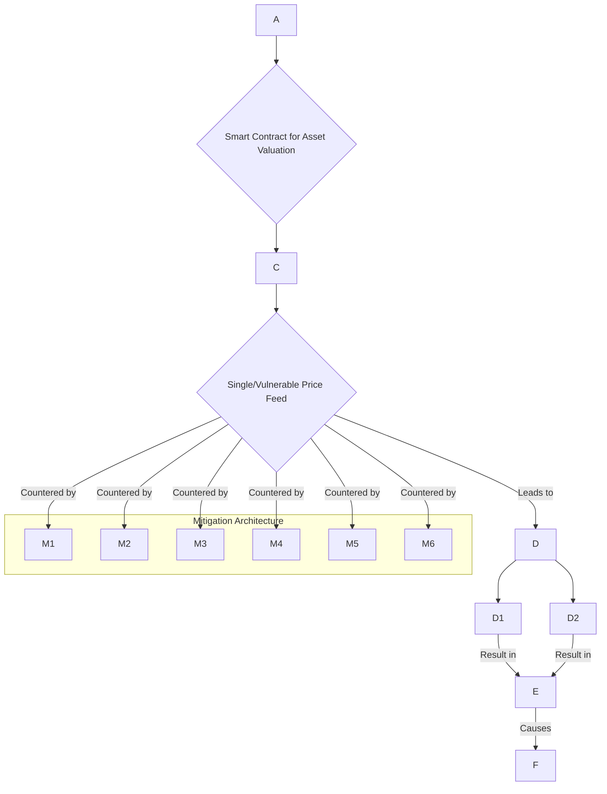

| Price Oracle Risk               | Description                                                                  | Mitigation Strategy (Technical)                              | Stakeholder Ownership          |
| :------------------------------ | :--------------------------------------------------------------------------- | :----------------------------------------------------------- | :----------------------------- |
| **Single Point of Failure**     | Reliance on one data source makes it easy to manipulate or compromise.       | Decentralized oracle networks, multiple feeds       | Architecture, Security         |
| **Spot Price Volatility**       | Instantaneous price can be easily swayed by large trades.                    | Time-Weighted Average Price (TWAP)                  | Architecture                   |
| **Low Liquidity Manipulation**  | Prices in shallow liquidity pools are easier to artificially inflate/deflate. | Incorporate liquidity checks, use high-liquidity sources| Architecture, Product (GameFi Economy)|
| **Data Feed Stale/Incorrect**   | Oracle provides outdated or erroneous information.                           | Active monitoring, freshness checks, fallback mechanisms     | Security, IT Operations        |

### Q9: Your DeFi protocol experiences a privilege escalation incident where an unauthorized address gains administrative control. Describe the immediate incident response steps you would take and how this incident would inform future security architecture, referencing relevant standards.

**Difficulty**: Advanced  
**Type**: Risk & Threat Analysis, Security

**Key Insight**: This question assesses the candidate's understanding of incident response in a smart contract context, root cause analysis, and the iterative nature of security architecture.

**Answer**:
A privilege escalation incident in a DeFi protocol, where an unauthorized address gains administrative control, is a critical security breach requiring immediate and coordinated incident response. My first priority would be **containment and damage control**.
1.  **Immediate Pause**: If the protocol has a pre-built emergency pause function (controlled by a multi-sig wallet), activate it immediately to prevent further unauthorized actions or fund drainage. This requires prior cross-functional agreement on when and how such a mechanism is triggered.
2.  **Alert Stakeholders**: Notify relevant internal teams (Security, Legal, Compliance, Executive, Product) and external partners (auditors, law enforcement if necessary). DORA mandates incident reporting within hours for major ICT incidents.
3.  **Isolate and Analyze**: Begin immediate forensic analysis of transaction logs and smart contract events to identify the exploit vector, the unauthorized actions taken, and the extent of compromise. This involves collecting immutable on-chain data and off-chain logs.

This incident would profoundly inform future security architecture, with a focus on **SC01:2025 - Access Control Vulnerabilities** from the OWASP Smart Contract Top 10.
1.  **Principle of Least Privilege**: Redesign all administrative functions to grant only the minimum necessary permissions for specific tasks. Avoid single points of failure.
2.  **Multi-Signature and Time-Locks**: Implement multi-signature requirements for all critical administrative functions (e.g., contract upgrades, parameter changes, fund movements). Consider adding time-locks for sensitive operations, introducing a delay period during which the community can react.
3.  **Formal Verification of Access Control Logic**: Employ formal verification for critical access control mechanisms to mathematically prove their correctness and prevent logic errors.
4.  **Continuous Monitoring & Alerting**: Enhance real-time monitoring of admin addresses, governance proposals, and critical contract state changes, with automated alerts for unusual activity. Tools like Splunk Enterprise Security can be crucial here.
5.  **Regular, Independent Security Audits**: Mandate frequent, independent security audits focusing specifically on access control, privilege management, and potential backdoors.
6.  **Incident Response Playbooks**: Develop detailed incident response playbooks for privilege escalation scenarios, including communication strategies and remediation steps, aligning with NIST CSF's "Respond" and "Recover" functions.

Cross-functional coordination during remediation would involve Legal assessing liabilities and regulatory reporting, Compliance updating policies, and Executive approving enhanced security budgets.

**Supporting Artifacts**:

| Artifact Type | Example | Key Formulas |
|---------------|---------|--------------|
| **Risk & Threat** | Privilege Escalation Incident Workflow | `MTTR (Mean Time to Respond) = (Sum of Response Times for Incidents) / (Number of Incidents)` |

```mermaid
graph TD
    A --> B{Activate Emergency Pause (if available)}
    B --> C
    C --> D
    D --> E{Identify Root Cause & Exploit Vector}
    E --> F
    F --> G
    G --> H
    H --> I
    I --> J
```

| Security Control Category           | Implementation Detail (Technical Control)                          | OWASP SC Top 10 Reference     | NIST CSF Function |
| :---------------------------------- | :----------------------------------------------------------------- | :-------------------------------------- | :--------------------- |
| **Access Control**                  | Multi-signature for critical functions, least privilege principle. | SC01:2025 - Access Control Vulnerabilities | Protect, Govern        |
| **Audit Logging**                   | Immutable on-chain and off-chain logs of admin actions.            | (Indirectly supports detection/response) | Detect, Respond        |
| **Code Review & Testing**           | Formal verification of authorization logic.                        | SC01:2025 - Access Control Vulnerabilities | Protect                |
| **Monitoring & Alerting**           | Real-time alerts for unusual admin activity.                       | (Indirectly supports detection/response) | Detect                 |

### Q10: Your Executive team wants to understand the financial implications of smart contract security risks for a new DeFi platform. How would you quantify and present this risk, ensuring they understand both potential losses and compliance penalties?

**Difficulty**: Advanced  
**Type**: Risk & Threat Analysis, Executive

**Key Insight**: This question assesses the ability to translate technical security risks into quantifiable financial terms that resonate with executive leadership, including the often-overlooked regulatory compliance penalties.

**Answer**:
To quantify and present smart contract security risks to the Executive team, I would use a **quantitative risk analysis** approach, focusing on potential financial losses and compliance penalties. This involves calculating expected loss based on the likelihood and impact of various attack vectors, such as reentrancy (SC05:2025), flash loan attacks (SC07:2025), and price oracle manipulation (SC02:2025). The OWASP Smart Contract Top 10 highlights that in 2024, these top attack vectors caused billions in losses.

First, I would categorize risks by severity and frequency, mapping them to specific smart contract vulnerabilities. For each identified vulnerability (e.g., a reentrancy bug in a lending pool), I would estimate:
1.  **Likelihood (L)**: The probability of the vulnerability being exploited (e.g., Low, Medium, High, or a percentage). This can be informed by historical data of similar exploits in the industry (e.g., bZx, Cream Finance for flash loans).
2.  **Financial Impact (I_F)**: The direct financial loss in USD if exploited (e.g., Total Value Locked (TVL) at risk in a specific contract, maximum loan amount that could be drained).
3.  **Compliance Penalty Impact (I_C)**: The potential regulatory fines associated with a breach. For instance, a data breach resulting from a smart contract flaw could incur GDPR fines of up to \u20ac20M or 4% of global annual revenue. For operational resilience failures, DORA fines can be up to 2% of global turnover for financial entities.

The **Expected Annual Loss (EAL)** for each risk can be calculated as: \\.
For example, if a flash loan attack on a DeFi lending pool has a 10% annual likelihood and could result in \\$50M in direct financial loss and \\$5M in regulatory fines (e.g., DORA), the EAL would

**Answer (Continuation of Q10):**

To quantify and present smart contract security risks to the Executive team, I would use a **quantitative risk analysis** approach, focusing on potential financial losses and compliance penalties. This involves calculating expected loss based on the likelihood and impact of various attack vectors, such as reentrancy (SC05:2025), flash loan attacks (SC07:2025), and price oracle manipulation (SC02:2025). The OWASP Smart Contract Top 10 highlights that in 2024, these top attack vectors caused billions in losses.

First, I would categorize risks by severity and frequency, mapping them to specific smart contract vulnerabilities. For each identified vulnerability (e.g., a reentrancy bug in a lending pool), I would estimate:
1.  **Likelihood (L)**: The probability of the vulnerability being exploited (e.g., Low, Medium, High, or a percentage). This can be informed by historical data of similar exploits in the industry (e.g., bZx, Cream Finance for flash loans).
2.  **Financial Impact (I_F)**: The direct financial loss in USD if exploited (e.g., Total Value Locked (TVL) at risk in a specific contract, maximum loan amount that could be drained).
3.  **Compliance Penalty Impact (I_C)**: The potential regulatory fines associated with a breach. For instance, a data breach resulting from a smart contract flaw could incur GDPR fines of up to €20M or 4% of global annual revenue. For operational resilience failures, DORA fines can be substantial for financial entities, often linked to a percentage of global turnover.

The **Expected Annual Loss (EAL)** for each risk can be calculated as: \\.
For example, if a flash loan attack on a DeFi lending pool has a 10% annual likelihood, could result in \\$50M in direct financial loss, and \\$5M in regulatory fines (e.g., due to DORA-related operational failures), the EAL would be \\( 0.10 \times (\$50M + \$5M) = \$5.5M \\). This quantitative figure makes the abstract concept of risk tangible for executives. I would then present a prioritized list of these EALs, alongside a **Risk Heatmap** to visualize the highest-priority risks, allowing the Executive team to understand which vulnerabilities require immediate attention and budget allocation for mitigation. This approach also emphasizes the *return on security investment* by showing how mitigating high-EAL risks reduces potential losses.

**Supporting Artifacts**:

| Artifact Type | Example | Key Formulas |
|---------------|---------|--------------|
| **Risk & Threat** | Smart Contract Risk Heatmap | \\ (Expected Annual Loss) |

```mermaid
graph TD
    A --> B{Estimate Likelihood (L)}
    A --> C{Estimate Financial Impact (IF)}
    A --> D{Estimate Compliance Impact (IC)}
    B & C & D --> E
    E --> F{Prioritize Risks}
    F --> G
    G --> H
    H --> I
```

| Risk Scenario                        | Likelihood (L) | Financial Impact (I_F) | Compliance Impact (I_C) | EAL (L × (I_F + I_C)) | Mitigation Priority | OWASP SC Top 10 Ref |
| :----------------------------------- | :------------- | :--------------------- | :---------------------- | :-------------------- | :------------------ | :----------------------------- |
| **Flash Loan Exploit (Price Oracle)**| 10%            | $50,000,000            | $5,000,000              | $5,500,000            | High                | SC02:2025, SC07:2025   |
| **Reentrancy (Lending Pool)**        | 5%             | $20,000,000            | $2,000,000              | $1,100,000            | Medium              | SC05:2025              |
| **Privilege Escalation (Admin Key)** | 2%             | $100,000,000           | $10,000,000             | $2,200,000            | High                | SC01:2025              |
| **Logic Error (Reward Distribution)**| 15%            | $5,000,000             | $500,000                | $825,000              | Medium              | SC03:2025              |
| **Data Breach (Off-chain PII)**      | 8%             | $1,000,000             | $4,000,000 (GDPR/CPRA)  | $400,000              | Low                 | (N/A directly)         |

---

## Topic 3: Privacy & Data Protection

### Q11: Your DeFi protocol collects limited user data for KYC/AML purposes. How do you implement GDPR's right to erasure in an immutable blockchain environment, balancing privacy with regulatory obligations for financial record-keeping?

**Difficulty**: Advanced  
**Type**: Privacy & Data Protection, Architectural Translation

**Key Insight**: This question explores the inherent conflict between blockchain immutability and data protection rights, demanding a nuanced architectural solution for compliant data management.

**Answer**:
Implementing GDPR's Right to Erasure (Article 17) in a DeFi protocol, while operating in an immutable blockchain environment and adhering to KYC/AML financial record-keeping obligations, presents a significant architectural challenge. The core conflict lies in blockchain's immutability, which prevents direct deletion of on-chain data, versus GDPR's mandate for data removal. Financial regulations, such as FATF's AML/CFT guidance, typically require retaining KYC data for several years (e.g., 5-8 years).

To balance these, I would implement a **hybrid on-chain/off-chain data architecture** coupled with cryptographic techniques and a clear data governance model.
1.  **Data Minimization (GDPR, LGPD)**: First, minimize the collection of Personally Identifiable Information (PII) for KYC/AML, retaining only what is strictly necessary. This aligns with GDPR's principle of data minimization.
2.  **Off-Chain Storage for PII**: Sensitive PII collected for KYC/AML would be stored exclusively off-chain in a traditional, centralized, and highly secure database. This off-chain system would be designed for data deletion, allowing records to be permanently erased upon a valid Right to Erasure request after statutory retention periods expire.
3.  **On-Chain Pseudonymization/Hashes**: Only cryptographically hashed representations or zero-knowledge proofs (zk-KYC) derived from the off-chain PII would be stored on-chain. These on-chain proofs would attest to a user's verified status (e.g., "user is KYC'd," "user is not on a sanctions list") without revealing the actual PII.
4.  **"Logical Erasure" on-chain**: For on-chain data, implement a "logical erasure" or "crypto-erasure" mechanism. While the original hash cannot be removed from the immutable ledger, the corresponding off-chain PII (the key to re-identifying the data) would be deleted, rendering the on-chain hash effectively unlinkable to an identifiable individual. This makes the data "pseudonymized" or "de-identified" to the extent that it cannot be re-identified without the deleted off-chain key.
5.  **Data Controller Role**: A designated legal entity acting as the "data controller" would manage the off-chain KYC data, process erasure requests, and bear accountability for GDPR compliance. This entity would be responsible for securely deleting the PII once legal retention obligations (e.g., FATF 5-8 years) are met, or sooner if no conflicting legal basis exists for retention.
6.  **Transparency and Auditability**: Document the data flows, processing activities, and technical controls thoroughly (ROPA - GDPR Article 30). Provide clear privacy policies to users explaining how data is handled, stored, and erased, demonstrating accountability.

This multi-faceted approach reconciles the technical constraints of blockchain with the legal demands of GDPR and the practical necessities of AML/KYC.

**Supporting Artifacts**:

| Artifact Type | Example | Key Formulas |
|---------------|---------|--------------|
| **Privacy** | Hybrid Data Flow for Right to Erasure | `Effective Erasure Rate = (PII Deleted Off-Chain / Total PII on Request) × 100%` |

```mermaid
flowchart TD
    A -- KYC/AML Submission --> B{Off-Chain PII Database (Data Controller)}
    B -- Hash/ZK Proof Generation --> C
    C -- Store --> D

    E -- Check Legal Basis/Retention --> F{Data Controller Decision}
    F -- Approve --> G
    G -- Render --> H
    F -- Deny (e.g., AML Req) --> I

    D -- Cannot be Directly Deleted --> X
    H --> J
    I --> K
```

| Regulatory Obligation/Right | Blockchain Challenge      | Technical/Architectural Solution (Control)         | Stakeholder Responsibility     |
| :-------------------------- | :------------------------ | :------------------------------------------------- | :----------------------------- |
| **Right to Erasure (GDPR Art. 17)**| Immutability of on-chain data  | Hybrid on-chain/off-chain model, PII off-chain, hashes on-chain, logical erasure | Legal, Architecture, Compliance |
| **Data Minimization (GDPR)**| Excessive data on-chain    | Store only cryptographic proofs/hashes on-chain | Architecture, Product          |
| **Accountability (GDPR)**| No clear data controller  | Appoint explicit data controller for off-chain PII | Legal, Executive               |
| **Financial Record-Keeping (FATF)**| Need for PII retention    | Off-chain PII stored securely for statutory period | Compliance, Security           |

### Q12: Your Product team is designing a new dApp. How would you guide them to incorporate data minimization and pseudonymization effectively, adhering to GDPR principles while optimizing for user experience?

**Difficulty**: Intermediate  
**Type**: Privacy & Data Protection, Product

**Key Insight**: This question assesses the candidate's ability to translate complex privacy principles into practical product design and user experience, balancing compliance with usability.

**Answer**:
Guiding the Product team to incorporate data minimization and pseudonymization effectively in a new dApp, while adhering to GDPR principles and optimizing user experience, requires a collaborative and iterative approach. The core principle is **Privacy-by-Design and Default**, meaning privacy considerations are baked into the dApp from conception.

1.  **Data Inventory & Mapping**: First, work with the Product team to conduct a thorough data inventory for the dApp. Identify exactly what personal data is *necessary* for each feature and processing activity. Challenge every data point: "Is this truly essential, or merely 'nice to have'?". This aligns with GDPR's purpose limitation and data minimization principles.
2.  **Pseudonymization by Default**: For any necessary personal data, design the system to pseudonymize it as early as possible in the processing pipeline. This means separating direct identifiers (e.g., wallet addresses linked to KYC identities) from transactional data. For example, if a user's transaction history is needed for analytics, use a unique, rotating pseudonym on-chain instead of a directly linked wallet address. Zero-knowledge proofs (ZKPs) can be leveraged for on-chain verification without revealing underlying data, significantly enhancing pseudonymity for operations like compliance checks.
3.  **User Consent Flows**: Design clear, granular, and easily revocable consent mechanisms. The UX should make it simple for users to understand what data is being collected, why, and for how long. Emphasize explicit consent for non-essential data processing. Tools like TrustArc offer consent management solutions.
4.  **On-Chain vs. Off-Chain Storage**: Educate the Product team on the implications of blockchain immutability. Strictly enforce that PII is never stored directly on-chain. Instead, utilize off-chain secure storage for any direct identifiers, linked only by pseudonymized on-chain references. This allows for the possibility of data erasure for off-chain PII.
5.  **Transparency & User Control**: Build features that allow users to easily exercise their data subject rights (access, rectification, erasure, portability). While full on-chain erasure is impossible, enable users to "logically" erase their data by removing off-chain links and providing clear explanations in the dApp interface.
6.  **DPIA Integration**: Integrate Data Protection Impact Assessments (DPIAs) into the product development roadmap. This ensures privacy risks are identified and addressed during each design phase, rather than as an afterthought.

By embedding these principles, the dApp can offer a privacy-conscious experience, building user trust while meeting GDPR requirements.

**Supporting Artifacts**:

| Artifact Type | Example | Key Formulas |
|---------------|---------|--------------|
| **Privacy** | Data Flow with Pseudonymization | `Data Minimization Index = (Fields Collected - Non-Essential Fields) / Total Fields Collected` |

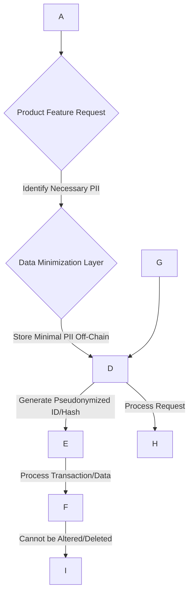

| GDPR Principle          | Product Design Consideration                               | Technical Control/Feature (Control)                 | User Experience Impact           |
| :---------------------- | :--------------------------------------------------------- | :-------------------------------------------------- | :------------------------------- |
| **Data Minimization**| Collect only essential data for core functionality.      | Conditional input fields, tiered KYC      | Faster onboarding for basic features |
| **Pseudonymization**| Generate non-identifiable identifiers for on-chain data. | ZK-SNARKs for compliance proofs, unique session IDs | Privacy-preserving transactions    |
| **Transparency**| Clear, concise privacy policy and data usage explanations. | In-app pop-ups, dynamic privacy dashboard   | Builds trust, informs choices      |
| **User Control/Consent**| Granular consent options, easy revocation.                 | Toggle switches for data sharing, consent logs      | Empowers users, personalized privacy |
| **Security**| Protect off-chain PII and cryptographic keys.              | End-to-end encryption, multi-factor authentication  | Secure feeling, peace of mind      |

### Q13: Your dApp's frontend involves cookies and tracking technologies. How do you ensure compliance with the EU's ePrivacy Regulation, specifically regarding consent mechanisms, while maintaining a seamless user experience?

**Difficulty**: Intermediate  
**Type**: Privacy & Data Protection, Product

**Key Insight**: This question assesses the candidate's understanding of specific web privacy regulations and the challenge of balancing strict consent requirements with user-friendly design.

**Answer**:
Ensuring compliance with the EU's ePrivacy Regulation (often called the "Cookie Law") for a dApp's frontend, particularly regarding consent mechanisms, while maintaining a seamless user experience, is crucial. The ePrivacy Regulation requires explicit and informed consent before placing non-essential cookies or tracking technologies on a user's device. This is a higher bar than implied consent and directly impacts UX.

1.  **Granular Consent Banner**: Implement a highly visible, **geo-specific cookie banner** that appears on the first visit from an EU IP address. The banner must clearly inform users about the types of cookies and tracking technologies used (e.g., essential, analytics, marketing, functional).
2.  **No Pre-Checked Boxes**: Crucially, all non-essential cookie categories must *not* be pre-checked. Users must actively opt-in.
3.  **Clear Options**: Provide clear options for "Accept All," "Reject All" (for non-essential), and "Manage Preferences". The "Reject All" option should be as easy to access as "Accept All".
4.  **User-Friendly Preference Center**: The "Manage Preferences" section should be intuitive, allowing users to easily toggle individual cookie categories or specific vendors. This preference center must remain accessible (e.g., via a footer link) after the initial consent interaction, allowing users to change their minds anytime.
5.  **Blocking Non-Essential Cookies**: The dApp's frontend must technically prevent any non-essential cookies or tracking scripts from loading *before* explicit consent is given. This requires close coordination between the Product and Engineering teams.
6.  **Consent Persistence**: Store the user's consent choices securely, typically in a strictly essential cookie, for a defined period (e.g., 12 months), after which consent must be re-obtained.
7.  **Progressive Disclosure/User Education**: While requiring explicit consent, avoid overwhelming the user immediately. Use clear, concise language to explain the benefits of certain cookies (e.g., "analytics helps us improve the dApp") to encourage opt-ins without coercion. Tools like TrustArc's Cookie Consent Manager can help manage these flows efficiently.

To maintain a seamless UX, the banner should be non-intrusive *after* the initial decision, ensuring performance isn't degraded. The consent process should be as quick as possible, ideally a single click for "Accept All" or "Reject All," with "Manage Preferences" being an optional, but easily accessible, deeper dive. This approach prioritizes transparency and user control while minimizing friction.

**Supporting Artifacts**:

| Artifact Type | Example | Key Formulas |
|---------------|---------|--------------|
| **Privacy** | ePrivacy Consent Flow | `Consent Rate (Non-Essential) = (Users Opting In / Total Users) × 100%` |

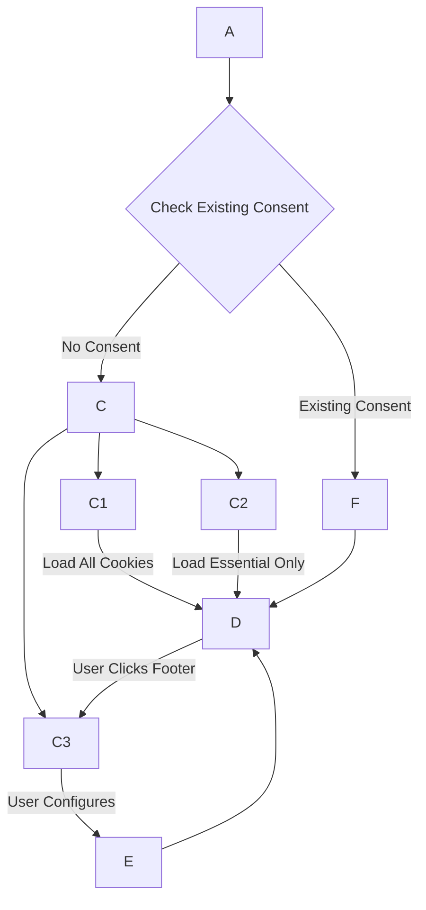

| ePrivacy Requirement        | Technical Control/Feature                                | Product Design Consideration                      | Compliance Tool Reference |
| :-------------------------- | :------------------------------------------------------- | :------------------------------------------------ | :------------------------ |
| **Explicit Consent** | Non-essential cookies blocked until explicit opt-in.     | No pre-checked boxes, clear "Accept/Reject All" buttons | TrustArc Cookie Consent Manager |
| **Informed Consent** | Detailed information on cookie types and purposes.       | Layered information, easy-to-understand descriptions | OneTrust Consent & Preference Manager |
| **Easy Revocation**  | Accessible preference center after initial interaction.  | Persistent footer link to "Manage Preferences" | TrustArc Consent & Preference Manager |
| **Geo-Specificity** | Banner displayed only for relevant jurisdictions.        | IP-based geo-location detection                   | TrustArc Geo-Specific Cookie Banner |

### Q14: A global NFT marketplace is considering expanding its operations. What are the key cross-border data transfer challenges under GDPR (EU), PIPL (China), and LGPD (Brazil), and how would smart contract architecture be designed to address them?

**Difficulty**: Advanced  
**Type**: Privacy & Data Protection, Architectural Translation

**Key Insight**: This question highlights the complexities of international data flows in a decentralized context, requiring architectural solutions that anticipate varying and often conflicting jurisdictional requirements.

**Answer**:
A global NFT marketplace expanding its operations faces significant cross-border data transfer challenges under GDPR (EU), PIPL (China), and LGPD (Brazil), particularly concerning personal data processed by smart contracts. Each regulation imposes distinct and often stringent requirements.

1.  **GDPR (EU)**: Transfers of personal data outside the EU/EEA are prohibited unless adequate safeguards are in place. Key challenges include identifying the "data controller" for decentralized systems and the immutable nature of on-chain data conflicting with the Right to Erasure.
2.  **PIPL (China)**: Requires a legal basis for transfer, typically explicit consent, and often mandates a security assessment by the Cyberspace Administration of China (CAC) for large-scale transfers. Critical information infrastructure operators and those processing large volumes of PII must store data locally within China.
3.  **LGPD (Brazil)**: Similar to GDPR, requires an adequacy decision, contractual clauses, or specific consent for international transfers.

Smart contract architecture must be designed with these in mind:
*   **Data Residency & Localization**: For PIPL, PII of Chinese users would be stored off-chain in servers physically located within China. The smart contract would only store cryptographic attestations or pseudonymized identifiers. This implies **region-specific deployment models** where certain sensitive data processing occurs within designated geographic boundaries.
*   **Standard Contractual Clauses (SCCs)**: For GDPR compliance, all third-party service providers (e.g., IPFS storage, cloud providers) involved in processing personal data for EU users must be covered by SCCs or an adequacy decision. This requires due diligence on sub-processors and possibly negotiating custom DPAs.
*   **Consent Management**: Implement a robust, multi-jurisdictional consent management system within the marketplace's frontend. Users must explicitly consent to cross-border transfers, with clear information about destination countries and safeguards. For PIPL, consent for cross-border transfers is particularly critical.
*   **Pseudonymization and Data Minimization**: Store minimal, pseudonymized data on-chain. Real PII is retained off-chain in secure, regional databases managed by a designated Data Controller, which then becomes the point of contact for data subject requests and regulatory inquiries.
*   **Verifiable Credentials/zk-KYC**: For KYC/AML checks, employ zero-knowledge proofs (zk-KYC) to allow users to prove identity/status without revealing full PII, thereby minimizing data transfer. This is especially relevant for sensitive information and cross-border verification.

The smart contract itself primarily facilitates token ownership and transactional logic, while the off-chain components (frontend, databases, identity providers) are responsible for managing PII and ensuring compliance with varying cross-border transfer regimes. This separation of concerns is fundamental for global regulatory adherence.

**Supporting Artifacts**:

| Artifact Type | Example | Key Formulas |
|---------------|---------|--------------|
| **Privacy** | Cross-Border Data Transfer Strategy | `Data Transfer Risk = ∑ (Jurisdictional Risk × Data Volume × Sensitivity)` |

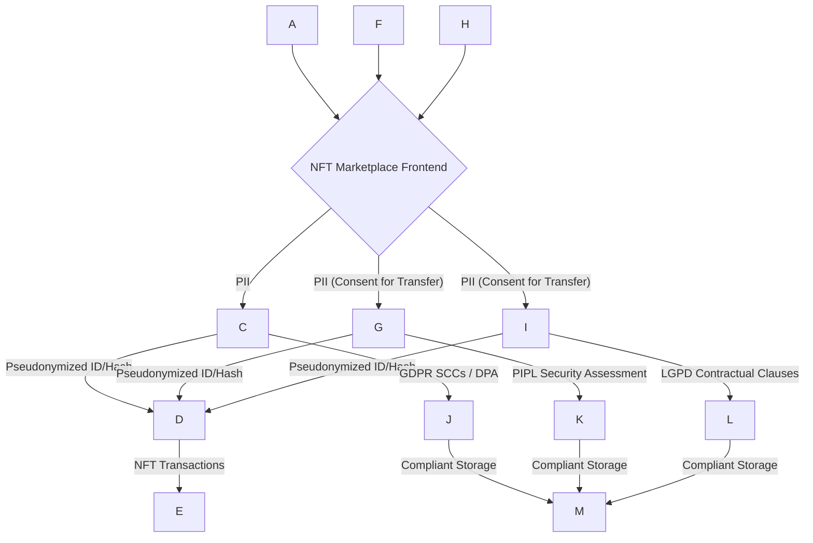

| Regulation      | Key Cross-Border Transfer Requirement             | Architectural Design/Control                               | Evidence Required (for Audit)           |
| :-------------- | :------------------------------------------------ | :--------------------------------------------------------- | :-------------------------------------- |
| **GDPR (EU)** | Adequacy, SCCs, BCRs                     | Off-chain PII storage, SCCs with all sub-processors | Signed DPAs/SCCs, data transfer records |
| **PIPL (China)** | CAC Security Assessment, Local Storage for Critical PII | Regional off-chain DB for Chinese users, explicit consent | CAC approval, consent logs, local data audit |
| **LGPD (Brazil)** | Adequacy, contractual clauses, consent | Off-chain PII storage, contractual clauses with vendors    | Signed contractual clauses, consent records |

### Q15: How can DeFi protocols effectively balance users' demands for privacy with stringent AML/CFT requirements, particularly using tools like zk-KYC and on-chain/off-chain data minimization strategies?

**Difficulty**: Advanced  
**Type**: Privacy & Data Protection, Compliance Modeling

**Key Insight**: This question explores the innovative use of cryptographic tools to reconcile the seemingly opposing demands of user privacy and regulatory compliance in DeFi, which is a major area of regulatory focus.

**Answer**:
DeFi protocols face a fundamental tension between users' demands for privacy (often valued in decentralized ecosystems) and stringent AML/CFT (Anti-Money Laundering/Counter-Financing of Terrorism) requirements imposed by regulators like FATF. Effectively balancing these requires sophisticated privacy-preserving KYC/AML solutions that leverage cryptographic tools and thoughtful data architecture.

1.  **zk-KYC (Zero-Knowledge KYC)**: This is a cornerstone solution. Users complete traditional KYC/AML checks with a trusted third-party credential issuer (e.g., a regulated identity provider). Instead of storing PII on-chain or directly sharing it with the DeFi protocol, the issuer generates **Verifiable Credentials (VCs)**. The user then uses zero-knowledge proofs (ZKPs) to cryptographically prove certain attributes about their identity (e.g., "I am not on a sanctions list," "I am over 18," "I am a resident of a non-sanctioned country") without revealing the underlying PII. The DeFi smart contract verifies this ZKP on-chain, granting access based on verified attributes. This achieves compliance without compromising privacy.
2.  **On-Chain/Off-Chain Data Minimization**:
    *   **Off-Chain PII Storage**: All sensitive PII collected during KYC is stored securely off-chain by the credential issuer or the protocol's legal entity acting as a data controller. This minimizes the on-chain footprint of personal data, mitigating immutability conflicts with the Right to Erasure (GDPR).
    *   **Merkle Trees for Selective Disclosure**: Merkle trees can be used to prove the inclusion of an attribute (e.g., "KYC status verified") within a set of verified data, enabling selective disclosure without revealing the entire dataset. A ZKP can then be used to prove a statement about this attribute (e.g., "My country is not North Korea").
    *   **Nullifiers for Compliance Checks**: Unique nullifiers, cryptographically linked to a user's deposit, can prevent double-spending and, more importantly, be integrated with compliance checks. For instance, a protocol could require users to prove via ZKP that their transaction's origin address is not on an OFAC sanctions list before a deposit is accepted, preventing "transactional taint".
3.  **Decentralized Identifiers (DIDs)**: DIDs allow users to control their own identity data, enhancing self-sovereignty. They can link VCs from various issuers to their DID, enabling flexible and privacy-preserving proofs of identity when required by different DeFi protocols.
4.  **Regulatory Reporting Mechanisms**: While privacy-preserving, the system must retain the capability to fulfill regulatory reporting obligations if illicit activity is detected. This typically involves a designated entity (the data controller or credential issuer) being able to "unshield" or reveal the PII under strict legal processes (e.g., court order). This "break-glass" mechanism is typically off-chain and heavily secured.

This "Compliance Triad" of ZKPs, Merkle Trees, and DIDs/VCs forms a robust, privacy-preserving compliance architecture.

**Supporting Artifacts**:

| Artifact Type | Example | Key Formulas |
|---------------|---------|--------------|
| **Privacy** | Privacy-Preserving KYC/AML Flow | `Privacy-Compliance Score = (ZK-KYC Adoption Rate × AML Compliance Rate) / (PII On-Chain Percentage)` |

```mermaid
flowchart TD
    A --> B{Trusted Credential Issuer (Off-Chain KYC/AML)}
    B -- Verifies & Issues --> C
    C -- Stored By --> D

    D -- Generate ZKP for Compliance Proof --> E{DeFi Protocol (Smart Contract)}
    E -- Validate ZKP (On-Chain) --> F
    F -- Record --> G

    H --> I{Compliance Oracle (On-Chain/Off-Chain)}
    I -- Feeds --> E
    E -- Nullifier Check --> F

    J --> K{Credential Issuer (Under Legal Process)}
    K -- Conditional Disclosure --> A
```

| Compliance Goal         | Technical Mechanism                       | Privacy Benefit                                     | AML/CFT Benefit                                     | Tool/Concept Reference      |
| :---------------------- | :---------------------------------------- | :-------------------------------------------------- | :-------------------------------------------------- | :-------------------------- |
| **Identity Verification** | zk-KYC (Zero-Knowledge Proofs)  | User's PII remains off-chain, not revealed to protocol | Protocol verifies identity without direct PII access | ZK-SNARKs (Groth16) |
| **Data Minimization**   | Off-chain PII storage, on-chain hashes | Reduces attack surface for PII, supports Right to Erasure | Only compliance-relevant proofs on-chain, not PII   | Merkle Trees, Nullifiers |
| **Sanctions Screening** | Compliance Oracles, Nullifier checks | User proves non-sanctioned status without revealing origin | Protocol blocks sanctioned addresses, prevents "taint" | VerifierOracle.sol |
| **User Control**        | Decentralized Identifiers (DIDs) | Users manage their own identity, selective disclosure | Identity claims linked to trusted issuers, but not exposed | DIDs, Verifiable Credentials (VCs) |

---

## Topic 4: Audit & Evidence

### Q16: Your DeFi protocol is seeking SOC2 Type II attestation. What are the key challenges specific to blockchain-based platforms in meeting the Trust Services Criteria, and how would you design your audit trail and evidence collection processes?

**Difficulty**: Advanced  
**Type**: Audit & Evidence, Compliance Modeling

**Key Insight**: This question assesses the candidate's understanding of how traditional audit standards adapt to decentralized, immutable systems, highlighting the need for specialized audit trail design and evidence collection.

**Answer**:
Seeking SOC2 Type II attestation for a DeFi protocol, a blockchain-based platform, presents unique challenges compared to traditional SaaS. SOC2 Type II reports on the operating effectiveness of controls over a period (typically 6-12 months) against the Trust Services Criteria (TSC): Security, Availability, Processing Integrity, Confidentiality, and Privacy.

Key challenges specific to blockchain platforms include:
1.  **Immutability vs. Change Management**: While on-chain code is immutable post-deployment, off-chain components (frontends, oracle infrastructure, governance) are not. Auditing changes requires linking immutable smart contract hashes to version control systems and off-chain deployment records.
2.  **Decentralization vs. Accountability**: Identifying responsible parties for controls in a DAO-governed protocol can be difficult. SOC2 requires clear control ownership.
3.  **On-Chain Transparency vs. Confidentiality**: All on-chain transactions are public, which can conflict with confidentiality requirements for certain data, even if it's not PII.
4.  **Operational Resilience (Availability/Processing Integrity)**: Demonstrating the availability and processing integrity of smart contracts requires proving their continuous, correct execution despite network congestion, oracle failures, or malicious attacks.
5.  **Evidence Collection from Distributed Systems**: Collecting consistent evidence from disparate nodes, wallets, and off-chain services can be complex.

To design the audit trail and evidence collection processes:
*   **Comprehensive Audit Trail**:
    *   **On-Chain**: Leverage the blockchain's inherent immutability for transactional audit trails. Every smart contract interaction (function calls, events emitted) serves as auditable evidence. Design smart contracts to emit granular events for critical state changes, ownership transfers, and governance decisions.
    *   **Off-Chain**: Implement robust logging for all off-chain components (frontend interactions, API calls, oracle data feeds, administrative actions, CI/CD pipelines). Logs must capture user identity (pseudonymized), timestamp, action, and outcome. Use a centralized, tamper-evident SIEM (e.g., Splunk Enterprise Security) for log aggregation, analysis, and retention, ensuring integrity.
*   **Evidence Collection Automation**: Utilize tools like Vanta or OneTrust to automate the collection of evidence for common controls. This includes continuous monitoring of infrastructure configurations, access controls (e.g., multi-sig wallet policies), developer activity, and security scanning results.
*   **Mapping Controls to Evidence**: Create a clear mapping between each SOC2 TSC control (e.g., CC3.1: Logical Access, CC7.1: System Monitoring) and the specific on-chain events, off-chain logs, or policy documents that serve as evidence.
*   **Governance Documentation**: Document DAO governance proposals, voting outcomes, and upgrade processes rigorously. Evidence would include transaction hashes of executed proposals and related forum discussions.
*   **Smart Contract Security Audits**: Regularly commissioned third-party smart contract security audits become a critical piece of evidence for the Security TSC.

The SOC2 audit would then verify that these controls are not only designed appropriately (Type I) but also operate effectively over the defined period (Type II), demonstrating the protocol's commitment to security and reliability.

**Supporting Artifacts**:

| Artifact Type | Example | Key Formulas |
|---------------|---------|--------------|
| **Audit** | SOC2 Evidence Mapping for DeFi | `Control Effectiveness Rate = (Satisfied Control Instances / Total Control Instances) × 100%` |

```mermaid
graph TD
    A --> B{Define Control Objectives (TSC)}
    B --> B1
    B --> B2
    B --> B3
    B --> B4
    B --> B5

    B1 & B2 & B3 & B4 & B5 --> C
    C --> D
    D --> D1
    D --> D2
    D3
    D1 & D2 & D3 --> E{Automate Evidence Collection (Vanta/Splunk)}
    E --> F
    F --> G
    G --> H
```

| SOC2 Trust Services Criteria | Blockchain-Specific Control                                     | Evidence Source (On-Chain / Off-Chain)        | Audit Tool/Methodology      |
| :--------------------------- | :-------------------------------------------------------------- | :-------------------------------------------- | :-------------------------- |
| **Security (CC1.1)**| Multi-signature for admin actions, access logs                  | Transaction hashes, off-chain admin logs      | Vanta, Splunk, Manual review |
| **Availability (CC2.1)**| Redundant oracle feeds, DDoS protection for infrastructure      | Oracle uptime, network traffic logs, incident reports | Splunk, Nessus scans        |
| **Processing Integrity (CC3.1)**| Formal verification of core contract logic, invariant testing   | Audit reports, test results, on-chain execution | Smart contract auditors     |
| **Confidentiality (CC4.1)**| Off-chain PII storage, cryptographic commitments on-chain     | Data flow diagrams, access controls on DB     | OneTrust, TrustArc          |
| **Privacy (CC5.1)**| Consent management for data sharing, data minimization          | Consent logs, DPIAs, privacy policy           | OneTrust                    |

### Q17: As a Smart Contract Engineer, how would you design an immutable and comprehensive audit trail for a complex DeFi protocol that satisfies both internal operational oversight and external regulatory reporting requirements (e.g., DORA, FATF)?

**Difficulty**: Advanced  
**Type**: Audit & Evidence, Architectural Translation

**Key Insight**: This question assesses the candidate's technical expertise in leveraging blockchain's inherent properties for auditability while integrating off-chain data to meet diverse regulatory mandates.

**Answer**:
Designing an immutable and comprehensive audit trail for a complex DeFi protocol involves harmonizing the inherent transparency of blockchain with the demands of internal operational oversight and external regulatory reporting, such as DORA and FATF guidance.

**Architectural Design for Audit Trail**:
1.  **On-Chain Audit Trail (Blockchain Events)**: The core of the audit trail is the blockchain itself. All state-changing smart contract interactions will emit detailed **events**. These events will capture:
    *   `who` (wallet address, possibly linked to a pseudonymized ID)
    *   `what` (function called, parameters, transaction type)
    *   `when` (block timestamp)
    *   `where` (contract address, transaction hash)
    *   `why` (reason for transaction, if applicable, e.g., "liquidation initiated")
    For example, a `Deposit(address indexed user, uint256 amount, uint256 newBalance)` event would be emitted upon every deposit into a lending pool. These events are immutable and verifiable on the public ledger.
2.  **Off-Chain Supplemental Logging**: Since not all audit-relevant data resides on-chain (e.g., API requests to frontends, internal system configurations, developer actions, oracle data feeds), a robust off-chain logging system is critical. This system would capture:
    *   Frontend user interactions, consent logs, and error messages.
    *   Off-chain oracle data fetches and their integrity checks.
    *   Administrative actions (e.g., multi-sig approvals for upgrades, pause mechanism activation).
    *   CI/CD pipeline activities (code deployments, audit reports).
    These logs must be collected by a centralized, tamper-evident SIEM solution (e.g., Splunk Enterprise Security), with strict access controls and long-term retention policies (e.g., 6 years for HIPAA, 5-8 years for FATF/MiCA related records).
3.  **Correlation and Linkage**: Implement a correlation engine to link on-chain events with off-chain logs using common identifiers (e.g., session IDs, pseudonymized user IDs). This provides a holistic view of a user's journey and system events.

**Satisfying Regulatory Requirements**:
*   **DORA (Operational Resilience)**: The comprehensive audit trail supports DORA's requirements for ICT risk management and incident reporting. Detailed logs enable rapid detection of anomalies, root cause analysis during incidents, and post-incident review.
*   **FATF (AML/CFT, Travel Rule)**: While primary PII is off-chain, the correlated audit trail can help reconstruct transaction flows and identify suspicious activity. If integrated with zk-KYC, the audit trail confirms the verification status of participants. This addresses the need for transaction monitoring and record-keeping.
*   **Internal Oversight**: The detailed logs provide transparency for internal teams, enabling performance monitoring, debugging, and post-mortem analysis.

By combining the inherent immutability of blockchain events with secure, correlated off-chain logging, a comprehensive and verifiable audit trail is achieved, meeting both technical and regulatory demands.

**Supporting Artifacts**:

| Artifact Type | Example | Key Formulas |
|---------------|---------|--------------|
| **Audit** | DeFi Audit Trail Architecture | `Audit Log Completeness = (Critical Events Logged / Total Critical Events) × 100%` |

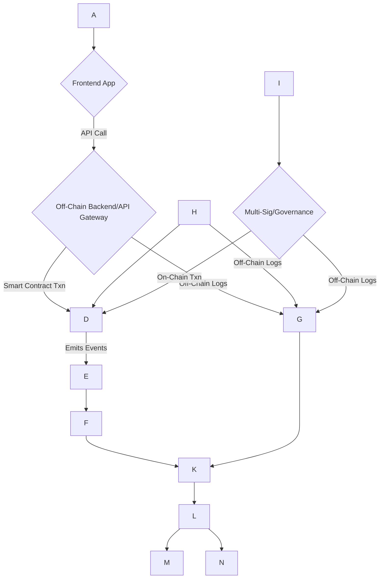

| Regulatory Requirement / Use Case   | Technical Component / Control                     | Audit Trail Element (On-Chain / Off-Chain)        | Responsible Team     |
| :---------------------------------- | :------------------------------------------------ | :------------------------------------------------ | :------------------- |
| **FATF Record-Keeping**   | Transaction events, user ID (pseudonymized)       | On-chain events (`transfer()`), off-chain user metadata | Compliance, Security |
| **DORA Incident Analysis** | Comprehensive logging of system state changes     | On-chain events, off-chain system logs, CI/CD logs | Security, IT Ops     |
| **Internal Fraud Detection**        | Anomaly detection in transaction patterns         | Correlated on-chain events and off-chain access logs | Security, Audit      |
| **Smart Contract Upgrade Audit**    | Version control, multi-sig approvals              | On-chain upgrade txns, git commit logs, governance votes | Architecture, Audit  |

### Q18: Explain the role of digital signature verification in ensuring the integrity and authenticity of off-chain evidence for smart contract audits, particularly when combined with on-chain cryptographic commitments.

**Difficulty**: Intermediate  
**Type**: Audit & Evidence, Security

**Key Insight**: This question assesses the candidate's understanding of how cryptographic mechanisms bridge the trust gap between off-chain data and on-chain immutability for audit purposes.

**Answer**:
Digital signature verification plays a crucial role in ensuring the integrity and authenticity of off-chain evidence for smart contract audits, especially when combined with on-chain cryptographic commitments. While smart contract code and execution are inherently verifiable on-chain, many critical audit artifacts, such as source code versions, development logs, penetration test reports, legal opinions, and KYC/AML documents, exist off-chain. Without robust mechanisms, these off-chain documents could be altered or fabricated, undermining the audit's credibility.

Digital signatures provide a cryptographic means to verify that an off-chain document has not been tampered with and originated from a specific entity. When an off-chain document is "signed" by a trusted party (e.g., a developer, an auditor, a legal counsel), a unique cryptographic hash of the document is created and then encrypted with the signer's private key. Anyone can then use the signer's public key to decrypt this signature and re-compute the document's hash. If the re-computed hash matches the decrypted one, it confirms both the document's integrity (it hasn't changed) and authenticity (it came from the signer).

Combining this with on-chain cryptographic commitments further strengthens the audit trail. For instance:
1.  **Commitment Hash**: Before a smart contract is deployed or upgraded, a hash of its audited source code (and potentially the audit report itself) can be publicly committed to the blockchain.
2.  **Digital Signature**: The official audit report, which is an off-chain document, is digitally signed by the auditing firm.
3.  **Verification**: During an audit, an auditor can verify the integrity of the off-chain audit report using the digital signature. Then, they can cross-reference the hash of the source code (as stated in the off-chain report) with the hash committed on-chain. This provides an immutable, verifiable link between the deployed code and its audited state.

This process effectively bridges the gap between trust in off-chain processes and the immutable, verifiable nature of on-chain operations, providing strong evidence for certifications like SOC2 or ISO 27001. It ensures that external auditors and regulators (e.g., those reviewing DORA compliance for ICT providers) can trust the integrity and authenticity of the comprehensive evidence presented.

**Supporting Artifacts**:

| Artifact Type | Example | Key Formulas |
|---------------|---------|--------------|
| **Audit** | Off-Chain Evidence Verification Flow | `Evidence Integrity Score = (Verified Digital Signatures / Total Critical Documents) × 100%` |

```mermaid
flowchart TD
    A --> B{Hash Document (SHA-256)}
    B --> C{Sign Hash with Private Key (Auditor)}
    C --> D
    D -- Stored with Document --> A

    E --> F{Commit Document Hash to Blockchain}
    F --> G

    H --> I{Retrieve Off-Chain Document + Signature}
    I --> J{Verify Digital Signature (Auditor Public Key)}
    J -- If Valid --> K{Compute Hash of Retrieved Document}
    K --> L{Compare K with G}
    L -- Match --> M
    L -- Mismatch --> N
```

| Audit Element                    | Purpose                                           | Technical Control                                       | Integrity/Authenticity Mechanism   |
| :------------------------------- | :------------------------------------------------ | :------------------------------------------------------ | :--------------------------------- |
| **Source Code Version**          | Verify deployed code matches audited code.        | Git commit hash, cryptographic code hash, on-chain commitment | Digital signature on version, on-chain hash commitment |
| **Audit Reports**                | Confirm report originality, no post-audit changes.| Digital signature of audit firm on PDF report           | PKI-based digital signature        |
| **Legal Opinions**               | Authenticate legal advice for compliance decisions.| Digital signature of legal counsel on opinion document  | PKI-based digital signature        |
| **Configuration Files**          | Ensure production configs match approved baseline.| Hash of configuration file, signed by deployer          | Digital signature on config hash   |
| **Incident Response Documents**  | Prove IR actions, timelines for DORA compliance.  | Hashes of IR reports signed by Security Lead            | Digital signature                  |

### Q19: Your Executive team is evaluating proposals for smart contract auditing firms. What criteria should they prioritize when selecting a firm, and what does a comprehensive audit methodology entail for a DeFi protocol?

**Difficulty**: Intermediate  
**Type**: Audit & Evidence, Executive

**Key Insight**: This question evaluates the candidate's understanding of audit quality, vendor selection, and the components of a robust smart contract security assessment, critical for executive-level decision-making.

**Answer**:
When an Executive team is evaluating proposals for smart contract auditing firms, they should prioritize several key criteria to ensure a comprehensive and effective security assessment for a DeFi protocol. Given the high stakes in DeFi, a superficial audit is insufficient.

**Selection Criteria for Auditing Firm**:
1.  **Specialization & Experience**: The firm must have deep, demonstrable experience specifically in DeFi protocols and the relevant blockchain (e.g., Ethereum, Solana, Aptos). They should understand common DeFi attack vectors (flash loans, reentrancy, oracle manipulation) and the economic specificities of tokenomics.
2.  **Track Record & Reputation**: Look for a firm with a strong reputation, public case studies of past audits, and preferably one that has discovered critical vulnerabilities in high-profile projects. Check for transparency in their methodologies and post-audit support.
3.  **Methodology & Tools**: Inquire about their detailed audit methodology, which should include a combination of automated tools (static analysis like Slither, Mythril, Echidna) and extensive manual review. They should utilize advanced techniques like formal verification for critical components and fuzz testing.
4.  **Team Expertise**: Assess the qualifications and certifications of the actual engineers who will be performing the audit. Look for expertise in Solidity, Move, Rust, cryptography, and economic attack analysis.
5.  **Communication & Reporting**: The firm should provide clear, actionable audit reports that identify vulnerabilities by severity, explain their impact, and offer concrete remediation steps. Effective communication during the audit process is vital.
6.  **Post-Audit Support**: Evaluate their bug bounty program integration and their willingness to re-verify fixes after remediation.

**Comprehensive Audit Methodology (for DeFi protocol)**:
A comprehensive audit goes beyond just checking for code bugs and entails:
1.  **Code Review**: Manual line-by-line inspection of the smart contract code for logical flaws, common vulnerabilities (OWASP SC Top 10 like reentrancy, access control issues), and adherence to best practices.
2.  **Economic & Business Logic Review**: Analyze the protocol's tokenomics, incentive mechanisms, and overall economic model for potential financial exploits (e.g., flash loan arbitrage, impermanent loss exploits). This includes a review of how external interactions (oracles, other protocols) could be manipulated.
3.  **Threat Modeling**: Identify potential attack vectors, threat actors, and their motivations (e.g., nation-state actors like Lazarus Group). This helps prioritize the most critical risks.
4.  **Static Analysis**: Automated tools scan the code for known patterns of vulnerabilities without executing it.
5.  **Dynamic Analysis/Fuzzing**: Test the contract by providing a wide range of unexpected inputs to discover edge cases and potential crashes.
6.  **Formal Verification**: For extremely critical components (e.g., those managing large amounts of TVL), mathematical proofs are used to ensure properties hold true under all possible execution paths.
7.  **Gas Optimization Review**: While not strictly a security vulnerability, inefficient gas usage can lead to DoS attacks or higher user costs, affecting decentralization and user experience.
8.  **Documentation Review**: Assess the clarity, completeness, and accuracy of technical documentation and whitepapers.

An audit should also cover the entire system, including off-chain components interacting with the smart contracts, and provide recommendations for continuous security improvements.

**Supporting Artifacts**:

| Artifact Type | Example | Key Formulas |
|---------------|---------|--------------|
| **Audit** | Audit Firm Selection Criteria Scorecard | `Audit Coverage = (Code Paths Tested + Economic Invariants Verified) / Total Complexities` |

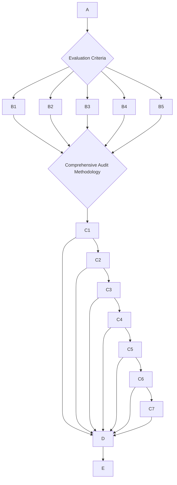

| Audit Firm Selection Criteria | Description                                                      | Quantitative Score (1-5) | Weight | Weighted Score |
| :---------------------------- | :--------------------------------------------------------------- | :----------------------- | :----- | :------------- |
| **DeFi Experience**           | Number of high-profile DeFi audits, specific blockchain expertise. | 5                        | 0.30   | 1.5            |
| **Methodology Depth**         | Includes formal verification, economic analysis, fuzzing.        | 4                        | 0.25   | 1.0            |
| **Reputation**                | Industry standing, public exploit findings.                      | 5                        | 0.20   | 1.0            |
| **Post-Audit Support**        | Bug bounty integration, re-verification of fixes.                | 3                        | 0.15   | 0.45           |
| **Cost-Effectiveness**        | Price relative to scope and quality.                             | 4                        | 0.10   | 0.4            |
| **Total Weighted Score**      |                                                                  |                          | **1.00** | **4.35**       |

### Q20: A blockchain-based trading platform needs to reconcile on-chain transaction data with traditional financial records for audit purposes (e.g., SOX compliance). What are the technical and procedural challenges, and how would you address them?

**Difficulty**: Advanced  
**Type**: Audit & Evidence, Compliance Modeling

**Key Insight**: This question highlights the integration challenges between novel blockchain data and established financial reporting standards, requiring a blend of technical mapping and procedural controls.

**Answer**:
Reconciling on-chain transaction data from a blockchain-based trading platform with traditional financial records for audit purposes, especially for SOX compliance, presents significant technical and procedural challenges. SOX (Sarban

**Answer (Continuation of Q20):**

A blockchain-based trading platform needs to reconcile on-chain transaction data with traditional financial records for audit purposes, especially for SOX compliance, which presents significant technical and procedural challenges. SOX (Sarbanes-Oxley Act) mandates strong internal controls over financial reporting (ICFR), accurate financial data, and robust audit trails and record retention.

**Technical Challenges**:
1.  **Data Incompatibility and Normalization**: Raw on-chain data (transaction hashes, event logs, block timestamps) is structurally different from conventional double-entry accounting systems (debits, credits, accounts). Each blockchain operates with unique data formats, fee models, and confirmation patterns, complicating data aggregation across multiple chains.
2.  **Real-time vs. Batch Processing**: Blockchain transactions settle in seconds, demanding real-time reconciliation. Traditional ERP and accounting systems are often designed for batch processing, leading to delays and discrepancies.
3.  **Data Volume and Velocity**: High transaction volumes and continuous data streams from blockchain can overwhelm legacy systems and manual reconciliation processes.
4.  **Proof of Ownership and Valuation**: Verifying actual digital asset ownership and accurately valuing highly volatile crypto assets at transaction time or period-end for financial reporting (e.g., Fair Market Value) is complex. This is critical for SOX Section 302 and 404, which require accurate financial statements.
5.  **Audit Trail Linkage**: Establishing a clear, verifiable link between an on-chain transaction hash and a specific off-chain financial record entry is technically intricate.

**Procedural Challenges**:
1.  **Control Ownership in Decentralized Systems**: In decentralized finance (DeFi) platforms, assigning clear accountability and control ownership for compliance (e.g., who is responsible for a smart contract's financial logic?) can be ambiguous. SOX Section 404 requires management to attest to the effectiveness of ICFR.
2.  **Regulatory Uncertainty**: The evolving regulatory landscape for digital assets creates ambiguity regarding specific compliance requirements for various crypto activities.
3.  **Third-Party Vendor Risk**: Relying on third-party node providers, custodians, or indexing services introduces additional layers of risk regarding data accuracy, availability, and security. SOC2 Type I/II reports are often sought for these vendors, but not all provide them.
4.  **Auditor Competency**: Many traditional auditors lack the specialized knowledge of blockchain technology, cryptography, and smart contract logic required to effectively audit these systems.

**Addressing the Challenges**:
1.  **Automated Reconciliation Platforms**: Implement specialized, real-time reconciliation software (e.g., Bitwave, Cryptio) that integrates directly with blockchain nodes (via RPC calls) and traditional ERPs. These platforms automate data ingestion, normalization, and mapping of on-chain events to off-chain ledger entries, reducing manual effort and errors.
2.  **Robust Data Architecture**:
    *   **Direct On-Chain Data Access**: Prioritize direct RPC calls to blockchain nodes for maximal accuracy and completeness, rather than relying solely on indexed data or third-party APIs which may lack granularity.
    *   **Event-Driven Integration**: Utilize middleware and event streaming (e.g., Solace event broker) to publish on-chain events to off-chain systems in real-time, triggering automated accounting entries.
    *   **Data Normalization Layer**: Develop a robust data transformation layer that decodes raw blockchain events (transaction logs, event emissions) into standardized, audit-ready financial data structures.
3.  **Enhanced Internal Controls for Digital Assets**:
    *   **Segregation of Duties (SoD)**: Enforce SoD for private key management, transaction initiation, and approval processes, aligning with SOX Section 404.
    *   **Access Controls**: Implement strict role-based access control (RBAC) for all systems interacting with digital assets and financial records, both on-chain (e.g., multi-sig wallets) and off-chain.
    *   **Data Validation Framework**: Cross-verify data from multiple sources (blockchain, internal systems, custodians) using automated data validation checks to identify and rectify discrepancies promptly.
    *   **Immutable Audit Logs**: Ensure all reconciliation activities, approvals, and system changes generate immutable, timestamped audit logs across both blockchain and traditional systems. These logs must capture who, what, when, and why.
4.  **Cross-Functional Coordination (RACI)**: Establish a RACI matrix (Responsible, Accountable, Consulted, Informed) involving Legal, Compliance, Security, Architecture, Product, Executive, and Audit teams to define roles, responsibilities, and communication protocols for the reconciliation process. Executive sponsorship is critical for resource allocation and strategic alignment.
5.  **Continuous Monitoring & Reporting**: Implement continuous monitoring tools (e.g., Splunk, ServiceNow GRC) to detect anomalies, track control effectiveness, and provide real-time dashboards for audit readiness. Regular internal audits should also be performed.

By adopting these technical and procedural strategies, blockchain-based trading platforms can build a robust, SOX-compliant reconciliation process that ensures financial data integrity, transparency, and auditability in the evolving digital asset landscape.

**Supporting Artifacts**:

| Artifact Type | Example | Key Formulas |
|---------------|---------|--------------|
| **Audit** | SOX-Compliant Reconciliation Workflow | \\ (Reconciliation Accuracy Rate = \frac{\text{Number of Correctly Reconciled Transactions}}{\text{Total Reconciled Transactions}} \times 100\%) |

```mermaid
flowchart TD
    A --> B{Data Ingestion & Decoding (RPC, Event Streams)}
    B --> C{Data Normalization & Mapping Layer}
    C --> D{Automated Reconciliation Engine}
    D -- Matches --> E
    D -- Discrepancies --> F{Exception Handling & Investigation}
    F -- Remediation --> D

    E --> G
    F --> G

    H --- I
    H & I --> D
    H & I --> F
    H & I --> G
    B & C & D & E & F & G --> K{Continuous Monitoring & Alerting (GRC, SIEM)}
    K --> L
```

| Challenge                               | Impact on SOX Compliance               | Technical/Procedural Solution                         | SOX Section Addressed      |
| :-------------------------------------- | :------------------------------------------------------ | :---------------------------------------------------- | :------------------------- |
| **Data Incompatibility**        | Risk of inaccurate financial reporting                  | Automated data normalization, event-driven middleware | 302, 404                   |
| **Real-time vs. Batch Processing** | Delays in financial reporting, audit inefficiency       | Real-time reconciliation platforms, continuous monitoring | 302, 409                   |
| **Control Ownership Ambiguity** | Lack of clear accountability for ICFR                 | Cross-functional RACI, explicit data controller | 302, 404                   |
| **Evidence Linkage**             | Difficulty in establishing verifiable audit trail       | Correlated on-chain events & off-chain logs, cryptographic commitments | 404, 802                   |
| **Third-Party Risk**            | Compromised data integrity or availability              | Vendor due diligence, SOC reports, internal controls over vendor data | 404                        |

---

## Topic 5: Architectural Translation

### Q21: As a Smart Contract Engineer, how do you translate DORA's operational resilience requirements (e.g., ICT risk management, incident reporting) into concrete smart contract architecture and deployment strategies?

**Difficulty**: Advanced  
**Type**: Architectural Translation, Risk & Threat Analysis

**Key Insight**: This question assesses the ability to interpret high-level regulatory mandates into low-level architectural and deployment decisions for smart contracts, integrating resilience and incident management.

**Answer**:
DORA (Digital Operational Resilience Act) imposes stringent requirements on financial entities regarding ICT risk management, incident reporting, and digital operational resilience. As a Smart Contract Engineer, translating these high-level mandates into concrete smart contract architecture and deployment strategies is crucial. This involves embedding resilience, observability, and incident preparedness directly into the code and infrastructure.

**ICT Risk Management (DORA Articles 6-15)**:
1.  **Secure by Design**: Proactively identify, assess, and mitigate ICT risks at every stage of smart contract development. This translates to:
    *   **Thorough Code Audits**: Mandate multiple independent security audits, fuzz testing, and formal verification for critical smart contracts before deployment.
    *   **Immutable Defaults**: For core logic, prefer immutable contracts to reduce post-deployment risk, but balance with upgradeability for patches.
    *   **Minimization of Attack Surface**: Implement the principle of least privilege in smart contract design, restricting access to sensitive functions.
    *   **Oracle Resilience**: Utilize decentralized oracle networks (e.g., Chainlink) with time-weighted average prices (TWAP) and multiple data sources to mitigate price manipulation risks.
2.  **Robust Architecture**:
    *   **Modular Design**: Break down complex protocols into smaller, independently auditable smart contracts to limit the blast radius of a vulnerability.
    *   **Circuit Breakers & Pause Mechanisms**: Implement emergency pause functions, activated by a pre-defined multi-signature governance committee, for critical protocol functions to contain ongoing attacks or catastrophic failures.
    *   **Redundancy for Off-Chain Components**: For off-chain infrastructure supporting the dApp (e.g., RPC nodes, indexers, frontends), ensure high availability through multi-region deployment, load balancing, and failover mechanisms.

**Incident Reporting and Response (DORA Articles 17-22)**:
1.  **Comprehensive On-Chain Observability**: Design smart contracts to emit rich, granular **events** for all critical state changes, errors, and administrative actions. These events are the immutable foundation for incident detection and forensic analysis.
2.  **Real-Time Monitoring & Alerting**: Implement continuous monitoring solutions (e.g., Splunk Enterprise Security for off-chain logs, specialized blockchain analytics tools for on-chain events) to detect anomalies, suspicious activities, or deviations from expected behavior in real-time. Automated alerts must notify the Incident Response Team immediately.
3.  **Audit Trail Integration**: Ensure that all on-chain events are correlated with off-chain logs (e.g., oracle data feeds, administrative actions, infrastructure changes) in a centralized, tamper-evident logging system. This comprehensive audit trail is vital for DORA's incident reporting requirements, enabling root cause analysis and demonstrating compliance.
4.  **Defined Incident Response Plan**: Develop clear, pre-defined incident response playbooks for various smart contract exploit scenarios, including communication protocols (internal and external), remediation steps, and regulatory notification procedures.

By integrating these controls, smart contract architecture moves beyond basic functionality to embody the operational resilience and accountability demanded by DORA.

**Supporting Artifacts**:

| Artifact Type | Example | Key Formulas |
|---------------|---------|--------------|
| **Architecture** | DORA-Compliant Smart Contract Architecture | `Operational Resilience Score = (MTTD + MTTR) / (Number of Resilience Controls)` |

```mermaid
graph TD
    A --> B{DORA Requirements}
    B --> B1
    B1 --> C
    B1 --> D
    C --> C1
    C --> C2
    C --> C3
    D --> D1
    D --> D2
    D3

    C1 & C2 & C3 & D1 & D2 & D3 --> E
    E --> F
    F --> G
    G --> H
    H --> I
    I --> J
```

| DORA Requirement (Article)                     | Smart Contract Architectural Pattern / Strategy                | Technical Control/Mechanism                      | Stakeholder Ownership          |
| :--------------------------------------------- | :------------------------------------------------------------- | :----------------------------------------------- | :----------------------------- |
| **ICT Risk Management (Art. 6)**        | Secure by Design, Threat Modeling                              | Formal Verification, Audits, Least Privilege     | Architecture, Security         |
| **Incident Management (Art. 17)**       | Comprehensive Event Emission, Real-time Monitoring             | Granular `emit` events, blockchain analytics     | Architecture, IT Operations    |
| **Digital Operational Resilience (Art. 12)**| Circuit Breakers, Decentralized Oracles                        | Emergency pause, TWAP oracles, multi-sig governance | Architecture, Product, Security|
| **ICT Third-Party Risk (Art. 28)**       | Due diligence on oracle providers, API gateways for external services | Vendor risk assessments, API security controls   | Compliance, Security, Legal    |
| **Audit & Testing (Art. 24)**           | Penetration Testing, Source Code Review                        | Bug bounty programs, continuous security testing | Security, Audit                |

### Q22: You are optimizing a DeFi protocol's smart contracts for gas efficiency. How do you balance this with the need for transparency and auditability, which are critical for regulatory compliance and user trust?

**Difficulty**: Intermediate  
**Type**: Architectural Translation, Compliance Modeling

**Key Insight**: This question explores the inherent trade-offs between technical optimization (gas efficiency) and non-functional requirements (transparency, auditability, compliance), which are often in tension in smart contract design.

**Answer**:
Optimizing a DeFi protocol's smart contracts for gas efficiency often creates a tension with the need for transparency and auditability, both critical for regulatory compliance (e.g., FATF, MiCA) and user trust. Engineers must balance these by making conscious trade-offs and employing specific architectural patterns.

1.  **Gas-Optimized Transparency (Event Emissions)**: The primary mechanism for on-chain transparency and auditability without incurring high gas costs is through **event emissions**. Instead of storing extensive data on-chain within contract storage (which is expensive), smart contracts can `emit` detailed events for all critical actions (e.g., `Deposit`, `Withdraw`, `Swap`, `Vote`). These events are stored in transaction logs and are significantly cheaper than storage operations. They provide an immutable, auditable record of "who did what, when" without inflating the gas cost of the contract's core logic.
    *   **Trade-off**: While events are transparent, they are not directly accessible by other smart contracts for on-chain logic. This means if another contract needs this historical data, it would typically rely on off-chain indexing services.
2.  **Data Minimization on-chain**: Only store essential data (e.g., user balances, critical configurations) in contract storage. Less critical or frequently changing data can be stored off-chain and linked via cryptographic hashes on-chain for integrity verification. This reduces gas costs associated with storage writes and updates.
3.  **Modular Contract Design**: Break down complex logic into smaller, focused contracts. While this might slightly increase deployment gas costs, it allows for better code organization, easier auditing of individual components, and potentially more efficient execution paths for specific functions.
4.  **Use of Immutable Libraries**: When possible, use immutable libraries for shared, gas-optimized functions. This prevents code duplication and leverages pre-audited, efficient code.
5.  **Off-Chain Indexing and Analytics**: To provide user-friendly transparency and regulatory reporting, invest in robust off-chain indexing infrastructure. Services like QuickNode or custom indexers can process raw blockchain events, decode them, and store them in queryable databases. These indexed data can then power analytics dashboards for users, regulatory reporting tools, and continuous audit monitoring, satisfying compliance teams without burdening the blockchain.
6.  **Formal Verification for Critical Paths**: For gas-optimized critical paths, employ formal verification to mathematically prove their correctness and security. This builds trust even if the code is highly optimized and potentially less "readable" than verbose, unoptimized code.

The balance is struck by leveraging event emissions for cheap on-chain transparency, off-chain indexing for rich data accessibility, and rigorous auditing/formal verification to ensure the integrity of optimized code.

**Supporting Artifacts**:

| Artifact Type | Example | Key Formulas |
|---------------|---------|--------------|
| **Architecture** | Gas Optimization vs. Auditability Trade-offs | `Gas Efficiency Index = (Optimal Gas Cost / Actual Gas Cost) × 100%` |

```mermaid
graph TD
    A --> B{Smart Contract Design Decision}
    B -- Optimize Gas --> C
    B -- Maximize Auditability/Transparency --> D

    C --> C1
    C1 --> C2
    C2 --> C3
    D --> D1
    D1 --> D2
    D2 --> D3

    C1 & C2 & C3 -- Balanced by --> E
    D1 & D2 & D3 -- Supported by --> E
    E --> F
```

| Design Choice                          | Gas Efficiency Impact                                 | Transparency & Auditability Impact                  | Regulatory/User Trust Impact      |
| :------------------------------------- | :---------------------------------------------------- | :---------------------------------------------------- | :-------------------------------- |
| **Emit Events (vs. Storage)** | Low gas cost (transaction log data)                   | High transparency, immutable audit trail   | Excellent for compliance, user verifiability |
| **Minimal On-Chain Storage** | Reduced gas for state writes                          | Requires off-chain linkage for full context           | Potential challenge for full transparency, mitigated by hashes |
| **Off-Chain Indexing**        | No direct gas cost to smart contract                  | Enables rich, queryable historical data for users/auditors | High for user experience and compliance reporting |
| **Complex On-Chain Logic**             | Potentially higher gas, if not optimized carefully    | More difficult to audit, higher risk of bugs          | Lower trust, higher compliance risk |
| **Formal Verification**       | No direct gas impact (pre-deployment)                 | Mathematically proven correctness for critical paths | Highest trust, strong compliance evidence |

### Q23: How would you design and implement a robust Role-Based Access Control (RBAC) system within a smart contract for a lending protocol, ensuring both security and compliance with SOX segregation of duties (SoD) requirements?

**Difficulty**: Intermediate  
**Type**: Architectural Translation, Security

**Key Insight**: This question assesses the candidate's understanding of how to implement traditional security and compliance principles (RBAC, SoD) in a decentralized environment using smart contracts.

**Answer**:
Designing and implementing a robust Role-Based Access Control (RBAC) system within a smart contract for a lending protocol, while ensuring security and compliance with SOX Segregation of Duties (SoD) requirements, is critical. SOX mandates SoD to prevent a single individual from having control over an entire transaction process, thereby reducing fraud and error.

**Smart Contract Architecture for RBAC/SoD**:
1.  **Define Roles**: Explicitly define distinct administrative and operational roles within the smart contract (e.g., `Owner`, `Governor`, `RiskManager`, `OracleUpdater`, `Pauser`, `LiquidationOperator`).
2.  **Granular Permissions**: Each role will be granted a specific, minimal set of permissions (functions it can call) necessary for its duties (Principle of Least Privilege). For example:
    *   `Owner` (governance role): Can propose upgrades, change critical parameters (e.g., interest rate models), but cannot directly initiate liquidations.
    *   `RiskManager`: Can adjust risk parameters within pre-defined ranges, trigger pause functions.
    *   `LiquidationOperator`: Can initiate liquidations based on oracle feeds, but cannot modify parameters.
3.  **Multi-Signature (Multi-Sig) Wallets for Critical Roles**: Assign critical roles (e.g., `Owner`, `Governor`, `Pauser`) to multi-signature wallets. This requires multiple authorized individuals to approve an action, preventing a single point of compromise or collusion. For instance, a protocol upgrade might require 3 out of 5 predefined `Governor` signers.
4.  **Time-Locks for Sensitive Operations**: Implement time-locks for highly sensitive actions (e.g., contract upgrades, significant parameter changes). This introduces a delay between proposal and execution, providing a window for detection and potential intervention by the community or other governance bodies if a malicious action is detected.
5.  **Access Control Modifiers**: Use Solidity modifiers (e.g., `onlyOwner`, `onlyRiskManager`) to restrict function execution to authorized roles. These modifiers should be clearly defined and thoroughly audited.
6.  **Events for Access Changes**: All changes to role assignments or multi-sig configurations must emit clear, auditable events on-chain (e.g., `RoleGranted(address indexed user, bytes32 indexed role)`, `GuardianAdded(address indexed guardian)`). This provides transparency and an immutable audit trail for governance changes, crucial for SOX Section 802 record retention.
7.  **Off-Chain Identity Management**: While on-chain roles are pseudonymous (wallet addresses), an off-chain identity management system (e.g., integrated with an enterprise directory) would map these wallet addresses to real-world individuals for internal accountability and compliance.

**Compliance with SOX SoD**:
*   **Preventing Conflicting Duties**: Design roles such that no single role (or person mapped to a role) can both initiate and approve a critical transaction, or access conflicting sets of data/functions that could lead to fraud. For example, the `OracleUpdater` cannot also be the `LiquidationOperator`.
*   **Auditability**: The on-chain events and off-chain logs of role assignments and function calls provide a transparent and immutable audit trail to verify SoD enforcement. External auditors can review these logs to ensure that no individual has bypassed controls.
*   **Continuous Monitoring**: Implement continuous monitoring of on-chain governance activity and role assignments, alerting for any deviations or violations of SoD principles.

This layered approach integrates cryptographic security features of blockchain with traditional governance and compliance best practices, ensuring a robust and auditable access control system.

**Supporting Artifacts**:

| Artifact Type | Example | Key Formulas |
|---------------|---------|--------------|
| **Architecture** | Smart Contract RBAC Design | `SoD Violation Rate = (Detected SoD Violations / Total Audited Transactions) × 100%` |

```mermaid
graph TD
    A -- Assigns Roles --> B{Smart Contract RBAC System}
    B --> C(Role: OracleUpdater)
    B --> D(Role: RiskManager)
    B --> E(Role: Pauser)
    B --> F(Role: LiquidationOperator)

    C -- Updates Oracle Data --> G{Function: updatePrice()}
    D -- Sets Risk Parameters --> H{Function: setInterestRate()}
    E -- Activates Emergency Pause --> I{Function: pause()}
    F -- Executes Liquidations --> J{Function: liquidate()}

    G -- Restricted by --> K(Access Control Modifier: onlyOracleUpdater)
    H -- Restricted by --> L(Access Control Modifier: onlyRiskManager)
    I -- Restricted by --> M(Access Control Modifier: onlyPauser)
    J -- Restricted by --> N(Access Control Modifier: onlyLiquidationOperator)

    K & L & M & N -- Enforce --> P(SoD Requirements)
    P -- Monitored via --> Q(On-chain Events & Off-chain Logs)
```

| Role / Function               | Permissions Granted                                     | SOX SoD Consideration                             | Technical Control                  |
| :---------------------------- | :------------------------------------------------------ | :------------------------------------------------ | :--------------------------------- |
| **Owner (Governance)**        | Propose upgrades, critical parameter changes   | Cannot directly execute liquidations or fund transfers. | Multi-sig wallet, time-locks |
| **OracleUpdater**             | Update price feeds from external sources       | Cannot initiate trades or liquidations.           | `onlyOracleUpdater` modifier       |
| **RiskManager**               | Adjust risk parameters (e.g., collateral ratios)        | Cannot directly operate the protocol or manage funds. | `onlyRiskManager` modifier         |
| **Pauser**                    | Activate emergency pause for the protocol      | Cannot modify contract logic or transfer funds.   | Multi-sig for `pause()` activation |
| **LiquidationOperator**       | Execute liquidations based on market conditions         | Cannot update oracles or set risk parameters.     | `onlyLiquidationOperator` modifier |

### Q24: A new modular smart contract architecture is proposed for a complex DeFi protocol. How does this approach enhance regulatory adaptability and what architectural patterns would you use to ensure future compliance with unknown regulations?

**Difficulty**: Advanced  
**Type**: Architectural Translation, Remediation & Evolution

**Key Insight**: This question assesses the candidate's forward-thinking approach to smart contract design, specifically focusing on how architectural choices can build in flexibility for future regulatory changes in an uncertain environment.

**Answer**:
A new modular smart contract architecture significantly enhances regulatory adaptability for a complex DeFi protocol, offering flexibility to respond to unforeseen compliance changes, which is critical in an evolving regulatory landscape like MiCA or upcoming US frameworks. Traditional monolithic smart contracts are difficult and costly to modify or replace, often requiring full redeployment and token migration.

**How Modular Architecture Enhances Adaptability**:
1.  **Isolated Impact**: Regulatory changes often target specific functionalities (e.g., KYC for certain transactions, new stablecoin reserve rules). In a modular design, only the affected module needs to be upgraded or replaced, rather than the entire protocol. This minimizes disruption, reduces audit scope for changes, and accelerates adaptation.
2.  **Focused Auditing**: Smaller, independent modules are easier to audit and formally verify, making it quicker and cheaper to ensure compliance of specific components when regulations shift.
3.  **Faster Development & Deployment**: Teams can develop and deploy compliant updates to individual modules in parallel, speeding up the overall response time to new mandates.

**Architectural Patterns for Future Compliance**:
1.  **Proxy Upgradeability Pattern**: This is foundational. A proxy contract holds the user's address and state, while the implementation logic resides in separate logic contracts. Upgrading the protocol involves deploying a new logic contract and updating the proxy to point to it. This allows for bug fixes, feature additions, and *regulatory adjustments* without forcing users to migrate assets.
    *   **Delegated Governance**: Critical proxy upgrades should be controlled by a decentralized governance mechanism (e.g., DAO voting via multi-sig wallet) with time-locks, providing transparency and preventing unilateral, potentially non-compliant, changes.
2.  **Strategy Pattern**: Use interfaces to define common functionalities, and then allow different "strategy" contracts (e.g., for lending pools, oracle feeds, or collateral types) to implement these interfaces. When a regulation changes a specific strategy (e.g., a new liquidity mining rule), a new strategy contract can be deployed and dynamically swapped in via the main protocol contract, without affecting unrelated logic.
    *   **Example**: If MiCA introduces new rules for stablecoin collateral, a `StablecoinStrategy` module could be updated, leaving the core lending logic intact.
3.  **External Parameterization**: Design contracts to externalize key parameters (e.g., interest rates, liquidation thresholds, fee structures, compliance thresholds) into separate, auditable configuration contracts or governance-controlled variables. This allows rapid adjustment to economic or regulatory parameters without redeploying logic.
    *   **Compliance Gates**: Implement configurable "compliance gates" as parameters. For example, a boolean `isKYCRequired` flag for certain transaction types, or an `amlThreshold` that can be adjusted by governance.
4.  **Interface Segregation Principle**: Design smart contracts with small, focused interfaces. This ensures that changes to one part of the protocol do not unnecessarily affect other, unrelated components, making it easier to integrate new compliance features.
5.  **Role-Based Access Control (RBAC)**: Implement a granular RBAC system where different functions are permissioned to specific roles (e.g., `Pauser`, `OracleUpdater`, `ComplianceOfficer`). This allows the assignment of new compliance-related roles or the modification of existing permissions in response to regulatory mandates, without changing core business logic.

This proactive architectural approach transforms smart contracts from rigid, immutable entities into adaptable, resilient systems capable of evolving with the dynamic regulatory environment, turning compliance into a competitive advantage.

**Supporting Artifacts**:

| Artifact Type | Example | Key Formulas |
|---------------|---------|--------------|
| **Architecture** | Modular Smart Contract Architecture | `Regulatory Adaptation Time = (Deployment Time for Module) / (Number of Affected Modules)` |

```mermaid
graph TD
    A --> B{Implementation Logic (V1)}
    A --> C{Implementation Logic (V2)}

    B -- Upgrade Path --> C

    subgraph Module 1: Lending Pool
        L1
        L2
        L1 -- Upgradeable via Proxy --> L2
    end

    subgraph Module 2: Oracle Feed
        O1
        O2
        O1 -- Upgradeable via Proxy --> O2
    end

    subgraph Module 3: Governance
        G1
        G2
        G1 -- Upgradeable via Proxy --> G2
    end

    A -- Calls --> L1
    A -- Calls --> O1
    A -- Calls --> G1
```

| Architectural Pattern          | Regulatory Adaptability Benefit                                     | Compliance Use Case (Example)                           | Development & Audit Impact       |
| :----------------------------- | :------------------------------------------------------------------ | :-------------------------------------------------------- | :------------------------------- |
| **Proxy Upgradeability**| Update logic without breaking user state/asset migration.           | Adapting to new AML/KYC rules or MiCA stablecoin changes. | Reduced audit scope for changes, faster deployment. |
| **Strategy Pattern**           | Swap in new implementations for specific functionalities.           | Implementing new interest rate models as per regulatory caps. | Isolated development, less risk. |
| **External Parameterization**  | Configure critical values without code changes.                     | Adjusting risk parameters or compliance thresholds dynamically. | Rapid response, no re-auditing logic. |
| **Modular Design**  | Isolate impact of changes, easier to audit components.              | Updating a specific collateral management module.         | Improved auditability, faster dev cycles. |
| **RBAC**              | Flexible assignment of new compliance-related roles.                | Granting a `ComplianceOfficer` role to pause sensitive functions. | Enhanced governance, fine-grained control. |

### Q25: Your Security team is designing the key management strategy for a decentralized lending protocol. How would you architect this, balancing cryptographic security, operational efficiency, and compliance with DORA and SOX (e.g., access controls, audit trails)?

**Difficulty**: Advanced  
**Type**: Architectural Translation, Security

**Key Insight**: This question assesses the ability to design a comprehensive key management strategy for decentralized systems, integrating security best practices with regulatory requirements for operational resilience and financial control.

**Answer**:
Architecting a robust key management strategy for a decentralized lending protocol requires a delicate balance between cryptographic security, operational efficiency, and compliance with DORA (Digital Operational Resilience Act) and SOX (Sarbanes-Oxley Act) access controls and audit trail requirements.

**Key Management Goals**:
1.  **Security**: Protect private keys from unauthorized access, loss, or compromise.
2.  **Operational Efficiency**: Enable smooth, timely execution of necessary administrative and protocol functions.
3.  **Compliance**: Satisfy DORA's ICT risk management (Art. 6) and incident reporting (Art. 17), and SOX's access controls (Section 404) and audit trails (Section 802).

**Architectural Design for Key Management**:
1.  **Multi-Signature (Multi-Sig) Wallets for Critical Protocol Keys**: All private keys that control significant protocol functions (e.g., protocol upgrades, treasury fund movements, emergency pause mechanisms, critical parameter changes) must be secured by multi-signature wallets.
    *   **SoD Compliance**: The signers of these multi-sigs would be individuals from different departments (e.g., Security, Product, Legal), enforcing SOX Segregation of Duties (SoD). No single person can unilaterally execute a critical action.
    *   **Key Custody**: Multi-sig participants would ideally use hardware security modules (HSMs) or secure cold storage for their individual private keys, reducing online exposure.
2.  **Hierarchical Key Structure (HMAC)**: Implement a hierarchical deterministic (HD) wallet structure for operational keys (e.g., for automated liquidations or gas fee payments). This allows for easy key derivation and rotation, reducing exposure if a derived key is compromised.
3.  **Automated Key Rotation & Lifecycle Management**: For hot wallets or operational keys, implement automated key rotation policies. A robust key lifecycle management system would handle key generation, distribution, storage, usage, rotation, backup, and destruction in a secure and auditable manner.
4.  **Hardware Security Modules (HSMs)**: For highly sensitive master keys (e.g., those controlling the multi-sig itself or a protocol's main treasury), use dedicated, FIPS 140-2 certified HSMs. HSMs provide a tamper-resistant environment for cryptographic operations, significantly enhancing security.
5.  **Threshold Cryptography / Distributed Key Generation (DKG)**: For the ultimate level of decentralization and security, explore threshold cryptography. This technique splits a private key into multiple shares, requiring a "threshold" number of shares to reconstruct or sign, without any single party ever holding the full key. This enhances resilience against insider threats.

**DORA & SOX Compliance Integration**:
1.  **Access Controls**: Implement strict Role-Based Access Control (RBAC) around key management systems and multi-sig signers. Regular access reviews are essential, aligning with DORA's ICT risk management and SOX Section 404.
2.  **Immutable Audit Trails**: Every key management event—key generation, access, usage, rotation, and destruction—must be meticulously logged in a tamper-evident audit trail. All multi-sig approvals and rejections, along with their associated transaction hashes, must be recorded on-chain via events and off-chain in a centralized SIEM (e.g., Splunk). This satisfies DORA's incident reporting (for unauthorized access attempts) and SOX Section 802 record retention.
3.  **Incident Response Plan**: Develop a specific incident response plan for key compromise scenarios, including key revocation, rotation, and notification procedures, aligning with DORA's incident reporting requirements.
4.  **Regular Audits**: Subject the entire key management system and its procedures to regular, independent security and compliance audits to verify the effectiveness of controls.

By implementing these strategies, the key management architecture ensures that critical protocol assets are protected, operational continuity is maintained, and all relevant regulatory obligations are met.

**Supporting Artifacts**:

| Artifact Type | Example | Key Formulas |
|---------------|---------|--------------|
| **Architecture** | Decentralized Key Management Architecture | `Key Compromise Likelihood = (Vulnerability Score × Attack Surface) / (Number of Security Controls)` |

```mermaid
graph TD
    A --> B{Multi-Signature Wallet}
    B --> C(Signer 1 Key)
    B --> D(Signer 2 Key)
    B --> E(Signer N Key)

    C -- Secured by --> C1{Hardware Security Module / Cold Storage}
    D -- Secured by --> D1{Hardware Security Module / Cold Storage}
    E -- Secured by --> E1{Hardware Security Module / Cold Storage}

    F --> F1{Automated Key Management System}
    F1 -- Secured by --> F2{HSM / Secure Vault}

    F1 --> F3(Key Rotation)
    F1 --> F4(Key Usage Logs)
    F1 --> F5(Access Controls)

    B & C1 & D1 & E1 & F2 & F3 & F4 & F5 --> G
    G --> H
```

| Key Management Control         | Security Benefit                                       | DORA (Operational Resilience) Alignment       | SOX (Financial Reporting) Alignment  |
| :----------------------------- | :----------------------------------------------------- | :------------------------------------------------------- | :--------------------------------------------- |
| **Multi-Signature Wallets**| Prevents single point of compromise, enforces SoD.     | Enhances resilience against insider threats.             | Enforces SoD for critical financial actions.   |
| **HSMs / Cold Storage**| Protects keys from cyber/physical theft.               | Strengthens ICT security, prevents unauthorized access.  | Safeguards digital assets, critical for Section 404. |
| **Automated Key Rotation**| Reduces impact of long-term key exposure.              | Reduces ICT risk, enhances threat mitigation.            | Supports data integrity and auditability.      |
| **Immutable Audit Logs**| Provides verifiable record of all key actions.         | Essential for incident reporting and root cause analysis. | Crucial for Section 802 record retention.      |
| **RBAC on Key Systems**    | Limits key access to authorized personnel.             | Reduces human error and malicious insider risk.          | Direct compliance with Section 404 access controls. |

---

## Topic 6: Remediation & Evolution

### Q26: Your DeFi protocol has accumulated significant "compliance debt" due to rapid development and evolving regulations. How would you, as an Executive, strategize to address this, prioritizing remediation while minimizing business disruption?

**Difficulty**: Advanced  
**Type**: Remediation & Evolution, Executive

**Key Insight**: This question assesses the executive's strategic thinking for managing technical debt with a compliance overlay, demanding prioritization, resource allocation, and a forward-looking roadmap.

**Answer**:
As an Executive, addressing significant "compliance debt" due to rapid development and evolving regulations in a DeFi protocol requires a strategic, phased remediation approach that prioritizes risk reduction while minimizing business disruption. Compliance debt, like technical debt, incurs ongoing costs (e.g., manual workarounds, increased audit scrutiny) and carries the risk of substantial penalties if unaddressed.

My strategy would involve:
1.  **Comprehensive Assessment & Prioritization**:
    *   **Quantify Debt**: Work with Legal, Compliance, and Security to identify and quantify the compliance gaps across the protocol, mapping them to specific regulatory articles (e.g., MiCA, DORA, FATF, US SEC guidance). Estimate the potential financial penalties (fines, lawsuits) for each non-compliance area.
    *   **Risk-Based Prioritization**: Prioritize remediation efforts based on a "Risk-Impact-Likelihood" matrix. Focus on areas with the highest potential for financial loss, reputational damage, or severe regulatory penalties (e.g., AML/CFT violations, critical operational resilience gaps).
    *   **Cost-Benefit Analysis**: For each remediation, estimate the cost of implementation versus the cost of inaction (potential fines, operational inefficiencies). This informs budget allocation.
2.  **Establish a Dedicated "Compliance Strike Team"**: Assemble a cross-functional team (Legal, Compliance, Architecture, Security, Product) with clear mandates and dedicated resources, operating with a lean, agile methodology. This team would be responsible for fast-tracking high-priority remediation.
3.  **Phased Remediation Roadmap**: Develop a multi-phase roadmap, integrating remediation tasks into existing development sprints to minimize disruption.
    *   **Phase 1 (Immediate - 3-6 months)**: Address critical, high-risk compliance gaps (e.g., implementing emergency pause mechanisms, strengthening multi-sig governance for treasury, basic DORA ICT risk management controls). This might involve short-term, manual workarounds while automated solutions are developed.
    *   **Phase 2 (Mid-term - 6-12 months)**: Implement automated solutions for ongoing compliance (e.g., integrating zk-KYC, enhancing on-chain event logging, building robust off-chain data pipelines for regulatory reporting). Focus on achieving SOC2 Type II or ISO 27001 certification for off-chain components to demonstrate control effectiveness.
    *   **Phase 3 (Long-term - 12-24 months)**: Optimize for continuous compliance (e.g., modular smart contract architecture for future adaptability, AI-driven compliance monitoring, investment in formal verification for critical upgrades).
4.  **Transparency & Communication**: Maintain open communication with regulators, investors, and the community about the remediation efforts and roadmap. This builds trust and potentially earns goodwill, demonstrating a proactive stance on compliance.
5.  **Technological Leverage**: Invest in GRC platforms (e.g., ServiceNow GRC, Vanta) to automate evidence collection, continuous monitoring, and control testing, significantly reducing manual effort and preventing future compliance debt accumulation.

This strategy treats compliance not as a burden, but as an investment in sustainable growth and competitive differentiation, positioning the protocol as a trustworthy leader in the Web3 space.

**Supporting Artifacts**:

| Artifact Type | Example | Key Formulas |
|---------------|---------|--------------|
| **Remediation** | Compliance Debt Remediation Roadmap | \\ (Compliance Debt = \frac{\text{Total Remediation Cost}}{\text{Total Protocol Development Cost}} \times 100\%) |

```mermaid
gantt
    dateFormat  YYYY-MM-DD
    title Compliance Debt Remediation Roadmap
    section Phase 1: Immediate Remediation (High Risk)
        Risk Assessment & Prioritization :done, 2025-01-01, 2025-01-31
        Emergency Pause/Multi-Sig Enhancement :done, 2025-02-01, 2025-03-31
        Critical DORA ICT Controls :active, 2025-03-15, 2025-06-30
    section Phase 2: Mid-Term Automation (Ongoing Compliance)
        zk-KYC Integration :active, 2025-07-01, 2025-12-31
        Automated Regulatory Reporting Pipelines :2025-08-01, 2026-01-31
        SOC2/ISO 27001 Certification :2025-09-01, 2026-06-30
    section Phase 3: Long-Term Optimization (Future Adaptability)
        Modular SC Architecture Refactor :2026-01-01, 2026-12-31
        AI-driven Compliance Monitoring :2026-03-01, 2027-03-31
        Formal Verification Integration :2026-06-01, 2027-06-30
```

| Remediation Priority | Compliance Gap (Example)                               | Estimated Remediation Cost | Potential Penalty Risk (Annual) | Primary Stakeholder |
| :------------------- | :----------------------------------------------------- | :------------------------- | :------------------------------ | :------------------ |
| **High**             | Lack of emergency pause/upgrade controls for MiCA/DORA | $200,000                    | $5,000,000                      | Architecture, Security, Executive |
| **High**             | Inadequate AML/CFT transaction monitoring (FATF)       | $350,000                    | $3,000,000                      | Compliance, Legal, Security |
| **Medium**           | Non-compliant cookie consent (ePrivacy Regulation)     | $50,000                     | $1,000,000                      | Product, Legal, Compliance |
| **Medium**           | Centralized oracle vulnerable to manipulation          | $150,000                    | $2,000,000                      | Architecture, Security |
| **Low**              | Incomplete off-chain audit logs for minor events       | $100,000                    | $500,000                        | IT Operations, Audit |

### Q27: How can a DeFi protocol establish a continuous regulatory monitoring and adaptation strategy to proactively address evolving legal frameworks (e.g., MiCA, DORA) and prevent future compliance debt?

**Difficulty**: Advanced  
**Type**: Remediation & Evolution, Compliance Modeling

**Key Insight**: This question assesses the candidate's understanding of proactive compliance management, requiring a systematic approach to anticipating and integrating regulatory changes into the protocol's lifecycle.

**Answer**:
Establishing a continuous regulatory monitoring and adaptation strategy is paramount for a DeFi protocol to proactively address evolving legal frameworks like MiCA and DORA, preventing future compliance debt. The dynamic nature of crypto regulation demands a shift from reactive compliance to "anticipatory, real-time governance".

**Strategy Components**:
1.  **Regulatory Intelligence Unit**: Form a dedicated sub-team within Legal/Compliance (or an external specialized consultancy) responsible for continuous **regulatory horizon scanning**. This involves:
    *   Monitoring legislative bodies (EU Parliament, US Congress, MAS, FATF) for proposed and enacted regulations related to crypto-assets, financial services, and data protection.
    *   Tracking guidance from supervisory authorities (ESMA, EBA, SEC, CFTC, MAS) and industry bodies (FATF).
    *   Participating in industry associations and working groups to anticipate future trends and contribute to policy discussions.
2.  **Impact Assessment Framework**: For every identified regulatory development, conduct a structured **Regulatory Impact Assessment (RIA)**. This cross-functional exercise (Legal, Compliance, Architecture, Product) would:
    *   Interpret the regulation's specific requirements (e.g., stablecoin reserve rules under MiCA, ICT incident reporting under DORA).
    *   Map these to existing protocol functionalities, smart contracts, and off-chain systems.
    *   Identify potential compliance gaps, architectural changes needed, and operational impacts.
    *   Estimate remediation effort (cost, time, resources) and prioritize based on risk.
3.  **Automated Compliance Monitoring (RegTech)**: Implement RegTech solutions (e.g., ServiceNow GRC, Vanta, dedicated blockchain analytics) to continuously monitor the protocol's adherence to compliance parameters.
    *   **Real-time Metrics**: Track key performance indicators (KPIs) like control failure rate, average time to remediate deficiencies, and automated vs. manual controls ratio.
    *   **Anomaly Detection**: Use AI-driven analytics to detect unusual on-chain transaction patterns or off-chain system behaviors that might indicate non-compliance or security breaches.
4.  **Agile Adaptation & Modular Architecture**: Integrate compliance remediation and adaptation into agile development sprints. Leverage modular smart contract architecture and upgradeability patterns (e.g., proxies, strategy pattern) to allow for targeted, efficient updates without overhauling the entire system. This makes the protocol inherently more resilient to regulatory shifts.
5.  **Cross-Functional Governance**: Maintain a strong cross-functional digital governance framework with clear RACI roles for regulatory adaptation, decision ownership, and escalation paths. Executive leadership must champion this proactive compliance culture.
6.  **Continuous Training & Skill Development**: Ensure all relevant teams (engineers, product managers, legal counsel) receive ongoing training on evolving regulations and blockchain-specific compliance solutions.

By embedding this continuous process, the protocol can remain agile, compliant, and poised for sustainable growth in the face of regulatory evolution.

**Supporting Artifacts**:

| Artifact Type | Example | Key Formulas |
|---------------|---------|--------------|
| **Remediation** | Continuous Regulatory Adaptation Loop | `Regulatory Readiness Index = (Number of Proactively Implemented Controls) / (Total Emerging Regulatory Controls)` |

```mermaid
flowchart TD
    A --> B{Identify Emerging Regulation}
    B -- New Regulation Detected --> C{Regulatory Impact Assessment (Cross-Functional)}
    C --> D(Identify Compliance Gaps)
    C --> E(Propose Architectural/Policy Changes)
    D & E --> F{Prioritize & Plan Remediation (Executive/Leadership)}
    F --> G{Implement Changes (Architecture/Product/Security)}
    G --> H{Automated Compliance Monitoring (RegTech)}
    H -- Detect Deviations --> D
    H -- Report Status --> A
```

| KPI for Regulatory Adaptation | Definition                                                  | Target                                     | Responsible Team |
| :----------------------------------- | :---------------------------------------------------------- | :----------------------------------------- | :--------------- |
| **Control Failure Rate**             | Percentage of controls failing during monitoring.           | < 1% (Critical), < 5% (Operational)        | Compliance, Security |
| **Time to Remediate Deficiency**     | Average days to resolve a compliance deficiency.            | < 30 days (High Risk), < 90 days (Medium Risk) | Architecture, Product |
| **Automated vs. Manual Controls Ratio**| Proportion of compliance controls automated.                | > 80% Automated                            | Architecture, Compliance |
| **External Auditor Reliance**        | Percentage of internal controls relied upon by external auditors. | > 90% Reliance                             | Audit, Compliance |
| **Regulatory Lead Time**             | Time from regulation proposal to internal readiness.        | > 6 months before effective date           | Legal, Executive |

### Q28: A DeFi protocol experienced a significant exploit. As a Smart Contract Engineer, outline a comprehensive post-exploit remediation and security enhancement plan, integrating lessons learned from the incident and industry best practices.

**Difficulty**: Advanced  
**Type**: Remediation & Evolution, Risk & Threat Analysis

**Key Insight**: This question assesses the candidate's ability to conduct a holistic post-incident analysis and implement a robust plan that goes beyond immediate fixes to fundamentally improve security posture.

**Answer**:
A significant exploit in a DeFi protocol necessitates a comprehensive post-exploit remediation and security enhancement plan that integrates lessons learned and industry best practices, moving beyond immediate fixes to rebuild trust and prevent recurrence.

**Phase 1: Immediate Remediation & Damage Control (already executed)**:
*   Containment (e.g., emergency pause, blacklisting exploited addresses).
*   Communication (transparency with community, investors, regulators).
*   Initial forensic analysis to understand the exploit vector and impact.

**Phase 2: Comprehensive Post-Mortem & Root Cause Analysis (Security, Architecture, Legal, Compliance)**:
1.  **Technical Root Cause**: Deep dive into the vulnerability (e.g., reentrancy, oracle manipulation, access control flaw) and how it bypassed existing safeguards.
2.  **Process Gaps**: Identify failures in SDLC (Secure Development Lifecycle) – insufficient testing, incomplete code review, lack of formal verification, or inadequate deployment procedures.
3.  **Governance Failures**: Analyze if decentralized governance mechanisms (DAO, multi-sigs) were too slow, opaque, or had single points of failure.
4.  **Tooling/Monitoring Deficiencies**: Determine if existing security tools (static analyzers, monitors) failed to detect the vulnerability or alert adequately.

**Phase 3: Security Enhancement Plan (Architecture, Security, Product, Executive)**:
1.  **Vulnerability Patching & Hardening (Technical Controls)**:
    *   **Code Remediation**: Implement the identified fixes, adhering to secure coding best practices (e.g., Checks-Effects-Interactions pattern for reentrancy, TWAP oracles).
    *   **Formal Verification**: Apply formal verification to the patched contracts and all future critical logic to mathematically prove correctness.
    *   **Gas Optimization**: Ensure remediation doesn't introduce new gas inefficiencies that could lead to DoS or higher costs.
    *   **Deployment Security**: Implement secure deployment pipelines with automated checks, multi-sig approval, and time-locks for critical changes.
2.  **Enhanced Monitoring & Alerting**:
    *   **Real-time Threat Detection**: Upgrade on-chain monitoring for specific attack patterns (e.g., flash loan movements, large fund transfers to unknown addresses). Integrate AI-driven anomaly detection for both on-chain and off-chain data.
    *   **Comprehensive Logging**: Ensure all protocol activities, including off-chain interactions and administrative actions, are captured in immutable audit logs (e.g., Splunk Enterprise Security).
3.  **Governance & Access Control Review**:
    *   **Multi-Sig & Role-Based Access Control (RBAC)**: Re-evaluate and strengthen multi-sig configurations and RBAC policies for administrative keys and critical functions, enforcing least privilege.
    *   **Decentralized Governance**: If applicable, decentralize governance further to increase resilience against single points of failure.
4.  **Independent Security Audits**: Commission multiple, top-tier independent security audits for the remediated and new code. Make these reports public (with appropriate redactions).
5.  **Bug Bounty Program**: Launch or significantly enhance a bug bounty program with attractive rewards to incentivize white-hat hackers to find residual vulnerabilities.
6.  **Incident Response Playbooks**: Update and test incident response playbooks, specifically for the type of exploit experienced. Include clear communication channels and regulator notification procedures (DORA compliance).

**Phase 4: Trust Rebuilding & Regulatory Alignment (Executive, Legal, Compliance, Product)**:
*   **Transparency**: Publish a detailed post-mortem, outlining root causes, remediation steps, and lessons learned.
*   **Regulatory Engagement**: Proactively engage with regulators, demonstrating commitment to security and compliance.
*   **User Compensation**: Develop a fair and transparent plan for user compensation (if feasible), to restore confidence.

By adopting this rigorous and transparent approach, the protocol can not only recover but emerge with a significantly stronger security posture and renewed user and regulatory trust.

**Supporting Artifacts**:

| Artifact Type | Example | Key Formulas |
|---------------|---------|--------------|
| **Remediation** | Post-Exploit Security Enhancement Roadmap | `Security Maturity Score = (Number of Implemented Best Practices) / (Total Applicable Best Practices) × 100%` |

```mermaid
gantt
    dateFormat  YYYY-MM-DD
    title Post-Exploit Remediation & Enhancement Plan
    section Phase 1: Immediate Containment
        Emergency Pause & Communication :done, 2025-10-20, 2025-10-22
        Initial Forensic Analysis :done, 2025-10-20, 2025-10-27
    section Phase 2: Post-Mortem & RCA
        Technical Root Cause Analysis :active, 2025-10-28, 2025-11-04
        Process & Governance Gap Analysis :active, 2025-10-28, 2025-11-04
    section Phase 3: Security Enhancement Plan
        Vulnerability Patching & Hardening :2025-11-05, 2025-12-15
        Formal Verification for Patches :2025-11-10, 2026-01-10
        Enhanced Monitoring & Alerting :2025-11-15, 2026-02-15
        Governance & Access Control Review :2025-12-01, 2026-02-28
        Independent Security Audits :2026-01-15, 2026-03-31
        Bug Bounty Program Launch :2026-02-01, 2026-06-01
        IR Playbook Updates :2026-01-01, 2026-02-28
    section Phase 4: Trust Rebuilding
        Public Post-Mortem Release :2025-11-15, 2025-11-30
        Regulatory Engagement Strategy :2025-11-20, 2025-12-20
        User Compensation Plan :2025-11-25, 2025-12-31
```

| Security Enhancement Category | Specific Action                                            | Best Practice/Standard Applied                      | Expected Impact |
| :---------------------------- | :--------------------------------------------------------- | :-------------------------------------------------- | :-------------- |
| **Code Integrity**            | Formal Verification of patched logic, all new code.        | SC06:2025 - Mathematical Proofs            | Zero critical logic bugs |
| **Operational Visibility**    | AI-driven anomaly detection for on-chain/off-chain data.   | NIST CSF Detect Function                     | Reduced MTTD by 50% |
| **Access Control**            | Mandatory multi-sig for all admin actions, time-locks.     | SC01:2025 - Least Privilege & Multi-Party Control | Eliminated single point of compromise |
| **External Validation**       | Multiple independent security audits, ongoing bug bounties. | ISO 27001 Annex A.8.2.3                  | Increased overall attack resistance |
| **Incident Readiness**        | Updated DORA-compliant IR playbooks, regular drills.       | DORA Art. 17 Incident Reporting            | Reduced MTTR by 30% |

### Q29: As a Smart Contract Engineer, you need to develop a strategy for smart contract upgradeability for a new NFT marketplace. How do you approach this, considering the immutability of blockchain, potential regulatory changes (e.g., new IP laws for NFTs), and the need for continuous security patching?

**Difficulty**: Advanced  
**Type**: Remediation & Evolution, Architectural Translation

**Key Insight**: This question assesses the candidate's understanding of the complexities of managing mutable logic in an immutable environment, specifically for evolving asset classes and regulations.

**Answer**:
Developing a strategy for smart contract upgradeability for a new NFT marketplace requires a nuanced approach that navigates the inherent immutability of blockchain while accommodating regulatory changes (ee.g., new IP laws for NFTs) and the continuous need for security patching. The core challenge is maintaining the integrity and trust associated with immutability while enabling necessary evolution.

**Upgradeability Strategy**:
1.  **Proxy Contract Pattern (EIP-1967)**: This is the most common and robust solution. A **proxy contract** serves as a permanent, immutable entry point for users interacting with the NFT marketplace. The actual business logic resides in a separate **implementation contract**. When upgrades are needed (for new features, bug fixes, or regulatory compliance), a new implementation contract is deployed, and the proxy is updated to delegate calls to the new logic, without changing the user's contract address or NFT ownership.
    *

### Q29: As a Smart Contract Engineer, you need to develop a strategy for smart contract upgradeability for a new NFT marketplace. How do you approach this, considering the immutability of blockchain, potential regulatory changes (e.g., new IP laws for NFTs), and the need for continuous security patching?

**Difficulty**: Advanced
**Type**: Remediation & Evolution, Architectural Translation

**Key Insight**: This question assesses the candidate's understanding of the complexities of managing mutable logic in an immutable environment, specifically for evolving asset classes and regulations.

**Answer**:
Developing a strategy for smart contract upgradeability for a new NFT marketplace requires a nuanced approach that navigates the inherent immutability of blockchain while accommodating regulatory changes (e.g., new IP laws for NFTs) and the continuous need for security patching. The core challenge is maintaining the integrity and trust associated with immutability while enabling necessary evolution.

The primary solution involves adopting a **proxy contract pattern**, such as EIP-1967, which ensures that users interact with a stable, unchanging address, while the underlying logic can be updated. This proxy mechanism decouples the contract's state from its logic, allowing new implementation contracts to be deployed and referenced by the proxy without disrupting user assets or interactions. Specifically, patterns like Universal Upgradeable Proxy Standard (UUPS) are gaining traction for their gas efficiency, though they require meticulous storage management to prevent data corruption. Transparency in the upgrade process is crucial, necessitating clear communication with users about changes and providing support channels for any concerns.

#### Proxy Contract Pattern and Modular Design

The foundational element of the upgradeability strategy for an NFT marketplace is the **Proxy Pattern**, often implemented following standards like EIP-1967. This pattern establishes a permanent, immutable proxy contract that users interact with, while the actual business logic resides in a separate, upgradeable implementation contract. When an upgrade is necessary\u2014to fix a bug, introduce a new feature, or adapt to regulatory changes\u2014a new version of the implementation contract is deployed, and the proxy's internal pointer is updated to delegate calls to this new logic. This ensures that the user's NFT assets remain under the same contract address, preserving continuity and user trust, which is a significant benefit for decentralized applications.

Within this proxy architecture, a **modular smart contract design** is paramount. Instead of a single monolithic contract, the NFT marketplace's functionalities are broken down into smaller, independent modules or "facets," as seen in the Diamond Standard (EIP-2535). For instance, separate modules can manage minting, trading, royalty distribution, user authentication, and compliance checks. This modularity enables targeted upgrades; if a change is needed in royalty calculation due to new IP laws, only the royalty module needs to be replaced or updated, minimizing the scope of change and potential for introducing new vulnerabilities. This approach limits the "blast radius" of any potential bug or security exploit, as a flaw in one module is less likely to compromise the entire system.

#### Addressing Regulatory Changes

Regulatory landscapes are fluid, particularly concerning emerging technologies like NFTs and their intersection with intellectual property (IP) laws, consumer protection, and financial regulations. Smart contract upgradeability directly addresses this by allowing the marketplace to adapt to new mandates.

- **Integration of Compliance Gates**: Modular design facilitates the integration of dynamic "compliance gates" into the marketplace. For example, a module responsible for NFT listing could include checks for new IP licensing requirements or creator verification, which can be updated if the regulations change. Similarly, KYC/AML mandates can be enforced through specific modules that interact with off-chain identity providers, allowing the marketplace to block non-compliant transactions.
- **Dynamic Parameterization**: Instead of hardcoding all rules, key parameters related to IP rights (e.g., royalty percentages for secondary sales) or marketplace operations can be externalized and made configurable. These parameters can be stored in a separate, governance-controlled contract, allowing for rapid adjustments to comply with new regulations without requiring a full code redeployment.
- **Legal Clarity Integration**: Smart contracts, while self-executing, often lack the nuanced legal enforceability of traditional contracts. Upgradeability allows for the continuous refinement of contract logic to better embed and clarify licensing terms, usage rights, and copyright provisions as legal interpretations evolve or new laws are enacted. This is crucial because, in many cases, NFT ownership does not automatically transfer copyright to the buyer.

#### Continuous Security Patching

The ability to continuously patch and improve security is a core benefit of upgradeable smart contracts, directly mitigating the risks associated with immutable code.

- **Proactive Security Measures (Pre-Deployment)**:
    - **Formal Verification**: For the most critical components\u2014such as the core logic for asset transfers, royalty payments, or governance\u2014formal verification should be employed. This rigorous mathematical method proves that the smart contract code adheres to its specifications, significantly reducing the likelihood of undetected bugs or vulnerabilities in new upgrades.
    - **Automated Vulnerability Scanning**: Integrate static analysis tools (e.g., Slither) and dynamic analysis/fuzzing tools into the CI/CD pipeline. These tools automatically scan new code versions and patches for common vulnerabilities like reentrancy, access control issues, and known exploit patterns, enabling rapid detection before deployment.
    - **Rigorous Testing**: A comprehensive test suite must be developed, covering all possible upgrade scenarios, including storage layout compatibility checks and function selector clash detection. Mutation-based chaos testing can be used to intentionally introduce errors and confirm that the test suite is robust enough to detect such issues.
- **Reactive Security Measures (Post-Deployment)**:
    - **Post-Deployment Monitoring**: Continuous, real-time monitoring of on-chain transactions and events is vital to detect suspicious activity or anomalies that could indicate an ongoing exploit. This includes tracking failed transactions, unusual transaction patterns, and suspicious wallet activities. Tools like Tenderly Alerts or Forta can provide automated notifications for critical events.
    - **Incident Response Plan**: A well-defined incident response plan is crucial for managing security incidents effectively. This plan should outline communication protocols, steps for containment (e.g., emergency pause functions), and procedures for rapid remediation.
    - **Bug Bounty Programs**: Establishing or participating in bug bounty programs incentivizes ethical hackers to discover and responsibly disclose vulnerabilities, providing an additional layer of security assurance for deployed contracts.

#### Governance and Transparency

While upgradeability offers flexibility, it also introduces risks such as governance capture or user trust erosion if not managed transparently and securely.

- **Multi-Signature (Multi-Sig) Controls**: Critical operations, especially those related to upgrades (e.g., changing the proxy's implementation address, modifying core compliance parameters), should require approval from a multi-signature wallet. This distributes control among multiple trusted parties, preventing any single entity from making unilateral, potentially malicious changes.
- **Time-Locks**: Implementing time-locks for sensitive upgrades introduces a mandatory delay between an upgrade proposal and its execution. This delay provides a crucial window for the community, security researchers, and stakeholders to review the proposed changes, identify any potential issues, and, if necessary, coordinate a response or veto the upgrade.
- **On-Chain Governance (DAO)**: For a truly decentralized NFT marketplace, upgrade decisions can be integrated into an on-chain governance framework, where token holders vote on upgrade proposals. This democratizes control and aligns upgrade decisions with the broader community's interests, enhancing trust and legitimacy.
- **Transparent Communication**: It is paramount to clearly and proactively communicate all upgrade plans, their rationale, and any required user actions through multiple channels, such as official blogs, social media, forums, and in-app notifications. Providing detailed instructions and maintaining accessible support channels helps minimize disruption and manage user expectations.

#### Balancing Immutability and Upgradeability

The fundamental value proposition of NFTs rests on the immutability of their ownership and provenance records on the blockchain. The upgradeability strategy must carefully preserve this core principle.
- **Immutable Core Components**: The underlying ERC-721 or ERC-1155 token contracts that define NFT ownership and identity should be designed to be as immutable as possible. The actual digital content or its cryptographic hash should be stored in decentralized, immutable storage solutions like IPFS, with only the content hash referenced on-chain.
- **Upgradeable Marketplace Logic**: Upgradeability should primarily apply to the *marketplace logic* that interacts with these NFTs, rather than the NFTs themselves. This includes functionalities like listing mechanisms, auction logic, royalty payment distribution, and compliance checks.
- **Clear Differentiation**: The architecture must clearly differentiate between immutable components (e.g., the NFT token contract itself, the cryptographic link to the content) and upgradeable components (e.g., the marketplace's trading rules, governance mechanisms). This ensures user expectations are managed and the core trust in NFT ownership is maintained, even as the platform evolves.

By integrating this comprehensive approach, an NFT marketplace can remain agile, secure, and compliant in a rapidly evolving ecosystem, striking a crucial balance between the inherent immutability of blockchain and the practical necessities of continuous improvement and regulatory adaptation.

**Answer (Continuation of Q29):**

#### Governance and Transparency

While upgradeability offers flexibility, it also introduces risks such as governance capture or user trust erosion if not managed transparently and securely. To mitigate these concerns, robust governance models are integrated into the upgradeability strategy.

-   **Multi-Signature (Multi-Sig) Controls**: Critical operations, especially those related to upgrades, such as changing the proxy's implementation address or modifying core compliance parameters, should require approval from a multi-signature wallet. This approach distributes control among multiple trusted parties, preventing any single entity from making unilateral, potentially malicious changes, which is a key best practice for security and compliance. For instance, a 3-of-5 multi-sig setup ensures that at least three out of five designated key holders must approve an upgrade transaction, significantly enhancing security and accountability.
-   **Time-Locks**: Implementing time-locks for highly sensitive actions, such as contract upgrades or significant parameter changes, introduces a mandatory delay between an upgrade proposal and its actual execution. This delay provides a crucial window for the community, security researchers, and stakeholders to review the proposed changes, identify any potential issues, and, if necessary, coordinate a response or veto the upgrade. Time-locks are vital for operational resilience and compliance with incident investigation mandates under regulations like DORA.
-   **On-Chain Governance (DAO)**: For a truly decentralized NFT marketplace, upgrade decisions can be integrated into an on-chain governance framework, where token holders vote on upgrade proposals. This democratizes control and aligns upgrade decisions with the broader community's interests, thereby enhancing trust and legitimacy. Such a system also creates an immutable, auditable record of governance decisions, which aids in satisfying auditors and regulators regarding accountability.
-   **Transparent Communication**: It is paramount to clearly and proactively communicate all upgrade plans, their rationale (e.g., security patches, new features, regulatory compliance), and any required user actions through multiple channels. This includes official blogs, social media platforms (Twitter, Discord, Telegram), in-app notifications, and community forums. Providing detailed instructions and maintaining accessible support channels helps minimize disruption and manage user expectations, reinforcing user trust.

#### Balancing Immutability and Upgradeability

The fundamental value proposition of NFTs rests on the immutability of their ownership and provenance records on the blockchain. The upgradeability strategy must therefore carefully preserve this core principle while allowing flexibility for marketplace evolution.

-   **Immutable Core Components**: The underlying ERC-721 or ERC-1155 token contracts that define NFT ownership and identity should be designed to be as immutable as possible, or at least minimally upgradeable for critical security patches only. The actual digital content or its cryptographic hash should ideally be stored in decentralized, immutable storage solutions like IPFS or Arweave, with only the content hash referenced on-chain, ensuring that the asset itself cannot be altered. This preserves the long-term integrity and authenticity of the digital asset.
-   **Upgradeable Marketplace Logic**: Upgradeability should primarily apply to the *marketplace logic* that interacts with these NFTs, rather than the NFTs themselves. This encompasses functionalities such as listing mechanisms (fixed price, auction), royalty payment distribution, bidding logic, and compliance checks (e.g., creator verification, IP rights enforcement). This separation allows the platform to evolve, introduce new features, and adapt to regulatory changes without affecting the foundational, immutable ownership of the NFTs.
-   **Clear Differentiation**: The smart contract architecture must clearly differentiate between immutable components (e.g., the NFT token contract itself, the cryptographic link to the content, core ownership records) and upgradeable components (e.g., the marketplace's trading rules, governance mechanisms, user interface logic). This transparent separation ensures that user expectations are managed effectively and the core trust in NFT ownership, which is built on blockchain's immutability, is maintained even as the platform itself undergoes continuous improvement and adaptation.

By integrating this comprehensive approach, an NFT marketplace can remain agile, secure, and compliant in a rapidly evolving ecosystem, striking a crucial balance between the inherent immutability of blockchain and the practical necessities of continuous improvement and regulatory adaptation.

Sources: 
[1] Common Security Flaws around NFT Projects & How to Protect ..., https://www.quicknode.com/guides/web3-fundamentals-security/security/common-security-flaws-around-nft-projects-how-to-protect-against-them
[2] Upgradeable Smart Contracts (USCs): Exploring The Concept And ..., https://hacken.io/discover/upgradeable-smart-contracts/
[3] Learning from DeFi Security Breaches: 5 Case Studies, https://blocktelegraph.io/learning-from-defi-security-breaches-case-studies/
[4] Reporting Major ICT-related Incidents and Significant Cyber Threats, https://www.centralbank.ie/regulation/digital-operational-resilience-act-dora/reporting-major-ict-related-incidents-and-significant-cyber-threats
[5] Understanding the UUPS Proxy Pattern for Upgradeable Ethereum ..., https://medium.com/@kupiasec/understanding-the-uups-proxy-pattern-for-upgradeable-ethereum-smart-contracts-7b58bce62f6e
[6] Upgrading Smart Contracts? Here's All You Need To Know. - Metana, https://metana.io/blog/upgrading-smart-contracts/
[7] A Hands-On Guide to Modular Smart Contracts with Diamond ..., https://medium.com/buildbear/a-hands-on-guide-to-modular-smart-contracts-with-diamond-standard-eip2535-5989939b1478
[8] How OpenSea Dominated the NFT Space — A Growth Case Study!, https://medium.com/thecapital/how-opensea-dominates-the-nft-space-case-study-0f723545e063
[9] DORA's ICT-risk framework: who is responsible for what?, https://www.orangecyberdefense.com/be/blog/doras-ict-risk-framework-whos-responsible-for-what
[10] A Scheme for Secure and Efficient Smart Contract Upgrades - arXiv, https://arxiv.org/html/2504.09652v1
[11] NFT Smart Contract Security: Common Pitfalls and Auditing Guidelines, https://olympixai.medium.com/nft-smart-contract-security-common-pitfalls-and-auditing-guidelines-4bc8824c21b5
[12] Creating a Secure NFT Marketplace: Development Strategies and ..., https://www.linkedin.com/pulse/creating-secure-nft-marketplace-development-7uyff?trk=public_post_main-feed-card_feed-article-content
[13] The Diamond Standard (EIP-2535) Explained - Part 2 - QuickNode, https://www.quicknode.com/guides/ethereum-development/smart-contracts/the-diamond-standard-eip-2535-explained-part-2
[14] Upgradeable Smart Contracts: Proxies, Patterns, Pitfalls and CI/CD ..., https://www.octane.security/post/upgradeable-smart-contracts-proxies-patterns-pitfalls-cicd-safeguards
[15] UUPS: Universal Upgradeable Proxy Standard (ERC-1822), https://rareskills.io/post/uups-proxy
[16] EU Crypto Regulation Explained: An Essential Guide (2025) - InnReg, https://www.innreg.com/blog/eu-crypto-regulation-guide
[17] DORA Compliance Checklist & Guide | Bitsight, https://www.bitsight.com/learn/compliance/dora-compliance-checklist
[18] A Match Made in Heaven - Immutable X Partners with OpenSea, https://nftplazas.com/immutable-x-partners-with-opensea/
[19] The Diamond Standard (EIP-2535) Explained - Part 1 - QuickNode, https://www.quicknode.com/guides/ethereum-development/smart-contracts/the-diamond-standard-eip-2535-explained-part-1
[20] The Proxy Pattern in Solidity: From Zero to Hero — by Jay Makwana, https://coinsbench.com/the-proxy-pattern-in-solidity-from-zero-to-hero-e5647aef85bb
[21] Web3 Tutorial: write upgradeable smart contract (proxy) using ..., https://dev.to/yakult/tutorial-write-upgradeable-smart-contract-proxy-contract-with-openzeppelin-1916
[22] How to create an NFT marketplace - Detailed guide, top solutions, cost, https://www.overcode.tech/blog/how-to-create-an-nft-marketplace
[23] Multi-Chain NFT Marketplace Development like OpenSea & Rarible, https://ideausher.com/blog/multichain-nft-marketplace-development-like-opensea/
[24] Art. 27 Format and content of the report on the review of the ICT risk ..., https://www.springlex.eu/en/packages/dora/rts-rmf-regulation/article-27/
[25] Upgradeable smart contracts - Ethereum Stack Exchange, https://ethereum.stackexchange.com/questions/2404/upgradeable-smart-contracts
[26] How Hackers Are Exploiting Decentralized Finance Protocols for ..., https://medium.com/@RocketMeUpCybersecurity/exploring-blockchain-attacks-in-web3-and-defi-how-hackers-are-exploiting-decentralized-finance-559159d58957
[27] Navigating the NFT Security Challenges and Best Practices, https://www.vibraniumaudits.com/post/navigating-the-nft-security-challenges-and-best-practices
[28] Chapter V: Managing of ICT third-party risk (Articles 28-44), https://docs.doraedge.com/regulatory-overview/chapter-v-managing-of-ict-third-party-risk-articles-28-44
[29] [PDF] Exploring Blockchain Technology through a Modular Lens: A Survey, https://eprint.iacr.org/2023/1180.pdf
[30] [PDF] Regulation (EU) 2022/2554 of the European Parliament and, https://eur-lex.europa.eu/legal-content/EN/TXT/PDF/?uri=CELEX:32022R2554
[31] [PDF] Lessons Learned from Decentralised Finance (DeFi) - Skadden, https://www.skadden.com/-/media/files/publications/2021/06/the-informed-board/a-research-paper-by-ing-bank.pdf?rev=0775925966a84a4899a354eeafbe0d52&hash=CF584F5F2B849C6750EAE9E1CCA794F1
[32] Diamond Foundry — A Unified Toolset for Web3 Builders, https://coinsbench.com/diamond-foundry-a-unified-toolset-for-web3-builders-d4073b6671ea
[33] Final Text - Digital Operational Resilience Act (DORA), https://www.digital-operational-resilience-act.com/DORA_Articles.html
[34] [PDF] Understanding and Characterizing Proxy-based Upgradeable Smart ..., https://www.usenix.org/system/files/sec23fall-prepub-415-bodell.pdf
[35] Article 26 Advanced testing of ICT tools, systems and processes ..., https://www.springlex.eu/en/packages/dora/dora-regulation/article-26/
[36] Halborn's All-Time Top 100 DeFi Hacks Report Summary, https://www.halborn.com/blog/post/halborn-all-time-top-100-defi-hacks-report-summary
[37] Upgradable Smart Contracts » Guide - Chainlink Blog, https://blog.chain.link/upgradable-smart-contracts/
[38] [PDF] Illicit Finance Risk Assessment of Decentralized Finance, https://home.treasury.gov/system/files/136/DeFi-Risk-Full-Review.pdf
[39] Decentralized Finance: Protocols, Risks, and Governance - arXiv, https://arxiv.org/html/2312.01018v1
[40] Beyond MiCA: Unpacking its ripple effect on DORA, AML and MIFID, https://www.capco.com/intelligence/capco-intelligence/beyond-mica-unpacking-its-ripple-effect
[41] Introduction to the Diamond Standard, EIP-2535 Diamonds - Substack, https://eip2535diamonds.substack.com/p/introduction-to-the-diamond-standard
[42] Smart Contracts in NFT Marketplace Clone Scripts - Trioangle, https://www.trioangle.com/blog/smart-contracts-nft-marketplace/
[43] [PDF] DEVELOPMENT AND MANAGEMENT OF NFT PROJECTS, https://epmj.org/wp-content/uploads/2025/05/EPMJ-25-3-Jevtic-Markovic-Trpkov-Sovtic-Labus.pdf
[44] Introduction to the Diamond Standard, EIP-2535 Diamonds, https://forum.openzeppelin.com/t/introduction-to-the-diamond-standard-eip-2535-diamonds/12505
[45] A comprehensive study on Non-Fungible Tokens (NFTs): Use cases ..., https://www.researchgate.net/publication/361443799_A_comprehensive_study_on_Non-Fungible_Tokens_NFTs_Use_cases_ecosystem_benefits_challenges
[46] EIP-1967 Standard Proxy Storage Slots, https://www.ethereum-blockchain-developer.com/advanced-mini-courses/solidity-proxy-pattern-and-upgradable-smart-contracts/eip-1967-standard-proxy-storage-slots
[47] The EU's Digital Operational Resilience Act (DORA) – 2024 Update, https://www.skadden.com/insights/publications/2024/07/the-eus-digital-operational-resilience-act
[48] MiCA and DORA: Building Compliance in the EU's Crypto Market, https://www.newbalkanslawoffice.com/mica-and-dora-eu-crypto-compliance/
[49] Decentralisation under MiCA: the Definitive Handbook for DeFi - Blog, https://blog.bcas.io/decentralisation-under-mica-the-definitive-handbook-for-defi
[50] ERC-2535: The Diamond Standard - by ARIJIT ROY - Medium, https://medium.com/@arijitroy0445/erc-2535-the-diamond-standard-fc1e59c40437
[51] Understanding EIP-2535 Diamonds: The Future of Smart Contract ..., https://dev.to/mudgen/understanding-eip-2535-diamonds-the-future-of-smart-contract-design-doh
[52] MiCA Regulation: What Crypto Projects Must Know For 2025 ..., https://hacken.io/discover/mica-regulation/
[53] Upgradability Patterns in Solidity: Keeping Your Smart Contracts ..., https://coinsbench.com/upgradability-patterns-in-solidity-keeping-your-smart-contracts-alive-and-kicking-f3bfc33af408
[54] Ethereum's NFT Challenges: Scaling for Global Adoption, https://www.createprotocol.org/blog/ethereum-nft-challenges-scaling-global-adoption


Sources: 
[1] Blockchain Smart Contract Security: Threats and Mitigation ..., https://dl.acm.org/doi/10.1145/3769013
[2] NFT based gated content - miniOrange, https://www.miniorange.com/web3/nft-based-gated-content/
[3] Upgradeable smart contracts - Ethereum Stack Exchange, https://ethereum.stackexchange.com/questions/2404/upgradeable-smart-contracts
[4] Eternal Storage | solidity-patterns - GitHub Pages, https://fravoll.github.io/solidity-patterns/eternal_storage.html
[5] Future-Proofing Your Smart Contracts: A Guide to Safe Upgrades in ..., https://medium.com/@mihrazvan/future-proofing-your-smart-contracts-a-guide-to-safe-upgrades-in-solidity-1789b8f8cc26
[6] Smart contracts and the role of regulated market infrastructures - 21X, https://21x.eu/smart-contracts-and-the-role-of-regulated-market-infrastructures/
[7] Announcing a contract upgrade - OpenSea, https://opensea.io/blog/articles/announcing-a-contract-upgrade
[8] Beyond the blockchain hype: addressing legal and regulatory ..., https://link.springer.com/article/10.1007/s43545-024-01044-y
[9] Upgradeable Smart Contracts (USCs): Exploring The Concept And ..., https://hacken.io/discover/upgradeable-smart-contracts/
[10] The Complete Guide to NFTs: Ecosystem, Art, Marketplaces, and ..., https://www.rapidinnovation.io/post/the-complete-guide-to-nfts-and-their-ecosystem
[11] $1.7 million in NFTs stolen in apparent phishing attack on OpenSea ..., https://www.theverge.com/2022/2/20/22943228/opensea-phishing-hack-smart-contract-bug-stolen-nft
[12] Upgradable Smart Contracts � Guide - Chainlink Blog, https://blog.chain.link/upgradable-smart-contracts/
[13] 3.1.9. Post-Deployment Monitoring and Incident Response, https://docs.df3ndr.com/Book/3/1/9-post_deployment_monitoring_incidendent_response.html
[14] Intellectual Property Rights and Entrepreneurship in the NFT ... - arXiv, https://arxiv.org/html/2507.00172
[15] 5 Post-Deployment Security Tips for Smart Contracts, https://www.krayondigital.com/blog/5-post-deployment-security-tips-for-smart-contracts
[16] Staying Safe with Smart Contract Upgrades - OpenZeppelin blog, https://www.openzeppelin.com/news/staying-safe-with-smart-contract-upgrades
[17] Detecting Silent Failures in Upgradeable Contracts via Mutation ..., https://olympixai.medium.com/detecting-silent-failures-in-upgradeable-contracts-via-mutation-based-chaos-testing-e0b334f85306
[18] How Smart Contract Upgradeability Can Be a Hidden Risk Without ..., https://www.vibraniumaudits.com/post/how-smart-contract-upgradeability-can-backfire-without-proper-security-audits
[19] ERC-1967: The Backbone of Secure Proxy Upgrades in Ethereum, https://medium.com/@kupiasec/erc-1967-the-backbone-of-secure-proxy-upgrades-in-ethereum-7d13d7a4f540
[20] Pros and cons of upgradable contracts(proxy contracts), https://forum.openzeppelin.com/t/pros-and-cons-of-upgradable-contracts-proxy-contracts/15775
[21] Smart Contract Upgrade Patterns: Security Implications and Best ..., https://olympixai.medium.com/smart-contract-upgrade-patterns-security-implications-and-best-practices-fa3da7d7b9a6
[22] A Transatlantic Approach to Regulating Nfts, Blockchain, and ..., http://everant.org/index.php/etj/article/view/2195
[23] Formal Verification | Solutions across three key areas - Nethermind, https://www.nethermind.io/formal-verification
[24] NFT Mechanism and Legal Issues of NFT Transactions\uff5cFeature, https://www.ohebashi.com/en/feature/2022NFT_features.php
[25] Smart Contracts: Automating Compliance in Asset Tokenization, https://dev.to/victoruzo/smart-contracts-automating-compliance-in-asset-tokenization-ao7
[26] Benefits, Security, and Best Practices for Upgradable Smart Contracts, https://medium.com/coinmonks/the-double-edged-sword-benefits-security-and-best-practices-for-upgradable-smart-contracts-75598da3c167
[27] Smart Contracts and Regulatory Compliance: Navigating the Legal ..., https://legittai.com/blog/smart-contracts-and-regulatory-compliance
[28] 7 Proven Strategies for Powerful NFT Marketplace Architecture in 2025, https://www.calibraint.com/blog/advanced-nft-marketplace-architecture
[29] Introduction to the Diamond Standard, EIP-2535 Diamonds - Substack, https://eip2535diamonds.substack.com/p/introduction-to-the-diamond-standard
[30] Unconventional risks in acquiring a non-fungible token (NFT ... - EY, https://www.ey.com/en_us/insights/forensic-integrity-services/what-unconventional-risks-are-involved-in-acquiring-a-non-fungible-token-nft-marketplace
[31] Mapping the NFT revolution: market trends, trade networks ... - Nature, https://www.nature.com/articles/s41598-021-00053-8
[32] Upgradeability in Smart Contracts: Best Practices, Risks, and Proxy ..., https://getfailsafe.com/upgradeability-in-smart-contracts-a-guide-to-patterns-risks-and-best-practices/
[33] [PDF] Non-Fungible Tokens and Intellectual Property: A Report to Congress, https://www.uspto.gov/sites/default/files/documents/Joint-USPTO-USCO-Report-on-NFTs-and-Intellectual-Property.pdf
[34] Upgradeable Smart Contracts: Proxies, Patterns, Pitfalls and CI/CD ..., https://www.octane.security/post/upgradeable-smart-contracts-proxies-patterns-pitfalls-cicd-safeguards
[35] Learn How To Make Secure Upgradeable Smart Contracts - Coinspect, https://www.coinspect.com/blog/upgradeable-smart-contract-security/
[36] Smart Contract Upgradeability using Eternal Storage - OpenZeppelin, https://www.openzeppelin.com/news/smart-contract-upgradeability-using-eternal-storage
[37] NFTs and Copyright Law: The Collision of Digital Ownership, Smart ..., https://csriprnusrl.wordpress.com/2025/07/04/nfts-and-copyright-law-the-collision-of-digital-ownership-smart-contracts-and-the-reality-of-copyright-infringement-in-blockchain-based-art-markets-investigating-the-legal-status-of-nft/
[38] The Beacon Proxy Pattern Explained | By RareSkills, https://rareskills.io/post/beacon-proxy
[39] SuperEx\u4e28OpenSea Launches Platform Token SEA - Medium, https://superex.medium.com/superex%E4%B8%A8opensea-launches-platform-token-sea-a-journey-of-self-rescue-8f786279d9c7
[40] State of the Art of Private Key Security in Blockchain Ops - NCC Group, https://www.nccgroup.com/research-blog/state-of-the-art-of-private-key-security-in-blockchain-ops-1-concepts-types-of-wallets-and-signing-strategies/
[41] Compliance Bridge: Mapping Smart Contract Security to Regulatory ..., https://cantina.xyz/blog/smart-contract-compliance-reviewability
[42] Building NFT Marketplaces That Scale: A Technical Deep Dive, https://medium.com/@aadilzaki48/building-nft-marketplaces-that-scale-a-technical-deep-dive-4676a5e5d270
[43] rarible/protocol-contracts: Interfaces for smart contracts used by ..., https://github.com/rarible/protocol-contracts
[44] Smart Contracts and IP Licensing: Legal Innovation or Risk?, https://patentpc.com/blog/smart-contracts-and-ip-licensing-legal-innovation-or-risk
[45] Exploring how NFTs intersect with copyright law - IIPRD, https://www.iiprd.com/the-emerging-prominence-of-non-fungible-tokens-nfts-and-copyright/
[46] Developers' Best Practices When Upgrading Smart Contracts | by Issa, https://issa-1.medium.com/developers-best-practices-when-upgrading-smart-contracts-a5eed6f7af12
[47] Smart Contracts in NFT Marketplace Clone Scripts - Trioangle, https://www.trioangle.com/blog/smart-contracts-nft-marketplace/
[48] [PDF] Welcome to LooksRare - CryptoCompare, https://resources.cryptocompare.com/asset-management/444/1696322291330.pdf
[49] LooksRare Protocol Overview, https://docs.looksrare.org/developers/protocol/looksrare-v2-protocol-overview
[50] NFT Mechanism and Legal Issues of NFT Transactions | Article, https://chambers.com/articles/nft-mechanism-and-legal-issues-of-nft-transactions
[51] NFTs: U.S., EU, UK Key Copyright Considerations - Jones Day, https://www.jonesday.com/en/insights/2022/04/nft-us-eu-uk-copyright-considerations
[52] How to set up on-chain governance - OpenZeppelin Docs, https://docs.openzeppelin.com/contracts/4.x/governance
[53] Your Practical Guide To Building An NFT Marketplace In 2025, https://www.apptunix.com/blog/build-nft-marketplace/
[54] The Diamond Proxy Pattern Explained | By RareSkills, https://rareskills.io/post/diamond-proxy
[55] Immutable in Principle, Upgradeable by Design: Exploratory Study ..., https://arxiv.org/html/2407.01493v1
[56] How to Avoid Common Issues When Upgrading Smart Contracts, https://www.linkedin.com/advice/0/what-most-common-issues-avoid-when-upgrading-smart-contracts-wogue
[57] Smart Contract Upgradeability Patterns: Balancing Decentralization ..., https://dfkdigitals.medium.com/smart-contract-upgradeability-patterns-balancing-decentralization-with-business-agility-for-series-00b0a61d11d2
[58] Not so immutable: Upgradeability of Smart Contracts on Ethereum, https://www.researchgate.net/publication/361051080_Not_so_immutable_Upgradeability_of_Smart_Contracts_on_Ethereum
[59] Smart contract: opportunities for consumer protection - Affidaty, https://affidaty.io/blog/en/2024/01/smart-contract-consumer-protection/


Sources: 
[1] Sarbanes-Oxley (SOX) Content Pack - ServiceNow, https://www.servicenow.com/docs/bundle/zurich-governance-risk-compliance/page/product/grc-sox-compliance-content-pack/concept/sn-store-SOX-governance-risk-compliance.html
[2] Data Reconciliation Guide | Ensuring Accuracy & Consistency, https://www.acceldata.io/blog/data-reconciliation
[3] How ServiceNow GRC Improves Efficient Management of SOX ..., https://blog.vsoftconsulting.com/blog/how-servicenow-grc-improves-efficient-management-of-sox-activities
[4] 4 steps to remain compliant with SOX data retention policies, https://www.techtarget.com/searchcio/tip/4-steps-to-remain-compliant-with-SOX-data-retention-policies
[5] SOX Compliance: Ensuring Financial Integrity - Safebooks AI, https://safebooks.ai/resources/sox-compliance/sox-compliance-ensuring-financial-integrity/
[6] SOX Compliance: Understanding SOX Requirements | Trullion, https://trullion.com/blog/sox-compliance-in-the-age-of-automation/
[7] Introduction to Blockchain for Audit, Risk, and Compliance ..., https://auditboard.com/blog/introduction-to-blockchain-for-audit-risk-and-compliance-professionals
[8] SOX 404 Overview: A Definitive Guide for Companies | Cherry Bekaert, https://www.cbh.com/insights/articles/sox-404/
[9] Publish and Protect – Event Driven Enterprise Blockchain | Solace, https://solace.com/blog/publish-and-protect-event-driven-enterprise-blockchain/
[10] Digital Asset Reconciliation: How to Get It Right - QuickNode Blog, https://blog.quicknode.com/digital-asset-reconciliation/
[11] Everything You Ever Wanted to Know About Events and Logs on ..., https://www.linumlabs.com/articles/everything-you-ever-wanted-to-know-about-events-and-logs-on-ethereum
[12] The Best SOX Compliance Software & Tools, https://www.planetcompliance.com/financial-compliance/sox-compliance-software-tools/
[13] Modernizing your SOX compliance program with advanced technology, https://www.deloitte.com/us/en/services/audit-assurance/blogs/accounting-finance/sox-compliance-technology.html
[14] SOX Modernization & Optimization Strategy Roadmap 2025-2026, https://www.crosscountry-consulting.com/insights/blog/strategies-for-sox-program-optimization-and-modernization/
[15] Real-Time Reconciliation & Reporting for Stablecoin Payouts [2025 ..., https://www.bitwave.io/blog/real-time-reconciliation-reporting-for-stablecoin-payouts-2025-guide
[16] Deep Dive into Blockchain's Onchain Data: Blocks, Transactions ..., https://chris-loves-ai.medium.com/deep-dive-into-blockchains-onchain-data-blocks-transactions-logs-and-traces-abdc2cde8317?source=rss------data_engineering-5
[17] Auditing in the blockchain: a literature review - Frontiers, https://www.frontiersin.org/journals/blockchain/articles/10.3389/fbloc.2025.1549729/full
[18] Sarbanes-Oxley (SOX) Compliance - Fortra, https://www.fortra.com/compliance/sox-compliance
[19] SOX Section 404 Compliance: A Public Company Road Map, https://www.crowe.com/insights/sox-section-404-compliance-a-public-company-road-map
[20] Accounting for Crypto Transactions: Best Practices - Block3 Finance, https://www.block3finance.com/accounting-for-crypto-transactions-best-practices-for-accurate-financial-reporting
[21] Blockchain Oracles Guide: Connecting On-Chain and Off-Chain Data, https://www.rapidinnovation.io/post/blockchain-oracles-essential-guide-connecting-on-chain-off-chain-data
[22] SOX Compliance and Its Importance in Blockchain & Fintech, https://vistainfosec.com/blog/sox-compliance-and-its-importance-in-blockchain-fintech/
[23] Chapter 1. Blockchain Auditing and Accounting Systems - LinkedIn, https://www.linkedin.com/pulse/chapter-1-blockchain-auditing-accounting-systems-brock-leonard-geivc
[24] Blockchain in accounting: A guide for tax professionals, https://tax.thomsonreuters.com/blog/blockchain-accounting-and-audit-what-accountants-need-to-know/
[25] Navigating SOX Compliance for Digital Currency Companies| CBIZ, https://www.cbiz.com/insights/article/the-sarbanes-oxley-act-navigating-compliance-for-digital-currency-companies
[26] Decentralized data The challenges of data retrieval from ... - RSM US, https://rsmus.com/insights/industries/financial-services/decentralized-data-the-challenges-of-data-retrieval-from-the-blo.html
[27] Impact of Blockchain on Accounting: 7 Key Impacts - Invensis, https://www.invensis.net/blog/impact-of-blockchain-on-accounting
[28] Blockchain's Role in SOX Compliance: Enhancing Transparency, https://intone.com/sox-compliance-and-the-role-of-blockchain-technology-in-financial-transparency/
[29] How Blockchain Technology is Revolutionizing Audit and Control in ..., https://www.isaca.org/resources/news-and-trends/industry-news/2024/how-blockchain-technology-is-revolutionizing-audit-and-control-in-information-systems
[30] SOC 1, 2, 3 Compliance: Understanding & Achieving SOC ... - Splunk, https://www.splunk.com/en_us/blog/learn/soc-compliance.html
[31] SOX Compliance Data Retention Requirements - Pathlock, https://pathlock.com/learn/sox-data-retention-requirements/
[32] [PDF] Statement on - Standards for 18 Attestation Engagements, http://assets.ctfassets.net/rb9cdnjh59cm/26JcnLaBPeUZzSZOa3jwpx/5cf69b978c04ce04cd21c488a6899753/ssae-18.pdf
[33] Understanding Digital Signatures | CISA, https://www.cisa.gov/news-events/news/understanding-digital-signatures
[34] Cyber security measures: Secure your business with digital signatures, https://www.dataguard.com/blog/what-is-a-digital-signature-and-how-it-can-secure-your-business/
[35] How fast-growing fintechs fix reconciliation at scale - Simetrik, https://simetrik.com/blog/how-fast-growing-fintechs-fix-reconciliation-at-scale/
[36] SOX Access Controls, Separation of Duties, and Best Practices, https://www.conductorone.com/guides/sox-access-controls-separation-of-duties-and-best-practices/
[37] Data Reconciliation for SOX Compliance Guide - Datagaps, https://www.datagaps.com/blog/data-reconciliation-for-sox-compliance/
[38] SOX Compliance Checklist: Your Sarbanes-Oxley Guide for 2025, https://veza.com/blog/sox-compliance-checklist/
[39] (PDF) Optimizing Internal Control Systems through Blockchain ..., https://www.researchgate.net/publication/391149665_Optimizing_Internal_Control_Systems_through_Blockchain-Based_Financial_Reporting_Opportunities_and_Risks
[40] Blockchain technology disruptions: Exploring accounting and ..., https://onlinelibrary.wiley.com/doi/10.1111/acfi.13383
[41] Reconciliation gaps: the hidden killer of audit efficiency and ..., https://blog.cryptio.co/reconciliation-gaps-the-hidden-killer-of-audit-efficiency-and-operational-trust
[42] Immutable Audit Logs: The Baseline for Security, Compliance, and ..., https://hoop.dev/blog/immutable-audit-logs-the-baseline-for-security-compliance-and-operational-integrity/
[43] SOX Compliance 2025: A New Era of Financial Data Transparency, https://safebooks.ai/resources/sox-compliance/sox-compliance-a-new-era-of-financial-data-transparency/
[44] SOX compliance requires solid reconciliations - ReconArt, https://www.reconart.com/blog/sox-compliance-requires-solid-reconciliations/
[45] Crypto audits: What should your business expect? - BPM, https://www.bpm.com/insights/crypto-audit/
[46] AI assisted audit trail: Immutable logs that auditors love - AI Accountant, https://blog.aiaccountant.com/ai-assisted-audittrail-immutable-logs
[47] Audit Crypto Assets: Step-by-Step Guide for 2025, https://www.cryptoworth.com/blog/how-to-audit-crypto-assets
[48] A Complete Guide to On-Chain Analysis - Arkham | Research, https://info.arkm.com/research/on-chain-analysis-guide
[49] What are digital signatures and how do they work | Sectigo® Official, https://www.sectigo.com/resource-library/how-digital-signatures-work
[50] A Conceptual Framework for Integrating SOX-Compliant Financial ..., https://www.researchgate.net/publication/392872571_A_Conceptual_Framework_for_Integrating_SOX-Compliant_Financial_Systems_in_Multinational_Corporate_Governance
[51] The Impact of Blockchain Technology in Auditing | Deloitte US, https://www.deloitte.com/us/en/services/audit-assurance/articles/impact-of-blockchain-in-accounting.html
[52] Audit and blockchain technology - INTOSAI Journal, https://intosaijournal.org/journal-entry/audit-and-blockchain-technology/
[53] How to Reconcile Blockchain Data for Crypto Accounting, https://www.cryptoworth.com/blog/how-to-reconcile-blockchain-data
[54] How Off-Chain and On-Chain Data Can Prevent Crypto Fraud, https://www.chainalysis.com/blog/preventing-crypto-fraud-with-off-chain-on-chain-data/
[55] (PDF) SOX Compliance Automation in Crypto through AI-Enhanced ..., https://www.researchgate.net/publication/387412228_SOX_Compliance_Automation_in_Crypto_through_AI-Enhanced_ERP_Systems
[56] [PDF] Perspectives on Auditing and Regulatory Compliance in Blockchain ..., https://pearl.plymouth.ac.uk/cgi/viewcontent.cgi?article=1626&context=secam-research
[57] Drata vs Vanta: A Comprehensive Comparison - Bright Defense, https://www.brightdefense.com/resources/drata-vs-vanta-a-comparison/
[58] How SOX Compliance Prefigured Blockchain Logic - LinkedIn, https://www.linkedin.com/posts/jschulman_auditors-have-been-using-blockchain-logic-activity-7358504912281853955-eLJt
[59] [PDF] Evaluating Blockchain-Driven Real-Time Financial Reconciliation in ..., https://www.ijfmr.com/papers/2025/4/49709.pdf
[60] The Synergy Between SOX Compliance and Blockchain Technology, https://cyberdefenseadvisors.com/the-synergy-between-sox-compliance-and-blockchain-technology/


Sources: 
[1] Inside Lazarus Group: Analyzing North Korea's Most ... - Hacken, https://hacken.io/discover/lazarus-group/
[2] TrustArc: Data Privacy Management Software & Solutions, https://trustarc.com/
[3] Flash Loan Attacks — Comprehensive Analysis of Risks and ..., https://medium.com/@RocketMeUpCybersecurity/flash-loan-attacks-comprehensive-analysis-of-risks-and-prevention-985743160f55
[4] How do we document our processing activities? | ICO, https://ico.org.uk/for-organisations/uk-gdpr-guidance-and-resources/accountability-and-governance/documentation/how-do-we-document-our-processing-activities/
[5] Checks Effects Interactions | solidity-patterns - GitHub Pages, https://fravoll.github.io/solidity-patterns/checks_effects_interactions.html
[6] Security checklists for Ethereum smart contract development, https://www.sciencedirect.com/science/article/pii/S2096720925000946
[7] Ronin Network: What a $600m hack says about the state of crypto, https://www.bbc.com/news/technology-60933174
[8] Security Considerations — Solidity 0.8.31-develop documentation, https://docs.soliditylang.org/en/latest/security-considerations.html
[9] A Proposal to Fill the Gap Between Regulation and Decentralization, https://www.sec.gov/newsroom/speeches-statements/peirce-remarks-blockress-2020-02-06
[10] [PDF] Security Control Overlay of NIST Special Publication 800-53 ..., https://www.idmanagement.gov/docs/fpki-overlay-sp-800-53.pdf
[11] Reentrancy Attacks in Solidity Smart Contracts - Oxorio, https://oxor.io/blog/2024-10-01-reentrancy-attacks-in-solidity-smart-contracts/
[12] Security - OpenZeppelin Docs, https://docs.openzeppelin.com/contracts/4.x/api/security
[13] https://raw.githubusercontent.com/MicaForEveryone/..., https://raw.githubusercontent.com/MicaForEveryone/MicaForEveryone/master/MicaForEveryone/Resources/MicaForEveryone.conf
[14] What is 45 CFR § 164.530? - The HIPAA Guide, https://www.hipaaguide.net/what-is-45-cfr-164-530/
[15] OneTrust Integrations, https://www.onetrust.com/integrations/
[16] Art. 30 GDPR - Records of processing activities, https://gdpr.eu/article-30-records-of-processing-activities/
[17] Reentrancy Attacks, https://owasp.org/www-project-smart-contract-top-10/2025/en/src/SC05-reentrancy-attacks.html
[18] SC05:2025 Reentrancy - OWASP Smart Contract Security, https://scs.owasp.org/sctop10/SC05-Reentrancy/
[19] What Happens in Blockchain Stays in Blockchain. A Legal Solution ..., https://www.frontiersin.org/journals/blockchain/articles/10.3389/fbloc.2020.00036/full
[20] Proper Disposal of PHI: How to Stay HIPAA-Compliant and Protect ..., https://www.totalhipaa.com/proper-disposal-of-phi/
[21] Data Processing Agreement (Template) - GDPR.eu, https://gdpr.eu/data-processing-agreement/
[22] Security Debt in Smart Contracts: The Hidden Balance Sheet That ..., https://olympixai.medium.com/security-debt-in-smart-contracts-the-hidden-balance-sheet-that-can-bankrupt-you-overnight-b3f1c719dc44
[23] Understanding Flash Loan Attacks Through a Practical Example, https://medium.com/@seyyedaliayati/understanding-flash-loan-attacks-through-a-practical-example-b2f9644e6012
[24] DeFi's 12-Hour Heist: How Governance Stopped a Lazarus Hack, https://www.ainvest.com/news/defi-12-hour-heist-governance-stopped-lazarus-hack-2509/
[25] SP 800-53 Rev. 5, Security and Privacy Controls for Info Systems ..., https://csrc.nist.rip/publications/detail/sp/800-53/rev-5/final
[26] A Clear and Concise Guide to Virtual Asset Service Providers, https://www.21analytics.ch/blog/guide-to-virtual-asset-service-providers/
[27] DeFi Privacy & Compliance: ZK-SNARK Shielded CSV, https://www.genesishukuk.com/en/case-studies/defi-privacy-compliance-zk-snark-shielded-csv
[28] More than $100 million stolen in exploit of Balancer DeFi protocol, https://therecord.media/crypto-heist-balancer-exploit
[29] The Ultimate Guide To Reentrancy - Immunefi, https://immunefi.com/blog/expert-insights/ultimate-guide-to-reentrancy/
[30] Standard Contractual Clauses (SCC) - European Commission, https://commission.europa.eu/law/law-topic/data-protection/international-dimension-data-protection/standard-contractual-clauses-scc_en
[31] a closer look at incident reporting under the General Scheme for the ..., https://www.algoodbody.com/insights-publications/general-scheme-for-the-national-cyber-security-bill
[32] CSWP 29, The NIST Cybersecurity Framework (CSF) 2.0 | CSRC, https://csrc.nist.gov/pubs/cswp/29/the-nist-cybersecurity-framework-csf-20/final
[33] OWASP SC Top 10 (2025) Breakdown: The Most Critical Smart ..., https://www.resonance.security/blog-posts/owasp-sc-top-10-2025-breakdown-the-most-critical-smart-contract-risks-of-2025
[34] Examining NIST CSF 2.0: Everything you need to know, https://securityscorecard.com/blog/examining-nist-csf-2-0-everything-you-need-to-know/
[35] Sufficient Decentralization - Variant Fund, https://variant.fund/articles/sufficient-decentralization/
[36] OWASP Top 10 2025 - Most Critical Weaknesses Exploited ..., https://cybersecuritynews.com/owasp-top-10-2025-smart-contract/
[37] Zero-Knowledge KYC Bridges: Compliance-First Project Strategies, https://disruptdigi.com/zero-knowledge-kyc-bridges-content-for-compliance-first-projects/
[38] NIS 2 Directive, Article 23: Reporting obligations, https://www.nis-2-directive.com/NIS_2_Directive_Article_23.html
[39] Smart Contract Security Risks: Today's 10 Top Vulnerabilities | Cobalt, https://www.cobalt.io/blog/smart-contract-security-risks
[40] The EU Markets in Crypto-Assets (MiCA) Regulation Explained, https://legalnodes.com/article/mica-regulation-explained
[41] Common Solidity Security Vulnerabilities & How to Avoid Them, https://metana.io/blog/common-solidity-security-vulnerabilities-how-to-avoid-them/
[42] What Are Smart Contracts? Everything You Need To Know - Hacken, https://hacken.io/discover/what-are-smart-contracts/
[43] AML Compliance for DeFi Projects: A Step-by-Step Guide, https://www.sanctions.io/blog/aml-compliance-for-defi-projects-a-step-by-step-guide
[44] The Full Guide on Reentrancy Attacks in Solidity Smart Contracts, https://trustbytes.io/blog/reentrancy-attacks
[45] EU Crypto Regulation Explained: An Essential Guide (2025) - InnReg, https://www.innreg.com/blog/eu-crypto-regulation-guide
[46] MiCA regulate smart contracts, https://www.license-hk.com/en/index.php?c=show&id=112
[47] NIST SP 800-53 Control Families, Explained - Drata, https://drata.com/blog/nist-sp-800-53-control-families
[48] Secure Oracles and Smart Contracts: The Role of Confidential ..., https://openmetal.io/resources/blog/secure-oracles-and-smart-contracts-the-role-of-confidential-computing-in-decentralized-trust/
[49] MiCA for Crypto Exchanges | Tactical AML & Monitoring Playbook, https://www.flagright.com/post/mica-for-crypto-exchanges-a-tactical-aml-monitoring-playbook
[50] NIST SP 800-53, Revision 5 - CSF Tools, https://csf.tools/reference/nist-sp-800-53/r5/
[51] Markets in Crypto-Assets Regulation (MiCA) Updated Guide (2025), https://www.innreg.com/blog/mica-regulation-guide
[52] Mastering GDPR Article 30 Compliance: Conducting, Maintaining ..., https://trustarc.com/resource/gdpr-article-30-compliance/
[53] [PDF] Records of Processing Activities (RoPA) under Article 30 GDPR, https://www.dataprotection.ie/sites/default/files/uploads/2023-04/Records%20of%20Processing%20Activities%20%28RoPA%29%20under%20Article%2030%20GDPR.pdf
[54] What Is the NIST Cybersecurity Framework (CSF)? | Proofpoint US, https://www.proofpoint.com/us/threat-reference/nist-cybersecurity-framework
[55] [PDF] report on tackling ml/tf risks in crypto-asset services through ..., https://www.eba.europa.eu/sites/default/files/2025-10/6a64efb9-98e9-4e90-a5c5-2704a8ca8ef9/Report%20on%20tackling%20ML%20TF%20risks%20in%20crypto-asset%20services%20through%20supervision.pdf
[56] [PDF] IoT Device Cybersecurity Guidance for the Federal Government, https://nvlpubs.nist.gov/nistpubs/SpecialPublications/NIST.SP.800-213.pdf
[57] [PDF] Cybersecurity Supply Chain Risk Management Practices for ..., https://nvlpubs.nist.gov/nistpubs/SpecialPublications/NIST.SP.800-161r1-upd1.pdf
[58] [PDF] Cybersecurity Incident & Vulnerability Response Playbooks - CISA, https://www.cisa.gov/sites/default/files/2024-08/Federal_Government_Cybersecurity_Incident_and_Vulnerability_Response_Playbooks_508C.pdf
[59] [PDF] Decentralization Factors for Token Consensus Protocols (Rev3), https://www.lw.com/en/admin/upload/SiteAttachments/Decentralization-Factors-for-Token-Consensus-Protocols-Rev5.pdf
[60] [PDF] Cisco Security Portfolio, Splunk, and The NIST Cybersecurity ..., https://www.cisco.com/c/en/us/products/collateral/security/sec-portfolio-splunk-nist-cybersec-fwk-so.pdf
[61] Docs - Appearance - Files Community, https://files.community/docs/customize-settings/appearance
[62] Update on the U.S. Digital Assets Regulatory Framework, https://www.gibsondunn.com/update-on-the-us-digital-assets-regulatory-framework-market-structure-banking-payments-and-taxation/
[63] [PDF] NIST.SP.800-53r5.pdf, https://nvlpubs.nist.gov/nistpubs/SpecialPublications/NIST.SP.800-53r5.pdf
[64] OpenZeppelin Reentrancy Guard: A Quickstart Guide - Medium, https://medium.com/@mayankchhipa007/openzeppelin-reentrancy-guard-a-quickstart-guide-7f5e41ee388f
[65] 2025 OWASP Vulnerabilities Complete Guide for Security Tester, https://medium.com/@ajaynaikhack/2025-owasp-vulnerabilities-complete-guide-for-security-tester-8b20f754bee4
[66] [PDF] Understanding ISO 27001:2022: People, process, and technology, https://kpmg.com/kpmg-us/content/dam/kpmg/pdf/2023/understanding-iso27001-2022-people-process-technology.pdf
[67] 45 CFR § 164.530 - Administrative requirements. - Law.Cornell.Edu, https://www.law.cornell.edu/cfr/text/45/164.530
[68] Support full frame transparency with Mica background material ..., https://github.com/electron/electron/issues/38532
[69] [PDF] NIST Cybersecurity Framework 2.0: Enterprise Risk Management ..., https://csrc.nist.rip/external/nvlpubs.nist.gov/nistpubs/SpecialPublications/NIST.SP.1303.ipd.pdf
[70] A01 Broken Access Control - OWASP Top 10:2025 RC1, https://owasp.org/Top10/A01_2021-Broken_Access_Control/
[71] Understanding the Ronin Network Exploit | by Neptune Mutual, https://medium.com/neptune-mutual/understanding-the-ronin-network-exploit-32ca8571d2ae
[72] Incident Response Playbook: 6 Key Elements, Examples, and Tips ..., https://www.exabeam.com/explainers/information-security/incident-response-playbook-6-key-elements-examples-and-tips-for-success/
[73] [PDF] The NIST Cybersecurity Framework (CSF) 2.0, https://nvlpubs.nist.gov/nistpubs/CSWP/NIST.CSWP.29.pdf
[74] Reconciling blockchain technology and data protection laws, https://academic.oup.com/cybersecurity/article/11/1/tyaf002/8024082
[75] [PDF] runtime detection of attacks on defi smart contracts - Brno - VUT, https://www.vut.cz/www_base/zav_prace_soubor_verejne.php?file_id=281742
[76] Privacy-Preserving On-chain Permissioning for KYC-Compliant ..., https://arxiv.org/html/2510.05807v1
[77] SP 800-53 Rev. 5, Security and Privacy Controls for Information ..., https://csrc.nist.gov/pubs/sp/800/53/r5/upd1/final
[78] How Does the EU's General Data Protection Regulation (GDPR ..., https://lifestyle.sustainability-directory.com/learn/how-does-the-eus-general-data-protection-regulation-gdpr-specifically-conflict-with-blockchain-immutability/
[79] (PDF) Data Privacy Challenges in Blockchain and AI Technologies, https://www.researchgate.net/publication/389396981_Data_Privacy_Challenges_in_Blockchain_and_AI_Technologies
[80] Blockchain and the Right to Erasure, https://eiposgrados.com/eng/dpo-blog/blockchain-and-the-right-to-erasure/
[81] [PDF] ISO/IEC 27001:2022 Information Security Your implementation guide, https://www.bsigroup.com/siteassets/pdf/en/insights-and-media/insights/brochures/27001_implementation_guide.pdf
[82] Blockchain Smart Contract Security: Threats and Mitigation ..., https://dl.acm.org/doi/10.1145/3769013
[83] ECON amendments to the revised EU AML/CFT legislation, https://www.regulationtomorrow.com/eu/econ-amendments-to-the-revised-eu-aml-cft-legislation-stricter-rules-for-crypto-asset-service-providers/
[84] [PDF] ESMA35-1872330276-2380 Final Report on the Guidelines for the ..., https://www.esma.europa.eu/sites/default/files/2025-07/ESMA35-1872330276-2380_Final_Report_on_MiCA_Guidelines_on_knowledge_and_competence.pdf
[85] [PDF] Guidelines - | European Securities and Markets Authority, https://www.esma.europa.eu/sites/default/files/2025-03/ESMA75453128700-1323_Guidelines_on_the_conditions_and_criteria_for_the_qualification_of_CAs_as_FIs.pdf
[86] Decentralisation under MiCA: the Definitive Handbook for DeFi - Blog, https://blog.bcas.io/decentralisation-under-mica-the-definitive-handbook-for-defi
[87] Beyond the Audit: Fortifying Your DeFi Protocol with Operational ..., https://aitorzaldua.medium.com/beyond-the-audit-fortifying-your-defi-protocol-with-operational-security-892347419ad5
[88] [PDF] A Secure IoT Framework for Smart Cities: Integrating ServiceNow ..., https://papers.ssrn.com/sol3/Delivery.cfm/5040055.pdf?abstractid=5040055&mirid=1&type=2
[89] INTERNATIONAL STANDARD ISO/IEC 27001, https://itref.ir/uploads/editor/2ef522.pdf
[90] The EU's Markets in Crypto-Assets (MiCA) regulation - Hogan Lovells, https://www.hoganlovells.com/en/publications/the-eus-markets-in-crypto-assets-mica-regulation-sustainability-disclosures
[91] What Are Common Smart Contract Bugs? A Comprehensive ..., https://www.tokenmetrics.com/blog/what-are-common-smart-contract-bugs-a-comprehensive-security-guide-for-2025?1aa987e3_page=4&617b332e_page=4&c17ab9be_page=13
[92] Reentrancy Attack: Risks, Impact, And Prevention In Smart Contracts, https://hacken.io/discover/reentrancy-attacks/
[93] Mastering the Checks-Effects-Interactions Pattern | by 0xjoi | Medium, https://medium.com/@joichiro.sai/solidity-security-best-practices-mastering-the-checks-effects-interactions-pattern-ddfa38b8816d
[94] ZK-KYC: A Compliance Deep Dive for Institutional DeFi - Studio AM, https://studioam.ai/zk-kyc-the-future-of-institutional-compliance-in-decentralized-finance/
[95] [PDF] KYC/AML Technologies in Decentralized Finance (DeFi) - NYU Stern, https://www.stern.nyu.edu/sites/default/files/2024-07/Glucksman_Sak_2024.pdf
[96] MiCA Regulation: What Crypto Projects Must Know For 2025 ..., https://hacken.io/discover/mica-regulation/
[97] GDPR & Blockchain: At the intersection of data privacy and technology, https://psabdp.com/psa-bdp-blog/gdpr-blockchain-at-the-intersection-of-data-privacy-and-technology
[98] How ServiceNow and Blockchain Compliance Tools Can Help ..., https://www.linkedin.com/pulse/how-servicenow-blockchain-compliance-tools-can-help-shardorn-2wcpf
[99] MiCA regulation for Smart Contracts - RUE, https://rue.ee/blog/mica-regulation-for-smart-contracts/
[100] DeFi & the FATF: Is It Regulated? KYC & AML | Notabene, https://notabene.id/post/defi-the-fatf-is-it-regulated-kyc-aml
[101] MiCA Guidelines Adoption: Leading Banks and Crypto Institutions, https://www.ulam.io/blog/mica-guidelines-adoption-leading-banks-and-crypto-institutions
[102] 45 CFR 164.530 -- Administrative requirements. - eCFR, https://www.ecfr.gov/current/title-45/subtitle-A/subchapter-C/part-164/subpart-E/section-164.530
[103] Smart Contract Vulnerabilities: Case Studies - Coinmetro, https://www.coinmetro.com/learning-lab/smart-contract-vulnerabilities-case-studies
[104] OWASP Smart Contract Top 10, https://owasp.org/www-project-smart-contract-top-10/
[105] [PDF] Can Permissionless Blockchains Avoid Governance and the Law?, https://scholarship.law.nd.edu/context/ndlsjet/article/1017/viewcontent/2.1_001_Alston_Can_Permissionless_Blockchains_Avoid_Governance_And_The_Law.pdf
[106] Blockchain and GRC: revolutionizing trust, transparency and 5 benefits, https://community.trustcloud.ai/docs/grc-launchpad/grc-101/compliance/blockchain-and-grc-revolutionizing-trust-and-transparency/
[107] Smart Contract Bug Bounties Statistics 2025: Big Payouts - CoinLaw, https://coinlaw.io/smart-contract-bug-bounties-statistics/
[108] OneTrust: Responsible AI Governance & Compliance Solutions, https://www.onetrust.com/
[109] Blockchain-Enabled Smart Contracts for IoT - IEEE Xplore, https://ieeexplore.ieee.org/document/11095433/
[110] When Blockchain Meets the Right to be Forgotten - Secure Privacy, https://secureprivacy.ai/blog/blockchain-immutability-vs-gdpr-article-17-right-to-be-forgotten
[111] Blockchain meets privacy law | Gowling WLG, https://gowlingwlg.com/en/insights-resources/articles/2025/blockchain-meets-privacy-law


Sources: 
[1] Future of Banking: GRC for DeFi, Web3, Blockchain & AI, https://www.clarendonptrs.com/resources-1/dc-blockchain-summit-insights-the-future-of-banking-andgrc-in-the-era-of-defi-ai-web3-us-policy-shifts
[2] Web3 Compliance in the EU & UK: Your 2025 Regulation Tracker, https://legalnodes.com/article/web3-compliance
[3] DeFi Regulatory Compliance 2025: Master SEC & CFTC Rules, https://www.calibraint.com/blog/defi-regulatory-compliance-sec-cftc-2025
[4] DORA Regulation Explained: EU Digital Operational Resilience Act, https://www.innreg.com/blog/dora-regulation-explained
[5] Regulatory framework for digital token service providers under ..., https://www.allenandgledhill.com/sg/publication/articles/30739/regulatory-framework-for-digital-token-service-providers-under-financial-services-and-markets-act-2022-in-operation-on-30-june-2025
[6] Singapore Crypto License: 2025 Founder's Playbook - Hacken.io, https://hacken.io/discover/singapore-crypto-license/
[7] Blockchain, accounting and audit: What accountants need to know, https://www.cpa.com/news/voices-blockchain-accounting-and-audit-what-accountants-need-know
[8] DeFi Accounting, Audits, Compliance, and Digital Asset Reporting, https://www.linkedin.com/pulse/highlights-from-october-talks-defi-accounting-audits-compliance-eefqf
[9] MAS finalises and clarifies regulatory regime for digital token service ..., https://www.reedsmith.com/en/perspectives/2025/06/mas-finalises-clarifies-regulatory-regime-digital-token-service-providers
[10] Flash Loan Attacks: Understanding DeFi Security Risks, https://www.startupdefense.io/cyberattacks/flash-loan-attack
[11] WEBINAR: Key Management and Audit Procedures for Digital Assets, https://www.cryptoworth.com/webinar/key-management-and-audit-procedures-for-digital-assets
[12] MiCA regulation for Smart Contracts - LinkedIn, https://www.linkedin.com/pulse/mica-regulation-smart-contracts-diana-p%C3%A4rnaluik-n0yif
[13] Crypto regulatory affairs: Singapore's June 30 deadline for digital ..., https://www.elliptic.co/blog/crypto-regulatory-affairs-singapores-june-30-deadline-for-digital-token-service-providers-approaches
[14] Reentrancy Attacks in Smart Contracts: Understanding, Examples ..., https://medium.com/kalpstudio/reentrancy-attacks-in-smart-contracts-understanding-examples-and-solutions-3dfd2ec0dd5b
[15] Cookie Consent | Products - OneTrust, https://www.onetrust.com/products/cookie-consent/
[16] The Limits of Blockchain Privacy and the GDPR - TechGDPR, https://techgdpr.com/blog/blockchain-privacy-limits-gdpr/
[17] Singapore Expands the Territorial Scope of Its Digital-Asset ..., https://www.gibsondunn.com/singapore-expands-the-territorial-scope-of-its-digital-asset-regulation/
[18] DORA Explained: Scope, Requirements, Enforcement, and Next ..., https://quointelligence.eu/2025/02/dora-explained-scope-requirements-enforcement-deadlines/
[19] Flash Loan Attacks in Smart Contracts - Metana, https://metana.io/blog/flash-loan-attacks-in-smart-contracts/
[20] Critical Audit Matters in Crypto - Medium, https://medium.com/oregon-blockchain-group/critical-audit-matters-in-crypto-a9e54bf5fa17
[21] Regulating Non-fungible Tokens (NFTs) in Singapore, https://lawgazette.com.sg/feature/application-of-blockchain-enabled-technology-nfts/
[22] Another simple Gas fee model: The "Escalator Algorithm" from the ..., https://ethresear.ch/t/another-simple-gas-fee-model-the-escalator-algorithm-from-the-agoric-papers/6399?page=2
[23] Flash Loan Reentrancy Attack - Ackee Blockchain, https://ackee.xyz/blog/flash-loan-reentrancy-attack/
[24] Singapore's New Digital Token Service Provider Licensing Framework, https://www.linkedin.com/pulse/singapores-new-digital-token-service-provider-licensing-zj9hc
[25] EIP 1559 Example - What is EIP-1559? - Moralis APIs, https://moralis.com/eip-1559-example-what-is-eip-1559/
[26] Virtual Assets: Targeted Update on Implementation of the FATF ..., https://www.fatf-gafi.org/en/publications/Fatfrecommendations/targeted-update-virtual-assets-vasps-2024.html
[27] OWASP Smart Contract Top 10, https://owasp.org/www-project-smart-contract-top-10/
[28] OWASP Smart Contract Security (SCS) Project - GitHub, https://github.com/OWASP/owasp-scs
[29] Smart contracts as a form of solely automated processing under the ..., https://academic.oup.com/idpl/article/9/2/78/5488488
[30] A Complete Guide to Smart Contract Audits for Blockchain Startups ..., https://medium.com/predict/a-complete-guide-to-smart-contract-audits-for-blockchain-startups-in-2025-3fca108990e8
[31] How To Audit A Smart Contract: \u200b\u200bA Deep Dive Into ... - Hacken, https://hacken.io/discover/smart-contract-audit-process/
[32] What is Gas Optimization in DeFi Development? - Nadcab Labs, https://www.nadcab.com/blog/gas-optimization-in-defi
[33] Gas Optimization in Ethereum Smart Contracts: 10 Best Practices, https://www.certik.com/resources/blog/gas-optimization-in-ethereum-smart-contracts-10-best-practices
[34] Gas Fees Optimization Strategies - QuestDB, https://questdb.com/glossary/gas-fees-optimization-strategies/
[35] The RareSkills Book of Solidity Gas Optimization: 80+ Tips, https://rareskills.io/post/gas-optimization
[36] Smart Contract Developer: Key Skills, Roles & Responsibilities in 2025, https://www.secondtalent.com/occupations/smart-contract-developer/
[37] Ultimate Guide to Understand Role of Smart Contracts in DeFi, https://www.rapidinnovation.io/post/smart-contracts-and-defi-transforming-decentralized-finance
[38] SP 800-53 Rev. 5, Security and Privacy Controls for Information ..., https://csrc.nist.gov/pubs/sp/800/53/r5/upd1/final
[39] Common Smart Contract Vulnerabilities in 2025 - Bitium Blog, https://blog.bitium.agency/common-smart-contract-vulnerabilities-in-2025-reviewing-recent-vulnerabilities-how-to-stay-safe-4eaec1526c9d
[40] OWASP SC Top 10 (2025) Breakdown: The Most Critical Smart ..., https://medium.com/@resonance.security/owasp-sc-top-10-2025-breakdown-the-most-critical-smart-contract-risks-of-2025-62889858d51d
[41] OWASP Smart Contract Top 10 2025 Released - What's new!, https://gbhackers.com/owasp-smart-contract-top-10-2025/
[42] SC07:2025 Flash Loan Attacks - OWASP Smart Contract Security, https://scs.owasp.org/sctop10/SC07-FlashLoanAttacks/
[43] Detecting DeFi Protocol Exploits through Cross-Contract Analysis, https://arxiv.org/html/2511.00408v1
[44] What you need to know about NIST 800-53, least privilege, and PAM, https://delinea.com/blog/nist-800-53-security-privacy-privileged-access
[45] Addressing NIST SP800-53 Requirements with BeyondTrust Solutions, https://www.beyondtrust.com/resources/whitepapers/addressing-nist-sp800-53-requirements-beyondtrust-solutions
[46] What is NIST Privileged Access Management? - ZenGRC, https://www.zengrc.com/blog/what-is-nist-privileged-access-management/
[47] DAO Governance Models 2024: Ultimate Guide to Token vs ..., https://www.rapidinnovation.io/post/dao-governance-models-explained-token-based-vs-reputation-based-systems
[48] Regulatory Compliance for Smart Contract Development, https://www.nadcab.com/blog/regulatory-compliance
[49] Smart Contract Audit Checklist for Web3 Firms - TokenMinds, https://tokenminds.co/content/smart-contract-audit-checklist
[50] What are the application scenarios of blockchain evidence storage ..., https://www.tencentcloud.com/techpedia/110306
[51] Blockchain Audit: Ensuring Security and Reliability in Smart Contracts, https://www.ratherlabs.com/blog/blockchain-audit-ensuring-security-and-reliability-in-smart-contracts
[52] The Importance of Smart Contract Audits for RWA Platforms, https://www.rwa.io/post/the-importance-of-smart-contract-audits-for-rwa-platforms
[53] NIST SP 800-53 Control Families, Explained - Drata, https://drata.com/blog/nist-sp-800-53-control-families
[54] Case Study: Hacken's Audit of EBSI Smart Contracts, https://hacken.io/case-studies/ebsi-audit/
[55] Financial Compliance Glossary - iCapital, https://icapital.com/insights/practice-management/financial-compliance-glossary/
[56] Fintech Terminology - Bank of North Dakota, https://bnd.nd.gov/fintech/fintech-terminology/
[57] OpenZeppelin Defender - Web3 Security Tools - Alchemy, https://www.alchemy.com/dapps/openzeppelin-defender
[58] Advanced Security Auditing with Slither and MythX Tools 2025, https://johal.in/advanced-security-auditing-with-slither-and-mythx-tools-2025/
[59] Top Blockchain Audit Tools for Ensuring Secure Smart Contracts, https://www.veritasprotocol.com/blog/top-blockchain-audit-tools-for-ensuring-secure-smart-contracts
[60] Ethereum Security Analysis Tools: An Introduction and Comparison - Substack, https://mattsolomon.substack.com/p/ethereum-security-analysis-tools--an-introduction-and-comparison
[61] Vanta vs OneTrust: 2025 Comparison | UpGuard, https://www.upguard.com/compare/vanta-vs-onetrust
[62] Smarts Contracts Security Tools Comparison: MythX, Mythril, Securify v2 ..., https://dreamlab.net/en/blog/post/smarts-contracts-security-tools-comparison-mythx-mythril-securify-v2-0-and-slither-1/
[63] EU Digital Operational Resilience Act (\u201cDORA\u201d): Incident and Cyber ..., https://wp.nyu.edu/compliance_enforcement/2024/06/10/eu-digital-operational-resilience-act-dora-incident-and-cyber-threat-reporting-and-considerations-for-incident-response-plans/
[64] DeFi Regulation vs. Composability: Can Compliance Coexist with ..., https://yellow.com/en-US/learn/defi-regulation-vs-composability-can-compliance-coexist-with-decentralized-finance
[65] [PDF] Revolutionizing Cross-Border Transactions with Permissioned DeFi, https://fireblocks.com/wp-content/uploads/2024/01/FB-Permissioned-DeFi-WP-2024.pdf
[66] Digital Operational Resilience Act (DORA) Compliance | Cyber Risk, https://www.kroll.com/en/services/cyber/regulatory-compliance-assessments/dora
[67] Legal and Regulatory Frameworks for DeFi-based Securitization ..., https://www.researchgate.net/publication/391636131_Legal_and_Regulatory_Frameworks_for_DeFi-based_Securitization_Across_Jurisdictions
[68] MAS clarifies regulations for digital token service providers - LinkedIn, https://www.linkedin.com/posts/garima-singh-03907229_response-to-feedback-received-from-dtsp-cppdf-activity-7335523268533059585-NVS7
[69] Audit Crypto Assets: Step-by-Step Guide for 2025, https://www.cryptoworth.com/blog/how-to-audit-crypto-assets
[70] MAS Clarifies Regulatory Regime for Digital Token Service Providers, https://www.mas.gov.sg/news/media-releases/2025/mas-clarifies-regulatory-regime-for-digital-token-service-providers
[71] EDPB adopts guidelines on processing personal data through ..., https://www.edpb.europa.eu/news/news/2025/edpb-adopts-guidelines-processing-personal-data-through-blockchains-and-ready_en
[72] EIP 1559: A transaction fee market proposal, https://ethereum.github.io/abm1559/notebooks/eip1559.html
[73] The Flash Loan Attack Analysis (FAA) Framework\u2014A Case Study of ..., https://www.mdpi.com/2227-9709/10/1/3
[74] [PDF] Token due diligence: a structured approach to evaluate digital asset ..., https://www.ey.com/content/dam/ey-unified-site/ey-com/en-us/insights/financial-services/documents/ey-token-due-diligence-a-structured-approach-to-evaluate-digital-asset-risk.pdf
[75] [PDF] Dynamical Analysis of the EIP-1559 Ethereum Fee Market, https://kclpure.kcl.ac.uk/portal/files/180741130/EIP1559.pdf
[76] What is EIP-1559? How Will It Change Ethereum? - Consensys, https://consensys.io/blog/what-is-eip-1559-how-will-it-change-ethereum
[77] [PDF] An Economic Analysis of EIP-1559 - Tim Roughgarden, https://timroughgarden.org/papers/eip1559.pdf
[78] Best Practices on Travel Rule Supervision - FATF, https://www.fatf-gafi.org/content/dam/fatf-gafi/recommendations/Best-Practices-Travel-Rule-Supervision.pdf
[79] [PDF] Virtual Assets and Virtual Asset Service Providers - FATF, https://www.fatf-gafi.org/content/dam/fatf-gafi/guidance/RBA-VA-VASPs.pdf
[80] Everything VASPs Need to Know about the FATF Travel Rule, https://www.21analytics.ch/what-is-the-fatf-travel-rule/
[81] FATF's 2025 Targeted Update: Where Crypto Rules Stand and ..., https://notabene.id/post/2025-fatf-targeted-update
[82] Virtual Asset Service Providers and the Travel Rule - Conyers, https://www.conyers.com/publications/view/virtual-asset-service-providers-and-the-travel-rule/
[83] ISO 27001 Controls Cheat Sheet - Wiz, https://www.wiz.io/academy/iso-27001-controls
[84] OWASP Smart Contract Security, https://scs.owasp.org/
[85] Top10:2023 - OWASP Smart Contract Security, https://scs.owasp.org/sctop10/Top10%3A2023/
[86] Smart Contracts for GDPR Compliance: How It Works - Datafloq, https://datafloq.com/smart-contracts-for-gdpr-compliance-how-it-works/
[87] GDPR Compliance in Blockchain: Analysis of EDPB Guidelines 02 ..., https://www.prokopievlaw.com/post/gdpr-compliance-in-blockchain-analysis-of-edpb-guidelines-02-2025
[88] Is Pseudonymised Data Personal Data? 2025 Guide - GDPR Register, https://www.gdprregister.eu/gdpr/is-pseudonymised-data-personal-data-2025/
[89] Update on China Data Privacy Enforcement: Recent Cross-Border ..., https://www.arnoldporter.com/en/perspectives/advisories/2025/10/china-data-privacy-enforcement-cross-border-data-transfer
[90] [PDF] china-releases-new-rules-to-ease-burden-on-cross-border-transfer ..., https://www.haynesboone.com/-/media/project/haynesboone/haynesboone/pdfs/alert-pdfs/2024/china-releases-new-rules-to-ease-burden-on-cross-border-transfer-of-data.pdf?rev=d5ec28bf4c3346c69bd53049dfda7236&hash=9AEA9AAFCF88819DCFCE3B4A606F2E0C
[91] Transfer of personal data in China - Data Protection Laws of the World, https://www.dlapiperdataprotection.com/countries/china/transfer.html
[92] Why Smart Contract Auditing Is Essential in an Immutable ..., https://adforensics.com.ng/why-smart-contract-auditing-is-essential-in-an-immutable-blockchain-world/
[93] Blockchain Risks, Considerations for SOC 1 & 2 Audits, https://linfordco.com/blog/blockchain-risks-soc-1-soc-2-audits/
[94] Tokeny Achieves SOC 2 Type II Compliance, https://tokeny.com/tokeny-achieves-soc-2-type-ii-compliance-establishing-a-secure-foundation-for-large-scale-institutional-tokenization/
[95] Understanding the importance of SOC for blockchain ... - Elliott Davis, https://www.elliottdavis.com/insights/blockchain-importance-of-soc
[96] CertiK: Largest Blockchain Security Auditor, https://www.certik.com/
[97] SOC 2 Requirements: Essential Guidelines for Compliance - Sprinto, https://sprinto.com/blog/soc-2-requirements/
[98] OpenZeppelin Achieves SOC 2 Type 2 Certification, https://blog.openzeppelin.com/soc-2-type-2-certification-achievement
[99] Blockchain security: An in-depth look at smart contract audits, https://chainstack.com/blockchain-security-smart-contract-audits/
[100] [PDF] The Impact of Blockchain Technology on Internal Audit, https://www.meu.edu.jo/libraryTheses/24part2/The%20Impact%20of%20Blockchain%20Technology%20on%20Internal%20Audit.pdf
[101] [PDF] A Study on Applying Blockchain Smart Contracts in Auditing1 Xiaoli ..., https://papers.ssrn.com/sol3/Delivery.cfm/5029553.pdf?abstractid=5029553&mirid=1
[102] 2024 Volume 2 Blockchain Smart Contracts Part 4 How to Audit, https://www.isaca.org/resources/isaca-journal/issues/2024/volume-2/blockchain-smart-contracts-part-4-how-to-audit
[103] Enterprise internal audit data encryption based on blockchain ..., https://journals.plos.org/plosone/article?id=10.1371/journal.pone.0315759
[104] Gas Optimization In Solidity: Strategies For Cost-Effective Smart ..., https://hacken.io/discover/solidity-gas-optimization/
[105] Optimize Gas on Base and Other L2 Chains With This Solidity Tutorial, https://www.cyfrin.io/blog/solidity-gas-efficiency-tips-tackle-rising-fees-base-other-l2
[106] DeFi compliance \u2014 ensuring decentralized financial systems are fair, https://www.trulioo.com/blog/crypto/defi-compliance
[107] Enhancing Blockchain Security: The Role of Smart Contract Auditors, https://blocksec.com/blog/enhancing-blockchain-security-the-role-of-smart-contract-auditors
[108] How to Build a Secure dApp with AML and CFT Compliance, https://www.quicknode.com/guides/ethereum-development/dapps/how-to-build-a-secure-dapp-with-aml-and-cft-compliance
[109] What are the typical daily responsibilities for professionals working ..., https://www.ziprecruiter.com/e/What-are-the-typical-daily-responsibilities-for-professionals-working-in-DeFi-Solutions-roles
[110] [PDF] NIST.SP.800-53r5.pdf, https://nvlpubs.nist.gov/nistpubs/SpecialPublications/NIST.SP.800-53r5.pdf
[111] [PDF] NIST Cybersecurity Framework 2.0: Resource & Overview Guide, https://nvlpubs.nist.gov/nistpubs/SpecialPublications/NIST.SP.1299.pdf
[112] OWASP Reveals Top 10 Smart Contract Vulnerabilities For 2025, https://www.linkedin.com/pulse/owasp-reveals-top-10-smart-contract-vulnerabilities-eyfte
[113] AC-2: Account Management - CSF Tools, https://csf.tools/reference/nist-sp-800-53/r5/ac/ac-2/
[114] Audit of smart contracts and blockchain - H-X Technologies, https://www.h-x.technology/case-group/smart-contract-cases
[115] Smart Contract Vulnerabilities: Case Studies - Coinmetro, https://www.coinmetro.com/learning-lab/smart-contract-vulnerabilities-case-studies
[116] This $80M Smart Contract Hack Could've Been Prevented ... - Medium, https://medium.com/predict/this-80m-smart-contract-hack-couldve-been-prevented-smart-contract-audit-companies-sound-the-2cc31bc70050
[117] Smart Contract Auditing: Real-world Case Studies & Emerging ..., https://www.antiersolutions.com/blogs/smart-contract-auditing-emerging-trends-and-real-world-case-studies/
[118] Auditing decentralized finance - ScienceDirect.com, https://www.sciencedirect.com/science/article/pii/S0890838923001270
[119] [PDF] Auditing Smart Contracts, https://papers.ssrn.com/sol3/Delivery.cfm/5198563.pdf?abstractid=5198563&mirid=1
[120] Smart Contract Audits Have Failed: Can We Solve the $2.8 Billion ..., https://www.anchain.ai/blog/smart-contract-audits-failed
[121] [PDF] Security and Privacy Controls for Information Systems and ..., https://csrc.nist.gov/CSRC/media/Projects/risk-management/800-53%20Downloads/800-53r5/SP_800-53_v5_1-derived-OSCAL.pdf
[122] AC-6(5): Privileged Accounts - CSF Tools, https://csf.tools/reference/nist-sp-800-53/r4/ac/ac-6/ac-6-5/
[123] DAO Governance: Effectively Create And Manage Governance Tokens, https://www.bitbond.com/resources/dao-governance-effectively-create-and-manage-governance-tokens/
[124] MiCA Regulation: What Crypto Projects Must Know For 2025 ..., https://hacken.io/discover/mica-regulation/
[125] DORA Compliance 101: Everything You Need to Know - Legal Nodes, https://legalnodes.com/article/dora-compliance
[126] DORA compliance for CASPs in the context of Dutch MiCA ..., https://www.taylorwessing.com/en/interface/2025/regulating-cryptos/dora-compliance-for-casps-in-the-context-of-dutch-mica-applications
[127] MiCA and DORA: Building Compliance in the EU's Crypto Market, https://www.newbalkanslawoffice.com/mica-and-dora-eu-crypto-compliance/
[128] DORA Compliance For Web3 Projects: What You Need To Know, https://hacken.io/discover/digital-operational-resilience-act/
[129] Navigating the DORA ICT Incident Reporting Obligations, https://www.techlaw.ie/2025/01/articles/cyber-risk-data-privacy/navigating-the-dora-ict-incident-reporting-obligations/
[130] DORA Contractual Compliance and Risk Management Checklist, https://contractpodai.com/news/digital-operational-resilience-act-dora-compliance/
[131] What is DORA? | EU Crypto Regulations - CoinCover, https://www.coincover.com/blog/what-is-dora
[132] DORA: Navigating the New Era of Digital Operational Resilience in ..., https://www.technologyslegaledge.com/2025/01/dora-navigating-the-new-era-of-digital-operational-resilience-in-eu-financial-services/
[133] [PDF] DeFi Auditing: Mechanisms, Effectiveness, and User Perceptions, https://eprint.iacr.org/2023/1207.pdf
[134] EclipseFi Audit Case Study - BlockApex, https://blockapex.io/eclipsefi-audit/
[135] Web3 & Smart Contract Audits - Sherlocked Security, https://sherlockedsecurity.com/web3-smart-contract-audits/
[136] Decentralized finance (DeFi) | TRM Glossary, https://www.trmlabs.com/glossary/decentralized-finance
[137] AML Compliance for DeFi Projects: A Step-by-Step Guide, https://www.sanctions.io/blog/aml-compliance-for-defi-projects-a-step-by-step-guide
[138] [PDF] KYC/AML Technologies in Decentralized Finance (DeFi) - NYU Stern, https://www.stern.nyu.edu/sites/default/files/2024-07/Glucksman_Sak_2024.pdf
[139] Blockchain, Cryptocurrency and Digital Assets Glossary of Terms, https://www.ftitechnology.com/solutions/blockchain-glossary-of-terms
[140] Documentation - Glossary - VALEGA Chain Analytics, https://www.valegachain.com/documentation/glossary
[141] A guide to DeFi terminology - 1inch.com - Help Center, https://help.1inch.com/en/articles/5359933-a-guide-to-defi-terminology
[142] Cryptocurrency definition and meaning | AML glossary - NorthRow, https://www.northrow.com/aml-glossary-cryptocurrency-2-2
[143] What Is Decentralized Finance (DeFi) In Compliance?, https://www.facctum.com/terms/decentralized-finance-(defi)
[144] Using MythX and Slither for Static Analysis - I Know Crypto, https://iknowcrypto.net/using-mythx-and-slither-for-static-analysis/
[145] \u4e00\u7ea7\u667a\u80fd\u5408\u7ea6\u5ba1\u8ba1\u5e08\uff1aCyfrin\u3001CertiK\u3001OpenZeppelin\u3001SolidProof, https://hackernoon.com/lang/zh/%E4%B8%80%E7%BA%A7%E6%99%BA%E8%83%BD%E5%90%88%E7%BA%A6%E5%AE%A1%E8%AE%A1%E5%91%98-cyfrin-certik-openzeppelin-solidproof
[146] \u52a0\u5bc6\u72d7\u5e72\u8d27\u5206\u4eab\uff1a\u4e3a\u6295\u8d44\u8005\u63d0\u4f9b\u768415\u5927\u667a\u80fd\u5408\u7ea6\u5ba1\u8ba1\u5de5\u5177\uff08\u4ece\u6b64\u4e0d\u6015 ..., https://mirror.xyz/0x0577fCCDC4902c48dc27c4C2Fc57509bfAd75922/gmRoDiheqbfrkgkCkTU3ydA3YL99kOGzBLyDCAOPyYk
[147] \u5e38\u7528\u4e8e\u533a\u5757\u94fe\u548c\u865a\u62df\u5e01\u5f00\u53d1\u7684\u7f16\u7a0b\u8bed\u8a00\u53ca\u5176\u5e94\u7528\u573a\u666f - CSDN\u535a\u5ba2, https://blog.csdn.net/chenby186119/article/details/147091149
