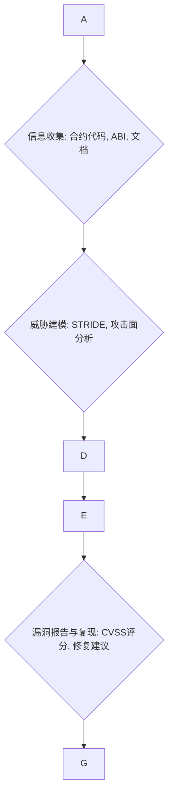
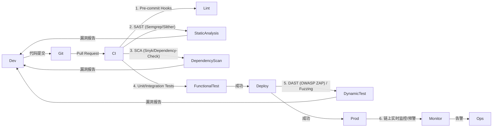

# Interview Q&A - Smart Contract Security (JD0 Solidity) · Liner Scholar Advanced Search

## Contents

- [Topic Areas: Questions 1-N](#topic-areas-questions-1-n)
- [Topic 1: 智能合约安全设计与防御](#topic-1-智能合约安全设计与防御)
  - [Q1: 如何在智能合约设计阶段识别并缓解常见的安全漏洞](#q1-如何在智能合约设计阶段识别并缓解常见的安全漏洞)
  - [Q2: 如何在审计中评估和改进智能合约的抗重入攻击能力](#q2-如何在审计中评估和改进智能合约的抗重入攻击能力)
  - [Q3: 如何在智能合约开发中实施零信任原则并证明其有效性](#q3-如何在智能合约开发中实施零信任原则并证明其有效性)
- [Topic 2: 智能合约审计与安全测试](#topic-2-智能合约审计与安全测试)
  - [Q4: 在智能合约安全审计中，你会如何结合静态分析和动态分析技术](#q4-在智能合约安全审计中你会如何结合静态分析和动态分析技术)
  - [Q5: 如何为智能合约设计一套全面的渗透测试方案](#q5-如何为智能合约设计一套全面的渗透测试方案)
  - [Q6: 如何建立一个持续集成的安全测试流程，以确保智能合约在整个生命周期中的安全性](#q6-如何建立一个持续集成的安全测试流程以确保智能合约在整个生命周期中的安全性)
- [Topic 3: 智能合约事件响应与运营弹性](#topic-3-智能合约事件响应与运营弹性)
  - [Q7: 当智能合约遭遇闪电贷攻击时，你会如何进行紧急响应和恢复](#q7-当智能合约遭遇闪电贷攻击时你会如何进行紧急响应和恢复)
  - [Q8: 如何设计智能合约的监控和预警系统，以实现对异常行为的快速检测](#q8-如何设计智能合约的监控和预警系统以实现对异常行为的快速检测)
- [Topic 4: 合规性与治理](#topic-4-合规性与治理)
  - [Q9: 如何确保智能合约的设计和操作符合相关监管要求和行业最佳实践](#q9-如何确保智能合约的设计和操作符合相关监管要求和行业最佳实践)
- [Reference Sections](#reference-sections)
  - [Glossary, Terminology & Acronyms](#glossary-terminology--acronyms)
  - [Safety & Security Tools](#safety--security-tools)
  - [Authoritative Standards & Literature](#authoritative-standards--literature)
  - [APA Style Source Citations](#apa-style-source-citations)

---

## Topic Areas: Questions 1-N

Overview of coverage and difficulty distribution.

| Topic | Question Range | Count | Difficulty Mix |
|-------|---------------|-------|----------------|
| 智能合约安全设计与防御 | Q1-Q3 | 3 | 1F, 1I, 1A |
| 智能合约审计与安全测试 | Q4-Q6 | 3 | 1F, 1I, 1A |
| 智能合约事件响应与运营弹性 | Q7-Q8 | 2 | 1I, 1A |
| 合规性与治理 | Q9 | 1 | 1I |
| **Total** | | **9** | **2F, 4I, 3A** |

**Legend**: F = Foundational, I = Intermediate, A = Advanced

---

## Topic 1: 智能合约安全设计与防御

Q1: 如何在智能合约设计阶段识别并缓解常见的安全漏洞？

**Difficulty**: Foundational
**Type**: Security Assurance

**Key Insight**: 考察候选人对智能合约常见攻击手法的理解，以及如何在设计阶段通过安全编程规范进行预防。

**Answer**:
在智能合约设计阶段识别并缓解安全漏洞至关重要。首先，要深入理解常见的攻击手法，例如重入攻击、闪电贷攻击、权限漏洞等。针对这些漏洞，设计者必须预见一切可能的恶意行为并设置应对措施。例如，针对重入攻击，可以采用Checks-Effects-Interactions模式，确保状态变量在外部调用前更新，或者使用互斥锁来防止合约重复执行。对于权限漏洞，应实施严格的角色基访问控制（RBAC），并仔细设计合约所有权和管理权限。输入验证也是关键，应确保所有外部输入都经过严格检查以防止恶意数据导致合约行为异常。此外，遵循安全编程规范和最佳实践，包括设计模式、权限管理和输入验证等，能够有效降低安全风险。

**Practical Scenario**:
```solidity
// 安全的提款函数示例 (避免重入攻击)
function withdraw(uint _amount) public {
    require(balances >= _amount, "Insufficient balance");

    // Checks: 检查余额
    uint userBalance = balances;
    require(userBalance >= _amount, "Insufficient balance");

    // Effects: 更新状态变量
    balances -= _amount;

    // Interactions: 执行外部调用
    (bool success, ) = msg.sender.call{value: _amount}("");
    require(success, "Failed to send Ether");
}
```

**Supporting Artifacts** (Select 3+ matching analysis type):

| Artifact Type | Diagrams | Practical Scenarios | Metrics |
|---------------|----------|---------------------|----------|
| **Security Assurance** | Attack tree, Data flow, Defense-in-depth | 攻击场景, 访问控制策略 | `Attack Surface = Entry Points × Vulnerabilities`, `CVSS Score` |

Q2: 如何在审计中评估和改进智能合约的抗重入攻击能力？

**Difficulty**: Intermediate
**Type**: Security Assurance

**Key Insight**: 评估候选人对重入攻击的深入理解，以及在审计中如何结合代码分析和安全工具来评估和改进合约的防御能力。

**Answer**:
评估智能合约的抗重入攻击能力需要结合静态分析和动态分析技术。在审计过程中，首先进行代码审查，重点关注所有涉及外部调用的函数，尤其是那些在外部调用之后才更新状态变量的函数。寻找不遵循Checks-Effects-Interactions模式的代码，这通常是重入攻击的潜在入口。其次，利用静态分析工具如Mythril或Slither来自动检测重入漏洞。这些工具可以在不执行合约的情况下识别代码模式，发现潜在的重入漏洞。例如，Manticore在路径覆盖深度、多场景适应性和安全审计可靠性方面具有优势，能满足智能合约运行时安全性的精准动态验证需求。

通过形式化验证方法审计智能合约安全，虽然存在大量数学推导，但可以用于严格证明合约的安全性。在动态分析阶段，可以部署合约到测试网络并使用模糊测试（Fuzz Testing）工具，如Echidna或Diligence Fuzzing，模拟恶意调用序列来触发重入漏洞。如果发现重入漏洞，改进措施包括：强制使用`transfer()`或`send()`函数进行以太币转账，因为它们有固定2300 Gas的限制，不足以执行重入调用。最推荐的方法是实施互斥锁（Re-entrancy Guard），通过一个状态变量来确保同一时间只有一个外部调用能够执行，或者采用OpenZeppelin等标准库中经过审计的安全合约模式。

**Practical Scenario**:
```solidity
// 带有重入保护的提款函数示例
import "@openzeppelin/contracts/security/ReentrancyGuard.sol";

contract SecureWithdrawal is ReentrancyGuard {
    mapping(address => uint) public balances;

    function deposit() public payable {
        balances += msg.value;
    }

    function withdraw(uint _amount) public nonReentrant {
        require(balances >= _amount, "Insufficient balance");

        balances -= _amount; // Effects before Interaction

        (bool success, ) = msg.sender.call{value: _amount}("");
        require(success, "Failed to send Ether");
    }
}
```

**Supporting Artifacts** (Select 3+ matching analysis type):

| Artifact Type | Diagrams | Practical Scenarios | Metrics |
|---------------|----------|---------------------|----------|
| **Security Assurance** | Attack tree, Data flow, Defense-in-depth | 攻击场景, 访问控制策略 | `Attack Surface = Entry Points × Vulnerabilities`, `CVSS Score` |
| **Security Testing** | Attack chain, Test coverage map | Pentest/fuzz runs, API test cases | `Coverage = Tests Run / Identified Vectors × 100%`, `Defect Escape Rate` |

Q3: 如何在智能合约开发中实施零信任原则，并证明其有效性？

**Difficulty**: Advanced
**Type**: Security Assurance, Prevention Measures

**Key Insight**: 考察候选人对零信任原则在去中心化环境中的理解，以及如何在智能合约层面进行具体实践和验证。

**Answer**:
在智能合约开发中实施零信任原则，意味着“永不信任，始终验证”，即便是在合约内部或与授权实体进行交互时。这与传统中心化系统不同，合约之间的交互默认是不可信的。具体实施包括：
1. **最小权限原则**：确保每个合约或函数只拥有完成其特定任务所需的最小权限。例如，合约不能拥有不必要的管理员权限或执行任意外部代码的能力。
2. **明确的授权和认证**：所有对敏感函数或资源的访问都必须经过明确的链上认证和授权。这意味着不仅要检查`msg.sender`，还要通过更复杂的逻辑（如多重签名或治理机制）来验证请求的合法性。
3. **输入和状态的持续验证**：所有来自外部或内部的输入都必须进行严格的验证。合约的状态转换必须符合预定义的逻辑，任何异常状态都应被阻止。
4. **多重签名和时间锁**：对于关键操作（如升级合约、修改核心参数或转移大量资金），要求多个授权方共同签名才能执行。引入时间锁机制，即在关键操作执行前设置延迟，给社区或管理员足够的时间来审查和干预。

证明其有效性可以通过以下方式：
1. **形式化验证**：使用形式化方法严格证明合约在任何可能的状态下都不会违反安全属性，例如不会发生未经授权的资金转移或状态篡改。
2. **全面的安全审计**：由第三方安全团队进行深入审计，利用静态分析、动态分析和渗透测试来发现潜在的逻辑漏洞和权限管理问题。
3. **白帽黑客竞赛/Bug Bounty**：通过开放的漏洞赏金计划，鼓励全球安全专家寻找合约中的漏洞，通过实战验证零信任设计的健壮性。
4. **度量指标**：跟踪关键操作的多签通过率、时间锁触发次数、以及未经授权访问尝试的拒绝次数。
例如，一个DeFi借贷协议可以通过要求多个治理委员会成员签名才能调整全局利率参数，并设置24小时的时间锁来体现零信任，防止单个实体恶意修改或被攻陷。

**Practical Scenario**:
```solidity
// 零信任原则：多重签名和时间锁的治理合约示例
pragma solidity ^0.8.0;

import "@openzeppelin/contracts/access/Ownable.sol";
import "@openzeppelin/contracts/governance/TimelockController.sol";

contract MyGovernedContract is Ownable {
    TimelockController public timelock;

    constructor(address memory proposers, address memory executors) {
        // TimelockController 初始化为拥有者，控制此合约的关键操作
        timelock = new TimelockController(1 days, proposers, executors, address(this)); // 1天时间锁
        _transferOwnership(address(timelock)); // 将合约所有权转移给 TimelockController
    }

    function updateProtocolParameter(uint _newValue) public onlyOwner {
        // 实际的参数更新逻辑，只有 TimelockController 才能调用
        // ...
    }
}
```

**Supporting Artifacts** (Select 3+ matching analysis type):

| Artifact Type | Diagrams | Practical Scenarios | Metrics |
|---------------|----------|---------------------|----------|
| **Security Assurance** | Attack tree, Data flow, Defense-in-depth | 攻击场景, 访问控制策略 | `Attack Surface = Entry Points × Vulnerabilities`, `CVSS Score` |
| **Compliance** | Audit trail, Control mapping | 证据文档, 培训记录 | `Compliance Rate = Controls Met / Total × 100%`, `Audit Findings` |

---

## Topic 2: 智能合约审计与安全测试

Q4: 在智能合约安全审计中，你会如何结合静态分析和动态分析技术？

**Difficulty**: Foundational
**Type**: Security Assurance, Security Testing

**Key Insight**: 考察候选人对智能合约安全审计流程的理解，特别是如何有效结合静态分析和动态分析来提高漏洞发现的覆盖率和准确性。

**Answer**:
在智能合约安全审计中，结合静态分析和动态分析是发现漏洞的最佳实践。
1. **静态分析**：这通常是审计的第一步，通过不执行代码的方式检查源代码或字节码是否存在已知漏洞模式。我会使用专门的智能合约静态分析工具，例如Mythril、Slither或Semgrep。这些工具可以快速识别出常见的漏洞，如重入、整数溢出/下溢、访问控制问题和不安全的外部调用。静态分析的优势在于效率高，可以在开发早期“左移”安全，发现大部分结构性或模式化的漏洞。它还可以用于语义感知安全审计，分析验证以太坊合约运行时。

2. **动态分析**：在静态分析之后进行，涉及在测试环境中实际执行合约并观察其行为。这包括单元测试、集成测试以及更高级的模糊测试（Fuzz Testing）和符号执行。我会使用Echidna、Diligence Fuzzing或Manticore等工具。动态分析能够发现静态分析难以捕捉的运行时漏洞，例如复杂的状态依赖错误、Gas限制问题、以及与链上环境交互产生的漏洞。它特别适用于验证合约在各种输入和状态下的行为是否符合预期，以及是否存在意外的副作用。例如，Manticore在路径覆盖深度、多场景适应性和安全审计可靠性方面更具优势，能够满足智能合约运行时安全性的精准动态验证需求。通过对以太坊、波卡和币安智能链的实证研究，验证了测评框架的有效性。

结合两者，可以形成一个全面的安全审计流程。静态分析作为快速筛选器，发现已知模式的漏洞；动态分析则深入探索合约的运行时行为，验证静态分析结果并发现更深层次的逻辑漏洞。

**Supporting Artifacts** (Select 3+ matching analysis type):

| Artifact Type | Diagrams | Practical Scenarios | Metrics |
|---------------|----------|---------------------|----------|
| **Security Assurance** | Attack tree, Data flow, Defense-in-depth | 攻击场景, 访问控制策略 | `Attack Surface = Entry Points × Vulnerabilities`, `CVSS Score` |
| **Security Testing** | Attack chain, Test coverage map | Pentest/fuzz runs, API test cases | `Coverage = Tests Run / Identified Vectors × 100%`, `Defect Escape Rate` |

Q5: 如何为智能合约设计一套全面的渗透测试方案？

**Difficulty**: Intermediate
**Type**: Security Testing

**Key Insight**: 考察候选人对渗透测试方法论在智能合约领域的应用，包括范围界定、工具选择、攻击策略和报告机制。

**Answer**:
为智能合约设计全面的渗透测试方案需要系统化的方法。
1. **目标与范围界定**：首先明确渗透测试的目标（如发现资金盗取漏洞、权限提升、拒绝服务等）和范围（涉及的合约地址、依赖库、链上交互机制等）。这可能包括DeFi协议、NFT市场或GameFi项目。
2. **信息收集与分析**：收集所有可用的合约代码、ABI、部署地址、相关文档和业务逻辑描述。进行白盒审查，理解合约的内部工作原理、状态转换和外部依赖。
3. **威胁建模**：利用STRIDE或PASTA等方法对合约进行威胁建模，识别潜在的攻击面和威胁向量，如重入、闪电贷、MEV攻击等。
4. **攻击向量规划**：基于威胁建模结果，设计具体的攻击场景和测试用例。这包括：
    - **逻辑漏洞测试**：尝试绕过业务逻辑、价格操纵、铸币/销毁机制滥用等。
    - **权限控制测试**：验证所有管理员和特权函数是否受到严格保护，是否存在未经授权的访问。
    - **经济模型攻击**：模拟闪电贷攻击、预言机操纵等，评估经济模型是否稳健。
    - **Gas消耗攻击**：尝试通过恶意操作导致合约Gas耗尽，实现拒绝服务。
    - **DoS攻击**：测试合约在高负载或恶意输入下的稳定性。
5. **工具选择与执行**：
    - **自动化工具**：利用像Mythril、Slither进行静态分析，寻找已知模式漏洞。
    - **模糊测试**：使用AFL++或Echidna对合约输入进行模糊测试，发现崩溃或异常行为。
    - **符号执行**：如Manticore，探索合约所有可能的执行路径，发现隐藏的漏洞。
    - **手动测试**：渗透测试专家手动构造交易，利用对合约逻辑的深入理解，尝试发现自动化工具难以捕捉的复杂漏洞。例如，通过篡改交易顺序或时间戳来利用MEV。
6. **报告与修复**：详细记录发现的所有漏洞，包括重现步骤、影响分析和修复建议。遵循CVSS标准对漏洞进行评分，以帮助团队优先处理最关键的问题。

**Practical Scenario**:


**Supporting Artifacts** (Select 3+ matching analysis type):

| Artifact Type | Diagrams | Practical Scenarios | Metrics |
|---------------|----------|---------------------|----------|
| **Security Testing** | Attack chain, Test coverage map | Pentest/fuzz runs, API test cases | `Coverage = Tests Run / Identified Vectors × 100%`, `Defect Escape Rate` |
| **Security Assurance** | Attack tree, Data flow, Defense-in-depth | 攻击场景, 访问控制策略 | `Attack Surface = Entry Points × Vulnerabilities`, `CVSS Score` |

Q6: 如何建立一个持续集成的安全测试流程，以确保智能合约在整个生命周期中的安全性？

**Difficulty**: Advanced
**Type**: Security Assurance, Prevention Measures

**Key Insight**: 考察候选人对DevSecOps理念在智能合约开发中的应用，以及如何自动化安全测试，实现“左移安全”。

**Answer**:
建立一个持续集成的智能合约安全测试流程（CI/CD Security）是确保其整个生命周期安全的关键。这需要将安全检查融入到开发管道的每个阶段，实现“左移安全”。
1. **代码提交阶段**：
    - **预提交钩子（Pre-commit Hooks）**：强制执行代码风格检查、基本语法检查和通过Linting工具进行初步的模式化安全检查，例如查找常见的ERC20/ERC721实现错误。
    - **静态应用安全测试 (SAST)**：集成Semgrep、Slither或Mythril等工具到CI/CD流程中。每次代码提交或合并请求时，自动运行SAST扫描，识别重入、整数溢出、访问控制等已知漏洞模式。SAST结果应作为代码审查的一部分，不符合规范的代码应阻止合并。
2. **构建与部署阶段**：
    - **单元测试与集成测试**：确保所有功能和交互逻辑都通过严格的测试，覆盖边缘情况和异常处理。将安全断言（Security Assertions）集成到测试用例中。
    - **依赖项扫描 (SCA)**：使用Snyk或OWASP Dependency-Check等工具扫描项目依赖库，查找已知的漏洞或不安全的版本。这对于识别第三方库中的风险至关重要。
    - **动态应用安全测试 (DAST) / 模糊测试**：在部署到测试网络或暂存环境后，运行自动化DAST工具（如OWASP ZAP）和模糊测试工具（如Echidna、AFL++）。模拟各种攻击场景，探测合约在运行时可能出现的漏洞，例如Gas限制攻击、拒绝服务等。
    - **形式化验证**：对于核心或高风险的合约模块，集成形式化验证工具，证明其关键安全属性在数学上是正确的。
3. **监控与生产阶段**：
    - **实时监控与预警**：部署链上事件监控系统，实时跟踪合约行为、交易模式和关键指标。使用如Forta等去中心化安全监控网络，对异常活动（如大额提款、闪电贷、价格操纵）进行即时告警。
    - **漏洞赏金计划 (Bug Bounty)**：持续运行漏洞赏金计划，鼓励外部安全研究人员发现和报告生产环境中的漏洞。
    - **定期安全审计**：即使有自动化流程，也应定期进行由专业团队执行的深度安全审计，以发现自动化工具难以捕捉的复杂逻辑或经济漏洞。
    - **威胁情报集成**：整合最新的链上威胁情报，及时更新防御策略和监控规则。

通过这些措施，可以显著提高智能合约的安全性，并确保在发现新的漏洞或攻击手法时能够快速响应。

**Practical Scenario**:


**Supporting Artifacts** (Select 3+ matching analysis type):

| Artifact Type | Diagrams | Practical Scenarios | Metrics |
|---------------|----------|---------------------|----------|
| **Security Assurance** | Attack tree, Data flow, Defense-in-depth | 攻击场景, 访问控制策略 | `Attack Surface = Entry Points × Vulnerabilities`, `CVSS Score` |
| **Security Testing** | Attack chain, Test coverage map | Pentest/fuzz runs, API test cases | `Coverage = Tests Run / Identified Vectors × 100%`, `Defect Escape Rate` |
| **Prevention Measures** | Control hierarchy, Monitoring flow | 预防控制, 检测机制 | `Control Effectiveness = Prevented / Total × 100%`, `False Positive Rate` |

---

## Topic 3: 智能合约事件响应与运营弹性

Q7: 当智能合约遭遇闪电贷攻击时，你会如何进行紧急响应和恢复？

**Difficulty**: Intermediate
**Type**: Operational Resilience, Incident Response

**Key Insight**: 考察候选人对智能合约攻击事件的快速响应能力，包括攻击识别、止损、恢复和事后分析。

**Answer**:
当智能合约遭遇闪电贷攻击时，紧急响应和恢复流程必须迅速且有条不紊。
1. **即时检测与确认**：通过实时监控系统（如SIEM，或专门的链上监控工具）接收异常交易或大额资金异动的警报。闪电贷攻击通常在单笔交易内完成借贷、攻击和还款，因此检测时间窗口极短。确认异常交易涉及闪电贷套利或操控行为。

2. **止损与隔离**：
    - **暂停功能**：如果合约设计有暂停功能（`pausable`），应立即激活，防止攻击继续或进一步扩大损失。
    - **紧急升级/热修复**：如果漏洞可以被快速修复且升级机制安全，可以尝试部署紧急修复补丁。
    - **白名单/黑名单**：针对已识别的攻击地址或受损资产进行白名单/黑名单操作，限制其进一步交互。
    - **联系交易所和中心化机构**：如果攻击资金流向中心化交易所，立即联系并请求冻结资金。

3. **数据取证与分析**：
    - **链上数据分析**：利用区块链浏览器和分析工具，追踪攻击交易的详细路径，识别攻击者钱包、被利用的协议漏洞和资金流向。这有助于理解攻击手法和潜在的修复方案。
    - **合约日志分析**：审查合约事件日志，获取攻击发生时的上下文信息。

4. **恢复与沟通**：
    - **合约恢复**：评估是否可以安全地解除暂停、回滚到攻击前状态（若支持且可行），或部署新的、已修复的合约。
    - **资产追回**：与安全公司、链上分析团队合作，尽可能追回被盗资金。
    - **社区沟通**：及时向社区、用户和合作伙伴发布透明的事件公告，说明攻击详情、已采取的措施和恢复计划。维护社区信任至关重要。

5. **事后分析与改进**：
    - **根本原因分析 (RCA)**：深入分析漏洞的根源，更新威胁模型和安全审计流程。
    - **安全机制强化**：根据攻击教训，强化合约设计、审计和监控机制。例如，实施更严格的外部调用限制、价格预言机校验或引入去中心化风险控制。
    - **演练**：定期进行事件响应演练，提高团队应对突发安全事件的能力。

**Practical Scenario**:
```yaml
incident_playbook:
  id: FLASHLOAN-001
  scope:
  triggers:
  roles:
    - incident_commander: Leads overall response, external comms
    - security_engineer: Technical analysis, mitigation
    - smart_contract_developer: Code review, hotfix deployment
    - legal_counsel: Regulatory reporting, asset tracing support
  steps:
    - detect: "SIEM alert on large tx volume from single block, oracle price deviation"
      mttd_target_min: 2
    - contain: "Activate contract pause function, blacklist attacker addresses if possible"
      action_duration_min: 5
    - eradicate: "Identify specific vulnerability, prepare hotfix (if design allows)"
      action_duration_min: 60
    - recover: "Deploy fixed contract, assess asset recovery options, resume operations"
      rto_target_hours: 24
  comms:
    channels:
    stakeholders:
  metrics:
    mttd_target_min: 2
    mttr_target_min: 120 # Flashloan recovery can be long due to asset tracing
  severity_matrix:
    critical:
      escalation: "immediate (≤2min)"
      stakeholders:
  response_procedures:
    detect: "blockchain_monitor + anomaly_detection + fraud_patterns"
    contain: "pause_contract_emergency_shutdown + blacklist_compromised_addresses + isolate_affected_pools"
    eradicate: "vulnerability_patch + code_review_hotfix + testnet_validation"
    recover: "deploy_new_contract_version + asset_recovery_attempts + community_announcement"
```

**Supporting Artifacts** (Select 3+ matching analysis type):

| Artifact Type | Diagrams | Practical Scenarios | Metrics |
|---------------|----------|---------------------|----------|
| **Operational Resilience** | Incident workflow, Recovery process | 应急响应流程, 业务连续性演练 | `MTTR = Time to Recovery`, `RTO = Recovery Time Objective` |
| **Security Assurance** | Attack tree, Data flow, Defense-in-depth | 攻击场景, 访问控制策略 | `Attack Surface = Entry Points × Vulnerabilities`, `CVSS Score` |

Q8: 如何设计智能合约的监控和预警系统，以实现对异常行为的快速检测？

**Difficulty**: Advanced
**Type**: Operational Resilience, Detection & Monitoring

**Key Insight**: 考察候选人设计主动式智能合约安全监控系统，融合链上数据分析、异常检测和自动化预警的能力。

**Answer**:
设计智能合约的监控和预警系统是实现对异常行为快速检测的关键，尤其是在去中心化金融（DeFi）等高风险领域。
1. **数据源与采集**：
    - **链上事件日志**：监控合约发出的所有事件，如`Transfer`、`Approval`、`Deposit`、`Withdraw`等关键事件。
    - **交易数据**：捕获所有涉及目标合约的交易，包括发送方、接收方、交易金额、Gas消耗和输入数据。
    - **区块数据**：监控区块高度、时间戳和交易排序，以检测可能的MEV（矿工可提取价值）攻击或时间戳依赖漏洞。
    - **预言机数据**：如果合约依赖外部预言机获取价格，必须监控预言机数据源的稳定性和准确性，防止价格操纵。

2. **监控规则与异常检测**：
    - **阈值告警**：设定关键指标的阈值，例如单笔大额转账、短时间内交易量剧增、Gas消耗异常飙升、TVL（总锁定价值）急剧下降等。
    - **行为模式分析**：建立正常的用户行为和合约交互模式基线。利用机器学习或统计方法（如统计过程控制）检测与基线的显著偏差。例如，检测闪电贷模式（单笔交易内的巨额借贷和还款）、地址关联异常、不寻常的函数调用序列。
    - **安全规则引擎**：部署可定制化的安全规则，如识别已知的攻击模式（如重入攻击模式的调用序列）、权限滥用尝试、或者利用旧漏洞的交易。例如，链上安全公司如Forta提供的去中心化网络可以提供这类规则。
    - **价格异常检测**：通过比对多个预言机的数据源，或者检测价格变动幅度是否超过合理范围，防止预言机攻击。

3. **预警与响应机制**：
    - **多渠道告警**：将检测到的异常通过多个渠道（如PagerDuty、Slack、短信、邮件）发送给安全团队和开发者。
    - **优先级排序**：根据事件的潜在影响（如资金损失、服务中断）对告警进行优先级排序，确保高危事件得到即时处理。
    - **自动化响应**：对于某些明确的、高风险的异常，可以预设自动化响应机制，例如自动激活合约暂停功能（如果存在且安全），或通知多重签名管理员进行干预。
    - **可视化仪表盘**：构建一个实时仪表盘，展示关键指标、告警状态和历史事件，帮助团队快速了解安全态势。

**Practical Scenario**:
```yaml
# 智能合约监控规则示例 (简化版)
monitoring_rules:
  - id: large_withdrawal_alert
    description: "Detects single large withdrawals from main liquidity pool"
    contract_address: "0x..."
    event_signature: "Withdraw(address,uint256)"
    threshold: 100000000000000000000 # 100 ETH (example)
    alert_level: CRITICAL
    action:

  - id: flashloan_pattern_detection
    description: "Detects rapid borrow-exploit-repay within single transaction"
    contract_address: "0x..."
    transaction_analysis:
      - check_call_sequence:
      - check_gas_usage: "significantly higher than average"
    alert_level: CRITICAL
    action:

  - id: oracle_price_deviation
    description: "Detects significant deviation in oracle price from aggregated sources"
    contract_address: "0x..."
    function_call: "getPrice()"
    deviation_threshold_percent: 5 # 5% deviation
    comparison_sources:
    alert_level: HIGH
    action:

  - id: excessive_gas_consumption
    description: "Detects transactions with abnormally high gas usage, potential DoS"
    contract_address: "0x..."
    gas_threshold_percent_above_average: 200 # 200% above moving average
    alert_level: MEDIUM
    action:
```

**Supporting Artifacts** (Select 3+ matching analysis type):

| Artifact Type | Diagrams | Practical Scenarios | Metrics |
|---------------|----------|---------------------|----------|
| **Detection & Monitoring** | State machine, Alert flow | 监控逻辑, 告警流程 | `Detection Rate = True Positives / Total Incidents × 100%`, `MTTD = Time to Detection` |
| **Operational Resilience** | Incident workflow, Recovery process | 应急响应流程, 业务连续性演练 | `MTTR = Time to Recovery`, `RTO = Recovery Time Objective` |

---

## Topic 4: 合规性与治理

Q9: 如何确保智能合约的设计和操作符合相关监管要求和行业最佳实践？

**Difficulty**: Intermediate
**Type**: Compliance & Governance

**Key Insight**: 考察候选人对智能合约在法律、监管和行业标准方面的认识，以及如何将其融入开发和运营流程。

**Answer**:
确保智能合约的设计和操作符合相关监管要求和行业最佳实践，是区块链项目成功的关键，尤其是在DeFi、NFT和GameFi等领域。这需要一个多层面的方法：
1. **监管环境理解与分析**：
    - **识别适用法规**：首先要识别项目所处的司法管辖区可能适用的法律法规，例如金融监管（如证券法、反洗钱/AML）、数据隐私（如GDPR）、消费者保护等。智能合约的刑事风险也日益扩张。
    - **跟踪行业发展**：密切关注区块链和智能合约领域的监管动态和政策变化，例如各国对数字资产的分类和监管态度。
    - **法律合规咨询**：与法律专家合作，对合约的功能和潜在影响进行法律合规性审查，确保其在法律框架内运行。

2. **设计阶段的合规性集成**：
    - **可升级性与治理**：设计可升级的合约，以便在监管要求变化时进行修改，并引入去中心化治理机制（如DAO），让社区参与重要决策。
    - **权限与访问控制**：实施严格的权限管理，确保敏感操作（如铸币、销毁、暂停）只能由授权实体在特定条件下执行，符合“了解你的客户”（KYC）和AML的要求。
    - **隐私保护**：对于涉及用户隐私数据的合约（如某些GameFi或NFT应用），应考虑采用零知识证明（ZKP）、同态加密或安全多方计算（SMC）等技术来保护数据隐私，同时满足数据存储和访问的合规性要求。例如，基于集成信用度评估的智能合约安全数据共享模型可以有效解决患者隐私安全问题。
    - **审计与可追溯性**：确保所有链上操作都生成清晰的事件日志和可审计的记录，以便在合规性审计时提供证据。

3. **操作与维护阶段的合规性保障**：
    - **定期安全审计**：定期委托第三方专业机构对智能合约进行安全审计，验证其是否符合安全标准和最佳实践。
    - **风险管理框架**：建立全面的风险管理框架，识别、评估和缓解与智能合约相关的法律、技术和操作风险。
    - **文档与报告**：维护详尽的合约文档，包括设计原理、安全审计报告、风险评估结果和事件响应记录，以备监管机构审查。
    - **事件响应与恢复**：建立健全的事件响应计划，能够快速识别、响应和从安全事件中恢复，并符合监管机构的事件报告要求。

通过这些措施，可以构建一个既安全又合规的智能合约生态系统。

**Practical Scenario**:
```yaml
# 智能合约合规性控制映射示例
compliance_mapping:
  # 反洗钱 (AML) 措施
  aml_controls:
    - requirement: "KYC for large transactions"
      contract_feature: "Tiered_Verification_Contract.sol"
      implementation_details: "Require KYC provider integration for withdrawals > $10k"
      evidence: "KYC service provider audit reports, transaction logs"
      status: "Implemented"
    - requirement: "Transaction monitoring for suspicious patterns"
      contract_feature: "Anomaly_Detection_Service.sol"
      implementation_details: "Integrate with chain analysis tools for blacklisted addresses"
      evidence: "Monitoring system logs, alert reports"
      status: "Implemented"

  # 数据隐私 (GDPR/CCPA) 措施
  data_privacy_controls:
    - requirement: "Minimize collection of PII on-chain"
      contract_feature: "Data_Anonymization_Module.sol"
      implementation_details: "Use zero-knowledge proofs for sensitive user data"
      evidence: "Code review, ZKP library audits"
      status: "In Progress"
    - requirement: "Data audit trail for off-chain storage"
      contract_feature: "Event_Logging_Module.sol"
      implementation_details: "Log all off-chain data access events"
      evidence: "Off-chain log files, audit reports"
      status: "Implemented"

  # 治理与透明度
  governance_controls:
    - requirement: "Transparent upgrade mechanism"
      contract_feature: "UpgradeabilityProxy.sol"
      implementation_details: "Governance module for upgrade proposals and voting"
      evidence: "Governance votes, timelock records"
      status: "Implemented"
    - requirement: "Multi-signature for critical operations"
      contract_feature: "GnosisSafe_Integration.sol"
      implementation_details: "Requires 3 of 5 multisig for treasury transfers"
      evidence: "Transaction confirmations, multisig setup"
      status: "Implemented"
```

**Supporting Artifacts** (Select 3+ matching analysis type):

| Artifact Type | Diagrams | Practical Scenarios | Metrics |
|---------------|----------|---------------------|----------|
| **Compliance** | Audit trail, Control mapping | 证据文档, 培训记录 | `Compliance Rate = Controls Met / Total × 100%`, `Audit Findings` |
| **Security Assurance** | Attack tree, Data flow, Defense-in-depth | 攻击场景, 访问控制策略 | `Attack Surface = Entry Points × Vulnerabilities`, `CVSS Score` |

---

## Reference Sections

### Glossary, Terminology & Acronyms

**G1. FMEA (Failure Mode and Effects Analysis)**
Systematic method to identify potential failure modes, their causes, and effects on system performance. Prioritizes risks by RPN (Risk Priority Number = Severity × Occurrence × Detection). Related: FMECA.

**G2. FTA (Fault Tree Analysis)**
Top-down deductive analysis using Boolean logic gates to identify root causes of hazardous events. Quantifies probability of top event. Related: Event Tree Analysis.

**G3. HAZOP (Hazard and Operability Study)**
Structured brainstorming technique using guide words (No, More, Less, Reverse) to identify deviations from design intent in process systems. Related: HAZID.

**G4. STRIDE (Threat Modeling)**
Mnemonic for threat categories: Spoofing, Tampering, Repudiation, Information Disclosure, Denial of Service, Elevation of Privilege. Microsoft framework for systematic threat identification..

**G5. CVSS (Common Vulnerability Scoring System)**
Standardized method to assess vulnerability severity. Score 0-10 based on exploitability, impact, and temporal/environmental factors. Used for prioritizing patches..

**G6. Defense-in-Depth**
Layered security strategy deploying multiple controls at different levels (network, host, application, data) so failure of one layer doesn't compromise entire system. Related: Swiss Cheese Model..

**G7. Fail-Safe Design**
System enters predefined safe state when failure occurs. Examples: deadman switch, spring-return valves. Contrasts with fail-operational. Related: Intrinsic Safety.

**G8. Redundancy**
Duplication of critical components to maintain function when primary fails. Types: active (hot standby), passive (cold standby), diverse (different technologies). Related: N+1, 2oo3 voting.

**G9. Zero-Trust Architecture**
Security model: never trust, always verify. Enforces least privilege, micro-segmentation, continuous authentication regardless of network location. Related: BeyondCorp.

**G10. MTBF (Mean Time Between Failures)**
Average operating time between failures for repairable systems. Formula: \\(MTBF = \frac{\text{Total Operating Time}}{\text{Number of Failures}}\\). Higher MTBF indicates better reliability. Related: Availability, Reliability, SIL.

**G11. MTTR (Mean Time To Repair/Recovery)**
Average time to restore service after failure. Formula: \\(MTTR = \frac{\text{Total Restoration Time}}{\text{Number of Incidents}}\\). Includes diagnosis, repair, and verification. Lower MTTR indicates better maintainability. Related: MTTF, MTTD, RTO.

**G12. SIL (Safety Integrity Level)**
IEC 61508/61511 discrete level (1-4) for specifying safety system reliability. Determines required risk reduction and control measures based on hazard severity. Related: ASIL (automotive), PL (machinery), Hardware/Software fault tolerance requirements.

**G13. CIA Triad**
Foundational security principles: Confidentiality (prevent unauthorized disclosure), Integrity (prevent unauthorized modification), Availability (ensure authorized access). Related: Parkerian Hexad.

**G14. Attack Surface**
Sum of entry points (network ports, APIs, user inputs) where unauthorized user can attempt to access or extract data. Reduction minimizes security risk. Related: Threat Vector.

**G15. Threat Vector**
Path or means by which attacker gains unauthorized access. Examples: phishing (social), SQL injection (code), physical access (facilities). Related: Attack Chain.

**G16. MTTD (Mean Time To Detect)**
Average time to detect incidents from occurrence. Formula: \\(MTTD = \frac{\text{Total Detection Time}}{\text{Number of Incidents}}\\). Lower MTTD reduces exposure window; pairs with MTTR for comprehensive response assessment. Related: Detection Rate, MTTR, Security Monitoring.

**G17. SAST (Static Application Security Testing)**
Analyzes source/byte code without execution to find vulnerabilities early (shift-left). Complements DAST..

**G18. DAST (Dynamic Application Security Testing)**
Tests running applications externally to find exploitable issues (black-box/gray-box)..

**G19. SCA (Software Composition Analysis)**
Identifies vulnerabilities and licenses in dependencies; produces SBOM; monitors CVEs..

**G20. Fuzz Testing**
Automated generation of malformed/random inputs to trigger crashes or unexpected states..

**G21. Penetration Testing**
Controlled adversarial testing to exploit weaknesses and validate real-world impact..

**G22. IaC & Container Scanning**
Scans Infrastructure-as-Code and container images for misconfigurations and known vulnerabilities..

**G23. API Security Testing**
Validates API endpoints against OWASP API Top 10; auth, rate-limit, input handling..

---

### Safety & Security Tools

**T1. BowTieXP** (Risk Assessment)
Visualization tool for bow-tie diagrams connecting hazards, threats, top events, consequences, and barriers. Integrates with HAZOP, LOPA. Commercial. https://www.cgerisk.com/bowtiexp.

**T2. Microsoft Threat Modeling Tool** (Threat Analysis)
Free STRIDE-based tool for identifying security threats in software design. Auto-generates threat lists from DFDs..

**T3. Splunk / ELK Stack** (SIEM - Security Information and Event Management)
Real-time log aggregation, correlation, alerting for security incidents. Splunk (commercial), ELK (open source: Elasticsearch, Logstash, Kibana)..

**T4. Nessus / Qualys** (Vulnerability Scanning)
Automated network scanners detecting misconfigurations, missing patches, known vulnerabilities. Nessus (Tenable), Qualys (cloud-based). Generate CVSS scores..

**T5. PagerDuty / ServiceNow** (Incident Management)
Incident response platforms for alerting, escalation, collaboration, and post-mortem tracking. Integrates with monitoring tools (Prometheus, Datadog)..

**T6. OWASP ZAP** (DAST)
Open-source web/app DAST scanner for automated and manual testing..

**T7. Semgrep** (SAST)
Lightweight static analysis with rule packs for common vulns; CI integration..

**T8. Snyk / OWASP Dependency-Check** (SCA/SBOM)
Dependency vulnerability and license scanning; SBOM generation..

**T9. AFL++ / libFuzzer** (Fuzzing)
Modern fuzzers for native code; coverage-guided testing..

**T10. Burp Suite** (Web/API testing)
Intercepting proxy for manual/automated testing, including APIs..

**T11. Trivy** (Container & IaC scanning)
Scans container images, SBOMs, and IaC for CVEs/misconfigurations..

---

### Authoritative Standards & Literature

**L1. IEC 61508:2010 & IEC 61511:2016. *Functional Safety of E/E/PE Systems & Safety Instrumented Systems for Process Industry*.**
IEC 61508: International standard defining SIL levels and safety lifecycle across industries. IEC 61511: Process industry application with HAZOP integration, SIS design, and operations. Basis for domain-specific standards (ISO 26262, IEC 62443).

**L2. ISO 26262:2018. *Road Vehicles - Functional Safety*.**
Automotive adaptation of IEC 61508 defining ASIL (Automotive Safety Integrity Levels A-D), V-model development, and safety case requirements for vehicles.

**L3. NIST Cybersecurity Framework (CSF) 2.0. (2024).**
Updated framework for managing cybersecurity risk: Govern, Identify, Protect, Detect, Respond, Recover. Widely adopted across critical infrastructure sectors.

**L4. ISO/IEC 27001:2022. *Information Security Management Systems - Requirements*.**
International standard for establishing, implementing, maintaining, and improving an ISMS. Includes Annex A controls covering organizational, technical, and physical security.

**L5. NIST SP 800-61 Rev. 2. (2012). *Computer Security Incident Handling Guide*.**
Incident response lifecycle: Preparation, Detection & Analysis, Containment/Eradication/Recovery, Post-Incident Activity. Reference for SOC operations.

**L6. Leveson, N. G. (2011). *Engineering a Safer World: Systems Thinking Applied to Safety*. MIT Press.**
STAMP (Systems-Theoretic Accident Model and Processes) framework for analyzing complex socio-technical system accidents. Alternative to traditional chain-of-events models.

**L7. ISO/SAE 21434:2021. *Road vehicles — Cybersecurity engineering*.**
Automotive cybersecurity engineering across lifecycle: risk assessment, cybersecurity goals, and assurance activities integrated with safety.

**L8. IEC 62304:2006+A1:2015. *Medical device software — Software life cycle processes*.**
Processes for development and maintenance of medical device software; integrates risk management (ISO 14971) and traceability.

**L9. NIST SP 800-82 Rev. 2. (2015). *Guide to Industrial Control Systems (ICS) Security*.**
Security architecture and controls for ICS/SCADA, including segmentation, whitelisting, and monitoring in OT environments.

**L10. ISO 14971:2019. *Medical devices — Application of risk management to medical devices*.**
Framework for identifying hazards, estimating and evaluating risks, controlling risks, and monitoring post‑production information.

**L11. NIST SP 800-115. (2008). *Technical Guide to Information Security Testing and Assessment*.**
Comprehensive methodology for security testing including penetration testing, vulnerability assessment, and security assessment planning.

**L12. OWASP ASVS 4.0. (2019). *Application Security Verification Standard*.**
Framework for testing application security controls and providing developers with security requirements list.

**L13. Langner, R. (2011). *Stuxnet: Dissecting a cyberweapon*. IEEE Security & Privacy, 9(3), 49-51.**
Technical analysis of the first known cyberweapon targeting industrial control systems; lessons for ICS security.

**L14. Krebs, B. (2014). *Krebs on Security: In-depth security news and investigation*.**
Comprehensive coverage of major data breaches including Target, Equifax; attack patterns and defensive lessons.

**L15. CISA. (2021). *Colonial Pipeline cybersecurity incident: Lessons learned*.**
Official analysis of ransomware attack on critical infrastructure; emergency response and recovery insights.

**L16. Mandiant. (2021). *Highly Evasive Attacker Leverages SolarWinds Supply Chain*.**
Analysis of supply chain compromise via software updates; nation-state APT tactics and detection strategies.

---

### APA Style Source Citations

**A1. International Electrotechnical Commission. (2010). *IEC 61508: Functional safety of electrical/electronic/programmable electronic safety-related systems* (2nd ed.). IEC.**

**A2. International Organization for Standardization. (2018). *ISO 26262: Road vehicles - Functional safety* (2nd ed.). ISO.**

**A3. National Institute of Standards and Technology. (2024). *Cybersecurity Framework (CSF) 2.0*. NIST.**

**A4. International Organization for Standardization. (2022). *ISO/IEC 27001: Information security, cybersecurity and privacy protection - Information security management systems - Requirements*. ISO/IEC.**

**A5. Cichonski, P., Millar, T., Grance, T., & Scarfone, K. (2012). *Computer security incident handling guide* (NIST SP 800-61 Rev. 2). NIST.**

**A6. Leveson, N. G. (2011). *Engineering a safer world: Systems thinking applied to safety*. MIT Press.**

**A7. Shostack, A. (2014). *Threat modeling: Designing for security*. Wiley.**

**A8. 张东明, & 李明. (2020). *功能安全技术及应用*. 机械工业出版社.**
(Zhang, D., & Li, M. (2020). *Functional safety technology and applications*. China Machine Press.)

**A9. International Organization for Standardization. (2018). *ISO 31000: Risk management - Guidelines* (2nd ed.). ISO.**

**A10. International Electrotechnical Commission. (2016). *IEC 62443: Industrial communication networks - Network and system security*. IEC.**

**A11. Hopkin, P. (2018). *Fundamentals of risk management: Understanding, evaluating and implementing effective risk management* (5th ed.). Kogan Page.**

**A12. 王志刚, & 刘康. (2019). *信息安全技术*. 清华大学出版社.**
(Wang, Z., & Liu, K. (2019). *Information security technology*. Tsinghua University Press.)

**A13. Freund, J., & Jones, J. (2014). *Measuring and managing information risk: A FAIR approach*. Butterworth-Heinemann.**

**A14. Center for Chemical Process Safety. (2008). *Guidelines for hazard evaluation procedures* (3rd ed.). Wiley.**

**A15. National Institute of Standards and Technology. (2020). *Security and privacy controls for information systems and organizations* (NIST SP 800-53 Rev. 5). NIST.**

**A16. International Organization for Standardization. (2019). *ISO 22301: Security and resilience - Business continuity management systems - Requirements*. ISO.**

**A17. International Organization for Standardization & Society of Automotive Engineers. (2021). *ISO/SAE 21434: Road vehicles — Cybersecurity engineering*. ISO/SAE.**

**A18. International Electrotechnical Commission. (2006, amended 2015). *IEC 62304: Medical device software — Software life cycle processes*. IEC.**

**A19. Stouffer, K., Pillitteri, V., Lightman, S., Abrams, M., & Hahn, A. (2015). *Guide to Industrial Control Systems (ICS) Security* (NIST SP 800-82 Rev. 2). NIST.**

**A20. International Organization for Standardization. (2019). *ISO 14971: Medical devices — Application of risk management to medical devices*. ISO.**

**A21. Scarfone, K., Souppaya, M., Cody, A., & Orebaugh, A. (2008). *Technical guide to information security testing and assessment* (NIST SP 800-115). NIST.**

**A22. OWASP Foundation. (2019). *Application Security Verification Standard (ASVS) 4.0*. OWASP.**

**A23. Langner, R. (2011). Stuxnet: Dissecting a cyberweapon. *IEEE Security & Privacy*, 9(3), 49-51.**

**A24. Krebs, B. (2014). *Krebs on Security: In-depth security news and investigation*.**

**A25. Cybersecurity and Infrastructure Security Agency. (2021). *Colonial Pipeline cybersecurity incident analysis*. CISA. https://www.cisa.gov/colonial-pipeline-cyber-incident**

**A26. Mandiant. (2021). *Highly Evasive Attacker Leverages SolarWinds Supply Chain*. Mandiant.**

---

## Sources 
[1] A systematic literature review of blockchain and smart contract development: Techniques, tools, and open challenges, https://linkinghub.elsevier.com/retrieve/pii/S0164121220302818
[2] Ethereum smart contract security research: survey and future research opportunities, https://www.semanticscholar.org/paper/95f781f73f3f877b740681e544b2e96510435c66
[3] A comprehensive survey of smart contract security: State of the art and research directions, https://linkinghub.elsevier.com/retrieve/pii/S1084804524000596
[4] Smart Contract: Security and Privacy, https://www.techscience.com/csse/v38n1/42033
[5] Ethereum smart contract security: Design, risks and protection approaches, https://pubs.aip.org/aip/acp/article-lookup/doi/10.1063/5.0180960
[6] A survey on security in consensus and smart contracts, https://link.springer.com/article/10.1007/s12083-021-01268-2
[7] Smart Contracts, https://www.semanticscholar.org/paper/278a478a37e6368c962813df648ebb9b2015d23e
[8] 智能合约: 架构及进展, http://aas.net.cn/fileZDHXB/journal/article/zdhxb/2019/3/PDF/zdhxb-45-3-445.pdf
[9] Blockchain Security: Work on Securing Blockchain Networks and Smart Contracts, https://www.semanticscholar.org/paper/37f12ccad2686e092f0da236a2c2ecc7fd8d01d4
[10] Hyperledger Fabric Smart Contract Security: Risks and Vulnerabilities, https://ieeexplore.ieee.org/document/11008144/
[11] Smart contracts?, https://www.semanticscholar.org/paper/a9ead86dd15b3dc575da99969821f3a901ae458c
[12] 区块链智能合约安全性研究与测评验证技术, http://cccf.hrbeu.edu.cn/article/doi/10.11991/cccf.202506011?viewType=HTML
[13] 区块链跨链技术及其安全性综述., https://search.ebscohost.com/login.aspx?direct=true&profile=ehost&scope=site&authtype=crawler&jrnl=10013695&AN=181897723&h=nAfvFYzV65UctiqQkR9snYpPEbn2Pj58WdamZYhuzip7C6uKQwqFhZaogLwkNYhbszJ32gUloKes%2B8Mr%2BRGKDA%3D%3D&crl=c
[14] Risks and opportunities for systems using blockchain and smart contracts, https://www.semanticscholar.org/paper/9663905948e83213c279d74bdc375f61eb6eb843
[15] A Holistic Approach to Smart Contract Security, https://www.semanticscholar.org/paper/94777c6328ab419387461843a74b403da53e19a8
[16] 区块链系统安全防护技术研究进展, http://cjc.ict.ac.cn/online/onlinepaper/lad-20243872140.pdf
[17] Secure Blockchain: Assessing Specific Security Threats, https://www.semanticscholar.org/paper/f5d1e051ea6ea374833f457af91778d29fc2f1b2
[18] Blockchain Meets Cybersecurity: Security, Privacy, Challenges, and Opportunity, https://www.semanticscholar.org/paper/483f75517533775bd7805a533cc9abf026a37ac6
[19] Data Protection Issues for Smart Contracts, https://www.semanticscholar.org/paper/b696fbcf64361dc8f3c42bd6a15c4b870c3ec4d9
[20] 智能合约的合约安全和隐私安全研究综述, http://159.226.43.17/online/onlinepaper/hty-20211217120423.pdf
[21] Blockchains, Cryptocurrency, and Smart Contracts Technology: Security Considerations, https://www.semanticscholar.org/paper/513af6fc72aac0b828c4bb63233e76d8c49b7e68
[22] A survey of security threats and defense on Blockchain, https://www.semanticscholar.org/paper/064bb12af24e27e6282cc92fdc7177d6547aecd4
[23] The Vulnerabilities in Smart Contracts: A Survey, https://www.semanticscholar.org/paper/3867a702aadb2497c83c4ef530ecc67b65ef9481
[24] Safety Guards for Ethereum Smart Contracts, https://www.semanticscholar.org/paper/39a9aafff1fe180b6d3cb14468deab53fe1623ff
[25] 区块链安全综述., https://search.ebscohost.com/login.aspx?direct=true&profile=ehost&scope=site&authtype=crawler&jrnl=16747070&AN=139824207&h=F1G%2FXvzPjx%2FJkxJhgJWBvUdCcYF049evb%2BNu0TcJCJQE8QSWevsWxeV2icIN%2FMhkvFY8mmHwcU9WhDzmpW5NUw%3D%3D&crl=c
[26] Informational Efficiency and Cybersecurity: Systemic Threats to Blockchain Applications, https://www.semanticscholar.org/paper/fe9e350212af03b5c8329bc7215d9670e029c2be
[27] Blockchain Security and Threat Landscape, https://www.semanticscholar.org/paper/fa78843066215dcfbf96593f6be20885160d4070
[28] 智能合约漏洞检测研究综述., https://search.ebscohost.com/login.aspx?direct=true&profile=ehost&scope=site&authtype=crawler&jrnl=16739418&AN=160671056&h=mjl0YDtlUNxs1o48TtH9j1xlRKD000d2NQ4m8USX%2Bmp%2FK43GREB48cHZOp%2B%2BnWzJVVoa7yqUZKquALgUB0COng%3D%3D&crl=c
[29] Blockchain from the security perspective: a scoping review, https://www.semanticscholar.org/paper/45f36b05be986234e3dcef7fafd8bead14e3bb79
[30] 智能合约漏洞检测与修复研究综述., https://search.ebscohost.com/login.aspx?direct=true&profile=ehost&scope=site&authtype=crawler&jrnl=16739418&AN=184661520&h=OgHqaHUrhqmSHmXBrm%2BDR5BdVXPn7m3XBWp53BcHQoF%2FvTwzOREsiexlam2JIbeUg5RkJPibQns%2B22HjuZvuyA%3D%3D&crl=c
[31] Srp: An Efficient Runtime Protection Framework for Blokchain-Based Smart Contracts, https://www.semanticscholar.org/paper/6b53c134873857c4eabf32ac9d10133a95b06485
[32] 智能合约安全综述: 漏洞分析, http://dcbcl.haut.edu.cn/ups/files/20210415/1618484365622866.pdf
[33] 区块链时代智能合约刑事风险的教义学限制., https://search.ebscohost.com/login.aspx?direct=true&profile=ehost&scope=site&authtype=crawler&jrnl=1008245X&AN=156948215&h=vzyeA0zhqci9flHKpZM3jPFhHnRkKxYEis8c9TEsji0oFpkJRQ6dbb94cHzMuqgd77JXOD%2Fd%2BKeckVsMwX4dCA%3D%3D&crl=c
[34] A Runtime Information Based Defense Technique for Ethereum Smart Contract, https://www.semanticscholar.org/paper/5b2cb9a92455dcf92a5a26b8d41fe5ef70d66f40
[35] 区块链智能合约的合同法分析, https://www.htu.edu.cn/_upload/article/files/a6/48/7beac372439db683bee81c8555f8/3c7d0110-28ae-4460-bdeb-a5ad4be8f8c6.pdf
[36] 基于安全多方计算的区块链智能合约执行系统, https://search.proquest.com/openview/4a3f103d3f622a867bd67b34c755b3c8/1?pq-origsite=gscholar&cbl=6503834
[37] Sécurité et insécurité de la blockchain et des smart contracts, https://www.semanticscholar.org/paper/e61bf5b29a3cf08ec607d0c68bc85763bd798c6b
[38] Security Challenges of Blockchain, https://www.semanticscholar.org/paper/8148869fd4de17ec76f759f2bde4750ddc6da37c
[39] A security framework for Ethereum smart contracts, https://linkinghub.elsevier.com/retrieve/pii/S0140366421001043
[40] 基于拟态防御和 Paillier 加密的智能物联网终端安全防护方法., https://search.ebscohost.com/login.aspx?direct=true&profile=ehost&scope=site&authtype=crawler&jrnl=2096109X&AN=182598914&h=AeEYJfMNWx65DgWrk9JDfcWnL5CNb80GAJp6XfjHxHlCs5Pr%2Bi9y4kWBQjbAZOm4fCIKeOed%2FHaY4K6Ct4wjZQ%3D%3D&crl=c
[41] 智能合约中的安全与隐私保护技术, http://dcbcl.haut.edu.cn/ups/files/20210416/1618540134106677.pdf
[42] Blockchain Security Hole: Issues and Solutions, https://www.semanticscholar.org/paper/07fad1da326122f8eef78e71e015be3b47136c0d
[43] Blockchain technology and its common threats, https://www.semanticscholar.org/paper/d73e92e870026e996fad036cabef53350c04bed5
[44] 基于集成信用度评估智能合约的安全数据共享模型, http://www.aas.net.cn/article/doi/10.16383/j.aas.c200797
[45] 私法体系视角下的智能合约, https://www.phpcap.com/docs/2020-07/20200720115549122279.pdf
[46] Blockchain Security, https://link.springer.com/chapter/10.1007/978-3-030-70501-5_1
[47] Ensuring Trust in Blockchain Enabled Business Processes using Smart Contract Audits, https://ieeexplore.ieee.org/document/11004761/
[48] Research and Development of Intelligent Contract Auditing Platform Based on Artificial Intelligence Technology, https://www.semanticscholar.org/paper/0fde2478c50af0d93d754331ebfc10170677b1fd
[49] 基于区块链智能合约的应用研究综述., https://search.ebscohost.com/login.aspx?direct=true&profile=ehost&scope=site&authtype=crawler&jrnl=10013695&AN=152135982&h=S4ouYaEhymj8B%2F%2Fuf%2Bug6cfgHjxbZ%2F%2FG%2FJOBdziilOXvXX2ytknW%2BExdH0Zfm8SkqTQLEdz4xJCOdHhAxSeDFQ%3D%3D&crl=c
[50] A New Approach to Prevent Reentrant Attack in Solidity Smart Contracts, https://www.semanticscholar.org/paper/af8e33b8c5bc0645c3dea27af95deecb4befe7d7
[51] Analyzing the Attacks on Blockchain Technologies, https://link.springer.com/chapter/10.1007/978-981-16-2354-7_35
[52] 智能合约与私法体系契合问题研究, https://sls.org.cn/webfile/upload/2019/03-11/11-30-250773989970114.pdf
